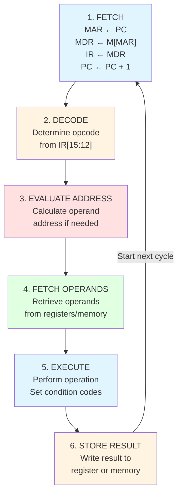
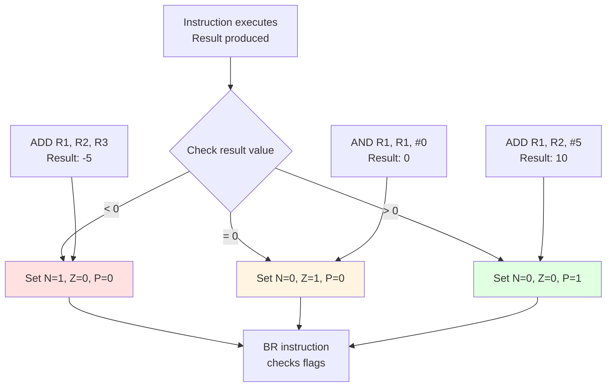
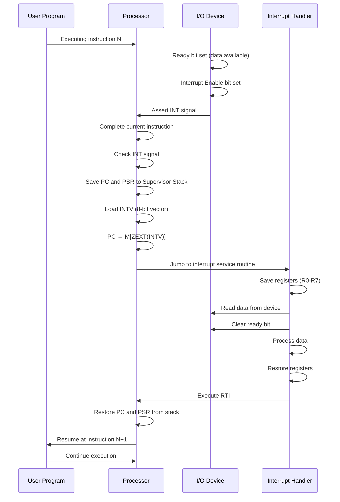
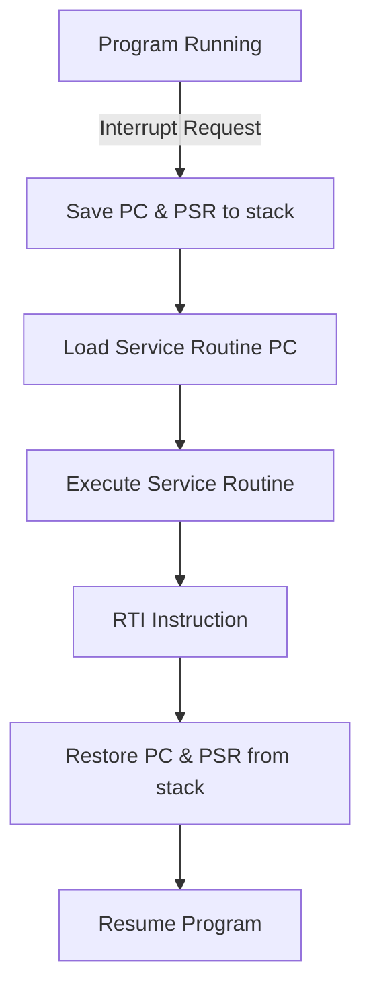
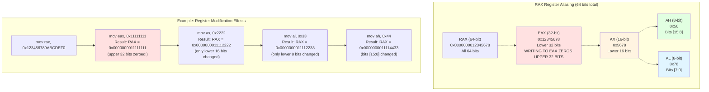
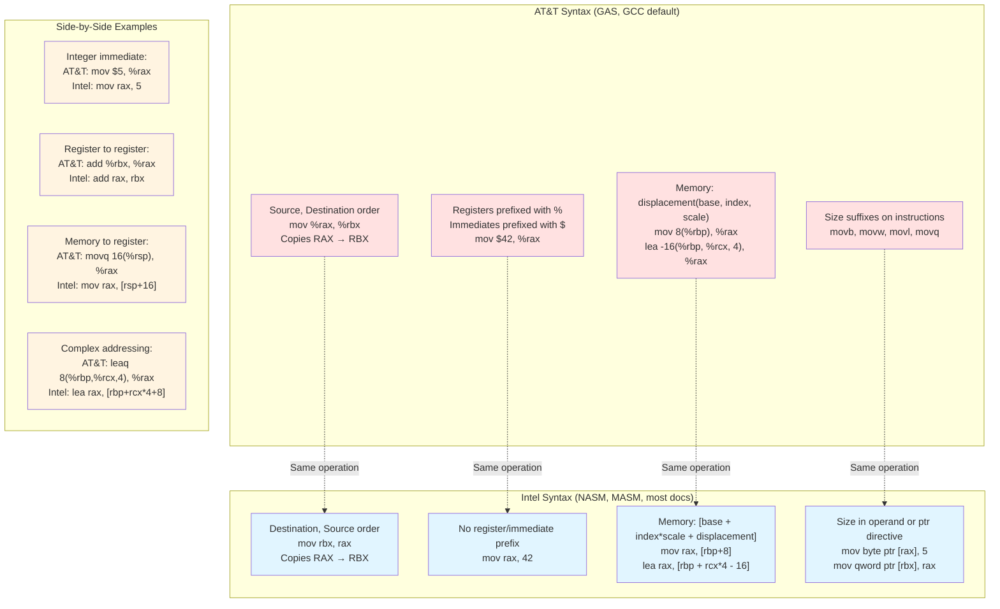
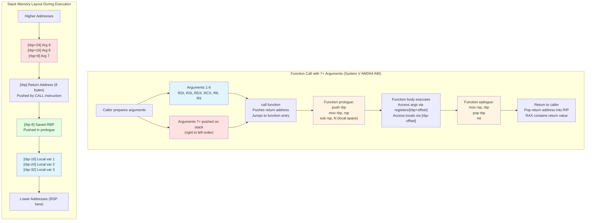
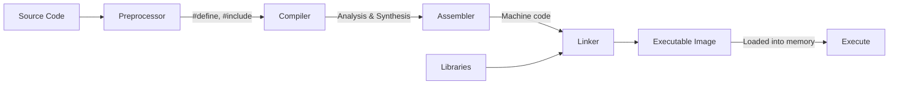

{/* frontmatter removed for clean UI */}

# Assembly Language Notes

## About

This document contains notes on Assembly language programming, covering:
- LC-3 ISA (Instruction Set Architecture)
- x86-64 Assembly (Intel/AMD)
- Instruction formats and addressing modes
- Memory organization
- I/O mechanisms
- Interrupts and system calls

Derived from OCR-extracted handwritten and printed study notes, with focus on low-level computing concepts.

---

## Introduction to Computing Systems

### From High-Level to Machine Language


{/* Diagram showing translation hierarchy */}

**Assembly language** instructions are translated into binary instructions (opcodes) for the machine to execute.

- **Low-level language** instructions → Assembly Translator → Machine language
- **High-level language** source code → Compiler & Interpreters → Machine language

Usually the case that each ISA has only one assembly language. Each assembly language instruction translates into one binary instruction (opcode) for the machine.

Assembly language is one step friendlier to make the programming process more friendly compared to direct machine language programming.

---


{/* OCR correction: "Regulers" → "registers", "pomber" → "pointer" */}

The LC-3 (Little Computer 3) is a simplified Instruction Set Architecture designed for educational purposes, providing a complete, functional ISA with sufficient complexity to illustrate fundamental computer organization principles while remaining simple enough for students to comprehend entirely. An ISA defines the abstract interface between software and hardware: the set of instructions the processor can execute, the storage locations (registers and memory) available to programs, the instruction formats specifying how operations and operands are encoded, and the execution semantics defining what each instruction does. The LC-3 makes specific design choices that balance pedagogical clarity against practical simplicity: a 16-bit word size (smaller than modern 64-bit systems but sufficient for education); 8 general-purpose registers (enough to write non-trivial programs without overwhelming students with register management); a reduced but complete instruction set including arithmetic, logical, data movement, and control flow operations; and a straightforward memory model with uniform addressing. These choices make LC-3 a RISC-style architecture: instructions are uniform length, operations typically involve only registers (with separate load/store instructions for memory access), and instruction encoding is regular and orthogonal.

Understanding the LC-3 ISA means understanding not just the individual instructions but the architectural model: how the program counter determines which instruction executes next; how condition codes enable conditional branching based on previous computation results; how the instruction cycle (fetch, decode, evaluate address, fetch operands, execute, store result) sequences through phases to execute each instruction; and how different addressing modes (immediate, register, PC-relative, indirect, base+offset) provide different ways to specify operand locations. The LC-3's simplicity makes it an ideal vehicle for learning assembly language programming and for understanding the low-level implementation of high-level constructs: loops become conditional branches, function calls become save-return-address-and-jump sequences, arrays become base+offset memory accesses, and pointers become addresses stored in registers. Mastering LC-3 provides a foundation for understanding more complex ISAs like x86-64, where the principles remain the same but the details multiply enormously.

### Registers

**Registers** are small memory storage areas built into the CPU processor.

- **Volatile memory** (like RAM)
- LC-3 ISA has 8 general-purpose registers: **R0 → R7**
- A separate **Program Counter (PC)** which Intel rebranded in x86 ISA as Instruction Pointer (IP)
- The PC points at the next instruction to execute

**Register Width:**
- On x86-32: Registers are 32 bits wide
- On x86-64: Registers are 64 bits wide  
- On LC-3: Registers are 16 bits wide

---

### Instruction Cycle

The **Instruction Cycle** consists of 6 phases:



{/* Diagram reconstructed from OCR text showing instruction cycle */}

1. **FETCH** - Load instruction from memory: `MAR ← [PC]`, `MDR ← M[MAR]`, `IR ← MDR`, `PC ← PC + 1`
2. **DECODE** - Determine opcode from instruction bits
3. **EVALUATE ADDRESS** - Calculate address of operand (if needed)
4. **FETCH OPERANDS** - Retrieve operands from register/memory
5. **EXECUTE** - Perform operation (ADD, AND, NOT, JMP, etc.)
6. **STORE RESULT** - Write result to register or memory

> **Important:** The PC is incremented during the **FETCH** phase, not during EXECUTE. This means when an instruction executes, the PC already points to the next instruction. This is why branch offsets are relative to PC+1, and why JSR saves PC (which already points past the JSR instruction) to R7.

**Note:** The PC is incremented in the fetch phase of each instruction, not during execute.

---

### LC-3 Instruction Format

All LC-3 instructions are **16 bits** wide:

```
┌─────┬──────────────────────────────────┐
│15-12│ 11  10  9  8  7  6  5  4  3  2  1  0│
├─────┼──────────────────────────────────┤
│OP   │      Operand Fields             │
└─────┴──────────────────────────────────┘
```

{/* OCR correction: "Opcode" → "opcode" */}

- **Bits [15:12]:** Opcode (determines instruction type)
- **Bits [11:0]:** Operand fields (register specifiers, immediate values, offsets)

---

### LC-3 Instruction Set Table

{/* Table reconstructed from OCR text */}

| Opcode | Instruction | Format | Description |
|--------|-------------|--------|-------------|
| `0001` | **ADD** | `DR, SR1, SR2` or `DR, SR1, imm5` | Addition |
| `0101` | **AND** | `DR, SR1, SR2` or `DR, SR1, imm5` | Bitwise AND |
| `0000` | **BR** | `nzp, PCoffset9` | Conditional branch |
| `1100` | **JMP** | `BaseR` | Jump to address in register |
| `0100` | **JSR/JSRR** | `PCoffset11` or `BaseR` | Jump to subroutine |
| `0010` | **LD** | `DR, PCoffset9` | Load (PC-relative) |
| `1010` | **LDI** | `DR, PCoffset9` | Load indirect (PC-relative) |
| `0110` | **LDR** | `DR, BaseR, offset6` | Load (base+offset) |
| `1110` | **LEA** | `DR, PCoffset9` | Load effective address |
| `1001` | **NOT** | `DR, SR` | Bitwise NOT (one's complement) |
| `1000` | **RTI** | - | Return from interrupt |
| `0011` | **ST** | `SR, PCoffset9` | Store (PC-relative) |
| `1011` | **STI** | `SR, PCoffset9` | Store indirect (PC-relative) |
| `0111` | **STR** | `SR, BaseR, offset6` | Store (base+offset) |
| `1111` | **TRAP** | `trapvect8` | System call |
| `1101` | **Reserved** | - | Reserved opcode |

---

### ADD Instruction

{/* OCR correction: "Rouler" → "register" */}

**Format 1: Register mode**
```
0001 DR SR1 0 00 SR2
```
- `DR = SR1 + SR2`

**Format 2: Immediate mode**
```
0001 DR SR1 1 imm5
```
- `DR = SR1 + SEXT(imm5)`

**Example:**
```asm
ADD R2, R0, R1    ; R2 ← R0 + R1
ADD R3, R3, #5    ; R3 ← R3 + 5
```

---

### AND Instruction

**Format 1: Register mode**
```
0101 DR SR1 0 00 SR2
```
- `DR = SR1 & SR2`

**Format 2: Immediate mode**
```
0101 DR SR1 1 imm5
```
- `DR = SR1 & SEXT(imm5)`

**Example:**
```asm
AND R5, R5, #0    ; R5 ← 0 (clear register)
AND R3, R3, R2    ; R3 ← R3 & R2
```

---

### NOT Instruction

**Format:**
```
1001 DR SR 1 1 1 1 1 1
```
- `DR = NOT(SR)` (one's complement)

**Example:**
```asm
NOT R0, R0        ; R0 ← ~R0
```

To form 2's complement negative:
```asm
NOT R0, R0        ; One's complement
ADD R0, R0, #1    ; Add 1 to get 2's complement
```

---

### BR (Branch) Instruction

{/* OCR correction: "Condetional" → "conditional" */}

**Format:**
```
0000 n z p PCoffset9
```

- Branch based on condition codes (N, Z, P)
- `PC ← PC + SEXT(PCoffset9)` if condition is met

**Condition Codes:**
- **N (Negative):** Set if result < 0
- **Z (Zero):** Set if result == 0
- **P (Positive):** Set if result > 0



> **Important:** Almost all LC-3 instructions (except LEA, BR, JMP, JSR/JSRR, ST, STI, STR, TRAP) set the condition codes based on the result. This allows subsequent BR instructions to make decisions. Understanding when condition codes are set is crucial for correct branching logic.

**Examples:**
```asm
BRz LABEL         ; Branch if zero (0 0 1)
BRnp LABEL        ; Branch if negative or positive (1 0 1)
BR LABEL          ; Unconditional branch (1 1 1)
```

---

### JMP Instruction

**Format:**
```
1100 0 0 0 BaseR 0 0 0 0 0 0
```

- `PC ← BaseR` (jump to address in register)

**Special Case - RET (Return):**
```
1100 0 0 0 111 0 0 0 0 0 0
```
- `JMP R7` (return from subroutine)
- R7 typically holds the return address

**Example:**
```asm
JMP R3            ; PC ← R3
RET               ; PC ← R7 (return)
```

---

### JSR/JSRR (Jump to Subroutine)

{/* OCR correction: "SubRoudme" → "subroutine" */}

**JSR (PC-relative):**
```
0100 1 PCoffset11
```
- `R7 ← PC` (save return address)
- `PC ← PC + SEXT(PCoffset11)`

**JSRR (Base register):**
```
0100 0 0 0 BaseR 0 0 0 0 0 0
```
- `R7 ← PC` (save return address)
- `PC ← BaseR`

**Example:**
```asm
JSR SUBROUTINE    ; Call subroutine (PC-relative)
JSRR R3           ; Call subroutine (address in R3)
```

---

### Load/Store Instructions

#### LD (Load PC-relative)

**Format:**
```
0010 DR PCoffset9
```
- `DR ← M[PC + SEXT(PCoffset9)]`

#### LDI (Load Indirect)

**Format:**
```
1010 DR PCoffset9
```
- `DR ← M[M[PC + SEXT(PCoffset9)]]`
- Address of address (two memory accesses)

#### LDR (Load Base+Offset)

**Format:**
```
0110 DR BaseR offset6
```
- `DR ← M[BaseR + SEXT(offset6)]`

#### ST (Store PC-relative)

**Format:**
```
0011 SR PCoffset9
```
- `M[PC + SEXT(PCoffset9)] ← SR`

#### STI (Store Indirect)

**Format:**
```
1011 SR PCoffset9
```
- `M[M[PC + SEXT(PCoffset9)]] ← SR`

#### STR (Store Base+Offset)

**Format:**
```
0111 SR BaseR offset6
```
- `M[BaseR + SEXT(offset6)] ← SR`

---

### LEA (Load Effective Address)

**Format:**
```
1110 DR PCoffset9
```

- `DR ← PC + SEXT(PCoffset9)`
- **Does NOT access memory** - only computes address
- **Does NOT affect condition codes**

Useful for initializing a register with an address.

**Example:**
```asm
LEA R2, DATA      ; R2 ← address of DATA
```

---

### Addressing Modes Summary

{/* OCR correction: "addresing" → "addressing" */}

Addressing modes specify how an instruction determines the location (address) of its operands, representing one of the most important ISA design choices because they directly impact code density, execution speed, and programming flexibility. Different addressing modes trade off between instruction encoding complexity, execution speed, and expressive power: immediate addressing (operand is part of instruction) is fast but limits the operand to a small constant; register addressing (operand is in a register) is fast and flexible but requires the value to already be in a register; and various memory addressing modes (PC-relative, indirect, base+offset) provide different mechanisms for computing addresses of memory operands. Understanding addressing modes is essential for reading assembly code because the same opcode with different addressing modes performs conceptually similar operations on operands located differently, and for writing efficient assembly code because choosing the appropriate addressing mode affects both code size and execution speed.

LC-3 supports three main addressing modes:

| Mode | Description | Example |
|------|-------------|---------|
| **Immediate/Literal** | Operand is part of instruction | `ADD R1, R1, #5` |
| **Register** | Operand is in a register | `ADD R1, R2, R3` |
| **Memory** | Operand is in memory | |
| - PC-relative | Address = PC + offset | `LD R1, LABEL` |
| - Indirect | Address at (PC + offset) | `LDI R1, LABEL` |
| - Base+Offset | Address = BaseR + offset | `LDR R1, R2, #10` |

```mermaid
flowchart TD
    subgraph "PC-Relative Addressing"
        PC1["PC = 0x3010"] --> Calc1["Address = PC + SEXT(offset9)<br/>offset9 = 5<br/>Address = 0x3010 + 5 = 0x3015"]
        Calc1 --> Mem1["Load from M[0x3015]"]
    end
    
    subgraph "Indirect Addressing"
        PC2["PC = 0x3010"] --> Calc2["Pointer = PC + SEXT(offset9)<br/>offset9 = 5<br/>Pointer = 0x3015"]
        Calc2 --> Mem2["Address = M[0x3015] = 0x4020"]
        Mem2 --> Final2["Load from M[0x4020]"]
    end
    
    subgraph "Base+Offset Addressing"
        Base["BaseR = 0x4000"] --> Calc3["Address = BaseR + SEXT(offset6)<br/>offset6 = 10<br/>Address = 0x4000 + 10 = 0x400A"]
        Calc3 --> Mem3["Load from M[0x400A]"]
    end
    
    style Calc1 fill:#e1f5ff
    style Calc2 fill:#fff4e1
    style Calc3 fill:#ffe1e1
    style Mem2 fill:#fff4e1
```



> **Important - When to use which addressing mode:**
> - **PC-relative:** Accessing global variables/constants near the code (within ±256 words)
> - **Indirect:** Accessing data through pointers, or data far from code
> - **Base+Offset:** Array/structure access, pointer dereferencing with offset
> - **Immediate:** Small constants (-16 to +15 for imm5)

---

## LC-3 Memory Organization

{/* OCR correction: "momory" → "memory" */}

```
┌──────────────────────┐ 0x0000
│   System Space       │
│   (Privileged)       │
│   - Trap vectors     │
│   - Interrupt vectors│
│   - OS code/data     │
├──────────────────────┤ 0x2FFF (Supervisor Stack)
│                      │
├──────────────────────┤ 0x3000
│   User Space         │
│   (Unprivileged)     │
│   - User code        │
│   - User data        │
│   - User stack       │
├──────────────────────┤ 0xFDFF
│                      │
├──────────────────────┤ 0xFE00
│   I/O Page           │
│   (Memory-mapped I/O)│
│   - Device registers │
└──────────────────────┘ 0xFFFF
```

{/* Memory map diagram reconstructed from OCR text */}

- **System Space (0x0000-0x2FFF):** Privileged memory for OS
- **User Space (0x3000-0xFDFF):** Unprivileged memory for user programs
- **I/O Page (0xFE00-0xFFFF):** Memory-mapped I/O device registers

---

### Trap Vector Table

Located at **0x0000-0x00FF** (256 entries):

| Address | Trap Vector | Service Routine | Description |
|---------|-------------|-----------------|-------------|
| 0x0020 | `x20` | GETC | Read character from keyboard |
| 0x0021 | `x21` | OUT | Output character to monitor |
| 0x0022 | `x22` | PUTS | Output string to monitor |
| 0x0023 | `x23` | IN | Input character with prompt |
| 0x0025 | `x25` | HALT | Halt the program |

{/* Table reconstructed from OCR text */}

**Example:**
```asm
TRAP x23          ; Input character (IN)
TRAP x21          ; Output character (OUT)
TRAP x25          ; Halt program (HALT)
```

---

## Sign Extension (SEXT) and Zero Extension (ZEXT)

{/* OCR correction: "SEX7" → "SEXT", "exlord" → "extend" */}

**Sign extension** is performed to operate on representations of different lengths.

- The value of a positive number does not change if we zero-extend by filling vacated bit positions to the left with 0
- The value of a negative number does not change if we sign-extend by filling vacated bit positions to the left with the sign bit (1)

**SEXT:** Extends a smaller signed value to a larger width by copying the sign bit
- Example: `SEXT(imm5)` → 16 bits

**ZEXT:** Extends by filling with zeros
- Example: `ZEXT(trapvect8)` → 16 bits

---

## I/O and Memory-Mapped Registers

{/* OCR correction: "Input Output" → "I/O" */}

### Keyboard Registers

**KBSR (Keyboard Status Register) - Address: 0xFE00**

```
┌──┬──┬──────────────────┐
│15│14│  13-0 (unused)   │
├──┼──┼──────────────────┤
│RD│IE│      0x00        │
└──┴──┴──────────────────┘
```

- **Bit [15] (Ready):** Set to 1 when a key is struck
- **Bit [14] (Interrupt Enable):** If set, keyboard can interrupt

**KBDR (Keyboard Data Register) - Address: 0xFE02**

```
┌──────────┬─────────────┐
│  15-8    │    7-0      │
├──────────┼─────────────┤
│  0x00    │  ASCII code │
└──────────┴─────────────┘
```

- **Bits [7:0]:** ASCII code of the character typed

---

### Display Registers

**DSR (Display Status Register) - Address: 0xFE04**

```
┌──┬──┬──────────────────┐
│15│14│  13-0 (unused)   │
├──┼──┼──────────────────┤
│RD│IE│      0x00        │
└──┴──┴──────────────────┘
```

- **Bit [15] (Ready):** Set to 1 when display is ready for next character
- **Bit [14] (Interrupt Enable):** If set, display can interrupt

**DDR (Display Data Register) - Address: 0xFE06**

```
┌──────────┬─────────────┐
│  15-8    │    7-0      │
├──────────┼─────────────┤
│  0x00    │  ASCII code │
└──────────┴─────────────┘
```

- **Bits [7:0]:** ASCII code of character to display

---

### Basic Input Routine (Polling)

```asm
START   LDI   R1, KBSR      ; Load keyboard status
        BRzp  START          ; Loop until ready bit set
        LDI   R0, KBDR       ; Load character from keyboard
        ; Process character in R0
        BRnzp NEXT_TASK

KBSR    .FILL xFE00
KBDR    .FILL xFE02
```

{/* Code block reconstructed from OCR text */}

---

### Basic Output Routine (Polling)

```asm
START   LDI   R1, DSR       ; Load display status
        BRzp  START          ; Loop until ready bit set
        STI   R0, DDR        ; Store character to display
        BRnzp NEXT_TASK

DSR     .FILL xFE04
DDR     .FILL xFE06
```

---

### Echo Input/Output Routine

```asm
START   LDI   R1, KBSR      ; Test keyboard ready
        BRzp  START          ; Wait until ready
        LDI   R0, KBDR       ; Load character

ECHO    LDI   R1, DSR       ; Test display ready
        BRzp  ECHO           ; Wait until ready
        STI   R0, DDR        ; Output character
        
        BRnzp START          ; Repeat

KBSR    .FILL xFE00
KBDR    .FILL xFE02
DSR     .FILL xFE04
DDR     .FILL xFE06
```

---

## Interrupts

{/* OCR correction: "Intoment" → "interrupt" */}

Interrupts represent a fundamental architectural mechanism that enables asynchronous event handling by allowing external devices or internal conditions to temporarily suspend normal program execution, force the processor to execute a handler routine for the event, and then resume the interrupted program as if nothing had happened. The need for interrupts arises from the fundamental mismatch between processor speed and I/O device speed: a processor executing billions of instructions per second cannot afford to repeatedly test (poll) whether a device that operates at human timescales (keyboard, disk, network) is ready without wasting enormous amounts of computation. Interrupts invert the control relationship: instead of the processor asking the device "are you ready?" in a tight loop, the device signals the processor "I have data" when an event occurs. This enables efficient I/O by allowing the processor to perform useful work while waiting for slow devices, with the interrupt mechanism guaranteeing immediate response when the device requires attention.

The interrupt mechanism introduces complexity absent in purely sequential execution: the interrupted program's complete state (program counter, processor status register, working registers) must be preserved when the interrupt handler begins execution and restored when it completes, ensuring that the interruption is transparent to the interrupted code. This context switch has overhead (saving and restoring state takes time), but for infrequent events or slow devices, the overhead is negligible compared to the waste of polling. The trade-off between polling and interrupts depends on event frequency and processing requirements: for extremely frequent events or when the event processing time is shorter than the context switch overhead, polling may be more efficient; for infrequent events or when the processor has other work to perform, interrupts are superior. Understanding interrupts requires understanding the concept of priority levels: when multiple interrupt sources exist, the system must determine which interrupts can preempt which handlers, typically through a priority scheme where higher-priority interrupts can interrupt lower-priority handlers but not vice versa. This priority mechanism prevents low-priority events from delaying time-critical responses but introduces the possibility of priority inversion problems if not carefully managed.

### Interrupt Mechanism

**Polling** requires the processor to spend time testing the ready bit repeatedly until it is set. With **interrupt-driven I/O**, the I/O device can force the running program to stop and have the processor execute a program that services the I/O device, then have the stopped program resume execution as if nothing happened.

**Requirements for Interrupt:**
1. I/O device must want service (ready bit is set)
2. I/O device must have the right to request service (interrupt enable bit [14] set)
3. I/O device must have higher urgency (priority) than what the processor is currently doing

**Interrupt Signal:**
```
INT = Ready_bit [15] AND Interrupt_Enable [14]
```

If both bits are set, the device asserts its interrupt request signal.



> **Important - Interrupt vs Polling Trade-offs:**
> - **Polling advantages:** Simple to implement, predictable timing, no context switch overhead
> - **Polling disadvantages:** Wastes CPU cycles checking status, cannot do other work while waiting
> - **Interrupt advantages:** CPU free to do other work, immediate response when device ready, efficient for infrequent events
> - **Interrupt disadvantages:** Complex to implement, overhead of context switch (save/restore state), priority management needed
> - **When to use:** Polling for fast devices or when response time is critical; interrupts for slow devices or when multitasking

---

### Interrupt Vector Table

Located at **0x0100-0x01FF** (256 entries):

Each entry contains the **starting address** of an interrupt service routine.

**Process:**
1. I/O device provides 8-bit interrupt vector
2. Processor zero-extends to form 16-bit address into table
3. Table entry contains starting address of service routine
4. Processor saves PC and PSR on supervisor stack
5. Loads PC with service routine address
6. Executes service routine
7. RTI instruction restores PC and PSR
8. Execution resumes at interrupted program

---

### Interrupt Handling Sequence



{/* Diagram reconstructed from interrupt handling OCR text */}

---

### PSR (Process Status Register)

```
┌──┬──────┬──────────────┬─────┐
│15│14-11 │   10-8       │ 2-0 │
├──┼──────┼──────────────┼─────┤
│P │ 0000 │ Priority     │ NZP │
└──┴──────┴──────────────┴─────┘
```

- **Bit [15] (Privilege):** 0 = Supervisor mode, 1 = User mode
- **Bits [10:8] (Priority):** Priority level (PL0-PL7)
- **Bits [2:0] (Condition Codes):** N (negative), Z (zero), P (positive)

---

## Stack Operations

{/* OCR correction: "LIFO" → "LIFO" (Last In First Out preserved) */}

The stack is a Last-In-First-Out (LIFO) data structure implemented in a designated region of memory using a stack pointer register (R6 in LC-3, RSP in x86-64) that tracks the current top of the stack. Stack operations enable two essential capabilities: temporary storage of register values when a program needs to use registers for a new purpose but must preserve their current contents (particularly important across subroutine calls), and implementation of the subroutine calling mechanism where return addresses, parameters, and local variables are managed through push and pop operations. The stack grows toward lower addresses by convention in most architectures: pushing a value decrements the stack pointer then writes the value; popping a value reads the value then increments the stack pointer. This grow-downward convention is arbitrary but must be consistently followed within an architecture to ensure correct operation.

### Stack Pointer

- **R6** is typically used as the stack pointer
- **Supervisor Stack Pointer (SSP)** - for privileged mode
- **User Stack Pointer (USP)** - for user mode
- Stack grows toward address 0x0000 (toward lower addresses)

### PUSH Operation

```asm
ADD  R6, R6, #-1     ; Decrement stack pointer
STR  R0, R6, #0      ; Store value onto stack
```

### POP Operation

```asm
LDR  R0, R6, #0      ; Load value from stack
ADD  R6, R6, #1      ; Increment stack pointer
```

---

## Subroutines and the Call/Return Mechanism

{/* OCR correction: "SubRoutme" → "subroutine" */}

Subroutines (also called functions, procedures, or methods in higher-level languages) provide the fundamental mechanism for code reuse and program organization by allowing a sequence of instructions to be written once and invoked from multiple locations, with execution automatically returning to the instruction following the call. Implementing subroutines requires solving the return address problem: when a subroutine finishes execution, how does the processor know where to resume execution in the calling code? Different architectures adopt different solutions: LC-3 stores the return address in register R7 when JSR/JSRR executes, making subroutine calls fast (no memory access) but requiring the subroutine to save R7 if it makes nested calls; x86-64 pushes the return address onto the stack when call executes, making nested calls automatic but requiring stack manipulation overhead. Understanding the subroutine mechanism requires understanding both the call/return instruction pair and the conventions (caller-save vs callee-save registers, parameter passing, return value communication) that enable subroutines to interact correctly with calling code.

**JSR/JSRR** - Implements the call mechanism:
1. Saves return address in R7: `R7 ← PC`
2. Loads PC with subroutine address

**RET** - Implements the return mechanism:
```asm
RET               ; Same as JMP R7
```
- Loads PC with return address from R7

**Callee-Save vs Caller-Save:**
- **Caller-Save:** Calling program saves registers before call
- **Callee-Save:** Called subroutine saves registers it will modify

---

## LC-3 Assembly Directives

{/* OCR correction: "Pseudo-OP" → "Pseudo-op" */}

**Pseudo-ops** (assembler directives) are messages to the assembler, not actual instructions.

| Directive | Purpose | Example |
|-----------|---------|---------|
| `.ORIG` | Set starting address | `.ORIG x3000` |
| `.FILL` | Initialize memory location | `.FILL x0021` |
| `.BLKW` | Reserve block of words | `.BLKW 10` |
| `.STRINGZ` | Initialize string with null terminator | `.STRINGZ "Hello"` |
| `.END` | Mark end of program | `.END` |

**Example Program:**

```asm
        .ORIG x3000
        
        LEA  R0, MSG        ; Load address of message
        TRAP x22            ; Output string (PUTS)
        TRAP x25            ; Halt
        
MSG     .STRINGZ "Hello, World!\n"
        
        .END
```

---

## x86-64 Assembly

{/* OCR correction: "Intel AMD64" → "Intel/AMD x86-64" */}

The x86-64 architecture (also known as AMD64 or Intel 64) represents the 64-bit extension of the x86 ISA that has dominated personal computing and server markets since its introduction in 2003, combining backward compatibility with decades of x86 evolution while providing the expanded address space and register set required for modern computing workloads. Unlike LC-3's pedagogical simplicity, x86-64 is a production ISA shaped by decades of incremental enhancement, market pressure, and the constraint of maintaining backward compatibility with 16-bit 8086 code from 1978. This heritage produces an architecture of considerably greater complexity: variable-length instructions ranging from 1 to 15 bytes (compared to LC-3's uniform 16-bit instructions), a rich set of addressing modes including complex memory operand specifications, multiple instruction prefixes modifying instruction behavior, and a massive instruction set reflecting decades of feature accumulation. Where LC-3 exemplifies RISC philosophy (simple, uniform, orthogonal), x86-64 exemplifies CISC philosophy (complex, feature-rich, irregular), with memory operands directly usable in arithmetic instructions and specialized instructions for specific operations.

**LC-3 vs x86-64 Architectural Comparison:**

| Feature | LC-3 | x86-64 |
|---------|------|--------|
| **Word Size** | 16 bits | 64 bits (with 32/16/8-bit subsets) |
| **General-Purpose Registers** | 8 registers (R0-R7) | 16 registers (RAX, RBX, RCX, RDX, RSI, RDI, RBP, RSP, R8-R15) |
| **Instruction Length** | Fixed 16 bits | Variable 1-15 bytes |
| **Addressing Modes** | PC-relative, indirect, base+offset, immediate, register | Direct, indirect, base+index*scale+displacement, RIP-relative, immediate, register |
| **Instruction Set Philosophy** | RISC-style: simple, uniform | CISC-style: complex, feature-rich |
| **Memory Access** | Separate load/store instructions | Memory operands allowed in arithmetic instructions |
| **Condition Codes** | 3 bits (N, Z, P) set by most instructions | Multiple flags (CF, ZF, SF, OF, PF, etc.) in RFLAGS register |
| **Stack Pointer** | R6 (convention, not enforced) | RSP (architecturally defined) |
| **Function Call Mechanism** | JSR/RET (saves PC to R7) | call/ret (uses stack for return addresses) |
| **Privilege Levels** | 2 levels (supervisor/user via PSR[15]) | 4 rings (Ring 0-3, typically only 0 and 3 used) |

Despite these differences, the fundamental concepts remain constant: programs are sequences of instructions executed by the processor; instructions operate on registers and memory; control flow is managed through conditional/unconditional branches; subroutines are called by saving return addresses and jumping; and I/O occurs through memory-mapped registers or specialized instructions. Transitioning from LC-3 to x86-64 means applying familiar concepts within a vastly more complex architectural context, where the principles you've learned remain valid but the details require careful attention to the x86-64's specific encoding rules, register conventions, and calling conventions.

### General-Purpose Registers (64-bit)

| 64-bit | 32-bit | 16-bit | 8-bit (high/low) | Purpose |
|--------|--------|--------|------------------|------|
| RAX | EAX | AX | AH/AL | Accumulator (return values) |
| RBX | EBX | BX | BH/BL | Base register |
| RCX | ECX | CX | CH/CL | Counter (loop operations) |
| RDX | EDX | DX | DH/DL | Data (I/O operations) |
| RSI | ESI | SI | SIL | Source index (string ops) |



> **Important - Register Aliasing Pitfall:**
> Writing to a 32-bit register (EAX, EBX, etc.) **zeros the upper 32 bits** of the corresponding 64-bit register. This is different from 16-bit and 8-bit operations, which only modify their respective bits without affecting other parts of the register. This behavior is a deliberate design choice in x86-64 to avoid false dependencies in out-of-order execution.

{/* Table reconstructed from OCR text */}

---
| RAX | EAX | AX | AH/AL | Accumulator (return values) |
| RBX | EBX | BX | BH/BL | Base register |
| RCX | ECX | CX | CH/CL | Counter (loop operations) |
| RDX | EDX | DX | DH/DL | Data (I/O operations) |
| RSI | ESI | SI | SIL | Source index (string ops) |
| RDI | EDI | DI | DIL | Destination index (string ops) |
| RBP | EBP | BP | BPL | Base pointer (stack frame) |
| RSP | ESP | SP | SPL | Stack pointer |
| R8-R15 | R8D-R15D | R8W-R15W | R8B-R15B | General purpose |

{/* Table reconstructed from OCR text */}

---

### Special Registers

- **RIP (Instruction Pointer):** Points to next instruction
- **RFLAGS:** Status flags (CF, ZF, SF, OF, etc.)

**Common Flags:**
- **CF (Carry Flag):** Set on unsigned overflow
- **ZF (Zero Flag):** Set if result is zero
- **SF (Sign Flag):** Set equal to most significant bit (sign bit)
- **OF (Overflow Flag):** Set on signed overflow

---

### Calling Conventions (System V AMD64 ABI)

**Function Arguments (in order):**
1. RDI (1st argument)
2. RSI (2nd argument)
3. RDX (3rd argument)
4. RCX (4th argument)
5. R8 (5th argument)
6. R9 (6th argument)
7. Stack (additional arguments)

**Return Value:** RAX

**System Call Arguments:**
- System call number: RAX
- Arguments: RDI, RSI, RDX, RCX, R8, R9

**Caller-saved:** RAX, RDI, RSI, RDX, RCX, R8-R11
**Callee-saved:** RBX, RBP, RSP, R12-R15

---

### AT&T vs Intel Syntax

{/* OCR correction: "Syntane" → "syntax" */}



**Intel Syntax:**
```asm
mov  rax, 2         ; destination, source
add  rax, 3         ; destination, immediate
```

**AT&T Syntax:**
```asm
mov  $2, %rax       ; source, destination
add  $3, %rax       ; immediate, destination
```

**Key Differences:**
- Intel: `destination, source`
- AT&T: `source, destination`
- AT&T uses `%` prefix for registers and `$` for immediates

> **Important - Syntax Choice:**
> - **AT&T syntax:** Default for GCC/GAS on Linux/Unix, used in inline assembly in C code
> - **Intel syntax:** Used in Windows development (MASM), most documentation/tutorials, matches Intel manuals
> - **In GAS, enable Intel syntax with:** `.intel_syntax noprefix` directive
> - **Biggest pitfall:** Operand order reversal (AT&T `add %rbx, %rax` means `rax += rbx`, Intel `add rax, rbx` means same)
> - **Mixing syntaxes causes confusion** – pick one and stay consistent within a project

---

### Common x86-64 Instructions

#### MOV - Move Data

```asm
mov  rax, rbx       ; Register to register
mov  rax, [rbx]     ; Memory to register
mov  [rbx], rax     ; Register to memory
mov  rax, 42        ; Immediate to register
```

**Note:** No memory-to-memory moves allowed.

---

#### Arithmetic Instructions

```asm
add  rax, rbx       ; rax ← rax + rbx
sub  rax, rbx       ; rax ← rax - rbx
imul rax, rbx       ; rax ← rax * rbx (signed)
mul  rbx            ; RDX:RAX ← RAX * rbx (unsigned)
```

{/* OCR correction: "Anlhmetic" → "arithmetic" */}

---

#### Logical Instructions

```asm
and  rax, rbx       ; rax ← rax & rbx
or   rax, rbx       ; rax ← rax | rbx
xor  rax, rbx       ; rax ← rax ^ rbx
not  rax            ; rax ← ~rax
```

---

#### Shift Instructions

```asm
shl  rax, 2         ; Shift left (multiply by 4)
shr  rax, 2         ; Shift right (divide by 4, unsigned)
sal  rax, 2         ; Shift arithmetic left
sar  rax, 2         ; Shift arithmetic right (preserves sign)
```

---

#### Comparison and Conditional Jumps

```asm
cmp  rax, rbx       ; Compare (sets flags based on rax - rbx)
test rax, rax       ; Bitwise AND (sets flags, doesn't store)

je   label          ; Jump if equal (ZF=1)
jne  label          ; Jump if not equal (ZF=0)
jg   label          ; Jump if greater (signed)
jl   label          ; Jump if less (signed)
ja   label          ; Jump if above (unsigned)
jb   label          ; Jump if below (unsigned)
```

---

#### Stack Operations

```asm
push rax            ; Decrement RSP, store RAX
pop  rax            ; Load RAX, increment RSP
```

**Note:** In 64-bit mode, push/pop work with 64-bit values (8 bytes).

---

#### Subroutine Calls

```asm
call function       ; Push return address, jump to function
ret                 ; Pop return address, jump to it
```

---

### LEA (Load Effective Address)

{/* OCR correction: "Loa" → "LEA" */}

**Special instruction** that computes an address but does NOT access memory.

```asm
lea  rax, [rbx + rcx*4 + 5]
```

This computes `rbx + rcx*4 + 5` and stores the result in RAX (not the value at that address).

**Uses:**
- Pointer arithmetic
- Fast arithmetic (e.g., `lea rax, [rax + rax*2]` computes `rax * 3`)

---

### Memory Addressing Modes

{/* OCR correction: "Addressmy" → "addressing" */}

**Syntax:** `[base + index*scale + displacement]`

- **Base:** Any general-purpose register
- **Index:** Any general-purpose register (except RSP)
- **Scale:** 1, 2, 4, or 8
- **Displacement:** Signed 8/16/32-bit offset

**Examples:**
```asm
mov  rax, [rbx]                 ; Base only
mov  rax, [rbx + 10]            ; Base + displacement
mov  rax, [rbx + rcx*4]         ; Base + index*scale
mov  rax, [rbx + rcx*4 + 10]    ; All components
```

---

### Example: printf and scanf in x86-64

{/* OCR correction: "prmlf" → "printf", "scomf" → "scanf" */}

**printf Example:**

```asm
section .data
    format db "Enter a number: ", 0
    output db "You entered: %d", 10, 0

section .text
    global main
    extern printf, scanf

main:
    ; Print prompt
    mov  rdi, format        ; 1st argument (format string)
    xor  eax, eax           ; No floating-point args
    call printf
    
    ; Read integer
    lea  rsi, [rsp - 4]     ; 2nd argument (address for input)
    mov  rdi, fmt_input     ; 1st argument (format string)
    xor  eax, eax
    call scanf
    
    ; Print result
    mov  esi, [rsp - 4]     ; 2nd argument (value read)
    mov  rdi, output        ; 1st argument (format string)
    xor  eax, eax
    call printf
    
    ret

section .data
    fmt_input db "%d", 0
```

{/* Code example reconstructed from OCR text */}

---

## Run-Time Stack and Calling Conventions

{/* OCR correction: "Qun-time" → "run-time" */}

### Stack Frame Structure

```
┌─────────────────────────┐  ← Lower addresses
│   Local Variables       │
├─────────────────────────┤
│   Saved Registers       │
├─────────────────────────┤  ← RBP (Frame Pointer)
│   Return Address        │  (pushed by call)
├─────────────────────────┤
│   Caller's RBP          │  (pushed by callee)
├─────────────────────────┤
│   Function Parameters   │  (7th onward, if needed)
├─────────────────────────┤
│   Return Value Space    │
├─────────────────────────┤  ← RSP (Stack Pointer)
│   ...                   │
└─────────────────────────┘  ← Higher addresses
```

{/* Stack frame diagram reconstructed from OCR text */}



> **Important - x86-64 Calling Convention (System V ABI):**
> - **Arguments 1-6:** Passed in RDI, RSI, RDX, RCX, R8, R9 (integer/pointer)
> - **Arguments 7+:** Pushed on stack in **reverse order** (rightmost first)
> - **Return value:** RAX (integer/pointer), XMM0 (floating-point)
> - **Caller-saved:** RAX, RCX, RDX, RSI, RDI, R8-R11 (caller must save before call if needed after)
> - **Callee-saved:** RBX, RBP, R12-R15 (callee must preserve and restore)
> - **Stack alignment:** Must be 16-byte aligned **before** CALL (CALL pushes 8-byte return address)
> - **Red zone:** 128 bytes below RSP reserved for leaf functions (no calls)
> - **Violating calling conventions causes crashes** – always follow ABI when interfacing with C/C++

---

### Function Prologue and Epilogue

**Prologue:**
```asm
push rbp              ; Save caller's frame pointer
mov  rbp, rsp         ; Set up new frame pointer
sub  rsp, N           ; Allocate space for local variables
```

**Epilogue:**
```asm
mov  rsp, rbp         ; Restore stack pointer
pop  rbp              ; Restore caller's frame pointer
ret                   ; Return to caller
```

---

## System Calls in x86-64 Linux

{/* OCR correction: "Syscoll" → "syscall" */}

**System call number in RAX:**

| RAX | System Call | Description |
|-----|-------------|-------------|
| 0 | sys_read | Read from file descriptor |
| 1 | sys_write | Write to file descriptor |
| 2 | sys_open | Open file |
| 3 | sys_close | Close file |
| 60 | sys_exit | Exit program |

**Arguments:** RDI, RSI, RDX, RCX, R8, R9

**Example: Exit program**
```asm
mov  rax, 60          ; sys_exit
mov  rdi, 0           ; exit code 0
syscall
```

**Example: Write to stdout**
```asm
mov  rax, 1           ; sys_write
mov  rdi, 1           ; stdout
mov  rsi, message     ; buffer address
mov  rdx, msg_len     ; buffer length
syscall
```

---

## Number System Conversions

{/* OCR correction: "Bromry" → "binary" */}

| Decimal | Binary | Octal | Hexadecimal |
|---------|--------|-------|-------------|
| 0 | 0000 | 0 | 0 |
| 1 | 0001 | 1 | 1 |
| 2 | 0010 | 2 | 2 |
| 3 | 0011 | 3 | 3 |
| 4 | 0100 | 4 | 4 |
| 5 | 0101 | 5 | 5 |
| 6 | 0110 | 6 | 6 |
| 7 | 0111 | 7 | 7 |
| 8 | 1000 | 10 | 8 |
| 9 | 1001 | 11 | 9 |
| 10 | 1010 | 12 | A |
| 11 | 1011 | 13 | B |
| 12 | 1100 | 14 | C |
| 13 | 1101 | 15 | D |
| 14 | 1110 | 16 | E |
| 15 | 1111 | 17 | F |

---

## Additional Topics

### Two's Complement Representation

To represent negative numbers in binary:

1. **One's complement:** Flip all bits
2. **Two's complement:** Add 1 to one's complement

**Example:** -5 in 8-bit
```
5 =      00000101
~5 =     11111010  (one's complement)
-5 =     11111011  (two's complement, add 1)
```

---

### Sign Extension vs Zero Extension

{/* OCR correction: "exlord" → "extend" */}

**SEXT (Sign Extension):**
- Extends a signed value by copying the sign bit
- Example: `10110` (8-bit) → `11111111 10110` (16-bit)

**ZEXT (Zero Extension):**
- Extends an unsigned value by filling with zeros
- Example: `10110` (8-bit) → `00000000 10110` (16-bit)

---

### MOVSX and MOVZX (x86-64)

```asm
movsx rax, byte [rbx]   ; Sign-extend byte to 64-bit
movzx rax, byte [rbx]   ; Zero-extend byte to 64-bit
movsxd rax, dword [rbx] ; Sign-extend dword to 64-bit
```

---

## Debugging and Testing

{/* OCR correction: "Debugging" → "debugging" */}

### Black Box vs White Box Testing

- **Black Box:** Testing without knowledge of internal implementation
- **White Box:** Testing with full knowledge of internal structure

### Types of Errors

1. **Syntactic Errors:** Caught by assembler (incorrect mnemonics, operands)
2. **Semantic Errors:** Logic errors (wrong register, incorrect offset)
3. **Algorithmic Errors:** Incorrect algorithm design
4. **Specification Errors:** Misunderstanding of requirements

---

## Compilation Pipeline



{/* Compilation pipeline diagram */}

1. **Preprocessor:** Processes directives (#include, #define)
2. **Compiler:** Translates high-level code to assembly
3. **Assembler:** Translates assembly to machine code (object file)
4. **Linker:** Combines object files and libraries into executable
5. **Loader:** Loads executable into memory for execution

---

*End of Assembly Language Notes*
