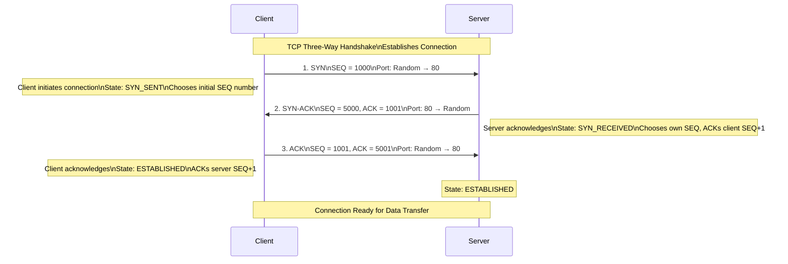

A NETWORK is two or more computers or devices that are linked in order to share information. Networks are broken into different subsets based on their size and function. The OSI (Open Systems Interconnection) model provides a conceptual framework for understanding network functions.

The OSI Model was developed in the 1970s and 1980s, and it is a conceptual model that breaks networking into seven separate layers. Each layer refers to a set of functions that are responsible for specific tasks. In the OSI model, the definition of the application layer is narrower in scope. The OSI model defines the application layer as only the interface responsible for communicating with host-based and user-facing applications. OSI then explicitly distinguishes the functionality of two additional layers, the session layer and presentation layer, as separate levels below the application layer and above the transport layer. OSI specifies a strict modular separation of functionality at these layers and provides protocol implementations for each. In contrast, the Internet Protocol Suite compiles these functions into a single layer.

<Callout title="Key Concept" tone="info">
The processes of encapsulation and de-encapsulation work in exactly the same way with the TCP/IP model as they do with the OSI model. At each layer of these models a header is added during data encapsulation, and removed during data de-encapsulation.
</Callout>

## OSI Model - 7 Layers with Data Encapsulation

```mermaid
graph TB
    subgraph Sender["Sender: Data Encapsulation ⬇"]
        L7S["Layer 7: Application\nHTTP, FTP, DNS, SMTP\nUser data"]
        L6S["Layer 6: Presentation\nEncryption, Compression\nSSL/TLS, JPEG"]
        L5S["Layer 5: Session\nSession management\nNetBIOS, RPC"]
        L4S["Layer 4: Transport\nTCP/UDP Headers\nSegments/Datagrams\nPort numbers"]
        L3S["Layer 3: Network\nIP Header\nPackets\nSource/Dest IP addresses"]
        L2S["Layer 2: Data Link\nMAC Header + Trailer\nFrames\nSource/Dest MAC addresses"]
        L1S["Layer 1: Physical\nBits\nElectrical signals, cables\n1s and 0s"]
    end

    Medium["Transmission Medium\nEthernet, WiFi, Fiber"]

    subgraph Receiver["Receiver: Data De-encapsulation ⬆"]
        L1R["Layer 1: Physical\nBits received\nConvert signals to data"]
        L2R["Layer 2: Data Link\nRemove MAC Header/Trailer\nCheck frame integrity"]
        L3R["Layer 3: Network\nRemove IP Header\nRoute to correct host"]
        L4R["Layer 4: Transport\nRemove TCP/UDP Header\nReassemble segments"]
        L5R["Layer 5: Session\nManage session state"]
        L6R["Layer 6: Presentation\nDecrypt, Decompress"]
        L7R["Layer 7: Application\nDeliver to application\nUser sees data"]
    end

    L7S -->|Add headers| L6S
    L6S -->|Add headers| L5S
    L5S -->|Add headers| L4S
    L4S -->|Add TCP/UDP header| L3S
    L3S -->|Add IP header| L2S
    L2S -->|Add MAC header/trailer| L1S
    L1S -->|Transmit bits| Medium

    Medium -->|Receive bits| L1R
    L1R -->|Remove physical encoding| L2R
    L2R -->|Strip MAC header/trailer| L3R
    L3R -->|Strip IP header| L4R
    L4R -->|Strip TCP/UDP header| L5R
    L5R -->|Session data| L6R
    L6R -->|Decoded data| L7R

    PDU1["PDU at each layer:\nL7-L5: Data\nL4: Segment/Datagram\nL3: Packet\nL2: Frame\nL1: Bits"]

    style L7S fill:#E74C3C,color:#fff
    style L6S fill:#E67E22,color:#fff
    style L5S fill:#F39C12,color:#fff
    style L4S fill:#F1C40F,color:#000
    style L3S fill:#2ECC71,color:#fff
    style L2S fill:#3498DB,color:#fff
    style L1S fill:#9B59B6,color:#fff
    style L7R fill:#E74C3C,color:#fff
    style L6R fill:#E67E22,color:#fff
    style L5R fill:#F39C12,color:#fff
    style L4R fill:#F1C40F,color:#000
    style L3R fill:#2ECC71,color:#fff
    style L2R fill:#3498DB,color:#fff
    style L1R fill:#9B59B6,color:#fff
    style Medium fill:#34495E,color:#fff
    style PDU1 fill:#FFF9C4,stroke:#F39C12
```

*Figure: OSI Model showing data encapsulation (adding headers at each layer) on the sender side and de-encapsulation (removing headers) on the receiver side. Each layer has a specific Protocol Data Unit (PDU) name.*

## Layer 1: Physical Layer

The Physical, and lowest layer of the model, covers how unstructured data, like bits, is transmitted. Over these wires and signals, the raw data bits are received as a stream of 0s and 1s. Fixing errors that occur just at this layer means considering physical damage or interference. Some concrete examples of this are the ways wires are configured, the way signals are transferred over those wires, and the radio frequencies computers use. Technology such as WiFi, Bluetooth, and cable standards such as CAT5 and CAT6 all operate at this layer. This layer also includes the hardware part of modems, adapters, and repeaters.

**Function:** Defines the means of transmitting raw bits over a physical data link connecting network nodes. It deals with hardware, cabling, and communication specifications.

**Key Aspects:**
- Translates bits into physical signals (electrical, light, radio)
- Specifies electrical signals, physical connections, cabling types, and pin-outs
- Governs hardware specifications (e.g., RJ-45, fiber optic connectors, radio frequencies)
- **Media Types:** Cat-5, Cat-6, Fiber Optic, Radio Waves, Infrared, Copper
- **Units:** Bits
- **Protocols/Standards:** Ethernet Physical Layer, USB, DSL, ISDN, Bluetooth

**Devices:** Hubs (obsolete), repeaters, network interface cards (NICs), modems, transceivers

## Layer 2: Data Link Layer

The Data Link layer covers how data is sent from device to device when they are connected on the same local network.

**Function:** Provides reliable data transfer between adjacent network nodes. It handles physical addressing (MAC addresses), error detection (and sometimes correction), and defines how devices access the physical medium (e.g., CSMA/CD for Ethernet, CSMA/CA for Wi-Fi). It creates **frames**.

**Components:**
- **Switches:** Modern Layer 2 devices that forward frames based on MAC addresses. They create **separate collision domains** for each port, improving performance significantly over hubs
- **Network Interface Cards (NICs):** Process MAC addresses and frames
- **Wireless Access Points (APs):** At Layer 2, they bridge wireless clients to the wired network

**Performance Impact:**
- **Switching Speed/Throughput:** High-performance switches can forward frames at wire speed, preventing bottlenecks
- **VLANs:** Properly configured VLANs segment broadcast domains, reducing broadcast traffic and improving network efficiency and security
- **Spanning Tree Protocol (STP):** Prevents Layer 2 loops but can block redundant paths, impacting potential bandwidth if not managed
- **MAC Address Table Size:** Affects how many devices a switch can learn and manage

## Layer 3: Network Layer

The Network layer describes how data packets are routed between wider networks such as the Internet. Data packet at the network layer is routed from a source IP address to a destination IP address via Domain Name System.

**Function:** Handles logical addressing (IP addresses), routing of packets across different networks (inter-network communication), and path determination. It creates **packets**.

**Components:**
- **Routers:** Dedicated Layer 3 devices that make forwarding decisions based on IP addresses and routing tables. They connect different IP networks and create **separate broadcast domains**
- **Layer 3 Switches (Multi-Layer Switches):** Can perform both Layer 2 switching and Layer 3 routing functions
- **Firewalls:** Often operate at Layer 3 (and higher) for filtering traffic based on IP addresses and ports

**Performance Impact:**
- **Routing Protocol Efficiency:** Efficient routing protocols (e.g., OSPF, EIGRP, BGP) quickly learn network changes and converge
- **Router Processing Power:** Affects how quickly packets can be forwarded
- **Network Congestion:** Routers play a key role in managing traffic flow
- **Subnetting/IP Addressing Scheme:** A well-designed IP addressing scheme simplifies routing and improves network efficiency
- **ACLs/Firewall Rules:** Can add processing overhead, impacting throughput if too complex

## Layer 4: Transport Layer

Layers 1 through 3 of the OSI Model are concerned with addressing, packet forwarding, and delivery, establishing basic connectivity. Layer 4, the **Transport Layer**, focuses on providing the transport services that network applications depend upon.

The Transport layer refers to how data is actually transferred. The transport layer handles how the data (files, media, etc) from user/client are split (segmentation), the rate at which the packets are sent, and how errors are handled if data packets don't make it to the site's server. The most common transport protocols on the Internet are TCP (Transmission Control Protocol) and UDP (User Datagram Protocol).

**Function:** Deals with the transparent transfer of data between end users, providing reliable data transfer services to the upper layers. It handles segmenting data from the session layer and reassembling it into a data stream on the receiving end.

**Key Aspects:**
- **Reliability:** Manages connection-oriented communication (e.g., TCP) or connectionless (e.g., UDP)
- **Flow Control:** Manages data transmission rates to prevent faster senders from overwhelming slower receivers
- **Congestion Control:** Manages network traffic to avoid overloading the network
- **Segmentation & Reassembly:** Breaks data from the session layer into segments (TCP) or datagrams (UDP)
- **Error Correction:** Detects and handles errors in data transmission (primarily TCP)
- **Port Numbers:** Uses port numbers to identify specific applications or services

**Units:** Segments (TCP) or Datagrams (UDP)

**Protocols:** TCP (Transmission Control Protocol), UDP (User Datagram Protocol), SCTP, DCCP

## TCP Three-Way Handshake

## Layer 5: Session Layer

When two computers or devices have established connection / started an exchange of information, we call that a session. The Session layer in OSI is responsible for opening, closing, and maintaining sessions. In terms of opening and closing, the session layer includes authentication and authorization measures.

**Function:** Establishes, manages, and terminates the connections (sessions) between applications.

**Key Aspects:**
- **Dialogue Control:** Manages turn-taking in communication
- **Synchronization:** Inserts checkpoints into the data stream for recovery
- **Session Management:** Creates, maintains, and tears down sessions between processes

**Protocols/APIs:** NetBIOS, RPC (Remote Procedure Call), Sockets API, SQL

## Layer 6: Presentation Layer

The Presentation layer includes all the methods that convert data into a format usable by an application. This layer handles functions such as encoding/decoding, encryption/decryption, and compression/decompression of files.

**Function:** Ensures that data is presented in a format that the application layer can understand. It handles data format, encryption/decryption, and compression/decompression.

**Key Aspects:**
- **Data Formatting/Translation:** Translates data into a standard format
- **Encryption/Decryption:** Handles the encryption and decryption of data for secure communication
- **Compression/Decompression:** Compresses data for efficient transmission

**Protocols/Standards:** JPEG, GIF, MPEG, ASCII, EBCDIC, SSL/TLS

## Layer 7: Application Layer

The application layer of the OSI model essentially provides networking options to programs running on a computer. The final layer of the OSI model is the Application layer. This layer includes websites, browsers, email, mobile applications, and how they render Internet data so that we can interact with it.

**Function:** Provides network services directly to end-user applications. It is the layer closest to the end user and enables users to interact with network services.

**Key Aspects:**
- Interacts with software applications that implement a communicating component
- Defines protocols for end-user services
- Provides user interfaces for network services

**Protocols:** HTTP, FTP, SMTP, DNS, SSH, Telnet, DHCP, POP3, IMAP, SNMP
