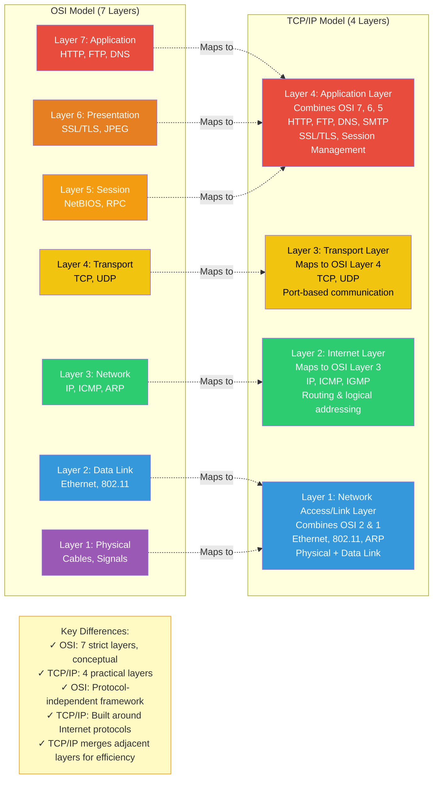

In the Internet protocol suite, the application layer contains the communications protocols and interface methods used in process-to-process communications across an Internet Protocol (IP) computer network. The application layer only standardizes communication and depends upon the underlying transport layer protocols to establish host-to-host data transfer channels and manage the data exchange in a client–server or peer-to-peer networking model.

<Callout title="Practical vs Conceptual" tone="info">
You will hear more often about the TCP/IP model, which is a 4-Abstraction layered model that makes direct reference to current Internet implementations. Its foundational protocols are TCP and IP.
</Callout>

## OSI vs. TCP/IP Model Comparison

| Feature           | OSI Model                                    | TCP/IP Model                                   |
| :---------------- | :------------------------------------------- | :--------------------------------------------- |
| **Layers** | 7 Layers                                     | 4 or 5 Layers (Network Access, Internet, Transport, Application) |
| **Purpose** | Conceptual framework, standardized design    | Practical, industry-standard, widely implemented |
| **Development** | Developed by ISO                              | Developed by ARPA (DOD)                         |
| **Reliability** | Connection-oriented (Transport), Connection-less (Network) can be implemented | Both connection-oriented (TCP) and connectionless (UDP) options |
| **Protocols** | Protocol independent                         | Protocols are built into the model              |
| **Focus** | Clear separation of services, interfaces, protocols | Less strict separation, more flexible           |
| **Relevance** | Primary reference model for understanding networking | Practical model for Internet communication      |
| **Interoperability**| More rigid due to strict layering             | More adaptable, easier for cross-platform communication |
| **Security** | Security considerations at all layers (conceptual) | Security often implemented at specific layers (e.g., IPSec at Network) |

## TCP/IP Model vs OSI Model Layer Mapping

*Figure: Comparison of OSI 7-layer model with TCP/IP 4-layer model. TCP/IP combines OSI's Application, Presentation, and Session layers into a single Application layer, and merges Physical and Data Link into the Network Access layer.*

## Network Interface Layer / Link Layer

This layer encompasses group of methods and communications protocols confined to the link that a host is physically connected to i.e the physical interface between the host system and the network hardware. It defines how data packets are to be formatted for transmission and routing. The link is the physical and logical network component used to interconnect hosts or nodes in the network and a link protocol is a suite of methods and standards that operate only between adjacent network nodes of a network segment.

The goal of this layer is to provide reliable communications between hosts connected on a network. Some of the services provided by this layer include:

- **Data Framing** - Breaking up the data stream into individual frames in packets
- **Checksums** - Sending checksum data for each frame to enable corruption-free verification via Frame Check Sequence
- **Acknowledgment** - Sending positive/negative acknowledgements from receiver to sender
- **Flow Control** - Buffering data transmissions to ensure that a fast sender does not overwhelm a slower receiver

**Protocols:** Wired Ethernet IEEE802.3, Wireless LAN IEEE802.11 (WiFi), Neighbor Discovery Protocol (NDP), Secure Neighbor Discovery (SEND), Gratuitous ARP (GARP), Point-to-Point Protocol (PPP), Media Access Control Protocols (CSMA/CD).

## Internet Layer

Is a Layer of group of Internetworking methods, protocols & specifications that are used to transport network packets (IP-based packets) from the origination host across network boundaries to the destination host specified by an Internet protocol address.

A common design aspect in the internet layer is the robustness principle: "Be liberal in what you accept, and conservative in what you send"

In its operation as a connectionless protocol, the internet layer is not responsible for reliable transmission. It provides only an unreliable service, and best effort delivery. The aspect of data integrity function of providing reliability of service is the duty of higher level protocols, such as the TCP in the transport layer.

The internet layer has three basic functions:
- **Routing:** Forwarding of packets from a source host to the next router that is one hop closer to the destination
- **Error Detection & Diagnostic:** Usually through Internet Control Message Protocol (ICMP) & Internet Group Management Protocol (IGMP)
- **Fragmentation:** Handling packet size requirements for different network types

## Transport Layer

The transport layer is responsible for delivering data to the appropriate application process on the host computers. The services in this layer include:

- ✔️ Connection-Oriented Communication
- ✔️ Same Order Delivery
- ✔️ Reliability through error-detection code (Checksum, SYN/ACK)
- ✔️ Flow Control Management
- ✔️ Traffic Congestion Avoidance
- ✔️ Multiplexing via Ports providing multiple endpoints on single node

At this layer, the TCP/IP protocol suite defines how different applications on separate hosts establish connections and track communications. Understanding how protocols use ports to establish connections is critical for configuring and supporting network services.

## Port Numbers

A TCP/IP host may be running multiple services/applications or communicating in parallel with multiple servers, clients, and peers. To facilitate this, each TCP/IP application type is assigned a unique identifier called a **Port Number**.

- **0-1023:** **Well-known ports** (assigned by IANA to common services like HTTP, FTP, SSH)
- **1024-49151:** **Registered ports** (can be registered for specific applications but are not "well-known")
- **49152-65535:** **Dynamic/Private/Ephemeral ports** (client applications assign their own temporary port numbers)

<Callout title="Socket Concept" tone="info">
A **Socket** is a software process that identifies a specific endpoint for communication. A connection is formed when a client requests a service from a server using a combination of IP address and port number.
</Callout>

## Application Layer

This includes the opening and closing of sessions, translating data, and the interaction with content at the application level. Here, there are multiple protocols for web content, email, and accessing files, including HTTP, FTP, SMTP, and more.
