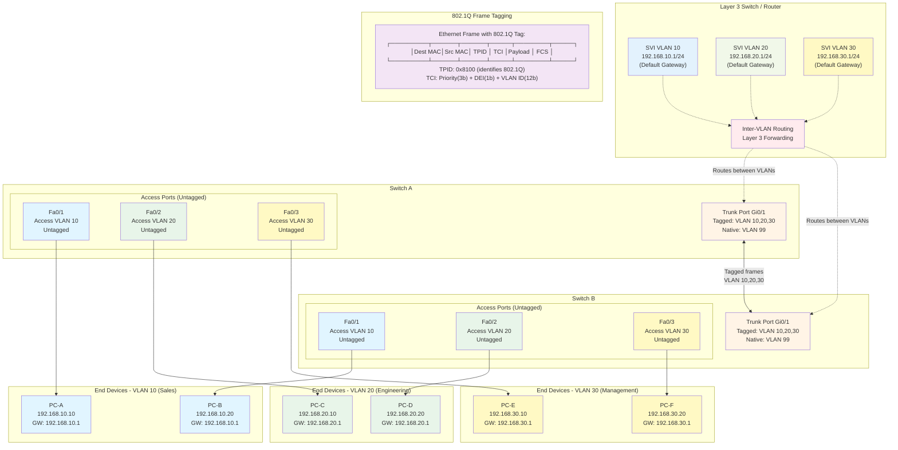

A **Network Interface** is the means by which a node is connected to the media and exchanges data with other network nodes. A **Network Interface Card (NIC)** is a transceiver component responsible for physically connecting the node to the transmission medium (a chip).

Each Ethernet network interface port has a Unique **Media Access Control Address** (hardware address / Ethernet Address). In IEEE Terminology, this is an **EUI** (Extended Unique Identifier). An **EUI-64** is a 64-bit Hardware Address. A mechanism allows for translations between the 48-bit MAC address and 64-bit EUI-64 address.

---

### Ethernet Frame Format

Ethernet encapsulates the payload from higher layer protocols within a Protocol Data Unit (PDU) called a **frame**.

| Preamble | Start Frame Delimiter (SFD) | Destination MAC | Source MAC | Ether Type / Length | Payload Data (from higher layer protocols) | Frame Check Sequence (FCS) |
| :------- | :-------------------------- | :-------------- | :--------- | :------------------ | :----------------------------------------- | :------------------------- |
| 7 bytes  | 1 byte                      | 6 bytes         | 6 bytes    | 2 bytes             | 46-1500 bytes                              | 4 bytes                    |

Preamble and SFD are used for clock synchronization and as part of the CSMA/CD protocol to identify collisions during transmissions very early from the Physical Layer, and as such are not technically considered to be part of the frame.

### Error Checking

The frame contains a 4-byte long checksum called a **Cyclic Redundancy Check (CRC)** or **Frame Check Sequence (FCS)**, which is calculated based on the contents of the frame. The receiving node performs the same calculation, and if it matches, accepts the frame. There is no mechanism for retransmission if damage is detected. CRC is not completely accurate at error checks.

---

### MAC / EUI-48 Format

The IEEE gives each manufacturer a range of numbers hard coded to every interface produced, called a **Burned-In Address** or **Universal Address**.

The first 3 bytes or octets (the first 6 Hex Digits) are also known as the **Organizationally Unique Identifier (OUI)** / **OUI Admin Address**.

A **Locally Administered Address** is used on networks in place of the manufacturer's universal coding system. It is defined by changing the U/L bit from 0 to 1. It becomes the responsibility of an organization's Internal Network Admin to ensure that all connected Interfaces are configured with a Unique MAC.

**Broadcast Address:** `FF:FF:FF:FF:FF:FF`

The I/G bit of a MAC address determines whether the frame is addressed to an Individual Node and/or a Group. If the I/G bits are all 1s, the MAC address is referred to as a **Broadcast Address** and should be processed by all nodes within the same broadcast domain.

---

### Maximum Transmission Unit (MTU)

The maximum size of the Data payload found in Layer 2 is **1500 Bytes**. This upper limit size of the payload is referred to as **Maximum Transmission Unit (MTU)**.

Excluding the preamble and SFD, a standard Ethernet frame has a maximum length of 1518 bytes (6 bytes Source MAC + 6 bytes Dest MAC + 2 bytes Ether Type field + 4 bytes FCS + 1500 bytes Payload).

To comply with Ethernet standards, the minimum length of an Ethernet frame is 64 bytes, so the payload must be at least 46 bytes. If this is not the case, it is auto-padded with redundant data. Some Gigabit Ethernet (GbE) and 10 Gigabit Ethernet (10GbE) support **Jumbo Frames** with much larger Maximum Transmission Units.

---

### Advanced Ethernet Switches

Switches normally support a range of Ethernet Standards so that older and newer Network Adapters can all be connected to the same Network.

Advanced Ethernet Switches support interconnections via high-speed backplanes to expandable capacity through plug-in modules, plus power supply redundancy, management consoles, and transceivers for fiber optic connectivity. They can, however, be distinguished using the following general categories:

1.  **Unmanaged vs. Managed:**
    * On a Small Office/Home Office (SOHO) Network, Switches are more likely to be **Unmanaged** Standalone Units that can be added to the network and run without any configuration. The switch functionality might also be built into an Internet Router/modem.
    * On a Corporate network, Switches are likely **Managed** and need Configuration (e.g., Command Line Interface).
2.  **Stackable:** Switches connected together to operate as a single unit. A stack can be managed as a group, and the switch is managed.
3.  **Modular vs. Fixed:**
    * A **Fixed** switch comes with a set number of ports that cannot be changed or upgraded.
    * A **Modular** Switch has slots for plug-in cards/modules.
4.  **Desktop vs. Rack-Mounted:**
    * Simple Unmanaged switches might be supplied as small freestanding units that can be placed on a desktop platform.
    * Stackable units are designed to be fitted to standard-size racks.

---

### Managed Switch Configuration & Interface Identification

Configuration of a Managed Switch can be performed at a Command Line Interface (CLI). Most Switch OS work in multi-Command modes or Hierarchies:

1.  **User EXEC Mode:** Read-Only, used to report configuration, show system states & troubleshooting.
2.  **Privileged EXEC Mode (Enable Mode):** Allows users to reboot, shutdown & backup/restore the system's configuration.
3.  **Global Config Mode:** Allows user to write configuration updates (not read-only in this context; allows writing).

Stackable Switches precede Interface Identifiers with a module ID (different for each switch in the stack). Interfaces are identified by Type, slot on Switch used, and port number (directly correlated).

An Interface has a **line status** (up if a host is connected via a good cable), and a **protocol status** (up if an Ethernet link is established). Line status + protocol status "down" indicates a fault in either the link connection.

---

### Crossover Cable & Auto-MDI/MDIX

A **Crossover Cable** has T568A termination at one end and T568B termination at the other end of the cable. Historically, in the days of Hubs, dedicated Uplink ports and/or Crossover Cables were used to make connections between 2 separate hubs.

When a switch needs to be connected to another switch, communication would fail if both interfaces used MDI-X. Nowadays, most switch interfaces are configured to use **Auto-MDI/MDIX** by default. This means that the switch senses the configuration of the connected device or cable wiring. It senses that an MDI or Uplink to an MDIX port gets configured. This also ensures a link if a Crossover Cable is used to connect to an end system by mistake. Gigabit Ethernet Interfaces must support Auto-MDI/MDIX.

---

### MAC Address Learning & Flooding

A switch learns MAC addresses by reading the **source address** when a frame is received on its port. The address mapping for that port is cached in a **MAC Address Table**, which is stored in a special type of memory known as **Content Addressable Memory (CAM)**. CAM is optimized for searching rather than random access.

If a MAC address isn't found in a MAC Address table, the switch acts like a hub and transmits the frame out to all ports, except for the source port (**FLOODING**).

---

### Port Security

A Port Security Configuration validates the MAC Address of end systems that connect to a switch port. A port security configuration has three primary elements:

1.  Specify an **Enforcement action** when a policy violation is detected (e.g., restrict or shutdown).
2.  Specify a **static MAC Address** or allow the port to learn and accept a certain number of sticky addresses.

---

### Port Aggregation / Link Aggregation

**Port Aggregation** means combining two or more separate cabled links into a single logical channel. From the host end, this can also be called Network Interface Card (NIC) Teaming / Bonding.

**Link Aggregation Control Protocol (LACP)** is used to auto-negotiate the bonded link between the switch port and the end system, detect configuration errors, and recover from the failure of one of the physical links.

Either ingress (incoming) OR egress (outgoing) traffic, or both, can be captured.

---

### Unicast vs. Flooding & Port Mirroring

Unlike Hubs, Switches forward Unicast traffic only to the specific port connected to the intended destination interface, preventing sniffing of Unicast Traffic by hosts attached to the same switch.

**Port Mirroring** copies all packets sent to one or more source ports to a configured monitor port. On a Cisco Switch, this is referred to as **Switched Port Analyzer (SPAN)**. The mirror port would be used by management monitoring software, such as a packet sniffer, network analyzer, or Intrusion Detection System.

---

### Specialized Port Settings

Some types of ports need special optimized port settings, e.g., Storage Area Networks (SANs) found in data centers, which require special requirements to handle Jumbo Frames and Flow Control.

* A **Jumbo Frame** is one that supports a data payload of up to 9000 bytes (far exceeding the ordinary Ethernet frame MTU of 1500 bytes limit), thereby supporting transfer of data in a 10GbE network. This reduces the number of frames that needs to be transmitted (i.e., instead of transmitting 1500 x 6 frames = 9000). It also reduces the amount of processing that switches and routers need to do. It also reduces bandwidth requirement as fewer individual frame headers are transmitted. It's critical that all hosts and appliances along the communication path are able to support the configuration of Jumbo Frames.
* **IEEE 802.3x Flow Control** allows a server to instruct the switch to pause traffic temporarily to avoid overwhelming its buffer and causing it to drop frames. A Switch port can be Configured to Enable/Disable use of pause frames. The 802.3x global pause mechanism doesn't differentiate between traffic types. The updated Priority Flow Control (PFC) mechanism (IEEE 802.1Qbb) allows PAUSE to apply to certain traffic types through the use of Class of Service (CoS). This is related to Quality of Service (QoS).

---

### Power Over Ethernet (PoE)

**Power over Ethernet (PoE)** is a means of supplying electrical power from a Switch via data cabling to a connected powered device (PD).

* **IEEE 802.3af (Type 1) - PoE:** Powered devices can draw up to 13W over cabling. Power is supplied at 350mA / 48V.
* **IEEE 802.3at (Type 2) - PoE+:** Powered devices can draw up to 25W, delivered at 600mA.
* **IEEE 802.3bt (Type 3 / Type 4) - Ultra PoE:** Supplies up to 51W (Type 3) or 75W (Type 4) usable power.

PoE Switches are referred to as **Endpoint Power Sourcing Equipment**. If an existing switch doesn't support PoE, a device called a **Power Injector (Midspan)** can be used.

Cat 3 or better is required to support PoE, while PoE+ must be Cat 5e or better.

Drawing power down the cable generates more heat. If this heat is not dissipated, it can affect data rates. Thermal performance can be achieved or improved using pure copper cabling with large conductors; as a thin conductor will generate more heat through resistance. Also, shielded cable is capable of dispersing heat more efficiently too, through absorption.

---

## VIRTUAL LOCAL AREA NETWORKS (VLANs)

Unless configured differently, managed switches allow the configuration of **Virtual LANs (VLANs)** to logically separate ports into distinct **broadcast domains**. In a well-designed network, there is typically a 1:1 mapping between VLANs and subnets; it's like assigning one room (subnet) for each invisible space (VLAN) you've created.

### Benefits of Implementing VLANs

* **Reduced Broadcast Traffic:** VLANs significantly reduce broadcast traffic, especially beneficial in networks that have expanded beyond a certain number of hosts or users. Each VLAN represents a smaller broadcast domain.
* **Security Segmentation:** From a security point of view, each VLAN can represent a separate security zone, allowing for stricter access controls between different segments of the network. This helps in containing security breaches.
* **Traffic Prioritization (QoS):** VLANs are used to separate nodes based on traffic type and the need for Quality of Service (QoS). For example, switches and Layer 3 routers can be configured to give **Voice VLANs** priority over ordinary data VLANs, ensuring clear voice communication.

### VLAN ID and Assignment

* **VLAN ID 1:** This is the **default VLAN**. All ports on a switch default to being in VLAN 1 unless explicitly configured otherwise.
* **VLAN ID Range:** To assign a node to a VLAN, you configure the port interface on the switch with a VLAN ID in the range of **2 to 4,094**.
* **Reserved IDs:** VLAN IDs **0** (all zeros) and **4,095** (all ones) are reserved for system use and cannot be assigned.
* **Network Segmentation:** VLANs establish network segments (broadcast domains) at **Layer 2 (Data Link Layer)**. A VLAN represents a single broadcast domain.
* **Inter-VLAN Communication:** Communication between different VLANs **must go through a Layer 3 device**, such as a router or a Layer 3 switch.
* **Dynamic VLANs:** Nodes or hosts can also be configured to belong to dynamic VLANs using features supplied by the port, such as a host's MAC address or authentication credentials used (e.g., through 802.1X integration with a RADIUS server). This is referred to as **Dynamic VLAN Assignment**.

### Tagged and Untagged Ports



**VLAN Architecture Components:**

1. **Access Ports (Untagged):**
   - Connect end devices (PCs, printers, phones)
   - Belong to a single VLAN
   - Strip VLAN tags before forwarding to devices
   - Switch adds VLAN tag when receiving frames from access ports

2. **Trunk Ports (Tagged):**
   - Carry traffic for multiple VLANs between switches
   - Use IEEE 802.1Q tagging to identify VLAN membership
   - 4-byte tag inserted: TPID (0x8100) + TCI (Priority + DEI + VLAN ID)
   - Native VLAN: untagged traffic defaults to this VLAN (security best practice: change from VLAN 1)

3. **Inter-VLAN Routing:**
   - Layer 3 device required for communication between VLANs
   - Switch Virtual Interfaces (SVIs): virtual Layer 3 interfaces per VLAN
   - Each SVI acts as default gateway for its VLAN
   - Enables internal routing without external router (Layer 3 switch)

4. **802.1Q Frame Structure:**
   - TPID (Tag Protocol Identifier): 16 bits, value 0x8100
   - PCP (Priority Code Point): 3 bits for QoS (0-7 priority levels)
   - DEI (Drop Eligible Indicator): 1 bit, marks frames eligible for dropping during congestion
   - VLAN ID: 12 bits, identifies VLAN (1-4094, 0 and 4095 reserved)

5. **VLAN Segmentation Benefits:**
   - Reduced broadcast domains
   - Enhanced security through logical separation
   - Simplified network management and scalability
   - QoS implementation per VLAN (e.g., Voice VLAN priority)

* **Untagged / Access / Host Port:** If a switch port will only ever participate in a single VLAN, it is configured as an **untagged** or **access port**. This is typically where end-user devices (PCs, printers) connect.
    * If a frame is addressed to a port in the same VLAN on the same switch, no tag needs to be added to the frame.
    * If the switch receives an 802.1Q tagged frame on an access port, it will usually strip the tag before forwarding it to the end device, as the end device typically doesn't understand VLAN tags.
* **Tagged / Trunk Port:** A **tagged port** will normally be operating as a **trunk**. A trunk is capable of transporting traffic addressed to multiple VLANs using the **IEEE 802.1Q frame format**.
    * A trunk might be used to connect switches to each other or to connect a switch to a router (or Layer 3 switch).
    * When frames designated for different VLANs are transported across a trunk, the VLAN ID of each frame must be preserved for the receiving switch or router to forward it correctly.
    * Under **802.1Q**, per-VLAN traffic is identified by a tag inserted in the Layer 2 Ethernet frame. This tag contains information about the **VLAN ID (1-4094)** and **priority** (used for QoS functions). A specific EtherType value is set to identify the frame as 802.1Q.
    * If a frame needs to be transported over a trunk link (e.g., connecting two different switches), the source switch adds the relevant 802.1Q tag to identify the VLAN, and then forwards the frame out the trunk port to the destination switch.
    * An administrative host or server that needs to access multiple VLANs might need to be attached to a trunk port rather than an access port, and its network interface configured to understand VLAN tagging.

### Voice VLANs

* **Voice over IP (VoIP)** transmits audio/voice traffic as data packets, rather than using circuit-based transmission.
* The bandwidth and latency requirements of voice traffic mean that it is often necessary to prioritize it over other types of data packets. This can be implemented using a dedicated VLAN for voice traffic.
* Normally, for a switch interface to process tagged frames, it would have to be configured as a trunk port. However, this can add configuration complexity, especially for ports connected to IP phones that also have a PC connected through them.
* Many switches now support the concept of a **Voice Auxiliary VLAN**. This allows the switch to distinguish VoIP traffic without having to configure the port as a full trunk.
* **Common Scenario:** A single physical wall port is shared between a PC and a VoIP handset. The handset has an internal 3-port switch.
    * The PC's untagged data traffic (e.g., VLAN ID 100) passes through the IP phone to the switch.
    * The VoIP handset's voice traffic is typically assigned a different VLAN ID (e.g., VLAN ID 101) and is sent to the switch as 802.1Q tagged traffic.
    * The switch will only accept tagged frames that match the configured Voice VLAN ID.
    * To avoid manual configuration, the Voice VLAN ID and other configuration parameters can be communicated to the handset using protocols like **Cisco Discovery Protocol (CDP)**.
    * **Switch Interface Configuration Example for Voice VLAN:** `switchport voice vlan [ID]`

### Private VLANs (PVLANs)

* A **Private VLAN (PVLAN)** applies an additional layer of segmentation by restricting the ability of hosts within a VLAN to communicate directly with one another, even if they are in the same subnet.
* **Use Cases:** This might be used by a hosting company to prevent web servers operated by different customers from being able to communicate with each other. Similarly, Internet Service Providers (ISPs) use PVLANs to isolate subscriber traffic. Isolating these server instances using PVLANs can be simpler than creating multiple VLANs and subnets for each isolated instance.
* **PVLAN Port Types:** When configuring a PVLAN, the host VLAN is referred to as the **Primary VLAN**. Several types of ports can be configured within a PVLAN:
    * **Promiscuous Port:** Can communicate with all other ports in all domains within the PVLAN. Routed/DHCP traffic typically goes through this port (e.g., a router interface).
    * **Isolated Port:** Can only communicate with the promiscuous port. This effectively creates a subdomain of a single host only. A PVLAN can contain multiple isolated ports, but each is in its own isolated subdomain.
    * **Community Port:** Can communicate with the promiscuous port and with other ports in the same community. This creates a domain that can contain multiple hosts that can communicate with each other, but not with hosts in other communities or isolated ports within the same PVLAN (except through the promiscuous port).

### Default VLAN vs. Native VLAN

* **Default VLAN (VLAN 1):** VLAN ID 1 is referred to as the DEFAULT VLAN. This cannot be changed. All ports on a switch default to being in VLAN 1. When implementing VLANs, you should **avoid sending user data traffic over the default VLAN**. It should remain unused or used only for inter-switch protocol traffic (e.g., Spanning Tree Protocol traffic is permitted to run over the default VLAN). Ensure that unused ports are not assigned to VLAN 1.
* **Native VLAN:** A **native VLAN** is the VLAN into which any **untagged traffic** is placed when receiving frames over a trunk port.
    * When a switch receives an untagged frame over a trunk, it assigns the frame to the native VLAN.
    * Such untagged traffic might come from legacy devices that do not support 802.1Q encapsulated frames (although this is rare in modern networks where trunking is used primarily with 802.1Q).
    * The native VLAN is initially set with the same VID as the default VLAN (VLAN 1).
    * You **can and should change this** to make the native VLAN a suitable, unused ID. This ID should ideally **not be the same as any VLAN used for any other data traffic**.
    * The same native VLAN ID should be configured for the trunk port on both interconnected switches to avoid potential VLAN hopping attacks or traffic misplacement.

---

#### Understanding Broadcast Domains

A broadcast domain is a network segment where a broadcast frame sent by any device is received by all other devices within the same segment. This characteristic defines the limitations and scope of broadcast traffic within a Layer 2 network (LAN).

* **Switch Behavior:**
    * Switches propagate broadcast frames out through all ports except the one on which the frame was received. Unlike switches, routers block broadcast frames from passing to other network segments, thereby limiting the spread of broadcast traffic.
* **Concerns with broadcast Traffic:**
    * Excessive broadcast traffic can degrade network performance and pose security risks. It's essential to manage and contain broadcast domains effectively.

#### VLANs (Virtual Local Area Networks)

VLANs are used to segment a physical network into multiple logical networks at Layer 2. Each VLAN forms its own broadcast domain, which helps in reducing unnecessary broadcast traffic and enhances network security and performance.

* **Configuration Steps:**
    1.  **Create VLAN:**
        ```cli
        Switch(config)# vlan [VLAN_NUMBER]
        Switch(config-vlan)# name [VLAN_NAME]
        ```
    2.  **Assign VLAN to Interface:** This sets the interface `fa0/1` as an access port in `[VLAN_ID]`.
        ```cli
        Switch(config)# interface fa0/1
        Switch(config-if)# switchport mode access
        Switch(config-if)# switchport access vlan [VLAN_ID]
        ```

* **Default VLANs and Ranges:**
    * All interfaces are in VLAN 1 by default.
    * Normal range VLANs: 1-1005.
    * Extended range VLANs: 1006-4094.

### Advanced Concepts in Inter-VLAN Routing and Trunking

#### Efficient Handling of Multiple VLANs

In a network where the number of VLANs increases, using a separate interface for each VLAN becomes impractical. This is due to physical limitations such as the number of router interfaces and the inefficiency of managing multiple cables and ports.

* **Trunk Ports:**
    * To efficiently manage traffic from multiple VLANs over a single interface, trunk ports are used. These ports can carry traffic for multiple VLANs simultaneously, distinguishing the traffic by tagging frames with VLAN IDs. Trunk ports carry traffic for multiple VLANs across a single link using tagging protocols like IEEE 802.1Q, which keeps the traffic for different VLANs segregated.

#### Trunking Protocols

The primary protocol used for trunking on modern networks is IEEE 802.1Q. It is essential for maintaining VLAN information as traffic moves between switches or to routers.

* **IEEE 802.1Q Tagging:**
    * **Frame Structure:** Adds a 4-byte tag into the original Ethernet frame, which includes:
        * **Tag Protocol Identifier (TPID):** A field that identifies the frame as an IEEE 802.1Q-tagged frame.
        * **Priority Code Point (PCP):** A 3-bit field used for class of service to prioritize traffic.
        * **Drop Eligible Indicator (DEI):** Indicates if the frame can be dropped if the network is congested.
        * **VLAN ID (VID):** A 12-bit field essential for identifying the VLAN to which the frame belongs. The range of possible VLAN IDs is 1-4095, offering extensive flexibility.

#### Frame Handling Across Switches

* **Same VLAN Communication:** No tagging is required if the destination port resides in the same VLAN on the same switch.
* **Different VLAN Communication:**
    * Within the same switch, frames destined for different VLANs are tagged with the destination VLAN ID.
    * Between different switches, frames are transmitted over trunk links with appropriate tagging according to IEEE 802.1Q standards.

#### Switch Processing and MAC Address Learning

When a frame enters a switch:

* If the VLAN ID from the tag is active and valid, the switch processes it according to configured interface port settings.
* The switch uses its MAC address table to determine the correct outgoing ports for the VLAN specified by the tag.
* If the destination MAC address is unknown, the switch may broadcast the frame to all ports in the specific VLAN, except the one it arrived on.

#### Native VLAN and Untagged Traffic

* **Native VLAN Concept:** By default, VLAN 1 is treated as the native VLAN on trunk ports.
* Untagged frames arriving on a trunk port are assumed to belong to the native VLAN.
* Frames destined for the native VLAN are transmitted without an IEEE 802.1Q tag.

#### Note on Security and Configuration

Ensuring that the native VLAN matches on all interconnected trunk ports is critical to prevent VLAN hopping attacks and other security vulnerabilities. It is advisable to change the native VLAN from the default (VLAN 1) to another unused VLAN ID and configure this consistently across all devices.

### Conclusion

Understanding and implementing inter-VLAN routing and trunking are vital for network scalability and efficiency. Proper use of trunking protocols like IEEE 802.1Q facilitates seamless communication across multiple VLANs while conserving physical resources. Additionally, careful configuration and management of VLAN settings and native VLAN configurations enhance network security and operational efficiency.

#### Inter-VLAN Routing

For traffic to flow between different VLANs, routing must occur at Layer 3:

* **Router-on-a-Stick:** A single physical router interface can be subdivided into multiple logical sub-interfaces, each corresponding to a different VLAN. Here, each sub-interface handles traffic for a specific VLAN, and the encapsulation specifies the VLAN ID associated with the sub-interface.
    ```cli
    Router(config)# interface fa0/0.1
    Router(config-subif)# encapsulation dot1Q [VLAN_ID]
    Router(config-subif)# ip address [IP_ADDRESS] [SUBNET_MASK]
    ```

* **Layer 3 Switches:**
    * Layer 2 switches don't perform packet routing and don't build a routing table. They aren't IP routing aware. However, you can assign an IP address to an SVI to allow remote connections to the CLI of the switch (using Telnet or SSH). These can perform routing between VLANs without needing separate router. Like ROAS Architecture.
    * **Example Configuration:**
        ```cli
        Switch(config)# interface vlan [VLAN_ID]
        Switch(config-if)# ip address [IP_ADDRESS] [SUBNET_MASK]
        Switch(config-if)# no shutdown
        ```
    * This configures a virtual interface for each VLAN, allowing the switch to route traffic between them directly.

Properly configuring VLANs and managing broadcast domains are critical for maintaining network efficiency, security, and scalability. By segmenting a network into VLANs and correctly configuring inter-VLAN routing, network administrators can ensure optimal performance and robust security across the network infrastructure.

### Multilayer Switching and Inter-VLAN Routing

#### Concepts and Implementation

Multilayer or Layer 3 switches are advanced devices capable of both switching and routing functions, allowing for efficient handling of traffic within VLANs and between different networks.

#### Native VLAN and IP Setup

* **Native VLAN:** This is used primarily for untagged traffic that arrives on trunk connections. This feature is crucial in environments where devices like VoIP phones are connected to the network, as these devices can tag their own traffic. PCs connected to these phones rely on the native VLAN configuration to route traffic.
* **Configuration Challenges:**
    * If there are discrepancies in native VLAN settings across interconnected switches, it may lead to "native VLAN mismatch" errors, causing traffic routing issues.
    * Correctly configuring the native VLAN across all devices ensures that traffic from PCs flows only through the intended paths without leaking into other VLANs.

#### Configuration Commands

To change the native VLAN on a router or switch, use the following commands depending on the device and requirement:

* **Router Subinterface (for Router-on-a-Stick configurations):**
    ```cli
    Router(config-subif)# encapsulation dot1Q <VLAN-ID> native
    ```
* **Switch Configuration (setting native VLAN on a trunk port):**
    ```cli
    Switch(config-if)# switchport trunk native vlan <VLAN-ID>
    ```

---

## Layer 3 / Multilayer Switch Features:

* **IP Address Assignment:**
    * **Routed ports:** Directly assign IP addresses to the physical interfaces on the switch which behave like router interfaces.
    * **SVIs (Switched Virtual Interfaces):** Create virtual Layer 3 interfaces for each VLAN, allowing the switch to route traffic between VLANs internally.

* **Routing Capabilities:**
    * Static and default routing configurations enable communication with external networks and other routers or Layer 3 switches.
    * **Enabling IP routing:**
        ```cli
        Switch(config)# ip routing
        ```
    * **Configuring a default route:**
        ```cli
        Switch(config)# ip route 0.0.0.0 0.0.0.0 <next-hop-address>
        ```

#### Practical Configuration Examples

* **Resetting an Interface to Default Configuration:**
    ```cli
    Switch(config)# default interface <interface-id>
    ```

* **Enabling Layer 3 Routing on the Switch:**
    ```cli
    Switch(config)#ip routing
    ```

* **Assigning an IP Address to a Routed Port:**
    ```cli
    Switch(config-if)# ip address <ip-address> <netmask>
    Switch(config-if)# no switchport  # This command transforms the interface from Layer 2 to Layer 3
    ```

Multilayer switches offer extensive flexibility and efficiency in managing inter-VLAN routing and overall network traffic. Proper configuration of native VLANs and understanding how to utilize and configure routed ports and SVIs are crucial for optimizing network performance and security. These capabilities allow network administrators to manage complex network topologies more effectively, integrating voice, data, and video traffic over a unified infrastructure.

### Switch Virtual Interfaces (SVI) and Multilayer Switch Configuration

Switch Virtual Interfaces (SVIs) represent a pivotal feature in Layer 3 switches, enabling inter-VLAN routing directly within the switch. This technique avoids the need for external routers for VLAN routing, simplifying network design and often enhancing performance.

#### Key Concepts for SVI:

* **SVI Initialization:** By default, SVIs are administratively down on Cisco switches. To use them for routing traffic between VLANs, they must be explicitly enabled.

* **VLAN Requirements:**
    * A VLAN must exist on the switch before you can assign an SVI to it. If an SVI is configured for a nonexistent VLAN, the switch will not create the VLAN automatically.
    * The VLAN associated with an SVI must not be shut down (`no shutdown` command).
    * There must be at least one operational access or trunk port associated with the VLAN for the SVI to be up.

* **Gateway Configuration:** End devices within VLANs should have their gateway set to the IP address of the corresponding SVI, not to an external router.

#### Practical SVI Configuration Example

The configuration of an SVI involves assigning it an IP address and enabling it. Here’s how to configure an SVI for VLAN 10 and VLAN 20 on a Cisco Layer 3 switch:

```cli
# Entering global configuration mode
Switch(config)# interface vlan 10
# Assigning an IP address to the SVI for VLAN 10
Switch(config-if)# ip address 192.168.1.1 255.255.255.192
# Enabling the SVI
Switch(config-if)# no shutdown
# Exiting back to global configuration mode
Switch(config-if)# exit

# Configuring SVI for VLAN 20
Switch(config)# interface vlan 20
Switch(config-if)# ip address 192.168.1.65 255.255.255.192
Switch(config-if)# no shutdown
Switch(config-if)# exit
```

Each SVI acts as a gateway for its respective VLAN, allowing inter-VLAN communication when combined with proper routing configurations.

#### Routed Ports

Besides SVIs, Layer 3 switches can also configure physical interfaces to act as routed ports. This setting transforms an interface from a Layer 2 switch port into a Layer 3 interface similar to a router's interface.

Here's how to configure a routed port:

```cli
# Selecting the interface
Switch(config)# interface gigabitethernet 0/1
# Disabling switching functionality
Switch(config-if)# no switchport
# Assigning an IP address
Switch(config-if)# ip address 10.0.0.1 255.255.255.0
# Enabling the interface
Switch(config-if)# no shutdown
```

This configuration is ideal for point-to-point links between switches or connections to other routers.
Configuring SVIs and routed ports on Layer 3 switches greatly enhances the flexibility and efficiency of network designs. These features facilitate advanced network segmentation, efficient routing, and simplified infrastructure with fewer devices and interconnections. Properly setting up and managing these interfaces ensures robust, scalable network architecture capable of supporting diverse organizational needs.

## VLAN and Trunk Configuration

* `SW(config-if)# switchport mode trunk` → Switch the Selected interface(s) port mode to Trunk (for Tagged Frames over Trunk Link).
* `SW(config-if)# switchport trunk encapsulation dot1q|ISL` → Sets the Encapsulation Negotiation Mode to either Dot1Q or ISL.
* `SW# switchport trunk allowed vlan {Add|except|All|None|Remove} ID` → This lets you configure vlan-IDs of the allowed VLAN when this port is In trunking mode.
* `SW# switchport trunk native VLAN ID` → The setting of native vlan is to ensure frames (untagged) coming over a trunk port gets forwarded to a specific native VLAN specified in the command.

### VLAN Management

* `SW(config)# vlan 20` → Select Vlan 20 for Configuration.
* `SW(config)# name UserNetwork` → Set Common Name of VLAN UserNetwork.
* `SW(config-if)# switchport access vlan ID` → Switch configuration to Vlan ID.

## Dynamic Trunking Protocol (DTP)

Dynamic Trunking Protocol (DTP) is a Cisco proprietary protocol that facilitates the automatic negotiation of trunk links between Cisco switches. This protocol simplifies network configuration and management by allowing switches to dynamically establish trunk links without manual intervention.

#### Key Concepts of DTP:

* **Default Settings:** DTP is enabled by default on all Cisco switch interfaces. However, for increased security, it's recommended to manually configure trunk settings.
* **Modes:** Interfaces can be configured in dynamic auto, dynamic desirable, or static access modes, influencing how they negotiate trunks with connected devices.

#### Configuration Commands:

* **Dynamic Mode Setting:**
    ```cli
    # Set the dynamic mode to either auto or desirable
    Switch(config-if)# switchport mode dynamic [auto | desirable]
    ```

* **Disabling DTP Negotiation:**
    ```cli
    # Disable DTP negotiation on an interface
    Switch(config-if)# switchport nonegotiate
    ```

#### Operation Modes

* **Trunk:** The port actively attempts to form a trunk with the remote switch.
* **Access:** The port strictly functions as an access port for a specific VLAN.
* **Dynamic Auto:** The port passively waits for DTP frames before switching to trunk mode.
* **Dynamic Desirable:** The port actively sends DTP frames, attempting to convert the link into a trunk.

#### Table: Interactions Between Configurations

| Mode / Config   | Auto      | Trunk     | Access    | Desirable |
| :-------------- | :-------- | :-------- | :-------- | :-------- |
| **Auto** | Auto      | Trunk     | Access    | Trunk     |
| **Trunk** | Trunk     | Trunk     | Misconfig | Trunk     |
| **Access** | Access    | Misconfig | Access    | Access    |
| **Desirable** | Trunk     | Trunk     | Access    | Trunk     |

* `MISCONFIG` indicates a misconfiguration error leading to possible traffic issues.

#### Best Practices:

* **Security:** For enhanced security, disable DTP on ports configured as static access or trunk ports.
* **Consistency:** Ensure that both ends of a trunk are configured consistently to prevent errors or undesired operation.
* **Switch Compatibility:** Newer Cisco switches default to dynamic auto, while older models may default to dynamic desirable. Adjust configurations appropriately based on model capabilities and network requirements.

Understanding Dynamic Trunking Protocol is crucial for configuring and managing VLANs effectively on Cisco switches. Properly leveraging DTP can lead to simplified management and automated switch configuration, but it requires careful handling to maintain network security and performance. Always ensure your switch configurations are deliberate and secure, especially in sensitive or complex network environments.

## VLAN Trunking Protocol (VTP)

VLAN Trunking Protocol (VTP) simplifies the management of VLANs in a network by allowing centralized configuration changes on a VTP server that are automatically propagated to all other switches in the VTP domain.

#### Key Features of VTP:

* **Central Management:** VTP allows VLAN configurations to be made centrally on a VTP server switch. Changes are then synchronized across all client switches.
* **VTP Modes:**
    * **Server Mode:** Can create, modify, or delete VLANs. This mode is default on Cisco switches.
    * **Client Mode:** Cannot create, modify, or delete VLANs. It only synchronizes with the server.
    * **Transparent Mode:** Does not participate in VTP. Maintains its own VLAN configuration and forwards VTP advertisements.

#### Version Differences:

* **VTP v1/v2:**
    * Primarily differ in support for Token Ring VLANs (only in v2).
    * Do not support extended range VLANs (1006-4094).
* **VTP v3:**
    * Supports extended VLANs up to 4094.
    * Provides better control over which device is allowed to update others.

#### Operational Details:

* **Revision Number:** Incremented each time a change is made on a VTP Server. Crucial for determining synchronization needs.
* **Synchronization:** Clients synchronize their VLAN database with a server that has the highest revision number within the VTP domain.

#### Configuration Commands:

```cli
# Set the VTP version
Sw(config)# vtp version [1 | 2 | 3]

# Set the VTP domain name
Sw(config)# vtp domain [Domain_Name]

# Configure VTP mode
Sw(config)# vtp mode [client | server | transparent]

# Display current VTP status
Sw# show vtp status
```

#### Best Practices:

* **Security:** Carefully manage the revision numbers and VTP modes, especially when adding new switches to a network to avoid unwanted database overrides.
* **Compatibility:** Ensure all switches within the VTP domain can support the intended VTP version, especially when using extended VLANs with VTP v3.
* **Precaution:** Reset the configuration revision number to zero when changing the domain name or switching a device from server/client to transparent to prevent accidental propagation of an old VLAN database.

Understanding VTP is essential for network administrators to efficiently manage large-scale networks with multiple VLANs. Proper use of VTP can significantly reduce administrative overhead and potential for configuration errors. However, it requires cautious handling to maintain network stability and security.

---

## Spanning Tree Protocol (STP) and Cisco Per-Vlan STP (PVST)

The Spanning Tree Protocol (STP) was developed to address the challenges in a network with redundant paths, specifically to prevent Layer 2 loops. This protocol is essential for maintaining a stable network environment by managing a loop-free logical topology.

#### Key Concepts of STP

* **Role of Root Bridge:** The root bridge in an STP topology is the focal point from which all path calculations are made. Each switch in the network uses the Spanning Tree Algorithm to determine the shortest path to the root bridge.
* **Port Roles:**
    * **Designated Ports:** Always in a forwarding state, these ports are selected on a per-link basis and are responsible for forwarding frames towards the root bridge.
    * **Root Ports:** Every non-root bridge has a single root port. Root ports are the best path from the non-root bridge to the root bridge.
    * **Blocked Ports:** These ports are non-designated ports and do not forward packets; they only listen to BPDUs to prevent loops.

#### States of STP Ports

* **Blocking:** In this initial state, the port does not participate in frame forwarding and listens to BPDUs to decide the future action.
* **Listening:** The port prepares for eventual packet forwarding and still listens to BPDUs to ensure no information has changed.
* **Learning:** At this stage, the port learns MAC addresses but does not forward frames yet.
* **Forwarding:** The port sends and receives all data frames if it is the designated or root port.
* **Disabled:** A network administrator manually disables the port and it does not participate in frame forwarding or reception.

Cisco’s Per-VLAN Spanning Tree (PVST) enhances STP by allowing separate spanning tree instances for each VLAN configured in the network. This granularity allows for better load balancing and specific tuning of the network infrastructure.

#### Potential Issues and Solutions with STP

* **MAC Address Flapping:** Occurs when a MAC address is found on different ports due to incorrect network configurations. This can be mitigated by proper network design and ensuring that all redundant paths are managed by STP.
* **Broadcast Storms:** Caused by infinite looping of broadcast frames in a network with redundant links. STP prevents this by creating a loop-free tree structure.

#### Administrative Options in STP

* **PortFast:** Bypasses the traditional listening/learning states and directly places a port into the forwarding state when connected to a single host.
* **BPDU Guard:** Automatically disables a port if a BPDU message is received on that port, useful in PortFast-enabled ports to prevent accidental loop formations.

The Spanning Tree Protocol and its enhancements like Cisco's PVST are critical for the design and operation of modern networks with redundancy. Understanding how to implement and manage these protocols helps in achieving a stable, efficient, and loop-free network topology, ensuring high availability and reliability in enterprise environments.

### Cisco STP and PVST Implementation Details

The Spanning Tree Protocol (STP) and Cisco's Per-VLAN Spanning Tree (PVST) play pivotal roles in preventing network loops and ensuring efficient traffic management across redundant paths. Understanding the mechanics of bridge priority and its impact on root bridge selection is crucial for network design and troubleshooting.

#### Bridge Priority in STP

* **Purpose:** The bridge priority determines the preference level a switch has to become the root bridge in an STP environment. The lower the priority value, the higher the chances of being elected as the root.
* **Default Priority:** The standard default priority for any Cisco switch is 32768. Adjustments made to this value influence the selection process for the root bridge.

#### MAC Address Role

* **Tie-breaking:** If two switches have the same priority, the MAC address serves as a tie-breaker. The switch with the lowest MAC address becomes the root bridge.

#### Extended System ID in PVST

* **Functionality:** Cisco’s enhancement to STP, PVST, incorporates VLAN information into the bridge priority by using an Extended System ID.
* **Calculation:** The Extended System ID typically represents the VLAN ID which is added to the base priority to form the total bridge priority.

#### Priority Configuration

* **Granularity:** The bridge priority can be adjusted in increments of 4096. This granularity helps in finely tuning the root bridge selection process across different network scenarios.
* **Values:**
    * Valid values range from 0 to 61440, in steps of 4096.
    * Sample settings: 4096, 8192, 12288, ..., up to 49152.

#### Cisco PVST Specifics

* **Per-VLAN Basis:** PVST runs an individual STP instance for each VLAN, allowing distinct bridge priorities for each VLAN. This capability enhances load balancing and provides flexibility in traffic management.
* **Example:** In a default VLAN (VLAN 1), if the base priority is set to 32768, adding the VLAN ID results in a total priority of 32769. Adjustments can be made uniquely per VLAN to influence the root bridge selection differently across VLANs.

### Practical Application and Impact

In practice, adjusting the bridge priority is a strategic decision used to optimize the topology of a network for reliability and efficiency. Network administrators must carefully plan these settings based on the network size, topology, traffic patterns, and organizational requirements.

For networks with multiple VLANs, PVST offers significant advantages by isolating potential issues and tuning performance on a per-VLAN basis, thereby enhancing overall network stability and responsiveness.

### Conclusion

Understanding the intricacies of STP and PVST, including the roles of bridge priority and MAC addresses, is essential for managing modern network infrastructures. These protocols ensure that even in environments with complex and redundant paths, data packets find an optimal route, maintaining both network integrity and performance.

For understanding the relationship and calculation of the Bridge ID in Spanning Tree Protocol (STP), we will break down each part of the formula and provide a tabular layout to illustrate how the bridge priority from the Spanning Tree Protocol Data Unit (BPDU) translates into the overall Bridge ID.

### Formula Breakdown:

1.  **Bridge Priority**: This is typically a value that can range from 0 to 65535, but only the top 4 bits are considered as "priority" in this context, which theoretically allows for 16 priority levels.
2.  **Extended System ID (VLAN ID)**: This is a 12-bit value representing the VLAN ID, which enhances the bridge priority to prevent switching loops across different VLANs.
3.  **Total Bridge Priority**: This is the sum of the Bridge Priority and the Extended System ID. It forms the first 16 bits of the Bridge ID.
4.  **MAC Address**: This is a 48-bit value unique to each switch, completing the remaining part of the Bridge ID.

### Example Table:

Here's how these components combine to form the Bridge ID:

| Component             | Description                          | Bits | Example Value        |
| :-------------------- | :----------------------------------- | :--- | :------------------- |
| Bridge Priority       | Base priority of the bridge          | 4    | `32768`              |
| +                     |                                      |      |                      |
| Extended System ID    | VLAN ID used as extended system ID   | 12   | `100`                |
| =                     |                                      |      |                      |
| Total Bridge Priority | Combined value of priority + VLAN ID | 16   | `32868`              |
| +                     |                                      |      |                      |
| MAC Address           | Unique identifier of the switch      | 48   | `00-1A-2B-3C-4D-5E`  |
| ->>                   |                                      |      |                      |
| Bridge ID             | Final bridge identifier              | 64   | `32868-001A2B3C4D5E` |

### Explanation of Values:

* **Bridge Priority (32768)**: A common default value for Cisco switches.
* **Extended System ID (100)**: Represents VLAN 100 being incorporated into the bridge priority.
* **Total Bridge Priority (32868)**: Sum of the base priority and the VLAN ID turned into a single 16-bit number.
* **MAC Address (`00-1A-2B-3C-4D-5E`)**: An example MAC address.
* **Bridge ID (`32868-001A2B3C4D5E`)**: The full 64-bit identifier used in STP operation to elect the root bridge and other roles.

This structure ensures each bridge in a network can be uniquely identified not just by its hardware (MAC), but also by its configuration role within specific VLAN contexts.

To visualize the bit-level distribution across the different fields within the Bridge ID as used in Spanning Tree Protocol (STP) BPDU, we can break it down into a more detailed tabular format. This will show how the bits are allocated towards each component of the Bridge ID.

### Bit Distribution Table:

| Field                     | Bits    | Description                          | Example Bits                                     |
| :------------------------ | :------ | :----------------------------------- | :----------------------------------------------- |
| Bridge Priority           | 4 bits  | Base priority of the bridge          | `1000`                                           |
| Extended System ID        | 12 bits | VLAN ID used as extended system ID   | `0000 0110 0100`                                 |
| **Total Bridge Priority** | **16 bits** | Sum of the above two fields          | `1000 0000 0110 0100`                            |
| MAC Address               | 48 bits | Unique identifier of the switch      | `0000 0001 1010 0010 1011 0011 1100 0100 1101 0101 1110` |

### Combined Bridge ID:

Combining the Total Bridge Priority with the MAC Address to form the complete 64-bit Bridge ID looks like this:

| Total Bridge Priority (`32868`) | MAC Address (`00-1A-2B-3C-4D-5E`)                               |
| :------------------------------ | :---------------------------------------------------------------- |
| `1000 0000 0110 0100`           | `0000 0001 1010 0010 1011 0011 1100 0100 1101 0101 1110`         |

### Full 64-bit Bridge ID Representation:

**`1000 0000 0110 0100 0000 0001 1010 0010 1011 0011 1100 0100 1101 0101 1110`**

### Explanation:

* The **first 4 bits** for the Bridge Priority typically allow for basic prioritization levels.
* The **next 12 bits** represent the VLAN ID, which is crucial in environments where multiple VLANs exist and STP calculations need to be VLAN-aware.
* These 16 bits combined form the **Total Bridge Priority**, which precedes the MAC Address in the Bridge ID.
* The **final 48 bits** are taken directly from the MAC address of the device.

This structure ensures that within the frame of an STP BPDU, the Bridge ID uniquely identifies each configured bridge, factoring in both its role in network topology and its physical hardware identity.

### Spanning Tree Protocol (STP) Initialization and Port Roles Determination

When a switch is powered on, each assumes it is the potential Root Bridge, initiating the Spanning Tree Protocol by sending out Bridge Protocol Data Units (BPDUs). The election of the actual Root Bridge and subsequent roles of ports across the network are determined through comparisons and changes of these BPDUs. Here's a detailed breakdown of the process:

#### Root Bridge Selection

* **Initial Assumption:** Every switch considers itself as the root upon startup and sends out BPDUs to assert this.
* **Superior BPDU Identification:** A switch relinquishes its claim as the root if it receives a BPDU with a lower bridge ID, which includes a combination of bridge priority and MAC address.
    * Lowest Bridge Priority
    * Lowest MAC Address Value
* **Consensus & Stability:** Once all switches agree on the identity of the root, the topology stabilizes and only the Root Bridge regularly transmits BPDUs.

#### Port Roles Configuration

1.  **Root Ports:**
    * Each non-root switch selects one port with the lowest path cost to the Root Bridge as its Root Port.
    * **Path Cost Calculation:** Based on the cumulative link speeds along the path to the root.
        * **Example Speed Costs:**
            * 10 Mbps = 100
            * 100 Mbps = 19
            * 1 Gbps = 4
            * 10 Gbps = 2

2.  **Designated Ports:**
    * In each collision domain between switches, the port on the switch with the lowest path cost to the root becomes the Designated Port and remains in forwarding state.
    * **Selection Criteria:**
        * Lowest Root Cost
        * Lowest Bridge ID on switch

3.  **Alternate Ports:**
    * Other ports in the same collision domain that are not chosen as designated are set to blocking state to prevent loops.
    * This ensures only one active path (a Designated Port) is used for data traffic, minimizing the risk of broadcast storms or loops.

#### Conflict Resolution

* In cases of ties in root path costs or bridge IDs:
    * **Neighbor's Bridge ID:** Lowest neighboring switch’s Bridge ID is considered.
    * **Neighbor's Port ID:** The specific port ID on the neighbor, incorporating both port priority and number, acts as a tie-breaker.

#### Special Considerations for Root Bridge

* All ports on a Root Bridge are inherently Designated Ports because they can directly forward packets without any intermediate devices.
* If multiple paths exist from a given switch to the Root Bridge, STP ensures only one is active at any time by selecting the optimal path based on the criteria mentioned above.

#### STP States and Functionalities

1.  **Blocking State:** No user data is forwarded; only BPDUs are sent/received. It's a stable state where the port doesn't participate in frame forwarding.
2.  **Listening State:** The switch processes BPDUs and awaits possible new information that warrants a topology change. No MAC addresses are learned in this state.
3.  **Learning State:** The switch begins to populate its MAC address table, but does not yet forward user data.
4.  **Forwarding State:** The switch forwards both user data and BPDUs. It fully participates in the active topology.
5.  **Disabled State:** The port does not participate in Spanning-tree forwarding or STP. It is effectively shut down.

#### STP Timers and Their Impact

* **Hello Time:** How often the Root Bridge sends a BPDU. Typically every 2 seconds.
* **Forward Delay:** The time spent in the Listening and Learning states. Commonly set to 15 seconds for each state.
* **Max Age:** The duration a BPDU is considered valid. If no new BPDU is received within this time, the existing BPDU is out and the switch may reconsider its own port roles and STP topology.

#### Port Role Transitions

* A non-designated port selected to become either a designated or root port will transition through the following states: Blocking → Listening → Learning → Forwarding. This total transition can typically take up to 50 seconds under default timer settings.

#### BPDU Management

* `Sw(config-if)# spanning-tree portfast bpdufilter default`: This command configures the interface to ignore BPDUs while PortFast is enabled, reverting to normal STP operation if a BPDU is received.

#### VLAN-Specific STP Configuration

* `Sw(config-if)# spanning-tree vlan [id] cost [value]`: Sets the path cost for sending BPDUs for a specific VLAN.
* `Sw(config-if)# spanning-tree vlan [id] priority [value]`: Sets the STP priority for a particular VLAN to influence root bridge selection.
* `Sw# spanning-tree mode [mstp | pvst | rapid-pvst]`: Configures the type of Spanning Tree Protocol to be used across the network.

#### Configuration Commands

* `Sw(config)# spanning-tree portfast default`: Globally enables the STP PortFast feature on all access ports. This should be used to skip the initial STP states for directly connected devices that do not result in network loops.
* `Sw(config-if)# spanning-tree bpdufilter enable/disable`: Enables or disables BPDU filtering on a specific interface. When enabled, it stops sending or receiving BPDUs on that port.

#### Command Examples

* `Sw# show spanning-tree VLAN-ID`: Displays STP details for a specified VLAN.
* `Sw# show spanning-tree detail`: Provides comprehensive details about the root bridge, time parameters, and port states for each VLAN.

These commands and settings are critical for managing how switches interact within a network, handling redundant paths, and ensuring there are no loops while maintaining optimal redundancy and failover capabilities.

Through the intelligent application of STP principles and careful configuration of bridge priorities and path costs, network administrators can effectively manage redundant paths and ensure robust network performance without loops. This makes STP a critical component in the design and operation of scalable, reliable Ethernet networks.

### Enhanced Spanning Tree Protocol (STP) Features and Configuration

#### 1. PortFast

* **Purpose:** Allows a port to immediately transition to the Forwarding state without going through the Listening and Learning states.
* **Usage Advice:**
    * Should only be enabled on ports connected to end hosts.
    * Enabling on a switch-to-switch connection could cause accidental Layer 2 loops.
    ```cli
    Sw(config-if)# spanning-tree portfast
    ```

#### 2. BPDU Guard

* **Function:** Prevents accidental topology changes by placing ports in an error-disabled state if BPDUs are received on PortFast-enabled ports where they should not be.
    ```cli
    Sw(config-if)# spanning-tree bpduguard enable
    ```

#### 3. BPDU Filter

* **Function:** Stops a switchport from sending or processing received BPDUs. Useful for ports connected directly to end devices where BPDUs are not expected.
    ```cli
    Sw(config-if)# spanning-tree bpdufilter enable
    ```

#### 4. Root Guard

* **Purpose:** Prevents a designated port from becoming a root port if a superior BPDU is received, ensuring the current switch retains its role as the root bridge.
    ```cli
    Sw(config-if)# spanning-tree guard root
    ```

#### 5. Loop Guard

* **Purpose:** Enhances STP stability in indirect link failure scenarios. If no BPDUs are received on a non-designated port that should be receiving them, Loop Guard puts the port into a loop-inconsistent state.
    ```cli
    Sw(config)# spanning-tree loopguard default
    ```

#### Configuration Examples

* **Enable PortFast on a Trunk Link:**
    * Use cases include connections to virtualization server hosts in different VLANs or a switchport connected to a Router (i.e. ROAS router-on-stick configurations).
    ```cli
    Sw(config-if)# spanning-tree portfast trunk
    ```

* **Error Recovery Setup:**
    * Re-enable an error-disabled port after addressing the underlying issue either manually or automatically.
    ```cli
    Sw(config)# errdisable recovery cause bpduguard
    Sw(config)# errdisable recovery interval 300
    ```

* **Priority Adjustment in STP:**
    * For designating primary or secondary root bridges in VLAN specific configurations.
    ```cli
    Sw(config)# spanning-tree vlan 11 root primary
    Sw(config)# spanning-tree vlan 12 root secondary
    ```

#### Summary

Each feature of STP serves to optimize network performance, prevent inadvertent network disruptions due to topology changes, and enhance security by controlling which ports participate in STP. Proper configuration and understanding of these features are critical to maintaining a stable and efficient network environment.

### Spanning Tree Protocol (STP) Enhancements and Configuration Tips

#### Root Guard

* **Purpose:** Protects your switch topology by preventing the switch from accepting superior BPDUs from switches outside your control. This is crucial when connecting LANs to external networks.
* **Behavior:** If a Root Guard-enabled port receives a superior BPDU, it will enter a "Root Inconsistent" state, effectively disabling the port until the superior BPDUs cease.
    ```cli
    Sw(config-if)# spanning-tree guard root
    ```

    To re-enable a port disabled by Root Guard:
    1.  Resolve the issue that triggered the guard (e.g., change priority settings on the other switch).
    2.  Wait for the BPDU max age timer (default 20 seconds) to expire; the port will then automatically recover.

#### Loop Guard

* **Purpose:** Prevents loop inconsistencies in unidirectional link scenarios where a port unexpectedly stops receiving BPDUs.
* **Implementation:** Should be enabled particularly on root and non-designated ports expected to receive BPDUs.
    ```cli
    Sw(config-if)# spanning-tree loopguard enable
    ```

    Recovery from Loop Guard:
    * Once a port starts receiving BPDUs again, it automatically transitions out of the "Loop Inconsistent" state.

#### BPDU Guard

* **Function:** Ensures that PortFast-enabled edge/access ports are protected against configuration mistakes that could introduce BPDUs into the network, putting the port into an error-disabled state.
    ```cli
    Sw(config-if)# spanning-tree bpduguard enable
    ```

    Manual recovery from BPDU Guard violation:
    * Administratively shut down and no shut down the port after resolving the configuration issue.

#### General STP Configuration Strategies

1.  **Optimal Traffic Flow:** To minimize latency, carefully select the root bridge based on stability and reliability to minimize congestion.
2.  **Handling External Connections:**
    * When connecting to external networks, ensure protection with Root Guard to maintain designated root roles within your network despite external influences.
3.  **Unidirectional Link Failures:**
    * Address potential physical layer issues (damaged cables, faulty connectors) that could cause unidirectional links which Loop Guard helps mitigate.

#### STP Configuration Commands Summary

* **Set a port's priority or designate a root bridge:**
    ```cli
    Sw(config)# spanning-tree vlan [vlan-id] priority [priority-value]
    Sw(config)# spanning-tree vlan [vlan-id] root primary|secondary
    ```

* **Recovery mechanisms:**
    ```cli
    Sw(config)# errdisable recovery cause [cause]
    Sw(config)# errdisable recovery interval [seconds]
    ```

#### Conclusion

Understanding and deploying STP enhancements correctly safeguards your network against unintentional loops and ensures optimal traffic flow through stable topology management. Each feature serves a specific purpose and should be configured according to the unique requirements of your network environment.

### Overview of Rapid Spanning Tree Protocol (RSTP) and Cisco Rapid PVST+

#### Key Concepts of RSTP (IEEE 802.1w)

* **Speed:** RSTP provides faster convergence compared to the classic STP by introducing a new handshake mechanism which allows ports to quickly transition between states.
* **Roles:** Introduces new port roles such as Alternate and Backup to improve network resilience.
* **Port States Simplification:** Merges STP's blocking, listening, and disabled states into a single discarding state.

### Port Roles in RSTP

1.  **Root Port:** The best (lowest cost) path from the switch to the root bridge.
2.  **Designated Port:** The port on each network segment that has the best path to the root bridge.
3.  **Alternate Port:** A backup port for the root port, providing an alternate path without the need to calculate spanning-tree topology.
4.  **Backup Port:** Serves as a backup for a designated port, typically used when multiple links are connected to the same collision domain.

#### Transition Enhancements in RSTP

* **Edge Ports:** Similar to PortFast in STP, directly transitions to forwarding state when connected to end devices.
* **Link Type:** Automatically determined as point-to-point or shared, influencing the BPDUs processing speed.

#### Cisco Rapid PVST+

* Extends RSTP by maintaining a separate spanning tree instance for each VLAN, allowing for better load balancing and redundancy over multiple VLANs.
* Faster convergence and individual control per VLAN enhance network tuning and performance optimization.

#### Configuration Commands for RSTP and Rapid PVST+

```cli
# Enter global configuration mode
Sw(config)#

# Set the spanning-tree mode to MST for Multiple instances or rapid-pvst for per VLAN RSTP calculation
Sw(config)# spanning-tree mode mst
Sw(config)# spanning-tree mode rapid-pvst

# Example to set link type on an interface, crucial for correct operation of RSTP
Sw(config-if)# spanning-tree link-type {point-to-point | shared }

# Set an interface as an edge port, equivalent to enabling PortFast
Sw(config-if)# spanning-tree portfast
```

#### Operational Differences Between STP and RSTP

* RSTP identifies and transitions certain ports immediately to the forwarding state without waiting for the full timer-based process, unlike STP.
* In scenarios with mixed environments (classic STP and RSTP), RSTP switches revert to STP on ports connected to STP-only switches.

### Summary

RSTP and Cisco’s Rapid PVST+ provide enhancements over traditional STP by offering quicker convergence times, more efficient handling of BPDU information, and specific improvements tailored to environments with multiple VLANs. Understanding these protocols and their configurations can significantly improve the robustness and responsiveness of your network infrastructure.

### Display Commands

* `SW3/RT#show ip interface brief` → Displays all the Router Interfaces.
* `SW/RT# Show Interfaces <ID>` → Displays specific interface information including duplex, speed and mac-address.
* `SW3/RT# show interfaces status` → Displays interfaces and their VLAN status (Trunk/Access/Routed Ports).
* `SW# show interfaces trunk` → Displays Information related to switchport configured as Trunk Ports.
* `SW# show vlan brief` → Displays the access interface ports assigned to each VLAN and not the trunk ports that allow each VLAN.
* `SW# show Spanning-Tree` → Displays Information (Root Bridge Information and the particular Switch/Bridge Information we queried via its CLI) about Spanning Tree Protocol for all VLANs that exist on the switch.
* `SW# show Spanning-Tree Vlan ID` → Displays Information about Spanning Tree Protocol for a specified VLAN.
* `SW# show Spanning-Tree Interface ID Detail` → Displays a more detailed/verbose Information about Spanning Tree Protocol for a specified Interface/switchport.
* `SW# Spanning-Tree mode ? {MST | PVST | Rapid-PVST}` → Sets the Spanning Tree Mode to MST, PVST, Rapid-PVST.
* `SW# show Spanning-Tree Detail` → Displays a more detailed/verbose Information about Spanning Tree Protocol for all VLANs that exist on the switch and an exact Root cost.
* `SW# Show interface Switchport`
* `SW# Show interface ID Switchport`
    * **Name:** The interface identifier per specific interface ID (f0/1 or g0/1).
    * **Administrative Mode:** The configured VLAN trunking mode (e.g., dynamic auto, dynamic desirable, trunk, access).
    * **Operational Mode:** The actual operational state of the interface (e.g., static access, trunking).
    * **Administrative Trunking Encapsulation:** The specified trunking encapsulation protocol (dot1q, isl, negotiate).
    * **Operational Trunking Encapsulation:** The operational trunking encapsulation protocol.
    * **Negotiation of Trunking:** Whether the trunking is set to on, off, or negotiating.

* `SW(config-if)# Spanning-Tree Portfast` → Enables Portfast on Specified Interfaces. Should only be enabled on interfaces connected to end Hosts (PC/Laptop)-Access Ports; and not interfaces connected to HUBS/SWITCHES/BRIDGES -Trunk Ports etc; can cause temporary bridging loops.
* `SW(config-if)# Spanning-Tree Portfast Trunk` → Enables Portfast on Trunk Interfaces. Should only be enabled on interfaces (connected to Virtualization Server with VMs in Separate VLANs OR connected to a Router via ROAS).
* `SW# Spanning-Tree Portfast default` → Enables Portfast on all Access Ports, doesn’t enable it on Trunk Ports, as these interfaces are connected to other switches In the network topology.
* `SW(config-if)# Spanning-Tree bpduguard enable|disable` → This command enables/disables BPDU Guard on a specific interface, helping to protect the network from unwanted STP changes and ensuring that only designated switchports (Ports connected to other Switches) participate in the Spanning Tree process.
* `SW(config-if)# Spanning-Tree bpdufilter enable|disable` → This command enables/disables BPDU filter on a specific interface, stops a switchport from sending BPDUs or processing received BPDUs.
* `SW# Spanning-Tree portfast bpduguard default` → Enables BPDUGuard on all Portfast-enabled interfaces.
* `SW# Spanning-Tree Vlan ID root primary` → Sets a particular VLAN to become the root bridge by automatically reducing its Bridge Priority, thereby making it the lowest Bridge ID in the network.
* `SW# Spanning-Tree Vlan ID root secondary` → Sets a particular VLAN to become the secondary root bridge.
* `SW# Spanning-Tree Vlan ID Priority ?[4096 increments allowed \\{0-61440\}]` → Manually Sets a particular VLAN Bridge Priority.
* `SW# Spanning-Tree guard root` → Sets/enables RootGuard on all STP ports, doesn’t have (config-if) versions.
* `SW(config-if)# Spanning-Tree guard loop | none` → Enables/disables loop guard on a specific Non-Designated Switchports.
* `SW# Spanning-Tree loopguard default` → Enables loop guard across all Non-Designated Switchports, this command reverses or nullifies the spanning-tree guard root.

### Notes:

* **PortFast** accelerates the convergence of network switches connected directly to end devices by immediately transitioning ports into the forwarding state, bypassing the traditional listening and learning phases.
* It's crucial to ensure that **PortFast** is only enabled on ports connected to single hosts to prevent potential network loops.
* **Ports**: Refers to the network ports where these tools are typically enabled or applicable.
* **Re-enablement Method**: Describes how the tool or feature is reactivated after being triggered or disabled.
* **Error Type in Terminal**: Represents a simplified example of what an error message might look like when issues arise related to each respective tool.

## Overview of EtherChannel and Port Aggregation

EtherChannel is a technology used in networking to combine multiple physical links between two network devices into a single logical link. This aggregation enhances bandwidth and provides redundancy without causing layer 2 loops that protocols like STP aim to avoid.

#### Why EtherChannel?
- **Increased Bandwidth**: By combining multiple network connections, the overall data path bandwidth increases.
- **Redundancy**: Provides redundancy for higher availability by aggregating multiple physical links.
- **Load Balancing**: Efficiently distributes network traffic across all available links in the channel, preventing any single link from being overloaded.

#### Types of EtherChannel
1.  **Static EtherChannel**: Manually configured, without any protocol negotiation.
2.  **PAgP (Port Aggregation Protocol)**: Cisco proprietary protocol that dynamically forms an EtherChannel if another PAgP device is detected.
3.  **LACP (Link Aggregation Control Protocol - IEEE 802.3ad)**: An industry standard method, more flexible and widely supported than PAgP.

#### Configuration Commands

| Command | Description |
| :------ | :---------- |
| `interface port-channel 1` | Creates or selects a port-channel interface. |
| `port-channel load-balance src-dst-ip` | Sets the EtherChannel load-balancing method based on source and destination IP addresses. |
| `interface range fa0/0-8` | Selects a range of interfaces for configuration. |
| `channel-group 1 mode active` | Adds interfaces to channel group 1 and sets the EtherChannel mode to active (LACP). |

#### Modes of Operation
-   **Active**: Unconditionally sends LACP packets (for LACP).
-   **Passive**: Waits to receive LACP packets before sending them (for LACP).
-   **Desirable**: Actively seeks to form an EtherChannel using PAgP.
-   **Auto**: Waits for PAgP packets to be received before responding.
-   **On**: Forces the port channel without a protocol negotiation.

#### Common Configuration Scenarios
-   `desirable + auto` = EtherChannel formed (PAgP)
-   `active + passive` = EtherChannel formed (LACP)
-   `auto + auto` = No EtherChannel (PAgP)
-   `passive + passive` = No EtherChannel (LACP)

#### EtherChannel Load-Balancing
Decides which port to use for each data flow. Factors influencing this decision might include:
-   Source and destination MAC addresses
-   Source and destination IP addresses
-   Combination of source and destination IPs and MACs

The choice of load balancing method can significantly impact the distribution of traffic across the links in an EtherChannel.

### EtherChannel Configuration and Guidelines

EtherChannel aggregates multiple physical interfaces into a single logical interface to enhance bandwidth and provide redundancy. Understanding the configuration requirements and ensuring consistency among member interfaces is crucial for proper operation.

#### Configuration Requirements for EtherChannel Members
-   **Duplex Settings**: All interfaces must operate at the same duplex mode.
-   **Speed**: All member interfaces must have the same speed settings.
-   **Switchport Mode**: Interfaces need to be configured in the same switchport mode (e.g., all access or all trunk).
-   **VLAN Settings**: For trunk modes, allowed VLANs must be consistent across all member interfaces.

#### Commands to Verify EtherChannel Configuration

| Command | Description |
| :------ | :---------- |
| `show etherchannel summary` | Displays a summary of all port-channels configured on the switch, including their status and associated physical ports. |
| `show etherchannel load-balance` | Displays the current method used for load balancing across EtherChannels. |

If there are discrepancies in the configuration of interfaces intended for an EtherChannel, they will not be eligible for inclusion in the EtherChannel group. This ensures stability and prevents issues like loops or mismatched traffic handling.

#### Compatibility Description

| Mode      | Compatible With   |
| :-------- | :---------------- |
| On        | Static Mode Only  |
| Active    | Active, Passive   |
| Passive   | Active Only       |
| Desirable | Auto, Desirable   |
| Auto      | Desirable Only    |

Choosing the correct mode and protocol is essential for forming a stable EtherChannel link between switches.

### Summary
Proper configuration and consistency across all member interfaces are key to successfully implementing an EtherChannel. By following these guidelines and using the appropriate commands, administrators can ensure high availability, increased bandwidth, and efficient use of infrastructure resources in their network environments.
EtherChannel is essential for optimizing the use of physical links between switches, enhancing both bandwidth utilization and network redundancy. Depending on the network requirements and equipment, administrators can choose between static configuration or dynamic protocols (PAgP or LACP) to manage EtherChannels efficiently.

| Command | Description |
| :------ | :---------- |
| `show etherchannel summary` | This command displays a summary of all port-channels configured on the switch including their status and associated physical ports. |
| `show etherchannel detail` | Provides detailed information about each port-channel, including protocol, member ports, and their individual statuses. |
| `show etherchannel load-balance` | Displays the current method used for load balancing across EtherChannels. |
| `show running-config interface Port-channel1` | Shows the running configuration specific to the Port-channel interface. |
| `port-channel load-balance <method>` | Enables EtherChannel Load Balancing Method. |
| `src-ip` | Balances based on source IP address. |
| `dst-ip` | Balances based on destination IP address. |
| `src-dst-ip` | Balances based on both source and destination IP addresses. |
| `src-mac` | Balances based on source MAC address. |
| `dst-mac` | Balances based on destination MAC address. |
| `src-dst-mac` | Balances based on both source and destination MAC addresses. |
| `src-port` | Balances based on source port. |
| `dst-port` | Balances based on destination port. |
| `src-dst-port` | Balances based on both source and destination ports. |

#### Layer 3 Switch EtherChannel Configuration on Routed Ports

| Command | Description |
| :------ | :---------- |
| `interface range GigabitEthernet0/1 - 2` | Selects a range of GigabitEthernet interfaces. |
| `no switchport` | Configures the physical interfaces as Layer 3 (routed) ports. |
| `channel-group 1 mode active \{auto | desirable | passive | on\}` | Command to set the channel protocol and mode for the interfaces. |
| `interface Port-channel2` | Selects or creates port-channel interface 2. |
| `no switchport` | Configures the port-channel interface as Layer 3 (routed). |
| `ip address 192.168.1.1 255.255.255.0` | Assigns an IP address and subnet mask to the port-channel interface. |

#### Layer 3 EtherChannel Configuration Steps

| Command | Description |
| :------ | :---------- |
| `interface range g0/1-3` | Selects a range of GigabitEthernet interfaces. |
| `no switchport` | Configures these interfaces as Layer 3 (Routed) ports. |
| `ip routing` | Enables IP routing on the switch (global configuration). |
| `channel-group 1 mode active` | Creates channel group 1 and sets LACP active mode for the interfaces in the range. |
| `interface port-channel 1` | Enters the port-channel interface configuration mode. |
| `ip address [ipAddr] [Netmask]` | Assigns an IP address and subnet mask to the port-channel interface. |

This setup uses IP address directly assigned to the port-channel, facilitating easier management and routing capabilities across the network.

#### Setting the Channel Protocol
The EtherChannel aggregation protocol (PAgP/LACP) must be uniform across all devices in the EtherChannel. If explicitly set, each switch port in the bundle must support the selected protocol.
