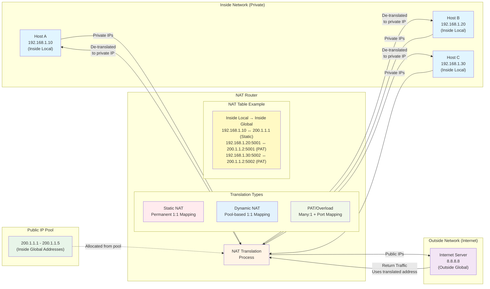

Layer 2 Discovery Protocols such as CDP and LLDP share information with and Discover information about neighbouring connected devices. Although they are layer 2 discovery protocols, they could be used to share layer 3 information as well. The shared information includes Hostname, IP address, Device type.
Because they share information about devices in the network, they can be considered a security risk and are often not used. It is up to the network engineer/admin to decide if they want to use them in the network or not.

CDP is a Cisco Proprietary protocol, it’s enabled on Cisco devices (routers, switches, firewalls, IP phones, etc.).

| Feature                | Description                                                                                                                                                                                                                                                                   |
| :--------------------- | :---------------------------------------------------------------------------------------------------------------------------------------------------------------------------------------------------------------------------------------------------------------------------- |
| **Multicast Address** | CDP messages are periodically sent to multicast address `0100.0CCC.CCCC` (this same multicast address is used by Cisco on all its proprietary L2 Protocols, i.e., CDP/VTP/DTP/PagP/UDLD). When a device receives a CDP message, it processes and discards the message; it does not forward it to other devices. |
| **Neighbor Discovery** | CDP shows information about directly connected neighbors, because only directly connected devices share and receive CDP messages.                                                                                                                                              |
| **Default Timer** | By default, CDP messages are sent once every 60 seconds.                                                                                                                                                                                                                      |
| **CDP Holdtime** | By default, the CDP HOLDTIME is 180 seconds. If a message isn’t received from a Neighbor for 180 seconds, the neighbor is removed from the CDP neighbor table.                                                                                                                    |
| **CDPv2** | CDPv2 messages are sent by default. Version 2 offers a few more advanced features like the ability to identify native VLAN mismatches (between neighbors).                                                                                                                     |
| **Default State** | CDP is globally enabled by default on each interface.                                                                                                                                                                                                                         |

### CDP Configuration Commands

| Command                                | Description                                                                         |
| :------------------------------------- | :---------------------------------------------------------------------------------- |
| `RT(config)# cdp run`                  | To enable CDP globally.                                                             |
| `RT(config)# no cdp run`               | To disable CDP globally.                                                            |
| `RT(config-if)# cdp enable`            | To enable CDP on specific interfaces.                                               |
| `RT(config-if)# no cdp enable`         | To disable CDP on specific interfaces.                                              |
| `RT(config-if)# cdp timer seconds`     | To configure the CDP message timer.                                                 |
| `RT(config-if)# cdp holdtime seconds`  | To configure the CDP hold time.                                                     |

### CDP Show Commands

| Command                                 | Description                                                                                                                                                                                                                 |
| :-------------------------------------- | :-------------------------------------------------------------------------------------------------------------------------------------------------------------------------------------------------------------------------- |
| `RT# show cdp`                          | States whether CDP is enabled globally and lists the default update and holdtime timers.                                                                                                                                    |
| `RT(config)# do show cdp traffic`      | Displays the number of CDP advertisement packets passed through an interface, and the number of CDP advertisements the device interfaces has sent and received.                                                               |
| `RT(config)# do show cdp interface [intf-ID]` | Gives basic information about each interface; you can also specify a specific interface.                                                                                                                                    |
| `RT(config)# do show cdp neighbors`    | Displays CDP details about its neighbors, including Local Interface (interface on the device issuing the command) & Device ID/Name of the Neighbor & Port ID (interface of the connected neighbor), their capabilities, and platform. |
| `RT(config)# do show cdp neighbors detail` | Displays more information for CDP neighbors, i.e., Operating system & version of the neighboring device, VTP Management Information, and Information about VLAN Duplexity.                                                  |
| `RT(config)# do show cdp entry [neighbor-ID]` | Lists the same information as the `show cdp neighbors detail` command, but only for the named neighbor (case sensitive).                                                                                                    |

## LINK LAYER DISCOVERY PROTOCOL (LLDP)

LLDP is an industry standard IEEE protocol (`IEEE 802.1AB`). It’s usually disabled globally on all interfaces on Cisco devices by default in favor of Cisco CDP. Cisco created the Cisco-proprietary CDP before any standard existed for a similar protocol. LLDP is usually more preferable to run in a Multi-vendor network. It must be manually enabled. A device can run CDP and LLDP at the same time.

| Feature                | Description                                                                                                                                                                                                     |
| :--------------------- | :-------------------------------------------------------------------------------------------------------------------------------------------------------------------------------------------------------------- |
| **Multicast MAC Address** | LLDP messages are periodically sent to Multicast MAC address `0180.C200.000E`. When a device receives an LLDP message, it processes and discards the message; it does not forward it to other devices.                   |
| **Message Concepts** | LLDP uses the same messaging concepts as CDP, encapsulating messages directly in data-link headers.                                                                                                                |
| **Default Timer** | By default, LLDP messages are sent out every 30 seconds, with a default HOLDTIME of 120 seconds.                                                                                                                |
| **Reinitialization Delay** | LLDP has an additional timer called the ‘Reinitialization Delay’; if LLDP is enabled (globally or on an interface), this timer will delay the actual initialization of LLDP by 2 seconds (default).                    |
| **Separate Functions** | LLDP separates the sending and receiving of LLDP messages as separate functions, allowing independent control of transmission and reception on an interface.                                                       |

### LLDP Configuration Commands

| Command                                        | Description                                                                                                                                                                                                                                                             |
| :--------------------------------------------- | :---------------------------------------------------------------------------------------------------------------------------------------------------------------------------------------------------------------------------------------------------------------------- |
| `RT(config-if)# lldp transmit`                 | To enable LLDP on a specific interface (tx) to advertise LLDP messages.                                                                                                                                                                                                 |
| `RT(config-if)# lldp receive`                  | To enable LLDP on a specific interface (rx) as LLDP Recipient.                                                                                                                                                                                                          |
| `RT(config)# lldp run`                         | To enable LLDP globally (Cisco devices default to disable LLDP). This global configuration command sets the default mode of LLDP operation for any interface that does not have more specific LLDP subcommands (lldp transmit, lldp receive). Enables LLDP in both directions on those interfaces. |
| `RT(config)# no lldp run`                      | To disable LLDP globally.                                                                                                                                                                                                                                               |
| `RT(config)# lldp timer seconds`               | To configure the LLDP message timer.                                                                                                                                                                                                                                    |
| `RT(config)# lldp holdtime seconds`            | To configure the LLDP holdtime timer.                                                                                                                                                                                                                                   |
| `RT(config)# lldp reinit seconds`              | To configure the LLDP Reinitialization timer.                                                                                                                                                                                                                           |

### LLDP Show Commands

| Command                                 | Description                                                                                                                                                                                                                                                                                                                                                                                                                                                                                                                                                                                         |
| :-------------------------------------- | :-------------------------------------------------------------------------------------------------------------------------------------------------------------------------------------------------------------------------------------------------------------------------------------------------------------------------------------------------------------------------------------------------------------------------------------------------------------------------------------------------------------------------------------------------------------------------------------------------- |
| `RT(config)# do show lldp traffic`      | Displays the number of LLDP packets passed through an interface, and the number of LLDP advertisements the device interfaces have sent and received.                                                                                                                                                                                                                                                                                                                                                                                                                                                 |
| `RT(config)# do show lldp interface [intf-ID]` | Gives some basic information about each interface; you can also specify a specific interface. It also displays the TX and RX state.                                                                                                                                                                                                                                                                                                                                                                                                                                                              |
| `RT(config)# do show lldp neighbors`    | Displays LLDP details about its neighbors, including Local Interface (interface on the device issuing the command) & Device ID/Name of the Neighbor & Port ID (interface of the connected neighbor), their capabilities, and platform.                                                                                                                                                                                                                                                                                                                                                                  |
| `RT(config)# do show lldp neighbors detail` | Displays more information for LLDP neighbors, i.e., Operating system & version of the neighboring device. VTP Management Information won’t be displayed (as VTP is Cisco Proprietary). Information about VLAN Duplexity.                                                                                                                                                                                                                                                                                                                                                                                  |
| `RT(config)# do show lldp entry [neighbor-ID]` | Displays information per specific neighboring device ID, similar to `#show lldp neighbors detail`, but for the specified neighbor only.                                                                                                                                                                                                                                                                                                                                                                                                                                                         |

Both the `show cdp neighbors` and `show lldp neighbors` commands have “local intf” (interface) and “port ID” columns. These columns refer to the local device’s interface and the neighboring device’s interface, respectively. However, the LLDP output in the example does differ from CDP in a few important ways:
* LLDP uses `B` as the capability code for switching, referring to bridge, a term for the device type that existed before switches that performed the same basic functions.
* LLDP does not identify IGMP as a capability, while CDP does (I).
* CDP lists the neighbor’s platform, a code that defines the device type, while LLDP does not.
* LLDP lists capabilities with different conventions:
    * **System Capabilities:** What the device can do
    * **Enabled Capabilities:** What the device does now with its current configuration

---

## SIMPLE NETWORK MANAGEMENT PROTOCOL (SNMP)

SNMP Agent (UDP 161) and SNMP Manager (UDP 162)
In 1988, RFC 1065, “Structure and Identification of Management Information for TCP/IP-based Internet,” proposed that information about devices on a TCP/IP-based network—configuration settings, status information, counters, and so on—could be broken down into a database of variables. Those variables could then be collected by management software to monitor and manage the IP-based network. After all, the elements of any IP-based machines would have commonalities.
SNMP is an industry standard framework and protocol that was originally released in 1988. It can be used to monitor the status of devices, make configuration changes, etc.
SNMP is an Application layer protocol that provides a message format for communication between what are termed managers and agents.

| Component                  | Description                                                                                                                                                                                                                                                |
| :------------------------- | :--------------------------------------------------------------------------------------------------------------------------------------------------------------------------------------------------------------------------------------------------------- |
| **SNMP Manager** | A network management application running on a PC or server, typically called a **Network Management Station (NMS)**. The SNMP Manager is the application on the NMS that interacts with the managed devices; it receives notifications, sends requests for information, sends configuration changes, etc. The SNMP Server Application provides an interface for the network admin to interact with, displays alerts, statistics, charts, graphs of performance metrics. The SNMP manager uses SNMP protocols to communicate with each SNMP agent. |
| **SNMP Agent** | The software running on the managed devices (router, switch, and so on) with knowledge of all the variables of that device that describes the device's configuration status and counters. It interacts with the SNMP Manager on the NMS by forwarding or receiving information from the NMS. |
| **Managed Devices** | Many SNMP agents exist in the network, one per device that is managed. Each agent keeps a database of variables that make up the parameters, status, and counters for the operations of the device.                                                              |
| **Management Information Base (MIB)** | This database, called the Management Information Base (MIB), has some core elements in common across most networking devices. It also has a large number of variables unique to that type of device—for instance, router MIBs will include variables not needed on switch MIBs, and vice versa. This information structure contains the variables that are managed by SNMP. The MIB defines/identifies each variable as an Object ID (OID). SNMP Object IDs are organized in a Hierarchical structure. The MIB then organizes the OIDs based in part on RFC standards and in part with vendor-proprietary variables. The MIB organizes all the variables into a hierarchy of OIDs, usually shown as a tree. Each node in the tree can be described based on the tree structure sequence, either by name or by number. |

IOS on routers and switches include an SNMP agent, with a built-in MIB, that can be enabled with the configuration shown later in this chapter. The NMS uses the SNMP Get, GetNext, and GetBulk messages (together referenced simply as Get messages) to ask for information from an agent. The NMS sends an SNMP Set message to write variables on the SNMP agent as a means to change the configuration of the device. These messages come in pairs, with, for instance, a Get Request asking the agent for the contents of a variable, and the Get “RESPONSE” supplying that information.

SNMP permits much flexibility in how you monitor variables in the MIB. The NMS, with historical stored data, can then analyze various statistical facts such as averages, minimums, and maximums. To be proactive, administrators can set thresholds for certain key variables, telling the NMS to send a notification (email, text, and so on) when a threshold is passed. In addition to asking for information with Get commands and setting variables on agents with the Set command, SNMP agents can initiate communications to the NMS. These messages, generally called notifications, use two specific SNMP messages: TRAP AND INFORM. SNMP agents send a Trap or Inform SNMP message to the NMS to list the state of certain MIB variables when those variables reach a certain state.

| Notification Type | Protocol Mechanism                                                                                                                                                                                                                                                          | Reliability |
| :---------------- | :-------------------------------------------------------------------------------------------------------------------------------------------------------------------------------------------------------------------------------------------------------------------------- | :---------- |
| **SNMP Traps** | Available since SNMPv1. Uses a fire-and-forget process. The SNMP agent sends the Trap to the IP address of the NMS, with UDP as the transport protocol (as with all SNMP messages), and with no application layer error recovery. If the Trap arrives, great; if it is lost in transit, it is lost. | Unreliable  |
| **Inform Messages** | Added with SNMPv2. Similar to Trap messages but with reliability. Still uses UDP but adds application layer reliability. The NMS must acknowledge receipt of the Inform with an an SNMP Response message, or the SNMP agent will time out and resend the Inform.                   | Reliable    |

---

### Securing SNMP

SNMP supports a few security mechanisms, depending on the particular version. First, one strong method to secure SNMP is to use ACLs to limit SNMP messages to those from known servers only. SNMP agents on Cisco routers and switches support SNMP messages that flow in both IPv4 and IPv6 packets. The SNMP agent can configure an IPv4 ACL to filter incoming SNMP messages that arrive in IPv4 packets and an IPv6 ACL to filter SNMP messages that arrive in IPv6 packets. Using an IPv4 and IPv6 ACL to secure an agent makes good sense. The only hosts that should be sending SNMP messages to the SNMP agent in a router or switch are the NMS hosts. Those NMS hosts seldom move and their IP addresses should be well known to the networking staff. It makes good sense to configure an ACL that permits packets sourced from the IP addresses of all NMS hosts, but no others.

| SNMP Version | Security Mechanism                                                                                                                                                                                                                          |
| :----------- | :------------------------------------------------------------------------------------------------------------------------------------------------------------------------------------------------------------------------------------------ |
| **SNMPv1** | Defined clear-text passwords called SNMP communities. Both the SNMP agent and the SNMP manager need prior knowledge of the same SNMP community value (called a community string). Defines both a read-only (RO) community (allows Get messages) and a read-write (RW) community (allows both reads and writes). |
| **SNMPv2c** | (Community-based SNMP Version 2) basically kept the same community security feature as SNMPv1.                                                                                                                                             |
| **SNMPv3** | Does away with communities and replaces them with:   
 - **Message integrity:** Confirms whether or not each message has been changed during transit.   
 - **Authentication (optional):** Adds authentication with username and password, using hashing (never clear text).   
 - **Encryption (Confidentiality, optional):** Encrypts the contents of SNMPv3 messages so attackers cannot read them. |

## SYSTEM MESSAGE LOGGING (SYSLOG)

SYSLOG is an industry standard protocol. On Network devices, Syslog can be used to log events such as changes in interface status, changes in OSPF neighbor status, and system restarts. These Logs are essential when troubleshooting issues, examining the cause of incidents, etc. SYSLOG and SNMP are both used for monitoring and troubleshooting devices; they are complementary but their functionalities are different.

| Protocol | Purpose                                                                                                 | Data Flow                                       | Capabilities                                                                        |
| :------- | :------------------------------------------------------------------------------------------------------ | :---------------------------------------------- | :---------------------------------------------------------------------------------- |
| **SYSLOG** | Used for system message logging. Events categorized by facility/severity are logged, used for system management, analysis, and troubleshooting. | Messages are sent *from* devices *to* the server. | Server cannot actively pull information (like SNMP GET) or modify variables (like SNMP Set). |
| **SNMP** | Used to retrieve and organize information about SNMP-managed devices.                                   | Manager queries clients (GET) and modifies variables (SET). | Manager can actively pull information and modify variables.                             |

IOS dictates most of the contents of the messages, but you can at least toggle on and off the use of the timestamp (which is included by default) and a log message sequence number (which is not enabled by default). Log messages may just tell you about some mundane event, or they may tell you of some critical event. To help you make sense of the importance of each message, IOS assigns each message a severity level: the lower the number, the more severe the event that caused the message.

### Syslog Severity Levels

| Level Number | Keyword       | Description                                  |
| :----------- | :------------ | :------------------------------------------- |
| `0`          | EMERGENCY     | System is Unusable                           |
| `1`          | ALERT         | Action must be taken immediately             |
| `2`          | CRITICAL      | Critical Conditions                          |
| `3`          | ERROR         | Error Conditions                             |
| `4`          | WARNING       | Warning Conditions                           |
| `5`          | NOTICE        | Normal But significant condition             |
| `6`          | INFORMATION   | Informational Messages                       |
| `7`          | DEBUG         | Debug Level Message                          |

Of the eight log message severity levels, one level, debug level (7), has a special purpose: for messages generated as a result of a user logged in to the router or switch who issues a debug command. The `DEBUG` EXEC command gives the network engineer a way to ask IOS to monitor for certain internal events, with that monitoring process continuing over time, so that IOS can issue log messages when those events occur. The engineer can log in, issue the debug command, and move on to other work. The user can even log out of the device, and the debug remains enabled. IOS continues to monitor the request in that debug command and generate log messages about any related events. The debug remains active until some user issues the “no debug” command with the same parameters, disabling the debug.
While the debug command is just one command, it has a huge number of options, much like the show command may be one command, but it also has many, many options. The console user sees the log messages created on behalf of that debug command after the debug command completes. Note that all enabled debug options use router CPU, which can cause problems for the router. You can monitor CPU use with the `show process cpu` command, but you should use caution when using debug commands carefully on production devices. Also, note the more CLI users that receive debug messages, the more CPU that is consumed. So, some installations choose to not include debug-level log messages for console and terminal logging, requiring users to look at the logging buffer or syslog for those messages, just to reduce router CPU load.

### SYSLOG MESSAGE FORMAT

```
Seq:time_stamp: %facility-severity-MNEMONIC:description
```
* **Sequence Number:** Indicating the order/sequence of messages
* **Time Stamp:** Indicating the time the message was generated
* **Facility:** A value that indicates which process on the devices generated the message
* **Severity:** A number that indicates the severity of the logged event
* **MNEMONIC:** A short code for the message, indicating what happened
* **Description:** Detailed Information in Natural Language about the event being reported

```cli
R1(config-line)# logging synchronous
R1(config)# service timestamps log [datetime | uptime] sec
R1(config)# service sequence-numbers
```

### SYSLOG MESSAGE LOCATION

#### Console Line
Syslog messages will be displayed in the CLI when connected to the device via the console port. By default, IOS shows log messages to console users for all severity levels of messages. That default happens because of the default `logging console` global configuration command.

```cli
R1(config)# logging console severity-level
R1(config)# logging console 6
```
*You can use the level number (6) or keyword (informational).
*This will enable logging for the informational severity and higher.

#### VTY Lines
Syslog messages will be displayed in the CLI when logged on to the device via Telnet/SSH. Disabled by default.

```cli
R1(config)# logging monitor severity-level
R1(config)# logging monitor informational
PC# terminal monitor
```
IOS has another global configuration setting—`logging monitor`—that tells IOS to enable the sending of log messages to all logged users. However, that default configuration is not enough to allow the user to see the log messages. The user must also issue the—`terminal monitor`—EXEC command during the login session, which tells IOS that this terminal session would like to receive log messages.

#### Buffer
Syslog messages will be saved to RAM. By default, all messages are displayed. View the messages with `show logging`.

```cli
R1(config)# logging buffered [size] severity
R1(config)# logging buffered 8192 6
```
*Same points as above about the level.
*Buffer size is in bytes.
IOS can store copies of the log messages in RAM by virtue of the `logging buffered` global configuration command. Then any user can come back later and see the old log messages by using the `show logging` EXEC command. You could also clear out the old messages from the log with the `clear logging` EXEC command.

#### External Server
You can Configure the device to send Syslog messages to an external server. Syslog servers will listen for messages on UDP port 514. A server application that collects syslog messages from many devices over the network and stores them in a database. The syslog server also provides a user interface, so that IT administrators can view the log messages to troubleshoot problems; it also has reporting capabilities on these system messages. Some syslog servers can even respond to select system messages with certain actions such as emailing and paging.

```cli
R1(config)# logging host 192.168.1.100
R1(config)# logging trap severity-level
```
An option used frequently in production networks—all devices store their log messages centrally to a syslog server. RFC 5424 defines the syslog protocol, which provides the means by which a device like a switch or router can use a UDP protocol to send messages to a syslog server for storage. All devices can send their log messages to the server. Later, a user can connect to the server (typically with a graphical user interface) and browse the log messages from various devices. To configure a router or switch to send log messages to a syslog server, add the `logging host {address | hostname }` global command, referencing the IP address or host name of the syslog server. Use the `logging trap severity-level` to configure the severity level.

### Syslog Configuration Commands Summary

| Command                                   | Description                                                                  |
| :---------------------------------------- | :--------------------------------------------------------------------------- |
| `[no] logging console`                    | Global command that enables (or disables with the `no` option) logging to the console device. |
| `[no] logging monitor`                    | Global command that enables (or disables with the `no` option) logging to users connected to the device with SSH or Telnet. |
| `[no] logging buffered`                   | Global command that enables (or disables with the `no` option) logging to an internal buffer. |
| `logging [host] ip-address | hostname` | Global command that enables logging to a syslog server.                       |
| `logging console level-name | level-number` | Global command that sets the log message level for console log messages.       |
| `logging monitor level-name | level-number` | Global command that sets the log message level for log messages sent to SSH and Telnet users. |
| `logging buffered level-name | level-number` | Global command that sets the log message level for buffered log messages displayed later by the `show logging` command. |
| `logging trap level-name | level-number` | Global command that sets the log message level for messages sent to syslog servers. |
| `[no] service sequence-numbers`           | Global command to enable or disable (with the `no` option) the use of sequence numbers in log messages. |

```markdown

## NETWORK TIME PROTOCOL (NTP) (UDP PORT 123)

NTP’s job is to synchronize clocks, but NTP works best if you set the device clock to a reasonably close time before enabling the NTP client function with the NTP server command. Setting the time correctly gives NTP a good start toward synchronizing.

Routers, switches, other networking devices, and pretty much every device known in the IT world has a time-of-day clock. For a variety of reasons, it makes sense to synchronize those clocks so that all devices have the same time of day, other than differences in time zone. The Network Time Protocol (NTP) provides the means to do just that. NTP gives any device a way to synchronize their time-of-day clocks. NTP provides protocol messages that devices use to learn the timestamp of other devices. Devices send timestamps to each other with NTP messages, continually exchanging messages, with one device changing its clock to match the other, eventually synchronizing the clocks. As a result, actions that benefit from synchronized timing, like the timestamps on log messages, work much better.

Manually configuring the time on devices is not scalable; the manually configured clocks will drift, resulting in inaccurate time. NTP allows automatic syncing of time over a Network. Although the hardware calendar (built-in-clock) is the default time-source, the hardware clock and software clock are separate and can be configured separately.

NTP Clients request the time from NTP Servers, and then they synchronize their time to the time of the server. A device can be an NTP Server and an NTP Client at the same time. It will sync its time to a server, and other devices will sync their time to it. NTP allows accuracy of time within ~1 millisecond if the NTP server is in the same LAN, or ~50 milliseconds if connecting to the NTP server over a WAN/via Internet.

Some NTP Servers are better/more reliable than others; the distance of an NTP Server from the original reference clock is called a **STRATUM**. A high stratum level is considered less accurate.

| Stratum Level | Description                                                                                                                                                                                                                                                              |
| :------------ | :----------------------------------------------------------------------------------------------------------------------------------------------------------------------------------------------------------------------------------------------------------------------- |
| **0** | A Reference Clock is usually a very accurate time device like an atomic clock or a GPS clock. Reference clocks are stratum 0 within the NTP hierarchy.                                                                                                                   |
| **1** | NTP servers directly connected to reference clock @stratum0 are known as Stratum 1 (i.e., Google servers). These are also called Primary Servers (an NTP primary server acts only as a server, with a reference clock external to the device, and has a stratum level of 1). |
| **2** | Stratum 2 NTP servers get their time from stratum1 servers, and so on. These are called Secondary Servers. They operate in server mode and client mode at the same time. NTP secondary servers are servers that use client/server mode, relying on synchronization with some other NTP server. |
| **15** | Stratum 15 is the maximum useful stratum. Anything above that is considered unreliable.                                                                                                                                                                                  |

NTP servers and clients use a number to show the perceived accuracy of their reference clock data based on stratum level. The lower the stratum level, the more accurate the reference clock is considered to be. An NTP server that uses its internal hardware or external reference clock sets its own stratum level. Then, an NTP client adds 1 to the stratum level it learns from its NTP server, so that the stratum level increases the more hops away from the original clock source.

Devices can also peer with devices at the same stratum to provide more accurate time. This is called **Symmetric Active mode**. Cisco devices can operate in three NTP modes: Server Mode, Client Mode, Symmetric Active Mode.

### NTP Configuration Commands

| Command                                      | Description                                                                                                                                                                                                                                                                                                                                                                                                                                                                                                                                                                                                                                                                                                                                                                                                                                                       |
| :------------------------------------------- | :---------------------------------------------------------------------------------------------------------------------------------------------------------------------------------------------------------------------------------------------------------------------------------------------------------------------------------------------------------------------------------------------------------------------------------------------------------------------------------------------------------------------------------------------------------------------------------------------------------------------------------------------------------------------------------------------------------------------------------------------------------------------------------------------------------------------------------------------------------------- |
| `RT(config)# ntp peer peer-address`          | To configure Symmetric Active mode on devices connected, use this command on both devices participating in peering.                                                                                                                                                                                                                                                                                                                                                                                                                                                                                                                                                                                                                                                                                                                                                 |
| `RT(config)# ntp master`                     | When configured with the `ntp master` command, a Cisco router/switch uses its internal device hardware to determine the time.                                                                                                                                                                                                                                                                                                                                                                                                                                                                                                                                                                                                                                                                                                                                        |
| `RT(config)# ntp master ?<1-15>StratumNumlevel` | Enables the device to act as NTP master clock in the absence of a configured Reference Clock/Primary/Secondary NTP server. Basically, the device will use its Internal Clock as the Reference Clock. Routers and switches use the default stratum level of 8 for their internal reference clock based on the default setting of 8 for the stratum level in the `ntp master [stratum-level]` command. NTP considers 15 to be the highest useful stratum level, so any devices that calculate their stratum as 16 consider the time data unusable and do not trust the time. So, avoid setting higher stratum values on the `ntp master` command.                                                                                                                                                                                                                |
| `RT(config)# ntp server {IP-addr | Hostname}` | NTP client/server mode—the device acts as both client and server. First, it acts as an NTP client, to synchronize time with a server specified by Ip-addr/Hostname. Once synchronized, the device can then act as an NTP server, to supply time to other NTP clients.                                                                                                                                                                                                                                                                                                                                                                                                                                                                                                                                                                                                      |
| `RT(config)# ntp source interface-ID`        | This command sets the specified interface as the source of its NTP messages to other connected devices locally. Therefore, other connected devices will use the device’s loopback interface as their NTP server. It’s recommended to use a loopback interface for High Availability. An NTP server will accept NTP messages arriving to any of its IPv4 addresses by default. However, the clients reference a specific IP address on the NTP server. That creates an availability issue. Using Physical Interfaces might lead to issues with NTP between other devices depending on this device as its NTP server, as such interfaces are prone to failures. What is needed is a way to send a packet, a way that is not tied to the state of any one interface. That is, as long as there is some path to send packets to the NTP server, allow NTP to keep working. The goal is to avoid the case in which a single interface failure on a router also causes NTP to fail. Cisco uses the router loopback interface to meet that exact need. A Loopback interface is a virtual interface on a router, independent of physical interfaces. It provides a consistent IP address to identify or reach the router. |
| `RT(config)# ntp update-calendar`            | To synchronize/update the calendar with NTP.                                                                                                                                                                                                                                                                                                                                                                                                                                                                                                                                                                                                                                                                                                                                                                                                                        |

### NTP Authentication

NTP Authentication can be configured, although optional, it allows NTP clients to ensure they only sync to the intended servers. To configure NTP authentication, use:

```cli
NTP authenticate
NTP authentication-key key-number md5 key-string
NTP trusted-key key-number
NTP server ip-address key key-number
NTP peer ip-address key key-number
```

### Time Zone Configuration

NTP uses only the UTC time zone, you must configure the appropriate timezone on each device. NTP doesn’t update the calendar (Hardware default time-source) by default, but updates the clock (Software Time-Source). The Hardware clock (time-source) tracks the date and time on a device between restarts or power loss. During a restart, a Hardware clock is usually the clock to initialize the software clock, meaning the software clock picks up time info from the hardware.

| Command                                                      | Description                                                                 |
| :----------------------------------------------------------- | :-------------------------------------------------------------------------- |
| `RT(config)# clock timezone name hours-offset [minutes-offset]` | Configures the Timezone from Global Config Mode. Name (i.e., GMT, EST) and Hours-Offset from UTC. |
| `RT(config)# clock summer-time name recurring start end [offset]` | Configures the DayLight Savings Time. The `recurring` keyword tells the device to spring forward an hour and fall back an hour automatically over the years. |
| `RT# clock set hh:mm:ss {day|month} {month|day} year`        | To configure Time (Software Time-Source) Manually.                        |
| `RT# calendar set hh:mm:ss {day|month} {month|day} year`     | To configure Time (Hardware default time-source) Clock Manually.          |
| `RT# clock update-calendar`                                  | To Synchronize/update the calendar to the clock’s time.                     |
| `RT# clock read-calendar`                                    | To Synchronize the clock’s time to the calendar’s time.                     |

### NTP Design Considerations

For good design, the enterprise NTP configuration ought to refer to at least two external NTP servers for redundancy. Additionally, just a few enterprise devices should refer to those external NTP servers and then act as both NTP client and server. The majority of the devices in the enterprise would act as NTP clients. In addition to referencing redundant NTP primary servers, some routers in the enterprise need to be ready to supply clock data if those NTP primary servers become unreachable. To overcome this potential issue, the routers can also be configured with the `ntp master` command, resulting in this logic:

1. Establish an association with the NTP servers per the `ntp server` command.
2. Establish an association with your internal clock using the `ntp master stratum` command.
3. Set the stratum level of the internal clock (per the `ntp master {stratum-level}` command) to a higher (worse) stratum level than the Internet-based NTP servers.
4. Synchronize with the best (lowest) known time source, which will be one of the Internet NTP servers in this scenario.

### NTP Show Commands

| Command                    | Description                                                                 |
| :------------------------- | :-------------------------------------------------------------------------- |
| `RT# show ntp associations`| Displays all NTP servers discovered, with their reference clock.            |
| `RT# show ntp status`      | Displays clock synchronization, Stratum level, Reference Clock IP address, Precision of Reference Clock, Offset from Reference clock in seconds, etc. |
| `RT# show clock`           | Displays the Clock Time (Software Clock) in UTC.                            |
| `RT# show calendar`        | Displays the Calendar Time (Hardware default time-source) in UTC.           |
| `RT# show clock detail`    | Displays the time and the Time-Source.                                      |
| `RT# show logging`         | This command displays the device logs (important for accurate timestamps).  |

---

## FTP and TFTP

File Transfer Protocol (FTP) and Trivial File Transfer Protocol (TFTP). Both exist as TCP/IP protocols defined in RFCs. Both use a client and server model, in which the client connects to a server and then the client can copy files to the server or from the server.

### File Transfer Protocol (FTP)

FTP uses TCP as its transport protocol, relying on TCP to provide an error-free, in-order delivery of data so that the FTP application knows that each file transfer creates an exact copy of the file with no omissions. FTP reserves two well-known ports: port 21 for control connections and port 20 for data connections. However, due to changes to FTP over the years, FTP often uses other TCP ports for the TCP data connection.

A typical FTP process involves:
1.  Host A creating a TCP connection to the server (which takes the usual three TCP messages).
2.  Exchange that allows the server to authenticate the client.
3.  Once authenticated, the client and server can send FTP commands over the connection to tell the other device what to do. The commands that flow over this initial TCP connection—called the **FTP control connection**—define the kinds of functions supported by FTP.

**Summary of some of the FTP actions/functions:**
* **Navigate directories:** List the current directory, change the current directory to a new directory, go back to the home directory, all on both the server and client side of the connection.
* **Add/remove directories:** Create new directories and remove existing directories on both the client and server.
* **List files:** List files on both the client and server.
* **File transfer:** Get (client gets a copy of the file from the server), Put (client takes a file that exists on the client and puts a copy on the FTP server).

While many OSs support command-line FTP clients, which require you to learn the various FTP commands and use those from the command line, most users instead use an FTP client app (like FileZilla) that issues the FTP commands behind the scenes. The FTP server can be a server application installed and managed by others, or you can install or enable an FTP server for your own use. A simple Internet search can show a variety of FTP server applications that run on the common desktop OSs. A practical view of the most common use of TFTP and FTP by network engineers while on the job is updating & Managing Cisco IOS Images with FTP/TFTP.

#### FTP Active and Passive Modes

The choice of mode may impact whether the TCP client can or cannot connect to the server and perform normal functions. The user at the FTP client can choose which mode to use; FTP passive mode may be the more likely option to work. First, note that FTP uses two types of TCP connections:
* **Control Connection:** Used to exchange FTP commands.
* **Data Connection:** Used for sending and receiving data, both for file transfers and for output to display to a user.

When a client connects to an FTP server, the client first creates the FTP control connection. The server listens for new control connections on its well-known port 21; the client allocates any new dynamic port (e.g., 49222) and creates a TCP connection to the server.

**FTP Active Mode Process to Create the Data Connection:**
1.  The FTP client allocates a currently unused dynamic port and starts listening on that port.
2.  The client identifies that port (and its IP address) to the FTP server by sending an FTP PORT command to the server.
3.  The server, because it also operates in active mode, expects the PORT command; the server reacts and initiates the FTP data connection to the client’s address (e.g., 192.168.1.102) and port (e.g., 49333).
    * In Active Mode, the server initiates the data connection, hence the issues with firewalls.

Active mode works well with both the FTP client and server sitting inside the same enterprise network. When within the same network, typically no NAT function and no firewall sits between the two. However, if the FTP client sits in an enterprise network, and the FTP server resides somewhere in the Internet, an active mode connection typically fails. Most firewalls do not allow Internet-based hosts/outside devices to initiate TCP connections to hosts inside the enterprise without a specific firewall rule allowing connections to a known port, and in this case, the FTP client allocates any available port number.

**FTP Passive Mode Process to Create the Data Connection:**
Passive mode helps solve the firewall restrictions by “having the FTP client initiate the FTP data connection to the server”. However, passive mode does not simply cause the FTP client to connect to a well-known port on the server; it requires more exchanges of port numbers to use between the server and client, with these steps:
1.  The FTP client changes to use FTP passive mode, notifying the server using the FTP PASV command.
2.  The server chooses a port to listen on for the upcoming new TCP connection, in this case TCP port 49444.
3.  The FTP server notifies the FTP client of its IP address and chosen port with the FTP PORT command.
4.  The FTP client opens the TCP data connection to the IP address and port learned at the previous step.

#### FTP over TLS or as FTP Secure (FTPS)

Over the years, several RFCs defined security improvements for FTP. Those new features include using digital certificates for authentication as well as using Transport Layer Security (TLS) to encrypt all data (including usernames/passwords). Fast forward to today and many of those features converge into what most FTP clients and servers support as FTP over TLS or as FTP Secure (FTPS).
With FTPS, the client and server still use FTP commands and still use both a control and data connection. However, FTPS encrypts both the control and data connections with TLS, including the exchange of the usernames and passwords. FTPS includes a few variations, including the **FTPS Explicit Mode Control and Data Connection Establishment process:**
1.  The client creates the FTP control TCP connection to server well-known port 21.
2.  The client initiates the use of TLS in the control connection with the FTP AUTH command.
3.  When the user takes an action that requires an FTP data connection, the client creates an FTP data TCP connection to server well-known port 21.
4.  The client initiates the use of TLS in the data connection with the FTP AUTH command.

In contrast, the **Implicit Mode process** begins with a required TLS connection, with no need for an FTP AUTH command, using well-known ports 990 (for the control connection) and 989 (for the data connection).

**Note:** SSH File Transfer Protocol (SFTP) is a different protocol than FTPS. SFTP uses SSH to encrypt file transfers over an SSH connection.

### Trivial File Transfer Protocol (TFTP)

TFTP uses UDP well-known port 69. Because it uses UDP, which is connectionless and unreliable, TFTP adds a Reliability feature to check each file for transmission errors by using a checksum process on each file after the transfer completes. Timers are used, and if an expected message isn’t received in time, the waiting device will re-send its previous message. Every TFTP data message is acknowledged by either Client/Server. TFTP uses “lock-step” communication. The client and server alternately send a message and then wait for a reply (retransmissions are sent as needed). TFTP file transfers have three Phases: Connection, Data Transfer, Termination.

The word "Trivial" in the name refers to its relatively small number of features, meant to be an advantage by making the tool lightweight. For instance, it supports far fewer commands than FTP (fewer functions), meaning that the code requires less space to install, which can be useful for devices with limited memory. TFTP can Get and Put files, but it includes no commands to change directories, create/remove directories, or even to list files on the server. TFTP does not support even simple clear-text authentication. In effect, if a TFTP server is running, it should accept requests from any TFTP client. No Authentication, No Encryption; all data is sent in plain text. TFTP has its best use as a temporary tool for quick file transfers in a controlled environment, particularly when the data itself does not have to be secure.

---

## Network Address Translation (NAT)



**NAT Translation Process Flow:**

1. **Inside Local → Inside Global Translation:**
   - Inside hosts use private IP addresses (192.168.1.x)
   - NAT router translates source IP to public IP from pool (200.1.1.x)
   - Three translation methods: Static (permanent), Dynamic (pool-based), PAT (port-multiplexing)

2. **Static NAT:** One private IP permanently maps to one public IP (e.g., web servers)
3. **Dynamic NAT:** Private IPs dynamically allocated public IPs from pool on first-come basis
4. **PAT (Port Address Translation):** Multiple private IPs share one public IP using unique port numbers

5. **NAT Table:** Router maintains translation table mapping inside local addresses to inside global addresses
6. **Return Traffic:** Server responds to public IP; NAT router de-translates to private IP and forwards to internal host

NAT, as defined in RFC 3022, allows a host that does not have a valid, registered, globally unique IP address to communicate with other hosts through the Internet. The hosts might be using private addresses or addresses assigned to another organization. In either case, NAT allows these addresses that are not Internet-ready to continue to be used and still allows communication with hosts across the Internet.

NAT achieves its goal by using a valid registered Public IP address to advertise or represent the Private IP address to the rest of the Internet. The NAT function changes the private IP addresses to publicly registered IP addresses inside each IP packet. The router, performing NAT, changes the packet’s SOURCE IP address when the packet leaves the private organization. The router performing NAT also changes the destination address in each packet that is forwarded back into the private network.

This lecture discusses Source NAT, which is the type of NAT that allows enterprises to use private addresses and still communicate with hosts in the Internet. Within source NAT, Cisco IOS supports several different ways to configure NAT: Static NAT, Dynamic NAT, and PAT (Port Address Translation).

### Static NAT

Static NAT creates a permanent, one-to-one mapping between a private (inside local) IP address and a public (inside global) IP address. Each static mapping between a local (private) address and a global (public) address must be configured. In addition, because NAT may be used on a subset of interfaces, the router must be told on which interfaces it should use NAT. Those same interface subcommands tell NAT whether the interface is inside or outside.

**Configuration Steps:**
1.  Use the `ip nat inside` command in interface configuration mode to configure interfaces to be in the inside part of the NAT design.
2.  Use the `ip nat outside` command in interface configuration mode to configure interfaces to be in the outside part of the NAT design.
3.  Use the `ip nat inside source static {inside-local} {inside-global}` command in global configuration mode to configure the static mappings.

The static mappings are created using the `ip nat inside source static` command.
* The `inside` keyword means that NAT translates addresses for hosts on the inside part of the network.
* The `source` keyword means that NAT translates the source IP address of packets coming into its inside interfaces.
* The `static` keyword means that the parameters define a static entry, which should never be removed from the NAT table because of timeout.

**Configuration Commands Example (R1):**
* `R1(config)#int g0/1`
    * `R1(config-if)#ip nat inside`: Designates GigabitEthernet 0/1 as the interface connected to the internal network.
* `R1(config)#int g0/0`
    * `R1(config-if)#ip nat outside`: Designates GigabitEthernet 0/0 as the interface connected to the external network.
* `R1(config)#ip nat inside source static 192.168.0.167 100.0.0.1`: Creates a static mapping where the inside local IP 192.168.0.167 is translated to the inside global IP 100.0.0.1.
* `R1(config)#ip nat inside source static 192.168.0.168 100.0.0.2`: Creates another static mapping for 192.168.0.168 to 100.0.0.2.

**Key Takeaway:** Static NAT provides a predictable and persistent mapping, often used for servers or devices that need to be consistently accessible from the outside.

### Dynamic NAT

Dynamic NAT sets up a pool of possible inside global addresses and defines matching criteria to determine which inside local IP addresses should be translated with NAT. The router assigns public IP addresses from a pool to internal hosts on a first-come, first-served basis. The mapping of an inside local address to an inside global address happens dynamically. NAT can be configured with more IP addresses in the inside local address list than in the inside global address pool. The router allocates addresses from the pool until all are allocated. The inside global pool of addresses needs to be as large as the maximum number of concurrent hosts that need to use the Internet at the same time—unless you use PAT.

* **Access Control List (ACL):** An ACL is used to define which internal traffic is eligible for NAT. Traffic not permitted by the ACL will not be translated (but importantly, it won't be dropped at this stage). Dynamic NAT uses an access control list (ACL) to identify which inside local (private) IP addresses need to have their addresses translated.
* **NAT Pool:** A range of public IP addresses is defined in a NAT pool for dynamic assignment.
* **One-to-One Mapping (Initially):** Although dynamic, the initial mapping is still one-to-one until the pool is exhausted.
* **NAT Pool Exhaustion:** When all public IP addresses in the pool are in use, new connection attempts from internal hosts requiring NAT will fail, and their packets will be dropped.
* **Timeout:** Dynamic NAT translations have a timeout period and can also be cleared manually. The dynamic entry stays in the table as long as traffic flows occasionally. You can configure a timeout value that defines how long the router should wait, having not translated any packets with that address, before removing the dynamic entry. You can also manually clear the dynamic entries from the table using the `clear ip nat translation` command.

**Configuration Steps:**
1.  Use the `ip nat inside` command in interface configuration mode to configure interfaces to be in the inside part of the NAT design.
2.  Use the `ip nat outside` command in interface configuration mode to configure interfaces to be in the outside part of the NAT design.
3.  Configure an ACL that matches the packets entering inside interfaces for which NAT should be performed.
4.  Use the `ip nat pool name start-ip end-ip {netmask subnet-Mask | prefix-length length}` command in global configuration mode to configure the pool of public registered IP addresses. Dynamic NAT configures the pool of public (global) addresses with the `ip nat pool` command listing the first and last numbers in an inclusive range of inside global addresses.
5.  Use the `ip nat inside source list acl-number/acl-name pool pool-name` command in global configuration mode to enable dynamic NAT. Note the command references the ACL (step 3) and pool (step 4) per previous steps. The logic for the `ip nat inside source list X pool Y` command in this example is as follows: Create NAT table entries that map between hosts matched by ACL called X, for packets entering any inside interface, allocating an inside global address from the POOL called Y.

### Port Address Translation (PAT), also known as NAT Overloading

The NAT Overload feature, also called Port Address Translation (PAT), solves this problem of scaling. Overloading allows NAT to scale to support many clients with only a few public IP addresses. NAT overload (PAT) translates not only the address, but the port number when necessary, making what looks like many TCP or UDP flows from different hosts look like the same number of flows from one host. This allows multiple internal hosts to share a single public IP address by using different port numbers. When PAT creates the dynamic mapping, it selects not only an inside global IP address but also a unique port number to use with that address. The NAT router keeps a NAT table entry for every unique combination of inside local IP address and port, with translation to the inside global address and a unique port number associated with the inside global address. And because the port number field has 16 bits, NAT overload can use more than 65,000 port numbers, allowing it to scale well without needing many registered IP addresses—in many cases, needing only one inside global IP address.

Two variations of PAT configuration exist in IOS:
1.  If PAT uses a pool of inside global addresses, the configuration looks exactly like dynamic NAT, except the `ip nat inside source list global` command has an `overload` keyword added to the end.
2.  If PAT just needs to use one inside global IP address, the router can use one of its interface IP addresses (interface configured with `ip nat outside`). Because NAT can support over 65,000 concurrent flows with a single inside global address, a single public IP address can support an entire organization’s NAT needs.

**Configuration Commands for PAT using a Pool:**
1.  Use the `ip nat inside` command in interface configuration mode to configure interfaces to be in the inside part of the NAT design.
2.  Use the `ip nat outside` command in interface configuration mode to configure interfaces to be in the outside part of the NAT design.
3.  Configure an ACL that matches the packets entering inside interfaces for which NAT should be performed.
4.  Use the `ip nat pool name start-ip end-ip {netmask subnet-Mask | prefix-length length}` command in global configuration mode to configure the pool of public registered IP addresses. Dynamic NAT/PAT (1) configures the pool of public (global) addresses with the `ip nat pool` command listing the first and last numbers in an inclusive range of inside global addresses.
5.  Use the `ip nat inside source list {acl-number|acl-name} pool pool-name {overload}` command in global configuration mode to enable dynamic NAT.

**Configuration Commands for PAT using a Specified Interface:**
1.  Use the `ip nat inside` command in interface configuration mode to configure interfaces to be in the inside part of the NAT design.
2.  Use the `ip nat outside` command in interface configuration mode to configure interfaces to be in the outside part of the NAT design.
3.  Configure an ACL that matches the packets entering inside interfaces for which NAT should be performed.
4.  Configure the `ip nat inside source list {acl-number|acl-name} interface type/number {overload}` global configuration command, referring to the ACL created in step 3 and to the interface whose IP address will be used for translations.
    * **Note:** NAT translates only using the inside global address (IP address of the interface configured with `ip nat outside`) only, so the NAT pool is not required.

The `OVERLOAD` keyword is indeed the key differentiator that turns a dynamic NAT configuration (using a pool) into a Port Address Translation (PAT) configuration. The `overload` parameter means that overload is enabled. Without this parameter, the router does not perform overload, just dynamic NAT. Such configuration supports multiple internal hosts sharing the public IP range through PAT.

**Here's how it works:**
* **Without the `overload` keyword (Basic Dynamic NAT with a Pool):**
    When you configure dynamic NAT with a pool of public IP addresses and map it to an ACL, the router aims for a one-to-one mapping of inside local IP addresses to inside global IP addresses from the pool. Each internal host that initiates an an outside connection will be assigned a unique public IP address from the available pool. If the NAT pool becomes exhausted (all public IPs are in use), any new internal hosts trying to establish an outside connection will be blocked because there are no more unique public IPs to assign.
* **With the `overload` keyword (PAT):**
    The `overload` keyword fundamentally changes how the router utilizes the public IP addresses in the defined pool. Instead of aiming for a strict one-to-one IP mapping, it allows multiple inside local IP addresses to be translated to the same inside global IP address.
    * The router achieves this multiplexing by using different source port numbers for the connections originating from different internal hosts.
    * When an internal host sends traffic out, the router translates its private IP address to a public IP address from the pool (it might even use the same public IP for multiple internal hosts simultaneously). Crucially, it also assigns a unique high-numbered source port to this connection.
    * The combination of the public IP address and the unique source port acts as a unique identifier for the connection.
    * When the external server sends a reply, it comes back to the public IP address and the specific port number that the router had recorded. The router can then use this port number to determine which internal host the traffic belongs to and forward it accordingly.

In essence, the `overload` keyword instructs the router to:
* Utilize the public IP addresses in the pool more efficiently by allowing multiple private IPs to share a single public IP.
* Use port numbers as an additional layer of identification to distinguish between different connections originating from different internal hosts that are all translated to the same public IP.

Therefore, the presence of the `overload` keyword in the `ip nat inside source list <acl> pool <pool-name> overload` command is the defining characteristic that distinguishes a basic dynamic NAT configuration (where the goal is a one-to-one IP mapping from a pool) from a PAT configuration (where the goal is to allow many internal hosts to share a smaller number of public IPs using port multiplexing).

### NAT Troubleshooting

The majority of NAT troubleshooting issues relate to getting the configuration correct. Source NAT has several configuration options—static, dynamic, PAT—with several configuration commands for each. You should work hard at building skills with the configuration so that you can quickly recognize configuration mistakes. The following troubleshooting checklist summarizes the most common source NAT issues, most of which relate to incorrect configuration.

* **Reversed inside and outside:** Ensure that the configuration includes the `ip nat inside` and `ip nat outside` interface subcommands and that the commands are not reversed. With source NAT, only the inside interface triggers IOS to add new translations, so designating the correct inside interfaces is particularly important.
* **Static NAT:** Check the `ip nat inside source static` command to ensure it lists the inside local address first and the inside global IP address second.
* **Dynamic NAT (ACL):** Ensure that the ACL configured to match packets sent by the inside hosts match that host’s packets before any NAT translation has occurred.
* **Dynamic NAT (pool):** For dynamic NAT without PAT, ensure that the pool has enough IP addresses. When not using PAT, each inside host consumes one IP address from the pool. A large or growing value in the second misses counter in the `show ip nat statistics` command output can indicate this problem. Also, compare the configured pool to the list of addresses in the NAT translation table (`show ip nat translations`). Finally, if the pool is small, the problem may be that the configuration intended to use PAT and is missing the `overload` keyword (see the next item).
* **PAT:** It is easy to forget to add the `overload` option on the end of the `ip nat inside source list` command. PAT configuration is identical to a valid dynamic NAT configuration except that PAT requires the `overload` keyword. Without it, dynamic NAT works, but the pool of addresses is typically consumed very quickly. The NAT router will not translate nor forward traffic for hosts if there is not an available pool IP address for their traffic, so some hosts experience an outage.
* **ACL:** Perhaps NAT has been configured correctly, but an ACL exists on one of the interfaces, discarding the packets. Note that the order of operations inside the router matters in this case. For packets entering an interface, IOS processes ACLs before NAT. For packets exiting an interface, IOS processes any outbound ACL after translating the addresses with NAT.
* **User traffic required:** NAT reacts to user traffic. If you configure NAT in a lab, NAT does not act to create translations (`show ip nat translations`) until some user traffic enters the NAT router on an inside interface, triggering NAT to do a translation. The NAT configuration can be perfect, but if no inbound traffic occurs that matches the NAT configuration, NAT does nothing.
* **IPv4 routing:** IPv4 routing could prevent packets from arriving on either side of the NAT router. Note that the routing must work for the destination IP addresses used in the packets.

### Definitions of Address Types:

This section clearly defines the four types of IP addresses involved in NAT. Cisco uses the term **inside local** for the private IP addresses and **inside global** for the public IP addresses. Using NAT terminology, the enterprise network that uses private addresses, and therefore needs NAT, is the “inside” part of the network. The Internet side of the NAT function is the “outside” part of the network. A host that needs NAT has the IP address it uses inside the network, and it needs an IP address to represent it in the outside network. So, because the host essentially needs two different addresses to represent it, you need two terms. Cisco calls the private IP address used in the inside network the inside local address and the address used to represent the host to the rest of the Internet the inside global address.

* **Inside Local:** IP of the internal host from the internal network's perspective (private IP). *Local:* Means not global; that is, local. It is the address used for that host while the packet flows in the local enterprise rather than the global Internet.
* **Inside Global:** IP of the internal host as seen by the external network (public IP after NAT). *Global:* Means global as in the global Internet. It is the address used for that host while the packet flows in the Internet.
* **Outside Local:** This term is not used with source NAT. With destination NAT, IP of the external host as seen by its internal network. The address used to represent the external host as packets pass through its local network.
* **Outside Global:** IP of the external host as seen by the external network. Think of it as outside public, because the address is typically a public IPv4 address.

* **Important Note:** It highlights that unless Destination NAT is used, the Outside Local and Outside Global addresses will often be the same.

### Private IPv4 Addresses (RFC 1918)

IPv4 doesn't provide enough addresses for all devices that need an IP address in the modern world. The long-term solution is to switch to IPv6. There are three main short-term solutions:
1.  **CIDR (Classless Inter-Domain Routing):** Defined in RFC 4632, has two main goals. First, CIDR defines a way to assign public IP addresses, worldwide, to allow Route-Aggregation or Route-Summarization. These route summaries greatly reduce the size of routing tables in Internet routers. The second major CIDR feature allows RIRs and ISPs to reduce waste by assigning a subset of a classful network to a single customer. These CIDR blocks act very much like a public IP network; in particular, they give each company a consecutive set of public IPv4 addresses to use. The public address assignment process has much less waste than before as well. In fact, most public address assignments for the last 20 years have been a CIDR block rather than an entire Class A, B, or C network.
2.  **Private IPv4 addresses:** When building a private network that will have no Internet connectivity, you can use IP network numbers called **Private Internets**, as defined in RFC 1918, “Address Allocation for Private Internets.” This RFC defines a set of networks that will never be assigned to any organization as a registered network number. Instead of using someone else’s registered network numbers, you can use numbers in a range that are not used by anyone else in the public Internet. In other words, any organization can use these network numbers. However, no organization is allowed to advertise these networks using a routing protocol on the Internet.
3.  **NAT:** Defined in RFC 3022, allows a host that does not have a valid, registered, globally unique IP address to communicate with other hosts through the Internet. The hosts might be using private addresses or addresses assigned to another organization. In either case, NAT allows these addresses that are not Internet ready to continue to be used and still allows communication with hosts across the Internet. NAT achieves its goal by using a valid registered Public IP address to advertise or represent the Private IP address to the rest of the Internet. The NAT function changes the private IP addresses to publicly registered IP addresses inside each IP packet.

**RFC 1918 specifies the following IPv4 address ranges as private:**

| IP Network Range          | Class | Number of Networks |
| :------------------------ | :---- | :----------------- |
| `10.0.0.0/8` (10.0.0.0 to 10.255.255.255) | A     | 1                  |
| `172.16.0.0/12` (172.16.0.0 to 172.31.255.255) | B     | 16                 |
| `192.168.0.0/16` (192.168.0.0 to 192.168.255.255) | C     | 256                |

**Summary of IPv4 Address Solutions:**

| Feature       | RFC(s) | Main Benefits                                                                                                                                                                                                                                                                     |
| :------------ | :----- | :-------------------------------------------------------------------------------------------------------------------------------------------------------------------------------------------------------------------------------------------------------------------------------- |
| **CIDR** | 4632   | Assign more-specific public IPv4 address blocks to companies than Class A, B, and C networks. Aggregate routes to public IPv4 addresses based on worldwide address allocation plan.                                                                                              |
| **NAT** | 3022   | Enable approximately 65,000 TCP/UDP sessions to be supported by a single public IPv4 address.                                                                                                                                                                                     |
| **Private Networks** | 1918   | Enable the use of NAT for enterprise Internet connections, with private addresses used inside the enterprise.                                                                                                                                                                 |

### NAT Show and Clear Commands

| Command                                                                   | Description                                                                                                                                                                                                                                                                                                                                                                                                                                                                                                                                                                                                                                                                                                                                                                                                                                                                                                                                                                                    |
| :------------------------------------------------------------------------ | :--------------------------------------------------------------------------------------------------------------------------------------------------------------------------------------------------------------------------------------------------------------------------------------------------------------------------------------------------------------------------------------------------------------------------------------------------------------------------------------------------------------------------------------------------------------------------------------------------------------------------------------------------------------------------------------------------------------------------------------------------------------------------------------------------------------------------------------------------------------------------------------------------------------------------------------------------------------------------------------------- |
| `show ip nat translations \{verbose\}`                                    | Lists the static & dynamic NAT entries created in the configuration.                                                                                                                                                                                                                                                                                                                                                                                                                                                                                                                                                                                                                                                                                                                                                                                                                                                                                                               |
| `show ip nat statistics`                                                | Lists statistics, including the number of currently active translation table entries. The statistics also include the number of hits, which increments for every packet for which NAT must translate addresses. The `show ip nat statistics` command lists some particularly interesting troubleshooting information with two different counters labeled “misses.” The first occurrence of this counter counts the number of times a new packet comes along, needing a NAT entry, and not finding one. At that point, dynamic NAT reacts and builds an entry. The second misses counter toward the end of the command output lists the number of misses in the pool. This counter increments only when dynamic NAT tries to allocate a new NAT table entry and finds no dynamically available addresses, so the packet cannot be translated—probably resulting in an end user not getting to the application. |
| `debug ip nat`                                                          | Issues a log message describing each packet whose IP address is translated with NAT. This debug command causes the router to issue a message every time a packet has its address translated for NAT.                                                                                                                                                                                                                                                                                                                                                                                                                                                                                                                                                                                                                                                                                                                                                                      |
| `clear ip nat translation (* | [inside global-ip local-ip] [outside local-ip global-ip])` | Clears all or some of the dynamic entries in the NAT table, depending on which parameters are used.                                                                                                                                                                                                                                                                                                                                                                                                                                                                                                                                                                                                                                                                                                                                                                                                                                                                                |
| `clear ip nat translation protocol inside global-ip global-port local-ip local-port [outside local-ip global-ip]` | Clears some of the dynamic entries in the NAT table, depending on which parameters are used.                                                                                                                                                                                                                                                                                                                                                                                                                                                                                                                                                                                                                                                                                                                                                                                                                                                                                       |
