# study-notes

Curated study notes across programming languages, web development, system architecture, networking, security, and databases.

## Folder Tree (Study Notes)

```mermaid
flowchart TD
	SN["study-notes/"]
	SN --> SA[".archive/"]
	SA --> NP["NetworkingProtcols.md"]
	SA --> CS["CyberSecurity.md"]
	SN --> DB["databases/"]
	DB --> DBR["README.md"]
	DB --> SQL["SQL/"]
	SQL --> SQLMD["SQL.md"]
	SN --> N["networking-ccna-ccnp/"]
	N --> NF["fundamentals/"]
	NF --> NF_R["README.md"]
	NF --> NF1["FundamentalProtocolLayers.md"]
	NF --> NF2["ApplicationLayerProtocols.md"]
	NF --> NF3["IPAddressSubnetting.md"]
	N --> NI["infrastructure/"]
	NI --> NI_R["README.md"]
	NI --> NI1["PhysicalInfrastructure.md"]
	N --> NO["operations/"]
	NO --> NO_R["README.md"]
	NO --> NO1["NetworkDeviceOperations.md"]
	N --> NA["advanced/"]
	NA --> NA_R["README.md"]
	NA --> NA1["AdvancedTopics.md"]
	N --> NLAB["PacketTracerEveNGGNS3.md"]
	SN --> SEC["security/"]
	SEC --> SF["foundations/"]
	SF --> SF_R["README.md"]
	SF --> SF1["SecurityFoundationsFrameworks.md"]
	SEC --> SO["offensive-security/"]
	SO --> SO_R["README.md"]
	SO --> SO1["ThreatIntelligenceAssessment.md"]
	SO --> SO2["PenetrationTestingAttackTechniques.md"]
	SEC --> SD["defensive-security/"]
	SD --> SD_R["README.md"]
	SD --> SD1["DefenseImplementationandOperations.md"]
	SEC --> SE["ethical-hacking/"]
	SE --> SE1["ActiveDirectoryPentest.md"]
	SE --> SE2["EthicalHacking.md"]
	SE --> SE3["CyberSecurity.md"]
	SEC --> SW["web-security/"]
	SW --> SW1["OwaspTop10.md"]
	SN --> PL["programming-languages/"]
	PL --> PLJ["Javascript/Javascript_Intro.md"]
	PL --> PLP["PHP/PHP_Docs.md"]
	PL --> PLPY["python/Python_intro.md"]
	SN --> LL["low-level-languages/"]
	LL --> LLR["README.md"]
	LL --> LLA["assembly-language/assembly-notes.md"]
	LL --> LLC["c-cpp/c-cpp-notes.md"]
	SN --> WD["web-development/"]
	WD --> WDF["frontend/"]
	WDF --> WDC["css/Cascading_Style_Sheet.md"]
	WDF --> WDR["react/React_JSFramework.md"]
	SN --> SA2["system-architecture/"]
	SA2 --> SA2R["reverse-engineering/SystemArchitecture.md"]
	SA2 --> SA2S["system-administration/"]
	SA2S --> SA2S1["AwsEC2WebServerSetup.md"]
	SA2S --> SA2S2["AzureExpressRouteDeepDive.md"]
	SA2S --> SA2S3["AzureLoadBalancingServices.md"]
	SA2S --> SA2S4["AzurePrivateDNSConfiguration.md"]
	SA2S --> SA2S5["AzureVPNGatewayConfiguration.md"]
	SA2S --> SA2S6["CloudNetworkingConcepts.md"]
```

## Notes

### Programming Languages

- JavaScript: [programming-languages/Javascript/Javascript_Intro.md](programming-languages/Javascript/Javascript_Intro.md)
- PHP: [programming-languages/PHP/PHP_Docs.md](programming-languages/PHP/PHP_Docs.md)
- Python: [programming-languages/python/Python_intro.md](programming-languages/python/Python_intro.md)

### Low-Level Languages

- Assembly Language: [low-level-languages/assembly-language/assembly-notes.md](low-level-languages/assembly-language/assembly-notes.md)
- C/C++: [low-level-languages/c-cpp/c-cpp-notes.md](low-level-languages/c-cpp/c-cpp-notes.md)

### Web Development

- CSS: [web-development/frontend/css/Cascading_Style_Sheet.md](web-development/frontend/css/Cascading_Style_Sheet.md)
- React: [web-development/frontend/react/React_JSFramework.md](web-development/frontend/react/React_JSFramework.md)

### Databases

- SQL: [databases/SQL/SQL.md](databases/SQL/SQL.md)

### Systems & Architecture

- Azure & AWS: [system-architecture/system-administration/CloudNetworkingConcepts.md](system-architecture/system-administration/CloudNetworkingConcepts.md)
- Reverse engineering & system architecture: [system-architecture/reverse-engineering/SystemArchitecture.md](system-architecture/reverse-engineering/SystemArchitecture.md)

### Security

#### Security Foundations
- [Security Foundations & Frameworks](security/foundations/SecurityFoundationsFrameworks.md) - CIA triad, security frameworks, compliance, and governance

#### Offensive Security
- [Penetration Testing & Attack Techniques](security/offensive-security/PenetrationTestingAttackTechniques.md) - Pentest methodologies, exploitation, and attack techniques
- [Threat Intelligence & Assessment](security/offensive-security/ThreatIntelligenceAssessment.md) - Threat intelligence, vulnerability assessment, and attack vectors
- [Ethical Hacking](security/ethical-hacking/EthicalHacking.md) - Ethical hacking methodologies and tools
- [Active Directory Pentest](security/ethical-hacking/ActiveDirectoryPentest.md) - Active Directory penetration testing

#### Defensive Security
- [Defense Implementation & Operations](security/defensive-security/DefenseImplementationandOperations.md) - Security controls, monitoring, SIEM, incident response, and SOC operations

#### Web Security
- [OWASP Top 10](security/web-security/OwaspTop10.md) - Web application vulnerabilities and defenses

### Networking (CCNA/CCNP)

#### Fundamentals
- [Fundamentals & Protocol Layers](networking-ccna-ccnp/fundamentals/FundamentalProtocolLayers.md) - OSI/TCP-IP models, encapsulation
- [IP Addressing & Subnetting](networking-ccna-ccnp/fundamentals/IPAddressSubnetting.md) - IPv4/IPv6, subnetting, CIDR
- [Application Layer Protocols](networking-ccna-ccnp/fundamentals/ApplicationLayerProtocols.md) - HTTP, DNS, DHCP, FTP, email protocols

#### Infrastructure
- [Physical Infrastructure](networking-ccna-ccnp/infrastructure/PhysicalInfrastructure.md) - Cabling, topologies, physical layer standards

#### Operations
- [Network Devices & Operations](networking-ccna-ccnp/operations/NetworkDeviceOperations.md) - Switches, routers, VLANs, routing protocols, NAT, ACLs, QoS

#### Advanced Topics
- [Advanced Networking](networking-ccna-ccnp/advanced/AdvancedTopics.md) - Network security, wireless, SDN, automation, cloud networking

#### Labs & Tools
- [Packet Tracer / EVE-NG / GNS3](networking-ccna-ccnp/PacketTracerEveNGGNS3.md) - Network simulation and lab tools

## Contribution

See [CONTRIBUTING.md](CONTRIBUTING.md) for the workflow.
