# C/C++ Programming Notes

## About

This document contains notes on C and C++ programming fundamentals, derived from:
- OCR-extracted handwritten and printed study notes
- C/C++ textbook materials
- Introductory programming concepts

---

## Fundamental Concepts

<!-- OCR correction: "but" → "int", "functum" → "function", "vornable" → "variable" -->

### Variable Declaration

A declaration consists of a type and a list of variables which have that type. In C, all variables must be declared before use, usually at the beginning of the function before any executable statements.

### Data Types

<!-- OCR correction: "but" → "int", "shood" → "short", "pomber" → "pointer" -->

| Type | Size | Range/Description |
|------|------|-------------------|
| `char` | 8-bit (1 byte) | Capable of holding one character in the local character set |
| `short` | 16-bit (2 bytes) | Short integer |
| `int` | 16-bit signed | Number space: -32768 to +32767 (2^16 = 65,536 values) |
| `int` | 32-bit signed | Quantity with magnitude of 10^-38 to 10^38 |
| `long` | 32-bit (4 bytes) | Long integer |
| `float` | 32-bit | Single precision floating point |
| `double` | 64-bit | Double precision floating point (more than 2.00 decimal places) |
| `unsigned` | varies | Positive integers that obey the laws of arithmetic modulo 2^n, where n is the number of bits |

There are also arrays, structures, unions of the base types, pointers to them, and functions that return them.

**Type Declarations:**

```c
short int x;
long int y;
unsigned int z;
```

<!-- OCR correction: "but" → "int" -->
The `int` can be omitted in such situations and typically is.

> **Important:** The size of data types (especially `int`, `long`) can vary between platforms. On 32-bit systems, `int` is typically 32 bits; on 16-bit systems, it's 16 bits. Always check platform-specific sizes when portability matters.

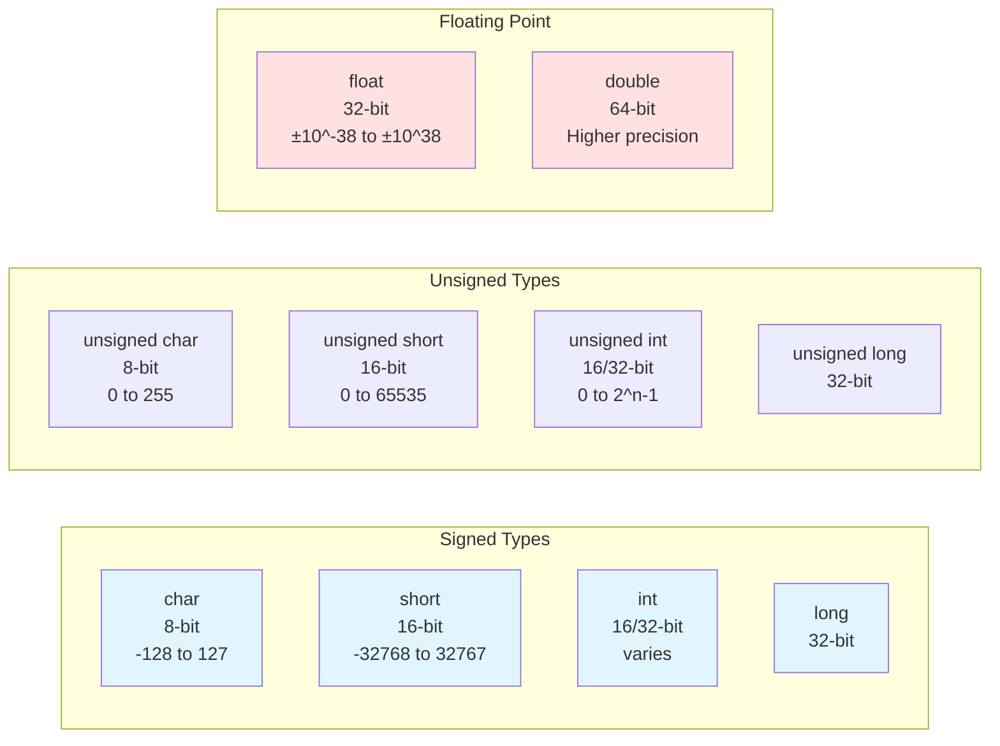

C is quite permissive about statement positioning. Proper indentation and use of white space are crucial in making programs easy for users to read.

---

## Integer Division and Type Conversion

<!-- OCR correction: "dovrsion" → "division", "pontre" → "point" -->

In C, integer division **truncates**, so any fractional point is discarded. For example:
- `5/9` is `0`
- `5/9.0` is `0.555...`

A decimal point in a constant indicates that it is floating point, so `5.0/9.0` is not truncated to `0` but evaluates to `0.555...`

> **Important:** Integer division truncation is a common source of bugs in calculations. Always ensure at least one operand is a floating-point type if you need fractional results: `(double)a/b` or `a/9.0`.

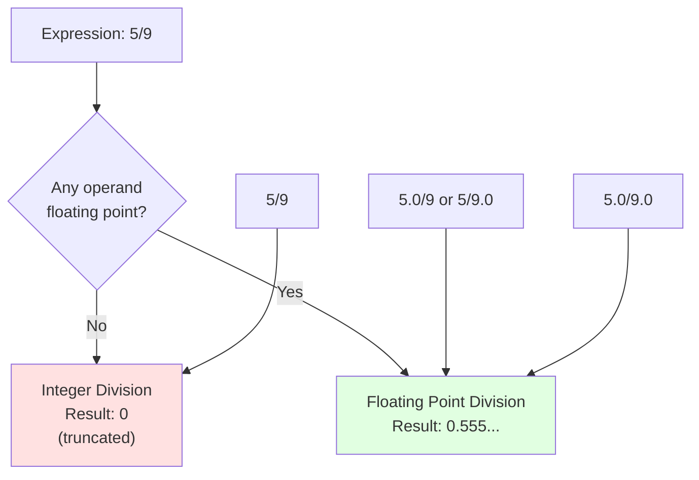

**Python Comparison:**
- Before Python V3, integer division truncated and returned an integer, just like C
- In Python 3, division of two integers performs the division operation in floating point precision and returns a floating point result

**Performance Note:**
Modern computers usually perform 64-bit floating point operations at almost the same speed as integer division.

---

## Input and Output Functions

<!-- OCR correction: "prof()" → "printf()", "Scamming" → "Scanning" -->

Input and output in C are handled through library functions rather than built-in language constructs, with `printf()` and `scanf()` serving as the primary text-based I/O mechanisms for console applications. Unlike higher-level languages where printing might be a simple built-in statement, C's approach treats I/O as formatted conversion between internal binary representations and external character streams. The `printf()` function performs output by interpreting a format string containing format specifiers (beginning with `%`) that indicate how to convert subsequent arguments from their internal binary representation into character sequences for display. Similarly, `scanf()` performs input by parsing character sequences according to format specifiers and converting them into binary values to store at specified memory addresses. This approach provides precise control over formatting—field widths, precision, padding, number bases—but requires careful coordination between format strings and argument lists. Mismatches between format specifiers and actual argument types produce undefined behavior, a common source of bugs and security vulnerabilities.

### printf()

`printf()` is actually a general-purpose format conversion function. Its first formal argument is a string of characters to be printed, with each `%` sign indicating where one of the other (second, third, ...) arguments is to be substituted, and what form it is to be printed in.

**Example:**

```c
printf("%4d %6.2f %s\n", integer, float_value, string);
```

Each `%` construction in the first argument of `printf` corresponds to the 2nd/3rd argument; the number and type must match.

<!-- OCR correction: "charratters" → "characters" -->

**Format Specifiers:**

| Specifier | Description |
|-----------|-------------|
| `%d` | Decimal integer |
| `%f` | Floating point/double |
| `%c` | Character |
| `%s` | Character string |
| `%o` | Octal |
| `%x` | Hexadecimal |
| `%%` | Literal `%` character |
| `%6.2f` | Floating number in a space of 6 characters wide, 2 decimal places |

---

### scanf()

`scanf()` performs input from the standard input device (the keyboard).

The format specifier informs `scanf` to expect a sequence of numeric ASCII keystrokes (digits 0-9), which is interpreted as a decimal number to be converted into an integer.

**Important:** Variables that are being modified by `scanf` must be preceded by an ampersand `&` character, which gives the address of that variable in memory to be substituted with the values received from `scanf()` input.

**Example:**

```c
scanf("%d", &next_char);
printf("%d\n", next_char);
```

The formatting pattern supplied to `printf()` and its argument after the format string is the same for all format specifications. The format specifiers interpret the binary pattern accordingly as specified by the programmer.

---

## Control Structures

<!-- OCR correction: "stretnes" → "structures", "futement" → "statement" -->

Control structures determine the order in which statements execute, enabling programs to make decisions (selection), repeat operations (iteration), and organize code into callable units (subroutines). C provides the standard repertoire of control structures common to imperative programming languages: conditional execution via `if-else` and `switch`, looping via `while`, `for`, and `do-while`, and non-local control transfers via `break`, `continue`, `goto`, and `return`. Understanding control structures requires understanding that program execution follows the program counter through a sequence of instructions, and control structures manipulate the program counter to deviate from simple sequential execution.

Programs are composed of control structures:

1. **SEQUENCE** - Ordered statements or sub-routines executed in sequence

2. **SELECTION** - One or a number of statements is executed depending on the state of the program
   - `if ... then ... else`

3. **ITERATION** - A statement which is executed until the program reaches a certain state or operation has been applied to every element of a collection
   - `while`, `for`, `do...while`

4. **SUBROUTINES** - Callable units (procedures, functions, methods, or subprograms) are used to allow a sequence to be referred to by a single statement

5. **BLOCKS** - Used to enable groups of statements to be treated as if they were one statement

---

### Flowchart Example: C-style for loop

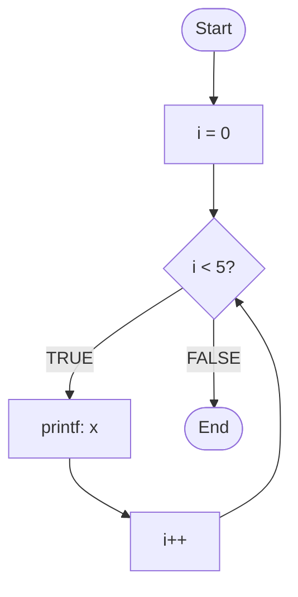

<!-- Diagram reconstructed from OCR text showing for loop structure -->

**Corresponding C code:**

```c
for (i = 0; i < 5; i++)
    printf("x");
```

---

### Loops: while vs for

<!-- OCR correction: "chores" → "choice", "Intralization" → "initialization" -->

The choice between `while` and `for` loop is arbitrary, based on what seems clearer. The `for` is usually appropriate for loops in which the initialization and re-initialization are single statements and logically related, making it more compact than `while` and keeping the loop together.

The syntax of the `for` and `while` loops is a feature of C-like languages.

**Determinate vs Indeterminate Loops:**

<!-- OCR correction: "Indeterminents" → "indeterminate", "Detormmands" → "determinate" -->

- The `for` and `while` loop structures are **indeterminate** (read them closely to ensure they're properly constructed and are not unintentionally "infinite loops")
- `foreach` loop in PHP and `for` loop in Java/Python are **determinate**

The semantics of both of these loops iterate over all of the elements in a collection (which is finite).

---

## Symbolic Constants

<!-- OCR correction: "symbolicnoma" → "symbolic name", "compilor" → "compiler" -->

Using the `#define` construction at the beginning of a program, you can define a symbolic name/symbolic constant to be a particular string of characters. Thereafter, the compiler replaces all unquoted occurrences of the name by the corresponding string.

The replacement text for the name can actually be any text at all, not limited to numbers.

**Example:**

```c
#define LOWER 0
#define UPPER 300
#define STEP 20
```

Symbolic names are commonly written in UPPER CASE so they can be readily distinguished from lower case variable names.

**Important:** No semicolon at the end of a `#define` statement.

---

## Character Input/Output

<!-- OCR correction: "libmany" → "library" -->

The standard library provides functions for reading and writing a character at a time.

### getchar()

`getchar()` fetches the next input character each time it is called, and returns that character (its value).

```c
c = getchar();
```

The variable `c` contains the next character of input (from the terminal).

### putchar()

The function `putchar()` is its complement; it prints the contents of variable `c` on some output medium.

```c
putchar(c);
```

Given `getchar()` and `putchar()`, you can write a surprising amount of useful code without knowing anything more about I/O.

**Important:** Declarations like `c = getchar()` can be used in an expression, its value being assigned to the left hand side.

---

### EOF (End of File)

<!-- OCR correction: "EOL" → "EOF" -->

```c
while ((c = getchar()) != EOF)
    putchar(c);
```

<!-- OCR correction: "gebehar" → "getchar" -->

In the absence of `()`, the relational test `!=` would be done before the assignment. The program gets a character, assigns it to `c`, and then tests whether the character was EOF (the End of File signal). If it was not, the body of the `while` loop is executed and prints the character. When EOF is finally reached, the `while` terminates.

---

## Unsigned Integers

<!-- OCR correction: "nambors" → "numbers" -->

Unsigned integers are non-negative numbers (zero and positive integers).

Called "unsigned" because they do not have a 'sign bit' (used in signed integers to indicate negative numbers).

**Ranges and Values:**

| Type | Size | Range |
|------|------|-------|
| `unsigned char` | 1 byte | 0-255 |
| `unsigned short` | 2 bytes | 0-65,535 |
| `unsigned long` | 4 bytes | 0-4,294,967,295 |
| `unsigned int` | 4 bytes | 0-4,294,967,295 |
| `unsigned int` | 2 bytes | 0-65,535 |
| `signed int` | 2 bytes | -32,768 to +32,767 |

---

## Arrays

<!-- OCR correction: "amay" → "array", "Indonded" → "indexed" -->

Arrays in C are fundamentally different from arrays in higher-level languages, representing a contiguous block of memory holding elements of identical type, with direct correspondence between array indexing notation and pointer arithmetic. An array declaration `int a[10]` allocates 40 consecutive bytes (assuming 4-byte integers) and establishes `a` as a constant pointer to the first element. The critical insight is that array access `a[i]` is syntactic sugar: the compiler immediately translates it to `*(a + i)`, computing the address of the i-th element by adding `i * sizeof(element_type)` to the base address. This reveals why array indices start at 0—the first element is at offset 0 from the base address. Arrays enable efficient sequential access patterns and are the foundation for strings (arrays of characters), but they introduce significant hazards absent in bounds-checked languages.

C provides no runtime bounds checking for array access. When you write `a[i]`, the compiler generates code that blindly computes an address and accesses that memory location, regardless of whether `i` falls within the valid range `[0, size-1]`. Accessing beyond array bounds produces undefined behavior—the program may appear to work, may crash immediately, may corrupt unrelated data, or may create security vulnerabilities. This lack of protection is deliberate: bounds checking would impose runtime overhead incompatible with C's performance goals, and system programmers need the ability to perform calculated out-of-bounds access for certain low-level operations. The programmer bears full responsibility for correctness. Buffer overflow exploits, among the most prevalent security vulnerabilities in C programs, arise directly from this design choice. Understanding arrays requires understanding that they are not "safe collections" but rather raw memory blocks with convenient indexing syntax, and that this rawness demands corresponding discipline from the programmer.

An array is a collection of similar data items that are stored sequentially in memory. All elements in the array are of the same type and are accessible through a single name (identifier).

They are a fundamental, useful data structure. From a compile-time perspective, being able to access an indexed array element using indices that can potentially be computed during runtime is powerful:

```c
for (i = index; index < 10; index++)
    array[i] = value;
```

### Base Address

<!-- OCR correction: "addren" → "address", "almond" → "element" -->

The **BASE ADDRESS** of an array `a[0]` is, in general, the address of the first element. We can access any element of the array by adding the index of the desired element.

**Important:** An array name in C refers to the address of the base element:

```c
ARRAY_NAME == &a[0]
```

The array name is similar to a pointer. When using an array name as an argument to a function, we are passing the address of the array to the function. Within the function, the parameter is assigned the address of the array (pass by reference).

We can access the elements of the original array using standard array notation. The brackets `[]` indicate to the compiler that the corresponding parameter will be the base address of an array of the specified datatype.

**Since arrays are "passed by reference in C", any modification of the array values made by the called function will be visible to the caller once control returns to it.**

---

### Array Notation, Pointer Notation, and Array Names

| Using Pointer | Using Array Name | Using Array Notation |
|---------------|------------------|----------------------|
| **Address of 0th Element** | `ptr` | `identifier` | `&identifier[0]` |
| **Address of Element n** | `(ptr + n)` | `(identifier + n)` | `&identifier[n]` |
| **Value at 0th Element** | `*ptr` | `*identifier` | `identifier[0]` |
| **Value at Element n** | `*(ptr + n)` | `*(identifier + n)` | `identifier[n]` |

<!-- Table layout reconstructed from OCR text -->

---

### Array Bounds

<!-- OCR correction: "exceeding" → "exceeding" -->

**C does not provide protection against exceeding the size (bounds) of an array.** No size/safety check. When accessing `a[i]`, the index `i` can access a memory location beyond the end of the array, producing undefined behavior.

This inability to enforce correct array size checking leads to a serious security flaw: **Buffer Overflow**.

---

### Buffer Overflow

<!-- OCR correction: "mut" → "must", "autorence" → "reference" -->

**Buffer Overflow** occurs when data is written outside the boundaries of allocated stack memory. If a "limit" exceeds the maximum size in the program, writes to `array[index]` where `index >= MAX_SIZE` will cause this write operation to happen on the stack and may overwrite adjacent memory locations.

**Security Implications:** Overwriting critical control data stored on the stack (local variables, function pointers, frame pointer, return addresses) can lead to potential adversaries maliciously controlling the flow of execution or executing arbitrary malicious code.

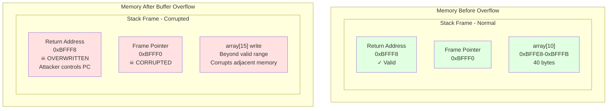

> **Important - Security Warning:** Buffer overflows are one of the most common and dangerous security vulnerabilities in C programs. Always:
> - Check array bounds before access
> - Use `sizeof(array)/sizeof(array[0])` to calculate array size
> - Prefer safer functions: `strncpy()` over `strcpy()`, `snprintf()` over `sprintf()`
> - Enable compiler protections: stack canaries (`-fstack-protector`), ASLR, DEP/NX

**Example:**

```c
#include <stdio.h>
#define MAX_SIZE 10

int main(void) {
    int index;
    int array[MAX_SIZE];
    int limit;
    
    printf("Enter a limit (integer): ");
    scanf("%d", &limit);
    
    /* NO BOUNDS CHECKING OR RESTRICTION */
    for (index = 0; index < limit; index++) {
        array[index] = 0;
        printf("array[%d] is set to 0\n", index);
    }
    
    return 0;
}
```

<!-- Code block reconstructed from scattered OCR lines -->

The stack is a region of memory used for static memory allocation (local function variables). Its size is determined by system/program settings. This example attempts to access array elements beyond its bounds. Stack overflow occurs when too much memory is used on the call stack.

---

## Character Counting Example

<!-- OCR correction: "nc" → "nc" (character count variable name preserved) -->

```c
#include <stdio.h>

int main() {
    double nc;
    
    for (nc = 0; getchar() != EOF; ++nc)
        ;
    
    printf("%.0f\n", nc);
    
    return 0;
}
```

<!-- Code block reconstructed from scattered OCR lines -->

`%.0f` suppresses printing of the non-existent fractional point.

---

## Word Counting Example

<!-- OCR correction: "chompa" → "count", "soquence" → "sequence" -->

Counts lines, words, and characters with the loose definition that a word is any sequence of characters that does not contain a blank, tab, or newline.

```c
#include <stdio.h>

#define YES 1
#define NO 0

int main() {
    int c, nl, nw, nc, inword;
    
    inword = NO;
    nl = nw = nc = 0;
    
    while ((c = getchar()) != EOF) {
        ++nc;
        
        if (c == '\n')
            ++nl;
        
        if (c == ' ' || c == '\n' || c == '\t')
            inword = NO;
        else if (inword == NO) {
            inword = YES;
            ++nw;
        }
    }
    
    printf("%d %d %d\n", nl, nw, nc);
    
    return 0;
}
```

<!-- Code block reconstructed from scattered OCR lines -->

**Note:** It's easier to make extensive changes for programs where numbers appear only as symbolic constants rather than magic numbers.

---

## Digit Counting Program

<!-- OCR correction: "ndiget" → "ndigit", "muddha" → "digit" -->

Create a program to count the number of occurrences of each digit (0-9), white space characters, and all other characters.

```c
#include <stdio.h>

int main() {
    int c, i, nwhite, nother;
    int ndigit[10];
    
    for (i = 0; i < 10; ++i)
        ndigit[i] = 0;
    
    nwhite = nother = 0;
    
    while ((c = getchar()) != EOF) {
        if (c >= '0' && c <= '9')
            ++ndigit[c - '0'];
        else if (c == ' ' || c == '\n' || c == '\t')
            ++nwhite;
        else
            ++nother;
    }
    
    printf("digits = ");
    for (i = 0; i < 10; ++i)
        printf(" %d", ndigit[i]);
    
    printf("\nwhite space = %d, other = %d\n", nwhite, nother);
    
    return 0;
}
```

<!-- Code block reconstructed from scattered OCR lines -->

This declaration `int ndigit[10];` declares `ndigit` to be an array of 10 integers. Array subscripts always start at zero in C (0-9, not 1-10).

---

## String Reverse Example

```c
#include <string.h>  /* useful for strlen function */

int main() {
    char word[100];
    int length, i;
    
    printf("Enter a word\n");
    scanf("%s", word);
    
    length = strlen(word);
    
    printf("Reversed word: ");
    
    /* i in the for loop starts from the last char of the word (length-1) */
    for (i = length - 1; i >= 0; i--)
        printf("%c", word[i]);
    
    printf("\n");
    
    return 0;
}
```

<!-- Code block reconstructed from scattered OCR lines -->

<!-- OCR correction: "Laneth" → "length" -->

The loop iterates backward from the last character (at index `length-1`) to the first character (at index `0`).

---

## External Variables (Global Variables)

<!-- OCR correction: "Vonable" → "Variable", "Betom" → "extern" -->

**External variables** are declared in a function using the keyword `extern`.

**Note:** Each local variable in a routine (function) comes into existence only when the function is called and disappears when the function exits. It is for this reason that such variables are usually known as **automatic variables** (dynamic local variables). They do not retain their values from one call to the next and must be explicitly set upon each entry. If they are not set, they will contain garbage.

Because automatic variables are globally accessible, they can be shared instead of using argument lists to communicate data between functions. They also remain in existence permanently, rather than appearing and disappearing as functions are called and exited. They retain their values even after the functions that set them are done.

An external variable has to be **defined** outside of any function; this allocates actual storage for it. The variable must also be **declared** in each function that wants to access it, either by an explicit `extern` declaration or implicitly by context.

**Common Practice:** In certain circumstances, the `extern` declaration can be omitted. If the external definition of a variable occurs in the source file before its use in a particular function, common practice is to place the definition of external variables at the beginning of the source file and then omit all `extern` declarations.

If a program is in several source files, a variable defined in file 1 and used in file 2, then an `extern` declaration is needed in file 2 to connect the two occurrences of the variable.

---

## Functions

<!-- OCR correction: "formichon" → "function", "Arquemont" → "argument" -->

Functions in C provide the mechanism for decomposing programs into manageable, reusable units of computation that can be developed, tested, and reasoned about independently. A function encapsulates a sequence of statements behind an interface consisting of a name, a parameter list specifying the types and order of input values, and a return type specifying the type of output value. C's function calling mechanism implements pass-by-value semantics: when you call a function, the values of arguments are copied into the function's parameter variables, which exist as local variables within the function's stack frame. This means modifications to parameters within the function do not affect the caller's variables—the function operates on private copies. This isolation simplifies reasoning about function behavior but limits the ability of functions to modify caller data, a limitation addressed through pointer parameters (passing addresses rather than values, enabling indirect modification). Understanding functions requires understanding their implementation in terms of the runtime stack: each function call allocates a new stack frame containing parameters, local variables, and bookkeeping information, and this frame is deallocated when the function returns.

Functions provide a convenient way to encapsulate some form of computation in a "black box" which can be used without worrying about the internals.

### Function Form

Each function has the same form:

```
function_name(argument_list, if any)
{
    argument_declarations, if any
    declarations
    statements...
}
```

<!-- OCR correction: "Coures" → "causes" -->

A function without a `return` statement and no expression causes control to return to the caller, but no useful value is returned to the caller.

Variables declared in functions are local to that function; they are not accessible to other functions. Variable names will not conflict.

---

### Function Arguments

<!-- OCR correction: "anjurand" → "argument" -->

**All function arguments are passed "by value".** This means that the called function is given the values of its arguments in temporary variables (on a stack) rather than their addresses in memory.

**Different from call by reference** - in which the called subroutine is handed the address of the argument, not its value.

Passing arguments by reference was the norm before the 1970s in languages.

Passing arguments by value was considered a slow affair. C implements a "call stack" where a bit of memory is allocated at each function call (makes a copy of the values in the calling code to pass them into the called code in a way that the calling code cannot see the values change them locally without affecting the values in the calling code). Thereby isolating the data in the calling code from the called code so that the called code can't easily mess up its arguments and create unexpected side effects in the calling code.

The same "call stack" that makes it possible for C arguments to be passed by value also makes it possible for a function to call itself (recursion/callback function).

**Since a pointer is a value in C, the called function cannot alter a variable in the calling function; it can only alter its private, temporary copy.** Call by value leads to more compact programs with fewer extraneous variables because arguments can be treated as conveniently initialized local variables in the called routine.

Values transmitted from caller to callee are called **arguments**.

---

### Modifying Caller Variables

<!-- OCR correction: "pomber" → "pointer" -->

It's possible for a function to modify a variable in the calling routine. The caller must pass a pointer to the variable to be set (use a pointer to the variable). The called function must declare the argument to be a pointer and reference the actual variable indirectly through it.

---

## Character Encoding

### ASCII vs Unicode

<!-- OCR correction: "Chorrachers" → "characters" -->

In ASCII, every letter, digit, and symbol that mattered (a-zA-Z0-9, +, -, /, ", !, etc.) were represented as a number between 32 and 127 (8-bit bytes, each byte stores 2^8 - 1 = 255 numbers).

In order to accommodate non-English characters, people used 128-255, utilizing the single byte.

---

### UTF-8, UTF-16, UTF-32

**UTF-8:**
- In UTF-8, every code point from 0-127 is stored in a single byte
- Code points above 127 are stored in 2, 3, and in fact, up to 6 bytes
- Uses a minimum of 1 byte
- UTF-8 is compatible with ASCII

**UTF-16:**
- Uses a minimum of 16 bits (2 bytes) to encode Unicode characters (0x0000 represents 0, 0xFFFF represents 65,535)
- Up to a maximum of 4 bytes (6 bytes)
- UTF-16 is no longer backward compatible with ASCII

**Main difference:** With UTF-8, the encoding of a character varies in the number of bytes it requires to represent a character in memory. If the character's code point is greater than 127 (the max value of a byte), then UTF-8 may require more bytes. UTF-16 will take only 2 or 4 bytes. UTF-32 is a fixed-width encoding scheme and always takes 4 bytes.

---

### Code Points

<!-- OCR correction: "Chorrapher" → "character" -->

A **character set** is nothing but a collection of characters, where each symbol/character is mapped to a numerical value.

**Unicode Transformation** defines an algorithm to map every Unicode code point to a unique byte sequence.

---

## Stack vs Buffer Overflow

<!-- OCR correction: "Beffer" → "Buffer" -->

**Stack Overflow** occurs when too much memory is used on the call stack. In the context of arrays, this could happen if a very large array is declared locally within a function as a local function variable or passed in via arguments as parameters.

**Buffer Overflow** occurs when data is written outside the boundaries of allocated stack memory. If a "limit" exceeds the maximum size in the program, writes to `array[index]` where `index >= MAX_SIZE` will overwrite adjacent memory locations.

**Security Implications:** Overwriting critical control data stored on the stack (local variables, function pointers, frame pointer, return addresses) can lead to potential adversaries maliciously controlling the flow of execution or executing arbitrary malicious code.

---

## Type Conversions

<!-- OCR correction: "conmomted" → "converted" -->

Type conversions in C occur both implicitly (automatic conversions inserted by the compiler according to language rules) and explicitly (conversions requested by the programmer via cast syntax). Implicit conversions follow a hierarchy of type promotion designed to preserve value and precision where possible: smaller integer types promote to larger integer types, integers promote to floating-point types when mixed with floating-point operands, and signed/unsigned conversions follow specific rules to maintain bit patterns. The most critical conversion rule to internalize is that integer division truncates—when both operands of division are integers, the result is an integer with any fractional part discarded, regardless of the destination variable's type. This behavior surprises programmers accustomed to languages with unified numeric types and is a frequent source of calculation errors. Understanding when conversions occur (in mixed-type arithmetic expressions, in assignments where left and right sides differ in type, and in function argument passing) and what information may be lost (narrowing conversions from larger to smaller types, float-to-int truncation, signed-to-unsigned reinterpretation) is essential for writing correct numerical code and avoiding subtle bugs where calculations produce unexpected results.

1. When operands of different types appear in expressions, they are converted to a common type according to rules.

2. `char` and `int` can be freely mixed in arithmetic expressions; every `char` is automatically converted to an `int`.

3. Function `atoi()` converts a string of digits into its numeric equivalent.

4. Function `tolower()` maps a single character to lower case for the ASCII character set only. Uppercase and non-alphabetic characters are left unchanged.

**Important:** When a `char` is converted to an `int`, can it ever produce a negative integer? In C, if the character set will never be negative, so those characters may be freely used in expressions as positive quantities.

> **Important:** Always use `int`, not `char`, for variables that will hold values from `getchar()` because EOF is typically -1, which cannot be represented in an unsigned char. This is a classic C pitfall.

**Note:** EOF == -1

```c
// WRONG: char cannot hold EOF (-1)
char c;
c = getchar();
if (c == EOF)     // This test will fail
```

This test will fail because there are no negative characters.

```c
// CORRECT: int can hold EOF
int c;
c = getchar();
if (c == EOF)     // This test works correctly
```

---

### Type Conversion in Assignments

<!-- OCR correction: "anhmatic" → "arithmetic" -->

Conversions take place across assignments; the value of the right side is converted to the type on the left side.

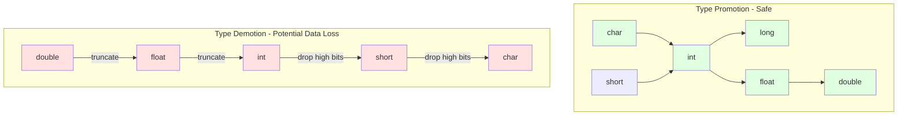

- Character is converted to an integer, either by sign extension or not
- Float to int causes truncation of any fractional part
- Double converted to float by rounding the fractional part
- Long int or int converted to short int or to char by dropping the excess high-order bits

> **Important:** Narrowing conversions (e.g., `int` to `char`) can lose data. The value `300` assigned to a `char` (8-bit, max 255) will be truncated, resulting in unpredictable behavior.

---

## Operators

C provides a rich set of operators that perform arithmetic, logical, relational, bitwise, and assignment operations on values, with defined precedence and associativity rules determining evaluation order in expressions. Operators are categorized by the number of operands (unary, binary, ternary), by the types they operate on (arithmetic operators require numeric operands, logical operators interpret operands as boolean, bitwise operators treat operands as bit patterns), and by their evaluation semantics (arithmetic operators perform mathematical calculations, assignment operators store values and have side effects, increment/decrement operators modify their operands).

### Arithmetic Operators

```
+  -  *  /  %
```

**Note:** Integer division in C truncates any fractional part. The modulus operator `%` cannot be applied to `float` or `double`.

---

### Relational and Logical Operators

```
>  >=  <  <=  (Relational)
==  !=  (Equality)
&&  ||  !  (Logical)
```

Expressions connected by `&&` or `||` are evaluated left to right, and evaluation stops as soon as the truth or falsehood is known.

**Order of Precedence:** Arithmetic Operators → Relational Operators → Equality Operators → Logical Operators

---

### Increment and Decrement

<!-- OCR correction: "Inovement" → "increment" -->

```c
++x  /* prefix: increment x before using value */
x++  /* postfix: increment x after using value */
--x  /* prefix: decrement x before using value */
x--  /* postfix: decrement x after using value */
```

The expression `++i` increments `i` before the value is used, while `i++` increments `i` after the value is used.

---

### Bitwise Operators

<!-- OCR correction: "Buturse" → "bitwise" -->

Useful for encryption/decryption and checksum calculations.

```
&    Bitwise AND
|    Bitwise inclusive OR
^    Bitwise exclusive OR (XOR)
<<   Left shift
>>   Right shift
~    One's complement (unary)
```

**Left shift:** `x << 2` shifts `x` left by 2 positions, filling vacated bits with 0.

**Right shift:** Right shifting an unsigned quantity fills vacated bits with 0.

**One's complement:** `~` yields the one's complement of an integer (converts each 1 → 0 bit and vice versa).

---

### Assignment Operators

```c
i = i + 2;   /* can be written as */
i += 2;
```

Most binary arithmetic operators have a corresponding assignment operator:

```
+=  -=  *=  /=  %=  <<=  >>=  &=  ^=  |=
```

`op1 op= op2` is equivalent to `op1 = (op1) op (op2)`, except `op1` is computed only once.

For example:
```c
x *= y + 1;  /* same as x = x * (y + 1), not x = x * y + 1 */
```

---

### Conditional Expression (Ternary Operator)

```c
if (a > b)
    z = a;
else
    z = b;
```

Can be condensed into:

```c
z = (a > b) ? a : b;
```

The expression is evaluated first. If true (non-zero), then expression `a` is evaluated and the result becomes the value of the conditional expression. Otherwise, expression `b` is evaluated and its result becomes the value.

---

## Control Flow

<!-- OCR correction: "Conte" → "control" -->

The control flow statements of a language specify the order in which computations are performed.

Braces `{` and `}` are used to group declarations and statements together into a **compound statement** or **block**, so that they are syntactically equivalent to a single statement.

---

### if-else

```c
if (expression)
    statement-1
else
    statement-2
```

---

### switch

<!-- OCR correction: "muth" → "multi" -->

A special multi-way decision maker that tests whether an expression matches one of a number of constant values and branches accordingly.

```c
switch (expression) {
    case constant_1:
        statements
        break;
    
    case constant_2:
        statements
        break;
    
    default:
        statements
}
```

When the expression matches a `case` constant value, execution starts at that `case`. `break` causes an immediate exit from the switch. The `default` label is executed if none of the cases match.

---

### while

```c
while (expression)
    statement
```

The statement is executed and the expression is re-evaluated. As long as the expression is true (non-zero), the statement continues to execute.

---

### for

```c
for (expr1; expr2; expr3)
    statement
```

This is equivalent to:

```c
expr1;
while (expr2) {
    statement
    expr3;
}
```

Most commonly, `expr1` and `expr3` are assignments or function calls, and `expr2` is a relational expression. Any of the three parts can be omitted, though the semicolons must remain.

If `expr2` is left out, it is taken to be permanently true:

```c
for (;;) {
    /* infinite loop */
}
```

The `for` is superior to `while` when there is a simple initialization and re-initialization, as it keeps the loop control statements together and visible at the top of the loop.

---

### do-while

```c
do
    statement
while (expression);
```

The statement is executed, then the expression is evaluated. If it's true, the statement is evaluated again, and so on. This is a bottom-tested loop.

---

### break

Provides an early exit from `for`, `while`, and `do` loops. A `break` causes the innermost enclosing loop (or switch) to be exited immediately.

---

### continue

<!-- OCR correction: "Contraues" → "continues" -->

Causes the next iteration of the enclosing loop (`for`, `while`, `do`) to begin. In the `while` and `do` loops, this means that the test part is executed immediately. In the `for` loop, control passes to the re-initialization step.

```c
for (c = getchar(); c != EOF; c = getchar()) {
    /* process your data */
}
```

---

### goto

An infinitely-abusable statement. The most common use case is to abandon processing in some deeply nested loop structure, such as breaking out of 2 loops at once. The `break` statement cannot be used directly since it leaves only the innermost loop where it is written.

```c
for (...) {
    for (...) {
        if (disaster)
            goto error;
    }
}

error:
    /* clean up the mess */
```

---

## Function Declarations and Definitions

<!-- OCR correction: "Indecates" → "indicates" -->

A function's **declaration** informs the compiler about the function, indicating its name, the number and types of parameters the function expects from a caller, and the type of value the function returns.

A function **definition** is the actual source code for the function. It includes a formal parameter list which indicates the names of the function's parameters in the order in which they will be expected from the caller.

**Function call:** Input values/arguments for the function are listed within parentheses `()` of the function call. The value of each argument listed in the function call is assigned to the corresponding parameter in the parameter list.

Functions in C are implemented using a similar set of mechanisms as Assembly language subroutines.

---

### Return Statement

```c
return (expression);
```

The value of the expression is always converted to the type of the function before the return value is taken. Therefore, the value of `atof`, a `double`, is converted automatically to an `int` when it appears in a return statement, since `atoi` returns an `int`.

---

## Function Arguments (Pass by Value vs Pass by Reference)

<!-- OCR correction: "temporary" → "temporary" -->

Function arguments are passed **by value**: the function receives a private, temporary copy of each argument. This means that called function cannot affect the original argument in the calling function.

**Arrays**, on the other hand, are passed **by reference** (address), though we can use pointers to permit functions to affect non-arrays in the calling function by representing their addresses in memory.

Strings are arrays of characters, so they are passed by reference too. `char` is similar to `int`, which is why collections like `list`/`dict` are passed into functions by reference so the contents can be changed within a function.

In PHP, Python, JavaScript, and Java, strings are passed by value in their default implementation.

The preceding discussion of function arguments explained C's pass-by-value semantics, where functions receive copies of arguments and cannot directly modify caller variables. This limitation is both a simplification (preventing unintended side effects) and a constraint (preventing intended modifications). Pointers resolve this tension by enabling pass-by-reference semantics within a pass-by-value framework: by passing the address of a variable rather than its value, we give the function the ability to indirectly modify the original variable through pointer dereferencing.

---

## Pointers

<!-- OCR correction: "pomber" → "pointer", "addrous" → "address" -->

Pointers represent one of the most powerful and conceptually challenging features in C, providing direct manipulation of memory addresses. A pointer is a variable whose value is the memory address of another variable or object. Understanding pointers requires grasping a fundamental distinction: memory is organized as a linear sequence of addressable locations, and each variable occupies one or more of these locations. When you declare `int *px`, you are declaring that `px` will hold the address of an integer, not the integer itself. This typed addressing is critical—pointers are constrained to point to specific types, which determines how the compiler interprets dereferencing operations and scales pointer arithmetic. Pointers enable three essential programming capabilities that would otherwise be impossible or inefficient in C: implementing dynamic data structures (linked lists, trees, graphs) where relationships between elements are established at runtime rather than compile-time; implementing pass-by-reference semantics to allow functions to modify caller variables despite C's pass-by-value calling convention; and providing an alternative notation for array access that reveals the underlying relationship between arrays and memory addresses. Without pointers, C would lose its character as a systems programming language capable of implementing operating systems, device drivers, and other software that must directly manage hardware resources.

The distinction between a pointer's address (`&px`), the pointer's value (the address it stores, accessed as `px`), and the value at the pointed-to location (accessed as `*px`) is the source of most pointer-related confusion and bugs. Mastering this triple distinction is prerequisite to understanding pointer arithmetic, function pointers, and multi-level indirection.

A **pointer** is a variable that contains the address of another variable or memory object.

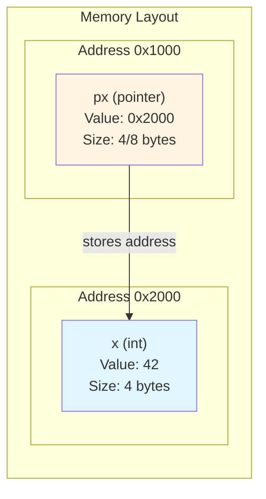

> **Important:** A pointer is just a variable that holds a memory address. The pointer itself has its own address in memory. Understanding this distinction is crucial: `&px` (address of the pointer) vs `px` (value stored in pointer, which is an address) vs `*px` (value at the address stored in pointer).

### Address Operator (&)

The unary operator `&` gives the address of an object. If `x` is an `int` variable:

```c
int *px;  /* pointer variable */
int x;

px = &x;  /* assigns the address of x to the pointer px */
```

The operator `&` can only be applied to objects in memory: variables and array elements. It cannot be applied to expressions, constants, or register variables.

---

### Dereference Operator (*)

The unary operator `*` treats its operand as the address of the ultimate target, accesses that address to fetch the contents.

```c
y = *px;  /* assigns y the contents of whatever px points to (i.e., y = x) */
```

---

### Pointer Declarations

```c
int *px;  /* px is a pointer to an int */
```

This means that `*px` is an `int`; that is, if `px` occurs in the context `*px`, the expression refers to an `int`.

**Note:** The implication in the declaration is that a pointer is constrained to point to a particular object type.

Pointers can occur in expressions. Since pointers are variables, they can be manipulated as other variables can. If `py` is a pointer, then:

```c
py = px;  /* copies the contents of px into py, making py point to what px points to */
```

---

## Pointer Arithmetic

<!-- OCR correction: "Threment" → "increment" -->

If `pa` points to a particular element of an array `a`, then `pa + 1` points to the next element, and `pa + i` points to `i` elements after the current position.

```c
pa + 1  /* points to the next element */
pa + i  /* points to i elements beyond pa */
```

The increment is scaled by the size in storage of the object that is pointed to.

```c
pa + i == &a[i]
*(pa + i) == a[i]
```

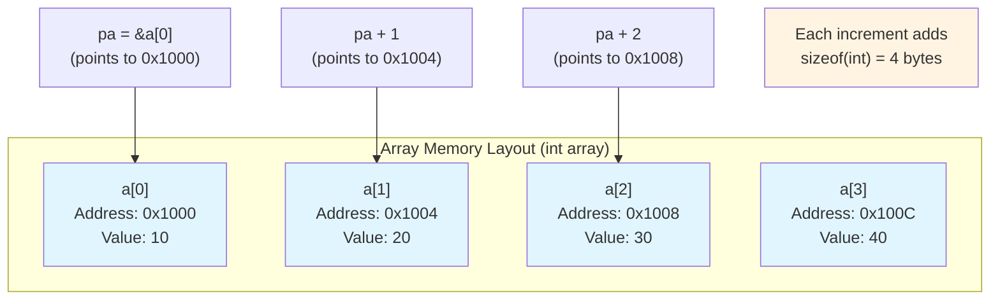

> **Important:** Pointer arithmetic is automatically scaled by the size of the pointed-to type. `pa + 1` doesn't add 1 byte; it adds `sizeof(*pa)` bytes. This is why pointer arithmetic only makes sense within arrays or with compatible types.

---

## Arrays and Pointers

<!-- OCR correction: "amay" → "array" -->

A reference to an array is converted by the compiler to a pointer to the beginning of the array. The effect is that an array name is a pointer expression.

```c
pa = &a[0];  /* same as */
pa = a;      /* array name */
```

The assignment `pa = a` assigns the base address of array `a` to pointer `pa`.

**Important Equivalence:**
```c
a[i] == *(a + i)
&a[i] == a + i
```

In evaluating `a[i]`, the C compiler converts it to `*(a + i)` immediately.

**Difference:** A pointer is a variable, so assignment and reassignment are possible (`pa = a` or `pa++`). But an array name is a constant, not a variable; operations like `a = pa` or `a++` are illegal.

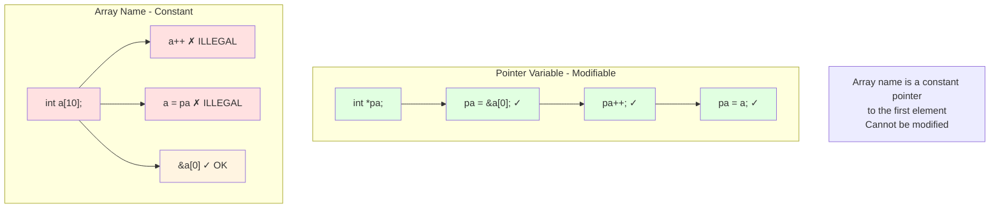

> **Important:** This is a key distinction: pointers are variables (can be modified), but array names are constants (cannot be modified). However, both can be used in pointer arithmetic expressions. The array name `a` is equivalent to `&a[0]` but cannot appear on the left side of an assignment.

---

### Passing Arrays to Functions

When an array name is passed to a function, what is passed is the location of the beginning of the array. Within the called function, this argument (array name) is a variable (a pointer containing an address).

```c
function_name(&a[2]);  /* same as */
function_name(a + 2);  /* both pass the address of element a[2] */
```

---

## Strings

<!-- OCR correction: "chorractor" → "character", "strong" → "string" -->

A **string constant**, written as `"Hello World"`, is an array of characters. The compiler terminates the array with the character `\0` so that programs can find the end. The length in storage is thus one more than the number of characters between the double quotes.

**String Constants as Arguments:**

```c
printf("Hello World\n");
```

What `printf` receives is a pointer to the character array.

---

## Multidimensional Arrays

```c
int img[1024][1920];
```

This declaration creates an array called `img` that is organized as a 2-dimensional array. The first dimension is of size 1024 (represents number of rows), and the second is of size 1920 (represents number of columns).

Instead of providing a single index value to access elements of a single-dimensional array, we now need to provide 2: one for row, one for column.

To arrange this 2D array in memory space, consecutive elements of each column are placed into consecutive memory locations (likewise for rows). With C and C++, consecutive elements of each column are in adjacent memory locations with ordering often called **row-major order**.

This idea can be extended beyond 2D to implement a 3D array by attaching another set of brackets to the declaration, thus adding another dimension. The pattern in memory space follows that of 2D arrays. Consecutive elements of the rightmost index are allocated sequentially in memory, and we move through the indices right to left. Immediately after `[0][0][59]` is `[0][1][0]`.

---

## Recursive Functions

<!-- OCR correction: "Roumsive" → "recursive" -->

**Recursion:** A function may call itself either directly or indirectly. When this happens, each invocation gets a fresh set of all automatic variables, quite independent of the previous set.

Recursion generally provides no saving in storage, since somewhere a stack of the values being processed has to be maintained. Nor will it be faster. However, recursion is especially convenient for recursively defined data structures.

**Important:** Each recursive function requires a base case to terminate recursion. Without a base case, a recursive function will never end, similar to an infinite loop in conventional iteration.

> **Important - Stack Overflow Risk:** Each recursive call consumes stack space for its stack frame (local variables, parameters, return address). Deep recursion can exhaust available stack space, causing a **stack overflow** crash. Consider:
> - Always ensure base case is reachable
> - For deep recursion (>1000 levels), consider iterative solutions
> - Tail recursion optimization (if available) can help
> - Monitor recursion depth in production code

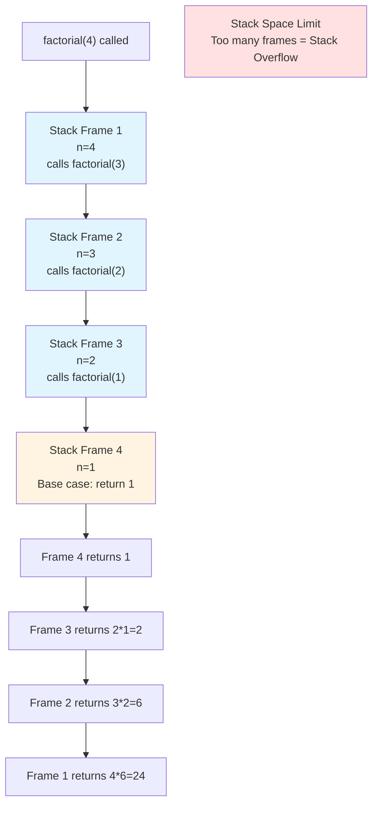

---

### Recursion Example: Factorial

```c
int factorial(int n) {
    if (n == 0 || n == 1)
        return 1;  /* base case */
    else
        return n * factorial(n - 1);
}
```

---

### Recursion Example: Binary Search

```c
int binary_search(int item, int list[], int start, int end) {
    int middle = (end + start) / 2;
    
    if (end < start)
        return -1;  /* base case: not found */
    
    if (list[middle] == item)
        return middle;  /* base case: found */
    else if (item < list[middle])
        return binary_search(item, list, start, middle - 1);
    else
        return binary_search(item, list, middle + 1, end);
}
```

Binary search running time is proportional to log(n) where n is the size of the array. Sequential search is proportional to n. For sufficiently large values, n is greater than log(n).

For n = 1,000,000, log(n) = 19.93. Still, recursive binary search is not more efficient than iterative binary search because of extra function call overhead. But it's much more efficient than sequential search.

---

### Recursion Example: Maze Exit

<!-- OCR correction: "Exit Maze" → "exit_maze", "sepos" → "xpos", "mare" → "maze" -->

Recursion is particularly useful for solving puzzles and systematic searches through all possibilities. This example demonstrates a recursive maze solver that explores all four directions (down, right, up, left) to find an exit.

```c
#define MAZE_WIDTH 4
#define MAZE_HEIGHT 7

int exit_maze(char maze[MAZE_HEIGHT][MAZE_WIDTH], int xpos, int ypos) {
    /* Base case: out of bounds */
    if (xpos < 0 || xpos >= MAZE_HEIGHT || ypos < 0 || ypos >= MAZE_WIDTH)
        return 0;
    
    /* Base case: found the exit */
    if (maze[xpos][ypos] == 'E')
        return 1;
    
    /* Base case: not an empty space */
    if (maze[xpos][ypos] != ' ')
        return 0;
    
    /* Mark this space as visited */
    maze[xpos][ypos] = 'V';
    
    /* Try all four directions */
    if (exit_maze(maze, xpos + 1, ypos)) {  /* Go Down */
        maze[xpos][ypos] = 'P';  /* Mark path */
        return 1;
    }
    
    if (exit_maze(maze, xpos, ypos + 1)) {  /* Go Right */
        maze[xpos][ypos] = 'P';  /* Mark path */
        return 1;
    }
    
    if (exit_maze(maze, xpos - 1, ypos)) {  /* Go Up */
        maze[xpos][ypos] = 'P';  /* Mark path */
        return 1;
    }
    
    if (exit_maze(maze, xpos, ypos - 1)) {  /* Go Left */
        maze[xpos][ypos] = 'P';  /* Mark path */
        return 1;
    }
    
    /* No path found from this position */
    return 0;
}
```

This recursive algorithm:
- Checks boundary conditions (base case)
- Checks if exit is found (base case)
- Marks visited spaces to prevent infinite loops
- Recursively explores all four directions
- Backtracks if no path found

The preceding sections have examined C programs from the programmer's perspective: source code expressing algorithms using variables, functions, control structures, and data structures. Understanding how these high-level constructs become executable machine code requires examining the compilation process, which translates human-readable source through multiple stages into binary instructions that the processor can execute.

---

## Compilation Process
<!-- OCR correction: "compilor" → "compiler" -->

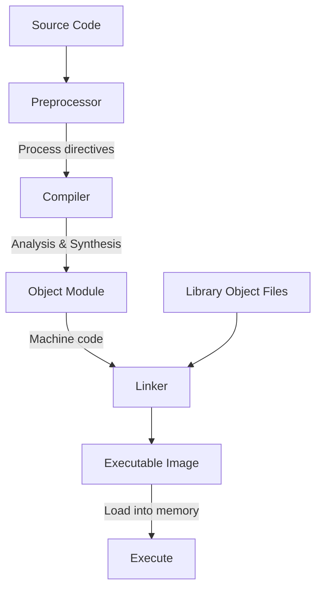

<!-- Diagram reconstructed from OCR text showing compilation pipeline -->

1. **Preprocessor** - Acts upon preprocessor directives (e.g., `#include`, `#define`)
2. **Compiler** - Analysis (parsing) and synthesis (code generation) with symbol table for debugging
3. **Object Module** - Machine code for one section of the program
4. **Linker** - Links together all object modules to form an executable (object files + library object files)
5. **Executable Image** - Loaded into memory and executed

---

## Testing and Debugging

<!-- OCR correction: "Syntatuie" → "syntactic", "Semantre" → "semantic" -->

- **Testing** - Process of exposing bugs
- **Debugging** - Process of fixing bugs

### Types of Errors

1. **Syntactic Errors** - Parse/syntax errors caught by the compiler if code doesn't conform to language rules

2. **Semantic Errors** - Similar to syntactic errors; occur for some reason when our minds and our fingers are not completely coordinated when writing code. However, it does not contain incorrect syntax. Examples: control flow error, initialization error.

3. **Algorithmic Errors** - Result of an incorrectly designed piece of code. The program itself behaves exactly as we designed, but the design itself was flawed. These errors are hidden. The famous "off by one" error is where something in our code is off by one or some factor.

4. **Specification Error** - Comes from poor specifications that don't properly anticipate the operating requirements for the software, or from poor communication, documentation, or interpretation of poorly or incorrectly written software. Even with well-conceived and well-written sets of requirements, specification errors can arise due to poor interpretation on the part of the coder of the human-intended concept.

**Debugging requires reasoning skills.** Use ad-hoc techniques (multiple test logging, work the problem only).

---

## Memory Management

Memory management encompasses the strategies and mechanisms by which a program allocates, uses, and deallocates the memory resources required for execution. In C, understanding memory management requires understanding the fundamental distinction between stack-allocated and heap-allocated memory, each serving different use cases with different lifetimes and different allocation strategies. The stack operates automatically with function calls: when a function begins execution, space for its local variables is allocated on the stack by adjusting the stack pointer; when the function returns, that space is reclaimed by restoring the stack pointer to its previous position. This automatic lifetime management is fast and predictable but inflexible—stack-allocated variables have lifetimes strictly tied to their enclosing function's execution, and stack space is limited (typically 1-8 MB). The heap, by contrast, provides dynamic memory allocation via `malloc()`, `calloc()`, `realloc()`, and `free()`, allowing programs to request arbitrary amounts of memory at runtime that persists until explicitly deallocated. This flexibility enables data structures whose size is unknown at compile time and objects that must outlive their creating function, but requires manual lifetime management and introduces the possibility of memory leaks (failing to free allocated memory) and dangling pointers (accessing memory after it has been freed).

The memory layout of a C program reflects this distinction: the text segment contains read-only program code; the data segment contains global and static variables with fixed addresses; the heap grows from low addresses toward high addresses as allocations occur; and the stack grows from high addresses toward low addresses as functions are called. Understanding this layout is essential for reasoning about pointer validity, recognizing stack overflow conditions, and comprehending why certain programming patterns are unsafe. Modern systems also implement memory protection mechanisms (ASLR, DEP/NX, stack canaries) that exploit this structure to defend against exploitation, but these mechanisms cannot eliminate the fundamental risks introduced by manual memory management—they can only make exploitation more difficult. Mastery of memory management in C means understanding not just the API (`malloc`/`free`) but the underlying memory model and the consequences of deviating from correct usage patterns.

### Stack vs Heap

<!-- OCR correction: "momory" → "memory" -->

The solution to how arguments are passed, return value is returned, and the allocation of local variables involves something that has become the cornerstone of digital systems ISA: the **run-time stack**.

Instead of allocating the space for local variables **statically** (i.e., fixed place in memory), space is allocated once the function starts executing. When the function returns to the caller, its space is reclaimed to be assigned later to another function.

In situations where a function is called from itself (recursive), the new invocation of the function will get its own space, in addition to the space associated with other currently active invocations.

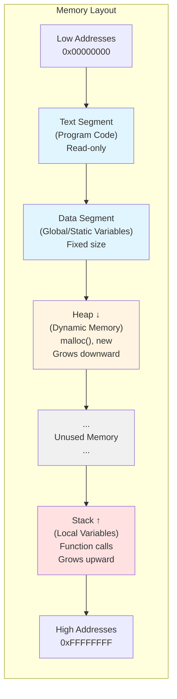

> **Important:** Understanding stack vs heap allocation:
> - **Stack:** Fast, automatic allocation/deallocation, limited size (~1-8 MB), LIFO order
> - **Heap:** Slower, manual management (`malloc`/`free`), larger size (limited by RAM), no inherent order
> - Stack overflow occurs when stack grows into heap region
> - Heap fragmentation can occur with dynamic allocation/deallocation

---

### Stack Frame (Activation Record)

```
┌─────────────────────────┐  ← Lower addresses (0x0000)
│   Callee Local Vars     │
├─────────────────────────┤
│   Bookkeeping Info      │  ← Frame Pointer (RBP/R5)
│   (Return address, etc) │
├─────────────────────────┤
│   Parameters/Arguments  │
├─────────────────────────┤
│   Return Value          │
├─────────────────────────┤
│   Caller Frame Pointer  │
├─────────────────────────┤
│   Caller's frame...     │
└─────────────────────────┘  ← Stack Pointer (RSP/R6)
                              Higher addresses (0xFFFF)
```

<!-- Stack diagram reconstructed from OCR text -->

Each function has a memory template called a **stack frame** or **activation record** where it stores:
- Local variables
- Bookkeeping information (return address, caller pointer)
- Function parameters
- Return value

The calling pattern of functions naturally follows a stack-like pattern; the allocation and deallocation of memory follow the pushes and pops of the stack.

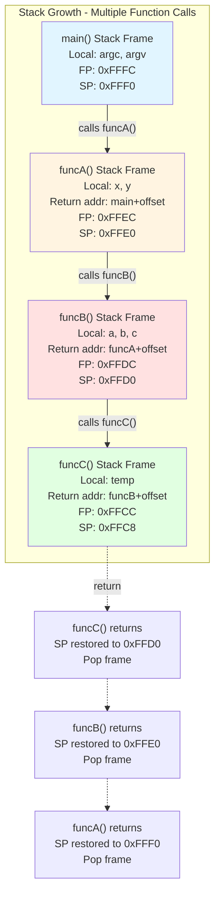

> **Important:** Each function call pushes a new stack frame; each return pops a frame. The stack pointer (SP) and frame pointer (FP/BP) work together to manage this. The FP provides a stable reference point for accessing parameters and local variables, while SP changes as items are pushed/popped.

---

### Calling Convention

1. The **caller** function pushes the value of each argument onto the stack and performs a jump to the **callee**
2. The **callee** allocates space for the return value, saves the caller's frame pointer, saves the return address, then allocates space on the stack for its local variables and parameters
3. The callee proceeds with its task, completes it, and writes the return value into the space reserved for it
4. The callee pops and restores the frame pointer to the caller and returns control to the caller
5. The caller then pops the return value and arguments from the stack and resumes its execution

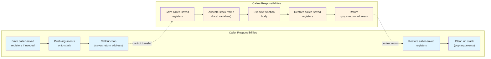

> **Important:** Register save conventions define which registers each party must preserve:
> - **Caller-saved (volatile):** Caller must save these if needed after the call (e.g., RAX, RCX, RDX in x86-64)
> - **Callee-saved (non-volatile):** Callee must save and restore these if it uses them (e.g., RBX, RBP, R12-R15 in x86-64)
> 
> Violating calling conventions leads to subtle bugs where register values are unexpectedly corrupted.

A caller does not need to know anything about a callee except its interface (types of arguments it expects, type of value it returns).

A callee is written to be independent of the functions that call it.

---

## Library Functions

A **library** is a collection of pre-tested, working components that programmers can use in writing their code.

---

*End of C/C++ Notes*
