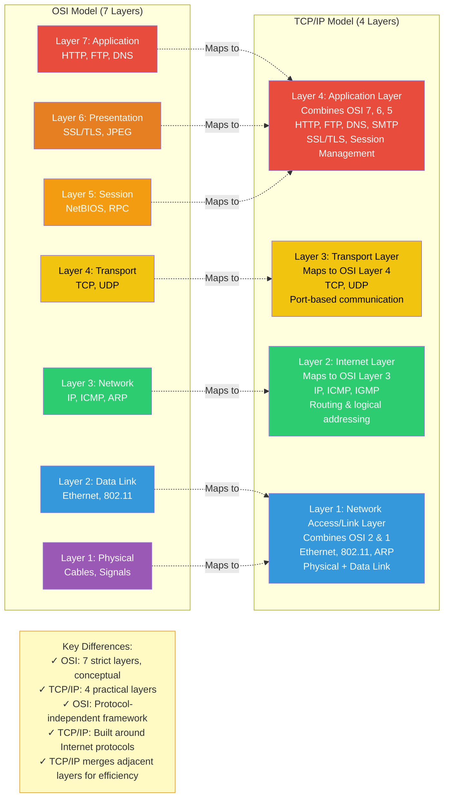

# Networking Fundamentals and Protocol Layers

# Networking Protocols - CCNA/CCNP Study Guide

## Table of Contents

1. OSI & TCP/IP Implementation of Networking Protocols
2. TCP/IP Network Model and Implementation
3. Internet Protocol Addressing Techniques
4. Transport Layer
5. Application Layer
6. Voice and Video Protocols
7. Cabling Standards (Ethernet & Fibre)
8. Device Categorization
9. Device Configuration
10. Switches (Layer 2)
11. Routers (Layer 3)
12. Management Plane/Layer Protocols
13. Control Plane/Layer Protocols
14. Network Device Security
15. Architecture, Design, Topology
16. Troubleshooting & Information Gathering Tools
17. Network Troubleshooting Methodology
18. Wireless Standard & Wireless Security
19. Software Defined Networking
20. Infrastructure as Code (IaC): Automation & Orchestration

---

## Chapter 1: OSI & TCP/IP Implementation of Networking Protocols

A NETWORK is two or more computers or devices that are linked in order to share information. Networks are broken into different subsets based on their size and function. The OSI (Open Systems Interconnection) model provides a conceptual framework for understanding network functions.
The OSI Model was developed in the 1970s and 1980s, and it is a conceptual model that breaks networking into seven separate layers. Each layer refers to a set of functions that are responsible for specific tasks. In the OSI model, the definition of the application layer is narrower in scope. The OSI model defines the application layer as only the interface responsible for communicating with host-based and user-facing applications. OSI then explicitly distinguishes the functionality of two additional layers, the session layer and presentation layer, as separate levels below the application layer and above the transport layer. OSI specifies a strict modular separation of functionality at these layers and provides protocol implementations for each. In contrast, the Internet Protocol Suite compiles these functions into a single layer.

The processes of encapsulation and de-encapsulation work in exactly the same way with the TCP/IP model as they do with the OSI model. At each layer of the this models a header is added during Data_encapsulation, and removed during Data_de-encapsulation.

**OSI Model - 7 Layers with Data Encapsulation:**

```mermaid
graph TB
    subgraph Sender["Sender: Data Encapsulation ⬇"]
        L7S["Layer 7: Application\nHTTP, FTP, DNS, SMTP\nUser data"]
        L6S["Layer 6: Presentation\nEncryption, Compression\nSSL/TLS, JPEG"]
        L5S["Layer 5: Session\nSession management\nNetBIOS, RPC"]
        L4S["Layer 4: Transport\nTCP/UDP Headers\nSegments/Datagrams\nPort numbers"]
        L3S["Layer 3: Network\nIP Header\nPackets\nSource/Dest IP addresses"]
        L2S["Layer 2: Data Link\nMAC Header + Trailer\nFrames\nSource/Dest MAC addresses"]
        L1S["Layer 1: Physical\nBits\nElectrical signals, cables\n1s and 0s"]
    end

    Medium["Transmission Medium\nEthernet, WiFi, Fiber"]

    subgraph Receiver["Receiver: Data De-encapsulation ⬆"]
        L1R["Layer 1: Physical\nBits received\nConvert signals to data"]
        L2R["Layer 2: Data Link\nRemove MAC Header/Trailer\nCheck frame integrity"]
        L3R["Layer 3: Network\nRemove IP Header\nRoute to correct host"]
        L4R["Layer 4: Transport\nRemove TCP/UDP Header\nReassemble segments"]
        L5R["Layer 5: Session\nManage session state"]
        L6R["Layer 6: Presentation\nDecrypt, Decompress"]
        L7R["Layer 7: Application\nDeliver to application\nUser sees data"]
    end

    L7S -->|Add headers| L6S
    L6S -->|Add headers| L5S
    L5S -->|Add headers| L4S
    L4S -->|Add TCP/UDP header| L3S
    L3S -->|Add IP header| L2S
    L2S -->|Add MAC header/trailer| L1S
    L1S -->|Transmit bits| Medium

    Medium -->|Receive bits| L1R
    L1R -->|Remove physical encoding| L2R
    L2R -->|Strip MAC header/trailer| L3R
    L3R -->|Strip IP header| L4R
    L4R -->|Strip TCP/UDP header| L5R
    L5R -->|Session data| L6R
    L6R -->|Decoded data| L7R

    PDU1["PDU at each layer:\nL7-L5: Data\nL4: Segment/Datagram\nL3: Packet\nL2: Frame\nL1: Bits"]

    style L7S fill:#E74C3C,color:#fff
    style L6S fill:#E67E22,color:#fff
    style L5S fill:#F39C12,color:#fff
    style L4S fill:#F1C40F,color:#000
    style L3S fill:#2ECC71,color:#fff
    style L2S fill:#3498DB,color:#fff
    style L1S fill:#9B59B6,color:#fff
    style L7R fill:#E74C3C,color:#fff
    style L6R fill:#E67E22,color:#fff
    style L5R fill:#F39C12,color:#fff
    style L4R fill:#F1C40F,color:#000
    style L3R fill:#2ECC71,color:#fff
    style L2R fill:#3498DB,color:#fff
    style L1R fill:#9B59B6,color:#fff
    style Medium fill:#34495E,color:#fff
    style PDU1 fill:#FFF9C4,stroke:#F39C12
```



*Figure: OSI Model showing data encapsulation (adding headers at each layer) on the sender side and de-encapsulation (removing headers) on the receiver side. Each layer has a specific Protocol Data Unit (PDU) name.*

### Layer 1: Physical Layer (Cabling involving Data Bits/Streams))

The Physical, and lowest layer of the model, covers how unstructured data, like bits, is transmitted. Over these wires and signals, the raw data bits are received as a stream of 0s and 1s. Fixing errors that occur just at this layer means considering physical damage or interference. Some concrete examples of this are the ways wires are configured, the way signals are transferred over those wires, and the radio frequencies computers use. Technology such as WiFi, Bluetooth, and cable standards such as CAT5 and CAT6 all operate at this layer. This layer also includes the hardware part of modems, adapters, and repeaters.

* **Function:** Defines the means of transmitting raw bits over a physical data link connecting network nodes. It deals with hardware, cabling, and communication specifications.
* **Key Aspects:**
    * Translates bits into physical signals (electrical, light, radio).
    * Specifies electrical signals, physical connections, cabling types, and pin-outs.
    * Governs hardware specifications (e.g., RJ-45, fiber optic connectors, radio frequencies).
    * **Media Types:** Cat-5, Cat-6, Fiber Optic, Radio Waves, Infrared, Copper.
    * **Units:** Bits.
    * **Protocols/Standards:** Ethernet Physical Layer, USB, DSL, ISDN, Bluetooth.
* **Devices:** Hubs (obsolete), repeaters, network interface cards (NICs), modems, transceivers.

### Layer 2: Data Link Layer (Switching involving Data Frames)
The Data Link layer covers how data is sent from device to device when they are connected on the same local network. 

* **Function:** Provides reliable data transfer between adjacent network nodes. It handles physical addressing (MAC addresses), error detection (and sometimes correction), and defines how devices access the physical medium (e.g., CSMA/CD for Ethernet, CSMA/CA for Wi-Fi). It creates **frames**.
* **Components:**
    * **Switches:** Modern Layer 2 devices that forward frames based on MAC addresses. They create **separate collision domains** for each port, improving performance significantly over hubs.
    * **Network Interface Cards (NICs):** Process MAC addresses and frames.
    * **Wireless Access Points (APs):** At Layer 2, they bridge wireless clients to the wired network.
* **Performance Impact:**
    * **Switching Speed/Throughput:** High-performance switches can forward frames at wire speed, preventing bottlenecks.
    * **VLANs:** Properly configured VLANs segment broadcast domains, reducing broadcast traffic and improving network efficiency and security. Misconfigured VLANs can cause communication issues.
    * **Spanning Tree Protocol (STP):** Prevents Layer 2 loops but can block redundant paths, impacting potential bandwidth if not managed (e.g., with EtherChannel/LAG).
    * **MAC Address Table Size:** Affects how many devices a switch can learn and manage.

### Layer 3: Network Layer (Routing involving Data Packets)
The Network layer describes how data packets are routed between wider networks such as the Internet.  Data packet at the network layer is routed from a source IP address to a destination IP address via Domain Name System.
* **Function:** Handles logical addressing (IP addresses), routing of packets across different networks (inter-network communication), and path determination. It creates **packets**.
* **Components:**
    * **Routers:** Dedicated Layer 3 devices that make forwarding decisions based on IP addresses and routing tables. They connect different IP networks and create **separate broadcast domains**.
    * **Layer 3 Switches (Multi-Layer Switches):** Can perform both Layer 2 switching and Layer 3 routing functions.
    * **Firewalls:** Often operate at Layer 3 (and higher) for filtering traffic based on IP addresses and ports.
* **Performance Impact:**
    * **Routing Protocol Efficiency:** Efficient routing protocols (e.g., OSPF, EIGRP, BGP) quickly learn network changes and converge, minimizing downtime and packet loss.
    * **Router Processing Power:** Affects how quickly packets can be forwarded, especially for complex routing decisions or large numbers of routes.
    * **Network Congestion:** Routers play a key role in managing traffic flow and can be points of congestion if not adequately provisioned.
    * **Subnetting/IP Addressing Scheme:** A well-designed IP addressing scheme simplifies routing and improves network efficiency.
    * **ACLs/Firewall Rules:** Can add processing overhead, impacting throughput if too complex or numerous.


### Layer 4: Transport Layer (Involves Data Segments-TCP, Datagrams-UDP)
Layers 1 through 3 of the OSI Model are concerned with addressing, packet forwarding, and delivery, establishing basic connectivity. Layer 4, the **Transport Layer**, focuses on providing the transport services that network applications depend upon. 
The Transport layer refers to how data is actually transferred. The transport layer handles how the data(files, media, etc) from user/client are split (segmentation), the rate at which the packets are sent, and how errors are handled if data packets don’t make it to the site’s server. The most common transport protocols on the Internet are TCP (Transmission Control Protocol) and UDP (User Datagram Protocol). 
* **Function:** Deals with the transparent transfer of data between end users, providing reliable data transfer services to the upper layers. It handles segmenting data from the session layer and reassembling it into a data stream on the receiving end.
* **Key Aspects:**
    * **Reliability:** Manages connection-oriented communication (e.g., TCP) or connectionless (e.g., UDP).
    * **Flow Control:** Manages data transmission rates to prevent faster senders from overwhelming slower receivers.
    * **Congestion Control:** Manages network traffic to avoid overloading the network.
    * **Segmentation & Reassembly:** Breaks data from the session layer into segments (TCP) or datagrams (UDP) and reassembles them at the destination.
    * **Error Correction:** Detects and handles errors in data transmission (primarily TCP).
    * **Port Numbers:** Uses port numbers to identify specific applications or services.
* **Units:** Segments (TCP) or Datagrams (UDP).
* **Protocols:** TCP (Transmission Control Protocol), UDP (User Datagram Protocol), SCTP (Stream Control Transmission Protocol), DCCP (Datagram Congestion Control Protocol).

**TCP Three-Way Handshake - Connection Establishment:**

```mermaid
sequenceDiagram
    participant Client
    participant Server

    Note over Client,Server: TCP Three-Way Handshake\nEstablishes Connection

    Client->>Server: 1. SYN\nSEQ = 1000\nPort: Random → 80
    Note left of Client: Client initiates connection\nState: SYN_SENT\nChooses initial SEQ number

    Server->>Client: 2. SYN-ACK\nSEQ = 5000, ACK = 1001\nPort: 80 → Random
    Note right of Server: Server acknowledges\nState: SYN_RECEIVED\nChooses own SEQ, ACKs client SEQ+1

    Client->>Server: 3. ACK\nSEQ = 1001, ACK = 5001\nPort: Random → 80
    Note left of Client: Client acknowledges\nState: ESTABLISHED\nACKs server SEQ+1

    Note over Server: State: ESTABLISHED
    Note over Client,Server: Connection Ready for Data Transfer

    rect rgb(240, 255, 240)
        Note over Client,Server: Data Exchange Phase
        Client->>Server: Data Segment\nSEQ = 1001, ACK = 5001\n100 bytes of data
        Server->>Client: ACK\nSEQ = 5001, ACK = 1101\nAcknowledges 100 bytes received
    end

    rect rgb(255, 240, 240)
        Note over Client,Server: Connection Termination (4-Way)
        Client->>Server: FIN\nSEQ = 1101, ACK = 5001
        Server->>Client: ACK\nSEQ = 5001, ACK = 1102
        Server->>Client: FIN\nSEQ = 5001, ACK = 1102
        Client->>Server: ACK\nSEQ = 1102, ACK = 5002
    end

    Note over Client,Server: Connection Closed

    KeyConcepts["Key TCP Features:\n✓ Reliable: Guarantees delivery via ACKs\n✓ Connection-oriented: Handshake before data\n✓ Flow control: Window size management\n✓ Congestion control: Prevents network overload\n✓ Error detection: Checksums verify integrity"]

    style KeyConcepts fill:#FFF9C4,stroke:#F39C12
```

*Figure: TCP three-way handshake for connection establishment. Client sends SYN, server responds with SYN-ACK, client sends final ACK. Connection state progresses from SYN_SENT → SYN_RECEIVED → ESTABLISHED. TCP ensures reliable, ordered data delivery through sequence numbers and acknowledgments.*

### Layer 5: Session Layer
When two computers or devices have established connection / started an exchange of information, we call that a session. The Session layer in OSI is responsible for opening, closing, and maintaining sessions. In terms of opening and closing, the session layer includes authentication and authorization measures. For example, without logging in or having the right permissions, you may not be able to connect to parts of a website. But if you are logged in, your access permission is stored for a set amount of time, or session length.
* **Function:** Establishes, manages, and terminates the connections (sessions) between applications. It enables the applications to send and receive data in an organized manner.
* **Key Aspects:**
    * **Dialogue Control:** Manages turn-taking in communication (who sends, when, for how long).
    * **Synchronization:** Inserts checkpoints into the data stream (e.g., for large file transfers) to allow recovery from network failures.
    * **Session Management:** Creates, maintains, and tears down sessions between processes.
* **Units:** Data (as organized into sessions).
* **Protocols/APIs:** NetBIOS, RPC (Remote Procedure Call), Sockets API, SQL.

### Layer 6: Presentation Layer
The Presentation layer includes all the methods that convert data into a format usable by an application⬇️. This layer handles functions such as encoding/decoding, encryption/decryption, and compression/decompression of files.
* **Function:** Ensures that data is presented in a format that the application layer can understand. It handles data format, encryption/decryption, and compression/decompression.
* **Key Aspects:**
    * **Data Formatting/Translation:** Translates data into a standard format (e.g., ASCII, EBCDIC).
    * **Encryption/Decryption:** Handles the encryption and decryption of data for secure communication.
    * **Compression/Decompression:** Compresses data for efficient transmission and decompresses it upon reception.
* **Units:** Data (in formatted/translated state).
* **Protocols/Standards:** JPEG, GIF, MPEG, ASCII, EBCDIC, SSL/TLS (though often seen spanning Presentation and Session, sometimes Transport).

### Layer 7: Application Layer
The application layer of the OSI model essentially provides networking options to programs running on a computer. It works almost exclusively with applications, providing an interface for them to use in order to transmit data. The final layer of the OSI model is the Application layer. This layer includes websites, browsers, email, mobile applications, and how they render Internet data so that we can interact with it.
* **Function:** Provides network services directly to end-user applications. It is the layer closest to the end user and enables users to interact with network services.
* **Key Aspects:**
    * Interacts with software applications that implement a communicating component.
    * Defines protocols for end-user services.
    * Provides user interfaces for network services.
* **Units:** Data (in application-specific format).
* **Protocols:** HTTP, FTP, SMTP, DNS, SSH, Telnet, DHCP, POP3, IMAP, SNMP.

---


## Chapter 2: TCP/IP Network Model and Implementation 
In the Internet protocol suite, the application layer contains the communications protocols and interface methods used in process-to-process communications across an Internet Protocol (IP) computer network. The application layer only standardizes communication and depends upon the underlying transport layer protocols to establish host-to-host data transfer channels and manage the data exchange in a client–server or peer-to-peer networking model. Though the TCP/IP application layer does not describe specific rules or data formats that applications must consider when communicating, the original specification (in RFC 1123) does rely on and recommend the robustness principle for application design.
You will hear more often about the TCP/IP model, which is a 4-Abstraction layered model that makes direct reference to current Internet implementations. Its foundational protocols are TCP and IP.

### OSI vs. TCP/IP Model Comparison

| Feature           | OSI Model                                    | TCP/IP Model                                   |
| :---------------- | :------------------------------------------- | :--------------------------------------------- |
| **Layers** | 7 Layers                                     | 4 or 5 Layers (Network Access, Internet, Transport, Application) |
| **Purpose** | Conceptual framework, standardized design    | Practical, industry-standard, widely implemented |
| **Development** | Developed by ISO                              | Developed by ARPA (DOD)                         |
| **Reliability** | Connection-oriented (Transport), Connection-less (Network) can be implemented | Both connection-oriented (TCP) and connectionless (UDP) options |
| **Protocols** | Protocol independent                         | Protocols are built into the model              |
| **Focus** | Clear separation of services, interfaces, protocols | Less strict separation, more flexible           |
| **Relevance** | Primary reference model for understanding networking | Practical model for Internet communication      |
| **Interoperability**| More rigid due to strict layering             | More adaptable, easier for cross-platform communication |
| **Security** | Security considerations at all layers (conceptual) | Security often implemented at specific layers (e.g., IPSec at Network) |

**TCP/IP Model vs OSI Model Layer Mapping:**



*Figure: Comparison of OSI 7-layer model with TCP/IP 4-layer model. TCP/IP combines OSI's Application, Presentation, and Session layers into a single Application layer, and merges Physical and Data Link into the Network Access layer.*

### Network Interface layer / LINK LAYER
This layer emcompasses group of methods and communications protocols confined to the link that a host is physically connected to i.e the physical interface between the host system and the network hardware. It defines how data packets are to be formatted for transmission and routings. The link is the physical and logical network component used to interconnect hosts or nodes in the network and a link protocol is a suite of methods and standards that operate only between adjacent network nodes of a network segment. The link layer includes the protocols that define communication between local (on-link) network nodes which fulfill the purpose of maintaining link states between the local nodes, such as the local network topology, and that usually use protocols that are based on the framing of packets specific to the link types.  
The goal of this layer is to provide reliable communications between hosts connected on a network. Some of the services provided by this layer of the network stack include.
Data Framing - Breaking up the data stream into individual frames in packets. Data frames are groups of data bits at the Link layer that need to be routed to the correct physical location.
Checksums - Sending checksum data for each frame to enable the receiving node to determine whether or not the frame was received error-free/Corruption-free via Frame Check Sequence
Acknowledgment - Sending either a positive (data was received) or negative (data was not received but expected) acknowledgement from receiver to sender to ensure reliable data transmission.
Flow Control - Buffering data transmissions to ensure that a fast sender does not overwhelm a slower receiver.
Includes Various Protocols such as Wired Ethernet IEEE802.3, Wireless LAN IEEE802.11(WIFI), Neighbor Discovery Protocol(NDP), Secure Neighbor Discovery (SEND), Gratuitous ARP(GARP), Point-to-point Protocol(PPP), Media Access Control Protocols I.e Carrier-sense multiple access with collision detection (CSMA/CD) is a media access control (MAC) method used most notably in early Ethernet technology for local area networking. It uses carrier-sensing to defer transmissions until no other stations are transmitting. This is used in combination with collision detection in which a transmitting station detects collisions by sensing transmissions from other stations while it is transmitting a frame. When this collision condition is detected, the station stops transmitting that frame, transmits a jam signal, and then waits for a random time interval before trying to resend the frame. CSMA/CD is a modification of pure carrier-sense multiple access (CSMA). CSMA/CD is used to improve CSMA performance by terminating transmission as soon as a collision is detected, thus shortening the time required before a retry can be attempted.  
In Internet Protocol (IP) networks, the MAC address of an interface corresponding to an IP address may be queried with the Address Resolution Protocol (ARP) for IPv4 and the Neighbor Discovery Protocol (NDP) for IPv6, It routes data frames to the correct physical/MAC addresses. A switch (could be your computer or router) keeps track of local devices and their MAC addresses and makes sure data frames get to the correct physical location. Also Reverse Address Resolution Protocol(RARP) Operates here.
This particular layer has several unique security vulnerabilities that can be exploited by a determined adversary.
Wired Networks 
✔️ Content Address Memory(CAM)/ MAC Address table exhaustion attack
✔️ Address Routing Protocol(ARP) spoofing
✔️ Dynamic Host Config Protocol(DHCP) starvation
Wireless Networks 
✔️ Hidden Node Attack
✔️ De-auth(De-authentication) Attack

### INTERNET LAYER 
Is a Layer of group of Internetworking methods(concepts of connecting multiple networks with each other via gateways), protocols & specifications that are used to transport network packets(IP-based packets) from the ordination host across network boundaries, If necessary to the destination host specified by an Internet protocol address put simply, This is where IP Logical Addressing system and Routing occur. A common design aspect in the internet layer is the robustness principle: "Be liberal in what you accept, and conservative in what you send"

In its operation as a connectionless protocol, the internet layer is not responsible for reliable transmission. It provides only an unreliable service, and best effort delivery. This means that the network makes no guarantees about the proper arrival of packets. This in accordance with the *end-to-end principle*. Since packet delivery across diverse networks is an inherently unreliable and failure-prone operation, the burden of providing reliability was placed with the end points of a communication path, i.e., the hosts, rather than on the network. This is one of the reasons of the resiliency of the Internet against individual link failures and its proven scalability. The aspect of data integrity function of providing reliability of service is the duty of higher level protocols, such as the (TCP) in the transport layer. 

The internet layer has three basic functions:
Routing: Is the forwarding of packets from a source host to the next router that is one hop closer to the intended destination host on another network through gateways.
For outgoing packets, select the next-hop host (gateway) and transmit the packet to this host by passing it to the appropriate link layer implementation. 
For incoming packets, capture packets and pass the packet payload up to the appropriate transport layer protocol, if appropriate.
Provide Error Detection & Diagnostic Capability. Usually through Internet Control Message Protocol(ICMP) & Internet Group Management Protocol(IGMP)


### TRANSPORT LAYER 
The transport layer is responsible for delivering data to the appropriate application process on the host computers. The services in this layer are conveyed to an Application Programming Interface through the transport layer protocols, Their services may include the following features.
✔️Connection-Oriented Communication
✔️Same Order Delivery
✔️Reliability through error-detection code I.e Checksum, SYN/ACK
✔️Flow Control Management
✔️Traffic Congestion Avoidance 
✔️Multiplexing==>Ports providing multiple endpoints on single node.
*Transport Layer Protocols includes also
UDP-lite
Reliable UDP(RUDP) 
Multipath TCP 
Stream Control Transmission Protocol(SCTP) 
Datagram Congestion Control Protocol(DCCP) 

At this layer, the TCP/IP protocol suite defines how different applications on separate hosts establish connections and track communications.
Understanding how protocols use ports to establish connections is critical for configuring and supporting network services. Protocols at the Transport layer are concerned with the delivery of **multiplexed application data**.

A TCP/IP host may be running multiple services/applications or communicating in parallel with multiple servers, clients, and peers. This means that incoming packets must be directed to the appropriate service or application. To facilitate this, each TCP/IP application type is assigned a unique identifier called a **Port Number**.

* **0-1023:** **Well-known ports** (assigned by IANA to common services like HTTP, FTP, SSH).
* **1024-49151:** **Registered ports** (can be registered for specific applications but are not "well-known").
* **49152-65535:** **Dynamic/Private/Ephemeral ports** (client applications assign their own temporary port numbers to track their requests; often called **Source Ports**).

A **Socket** is a software process that identifies a specific endpoint for communication. A connection is formed when a client requests a service from a server using a combination of IP address and port number.

* **Client Socket:** `Client IP:Client PORT` (e.g., `192.168.1.10:51234`)
* **Server Socket:** `Server IP:Server PORT` (e.g., `192.168.1.1:80`)

A server socket can support multiple connections from a number of client sockets, and a client may open multiple connections to the same server port. Each combination of Source Socket and Destination Socket forms a separate connection, listed in the host's **State Table**. Server replies are directed to the ephemeral (client) port that opened the connection, allowing data to be received by the correct application on the client.


### APPLICATION LAYER 
This includes the opening and closing of sessions, translating data, and the interaction with content at the application level. Here, there are multiple protocols for web content, email, and accessing files, including HTTP, FTP, SMTP, and more. 

---


## Chapter 3: Internet Protocol Addressing Techniques 

### Transport Layer Overview
* **Function:** Responsible for end-to-end communication between applications on different hosts. It segments data from the application layer and reassembles it at the destination.
* **Key Services:**
    * **Segmentation and Reassembly:** Breaks application data into smaller units (segments/datagrams) for transmission and reconstructs them at the receiver.
    * **Multiplexing and Demultiplexing:** Allows multiple applications to share a single network connection by using port numbers.
    * **Error Checking:** Detects errors in transmission.
    * **Connection Management:** (For TCP) Establishes, maintains, and terminates connections.
    * **Flow Control:** Manages the rate of data transmission between sender and receiver.
    * **Congestion Control:** Manages network traffic to avoid overloading the network.
* **PDU:** Segments (TCP) or Datagrams (UDP).
* **Core Protocols:** TCP and UDP.


### Transmission Control Protocol (TCP)

The Transmission Control Protocol provides a communication service at an intermediate level between an Application program & the Internet Protocol. It provides host-to-host connectivity at the transport layer of the Internet model. At the transport layer, TCP handles all handshaking and transmission details and presents an abstraction of the network connection to the application typically through a network socket interface.

At the lower levels of the protocol stack(I.e IP), due to network congestion, traffic load balancing, or unpredictable network behaviour, IP packets may be lost, duplicated, or delivered out of order. TCP detects these problems, requests re-transmission of lost data, rearranges out-of-order data and even helps minimize network congestion to reduce the occurrence of the other problems. If the data still remains undelivered, the source is notified of this failure. Once the TCP receiver has reassembled the sequence of octets originally transmitted, it passes them to the receiving application. Thus, TCP abstracts the application's communication from the underlying networking details.

TCP is optimized for accurate delivery rather than timely delivery and can incur relatively long delays (on the order of seconds) while waiting for out-of-order messages or re-transmissions of lost messages. 
TCP is a reliable stream delivery service which guarantees that all bytes received will be identical and in the same order as those sent. Since packet transfer by many networks is not reliable, TCP achieves reliability using a technique known as Selective Acknowledgement(SACK) with Re-Transmission or Duplicate Cumulative Acknowledgements (DupAcks) with Retransmission Timeout(RTO). This requires the receiver to respond with an acknowledgement message as it receives the data. The sender keeps a record of each packet it sends and maintains a timer from when the packet was sent. The sender re-transmits a packet if the timer expires before receiving the acknowledgement. The timer is needed in case a packet gets lost or corrupted.

While IP handles actual delivery of the data, TCP keeps track of segments - the individual units of data transmission that a Data Stream is divided into for efficient routing through the network. Processes transmit data by calling on the TCP and passing buffers/streams of data as arguments. The TCP packages the data from these buffers into segments and calls on the internet module [e.g. IP] to transmit each segment to the destination TCP. For example, when an HTML file is sent from a web server, the TCP software layer of that server divides the file into segments and forwards them individually to the internet layer in the network stack. The internet layer software(IP) encapsulates each TCP segment into an IP packet by adding a header that includes (among other data) the destination IP address. When the client program on the destination computer receives them, the TCP software in the transport layer re-assembles the segments and ensures they are correctly ordered and error-free as it streams the file contents to the receiving application. 

Transmission Control Protocol is a connection-oriented protocol and requires handshaking to set up end-to-end communications. Once a connection is set up, user data may be sent bi-directionally over the connection. 	User Datagram Protocol is a simpler message-based connectionless protocol. Connectionless protocols do not set up a dedicated end-to-end connection. Communication is achieved by transmitting information in one direction from source to destination without verifying the readiness or state of the receiver. 
Reliable – TCP manages message acknowledgment, retransmission and timeouts. Multiple attempts to deliver the message are made. If data gets lost along the way, data will be re-sent. In TCP, there's either no missing data, or, in case of multiple timeouts, the connection is dropped.	Unreliable – When a UDP message is sent, it cannot be known if it will reach its destination; it could get lost along the way. There is no concept of acknowledgment, retransmission, or timeout.
Ordered – If two messages are sent over a connection in sequence, the first message will reach the receiving application first. When data segments arrive in the wrong order, TCP buffers the out-of-order data until all data can be properly re-ordered and delivered to the application.	Not ordered – If two messages are sent to the same recipient, the order in which they arrive cannot be guaranteed.
Heavyweight – TCP requires three packets to set up a socket connection, before any user data can be sent. TCP handles reliability and congestion control.	Lightweight – There is no ordering of messages, no tracking connections, etc. It is a very simple transport layer designed on top of IP.
Streaming – Data is read as a byte stream, no distinguishing indications are transmitted to signal message (segment) boundaries.	Datagrams – Packets are sent individually and are checked for integrity on arrival. Packets have definite boundaries which are honored upon receipt; a read operation at the receiver socket will yield an entire message as it was originally sent.
TCP is used extensively by many internet applications, including the World Wide Web (WWW),HTTP email, File Transfer Protocol, Secure Shell, peer-to-peer file sharing, and streaming media.	No congestion control – UDP itself does not avoid congestion. Congestion control measures must be implemented at the application level or in the network.
	Broadcasts – being connectionless, UDP can broadcast - sent packets can be addressed to be receivable by all devices on the subnet.
	Multicast – a multicast mode of operation is supported whereby a single datagram packet can be automatically routed without duplication to a group of subscribers.

#### TCP Segment Structure and Header Fields

The use of sequencing, acknowledgments, and retransmission means that TCP requires numerous header fields to keep track and maintain state information. A TCP segment encapsulates application layer data.

| Field Name      | Size (Bytes) | Description                                                                                                                                              |
| :-------------- | :----------- | :------------------------------------------------------------------------------------------------------------------------------------------------------- |
| **Source Port** | 2            | Identifies the sending application.                                                                                                                      |
| **Destination Port** | 2            | Identifies the receiving application.                                                                                                                    |
| **Sequence Number (Seq #)** | 4            | The identification of the first byte of the current segment in the data stream. Allows the receiver to reassemble messages correctly and deal with out-of-order packets. |
| **Acknowledgment Number (Ack #)** | 4            | The Sequence Number of the next segment expected from the other host (i.e., the Sequence Number of the last segment received +1). Lack of acknowledgment (due to delays) or Negative Acknowledgment (NACK for lost/damaged packets) forces retransmission. |
| **Data Offset** | 4 bits       | Specifies the size of the TCP header.                                                                                                                    |
| **Reserved** | 6 bits       | Reserved for future use.                                                                                                                                 |
| **Flags** | 1 byte       | Contains control bits such as **ACK** (Acknowledgment), **SYN** (Synchronize sequence numbers - for connection initiation), **FIN** (Finish - for connection termination), **RST** (Reset - for abrupt termination). |
| **Window** | 2            | The amount of data the host is willing to receive before sending another acknowledgment. This is a key part of TCP's **flow control mechanism**.               |
| **Checksum** | 2            | Ensures the validity of the segment. Calculated on the value of not only the TCP header and payload but also part of the IP header.                           |
| **Urgent Pointer** | 2            | If urgent data is being sent, this specifies the end of that urgent data within the segment.                                                             |
| **Options** | Variable     | Allows further connection parameters to be configured. The most important is **Maximum Segment Size (MSS)**, which allows the host to specify how large the segments it receives should be, minimizing fragmentation as they are transported over data link frames. |

#### TCP Handshake and Teardown

A TCP connection is established using a **Three-Way Handshake**:
* **Function:** The process used by TCP to establish a reliable connection between two hosts before data transfer.
* **Steps:**
    1.  **SYN (Synchronize Sequence Numbers):** Client sends a SYN segment to the server, initiating the connection and proposing its initial sequence number.
    2.  **SYN-ACK (Synchronize-Acknowledgement):** Server receives SYN, responds with a SYN-ACK segment, acknowledging the client's SYN and proposing its own initial sequence number.
    3.  **ACK (Acknowledgement):** Client receives SYN-ACK, responds with an ACK segment, acknowledging the server's SYN.
* **Result:** A full-duplex, reliable connection is established, and data transfer can begin.

A host can end a session gracefully using a **Four-Way Handshake** (involving FIN and ACK flags from both sides). A host can also end a session abruptly using an **RST (Reset)** flag, typically indicating an error, failure, or suspicious activity. The server expects regular acknowledgments for segments it sends. If a timeout occurs without an acknowledgment, it means the information didn't arrive, and the server automatically resends that segment. This overhead makes TCP suitable when reliability and integrity are paramount, even if it results in slightly slower transmission.


### User Datagram Protocol (UDP)

User/Unreliable Datagram Protocol
UDP uses a simple connectionless communication model with a minimum of protocol mechanisms where Prior communications are not required in order to set up communication channels or data paths.
UDP provides checksums for data integrity, and port# for addressing different functions at the source and destination of the datagram. It has no handshaking dialogues, and thus exposes the user's program to any unreliability(no Assurance) of the underlying network; there is no guarantee of delivery, ordering, or duplicate protection. 
While these are certainly drawbacks for some types of applications, other applications that want to prioritize transmission speed and efficiency over security and reliability may leverage UDP. UDP is suitable for purposes where error checking and correction are either not necessary or are performed in the application; UDP avoids the overhead of such processing in the protocol stack. Time-sensitive applications often use UDP because dropping packets is preferable to waiting for packets delayed due to retransmission, which may not be an option in a real-time system In order to remedy the security issue, encryption protocols are commonly used. Lacking reliability, UDP applications must be willing to accept some packet loss, reordering, errors or duplication. If using UDP, the end user applications must provide any necessary handshaking such as real time confirmation that the message has been received.
A number of UDP's attributes make it especially suited for certain applications.
✔️It is transaction-oriented, suitable for simple query-response protocols where queries must be fast and only consist of a single request followed by a single reply packet I.e Domain Name System or the Network Time Protocol.
✔️It provides datagrams, suitable for modeling other protocols such as IP tunneling or remote procedure call and the Network File System.
✔️ It is simple, suitable for bootstrapping or other purposes without a full protocol stack, such as the DHCP and Trivial File Transfer Protocol.
✔️It is stateless, suitable for very large numbers of clients, such as in streaming media applications such as IPTV.
✔️The lack of retransmission delays makes it suitable for real-time applications such as Voice over IP, online games, and many protocols using Real Time Streaming Protocol.
✔️Because it supports multicast, it is suitable for broadcast information such as in many kinds of service discovery and shared information such as Precision Time Protocol and Routing Information Protocol.

Unlike TCP, **UDP** is a **Connectionless, Non-Reliable** method of communication with no acknowledgments or built-in flow control.

* There is no guarantee on datagram delivery, and no mechanism for retransmitting lost packets.
* When an application uses UDP, it must implement its own reliability mechanisms in the application layer headers or software logic if required.
* **Multicast** and **Broadcast** traffic are supported by UDP.
* It is typically used for applications that transport time-sensitive data but do not require complete reliability (e.g., video or voice streaming). Using smaller packets for transmission means that if a few are lost or arrive out of order, they manifest as minor glitches in playback quality. The reduced overhead means that overall delivery is faster.

#### UDP Datagram Structure

A UDP header is only 8 bytes, consisting of:

* **Source Port (2 bytes)**
* **Destination Port (2 bytes)**
* **Message Length (2 bytes)**: The total length of the UDP header and data.
* **Checksum (2 bytes)**: Ensures the validity of the datagram.

The unit of data packets transferred between hosts using this protocol is referred to as a **Datagram**. No prior communications are required to set up communication channels or data paths, which is characteristic of **Connectionless** protocols (no handshake dialogue). This design exposes the user's program to the unreliability of the underlying network.


### Transport Layer Security (TLS)

**TLS (Transport Layer Security)** is the successor to the deprecated Secure Sockets Layer (SSL). It is a cryptographic protocol designed to provide communication security over computer networks. TLS runs in the **Application Layer** of the Internet protocol suite. It is composed of two layers: the **TLS Record Protocol** and the **TLS Handshake Protocol**.
*Transport Layer Security*
TLS is a widely adopted cryptographic security protocol designed to facilitate secure data transmission via encryption. TLS evolved out of the encryption protocol known as SSL (Secure Sockets Layer), which has since been deprecated in favor of TLS. While these two protocols are different, the terms are sometimes used interchangeably. Using TLS with HTTP will allow you to use HTTPS (Hypertext Transfer Protocol Secure), which helps denote the presence of the extra security.
Once the client and server have agreed to use TLS, they negotiate a stateful connection by using a handshaking procedure. The protocols use a handshake with an Asymmetric Encryption cipher (Initial Handshake/Hello Phase Cipher Suites) to establish not only cipher settings but also a session-specific shared key with which further communication is encrypted using a Symmetric cipher. During this handshake, the client and server agree on various parameters used to establish the connection's security:

- The handshake begins when a client connects to a TLS-enabled server requesting a secure connection and the client presents a list of supported cipher suites (ciphers and hash functions). From this list, the server picks a cipher and hash function that it also supports and notifies the client of the decision.
- The server usually then provides identification in the form of a digital certificate. The certificate contains the server name, the trusted certificate authority (CA) that vouches for the authenticity of the certificate, and the server's public encryption key. The client confirms the validity of the certificate before proceeding.
- To generate the session keys used for the secure connection, the client either:
i. Encrypts a random number (PreMasterSecret) with the server's public key and sends the result to the server (which only the server should be able to decrypt with its private key); both parties then use the random number to generate a unique session key for subsequent encryption and decryption of data during the session
ii. Uses Diffie–Hellman key exchange to securely generate a random and unique session key for encryption and decryption that has the additional property of forward secrecy: if the server's private key is disclosed in future, it cannot be used to decrypt the current session, even if the session is intercepted and recorded by a third party.
In Both Cases >> The client uses the server’s public key to encrypt the symmetric key and send it securely to the server, and the server uses its private key to decrypt it. Anyone can encrypt using the public key, but only the server can decrypt using the private key
This concludes the handshake and begins the secured connection, which is encrypted and decrypted with the session key Symmetrically until the connection closes. If any one of the above steps fails, then the TLS handshake fails and the connection is not created. When secured by TLS, connections between a client (e.g., a web browser) and a server (e.g., wikipedia.org) should have one or more of the following properties:
- The connection is private (or secure) because a symmetric-key algorithm is used to encrypt the data transmitted. The keys for this symmetric encryption are generated uniquely for each connection and are based on a shared secret that was negotiated at the start of the session. The server and client negotiate the details of which encryption algorithm and cryptographic keys to use before the first byte of data is transmitted (see below). The negotiation of a shared secret is both secure (the negotiated secret is unavailable to eavesdroppers and cannot be obtained, even by an attacker who places themself in the middle of the connection) and reliable (no attacker can modify the communications during the negotiation without being detected).
- The identity of the communicating parties can be authenticated using public-key cryptography. This authentication is required for the server and optional for the client.
- The connection is reliable because each message transmitted includes a message integrity check using a message authentication code to prevent undetected loss or alteration of the data during transmission.

In addition to the above, careful configuration of TLS can provide additional privacy-related properties such as forward secrecy, ensuring that any future disclosure of encryption keys cannot be used to decrypt any TLS communications recorded in the past.
TLS supports many different methods for exchanging keys, encrypting data, and authenticating message integrity. As a result, secure configuration of TLS involves many configurable parameters, and not all choices provide all of the privacy-related properties described in the list above (see the tables below § Key exchange, § Cipher security, and § Data integrity).
Attempts have been made to subvert aspects of the communications security that TLS seeks to provide, and the protocol has been revised several times to address these security threats. Developers of web browsers have repeatedly revised their products to defend against potential security weaknesses after these were discovered (see TLS/SSL support history of web browsers). 
*Forward Secrecy is a property of cryptographic systems which ensures that a “session key derived from a set of public and private keys” will not be compromised if one of the private keys is compromised in the future, ensuring that any future disclosure of encryption keys cannot be used to decrypt any TLS communications recorded in the past.
*A digital certificate certifies the ownership of a public key by the named subject of the certificate, and indicates certain expected usages of that key. This allows others (relying parties) to rely upon signatures or on assertions made by the private key that corresponds to the certified public key. Keystores and trust stores can be in various formats, such as .pem, .crt, .pfx, and .jks.
*Certificate authority TLS typically relies on a set of trusted third-party certificate authorities to establish the authenticity of certificates. Trust is usually anchored in a list of certificates distributed with user agent software. and can be modified by the relying party. 
*TLS interception (or HTTPS interception if applied particularly to that protocol) is the practice of intercepting an encrypted data stream in order to decrypt it, read and possibly manipulate it, and then re-encrypt it and send the data on its way again. This is done by way of a "transparent proxy": the interception software terminates the incoming TLS connection, inspects the HTTP plaintext, and then creates a new TLS connection to the destination


#### TLS Handshake Process

Clients request that a server sets up a TLS connection, achieved either by:
* Using HTTP port **443** (for encrypted HTTPS traffic).
* Protocol-specific negotiation (e.g., `STARTTLS` command) to switch a connection from unencrypted (e.g., port 80 for HTTP) to encrypted.

The TLS Handshake is a complex process but can be summarized:

1.  **Client Hello:** Client requests a secure connection and presents a list of supported **Cipher Suites** (combinations of ciphers and hash functions).
2.  **Server Hello:** Server picks a cipher and hash function it supports from the client's list and notifies the client.
3.  **Server Certificate:** Server provides its **Digital Certificate**, containing the server name, Certificate Authority (CA), and its Public Encryption Key.
4.  **Client Certificate Verification:** Client confirms the validity of the certificate before proceeding (e.g., checking trust chain, expiration).
5.  **Session Key Generation:** To generate **Session Keys** (symmetric keys used for the secure connection):
    * **Method 1 (RSA Key Exchange - older):** Client encrypts a random number (pre-master secret) with the server's public key and sends the result to the server. The server decrypts it with its private key. Both parties then use this random number to generate a unique symmetric session key for subsequent encryption and decryption of data during the session.
    * **Method 2 (Diffie-Hellman Key Exchange - preferred for Forward Secrecy):** Client and server use a Diffie-Hellman Key Exchange to securely generate a random and unique session key. This method has the additional property of **Forward Secrecy**, meaning if the server's private key is disclosed in the future, it cannot be used to decrypt current or past sessions.
6. This concludes the handshake, and the secure connection begins, encrypted with the session key until the connection closes.

#### Benefits of a Secure TLS Connection

When secure via TLS, connections between client and server offer:

1.  **Privacy (Confidentiality):** The connection is private via a symmetric key algorithm used for data encryption. The negotiation of a shared secret is both secure and reliable, as details (encryption algorithm and crypto keys) are negotiated before the first byte of data is transmitted.
2.  **Authentication:** The identity of the communicating parties can be authenticated using public-key cryptography. This is typically required by the server (client authentication is optional).
3.  **Reliability (Integrity):** Each transmitted message includes an "integrity check" using a Message Authentication Code (MAC) to prevent data loss, undetected alteration, or tampering during transmission.


### Internet Protocol Security (IPsec)

Internet Protocol Security(IPsec) is a suite of protocols defined by RFC 4301, "Security Architecture for the Internet Protocol" for securing IP communications by authenticating, encapsulating & encrypting each IP packet in a data stream. Which has found widespread use in securing virtual private networks. IPsec includes protocols for establishing mutual authentication between agents at the beginning of a session and negotiation of cryptographic keys to use during the session. IPsec can protect data flows between a pair of hosts (host-to-host), between a pair of security gateways (network-to-network), or between a security gateway and a host (network-to-host).
* **Function:** A suite of protocols used to secure IP communications by authenticating and encrypting each IP packet in a data stream. It operates at the Network Layer (Layer 3) of the OSI model.
* **Key Services Provided:**
    * **Confidentiality (Encryption):** Protects data from eavesdropping using encryption algorithms.
    * **Data Integrity:** Ensures that data has not been tampered with in transit using hashing algorithms.
    * **Authentication:** Verifies the identity of the sender, preventing spoofing.
    * **Anti-Replay Protection:** Prevents attackers from retransmitting captured packets.
* **Components/Protocols:**
    * **Authentication Header (AH):** Provides data integrity, data authentication, and anti-replay protection. It does *not* provide confidentiality (encryption).
    * **Encapsulating Security Payload (ESP):** Provides confidentiality (encryption), data integrity, data authentication, and anti-replay protection. It's the most commonly used IPsec protocol.
    * **Internet Key Exchange (IKE):** A protocol used to set up a Security Association (SA) in IPsec. It authenticates peers and securely establishes shared secret keys. IKE operates in two phases (Phase 1 for IKE SA, Phase 2 for IPsec SA).

IPsec can be used to secure IPv4 and/or IPv6 communications on local networks and for remote access protocols. Each host that uses IPsec must be assigned an IPsec policy. An IPsec policy sets the authentication mechanism and also the protocols and mode for the connection (Transport / Tunnel). Hosts must be able to match at least one security method for a connection to be established.

#### IPsec Modes of Operation
The IPsec protocols AH and ESP can be implemented in a host-to-host transport mode, as well as in a network tunneling mode.
In computer networks, a tunneling protocol is a communication protocol which allows for the movement of data from one network to another, by exploiting encapsulation. It involves allowing private network communications to be sent across a public network (such as the Internet) through a process called encapsulation. The tunneling protocol works by using the data portion of a packet (the payload) to carry the packets that actually provide the service. Tunneling uses a layered protocol model such as those of the OSI or TCP/IP protocol suite, but usually violates the layering when using the payload to carry a service not normally provided by the network. Typically, the delivery protocol operates at an equal or higher level in the layered model than the payload protocol. According to the definition of tunneling, one can use it to access resources that are available only to internal networks. To create/facilitate such tunnels, an appropriate application should be used. The most known one is SSH 

* **Transport Mode:**
    * **Function:** Encrypts or authenticates only the IP payload (the data portion of the packet). The original IP header remains intact.
    * **Use Case:** Primarily used for host-to-host or end-to-end communication, typically when traffic is already originating or terminating on the IPsec peer (e.g., a client securely communicating with a server).
    * **Header:** Adds IPsec headers (AH or ESP) between the original IP header and the transport layer header.


* **Tunnel Mode:**
    * **Function:** Encrypts or authenticates the *entire* original IP packet (header + payload). A *new* IP header is then added outside the encrypted original packet.
    * **Use Case:** Most commonly used for network-to-network (e.g., site-to-site VPNs) or host-to-network communication (e.g., remote access VPNs).
    * **Header:** Creates a new outer IP header for routing through the unsecured network, and the original IP packet becomes the payload of the new IP packet.


#### TUNNELING VS ENCAPSULATION
Encapsulation is a generic networking concept that involves wrapping one protocol's payload inside another so it can be transmitted across a network. It's used for routing and transporting data, but not by default for security or encryption. Examples include an IPv6 packet over an IPv4 network (6 to 4 Tunneling and Encapsulation), and Generic Routing Encapsulation (GRE) which wraps Layer 3 traffic inside IP packets with no mechanism for authentication.
Tunneling is a more specific use case of Encapsulation, which refers to Encapsulating and Routing packets through a "TUNNEL". IPsec VPN tunnels traffic with encryption, while GRE tunnels traffic without encryption. All Tunneling involves Encapsulation, but not all Encapsulation is Tunneling (e.g., MPLS and GRE). Also, not all tunnels are Encrypted (e.g., L2TP and GRE). Tunneling may or may not imply encryption.
IPsec doesn't support Broadcast & Multicast traffic, only Unicast. To SUMMARIZE:
* **Encapsulation:** The process of placing one packet (or frame) inside another. This involves adding a new header and/or trailer to an existing packet, treating the original packet as data.
    * **Reason:** Used to add new functionality (like security or routing across a different network type) or to prepare data for transmission at a lower layer.
* **Tunneling:** A networking technique that encapsulates an entire network protocol (the "payload" protocol) within another network protocol (the "carrier" protocol). This creates a "tunnel" through an intermediate network.
    * **Process:** Data from one network is encapsulated into another protocol's packet headers, allowing it to traverse an incompatible network before being decapsulated at the other end.
    * **Analogy:** Like putting a letter (your original packet) inside an envelope (the carrier protocol's header) to send it through a mail system (the intermediate network).
    * **Common Use:** Essential for VPNs, allowing secure or private communication over a public, unsecured network like the internet.


#### 1. Authentication Header (AH)

* **Header Inclusion:** `IP Header | AH Header | TCP/UDP Header | Payload`
* This protocol performs a cryptographic hash on the **whole IP packet**, including the IP Header, plus a shared secret key (known only to the communicating hosts).
* It adds this calculated hash in its header as an **Integrity Check Value (ICV)**. The recipient performs the same function on the packet + key; if it derives the same value, it authenticates that the packet has not been modified.
* **No Confidentiality:** The payload is **not encrypted**, so this protocol does not provide confidentiality.
* **NAT Incompatibility:** The inclusion of IP header fields in the ICV means that the check will fail across **NAT Gateways**, where the IP address is rewritten, making AH unsuitable for use with NAT.

#### 2. Encapsulating Security Payload (ESP)

* **Header Inclusion:** `IP Header | ESP Header | TCP/UDP Header | Payload | ESP Trailer | ESP Authentication Data`
* ESP provides **Confidentiality AND/OR Authentication & Integrity**.
* It can be used to encrypt the packet rather than simply calculating a hash.
* ESP attaches three fields to the packet: a header, a trailer (providing padding for the crypto function), and an ICV.
* **NAT Compatibility:** Unlike AH, ESP **excludes the IP header** when calculating the integrity check, making it compatible with NAT.
* **Encryption and Hashing:** With ESP, algorithms for both confidentiality (symmetric cipher) and authentication/integrity (hash function) are usually applied together. However, it's possible to use one or the other.
* **IP Protocol Numbers:** IPsec makes use of **Extension Headers in IPv6**, while in IPv4, ESP and AH are allocated new IP protocol numbers (50 & 51).

#### Internet Key Exchange (IKE)

IPsec's encrypting and hashing functions depend on shared secrets. The secrets must be communicated to both hosts, and the hosts must confirm one another's identity (**mutual authentication**). The **Internet Key Exchange (IKE)** protocol handles authentication and key exchange, establishing the Security Association (SA). Most IPsec implementations consist of an IKE daemon that runs in user space and an IPsec stack in the kernel that processes the actual Internet Protocol packets.

#### Tunneling Protocols

Tunneling involves encapsulating one protocol's packets within another protocol's packets to carry them across an incompatible network or to provide secure, logical links.

##### 1. Point-to-Point Protocol (PPP)

* PPP is an **encapsulation protocol** that works at the **Data Link Layer (Layer 2)**.
* It is used to encapsulate IP packets for transmission over serial digital lines.
* PPP has **no security mechanism**, so it must be used with other protocols to provide a secure tunnel.

##### 2. Generic Routing Encapsulation (GRE)

* **GRE** works at **Layer 3**.
* A GRE packet can encapsulate an ordinary Layer 3 IP packet as its payload. The "outer" GRE packet is assigned protocol number 47 and has its own IP Source/Destination Header Address fields.
* PPP (or another Layer 2 protocol) then encapsulates this outer GRE packet at Layer 2 for transmission (e.g., tunnelling to the next hop router).
* Each intermediate router inspects only the outer GRE header to determine forwarding. At the final destination, the receiving router de-encapsulates the GRE packet to extract the inner IP payload and forwards that inner packet to its true destination on the internal network.
* GRE does not have mechanisms for authenticating users/devices and is therefore often used with other protocols like IPsec to provide security.

##### 3. TLS over TCP / DTLS over UDP

* **TLS (Transport Layer Security)** over TCP or **DTLS (Datagram TLS)** over UDP can be used to encapsulate frames or IP packets.
* The main drawback is that these protocols already operate at the **Session Layer** (or Application layer, depending on model interpretation), meaning the headers from the inner and outer packets add up to a significant overhead compared to lower-layer tunneling.


### Virtual Private Networks (VPNs)

* **Definition:** A technology that creates a **secure, encrypted connection** (a "tunnel") over a less secure network, such as the internet. It extends a private network across a public network.
* **Core Purpose:** To provide secure remote access, site-to-site connectivity, and protect online privacy and anonymity.
* **Key Services:**
    * **Confidentiality:** Achieved through encryption (e.g., AES, 3DES).
    * **Data Integrity:** Ensured through hashing (e.g., SHA, MD5).
    * **Authentication:** Verifies the identity of users or devices (e.g., pre-shared keys, certificates).
    * **Secure Tunneling:** Encapsulates private data within a public network.

#### 1. Client-to-Site VPN (Remote Access VPN)

* **Topology:** In this implementation, the VPN client connects over the public network (Internet) to a VPN gateway positioned on the edge of the local network (typically, the VPN access server will be in a screened subnet/DMZ).
* **Use Case:** This is the "telecommuter model," allowing home workers and employees in the field to connect securely to the corporate network.
* **Protocols:** Can be configured using a number of protocols:
    * **SSL/TLS VPN solutions:** Use certificates to establish the secure tunnel.
    * **Secure Socket Tunneling Protocol (SSTP)**
    * **Layer 2 Tunneling Protocol (L2TP)** (often combined with IPsec for security)
* Most solutions require client software to operate (except clientless VPNs) and use Extensible Authentication Protocols (EAP) architecture to authenticate client users and devices.
* **Split Tunneling:** The client accesses the Internet directly using its native IP configuration and DNS servers. Internet-bound traffic does not traverse the VPN tunnel.
* **Full Tunneling:** Internet access is mediated by the corporate network. This will alter the client's IP address and DNS servers and may use a proxy. This offers better security as all traffic is forced through the corporate network's security controls. However, Network Address Translations (NAT) and DNS operations required may cause problems with some websites/cloud services, and more data is channeled over the VPN link, which may exhibit higher latency.

##### Clientless VPNs (HTML5 VPN)

Traditionally, application and client-suite VPNs require a client application that implements the protocols and authentication methods supported by the VPN gateway.
The `canvas` element introduced in HTML5 allows modern browsers to draw and update a desktop with relatively little lag, enabling many browsers to act as "clientless" VPN/RDP clients. Also referred to as an **HTML5 VPN**, this solution uses a protocol called **WebSockets**, which enables bidirectional messages to be sent between the server and client without requiring the overhead of separate HTTP requests.

##### Remote Host Access and Remote Desktop Gateways

Remote host access refers to operating a computer or configuring a network appliance without needing to use a terminal directly connected to it. This can be implemented within a local network or over a public network. (Image Placeholder - Remote Access VPN)

* **Remote Configuration of Network Appliances:** Most network appliances are "headless" (no monitor/keyboard), so remote connections are the only practical configuration option. This type of connection is typically implemented using **Secure Shell (SSH)** or **Telnet** (less secure).
* **Remote Desktop Connections:** Allow an administrator with privileges to configure a server or a user to operate a computer remotely.
    * **Remote Desktop Protocol (RDP)** provides full graphical access.
    * Other protocols can be used for terminal access only (e.g., Telnet, SSH).
* **Remote Desktop Gateways:** Allow user access to networked applications. A gateway can also be used to connect a user to a **Virtual Desktop**, where a client OS and application software are provisioned as a virtual appliance. Alternatively, a remote desktop gateway can function as a form of clientless VPN, where Microsoft RDP can be used to access a physical machine on a network. Several alternatives to RDP exist, such as **VNC (Virtual Network Computing)**.

#### 2. Site-to-Site Virtual Private Networks (VPNs)

* **Topology:** A VPN can also be deployed in a site-to-site model to connect two or more private networks (e.g., a branch office LAN to a head office LAN).
* **Automation:** Instead of a client initiating the VPN connection, site-to-site VPNs are configured to operate automatically. The gateways (e.g., routers or firewalls) exchange security information using whatever protocol the VPN is based on (commonly IPsec with GRE). This establishes a trust relationship between the gateways and sets up a secure connection through which to tunnel data.
* **Transparency to Hosts:** Hosts at each site do not need to be configured with any information about the VPN; the routing infrastructure at each site determines whether to deliver traffic locally or send it over the VPN tunnel.
* **Compulsory Tunnelling:** This is also referred to as "Compulsory Tunnelling." Compulsory tunnels can be in place permanently (static) or dynamically based on the client type or data type.
* **Non-Internet VPNs:** VPNs are not always established over the public Internet. A WAN Service Provider can implement VPNs over its own network (e.g., using VLAN-like technologies or MPLS to isolate customer's traffic from other traffic). This is a common model for site-to-site VPNs, offering private, secure connections without traversing the public Internet.
(Image Placeholder - Site-to-Site VPN)

#####  DYNAMIC MULTIPOINT VPNs (DMVPN)
DMVPN is a Cisco-developed solution that allows Routers to dynamically create a full Mesh of IPsec tunnels without having to manually configure every single tunnel.
DMVPN provides the configuration simplicity of a Hub and Spoke WAN topology (each Spoke Router only needs one tunnel configured) and the efficiency of direct spoke-to-spoke communication (spoke routers can communicate directly without traffic passing through the Hub (VPN HeadEnd)). They communicate between themselves by a temporary encrypted VPN setup between them by the DMVPN. This process also involves the use of Next Hop Resolution Protocol (NHRP) to identify destination addresses and GRE tunnels to encapsulate the encrypted IPsec packets.
DMVPN Configuration Commands
	•	Interface Tunnel 0
	•	tunnel source "Interface"
	•	tunnel Destination "ip-addr"


#### KEY TERMS
❗️Application Programming Interface (API)- A protocol intended to be used as an interface by software components to communicate with each other.
❗️Buffer- A region of a physical memory storage used to temporarily prevent data from continuing while it is being moved from one place to another.
❗️Buffer Underrun- A state occurring when a buffer used to communicate between two devices or processes is fed with data at a lower speed than the data is being read from it.
❗️Checksum- A fixed-size datum computed from an arbitrary block of digital data for the purpose of detecting accidental errors that may have been introduced during its transmission or storage.
❗️Connection Oriented Communication- A data communication mode whereby the devices at the end points use a protocol to establish an end-to-end logical or physical connection before any data may be sent.
❗️Connectionless- A data communication mode in which a message can be sent from one end point to another without prior arrangement.
❗️Data Stream- A sequence of digitally encoded coherent signals (packets of data or data packets) used to transmit or receive information that is in the process of being transmitted.
❗️Datagram- A basic transfer unit associated with a packet-switched network in which the delivery, arrival time, and order of arrival are not guaranteed by the network service.
❗️Deadlock- A situation in which two or more competing actions are each waiting for the other to finish, and thus neither ever does.
❗️Ephemeral Port- A short lived port allocated automatically from a predefined range.
❗️Handshaking- An automated process of negotiation that dynamically sets parameters of a communications channel established between two entities before normal communication over the channel begins.
❗️Latency- A measure of time delay experienced in a system.
❗️Maximum segment size (MSS)- A parameter of the TCP protocol that specifies the largest amount of data that a computer or communications device can receive in a single TCP segment.
❗️Multiplexing- A method by which multiple analog message signals or digital data streams are combined into one signal over a shared medium.
❗️Network Congestion- A data communication situation in which a link or node is carrying so much data that its quality of service deteriorates.
❗️Registered Port- A transport protocol port assigned by the Internet Assigned Numbers Authority (IANA) for use with a certain protocol or application.
❗️Reliability- A reliable protocol is a communication protocol that notifies the sender whether or not the delivery of data to intended recipients was successful with respect to the delivery of data to the intended recipient(s), as opposed to an unreliable protocol, which does not provide notifications to the sender as to the delivery of transmitted data.
❗️Slow start- One of the algorithms that TCP uses to control congestion inside the network, in which the TCP window size is increased each time an acknowledgment is received.
❗️TCP window scale option- An option to increase the TCP receive window size above its maximum value of 65,535 bytes
❗️Ports- A port is a software structure that is identified by the port number, a 16 bit integer value, allowing for port numbers between 0 and 65535. Applications can use datagram sockets to establish host-to-host communications. An application binds a socket to its endpoint of data transmission, which is a combination of an IP address and a port. In this way, UDP provides application multiplexing. Port 0 is reserved, but is a permissible source port value if the sending process does not expect messages in response. 
❗️Packet Retransmission(PAR)- is the resending of packets which have been either damaged or lost. Retransmission is one of the basic mechanisms used by protocols operating over a packet switched computer network to provide reliable communication.
Networks are usually "unreliable", meaning they offer no guarantees that they will not delay, damage, or lose packets, or deliver them out of order. Protocols which provide reliable communication over such networks use a combination of acknowledgments & Retransmission of missing or damaged packets (usually initiated by a time-out), and checksums to provide that reliability. *Positive Acknowledgment ACK *Negative Acknowledgment NACK *Selective Acknowledgments SACK *Cumulative Acknowledgments CACK 
❗️Automatic repeat request (ARQ), also known as automatic repeat query, is an error-control method for data transmission that uses acknowledgements (messages sent by the receiver indicating that it has correctly received a packet) and timeouts (specified periods of time allowed to elapse before an acknowledgment is to be received) to achieve reliable data transmission over an unreliable communication channel. If the sender does not receive an acknowledgment before the timeout, it re-transmits the packet until it receives an acknowledgment or exceeds a predefined number of retransmissions. The ARQ protocol also provides flow control, which may be combined with congestion avoidance. Variations of ARQ protocols include *Stop-and-wait ARQ *Go-Back-N ARQ *Selective Repeat ARQ

---


## Chapter 5: Application Layer
