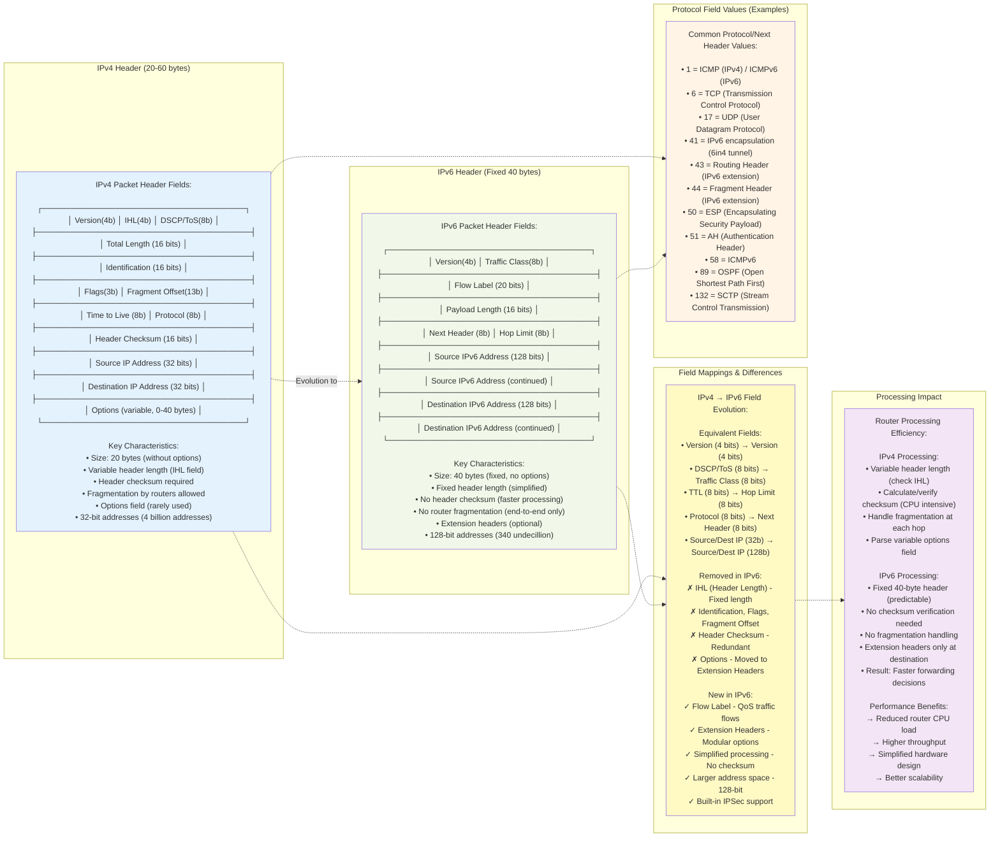
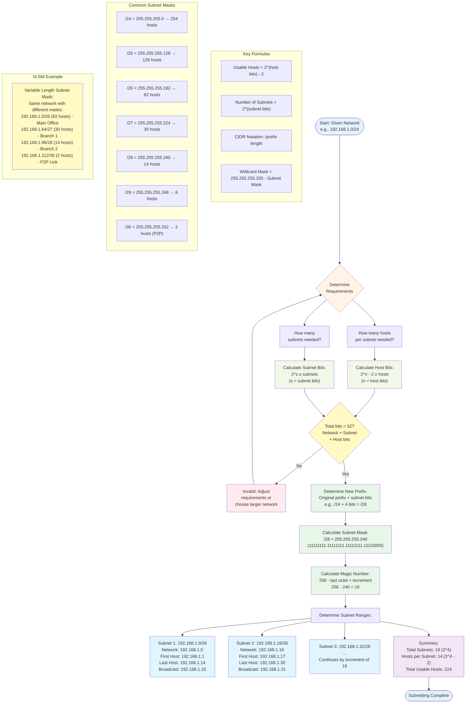

# IP Addressing and Subnetting


### Internet Protocols Packet Structure: IPv4 Header



**IPv4 vs IPv6 Header Comparison Summary:**

**Size & Structure:**
- **IPv4:** Variable size (20-60 bytes), depends on options field and IHL (Internet Header Length)
- **IPv6:** Fixed size (40 bytes), no variable options in main header

**Key Field Differences:**

1. **Address Length:**
   - IPv4: 32-bit addresses (4.3 billion addresses)
   - IPv6: 128-bit addresses (340 undecillion addresses)
   - IPv6 solves address exhaustion problem

2. **Header Checksum:**
   - IPv4: Required, recalculated at each router (CPU overhead)
   - IPv6: Removed, error checking delegated to upper/lower layers (faster)

3. **Fragmentation:**
   - IPv4: Routers can fragment packets (Identification, Flags, Fragment Offset fields)
   - IPv6: Only source can fragment using Fragment Extension Header, routers send "Packet Too Big" ICMP
   - Path MTU Discovery required in IPv6

4. **Options Handling:**
   - IPv4: Variable-length Options field in main header (slows processing)
   - IPv6: Extension Headers chain (processed only at destination)

5. **Quality of Service:**
   - IPv4: ToS/DSCP field (8 bits)
   - IPv6: Traffic Class (8 bits) + Flow Label (20 bits) for better QoS

6. **Processing Efficiency:**
   - IPv6 designed for faster router processing
   - Fixed header length allows hardware optimization
   - No checksum verification saves CPU cycles
   - Extension headers only examined at final destination

**IPv6 Extension Headers (Chain):**
- Hop-by-Hop Options (processed by every router)
- Routing Header (source routing)
- Fragment Header (fragmentation info)
- Destination Options (processed by destination only)
- Authentication Header (IPSec)
- Encapsulating Security Payload (IPSec)

**Migration & Coexistence:**
- Dual Stack: Devices run both IPv4 and IPv6 simultaneously
- Tunneling: IPv6 packets encapsulated in IPv4 (6to4, Teredo, ISATAP)
- Translation: NAT64/DNS64 for IPv6-only to IPv4-only communication

* **Function:** Contains important information for routing and delivering IP packets.
* **Key Fields:**
    * **Version:** Identifies the IP protocol version (IPv4 or IPv6).
    * **Header Length:** Specifies the length of the IP header (in 32-bit words).
    * **Type of Service (ToS) / Differentiated Services Code Point (DSCP):** Used for Quality of Service (QoS), prioritizing certain types of traffic.
    * **Total Length:** The total length of the IP packet, including header and data.
    * **Identification, Flags, Fragment Offset:** Used for IP fragmentation and reassembly.
    * **Time To Live (TTL):** Prevents packets from looping infinitely; decremented at each router hop. When it reaches 0, the packet is discarded.
    * **Protocol:** The Protocol field within the IP header indicates the higher-layer protocol encapsulated within the IP packet.
        * **TCP (6)** or **UDP (17)** are common transport layer protocols.
        * Some protocols are used **directly on IP** (rather than relying on transport layers) for specific functions, such as:
            * **ICMP (1)**: Internet Control Message Protocol (for error reporting and diagnostics like ping).
            * **IGMP (2)**: Internet Group Management Protocol (for managing multicast group memberships).
            * **GRE (47)**: Generic Routing Encapsulation, used to tunnel packets across an intermediate network (e.g., VPN implementations).
            * **EIGRP (88)**: Enhanced Interior Gateway Routing Protocol.
            * **OSPF (89)**: Open Shortest Path First.
            * **AH (50)**: Authentication Header, used in IPsec for data integrity and authentication.
            * **ESP (50)**: Encapsulating Security Payload, also used in IPsec for encryption and authentication.
    * **Header Checksum:** Used for error detection in the header.
    * **Source IP Address:** The IP address of the sender.
    * **Destination IP Address:** The IP address of the intended recipient.
    * **Options (Optional):** Rarely used, provides additional functionality.


### IPv4 Addressing Techniques

Networks in an internetwork must have a way of uniquely identifying each logical network and each individual host within those networks.

* At the Layer 2 (Data Link Layer), **MAC addresses** are used to identify interface end systems within a local segment.
* The **IP address** provides two pieces of information:
    * The **Network Number (Network ID)**: This number is common to all hosts on the same IP network.
    * The **Host Number (Host ID)**: This number uniquely identifies a host within an IP network.

#### IPv4 Subnetting



**Subnetting Calculation Process:**

1. **Determine Requirements:**
   - How many subnets are needed? (determines subnet bits)
   - How many hosts per subnet? (determines host bits)
   - Formula: Network bits + Subnet bits + Host bits = 32 (for IPv4)

2. **Calculate Host Bits:**
   - Use formula: 2^n - 2 ≥ required hosts (n = host bits needed)
   - Subtract 2 for network address and broadcast address
   - Example: Need 50 hosts → 2^6 - 2 = 62 hosts → requires 6 host bits

3. **Calculate Subnet Bits:**
   - Use formula: 2^s ≥ required subnets (s = subnet bits needed)
   - Example: Need 10 subnets → 2^4 = 16 subnets → requires 4 subnet bits

4. **Determine New Prefix Length:**
   - New prefix = Original prefix + Subnet bits
   - Example: /24 network + 4 subnet bits = /28

5. **Calculate Subnet Mask:**
   - Convert CIDR notation to decimal
   - /28 = 255.255.255.240 (binary: 28 ones followed by 4 zeros)

6. **Magic Number Method:**
   - Subtract last non-zero octet from 256
   - This gives the subnet increment/block size
   - Example: 256 - 240 = 16 (subnets increment by 16)

7. **Identify Subnet Ranges:**
   - Start at network address (0)
   - Increment by magic number: 0, 16, 32, 48, 64...
   - For each subnet:
     * Network Address: First address in block
     * First Host: Network + 1
     * Last Host: Next network - 2
     * Broadcast: Next network - 1

8. **VLSM (Variable Length Subnet Mask):**
   - Allows different subnet masks within the same network
   - Optimizes IP address usage
   - Larger subnets for more hosts, smaller for point-to-point links
   - Requires classless routing protocols (OSPF, EIGRP, BGP)

**Common Mistakes to Avoid:**
- Using network address or broadcast address as host IP
- Overlapping subnet ranges in VLSM designs
- Forgetting to subtract 2 from total addresses for usable hosts
- Mixing subnet masks without proper planning (non-VLSM networks)

SUBNETTING is a logical subdivision of IP network. The process of dividing a network into two or more networks is called subnetting. The main purpose of subnetting is to help relieve network congestion and improve network performance & security. 
Subnet		1		2		4		8		16		32		64		128		256
Host		256 	128 	64		32		16		8		4		2		1
S.Mask		/24 	/25		/26		/27		/28		/29		/30		/31		/32

The 1s in the mask are always contiguous. For example, this mask is valid: 11111111 11111111 11111111 00000000
But the following string is not a valid mask: 11111111 00000000 11111111 00000000

An IPv4 address represents both a Network ID and a Host ID. A **32-bit Network Mask (netmask)** is used to distinguish these two components within a single IP address. The mask "conceals" the host ID portion, thereby revealing the network portion.

* **Longer Network Portion (e.g., 255.255.255.0 or /24):** Allows for more network IDs within the overall internetwork but with fewer available host addresses per network.
* **Shorter Netmask (e.g., 255.0.0.0 or /8):** Allows for millions of hosts per network but only 126 possible network addresses (for Class A).

The scheme of using rigid octet boundaries (Classful addressing) is inflexible, so a system of dividing networks into **subnetworks** was devised.

* **Subnet Addressing Hierarchy:** Subnetting introduces a three-level hierarchical structure:
    1.  Network ID
    2.  Subnet ID
    3.  Host ID
* **Creating Logical Subnets:** To create logical subnets, bits from the host portion of the IP address must be allocated as a Subnetwork ID. This means the Subnet ID often lies within an octet boundary.
* **Purpose of Subnetting:** To create Layer 3 broadcast domain segments with fewer hosts, thereby reducing broadcast traffic and improving network performance. The trick with subnet design is to fit the scheme to the requirements for the number of subnetworks and the number of hosts per subnet.
* **Impact of Mask Extension:** Each bit added to the mask approximately halves the number of available host addresses. For example, a `/24` (255.255.255.0) network like `198.51.100.0/24` allows $2^8 - 2 = 254$ possible host IDs.
* **Example Subnetting:** Subdividing `198.51.100.0/24` into `/28` subnets (using a subnet mask of `255.255.255.240`):
    * This leaves 4 bits for host IDs ($2^4 - 2 = 14$ possible host addresses) per subnet.
    * Example Subnets:
        * `198.51.100.0/28` (Hosts 1-14, Network 0, Broadcast 15)
        * `198.51.100.16/28` (Hosts 17-30, Network 16, Broadcast 31)
        * `198.51.100.32/28` (Hosts 33-46, Network 32, Broadcast 47)
        * `198.51.100.48/28` (Hosts 49-62, Network 48, Broadcast 63)
    * **Important:** The first address in a subnet is the **Network ID**, and the last address is the **Broadcast Address**. These two addresses are reserved and cannot be assigned to hosts.
* **Mask Application:** Only one mask is ever applied to the IP address of each interface. The mask containing the subnet information is only used **within** the IP network. External IP networks continue to address the whole network by its network ID (e.g., `198.51.100.0/24`). Hosts within the same larger network use the longer subnet mask to differentiate the subnets.
* A wildcard mask uses opposite bits of a subnet mask. For example, a subnet mask of 255.255.255.0 is 11111111.11111111.11111111.00000000 in binary. The corresponding wildcard mask would be 0.0.0.255, which is 00000000.00000000.00000000.11111111 in binary.
Shortcut for Wildcard Masks
To quickly convert a regular subnet mask to a wildcard mask, subtract each octet in the subnet mask from 255. Example:
Subnet Mask: 255.255.255.0
Wildcard Mask: 255 - 255.255 - 255.255 - 255.255 - 0 = 0.0.0.255

#### IPv4 Addressing Scheme: Magic Numbers and Rules

When designing an IPv4 addressing scheme, it's essential to consider:

* The number of IP networks and subnetworks required.
* The number of hosts per subnet that must be supported.

**Fundamental Rules for IP Addressing:**
* The network and/or host IDs **cannot be all 1s in binary** (reserved for broadcast addresses).
* The network and/or host IDs **cannot be all 0s in binary** (means "this network").
* Each **host ID must be unique** on its IP network/subnet.
* The **network ID must be unique** on the internet (if using a public address scheme).
* The **network ID must be unique** on your internal system of networks (if using a private address scheme).
* The network ID must be from a **valid public or private address range** and not from a loopback range, link-local reserved range, multicast range, or experimental range.

#### IP Configuration Tools

IP command-line utilities enable you to gather information about how your systems are configured and how they communicate over a TCP/IP network.

* Each host adapter must be allocated an appropriate **IP address** and **subnet mask**.
* The **IP address of the default gateway (router)** for its network.
* The **IP addresses of the DNS servers** that can resolve IP addresses to name labels.

These settings can be configured **statically** or **dynamically (DHCP)**.

**Windows Configuration Methods:**

* The IP configuration for each adapter interface is often set using the **GUI Properties dialog** accessed via the Network Connections Applet.
* You can also use **`netsh` commands** from the legacy command prompt interface. `netsh interface ip show config` will report the IP configuration. Changes made with `netsh` are typically persistent.
* **PowerShell cmdlets** are now more commonly used for script-based configuration:
    * `Get-NetAdapter` and `Get-NetIPAddress` can be used to query the existing configuration.
    * `New-NetIPAddress` or `Set-NetIPAddress` can be used to apply a new configuration or modify an existing one.


##### Public IP Addresses

* A public IP address is one that can establish a connection with other public IP networks and hosts over the Internet.
* They are allocated and governed by **IANA (Internet Assigned Numbers Authority)** and administered by Regional Internet Registries (RIRs) and ISPs.

##### Private IP Addresses

* Hosts communicating over a LAN could use a public addressing scheme, but more typically use **private addressing**.
* Private IP address ranges are drawn from specific pools defined by **RFC 1918** as **non-routable over the internet**:
| Class | IP Address Range        | Subnet Mask       | CIDR |
| :---- | :---------------------- | :---------------- | :--- |
| A     | 10.0.0.0 – 10.255.255.255 | 255.0.0.0         | /8   |
| B     | 172.16.0.0 – 172.31.255.255 | 255.255.0.0       | /12  |
| C     | 192.168.0.0 – 192.168.255.255 | 255.255.255.0     | /16  |

**Internet Access for Private Networks:**

1.  **Network Address Translation (NAT):** Through a router configured with a single or block of valid public IP addresses. Address translation between private IP addresses (behind the router) and public IP addresses (forward-facing IP) is achieved using NAT.
2.  **Proxy Server:** Through a proxy server that fulfills requests for Internet resources on behalf of clients. The proxy server itself must be configured with a public IP on its external-facing interface.

##### Automatic Private IP Addressing (APIPA)

* A host's IP configuration can be applied statically or use an auto-configuration method. For IPv4, auto-configuration usually means **DHCP (Dynamic Host Configuration Protocol)**.
* However, for systems where failure to contact DHCP or receive a response occurs, Microsoft developed **APIPA**.
* APIPA allows devices to communicate on a local network by selecting an IP address from the **`169.254.1.1` to `169.254.254.254` range (`169.254.0.0/16`)**. The first and last subnets within this range are typically unused.
* This type of addressing is referred to as **link-local** in RFC 3927 documentation.
* `255.255.255.255` is used to broadcast to the local network when the local network address is unknown.


#### Classful Addressing (Legacy IPv4)

Before the widespread use of netmasks (subnet IDs) to identify the network ID portion of an address, **Classful Addressing** allocated a network ID based on the first octet of the IP address.

* `0.0.0.0/0`: The "unspecified address" used when a specific IP address is unknown, typically as a source when a client is seeking a DHCP lease.

##### IPv4 Address Classes

| Class | First Octet Range | Default Subnet Mask | Common Use           |
| :---- | :---------------- | :------------------ | :------------------- |
| A     | 1-126             | 255.0.0.0           | Large networks       |
| B     | 128-191           | 255.255.0.0         | Medium-sized networks|
| C     | 192-223           | 255.255.255.0       | Small networks       |
| D     | 224-239           | N/A (Multicast)     | Multicast            |
| E     | 240-255           | N/A (Reserved)      | Research/Reserved    |

**Reserved IP Ranges (Classful Legacy):**
* **Class D addresses (`224.0.0.0 - 239.255.255.255`):** Used for **multicasting**.
* **Class E addresses (`240.0.0.0 - 255.255.255.255`):** Reserved for testing and experimental use.
* **Loopback Address (`127.0.0.0 - 127.255.255.255` or `127.0.0.0/8`):**
    * This range is reserved and configured as a **loopback address**.
    * A special type of address typically used to check that TCP/IP is correctly installed on the local host.
    * It doesn't require a physical interface to function.
    * A packet sent to a loopback address is not processed by a network adapter but is otherwise processed as normal by the host's TCP/IP stack.
    * A host will process a packet addressed to a loopback interface regardless of the interface on which it is received.


#### CIDR (Classless Inter-Domain Routing) and Supernetting

**CIDR** was designed to solve two major problems with classful addressing:

1.  The near-exponential growth in Internet routing tables.
2.  Class B addresses were becoming very scarce.

CIDR collapsed routing entries into one single entry, simplifying the information Internet routers needed to locate networks. Unlike classful addressing, CIDR does not determine the network mask based on the first octet of the IP address.

* **Dynamic routing protocols** that support classless addressing include RIPv2, EIGRP, OSPF, and BGPv4.

#### Supernetting

* **Supernetting** simplifies routing tables by combining multiple smaller networks into a single, larger network prefix.
* It is done to summarize subnets into one network ID. This is simply done by **shrinking the subnet mask** (i.e., making the CIDR prefix shorter).
* **Example:** Four /24 subnets (`198.51.101.0/24`, `198.51.102.0/24`, etc.) can be summarized as `198.51.100.0/22` (a "supernet prefix").
* Edge routers hosting these four networks collapse them into one single entry in their routing table. Routers external to the network (like ISPs) just use this `/22` prefix, so the complexity of the LAN's subnets is hidden and doesn't clog up their routing tables.
* The LAN's internal routers, however, use the `/24` prefix or multiple prefixes to create subnets of different sizes.

##### VLSM (Variable Length Subnet Masks)

* **VLSM** allows a network designer to allocate ranges of IP addresses to subnets that match a predicted need for the number of subnets and hosts per subnet more closely.
* It's a complementary addressing technique. Without VLSM, you'd have to allocate subnetted ranges of addresses that are all the same size and use the same subnet mask throughout the network. This often means that some subnets have many wasted IP addresses, or additional routing interfaces must be installed to connect several smaller same-sized subnets together within a single building or department.
* VLSM allows for **different/variable length netmasks (subnet masks)** to be used within the same IP network, allowing more flexibility in the design process.
* **Relationship to CIDR:**
    * You use the predicted number of host addresses needed to find the number of bits required for the host portion, which then determines the CIDR notation (prefix length).
    * More host bits = a shorter CIDR notation (e.g., `/24` vs. `/28`).
    * A shorter CIDR prefix means fewer network addresses/subnets but more host addresses per subnet.
* **Router-to-Router Links:** For router-to-router links (point-to-point links), typically no more than two addresses are ever required. Therefore, a `/30` prefix is often selected for router-to-router links (2 bits remaining for host IDs, $2^2 - 2 = 2$ usable addresses, one for each router interface).

#### VLANs (Virtual LANs) and Subnets

VLANs are a Layer 2 mechanism to address the contention dilemma when too many hosts are attached to the same switch, as excessive broadcast traffic can reduce performance.

* Each port on a managed switch can be assigned a **VLAN ID**.
* Using VLANs means that different groups of computers on the same physical cabling and attached to the same switch(es) can appear to be in **separate LAN segments**.
* Each VLAN is a **separate broadcast domain**.
* A subnetting scheme can be applied at Layer 3 to represent the VLAN design in the Layer 3 topology.
* **Benefits:**
    * Useful to divide a network into logically distinct zones for security and administrative control.
    * Networks that use different physical and data link technologies (e.g., Token Ring vs. Ethernet) should be logically separated as different subnets.

#### IP Forwarding (Routing)

The core function of IP is to facilitate the creation of a group of distinct but interconnected networks, referred to as the "Internetwork." This means that packets addressed to hosts on remote networks must be forwarded via one or more intermediate systems that establish routing between networks.

* **Forwarding at Layer 3** is referred to as **Routing**.
* **Forwarding at Layer 2** is known as **Switching**.

Nodes within each subnet can see one another directly (they are in the same **broadcast domain**), but they can only communicate with nodes in other subnets via a **router**.

#### ARP (Address Resolution Protocol)

Within each subnet or broadcast domain, nodes use **MAC addresses** to forward frames to one another. TCP/IP includes the ARP protocol to perform the task of resolving an IP address to a hardware (MAC) address.

* **Local Address Resolution:** When both sending and receiving hosts are within the same subnet, local address resolution takes place using **ARP requests** (broadcast) and **ARP replies** (unicast).
* **Remote Address Resolution:** If the destination address is on a remote network, the local host must use its **Default Gateway** to forward the packet. The host determines the MAC address of its default gateway using ARP.
* **Router ARP Usage:** Routers also use ARP messaging for their Ethernet interfaces. ARP messaging is specific to Ethernet networks.
* **Default Gateway IP:** The default gateway is typically set to the **first usable address** in the subnet (i.e., not the Network ID). For example, in `198.51.100.0/28`, `198.51.100.1` might be the default gateway.

**ARP Request/Reply Sequence - MAC Address Discovery:**

```mermaid
sequenceDiagram
    participant HostA as "Host A\nIP: 192.168.1.10\nMAC: AA:BB:CC:11:22:33"
    participant Switch as "Ethernet Switch\n(Layer 2)"
    participant HostB as "Host B\nIP: 192.168.1.20\nMAC: DD:EE:FF:44:55:66"
    participant HostC as "Host C\nIP: 192.168.1.30\nMAC: 11:22:33:AA:BB:CC"

    Note over HostA,HostC: ARP Protocol - Layer 2 Address Resolution\nSame Subnet: 192.168.1.0/24
    
    rect rgb(255, 245, 245)
        Note over HostA: 1. Check ARP Cache
        HostA->>HostA: Need to send data to 192.168.1.20\nCheck ARP cache for MAC\nCACHE MISS: No entry found
        Note left of HostA: ARP cache empty\nMust discover MAC address\nfor 192.168.1.20
    end
    
    rect rgb(255, 250, 240)
        Note over HostA,HostC: 2. ARP Request (Broadcast)
        HostA->>Switch: ARP REQUEST (Broadcast)\nSender IP: 192.168.1.10\nSender MAC: AA:BB:CC:11:22:33\nTarget IP: 192.168.1.20\nTarget MAC: FF:FF:FF:FF:FF:FF\n"Who has 192.168.1.20?"
        Note left of HostA: Broadcast to all hosts\nDestination MAC:\nFF:FF:FF:FF:FF:FF\nEtherType: 0x0806 (ARP)

        Switch->>HostB: Forward to all ports\n(Broadcast)
        Switch->>HostC: Forward to all ports\n(Broadcast)

        Note right of HostB: Receives ARP request\nTarget IP matches!\n192.168.1.20 is me
        Note right of HostC: Receives ARP request\nTarget IP doesn't match\nSilently discards
    end
    
    rect rgb(240, 255, 240)
        Note over HostB: 3. Cache Sender Info
        HostB->>HostB: Update ARP cache:\n192.168.1.10 → AA:BB:CC:11:22:33\nStore for future use
        Note right of HostB: Cache sender's mapping\nbefore replying\n(Optimization)
    end
    
    rect rgb(240, 248, 255)
        Note over HostA,HostB: 4. ARP Reply (Unicast)
        HostB->>Switch: ARP REPLY (Unicast)\nSender IP: 192.168.1.20\nSender MAC: DD:EE:FF:44:55:66\nTarget IP: 192.168.1.10\nTarget MAC: AA:BB:CC:11:22:33\n"192.168.1.20 is at DD:EE:FF:44:55:66"
        Note right of HostB: Unicast reply directly\nto requesting host\nNot broadcast

        Switch->>HostA: Forward to specific port\n(Unicast to AA:BB:CC:11:22:33)
    end
    
    rect rgb(245, 255, 245)
        Note over HostA: 5. Update ARP Cache
        HostA->>HostA: Update ARP cache:\n192.168.1.20 → DD:EE:FF:44:55:66\nCache entry timeout: 120-300 sec
        Note left of HostA: Cache updated\nFuture packets to\n192.168.1.20 use this MAC\nNo ARP needed (until timeout)
    end
    
    rect rgb(250, 250, 255)
        Note over HostA,HostB: 6. Data Transmission
        HostA->>Switch: Ethernet Frame\nSrc MAC: AA:BB:CC:11:22:33\nDst MAC: DD:EE:FF:44:55:66\nSrc IP: 192.168.1.10\nDst IP: 192.168.1.20\nPayload: Application data
        Switch->>HostB: Forward frame
        Note over HostA,HostB: Communication established\nLayer 2 addressing resolved
    end
    
    ARPDetails["ARP Key Concepts:\n✓ Layer 2 protocol (operates at Data Link)\n✓ Maps Layer 3 (IP) to Layer 2 (MAC) addresses\n✓ Request: Broadcast to all hosts in subnet\n✓ Reply: Unicast directly to requester\n✓ Cache: Stores mappings to avoid repeated requests\n✓ Timeout: Cache entries expire (prevent stale data)\n✓ Gratuitous ARP: Announce own IP/MAC (detect conflicts)"]
    
    style ARPDetails fill:#FFF9C4,stroke:#F39C12
```

*Figure: ARP protocol operation showing MAC address discovery process. Host A broadcasts ARP request asking "Who has IP 192.168.1.20?", Host B (owner of that IP) responds with unicast ARP reply containing its MAC address DD:EE:FF:44:55:66. Both hosts cache the mapping to avoid future ARP requests. Essential for Layer 2 frame forwarding within the same subnet.*

#### How Default Gateways are Implemented

* **Same Subnet Communication:** If the network mask portions of the source and destination IP addresses match, both source and destination are in the same IP network/broadcast domain. Packet forwarding is done locally (Layer 2 switching).
* **Different Subnet Communication (Routing):** If the network mask portions of the source and destination IP addresses do not match, the packet must be routed to another IP network.
    * First, the source host delivers the packet to its own **default gateway**.
    * The **default gateway is a router** configured with a path to remote networks.
    * The router determines what to do with the packet by performing a subnet mask comparison between the source and destination addresses.
    * The router then uses its **routing table** to determine which interface it should use to forward the packet.
    * If no suitable path is found, the router drops the packet and informs the source host (via ICMP).
* The default gateway is the device that provides a route for traffic to leave the local subnet and access external networks by routing traffic. It usually has an IP address that is part of the subnet's range but is not assigned to an individual device within the subnet (commonly the lowest usable address).


#### IP Addressing Techniques

These techniques define how an IP packet addresses its recipient(s).
* **Unicast:** (One-to-One) When an IPv4 host wants to send a packet to a single recipient, it uses a unicast packet addressed to the destination host's unique IP address.
* **Broadcast:** (One-to-Everyone on the local segment) A host addresses multiple recipients on its local subnet by sending a broadcast packet to the **broadcast address** of its subnet (all hosts sharing the same broadcast address receive it).
    * Broadcast packets are delivered using a special Layer 2 MAC address (`FF:FF:FF:FF:FF:FF`), meaning there is also a broadcast domain scope at Layer 2.
    * With legacy devices like hubs and bridges, every port on all physically connected nodes is part of the same broadcast domain.
* **Multicast:** (One-to-Many of a specific group) IPv4 multicasting allows one host (on the Internet or a private IP network) or server to send content to other hosts that have identified themselves as interested in receiving the originating host's content.
    * Multicast packets are sent to a **destination IP address from a special range** (e.g., `224.0.0.0` to `239.255.255.255`) configured for use with multicast groups.
    * At Layer 2, multicasts are delivered using a special range of **MAC addresses** (`01:00:5E:xx:xx:xx`).
    * The switch must be multicast-capable (e.g., using **IGMP Snooping**); otherwise, it treats the multicast packet like a broadcast and floods it out of all ports, wasting bandwidth. IGMP is typically used to configure group memberships.
* **Anycast:** (One-to-One of Many) A group of hosts are configured with the **same IP address**. When a router forwards a packet to an anycast group, it uses a prioritization algorithm and metrics (e.g., shortest path) to select the host that is "closest" (most quickly able to receive and process the packet).
    * This allows the service behind the address to be provisioned more reliably, enabling load balancing and failover between the server hosts sharing the IP address (commonly used for DNS root servers).


#### Internet Control Message Protocol (ICMP) 

ICMP is a supporting protocol in the Internet protocol suite. It is used by network devices, including routers, to send *Error Reporting, Diagnostic Functions* and operational information indicating success or failure when communicating with another IP address. This errors are directed to the source IP address of the originating packet. for example, an error is indicated when a requested service is not available or that a host or router could not be reached. Internet Control Message Protocol version 6 (ICMPv6) is the implementation of the Internet Control Message Protocol (ICMP) for Internet Protocol version 6 (IPv6)

##### Common ICMPv4 Message Types (and their IPv6 equivalents in ICMPv6)

* **Source Quench:** (Type 4, Code 0) A request that the sender decreases its sending rate. Acts as flow control in the network layer. **Deprecated** in modern networks.
* **Redirect:** (Type 5) Request data sent to an alternative route. A Redirect message is a mechanism for routers to convey routing messages or information to hosts, informing them to update their routing information. Typically sent by gateways.
* **Time Exceeded:** (Type 11) Generated by a gateway to inform the source of a discarded datagram due to the Time-to-Live (TTL) field reaching zero. It may also be sent by a host if it fails to reassemble a fragmented datagram within a certain time.
* **Timestamp Request/Reply:** (Type 13/14) Used for time synchronization. Includes originating, receive, and transmit timestamps.
* **Address Mask Request/Reply:** (Type 17/18) Normally sent by a host to a router to obtain an appropriate subnet mask. The recipient responds with an Address Mask Reply message.
* **Destination Unreachable:** (Type 3) Generated by the host or its inbound gateway to inform the source that the destination is unreachable for some reason (e.g., network connection doesn't exist, protocol/port is inactive, data needs fragmentation but "Don't Fragment" bit is set).

#### Internet Group Management Protocol (IGMP) 

IGMP is a communications protocol used by hosts and adjacent routers on IPv4 networks to establish multicast group memberships. IGMP is an integral part of IP multicast and allows the network to direct multicast transmissions only to hosts that have requested them.
IGMP is used on IPv4 networks. Multicast management on IPv6 networks is handled by Multicast Listener Discovery (MLD) which is a part of ICMPv6 in contrast to IGMP's bare IP encapsulation.  Through **IGMP Snooping**, routers (and Layer 2 switches capable of snooping) become multicast-aware of IGMP group membership requests. This allows them to avoid flooding multicast transmissions out of all ports (treating them like broadcasts), thereby conserving bandwidth and reducing unnecessary traffic for hosts not interested in the multicast stream.


#### ICMPv6 Packet Structure

| Field         | Bits (Offset) | Description                                                                                                                             |
| :------------ | :------------ | :-------------------------------------------------------------------------------------------------------------------------------------- |
| **Type** | 8 (0-7)       | Identifies the ICMPv6 message type.                                                                                                     |
| **Code** | 8 (8-15)      | Provides more specific information about the message type.                                                                              |
| **Checksum** | 16 (16-31)    | For error-checking. In ICMPv6, it includes a pseudo-header (from the IPv6 header) for more robust error detection.                       |
| **Message Body** | Variable      | Contains the specific information related to the message type (e.g., unreachable code, router advertisement data).                      |

The ICMPv6 protocol must limit the number of error messages sent to the same destination to avoid network overload.


### Internet Protocols Packet Structure: IPv6 Header

	0.	Source & Destination Address
	0.	Hop Limit – Replaces the TTL field in IPv4 but performs the same function
	0.	Traffic Class – Describes the packet's priority
	0.	Flow Label – Used for Quality of Service (QoS) management, useful for real-time streams. Set to 0 for packets not part of any delivery sequence or structure
	0.	Payload Length – Indicates the length of the packet payload, up to a maximum of 64 kilobytes.For flows where the payload is bigger than that, this field is ignored and a special Jumbo Payload (up to 4GB) option is established
	0.	Next Header – Describes what the next extension header (if any) is or where the actual payload begins.Also tells the destination host/router how to interpret the data that follows the header.The extension headers replace the Options field in IPv4 and cover functions such as:
	•	Fragmentation
	•	Reassembly
	•	Security (e.g., AH, ESP)
	•	Source Routing
IPv6 routers do not perform IP fragmentation. IPv6 hosts are required to do one of the following: perform Path MTU Discovery, perform end-to-end fragmentation, or send packets no larger than the default maximum transmission unit (MTU), which is 1280 octets.

IPv6 is the most recent version of the Internet Protocol, designed to replace IPv4 due to the exhaustion of IPv4 addresses. It uses 128-bit addresses, providing a significantly larger address space than IPv4's 32-bit addresses. This expansion allows for connecting a vast number of devices to the internet, including the increasing number of Internet of Things (IoT) devices. 

Key Features and Benefits:
	•	Larger Address Space: IPv6 provides a theoretical address pool of 340 undecillion addresses, compared to IPv4's 3.7 billion. 
	•	Improved Routing: IPv6 simplifies routing headers, uses hierarchical addressing, and enables more efficient routing through techniques like summary routes and route aggregation. 
	•	No Need for NAT: IPv6 eliminates the need for Network Address Translation (NAT), as devices have their own unique public IPv6 addresses. 
	•	Enhanced Security: IPv6 includes built-in authentication and privacy support. 
	•	Auto-configuration: IPv6 allows for automatic address configuration, simplifying network setup. 
	•	Improved Multicast Routing: IPv6 provides better support for multicast routing. 
	•	Flow Labeling: IPv6 supports flow labeling, a mechanism for marking network packets with specific quality of service (QoS) requirements. 
Transition to IPv6:
	•	The transition to IPv6 is a global effort, with major ISPs and network equipment manufacturers supporting it. 
	•	The transition is expected to be gradual, with many organizations continuing to use IPv4 for the time being. 
It's important to ensure that devices and applications are IPv6-compatible to avoid potential connectivity issues during the transition. 


#### IPv6 Packet Header vs. IPv4 Options Field

The IPv6 header is streamlined and differs significantly from IPv4.

* **Hop Limit:** This field replaces the **TTL (Time-to-Live)** field in IPv4 but performs the same function: it limits a datagram's lifetime to prevent network loops.
* **Traffic Class:** Describes the packet's priority, similar to the DSCP (Differentiated Services Code Point) or ToS (Type of Service) in IPv4.
* **Flow Label:** Used for Quality of Service (QoS) management, particularly for real-time streams. It's set to `0` for packets not part of any specific delivery sequence or structure.
* **Payload Length:** Indicates the length of the packet payload, up to a maximum of 64 kilobytes. If the payload is larger, this field is set to `0`, and a **Jumbo Payload** option (up to 4 GB) is established in an extension header.
* **Next Header:** Describes what the next **Extension Header** (if any) is, or where the actual payload begins. It also tells the destination host/router how to interpret the data that follows the header.

#### IPv6 Extension Headers

Extension Headers replace the **Options field** in IPv4 and cover various functions such as:
* **Function:** IPv6 headers can be followed by one or more optional extension headers, which provide additional functionality beyond what's in the base IPv6 header. They improve flexibility and performance by offloading complex operations from routers.
* **Key Characteristics:**
    * Processed in the order they appear in the packet.
    * Not all extension headers are processed by every router. Only the Hop-by-Hop Options Header is examined by every router on the path.
    * A Next Header field in the preceding header indicates the type of the next header (either an extension header or the upper-layer protocol, like TCP or UDP).
* **Common Extension Headers:**
    * **Hop-by-Hop Options Header:** Examined by *every* node on the path. Used for optional information that needs to be processed by every device (e.g., Jumbo frames).
    * **Destination Options Header:** Carries optional information that needs to be examined only by the destination node(s).
    * **Routing Header:** Used by a source node to specify a list of intermediate nodes to be visited along a packet's path. Provides source routing functionality.
    * **Fragment Header:** Used when a packet is larger than the Path MTU (Maximum Transmission Unit). Allows a source to fragment a packet for transmission.
    * **Authentication Header (AH):** Provides data integrity, data authentication, and anti-replay services for IP packets. Part of IPSec.
    * **Encapsulating Security Payload (ESP) Header:** Provides confidentiality (encryption), data origin authentication, data integrity, and anti-replay services for IP packets. Also part of IPSec.
    * **Mobility Header:** Used by mobile IPv6 nodes for managing mobility-related signaling.


#### IPv6 Packet Structure (Comparison to IPv4)

The IPv6 packet structure is simplified, even though the headers are larger (40 bytes compared to IPv4's 20-60 bytes).

* **No Header Checksum:** IPv6 headers do not include a checksum. Error checking for the entire packet is performed at lower layers (e.g., Ethernet CRC) and higher layers (e.g., TCP/UDP checksum).
* **No Fragmentation by Routers:** IPv6 does not support fragmentation by routers. IPv6 hosts are required to either perform **Path MTU Discovery** (to determine the largest packet size that can be sent without fragmentation along an entire path) and send datagrams within that MTU, or fragmentation must be performed at the link layer nodes. This minimizes packet header processing by routers.
* **Jumbograms:** While IPv4 limits packets to 65,535 octets (64 KB) of payload, IPv6 nodes can handle packets exceeding this limit, referred to as **Jumbograms** (up to 4 GB).


#### IPv6 Addressing: Format and Header Details

IPv6 addresses are **128 bits long** and are typically represented in **hexadecimal notation (16 bytes)**. Each double-byte (16 bits) number is expressed as 4 hexadecimal digits. ADDRESS FORMAT: HEXADECIMAL means 16-bit representation - Double-Octet / byte (1Byte = 8bits)With each double-octet field expressed as 4 hex digits

**Example:** `ABCD:0183:F2C6:2C4F:3B2D:A6F5:F53C:2605`

##### IPv6 Address Compression

To make IPv6 addresses easier to read and write, compression rules are used:

* **Omitting Leading Zeros:** Leading zeros within any 16-bit block (hextet) can be ignored (e.g., `0183` becomes `183`).
* **Double Colon (::) Compression:** One contiguous series of all zeros (one or more hextets of `0000`) can be replaced by a double colon (`::`).
    * **Crucial Rule:** You can only use double colon compression **once** in a given address to avoid ambiguity.
    * **Example:** `2001:db8:0000:0000:0abc:0000:defo:1234` can be compressed to `2001:db8::abc:0:defo:1234`.
* **IPv6 in URLs:** When an IPv6 address is used as part of a URL (web address), it **must be enclosed within square brackets `[]`** because both the URL and IPv6 address use colon delimiters for different purposes.
    * **Example:** `http://[2001:db8::1]/index.html`
* Use double colon compression once, Don’t compress twice: **Example:** `2001:db8:0000:0000:0abc:0000:ABCD:1234` Compressed as: `2001:db8::abc:0:ABCD:1234` 

IPv6 uses **128-bit addresses**, providing an exponentially larger address space than IPv4.
* **Features:** Designed to address IPv4 address exhaustion, provides larger address space, improved security, and simplified header.
* **Address Length:** 128-bit addresses, represented in hexadecimal, separated by colons.
* **Address Types:**
    * **Global Unicast Address (GUA):** Publicly routable, equivalent to IPv4 public addresses. Starts with `2000::/3`.
    * **Link-Local Address (LLA):** Used for communication on a single link/segment. Automatically configured. Starts with `FE80::/10`. Not routable.
    * **Unique Local Address (ULA):** Private IPv6 addresses, routable within an organization but not on the internet. Starts with `FC00::/7` or `FD00::/8`.
    * **Multicast Address:** Used to send a single packet to multiple destinations. Starts with `FF00::/8`.
    * **Anycast Address:** An address assigned to multiple interfaces (typically different devices). Packet sent to anycast address is delivered to the nearest interface.
* **Simplified Header:** More efficient processing by routers.
* **Built-in Security:** IPSec is a fundamental part of IPv6.
* **Auto-configuration:** Supports Stateless Address Auto-configuration (SLAAC) and DHCPv6.

#### IPv6 Address Structure (Global Unicast Example)

* `Prefix/Length`: IPv6 network addresses are written using classless inter-domain routing (CIDR) notation, where `/N` is the length of the network prefix in bits.
* **Network Prefix (64 bits):**
    * **Global Routing Prefix (48 bits):**
        * First 3 bits (0010 or 0011 for global scope).
        * Next 45 bits allocated hierarchically to regional registries, ISPs, and end-users.
    * **Subnet ID (16 bits):** Identifies site-specific subnet addresses within the network.
* **Interface ID (64 bits):** Equivalent to the host portion in IPv4.

#### IPv4 and IPv6 Transition Mechanisms

Networks are likely to run both IPv4 and IPv6 in some or all parts of the infrastructure. Transition mechanisms ensure interoperability.

##### Dual Stack
* **Concept:** A network or device configured with **both IPv4 and IPv6 protocol stacks**.
* **Functionality:** Allows a single device (e.g., a host, router, or server) to have **both an IPv4 and an IPv6 address** assigned to its interfaces.
* **Communication:**
    * It can communicate with IPv4-only devices using IPv4.
    * It can communicate with IPv6-only devices using IPv6.
    * It can communicate with other dual-stack devices using either IPv4 or IPv6, often preferring IPv6 if available.
* **Benefit:** Enables seamless communication across networks where both IPv4 and IPv6 exist, facilitating a **gradual transition from IPv4 to IPv6** without immediate compatibility issues.
* **Deployment:** The most common and straightforward method for enabling coexistence and transition between IPv4 and IPv6 networks.

##### Tunneling IPv6 over IPv4
* **Concept:** Allows IPv6 packets to travel over an IPv4 infrastructure by encapsulating the entire IPv6 packet inside an IPv4 packet. This is a common **IPv6 transition mechanism** used when direct IPv6 connectivity is not available end-to-end.
* **Process:** An IPv6 packet is placed inside the data portion of an IPv4 packet, which is then sent across the IPv4 network. At the other end, the IPv4 header is removed, and the original IPv6 packet is forwarded.
* **Common Tunneling Methods:**
    * **Manual Tunnels:** Configured manually between two IPv6 routers over an IPv4 infrastructure. Requires static configuration on both tunnel endpoints. Simple for point-to-point connections.
    * **Generic Routing Encapsulation (GRE) Tunnels:** A more flexible tunneling protocol that can encapsulate various network layer protocols (including IPv6) within an IPv4 header. It's often used to create virtual point-to-point links.
    * **6to4 Tunnels:** An automated tunneling mechanism that allows isolated IPv6 networks to communicate over an IPv4 infrastructure without explicit tunnel configuration for every connection. It uses a specific IPv6 prefix (`2002::/16`) for addresses assigned to 6to4 interfaces, which includes a representation of the IPv4 address.
    * **Intra-Site Automatic Tunnel Addressing Protocol (ISATAP) Tunnels:** Designed for internal IPv6 communication within an IPv4-only enterprise network. It creates a point-to-multipoint tunnel by dynamically using the IPv4 address of the destination as part of the IPv6 address.


#### IPv6 Integrated Auto-Configuration and Deployment

In IPv6, an interface must always be configured with a **link-local address** (one for each link), even if it also has a globally unique address. One or more routable addresses can be assigned in addition to the link-local address.

* As with IPv4, you can either assign a routable IPv6 address statically (generally reserved for routers and possibly some servers) or use an automatic addressing scheme.

#####  IPv6 Neighbor Discovery Protocol (NDP)

* **Function:** NDP is an essential IPv6 protocol that uses ICMPv6 messages to perform functions similar to ARP (Address Resolution Protocol) and ICMP Router Discovery in IPv4, along with new capabilities. It operates at the network layer.
* **Key Functions of NDP:**
    * **Address Resolution:** Resolves IPv6 addresses to MAC addresses (like ARP).
    * **Router Discovery:** Allows hosts to discover routers and learn network prefixes.
    * **Prefix Discovery:** Hosts learn on-link prefixes.
    * **Parameter Discovery:** Hosts learn other configuration parameters (e.g., MTU).
    * **Duplicate Address Detection (DAD):** Ensures a newly configured IPv6 address is unique on the link.
    * **Neighbor Unreachability Detection (NUD):** Confirms if a neighbor is still reachable.
    * **Redirect Functionality:** Routers can inform hosts of a better first-hop router for a specific destination.
* **NDP Messages (ICMPv6 Types):**
    * **Router Solicitation (RS):** Sent by hosts to discover routers on the link or to request Router Advertisements immediately.
    * **Router Advertisement (RA):** Sent by routers periodically or in response to an RS. Contains network prefixes, link MTU, hop limit, and flags for SLAAC or DHCPv6.
    * **Neighbor Solicitation (NS):** Sent by a node to resolve a neighbor's link-layer address (MAC) or to perform Duplicate Address Detection (DAD).
    * **Neighbor Advertisement (NA):** Sent by a node in response to an NS message, or unsolicited to announce a change in its link-layer address. Contains the node's link-layer address.
    * **Redirect:** Sent by a router to inform a host of a better first-hop router for a specific destination.


##### Stateless Address Auto-Configuration (SLAAC)

* **Function:** Allows IPv6 hosts to automatically configure their own addresses and network parameters without a DHCP server.
* **Process:**
    * Hosts generate a Link-Local Address (LLA) using their MAC address (or a privacy extension).
    * They send a Router Solicitation (RS) message to discover routers on the link.
    * Routers respond with a Router Advertisement (RA) message, which includes the network prefix and other configuration information.
    * The host combines the network prefix from the RA with its Interface ID to form a Global Unicast Address (GUA).
    * Duplicate Address Detection (DAD) is performed to ensure the address is unique on the link.
* **Key Characteristic:** No central server is required for IP address assignment for global addresses.


##### Interface ID (EUI-64 and Privacy Extensions)

The 64-bit Interface ID, which is the host portion of an IPv6 address, can be determined using two main techniques:

1.  **EUI-64 (Extended Unique Identifier):**
    * A relatively simple translation mechanism allows driver software to create a 64-bit Interface ID from the 48-bit MAC address.
    * The MAC address is split in half, `FF:FE` is inserted in the middle, and the 7th bit (Universal/Local bit) is inverted.
    * This is also known as a MAC-derived address or Interface Identifier.
2.  **Privacy Extensions (Temporary Interface ID / Token):**
    * The client uses a cryptographically generated pseudo-random number for the Interface ID.
    * **Why?** Because the EUI-64 method has privacy concerns as interface identifiers would allow a host to be identified and closely monitored when connecting to the Internet (since the MAC address is unique and semi-permanent). Using a token mitigates this to some degree by rotating the Interface ID regularly.

##### IPv6 Multicast Addressing

IPv6 supports multicast. The components of a multicast address (`ff00::/8`) are subdivided as follows:

* **`ff` (First 8 bits):** Indicate that the address is within the multicast scope (`11111111`).
* **Flags (Next 4 bits):** Used to indicate types of multicast, if necessary (e.g., transient or well-known).
* **Scope (Next 4 bits):** Determine the scope of the multicast group:
    * `1` (0001): Node-Local (to all interfaces on the same node).
    * `2` (0010): Link-Local (to all nodes on the same link).
    * `5` (0101): Site-Local (deprecated).
    * `E` (1110): Global.
* **Group ID (Final 112 bits):** Define multicast groups within that scope.

The **Multicast Listener Discovery (MLD)** protocol allows nodes to form a multicast group and discover whether members of a group are present on a local subnet. Well-known multicast addresses are reserved for specific functionality (e.g., `ff02::1` for all nodes, `ff02::2` for all routers). Hosts use an appropriate multicast address to communicate with groups.

**No Broadcast Addressing in IPv6:** IPv6 does not implement broadcast addresses. Multicast addresses are used instead for functionalities that would have used broadcasts in IPv4.

#### ICMPv6 Key Features

ICMPv6 is an updated version of ICMP (ICMPv4) with new features.
1.  **Error Messaging:**
    * Supports similar destination unreachable and time exceeded (TTL=0, now "Hop Limit=0") messaging as ICMPv4.
    * Introduces the **Packet Too Big** class of error. Under IPv6, routers are no longer responsible for packet fragmentation and reassembly. The host must ensure that packets fit within the **MTU (Maximum Transmission Unit)** of the underlying links used (Path MTU Discovery).
2.  **Informational Messaging:**
    * Supports ICMPv4 functions like Echo Request/Reply (ping).
    * Includes a whole new class of messages designed to support **Neighbor Discovery (NDP)** and **Multicast Listener Discovery (MLD)** protocols, such as Router Advertisements (RA) and Neighbor Solicitations (NS). MLD is used for multicast listener discovery.

#### RFC 5952 is "A Recommendation for IPv6 Address Text Representation" which suggests standard IPv6 address representation.

What is An RFC "Request for Comments" is a publication from the Internet Society (Internet Engineering Task Force)
and are the official documents of Internet specifications, protocols, procedures.
Leading zeros must be removed in each hextet (16-bit segment)/double-octet
Rules for Shortening IPv6 Addresses:
	•	:: Must be used to shorten the longest contiguous string of all 0 hextets.
	•	If there is only one hextet of all zeros, it can also be shortened to ::.
	•	If there are two equal length choices of all 0 hextets, use :: to shorten the one on the left.
	•	Hexadecimal characters must be written using lower case (a-f).

INTERFACE ID (Known as EUI-64)
Where MAC Address = 48-bit →→ Converted to 64-bit
Can be determined using 2 techniques:

#### MAC-Derived Interface Identifier (EUI-64 Format)
A relatively simple translation mechanism allows driver software to create a 64-bit Interface ID (EUI-64) from the MAC address by inserting 16 bits (FFFE) in the middle.
	•	Also known as:
	•	MAC-Derived Address
	•	Interface Identifier
	•	EUI-64
HOW [EUI-64] IS CREATED FROM MAC ADDRESS + fffe [16 bits]
Consider a MAC Address 00:0c:29:ab:1c:2d (Example MAC Address).
The MAC address is split into halves, and modified into EUI-64
by inserting a known constant 16bits (hexadecimal) of FFFE.
Consider a MAC Address b4:45:5a:1c:2d:3f
Split into halves: b4:45:5a and 1c:2d:3f
Insert FFFE: b4:45:5a:ff:fe:1c:2d:3f
7th bit of the first octet (b4 in binary is 1011 0100): 1
Flipping the 7th bit: 0
Binary after flipping: 1011 0000
Hexadecimal after flipping: b0
Therefore EUI-64 = b045:5aff:fe1c:2d3f
64 bit long.

EUI stands for Extended Unique Identifier: Modified EUI-64 is a method of converting a MAC Address (48 bits) into a 64-bit Interface Identifier [which then becomes the "host portion" of a /64 IPv6 Address]. 
How to Convert the MAC Address to a Modified EUI-64:
	0.	Divide the MAC Address in half: 12:34:56 and 78:90:AB (Example: 1234.5678.90AB)
	0.	Insert FFFE in the middle: 12:34:56:FF:FE:78:90:AB
	0.	Invert the 7th bit: The 7th bit (Universal/Local bit) of the first octet is inverted. Example: If the first octet is 12 (binary 00010010), inverting the 7th bit (from the left, starting at 1) results in 00010110, which is 16 in hexadecimal. So, 12:34:56:FF:FE:78:90:AB becomes 16:34:56:FF:FE:78:90:AB. WHY INVERT the 7th bit? Because MAC Addresses can be divided into 2 types: 
UNIVERSALLY ADMINISTERED ADDRESS (UAA) - Uniquely assigned to the device by the manufacturer.
LOCALLY ADMINISTERED ADDRESS (LAA) - Manually assigned by an administrator (MAC Address). 
You can identify a UAA / LAA by its 7th bit of the MAC address, called the U/L bit (Universal/Local bit).
U/L bit set to 0 → UAA (in MAC address) means the EUI-64 Interface ID was derived from a UAA. 
U/L bit set to 1 → LAA (in MAC address) means the EUI-64 Interface ID was derived from a LAA. 
IN the context of IPv6 addresses and EUI-64, the meaning of the U/L bit is reversed. Therefore: 
U/L bit set to 0 (in EUI-64) → Indicates a Universally Administered Address (derived from a UAA MAC). 
U/L bit set to 1 (in EUI-64) → Indicates a Locally Administered Address (derived from a LAA MAC).


#### Privacy Extensions / Temporary Interface ID (Token-Based)
The client uses a false pseudo-random number for the Interface ID.
⚠️ Why? The first method has privacy concerns, because the Interface Identifier exposes the MAC, making the host uniquely identifiable and trackable on the internet.
🔐 Using a token (random Interface ID) mitigates this to some degree.


### IPv6 Addressing Techniques

Network addresses are written using Classless Notation, where /nn is the length of the network prefix in bits. Within the /64-bit network IP — as with IPv4 subnets — the length of any given network prefix is used to determine whether two addresses belong to the same network, within that bit-limit, including the subnet as well.
IPv6 multicast addressing has features and protocols in common with IPv4 multicast, but also provides changes and improvements by eliminating the need for certain protocols. IPv6 does not implement traditional IP broadcast, i.e. the transmission of a packet to all hosts on the attached link using a special broadcast address, and therefore does not define broadcast addresses. In IPv6, the same result is achieved by sending a packet to the link-local all nodes multicast group at address ff02::1, which is analogous to IPv4 multicasting to address 224.0.0.1.
• UNICAST ADDRESSES: Used for one source to a single destination.
• MULTICAST ADDRESSES: Used for one source to multiple destinations (that joined the specific Multicast Group). The Destination-IP-Address is configured from a special range for use within the Multicast Group.
• ANYCAST ADDRESSES: Used for "one source" to "one of many destinations" (the nearest one).

UNICAST ADDRESSING (OR NETWORK ADDRESSING)
In IPv6, unicast addressing is scoped — it’s tied to a region of the network.
There are 3 common types:
	0.	Global Unicast Addressing
	0.	Link-Local Addressing (Private Addressing)
	0.	Unique Local Addressing

#### Global Unicast IPv6 Addressing
The equivalent of public IPv4 addresses. These are public addresses which can be used over an internetwork.
NOTE: They are globally unique and allow for regular routing across the internet. Originally defined as the 2000::/3 block, encompassing addresses from 2000:: to 3FFF:FFFF:FFFF:FFFF:FFFF:FFFF:FFFF:FFFF.
However, now defined as all addresses that do not fall within other reserved prefixes.
Example: 2001:0DB8:8B00:0001:0000:0000:0000:0001/64
	•	The first 3 bits indicate that the address is within the global scope.Globally scoped unicast addresses start with 2 (0010) or 3 (0011).
	•	48-bit Global Routing Prefix: Assigned by IANA to the ISP, are allocated hierarchically to regional registries → ISPs → End-users.
	•	16-bit Subnet Identifier: Used by the organization to create various subnets or identify site-specific subnet addresses.
	•	64-bit Interface Identifier: Specified by the organization to identify the host portion of the address.
Custom Routing Prefix + Subnet breakdown:
| 3-bit Network ID | 45-bit Global Routing Prefix | 16-bit Subnet ID | 64-bit Interface ID |
|------------------|------------------------------|-------------------|----------------------|
➡️ Total: 128-bit IPv6 Global Unicast Address

#### Unique Local Unicast Addressing
These are private addresses which cannot be used over the Internet.
They do not necessarily need to be globally unique since they are used freely within internal networks.
Cannot be routed over the Internet. Packets destined for a unique local address will be dropped by the ISP.
Uses the block FC00::/7 (FC00:: to FDFF:FFFF:FFFF:FFFF:FFFF:FFFF:FFFF:FFFF); however, a later update
requires the 8th bit to be set to 1, so the first two digits will be FD. Ranges are FD00::/8 to FDFF::/8.
Example: FD45:93AC:8A8F:0001:0000:0000:0000:0001/64
	•	8-bit Prefix: Indicates a Unique Local Address (FD::/8).
	•	40-bit Global ID: Randomly generated.
	•	16-bit Subnet Identifier: Used by the organization for subnetting.
	•	64-bit Interface Identifier: Assigned to the host.

#### Link-Local Unicast Addressing
Refers to addresses that are used for communication within a single link (subnet). Automatically generated on IPv6-enabled interfaces. Use command ipv6 enable on an interface (under interface configuration mode) to enable IPv6 on that interface.
Uses the address block FE80::/10 (FE80:: to FEBF:FFFF:FFFF:FFFF:FFFF:FFFF:FFFF:FFFF).
However, the standard states that the 54 bits after FE80::/10 should be all 0 initially, and the last 64 bits form the interface identifier. Similar to the Global Unicast Address, the Host 64-bit / Interface-ID is generated using the Modified EUI-64 format.
Link-Local: 
Routers will not route packets with a Link-local destination IPv6 address, but they can be used for routing protocol peerings (OSPF uses Link-local addresses for Neighbor adjacencies) and for Static Routes as next-hop addresses. Also used by Neighbor Discovery Protocol to discover nodes and routers on the local link. ✅ No need for ARP or MAC-to-IP mapping tricks in IPv6.
	•	Nodes on the same subnet are referred to as neighbors
	•	 Link-local range: fe80::/10
	•	Starts with fe80 
	•	Prefix: 1111 1110 10 → 54-bit prefix
	•	Next 54 bits set to 0
	•	Last 64 bits are the Interface ID
Think of it as the IPv6 equivalent of IPv4’s APIPA (Automatic Private IP Addressing) → 169.254.0.0/16

However, unlike IPv4, an IPv6 host is always configured with a link-local address (one for each interface), even if it also has a globally unique address.
According to OS behavior, a link-local address is also appended with a Zone Index or Scope ID, in the form:
	•	%1 on Windows
	•	or an interface name like eth0 on Linux/macOS
📌 This is used to determine the source of the address and bind the traffic to a specific interface


#### IPv6 Multicast Addressing
	•	Uses special address ranges starting with ff__::/8
	•	Common link-local multicast: ff02::/16
Multicast scope and type is embedded in the address structure:
| 8 bits (Prefix)       | 4 bits (Flags)       | 4 bits (Scope)       | 112 bits (Group ID)        |
|------------------|------------------|-------------------|------------------------|
|      ff                      |   Flags (0000)     | Scope (e.g. 1, 2)    |    Group Identifier          |

	•	First 8 bits: Always 1111 1111 (ff) → Indicates multicast address
	•	Next 4 bits (Flags): Specify multicast type or behavior
	•	Next 4 bits (Scope): 🧠 Well-known Multicast Addresses are used for specific purposes (like all-routers or all-nodes groups). For example:
	•	0001 → Node-local (all interfaces on the same node) -> ff02::1 — All nodes on the local link
	•	0010 → Link-local (on the same subnet or link) -> ff02::2 — All routers on the local link
	•	Final 112 bits: Define the multicast group within that scope

#### IPv6 Anycast Addressing
A new feature of IPv6 whereby ONE source communicates with one of multiple destinations. Anycast means that a group of multiple routers are configured with the same IPv6 address. They make use of a Routing protocol to advertise the address and a Prioritization Algorithm & various Metrics to forward packets to the Destination Address (anycast group). Routers will forward packets to its nearest router configured with that Anycast Group IP Address based on the Routing protocol's prioritization & metrics.
There is no specific address range for Anycast Addresses. They use a regular Unicast address (Global Unicast or
Unique Local) and specify it as an anycast Group Address. This is configured using the "anycast" keyword.
Example:
Router(config-if)# ipv6 address 2001:db8:1:1::99 /128 anycast
Notice the use of a /128 prefix with a Global Unicast address being configured as anycast.

#### Multicast vs Broadcast in IPv6
	•	Multicast addresses are reserved to replace the functionality of broadcast addresses (which do not exist in IPv6).
	•	Instead of broadcasting, IPv6 hosts use appropriate multicast addresses to reach multiple devices on a local subnet.

@ * Unspecified Address ::= ::/128: Used for when a host hasn't obtained a valid address yet.
@ IPv6 Default Routes: Are configured as ::/0, which is the IPv6 equivalent of IPv4's 0.0.0.0/0.
@ * Loopback Address ::= ::1/128: Resolves to test the loopback TCP/IP protocol stack on the local device.
Messages sent to this address are processed within the local device, but not sent to other devices. This is the IPv6 equivalent of IPv4's 127.0.0.1.

NB: An IPv6 Solicited-Node multicast Address is calculated from a Unicast Address (typically Link-Local).
The format is ff02::1:ff followed by the last 24 bits (6 hexadecimal digits) of the Unicast Address.
Example: If a Unicast Address is fe80::aabb:ccdd:eeff, its Solicited-Node multicast address would be ff02::1:ffaa:bbcc:eeff.

Note: IPv6 defines Multicast scopes which indicate how far the packets should be forwarded. The addresses starting with "FF02::" are Link-Local Scope.
The Internet Protocol Version 6 (IPv6) address prefixes [FE80::/10 and FF02::/16] are not routable
over the public internet. [FE80::/10] are Link-Local Unicast addresses, and [FF02::/16] are Link-Local Multicast addresses. Likely the [FC00::/7] range used for Unique Local Unicast addressing are globally not routable outside the organization's internal network.

#### Multicast Listener Discovery (MLD) 
The MLD protocol allows nodes to Join a multicast group && Discover whether other members of a multicast group are present on the link

#### Neighbor Discovery Protocol (NDP)
Neighbor Discovery Protocol (NDP): Is a protocol used with IPv6. It replaces ARP (which is no longer used in IPv6)
and performs the ARP-like function. NDP uses ICMPv6 messages and solicited-node multicast addresses to learn the
MAC address of other hosts (ARP in IPv4 uses broadcast messages). Two key message types are within NDP:
	0.	Neighbor Solicitation (NS) + ICMPv6 Type135:
	•	Source IP: The IPv6 address of the node sending the solicitation.
	•	Destination IP: The Solicited-Node multicast address of the target IPv6 address.
	•	Destination MAC: A multicast MAC address based on the destination IPv6 address.
	0.	Neighbor Advertisement (NA) + ICMPv6 Type 136:
	•	Source IP: The IPv6 address of the node sending the advertisement.
	•	Destination IP: The IPv6 address of the node that sent the Neighbor Solicitation (Unicast).
	•	Destination MAC: The unicast MAC address of the node that sent the Neighbor Solicitation.

Routers on the local network communicate via two main message types within NDP:
	0.	Router Solicitation (RS) = ICMPv6 Type 133:
	•	Sent to Multicast address FF02::2 (All Routers).
	•	Sent when an interface is enabled/a host is connected to the network.
	•	Allows hosts to automatically discover routers on the local network.
	0.	Router Advertisement (RA) = ICMPv6 Type 134:
	•	Sent to Multicast Address FF02::1 (All Nodes).
	•	Sent periodically even if the router hasn't received an RS message.
	•	Sent in response to RS messages.
	•	Contains the IPv6 network prefix(es) allocated to the local link, default router information, and other configuration parameters.
	•	Facilitates Stateless Address Autoconfiguration (SLAAC).

IPv6 Address Allocation Methods:
	•	SLAAC (Stateless Address Autoconfiguration) in IPv6:
	•	Hosts use the RS/RA messages to learn/discover the known IPv6 Network prefix(es) that have been allocated to the Network Segment of the local link, then automatically generate an IPv6 address.
	•	Using EUI-64 or a privacy extension, the device generates its own interface ID.
	•	The device does not rely on a stateful server like DHCPv6 for address assignment.
	•	Using the "ipv6 address /prefix-length eui-64" command, you manually enter the prefix.
	•	Using the "ipv6 address autoconfig" command, you don't need to enter the prefix; the device uses NDP to learn the prefix used on the local link. The devices will use EUI-64 to generate the Interface ID, or a pseudo-randomly generated number.
	•	Stateful DHCPv6:
	•	Hosts explicitly request IPv6 addresses and other configuration parameters from a DHCPv6 server.
	•	The DHCPv6 server maintains state information about the addresses it has assigned.
	•	Static Allocation:
	•	IPv6 addresses are manually configured on the host.


#### Duplicate Address Detection (DAD): 
Allows hosts to check if other devices on the local link are using the same IPv6 Address. DAD Uses 2 Messages (NS & NA). DAD is performed any time an IPv6 enabled interface initializes or an IPv6 address is configured on an interface (SLAAC/Manual).
The Host will send an NS to its own IPv6 address [Solicited-Node Multicast] to perform DAD:
	•	If it doesn't get a Reply, it knows the address is Unique.
	•	If it gets a reply, it means another host on the network is already using the address. 


#### Common IPv6 Address Prefixes (w/ IPv4 Equivalents & Use Cases)

| Prefix / Address      | Name / Scope            | Description                                                   | IPv4 Equivalent           |
| :-------------------- | :---------------------- | :------------------------------------------------------------ | :------------------------ |
| `fe80::/10`           | Link-local (Unicast)    | Used on the local subnet; not forwarded by routers            | `169.254.0.0/16` (APIPA)  |
| `::/128`              | Unspecified Address     | A host that has not yet obtained an address                   | `0.0.0.0`                 |
| `::1/128`             | Loopback Address        | Used to test the local host (loopback interface)              | `127.0.0.1`               |
| `ff00::/8`            | Multicast (Internetwork Scope) | General prefix for multicast addresses                        | N/A (IPv4 used broadcast) |
| `ff02::1`             | All Nodes (Link-local Multicast) | Replaces broadcast; reaches all nodes on local link           | `255.255.255.255` (limited use) |
| `ff02::2`             | All Routers (Link-local Multicast) | Used to reach all routers on the local link                   | N/A                       |
| `ff02::1:ffXX:XXXX`   | Solicited-node Multicast | Used for NDP (Neighbor Discovery Protocol) to find link-layer addresses | ARP equivalent            |
| `::/0`                | Default Route           | Represents the default gateway                                | `0.0.0.0/0`               |

#### IPv6 Multicast Addresses and Scopes

| IPv6 Multicast Address | IPv4 Equivalent | Multicast Scope        | Description           | Notes                                                                                                                                                                                                            |
| :--------------------- | :-------------- | :--------------------- | :-------------------- | :------------------------------------------------------------------------------------------------------------------------------------------------------------------------------------------------------- |
| `FF01::X/16`           | N/A             | Node/Interface-Local   | Used to send traffic to a service within the local interface/host. | Packet doesn't leave the local host. The Node/Interface-local multicast [`FF01::/16`] addresses are only used on the interface itself. |
| `FF02::1/16`           | `224.0.0.1`     | Link-Local             | All Nodes/Hosts       | Functions as a Broadcast. Refers to its use in the local subnet. Routers will not route these packets between subnets.                                                                                   |
| `FF02::2/16`           | `224.0.0.2`     | Link-Local             | All Routers           | Hello messages.                                                                                                                                                                                          |
| `FF02::5/16`           | `224.0.0.5`     | Link-Local             | All OSPF Routers      | Multicast message.                                                                                                                                                                                       |
| `FF02::6/16`           | `224.0.0.6`     | Link-Local             | All OSPF DR/BDRs      | Multicast message.                                                                                                                                                                                       |
| `FF02::9/16`           | `224.0.0.9`     | Link-Local             | All RIP Routers       | Multicast message.                                                                                                                                                                                       |
| `FF02::A/16`           | `224.0.0.10`    | Link-Local             | All EIGRP Routers     | Multicast message.                                                                                                                                                                                       |
| `FF05::X/16`           | N/A             | Site-Local             | N/A                   | Packets can be forwarded by Routers but should be limited to a small physical location.                                                                                                                  |
| `FF08::X/16`           | N/A             | Organization-Local     | N/A                   | Wider in scope than site-local, covering an entire company (organization).                                                                                                                               |
| `FF0E::X/16`           | N/A             | Global                 | N/A                   | No boundaries, possible to be routed over the Internet. ROUTABLE                                                                                                                                         |

#### Common IPv6 Address Prefixes and Types

| Address Type               | Prefix/Range (Hex)              | Description                                                                                                                                                                                                                                                                                                                                                                                               | IPv4 Equivalent (Conceptual)                                                                                                                                                                                                                                                                                                                                                                                                                                                         |
| :------------------------- | :------------------------------ | :---------------------------------------------------------------------------------------------------------------------------------------------------------------------------------------------------------------------------------------------------------------------------------------------------------------------------------------------------------------------------------------- | :-------------------------------------------------------------------------------------------------------------------------------------------------------------------------------------------------------------------------------------------------------------------------------------------------------------------------------------------------------------------------------------------------------------------------------------------------------------------------------------- |
| **Global Unicast** | `2000::/3` (`2xxx::/3` to `3xxx::/3`) | Routable over the internet, similar to public IPv4 addresses. Assigned hierarchically by IANA, RIRs, ISPs, and then to end-users. Begins with `2` or `3`.                                                                                                                                                                                                                                              | Public IPv4 Addresses                                                                                                                                                                                                                                                                                                                                                                                                                                                               |
| **Link-Local Unicast** | `fe80::/10`                     | Spans a single subnet (they are not forwarded by routers). Nodes on the same link are referred to as neighbors. Each IPv6 interface **must always** be configured with a link-local address. Equivalent to IPv4 APIPA (`169.254.0.0/16`).                                                                                                                                                                                                | APIPA (`169.254.0.0/16`)                                                                                                                                                                                                                                                                                                                                                                                                                                                            |
| **Multicast** | `ff00::/8` (`ff02::/16` for link-local multicast) | Used for one-to-many communication within an internetwork or link-local scope. Replaces broadcast addressing (which is not implemented in IPv6).                                                                                                                                                                                                                                                                                         | IPv4 Multicast (e.g., `224.0.0.0/4`)                                                                                                                                                                                                                                                                                                                                                                                                                                                  |
| **Solicited-Node Multicast** | `ff02::1:ff00:0/104`            | A special multicast address automatically created for each unicast or anycast address assigned to an interface. Used for Neighbor Discovery (NDP) to perform address resolution and duplicate address detection without broadcasting.                                                                                                                                                                                                    | Part of ARP functionality (but without broadcasts)                                                                                                                                                                                                                                                                                                                                                                                                                                  |
| **Unspecified Address** | `::/128` (`0:0:0:0:0:0:0:0`)     | Represents the absence of an address. Used as a source address when a host has not yet obtained a valid address (e.g., during DAD).                                                                                                                                                                                                                                                                                               | `0.0.0.0`                                                                                                                                                                                                                                                                                                                                                                                                                                                                            |
| **Unique-Local Address** | `fc00::/7` to `fd00::/7`        | Similar to IPv4 private addresses (`10.0.0.0/8`, `172.16.0.0/12`, `192.168.0.0/16`). Used for private networks that are not meant to be routed on the internet. Has a larger random component than site-local addresses (now deprecated).                                                                                                                                                                                          | Private IPv4 Addresses                                                                                                                                                                                                                                                                                                                                                                                                                                                              |
| **Loopback Address** | `::1/128`                       | Used for testing the loopback TCP/IP stack on the local host.                                                                                                                                                                                                                                                                                                                                                                       | `127.0.0.1`                                                                                                                                                                                                                                                                                                                                                                                                                                                                          |
| **All-Nodes Multicast** | `ff02::1`                       | A link-local scope multicast address for all IPv6 devices on a local link. Equivalent to IPv4 limited broadcast.                                                                                                                                                                                                                                                                                                                            | `255.255.255.255` (limited broadcast)                                                                                                                                                                                                                                                                                                                                                                                                                                                |
| **All-Routers Multicast** | `ff02::2`                       | A link-local scope multicast address for all IPv6 routers on a local link. Used by hosts to find routers via Router Solicitation messages.                                                                                                                                                                                                                                                                                               | Part of router discovery functionality                                                                                                                                                                                                                                                                                                                                                                                                                                               |
| **DHCP Multicast** | `ff02::1:2`                     | Used by DHCPv6 clients to discover DHCPv6 servers.                                                                                                                                                                                                                                                                                                                                                                                  | Part of DHCP discovery functionality                                                                                                                                                                                                                                                                                                                                                                                                                                                 |

#### IPV6 Vs IPV4

IPv6 provides other technical benefits in addition to a larger addressing space. In particular, it permits hierarchical address allocation methods that facilitate route aggregation across the Internet, and thus limit the expansion of routing tables. The use of multicast addressing is expanded and simplified, and provides additional optimization for the delivery of services. Device mobility, security, and configuration aspects have been considered in the design of the protocol. 
It simplifies aspects of address configuration, network renumbering, and router announcements when changing network connectivity providers. It simplifies processing of packets in routers by placing the responsibility for packet fragmentation into the end points. The IPv6 subnet size is standardized by fixing the size of the host identifier portion of an address to 64 bits.

The addressing architecture of IPv6 allows three different types of transmission: unicast, anycast and multicast. IPv6 is not foreseen to supplant IPv4 instantaneously. Both protocols will continue to operate simultaneously for some time. Therefore, IPv6 transition mechanisms are needed to enable IPv6 hosts to reach IPv4 services and to allow isolated IPv6 hosts and networks to reach each other over IPv4 infrastructure.
 
On the Internet, data is transmitted in the form of network packets. IPv6 specifies a new packet format, designed to minimize packet header processing by routers. Because the headers of IPv4 packets and IPv6 packets are significantly different, the two protocols are not interoperable. IPv6 does not implement traditional IP broadcast, i.e. the transmission of a packet to all hosts on the attached link using a special broadcast address, and therefore does not define broadcast addresses. The results are achieved using multicasting,  because it does not support the broadcast addressing method, on which the functionality of the Address Resolution Protocol (ARP) in IPv4 is based. IPv6 implements the Neighbor Discovery Protocol (NDP) in the link layer, which relies on ICMPv6 and multicast transmission

Both IPv4 and IPv6 addresses are ultimately represented in binary, although you'll commonly see them in decimal (IPv4) or hexadecimal (IPv6) format for convenience. Each segment (octet in IPv4, hextet in IPv6) ultimately represents 8 bits of binary.

---


## Chapter 4: Transport Layer
