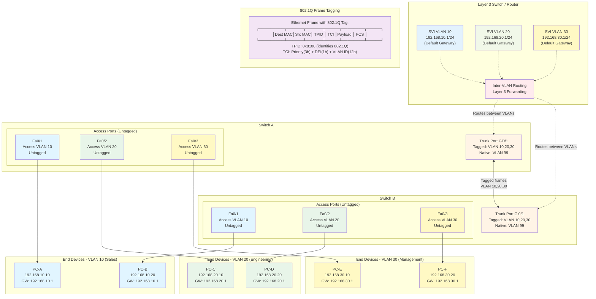
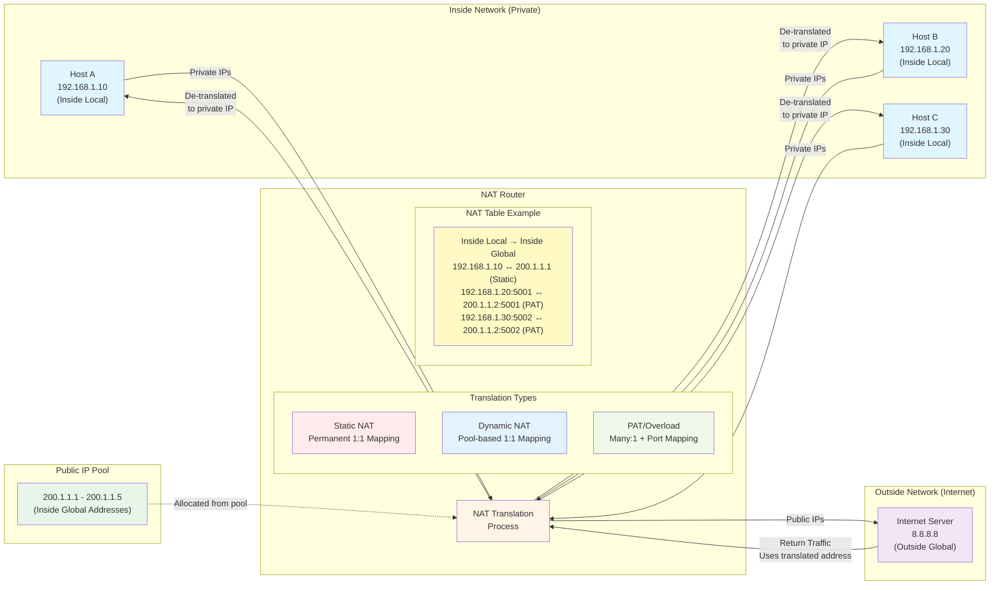

# Network Devices and Operations


## InterOperating System (IOS) Boot Phase

The InterOperating System (IOS) is the proprietary operating system used on Cisco Systems routers and network switches. Understanding its boot phase is crucial for network administrators to troubleshoot startup issues and manage device configurations. The IOS boot phase involves a sequence of steps that the device performs to load its operating system and configuration.

**The Cisco IOS Boot Sequence:**

1.  **Power-On Self-Test (POST):**
    * **Function:** This is the initial diagnostic routine executed immediately after the device is powered on or reset.
    * **Operation:** The CPU tests its own subsystem, then checks the basic hardware components like the CPU, memory (RAM), NVRAM (Non-Volatile RAM), and interfaces.
    * **Outcome:** If POST fails, the device may not boot or may indicate a hardware fault via LEDs.

2.  **Load Bootstrap (Boot Loader):**
    * **Function:** After a successful POST, the CPU looks for and loads the bootstrap program. The bootstrap is a small program stored in ROM (Read-Only Memory).
    * **Operation:** Its primary role is to initialize the CPU and manage the booting of the Cisco IOS image. It performs low-level CPU initialization.
    * **Purpose:** The bootstrap essentially tells the router how to load the IOS.

3.  **Locate and Load Cisco IOS Image:**
    * **Function:** The bootstrap program then searches for the Cisco IOS image (the actual operating system software).
    * **Search Order (default):** The default search order for the IOS image typically includes:
        1.  **Flash Memory:** The primary location where the IOS image is usually stored.
        2.  **TFTP Server:** If not found in Flash, the router can attempt to download the IOS image from a TFTP (Trivial File Transfer Protocol) server on the network. This requires a `boot system` command configured with a TFTP path.
        3.  **ROM Monitor (ROMmon) Mode:** If no valid IOS image is found or loaded, the device enters ROMmon mode (or Boot ROM mode). This is a command-line interface for basic operations like recovering a lost password or manually booting an IOS image.
    * **Configuration Register (Con-Reg):** The boot sequence is heavily influenced by the Configuration Register, a 16-bit software register in NVRAM. Its last four bits (bit 3 to bit 0) determine the boot process:
        * `0x2102` (default): Tells the router to attempt to load an IOS image from Flash, then ROM.
        * `0x2101`: Boots directly into ROMmon mode.
        * `0x2142`: Tells the router to ignore the startup-config during boot. (Useful for password recovery).

4.  **Load Configuration File (Startup-config):**
    * **Function:** Once the Cisco IOS image is successfully loaded, the operating system looks for the startup configuration file.
    * **Location:** The `startup-config` file is stored in NVRAM.
    * **Operation:** If found, the `startup-config` is copied into RAM and becomes the `running-config`. This applies all the saved configurations (interface settings, routing protocols, passwords, etc.) to the device.
    * **No Startup-config:** If no `startup-config` is found in NVRAM, the device enters **Setup Mode** (or initial configuration dialog), prompting the user to perform a basic configuration. This typically happens on a brand-new device or after erasing the NVRAM.

5.  **Running Configuration:**
    * **Function:** The device is now fully operational based on the loaded IOS and `running-config`.
    * **Operation:** All changes made to the configuration during active operation are stored in the `running-config` in RAM. These changes are lost upon reboot unless explicitly saved to `startup-config` in NVRAM using the `copy running-config startup-config` command (or `write memory`).

IOS exists as a file—a single file—that the router then loads into RAM to use as its operating system. To better understand the process, you need to understand the IO file system (IFS), which defines how IOS stores files (including the IOS file). The IOS image upgrade process occurs by copying new IOS files into the router and then booting the router with that new IOS. Every OS creates file systems to store files. A computer needs some type of permanent storage, but it needs more than just a place to store bytes. The OS organizes the storage into a file system, which includes directories, structure, and filenames, with the associated rules. By using a file system, the OS can keep data organized so the user and the applications can find the data later. As for the physical storage, Cisco routers typically use flash memory, with no hard disk drive. Flash memory is re-writeable, permanent storage, which is ideal for storing files that need to be retained when the router loses power. Cisco purposefully uses flash memory rather than hard disk drives in its products because there are no moving parts in flash memory, so there is a smaller chance of failure as compared with disk drives. Some routers have flash memory on the motherboard. Others have flash memory slots that allow easy removal and replacement of the flash card, but with the intent that the card remain in the device most of the time. Also, many devices have USB slots that support USB flash drives. Flash memory is where the IOS image (or multiple images) is permanently stored when the device is powered off. Think of it as the hard drive for your IOS.

Flash memory is electrically erasable programmable read-only memory (EEPROM), which allows for updates and storage of multiple IOS versions. For each physical memory device in the router, IOS creates a simple IOS file system and gives that device a name. IOS uses these file systems for other purposes as well, with these types:

* **Opaque:** To represent logical internal file systems for the convenience of internal functions and commands
* **Network:** To represent external file systems found on different types of servers for the convenience of reference in different IOS commands
* **Disk:** For external flash
* **Usbflash:** For USB flash
* **NVRAM:** A special type for NonVolatileRAM memory, the default location of the startup-config file.

Many IOS commands refer to files in an IFS, but only some commands refer directly to the files by their formal names. The `more` command itself displays the contents of a file. However, many commands use a keyword that indirectly refers to a formal filename, to reduce typing. For example:

* `show running-config` command: Refers to file `system:running-config`
* `show startup-config` command: Refers to file `nvram:startup-config`
* `show flash` command: shows the files in the default flash file system (`flash0:`)

```cli
Router# show file systems
```

* `boot system filepath` → This command tells the router the location of the Upgraded IOS image to boot from on device startup. I.e. `boot system flash:c2900-universalk9-mz.SPA.155-2.T1.bin`
* `delete filepath` → `delete flash:c2900-universalk9-mz.SPA.155-2.T1.bin`

The more general `dir flash0:` command lists the contents of that same file system, with similar information. You can use the `dir` command to display the contents of any local IFS.

```cli
Router# dir flash0:
```

### Upgrading IOS Images

One of the first steps to upgrade a router’s IOS to a new version is to obtain the new IOS image and put it in the right location. Typically, Cisco routers have their IOS in one of the local physical file systems, most often in permanent flash. The only requirement is that the IOS be in some reachable file system—even if the file sits on an external server and the device loads the OS over the network. However, the best practice is to store each device’s IOS file in flash that will remain with the device permanently.

The process to upgrade an IOS image into flash memory, using the following steps:

1.  **Step 1.** Obtain the IOS image from Cisco, usually by downloading the IOS image from Cisco.com using HTTP or FTP.
2.  **Step 2.** Place the IOS image someplace that the router can reach. Locations include TFTP or FTP servers in the network or a USB flash drive that is then inserted into the router.
3.  **Step 3.** Issue the `copy` command from the router, copying the file into the flash memory that usually remains with the router on a permanent basis. (Routers usually cannot boot from the IOS image in a USB flash drive.)

```cli
Router# copy tftp|ftp flash
```
The `copy tftp|ftp flash` command Copies the IOS Image to Flash Memory.

The `copy` command does a simple task—copy a file—but the command also has several small items to check. It needs a few pieces of information from the user, so the command prompts the user for that information by showing the user some text and waiting for the user’s input. The command works through these kinds of questions:

* What is the IP address or host name of the TFTP/FTP server?
* What is the name of the file?
* Ask the server to learn the size of the file, and then check the local router’s flash to ask whether enough space is available for this file in flash memory.
* Does the server actually have a file by that name?
* Do you want the router to erase any old files in flash?

The router prompts you for answers to some of these questions, as necessary. For each question, you should either type an answer or press Enter if the default answer (shown in square brackets at the end of the question) is acceptable. Afterward, the router erases flash memory if directed, copies the file, and then verifies that the checksum for the file shows that no errors occurred in transmission.

The `copy` command allows you to use a URI for the source and/or destination, which lets you put most or all of the information in the command line itself. Each URI refers to the formal name of a file in the IFS. The “ftp” part identifies the protocol, of course. After the `//`, the text references the username and password, as well as the FTP server’s IP address. After the single `/` comes the filename on the server. Although the command is long, it has only two parameters, with the long first parameter and the short keyword flash as the second parameter. The `COPY` command lists the source location as the first parameter and the destination as the second. The destination in this case, flash, is a keyword that refers to the default flash, typically `flash0:`, but it does not identify a specific filename. As a result, IOS prompts the user for a specific destination filename, with a default (in brackets) to keep the source filename. In this case, the user just pressed Enter to accept the default. To avoid being prompted at all, the command could have listed `flash:c2900-universalk9-mz.SPA.155-2.T1.bin` as that second parameter, fully defining the destination file.

The IOS `copy` command, when using the `tftp` or `ftp` keyword, makes the command act as a client. The client connects to a TFTP or FTP server and then attempts to transfer the file.

### Verifying IOS Code Integrity with MD5

Cisco provides a means to check the integrity of the IOS file to prevent malicious downloads. First, when Cisco builds a new IOS image, it calculates and publishes an MD5 hash value for that specific IOS file. That is, Cisco uses as input the IOS file itself, runs the MD5 math algorithm against that file, producing a hex code. Cisco places that code at the download site for all to see. Then, you run that same MD5 math on your router against the IOS file on the router, using the IOS `verify` command. That command will list the MD5 hash as recalculated on your router. If both MD5 hashes are equal, the file has not changed.

**MD5 Verification of IOS Images—** The `verify /md5` command generates the MD5 hash on your router/switch. Note that you can include the hash value computed by Cisco as the last parameter or leave it off. If you include it, IOS will tell you if the locally computed value matches what you copied into the command. If you leave it out, the `verify` command lists the locally computed MD5 hash, and you have to do the picky character-by-character check of the values yourself.

```cli
Router# verify /md5 flash:c2900-universalk9-mz.SPA.155-2.T1.bin [MD5_HASH_FROM_CISCO]
```

Device provisioning involves the automated setup and configuration of new network devices. This includes applying initial configurations, setting up interfaces, assigning IP addresses, and implementing basic security policies. Automating these steps eliminates manual, repetitive tasks, significantly speeding up the deployment process and minimizing the risk of human error.

Compliance checks automate the process of verifying if device configurations adhere to predefined standards and policies. While important for maintaining network health and security, they don't directly involve the initial configuration process.

Device software management focuses on automating the upgrading, patching, and managing of software versions on network devices. This is crucial for maintenance but not the primary task of initial configuration.

Data collection and telemetry involve the automated gathering of performance metrics and operational data from network devices. This provides valuable insights but doesn't directly impact the efficiency and accuracy of the configuration process itself.

### General Device Access and Mode Changes

* `SW/RT>enable` → Enter privileged mode
* `SW/RT>Exit` → Exit privileged exec mode or cli terminal
* `SW/RT# configure terminal` → Enter Global Configuration Mode Terminal

### Write Configuration to Memory Buffer

* `Write` or `Write Memory`
* `copy run start`
* `copy running-config startup-config`

### HostName Configuration

* `SW(config)# hostname Office` → Change Switch Hostname


---

## Security and Encryption

The ultimate way to protect passwords in Cisco IOS devices is to not store passwords in IOS devices. That is, for any functions that can use an external authentication, authorization, and accounting (AAA) server, use it. The configuration labelled SSH and TELNET in the figure supports both SSH and Telnet, but consider allowing SSH only by instead using the `transport input ssh` command. The Telnet protocol sends all data unencrypted, so any attacker who copies the message with a Telnet login will have a copy of the password.

```cli
SW/RT# enable passwd Cisco123
```
This sets password to protect privileged mode with a password. Cisco used the `enable password password` global command to define the password that users had to use to reach enable mode (after using the `enable` EXEC command).

```cli
SW/RT# service password-encryption
```
Encrypt the Clear Text password. Cisco attempted to solve this clear-text problem by adding a command to encrypt those passwords: the `service password-encryption` global configuration command. This command encrypts passwords that are normally held as clear text, specifically the passwords for these commands:

* `password password` (console or vty mode)
* `username name password password` (global)
* `enable password password` (global)

IOS adds the encryption or encoding type of “7” to the command, which specifically refers to passwords encrypted with the `service password-encryption` command. While the `service password-encryption` global command encrypts passwords, the `no service password-encryption` global command does not immediately decrypt the passwords back to their clear-text state. Instead, after you enter the `no service password-encryption` command, the passwords remain encrypted until you change a password. Unfortunately, the `service password-encryption` command does not protect the passwords very well. Armed with the encrypted value, you can search the Internet and find sites with tools to decrypt these passwords.

Cisco has never removed the much weaker `enable password` command from IOS. So, on a single switch (or router), you can configure one or the other, both, or neither. What, then, does the switch expect us to type as the password to reach enable mode? It boils down to these rules:

1.  **Both commands configured:** Users must use the password in the `enable secret password` command (and ignore the `enable password password` command).
2.  **Only one command configured:** Use the password in that one command.
3.  **Neither command configured (default):** Console users move directly to enable mode without a password prompt; Telnet and SSH users are rejected with no option to supply an enable password.

The Cisco `enable secret` command protects the password value by never even storing the clear-text password in the configuration. However, that one sentence may cause you a bit of confusion: If the router or switch does not remember the clear-text password, how can the switch know that the user typed the right password after using the `enable` command?

1.  **Step 1.** IOS computes the MD5 hash of the password in the `enable secret` command and stores the hash of the password in the configuration.
2.  **Step 2.** When the user types the `enable` command to reach enable mode, a password that needs to be checked against that configuration command, IOS hashes the clear-text password as typed by the user.
3.  **Step 3.** IOS compares the two hashed values: if they are the same, the user-typed password must be the same as the configured password.

As a result, IOS can store the hash of the password but never store the clear-text password; however, it can still determine whether the user typed the same password.

```cli
SW/RT# enable secret password
```
However, using `secret` uses a more secure encryption algorithm (MD5 Hashing {5}, PBKDF2 {4}, SHA-256 {8}, scrypt {9}) for encrypting the enable password stored in the configuration file.

* `enable [algorithm-type md5] secret password`
* `enable algorithm-type sha256 secret password`
* `enable algorithm-type scrypt secret password`

```cli
SW/RT# username user password pass
```
Encoding the Passwords for Local Usernames.

```cli
SW/RT# login local
```
Login to the Local User; Request for Username:password.

IOS does not use the same logic for the `username` command as it does for allowing both the `enable secret` plus `enable password` commands to exist in the same configuration. IOS allows:

* Only one `username` command for a given username—either a `username user password password` command or a `username user secret password` command.
* A mix of commands (`username password` and `username secret`) in the same router or switch (for different usernames).

You should use the `username secret` command instead of the `username password` command when possible. However, note that some IOS features require that the router knows a clear-text password via the `username` command (for instance, when performing some common authentication methods for serial links called PAP and CHAP). In those cases, you still need to use the `username password` command.

#### TELNET

```cli
SW1(config)#ip default-gateway 192.168.1.254
```
Configure the switch's default gateway. If SW1 doesn't have a default gateway, it can't communicate with devices outside its subnet.

```cli
SW1(config)#enable secret ccna
```
If an enable password/secret isn't configured, you won't be able to access privileged exec mode when connecting via Telnet.

```cli
SW1(config)#username maverick secret ccna
```

```cli
SW1(config)#access-list 1 permit host 192.168.2.1
```
Configure an ACL to limit which devices can connect to the VTY lines.

```cli
SW1(config)#line vty 0 15
```
Telnet/SSH access is configured on the VTY lines. There are 16 lines available, so up to 16 users can be connected at once. (VTY stands for Virtual TeleType).

```cli
SW1(config-line)#login local
```

```cli
SW1(config-line)#exec-timeout 5 0
```

```cli
SW1(config-line)#transport input telnet|ssh|all|none
```
Allows either Telnet/SSH or Both/No transport connections on the Virtual Teletypewriter console line configured.

```cli
SW1(config-line)#access-class 1 in
```
Apply the ACL to the VTY lines. `*access-class` applies an ACL to the VTY lines, `ip access-group` applies an ACL to an interface.

#### SSH (Secure Shell)

SSH (Secure Shell) was developed in 1995 to replace less secure protocols like Telnet. In computing, a shell is a computer program which exposes an operating system's services to a human user or other program. In general, operating system shells use either a command-line interface (CLI) or graphical user interface (GUI), depending on a computer's role and particular operation. It is named a shell because it is the outermost layer around the operating system. SSHV2, a major revision of SSHV1, was released in 2006. If a device supports both version 1 and version 2, it is said to run 'version 1.99'.

* Provides security features such as data encryption and authentication.
* IOS images that support SSH will have 'K9' in their name.
    * Cisco exports NPE (No Payload Encryption) IOS images to countries that have restrictions on encryption technologies. NPE IOS images do not support cryptographic features such as SSH.
* To enable and use SSH, you must generate an RSA public and private key pair.
* The keys are used for data encryption/decryption, authentication, etc.

1.  Configure HostName
2.  Configure DNS domain name
3.  Generate RSA key pair
4.  Configure enable PW, username/PW
5.  Enable SSHV2 (only)
6.  Configure VTY lines

**Connect:** `ssh -L username ip-address` or `ssh username@ip-address`

```cli
SW(config)# hostname Office
```
Change Switch Hostname.

```cli
SW1(config)#ip domain name jeremysitlab.com
```
The FQDN of the device is used to name the RSA keys. FQDN = Fully Qualified Domain Name (host name + domain name).

```cli
SW1(config)#crypto key generate rsa
```
Generate the RSA keys.

```cli
SW1(config)#crypto key generate rsa modulus Length is an alternate method.
```
`*length must be 768 bits or greater for SSHv2`

```cli
SW1(config)#enable secret ccna
```
or

```cli
SW1(config)#username Maverick secret ccna
```

```cli
SW1(config)#access-list 1 permit host 192.168.2.1
```

```cli
SW1(config)#ip ssh version 2
```
(optional, but recommended) Restrict SSH to version 2 only.

```cli
SW1(config)#line vty 0 15
```
Configure all VTY lines, just like Telnet.

```cli
SW1(config-line)#login local
```
Enable local user authentication. `*you can only use login local for SSH.`

```cli
SW1(config-line)#exec-timeout 5 0
```
(optional, but recommended) Configure the exec timeout.

```cli
SW1(config-line)#transport input ssh
```
Best practice is to limit VTY line connections to SSH only.

```cli
SW1(config-line)#access-class 1 in
```
(optional, but recommended) Apply the ACL to restrict VTY line connections. When an external user connects to a router or switch using Telnet or SSH, IOS uses a vty line to represent that user connection. IOS can apply an ACL to the vty lines, filtering the addresses that can telnet or SSH into the router or switch. If filtered, the user never sees a login prompt. ACL checks the source IP address of packets for incoming Telnet/SSH connections.

IOS also supports using ACLs to filter outbound Telnet and SSH connections. For example, consider a user who first uses Telnet or SSH to connect to the CLI and now sits in user or enable mode. With an outbound vty filter, IOS will apply ACL logic if the user tries the `telnet` or `ssh` commands to connect out of the local device to another device.

To configure an outbound VTY ACL, use the `access-class acl out` command in VTY configuration mode. Once configured, the router filters any attempts made by current vty users to use the `telnet` and `ssh` commands to initiate new connections to other devices.

Of the two options—to protect inbound and outbound connections—protecting inbound connections is by far the more important and more common. However, to be complete, outbound VTY ACLs have a surprisingly odd feature in how they use the ACL. When the `out` keyword is used, the standard IP ACL listed in the `access-class` command actually looks at the destination IP address, and not the source. That is, it filters based on the device to which the `telnet` or `ssh` command is trying to connect.

### Command Summaries

| Command / Context                 | Description                                                                                                                                                                                                            |
| :-------------------------------- | :--------------------------------------------------------------------------------------------------------------------------------------------------------------------------------------------------------------------- |
| `line console 0`                  | Command that changes the context to console configuration mode.                                                                                                                                                        |
| `line vty 1st-vty last-vty`       | Command that changes the context to vty configuration mode for the range of vty lines listed in the command.                                                                                                           |
| `login` (Console and vty config)  | Tells IOS to prompt for a password.                                                                                                                                                                                    |
| `password pass-value` (Console and vty config) | Lists the password required if the `login` command is configured.                                                                                                                                                      |
| `login local` (Console and vty config) | Tells IOS to prompt for a username and password, to be checked against locally configured `username` global configuration commands.                                                                                      |
| `username name [algorithm-type md5 | sha256 | scrypt] secret pass-value` (Global) | Defines one of possibly multiple usernames and associated passwords, stored as a hashed value (default MD5), with other hash options as well.                        |
| `username name password pass-value` (Global) | Defines a username and password, stored in clear text in the configuration by default.                                                                                                                                 |
| `crypto key generate rsa [modulus 512 | 768 | 1024]` (Global) | Creates and stores (in a hidden location in flash memory) the keys required by SSH.                                                                                                                    |
| `transport input {telnet | ssh | all | none}` (vty line config) | Defines whether Telnet and/or SSH access is allowed into this switch.                                                                                                                    |
| `[no] service password-encryption` (Global) | Global command that encrypts all clear-text passwords in the running-config. The `no` version of the command disables the encryption of passwords when the password is set.                                         |
| `enable password pass-value` (Global) | Global command to create the enable password, stored as a clear text instead of a hashed value.                                                                                                                        |
| `enable [algorithm-type md5 | sha256 | scrypt] secret pass-value` (Global) | Global command to create the enable password, stored as a hashed value instead of clear text, with the hash defined by the algorithm type.                           |
| `no enable secret` (Global)       | Global command to delete the enable secret command.                                                                                                                                                                    |
| `no enable password` (Global)     | Global command to delete the enable password command.                                                                                                                                                                  |

---

## Chapter 10: Switches (Layer 2) 

## Network Interface

A **Network Interface** is the means by which a node is connected to the media and exchanges data with other network nodes. A **Network Interface Card (NIC)** is a transceiver component responsible for physically connecting the node to the transmission medium (a chip).

Each Ethernet network interface port has a Unique **Media Access Control Address** (hardware address / Ethernet Address). In IEEE Terminology, this is an **EUI** (Extended Unique Identifier). An **EUI-64** is a 64-bit Hardware Address. A mechanism allows for translations between the 48-bit MAC address and 64-bit EUI-64 address.

---

### Ethernet Frame Format

Ethernet encapsulates the payload from higher layer protocols within a Protocol Data Unit (PDU) called a **frame**.

| Preamble | Start Frame Delimiter (SFD) | Destination MAC | Source MAC | Ether Type / Length | Payload Data (from higher layer protocols) | Frame Check Sequence (FCS) |
| :------- | :-------------------------- | :-------------- | :--------- | :------------------ | :----------------------------------------- | :------------------------- |
| 7 bytes  | 1 byte                      | 6 bytes         | 6 bytes    | 2 bytes             | 46-1500 bytes                              | 4 bytes                    |

Preamble and SFD are used for clock synchronization and as part of the CSMA/CD protocol to identify collisions during transmissions very early from the Physical Layer, and as such are not technically considered to be part of the frame.

### Error Checking

The frame contains a 4-byte long checksum called a **Cyclic Redundancy Check (CRC)** or **Frame Check Sequence (FCS)**, which is calculated based on the contents of the frame. The receiving node performs the same calculation, and if it matches, accepts the frame. There is no mechanism for retransmission if damage is detected. CRC is not completely accurate at error checks.

---

### MAC / EUI-48 Format

The IEEE gives each manufacturer a range of numbers hard coded to every interface produced, called a **Burned-In Address** or **Universal Address**.

The first 3 bytes or octets (the first 6 Hex Digits) are also known as the **Organizationally Unique Identifier (OUI)** / **OUI Admin Address**.

A **Locally Administered Address** is used on networks in place of the manufacturer's universal coding system. It is defined by changing the U/L bit from 0 to 1. It becomes the responsibility of an organization's Internal Network Admin to ensure that all connected Interfaces are configured with a Unique MAC.

**Broadcast Address:** `FF:FF:FF:FF:FF:FF`

The I/G bit of a MAC address determines whether the frame is addressed to an Individual Node and/or a Group. If the I/G bits are all 1s, the MAC address is referred to as a **Broadcast Address** and should be processed by all nodes within the same broadcast domain.

---

### Maximum Transmission Unit (MTU)

The maximum size of the Data payload found in Layer 2 is **1500 Bytes**. This upper limit size of the payload is referred to as **Maximum Transmission Unit (MTU)**.

Excluding the preamble and SFD, a standard Ethernet frame has a maximum length of 1518 bytes (6 bytes Source MAC + 6 bytes Dest MAC + 2 bytes Ether Type field + 4 bytes FCS + 1500 bytes Payload).

To comply with Ethernet standards, the minimum length of an Ethernet frame is 64 bytes, so the payload must be at least 46 bytes. If this is not the case, it is auto-padded with redundant data. Some Gigabit Ethernet (GbE) and 10 Gigabit Ethernet (10GbE) support **Jumbo Frames** with much larger Maximum Transmission Units.

---


### Advanced Ethernet Switches

Switches normally support a range of Ethernet Standards so that older and newer Network Adapters can all be connected to the same Network.

Advanced Ethernet Switches support interconnections via high-speed backplanes to expandable capacity through plug-in modules, plus power supply redundancy, management consoles, and transceivers for fiber optic connectivity. They can, however, be distinguished using the following general categories:

1.  **Unmanaged vs. Managed:**
    * On a Small Office/Home Office (SOHO) Network, Switches are more likely to be **Unmanaged** Standalone Units that can be added to the network and run without any configuration. The switch functionality might also be built into an Internet Router/modem.
    * On a Corporate network, Switches are likely **Managed** and need Configuration (e.g., Command Line Interface).
2.  **Stackable:** Switches connected together to operate as a single unit. A stack can be managed as a group, and the switch is managed.
3.  **Modular vs. Fixed:**
    * A **Fixed** switch comes with a set number of ports that cannot be changed or upgraded.
    * A **Modular** Switch has slots for plug-in cards/modules.
4.  **Desktop vs. Rack-Mounted:**
    * Simple Unmanaged switches might be supplied as small freestanding units that can be placed on a desktop platform.
    * Stackable units are designed to be fitted to standard-size racks.

---

### Managed Switch Configuration & Interface Identification

Configuration of a Managed Switch can be performed at a Command Line Interface (CLI). Most Switch OS work in multi-Command modes or Hierarchies:

1.  **User EXEC Mode:** Read-Only, used to report configuration, show system states & troubleshooting.
2.  **Privileged EXEC Mode (Enable Mode):** Allows users to reboot, shutdown & backup/restore the system's configuration.
3.  **Global Config Mode:** Allows user to write configuration updates (not read-only in this context; allows writing).

Stackable Switches precede Interface Identifiers with a module ID (different for each switch in the stack). Interfaces are identified by Type, slot on Switch used, and port number (directly correlated).

An Interface has a **line status** (up if a host is connected via a good cable), and a **protocol status** (up if an Ethernet link is established). Line status + protocol status "down" indicates a fault in either the link connection.

---

### Crossover Cable & Auto-MDI/MDIX

A **Crossover Cable** has T568A termination at one end and T568B termination at the other end of the cable. Historically, in the days of Hubs, dedicated Uplink ports and/or Crossover Cables were used to make connections between 2 separate hubs.

When a switch needs to be connected to another switch, communication would fail if both interfaces used MDI-X. Nowadays, most switch interfaces are configured to use **Auto-MDI/MDIX** by default. This means that the switch senses the configuration of the connected device or cable wiring. It senses that an MDI or Uplink to an MDIX port gets configured. This also ensures a link if a Crossover Cable is used to connect to an end system by mistake. Gigabit Ethernet Interfaces must support Auto-MDI/MDIX.

---

### MAC Address Learning & Flooding

A switch learns MAC addresses by reading the **source address** when a frame is received on its port. The address mapping for that port is cached in a **MAC Address Table**, which is stored in a special type of memory known as **Content Addressable Memory (CAM)**. CAM is optimized for searching rather than random access.

If a MAC address isn't found in a MAC Address table, the switch acts like a hub and transmits the frame out to all ports, except for the source port (**FLOODING**).

---

### Port Security

A Port Security Configuration validates the MAC Address of end systems that connect to a switch port. A port security configuration has three primary elements:

1.  Specify an **Enforcement action** when a policy violation is detected (e.g., restrict or shutdown).
2.  Specify a **static MAC Address** or allow the port to learn and accept a certain number of sticky addresses.

---

### Port Aggregation / Link Aggregation

**Port Aggregation** means combining two or more separate cabled links into a single logical channel. From the host end, this can also be called Network Interface Card (NIC) Teaming / Bonding.

**Link Aggregation Control Protocol (LACP)** is used to auto-negotiate the bonded link between the switch port and the end system, detect configuration errors, and recover from the failure of one of the physical links.

Either ingress (incoming) OR egress (outgoing) traffic, or both, can be captured.

---

### Unicast vs. Flooding & Port Mirroring

Unlike Hubs, Switches forward Unicast traffic only to the specific port connected to the intended destination interface, preventing sniffing of Unicast Traffic by hosts attached to the same switch.

**Port Mirroring** copies all packets sent to one or more source ports to a configured monitor port. On a Cisco Switch, this is referred to as **Switched Port Analyzer (SPAN)**. The mirror port would be used by management monitoring software, such as a packet sniffer, network analyzer, or Intrusion Detection System.

---

### Specialized Port Settings

Some types of ports need special optimized port settings, e.g., Storage Area Networks (SANs) found in data centers, which require special requirements to handle Jumbo Frames and Flow Control.

* A **Jumbo Frame** is one that supports a data payload of up to 9000 bytes (far exceeding the ordinary Ethernet frame MTU of 1500 bytes limit), thereby supporting transfer of data in a 10GbE network. This reduces the number of frames that needs to be transmitted (i.e., instead of transmitting 1500 x 6 frames = 9000). It also reduces the amount of processing that switches and routers need to do. It also reduces bandwidth requirement as fewer individual frame headers are transmitted. It's critical that all hosts and appliances along the communication path are able to support the configuration of Jumbo Frames.
* **IEEE 802.3x Flow Control** allows a server to instruct the switch to pause traffic temporarily to avoid overwhelming its buffer and causing it to drop frames. A Switch port can be Configured to Enable/Disable use of pause frames. The 802.3x global pause mechanism doesn't differentiate between traffic types. The updated Priority Flow Control (PFC) mechanism (IEEE 802.1Qbb) allows PAUSE to apply to certain traffic types through the use of Class of Service (CoS). This is related to Quality of Service (QoS).

---

### Power Over Ethernet (PoE)

**Power over Ethernet (PoE)** is a means of supplying electrical power from a Switch via data cabling to a connected powered device (PD).

* **IEEE 802.3af (Type 1) - PoE:** Powered devices can draw up to 13W over cabling. Power is supplied at 350mA / 48V.
* **IEEE 802.3at (Type 2) - PoE+:** Powered devices can draw up to 25W, delivered at 600mA.
* **IEEE 802.3bt (Type 3 / Type 4) - Ultra PoE:** Supplies up to 51W (Type 3) or 75W (Type 4) usable power.

PoE Switches are referred to as **Endpoint Power Sourcing Equipment**. If an existing switch doesn't support PoE, a device called a **Power Injector (Midspan)** can be used.

Cat 3 or better is required to support PoE, while PoE+ must be Cat 5e or better.

Drawing power down the cable generates more heat. If this heat is not dissipated, it can affect data rates. Thermal performance can be achieved or improved using pure copper cabling with large conductors; as a thin conductor will generate more heat through resistance. Also, shielded cable is capable of dispersing heat more efficiently too, through absorption.

---

## VIRTUAL LOCAL AREA NETWORKS (VLANs)

Unless configured differently, managed switches allow the configuration of **Virtual LANs (VLANs)** to logically separate ports into distinct **broadcast domains**. In a well-designed network, there is typically a 1:1 mapping between VLANs and subnets; it's like assigning one room (subnet) for each invisible space (VLAN) you've created.

### Benefits of Implementing VLANs

* **Reduced Broadcast Traffic:** VLANs significantly reduce broadcast traffic, especially beneficial in networks that have expanded beyond a certain number of hosts or users. Each VLAN represents a smaller broadcast domain.
* **Security Segmentation:** From a security point of view, each VLAN can represent a separate security zone, allowing for stricter access controls between different segments of the network. This helps in containing security breaches.
* **Traffic Prioritization (QoS):** VLANs are used to separate nodes based on traffic type and the need for Quality of Service (QoS). For example, switches and Layer 3 routers can be configured to give **Voice VLANs** priority over ordinary data VLANs, ensuring clear voice communication.

### VLAN ID and Assignment

* **VLAN ID 1:** This is the **default VLAN**. All ports on a switch default to being in VLAN 1 unless explicitly configured otherwise.
* **VLAN ID Range:** To assign a node to a VLAN, you configure the port interface on the switch with a VLAN ID in the range of **2 to 4,094**.
* **Reserved IDs:** VLAN IDs **0** (all zeros) and **4,095** (all ones) are reserved for system use and cannot be assigned.
* **Network Segmentation:** VLANs establish network segments (broadcast domains) at **Layer 2 (Data Link Layer)**. A VLAN represents a single broadcast domain.
* **Inter-VLAN Communication:** Communication between different VLANs **must go through a Layer 3 device**, such as a router or a Layer 3 switch.
* **Dynamic VLANs:** Nodes or hosts can also be configured to belong to dynamic VLANs using features supplied by the port, such as a host's MAC address or authentication credentials used (e.g., through 802.1X integration with a RADIUS server). This is referred to as **Dynamic VLAN Assignment**.

### Tagged and Untagged Ports



**VLAN Architecture Components:**

1. **Access Ports (Untagged):**
   - Connect end devices (PCs, printers, phones)
   - Belong to a single VLAN
   - Strip VLAN tags before forwarding to devices
   - Switch adds VLAN tag when receiving frames from access ports

2. **Trunk Ports (Tagged):**
   - Carry traffic for multiple VLANs between switches
   - Use IEEE 802.1Q tagging to identify VLAN membership
   - 4-byte tag inserted: TPID (0x8100) + TCI (Priority + DEI + VLAN ID)
   - Native VLAN: untagged traffic defaults to this VLAN (security best practice: change from VLAN 1)

3. **Inter-VLAN Routing:**
   - Layer 3 device required for communication between VLANs
   - Switch Virtual Interfaces (SVIs): virtual Layer 3 interfaces per VLAN
   - Each SVI acts as default gateway for its VLAN
   - Enables internal routing without external router (Layer 3 switch)

4. **802.1Q Frame Structure:**
   - TPID (Tag Protocol Identifier): 16 bits, value 0x8100
   - PCP (Priority Code Point): 3 bits for QoS (0-7 priority levels)
   - DEI (Drop Eligible Indicator): 1 bit, marks frames eligible for dropping during congestion
   - VLAN ID: 12 bits, identifies VLAN (1-4094, 0 and 4095 reserved)

5. **VLAN Segmentation Benefits:**
   - Reduced broadcast domains
   - Enhanced security through logical separation
   - Simplified network management and scalability
   - QoS implementation per VLAN (e.g., Voice VLAN priority)

* **Untagged / Access / Host Port:** If a switch port will only ever participate in a single VLAN, it is configured as an **untagged** or **access port**. This is typically where end-user devices (PCs, printers) connect.
    * If a frame is addressed to a port in the same VLAN on the same switch, no tag needs to be added to the frame.
    * If the switch receives an 802.1Q tagged frame on an access port, it will usually strip the tag before forwarding it to the end device, as the end device typically doesn't understand VLAN tags.
* **Tagged / Trunk Port:** A **tagged port** will normally be operating as a **trunk**. A trunk is capable of transporting traffic addressed to multiple VLANs using the **IEEE 802.1Q frame format**.
    * A trunk might be used to connect switches to each other or to connect a switch to a router (or Layer 3 switch).
    * When frames designated for different VLANs are transported across a trunk, the VLAN ID of each frame must be preserved for the receiving switch or router to forward it correctly.
    * Under **802.1Q**, per-VLAN traffic is identified by a tag inserted in the Layer 2 Ethernet frame. This tag contains information about the **VLAN ID (1-4094)** and **priority** (used for QoS functions). A specific EtherType value is set to identify the frame as 802.1Q.
    * If a frame needs to be transported over a trunk link (e.g., connecting two different switches), the source switch adds the relevant 802.1Q tag to identify the VLAN, and then forwards the frame out the trunk port to the destination switch.
    * An administrative host or server that needs to access multiple VLANs might need to be attached to a trunk port rather than an access port, and its network interface configured to understand VLAN tagging.

### Voice VLANs

* **Voice over IP (VoIP)** transmits audio/voice traffic as data packets, rather than using circuit-based transmission.
* The bandwidth and latency requirements of voice traffic mean that it is often necessary to prioritize it over other types of data packets. This can be implemented using a dedicated VLAN for voice traffic.
* Normally, for a switch interface to process tagged frames, it would have to be configured as a trunk port. However, this can add configuration complexity, especially for ports connected to IP phones that also have a PC connected through them.
* Many switches now support the concept of a **Voice Auxiliary VLAN**. This allows the switch to distinguish VoIP traffic without having to configure the port as a full trunk.
* **Common Scenario:** A single physical wall port is shared between a PC and a VoIP handset. The handset has an internal 3-port switch.
    * The PC's untagged data traffic (e.g., VLAN ID 100) passes through the IP phone to the switch.
    * The VoIP handset's voice traffic is typically assigned a different VLAN ID (e.g., VLAN ID 101) and is sent to the switch as 802.1Q tagged traffic.
    * The switch will only accept tagged frames that match the configured Voice VLAN ID.
    * To avoid manual configuration, the Voice VLAN ID and other configuration parameters can be communicated to the handset using protocols like **Cisco Discovery Protocol (CDP)**.
    * **Switch Interface Configuration Example for Voice VLAN:** `switchport voice vlan [ID]`

### Private VLANs (PVLANs)

* A **Private VLAN (PVLAN)** applies an additional layer of segmentation by restricting the ability of hosts within a VLAN to communicate directly with one another, even if they are in the same subnet.
* **Use Cases:** This might be used by a hosting company to prevent web servers operated by different customers from being able to communicate with each other. Similarly, Internet Service Providers (ISPs) use PVLANs to isolate subscriber traffic. Isolating these server instances using PVLANs can be simpler than creating multiple VLANs and subnets for each isolated instance.
* **PVLAN Port Types:** When configuring a PVLAN, the host VLAN is referred to as the **Primary VLAN**. Several types of ports can be configured within a PVLAN:
    * **Promiscuous Port:** Can communicate with all other ports in all domains within the PVLAN. Routed/DHCP traffic typically goes through this port (e.g., a router interface).
    * **Isolated Port:** Can only communicate with the promiscuous port. This effectively creates a subdomain of a single host only. A PVLAN can contain multiple isolated ports, but each is in its own isolated subdomain.
    * **Community Port:** Can communicate with the promiscuous port and with other ports in the same community. This creates a domain that can contain multiple hosts that can communicate with each other, but not with hosts in other communities or isolated ports within the same PVLAN (except through the promiscuous port).

### Default VLAN vs. Native VLAN

* **Default VLAN (VLAN 1):** VLAN ID 1 is referred to as the DEFAULT VLAN. This cannot be changed. All ports on a switch default to being in VLAN 1. When implementing VLANs, you should **avoid sending user data traffic over the default VLAN**. It should remain unused or used only for inter-switch protocol traffic (e.g., Spanning Tree Protocol traffic is permitted to run over the default VLAN). Ensure that unused ports are not assigned to VLAN 1.
* **Native VLAN:** A **native VLAN** is the VLAN into which any **untagged traffic** is placed when receiving frames over a trunk port.
    * When a switch receives an untagged frame over a trunk, it assigns the frame to the native VLAN.
    * Such untagged traffic might come from legacy devices that do not support 802.1Q encapsulated frames (although this is rare in modern networks where trunking is used primarily with 802.1Q).
    * The native VLAN is initially set with the same VID as the default VLAN (VLAN 1).
    * You **can and should change this** to make the native VLAN a suitable, unused ID. This ID should ideally **not be the same as any VLAN used for any other data traffic**.
    * The same native VLAN ID should be configured for the trunk port on both interconnected switches to avoid potential VLAN hopping attacks or traffic misplacement.

---

#### Understanding Broadcast Domains

A broadcast domain is a network segment where a broadcast frame sent by any device is received by all other devices within the same segment. This characteristic defines the limitations and scope of broadcast traffic within a Layer 2 network (LAN).

* **Switch Behavior:**
    * Switches propagate broadcast frames out through all ports except the one on which the frame was received. Unlike switches, routers block broadcast frames from passing to other network segments, thereby limiting the spread of broadcast traffic.
* **Concerns with broadcast Traffic:**
    * Excessive broadcast traffic can degrade network performance and pose security risks. It's essential to manage and contain broadcast domains effectively.

#### VLANs (Virtual Local Area Networks)

VLANs are used to segment a physical network into multiple logical networks at Layer 2. Each VLAN forms its own broadcast domain, which helps in reducing unnecessary broadcast traffic and enhances network security and performance.

* **Configuration Steps:**
    1.  **Create VLAN:**
        ```cli
        Switch(config)# vlan [VLAN_NUMBER]
        Switch(config-vlan)# name [VLAN_NAME]
        ```
    2.  **Assign VLAN to Interface:** This sets the interface `fa0/1` as an access port in `[VLAN_ID]`.
        ```cli
        Switch(config)# interface fa0/1
        Switch(config-if)# switchport mode access
        Switch(config-if)# switchport access vlan [VLAN_ID]
        ```

* **Default VLANs and Ranges:**
    * All interfaces are in VLAN 1 by default.
    * Normal range VLANs: 1-1005.
    * Extended range VLANs: 1006-4094.

### Advanced Concepts in Inter-VLAN Routing and Trunking

#### Efficient Handling of Multiple VLANs

In a network where the number of VLANs increases, using a separate interface for each VLAN becomes impractical. This is due to physical limitations such as the number of router interfaces and the inefficiency of managing multiple cables and ports.

* **Trunk Ports:**
    * To efficiently manage traffic from multiple VLANs over a single interface, trunk ports are used. These ports can carry traffic for multiple VLANs simultaneously, distinguishing the traffic by tagging frames with VLAN IDs. Trunk ports carry traffic for multiple VLANs across a single link using tagging protocols like IEEE 802.1Q, which keeps the traffic for different VLANs segregated.

#### Trunking Protocols

The primary protocol used for trunking on modern networks is IEEE 802.1Q. It is essential for maintaining VLAN information as traffic moves between switches or to routers.

* **IEEE 802.1Q Tagging:**
    * **Frame Structure:** Adds a 4-byte tag into the original Ethernet frame, which includes:
        * **Tag Protocol Identifier (TPID):** A field that identifies the frame as an IEEE 802.1Q-tagged frame.
        * **Priority Code Point (PCP):** A 3-bit field used for class of service to prioritize traffic.
        * **Drop Eligible Indicator (DEI):** Indicates if the frame can be dropped if the network is congested.
        * **VLAN ID (VID):** A 12-bit field essential for identifying the VLAN to which the frame belongs. The range of possible VLAN IDs is 1-4095, offering extensive flexibility.

#### Frame Handling Across Switches

* **Same VLAN Communication:** No tagging is required if the destination port resides in the same VLAN on the same switch.
* **Different VLAN Communication:**
    * Within the same switch, frames destined for different VLANs are tagged with the destination VLAN ID.
    * Between different switches, frames are transmitted over trunk links with appropriate tagging according to IEEE 802.1Q standards.

#### Switch Processing and MAC Address Learning

When a frame enters a switch:

* If the VLAN ID from the tag is active and valid, the switch processes it according to configured interface port settings.
* The switch uses its MAC address table to determine the correct outgoing ports for the VLAN specified by the tag.
* If the destination MAC address is unknown, the switch may broadcast the frame to all ports in the specific VLAN, except the one it arrived on.

#### Native VLAN and Untagged Traffic

* **Native VLAN Concept:** By default, VLAN 1 is treated as the native VLAN on trunk ports.
* Untagged frames arriving on a trunk port are assumed to belong to the native VLAN.
* Frames destined for the native VLAN are transmitted without an IEEE 802.1Q tag.

#### Note on Security and Configuration

Ensuring that the native VLAN matches on all interconnected trunk ports is critical to prevent VLAN hopping attacks and other security vulnerabilities. It is advisable to change the native VLAN from the default (VLAN 1) to another unused VLAN ID and configure this consistently across all devices.

### Conclusion

Understanding and implementing inter-VLAN routing and trunking are vital for network scalability and efficiency. Proper use of trunking protocols like IEEE 802.1Q facilitates seamless communication across multiple VLANs while conserving physical resources. Additionally, careful configuration and management of VLAN settings and native VLAN configurations enhance network security and operational efficiency.

#### Inter-VLAN Routing

For traffic to flow between different VLANs, routing must occur at Layer 3:

* **Router-on-a-Stick:** A single physical router interface can be subdivided into multiple logical sub-interfaces, each corresponding to a different VLAN. Here, each sub-interface handles traffic for a specific VLAN, and the encapsulation specifies the VLAN ID associated with the sub-interface.
    ```cli
    Router(config)# interface fa0/0.1
    Router(config-subif)# encapsulation dot1Q [VLAN_ID]
    Router(config-subif)# ip address [IP_ADDRESS] [SUBNET_MASK]
    ```

* **Layer 3 Switches:**
    * Layer 2 switches don't perform packet routing and don't build a routing table. They aren't IP routing aware. However, you can assign an IP address to an SVI to allow remote connections to the CLI of the switch (using Telnet or SSH). These can perform routing between VLANs without needing separate router. Like ROAS Architecture.
    * **Example Configuration:**
        ```cli
        Switch(config)# interface vlan [VLAN_ID]
        Switch(config-if)# ip address [IP_ADDRESS] [SUBNET_MASK]
        Switch(config-if)# no shutdown
        ```
    * This configures a virtual interface for each VLAN, allowing the switch to route traffic between them directly.

Properly configuring VLANs and managing broadcast domains are critical for maintaining network efficiency, security, and scalability. By segmenting a network into VLANs and correctly configuring inter-VLAN routing, network administrators can ensure optimal performance and robust security across the network infrastructure.

### Multilayer Switching and Inter-VLAN Routing

#### Concepts and Implementation

Multilayer or Layer 3 switches are advanced devices capable of both switching and routing functions, allowing for efficient handling of traffic within VLANs and between different networks.

#### Native VLAN and IP Setup

* **Native VLAN:** This is used primarily for untagged traffic that arrives on trunk connections. This feature is crucial in environments where devices like VoIP phones are connected to the network, as these devices can tag their own traffic. PCs connected to these phones rely on the native VLAN configuration to route traffic.
* **Configuration Challenges:**
    * If there are discrepancies in native VLAN settings across interconnected switches, it may lead to "native VLAN mismatch" errors, causing traffic routing issues.
    * Correctly configuring the native VLAN across all devices ensures that traffic from PCs flows only through the intended paths without leaking into other VLANs.

#### Configuration Commands

To change the native VLAN on a router or switch, use the following commands depending on the device and requirement:

* **Router Subinterface (for Router-on-a-Stick configurations):**
    ```cli
    Router(config-subif)# encapsulation dot1Q <VLAN-ID> native
    ```
* **Switch Configuration (setting native VLAN on a trunk port):**
    ```cli
    Switch(config-if)# switchport trunk native vlan <VLAN-ID>
    ```

---

## Layer 3 / Multilayer Switch Features:

* **IP Address Assignment:**
    * **Routed ports:** Directly assign IP addresses to the physical interfaces on the switch which behave like router interfaces.
    * **SVIs (Switched Virtual Interfaces):** Create virtual Layer 3 interfaces for each VLAN, allowing the switch to route traffic between VLANs internally.

* **Routing Capabilities:**
    * Static and default routing configurations enable communication with external networks and other routers or Layer 3 switches.
    * **Enabling IP routing:**
        ```cli
        Switch(config)# ip routing
        ```
    * **Configuring a default route:**
        ```cli
        Switch(config)# ip route 0.0.0.0 0.0.0.0 <next-hop-address>
        ```

#### Practical Configuration Examples

* **Resetting an Interface to Default Configuration:**
    ```cli
    Switch(config)# default interface <interface-id>
    ```

* **Enabling Layer 3 Routing on the Switch:**
    ```cli
    Switch(config)#ip routing
    ```

* **Assigning an IP Address to a Routed Port:**
    ```cli
    Switch(config-if)# ip address <ip-address> <netmask>
    Switch(config-if)# no switchport  # This command transforms the interface from Layer 2 to Layer 3
    ```

Multilayer switches offer extensive flexibility and efficiency in managing inter-VLAN routing and overall network traffic. Proper configuration of native VLANs and understanding how to utilize and configure routed ports and SVIs are crucial for optimizing network performance and security. These capabilities allow network administrators to manage complex network topologies more effectively, integrating voice, data, and video traffic over a unified infrastructure.

### Switch Virtual Interfaces (SVI) and Multilayer Switch Configuration

Switch Virtual Interfaces (SVIs) represent a pivotal feature in Layer 3 switches, enabling inter-VLAN routing directly within the switch. This technique avoids the need for external routers for VLAN routing, simplifying network design and often enhancing performance.

#### Key Concepts for SVI:

* **SVI Initialization:** By default, SVIs are administratively down on Cisco switches. To use them for routing traffic between VLANs, they must be explicitly enabled.

* **VLAN Requirements:**
    * A VLAN must exist on the switch before you can assign an SVI to it. If an SVI is configured for a nonexistent VLAN, the switch will not create the VLAN automatically.
    * The VLAN associated with an SVI must not be shut down (`no shutdown` command).
    * There must be at least one operational access or trunk port associated with the VLAN for the SVI to be up.

* **Gateway Configuration:** End devices within VLANs should have their gateway set to the IP address of the corresponding SVI, not to an external router.


#### Practical SVI Configuration Example

The configuration of an SVI involves assigning it an IP address and enabling it. Here’s how to configure an SVI for VLAN 10 and VLAN 20 on a Cisco Layer 3 switch:

```cli
# Entering global configuration mode
Switch(config)# interface vlan 10
# Assigning an IP address to the SVI for VLAN 10
Switch(config-if)# ip address 192.168.1.1 255.255.255.192
# Enabling the SVI
Switch(config-if)# no shutdown
# Exiting back to global configuration mode
Switch(config-if)# exit

# Configuring SVI for VLAN 20
Switch(config)# interface vlan 20
Switch(config-if)# ip address 192.168.1.65 255.255.255.192
Switch(config-if)# no shutdown
Switch(config-if)# exit
```

Each SVI acts as a gateway for its respective VLAN, allowing inter-VLAN communication when combined with proper routing configurations.

#### Routed Ports

Besides SVIs, Layer 3 switches can also configure physical interfaces to act as routed ports. This setting transforms an interface from a Layer 2 switch port into a Layer 3 interface similar to a router's interface.

Here's how to configure a routed port:

```cli
# Selecting the interface
Switch(config)# interface gigabitethernet 0/1
# Disabling switching functionality
Switch(config-if)# no switchport
# Assigning an IP address
Switch(config-if)# ip address 10.0.0.1 255.255.255.0
# Enabling the interface
Switch(config-if)# no shutdown
```

This configuration is ideal for point-to-point links between switches or connections to other routers.
Configuring SVIs and routed ports on Layer 3 switches greatly enhances the flexibility and efficiency of network designs. These features facilitate advanced network segmentation, efficient routing, and simplified infrastructure with fewer devices and interconnections. Properly setting up and managing these interfaces ensures robust, scalable network architecture capable of supporting diverse organizational needs.


## VLAN and Trunk Configuration

* `SW(config-if)# switchport mode trunk` → Switch the Selected interface(s) port mode to Trunk (for Tagged Frames over Trunk Link).
* `SW(config-if)# switchport trunk encapsulation dot1q|ISL` → Sets the Encapsulation Negotiation Mode to either Dot1Q or ISL.
* `SW# switchport trunk allowed vlan {Add|except|All|None|Remove} ID` → This lets you configure vlan-IDs of the allowed VLAN when this port is In trunking mode.
* `SW# switchport trunk native VLAN ID` → The setting of native vlan is to ensure frames (untagged) coming over a trunk port gets forwarded to a specific native VLAN specified in the command.

### VLAN Management

* `SW(config)# vlan 20` → Select Vlan 20 for Configuration.
* `SW(config)# name UserNetwork` → Set Common Name of VLAN UserNetwork.
* `SW(config-if)# switchport access vlan ID` → Switch configuration to Vlan ID.

## Dynamic Trunking Protocol (DTP)

Dynamic Trunking Protocol (DTP) is a Cisco proprietary protocol that facilitates the automatic negotiation of trunk links between Cisco switches. This protocol simplifies network configuration and management by allowing switches to dynamically establish trunk links without manual intervention.

#### Key Concepts of DTP:

* **Default Settings:** DTP is enabled by default on all Cisco switch interfaces. However, for increased security, it's recommended to manually configure trunk settings.
* **Modes:** Interfaces can be configured in dynamic auto, dynamic desirable, or static access modes, influencing how they negotiate trunks with connected devices.

#### Configuration Commands:

* **Dynamic Mode Setting:**
    ```cli
    # Set the dynamic mode to either auto or desirable
    Switch(config-if)# switchport mode dynamic [auto | desirable]
    ```

* **Disabling DTP Negotiation:**
    ```cli
    # Disable DTP negotiation on an interface
    Switch(config-if)# switchport nonegotiate
    ```

#### Operation Modes

* **Trunk:** The port actively attempts to form a trunk with the remote switch.
* **Access:** The port strictly functions as an access port for a specific VLAN.
* **Dynamic Auto:** The port passively waits for DTP frames before switching to trunk mode.
* **Dynamic Desirable:** The port actively sends DTP frames, attempting to convert the link into a trunk.

#### Table: Interactions Between Configurations

| Mode / Config   | Auto      | Trunk     | Access    | Desirable |
| :-------------- | :-------- | :-------- | :-------- | :-------- |
| **Auto** | Auto      | Trunk     | Access    | Trunk     |
| **Trunk** | Trunk     | Trunk     | Misconfig | Trunk     |
| **Access** | Access    | Misconfig | Access    | Access    |
| **Desirable** | Trunk     | Trunk     | Access    | Trunk     |

* `MISCONFIG` indicates a misconfiguration error leading to possible traffic issues.

#### Best Practices:

* **Security:** For enhanced security, disable DTP on ports configured as static access or trunk ports.
* **Consistency:** Ensure that both ends of a trunk are configured consistently to prevent errors or undesired operation.
* **Switch Compatibility:** Newer Cisco switches default to dynamic auto, while older models may default to dynamic desirable. Adjust configurations appropriately based on model capabilities and network requirements.

Understanding Dynamic Trunking Protocol is crucial for configuring and managing VLANs effectively on Cisco switches. Properly leveraging DTP can lead to simplified management and automated switch configuration, but it requires careful handling to maintain network security and performance. Always ensure your switch configurations are deliberate and secure, especially in sensitive or complex network environments.

## VLAN Trunking Protocol (VTP)

VLAN Trunking Protocol (VTP) simplifies the management of VLANs in a network by allowing centralized configuration changes on a VTP server that are automatically propagated to all other switches in the VTP domain.

#### Key Features of VTP:

* **Central Management:** VTP allows VLAN configurations to be made centrally on a VTP server switch. Changes are then synchronized across all client switches.
* **VTP Modes:**
    * **Server Mode:** Can create, modify, or delete VLANs. This mode is default on Cisco switches.
    * **Client Mode:** Cannot create, modify, or delete VLANs. It only synchronizes with the server.
    * **Transparent Mode:** Does not participate in VTP. Maintains its own VLAN configuration and forwards VTP advertisements.

#### Version Differences:

* **VTP v1/v2:**
    * Primarily differ in support for Token Ring VLANs (only in v2).
    * Do not support extended range VLANs (1006-4094).
* **VTP v3:**
    * Supports extended VLANs up to 4094.
    * Provides better control over which device is allowed to update others.

#### Operational Details:

* **Revision Number:** Incremented each time a change is made on a VTP Server. Crucial for determining synchronization needs.
* **Synchronization:** Clients synchronize their VLAN database with a server that has the highest revision number within the VTP domain.

#### Configuration Commands:

```cli
# Set the VTP version
Sw(config)# vtp version [1 | 2 | 3]

# Set the VTP domain name
Sw(config)# vtp domain [Domain_Name]

# Configure VTP mode
Sw(config)# vtp mode [client | server | transparent]

# Display current VTP status
Sw# show vtp status
```

#### Best Practices:

* **Security:** Carefully manage the revision numbers and VTP modes, especially when adding new switches to a network to avoid unwanted database overrides.
* **Compatibility:** Ensure all switches within the VTP domain can support the intended VTP version, especially when using extended VLANs with VTP v3.
* **Precaution:** Reset the configuration revision number to zero when changing the domain name or switching a device from server/client to transparent to prevent accidental propagation of an old VLAN database.

Understanding VTP is essential for network administrators to efficiently manage large-scale networks with multiple VLANs. Proper use of VTP can significantly reduce administrative overhead and potential for configuration errors. However, it requires cautious handling to maintain network stability and security.

---

## Spanning Tree Protocol (STP) and Cisco Per-Vlan STP (PVST)

The Spanning Tree Protocol (STP) was developed to address the challenges in a network with redundant paths, specifically to prevent Layer 2 loops. This protocol is essential for maintaining a stable network environment by managing a loop-free logical topology.

#### Key Concepts of STP

* **Role of Root Bridge:** The root bridge in an STP topology is the focal point from which all path calculations are made. Each switch in the network uses the Spanning Tree Algorithm to determine the shortest path to the root bridge.
* **Port Roles:**
    * **Designated Ports:** Always in a forwarding state, these ports are selected on a per-link basis and are responsible for forwarding frames towards the root bridge.
    * **Root Ports:** Every non-root bridge has a single root port. Root ports are the best path from the non-root bridge to the root bridge.
    * **Blocked Ports:** These ports are non-designated ports and do not forward packets; they only listen to BPDUs to prevent loops.

#### States of STP Ports

* **Blocking:** In this initial state, the port does not participate in frame forwarding and listens to BPDUs to decide the future action.
* **Listening:** The port prepares for eventual packet forwarding and still listens to BPDUs to ensure no information has changed.
* **Learning:** At this stage, the port learns MAC addresses but does not forward frames yet.
* **Forwarding:** The port sends and receives all data frames if it is the designated or root port.
* **Disabled:** A network administrator manually disables the port and it does not participate in frame forwarding or reception.

Cisco’s Per-VLAN Spanning Tree (PVST) enhances STP by allowing separate spanning tree instances for each VLAN configured in the network. This granularity allows for better load balancing and specific tuning of the network infrastructure.

#### Potential Issues and Solutions with STP

* **MAC Address Flapping:** Occurs when a MAC address is found on different ports due to incorrect network configurations. This can be mitigated by proper network design and ensuring that all redundant paths are managed by STP.
* **Broadcast Storms:** Caused by infinite looping of broadcast frames in a network with redundant links. STP prevents this by creating a loop-free tree structure.

#### Administrative Options in STP

* **PortFast:** Bypasses the traditional listening/learning states and directly places a port into the forwarding state when connected to a single host.
* **BPDU Guard:** Automatically disables a port if a BPDU message is received on that port, useful in PortFast-enabled ports to prevent accidental loop formations.

The Spanning Tree Protocol and its enhancements like Cisco's PVST are critical for the design and operation of modern networks with redundancy. Understanding how to implement and manage these protocols helps in achieving a stable, efficient, and loop-free network topology, ensuring high availability and reliability in enterprise environments.

### Cisco STP and PVST Implementation Details

The Spanning Tree Protocol (STP) and Cisco's Per-VLAN Spanning Tree (PVST) play pivotal roles in preventing network loops and ensuring efficient traffic management across redundant paths. Understanding the mechanics of bridge priority and its impact on root bridge selection is crucial for network design and troubleshooting.

#### Bridge Priority in STP

* **Purpose:** The bridge priority determines the preference level a switch has to become the root bridge in an STP environment. The lower the priority value, the higher the chances of being elected as the root.
* **Default Priority:** The standard default priority for any Cisco switch is 32768. Adjustments made to this value influence the selection process for the root bridge.

#### MAC Address Role

* **Tie-breaking:** If two switches have the same priority, the MAC address serves as a tie-breaker. The switch with the lowest MAC address becomes the root bridge.

#### Extended System ID in PVST

* **Functionality:** Cisco’s enhancement to STP, PVST, incorporates VLAN information into the bridge priority by using an Extended System ID.
* **Calculation:** The Extended System ID typically represents the VLAN ID which is added to the base priority to form the total bridge priority.

#### Priority Configuration

* **Granularity:** The bridge priority can be adjusted in increments of 4096. This granularity helps in finely tuning the root bridge selection process across different network scenarios.
* **Values:**
    * Valid values range from 0 to 61440, in steps of 4096.
    * Sample settings: 4096, 8192, 12288, ..., up to 49152.

#### Cisco PVST Specifics

* **Per-VLAN Basis:** PVST runs an individual STP instance for each VLAN, allowing distinct bridge priorities for each VLAN. This capability enhances load balancing and provides flexibility in traffic management.
* **Example:** In a default VLAN (VLAN 1), if the base priority is set to 32768, adding the VLAN ID results in a total priority of 32769. Adjustments can be made uniquely per VLAN to influence the root bridge selection differently across VLANs.

### Practical Application and Impact

In practice, adjusting the bridge priority is a strategic decision used to optimize the topology of a network for reliability and efficiency. Network administrators must carefully plan these settings based on the network size, topology, traffic patterns, and organizational requirements.

For networks with multiple VLANs, PVST offers significant advantages by isolating potential issues and tuning performance on a per-VLAN basis, thereby enhancing overall network stability and responsiveness.

### Conclusion

Understanding the intricacies of STP and PVST, including the roles of bridge priority and MAC addresses, is essential for managing modern network infrastructures. These protocols ensure that even in environments with complex and redundant paths, data packets find an optimal route, maintaining both network integrity and performance.

For understanding the relationship and calculation of the Bridge ID in Spanning Tree Protocol (STP), we will break down each part of the formula and provide a tabular layout to illustrate how the bridge priority from the Spanning Tree Protocol Data Unit (BPDU) translates into the overall Bridge ID.

### Formula Breakdown:

1.  **Bridge Priority**: This is typically a value that can range from 0 to 65535, but only the top 4 bits are considered as "priority" in this context, which theoretically allows for 16 priority levels.
2.  **Extended System ID (VLAN ID)**: This is a 12-bit value representing the VLAN ID, which enhances the bridge priority to prevent switching loops across different VLANs.
3.  **Total Bridge Priority**: This is the sum of the Bridge Priority and the Extended System ID. It forms the first 16 bits of the Bridge ID.
4.  **MAC Address**: This is a 48-bit value unique to each switch, completing the remaining part of the Bridge ID.

### Example Table:

Here's how these components combine to form the Bridge ID:

| Component             | Description                          | Bits | Example Value        |
| :-------------------- | :----------------------------------- | :--- | :------------------- |
| Bridge Priority       | Base priority of the bridge          | 4    | `32768`              |
| +                     |                                      |      |                      |
| Extended System ID    | VLAN ID used as extended system ID   | 12   | `100`                |
| =                     |                                      |      |                      |
| Total Bridge Priority | Combined value of priority + VLAN ID | 16   | `32868`              |
| +                     |                                      |      |                      |
| MAC Address           | Unique identifier of the switch      | 48   | `00-1A-2B-3C-4D-5E`  |
| ->>                   |                                      |      |                      |
| Bridge ID             | Final bridge identifier              | 64   | `32868-001A2B3C4D5E` |

### Explanation of Values:

* **Bridge Priority (32768)**: A common default value for Cisco switches.
* **Extended System ID (100)**: Represents VLAN 100 being incorporated into the bridge priority.
* **Total Bridge Priority (32868)**: Sum of the base priority and the VLAN ID turned into a single 16-bit number.
* **MAC Address (`00-1A-2B-3C-4D-5E`)**: An example MAC address.
* **Bridge ID (`32868-001A2B3C4D5E`)**: The full 64-bit identifier used in STP operation to elect the root bridge and other roles.

This structure ensures each bridge in a network can be uniquely identified not just by its hardware (MAC), but also by its configuration role within specific VLAN contexts.

To visualize the bit-level distribution across the different fields within the Bridge ID as used in Spanning Tree Protocol (STP) BPDU, we can break it down into a more detailed tabular format. This will show how the bits are allocated towards each component of the Bridge ID.

### Bit Distribution Table:

| Field                     | Bits    | Description                          | Example Bits                                     |
| :------------------------ | :------ | :----------------------------------- | :----------------------------------------------- |
| Bridge Priority           | 4 bits  | Base priority of the bridge          | `1000`                                           |
| Extended System ID        | 12 bits | VLAN ID used as extended system ID   | `0000 0110 0100`                                 |
| **Total Bridge Priority** | **16 bits** | Sum of the above two fields          | `1000 0000 0110 0100`                            |
| MAC Address               | 48 bits | Unique identifier of the switch      | `0000 0001 1010 0010 1011 0011 1100 0100 1101 0101 1110` |

### Combined Bridge ID:

Combining the Total Bridge Priority with the MAC Address to form the complete 64-bit Bridge ID looks like this:

| Total Bridge Priority (`32868`) | MAC Address (`00-1A-2B-3C-4D-5E`)                               |
| :------------------------------ | :---------------------------------------------------------------- |
| `1000 0000 0110 0100`           | `0000 0001 1010 0010 1011 0011 1100 0100 1101 0101 1110`         |

### Full 64-bit Bridge ID Representation:

**`1000 0000 0110 0100 0000 0001 1010 0010 1011 0011 1100 0100 1101 0101 1110`**

### Explanation:

* The **first 4 bits** for the Bridge Priority typically allow for basic prioritization levels.
* The **next 12 bits** represent the VLAN ID, which is crucial in environments where multiple VLANs exist and STP calculations need to be VLAN-aware.
* These 16 bits combined form the **Total Bridge Priority**, which precedes the MAC Address in the Bridge ID.
* The **final 48 bits** are taken directly from the MAC address of the device.

This structure ensures that within the frame of an STP BPDU, the Bridge ID uniquely identifies each configured bridge, factoring in both its role in network topology and its physical hardware identity.

### Spanning Tree Protocol (STP) Initialization and Port Roles Determination

When a switch is powered on, each assumes it is the potential Root Bridge, initiating the Spanning Tree Protocol by sending out Bridge Protocol Data Units (BPDUs). The election of the actual Root Bridge and subsequent roles of ports across the network are determined through comparisons and changes of these BPDUs. Here's a detailed breakdown of the process:

#### Root Bridge Selection

* **Initial Assumption:** Every switch considers itself as the root upon startup and sends out BPDUs to assert this.
* **Superior BPDU Identification:** A switch relinquishes its claim as the root if it receives a BPDU with a lower bridge ID, which includes a combination of bridge priority and MAC address.
    * Lowest Bridge Priority
    * Lowest MAC Address Value
* **Consensus & Stability:** Once all switches agree on the identity of the root, the topology stabilizes and only the Root Bridge regularly transmits BPDUs.

#### Port Roles Configuration

1.  **Root Ports:**
    * Each non-root switch selects one port with the lowest path cost to the Root Bridge as its Root Port.
    * **Path Cost Calculation:** Based on the cumulative link speeds along the path to the root.
        * **Example Speed Costs:**
            * 10 Mbps = 100
            * 100 Mbps = 19
            * 1 Gbps = 4
            * 10 Gbps = 2

2.  **Designated Ports:**
    * In each collision domain between switches, the port on the switch with the lowest path cost to the root becomes the Designated Port and remains in forwarding state.
    * **Selection Criteria:**
        * Lowest Root Cost
        * Lowest Bridge ID on switch

3.  **Alternate Ports:**
    * Other ports in the same collision domain that are not chosen as designated are set to blocking state to prevent loops.
    * This ensures only one active path (a Designated Port) is used for data traffic, minimizing the risk of broadcast storms or loops.

#### Conflict Resolution

* In cases of ties in root path costs or bridge IDs:
    * **Neighbor's Bridge ID:** Lowest neighboring switch’s Bridge ID is considered.
    * **Neighbor's Port ID:** The specific port ID on the neighbor, incorporating both port priority and number, acts as a tie-breaker.

#### Special Considerations for Root Bridge

* All ports on a Root Bridge are inherently Designated Ports because they can directly forward packets without any intermediate devices.
* If multiple paths exist from a given switch to the Root Bridge, STP ensures only one is active at any time by selecting the optimal path based on the criteria mentioned above.

#### STP States and Functionalities

1.  **Blocking State:** No user data is forwarded; only BPDUs are sent/received. It's a stable state where the port doesn't participate in frame forwarding.
2.  **Listening State:** The switch processes BPDUs and awaits possible new information that warrants a topology change. No MAC addresses are learned in this state.
3.  **Learning State:** The switch begins to populate its MAC address table, but does not yet forward user data.
4.  **Forwarding State:** The switch forwards both user data and BPDUs. It fully participates in the active topology.
5.  **Disabled State:** The port does not participate in Spanning-tree forwarding or STP. It is effectively shut down.

#### STP Timers and Their Impact

* **Hello Time:** How often the Root Bridge sends a BPDU. Typically every 2 seconds.
* **Forward Delay:** The time spent in the Listening and Learning states. Commonly set to 15 seconds for each state.
* **Max Age:** The duration a BPDU is considered valid. If no new BPDU is received within this time, the existing BPDU is out and the switch may reconsider its own port roles and STP topology.

#### Port Role Transitions

* A non-designated port selected to become either a designated or root port will transition through the following states: Blocking → Listening → Learning → Forwarding. This total transition can typically take up to 50 seconds under default timer settings.

#### BPDU Management

* `Sw(config-if)# spanning-tree portfast bpdufilter default`: This command configures the interface to ignore BPDUs while PortFast is enabled, reverting to normal STP operation if a BPDU is received.

#### VLAN-Specific STP Configuration

* `Sw(config-if)# spanning-tree vlan [id] cost [value]`: Sets the path cost for sending BPDUs for a specific VLAN.
* `Sw(config-if)# spanning-tree vlan [id] priority [value]`: Sets the STP priority for a particular VLAN to influence root bridge selection.
* `Sw# spanning-tree mode [mstp | pvst | rapid-pvst]`: Configures the type of Spanning Tree Protocol to be used across the network.

#### Configuration Commands

* `Sw(config)# spanning-tree portfast default`: Globally enables the STP PortFast feature on all access ports. This should be used to skip the initial STP states for directly connected devices that do not result in network loops.
* `Sw(config-if)# spanning-tree bpdufilter enable/disable`: Enables or disables BPDU filtering on a specific interface. When enabled, it stops sending or receiving BPDUs on that port.

#### Command Examples

* `Sw# show spanning-tree VLAN-ID`: Displays STP details for a specified VLAN.
* `Sw# show spanning-tree detail`: Provides comprehensive details about the root bridge, time parameters, and port states for each VLAN.

These commands and settings are critical for managing how switches interact within a network, handling redundant paths, and ensuring there are no loops while maintaining optimal redundancy and failover capabilities.

Through the intelligent application of STP principles and careful configuration of bridge priorities and path costs, network administrators can effectively manage redundant paths and ensure robust network performance without loops. This makes STP a critical component in the design and operation of scalable, reliable Ethernet networks.

### Enhanced Spanning Tree Protocol (STP) Features and Configuration

#### 1. PortFast

* **Purpose:** Allows a port to immediately transition to the Forwarding state without going through the Listening and Learning states.
* **Usage Advice:**
    * Should only be enabled on ports connected to end hosts.
    * Enabling on a switch-to-switch connection could cause accidental Layer 2 loops.
    ```cli
    Sw(config-if)# spanning-tree portfast
    ```

#### 2. BPDU Guard

* **Function:** Prevents accidental topology changes by placing ports in an error-disabled state if BPDUs are received on PortFast-enabled ports where they should not be.
    ```cli
    Sw(config-if)# spanning-tree bpduguard enable
    ```

#### 3. BPDU Filter

* **Function:** Stops a switchport from sending or processing received BPDUs. Useful for ports connected directly to end devices where BPDUs are not expected.
    ```cli
    Sw(config-if)# spanning-tree bpdufilter enable
    ```

#### 4. Root Guard

* **Purpose:** Prevents a designated port from becoming a root port if a superior BPDU is received, ensuring the current switch retains its role as the root bridge.
    ```cli
    Sw(config-if)# spanning-tree guard root
    ```

#### 5. Loop Guard

* **Purpose:** Enhances STP stability in indirect link failure scenarios. If no BPDUs are received on a non-designated port that should be receiving them, Loop Guard puts the port into a loop-inconsistent state.
    ```cli
    Sw(config)# spanning-tree loopguard default
    ```

#### Configuration Examples

* **Enable PortFast on a Trunk Link:**
    * Use cases include connections to virtualization server hosts in different VLANs or a switchport connected to a Router (i.e. ROAS router-on-stick configurations).
    ```cli
    Sw(config-if)# spanning-tree portfast trunk
    ```

* **Error Recovery Setup:**
    * Re-enable an error-disabled port after addressing the underlying issue either manually or automatically.
    ```cli
    Sw(config)# errdisable recovery cause bpduguard
    Sw(config)# errdisable recovery interval 300
    ```

* **Priority Adjustment in STP:**
    * For designating primary or secondary root bridges in VLAN specific configurations.
    ```cli
    Sw(config)# spanning-tree vlan 11 root primary
    Sw(config)# spanning-tree vlan 12 root secondary
    ```

#### Summary

Each feature of STP serves to optimize network performance, prevent inadvertent network disruptions due to topology changes, and enhance security by controlling which ports participate in STP. Proper configuration and understanding of these features are critical to maintaining a stable and efficient network environment.

### Spanning Tree Protocol (STP) Enhancements and Configuration Tips

#### Root Guard

* **Purpose:** Protects your switch topology by preventing the switch from accepting superior BPDUs from switches outside your control. This is crucial when connecting LANs to external networks.
* **Behavior:** If a Root Guard-enabled port receives a superior BPDU, it will enter a "Root Inconsistent" state, effectively disabling the port until the superior BPDUs cease.
    ```cli
    Sw(config-if)# spanning-tree guard root
    ```

    To re-enable a port disabled by Root Guard:
    1.  Resolve the issue that triggered the guard (e.g., change priority settings on the other switch).
    2.  Wait for the BPDU max age timer (default 20 seconds) to expire; the port will then automatically recover.

#### Loop Guard

* **Purpose:** Prevents loop inconsistencies in unidirectional link scenarios where a port unexpectedly stops receiving BPDUs.
* **Implementation:** Should be enabled particularly on root and non-designated ports expected to receive BPDUs.
    ```cli
    Sw(config-if)# spanning-tree loopguard enable
    ```

    Recovery from Loop Guard:
    * Once a port starts receiving BPDUs again, it automatically transitions out of the "Loop Inconsistent" state.

#### BPDU Guard

* **Function:** Ensures that PortFast-enabled edge/access ports are protected against configuration mistakes that could introduce BPDUs into the network, putting the port into an error-disabled state.
    ```cli
    Sw(config-if)# spanning-tree bpduguard enable
    ```

    Manual recovery from BPDU Guard violation:
    * Administratively shut down and no shut down the port after resolving the configuration issue.

#### General STP Configuration Strategies

1.  **Optimal Traffic Flow:** To minimize latency, carefully select the root bridge based on stability and reliability to minimize congestion.
2.  **Handling External Connections:**
    * When connecting to external networks, ensure protection with Root Guard to maintain designated root roles within your network despite external influences.
3.  **Unidirectional Link Failures:**
    * Address potential physical layer issues (damaged cables, faulty connectors) that could cause unidirectional links which Loop Guard helps mitigate.

#### STP Configuration Commands Summary

* **Set a port's priority or designate a root bridge:**
    ```cli
    Sw(config)# spanning-tree vlan [vlan-id] priority [priority-value]
    Sw(config)# spanning-tree vlan [vlan-id] root primary|secondary
    ```

* **Recovery mechanisms:**
    ```cli
    Sw(config)# errdisable recovery cause [cause]
    Sw(config)# errdisable recovery interval [seconds]
    ```

#### Conclusion

Understanding and deploying STP enhancements correctly safeguards your network against unintentional loops and ensures optimal traffic flow through stable topology management. Each feature serves a specific purpose and should be configured according to the unique requirements of your network environment.

### Overview of Rapid Spanning Tree Protocol (RSTP) and Cisco Rapid PVST+

#### Key Concepts of RSTP (IEEE 802.1w)

* **Speed:** RSTP provides faster convergence compared to the classic STP by introducing a new handshake mechanism which allows ports to quickly transition between states.
* **Roles:** Introduces new port roles such as Alternate and Backup to improve network resilience.
* **Port States Simplification:** Merges STP's blocking, listening, and disabled states into a single discarding state.

### Port Roles in RSTP

1.  **Root Port:** The best (lowest cost) path from the switch to the root bridge.
2.  **Designated Port:** The port on each network segment that has the best path to the root bridge.
3.  **Alternate Port:** A backup port for the root port, providing an alternate path without the need to calculate spanning-tree topology.
4.  **Backup Port:** Serves as a backup for a designated port, typically used when multiple links are connected to the same collision domain.

#### Transition Enhancements in RSTP

* **Edge Ports:** Similar to PortFast in STP, directly transitions to forwarding state when connected to end devices.
* **Link Type:** Automatically determined as point-to-point or shared, influencing the BPDUs processing speed.

#### Cisco Rapid PVST+

* Extends RSTP by maintaining a separate spanning tree instance for each VLAN, allowing for better load balancing and redundancy over multiple VLANs.
* Faster convergence and individual control per VLAN enhance network tuning and performance optimization.

#### Configuration Commands for RSTP and Rapid PVST+

```cli
# Enter global configuration mode
Sw(config)#

# Set the spanning-tree mode to MST for Multiple instances or rapid-pvst for per VLAN RSTP calculation
Sw(config)# spanning-tree mode mst
Sw(config)# spanning-tree mode rapid-pvst

# Example to set link type on an interface, crucial for correct operation of RSTP
Sw(config-if)# spanning-tree link-type {point-to-point | shared }

# Set an interface as an edge port, equivalent to enabling PortFast
Sw(config-if)# spanning-tree portfast
```

#### Operational Differences Between STP and RSTP

* RSTP identifies and transitions certain ports immediately to the forwarding state without waiting for the full timer-based process, unlike STP.
* In scenarios with mixed environments (classic STP and RSTP), RSTP switches revert to STP on ports connected to STP-only switches.

### Summary

RSTP and Cisco’s Rapid PVST+ provide enhancements over traditional STP by offering quicker convergence times, more efficient handling of BPDU information, and specific improvements tailored to environments with multiple VLANs. Understanding these protocols and their configurations can significantly improve the robustness and responsiveness of your network infrastructure.

### Display Commands

* `SW3/RT#show ip interface brief` → Displays all the Router Interfaces.
* `SW/RT# Show Interfaces <ID>` → Displays specific interface information including duplex, speed and mac-address.
* `SW3/RT# show interfaces status` → Displays interfaces and their VLAN status (Trunk/Access/Routed Ports).
* `SW# show interfaces trunk` → Displays Information related to switchport configured as Trunk Ports.
* `SW# show vlan brief` → Displays the access interface ports assigned to each VLAN and not the trunk ports that allow each VLAN.
* `SW# show Spanning-Tree` → Displays Information {Root Bridge Information and the particular Switch/Bridge Information we queried via its CLI} about Spanning Tree Protocol for all VLANs that exist on the switch.
* `SW# show Spanning-Tree Vlan ID` → Displays Information about Spanning Tree Protocol for a specified VLAN.
* `SW# show Spanning-Tree Interface ID Detail` → Displays a more detailed/verbose Information about Spanning Tree Protocol for a specified Interface/switchport.
* `SW# Spanning-Tree mode ? {MST | PVST | Rapid-PVST}` → Sets the Spanning Tree Mode to MST, PVST, Rapid-PVST.
* `SW# show Spanning-Tree Detail` → Displays a more detailed/verbose Information about Spanning Tree Protocol for all VLANs that exist on the switch and an exact Root cost.
* `SW# Show interface Switchport`
* `SW# Show interface ID Switchport`
    * **Name:** The interface identifier per specific interface ID (f0/1 or g0/1).
    * **Administrative Mode:** The configured VLAN trunking mode (e.g., dynamic auto, dynamic desirable, trunk, access).
    * **Operational Mode:** The actual operational state of the interface (e.g., static access, trunking).
    * **Administrative Trunking Encapsulation:** The specified trunking encapsulation protocol (dot1q, isl, negotiate).
    * **Operational Trunking Encapsulation:** The operational trunking encapsulation protocol.
    * **Negotiation of Trunking:** Whether the trunking is set to on, off, or negotiating.

* `SW(config-if)# Spanning-Tree Portfast` → Enables Portfast on Specified Interfaces. Should only be enabled on interfaces connected to end Hosts (PC/Laptop)-Access Ports; and not interfaces connected to HUBS/SWITCHES/BRIDGES -Trunk Ports etc; can cause temporary bridging loops.
* `SW(config-if)# Spanning-Tree Portfast Trunk` → Enables Portfast on Trunk Interfaces. Should only be enabled on interfaces {connected to Virtualization Server with VMs in Separate VLANs OR connected to a Router via ROAS}.
* `SW# Spanning-Tree Portfast default` → Enables Portfast on all Access Ports, doesn’t enable it on Trunk Ports, as these interfaces are connected to other switches In the network topology.
* `SW(config-if)# Spanning-Tree bpduguard enable|disable` → This command enables/disables BPDU Guard on a specific interface, helping to protect the network from unwanted STP changes and ensuring that only designated switchports (Ports connected to other Switches) participate in the Spanning Tree process.
* `SW(config-if)# Spanning-Tree bpdufilter enable|disable` → This command enables/disables BPDU filter on a specific interface, stops a switchport from sending BPDUs or processing received BPDUs.
* `SW# Spanning-Tree portfast bpduguard default` → Enables BPDUGuard on all Portfast-enabled interfaces.
* `SW# Spanning-Tree Vlan ID root primary` → Sets a particular VLAN to become the root bridge by automatically reducing its Bridge Priority, thereby making it the lowest Bridge ID in the network.
* `SW# Spanning-Tree Vlan ID root secondary` → Sets a particular VLAN to become the secondary root bridge.
* `SW# Spanning-Tree Vlan ID Priority ?[4096 increments allowed {0-61440}]` → Manually Sets a particular VLAN Bridge Priority.
* `SW# Spanning-Tree guard root` → Sets/enables RootGuard on all STP ports, doesn’t have (config-if) versions.
* `SW(config-if)# Spanning-Tree guard loop | none` → Enables/disables loop guard on a specific Non-Designated Switchports.
* `SW# Spanning-Tree loopguard default` → Enables loop guard across all Non-Designated Switchports, this command reverses or nullifies the spanning-tree guard root.

### Notes:

* **PortFast** accelerates the convergence of network switches connected directly to end devices by immediately transitioning ports into the forwarding state, bypassing the traditional listening and learning phases.
* It's crucial to ensure that **PortFast** is only enabled on ports connected to single hosts to prevent potential network loops.
* **Ports**: Refers to the network ports where these tools are typically enabled or applicable.
* **Re-enablement Method**: Describes how the tool or feature is reactivated after being triggered or disabled.
* **Error Type in Terminal**: Represents a simplified example of what an error message might look like when issues arise related to each respective tool.


## Overview of EtherChannel and Port Aggregation

EtherChannel is a technology used in networking to combine multiple physical links between two network devices into a single logical link. This aggregation enhances bandwidth and provides redundancy without causing layer 2 loops that protocols like STP aim to avoid.

#### Why EtherChannel?
- **Increased Bandwidth**: By combining multiple network connections, the overall data path bandwidth increases.
- **Redundancy**: Provides redundancy for higher availability by aggregating multiple physical links.
- **Load Balancing**: Efficiently distributes network traffic across all available links in the channel, preventing any single link from being overloaded.

#### Types of EtherChannel
1.  **Static EtherChannel**: Manually configured, without any protocol negotiation.
2.  **PAgP (Port Aggregation Protocol)**: Cisco proprietary protocol that dynamically forms an EtherChannel if another PAgP device is detected.
3.  **LACP (Link Aggregation Control Protocol - IEEE 802.3ad)**: An industry standard method, more flexible and widely supported than PAgP.

#### Configuration Commands

| Command | Description |
| :------ | :---------- |
| `interface port-channel 1` | Creates or selects a port-channel interface. |
| `port-channel load-balance src-dst-ip` | Sets the EtherChannel load-balancing method based on source and destination IP addresses. |
| `interface range fa0/0-8` | Selects a range of interfaces for configuration. |
| `channel-group 1 mode active` | Adds interfaces to channel group 1 and sets the EtherChannel mode to active (LACP). |

#### Modes of Operation
-   **Active**: Unconditionally sends LACP packets (for LACP).
-   **Passive**: Waits to receive LACP packets before sending them (for LACP).
-   **Desirable**: Actively seeks to form an EtherChannel using PAgP.
-   **Auto**: Waits for PAgP packets to be received before responding.
-   **On**: Forces the port channel without a protocol negotiation.

#### Common Configuration Scenarios
-   `desirable + auto` = EtherChannel formed (PAgP)
-   `active + passive` = EtherChannel formed (LACP)
-   `auto + auto` = No EtherChannel (PAgP)
-   `passive + passive` = No EtherChannel (LACP)

#### EtherChannel Load-Balancing
Decides which port to use for each data flow. Factors influencing this decision might include:
-   Source and destination MAC addresses
-   Source and destination IP addresses
-   Combination of source and destination IPs and MACs

The choice of load balancing method can significantly impact the distribution of traffic across the links in an EtherChannel.

### EtherChannel Configuration and Guidelines

EtherChannel aggregates multiple physical interfaces into a single logical interface to enhance bandwidth and provide redundancy. Understanding the configuration requirements and ensuring consistency among member interfaces is crucial for proper operation.

#### Configuration Requirements for EtherChannel Members
-   **Duplex Settings**: All interfaces must operate at the same duplex mode.
-   **Speed**: All member interfaces must have the same speed settings.
-   **Switchport Mode**: Interfaces need to be configured in the same switchport mode (e.g., all access or all trunk).
-   **VLAN Settings**: For trunk modes, allowed VLANs must be consistent across all member interfaces.

#### Commands to Verify EtherChannel Configuration

| Command | Description |
| :------ | :---------- |
| `show etherchannel summary` | Displays a summary of all port-channels configured on the switch, including their status and associated physical ports. |
| `show etherchannel load-balance` | Displays the current method used for load balancing across EtherChannels. |

If there are discrepancies in the configuration of interfaces intended for an EtherChannel, they will not be eligible for inclusion in the EtherChannel group. This ensures stability and prevents issues like loops or mismatched traffic handling.

#### Compatibility Description

| Mode      | Compatible With   |
| :-------- | :---------------- |
| On        | Static Mode Only  |
| Active    | Active, Passive   |
| Passive   | Active Only       |
| Desirable | Auto, Desirable   |
| Auto      | Desirable Only    |

Choosing the correct mode and protocol is essential for forming a stable EtherChannel link between switches.

### Summary
Proper configuration and consistency across all member interfaces are key to successfully implementing an EtherChannel. By following these guidelines and using the appropriate commands, administrators can ensure high availability, increased bandwidth, and efficient use of infrastructure resources in their network environments.
EtherChannel is essential for optimizing the use of physical links between switches, enhancing both bandwidth utilization and network redundancy. Depending on the network requirements and equipment, administrators can choose between static configuration or dynamic protocols (PAgP or LACP) to manage EtherChannels efficiently.

| Command | Description |
| :------ | :---------- |
| `show etherchannel summary` | This command displays a summary of all port-channels configured on the switch including their status and associated physical ports. |
| `show etherchannel detail` | Provides detailed information about each port-channel, including protocol, member ports, and their individual statuses. |
| `show etherchannel load-balance` | Displays the current method used for load balancing across EtherChannels. |
| `show running-config interface Port-channel1` | Shows the running configuration specific to the Port-channel interface. |
| `port-channel load-balance <method>` | Enables EtherChannel Load Balancing Method. |
| `src-ip` | Balances based on source IP address. |
| `dst-ip` | Balances based on destination IP address. |
| `src-dst-ip` | Balances based on both source and destination IP addresses. |
| `src-mac` | Balances based on source MAC address. |
| `dst-mac` | Balances based on destination MAC address. |
| `src-dst-mac` | Balances based on both source and destination MAC addresses. |
| `src-port` | Balances based on source port. |
| `dst-port` | Balances based on destination port. |
| `src-dst-port` | Balances based on both source and destination ports. |

#### Layer 3 Switch EtherChannel Configuration on Routed Ports

| Command | Description |
| :------ | :---------- |
| `interface range GigabitEthernet0/1 - 2` | Selects a range of GigabitEthernet interfaces. |
| `no switchport` | Configures the physical interfaces as Layer 3 (routed) ports. |
| `channel-group 1 mode active { auto | desirable | passive | on}` | Command to set the channel protocol and mode for the interfaces. |
| `interface Port-channel2` | Selects or creates port-channel interface 2. |
| `no switchport` | Configures the port-channel interface as Layer 3 (routed). |
| `ip address 192.168.1.1 255.255.255.0` | Assigns an IP address and subnet mask to the port-channel interface. |

#### Layer 3 EtherChannel Configuration Steps

| Command | Description |
| :------ | :---------- |
| `interface range g0/1-3` | Selects a range of GigabitEthernet interfaces. |
| `no switchport` | Configures these interfaces as Layer 3 (Routed) ports. |
| `ip routing` | Enables IP routing on the switch (global configuration). |
| `channel-group 1 mode active` | Creates channel group 1 and sets LACP active mode for the interfaces in the range. |
| `interface port-channel 1` | Enters the port-channel interface configuration mode. |
| `ip address [ipAddr] [Netmask]` | Assigns an IP address and subnet mask to the port-channel interface. |

This setup uses IP address directly assigned to the port-channel, facilitating easier management and routing capabilities across the network.

#### Setting the Channel Protocol
The EtherChannel aggregation protocol (PAgP/LACP) must be uniform across all devices in the EtherChannel. If explicitly set, each switch port in the bundle must support the selected protocol.


## Chapter 11: Routers (Layer 3) 

## Router Basics

A **Router** is a multi-homed Intermediate System with Network Links and Topology Information to facilitate forwarding packets between subnets, to or around an internetwork.

Information about the location of other IP networks and hosts is stored in the **Routing Table**. Each entry represents an available path to its destination network or hosts. The key components that define an entry in the routing table are:

| Component             | Description                                                                 |
| :-------------------- | :-------------------------------------------------------------------------- |
| **Protocol** | The protocol implemented by the Router (e.g., OSPF, RIP, EIGRP, BGP, Static, Connected). |
| **Destination** | Routes can be defined to specific hosts but are more generally directed to Network IDs (Network ID / Host Address / Network Broadcast Address). |
| **Interface** | The local interface to use to forward a packet along the chosen route.      |
| **Gateway / Next Hop**| The IP address of the next router along the path to the destination.        |
| **Metric** | A value used to determine the best path among multiple routes to the same destination. |
| **Administrative Distance (AD)** | A value used to express the relative trustworthiness of the protocol supplying the route. |

### Routing Table Entry Categories

Routing Table Entries fall into four general categories:

| Category                     | Description                                                                                             |
| :--------------------------- | :------------------------------------------------------------------------------------------------------ |
| **Direct Network Routes** | For subnets to which the Router is directly attached. The IP Network or Subnet for each active Router Interface is automatically added. Also known as **Directly Connected Routes**. |
| **Remote Network Routes** | For subnets and IP Networks that are not directly attached. Learned through a routing protocol or static configuration. Typically have a mask length less than `/32`. |
| **Host Routes** | For routes to a specific Host IP Address. A host route has a `/32` prefix for IPv4 or `/128` prefix for IPv6. |
| **Default Routes** | Used when an exact match for a network or host route is not found. Also known as the **Gateway of Last Resort** (`0.0.0.0/0` for IPv4 or `::/0` for IPv6). |

### Configured Routes (Static & Default)

#### Static vs. Default Routes

| Feature         | Static Routes                                           | Default Routes                                  |
| :-------------- | :------------------------------------------------------ | :---------------------------------------------- |
| **Configuration** | Manually added by administrator.                        | A special type of static route.                 |
| **Purpose** | Directs traffic to a specific network or host.          | Catches all traffic not matched by other routes. |
| **Destination** | Specific Network ID/Prefix or Host IP.                  | `0.0.0.0/0` (IPv4) or `::/0` (IPv6).             |
| **Persistence** | Can be persistent (survives reboot) or non-persistent.  | Typically persistent.                           |
| **Reachability**| Disabled if not reachable.                              | Operates as "Gateway of Last Resort".           |

#### Floating Static Routes

A floating static route is a static route with an administrative distance higher than that of a dynamic route to the same destination. It remains inactive in the routing table until the dynamic route is removed or becomes unavailable. This setup provides a backup path, ensuring continuity if the primary route fails. Floating static routes are used as backup routes to dynamic routes learned via protocols like OSPF or EIGRP. They are configured with a higher Administrative Distance (AD) than the primary route to ensure they are only used when the primary route fails.

### Packet Forwarding (IP Layer 3)

When a Router Receives a packet, it reads the destination address in the packet and looks up a matching destination network IP address and prefix in its Routing table (Topology Database). If there is a match, the Router will forward the packet out of one of its interfaces by Encapsulating the packet in a new frame.

**Frame Encapsulation based on Destination:**

1.  **For directly connected networks via an Ethernet Interface:** The Router uses ARP (IPv4) or Neighbor Discovery (IPv6) to determine the interface address (MAC) of the destination host.
2.  **For packets that can be forwarded via a gateway over an Ethernet interface:** It inserts the next hop router's MAC address into the new frame.
3.  **For packets where the destination address cannot be matched to a Route table entry:** The packet is either forwarded via the default route (Gateway of Last Resort) or dropped.

* **NOTE:** Switches do NOT count as hops.
* **NOTE:** Routers do NOT forward broadcast traffic.

#### Hop Count & Time To Live (TTL) Comparison

| Feature      | IPv4 (Time To Live - TTL)                                       | IPv6 (Hop Limit)                                              |
| :----------- | :-------------------------------------------------------------- | :------------------------------------------------------------ |
| **Behavior** | Decremented by at least 1 at each router.                       | Decremented by 1 at each router.                              |
| **Purpose** | Prevents packets from endlessly circulating; nominally time unit, practically hop count. | Prevents packets from endlessly circulating; strictly hop count. |
| **Discard** | Packet discarded when TTL reaches 0.                            | Packet discarded when Hop Limit reaches 0.                    |

---

### Fragmentation

| Feature      | IPv4                                                          | IPv6                                                          |
| :----------- | :------------------------------------------------------------ | :------------------------------------------------------------ |
| **Fragmentation**| IP can fragment packets to fit within the MTU.           | Does not allow/perform fragmentation at the router level.       |
| **Fields Used**| ID, Flags, Fragment Offset IP header fields for reassembly. | N/A                                                           |
| **MTU Handling**| Router handles fragmentation.                                 | Host performs **Path MTU Discovery** to determine smallest MTU along path and crafts packets accordingly. |

---
### Brief Introduction to ICMP and ARP

#### ICMP Overview
- ICMP (Internet Control Message Protocol) is used in networks to diagnose network communication issues and operate management queries. It facilitates messages related to network operations, errors, and diagnostics.

#### Initial ICMP R&Q Timeout
- The Initial ICMP Request and Query (R&Q) timeout can occur if ARP (Address Resolution Protocol) has not yet resolved the destination MAC address. Since ICMP relies on IP addresses, ARP must first map the IP address to a MAC address for network-layer communication.

#### ARP Details
- ARP (Address Resolution Protocol) is utilized to discover the Layer 2 address (MAC address) of a known Layer 3 address (IP address).

| ARP Message | Direction             | Purpose                                                |
| :---------- | :-------------------- | :----------------------------------------------------- |
| **ARP Request** | Broadcast to local segment | Asks which host has a specific IP address.             |
| **ARP Reply** | Unicast response      | From the host with the requested IP, providing its MAC. |

*Command to view ARP table:* `show arp` or `show ip arp`

#### ICMP Echo Request and Reply
| ICMP Type       | Purpose                                                    |
| :-------------- | :--------------------------------------------------------- |
| **Echo Request (Ping)** | Measures round-trip time to a destination host.          |
| **Echo Reply** | Confirms reachability and provides round-trip time.        |

#### Network Addressing Basics
| IP Address Type          | Host Portion Bits | Description                                           |
| :----------------------- | :---------------- | :---------------------------------------------------- |
| **Network Address** | All 0s            | Identifies the network itself; cannot be assigned to a host. |
| **Broadcast Address** | All 1s            | Used to communicate with all hosts within that subnet. |
| **First Usable Address** | After network address | First valid assignable IP for a host.                 |
| **Last Usable Address** | Before broadcast address | Last valid assignable IP for a host.                  |

#### Example Router Configuration Commands
Here's a breakdown of common router interface configuration commands:

| Command                                      | Description                                                                                                    |
| :------------------------------------------- | :------------------------------------------------------------------------------------------------------------- |
| `RT(config)# interface g0/0`                 | Enters interface configuration mode for GigabitEthernet 0/0.                                                 |
| `RT(config-if)# description "Link to ISP"`   | Sets a descriptive text for the interface.                                                                     |
| `Router(config-if)# ip address 43.109.23.12 255.0.0.0` | Configures the IPv4 address and subnet mask on the interface.                                            |
| `Router(config-if)# no shutdown`             | Activates the interface.                                                                                       |
| `Router(config)# ipv6 unicast-routing`       | **Global Command:** Enables IPv6 routing on the router (required for forwarding IPv6 packets).                 |
| `Router(config-if)# ipv6 enable`             | Enables IPv6 on an interface and automatically assigns a Link-Local Unicast IPv6 Address.                      |
| `Router(config-if)# ipv6 address 2001:db8:0:0::1/64` | Configures a Global Unicast IPv6 address with a specified prefix.                                            |
| `Router(config-if)# ipv6 address autoconfig` | Lets the router interface obtain an IPv6 address using stateless autoconfiguration (SLAAC); uses NDP to learn prefix. |
| `Router(config-if)# ipv6 address 2001:db8:0:1::/64 EUI-64` | Configures a Global Unicast IPv6 address where the 64-bit host portion is generated using EUI-64 from the MAC address. |
| `do show ip interface brief`                 | Shows a summary of IPv4 interfaces and their status (executed from any mode with `do`).                      |
| `do show ipv6 interface brief`               | Shows a summary of IPv6 interfaces and their status (executed from any mode with `do`).                      |

### Understanding Connected and Local Routes

When you configure an IP address on a router interface and bring it up, two types of routes are automatically created in the routing table:

| Route Type       | Description                                                               | Example for `192.168.1.1 255.255.255.0` on `GigabitEthernet0/2` |
| :--------------- | :------------------------------------------------------------------------ | :--------------------------------------------------------------- |
| **Connected Route** | Represents the network or subnet to which the interface is directly attached. | `192.168.1.0/24` directly connected, GigabitEthernet0/2          |
| **Local Route** | Represents the specific IP address assigned to the interface itself. It's a host route to the interface's own IP. | `192.168.1.1/32` is directly connected, GigabitEthernet0/2        |

### Setting Up Static and Default Routes and Floating Routes:

| Route Type                  | IPv4 Command Syntax                                    | IPv6 Command Syntax                                                         | Notes                                                              |
| :-------------------------- | :----------------------------------------------------- | :-------------------------------------------------------------------------- | :----------------------------------------------------------------- |
| **Static Route** | `ip route [destination] [subnet mask] [next-hop-addr | exit-interface]` | `ipv6 route [destination/prefix] {next-hop-addr | exit-interface [next-hop]}` | Manually configured, specific to a destination.                    |
| **Floating Static Route** | `ip route [destination] [Netmask] [next-hop | exit-interface] [ad]` | `ipv6 route [destination/prefix] {next-hop-addr | exit-interface} [ad]` | `ad` (administrative distance) is higher than primary route.       |
| **Default Route** | `ip route 0.0.0.0 0.0.0.0 [next-hop-addr | exit-interface]` | `ipv6 route ::/0 {next-hop-addr | exit-interface}`                            | "Gateway of Last Resort" for unmatched traffic.                    |
| **Directly Attached Static (IPv6)** | N/A                                                    | `ipv6 route [destination/prefix] [exit-interface]`                            | Cannot be used with Ethernet interfaces in IPv6.                   |
| **Recursive Static (IPv6)** | N/A                                                    | `ipv6 route [destination/prefix] [next-hop-addr]`                             | `next-hop-addr` must be routable (not link-local).                 |
| **Fully Specified Static (IPv6)** | N/A                                                    | `ipv6 route [destination/prefix] [exit-interface] [next-hop-addr]`            | Most explicit; good for multi-access segments.                     |

---

### Supernetting & Subnetting Overview

#### CIDR (Classless Inter-Domain Routing)
- Allows for flexible division of networks by eliminating the strict boundaries of classful addressing.
- Uses notation `/x` to denote the number of bits used for the network portion.

#### Classful Addressing
Based on the first octet, IP addresses were divided into classes with default subnet masks:

| Class | First Octet Range | Default Subnet Mask (Decimal) | Default Subnet Mask (CIDR) |
| :---- | :---------------- | :---------------------------- | :------------------------- |
| **A** | 0-127             | `255.0.0.0`                   | `/8`                       |
| **B** | 128-191           | `255.255.0.0`                 | `/16`                      |
| **C** | 192-223           | `255.255.255.0`               | `/24`                      |


### Router Placement & Types

Routers serve both to link physically Remote networks and subdivide IP networks into multiple subnets. Router placement is generally driven by:

1.  Hosts with Addresses in the same subnet (IP network) mustn't be separated by a Router.
2.  Hosts with Addresses in different subnets (IP network) must be separated by a Router.

#### Edge Routers

**Edge Routers** are placed at the network perimeter (WAN side) to distinguish External (Internet) and Internal Interfaces. They perform framing to repackage data from the private LAN Frame format to the WAN/Internet access frame format.

* The Customer's Router is referred to as **Customer Edge (CE)**.
* The Service Provider Router is referred to as **Provider Edge (PE)**.

Edge Routers designed to work with DSL or cable broadband are often called **SOHO Routers**. Edge Routers with similar integrated functionality are also deployed by Enterprises for Branch Office Connectivity, which are designed to service medium to large networks with specialized processors to handle Routing & path forwarding processes, and memory to buffer data. They also support plug-in cards for WAN Interfaces and Site-to-Site VPN.

#### Internal Routers

An **Internal Router** has no public-facing interface to the Internetwork. They serve to implement whatever network topology is required, meaning that traffic between the local subnets (LAN) is controlled by a separate Internal Router.

Many networks are segmented using the **Virtual LANs (VLANs)** feature of managed Switches. Traffic between VLANs is Routed in two scenarios:

1.  **Using a Router with a single Interface Connected to a Trunk Port on the switch:** The Router's physical Interface is Configured with multiple "**SUBINTERFACES**". Each subinterface is configured with a specific VLAN ID. The Sub Interface routes traffic for a given VLAN and receives traffic from a given VLAN via the TRUNK PORT. The Sub Interface serving the destination VLAN receives traffic from the router. (This scenario does not scale well for tens of VLANs).

2.  **A Layer 3 Capable Switch:** This is one that is optimized for Routing between VLANs. They can use static or dynamic Routing to identify which VLAN an IP Address should be forwarded to, and maintain a mapping table of IP and MAC addresses, thereby using low-latency Hardware-based forwarding. However, they do not typically have WAN interfaces and are not usually used for Routing at the network edge.
    * A subinterface for each VLAN is created over the trunk. Each subinterface must be configured with an IP address and mask for the subnet mapped to the VLAN.


### Router Configuration

Routers are configured either via a Serial Connection (Console port) OR remotely over the network using SSH or Telnet with the Router via the IP Address of any configured Interface. Due to unforeseen Hardware Faults, best practice is to create a **Virtual Interface (Loopback Interface)** and assign it an IP address for use in remotely managing the Router. This is a way of giving the Router an internal IP Address not connected to any physical network, and therefore not reliant on a specific network link being available.

Principal Configuration tasks:

1.  Apply an IP configuration to each of its interfaces.
2.  Configure one or more Routing protocols or static routes to serve the Router's function.


### Viewing & Modifying Routing Tables on End Systems

* The `show route`, `show ip route`, `show ipv6 route` commands output the active Routing Table on Cisco Routers.
* The **`route` command** is used to view or modify the Routing table of End System (Linux and Windows) hosts. The routing table for an end system generally conforms to a single entry for the default route. Traffic that isn't addressed to the local subnet is sent over this default route.

#### Command Syntax Examples (Windows & Linux)

* **Windows:**
    * `Route [–p] add [Dest IP] mask [Netmask] [Gateway IP] metric [Metric Value] IF [Interface]`
* **Linux (using `ip route` which replaced deprecated legacy command-line tools):**
    * `ip route add [Dest IP] via [Gateway IP] dev [Interface]`
    * `ip route add [Dest IP]/[Netmask Value] via [Gateway IP] dev [Interface]`

#### Variables in the Syntax:

* **Destination IP:** A network or host address.
* **Netmask:** The subnet mask for Destination IP.
* **Gateway IP:** The Router to use to contact the network or host address.
* **Metric Value:** The cost of the Route.
* **Interface:** The adapter (NIC) the host should use (used if the host is multi-homed).

Routes added in this manner are non-persistent by default. Using the `-p` switch in Windows, routes can be permanently configured. In Linux, the command above cannot be used directly to add persistent (permanent) routes without additional configuration.

## Subnetting

Subnetting is the process of dividing a single large network into smaller, logical subnetworks. This improves network performance, security, and IP address management.

#### Subnet Masking Approaches

| Approach | Description                                          | Key Characteristic                             |
| :------- | :--------------------------------------------------- | :--------------------------------------------- |
| **FLSM (Fixed Length Subnet Mask)** | All subnets created use the same subnet mask. | Simpler to manage, but can waste IP addresses. |
| **VLSM (Variable Length Subnet Mask)** | Subnets can have different sizes, allowing for more efficient use of IP space. | More complex to manage, but optimizes IP usage. |

#### Practical Subnet Examples

| Subnet Mask | Common Use Case           | Number of Usable IPs | Total Addresses | Network Address | Broadcast Address |
| :---------- | :------------------------ | :------------------- | :-------------- | :-------------- | :---------------- |
| **/31** | Point-to-point links (2 routers) | 2                    | 2               | No (implied)    | No (implied)      |
| **/30** | Point-to-point links      | 2                    | 4               | Yes             | Yes               |

### Network Design Using VLSM Example:

Given a parent network of `192.168.1.0/24`, dividing this into multiple subnets could look like this:

| Subnet ID           | CIDR | Usable Hosts | Total Addresses | Network Address    | Broadcast Address    |
| :------------------ | :--- | :----------- | :-------------- | :----------------- | :------------------- |
| **First Subnet** | `/25`| 126          | 128             | `192.168.1.0`      | `192.168.1.127`    |
| **Second Subnet** | `/26`| 62           | 64              | `192.168.1.128`    | `192.168.1.191`    |
| **Third Subnet** | `/27`| 30           | 32              | `192.168.1.192`    | `192.168.1.223`    |
| **Fourth Subnet** | `/28`| 14           | 16              | `192.168.1.224`    | `192.168.1.239`    |
| **Point-to-Point** | `/30`| 2            | 4               | `192.168.1.240`    | `192.168.1.243`    |

### Key Considerations:

* **Number of Hosts vs. Number of Subnets**:
    * Increasing the number of network bits (`prefix length`) decreases the number of available hosts but increases the number of possible subnets within the given address space.
* **Supernetting**:
    * Used to summarize multiple contiguous subnets into a single network advertisement.
    * Reduces the complexity in routing tables by aggregating several smaller networks into a larger one using a shorter subnet mask.

This structured approach to subnetting and supernetting helps organizations efficiently utilize their assigned IP address spaces, tailoring network divisions to actual usage needs, ensuring both flexibility and scalability.

---

### Interface Configuration

Interface configuration is crucial for setting up how a router or multilayer switch interacts with different network segments.

#### Common Interface Configuration Commands

| Command                                        | Context                                      | Description                                                                                                                                              |
| :--------------------------------------------- | :------------------------------------------- | :------------------------------------------------------------------------------------------------------------------------------------------------------- |
| `interface G0/1.10`                            | Sub-interface (Router/L3 Switch)             | Enters sub-interface configuration mode for interface G0/1, associated with VLAN 10. Used for Router-on-a-Stick or inter-VLAN routing.                     |
| `interface G0/1`                               | Physical Interface (Router/Switch)           | Selects a particular physical interface (e.g., GigabitEthernet 0/1) for configuration.                                                                   |
| `no switchport`                                | L3 Switch Interface (Global Config)          | Configures or upgrades the selected interface as a "Routed Port" (Layer 3 functionality), removing its Layer 2 switching capabilities.                 |
| `ip address IPAddress Netmask`                 | Interface (Router/L3 Switch)                 | Sets the IPv4 address and subnet mask for the interface. `IPAddress` must be a usable host address within the subnet range.                             |
| `no shutdown`                                  | Interface (Router/L3 Switch)                 | Enables or activates the interface.                                                                                                                      |
| `ipv6 unicast-routing`                         | Global (Router/L3 Switch)                    | **Global Command:** Enables IPv6 routing on the device, allowing it to forward IPv6 packets.                                                             |
| `ipv6 enable`                                  | Interface (Router/L3 Switch)                 | Enables IPv6 on an interface and automatically assigns a Link-Local Unicast IPv6 Address. Does not configure a Global Unicast Address.                   |
| `ipv6 address 2001:db8:0:0::1/64`              | Interface (Router/L3 Switch)                 | Configures a Global Unicast IPv6 address with a specified prefix on the interface.                                                                       |
| `ipv6 address autoconfig`                      | Interface (Router/L3 Switch)                 | Allows the router interface to obtain an IPv6 address using stateless autoconfiguration (SLAAC). Device uses NDP to learn the prefix.                      |
| `ipv6 address 2001:db8:0:1::/64 EUI-64`        | Interface (Router/L3 Switch)                 | Configures a Global Unicast IPv6 address where the 64-bit Host Portion is generated using EUI-64 from the interface's 48-bit MAC address.                |

---

### IP Routing and ARP

#### ARP Table Commands

| Command   | Description                   |
| :-------- | :---------------------------- |
| `show arp`| Displays the device's IPv4 ARP table. |
| `show ip arp` | Same as `show arp`.           |

#### Routing Enablement and Route Configuration Commands

| Command                                           | Context          | Description                                                                                                                                                                                                |
| :------------------------------------------------ | :--------------- | :--------------------------------------------------------------------------------------------------------------------------------------------------------------------------------------------------------- |
| `ip routing`                                      | Global (L3 Switch) | Enables Layer 3 routing on a multilayer switch, allowing it to build and use an IP routing table.                                                                                                          |
| `ip route 0.0.0.0 0.0.0.0 [Interface-ID | Interface-IP]` | Router/L3 Switch | Configures a Default Route (Gateway of Last Resort) for IPv4. Traffic not matching more specific routes is sent here. `Interface-ID` refers to the local outgoing interface, `Interface-IP` is the next hop. |
| `ipv6 route ::/0 [Interface-ID | Interface-IP]` | Router/L3 Switch | Configures a Default Route (Gateway of Last Resort) for IPv6.                                                                                                                                              |
| `ip route NetworkAddress NetMask {Next-hop-Addr | ExitInterface}` | Router/L3 Switch | Configures a Static Route for IPv4. Can specify a next-hop IP address or an exit interface.                                                                                                |
| `ipv6 route NetworkAddress/Prefix {Next-hop-Addr | ExitInterface}` | Router/L3 Switch | Configures a Static Route for IPv6.                                                                                                                                                        |
| `ip route NetworkAddress NetMask Next-hop-Addr AD` | Router/L3 Switch | Configures a Floating Static Route for IPv4. The `AD` (Administrative Distance) must be higher than the primary route's AD.                                                                        |
| `ipv6 route NetworkAddress/Prefix {Next-hop-Addr | ExitInterface} AD` | Router/L3 Switch | Configures a Floating Static Route for IPv6.                                                                                                                                               |

#### Important Considerations for Interface IP Addresses

| Invalid IP Address Assignment | Valid IP Address Assignment | Rationale                                                                                                   |
| :---------------------------- | :-------------------------- | :---------------------------------------------------------------------------------------------------------- |
| Network Address (e.g., `192.168.1.0/24`) | First Usable Address      | Network address identifies the network itself and cannot be assigned to a host or interface.                  |
| Broadcast Address (e.g., `192.168.1.255/24`) | Last Usable Address       | Broadcast address is reserved for sending data to all hosts on the subnet.                                  |
| IP outside subnet range     | Within defined subnet       | An IP address must belong to the subnet defined by the configured mask for proper communication.            |

*When setting up router interfaces, always ensure the IP address assigned:*
* Is not a network address (first address in the block).
* Is not a broadcast address (last address in the block).
* Falls within the correct subnet as defined by the subnet mask.

This understanding will help prevent errors like "Bad mask" and ensure proper communication within and between subnets.


##  Dynamic Routing Protocols

Complex Networks need to exchange Routing information rapidly to prevent outages, making static Routing updates impractical in most cases.

A **Dynamic Routing Protocol** uses an algorithm (categorized according to Topology & Metrics) to BUILD & maintain a Routing Information database. (These databases are separate from the Routing table). Most algorithms are classed as either **Distance Vector** OR **Link State** OR **Both (Hybrid)**.

The database might contain more than one Route to the Same Destination. In this case, a **metric** is used to determine which path will be selected for use in the IP Routing table. The path with the lowest cost metric is preferred.

### Convergence

**Convergence** is the process whereby Routers using dynamic routing protocols agree on the network Topology. Network Routers must be able to communicate changes to other routers quickly to avoid **Black Holes** (where a packet is discarded without notice given back to the source) and **loops** (where a packet is forwarded around the network until its TTL Expires, and an "ICMP Time Exceeded" notification is sent to the source).

A Network where all routers share the Same Topology is described as **Steady State**. The time taken to reach steady state is a measure of a protocol's Convergence performance.

**Route flapping** refers to a Router changing the properties of a Route it's advertising quickly, often leading to serious convergence problems. A flapping interface frequently changes from offline → online and vice versa.


### Autonomous Systems (AS) & Gateway Protocols

A Network under the administrative control of a single owner is referred to as an **Autonomous System (AS)**. An "AS" identifies a group of network prefixes.

* An **Interior Gateway Protocol (IGP)** is one that identifies Routes within an AS. (e.g., OSPF, EIGRP, RIP)
* An **Exterior Gateway Protocol (EGP)** is one that can advertise Routes between Autonomous Systems. An EGP includes a field to commit a network's Autonomous System ID and allows Network Owners to determine whether they can use paths through another organization's network. Used on the Internet backbone. (e.g., BGP)

Another factor comparing Routing protocols is whether they support Classless Addressing.


### Routing Protocol Comparison Table

| Protocol              | Class / Port #   | Type / Algorithms             |
| :-------------------- | :--------------- | :---------------------------- |
| Routing Information Protocol (RIP) | UDP 520 / 521 | Distance Vector               |
| Enhanced Interior Gateway Routing Protocol (EIGRP) | IP Protocol #88 | Distance Vector / Hybrid      |
| Open Shortest Path First (OSPF) | IP Protocol #89 | Link State                    |
| Border Gateway Protocol (BGP) | TCP 179          | Path Vector (Hybrid of DV/LS) |


### Route Selection Process

If a Router has multiple entries to similar networks in a Routing Table, it must determine which route to prefer. Preference is first based on the **LONGEST ADDRESS PREFIX MATCH OVER SHORTER ONES**. E.g., `198.51.100.0/28` is preferred over `198.51.100.0/24`. A longer prefix means fewer host IDs.

The next key point is **ADMINISTRATIVE DISTANCE (AD)**. AD Value is used to express the relative trustworthiness of the protocol supplying the Route. Default AD Values are hard coded into the router & can be adjusted by the administrator if necessary.

| Route Type             | Default AD (Cisco) |
| :--------------------- | :----------------- |
| Connected              | 0                  |
| Static                 | 1                  |
| EIGRP Summary Route    | 5                  |
| External BGP (EBGP)    | 20                 |
| Internal EIGRP         | 90                 |
| OSPF                   | 110                |
| IS-IS                  | 115                |
| RIP                    | 120                |
| External EIGRP         | 170                |
| Internal BGP (IBGP)    | 200                |
| Unknown / Unusable Route | 255                |

Given identical prefix lengths, a static route will be preferred to everything except a directly connected network. The value of 255 for Unknown Routes means that they will not be used. A Static Route with a higher AD could be defined to function as a backup if a preferred route update fails. Normally Router prefers Dynamic Routes because they have a lower AD.

I've analyzed your text on dynamic routing protocols. To improve clarity and comparison, I will add tables for:

1.  **Categories of Dynamic Routing Protocols**: A table comparing IGP vs. EGP, and then sub-categorizing IGPs.
2.  **Characteristics of Routing Protocols (Distance Vector vs. Link State)**: A direct comparative table.
3.  **Route Selection Factors**: A table for Metric, ECMP, and Administrative Distance.
4.  **Specific Metrics Used by Different Protocols**: A table listing protocols and their respective metrics.


Dynamic routing protocols significantly enhance network efficiency and scalability by automating route calculation and maintenance based on real-time network topology changes, which are quickly adapted to, ensuring efficient and reliable network communication. They contrast with static routes, which are manually set and do not adapt to network changes unless manually updated.

### Categories of Dynamic Routing Protocols

Dynamic routing protocols are broadly categorized based on their scope of operation:

| Category                     | Description                                            | Sub-categories / Examples                                           |
| :--------------------------- | :----------------------------------------------------- | :------------------------------------------------------------------ |
| **Interior Gateway Protocols (IGP)** | Used within a single Autonomous System (AS).           | **Distance Vector:** RIP, EIGRP \<br\> **Link State:** OSPF, IS-IS   |
| **Exterior Gateway Protocols (EGP)** | Used for routing between different Autonomous Systems. | **Path Vector:** BGP (Border Gateway Protocol)                      |

### Characteristics of Routing Protocols

Here's a comparison of Distance Vector and Link State protocols:

| Characteristic          | Distance Vector Protocols                                | Link State Protocols                                                    |
| :---------------------- | :------------------------------------------------------- | :---------------------------------------------------------------------- |
| **Information Exchange** | Exchange information about known destination networks and metrics with directly connected neighbors. | Each router advertises information about its directly connected links to all other routers in the network area. |
| **Network View** | "Routing by rumor"; information is passed sequentially from router to router, leading to a "tree" view of the network. | Each router builds an identical, comprehensive "map" or topology database of the entire network. |
| **Calculation** | Calculates routes based on information received from neighbors. | Independently calculates the best routes using its complete network map (e.g., Dijkstra's SPF algorithm). |
| **Resource Usage** | Generally less resource-intensive in terms of CPU/memory. | Generally requires more resources due to the amount of information processed and complex calculations. |
| **Convergence Speed** | Slower convergence due to "counting to infinity" issues and full table exchanges. | Faster convergence due to quick propagation of link state changes and independent recalculations. |
| **Examples** | RIP, EIGRP                                               | OSPF, IS-IS                                                             |

### Route Selection in Dynamic Routing

Routers use several criteria to select the best path when multiple routes to a destination exist:

| Selection Factor                | Description                                                                                                                                                                                                                                                                                                                      |
| :------------------------------ | :----------------------------------------------------------------------------------------------------------------------------------------------------------------------------------------------------------------------------------------------------------------------------------------------------------------------------- |
| **Metric Value Determination** | Routers use a metric value to determine the best route to a destination. The metric could be hop count, bandwidth, delay, or a combination of factors, depending on the routing protocol. Generally, a lower metric value indicates a better route.                                                                                        |
| **Equal Cost Multi-path (ECMP)**| If a router learns multiple routes to the same destination with the same metric via the same routing protocol, it can use ECMP to load balance traffic across all these routes. ECMP allows for load balancing across equally good paths, improving bandwidth utilization and redundancy.                                             |
| **Administrative Distance (AD)**| This is a value used to rank the trustworthiness of the information received from different routing protocols. A lower administrative distance is preferred because it indicates a more reliable source. In cases where routes are learned from different protocols, the route with the lower administrative distance will be chosen. |

### Specific Metrics Used by Different Protocols

Different dynamic routing protocols use distinct metrics to calculate the best path:

| Routing Protocol | Primary Metric(s)                                   | Notes                                                    |
| :--------------- | :-------------------------------------------------- | :------------------------------------------------------- |
| **RIP** | Hop Count                                           | Each router counts as one hop. Limited to 15 hops.       |
| **EIGRP** | Bandwidth, Delay (and optionally Reliability, Load) | Uses a composite metric; often considered a hybrid protocol. |
| **OSPF** | Cost (typically based on Bandwidth)                 | Cost is inversely proportional to bandwidth. Does not inherently consider latency. |
| **IS-IS** | Cost (typically based on Bandwidth)                 | Similar to OSPF in metric calculation.                   |
| **BGP** | Path Attributes (diverse set of parameters)         | BGP's path selection is complex, using many attributes beyond a simple metric. |


### 1. Routing Information Protocol (RIP)

#### Routing Information Protocol (RIP)

RIP considers only a single piece of info about the Network Topology: the optimal path to a given Destination Network (lowest Hop Count). RIP sends Regular updates / triggered updates when changes occur of its own Routing database to neighboring routers. These neighbors receive the update and add unknown routes to its own Routing table, increasing the hop count by 1, and identifies the Originator of the update as the next hop to the specified network.

To prevent loops, the max hop count allowed is 15. This limits the size of a RIP network, since networks that have a hop count of 16 or higher are Unreachable for RIP.

* **RIPv1:** "Classful" protocol; Inefficient broadcasts to communicate updates over UDP port 520.
* **RIPv2:** "Classless" protocol; Efficient multicasts to communicate updates over UDP port 520.
* **RIPng (next Generation):** Designed for IPv6, using UDP port 521.

RIP's simplicity makes it suited to small networks with few failover routes. Distance Vector Algorithms provide slower Convergence performance than link state algorithms due to the periodic need to propagate entire Routing tables to their neighbors. RIP is a non-native IP protocol, therefore encapsulated in the higher Transport layer datagrams (UDP 520/521).

RIP is used for small size networks with less than 15 subnets.

#### Overview
Type: Distance Vector protocol.
Metric: Hop count.
Maximum Hop Count: 15 (prevents routing loops).
Timers:
  Update Timer: 30 seconds (advertises routing table).
  Invalid Timer: 180 seconds (marks a route invalid if no updates).
  Hold Down Timer: 180 seconds (prevents regular update instability).
  Flush Timer: 240 seconds (removes an invalid route).

#### Versions:
RIPv1: Only supports classful routing, does not send subnet mask information.
RIPv2: Supports classless routing, sends subnet mask information, uses multicast address `224.0.0.9` for updates.
RIPnG: RIP Next Generation for IPv6.

### 2. Enhanced Interior Gateway Routing Protocol (EIGRP)

#### Overview
EIGRP is an advanced distance vector routing protocol, often described as a hybrid protocol. It incorporates features of both distance vector and link-state protocols, enabling rapid convergence and efficient network communication. EIGRP is classed as an advanced distance vector or hybrid Routing protocol. It shares some basic principles with RIP; however, advanced changes include:

1.  Uses a **metric** composed of administrator-weighted elements such as Bandwidth and Delay instead of only a simple hop count metric. (The lowest bandwidth link along a path; the sum of latency along the path).
2.  Updates are sent in full when contact is first established between neighbors, and thereafter only send updates when there is a topology change (partial updates).
3.  Maintains a **Topology table** alongside its routing information base, used to prevent loops whilst supporting max hops greater than RIP (nominally up to 255).
4.  Updates are transmitted via multicast addressing.
5.  EIGRP is a native IP protocol, meaning it is encapsulated directly in IP datagrams (IP Protocol #88 in protocol field).

Type: Advanced Distance Vector (sometimes referred to as a hybrid protocol).
Metric: Composite metric based on bandwidth, delay, reliability, load, and MTU.
Features: Supports unequal-cost load balancing using variance, rapid convergence.

#### Key Concepts:
Feasible Distance (FD): Best known metric to reach a destination.
Reported Distance/Advertised Distance (RD): Metric reported by a neighboring router to reach a destination.
Successor: Route with the lowest FD to a destination.
Feasible Successor: Backup route with a RD less than the FD of the successor.
Hybrid Routing Protocol: Combines the best of distance vector and link-state protocols.
Metric Calculation: Uses a composite metric based on bandwidth, delay, reliability, load, and MTU size.
Load Balancing: Capable of unequal-cost load balancing using VARIANCE.
Convergence: Faster than RIP due to its efficient algorithm and trigger updates.

#### Metric Calculation
EIGRP uses a complex formula to calculate its metric, considering multiple factors:
${Metric} = 256 * [ ( K_1 * {Bandwidth} +(K_2 * {Bandwidth}) / {256 - {Load}} + K_3 * {Delay}] * ({K_5}{{Reliability} + K_4}) ]$

Where $K_1$ to $K_5$ are constants that can be adjusted to prioritize certain metrics over others, but by default,
Cisco routers use $K_1 = K_3 = 1$ and $K_2 = K_4 = K_5 = 0$, focusing mainly on bandwidth and delay.

#### EIGRP Configuration Commands
To configure EIGRP on a router, you use the following commands within global configuration mode:
- `network [NETWORK_ADDRESS] [WILDCARD_MASK]`: Specifies the interfaces on which EIGRP is enabled. The wildcard mask is the inverse of a subnet mask.
- `eigrp router-id [ROUTER_ID]`: Manually sets a unique identifier for the EIGRP routing process.
- `no auto-summary`: Disables automatic summarization of subnet routes into their major networks.
- `maximum-paths [NUMBER_OF_PATHS]`: Allows load balancing across multiple paths if available.
- `variance [MULTIPLIER]`: Enables unequal cost load balancing. Routes with a metric less than the product of the variance multiplied by the lowest metric (feasible distance) will be included in the routing table.

#### Example Configuration
Router(config)# router eigrp 100
Router(config-router)# network 10.0.0.0 0.0.0.255
Router(config-router)# eigrp router-id 1.1.1.1
Router(config-router)# no auto-summary
Router(config-router)# maximum-paths 4
Router(config-router)# variance 2

This setup configures EIGRP for autonomous system 100, enables it on all interfaces with IP addresses in the 10.0.0.0/24 range,
sets the router ID to 1.1.1.1, disables auto-summarization, allows up to 4 equal or unequal paths for load balancing, and sets the variance multiplier to 2.

EIGRP's sophisticated metric calculation and flexibility make it a robust choice for large enterprise networks seeking efficient, reliable routing with quick convergence times. Its ability to balance load across multiple paths, even those of unequal cost, provides enhanced network utilization and redundancy.

A wildcard mask uses opposite bits of a subnet mask. For example, a subnet mask of `255.255.255.0` is `11111111.11111111.11111111.00000000` in binary. The corresponding wildcard mask would be `0.0.0.255`, which is `00000000.00000000.00000000.11111111` in binary.
Shortcut for Wildcard Masks
To quickly convert a regular subnet mask to a wildcard mask, subtract each octet in the subnet mask from 255. Example:
* Subnet Mask: `255.255.255.0`
* Wildcard Mask: `255 - 255.255 - 255.255 - 255.255 - 0` = `0.0.0.255`

### 3. OSPF Link State Routing Protocols (Based on the shortest path first algorithm by Dijkstra, Edsger)

### Open Shortest Path First (OSPF)

OSPF is the most widely adopted link-state protocol, suited to large organizations with multiple redundant paths between networks. It has a higher Convergence performance than RIP and supports Classless Addressing.
While RIP & EIGRP are generally flat, OSPF is **Hierarchical**, grouping connected hosts & Routers within an Autonomous System into Areas. Routers within a given area share the same Topological database of the network they serve. Routers that can connect to multiple areas are known as **Area Border Routers**. A **Backbone Area (Area 0)** is created by the collection of border routers.
The Router applies a shortest path first algorithm to analyze the link-state database and build best-cost, loop-free routes into its Routing table.
The use of areas to subdivide the network minimizes the amount of Routing traffic that must be passed around the network as a whole, further improving convergence performance, but requires more CPU and memory resources. Tagged as #89 in the IP datagram protocol header field. Supports clear text authentication.

Routers create a connectivity map of the network. Each router advertises information about its interfaces to its neighbors. These advertisements are passed along to other routers until all routers in the network develop the same map. Using this map, each router independently calculates the best routes to each destination. This allows OSPF to converge more quickly and react faster to topology changes than Distance Vector protocols. However, OSPF tends to be resource-intensive on the CPU. Routers store information about the network in Link State Advertisements (LSAs), which are organized in a structure called the Link State Database (LSDB). The LSDB is identical for all routers in the OSPF area. Routers will flood LSAs until all routers in the OSPF area develop the same map of the network.

- OSPF Hierarchy:
  - OSPF is hierarchical, grouping connected hosts and routers within an Autonomous System into areas.
  - Routers within a given area share the same topological database of the network they serve (LSDB).
  - Routers that can connect to multiple areas are known as Area Border Routers (ABRs).

- Connectivity:
  - All routers in the same OSPF area are connected.
  - Each router calculates the best routes by following a 3-step process:
    1. Become neighbors with other routers connected to the same area.
    2. Exchange link state advertisements with neighbor routers.
    3. Calculate the best routes to each destination and insert them into the routing table.

- Areas and Performance:
  - OSPF uses areas to subdivide the network, minimizing the amount of routing traffic that must be passed around the network as a whole, thereby improving convergence performance.
  - Small networks can be single-area without any negative effects on performance.
  - In larger networks, a single-area design can negatively impact performance because:
    - The SPF algorithm takes more time to calculate routes.
    - The SPF algorithm requires exponentially more processing power on the routers' CPUs.
    - The larger LSDB takes up more memory on the routers' RAM.
  - Small changes in the network cause every router to flood LSAs and run the SPF algorithm again.

- Area Rules:
  - An area is a set of routers and links that share the same topological link-state database (LSDB).
  - The Backbone Area (Area 0) is an area that all other areas must connect to.
  - All OSPF areas should be contiguous and must have at least one ABR connected to the Backbone Area (Area 0).
  - OSPF interfaces in the same subnet must be in the same area.

- Routers:
  - Routers with all interfaces in the same area are called Internal Routers.
  - Routers with interfaces in multiple areas are called Area Border Routers (ABRs).
  - ABRs maintain a separate LSDB for each area they are connected to. It is recommended that you connect an ABR to a maximum of two areas to avoid overburdening the router.

- Routing:
  - An Intra-Area Route is a route to a destination inside/within the same OSPF area.
  - An Inter-Area Route is a route to a destination in a different OSPF area.

- Basic OSPF Configuration:
  - Unlike AS number in EIGRP, OSPF PID is locally significant.
  - Routers with a default process ID can become OSPF neighbors.
  - A router can run multiple OSPF processes at once; the `router ospf <PID>` command is used on the router to identify each of them.
  - The OSPF network command tells OSPF to look for interfaces with an IP address contained in the range specified in the command and activates OSPF on the interface in the specified area. In OSPF this command will advertise a Router’s Gateway of last resort(Default Route) and that router will become an Autonomous System Boundary Router ASBR — This command configures OSPF to inject a router’s default external route into OSPF (similar to Redistribute command) in OSPF router configuration mode
  - The `passive-interface` command tells the router to stop sending OSPF Hello messages out of the interface; used on interfaces without OSPF neighbors.
  - The `default-information originate` command advertises a router's default route into the OSPF network.

#### Autonomous System Boundary Router (ASBR)
Default Information Originate Command: When you issue the `default-information originate` command, OSPF will advertise the router's Gateway of Last Resort (Default Route). This command configures OSPF to inject a router’s default external route into the OSPF domain. This is similar to redistributing routes in OSPF router configuration mode.

#### Redistribution
Redistributes Routes from Other Routing Protocols into OSPF: 
ASBR redistributes routes from other routing protocols into the OSPF domain.


### OSPF Initialization & Neighbor States Notes
This structured note provides clear instructions on various OSPF configurations including initialization, neighbor relationships, and detailed interface settings.

#### OSPF Hello Messages
- With OSPF enabled on an interface, the router starts sending OSPF hello messages out of the interface at regular intervals (default is 10 seconds for Ethernet connections). These messages are multicast to 224.0.0.5, the multicast address for all OSPF routers. OSPF messages are encapsulated in an IP header with a protocol field value of 89.
### OSPF States and Processes:
    •   DBD: Database Description
    •   LSR: Link State Request
    •   LSU: Link State Update
    •   DR: Designated Router
    •   BDR: Backup Designated Router


### Additional Points
OSPF Interface Priority: Higher priority wins DR/BDR election. Default priority is 1 for all interfaces
.
Router ID: In case of a tie in priority, the higher Router ID wins.
Election Non-preemptive: Once elected, roles are maintained unless the interface fails or OSPF is restarted.


### OSPF Neighbor Requirements
| Requirement                    | Description                                                                                                                                           |
| :----------------------------- | :---------------------------------------------------------------------------------------------------------------------------------------------------- |
| Area number                    | Must match.                                                                                                                                           |
| Subnet                         | Interfaces must be within the same subnet.                                                                                                            |
| OSPF Process                   | Must be running (not shutdown).                                                                                                                       |
| Router IDs                     | Must be unique.                                                                                                                                       |
| Hello and Dead timers          | Must match.                                                                                                                                           |
| Authentication settings        | Must match.                                                                                                                                           |
| MTU settings                   | Must match.                                                                                                                                           |
| OSPF network type              | Must be consistent across interfaces.                                                                                                                 |
NB EVEN THOUGH MTU AND NETWORK TYPE MISMATCH MAY STILL RESULT TO PARTIAL ADJACENCY(stuck in 2-way State), a mismatch of MTU and NETWORK TYPE ensures that routers won’t fully synchronize their LSDBs and have full OSPF adjacency

Dead and hello timers are critical for detecting failed neighbors. To edit the dead interval and hello interval for an OSPF-enabled interface on a Cisco device, use the following commands in interface configuration mode:

```
Router(config)# interface [interface_id]
Router(config-if)# ip ospf hello-interval [seconds]
Router(config-if)# ip ospf dead-interval [seconds]
```

Note:The dead interval must be at least 4 times the hello interval (best practice).
Both routers on the link must have matching hello and dead timers to form or maintain an adjacency.

Link-State Advertisements (LSAs):
  - LSAs are shared among routers to ensure each has an up-to-date and accurate map of the network topology.

### Loopback Interface
Definition: A virtual interface internal to Cisco IOS, created via the command `interface loopback number`, where the number is an integer.
Purpose: Provides a consistent IP address to identify or reach the router, as it remains in an up/up state as long as the router is operational and not manually shut down.
State: Always "up/up" unless manually shut down.

```
Router(config)# interface loopback 0
Router(config-if)# ip address 1.1.1.1 255.255.255.255
```
This sequence of commands sets up a loopback interface with a specified IP address, ensuring that it is active and saved across reboots. Often configured for testing or management purposes.

### OSPF Network Types
| Network Type      | Default On                                      | Neighbor Discovery                                              | DR/BDR Election | Adjacency                                                      | Multicast Addresses                                     |
| :---------------- | :---------------------------------------------- | :-------------------------------------------------------------- | :-------------- | :------------------------------------------------------------- | :------------------------------------------------------ |
| **1. Broadcast** | Ethernet & Fiber Distributed Data Interfaces    | Uses multicast address `224.0.0.5` for OSPF Hello messages.     | Mandatory       | Full adjacency with DR and BDR. DROthers have a 2-way state.   | General Hello: `224.0.0.5` <br> To DR/BDR: `224.0.0.6` |
| **2. Point-to-Point** | Serial interfaces (PPP or HDLC encapsulations) | Directly between the two routers without DR/BDR elections.      | No              | Full adjacency automatically formed between the two connected routers. | General Hello: `224.0.0.5` <br> To DR/BDR: NO DR/BDR Messages |
| **3. Non-Broadcast (NBMA)** | Frame Relay                                     | Manual neighbor specification required due to lack of broadcast. | N/A             | N/A                                                            | N/A                                                     |

DCE/DTE Roles (for Serial Interfaces):
* **DCE (Data Communication Equipment):** Sets the clock rate.
* **DTE (Data Terminal Equipment):** Specifies the clock rate (speed) of the connection.

### Commands and Configurations
| Command                                                       | Description                                                                                                                                                 |
| :------------------------------------------------------------ | :---------------------------------------------------------------------------------------------------------------------------------------------------------- |
| `RT(config-if)# ip ospf priority <value>`                     | Changes OSPF Priority: Higher priority wins DR/BDR election. Default priority is 1 for all interfaces.                                                    |
| `RT(config)# clear ip ospf process`                           | Clears the OSPF process, often used to force re-elections or database synchronization.                                                                    |
| `RT# show controllers <interface-id>`                         | Shows interface controllers, providing details about the physical layer and serial interface types (DCE/DTE).                                             |
| `RT(config-if)# ip ospf network {broadcast|non-broadcast|point-to-multipoint|point-to-point}` | Sets the OSPF Network Type for the interface.                                                                                                             |
| `RT(config-if)# clock rate <value>`                          | Sets Clock Rate for Serial Interface (DCE side).                                                                                                            |
| `RT# router RIP`                                              | Enters RIP router configuration mode.                                                                                                                       |
| `RT# version 2`                                               | Configures RIP version 2 (classless).                                                                                                                       |
| `RT# router eigrp Autonomous-system-id`                     | Enters EIGRP router configuration mode (AS number must match between routers).                                                                            |
| `RT# router ospf process-id`                                | Enters OSPF router configuration mode (Process ID does not have to match between routers to form adjacency). A router can run multiple OSPF processes. |
| `RT(config-router)# variance [multiplier]`                  | Allows EIGRP to use multiple paths that have a metric less than the best path multiplied by the variance value (unequal cost load balancing).             |
| `RT(config-router)# no auto-summary`                         | Prevents the router from summarizing routes to their classful boundaries (keeping addresses classless with CIDR/wildcard mask).                         |
| `RT(config-router)# passive-interface [Interface-ID]`        | Stops sending OSPF Hello messages (and EIGRP updates) out of a specified interface; used on interfaces without OSPF/EIGRP neighbors for security/efficiency. |
| `RT(config-router)# passive-interface default`               | Sets all interfaces to be Passive by default.                                                                                                               |
| `RT(config-router)# no passive-interface intf-ID`            | Un-selects specified interfaces from being passive.                                                                                                         |
| `RT(config-router)# Default-Information Originate`           | In OSPF, advertises a router’s Gateway of last resort (Default Route) into the OSPF domain, making the router an ASBR.                                   |
| `RT(config-router)# network [network-address] [wildcard-mask]` | For RIP/EIGRP/OSPF, specifies which networks on the router’s interfaces will participate.                                                                 |
| `RT(config-router)# network [network-address] [wildcard-mask] area No.` | For OSPF, activates OSPF on interfaces matching the network address/wildcard mask and assigns them to the specified area.                                 |
| `RT(config-if)# ip ospf [process-id] area [area-id]`         | Alternatively, activates OSPF directly on an interface.                                                                                                     |

#### OSPF Cost Metric

OSPF's metric, called cost, is automatically calculated based on the bandwidth (speed) of the interface. All interfaces are equal and have a cost of 1 if calculated by dividing a reference bandwidth by the interface's real bandwidth.

* **Default Reference Bandwidth:** The default reference bandwidth is 100 Mbps. For faster Ethernet (e.g., Gigabit Ethernet), you should change the reference bandwidth to better reflect the higher speeds, such as 10,000 Mbps.
    ```
    (config-router)# auto-cost reference-bandwidth [bandwidth in Mbps]
    ```
    A reference bandwidth greater than the fastest link's bandwidth should be configured on all OSPF routers in the network to allow for future upgrades. Note that changing the interface bandwidth setting does not change the actual operating speed of the interface; it's used to calculate OSPF cost.

Three Ways to Configure New Parameters for OSPF’s Metric Calculations:
| Method                          | Command                                    | Description                                                                                                                                                              | Recommendation        |
| :------------------------------ | :----------------------------------------- | :----------------------------------------------------------------------------------------------------------------------------------------------------------------------- | :-------------------- |
| **Change Interface Bandwidth** | `RT(config-if)# bandwidth [bandwidth in kbps]` | Manually changes the interface speed (bandwidth) used in the OSPF cost calculation. This is NOT recommended as it affects other protocols' metric calculations.              | Not Recommended       |
| **Set OSPF Cost Manually per Interface** | `RT(config-if)# ip ospf cost [cost-value]`  | Manually configures the OSPF cost for an individual interface. This value overrides the calculated cost.                                                                 | Used for fine-tuning  |
| **Change Reference Bandwidth** | `RT(config-router)# auto-cost reference-bandwidth [bandwidth in mbps]` | Changes the reference bandwidth used in the OSPF cost calculation (Reference Bandwidth / Interface Bandwidth). This is the most recommended method for scaling OSPF costs. | Most Recommended      |

### Show Commands Overview

| Command                               | Description                                                                                                                                                                                               |
| :------------------------------------ | :-------------------------------------------------------------------------------------------------------------------------------------------------------------------------------------------------------- |
| `RT# show ip protocols`               | Displays detailed information about all IP routing protocols configured on the router, including types (OSPF, EIGRP), status, network types, timers, and specific configurations.                        |
| `RT# show ip {eigrp|ospf} interface`  | Displays detailed information about interfaces configured for EIGRP or OSPF, showing data like network type, cost, priority, state, and protocol-specific statistics.                                   |
| `RT# show ip {eigrp|ospf} interface brief` | Provides a summarized view of all interfaces running EIGRP or OSPF, listing interface names, IP addresses, and status indicators (e.g., passive/active).                                            |
| `RT# show ip {eigrp|ospf} interface intf-ID` | Displays detailed information about a specific interface participating in EIGRP or OSPF, including hello/dead intervals, wait times, and other protocol-specific metrics.                           |
| `RT# show ip {eigrp|ospf} neighbor`   | Lists all neighboring devices discovered by EIGRP or OSPF on all interfaces, showing neighbor ID, IP address, connecting interface, hold time, and adjacency status.                                  |
| `RT# show ip {eigrp|ospf} topology`   | For EIGRP, displays entries in the EIGRP topology table (successor/feasible successors). For OSPF, shows the OSPF link-state database (LSDB) for the area, detailing all learned and calculated routes. |

### Best Practices for Routing

| Do's                                         | Don'ts                                                               |
| :------------------------------------------- | :------------------------------------------------------------------- |
| Use Correct Subnet Masks.                    | Avoid Incorrect Next-Hop Addresses.                                  |
| Specify Exact Routes for Non-Broadcast Interfaces. | Don't Overlook Routing Protocols for Larger Networks.                |
| Verify Interface Statuses.                   | Avoid Unnecessary Routes.                                            |
| Use Descriptive Comments.                    | Don't Forget Security.                                               |
| Test Connectivity & Specify exact Default Gateway. | Avoid Misconfigurations.                                             |

#### Configuration Example for Floating Static Route
If OSPF (AD 110) is the primary routing protocol, and you need a backup static route:
```
Router(config)# ip route 192.168.1.0 255.255.255.0 10.1.1.2 200
```
This command configures a static route to the network 192.168.1.0/24 with a next-hop address of 10.1.1.2 and sets the AD to 200, ensuring it is used only if the OSPF route fails.

Route Preference Based on Address Length
* When a router has multiple routes to similar networks, it prefers the route with the longest prefix length (most specific match) over routes with shorter prefix lengths.
* In dynamic routing, routers automatically select the optimal path to each destination based on predefined metrics and administrative distances.

### 4. Border Gateway Protocol (BGP)

BGP replaced Exterior Gateway Protocol (EGP). BGP is designed to be used within and between Routing Domains in a mesh network and as such is used as the Routing protocol on the Internet, primarily between ISPs.

| BGP Term        | Description                                                                 |
| :-------------- | :-------------------------------------------------------------------------- |
| **MESH Network** | A network of Routers in separate Autonomous Systems.                        |
| **Interior BGP (IBGP)** | Implemented within an Autonomous System.                                    |
| **Exterior BGP (EBGP)** | Implemented between Autonomous Systems.                                     |

AS is designed to hide the complexity of private Organization networks from the public Internet.

If all Internet locations had to be propagated to all Network Routers, the Routing tables would become too large to process. BGP prioritizes stability, so it is slow to converge. BGP is a non-native IP protocol; it works over TCP on port 179. It uses a classless network prefix called **Network Layer Reachability Information (NLRI)**, a path routing vector. Path selection is based on multiple metrics: Hop count, Weight, Local Preference, Origin, AS Path, etc. (More complex than simple distance or bandwidth).

---

## Exploring Network Redundancy: From Layer 2's EtherChannel to Layer 3's FHRP

In the world of networking, ensuring continuous data flow and minimizing downtime is paramount. A fascinating aspect of network design involves the implementation of redundancy protocols across different layers. Let's delve into the similarities between EtherChannel at Layer 2 and First Hop Redundancy Protocols (FHRP) at Layer 3.

### Similarities:

| Feature           | EtherChannel (Layer 2)                                                               | FHRP (Layer 3)                                                                 |
| :---------------- | :----------------------------------------------------------------------------------- | :----------------------------------------------------------------------------- |
| **Redundancy** | Aggregates multiple physical links into a single logical link for enhanced bandwidth and redundancy. | Provides redundant gateway IPs to connected devices, preventing single points of failure (e.g., HSRP, VRRP, GLBP). |
| **Load Balancing**| Distributes traffic at Layer 2 among the links in the channel (e.g., source/dest MAC). | Distributes client requests among multiple routers, efficiently managing traffic at Layer 3. |
| **Failover Capability** | If one physical link fails, traffic automatically redistributes to remaining links without downtime. | Re-routes traffic to another router in the event of a gateway failure, ensuring high availability. |

While they operate at different layers within the OSI model, the core objectives align splendidly, showcasing the layered approach to network resilience.
Understanding these protocols is essential for designing robust networks that can efficiently handle failures and ensure uninterrupted service delivery.

A First Hop Redundancy Protocol (FHRP) is a **subnetwork** designed to protect the default gateway used on a network by allowing 2 or more routers to provide backup for that address.
In the event of a **failed** router, the backup router will take over the address, usually within a few seconds.
Due to the degree of complexity in Endpoint-Hosts Routing Algorithms, configuring multiple default gateways for fault tolerance is impractical - FHRP resolves this issue by allowing multiple physical router appliances to function as a single logical router. Named as "First Hop" due to being an Endpoint-Host(s) Default Gateway or first router (HOP) in the path to whatever destination the hosts are trying to send traffic to.

- A Virtual Router IP is configured on 2 or more routers, The Virtual IP is generated in accordance with specific rules with a Virtual MAC Address.(each FHRP uses a different format for the virtual MAC) 

An Active Router and a Standby Router are elected, Endpoints/Hosts in the network are configured to use the virtual IP as their default gateway.
The Active router replies to ARP requests using the virtual MAC Address, so traffic destined for other networks will be sent to it.
If the active router fails, the standby router becomes the next active router. However, with Non-Preemption enabled, the new Active Router will send Gratuitous ARP messages so that switches will update their MAC Address Tables. It now functions as the new default gateway. If the old active router comes back online/recovers from failure, by default it would not take back its role as the Active router. It becomes the standby router. Router selection is non-preemptive by default, similar to DR/BDR election in OSPF, although in FHRP, there's a way to configure "PREEMPTION."

### 📝 Here are some detailed notes on how FHRP operates at Layer 3:
FHRP plays a critical role in maintaining the accessibility of network services by providing seamless failover capabilities. 

### HOT STANDBY ROUTER PROTOCOL HSRP
| Feature          | Description                                                              | HSRPv1 Specifics                      | HSRPv2 Specifics                       |
| :--------------- | :----------------------------------------------------------------------- | :------------------------------------ | :------------------------------------- |
| **Developer** | Cisco proprietary                                                        | N/A                                   | N/A                                    |
| **Election** | An Active & Standby Router are elected.                                  | N/A                                   | N/A                                    |
| **Supported Versions** | V1 and V2 supported.                                                     | N/A                                   | Adds IPv6 support.                     |
| **Multicast IPv4 Address** | `224.0.0.2` (V1) / `224.0.0.102` (V2)                                    | `224.0.0.2`                           | `224.0.0.102`                          |
| **Virtual MAC Address** | `0000.0C07.ACxx` (V1) / `0000.0C9F.Fxxx` (V2)                           | `0000.0C07.ACxx`                      | `0000.0C9F.Fxxx`                       |
| **Group Number** | `xx`/`xxx` represents HSRP Group Number. Can be configured differently for each subnet/VLAN. | N/A                                   | N/A                                    |
| **Best Practice**| Group number settings should match VLAN numbers for organizational consistency. | N/A                                   | N/A                                    |

### VIRTUAL ROUTER REDUNDANCY PROTOCOL VRRP
| Feature          | Description                                                              |
| :--------------- | :----------------------------------------------------------------------- |
| **Standard** | Open Standard - IEEE (`IEEE 802.1Q` - actually `IEEE 802.1Q` for VLANs, VRRP is `RFC 3768`)                                                             |
| **Enhancements** | Cisco proprietary enhancements available.                                |
| **Election** | A Master and Backup Router are elected. Load balances among multiple routers elected. |
| **Multicast IPv4 Address** | `224.0.0.18`                                                             |
| **Virtual MAC Address** | `0000.5000.01XX` (XX represents the VRRP Group ID)                       |
| **Load Balancing**| Can be configured with a different master router in each subnet/VLAN to load balance. |

#### GATEWAY LOAD BALANCING PROTOCOL GLBP
| Feature          | Description                                                              |
| :--------------- | :----------------------------------------------------------------------- |
| **Capability** | Provides redundancy AND load balances traffic between multiple available routers. |
| **Load Balancing**| Load Balances among Multiple Routers within a single subnet.             |
| **Election (AVG)**| An Active Virtual Gateway (AVG) is elected.                              |
| **AVF Assignment**| Up to 4 Active Virtual Forwarders (AVF) are assigned by the AVG.         |
| **Multicast IPv4 Address** | `224.0.0.102` (same as V2 HSRP)                                          |
| **Default Gateway**| Each AVF acts as the default gateway.                                    |

### Hot Standby Router Protocol Configuration Notes
1.  **Highest Priority** (Default Priority 100)
2.  **The Active Router is determined in this order:**
    I. Highest Priority
    II. Highest IP Address (in case of a tie in priority)
    III. Manual Config with Preempt command (if preempt is enabled, a router with higher priority will take over the active role)

NOTE: The Active Router is determined by priority. Preempt causes the Router to take the role of active Router, even if another router already has the role. The Preempting Router must have a higher priority or IP Address.

Configuration commands:
```
RT# show standby  
RT(config-if)# interface gx/y
RT(config-if)# standby version 1|2  
RT(config-if)# standby group-number ip 'virtual-ip'
RT(config-if)# standby group-number priority 'priority'
RT(config-if)# standby group-number preempt
```

### VIRTUAL ROUTING AND FORWARDING (VRF)
VRF is commonly used to facilitate MPLS and VRF-Lite. VRF allows us to divide one physical router into multiple virtual routers, similar to VLANs for switches.

| Feature    | VLANs (Switches)                                | VRF (Routers)                                         |
| :--------- | :---------------------------------------------- | :---------------------------------------------------- |
| **Function** | Divide a switch into multiple virtual switches with their own logical broadcast domains. | Divide a Router into multiple Virtual Routers, each with its own Routing Table. |
| **Traffic Isolation** | Broadcast domain isolation.                     | Traffic is isolated from each other; customer IP address schemes can overlap. |
| **Configurable on**| Switchports, SVIs.                              | Router Interfaces, Switch Virtual Interfaces (SVIs), and Routed ports on Multilayer Switches. |
| **Traffic Flow**| Traffic within one VLAN is isolated from others. | Traffic in one VRF cannot be forwarded out of an interface in another VRF (except with VRF Leaking). |
| **Common Use** | Enterprise LAN segmentation.                    | Service providers to carry traffic from multiple customers (e.g., on a PE Router). |

Traffic in one VRF cannot be forwarded out of an interface in another VRF. As an exception, VRF Leaking can be configured to allow traffic to pass between VRFs.
VRF is used commonly by service providers to allow one device to carry traffic from multiple customers (e.g., on a PE Router).

---


## Access Control Lists

IPv4 access control lists (ACL) give network engineers the ability to program a filter into a router. Each router, on each interface, for both the inbound and outbound direction, can enable a different ACL with different rules. Each ACL’s rules tell the router which packets to discard and which to allow through. IPv4 ACLs perform many functions in Cisco routers, with the most common use as a packet filter. Engineers can enable ACLs on a router so that the ACL sits in the forwarding path of packets as they pass through the router. After it is enabled, the router considers whether each IP packet will either be discarded or allowed to continue as if the ACL did not exist. ACLs can be used for many other IOS features as well. As an example, ACLs can be used to match packets for applying Quality of Service (QoS) features. QoS allows a router to give some packets better service, and other packets worse service.

### ACL Location and Direction

Cisco routers can apply ACL logic to packets at the point at which the IP packets enter an interface, or the point at which they exit an interface. In other words, the ACL becomes associated with an interface and for a direction of packet flow (either in or out). That is, the ACL can be applied inbound to the router, before the router makes its forwarding (routing) decision, or outbound, after the router makes its forwarding decision and has determined the exit interface to use. In short, to filter a packet, you must enable an ACL on an interface that processes the packet, in the same direction the packet flows through that interface. When enabled, the router then processes every inbound or outbound IP packet using that ACL. When you think about the location and direction for an ACL, you must already be thinking about what packets you plan to filter (discard), and which ones you want to allow through. To tell the router those same ideas, you must configure the router with an IP ACL that matches packets. Matching packets refers to how to configure the ACL commands to look at each packet, listing how to identify which packets should be discarded and which should be allowed through.

When doing ACL processing, the router processes the packet, compared to the ACL, as follows:
ACLs use first-match logic. Once a packet matches one line in the ACL, the router takes the action listed in that line of the ACL and stops looking further in the ACL.

This sequence of processing an ACL as a list happens for any type of IOS ACL: IP, other protocols, standard or extended, named or numbered. Finally, if a packet does not match any of the items in the ACL, the packet is discarded. The reason is that every IP ACL has a deny all statement implied at the end of the ACL. It does not exist in the configuration, but if a router keeps searching the list, and no match is made by the end of the list, IOS considers the packet to have matched an entry that has a deny action.

IOS refers to each line in an ACL as an Access Control Entry (ACE), but many engineers just call them ACL statements. IOS allows standard ACLs to match a range of addresses using a tool called a wildcard mask. Note that this is not a subnet mask. The wildcard mask (which this book abbreviates as WC mask) gives the engineer a way to tell IOS to ignore parts of the address when making comparisons, essentially treating those parts as wildcards, as if they already matched. You can think about WC masks in decimal and in binary, and both have their uses. To begin, think about WC masks in decimal, using these rules:
* Decimal 0: The router must compare this octet as normal.
* Decimal 255: The router ignores this octet, considering it to already match. The WC mask actually directs the router’s logic bit by bit. In short, a WC mask bit of 0 means the comparison should be done as normal, but a binary 1 means that the bit is a wildcard and can be ignored when comparing the numbers. First, to match any and all packets with an ACL command, just use the any keyword for the address. For example, to permit all packets: `access-list 1 permit any`

So, when and where should you use such a command? Remember, all Cisco IP ACLs end with an implicit deny any concept at the end of each ACL. That is, if a router compares a packet to the ACL, and the packet matches none of the configured statements, the router discards the packet. Want to override that default behavior? Configure a `permit any` at the end of the ACL. You might also want to explicitly configure a command to deny all traffic (for example, `access-list 1 deny any`) at the end of an ACL. Why, when the same logic already sits at the end of the ACL anyway? Well, the ACL show commands list counters for the number of packets matched by each command in the ACL, but there is no counter for that implicit deny any concept at the end of the ACL. So, if you want to see counters for how many packets are matched by the deny any logic at the end of the ACL, configure an explicit deny any. When routers apply an ACL to filter packets in the outbound direction, as shown in Example 2-3, the router checks packets that it routes against the ACL. However, a router does not filter packets that the router itself creates with an outbound ACL.
Examples of those packets include routing protocol messages and packets sent by the ping and traceroute commands on that router. In addition, if you add the `log` keyword to the end of an access-list command, IOS then issues log messages with occasional statistics about matches of that particular line of the ACL. Both the statistics and the log messages can be helpful in deciding which line in the ACL is being matched by a packet. When you troubleshoot an ACL for the first time, before getting into the details of the matching logic, take the time to think about both the interface on which the ACL is enabled and the direction of packet flow. Sometimes the matching logic is perfect—but the ACL has been enabled on the wrong interface, or for the wrong direction, to match the packets as configured for the ACL.

To match a specific address, just list the address. To match any and all addresses, use the ANY keyword. To match based only on the first one, two, or three octets of an address, use the 0.255.255.255, 0.0.255.255, and 0.0.0.255 WC masks, respectively. Also, make the source (address) parameter have 0s in the wildcard octets (those octets with 255 in the wildcard mask). To match a subnet, use the subnet ID as the source, and find the WC mask by subtracting the DDN subnet mask from 255.255.255.255.

The change IOS can make with an access-list command is to convert to 0 any octet of an address for which the wildcard mask’s octet is 255. For example, with a wildcard mask of 0.0.255.255, IOS ignores the last two octets. IOS expects the address field to end with two 0s. If not, IOS still accepts the access-list command, but IOS changes the last two octets of the address to 0s. Extended ACLs differ from standard ACLs mostly because of the larger variety of packet header fields that can be used to match a packet. One extended ACE (ACL statement) can examine multiple parts of the packet headers, requiring that all the parameters be matched correctly to match that one ACE. That powerful matching logic makes extended access lists both more useful and more complex than standard IP ACLs.

Numbered ACLs have existed in IOS since the early days of Cisco routers and IOS; however, for many years, through many IOS versions, the ability to edit a numbered IP ACL was poor. For example, to simply delete a line from the ACL, the user had to delete the entire ACL and then reconfigure it. The ACL editing feature uses an ACL sequence number that is added to each ACL permit or deny statement, with the numbers representing the sequence of statements in the ACL. ACL sequence numbers provide the following features for both numbered and named ACLs:
* New configuration style for numbered: Numbered ACLs use a configuration style like named ACLs, as well as the traditional style, for the same ACL; the new style is required to perform advanced ACL editing.
* Deleting single lines: An individual ACL permit or deny statement can be deleted with a `no sequence-number` subcommand.
* Inserting new lines: Newly added permit and deny commands can be configured with a sequence number before the deny or permit command, dictating the location of the statement within the ACL.
* Automatic sequence numbering: IOS adds sequence numbers to commands as you configure them, even if you do not include the sequence numbers.

ACLs have multiple uses, they function as a packet filter, instructing the router to permit or discard specific traffic, ACLs can filter traffic based on source/destination Layer 3 IP addresses, source /destination layer 4 ports. Different types of ACLs have a different range of numbers that can be used.

Configuring an ACL in Global Config Mode will not make the ACL take effect. The ACL must then be applied to an interface, ACLs are applied either inbound or outbound. ACLs are made up of one or more ACCESS CONTROL ENTRIES ACE. When the router checks a packet against the ACL, it processes the ACEs in order, from top to bottom. If the packet matches one of the ACEs in the ACL, the router takes the action and stops processing the ACL. All entries below the matching entry will be ignored. ACLs have multiple uses, and are processed sequentially from the first entry in the list to the last entry. They control packet flow across a network by either permitting or denying packets based on source network, destination network, (protocol or destination port-Extended). Each ACL can only be applied to a single protocol per interface and per direction, Multiples ACLs can be used to accomplish more complex packet flow through out an organization.

A very common point of confusion with Cisco ACLs! It seems counterintuitive, but the "in" and "out" directions in an ACL are always relative to the router interface itself, not the direction of the traffic flow in the network as a whole.

| Direction | Perspective                                    | Processing Point                                                | Action on Deny        | Action on Permit                  |
| :-------- | :--------------------------------------------- | :-------------------------------------------------------------- | :-------------------- | :-------------------------------- |
| **Inbound** | Traffic coming *into* the router interface.    | Router checks ACL *before* making any routing decisions.        | Router drops the packet. | Router proceeds with routing.     |
| **Outbound**| Traffic going *out of* the router interface.   | Router checks ACL *after* making routing decisions and determining the exit interface. | Router drops the packet. | Router sends the packet out.      |

NOTE: If you apply a new ACL named or numbered to the same interface in the same direction, it will replace/overwrite the previous one, in such case the last ACL we applied will be the running one.
NOTE: If you added ACEs to an existing ACL, the ACEs will be appended to the end of the existing ACL; consequently, it may be necessary to re-create the ACL if you need the add an entry that should appear at or near the top of the ACL. 

### Standard ACLs

STANDARD ACLs match traffic based only on the source IP address of the packet. Standard ACLs can use numbers 1-99 and 1300-1999. A rule of thumb is to apply standard ACLs as close to the destination as possible.

#### Standard Numbered ACLs:
They are identified with a number (i.e., ACL 1, ACL 2 etc). The Basic command to configure a “standard numbered” ACL is:

```cli
RT(config)# ip access-list standard number
RT(config-std-nacl)# deny 1.1.1.1 0.0.0.0
RT(config-std-nacl)# deny 1.1.1.1
RT(config-std-nacl)# permit any
RT(config-std-nacl)# permit 0.0.0.0 255.255.255.255
RT(config-std-nacl)# remark ## BLOCK BOB FROM ACCOUNTING ##
RT(config-std-nacl)# interface g0/0
RT(config-if)# ip access-group number {in | out}
```

Display commands for Standard Numbered ACLs:
```cli
RT(config)# do show access-lists
RT(config)# do show running-config | include access-lists
```

#### Standard Named ACLs:
They are identified with a Name (i.e., ‘BLOCK_BOB’). They are configured by entering ‘standard named ACL configuration mode’ and then configuring each entry within that configuration mode.

```cli
RT(config)# ip access-list standard ACL_NAME
RT(config-std-nacl)# [entry-number] {deny | permit} ip wildcard-mask
RT(config)# ip access-list standard BLOCK_BOB
RT(config-std-nacl)# deny 192.168.1.24 0.0.0.0
RT(config-std-nacl)# permit any
RT(config-std-nacl)# remark ## configured April21,2025 ##
RT(config-std-nacl)# interface g0/0
RT(config-if)# ip access-group BLOCK_BOB {in | out}
```

NOTE: One disadvantage of the numbered ACL is that when configuring/deleting numbered ACLs from global config mode, you can’t delete individual entries, you can only delete the entire ACL. However, from `config-std-nacl` mode, you can use `no entry-number` to delete individual entries.
NOTE: One advantage of the named ACL is that you can easily delete individual entries in the ACL with `RT(config-std-nacl)# NO sequence-number`, and you can insert new entries in between other entries by specifying the sequence number. Named ACLs originally had three big differences compared to numbered ACLs:
* Using names instead of numbers to identify the ACL, making it easier to remember the reason for the ACL
* Using ACL subcommands, not global commands, to define the action and matching parameters
* Using ACL editing features that allow the CLI user to delete individual lines from the ACL and insert new lines

Display commands for Standard Named ACLs:
```cli
RT(config)# do show access-lists
RT(config)# do show running-config | include access-list
RT(config)# do show running-config | section access-list
```

NOTE: There is a RESEQUENCING function that helps edit ACLs.
The command is:
```cli
#ip access-list resequence number/name starting-seq-num increment
```

### Extended ACLs

Extended ACLs let you imagine the exact path of the traffic you want to filter. This will make it easier to determine the source and destination. They match traffic based on more parameters -> on the src/dest IP address && src/dest Port/Protocol of the packet, so they are more precise and also more complex than standard ACLs. Extended ACLs can use numbers 100-199 and 2000-2699.
Use named ACLs instead of numbered ones. They are easier to read and modify.
If you specify the protocol, source IP, source Port, destination IP, destination Port, etc, a packet must match all of those values to match the ACL entry. Even if it matches all except one of the parameters, the packet won’t match that entry of the ACL.

#### Extended Numbered ACLs:
```cli
RT(config)# access-list number [permit | deny] protocol src-IP dest-ip
```

#### Extended Named ACLs:
```cli
RT(config)# ip access-list extended {name | number}
RT(config-ext-nacl)# [permit | deny] protocol src-IP dest-ip
RT(config-ext-nacl)# permit ip any any
RT(config-ext-nacl)# deny ip any any
```

* **Protocol Awareness:** Extended ACLs let you specify protocols (TCP, UDP, ICMP). Know their common port numbers (e.g., TCP port 80 for HTTP, 22 for SSH). The Protocol name IP-Internet Protocol Allows or Deny Any Internet Protocol, only specify this when we don’t care about the protocol, we just want to deny or permit all packets.
* **"Any" Keyword:** Use "any" as a shortcut for "0.0.0.0 255.255.255.255" (any IP address) to simplify rules.
* **"Host" Keyword:** Use "host" before an IP address (e.g., "host 192.168.1.10") instead of "192.168.1.10 0.0.0.0" for a single host.
* **Port Operators:** Utilize operators like "eq" (equal), "neq" (not equal), "gt" (greater than), "lt" (less than), "range" to specify port ranges. The most common being “eq”.
When you specify tcp/udp as the protocol to match you can optionally specify the source and /or destination port to match, this is optionally, if you just specified TCP or UDP without the port numbers, all port numbers will be matched.
```cli
RT(config-ext-nacl)# deny tcp src-ip “eq” src-port-num dest-ip “eq” dst-port-num
RT(config-ext-nacl)# deny udp src-ip “lt” src-port-num dest-ip “gt” dst-port-num
```

### ACL Placement Guidelines

"Ever wonder where to place them on your Cisco router? 🤔 It's all about control! 💡Placement is KEY. Standard ACLs = 🚫 destination. Extended ACLs = 🎯 source. This prevents headaches and keeps your network lean. Think of ACLs like bouncers! 🚪"

| ACL Type      | Analogy                                   | Placement Rule                                                     | Rationale                                                                                                                                                                                                                                                                                                                                                                                                                                        | Common Application |
| :------------ | :---------------------------------------- | :----------------------------------------------------------------- | :----------------------------------------------------------------------------------------------------------------------------------------------------------------------------------------------------------------------------------------------------------------------------------------------------------------------------------------------------------------------------------------------------------------------------------------------- | :----------------- |
| **Standard ACLs** | Like a 'destination only' filter.         | Place them near the destination.                                   | Because standard ACLs can filter packets only by source Internet Protocol (IP) address, they should be placed as close to the destination as possible. This prevents them from blocking legitimate traffic from the same source that needs to reach other destinations. If applied close to the source, there is a risk of blocking more traffic than intended. When applying them to an interface, applying them "outbound" is often the correct approach, meaning closer to the destination interface. The goal is to filter the traffic as it's about to leave the router towards its final destination, minimizing the impact on other traffic. | Often outbound     |
| **Extended ACLs** | Super precise, checking ID and destination. | Place them near the source for maximum efficiency.                 | By contrast, you can use extended ACLs to filter packets based on Source & Destination IP, Protocols, and Ports. Extended ACLs should be placed as "close to the source" of the packet as possible, to limit how far the packets travel in the network before being denied. As a result, applying them "inbound" is often the correct approach, meaning on the interface where the traffic (we intend to permit or deny) enters the router. | Often inbound      |

In Summary:
* Standard ACLs are placed closer to the destination (often outbound) to minimize their broad impact.
* Extended ACLs are placed closer to the source (often inbound) for more efficient filtering.


## Chapter 12: Management Plane/Layer Protocols

## CISCO DISCOVERY PROTOCOL (CDP)

Layer 2 Discovery Protocols such as CDP and LLDP share information with and Discover information about neighbouring connected devices. Although they are layer 2 discovery protocols, they could be used to share layer 3 information as well. The shared information includes Hostname, IP address, Device type.
Because they share information about devices in the network, they can be considered a security risk and are often not used. It is up to the network engineer/admin to decide if they want to use them in the network or not.

CDP is a Cisco Proprietary protocol, it’s enabled on Cisco devices (routers, switches, firewalls, IP phones, etc.).

| Feature                | Description                                                                                                                                                                                                                                                                   |
| :--------------------- | :---------------------------------------------------------------------------------------------------------------------------------------------------------------------------------------------------------------------------------------------------------------------------- |
| **Multicast Address** | CDP messages are periodically sent to multicast address `0100.0CCC.CCCC` (this same multicast address is used by Cisco on all its proprietary L2 Protocols, i.e., CDP/VTP/DTP/PagP/UDLD). When a device receives a CDP message, it processes and discards the message; it does not forward it to other devices. |
| **Neighbor Discovery** | CDP shows information about directly connected neighbors, because only directly connected devices share and receive CDP messages.                                                                                                                                              |
| **Default Timer** | By default, CDP messages are sent once every 60 seconds.                                                                                                                                                                                                                      |
| **CDP Holdtime** | By default, the CDP HOLDTIME is 180 seconds. If a message isn’t received from a Neighbor for 180 seconds, the neighbor is removed from the CDP neighbor table.                                                                                                                    |
| **CDPv2** | CDPv2 messages are sent by default. Version 2 offers a few more advanced features like the ability to identify native VLAN mismatches (between neighbors).                                                                                                                     |
| **Default State** | CDP is globally enabled by default on each interface.                                                                                                                                                                                                                         |

### CDP Configuration Commands

| Command                                | Description                                                                         |
| :------------------------------------- | :---------------------------------------------------------------------------------- |
| `RT(config)# cdp run`                  | To enable CDP globally.                                                             |
| `RT(config)# no cdp run`               | To disable CDP globally.                                                            |
| `RT(config-if)# cdp enable`            | To enable CDP on specific interfaces.                                               |
| `RT(config-if)# no cdp enable`         | To disable CDP on specific interfaces.                                              |
| `RT(config-if)# cdp timer seconds`     | To configure the CDP message timer.                                                 |
| `RT(config-if)# cdp holdtime seconds`  | To configure the CDP hold time.                                                     |

### CDP Show Commands

| Command                                 | Description                                                                                                                                                                                                                 |
| :-------------------------------------- | :-------------------------------------------------------------------------------------------------------------------------------------------------------------------------------------------------------------------------- |
| `RT# show cdp`                          | States whether CDP is enabled globally and lists the default update and holdtime timers.                                                                                                                                    |
| `RT(config)# do show cdp traffic`      | Displays the number of CDP advertisement packets passed through an interface, and the number of CDP advertisements the device interfaces has sent and received.                                                               |
| `RT(config)# do show cdp interface [intf-ID]` | Gives basic information about each interface; you can also specify a specific interface.                                                                                                                                    |
| `RT(config)# do show cdp neighbors`    | Displays CDP details about its neighbors, including Local Interface (interface on the device issuing the command) & Device ID/Name of the Neighbor & Port ID (interface of the connected neighbor), their capabilities, and platform. |
| `RT(config)# do show cdp neighbors detail` | Displays more information for CDP neighbors, i.e., Operating system & version of the neighboring device, VTP Management Information, and Information about VLAN Duplexity.                                                  |
| `RT(config)# do show cdp entry [neighbor-ID]` | Lists the same information as the `show cdp neighbors detail` command, but only for the named neighbor (case sensitive).                                                                                                    |

## LINK LAYER DISCOVERY PROTOCOL (LLDP)

LLDP is an industry standard IEEE protocol (`IEEE 802.1AB`). It’s usually disabled globally on all interfaces on Cisco devices by default in favor of Cisco CDP. Cisco created the Cisco-proprietary CDP before any standard existed for a similar protocol. LLDP is usually more preferable to run in a Multi-vendor network. It must be manually enabled. A device can run CDP and LLDP at the same time.

| Feature                | Description                                                                                                                                                                                                     |
| :--------------------- | :-------------------------------------------------------------------------------------------------------------------------------------------------------------------------------------------------------------- |
| **Multicast MAC Address** | LLDP messages are periodically sent to Multicast MAC address `0180.C200.000E`. When a device receives an LLDP message, it processes and discards the message; it does not forward it to other devices.                   |
| **Message Concepts** | LLDP uses the same messaging concepts as CDP, encapsulating messages directly in data-link headers.                                                                                                                |
| **Default Timer** | By default, LLDP messages are sent out every 30 seconds, with a default HOLDTIME of 120 seconds.                                                                                                                |
| **Reinitialization Delay** | LLDP has an additional timer called the ‘Reinitialization Delay’; if LLDP is enabled (globally or on an interface), this timer will delay the actual initialization of LLDP by 2 seconds (default).                    |
| **Separate Functions** | LLDP separates the sending and receiving of LLDP messages as separate functions, allowing independent control of transmission and reception on an interface.                                                       |

### LLDP Configuration Commands

| Command                                        | Description                                                                                                                                                                                                                                                             |
| :--------------------------------------------- | :---------------------------------------------------------------------------------------------------------------------------------------------------------------------------------------------------------------------------------------------------------------------- |
| `RT(config-if)# lldp transmit`                 | To enable LLDP on a specific interface (tx) to advertise LLDP messages.                                                                                                                                                                                                 |
| `RT(config-if)# lldp receive`                  | To enable LLDP on a specific interface (rx) as LLDP Recipient.                                                                                                                                                                                                          |
| `RT(config)# lldp run`                         | To enable LLDP globally (Cisco devices default to disable LLDP). This global configuration command sets the default mode of LLDP operation for any interface that does not have more specific LLDP subcommands (lldp transmit, lldp receive). Enables LLDP in both directions on those interfaces. |
| `RT(config)# no lldp run`                      | To disable LLDP globally.                                                                                                                                                                                                                                               |
| `RT(config)# lldp timer seconds`               | To configure the LLDP message timer.                                                                                                                                                                                                                                    |
| `RT(config)# lldp holdtime seconds`            | To configure the LLDP holdtime timer.                                                                                                                                                                                                                                   |
| `RT(config)# lldp reinit seconds`              | To configure the LLDP Reinitialization timer.                                                                                                                                                                                                                           |

### LLDP Show Commands

| Command                                 | Description                                                                                                                                                                                                                                                                                                                                                                                                                                                                                                                                                                                         |
| :-------------------------------------- | :-------------------------------------------------------------------------------------------------------------------------------------------------------------------------------------------------------------------------------------------------------------------------------------------------------------------------------------------------------------------------------------------------------------------------------------------------------------------------------------------------------------------------------------------------------------------------------------------------- |
| `RT(config)# do show lldp traffic`      | Displays the number of LLDP packets passed through an interface, and the number of LLDP advertisements the device interfaces have sent and received.                                                                                                                                                                                                                                                                                                                                                                                                                                                 |
| `RT(config)# do show lldp interface [intf-ID]` | Gives some basic information about each interface; you can also specify a specific interface. It also displays the TX and RX state.                                                                                                                                                                                                                                                                                                                                                                                                                                                              |
| `RT(config)# do show lldp neighbors`    | Displays LLDP details about its neighbors, including Local Interface (interface on the device issuing the command) & Device ID/Name of the Neighbor & Port ID (interface of the connected neighbor), their capabilities, and platform.                                                                                                                                                                                                                                                                                                                                                                  |
| `RT(config)# do show lldp neighbors detail` | Displays more information for LLDP neighbors, i.e., Operating system & version of the neighboring device. VTP Management Information won’t be displayed (as VTP is Cisco Proprietary). Information about VLAN Duplexity.                                                                                                                                                                                                                                                                                                                                                                                  |
| `RT(config)# do show lldp entry [neighbor-ID]` | Displays information per specific neighboring device ID, similar to `#show lldp neighbors detail`, but for the specified neighbor only.                                                                                                                                                                                                                                                                                                                                                                                                                                                         |

Both the `show cdp neighbors` and `show lldp neighbors` commands have “local intf” (interface) and “port ID” columns. These columns refer to the local device’s interface and the neighboring device’s interface, respectively. However, the LLDP output in the example does differ from CDP in a few important ways:
* LLDP uses `B` as the capability code for switching, referring to bridge, a term for the device type that existed before switches that performed the same basic functions.
* LLDP does not identify IGMP as a capability, while CDP does (I).
* CDP lists the neighbor’s platform, a code that defines the device type, while LLDP does not.
* LLDP lists capabilities with different conventions:
    * **System Capabilities:** What the device can do
    * **Enabled Capabilities:** What the device does now with its current configuration

---

## SIMPLE NETWORK MANAGEMENT PROTOCOL (SNMP)

SNMP Agent (UDP 161) and SNMP Manager (UDP 162)
In 1988, RFC 1065, “Structure and Identification of Management Information for TCP/IP-based Internet,” proposed that information about devices on a TCP/IP-based network—configuration settings, status information, counters, and so on—could be broken down into a database of variables. Those variables could then be collected by management software to monitor and manage the IP-based network. After all, the elements of any IP-based machines would have commonalities.
SNMP is an industry standard framework and protocol that was originally released in 1988. It can be used to monitor the status of devices, make configuration changes, etc.
SNMP is an Application layer protocol that provides a message format for communication between what are termed managers and agents.

| Component                  | Description                                                                                                                                                                                                                                                |
| :------------------------- | :--------------------------------------------------------------------------------------------------------------------------------------------------------------------------------------------------------------------------------------------------------- |
| **SNMP Manager** | A network management application running on a PC or server, typically called a **Network Management Station (NMS)**. The SNMP Manager is the application on the NMS that interacts with the managed devices; it receives notifications, sends requests for information, sends configuration changes, etc. The SNMP Server Application provides an interface for the network admin to interact with, displays alerts, statistics, charts, graphs of performance metrics. The SNMP manager uses SNMP protocols to communicate with each SNMP agent. |
| **SNMP Agent** | The software running on the managed devices (router, switch, and so on) with knowledge of all the variables of that device that describes the device's configuration status and counters. It interacts with the SNMP Manager on the NMS by forwarding or receiving information from the NMS. |
| **Managed Devices** | Many SNMP agents exist in the network, one per device that is managed. Each agent keeps a database of variables that make up the parameters, status, and counters for the operations of the device.                                                              |
| **Management Information Base (MIB)** | This database, called the Management Information Base (MIB), has some core elements in common across most networking devices. It also has a large number of variables unique to that type of device—for instance, router MIBs will include variables not needed on switch MIBs, and vice versa. This information structure contains the variables that are managed by SNMP. The MIB defines/identifies each variable as an Object ID (OID). SNMP Object IDs are organized in a Hierarchical structure. The MIB then organizes the OIDs based in part on RFC standards and in part with vendor-proprietary variables. The MIB organizes all the variables into a hierarchy of OIDs, usually shown as a tree. Each node in the tree can be described based on the tree structure sequence, either by name or by number. |

IOS on routers and switches include an SNMP agent, with a built-in MIB, that can be enabled with the configuration shown later in this chapter. The NMS uses the SNMP Get, GetNext, and GetBulk messages (together referenced simply as Get messages) to ask for information from an agent. The NMS sends an SNMP Set message to write variables on the SNMP agent as a means to change the configuration of the device. These messages come in pairs, with, for instance, a Get Request asking the agent for the contents of a variable, and the Get “RESPONSE” supplying that information.

SNMP permits much flexibility in how you monitor variables in the MIB. The NMS, with historical stored data, can then analyze various statistical facts such as averages, minimums, and maximums. To be proactive, administrators can set thresholds for certain key variables, telling the NMS to send a notification (email, text, and so on) when a threshold is passed. In addition to asking for information with Get commands and setting variables on agents with the Set command, SNMP agents can initiate communications to the NMS. These messages, generally called notifications, use two specific SNMP messages: TRAP AND INFORM. SNMP agents send a Trap or Inform SNMP message to the NMS to list the state of certain MIB variables when those variables reach a certain state.

| Notification Type | Protocol Mechanism                                                                                                                                                                                                                                                          | Reliability |
| :---------------- | :-------------------------------------------------------------------------------------------------------------------------------------------------------------------------------------------------------------------------------------------------------------------------- | :---------- |
| **SNMP Traps** | Available since SNMPv1. Uses a fire-and-forget process. The SNMP agent sends the Trap to the IP address of the NMS, with UDP as the transport protocol (as with all SNMP messages), and with no application layer error recovery. If the Trap arrives, great; if it is lost in transit, it is lost. | Unreliable  |
| **Inform Messages** | Added with SNMPv2. Similar to Trap messages but with reliability. Still uses UDP but adds application layer reliability. The NMS must acknowledge receipt of the Inform with an an SNMP Response message, or the SNMP agent will time out and resend the Inform.                   | Reliable    |

---

### Securing SNMP

SNMP supports a few security mechanisms, depending on the particular version. First, one strong method to secure SNMP is to use ACLs to limit SNMP messages to those from known servers only. SNMP agents on Cisco routers and switches support SNMP messages that flow in both IPv4 and IPv6 packets. The SNMP agent can configure an IPv4 ACL to filter incoming SNMP messages that arrive in IPv4 packets and an IPv6 ACL to filter SNMP messages that arrive in IPv6 packets. Using an IPv4 and IPv6 ACL to secure an agent makes good sense. The only hosts that should be sending SNMP messages to the SNMP agent in a router or switch are the NMS hosts. Those NMS hosts seldom move and their IP addresses should be well known to the networking staff. It makes good sense to configure an ACL that permits packets sourced from the IP addresses of all NMS hosts, but no others.

| SNMP Version | Security Mechanism                                                                                                                                                                                                                          |
| :----------- | :------------------------------------------------------------------------------------------------------------------------------------------------------------------------------------------------------------------------------------------ |
| **SNMPv1** | Defined clear-text passwords called SNMP communities. Both the SNMP agent and the SNMP manager need prior knowledge of the same SNMP community value (called a community string). Defines both a read-only (RO) community (allows Get messages) and a read-write (RW) community (allows both reads and writes). |
| **SNMPv2c** | (Community-based SNMP Version 2) basically kept the same community security feature as SNMPv1.                                                                                                                                             |
| **SNMPv3** | Does away with communities and replaces them with: <br> - **Message integrity:** Confirms whether or not each message has been changed during transit. <br> - **Authentication (optional):** Adds authentication with username and password, using hashing (never clear text). <br> - **Encryption (Confidentiality, optional):** Encrypts the contents of SNMPv3 messages so attackers cannot read them. |

## SYSTEM MESSAGE LOGGING (SYSLOG)

SYSLOG is an industry standard protocol. On Network devices, Syslog can be used to log events such as changes in interface status, changes in OSPF neighbor status, and system restarts. These Logs are essential when troubleshooting issues, examining the cause of incidents, etc. SYSLOG and SNMP are both used for monitoring and troubleshooting devices; they are complementary but their functionalities are different.

| Protocol | Purpose                                                                                                 | Data Flow                                       | Capabilities                                                                        |
| :------- | :------------------------------------------------------------------------------------------------------ | :---------------------------------------------- | :---------------------------------------------------------------------------------- |
| **SYSLOG** | Used for system message logging. Events categorized by facility/severity are logged, used for system management, analysis, and troubleshooting. | Messages are sent *from* devices *to* the server. | Server cannot actively pull information (like SNMP GET) or modify variables (like SNMP Set). |
| **SNMP** | Used to retrieve and organize information about SNMP-managed devices.                                   | Manager queries clients (GET) and modifies variables (SET). | Manager can actively pull information and modify variables.                             |

IOS dictates most of the contents of the messages, but you can at least toggle on and off the use of the timestamp (which is included by default) and a log message sequence number (which is not enabled by default). Log messages may just tell you about some mundane event, or they may tell you of some critical event. To help you make sense of the importance of each message, IOS assigns each message a severity level: the lower the number, the more severe the event that caused the message.

### Syslog Severity Levels

| Level Number | Keyword       | Description                                  |
| :----------- | :------------ | :------------------------------------------- |
| `0`          | EMERGENCY     | System is Unusable                           |
| `1`          | ALERT         | Action must be taken immediately             |
| `2`          | CRITICAL      | Critical Conditions                          |
| `3`          | ERROR         | Error Conditions                             |
| `4`          | WARNING       | Warning Conditions                           |
| `5`          | NOTICE        | Normal But significant condition             |
| `6`          | INFORMATION   | Informational Messages                       |
| `7`          | DEBUG         | Debug Level Message                          |

Of the eight log message severity levels, one level, debug level (7), has a special purpose: for messages generated as a result of a user logged in to the router or switch who issues a debug command. The `DEBUG` EXEC command gives the network engineer a way to ask IOS to monitor for certain internal events, with that monitoring process continuing over time, so that IOS can issue log messages when those events occur. The engineer can log in, issue the debug command, and move on to other work. The user can even log out of the device, and the debug remains enabled. IOS continues to monitor the request in that debug command and generate log messages about any related events. The debug remains active until some user issues the “no debug” command with the same parameters, disabling the debug.
While the debug command is just one command, it has a huge number of options, much like the show command may be one command, but it also has many, many options. The console user sees the log messages created on behalf of that debug command after the debug command completes. Note that all enabled debug options use router CPU, which can cause problems for the router. You can monitor CPU use with the `show process cpu` command, but you should use caution when using debug commands carefully on production devices. Also, note the more CLI users that receive debug messages, the more CPU that is consumed. So, some installations choose to not include debug-level log messages for console and terminal logging, requiring users to look at the logging buffer or syslog for those messages, just to reduce router CPU load.

### SYSLOG MESSAGE FORMAT

```
Seq:time_stamp: %facility-severity-MNEMONIC:description
```
* **Sequence Number:** Indicating the order/sequence of messages
* **Time Stamp:** Indicating the time the message was generated
* **Facility:** A value that indicates which process on the devices generated the message
* **Severity:** A number that indicates the severity of the logged event
* **MNEMONIC:** A short code for the message, indicating what happened
* **Description:** Detailed Information in Natural Language about the event being reported

```cli
R1(config-line)# logging synchronous
R1(config)# service timestamps log [datetime | uptime] sec
R1(config)# service sequence-numbers
```

### SYSLOG MESSAGE LOCATION

#### Console Line
Syslog messages will be displayed in the CLI when connected to the device via the console port. By default, IOS shows log messages to console users for all severity levels of messages. That default happens because of the default `logging console` global configuration command.

```cli
R1(config)# logging console severity-level
R1(config)# logging console 6
```
*You can use the level number (6) or keyword (informational).
*This will enable logging for the informational severity and higher.

#### VTY Lines
Syslog messages will be displayed in the CLI when logged on to the device via Telnet/SSH. Disabled by default.

```cli
R1(config)# logging monitor severity-level
R1(config)# logging monitor informational
PC# terminal monitor
```
IOS has another global configuration setting—`logging monitor`—that tells IOS to enable the sending of log messages to all logged users. However, that default configuration is not enough to allow the user to see the log messages. The user must also issue the—`terminal monitor`—EXEC command during the login session, which tells IOS that this terminal session would like to receive log messages.

#### Buffer
Syslog messages will be saved to RAM. By default, all messages are displayed. View the messages with `show logging`.

```cli
R1(config)# logging buffered [size] severity
R1(config)# logging buffered 8192 6
```
*Same points as above about the level.
*Buffer size is in bytes.
IOS can store copies of the log messages in RAM by virtue of the `logging buffered` global configuration command. Then any user can come back later and see the old log messages by using the `show logging` EXEC command. You could also clear out the old messages from the log with the `clear logging` EXEC command.

#### External Server
You can Configure the device to send Syslog messages to an external server. Syslog servers will listen for messages on UDP port 514. A server application that collects syslog messages from many devices over the network and stores them in a database. The syslog server also provides a user interface, so that IT administrators can view the log messages to troubleshoot problems; it also has reporting capabilities on these system messages. Some syslog servers can even respond to select system messages with certain actions such as emailing and paging.

```cli
R1(config)# logging host 192.168.1.100
R1(config)# logging trap severity-level
```
An option used frequently in production networks—all devices store their log messages centrally to a syslog server. RFC 5424 defines the syslog protocol, which provides the means by which a device like a switch or router can use a UDP protocol to send messages to a syslog server for storage. All devices can send their log messages to the server. Later, a user can connect to the server (typically with a graphical user interface) and browse the log messages from various devices. To configure a router or switch to send log messages to a syslog server, add the `logging host {address | hostname }` global command, referencing the IP address or host name of the syslog server. Use the `logging trap severity-level` to configure the severity level.

### Syslog Configuration Commands Summary

| Command                                   | Description                                                                  |
| :---------------------------------------- | :--------------------------------------------------------------------------- |
| `[no] logging console`                    | Global command that enables (or disables with the `no` option) logging to the console device. |
| `[no] logging monitor`                    | Global command that enables (or disables with the `no` option) logging to users connected to the device with SSH or Telnet. |
| `[no] logging buffered`                   | Global command that enables (or disables with the `no` option) logging to an internal buffer. |
| `logging [host] ip-address | hostname` | Global command that enables logging to a syslog server.                       |
| `logging console level-name | level-number` | Global command that sets the log message level for console log messages.       |
| `logging monitor level-name | level-number` | Global command that sets the log message level for log messages sent to SSH and Telnet users. |
| `logging buffered level-name | level-number` | Global command that sets the log message level for buffered log messages displayed later by the `show logging` command. |
| `logging trap level-name | level-number` | Global command that sets the log message level for messages sent to syslog servers. |
| `[no] service sequence-numbers`           | Global command to enable or disable (with the `no` option) the use of sequence numbers in log messages. |

```markdown

## NETWORK TIME PROTOCOL (NTP) (UDP PORT 123)

NTP’s job is to synchronize clocks, but NTP works best if you set the device clock to a reasonably close time before enabling the NTP client function with the NTP server command. Setting the time correctly gives NTP a good start toward synchronizing.

Routers, switches, other networking devices, and pretty much every device known in the IT world has a time-of-day clock. For a variety of reasons, it makes sense to synchronize those clocks so that all devices have the same time of day, other than differences in time zone. The Network Time Protocol (NTP) provides the means to do just that. NTP gives any device a way to synchronize their time-of-day clocks. NTP provides protocol messages that devices use to learn the timestamp of other devices. Devices send timestamps to each other with NTP messages, continually exchanging messages, with one device changing its clock to match the other, eventually synchronizing the clocks. As a result, actions that benefit from synchronized timing, like the timestamps on log messages, work much better.

Manually configuring the time on devices is not scalable; the manually configured clocks will drift, resulting in inaccurate time. NTP allows automatic syncing of time over a Network. Although the hardware calendar (built-in-clock) is the default time-source, the hardware clock and software clock are separate and can be configured separately.

NTP Clients request the time from NTP Servers, and then they synchronize their time to the time of the server. A device can be an NTP Server and an NTP Client at the same time. It will sync its time to a server, and other devices will sync their time to it. NTP allows accuracy of time within ~1 millisecond if the NTP server is in the same LAN, or ~50 milliseconds if connecting to the NTP server over a WAN/via Internet.

Some NTP Servers are better/more reliable than others; the distance of an NTP Server from the original reference clock is called a **STRATUM**. A high stratum level is considered less accurate.

| Stratum Level | Description                                                                                                                                                                                                                                                              |
| :------------ | :----------------------------------------------------------------------------------------------------------------------------------------------------------------------------------------------------------------------------------------------------------------------- |
| **0** | A Reference Clock is usually a very accurate time device like an atomic clock or a GPS clock. Reference clocks are stratum 0 within the NTP hierarchy.                                                                                                                   |
| **1** | NTP servers directly connected to reference clock @stratum0 are known as Stratum 1 (i.e., Google servers). These are also called Primary Servers (an NTP primary server acts only as a server, with a reference clock external to the device, and has a stratum level of 1). |
| **2** | Stratum 2 NTP servers get their time from stratum1 servers, and so on. These are called Secondary Servers. They operate in server mode and client mode at the same time. NTP secondary servers are servers that use client/server mode, relying on synchronization with some other NTP server. |
| **15** | Stratum 15 is the maximum useful stratum. Anything above that is considered unreliable.                                                                                                                                                                                  |

NTP servers and clients use a number to show the perceived accuracy of their reference clock data based on stratum level. The lower the stratum level, the more accurate the reference clock is considered to be. An NTP server that uses its internal hardware or external reference clock sets its own stratum level. Then, an NTP client adds 1 to the stratum level it learns from its NTP server, so that the stratum level increases the more hops away from the original clock source.

Devices can also peer with devices at the same stratum to provide more accurate time. This is called **Symmetric Active mode**. Cisco devices can operate in three NTP modes: Server Mode, Client Mode, Symmetric Active Mode.

### NTP Configuration Commands

| Command                                      | Description                                                                                                                                                                                                                                                                                                                                                                                                                                                                                                                                                                                                                                                                                                                                                                                                                                                       |
| :------------------------------------------- | :---------------------------------------------------------------------------------------------------------------------------------------------------------------------------------------------------------------------------------------------------------------------------------------------------------------------------------------------------------------------------------------------------------------------------------------------------------------------------------------------------------------------------------------------------------------------------------------------------------------------------------------------------------------------------------------------------------------------------------------------------------------------------------------------------------------------------------------------------------------- |
| `RT(config)# ntp peer peer-address`          | To configure Symmetric Active mode on devices connected, use this command on both devices participating in peering.                                                                                                                                                                                                                                                                                                                                                                                                                                                                                                                                                                                                                                                                                                                                                 |
| `RT(config)# ntp master`                     | When configured with the `ntp master` command, a Cisco router/switch uses its internal device hardware to determine the time.                                                                                                                                                                                                                                                                                                                                                                                                                                                                                                                                                                                                                                                                                                                                        |
| `RT(config)# ntp master ?<1-15>StratumNumlevel` | Enables the device to act as NTP master clock in the absence of a configured Reference Clock/Primary/Secondary NTP server. Basically, the device will use its Internal Clock as the Reference Clock. Routers and switches use the default stratum level of 8 for their internal reference clock based on the default setting of 8 for the stratum level in the `ntp master [stratum-level]` command. NTP considers 15 to be the highest useful stratum level, so any devices that calculate their stratum as 16 consider the time data unusable and do not trust the time. So, avoid setting higher stratum values on the `ntp master` command.                                                                                                                                                                                                                |
| `RT(config)# ntp server {IP-addr | Hostname}` | NTP client/server mode—the device acts as both client and server. First, it acts as an NTP client, to synchronize time with a server specified by Ip-addr/Hostname. Once synchronized, the device can then act as an NTP server, to supply time to other NTP clients.                                                                                                                                                                                                                                                                                                                                                                                                                                                                                                                                                                                                      |
| `RT(config)# ntp source interface-ID`        | This command sets the specified interface as the source of its NTP messages to other connected devices locally. Therefore, other connected devices will use the device’s loopback interface as their NTP server. It’s recommended to use a loopback interface for High Availability. An NTP server will accept NTP messages arriving to any of its IPv4 addresses by default. However, the clients reference a specific IP address on the NTP server. That creates an availability issue. Using Physical Interfaces might lead to issues with NTP between other devices depending on this device as its NTP server, as such interfaces are prone to failures. What is needed is a way to send a packet, a way that is not tied to the state of any one interface. That is, as long as there is some path to send packets to the NTP server, allow NTP to keep working. The goal is to avoid the case in which a single interface failure on a router also causes NTP to fail. Cisco uses the router loopback interface to meet that exact need. A Loopback interface is a virtual interface on a router, independent of physical interfaces. It provides a consistent IP address to identify or reach the router. |
| `RT(config)# ntp update-calendar`            | To synchronize/update the calendar with NTP.                                                                                                                                                                                                                                                                                                                                                                                                                                                                                                                                                                                                                                                                                                                                                                                                                        |

### NTP Authentication

NTP Authentication can be configured, although optional, it allows NTP clients to ensure they only sync to the intended servers. To configure NTP authentication, use:

```cli
NTP authenticate
NTP authentication-key key-number md5 key-string
NTP trusted-key key-number
NTP server ip-address key key-number
NTP peer ip-address key key-number
```

### Time Zone Configuration

NTP uses only the UTC time zone, you must configure the appropriate timezone on each device. NTP doesn’t update the calendar (Hardware default time-source) by default, but updates the clock (Software Time-Source). The Hardware clock (time-source) tracks the date and time on a device between restarts or power loss. During a restart, a Hardware clock is usually the clock to initialize the software clock, meaning the software clock picks up time info from the hardware.

| Command                                                      | Description                                                                 |
| :----------------------------------------------------------- | :-------------------------------------------------------------------------- |
| `RT(config)# clock timezone name hours-offset [minutes-offset]` | Configures the Timezone from Global Config Mode. Name (i.e., GMT, EST) and Hours-Offset from UTC. |
| `RT(config)# clock summer-time name recurring start end [offset]` | Configures the DayLight Savings Time. The `recurring` keyword tells the device to spring forward an hour and fall back an hour automatically over the years. |
| `RT# clock set hh:mm:ss {day|month} {month|day} year`        | To configure Time (Software Time-Source) Manually.                        |
| `RT# calendar set hh:mm:ss {day|month} {month|day} year`     | To configure Time (Hardware default time-source) Clock Manually.          |
| `RT# clock update-calendar`                                  | To Synchronize/update the calendar to the clock’s time.                     |
| `RT# clock read-calendar`                                    | To Synchronize the clock’s time to the calendar’s time.                     |

### NTP Design Considerations

For good design, the enterprise NTP configuration ought to refer to at least two external NTP servers for redundancy. Additionally, just a few enterprise devices should refer to those external NTP servers and then act as both NTP client and server. The majority of the devices in the enterprise would act as NTP clients. In addition to referencing redundant NTP primary servers, some routers in the enterprise need to be ready to supply clock data if those NTP primary servers become unreachable. To overcome this potential issue, the routers can also be configured with the `ntp master` command, resulting in this logic:

1. Establish an association with the NTP servers per the `ntp server` command.
2. Establish an association with your internal clock using the `ntp master stratum` command.
3. Set the stratum level of the internal clock (per the `ntp master {stratum-level}` command) to a higher (worse) stratum level than the Internet-based NTP servers.
4. Synchronize with the best (lowest) known time source, which will be one of the Internet NTP servers in this scenario.

### NTP Show Commands

| Command                    | Description                                                                 |
| :------------------------- | :-------------------------------------------------------------------------- |
| `RT# show ntp associations`| Displays all NTP servers discovered, with their reference clock.            |
| `RT# show ntp status`      | Displays clock synchronization, Stratum level, Reference Clock IP address, Precision of Reference Clock, Offset from Reference clock in seconds, etc. |
| `RT# show clock`           | Displays the Clock Time (Software Clock) in UTC.                            |
| `RT# show calendar`        | Displays the Calendar Time (Hardware default time-source) in UTC.           |
| `RT# show clock detail`    | Displays the time and the Time-Source.                                      |
| `RT# show logging`         | This command displays the device logs (important for accurate timestamps).  |

---

## FTP and TFTP

File Transfer Protocol (FTP) and Trivial File Transfer Protocol (TFTP). Both exist as TCP/IP protocols defined in RFCs. Both use a client and server model, in which the client connects to a server and then the client can copy files to the server or from the server.

### File Transfer Protocol (FTP)

FTP uses TCP as its transport protocol, relying on TCP to provide an error-free, in-order delivery of data so that the FTP application knows that each file transfer creates an exact copy of the file with no omissions. FTP reserves two well-known ports: port 21 for control connections and port 20 for data connections. However, due to changes to FTP over the years, FTP often uses other TCP ports for the TCP data connection.

A typical FTP process involves:
1.  Host A creating a TCP connection to the server (which takes the usual three TCP messages).
2.  Exchange that allows the server to authenticate the client.
3.  Once authenticated, the client and server can send FTP commands over the connection to tell the other device what to do. The commands that flow over this initial TCP connection—called the **FTP control connection**—define the kinds of functions supported by FTP.

**Summary of some of the FTP actions/functions:**
* **Navigate directories:** List the current directory, change the current directory to a new directory, go back to the home directory, all on both the server and client side of the connection.
* **Add/remove directories:** Create new directories and remove existing directories on both the client and server.
* **List files:** List files on both the client and server.
* **File transfer:** Get (client gets a copy of the file from the server), Put (client takes a file that exists on the client and puts a copy on the FTP server).

While many OSs support command-line FTP clients, which require you to learn the various FTP commands and use those from the command line, most users instead use an FTP client app (like FileZilla) that issues the FTP commands behind the scenes. The FTP server can be a server application installed and managed by others, or you can install or enable an FTP server for your own use. A simple Internet search can show a variety of FTP server applications that run on the common desktop OSs. A practical view of the most common use of TFTP and FTP by network engineers while on the job is updating & Managing Cisco IOS Images with FTP/TFTP.

#### FTP Active and Passive Modes

The choice of mode may impact whether the TCP client can or cannot connect to the server and perform normal functions. The user at the FTP client can choose which mode to use; FTP passive mode may be the more likely option to work. First, note that FTP uses two types of TCP connections:
* **Control Connection:** Used to exchange FTP commands.
* **Data Connection:** Used for sending and receiving data, both for file transfers and for output to display to a user.

When a client connects to an FTP server, the client first creates the FTP control connection. The server listens for new control connections on its well-known port 21; the client allocates any new dynamic port (e.g., 49222) and creates a TCP connection to the server.

**FTP Active Mode Process to Create the Data Connection:**
1.  The FTP client allocates a currently unused dynamic port and starts listening on that port.
2.  The client identifies that port (and its IP address) to the FTP server by sending an FTP PORT command to the server.
3.  The server, because it also operates in active mode, expects the PORT command; the server reacts and initiates the FTP data connection to the client’s address (e.g., 192.168.1.102) and port (e.g., 49333).
    * In Active Mode, the server initiates the data connection, hence the issues with firewalls.

Active mode works well with both the FTP client and server sitting inside the same enterprise network. When within the same network, typically no NAT function and no firewall sits between the two. However, if the FTP client sits in an enterprise network, and the FTP server resides somewhere in the Internet, an active mode connection typically fails. Most firewalls do not allow Internet-based hosts/outside devices to initiate TCP connections to hosts inside the enterprise without a specific firewall rule allowing connections to a known port, and in this case, the FTP client allocates any available port number.

**FTP Passive Mode Process to Create the Data Connection:**
Passive mode helps solve the firewall restrictions by “having the FTP client initiate the FTP data connection to the server”. However, passive mode does not simply cause the FTP client to connect to a well-known port on the server; it requires more exchanges of port numbers to use between the server and client, with these steps:
1.  The FTP client changes to use FTP passive mode, notifying the server using the FTP PASV command.
2.  The server chooses a port to listen on for the upcoming new TCP connection, in this case TCP port 49444.
3.  The FTP server notifies the FTP client of its IP address and chosen port with the FTP PORT command.
4.  The FTP client opens the TCP data connection to the IP address and port learned at the previous step.

#### FTP over TLS or as FTP Secure (FTPS)

Over the years, several RFCs defined security improvements for FTP. Those new features include using digital certificates for authentication as well as using Transport Layer Security (TLS) to encrypt all data (including usernames/passwords). Fast forward to today and many of those features converge into what most FTP clients and servers support as FTP over TLS or as FTP Secure (FTPS).
With FTPS, the client and server still use FTP commands and still use both a control and data connection. However, FTPS encrypts both the control and data connections with TLS, including the exchange of the usernames and passwords. FTPS includes a few variations, including the **FTPS Explicit Mode Control and Data Connection Establishment process:**
1.  The client creates the FTP control TCP connection to server well-known port 21.
2.  The client initiates the use of TLS in the control connection with the FTP AUTH command.
3.  When the user takes an action that requires an FTP data connection, the client creates an FTP data TCP connection to server well-known port 21.
4.  The client initiates the use of TLS in the data connection with the FTP AUTH command.

In contrast, the **Implicit Mode process** begins with a required TLS connection, with no need for an FTP AUTH command, using well-known ports 990 (for the control connection) and 989 (for the data connection).

**Note:** SSH File Transfer Protocol (SFTP) is a different protocol than FTPS. SFTP uses SSH to encrypt file transfers over an SSH connection.

### Trivial File Transfer Protocol (TFTP)

TFTP uses UDP well-known port 69. Because it uses UDP, which is connectionless and unreliable, TFTP adds a Reliability feature to check each file for transmission errors by using a checksum process on each file after the transfer completes. Timers are used, and if an expected message isn’t received in time, the waiting device will re-send its previous message. Every TFTP data message is acknowledged by either Client/Server. TFTP uses “lock-step” communication. The client and server alternately send a message and then wait for a reply (retransmissions are sent as needed). TFTP file transfers have three Phases: Connection, Data Transfer, Termination.

The word "Trivial" in the name refers to its relatively small number of features, meant to be an advantage by making the tool lightweight. For instance, it supports far fewer commands than FTP (fewer functions), meaning that the code requires less space to install, which can be useful for devices with limited memory. TFTP can Get and Put files, but it includes no commands to change directories, create/remove directories, or even to list files on the server. TFTP does not support even simple clear-text authentication. In effect, if a TFTP server is running, it should accept requests from any TFTP client. No Authentication, No Encryption; all data is sent in plain text. TFTP has its best use as a temporary tool for quick file transfers in a controlled environment, particularly when the data itself does not have to be secure.

---

## Network Address Translation (NAT)



**NAT Translation Process Flow:**

1. **Inside Local → Inside Global Translation:**
   - Inside hosts use private IP addresses (192.168.1.x)
   - NAT router translates source IP to public IP from pool (200.1.1.x)
   - Three translation methods: Static (permanent), Dynamic (pool-based), PAT (port-multiplexing)

2. **Static NAT:** One private IP permanently maps to one public IP (e.g., web servers)
3. **Dynamic NAT:** Private IPs dynamically allocated public IPs from pool on first-come basis
4. **PAT (Port Address Translation):** Multiple private IPs share one public IP using unique port numbers

5. **NAT Table:** Router maintains translation table mapping inside local addresses to inside global addresses
6. **Return Traffic:** Server responds to public IP; NAT router de-translates to private IP and forwards to internal host

NAT, as defined in RFC 3022, allows a host that does not have a valid, registered, globally unique IP address to communicate with other hosts through the Internet. The hosts might be using private addresses or addresses assigned to another organization. In either case, NAT allows these addresses that are not Internet-ready to continue to be used and still allows communication with hosts across the Internet.

NAT achieves its goal by using a valid registered Public IP address to advertise or represent the Private IP address to the rest of the Internet. The NAT function changes the private IP addresses to publicly registered IP addresses inside each IP packet. The router, performing NAT, changes the packet’s SOURCE IP address when the packet leaves the private organization. The router performing NAT also changes the destination address in each packet that is forwarded back into the private network.

This lecture discusses Source NAT, which is the type of NAT that allows enterprises to use private addresses and still communicate with hosts in the Internet. Within source NAT, Cisco IOS supports several different ways to configure NAT: Static NAT, Dynamic NAT, and PAT (Port Address Translation).

### Static NAT

Static NAT creates a permanent, one-to-one mapping between a private (inside local) IP address and a public (inside global) IP address. Each static mapping between a local (private) address and a global (public) address must be configured. In addition, because NAT may be used on a subset of interfaces, the router must be told on which interfaces it should use NAT. Those same interface subcommands tell NAT whether the interface is inside or outside.

**Configuration Steps:**
1.  Use the `ip nat inside` command in interface configuration mode to configure interfaces to be in the inside part of the NAT design.
2.  Use the `ip nat outside` command in interface configuration mode to configure interfaces to be in the outside part of the NAT design.
3.  Use the `ip nat inside source static {inside-local} {inside-global}` command in global configuration mode to configure the static mappings.

The static mappings are created using the `ip nat inside source static` command.
* The `inside` keyword means that NAT translates addresses for hosts on the inside part of the network.
* The `source` keyword means that NAT translates the source IP address of packets coming into its inside interfaces.
* The `static` keyword means that the parameters define a static entry, which should never be removed from the NAT table because of timeout.

**Configuration Commands Example (R1):**
* `R1(config)#int g0/1`
    * `R1(config-if)#ip nat inside`: Designates GigabitEthernet 0/1 as the interface connected to the internal network.
* `R1(config)#int g0/0`
    * `R1(config-if)#ip nat outside`: Designates GigabitEthernet 0/0 as the interface connected to the external network.
* `R1(config)#ip nat inside source static 192.168.0.167 100.0.0.1`: Creates a static mapping where the inside local IP 192.168.0.167 is translated to the inside global IP 100.0.0.1.
* `R1(config)#ip nat inside source static 192.168.0.168 100.0.0.2`: Creates another static mapping for 192.168.0.168 to 100.0.0.2.

**Key Takeaway:** Static NAT provides a predictable and persistent mapping, often used for servers or devices that need to be consistently accessible from the outside.

### Dynamic NAT

Dynamic NAT sets up a pool of possible inside global addresses and defines matching criteria to determine which inside local IP addresses should be translated with NAT. The router assigns public IP addresses from a pool to internal hosts on a first-come, first-served basis. The mapping of an inside local address to an inside global address happens dynamically. NAT can be configured with more IP addresses in the inside local address list than in the inside global address pool. The router allocates addresses from the pool until all are allocated. The inside global pool of addresses needs to be as large as the maximum number of concurrent hosts that need to use the Internet at the same time—unless you use PAT.

* **Access Control List (ACL):** An ACL is used to define which internal traffic is eligible for NAT. Traffic not permitted by the ACL will not be translated (but importantly, it won't be dropped at this stage). Dynamic NAT uses an access control list (ACL) to identify which inside local (private) IP addresses need to have their addresses translated.
* **NAT Pool:** A range of public IP addresses is defined in a NAT pool for dynamic assignment.
* **One-to-One Mapping (Initially):** Although dynamic, the initial mapping is still one-to-one until the pool is exhausted.
* **NAT Pool Exhaustion:** When all public IP addresses in the pool are in use, new connection attempts from internal hosts requiring NAT will fail, and their packets will be dropped.
* **Timeout:** Dynamic NAT translations have a timeout period and can also be cleared manually. The dynamic entry stays in the table as long as traffic flows occasionally. You can configure a timeout value that defines how long the router should wait, having not translated any packets with that address, before removing the dynamic entry. You can also manually clear the dynamic entries from the table using the `clear ip nat translation` command.

**Configuration Steps:**
1.  Use the `ip nat inside` command in interface configuration mode to configure interfaces to be in the inside part of the NAT design.
2.  Use the `ip nat outside` command in interface configuration mode to configure interfaces to be in the outside part of the NAT design.
3.  Configure an ACL that matches the packets entering inside interfaces for which NAT should be performed.
4.  Use the `ip nat pool name start-ip end-ip {netmask subnet-Mask | prefix-length length}` command in global configuration mode to configure the pool of public registered IP addresses. Dynamic NAT configures the pool of public (global) addresses with the `ip nat pool` command listing the first and last numbers in an inclusive range of inside global addresses.
5.  Use the `ip nat inside source list acl-number/acl-name pool pool-name` command in global configuration mode to enable dynamic NAT. Note the command references the ACL (step 3) and pool (step 4) per previous steps. The logic for the `ip nat inside source list X pool Y` command in this example is as follows: Create NAT table entries that map between hosts matched by ACL called X, for packets entering any inside interface, allocating an inside global address from the POOL called Y.

### Port Address Translation (PAT), also known as NAT Overloading

The NAT Overload feature, also called Port Address Translation (PAT), solves this problem of scaling. Overloading allows NAT to scale to support many clients with only a few public IP addresses. NAT overload (PAT) translates not only the address, but the port number when necessary, making what looks like many TCP or UDP flows from different hosts look like the same number of flows from one host. This allows multiple internal hosts to share a single public IP address by using different port numbers. When PAT creates the dynamic mapping, it selects not only an inside global IP address but also a unique port number to use with that address. The NAT router keeps a NAT table entry for every unique combination of inside local IP address and port, with translation to the inside global address and a unique port number associated with the inside global address. And because the port number field has 16 bits, NAT overload can use more than 65,000 port numbers, allowing it to scale well without needing many registered IP addresses—in many cases, needing only one inside global IP address.

Two variations of PAT configuration exist in IOS:
1.  If PAT uses a pool of inside global addresses, the configuration looks exactly like dynamic NAT, except the `ip nat inside source list global` command has an `overload` keyword added to the end.
2.  If PAT just needs to use one inside global IP address, the router can use one of its interface IP addresses (interface configured with `ip nat outside`). Because NAT can support over 65,000 concurrent flows with a single inside global address, a single public IP address can support an entire organization’s NAT needs.

**Configuration Commands for PAT using a Pool:**
1.  Use the `ip nat inside` command in interface configuration mode to configure interfaces to be in the inside part of the NAT design.
2.  Use the `ip nat outside` command in interface configuration mode to configure interfaces to be in the outside part of the NAT design.
3.  Configure an ACL that matches the packets entering inside interfaces for which NAT should be performed.
4.  Use the `ip nat pool name start-ip end-ip {netmask subnet-Mask | prefix-length length}` command in global configuration mode to configure the pool of public registered IP addresses. Dynamic NAT/PAT (1) configures the pool of public (global) addresses with the `ip nat pool` command listing the first and last numbers in an inclusive range of inside global addresses.
5.  Use the `ip nat inside source list {acl-number|acl-name} pool pool-name {overload}` command in global configuration mode to enable dynamic NAT.

**Configuration Commands for PAT using a Specified Interface:**
1.  Use the `ip nat inside` command in interface configuration mode to configure interfaces to be in the inside part of the NAT design.
2.  Use the `ip nat outside` command in interface configuration mode to configure interfaces to be in the outside part of the NAT design.
3.  Configure an ACL that matches the packets entering inside interfaces for which NAT should be performed.
4.  Configure the `ip nat inside source list {acl-number|acl-name} interface type/number {overload}` global configuration command, referring to the ACL created in step 3 and to the interface whose IP address will be used for translations.
    * **Note:** NAT translates only using the inside global address (IP address of the interface configured with `ip nat outside`) only, so the NAT pool is not required.

The `OVERLOAD` keyword is indeed the key differentiator that turns a dynamic NAT configuration (using a pool) into a Port Address Translation (PAT) configuration. The `overload` parameter means that overload is enabled. Without this parameter, the router does not perform overload, just dynamic NAT. Such configuration supports multiple internal hosts sharing the public IP range through PAT.

**Here's how it works:**
* **Without the `overload` keyword (Basic Dynamic NAT with a Pool):**
    When you configure dynamic NAT with a pool of public IP addresses and map it to an ACL, the router aims for a one-to-one mapping of inside local IP addresses to inside global IP addresses from the pool. Each internal host that initiates an an outside connection will be assigned a unique public IP address from the available pool. If the NAT pool becomes exhausted (all public IPs are in use), any new internal hosts trying to establish an outside connection will be blocked because there are no more unique public IPs to assign.
* **With the `overload` keyword (PAT):**
    The `overload` keyword fundamentally changes how the router utilizes the public IP addresses in the defined pool. Instead of aiming for a strict one-to-one IP mapping, it allows multiple inside local IP addresses to be translated to the same inside global IP address.
    * The router achieves this multiplexing by using different source port numbers for the connections originating from different internal hosts.
    * When an internal host sends traffic out, the router translates its private IP address to a public IP address from the pool (it might even use the same public IP for multiple internal hosts simultaneously). Crucially, it also assigns a unique high-numbered source port to this connection.
    * The combination of the public IP address and the unique source port acts as a unique identifier for the connection.
    * When the external server sends a reply, it comes back to the public IP address and the specific port number that the router had recorded. The router can then use this port number to determine which internal host the traffic belongs to and forward it accordingly.

In essence, the `overload` keyword instructs the router to:
* Utilize the public IP addresses in the pool more efficiently by allowing multiple private IPs to share a single public IP.
* Use port numbers as an additional layer of identification to distinguish between different connections originating from different internal hosts that are all translated to the same public IP.

Therefore, the presence of the `overload` keyword in the `ip nat inside source list <acl> pool <pool-name> overload` command is the defining characteristic that distinguishes a basic dynamic NAT configuration (where the goal is a one-to-one IP mapping from a pool) from a PAT configuration (where the goal is to allow many internal hosts to share a smaller number of public IPs using port multiplexing).

### NAT Troubleshooting

The majority of NAT troubleshooting issues relate to getting the configuration correct. Source NAT has several configuration options—static, dynamic, PAT—with several configuration commands for each. You should work hard at building skills with the configuration so that you can quickly recognize configuration mistakes. The following troubleshooting checklist summarizes the most common source NAT issues, most of which relate to incorrect configuration.

* **Reversed inside and outside:** Ensure that the configuration includes the `ip nat inside` and `ip nat outside` interface subcommands and that the commands are not reversed. With source NAT, only the inside interface triggers IOS to add new translations, so designating the correct inside interfaces is particularly important.
* **Static NAT:** Check the `ip nat inside source static` command to ensure it lists the inside local address first and the inside global IP address second.
* **Dynamic NAT (ACL):** Ensure that the ACL configured to match packets sent by the inside hosts match that host’s packets before any NAT translation has occurred.
* **Dynamic NAT (pool):** For dynamic NAT without PAT, ensure that the pool has enough IP addresses. When not using PAT, each inside host consumes one IP address from the pool. A large or growing value in the second misses counter in the `show ip nat statistics` command output can indicate this problem. Also, compare the configured pool to the list of addresses in the NAT translation table (`show ip nat translations`). Finally, if the pool is small, the problem may be that the configuration intended to use PAT and is missing the `overload` keyword (see the next item).
* **PAT:** It is easy to forget to add the `overload` option on the end of the `ip nat inside source list` command. PAT configuration is identical to a valid dynamic NAT configuration except that PAT requires the `overload` keyword. Without it, dynamic NAT works, but the pool of addresses is typically consumed very quickly. The NAT router will not translate nor forward traffic for hosts if there is not an available pool IP address for their traffic, so some hosts experience an outage.
* **ACL:** Perhaps NAT has been configured correctly, but an ACL exists on one of the interfaces, discarding the packets. Note that the order of operations inside the router matters in this case. For packets entering an interface, IOS processes ACLs before NAT. For packets exiting an interface, IOS processes any outbound ACL after translating the addresses with NAT.
* **User traffic required:** NAT reacts to user traffic. If you configure NAT in a lab, NAT does not act to create translations (`show ip nat translations`) until some user traffic enters the NAT router on an inside interface, triggering NAT to do a translation. The NAT configuration can be perfect, but if no inbound traffic occurs that matches the NAT configuration, NAT does nothing.
* **IPv4 routing:** IPv4 routing could prevent packets from arriving on either side of the NAT router. Note that the routing must work for the destination IP addresses used in the packets.

### Definitions of Address Types:

This section clearly defines the four types of IP addresses involved in NAT. Cisco uses the term **inside local** for the private IP addresses and **inside global** for the public IP addresses. Using NAT terminology, the enterprise network that uses private addresses, and therefore needs NAT, is the “inside” part of the network. The Internet side of the NAT function is the “outside” part of the network. A host that needs NAT has the IP address it uses inside the network, and it needs an IP address to represent it in the outside network. So, because the host essentially needs two different addresses to represent it, you need two terms. Cisco calls the private IP address used in the inside network the inside local address and the address used to represent the host to the rest of the Internet the inside global address.

* **Inside Local:** IP of the internal host from the internal network's perspective (private IP). *Local:* Means not global; that is, local. It is the address used for that host while the packet flows in the local enterprise rather than the global Internet.
* **Inside Global:** IP of the internal host as seen by the external network (public IP after NAT). *Global:* Means global as in the global Internet. It is the address used for that host while the packet flows in the Internet.
* **Outside Local:** This term is not used with source NAT. With destination NAT, IP of the external host as seen by its internal network. The address used to represent the external host as packets pass through its local network.
* **Outside Global:** IP of the external host as seen by the external network. Think of it as outside public, because the address is typically a public IPv4 address.

* **Important Note:** It highlights that unless Destination NAT is used, the Outside Local and Outside Global addresses will often be the same.

### Private IPv4 Addresses (RFC 1918)

IPv4 doesn't provide enough addresses for all devices that need an IP address in the modern world. The long-term solution is to switch to IPv6. There are three main short-term solutions:
1.  **CIDR (Classless Inter-Domain Routing):** Defined in RFC 4632, has two main goals. First, CIDR defines a way to assign public IP addresses, worldwide, to allow Route-Aggregation or Route-Summarization. These route summaries greatly reduce the size of routing tables in Internet routers. The second major CIDR feature allows RIRs and ISPs to reduce waste by assigning a subset of a classful network to a single customer. These CIDR blocks act very much like a public IP network; in particular, they give each company a consecutive set of public IPv4 addresses to use. The public address assignment process has much less waste than before as well. In fact, most public address assignments for the last 20 years have been a CIDR block rather than an entire Class A, B, or C network.
2.  **Private IPv4 addresses:** When building a private network that will have no Internet connectivity, you can use IP network numbers called **Private Internets**, as defined in RFC 1918, “Address Allocation for Private Internets.” This RFC defines a set of networks that will never be assigned to any organization as a registered network number. Instead of using someone else’s registered network numbers, you can use numbers in a range that are not used by anyone else in the public Internet. In other words, any organization can use these network numbers. However, no organization is allowed to advertise these networks using a routing protocol on the Internet.
3.  **NAT:** Defined in RFC 3022, allows a host that does not have a valid, registered, globally unique IP address to communicate with other hosts through the Internet. The hosts might be using private addresses or addresses assigned to another organization. In either case, NAT allows these addresses that are not Internet ready to continue to be used and still allows communication with hosts across the Internet. NAT achieves its goal by using a valid registered Public IP address to advertise or represent the Private IP address to the rest of the Internet. The NAT function changes the private IP addresses to publicly registered IP addresses inside each IP packet.

**RFC 1918 specifies the following IPv4 address ranges as private:**

| IP Network Range          | Class | Number of Networks |
| :------------------------ | :---- | :----------------- |
| `10.0.0.0/8` (10.0.0.0 to 10.255.255.255) | A     | 1                  |
| `172.16.0.0/12` (172.16.0.0 to 172.31.255.255) | B     | 16                 |
| `192.168.0.0/16` (192.168.0.0 to 192.168.255.255) | C     | 256                |

**Summary of IPv4 Address Solutions:**

| Feature       | RFC(s) | Main Benefits                                                                                                                                                                                                                                                                     |
| :------------ | :----- | :-------------------------------------------------------------------------------------------------------------------------------------------------------------------------------------------------------------------------------------------------------------------------------- |
| **CIDR** | 4632   | Assign more-specific public IPv4 address blocks to companies than Class A, B, and C networks. Aggregate routes to public IPv4 addresses based on worldwide address allocation plan.                                                                                              |
| **NAT** | 3022   | Enable approximately 65,000 TCP/UDP sessions to be supported by a single public IPv4 address.                                                                                                                                                                                     |
| **Private Networks** | 1918   | Enable the use of NAT for enterprise Internet connections, with private addresses used inside the enterprise.                                                                                                                                                                 |

### NAT Show and Clear Commands

| Command                                                                   | Description                                                                                                                                                                                                                                                                                                                                                                                                                                                                                                                                                                                                                                                                                                                                                                                                                                                                                                                                                                                    |
| :------------------------------------------------------------------------ | :--------------------------------------------------------------------------------------------------------------------------------------------------------------------------------------------------------------------------------------------------------------------------------------------------------------------------------------------------------------------------------------------------------------------------------------------------------------------------------------------------------------------------------------------------------------------------------------------------------------------------------------------------------------------------------------------------------------------------------------------------------------------------------------------------------------------------------------------------------------------------------------------------------------------------------------------------------------------------------------------- |
| `show ip nat translations {verbose}`                                    | Lists the static & dynamic NAT entries created in the configuration.                                                                                                                                                                                                                                                                                                                                                                                                                                                                                                                                                                                                                                                                                                                                                                                                                                                                                                               |
| `show ip nat statistics`                                                | Lists statistics, including the number of currently active translation table entries. The statistics also include the number of hits, which increments for every packet for which NAT must translate addresses. The `show ip nat statistics` command lists some particularly interesting troubleshooting information with two different counters labeled “misses.” The first occurrence of this counter counts the number of times a new packet comes along, needing a NAT entry, and not finding one. At that point, dynamic NAT reacts and builds an entry. The second misses counter toward the end of the command output lists the number of misses in the pool. This counter increments only when dynamic NAT tries to allocate a new NAT table entry and finds no dynamically available addresses, so the packet cannot be translated—probably resulting in an end user not getting to the application. |
| `debug ip nat`                                                          | Issues a log message describing each packet whose IP address is translated with NAT. This debug command causes the router to issue a message every time a packet has its address translated for NAT.                                                                                                                                                                                                                                                                                                                                                                                                                                                                                                                                                                                                                                                                                                                                                                      |
| `clear ip nat translation {* | [inside global-ip local-ip] [outside local-ip global-ip]}` | Clears all or some of the dynamic entries in the NAT table, depending on which parameters are used.                                                                                                                                                                                                                                                                                                                                                                                                                                                                                                                                                                                                                                                                                                                                                                                                                                                                                |
| `clear ip nat translation protocol inside global-ip global-port local-ip local-port [outside local-ip global-ip]` | Clears some of the dynamic entries in the NAT table, depending on which parameters are used.                                                                                                                                                                                                                                                                                                                                                                                                                                                                                                                                                                                                                                                                                                                                                                                                                                                                                       |


## Chapter 13: Control Plane/Layer Protocols

## Quality of Service (QoS)

Quality of Service (QoS) refers to tools that network devices can use to manage several related characteristics of what happens to a packet while it flows through a network. Specifically, these tools manage:
* **Bandwidth:** The capacity usage of the link.
* **Delay (Latency):** The time taken for one-way or round-trip transmission.
* **Jitter:** The variation in successive one-way delay/latency between packets in the same flow.
* **Loss:** The percentage of lost packets during transmission.

These tools balance the trade-offs of which types of traffic receive network resources and when, giving more preference to some traffic and less preference to others. QoS tools change the QoS characteristics of certain flows in the network, helping to control and avoid loss, often caused by device queues getting too full.

While QoS tools focus on managing bandwidth, delay, jitter, and loss, the user mainly cares about the quality of the overall experience. This is referred to as **Quality of Experience (QoE)**, which is a term referring to users’ perception of their use of the application on the network. QoS tools directly impact bandwidth, delay, jitter, and loss, which then should have some overall good effect to influence the users’ QoE. You can use QoS tools to create a better QoE for more important traffic.

### Per-Hop Behaviors (PHBs)

QoS tools define actions a device can apply to a packet between the time it enters the device until it exits the device. Such actions can delay, discard, or even change header fields. QoS defines these actions as **per-hop behaviors (PHBs)**, which is a formal term to refer to actions other than storing and forwarding a packet. The device can choose different PHBs for different kinds of messages, improving the QoS behavior for some messages while worsening the QoS behavior for others.

Common per-hop behaviors for QoS include:
* **Classification:** Identifying and categorizing different types of network traffic.
* **Marking:** Changing specific bits in packet headers to indicate their classification for subsequent QoS processing.
* **Queuing:** Managing buffers where packets wait to be transmitted, to prioritize certain traffic.
* **Policing:** Dropping or remarking packets that exceed a defined rate.
* **Shaping:** Buffering and delaying packets that exceed a defined rate to smooth out traffic bursts.

Overall, QoS refers to the tools that devices apply to provide differential treatment to packets as they traverse the network.

### Types of Traffic

Network traffic can be broadly categorized, each with different QoS requirements:

#### Data Applications
* **Interactive (e.g., Web Traffic):** Requires relatively low delay and jitter for a responsive user experience.
* **Non-Interactive (Batch Traffic):** This includes data backup or file transfers. Delay and jitter are less critical as the priority is for these applications to complete larger tasks within a longer time window, even if it means sending more data.

#### Voice and Video Applications
Both applications have similar breakdowns of Interactive & Non-Interactive "Flows." A flow is all the data moving from one application to another over the network, with one flow for each direction.

* **Voice over IP (VoIP):** Involves digitizing sound (e.g., 160 bytes with G.711 Codec for 20ms) and sending it in IP packets.
    * Though a single voice call or flow requires only a little bandwidth in comparison to data applications, Interactive Voice QoS requires a much better level of quality regarding delay, jitter, and loss: less delay, little or less jitter, and ideally no packet loss.
    * IP phones mark call signaling traffic (used to establish calls) as PCP 3. As soon as a session is established, they mark the actual voice traffic as PCP 5.
    * **Cisco's Enterprise QoS Solution Reference Network Design Guide suggests the following guidelines for Interactive Voice Applications:**
        * **Delay (one-way):** 150 ms or less
        * **Jitter:** 30 ms or less
        * **Loss:** 1% or less

* **Video Applications:** Similar to Voice but with much higher bandwidth requirements (per flow) and similar requirements for Delay, Jitter, and Loss.
    * **Bandwidth:** Video can use a variety of codecs that impact the amount of data sent. More technical features impacting bandwidth for a single video data flow are: Image Resolution (number of pixels) + Color Depth (RGB) + Frame Rate (FPS).
    * **End-to-End QoS Network Design Guide for Video Applications:**
        * **Bandwidth:** 384 kbps → 20+ Mbps
        * **Delay (one-way):** 200-400 ms
        * **Jitter:** 30-50 ms
        * **Loss:** 0.1% - 1%

### Classification

**"Classification"** refers to a type of QoS tool that identifies and categorizes packets based on their header contents. This is the first step in applying differential treatment to traffic.
To give priority to certain types of traffic, you have to identify which types of traffic to give priority to.

Methods of classification include:
* **Access Control List (ACL):** Traffic which is permitted by the ACL will be given certain treatment. ACLs can also serve the purpose of choosing which packets to discard by performing classification (matching of header fields) to decide which packets to take certain QoS actions against.
* **Network Based Application Recognition (NBAR):** Performs a deep packet inspection looking beyond Layer 3/4 up to Layer 7 to identify the specific kind of traffic. NBAR refers to this idea of defining the characteristics of different Applications as Application Signatures. NBAR looks for beyond what an ACL can examine in a packet; many applications can't be identified based on well-known ports alone. NBAR solves these problems and makes it easier to separate traffic into different classes.
* **PCP (Priority Code Point) field of the Ethernet - 802.1Q tag:** This field, also known as Class of Service (CoS), is a 3-bit field within the 3rd byte of the 4-byte 802.1Q header. It is only present when 802.1Q trunking is used on the link. As a result, QoS Tools can make use of the CoS field only for QoS features enabled on interfaces that are trunking.
* **DSCP (Differentiated Services Code Point) field of the IP Header:** Can be used to prioritize traffic.
* **TID header (exists in 802.11) over Wi-Fi**
* **EXP Header (MPLS label) over MPLS WAN**

### Marking

**Marking** is a crucial QoS tool that follows classification. After a packet is classified, it can be marked by changing some bits in specific header fields. This allows subsequent network devices to process the packet based on its marking, without needing to perform complex re-classification.

**Why Marking is Important:**
Applying complex matching of many header fields on every device and on most interfaces (both ingress and egress) requires extensive configuration and can degrade device performance. A better strategy, recommended by Cisco and RFCs, is to perform complex matching early in the packet's life (e.g., at the network edge) and then mark the packet. Devices downstream can then use simpler matching logic based on these marks.

**Marking Fields:**
* **IP DSCP (Differentiated Services Code Point):**
    * The IP Header exists for the entire trip of the packet across the IP network. Routers forward the IP packet, discarding the old data-link header and adding a new header. Because routers do not discard and reinsert IP headers, marking fields in the IP header stay with the data from the first place it is marked until it reaches its destination.
    * IPv4 defines a **Type of Service (ToS)** byte in its header. The original RFC defined a 3-bit **IP Precedence (IPP)** field for QoS marking. The remaining 5 bits of the ToS byte were unused.
    * Later RFCs redefined the ToS byte with the **DSCP** field, which increased the number of marking bits from 3 (giving 8 possible values) to 6 bits (giving $2^6 = 64$ possible values) that can be marked.
    * IPP and DSCP fields can be referenced by their decimal values as well as some convenient names.
    * IPv6 defines a **TRAFFIC CLASS Byte**, which serves a similar purpose.

* **Ethernet CoS (Class of Service) / PCP (Priority Code Point):**
    * This field is located in the 3rd byte of the 4-byte 802.1Q header, as a 3-bit field (3 possible values).
    * However, the 802.1Q header isn't included in all Ethernet frames; it exists only when 802.1Q trunking is used on the link. As a result, QoS Tools can make use of the CoS field only for QoS features enabled on interfaces that are trunking.

If the markings are trusted, the device will forward the packet without changing the markings, or they will change the markings according to the configured policy.

### Trust Boundary

The **Trust boundary** refers to the point in the path of a packet flowing through a network at which the Network Engineer creating a QoS plan has to choose where to place the trust boundary for a network. That boundary typically sits on a device under the control of the IT staff.

At the trust boundary, the network devices decide whether to "trust" the QoS markings applied by an upstream device or end-host. If the markings are trusted, the network will honor those markings and apply the corresponding QoS policies. If not trusted, the network device might re-mark the packets or ignore the existing markings and apply its own classification.

For example, IP phones can typically be a trust boundary, instead of an Access layer switch. IP phones can set the CoS and DSCP fields of the packets created by the phone, as well as those forwarded from the PC through the phone. By trusting the markings from an IP phone, the network can ensure that voice and video traffic originating from or passing through the phone receives the appropriate QoS treatment from the moment it enters the network.

### DiffServ Suggested Marking Values

DiffServ (Differentiated Services) aims to create a consistent usage of DSCP (Differentiated Services Code Point) values across networks to enable product vendors to provide good default settings for their QoS features.

| Marking Value         | DSCP (Decimal) | Description                                                                                                                                                                                                                               |
| :-------------------- | :------------- | :---------------------------------------------------------------------------------------------------------------------------------------------------------------------------------------------------------------------------------------- |
| **Default Forwarding (DF)** | 0              | Represents best-effort traffic. Packets are forwarded without any special QoS treatment.                                                                                                                                                  |
| **Expedited Forwarding (EF)** (RFC 3246) | 46             | Designated for traffic requiring low latency, low jitter, and low loss. Primarily used for voice payload. Cisco IP phones, by default, mark voice payload at EF. Voice signaling packets (messages to set up a call) are typically marked as CS3. |
| **Assured Forwarding (AF)** (RFC 2597) | Varies           | Defines a set of 12 DSCP values used in concert. AF categorizes traffic into four separate queues and three levels of drop priority within each queue, for use with congestion avoidance algorithms. This requires 12 different DSCP markings (one for each combination of queue and drop priority). |
| **Class Selector (CS)** | Varies           | Recreates eight DSCP values for backward compatibility with IP Precedence (IPP) values (a 3-bit field with 8 possible values).                                                                                                              |

**The DSCP to IPP (Class Selector) and AF Mapping:**

| IPP | CS  | DSCP | Drop Precedence (within a given AF queue) |
| :-- | :-- | :--- | :---------------------------------------- |
| 0   | CS0 | 0    | Best Effort - DF                          |
| 1   | CS1 | 8    | AF11 (10), AF12 (12), AF13 (14) - Worst Queue (Higher Drop Precedence) |
| 2   | CS2 | 16   | AF21 (18), AF22 (20), AF23 (22)           |
| 3   | CS3 | 24   | AF31 (26), AF32 (28), AF33 (30)           |
| 4   | CS4 | 32   | AF41 (34), AF42 (36), AF43 (38) - Best Queue (Lower Drop Precedence) |
| 5   | CS5 | 40   | (38, 40, 42) - Note: These DSCP values are often used for control plane traffic or network management. |
| 6   | CS6 | 48   | (48, 50, 52) - Note: Often used for network control traffic. |
| 7   | CS7 | 56   | (56, 58, 60) - Note: Often used for network control traffic. |

* **Worst DROP (Highest drop precedence)** $\leftrightarrow$ **Best DROP**
* **Best Queue** $\leftrightarrow$ **Worst Queue**

**Cisco QoS Design Guides (based on RFC 4954 conventions):**
Cisco has adopted and extended RFC 4954, defining default marking conventions for various traffic types:

* **DSCP EF (46):** Voice payload
* **AF41 (34), AF42 (36):** Interactive Video
* **AF31 (26), AF32 (28):** Streaming Video (non-Interactive)
* **AF21 (18), AF22 (20):** High Priority (low latency) data
* **CS0 (0):** Standard Data

### Queuing and Congestion Avoidance

**Queuing** refers to the QoS tools for managing the queues that hold packets while they wait their turn to exit an interface.

Most networking devices can have a queuing system with **Multiple Queues**. To use multiple Queues, the queuing system needs:
* A **classifier function** to choose which packets are placed into which queue.
* A **Scheduler** to decide which packet to take next when the interface becomes available. The scheduler performs **prioritization** – the concept of giving priority to one queue.

**Packet Flow with QoS:**
INGRESS $\rightarrow$ Classifier $\rightarrow$ Marking $\rightarrow$ QUEUES $\rightarrow$ Scheduler $\rightarrow$ Prioritization Algorithm $\rightarrow$ Shaping $\rightarrow$ Policing $\rightarrow$ Egress

#### Prioritization

* **Round-Robin scheduling:** Cycles through the queues in order, taking turns with each queue.
* **Weighted Round-Robin:** In each cycle, the Scheduler either takes one packet or takes a number of bytes from each queue by taking enough packet bytes to reach that number of bytes. Also included in the concept of "Weighting" - the Scheduler takes a different number of packets (bytes) from each queue, giving more preference to one queue over another. Routers use a tool called **Class-Based Weighted Fair Queuing (CBWFQ)**.
    * **CBWFQ (Class-Based Weighted Fair Queuing):** Each class receives at least a guaranteed amount of bandwidth during times of congestion but potentially more. Internally, CBWFQ uses a Weighted Round-Robin Scheduling algorithm, while letting the network admin define the weightings as a fixed link bandwidth percent.
    * Unfortunately, a Round Robin Scheduler doesn't provide low enough delay, jitter, or loss for Video.

* **Low Latency Queuing (LLQ):**
    * The solution to the limitations of Round-Robin for real-time traffic is to add **Low Latency Queuing (LLQ)** to the Scheduler. A round-robin queuing system might add too much delay for Video/Voice packets because of the shuffling or cycling to pick packets from other queues.
    * LLQ tells the scheduler to treat one or more queues as **PRIORITY Queues**. The LLQ Scheduler always takes the next packet or bytes during times of congestion from one of these special priority queues.
    * As such, the LLQ might never have time to fill up, guaranteeing low delay, jitter, or loss to packets executing in LLQ / priority queues.
    * Unfortunately, using LLQ might also lead to a problem of **"Queue Starvation"** for other traffic.

* **Call Admission Control (CAC):**
    * The ultimate solution to prevent loss for voice and video traffic in conjunction with LLQ and policing is to find a way to limit the amount of Voice & Video traffic that the network routes out through the link (Interface) *before* it gets to the policer, so that the policer never discards any traffic.
    * CAC tools are implemented at the network point where calls or sessions are initiated. They assess network resources (e.g., available bandwidth) before allowing a new voice or video call to be established. If resources are insufficient to maintain the required QoS for the new call and existing calls, CAC might prevent the call from being set up, thus avoiding a poor user experience from the outset due to congestion and subsequent packet loss.

* **Round Robin:** Not good for Voice & Video data traffic; typically applied to Best-Effort / less critical traffic Queues.

### Shaping and Policing (mostly at WAN Edge)

**Shaping and Policing** are two QoS tools often used on opposite ends of a link. Both tools manage bandwidth, delay, jitter, and loss by monitoring the bitrate of combined messages that flow through a device. Once enabled, a policer or shaper notes each packet that passes and measures the number of bits per second. Both attempt to keep the bitrate at or below the configured bandwidth, but by using different actions:

* **Policers discard packets.**
* **Shapers hold packets in queues to delay the packets.**

#### Policing

* Policers allow for a burst beyond the policing rate for a short time, after a period of low traffic activity. Such peaks in network traffic are allowed for the nature of bursty data applications.
* It measures the traffic rate over time for comparison to the configured policing rate.
* It allows for a burst of data after a period of inactivity.
* It is enabled on an interface, in either direction, but typically at **ingress (incoming packets)**.
* It can discard excess messages but can also remark the message so that it's a candidate for more aggressive discard later in its journey (i.e., re-classify packet into Higher Drop precedence for QoS).
* **Question Example:** You have a 1 Gbps link from a Router into an SP, but with 200-Mbps CIR for traffic to another site. The SP (Service Provider) has told you that it discards incoming traffic exceeding the CIR. To resolve this **from the perspective of the SP discarding your traffic**, you would use a traffic **Shaper** on your router's egress interface to send traffic at or below the CIR. (Note: The prompt incorrectly suggests policing to resolve this, but policing discards *your* traffic, while shaping prevents the *SP* from discarding it by sending it at the agreed rate.)

#### Shaping

* Shapers slow messages down by queuing the messages. The shaper then services the shaping queues but not based on when an interface becomes available. Rather, it schedules messages from the Shaping queues based on the Shaping Rate. The shaper queues packets so that the sending rate over time doesn't exceed the shaping rate, thus avoiding congestion on the output.
* Because shapers create queues where messages wait, a Queuing tool should be applied to those queues (e.g., Round-Robin Scheduler, Priority Queuing features of CBWFQ & LLQ respectively).
* The unfortunate side effect of a shaper is that it slows down packets, leading to more delay & jitter.
* Thankfully, we can configure a shaper's setting that changes its internal operation: **A Shaper's Time Interval** refers to its internal logic for how a shaper averages, over time, sending at a particular rate. Basically, it sends as fast as it can & then waits; sends & waits; sends & waits.
* **Example:** Shaping @ 200 Mbps on a Router that has a 1000-Mbps (1 Gbps) Outgoing Interface. In that case, the shaper would result in the interface sending data 20% of the time, being silent for 80% of the time.
* When shaping, ensure to use a short time interval. By recommendation, use a 10-ms time interval to support voice and video. With such a setting, a voice/video packet should wait no more than 10ms while waiting for the next shaping interval, at which point the priority queue scheduling algorithm should take all the voice and video traffic out.
* Shapers measure the traffic rate over time for comparison to the configured shaping rate.
* Shapers allow for bursting after a period of inactivity.
* Shapers are enabled on an interface for **egress (outgoing packets)**.
* Shapers slow down packets by queuing them and over time releasing them from the queue at the shaping rate.
* Shapers use queuing tools to create and schedule the shaping queues, which is very important for the same reasons discussed for output queuing.

### Congestion Avoidance

**Congestion Avoidance** attempts to reduce overall packet loss in TCP connections via a mechanism of flow control called **Windowing**. Each TCP receiver grants a Window to the Sender. The window is a field in the TCP header that defines the number of bytes the sender can send over the TCP connection before receiving a TCP ACK for at least some of those bytes. The window size is the number of unacknowledged bytes that the sender can send before the sender must simply stop and wait.

* Each ACK TCP Segment doubles (2x) the window size.
* TCP Segment loss leads to a one-half Window Size Shrink.
* With multiple segment losses, the window size shrinks by half multiple times, slowing down the sender's rate significantly.

Without Congestion Avoidance, an event called **Tail Drop** causes the most drops in the network, which arises from **TCP Global Window Size Synchronization**.
* **Tail Drop:** If a queue is full, new packets are dropped.
* This leads to **Global TCP Window Size Decrease** (all TCP flows simultaneously slow down), followed by **Network Under-Utilization**, then a **Global TCP Window Size Increase** (all TCP flows try to double their window size), leading to **Congestion** again. This creates a "sawtooth" pattern of network utilization.

Congestion Avoidance discards some TCP Segments *before* Queues fill, hoping that enough TCP connections will slow down, reducing Congestion and avoiding a much worse problem: the effects of queue overflow which leads to Tail-Drop (harmful because it leads to TCP Global Synchronization). To resolve this, we use Congestion avoidance.

* A solution to prevent Tail Drop & TCP Global Sync is **Random Early Detection (RED)**. When the amount of traffic on the Queue reaches a certain threshold, the device will start randomly dropping packets from select TCP flows. Those TCP flows that have dropped packets will reduce the rate at which traffic is sent, but this will avoid TCP Global Sync, in which all TCP flows reduce their rate of transmission at the same time in waves.
* In standard RED, all kinds of traffic are treated the same. An improved version, **Weighted RED**, allows you to control which packets are dropped depending on the traffic class.

### The Iterative Nature of QoS Design

The journey to deliver a seamless experience for real-time applications like voice and video is a fascinating progression of problem-solving:

1.  **Problem 1: Round-Robin is Bad for Voice & Video Traffic due to its cyclic nature of picking traffic bytes from Queues.**
    * The inherent fairness of round-robin means that delay-sensitive traffic has to wait its turn behind less sensitive traffic, leading to unacceptable jitter and latency for voice and video.

2.  **Solution to Problem 1: This led to the creation of Special Queues to give priority to Low Latency Queues (LLQ).**
    * This is the direct solution to the round-robin problem for real-time traffic. LLQ's strict priority mechanism ensures these packets get out first.

3.  **Problem 2: Which then led to yet another problem of Queue Starvation for normal data traffic.**
    * If LLQ can consume all available bandwidth, other queues might never get a chance to transmit, leading to starvation for best-effort traffic.

4.  **Solution to Problem 2: To resolve this we introduced the concept of Policers which limit the amount of bandwidth placed into the LLQueues.**
    * Policing is the common mechanism to cap the bandwidth that priority traffic can consume, thus protecting other queues from starvation.

5.  **Problem 3: But this meant that excess traffic beyond the limit of the LLQueues Bandwidth were being discarded leading to tremendous LOSS.**
    * Unlike shaping (which buffers), policing for LLQ's primary goal of low latency means excess traffic must be dropped, as buffering would introduce the very delay LLQ is designed to avoid. This is indeed a source of potential loss.

6.  **Solution to Problem 3: Further resolved with other QoS tools $\rightarrow$ Call Admission Control (CAC).**
    * CAC is the logical next step to prevent excessive voice/video traffic from even entering the network segment where it might face policing drops. It is a preventative measure.

**The "Why" behind Policing vs. Shaping for LLQ:**
* **Policing (Drop):** For LLQ, the goal is always minimal delay. If traffic exceeds the allocated bandwidth, buffering it (like a shaper) would defeat the low-latency purpose. Therefore, policing's action of dropping excess is preferred.
* **Shaping (Buffer):** While you could technically apply shaping to an LLQ, it's counter-intuitive to its primary purpose. Shaping introduces delay by buffering. It's used when you want to smooth out a bursty flow, typically for non-real-time traffic, or when an ISP has a CIR and you want to prevent drops by them.

**The Role of CAC in the Overall QoS Strategy:**
* **Preventative vs. Reactive:** Policing is reactive (drops traffic once it's already in the queue and exceeding limits). CAC is preventative (prevents calls/sessions from being established if the network can't guarantee QoS for them). This is a crucial distinction.
* **User Experience:** CAC directly impacts the user experience by either allowing a call with guaranteed quality or rejecting it, rather than allowing a call to start and then suffer poor quality due to congestion and drops. It manages expectations and resource utilization at the entry point.
* **Applications:** CAC is typically associated with voice and video systems (e.g., Cisco Unified Communications Manager, IP PBXs) that integrate with network QoS policies.


## Chapter 14: Network Device Security

## Port Security

Port security allows you to control which source MAC address(es) are allowed to enter a switchport. If an unauthorized source MAC address enters a port, an action will be taken. The default action is ERR-Disabled.

When enabled, port security on an interface with the default settings allows one MAC address. You can manually configure the allowed MAC address or change the maximum number of MAC addresses allowed. A combination of statically configured and dynamically learned MAC addresses is possible.

Port security is useful because it allows network administrators to control which devices are allowed to access the network. By default, the switch will allow the first MAC address that enters the switchport interface. However, the network can be compromised with MAC address spoofing, which is why port security allows you to limit the MAC addresses allowed on each switchport. This can protect against attacks like spoofing and Man-in-the-Middle (MITM).

The default state for Cisco switchports is `[Administrative mode: dynamic auto]`.

**Important Considerations for Port Security:**
* Port security can be enabled on access/trunk ports, but they **must be statically configured** as access/trunk.
    * `Switchport mode access` (✓)
    * `Switchport mode trunk` (✓)
    * `Switchport mode dynamic desirable` (X)
    * `Switchport mode dynamic auto` (X)

**Configuration and Verification Commands:**
* `switchport port-security`: Enables port-security on the selected interface.
* `show port-security interface [interface_id]`: Displays port-security status of an interface.
    * The default violation mode is `shutdown`. If an unauthorized frame enters the interface, it will be `ERR-Disabled`.
    * Aging Timer of 0 minutes means the addresses will never age out.
    * Aging Type: `Absolute` > If a default Aging Timer is configured manually on inactivity.
    * Output also includes: `Max MAC Addr`, `Total MAC Addr`, `Configured Max Addr`, `Sticky MAC Addr`, `Latest Source Addr`, `Security Violation Counter`, and `Violation Mode`.
    * The port status from `show port-security` command is `secure-shutdown`. From `show interface status`, it is `ERR-Disabled`.

**To Recover from the ERR-Disabled State:**
1.  Disconnect the unauthorized device; otherwise, it becomes the new secure MAC address on the interface.
2.  `shutdown` and then `no shutdown` the interface.
3.  Another less common way to recover is to use the `errdisable recovery` command.
    * `show errdisable recovery`: Displays an output of all possible reasons an interface will be in an ERR-Disabled state (e.g., `arp-inspection`, `bpduguard`, `dtp-flap`, `Port Security`, `storm-control`, `unicast flood`, `stp-config mismatch`, etc.).
    * `Errdisable Recovery Interval 180` (Default Time Out Interval: 300 seconds / 5 minutes). Every 5 minutes (by default timeout interval), all ERR-Disabled interfaces will be re-enabled if `errdisable recovery` has been enabled for the cause of the interface's disablement.
    * `errdisable recovery cause "Err Disable Reason"`: Manual recovery using re-enablement on the interface.

**Secure MAC Addresses:**
* Dynamically learned secure MAC addresses will have a type of `DYNAMIC`.
* Sticky static secure MAC addresses will have a type of `STATIC`.
* `show mac-address-table secure`: Displays output of all secure MAC addresses.

### Port Security Violation Modes

There are 3 different violation modes that determine what the switch will do if an unauthorized frame enters an interface configured with port-security:

1.  **Shutdown (Default):**
    * Effectively shuts down the port by placing it in an `ERR-Disabled` state.
    * The violation counter is set to 1 when the interface is disabled.
    * Generates syslog/SNMP messages.
2.  **Restrict:**
    * The switch discards traffic from unauthorized MAC addresses, but the port is not disabled.
    * The violation counter is incremented by 1 for each unauthorized frame.
    * Generates a syslog/SNMP message each time an unauthorized frame from a MAC is detected.
3.  **Protect:**
    * The switch discards traffic from unauthorized frames.
    * The interface is not disabled.
    * It **doesn't** increment the counter, neither does it generate syslog/SNMP messages for unauthorized traffic.

### Port Security Configuration Commands

* `switchport port-security maximum "decimal"`: Configures the acceptable maximum number of learned MAC addresses.
* `switchport port-security violation {restrict | protect | shutdown}`: Command to configure the violation mode.
* `switchport port-security mac-address 0000.0000.000c`: Statically configures a secure MAC address.

**Secure MAC Address Aging:**
MAC addresses dynamically learned or statically configured on a port-security enabled port are called Secure MAC Addresses. By default, secure MAC addresses will not age out (Aging Time: 0 minutes). However, you can configure this timer:
* `switchport port-security aging time "minutes"`
* **Aging Types:**
    * **Absolute Aging:** After a secure MAC address is learned, the aging timer starts, and the MAC address is removed after the timer expires, even if the switch continues receiving frames from that source. However, after the MAC address ages out, it can then immediately be re-learned if another frame with that source MAC address is received.
    * **Inactivity Aging:** After a secure MAC address is learned, the aging timer starts but is reset every time a frame from that source MAC address is received on the interface. Therefore, as long as the switchport keeps receiving frames from that MAC address, it will never age out.
    * `switchport port-security aging type {absolute | inactivity}`
* Secure static MAC Aging (addresses configured with `switchport port-security mac-address`) is disabled by default; it can be enabled with `switchport port-security aging static`. The address would be removed from the MAC address table if it ages out.

**Sticky Secure MAC Address Learning:**
* `switchport port-security mac-address sticky`: When enabled on an interface, dynamically learned secure MAC addresses will be added to the running configuration like this: `switchport port-security mac-address sticky 0009.000b.000c`. These are considered both dynamic and static.
* The 'Sticky' secure MAC addresses will never age out; you will need to save the running-config to the startup-config (`copy run start`) to make them truly permanent (else they will not be kept if the switch reboots).

## DHCP Snooping

DHCP Snooping is a security feature of switches used to filter DHCP messages received on **Untrusted** ports. DHCP Snooping only filters DHCP messages; non-DHCP messages are not affected. All ports are untrusted by default.

### Uplink vs. Downlink — Why Trust Matters in DHCP Snooping

In DHCP snooping, we manually define which ports are “trusted”.
* **Uplink Ports = Trusted:** These are ports that connect to known infrastructure—typically:
    * Your authorized DHCP server.
    * Core switch/router that relays DHCP messages (via DHCP relay/Helper Address).
    * These ports are trusted to send server-side DHCP messages (e.g., `DHCPOFFER`, `DHCPACK`, `DHCPNAK`).
* **Downlink Ports = Untrusted:** These are ports that connect to end devices or access layer hosts (e.g., laptops, printers).
    * Clients should only send Discover/Request messages—not server replies.
    * If an untrusted client port sends server messages, it’s likely a rogue DHCP server, so DHCP snooping will block/drop those messages.

### DHCP Message Filtering Logic

DHCP Snooping filters messages by differentiating between DHCP Server Messages and DHCP Client Messages. With DHCP snooping enabled, any DHCP message received on an untrusted port is inspected and possibly discarded.

1.  **Check if it’s a DHCP server message (e.g., `DHCPOFFER`, `DHCPACK`, `DHCPNAK`):**
    * **Action:** Discard it.
    * **Why?** Only trusted ports (typically uplinks toward legitimate DHCP servers) should be allowed to send server responses. Discarding such messages prevents rogue DHCP servers from assigning IPs, redirecting traffic, or performing MITM (man-in-the-middle) attacks. This is part of DHCP spoofing/MITM poisoning prevention.

2.  **Check if it’s a DHCP client message (e.g., `DHCPDISCOVER`, `DHCPREQUEST`, `DHCPDECLINE`, `DHCPRELEASE`) is received, DHCP snooping performs the following validations:**
    * **For `DISCOVER` or `REQUEST` messages:**
        * **Check:** Verify that the frame's Source MAC Address and DHCP message CHADDR fields match.
        * **Action:** MATCH - Forward; MISMATCH - Discard.
        * **Why?** Prevents an attacker from spoofing MAC addresses or using multiple fake clients to exhaust the DHCP pool (a form of DoS attack/DHCP starvation attack). This check is not entirely perfect as an attacker can temporarily spoof the client Hardware Address (CHADDR) field.
    * **For `RELEASE` or `DECLINE` messages:**
        * **Check:** Verify if the frame's Source IP address matches the IP in the DHCP binding table entry.
        * **Action:** MATCH - Forward; MISMATCH - Discard.
        * **Why?** Prevents clients from releasing/declining IPs they don’t own, which could disrupt other users or mess with address management.

### DHCP Snooping Binding Table

A **DHCP Snooping binding table** is created when a client successfully leases an IP address from a DHCP server. This is a dynamically built list of:
* MAC address
* IP address
* VLAN
* Interface
* Lease time

This table is critical for verifying legitimate client behavior and for integration with features like IP Source Guard and Dynamic ARP Inspection (DAI).

### DHCP Message Types and Broadcast/Unicast Behavior

* **`DISCOVERY`** (Client $\rightarrow$ Server): Always Broadcast.
    * Reason: The client does not yet have an IP address, so it sends to the broadcast IP 255.255.255.255 to reach any available DHCP server.
* **`OFFER`** (Server $\rightarrow$ Client): Usually Broadcast (can be unicast under specific conditions).
    * Reason: The client may not yet have a usable IP, so the server broadcasts the offer so the client can receive it even without a configured IP stack. However, if the server knows the client’s MAC address and the network allows it, it can unicast the offer directly to the client.
* **`REQUEST`** (Client $\rightarrow$ Server): Broadcast (`ff:ff:ff:ff:ff:ff`, 255.255.255.255 from client, though a DHCP server identifier field is filled in the DHCP packet).
    * Reason: The client still doesn’t have a valid IP and is notifying all DHCP servers of the chosen offer, so it uses broadcast again.
* **`ACKNOWLEDGEMENT`** (Server $\rightarrow$ Client): Either Broadcast or Unicast.
    * Broadcast if it’s a new lease and the client has no IP yet.
    * Unicast if the client already has an IP and is renewing the lease (typically during the T1 or T2 timer stages). The client includes its current IP and can receive unicast packets now.
* **`NAK` (Negative Acknowledgment):** Opposite of Acknowledgment, used to decline a client's request.
* **`RELEASE`:** Used to tell the server that the client no longer requires its IP address.
* **`DECLINE`:** Used to decline the IP address offered by the DHCP server.

### DHCP Snooping Configuration Commands

**DHCP Snooping Configuration Scope:** DHCP snooping is enabled per VLAN because:
* Each VLAN can represent a separate broadcast domain and may have its own DHCP configuration.
* The command `ip dhcp snooping vlan <vlan-id>` ensures that DHCP snooping inspects traffic only within that VLAN, not globally.
* You must explicitly trust interfaces (e.g., uplinks).

* `ip dhcp snooping`: Enables DHCP snooping globally.
* `ip dhcp snooping vlan [vlan_id]`: Enables it on each VLAN (VLANs are segmented groups of switchport interfaces).
* `interface [interface_id]` followed by `ip dhcp snooping trust`: Configures the selected interface as a trusted port. By default, all ports are untrusted. (Usually, the interface represents uplink ports.)
* **Note:** DHCP snooping does not block static IP assignments by default. If a rogue client uses a static IP, that may bypass some controls unless you pair DHCP snooping with IP Source Guard. Always remember to enable DHCP snooping globally before enabling it on VLANs.

**Rate Limiting DHCP Messages:**
* Rate limiting DHCP messages on untrusted ports helps mitigate DHCP exhaustion attacks where a malicious user floods the switch with fake `DHCPDISCOVER` messages. This limits the allowed number of DHCP messages per second, which is plenty for normal clients but restricts spamming attempts.
* `ip dhcp snooping limit rate "decimal"`: Prevents against DHCP Exhaustion Attack. DHCP Snooping rate limiting is disabled on all interfaces by default.
* `show ip dhcp snooping binding`: Displays the binding table - created after there's a DHCP entry.

**Error-Disabled State from DHCP Snooping Rate Limiting:**
DHCP Snooping can limit the rate at which DHCP messages are allowed to enter a switchport interface. If the rate of DHCP messages crosses the configured limit, the interface is `ERR-Disabled`. Like port security, the interface can be manually re-enabled or automatically recovered with `ERRDisable Recovery`.
* Automatically, if `errdisable recovery` is enabled for the specific reason: `errdisable recovery cause dhcp-rate-limit`.
* To recover from the `ERR-Disabled` state manually: `shutdown` and then `no shutdown`.

## DYNAMIC ARP INSPECTION (DAI)

**Address Resolution Protocol (ARP)** is used to learn the MAC Address of another device with a known IP Address. For example, a PC will use ARP to learn the MAC address of its Default Gateway to communicate with external networks. ARP uses 2 messages: Request & Reply.
A **Gratuitous ARP (G.ARP)** message is an ARP Reply that's sent without receiving any ARP Request. It allows other devices to learn the MAC address of the sending host without having to send ARP Requests. Some devices auto-send G.ARP messages when an interface is enabled, IP/MAC address is changed, etc.

**DAI (Dynamic ARP Inspection)** is a security feature of switches that is used to filter ARP messages received on **untrusted ports**. DAI doesn't inspect messages received on trusted ports; these ARP messages are forwarded normally. DAI only filters ARP messages; non-ARP messages aren't inspected or affected.

All ports are untrusted by default. Typically, all ports connected to other network devices (switches/routers) should be configured as **TRUSTED**, while interfaces connected to End Hosts should remain **UNTRUSTED**.

Similar to DHCP poisoning, **ARP poisoning** involves an attacker manipulating a target's ARP tables so traffic is sent to the attacker. To do this, the attacker can send Gratuitous ARP Replies using a spoofed device's IP address. This leads to other devices in the network receiving the G.ARP and updating their ARP tables, causing them to send traffic to the attacker instead of the target destination.

DAI prevents against such ARP poisoning attacks by inspecting the Sender/Source MAC & IP address fields of ARP messages received on untrusted ports and checks that there is a matching entry in the DHCP Snooping Binding Table. If there is a matching entry, the ARP message is forwarded; no matching entry means it is discarded.

DAI operations are usually reliant on DHCP snooping for its binding table feature to check entries. Another option is to use **ARP ACLs**, which can be manually configured to map IP Addresses to MAC Addresses for DAI to check entries. This is useful for hosts that don't use the DHCP Snooping security feature.

### What Are ARP ACLs?

ARP ACLs match Layer 2 information: IP and MAC address pairs. They're used only by features like Dynamic ARP Inspection (DAI). Unlike Layer 3 ACLs (which match IP, ports, protocols), ARP ACLs are not used to filter routed traffic. ARP ACLs are a must for non-DHCP-bound static IP clients.

**ARP ACL Configuration Example:**
```
arp access-list DAI_LIST
  permit ip host 192.168.1.10 mac host aabb.ccdd.eeff
  deny ip any mac any
interface FastEthernet0/1
  ip arp inspection filter DAI_LIST vlan 10
```

### Why ARP ACLs Are Bound to VLANs

DAI operates at Layer 2, and VLANs define Layer 2 broadcast domains. Since ARP requests and replies are broadcast-based protocols, they only matter within the VLAN (the broadcast domain). That’s why:
* DAI is enabled per VLAN, not per interface.
* ARP ACLs are applied to VLANs, ensuring only valid ARP traffic is allowed within that VLAN.
* In real networks: ARP ACLs are only used when DHCP snooping isn't an option. Most environments rely on DHCP Snooping to build dynamic IP-MAC bindings for DAI. ARP ACLs are typically used for static IP devices (e.g., servers, printers) that don’t get IPs via DHCP.

#### DAI Configuration Commands

* `ip arp inspection vlan [vlan_id]`: Enables DAI on a VLAN/on each VLAN in case of multiple VLANs.
* `interface [interface_id]` or `interface range [interface_range]` followed by `ip arp inspection trust`: Manually configures a port as trusted.
* `show ip arp inspection interfaces`: Displays an output of interfaces and their trust state with rate.
* `ip arp inspection limit rate X burst interval Y`: Configures rate limiting at X packets in Y seconds.

**DAI Rate Limiting:**
Like DHCP Snooping, Dynamic ARP Inspection also supports Rate-limiting to prevent attackers from overwhelming the switches with ARP message frames. Even if the attacker's messages are blocked, they can overload the switch's CPU with ARP messages.
* DAI Rate limiting is enabled on UNTRUSTED ports by default with a rate of 15 packets per second. It is disabled on trusted ports by default.
* DHCP Snooping Rate Limiting is configured as 'x packets per second'. DAI Burst Interval allows you to configure it this way $\rightarrow$ ‘X packets per Y seconds' for flexibility.

**Additional Validation Checks for DAI:**
The command `ip arp inspection validate {src-mac | dst-mac | ip}` is used in Dynamic ARP Inspection (DAI) to configure additional validation checks on ARP packets received on untrusted ports. While DAI's primary function is to compare ARP packets against the DHCP snooping binding table or static ARP ACLs, these validate options add more granular integrity checks to prevent specific types of ARP spoofing attacks.
You can combine these options in a single command, for example: `ip arp inspection validate src-mac dst-mac ip`

**Error-Disabled State from DAI Rate Limiting:**
If ARP messages are received faster than the specified rate, the switchport interface will be `ERR-Disabled`.
* Automatically, if `errdisable recovery` is enabled for the specific reason: `errdisable recovery cause arp-inspection`.
* To recover from the `ERR-Disabled` state manually: `shutdown` and then `no shutdown`.


## Chapter 15: Architecture, Design, Topology
