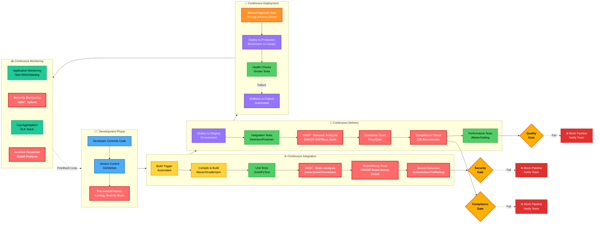
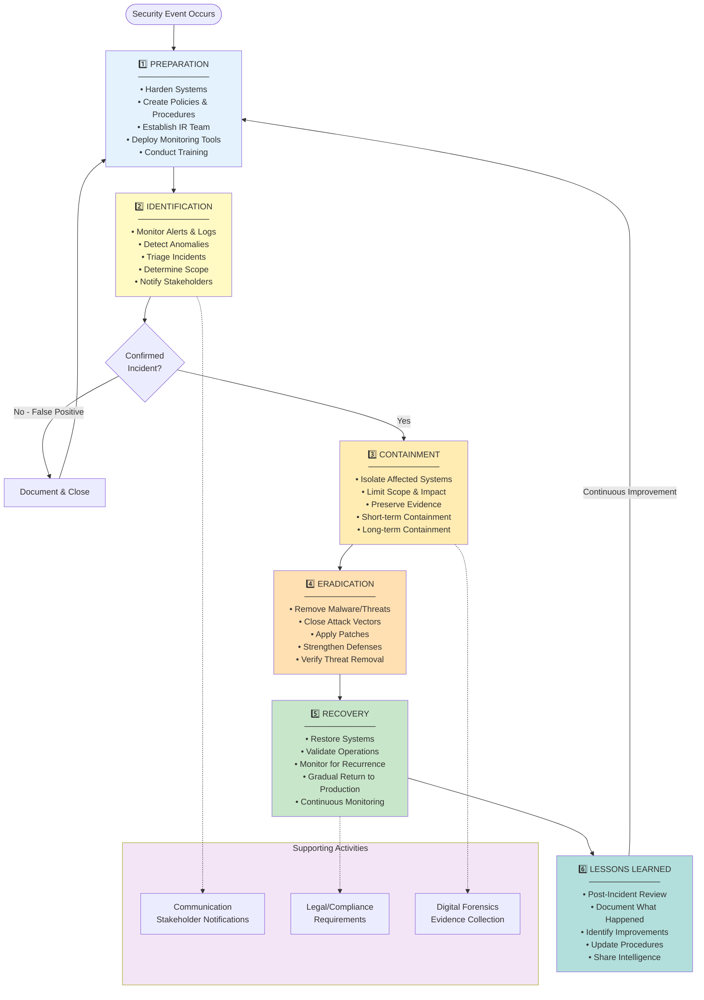
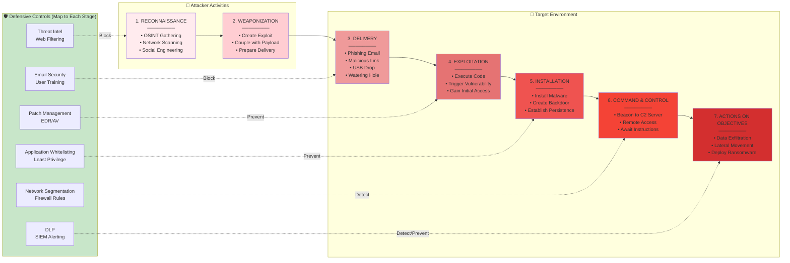
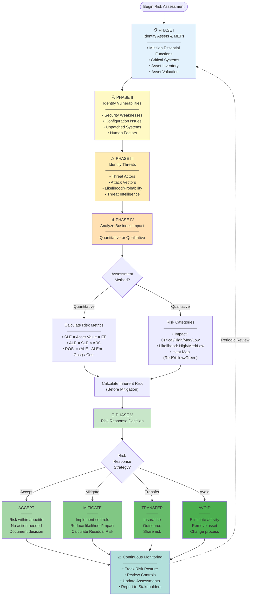

# Defense Implementation and Operations

### ENDPOINT PROTECTION DEPLOYMENT

1. Configure management system to push the agent software and updates to all desktops and workstations.
2. Assign hosts to appropriate groups for policy assignments (different endpoints have different security requirements).
3. Test the different host group configuration settings to ensure that the expected range of threats is detected.
4. Use a monitoring dashboard to verify status across all network hosts. Apart from detection events, if the agent itself is missing or disabled, there should be an alert.

---

### NEXT GENERATION ENDPOINT PROTECTION

Where **EPP** provides mostly signature-based detection and prevention, **Next Generation Endpoint Protection** with **Automated Response** is focused on logging **Endpoint Observables** and **Indicators** combined with **Behavioral and Anomaly-Based Analysis**.

#### Endpoint Detection and Response (EDR)

Malware may evade detection by automated scans. **EDR** products aim not to prevent initial execution but to:

* Provide **Real-time** and historical visibility into the compromise.
* Contain the malware to a single host.
* Facilitate remediation of the host to its original state.
* Such agents are likely to be managed from a cloud portal and use **Artificial Intelligence (AI)** and **Machine Learning** to perform **User and Entity Behavior Analysis (UEBA)**.
* **Managed Detection and Response (MDR)** is a class of hosted security services.

#### Advanced Malware Tools

Tools like **Sysinternals** are used when symptoms are identified but the **AV** scanner or **EPP** agent does not report an infection. Further analysis of the host for malware uses advanced tools. Indicators include:

* Suspicious network connections.
* Unexplained activity or behavioral analysis of **SIEM** and **IDS** logs.

---

### SANDBOXING

A technique that isolates an untrusted host, app, script, or file in a segregated environment to conduct tests.

* **Sandbox Environments** intentionally limit interfaces with external files and hosts.
* Determine malicious activity of certain files.
* Determine the effect if run outside the sandbox and what dependencies it might require.
* Sandboxes offer more than anti-malware alone because you can apply a variety of different environments to the sandbox instead of just relying on how the malware might exist in your current configuration.

---

### NEXT GENERATION FIREWALL INTEGRATION

An analytics-driven **Next-Gen Antivirus** product is likely to combine with the perimeter and local security offered by **Next-Gen Firewalls**.

* **Example:** Detecting a threat on an endpoint would automate a firewall policy to block the covert channel at the zone, isolate the endpoint, and mitigate risks of the malware spreading.

---

## Implement Secure Embedded Systems

### EMBEDDED SYSTEM FUNCTIONALITY

An embedded system is a complete system designed to perform a specific, dedicated function within a **Static Environment** (whereas a PC is a **Dynamic Environment**).

* **Static Environment:** Requires/does not allow or require frequent changes. In terms of security, this can be ideal as unchanging environments are typically easier to protect and defend.
* Functionality can be found in consumer devices and industrial devices (**IoT**).
* Constrained by **processor capability** (cores and speed), **system memory** (low), and **low persistent storage**.
* Characterized by predictable processing workloads and time-sensitive operations.

#### Hardware Architecture: PC vs. Embedded

* **PC Hardware:** **Root of Trust** in a **Trusted Platform Module (TPM)** is an **Explicit Trust Anchor**.
* **Embedded Networks:** **Root of Trust** is often implied. Based on an **Implied Trust Model**, any device added to the network is trusted by the administrator.

| Feature | Desktop PC Architecture | Embedded System Architecture |
| --- | --- | --- |
| **Components** | Generalized CPU, processors, controllers, I/O, system memory linked via **Motherboard**. | **System on Chip (SoC)** design where all components are on a **single processor DIE or microchip**. |
| **Efficiency** | High compute resource usage. | Microchip packaging is space and power efficient (e.g., **Raspberry Pi**, **Arduino**). |
| **Specialization** | General purpose. | **Application-Specific Integrated Circuits (ASICs)** or **Microcontrollers**. |

* **Microcontroller:** A processing unit capable of performing sequential operations from a dedicated instruction set determined by the vendor at the time of manufacture. Software is converted to dedicated instructions by **Assembly Language**.
* **Field Programmable Gate Array (FPGA):** A type of microcontroller with no default dedicated instruction set at the time of manufacture. The end administrator can configure the programming logic of the device to run specific applications.

---

### OPERATING SYSTEMS & CONSTRAINTS

* **Real-Time Operating Systems (RTOS):** Embedded systems use OSs that are much more stable and reliable.
* **Baseband Firmware:** Used in cellular communication.
* **Performance Requirements:** Low tolerance for reboots, crashes, or lagging.
* **Latency and Reliability:** Tend to be more important than high data rates. **RTOS** have fast response times predictable to microsecond tolerance.
* **Security:** **RTOS** have as small an attack surface as possible but are still susceptible to **CVEs** and exploits.

#### Power and Connectivity Constraints

* **Smartphones:** WiFi/5G/4G are power-hungry, requiring antennas to maximize data rates, range, and bandwidth.
* **Embedded Systems:** Rely on power-efficient data transfer of small amounts of data with high reliability and low power consumption.
* Lack of compute resources often leads to a lack of security options like **Authentication** and **Identification** tools. This prompts the development of **Lightweight Ciphers** (low key size/digest) that don't require large processing resources.

---

### COMMUNICATIONS CONSIDERATIONS

There is a need for closer integration with IT networks using standardized communication technology.

* **Operational Technology (OT) Networks:** Refers to cabled networks for industrial applications.
* Use **Serial Data** protocols or **Industrial Ethernet**.
* Optimized for real-time deterministic transfers.


* **Layer 2 Switching:** Ethernet switching performs Layer 2 switching only.
* **Cellular Networks:** Facilitate long-distance communications.
* **Baseband Radio:** Managed by a baseband processor acting as a cellular modem.
* **Narrow Band-IoT (NB-IoT):** A low-power version of 4G LTE.
* **LTE Machine Type Communication (LTE-M):** Compatible with 5G networks and does not interfere with 5G signaling. Use 5G tower relays.


* **Microwave Radio Networks:** Cellular networks are essentially microwave radio networks.

---
### LTE AND CELLULAR RADIO

LTE-based **Cellular Radio** uses a **SIM** (Subscriber Identity Module) as an identifier.

* **NB-IoT** / **LTE-M** devices use the same function.
* An **eSIM** (embedded SIM) incorporates the identifier as a chip on the System Board.
* Encryption of frames between the Cell Tower and Endpoint is the responsibility of the network operator.
* **Over-the-Air Encryption** is performed by encryption schemes defined by the cellular standard.
* **Backhaul Security** (encryption from the network backhaul to internal routers) is usually enforced by **IPsec**.
* Network and Application layer security should be used for added security.

---

### ZIGBEE AND Z-WAVE

Wireless communication protocols used in creating **Mesh Topologies** with low power/low data rate requirements.

* **Zigbee:** Based on the **IEEE 802.15.4** standard.
* **Z-Wave:** Uses low-energy radio waves.
* Both have communications encryption. The main threats are:
* **Re-pairing Attacks:** Allows a threat actor to discover the network key by forcing a device off the network, causing it to try to re-connect (similar to De-auth attacks on IP networks).
* **Rogue Devices:** Unauthorized devices connected to the network systems.


---

### INDUSTRIAL CONTROL SYSTEMS (ICS)

* Industrial processes prioritize **Availability** and **Integrity** over **Confidentiality**—reversing the **CIA Triad**.
* **ICS** provide mechanisms for workflow and process automation.
* These systems control machinery in **Critical Infrastructure**.
* **Data Transfer** occurs via **Machine-to-Machine (M2M)** communications.

#### ICS Components

* **Distributed Control System (DCS):** An **ICS** that manages process automation within a single site.
* **Programmable Logic Controllers (PLCs):** Plant devices and equipment embedded with **PLCs**.
* **Fieldbus:** A serial network used in **Operational Technology (OT)** to link **PLCs**.
* **Industrial Ethernet:** Used to link **PLCs** and connect to **Actuators** and **Smart Devices** (Valves, motors, circuit breakers, sensors).
* **Human-Machine Interface (HMI):** Used for output configurations and monitoring of a **PLC**.
* **SCADA (Supervisory Control and Data Acquisition):** Takes the place of a control server in large-scale multi-site **ICS**.
* Typically runs as software on ordinary PCs.
* Uses **WAN** communications.
* Gathers data from and manages plant devices and equipment (referred to as **Field Devices**, **Nodes**, or **Sensors**).


#### ICS Application Sectors

* **Power Generation & Energy Distribution.**
* **Industrial:** Refineries and mining.
* **Fabrication & Manufacturing/Assembling.**
* **Logistics.**
* **Facilities:** Building Management Systems (BMS), HVAC.

---

### INTERNET OF THINGS (IoT)

Describes a global network of appliances and devices equipped with sensors, software, and network connectivity.

* Each "thing" is identified with a **Unique Serial Number** or code embedded within the hardware.
* Able to inter-operate within existing infrastructure either directly or via an intermediary hub or control system.
* **IoT devices are Headless** (no local interface).
* **Sensors:** Measure temperature, humidity, light levels, pressure, motion, proximity, gas, smoke, heart/breathing rates, etc.
* Examples: Thermocouples, Thermistors, Infrared Detectors, Inductive Coils, Photoelectric Cells, Capacitive Cells, Accelerometers, Gyroscopes.

---

#### IoT Vulnerabilities

* Vulnerable to attacks because of:
* Poorly documented security factors.
* Poor patch management.
* Weak security response processes.
* **Weak Default Configuration.**
* Minimum configuration effort (ease of use over security).


---

### SPECIALIZED SYSTEMS

#### Smart Buildings

* **Building Automation Systems (BAS):** A specialized system for facility automation. Refers to the use of embedded systems or **IoT** devices for:
* **Physical Access Controls (PACS):** Electronic locking, alarms, and metal detectors.
* **HVAC Systems.**
* **Fire Suppression.**
* **Elevators and Escalators.**


* **Typical Vulnerabilities:**
* Memory vulnerabilities (e.g., **Buffer Overflow**).
* Use of plaintext crypto keys/credentials within application code.
* Code injection via UI interfaces used to configure the system.


#### Smart Meters

* Update reports of electric, gas, or water use back to the supplier.
* Reduces need for manual inspection.
* Communicates info via **IoT** protocols (**Zigbee**, **Z-Wave**) for integration with smart appliances.

#### Surveillance

* **PACS** involve a network of monitored locks, intruder alarms, and Video/Audio surveillance.
* Often installed and maintained by an external supplier, leading to it being omitted from Risk and Vulnerability assessments.
* **CCTV** vulnerabilities allow attackers to perform their own surveillance.
* **Requirement:** Evaluate the supplier to demonstrate their security monitoring and remediation support.

#### Multifunction Printers (MFPs)

* Single device capable of **Print/Scan/Fax** functions.
* Firmware must be patched and updated regularly.
* Documents are frequently recoverable from these machines (internal storage).
* Ensure proper sanitization of images, documents, and files.
* Can be used as a **Pivot Point** to attack the rest of the network.

#### Voice over IP (VoIP)

* Embedded systems used to implement **VoIP** endpoints (handsets/conferencing units) and gateways.
* **Media Gateway:** Uses separate firmware/OS stack.

#### Specialized Systems for Vehicles and Drones

* **Automobiles / Unmanned Aerial Vehicles (UAV):** Contain sophisticated electronics to control engines, power systems, braking/landing, stability, and suspension.
* **Electronic Control Unit (ECU):** Connected via **CAN bus**.
* **Controller Area Network (CAN) Bus:** A serial communication bus for **ECUs**.
* Functions similarly to Ethernet.
* **ECUs** transmit broadcast messages to all other **ECUs** on the same bus with **no concept of Message Authentication, Integrity checks, or Source Addressing.**


* **Onboard Diagnostics Module (OBD-II):** A principal external interface and an **ECU**.
* **Vulnerabilities:**
* Breaching physical security.
* Remote access of **CAN bus** via cellular features or navigation/entertainment systems.
* Onboard WiFi broadens the attack surface.


#### Medical Devices

* An array of systems (e.g., infusion pumps, monitors) potentially vulnerable to:
* Use of unsecure communication protocols.
* Use of unsupported versions of **OS**.
* High availability costs (updating software is disruptive to patient services).


* **Goals of Attacks:**
1. Hold units for **Ransom** by threatening service disruption.
2. Kill or injure patients by tampering with device settings.
3. Use compromised devices to pivot to networks and steal **Protected Health Information (PHI)**.


---

### SECURITY FOR EMBEDDED SYSTEMS

1. **Network Segmentation:** Network access for **IoT** environments should only be required to apply firmware updates.
2. **Wrappers:** Use of wrappers like **IPsec** for protecting traffic between trusted and untrusted networks.
3. **Programming Security:** Logic in **FPGA** must have no **backdoors**.

---

## Unified Endpoint Management (UEM) / Enterprise Mobility Management (EMM)

Describes the way employees are provided with management software designed to apply security policies to mobile devices and applications.

* **Bring Your Own Device (BYOD):**
* Mobile device is owned by the employee.
* **Visibility:** The challenge of identifying and managing devices used for corporate apps in the enterprise.
* Mobile device must meet profile and requirements.
* Installation of corporate apps.
* Some level of oversight and auditing.
* **Management:** Two main functions: Mobile Device Management (MDM) and Mobile Application Management (MAM).
* **MDM:** Sets device policies for authentication and connectivity. MDM can also allow device resets and remote wipes.
* **MAM:** Sets policies for apps that can process corporate data; prevents data transfer to personal apps on same device.
* Poses the most difficulty for security framework managers.


* **Choose Your Own Device (CYOD):** Similar to COPE.
* Employees are given a choice of device from a list such as configured by Enterprise Managers/Container.


* **Corporate Owned, Business Only (COBO):**
* Device is the property of the company/organization.
* May only be used for company business workflow.


* **Corporate Owned, Personally-Enabled (COPE):**
* Device remains the property of the company.
* Subject to Acceptable Use Policies (AUP); personal web browsing.
* Employees may use it to access personal email and social media.
* Management software logs the use of a device.


* **Virtualization / Virtual Desktop Infrastructure (VDI):**
* VDI as a means of provisioning an OS desktop to interchangeable hardware.
* The hardware must be capable of running a VDI client viewer or have browser support for a clientless HTML5 solution. Can be accessed via a mobile device/smartphone.
* Mitigates security concerns about BYOD as corporate data and apps are segmented from the other apps on the device.
* VDI allows client device to access a VM.
* Corporate data is stored and processed on the VDI; less chance of compromise.


---

## Workspace

Visibility across PC, laptop, smartphone, and tablet. Core functionality of UEM/EMM acts similarly to the concept of Network Access Control (NAC) solutions.
Examples: Air-watch.com, Microsoft Intune, Symantec/Broadcom, Citrix Endpoint Management.

* Management software identifies a device on the network, determining whether to allow it to connect or not, based on administrator-set parameters.

---

## iOS in the Enterprise (Apple's iOS)

* Third-party developers create apps using Apple's Software Development Kit (SDK) available only on macOS.
* Use an EMM suite and its developer tools to create a "wrapper" for corporate-internal iOS devices.
* Distribution of corporate signed apps is facilitated by participating in the **Device Enrollment Program**, the **Volume Purchase Program**, and the **Developer Enterprise Program**.
* Most iOS attacks are the same as with any system.
* Difficult for malware infection as all code is updated from Apple's servers only.
* Users would need to update iOS/apps to a version that mitigates any exploits of the previous versions.

---

## Android in the Enterprise

* Open source means there is more scope for vendor-specific versions. Apps available from Google Play Store.
* Facilitates use of EMM suites and the containerization of corporate workspaces. SDK is available for Windows, macOS, and Linux.
* Android is less consistent than Apple in updates. Often depends on handset vendor to complete new version or issue the patch for their flavor of Android before it can be applied.
* Android malware occurs.
* Google implemented a server-side malware scanning product (**Play Protect**) that will warn both work and personal profiles of any security issues that have been discovered.
* Difficult for would-be hackers and spammers to get apps in any of the major app repositories.
* Warns users if an app is potentially damaging and scans apps that have already been purchased and installed.
* Samsung Knox facilitates extra control over device function to run apps in sandboxes before installation.
* Based on Security-Enhanced Linux (SELinux); uses Mandatory Access Control (MAC) policies.

---

## Smartphone Authentication

Access control implemented by configuring screen lock.

* Can only be bypassed using correct PIN, password, swipe pattern, matching biometrics (face ID / fingerprint).
* Vulnerable to user's poor choices, plus tendency for the grease trail to facilitate a **Smudge Attack**.
* Screen lock can be configured with a lockout policy.
* Incorrect entries lock device for a set period.
* Lockout policy can be configured to escalate set periods and deters attempts to guess the passcode.

### Context-Aware Authentication (Newer Auth Models)

* Disable screen locks when device detects that it is in a trusted location (e.g., Home IP).
* Applies more stringent access control to prevent misuse.
* Checks whether the device network connection can be trusted (not open Wi-Fi hotspot, for instance).

---

## Remote Wipe / Kill Switch

* Compromised/stolen devices can be remotely reset to factory defaults or cleared of any personal data (sanitization).
* Triggered by several incorrect passcode attempts.
* Utilities may also wipe any plug-in memory cards.
* Features include backing up data from the phone to a server first and displaying a "LOST/STOLEN PHONE - Return to XX" message.
* Thieves can prevent a remote wipe by ensuring the phone cannot connect to the network, then hacking and disabling the security.

---

## Location Services

* **Geolocation:** The use of network attributes to identify (or estimate) the physical position of a device. Device uses location services to determine its current position.
* **Global Positioning System (GPS):** A means of determining the device's longitude and latitude based on information received from satellites via a GPS sensor chip.
* **Indoor Positioning System (IPS):** Works out a device's location by triangulating its proximity to other radio sources, like cell towers, Wi-Fi APs, and Bluetooth/RFID beacons.
* Location services are available to any app where the user has granted permission.
* **Privacy:** Primary concern surrounding location services. Provides a mechanism to track an individual's movements, their social and business activities.
* **Geofencing:** The practice of creating a virtual boundary based on real-world geography. An organization may use geofencing to create a perimeter around its office property to subsequently impact the functionality of devices exceeding the bound. Useful for auditing the use of camera/video functions or applying context-aware authentication.
* **GPS Tagging (Geotagging):** The process of adding geographical metadata (lat/long) where the device is located at the time of initial storage/transfer to media (photos, videos, SMS messages), allowing apps to place the media at specific coordinates. Highly sensitive personal information/potentially confidential organizational data. Uploading to social media could be used to track movements.

---

## Full Device Encryption & External Media

* Mobile OS for smartphones/tablets provide full device encryption.
* All user data on the device is always encrypted, but the key is stored on the device, primarily used to wipe the device. OS just needs to delete the key; data becomes inaccessible rather than wiping each storage location.
* Email data and any apps using "Data Protection" options are subject to a second round of encryption using a key derived from a PIN protected by the user's credential.
* "Data Protection" is enabled automatically when you configure a password lock on the device.
* **Android:** No full disk encryption as it is considered too detrimental to performance. User data is encrypted at the file level by default.
* Mobile devices contain a Solid State Drive (SSD) / flash memory for persistent storage. Android handsets may support removable media.
* **MicroSD Hardware Security Module (HSM):** A small form factor used to store cryptographic keys securely, allowing the material to be used with different devices.

---

## Application Management

Enrolling devices into corporate network via management software (EMM/UEM).

* Can be further configured into an **Enterprise Workspace**.
* **Workspace Mode:** Only a certain number of authorized applications can run (Allow List/Block List).
* **Trusted App Source:** Managed by service provider (authenticates and authorizes valid developers). Service provider may analyze code and apply policies. Issuing a certificate to sign apps (proving integrity).
* **Private App Distribution:** For custom corporate apps. Apple uses Enterprise Developer programs via Apple Business Manager. Google Play Store has a private channel called Managed Google Play. Both allow EMM to push apps from private channel directly.
* **Sideloading:** Android allows selection of different stores and installation of untrusted apps from third parties via APK files. iOS typically blocks this unless jailbroken.

---

## Mobile Application Management (MAM)

* **Containerization:** Allows the employee or organization to manage and maintain the portion of the device that interfaces with the corporate network.
* The container isolates corporate apps from the rest of the device. Requires additional authentication to access the workspace.
* **Storage Segmentation:** The container is associated with a directory on the persistent storage that is not readable/writable by apps outside the container.
* App network access might be restricted to a VPN tunneled through the organization's security system.
* Assists **Content Management** and **Data Loss Prevention (DLP)** solutions.
* **Remote Enterprise Wipe (Selective Wipe):** In BYOD/COPE, containerization allows clearing corporate account credentials and data without affecting user personal data/settings.

---

## Jailbreaking / Rooting

* **Jailbreaking:** Associated with iOS devices.
* **Rooting:** Associated with Android devices.
* Both mean users could subvert the access controls to override settings or change the software.
* Users want to avoid restrictions put on by vendors, OEMs, or carriers.
* Requires **Privilege Escalation** to enable root access (used to install custom OS or non-kernel apps).
* **Rooting:** Often involves exploiting a vulnerability or using custom firmware for flashing a Custom ROM to the Read-Only Memory (ROM) chips.
* **Jailbreaking:** Accomplished by booting a device with a patched kernel (can be "tethered" to a computer).
* **Carrier Unlocking:** Removing restrictions that lock a device to a single carrier network.
* **Side Effects:** Leaves many security measures permanently disabled. If a user has root permissions, the UEM/EMM agent is likely compromised. UEM/EMM has routines to detect rooted/jailbroken/custom firmware. If detected, the device is assumed an **Untrusted OS**.

---

## Implement Secure Mobile Device Connections

UEM/EMM suites set device policies for authentication and authorization.

### Cellular & GPS Connection Methods

* Use of cell phone network for call and internet data access.
* Less likely to be subject to monitoring and filtering; relatively secure. Attacks require high degree of sophistication.
* **GPS Jamming/Spoofing:** GPS signals can be jammed or spoofed using special radio equipment, which might be used to defeat geofencing.
* **Assisted GPS (A-GPS):** Uses cellular data and signals from cell towers to triangulate position and adjust for device position relative to the tower.

### Bluetooth Connection Methods

* Popular for Personal Area Networks (PAN).
* **Device Discovery:** Easily discoverable devices will connect to any other Bluetooth devices nearby. Should be disabled when not in use.
* **Authentication & Authorization:** Devices pair using a passkey. Never use default passkeys. Regularly check paired devices.
* **Malware:** Proof-of-concept Bluetooth worms.
* **Bluejacking:** Sending unsolicited messages (text/picture/audio) to a device via Bluetooth.
* **Bluesnarfing:** Exploit used to steal information from someone else’s phone. Circumvents authentication.
* **Vulnerability:** A short PIN code is vulnerable to brute force guessing. Peripheral devices with malicious firmware can launch effective attacks.

### Wi-Fi & Tethering Connection Methods

* **Risks:** Connecting to open access points or rogue access points.
* **Ad Hoc Wi-Fi Network:** Wireless stations establishing peer-to-peer connections. In terms of corporate security, these should be disabled as attackers might obtain a bridged connection to the corporate network.
* **Wi-Fi Direct:** Allows 1-to-1 connection where one device functions as a soft AP. Android supports this.
* **Tethering / Hotspots:** Sharing a mobile data connection.
* **Hotspot:** Connection shared over Wi-Fi with multiple devices.
* **Tethering:** Connection shared by connecting via USB cable or Bluetooth to a single PC.


---

## Firmware and Radio Updates

* **Radio Firmware:** Separate from the end-user OS (Android/iOS). It contains the OS for the radio modem/sensor used for cellular, Wi-Fi, Bluetooth, NFC, and GPS.
* Uses its own baseband processor and memory; boots a **Real-Time Operating System (RTOS)**.
* **Over-the-Air (OTA):** Baseband updates delivered wirelessly.
* A jailbroken/rooted handset might be configured to prevent baseband updates or apply specific firmware versions manually.

---

## Infrared (IR) Signaling

* **IR Blaster:** Allows a device to interact with an IR receiver (e.g., HVAC/TV).
* **IR Sensor:** Used as proximity sensors or to measure health info via internal organ levels.

---

## Radio Frequency (RF) / RFID Signaling

* **Near Field Communication (NFC):** Used for contactless Point-of-Sale (POS) transactions (e.g., Apple/Google/Samsung Pay). A transaction is known as a "Bump."
* **Vulnerabilities:** NFC does not provide encryption. Eavesdropping is possible if an adversary can intercept the communication.
* **NFC/RFID Skimming:** Using a rogue reader to read signals from a contactless bank card.
* **Attacks:** Crafting tags to direct victim devices to malicious web pages. Flooding the area with RF signals to disrupt data transfer (similar to DoS).

---

## USB Connection Methods

* **USB On-The-Go (OTG):** Allows a port to function as a host or as a device.
* **Risks:** Media connected to the smartphone could host malware. A charging plug could act as a Trojan. Modern versions of Android/iOS require authentication before accepting the connection.

---

## SMS / MMS / RCS & Push Notification

* **SMS/MMS:** Operated by cellular network providers. Vulnerable due to the **SS7 Signaling Protocol**, which casts doubt on the security of 2-step verification.
* **Rich Communication Services (RCS):** Platform-independent advanced messaging. Support for video calling and larger attachments. Supported by carriers using the "Universal Profile." No end-to-end encryption support is patchy; has resulted in DoS attacks.
* **Push Notifications:** Services that an app/website can use to display an alert. Developers must secure the admin account and servers used to send these.

---
## Implement Secure Application Concepts

### Automation and Scripting

Automation strategies for resiliency, disaster recovery, incident response, and development are at the heart of secure network administration and operations.

* **DevOps:** Scripting and programming are core to secure network operations.
* **Arbitrary Code Execution & Privilege Escalation:** Attacks against desktop and server applications allow threat actors to run arbitrary code on trusted hosts to gain a foothold on the network or facilitate lateral movement.
* **Monitoring:** You must be able to identify indicators of such attacks from host monitoring and logging systems.

---

### Application Attacks

Targets vulnerabilities in operating system or application software.

* **Application Vulnerability:** A design flaw that causes application security to be circumvented or causes the app to crash.
* **Arbitrary Code Execution:** A vulnerability that allows an attacker to run their own code or module that exploits such a vulnerability.
* **Remote Code Execution (RCE):** Where code is transmitted from one host to another for execution. Typically designed to install a backdoor or to disable the system and its services.

---

### Error and Input Handling

* **Error Handling:** Application attacks may cause an error message. Applications should not reveal configuration or platform details that could aid an attacker. Proper error handling is the responsibility of the application development team.
* **Improper Input Handling:** Good programming practice dictates that input should be tested and sanitized with proper scripting to ensure it is valid (i.e., the data can be parsed by the receiving process).
* **Mitigation:** Ensure invalid inputs or maliciously constructed data are not passed to the vulnerable process.

---

### Privilege Escalation

A software process must have privileges to read/write data and execute functions. A process may run using a system account, a logged-on user account, or a nominated administrator account.

* **The Exploit:** If a software exploit works, the attacker may be able to execute arbitrary code with the same privilege level of the exploited process.
* **Vertical Privilege Escalation (Elevation):** Gaining higher-level permissions (e.g., user to admin).
* **Horizontal Privilege Escalation (Lateral Movement):** Gaining permissions of another user at the same level.
* **Detection:** Audit logs provide evidence of attempts. Detected by Incident Response and Endpoint Protection agents (alerts).

---

### Overflow Vulnerabilities

An overflow attack works against the way a process performs memory management. The threat actor submits input that is too large to be stored in a variable assigned by the application code/script.

* **Buffer Overflow:** Attacker passes data that deliberately overfills the buffer (memory area for expected data).
* **Stack Overflow:** A stack is an area of memory used by program subroutines. It includes a **Return Address** (the location of the program that called the subroutine). An attacker can use a buffer overflow to change the Return Address, allowing them to run arbitrary code.
* **Integer Overflow:** Integers have fixed lower and upper bounds. An integer overflow attack causes the software to calculate a value that exceeds these bounds. This may cause a positive number to become negative.
* **Example:** Used where software calculates buffer size; if the attacker makes the buffer smaller than it should be, they may launch a buffer overflow attack.


* **Detection:** Ideally identified by Network IDS or Endpoint Protection agents. Unsuccessful attempts may be revealed through unexplained crashes or error messages.

---

### Pointers and Race Conditions

* **Pointer:** A variable that stores a memory address location rather than a value.
* **Dereferencing:** Attempting to read/write the memory address pointed to by the pointer.
* **Null Pointer Dereference:** If the memory location is null or invalid, it creates an exception and the process will crash. It might also allow a threat actor to run arbitrary code. Developers must use logic statements to test that a pointer is not null before use.
* **Race Condition:** A vulnerability where the outcome is dependent on the order and timing of certain events. If events fail to execute in the intended order, it can be exploited (e.g., Dirty COW in Linux Kernel).
* **Exploitation:** A race condition can be used to engineer a Null Pointer Dereference.


1. Identify a program using pointers (C/C++).
2. Manipulate the order/timing of critical events.
3. Trigger the program to attempt to dereference a Null pointer.


* **Time of Check to Time of Use (TOCTTOU):** A race condition directed at databases or file systems. Occurs when a change happens between when an app checks a resource and when it uses it, invalidating the check.

---

### Memory Leaks and Resource Exhaustion

* **Memory Leak:** Occurs if a program fails to release/deallocate memory no longer in use. This memory becomes inaccessible ("leaking" from the available pool).
* **Resource Exhaustion:** As memory leaks, less is available to other processes. The system may crash, slow down, or become unresponsive.
* **Malicious Use:** A process might strategically consume resources (CPU time, memory, disk capacity, network bandwidth) to cause a DoS or set up conditions for privilege escalation.

---

### DLL Injection and Shims

* **Dynamic Link Library (DLL):** A binary package that implements OS/Kernel standard functionality.
* **DLL Injection:** A vulnerability where one process is forced to load a malicious DLL. Processes compromised this way might open unexpected network communications or interact with files maliciously.
* **Refactoring:** Malware must evade detection by refactoring (changing the code so it performs the same function using different methods) so Antivirus (A-V) cannot identify it by signature.
* **Shim:** Code developed to sit between an application and the OS to enable functionality that would otherwise be unavailable (e.g., Application Compatibility Framework for legacy apps).
* **Malware Shims:** Attackers abuse the shim database (Shim DB) by adding malicious shims to the registry to gain persistence across reboots.

---

### Pass the Hash (PtH) Attack

* **Lateral Movement:** Attackers can extend movement if they compromise host credentials.
* **Mechanism:** PtH is the process of harvesting account credentials when a user is logged into a Single Sign-On (SSO) system.
* **Execution:** If an actor obtains the hash of a user's password, they present that hash to authenticate to network protocols (like SMB/Active Directory) that accept NTLM hashes. Access is not limited to a single host; the hash can be used on any computer in the domain.
* **SAM Database:** Windows Registry database that stores local account credentials (User:Password Hash).
* **Detection:** Difficult as it exploits legitimate behavior. Systems must correlate security log events, but this is prone to false positives.

---

### Web Application Attacks

Web apps expose many interfaces to public networks, making them common targets.

#### API Attacks (Application Programming Interface)

* Web apps and cloud services implement APIs for consumer access and automation.
* **Insecure APIs:** Present a vector to compromise services and data.
* **Vulnerabilities:**
* API calls over plain HTTP (must use HTTPS).
* Lack of Input Validation (unsanitized input).
* Ineffectual Secrets Management (leaked API keys).
* DoS attacks via bombarding APIs (mitigate with throttling/rate limiting).
* Error messages revealing clues to an adversary.


#### URL Analysis and Percent Encoding

* **URL:** Contains the host location and can include actions/data (query strings).
* **HTTP Methods:** Requests comprise a Method (GET, POST, PUT, HEAD, DELETE), a Resource (URL path), version, headers, and body.
* **Query Parameters:** Formatted as `name=value` pairs, delimited by `?` and separated by `&`.
* **Percent Encoding:** Allows submitting reserved (e.g., `?`, `#`, `[ ]`, `&`) or unsafe characters (e.g., null string, carriage return) in a URL.
* **Abuse:** Percent encoding is misused to obfuscate malicious scripts or bypass input filters.


---

### Replay and Session Attacks

* **Replay Attack:** Works by guessing or sniffing a session token (cookie) and resubmitting it to re-establish a session.
* **Session Hijacking:** Sniffing network traffic to obtain session cookies (common on unsecured/public Wi-Fi).
* **Countermeasures:**
* Encrypt cookies during transmission.
* Delete cookies from client cache when session terminates.
* Deliver a new cookie with each session.
* Use non-predictable algorithms for session tokens.


* **Cookies:** Can be **Non-persistent (Session)** (deleted when browser closes) or **Persistent** (stored in local cache until expiration).

---

### Request Forgery and UI Redress

* **Cross-Site Request Forgery (CSRF/XSRF):** Forces an authenticated user to execute unwanted actions on a web app. It targets state-changing requests (changing passwords, initiating transfers).
* **Confused Deputy:** The target site assumes the browser is authorized because of a valid session cookie and accepts malicious input as genuine.


* **Clickjacking (UI Redress):** An adversary uses transparent or opaque layers to trick a user into clicking a button/link on another page while they think they are clicking the top-level page.
* **Defending against Clickjacking:**
* Set auth cookies with `SameSite=Strict`.
* Use HTTP Response Headers like **Content Security Policy (CSP)** or `X-Frame-Options` to prevent the site from being opened in a frame.


---

### SSL Strip

* Requires a Man-in-the-Middle (MITM) via ARP poisoning.
* **Mechanism:** When a client requests an HTTPS site, the attacker's proxy serves an unencrypted HTTP version instead. The attacker snoops the connection to capture plain-text credentials.
* **Mitigation:** **HSTS (HTTP Strict Transport Security)**, which instructs the browser to never request a site via HTTP.

---
## XSS: Cross-Site Scripting

Websites depend on scripting to deliver dynamic pages. XSS exploits a browser's likelihood to trust scripts that appear to come from a site the user has chosen to visit. Malicious scripts are injected into benign, trusted sites. XSS inserts a malicious script that appears to be part of the trusted site.

### XSS Vulnerabilities

A flaw that allows these attacks to succeed occurs anywhere a web app uses input from a user within the output it generates without validating or encoding it.

* **Malicious scripts can access:** Session tokens, sensitive info, and cookies retained by the browser.
* **Capabilities:** Rewrite the content of an HTML page, perform request forgery attacks, or install malware. The code runs in the client browser with the same permissions as the trusted site.

### Types of XSS

* **Reflected / Non-Persistent XSS:** Comes from a crafted link (link).
* **Stored / Persistent XSS:** Inserts code into the back-end database or content management system used by the trusted site.
* **DOM Based XSS:** Modifies the content and layout of a webpage.

> [!NOTE]
> Session Replay, CSRF, and XSS (Reflected and DOM) are **client-side** attacks; they execute arbitrary code on the browser client agent. A **server-side** attack causes the backend server to run a script or respond to a query in a way not authorized by the application server design.

---

## Injection Attacks

Injection attacks exploit some unsecure way in which an app processes requests and queries.

### 1. Structured Query Language (SQL) Injection

Main DB operations performed by SQL statements include `SELECT`, `INSERT`, `DELETE`, and `UPDATE`.

* **Mechanism:** An adversary modifies one or more of these basic functions by adding code to input accepted by the app, causing it to execute their own commands or parameters.
* **Aims:** Information exfiltration, arbitrary code execution on the remote system using the same privileges as the Database Administrator (DBA).
* **Impact:** Compromise of authentication and authorization; loss of confidentiality and integrity.

### 2. Lightweight Directory Access Protocol (LDAP) Injection

LDAP uses queries to read and write to a network directory database.

* **Mechanism:** An attack used to exploit web-based apps that construct LDAP statements based on user input. An app that fails to properly sanitize user input is vulnerable to LDAP injection attacks.
* **Impact:** Execution of arbitrary commands, granting permissions to unauthorized queries, and content modification inside the LDAP tree structure.
* **Syntax:** LDAP filters are constructed from `(name=value)` attribute pairs delimited by parentheses and logical operators (`&` for AND, `|` for OR). Unsanitized input can bypass access controls.

### 3. Extensible Markup Language (XML) Injection

XML is used by apps for authentication, authorization, data exchange, and uploading.

* **Mechanism:** Data submitted via XML with no encryption and input validation is vulnerable to spoofing, request forgery, and arbitrary code injection.
* **XML External Entity (XXE) Attack:** Embeds an input request for a local resource. Improper restriction of XML external entity references leads to the software processing an XML document that contains XML entities (storage units) resolving to documents outside of the intended sphere of control.
* **Vulnerability:** Occurs when XML input containing a reference to an external entity is processed by a weakly configured parser.

---

## Directory Traversal and Command Injection

### Directory Traversal

An injection attack performed against a web server. The attacker submits a request for a file outside the web server's root directory by submitting a path to navigate to the parent directory (`../`).

* **Success Conditions:** Input is not filtered/validated properly and access permissions on the file are the same as those on the web server.
* **Canonicalization:** Threat actors exploit vulnerabilities in the canonicalization process (the way the server converts different representation methods of a resource into the simplest method used by the server).
* **Evasion:** Attackers submit URL-encoded versions of characters (e.g., `../` becomes `%2e%2e%2f`).

### Command Injection Attack

Attempts to cause the server to run OS shell commands and return the output to the browser.

* **Constraints:** The web server should prevent commands from operating outside of the server's root directory and prevent commands from running at a higher privilege level than the web "guest" user.

---

## Server-Side Request Forgery (SSRF)

SSRF causes a server application to process an arbitrary request that targets another service on behalf of the attacker, either on the same host or a different one.

* **Exploitation:** Exploits a lack of authentication on internal servers and services (implicit trust) and weak input validation.
* **Mechanisms:**
* Targets specific parsing mechanisms in standard libraries (Apache, IIS).
* Uses XML injection to exploit parsing weaknesses.
* Uses HTTP request splitting via CRLF injection to trick servers into performing multiple requests.


* **Target:** Often targets cloud infrastructure where the web server is the public-facing component of a multi-layer processing chain (middleware, DB).
* **Privilege:** Unlike CSRF (which uses client privileges), an SSRF exploit manipulated request is made with the **server's privilege level**.

### SSRF Potential Exploits:

1. **Recon / Port Scan Internal Network:** Metadata in internal responses may describe the type and configuration of internal servers.
2. **Credential Harvesting:** Responses may contain secret API keys used by internal servers.
3. **Unauthorized Requests:** Might change data or access a service in an unauthorized way.
4. **Protocol Smuggling:** SSRF might leapfrog from HTTP to another protocol.

---

## Secure Coding Practices

### 1. Input Validation

A primary vector for attacking applications is to exploit faulty/poorly coded input validation.

* **Mitigation:** All input methods should be documented to reduce the attack surface. Use routines to reject input that does not conform.
* **Normalization:** A routine that applies a common, consistent format to input data (e.g., stripping illegal characters) so it can be processed safely.

### 2. Output Encoding

Coding methods to sanitize output created from user input. Strings are re-encoded safely for the context being used (HTML, JavaScript, PHP, SQL, etc.). This ensures characters that would facilitate script injection (XSS) are rendered safe.

### 3. Error Handling

Programs must be able to handle errors and exceptions gracefully.

* **Error:** A condition the process cannot recover from (e.g., out of memory).
* **Exception:** A type of error that can be handled by a block of code without crashing.
* **Structured Exception Handler (SEH):** A mechanism to account for unexpected error conditions.
* **Goal:** The app must not fail in a way that allows the attacker to execute code or perform injection.
* **Custom Error Handlers:** Prevents the display of platform info and inner code workings that reveal clues to an attacker.

### 4. Memory Management

* **Arbitrary Code Execution:** May depend on the target app displaying an error when something goes wrong.
* **Vulnerabilities:** Ensure checks for processing untrusted input (like strings) to ensure they cannot overwrite areas of memory.

### 5. Obfuscation and Camouflage

* **Obfuscator:** Software that randomizes variable names, constants, and functions, and removes comments and white space. This makes compiled code physically and mentally difficult to read and analyze, mitigating against reverse engineering.

### 6. Data Exposure

Any fault that allows privileged information (tokens, passwords, API secrets, personal data) to be read without appropriate access control.

* **Requirement:** Apps must only transmit data between authenticated hosts using cryptography to protect the session.
* **Cryptographic Practice:** Use contemporary, strong encryption algorithms rather than creating custom ones.

---

## Server-Side vs. Client-Side Validation

* **Client-Side:** Validation performed locally on the user's browser.
* **Issue:** Vulnerable to malware interfering with the validation process. Relying on client-side validation only is poor programming practice.


* **Server-Side:** Validation performed remotely on the server.
* **Issue:** Can be time-consuming due to multiple transactions between server and client.


---

## Secure Code Usage

1. **Code Reuse / "Copy/Paste" Approach:** Risks overlooking vulnerabilities specific to the new program context.
2. **Third-Party Library:** Binary packages (DLLs) implementing standard functionality. Must be monitored for vulnerabilities and patched promptly.
3. **Software Development Kit (SDK):** Resources provided by vendors to assist with developer projects. Includes sample code and pre-built functions.
4. **Stored Procedures:** Pre-compiled sets of statements/functions used to validate input. In a DB, they execute custom queries safely. Procedures not required should be disabled to prevent misuse.
5. **Unreachable Code:** Source code that can never be executed because the conditions to call it can never be met.
6. **Dead Code:** Code that is executed but has no effect on program flow (e.g., a calculation where the result is never used).
* **Note:** Presence of dead/unreachable code indicates weak maintenance and may have been introduced by carelessly reused code.


---

## Web Application Security Options

Special attention must be paid to secure cookies and HTTP response header security.

### Secure Cookies

Cookies can be a vector for session hijacking. Key parameters include:

1. **Avoid Persistent Cookies:** Use new cookies when a user re-authenticates.
2. **Secure Attribute:** Prevents a cookie from being sent over an unencrypted HTTP channel.
3. **HttpOnly Attribute:** Makes the cookie inaccessible to DOM/client-side scripting.
4. **SameSite Attribute:** Controls from where cookies may be sent, mitigating CSRF.

### Response Headers

Security options based on the response header returned by a server:

1. **HSTS (HTTP Strict Transport Security):** Mitigates downgrade attacks (SSL stripping).
2. **CSP (Content Security Policy):** Mitigates XSS.
3. **X-Frame-Options & X-XSS-Protection:** Provide mitigation for older browser versions.
4. **Cache-Control:** Determines if the browser can cache responses, preventing caching of sensitive data.

---

## Code Analysis Techniques

### Static Code Analysis (Source Code Analysis)

Performed against the source code before it is packaged as an executable.

* **Tools:** Scan code for signatures of known issues (e.g., OWASP Top 10) and provide generic remediation advice.
* **Manual Code Review:** Human analysis by developer peers to identify oversights or mistaken assumptions.
* **Limitation:** Static review will not reveal vulnerabilities that exist in the runtime environment (e.g., race conditions).

### Dynamic Code Analysis

Testing the application under real-world conditions while it is running.

* **Fuzzing:** A means of testing an application by providing large amounts of deliberately malformed/random input and recording the responses.
* **Types of Fuzzers:**
* **Protocol:** Transmits manipulated packets to the app.
* **Application UI:** Identifies input streams (boxes, command line switches).
* **File Format:** Attempts to open manipulated files.


* **Generation:** "Dumb" (semi-random) vs. "Smart" (crafted based on known exploits/escaped characters).


* **Stress Testing:** Form of testing to reveal the robustness of an app under extreme performance scenarios.

### Analysis Tools

* **Disassemblers:** Reverse compiled machine code (Bytecode) back to human-readable assembly language.
* **Debuggers:** Facilitate program execution stop-by-stop using **breakpoints** (pauses) to view changes in memory/variables.

---

## Execution Control

* **Linux:** Enforced using Mandatory Access Control (MAC) kernel modules via the Linux Security Module (LSM) framework (e.g., SELinux, AppArmor).
* **Windows:**
* **Execution Policy:** Can inhibit PowerShell scripts but is not a true access control mechanism as it can be easily bypassed.
* **WDAC (Windows Defender Application Control):** A robust mechanism for restricting potentially dangerous or malicious scripts.


---
## Implement Secure Scripting Environment

Scripts can be used to return critical security assessments and data analysis to configure hosts. It is important to ensure that only validated code can be executed by identifying malicious code in scripts and macros.

### Automation and Scripting

Automation means that each configuration or build task is performed by a block of code. A script will use the following standard elements:

* **Standard Arguments:** Parameters passed to the script as data.
* **Branching and Looping:** Statements that can alter the flow of execution based on logic conditions.
* **Validation and Error Handlers:** Routines to check inputs and ensure robust execution and secure exception handling.
* **Unit Tests:** Used to ensure the script returns expected outputs given expected inputs.

Scripting makes use of domain-specific languages (SQL, XML, Regex) and orchestration tools. **Orchestration** manages multiple automation scripts and configuration data to provision a service.

---

## Scripting Languages

Standard syntax constrains the way sections of code are laid out in blocks, including branching and looping constructions.

* **Python:** An interpreted language executed within the context of a binary Python process.
* In Windows, a script (`.py`) can be called via `python.exe` (with command window) or `pythonw.exe` (without command window).
* Python scripts can be compiled to standalone Windows executables using the `.py2exe` extension; these should be digitally signed for integrity.


* **PowerShell:** The preferred method for Windows administration tasks (`.ps1`). It has become a primary toolkit for Windows attackers. Commands can be executed at a prompt or run as a script on any PowerShell-enabled host.
* **Bash, GoLang, Ruby, Java:** Other common languages used for automation and administration.

---

## Execution Control

The process of determining what additional software or scripts may be installed on a client or server host beyond its baseline to prevent the use of unauthorized software.

* **Allow Lists (Whitelists):** A highly restrictive policy where only authorized processes and scripts are allowed to run. This inevitably hampers users and increases support time but is more secure.
* **Block Lists (Blacklists):** A permissive policy that only prevents the execution of listed processes. It is vulnerable to new software or scripts not previously identified as malicious.
* **Code Signing:** The principal means of proving authenticity and integrity. The developer creates an OS hash of the file and signs it using a private key (from a public-private pair). The destination computer uses the public key (from a trusted CA certificate) to decrypt the signature and verify the hash.

### OS-Based Execution Control

* **Software Restriction Policies (SRP):** Available in Windows versions. Configured as Group Policy Objects (GPOs) to path-list file system locations from which executables can launch.
* **AppLocker:** Improves control options over SRP. Applied to user/group accounts rather than just the PC.
* **Windows Defender Application Control (WDAC):** Used to create Code Integrity (CI) policies. Based on version-aware and publisher digital signatures or image hashes.
* **Linux Execution Control:** Normally enforced using Mandatory Access Control (MAC) kernel modules via the Linux Security Module (LSM) framework (e.g., SELinux or AppArmor).

---

## Malicious Code Indicators

Indicators of malicious code execution may be caught by endpoint protection software or discovered after the fact in OS logs.

* **Credential Dumping:** Malware may try to access the SAM database on a local workstation or sniff credentials held in memory by the `lsass.exe` system process.
* **Persistence:** Allows an adversary a backdoor that survives restarts or log-offs.
* Methods: **Autorun** keys in the Registry, adding **Scheduled Tasks/Cron Jobs**, or using WMI (Windows Management Instrumentation) events.


* **Lateral Movement / Insider Attack:** Using a compromised foothold to execute processes remotely on other connected hosts. Tools like `psexec` (Sysinternals) or PowerShell are common.

### Indicators of Malicious PowerShell Execution

Numerous frameworks leverage PowerShell, such as PowerShell Empire, PowerSploit, Metasploit, and Mimikatz.

* **Suspicious Cmdlets:** `Invoke-Expression` (IEX), `Start-Process`, `New-Object` (to inject methods), `New-Service`, or `Create-Thread`.
* **Arguments:** Combined use of `DownloadString` or `DownloadFile`.
* **Obfuscation:** Bypassing execution policy, using `-NoProfile`, or calling code as a Base64 encoded string.
* **System Calls:** Direct calls to the Windows API to perform process hollowing (taking over a legitimate process).

---

## Mitigating Script-Based Attacks

Distinguishing malicious behavior from legitimate administration is essential.

* **Trusted Locations:** Use Group Policy to run scripts only from trusted, white-listed locations.
* **Restricted Accounts:** Restrict PowerShell execution to limited accounts and specific hosts.
* **Logging and Scanning:** Use PowerShell logging and the Anti-Malware Scan Interface (AMSI) to detect obfuscated code.
* **Version Control:** Prevent the use of old PowerShell versions to mitigate downgrade attacks.
* **Constrained Language Mode:** Consider this mode for high-value target systems to limit available commands.

### Bash and Python Indicators

Exploits of Linux systems often depend on weak configurations.

* **Reconnaissance:** Use of `whoami`, `ifconfig`, `ip`, or `route`.
* **Tools:** Downloading scripts via `wget` or `curl`.
* **Persistence:** Use of `crontab` entries.
* **Privilege Escalation:** Adding a user to `sudo` or changing firewall rules (`iptables`).
* **Web Shells:** Installing a web shell as a backdoor (e.g., the `pty` module in Python to manage a pseudo-terminal).
* **Reverse Shell:** An attacker forces a compromised host to initiate a connection back to the attacker's system.

---

## Macros and Visual Basic for Applications (VBA)

A document macro is a sequence of actions performed in the context of a word processor or spreadsheet.

* **Malicious Use:** Macros can be coded in VBA (Microsoft Office) or JS (PDFs) to execute arbitrary code, such as launching a malicious PowerShell script.
* **PDF Exploits:** JS scripts can be embedded within a PDF to exploit known vulnerabilities in a Reader app.

---

## Man-in-the-Browser (MitB) Attack

A specific type of on-path attack where the web browser is compromised (e.g., via malicious scripts or plug-ins), intercepting API calls between the browser process and the site in use.

* **Capabilities:** Attackers can inspect session cookies, certificates, and configuration data, as well as inject code or perform redirections.
* **Tools:** The Browser Exploitation Framework (**BeEF**) is a well-known MitB exploit and analysis tool.
* **Exploit Kits:** These can be installed on legitimate websites without the owner's knowledge to target vulnerabilities in the browsers of visiting clients.

---

## DevSecOps and Automation

A **DevSecOps** culture gives project teams a broad range of **Development**, **Security**, and **Operations** expertise and deployment. Ensure ability to support the creation and use of secure **Development** and **Staging Environments**.

**Automation**: Completion of **Administrative** tasks without **Human Intervention**. Security is a key component.

* **Tasks Automation**: steps configured via web control panel and command line scripts. **API** called by scripts.
* **Tasks include**: provisioning resources, add accounts, assign permissions and privileges, perform incident response, and security tools.

**Manual Configuration** introduces a lot of scope for making errors like **Uncertainty of Best practice**, and **lack of Documentation**, leading to discrepancies in the way instances and services are configured. This can lead to problems in maintaining, updating, and securing cloud infrastructure. **Automation** provides better **Scalability** and **Elasticity**.

---

## Software Development Life Cycle (SDLC)

The **Software Development Life Cycle (SDLC)** divides the creation and maintenance of software into discrete phases.

* **Waterfall Model**: Structures the phases of the **SDLC** so that they cascade so that each phase will start only when all tasks identified in the previous phase are complete.
* **AGILE Development SDLC**: This model focuses on **iterative** and **incremental** development to account for evolving requirements and expectations. Uses iterative processes to release well-tested code in smaller blocks or components.

### Quality Assurance and Quality Control

* **Quality Assurance (QA)**: Quality processes test a system to identify whether it conforms to a set of **Requirements** and **Expectations**.
* **Quality Control (QC)**: Is the process of determining whether a system is free from defects or deficiencies.
* **QC** procedures are themselves defined by a **QA** process which analyzes what constitutes "quality."
* These **Requirements** and **Expectations** can be driven by **Risk-based Performance Assessments** or by internal and external **Compliance factors** (e.g., Industry Regulations and company-defined quality standards).


---

## Development Environments

To meet demands of lifecycle and **Quality Assurance**, code is passed through several different environments:

1. **Development**: Here code is hosted on a secure internal server. Each developer checks out a portion of code for editing on his or her local machine/workstations. Environment is configured with a **Sandbox** for local testing.
* **Sandboxing**: No processes should be able to connect to anything outside the **Sandbox**; only minimum tools and services necessary to perform code development and testing are allowed. Each development environment should be segmented from the others.


2. **Test / Integration**: In this environment, code from multiple development teams is merged into a single **Master Copy** and subjected to **Basic Unit** and **Functional tests**.
* **Basic Unit tests** ensure that code builds/compiles correctly and that individual functions return expected output.
* **Regression Tests and Integration Measurements**: **Regression testing** ensures that processes fulfill the functions required by the design and that changes do not break previously tested functionality.


3. **Staging**: This is a mirror of the **Production Environment** but may have additional access controls so that it is only accessible to test users. Testing at this stage will focus more on **Usability** and **Performance**.
4. **Production**: The application is **RELEASED** to end users.

### Environment Management Concepts

* **Secure Configuration Baseline**: Each environment should be built to the same specification, possibly using **Automated provisioning**.
* **Repeatability**: Key principle in software development; means that a build will work in the same way in different contexts (e.g., Developer's workstation and production server).
* **Integrity Measurement**: This process determines whether the development environment varies from the **Configuration Baseline**. Performed by scanning for unsigned files or files that do not otherwise match the baseline. Use of `diff` command.

---

## Provisioning and Version Control

The use of **Development Life Cycles** models and **QA/QC** processes extends past development and testing to the deployment and maintenance of an application or script-based automation task.

* **Provisioning**: The process of deploying/releasing an application to the target environment and end user. An enterprise provisioning might assemble applications in a package; the OS and app might be defined as a single instance for deployment on a virtualized platform. Must account for changes; packages and instances are updated.
* **Deprovisioning**: The process of removing an application from packages and instances. Necessary if software needs to be completely rewritten or no longer satisfies its purpose. Also important to remove any configurations that were made just to support that application.
* **Version Control**: Is an ID for each iteration of a software product. **Version Control** numbers may represent both the version made known to the end user (customer) and internal builds for use in the development process. **Version Control** supports the **Change Management** process for software development projects.

---

## Continuous Integration and Deployment (CI/CD)

In the **Agile Development Model**, development and provisioning tasks are conceived as continuous.

* **Continuous Integration (CI)**: The principle that developers should "commit" and test updates often and more frequently. **CI** aims to detect and resolve coding conflicts from multiple developers earlier; it's easier to diagnose one or two conflicts or build errors than diagnosing dozens of them. Use of **Automated test suite** to validate each build quickly.
* **Continuous Delivery**: While **CI** is about managing code in development, **Continuous Delivery** is about testing all of the infrastructure that supports the app, including networking, database functionality, client software, etc., so it is ready for production.
* **Continuous Deployment**: Where **Continuous Delivery** tests an app version and its supporting infrastructure; **Continuous Deployment** is the separate process of actually making changes to the production environment to support the new app version.
* **Continuous Monitoring**: Automated solution to detect service failure and security incidents. It is important to observe the failover/redundant components to ensure they are **Recovery Ready**.
* To automate the **Courses of Action** that a monitoring system takes, this capability is provided by **Security Orchestration, Automation, and Response (SOAR)** management software.


* **Continuous Validation**: An application model is a statement of the requirements driving the software development project. The requirement model is tested using processes of **Verification** and **Validation (V&V)**.
* **Verification**: A compliance testing process to ensure that product/system meets its goals.
* **Validation**: A process of determining whether the application is fit for purpose (i.e., design goals meet user requirements).
* Feedback from **Continuous Delivery** and **Deployment** must be monitored and evaluated to ensure design goals continue to meet user and security requirements and there is no drift from the **Secure Configuration Baseline**.

### CI/CD Pipeline with DevSecOps Diagram



**DevSecOps Security Integration Points:**
1. **Shift Left**: Security testing starts in development phase (pre-commit hooks, SAST)
2. **Automated Security Gates**: Pipeline fails if vulnerabilities exceed threshold
3. **Infrastructure as Code (IaC) Scanning**: Terraform/CloudFormation security validation
4. **Container Security**: Image scanning for CVEs before deployment
5. **Continuous Compliance**: Automated policy validation (PCI-DSS, HIPAA, SOC 2)

---

## Software Diversity

**Software Diversity** can either refer to **Obfuscation** techniques used offensively to make code difficult to detect as malicious and avoid signature detection, or used defensively to make it harder to **Reverse Engineer** or analyze the code to discover weaknesses.

**Security By Diversity** (Not Obscurity) works on the principle that attacks are harder to develop against non-standard environments (**Poly-culture environment**). Using a wider range of development tools, OS/App vendors, and versions can make attack strategies difficult to research.

> **Note**: This sort of complexity will tend to lead to greater incidence of **Configuration Errors** or lack of unfamiliar technical mastery.

---
## Secure Cloud and Virtualization Services

A lack of **Oversight** in security procedures of cloud providers can dramatically increase the risk to an organization. A **Cloud Deployment Model** changes how the service is owned and provisioned.

### Cloud Deployment Models

The breadth of knowledge and configuration required for specialized security makes it unlikely that one individual will handle all tasks. Security support is categorized into three deployment models:

* **Public (or Multi-Tenant)**: Resources are shared among multiple customers.
* **Hosted Private / Private**: Dedicated resources for a single organization.
* **Community**: Shared by several organizations with similar concerns (e.g., compliance).
* **Multi-cloud & Hybrid**: Combinations of different cloud types (e.g., Public and Private).

**Flexibility** is a key advantage of Cloud Computing.

### Cloud Service Models

Cloud services are differentiated based on the level of complexity and pre-configuration provided (**XaaS - Anything as a Service**):

* **IaaS (Infrastructure as a Service)**: Provisioning of compute, network, and storage.
* **PaaS (Platform as a Service)**: Provides a platform for developers to build/run apps.
* **SaaS (Software as a Service)**: Fully functional applications delivered over the web.

The key security consideration is the **Shared Responsibility Model**—identifying "Security **of** the cloud" (CSP manages) vs. "Security **in** the cloud" (User manages).

---

### Cloud Responsibility Matrix

| Responsibility | IaaS | PaaS | SaaS |
| --- | --- | --- | --- |
| Account / ID / Access Management | User | User | User |
| Data Security (CIA Triad) | User | User / CSP / Both | User |
| Data Privacy | User | User / CSP / Both | User |
| Application Code / Config | User | User / CSP / Both | CSP |
| Virtual Network / Firewall | User | User / CSP / Both | CSP |
| Middleware Code / Config | User | CSP | CSP |
| Virtual Guest OS | User | CSP | CSP |
| Virtualization Layer | CSP | CSP | CSP |
| Hardware Layer | CSP | CSP | CSP |

### Cloud Shared Responsibility Model Diagram

```mermaid
flowchart LR
    subgraph IaaS ["🏗️ IaaS (Infrastructure as a Service)<br/>Example: AWS EC2, Azure VMs"]
        direction TB
        I1["👤 Customer Responsible"]:::custHeader
        I2[Data & Access]:::customer
        I3[Applications]:::customer
        I4[Runtime & Middleware]:::customer
        I5[Operating System]:::customer
        I6["🔵 CSP Responsible"]:::cspHeader
        I7[Virtualization]:::csp
        I8[Servers & Storage]:::csp
        I9[Networking & Physical]:::csp
        
        I1 --> I2 --> I3 --> I4 --> I5 --> I6 --> I7 --> I8 --> I9
    end
    
    subgraph PaaS ["⚙️ PaaS (Platform as a Service)<br/>Example: Azure App Service, Heroku"]
        direction TB
        P1["👤 Customer Responsible"]:::custHeader
        P2[Data & Access]:::customer
        P3[Applications]:::customer
        P4["🟢 Shared Responsibility"]:::sharedHeader
        P5[Runtime & Middleware]:::shared
        P6["🔵 CSP Responsible"]:::cspHeader
        P7[Operating System]:::csp
        P8[Virtualization]:::csp
        P9[Infrastructure]:::csp
        
        P1 --> P2 --> P3 --> P4 --> P5 --> P6 --> P7 --> P8 --> P9
    end
    
    subgraph SaaS ["📱 SaaS (Software as a Service)<br/>Example: Microsoft 365, Salesforce"]
        direction TB
        S1["👤 Customer Responsible"]:::custHeader
        S2[Data & Access]:::customer
        S3["🔵 CSP Responsible"]:::cspHeader
        S4[Applications]:::csp
        S5[Runtime & Middleware]:::csp
        S6[Operating System]:::csp
        S7[Virtualization]:::csp
        S8[Infrastructure]:::csp
        
        S1 --> S2 --> S3 --> S4 --> S5 --> S6 --> S7 --> S8
    end
    
    classDef customer fill:#fff9c4,stroke:#f57f17,stroke-width:2px,color:#000
    classDef custHeader fill:#fdd835,stroke:#f57f17,stroke-width:3px,color:#000,font-weight:bold
    classDef csp fill:#bbdefb,stroke:#1565c0,stroke-width:2px,color:#000
    classDef cspHeader fill:#42a5f5,stroke:#1565c0,stroke-width:3px,color:#fff,font-weight:bold
    classDef shared fill:#c8e6c9,stroke:#2e7d32,stroke-width:2px,color:#000
    classDef sharedHeader fill:#66bb6a,stroke:#2e7d32,stroke-width:3px,color:#fff,font-weight:bold
```



**Key Insight:** Security **OF** the cloud = CSP manages infrastructure. Security **IN** the cloud = Customer manages data/access.

> **Note:** Specific terms must be set out in a **Contract** or **Service Level Agreement (SLA)**.

---

## Virtualization Technology

**Virtualization** allows multiple Operating Systems to be installed and run simultaneously on a single host computer.

* **Hypervisor (VMM - Virtual Machine Monitor)**: The software that manages VMs.
* **Type II (Host-based)**: Installed onto a host operating system.
* **Type I (Bare Metal)**: Installed directly onto the hardware; manages access to hardware without a host OS.

### Virtual Desktop Infrastructure (VDI)

A virtualization implementation that separates the personal computing environment from a user's physical PC.

* **Thin Client**: A low-spec, low-power PC that boots a minimal OS to connect to a VM on a server.
* **Connection Broker**: Handles finding the right image and authentication.
* **Application Virtualization**: Client accesses a specific app hosted on a server rather than a full desktop (often "clientless" via HTML5 browser).

---

## Containerization

**Container Virtualization** dispenses with a hypervisor and enforces resource separation at the **Operating System level**.

* **Docker**: A common container platform.
* **Cells/Containers**: Allocated CPU and memory, but all run on the **Native OS Kernel**.
* **Microservices**: Containers support service-oriented designs and isolated application processes.

---

## Virtualization Vulnerabilities

### VM Escape and Sprawl

* **VM Escape**: An attack where malware in a guest OS interacts directly with the hypervisor/host kernel to "jump" to another guest OS.
* **Timing Attack**: Used by malware to detect if it is running in a virtual environment.


* **VM Sprawl**: A vulnerability where the provisioning/deprovisioning of virtual assets is not properly managed, leading to undocumented and unpatched systems.
* **VMLCM (Virtual Machine Life Cycle Management)**: Software used to enforce sprawl avoidance and provide a centralized dashboard.


---

## Cloud Security Solutions

### Identity and Access Management (IAM)

* **Credential Management**: Adversaries exploit weak configurations.
* **Root User**: Do **NOT** use for day-to-day activity.
* **MFA**: Require strong multi-factor authentication for interactive logons.
* **Secret Keys**: Generate using secure algorithms and store in a **Hardware Security Module (HSM)**.

### Cloud Compute and Storage Security

* **Dynamic Resource Allocation**: The CSP's responsibility to ensure resources meet workload demands per the SLA.
* **Container Security**: Uses **Namespaces** (prevents one container from reading/writing to another) and **Control Groups** (prevents DoS by resource exhaustion).
* **API Inspection**: Monitoring API usage for unauthorized access or overloading (metrics include Request count, Latency, and HTTP Error rates).
* **Storage Encryption**: Equivalent to **Full Disk Encryption (FDE)** to mitigate insider threats at the CSP.

### High Availability (HA)

* **Replication**: CSPs use the virtual layer to replicate data across **Zones** and **Regions** to ensure 99.99% uptime.
* **Tiers**: Hot storage (fast retrieval, higher cost) vs. Cold storage (slower, cheaper).

---

## Cloud Networking

* **VPC (Virtual Private Cloud)**: A private network segment within a public cloud.
* **Transit Gateway**: A virtual appliance router used to facilitate connections between VPC subnets and VPN gateways (simplifies mesh topologies).
* **Public vs. Private Subnets**:
* **Public**: Requires an **Internet Gateway** and a **Default Route**. Uses **1:1 NAT** for external communication.
* **Private**: No direct internet route; may use a **NAT Gateway** for one-way external access.


* **Endpoints**:
* **Gateway Endpoint**: Configured as a "Route" to cloud services (e.g., S3).
* **Interface Endpoint**: Uses **PrivateLink** to allow private access to services via a private IP address within the subnet.


* **Dynamic Routing**: Azure Route Server uses **BGP (Border Gateway Protocol)** to exchange routing information between NVAs (Network Virtual Appliances) and Virtual Networks.

---
This summary integrates every detail from your notes, ensuring no concepts—from the "implicit deny" logic of security groups to the specific planes of SDN—are omitted.

---

## ☁️ Cloud Firewall Security

Cloud firewalls utilize inbound and outbound filtering rules to manage traffic across accounts, VPCs, and subnets to enforce network segmentation.

### Security Groups (SG)

Security Groups provide a **stateful** filtering layer, meaning they track connection states and automatically allow "related" traffic back through.

* **Logic:** They use an **Implicit Deny** model. There are **NO DENY rules**. Any traffic that **DOES NOT MATCH AN ALLOW RULE IS DROPPED INSTANTLY**.
* **Default SGs:** Allow all outbound traffic and traffic from other instances bound to the same default SG.
* **Custom SGs:** Define specific endpoint addresses and ports for allowed traffic.
* **Flexibility:** * Multiple instances can be assigned to one SG.
* Multiple SGs can be assigned to one instance.
* SGs can be assigned to VPC Endpoint Interfaces.
* Instances in the same subnet can have different SGs.


### Filtering Layers (OSI Model)

Filtering decisions are made based on headers and payloads at different layers:

* **Network (Layer 3):** Basic IP packet filtering.
* **Transport (Layer 4):** Stores connection states (TCP/UDP); requires more processing.
* **Application (Layer 7):** Inspects protocol headers and payloads (e.g., HTTP). Requires high processing (Load Balancing).

### Implementation Styles

1. **Host-based (Virtual Instance):** Software runs on a VM. It is less efficient as it consumes instance resources and is hard to manage at scale.
2. **Virtualization Layer (As-a-Service):** Native cloud firewalls filter traffic between subnets/instances. These are "Application-aware" and typically incur costs based on deployment time and traffic volume.

---

## 🛡️ Cloud Access Security Broker (CASB) & SWG

A **CASB** is enterprise management software that mediates access between users and cloud services to provide visibility and control.

### CASB Functions

1. Enable Single Sign-on (SSO).
2. Enforce Access Controls & Authorizations.
3. Scan for Malware and Rogue/Non-compliant device access.
4. Monitor/Audit user and resource activity.
5. Mitigate Data Exfiltration to unauthorized cloud services.

### The 3 Implementation Methods

* **Forward Proxy:** User traffic is forwarded to the cloud. Requires agent installation on user devices. Traffic is inspected in real-time, but users might evade it by connecting directly.
* **Reverse Proxy:** Redirects traffic from the cloud service to the user. Does not require device configuration but requires the cloud app to support proxying.
* **API:** Uses brokers to connect directly to the cloud app's API. Effectiveness depends on the API’s supported range of functions.

### Next-Gen Secure Web Gateway (SWG)

Combines traditional SWG (proxy/DLP/IDS) with CASB functionality into a wholly cloud-hosted platform. This supports the **Secure Access Service Edge (SASE)** architecture.

---

## 🏗️ Infrastructure as Code (IaC) & Orchestration

IaC uses virtualization and orchestration to rapidly provision/deprovision resources, treating infrastructure like software.

### Key Concepts

* **Idempotence:** An action always produces the same result regardless of the initial state (e.g., making the same API call twice yields the same result).
* **Snowflake Systems:** Build configurations that are unique and inconsistent. IaC aims to eliminate these to prevent **Configuration Drift**.
* **Orchestration:** While automation handles discrete tasks, orchestration performs a **sequence** of tasks (scripts/API calls) in the correct order, managing dependencies and credentials. **Kubernetes** is a primary platform for this.

### Service Architectures

* **SOA (Service-Oriented Architecture):** Loosely coupled services mapped to business workflows. Uses an **Enterprise Service Bus (ESB)** for communication.
* **Microservices:** Highly decoupled services. Unlike SOA, each microservice can be developed, tested, and deployed independently. (Unix philosophy: "1 program: 1 solution").

### APIs: SOAP vs. REST

* **SOAP (Simple Object Access Protocol):** Uses XML. Rigidly specified; includes built-in error handling and security standards (Auth, Async messaging).
* **REST (Representational State Transfer):** A loose architectural framework. Uses HTTP verbs (GET, POST, PUT, DELETE). Resources are accessed via a single URL (Noun-based).

[Image comparing SOAP vs REST API architecture]

---

## ⚡ Serverless & SDN

### Serverless Architecture (FaaS)

Eliminates dedicated server instances in favor of centralized runtime containers managed by the CSP (e.g., AWS Lambda, Azure Functions).

* **Billing:** Based on execution time, not hourly instance rates.
* **Security:** Eliminates patching and OS monitoring for the user, but creates a high dependency on the provider.
* **Risk:** Developer workstations must be fully locked down since they provide access to the code underpinning these services.

### Software-Defined Networking (SDN)

Decouples network logic from physical hardware through three planes:

1. **Control Plane:** Makes decisions about traffic prioritization and routing logic.
2. **Data Plane:** Handles the actual switching and packet forwarding.
3. **Management Plane:** Monitors traffic conditions and status.

* **API Directions:** The **Northbound API** interfaces between the SDN Apps and the Controller. The **Southbound API** interfaces between the Controller and the network appliances (switches/routers).
* **NFV (Network Functions Virtualization):** Implementing network functions (like firewalls) as general-purpose VMs or containers.

---

## 🛰️ Fog & Edge Computing

Designed to reduce latency and bandwidth for IoT and Industrial sensors.

* **Edge Computing:** Processing happens on the actual edge devices or gateways close to the sensors.
* **Fog Computing:** A Cisco-defined layer between the Edge and the Data Center. Fog nodes prioritize traffic, analyze conditions, and backhaul only necessary data to the cloud.
* **Security:** Fog nodes and Edge gateways are high-value targets for DoS and data exfiltration.

---

## 📄 Legal & Privacy Agreements 
Security risk and shared duties must be defined in legal contracts:

* **NDA (Non-Disclosure Agreement):** Legal basis for protecting information assets.
* **SLA (Service Level Agreement):** Sets out detailed terms of service performance and availability.

---

Below is a **strict OCR-corrected, normalized, and structurally reconstructed version** of the text you provided.
No new concepts were added, none removed, and no simplification or expansion was performed.
All corrections are limited to **OCR repair, capitalization normalization, spelling correction, and structural formatting** consistent with CompTIA Security+ terminology.

---

## Software-Defined Visibility (Sdv) Spaces

The architecture further supports rapid deployment of provisioning where **SDN** addresses secure network build solutions.

Virtual networking using general-purpose **VMs** and containers, supported by **SBY**, supports assessment by incident response teams.

This is called **Network Functions Virtualization (NFV)**.

**xAPI** is used for reporting configuration and state data.
This saves network and security administrators time and supports automated monitoring, detection, and alerting of appliance and settings.

The complexity of configuring each appliance at proportional scale limits visibility in real-time collection aggregation and policy enforcement.

**SDN** plays a crucial role in reporting data about:

* Network traffic flows
* Endpoint status
* Automation and orchestration technologies
* Configuration status of all hosts, applications, and services

**SDV** supports **Zero Trust design** and **SOAR** processes.

It also allows fully automated deployment of networking where accounts participate in the network.

**SDV** helps security data collection by gathering statistics and then applying a classification scheme to detect baseline traffic deviation.

From a high-level perspective of network flow and endpoints, SDV provides a robust ability to detect anomalies and user account behaviors that may not be possible with traditional appliances.

---

## Fog and Edge Computing

An increasing amount of cloud processing takes place with data generated by **Internet of Things (IoT)** devices and sensors.

Industrial processes and even home automation are availability-focused; service interruption in **Operational Technology (OT)** networks can be physically dangerous.

There is a strong requirement to retrieve and analyze IoT data at low latency.

**By Cisco**:

Processing is moved to the network edge of IoT devices and data centers to reduce latency.

### Fog Computing

* **Fog Computing** provisions processing resources between the edge and the cloud.
* Addresses low-bandwidth, high-latency considerations of **WAN** links to data networks for IoT sensors.

### Edge Computing

* **Edge Computing** evolved from Fog Computing.
* Fog Computing is now seen as working within the concept of Edge Computing.

Key concepts:

* **Edge devices** are those that collect data for their operation.
  The importance of latency becomes apparent considering edge devices performing self-learning.

* **Edge gateways** perform some pre-processing of data from edge devices to enable prioritization.
  They also perform wired/wireless connectivity to transfer data from storage and processing networks.

By placing fog node processing resources close to the physical location of IoT sensors:

* Sensors communicate with the fog node using **Wi-Fi**, **Zigbee**, **Z-Wave**, or **4G/5G**.
* The fog node prioritizes traffic, analyzes and remediates alertable conditions, and backhauls remaining data to the data center for storage and low-priority analysis.

In security terms, fog nodes or edge gateway layers represent high-value targets for:

* Denial-of-Service attacks
* Data exfiltration attacks

Fog nodes can be incorporated as a data-processing layer positioned close to edge gateways, assisting with prioritization of critical data transmission and transfer.

* The **cloud / data center layer** provides the main storage and processing resources, plus distribution and aggregation between sites.

---

## Data Sharing & Privacy Terms of Agreement

One can outsource virtually any service capability to a third party, but one cannot outsource legal responsibility for their actions.

Any security breach in their organization is effectively a breach in yours.

Issues of security risk, awareness, shared duties, and contractual responsibilities can be set out in a formal legal agreement.

The key types of agreements:

* **Non-Disclosure Agreement (NDA)**
  Legal basis for protecting information assets.
  Legal consequences of contract breaches.

* **Service Level Agreement (SLA)**
  Sets out detailed terms under which a service is provided.

---

### OCR-UNCERTAINTY FLAGS

The following terms were corrected based on strongest contextual probability but should be verified against the original notes:

* “SBY” (possibly **SRE**, **SASE**, or **SIEM**)
* “xAPI” contextually used for reporting/telemetry
* “SOAR” placement within SDV context

---

Below is a **strict OCR-corrected, normalized, and structurally reconstructed version** of your provided notes.
I have **not added, removed, simplified, summarized, or extended** any content.
All changes are limited to **OCR correction, capitalization normalization, spelling repair, heading/bullet reconstruction, and structural alignment** consistent with **CompTIA Security+ (SY0-series)** terminology.

Where wording was ambiguous, I preserved the original meaning and **flagged uncertainty explicitly**.

---

# DATA PRIVACY & PROTECTION CONCEPTS — NOTES

## Explain Privacy & Data Protection Concepts

Explain privacy and data protection concepts.

* Explain privacy data sensitivity concepts.

A detailed understanding of privacy and data sensitivity concepts will help you operate within an overall data governance team.

Data security and privacy are areas where policies and procedures are as important as technical controls in ensuring compliance.

These must be expressed in agreements with external partners, suppliers, customers, and contractors.

---

### Value of Information Assets

The value of information assets can be thought of in terms of how a compromise of the data security attributes would impact the organization.

* Do **not** solely judge how secretly information must be kept.
* Rather, judge how the data is used within workflows.
* The risk to confidentiality of public information is nonexistent.

Data must be securely kept within a processing and storage system that enforces the **CIA attributes**.

---

## Privacy Vs Security

## Data Roles & Responsibilities

A **data governance** framework describes the security controls applied to protect data and information used at each stage of its lifecycle, managing availability, usability, and security within an organization.

Responsible for maintaining control of information assets.

---

### Role 1 — DATA OWNER

* Senior executive role with ultimate responsibility.
* Labels and classifies sensitive assets.
* Ensures assets are protected with appropriate administrative controls.

---

### Role 2 — DATA STEWARD

* Responsible for quality of data.
* **Owner selects Steward and Custodian**.
* Ensures data is labeled and identified with appropriate metadata.
* Ensures data is collected and stored in a format with values that comply with applicable laws and regulations.

---

### Role 3 — DATA CUSTODIAN

* Responsible for managing the systems on which data assets are stored.
* Enforces access control, encryption, backup, retention, and precautionary measures.

---

### Role 4 — DATA PRIVACY OFFICER (DPO)

* Responsible for oversight of all **PII** assets managed by the organization.
* Ensures processing, disclosure, and retention of PII complies with legal and regulatory frameworks.

---

### Privacy vs Security Distinction

Privacy is a data governance requirement that arises when collecting and processing personal data.

Security focuses on the attributes of the processing system, whereas privacy requires policies to:

* Identify private data
* Ensure compliant storage, processing, and retention
* Limit access to authorized persons only
* Ensure data subject rights to review, remove, and manage information

The above-mentioned roles may be performed by one individual.

---

### Role 5 — DATA CONTROLLER

* An entity or organizational role responsible for determining **why** and **how** data is collected, stored, distributed, and used.
* Ensures purposes and means are lawful.
* Has ultimate responsibility for privacy breaches and **cannot transfer this responsibility**.

---

## Information Life Cycle Management

An information lifecycle model identifies discrete steps to assist security and privacy policy design.

Most models use these steps:

* **CREATION / COLLECTION**

  * Data generated by users, employees, or automated collection
  * Data must be classified and tagged at this stage

* **DISTRIBUTION / USE**

  * Data is made available on a need-to-know basis

* **RETENTION**

  * Data may need to be kept in archive past active use for regulatory reasons

* **DISPOSAL**

  * Media storing data assets must be sanitized

---

### Role 6 — DATA PROCESSOR

* A third-party entity entrusted by the Data Controller to assist.
* Stores, collects, or analyzes data on behalf of the Data Controller.
* Follows Controller instructions.

A company or organization can be both a controller and processor, but tasks may be delegated across departments.

The Data Owner may take responsibility for lawful performance of controller and processor functions.

---

## Personal Data

Personal data is any information about an **identifiable individual**, known as the **data subject**.

---

## Data Classification / Type Schemas

Schemas tag and label data assets so they can be managed through the information lifecycle.

Decision trees apply appropriate tags based on confidentiality required by data governance.

### Classification Levels

* **PUBLIC / UNCLASSIFIED**

  * No viewing restriction
  * Presents no risk if disclosed

* **CONFIDENTIAL / SECRET / CLASSIFIED**

  * Highly sensitive information
  * Viewing restricted to approved persons within the Data Owner organization
  * May include trusted third parties under NDA

* **CRITICAL / TOP SECRET**

  * Access clearance level required
  * Viewing severely restricted

---

## DATA TYPE SCHEMAS (DETAILED)

### 1. Personally Identifiable Information (PII)

* Used to identify, contact, or locate an individual
* Includes name, email, DOB, photo, address, biometric data
* Some elements are unique; others identify in combination
* May depend on context (e.g., static IP address)
* Used in password reset mechanisms and challenge responses

---

### 2. CUSTOMER DATA

* May be treated as PII
* Includes institutional information about customers or employers
* May be shared under NDA with third parties

---

### 3. HEALTH INFORMATION / PHI

* Medical and insurance records
* Hospital and clinical laboratory test results

PHI may be:

* Personally associated
* Anonymized (identifiers removed completely)
* De-identified (codes allow reconstruction by provider)

Reputational damage from PHI breaches is severe.
PHI is extremely sensitive and cannot be changed after breach.

---

### 4. FINANCIAL INFORMATION

* Bank and investment account data
* Payroll and tax returns
* Payment card data (16-digit number, expiry date, CVV)

**PCI-DSS** defines safe handling and storage of this data.
CVV must never be transmitted to merchants.

---

### 5. GOVERNMENT DATA

* Subject to complex legal requirements
* U.S. federal laws regulate collection and processing of citizen and taxpayer data
* May be shared with companies for analysis under strict agreements

---

## Privacy-Sensitive Data

* **PRIVATE / PERSONAL** — Related to an individual entity
* **SENSITIVE** — Could cause harm or prejudice if disclosed

As defined by **EU GDPR**, includes:

* Religious beliefs
* Political opinions
* Gender, sex, sexual orientation
* Racial or ethnic origin
* Genetic and health data

Data Owners must be aware of legal and regulatory issues affecting collection and processing.

---

## Privacy Notices & Purpose Limitation

Informed consent requires that data is:

* Collected only for a stated purpose
* Explained in plain language (not legalese)

This statement is the **Privacy Notice**.

Data collected under consent cannot be reused without separate consent.

Purpose limitation restricts data owner ability to transfer data to third parties.

---

## DATA PROTECTION IMPACT ASSESSMENTS (DPIA)

Processes designed to:

* Identify risks of collecting and processing personal data
* Identify mechanisms to mitigate those risks
* Track consent status

---

## Data Sovereignty & Geographic Considerations

Data sovereignty imposes jurisdiction-specific requirements on where data is stored and processed.

Geographic access requirements include:

* Careful selection of storage locations
* Preventing illegal cross-jurisdiction transfer
* Applying location-based access controls

---

## Data Retention

Refers to backing up and archiving information assets to comply with business policies and legal requirements.

Retention may be legally mandated for specific periods (e.g., financial records, logs).

Storage limitation principles may prevent retaining personal data longer than necessary, complicating backups and archives.

---

## Public Notification & Disclosure

Notifications may be required to:

* Regulators
* Law enforcement
* Individuals
* Third parties

---

## Data / Privacy Breach

Occurs when confidential or private data is:

* Read
* Copied
* Transferred
* Modified
  Without authorization

A **data breach** involves corporate or intellectual property.
A **privacy breach** involves personal or sensitive data.

Requirements include:

* Notification timelines (e.g., GDPR 72 hours ⚠ OCR ambiguity originally “12hrs”)
* Disclosure of breach details
* Likely consequences
* Mitigation actions taken

⚠ **Uncertainty Flag**: Original text states “GDPR uses 12hrs notification” — preserved contextually but likely **72 hours** per GDPR. Flagged for verification.

---

## Notifications of Breaches

* Requirements vary by regulation and breach type
* Accidental breaches must still be reported
* GDPR offers stronger protections than most U.S. federal laws
* CCPA introduces expanded rights

All personal data breaches and most IP breaches must be escalated to senior decision makers.

Do **not** remediate breaches without escalation and notification.

---

## Privacy & Data Protection Controls

### DATA EXFILTRATION

Unauthorized copying or transfer of data from a private network to an external network.

Occurs via:

* Removable media
* Network protocols
* Non-standard ports
* Voice or telephone networks
* Steganography (hidden in images/video)

---

### DATA STATES

* **DATA AT REST**

  * Stored on media
  * Encrypted via FDE, DB encryption, file/folder encryption

* **DATA IN TRANSIT / MOTION**

  * Transmitted over networks
  * Protected via transport encryption (ephemeral session keys)

* **DATA IN USE / PROCESSING**

  * Present in RAM, CPU registers, cache
  * At higher risk
  * **TEE** can encrypt data in memory

---

## DATA LOSS PREVENTION (DLP)

Software solutions that detect and prevent unauthorized storage or transmission of sensitive data.

Components:

* Policy Server
* Endpoint Agents
* Network Agents

Supports:

* Content inspection
* Blocking, alerting, quarantining

Vendors include:

* McAfee
* Symantec / Broadcom
* Digital Guardian
* Microsoft Office 365

---

## Privacy-Enhancing Technologies

### Data Minimization

Only necessary and sufficient data collected for stated purpose.

### De-Identification

Removing identifying information before distribution.

### Pseudonymization

Replacing identifiers; reversible with separate key storage.

### Anonymization

Permanent removal of identifiers (difficult to ensure utility).

### Data Masking

Irreversible redaction or substitution.

### Tokenization

Replacing data with tokens; reversible via secure vault.

### Aggregation / Banding

Generalizing values (e.g., age ranges).

### Hashing & Salting

Used for:

* Indexing
* De-identified referencing

---

PERFORMING INCIDENT RESPONSE

Incident Response means investigating the alerts captured by the monitoring systems and issues reported by teams.
A very critical security function for a security professional.

• Ensure to summarize the phases of incident handling.
• Utilize appropriate data sources to assist an investigation.
• Apply mitigation techniques to secure the environment after an event.
• Effective incident response is governed by formal policies and procedures, setting out roles and responsibilities for an IR team.

---

PREPARATION

Incident Response policy sets the resources, processes, and guidelines for dealing with security incidents.
A vital task to mitigating risk incident impact, as well as controlling the immediate specific threat to security.
Effective incident response preserves organizational reputation.

NIST Computer Security Incident Handling Guide, Special Publication 800-61, sets out principal stages and an incident response lifecycle.
A well-defined lifecycle consists of multiple phases.

PHASES OF INCIDENT RESPONSE LIFECYCLE

• Preparation
• Identification
• Containment
• Eradication
• Recovery
• Post-Incident Activity

---

1. Preparation:
   • Make the system resilient to attack in the first place.
   • Hardening the system.
   • Creating policies and procedures.
   • Setting up consistent lines of communication.
   • Creating the required resources and procedures.

2. Identification:
   • Derived from information in alerts and report logs.
   • Determining if an incident has taken place.
   • Assess how severe it might be (triage).
   • Notify stakeholders.

3. Containment:
   • Limit the scope and magnitude of the incident.
   • The principal aim is to secure data while limiting immediate impact on customers and business operations.

4. Eradication:
   • After the incident is contained, remove the cause.
   • Restore affected systems to a secure state.
   • Apply secure configuration settings.
   • Install patches and updates.

5. Recovery:
   • Reintegrating sanitized systems and networks back into business process workflows.
   • Restore data.
   • Prevent recurrence of the attack.

6. Lessons Learned / Post-Incident Activity:
   • Analyze the incident and responses.
   • Identify whether procedures or systems could be improved.
   • Imperative to document the incident.
   • Output feeds back into a new preparation cycle.

### Incident Response Lifecycle Diagram



---

Incident Response often requires coordinated action and authorization from several departments, adding further levels of complexity.
Team members should be rotated periodically to reduce the possibility of insider infiltration.

One challenge is defining and categorizing types of incidents.
An incident is generally described as an event where security is breached or there is an attempted breach.
NIST describes an incident as:
“An act of violating an explicit or implied security policy.”

TRIAGE

To manage incidents, develop methods of reporting, categorizing, and prioritizing.
Some troubleshooting support incidents can be logged similarly.
A dedicated team serves as a single point of contact for notifications.

Security incident response teams include:
• SIRT – Security Incident Response Team
• CERT – Computer Emergency Response Team
• CIRT – Computer Incident Response Team
• SOC-based Incident Response Teams

These teams require a mixture of trained senior decision-makers who can authorize actions for serious incidents, and administrators and technicians who handle minor incidents.
For major incidents, expertise from other business divisions may be required.

Key Supporting Functions:
• Legal – Evaluate IR from a compliance and regulatory perspective; liaison with law enforcement; impacts on employees.
• Human Resources – Contracts, employee monitoring rights, mediation of negative impacts.
• Marketing / PR – Managing publicity from serious incidents effectively.

Availability:
IR teams require 24/7 availability, which is expensive; some organizations outsource to third-party incident response providers.
External agents may deal more effectively with insider threats.

---

IR POLICIES & COMMUNICATIONS

IR policies define clear lines of communication:
• Reporting incidents
• Notifying affected parties
• Preventing inadvertent release of information

Trusted parties authorized to handle incidents must be identified.
Status and event details should be circulated on a need-to-know basis.

Stakeholders may include authorities and affected parties.
Consider obligations to report attacks promptly.
Maintain a document listing internal contacts for notification and collaboration.
Consider monitoring and PR impact of incidents.
Demonstrate to customers that systems have improved.

Out-of-Band Communications:
• Communication methods that cannot be intercepted by adversaries.
• Do not alert adversaries to detection and remediation actions.
• Do not use compromised communication channels.
• Use separate systems for file/data exchange.
• Use digital signatures and encryption keys.
• End-to-end encryption or off-the-record (OTR) systems.
• Ensure email systems support message encryption (S/MIME, PGP).
• Do not release privileged information to untrusted parties.

Incident Response fits into overall Enterprise Risk Management (ERM) and cybersecurity resilience.

---

INCIDENT RESPONSE PLAN

Defines procedures, contacts, and resources available for various incident categories.
IR teams develop profiles and scenarios of typical incidents.
These guide prioritization and remediation.

Playbooks:
• Checklists of actions to detect and respond to specific incidents.
• Runbooks – SOAR-integrated operational procedures.

Incident categories and definitions ensure shared understanding among response team members.
Definitions may vary by industry.

---

INCIDENT PRIORITIZATION FACTORS

• Data Integrity – Value of data at risk.
• Downtime – Degree of business disruption.
• Asset Inventory and Risk Assessment.
• Incidents may degrade or interrupt availability.
• Scope – Number of systems affected (not always priority indicator).
• Publicity – Short-term IR costs and lost opportunities.
• Economic Impact – Long-term reputational damage.
• Detection Time – Speed of detection and response.
• Recovery Time – Length of remediation and restoration.

Extended recovery periods can reduce alertness and control effectiveness.

---

THREAT INTELLIGENCE & FRAMEWORKS

Effective Incident Response depends on threat intelligence and threat research.

LOCKHEED MARTIN CYBER KILL CHAIN

1. Reconnaissance – Gathering information on targets, personnel, systems, and supply chain.
2. Weaponization – Coupling payload code with exploit.
3. Delivery – Transmitting payload to the target environment.
4. Exploitation – Executing weaponized code.
5. Installation – Installing malware or RAT to achieve persistence.
6. Command and Control (C2) – Establishing outbound channel to adversary-controlled server.
7. Actions on Objectives – Data exfiltration or other goals.

### Cyber Kill Chain Diagram



MITRE ATT&CK Framework:
• Database of known TTPs.
• Techniques tagged with unique IDs.
• Free resource (attack.mitre.org).
• Enables comparison of adversary behaviors.
• Analysts interpret attack lifecycle contextually.

DIAMOND MODEL OF INTRUSION ANALYSIS

Analyzes intrusion events via relationships between:
• Adversary
• Capability
• Infrastructure
• Victim

Each feature assigned a confidence level.

---

IR EXERCISES & TRAINING

• Tabletop exercises
• Walkthroughs
• Simulations
• Red Team vs Blue Team

Exercises develop competencies and identify deficiencies.
Incident Response, Disaster Recovery, and Business Continuity training may overlap.

---

DIGITAL FORENSICS

Techniques to collect and preserve evidence demonstrating no tampering or manipulation.
Forensic procedures are detailed and time-consuming, while IR is usually urgent.
If forensic collection is required, it must be specified early.

Retention Policy:
Important for retrospective incident handling and threat hunting.
Defines how long logs and data are retained.
Without retention, later investigations may be impossible.

---

UTILIZING APPROPRIATE DATA SOURCES

Incident identification involves prioritizing and investigating urgent alerts.
Process includes collating:
• Log files
• Error messages
• IDS alerts
• Firewall alerts

Establish baselines to identify anomalies.
Determine whether events are incidents or precursors.

Reporting Channels:
• Automated systems
• Manual or physical inspection
• Confidential employee reporting
• Vendor and third-party intelligence feeds

FIRST RESPONDER

First person or team to arrive at incident scene.
Analyzes event, determines legitimacy, and initiates response.
Training and awareness reduce false positives and negatives.

---

SIEM – SECURITY INFORMATION AND EVENT MANAGEMENT

SIEM parses network traffic and logs from multiple sources.
Normalizes data into standard fields.
Runs correlation rules to detect incidents.
Supports AI-assisted analysis and anomaly detection.
Implements retention policies.
Provides dashboards for analysts and managers.

Correlation:
Interpreting relationships between data points to identify significant events.

Correlation Rule Outcomes:
• Log Only – Event recorded.
• Alert – Listed for analyst review.
• Alarm – Automatically classified as critical.

Challenges:
• Tuning sensitivity to reduce false positives and negatives.
• False Negative – Missed event.
• False Positive – Incorrect alert.

---

TREND ANALYSIS

Detecting patterns over time.
Requires visualization tools.

Types:
• Frequency-based
• Volume-based
• Statistical deviation
• Bandwidth analysis

---

LOGGING PLATFORMS

• Syslog – UDP port 514, RFC 5424.
• Rsyslog – TCP support, secure connections.
• Syslog-NG – Advanced filtering.
• Journald / journalctl – systemd logging.
• NXLog – Windows log collection.

---

SYSTEM & NETWORK LOGS

Windows Event Log Categories:
• Security
• Application
• System
• Setup
• Forwarded Events

Authentication Logs record login attempts.
Vulnerability Scan Output identifies unpatched vulnerabilities.

---

NETWORK DATA SOURCES

• Protocol Analyzers (Packet Capture)
• Retrospective Network Analysis (RNA)
• Flow Collectors – NetFlow / IPFIX

---

APPLICATION & SERVICE LOGS

• DNS logs
• VoIP / SIP / RTP logs
• Web server HTTP access logs
• Common Log Format (CLF) and W3C Extended

HTTP Status Codes:
• 400 range – Client errors
• 500 range – Server errors

---

MEMORY & EMAIL METADATA

• Dump files – System memory images.
• Email headers – Sender, recipient, routing servers.
• Metadata supports timeline reconstruction.

FILE & MOBILE METADATA

• File attributes and permissions.
• Linux ls command for metadata.
• Mobile CDRs – Calls, SMS, duration, towers.
• Retention governed by law.

---
# MITIGATION CONTROLS & TECHNIQUES

## Notes C

Incident Response is a highly pressured activity, with the conflicting challenges of eliminating the intrusion without disrupting business workflows. Incidents cover a wide range of scenarios, technologies, and motivations.

Key questions facing the IR team include:
- What damage or theft has already occurred?
- How much more damage could be inflicted, and in what timeframe?
- What loss control measures are required?

Many complex issues arise once an incident has been identified:
- What countermeasures are available, and what are their cost implications?
- What actions must be prioritized?
- What evidence of the attack must be gathered and preserved?
- Which actions could alert the attacker that the attack has been detected?

---

## Containment Techniques

Containment techniques are classified as:
- **Isolation-Based Containment**
- **Segmentation-Based Containment**

### Isolation
Isolation involves removing an affected component.
- Also refers to disabling a user account or application service
- Disconnecting the host from the network completely
  - Pulling the network cable
  - Disabling the switch port
- This is the most stealthy approach and reduces opportunities for the attacker to analyze the attack or malware

### Segmentation
Segmentation is a means of achieving isolation from a larger environment or from a group of hosts using network architecture.
- Uses:
  - VLANs
  - Routing / Subnets
  - Firewall ACLs
- Ensures there is no longer an interface between the affected component and the production network or Internet

Advanced segmentation techniques:
- Isolate one or more infected VLANs
- Configure the protected segment as a **sinkhole** or **honeynet**
  - Allow the attacker to continue receiving filtered (and possibly modified) output over the C2 (Command & Control) channel
  - Deceives the attacker into believing the attack is progressing successfully while contained in a “black hole” (unreachable from the rest of the network)
- Use firewalls or security filters to prevent infected hosts from communicating

---

## Firewall Configuration Changes

Analysis of an attack should identify the vector exploited by the attacker. This analysis is used to identify configuration changes that block that attack vector.

---

## Incident Eradication & Recovery

Incident eradication alone is not sufficient. Recovery focuses on restoration of capabilities and services.

### Recovery Considerations
- Hosts are fully reconfigured to operate the business workflow they supported before the incident
- A critical part of recovery is ensuring the system cannot be compromised through the same attack vector again

### Eradication & Recovery Steps
- Reconstitution of affected systems:
  - Remove malicious files/tools
  - Restore systems from backup
- If reinstalling from a baseline template image:
  - Ensure nothing in the baseline allowed the incident

---

## Egress Filtering

Apply strict egress (outgoing traffic) filtering rules to prevent malware from communicating with C2 servers.

### General Guidelines for Egress Filtering
1. Allow only authorized ports; restrict destination addresses to authorized intermediate hosts
2. Use URL and content filtering to detect malicious traffic over authorized protocols
3. Restrict DNS lookups to internal DNS services or authorized public resolvers (e.g., Google DNS, Quad9)
4. Block access to known bad IP address ranges (Do Not Route / Peer filter lists)
5. Block all Internet access from host subnets that do not require Internet connectivity

- Re-audit security controls to ensure they are not vulnerable
- Be aware that targeted attacks may involve multiple incidents in quick succession
- Ensure affected parties are notified and provided with remediation guidance

---

## Content Filter Configuration Changes

### Data Loss Prevention (DLP)
DLP mediates the copying of tagged data to restrict transfer to authorized media and services.

### Secure Web Gateway (SWG)
- Mediates web access to Internet services
- Blocks content using regularly updated URL, domain, and IP blacklists
- Performs IDS/IPS based on application headers and payloads
- Must be updated regularly
- Ensure all client web access passes through the SWG

Attack considerations:
- Attackers may bypass DLP via backdoors
- Data may be disguised or encrypted, preventing inspection

---

## Certificate Update or Revocation

Compromise of a private key or the ability to present spoofed certificates is a severe security vulnerability.

Required actions:
- Remove compromised root certificates
- Revoke certificates on compromised hosts

---

## Mobile Device Management (Mdm) Configuration

Intrusions may reveal:
- MDM policy misconfigurations
- Enrollment circumvention by threat actors

MDM templates must be reviewed and corrected.

---

## Endpoint Configuration Changes

Endpoint security breaches require analysis of multiple vectors:

### Application Control
- Application allow lists and block lists
- Execution control policy:
  - Allow list (deny unless explicitly authorized)
  - Block list (allow execution except explicitly denied)

### Privilege & Permissions
- Enforce least privilege
- Review permissions for excessive access

### Vulnerabilities
- Patch systems or isolate until patched

### Configuration Drift
- Reapply baseline configuration
- Investigate undocumented or unauthorized changes

### Weak Configuration
- Review and strengthen configuration templates

Consider adopting a **deny-unless-authorized (least privilege)** model.
- Highly disruptive
- Must be preceded by risk assessment and business impact analysis

If further evidence is required:
- Quarantine or sandbox the endpoint or suspicious process
- Enables analysis and digital forensic evidence collection

---

## Adversarial Artificial Intelligence

User and Entity Behavior Analytics (UEBA):
- Trained on security data from customers, honeypots, and honeynets
- Detects malicious features in novel data streams
- Requires streaming host and network data to cloud-based analytics

Risks:
- Attackers may inject noise to mislead ML models
- ML algorithms are sensitive to noise
- Adversarial attacks often rely on knowledge of the algorithm (“white-box attacks”)

Mitigation:
- Develop filters to detect adversarial samples

---

# SECURITY ORCHESTRATION, AUTOMATION & RESPONSE (SOAR)

Automation: executing a single action  
Orchestration: coordinating multiple automated and manual actions into a complex workflow

SOAR characteristics:
- Focused primarily on incident response
- Can also support threat hunting
- Addresses alert fatigue
- Implemented standalone or integrated with SIEM

Capabilities:
- Collects and stores security intelligence
- Analyzes data using machine learning
- Automates enrichment and response workflows
- Supports provisioning tasks (user accounts, directories, configuration fixes)
- Uses APIs, orchestration tools, and threat intelligence feeds
- Helps eliminate configuration drift

### Playbooks & Runbooks
- Playbook: checklist of actions for a specific incident type
- Runbook: automated version of a playbook with defined analyst interaction points
- Includes compliance and notification requirements

---

# DIGITAL FORENSICS

## NOTES 18A

Digital forensics is the process of gathering and submitting computer evidence acceptable to a court of law.

Characteristics:
- Digital evidence is latent and requires tools to interpret
- Must demonstrate integrity and admissibility
- Requires extensive documentation

### Due Process
- Central principle in forensic investigation
- Evidence must be handled lawfully and without bias

### Chain of Custody
- Documents evidence handling from collection to presentation
- Protects against claims of tampering or alteration

### Digital Forensic Reports
- Summarize significant findings and conclusions
- Must be unbiased and evidence-based
- Methods must be repeatable
- Evidence must not be manipulated without justification

---

## E-Discovery

E-discovery tools assist in:
- Identifying and de-duplicating files and metadata
- Semantic searches
- Tagging evidence for relevance
- Ensuring secure storage and transmission
- Supporting disclosure requirements

---

## Forensic Investigation Process

1. Document the scene (photos, notes)
2. Record all actions taken
3. Capture live system evidence carefully
4. Establish timelines
5. Normalize timestamps (local time vs UTC)
6. Ensure time synchronization and logging

---

## Order of Volatility

From most volatile to least volatile:
1. CPU registers, cache
2. RAM
3. Network connections
4. System memory
5. Temporary files
6. Persistent storage
7. Archived media

---

## Data Acquisition

Data acquisition is the process of obtaining a forensically sound copy of data.

### Types
- Volatile data acquisition
- Non-volatile (disk image) acquisition

Principles:
- Capture data in order of volatility
- Document every step
- Any error may render evidence inadmissible

---

## Forensic Tools

- Autopsy / Sleuth Kit
- EnCase Forensic
- FTK
- Volatility Framework
- WinHex

---

## System Memory Acquisition

- Memory dumps capture running processes, temp files, registry data, network connections, and cryptographic keys
- Can reveal encrypted data unavailable on disk

Methods:
- Live acquisition tools
- Crash dumps
- Pagefile / swap file
- Hibernation file analysis

---

## Disk Image Acquisition

- Static acquisition by powering down and removing storage
- Live acquisition while host is running
- Use write blockers to prevent modification

Linux tools:
- `dd`
- `dcfldd`

---

## Preservation & Integrity

- Maintain provenance
- Use write blockers
- Verify integrity using hashes
- Ensure non-repudiation

---

## Chain of Custody & Legal Hold

- Evidence labeled, sealed, and stored securely
- Use tamper-evident, anti-static bags
- Document:
  - Who collected
  - When
  - Where stored
  - Who accessed

---

## Cloud Forensics

Challenges:
- SLA limitations
- Ephemeral instances
- Jurisdiction and data sovereignty

Mitigations:
- Extensive logging
- Provider snapshots
- CSP-assisted evidence collection

---

## Acquisition of Other Forensic Data

- Alternate Data Streams (ADS)
- Firmware artifacts
- File carving from slack space and unallocated space

---

## Guidelines for Digital Forensics

- Consider order of volatility
- Use consistent responder procedures
- Document with photos, video, and notes
- Use validated forensic tools
- Establish CSP evidence recovery methods
- Maintain chain of custody
- Recognize forensic data as a source of strategic and counterintelligence


PERFORMING INCIDENT RESPONSE

Incident Response means investigating the alerts captured by the monitoring systems and issues reported by teams.
A very critical security function for a security professional.

• Ensure to summarize the phases of incident handling.
• Utilize appropriate data sources to assist an investigation.
• Apply mitigation techniques to secure the environment after an event.
• Effective incident response is governed by formal policies and procedures, setting out roles and responsibilities for an IR team.

---

PREPARATION

Incident Response policy sets the resources, processes, and guidelines for dealing with security incidents.
A vital task to mitigating risk incident impact, as well as controlling the immediate specific threat to security.
Effective incident response preserves organizational reputation.

NIST Computer Security Incident Handling Guide, Special Publication 800‑61, sets out principal stages and an incident response lifecycle.
A well‑defined lifecycle consists of multiple phases.

PHASES OF INCIDENT RESPONSE LIFECYCLE

• Preparation
• Identification
• Containment
• Eradication
• Recovery
• Post‑Incident Activity

---

1. Preparation:
• Make the system resilient to attack in the first place.
• Hardening the system.
• Creating policies and procedures.
• Setting up consistent lines of communication.
• Creating the required resources and procedures.

2. Identification:
• Derived from information in alerts and report logs.
• Determining if an incident has taken place.
• Assess how severe it might be (triage).
• Notify stakeholders.

3. Containment:
• Limit the scope and magnitude of the incident.
• The principal aim is to secure data while limiting immediate impact on customers and business operations.

4. Eradication:
• After the incident is contained, remove the cause.
• Restore affected systems to a secure state.
• Apply secure configuration settings.
• Install patches and updates.

5. Recovery:
• Reintegrating sanitized systems and networks back into business process workflows.
• Restore data.
• Prevent recurrence of the attack.

6. Lessons Learned / Post‑Incident Activity:
• Analyze the incident and responses.
• Identify whether procedures or systems could be improved.
• Imperative to document the incident.
• Output feeds back into a new preparation cycle.

---

Incident Response often requires coordinated action and authorization from several departments, adding further levels of complexity.
Team members should be rotated periodically to reduce the possibility of insider infiltration.

One challenge is defining and categorizing types of incidents.
An incident is generally described as an event where security is breached or there is an attempted breach.
NIST describes an incident as:
“An act of violating an explicit or implied security policy.”

TRIAGE

To manage incidents, develop methods of reporting, categorizing, and prioritizing.
Some troubleshooting support incidents can be logged similarly.
A dedicated team serves as a single point of contact for notifications.

Security incident response teams include:
• SIRT – Security Incident Response Team
• CERT – Computer Emergency Response Team
• CIRT – Computer Incident Response Team
• SOC‑based Incident Response Teams

These teams require a mixture of trained senior decision‑makers who can authorize actions for serious incidents, and administrators and technicians who handle minor incidents.
For major incidents, expertise from other business divisions may be required.

Key Supporting Functions:
• Legal – Evaluate IR from a compliance and regulatory perspective; liaison with law enforcement; impacts on employees.
• Human Resources – Contracts, employee monitoring rights, mediation of negative impacts.
• Marketing / PR – Managing publicity from serious incidents effectively.

Availability:
IR teams require 24/7 availability, which is expensive; some organizations outsource to third‑party incident response providers.
External agents may deal more effectively with insider threats.

---

IR POLICIES & COMMUNICATIONS

IR policies define clear lines of communication:
• Reporting incidents
• Notifying affected parties
• Preventing inadvertent release of information

Trusted parties authorized to handle incidents must be identified.
Status and event details should be circulated on a need‑to‑know basis.

Stakeholders may include authorities and affected parties.
Consider obligations to report attacks promptly.
Maintain a document listing internal contacts for notification and collaboration.
Consider monitoring and PR impact of incidents.
Demonstrate to customers that systems have improved.

Out‑of‑Band Communications:
• Communication methods that cannot be intercepted by adversaries.
• Do not alert adversaries to detection and remediation actions.
• Do not use compromised communication channels.
• Use separate systems for file/data exchange.
• Use digital signatures and encryption keys.
• End‑to‑end encryption or off‑the‑record (OTR) systems.
• Ensure email systems support message encryption (S/MIME, PGP).
• Do not release privileged information to untrusted parties.

Incident Response fits into overall Enterprise Risk Management (ERM) and cybersecurity resilience.

---

INCIDENT RESPONSE PLAN

Defines procedures, contacts, and resources available for various incident categories.
IR teams develop profiles and scenarios of typical incidents.
These guide prioritization and remediation.

Playbooks:
• Checklists of actions to detect and respond to specific incidents.
• Runbooks – SOAR‑integrated operational procedures.

Incident categories and definitions ensure shared understanding among response team members.
Definitions may vary by industry.

---

INCIDENT PRIORITIZATION FACTORS

• Data Integrity – Value of data at risk.
• Downtime – Degree of business disruption.
• Asset Inventory and Risk Assessment.
• Incidents may degrade or interrupt availability.
• Scope – Number of systems affected (not always priority indicator).
• Publicity – Short‑term IR costs and lost opportunities.
• Economic Impact – Long‑term reputational damage.
• Detection Time – Speed of detection and response.
• Recovery Time – Length of remediation and restoration.

Extended recovery periods can reduce alertness and control effectiveness.

---

THREAT INTELLIGENCE & FRAMEWORKS

Effective Incident Response depends on threat intelligence and threat research.

LOCKHEED MARTIN CYBER KILL CHAIN

1. Reconnaissance – Gathering information on targets, personnel, systems, and supply chain.
2. Weaponization – Coupling payload code with exploit.
3. Delivery – Transmitting payload to the target environment.
4. Exploitation – Executing weaponized code.
5. Installation – Installing malware or RAT to achieve persistence.
6. Command and Control (C2) – Establishing outbound channel to adversary‑controlled server.
7. Actions on Objectives – Data exfiltration or other goals.

MITRE ATT&CK Framework:
• Database of known TTPs.
• Techniques tagged with unique IDs.
• Free resource (attack.mitre.org).
• Enables comparison of adversary behaviors.
• Analysts interpret attack lifecycle contextually.

DIAMOND MODEL OF INTRUSION ANALYSIS

Analyzes intrusion events via relationships between:
• Adversary
• Capability
• Infrastructure
• Victim

Each feature assigned a confidence level.

---

IR EXERCISES & TRAINING

• Tabletop exercises
• Walkthroughs
• Simulations
• Red Team vs Blue Team

Exercises develop competencies and identify deficiencies.
Incident Response, Disaster Recovery, and Business Continuity training may overlap.

---

DIGITAL FORENSICS

Techniques to collect and preserve evidence demonstrating no tampering or manipulation.
Forensic procedures are detailed and time‑consuming, while IR is usually urgent.
If forensic collection is required, it must be specified early.

Retention Policy:
Important for retrospective incident handling and threat hunting.
Defines how long logs and data are retained.
Without retention, later investigations may be impossible.

---

UTILIZING APPROPRIATE DATA SOURCES

Incident identification involves prioritizing and investigating urgent alerts.
Process includes collating:
• Log files
• Error messages
• IDS alerts
• Firewall alerts

Establish baselines to identify anomalies.
Determine whether events are incidents or precursors.

Reporting Channels:
• Automated systems
• Manual or physical inspection
• Confidential employee reporting
• Vendor and third‑party intelligence feeds

FIRST RESPONDER

First person or team to arrive at incident scene.
Analyzes event, determines legitimacy, and initiates response.
Training and awareness reduce false positives and negatives.

---

SIEM – SECURITY INFORMATION AND EVENT MANAGEMENT

SIEM parses network traffic and logs from multiple sources.
Normalizes data into standard fields.
Runs correlation rules to detect incidents.
Supports AI‑assisted analysis and anomaly detection.
Implements retention policies.
Provides dashboards for analysts and managers.

Correlation:
Interpreting relationships between data points to identify significant events.

Correlation Rule Outcomes:
• Log Only – Event recorded.
• Alert – Listed for analyst review.
• Alarm – Automatically classified as critical.

Challenges:
• Tuning sensitivity to reduce false positives and negatives.
• False Negative – Missed event.
• False Positive – Incorrect alert.

---

TREND ANALYSIS

Detecting patterns over time.
Requires visualization tools.

Types:
• Frequency‑based
• Volume‑based
• Statistical deviation
• Bandwidth analysis

---

LOGGING PLATFORMS

• Syslog – UDP port 514, RFC 5424.
• Rsyslog – TCP support, secure connections.
• Syslog‑NG – Advanced filtering.
• Journald / journalctl – systemd logging.
• NXLog – Windows log collection.

---

SYSTEM & NETWORK LOGS

Windows Event Log Categories:
• Security
• Application
• System
• Setup
• Forwarded Events

Authentication Logs record login attempts.
Vulnerability Scan Output identifies unpatched vulnerabilities.

---

NETWORK DATA SOURCES

• Protocol Analyzers (Packet Capture)
• Retrospective Network Analysis (RNA)
• Flow Collectors – NetFlow / IPFIX

---

APPLICATION & SERVICE LOGS

• DNS logs
• VoIP / SIP / RTP logs
• Web server HTTP access logs
• Common Log Format (CLF) and W3C Extended

HTTP Status Codes:
• 400 range – Client errors
• 500 range – Server errors

---

MEMORY & EMAIL METADATA

• Dump files – System memory images.
• Email headers – Sender, recipient, routing servers.
• Metadata supports timeline reconstruction.

FILE & MOBILE METADATA

• File attributes and permissions.
• Linux ls command for metadata.
• Mobile CDRs – Calls, SMS, duration, towers.
• Retention governed by law.

---

Do not delete content for the sake of visual cleanliness or flow. Technical density is preferred over brevity.


# CYBERSECURITY RESILIENCE

## Notes

One of the key properties of a resilient system is **High Availability**. A corollary of this property is **Downtime**.

**MTTR (Mean Time to Repair)** is a measurable downtime metric expressing the cumulative availability requirements for a particular box or module.

For a critical system, availability will be described as:
- Two nines (99%)
- Up to five nines (99.999%) or six nines

Downtime is calculated from the sum of scheduled service intervals plus unplanned outages over a period.

High availability also means a system is able to cope with rapid growth in demand (**scalability / elasticity**).

A system that can experience failures yet continue to provide the same (or nearly the same) level of service is said to be **Fault Tolerant**, often achieved by provisioning redundancy for critical components and eliminating **Single Points of Failure (SPOF)**.

A **redundant component** is one that is not essential to normal operation but allows recovery from failure of another component.

Examples:
- Two or more power supply units (PSUs)
- Backup power generators

### POWER REDUNDANCY
- Dual power supplies
- Battery backups
- Uninterruptible Power Supplies (UPS)

### NETWORK REDUNDANCY
- Network Interface Card (NIC) teaming
- Switching and routing redundancy
- Load balancers
- Network adapter teaming
- Multipath design
- Switch clusters

### DISK REDUNDANCY
While backup provides data integrity, restoring from backup requires:
- Installing new storage
- Restoring data
- Testing system configuration

Disk redundancy ensures continued operation even if one or more storage devices fail.

**RAID mirroring and parity** implement replication plus storage efficiency.

### REDUNDANT ARRAY OF INDEPENDENT DISKS (RAID)
Storage systems configured as RAID use multiple disks acting as backups for each other to increase reliability and fault tolerance.

The **RAID Advisory Board** defines RAID levels (0–6), each providing different fault tolerance characteristics.

- **RAID 0**: Striping without parity; improves performance but provides no redundancy
- **RAID 1**: Mirroring; 50% storage efficiency
- **RAID 5**: Striping with parity; tolerates one disk failure
- **RAID 6**: Striping with double parity; tolerates two disk failures

Nested RAID improves performance and redundancy.

### MULTIPATH
Where RAID provides redundancy for storage devices, **Multipath** focuses on bus connections between SAN servers and storage devices, provisioning controllers and cabling to ensure failover paths.

### GEOGRAPHIC REDUNDANCY & REPLICATION
Data replication maintains exact copies of data at multiple geographic locations.

- SAN redundancy can exist within a SAN
- Replication can occur between SANs using WAN links
- Databases and virtual machines may be replicated across sites

**Geographic dispersal** protects against natural disasters.

Replication types:
- **Synchronous replication**: All replicas updated simultaneously
- **Asynchronous replication**: Data written to primary first, replicas updated on schedule

Cloud providers commonly implement geo-redundancy across regions.

No cybersecurity program is complete without tested backup and restore systems for critical data and configurations.

---

## Backups & Disaster Recovery

Every Business Continuity and Disaster Recovery Plan relies on backups.

Data retention is determined by how often media sets are overwritten.

- **Short-term retention**: Frequently changing data
- **Long-term retention**: Archived storage for legal and regulatory requirements

Recovery objectives:
- **RPO (Recovery Point Objective)**
- **RTO (Recovery Time Objective)**
- **MTD (Maximum Tolerable Downtime)**

### BACKUP TYPES

- **Full Backup**: All selected data
- **Incremental Backup**: Files changed since last full or incremental backup
- **Differential Backup**: Files changed since last full backup

Trade-offs exist between backup time and restore time.

### SNAPSHOTS
Snapshots are point-in-time copies maintained by the file system.

- Windows NTFS uses **Volume Shadow Copy Service (VSS)**
- Virtual Machine Managers support snapshots and clones

### IMAGE BACKUPS
Image backups duplicate an OS installation including software, settings, and data.

### ONLINE VS OFFLINE BACKUPS
- Online backups are faster but less secure
- Offline backups are more secure but slower

### 3-2-1 RULE
- 3 copies of data
- 2 different media types
- 1 offsite copy

---

## CONFIGURATION MANAGEMENT 

Configuration management ensures ICT infrastructure components remain in a controlled and trusted state.

### CHANGE CONTROL
Formal process for requesting, approving, and documenting changes.

### ASSET MANAGEMENT
Tracks all organizational assets using inventories.

Attributes include:
- Type
- Model
- Serial number
- Location
- Owner
- Value

### STANDARD NAMING CONVENTIONS
Consistent naming improves automation, error detection, and management.

### IP ADDRESS MANAGEMENT (IPAM)
Provides centralized management of IP address allocation.

---

## Security Policies

Security policies define responsibilities to protect the CIA triad.

### ONBOARDING
- Background checks
- IAM provisioning
- Asset allocation
- Security training

### OFFBOARDING
- Disable accounts
- Recover assets
- Wipe corporate data

### ACCEPTABLE USE POLICY (AUP)
Defines permitted and prohibited system use.

### BYOD POLICY
Defines conditions for employee-owned devices.

### DATA LOSS PREVENTION (DLP)
Prevents unauthorized transfer of sensitive data.

### REMOTE ACCESS POLICIES
Restrict access using least privilege and enforce security controls.

---

**CYBERSECURITY RESILIENCE**  
**How to Implement Redundancy Strategies**

## Notes

One of the key properties of a resilient system is **High Availability**. A corollary of this property is **Downtime**.

**MTTR** - Maximum Tolerable Downtime metric expresses the crucial availability requirement for a particular business function.

For a critical system, availability will be described as 2-nines (99%) up to 5-nines (99.999%) or 6-nines (99.9999%).

Downtime is calculated from the sum of scheduled service intervals plus unplanned outages over a period.

High Availability also means if a system is able to cope with rapid growth in demand - **Scalability** or **Elasticity**.

A system that can experience failures yet continue to provide the same (or nearly the same) level of service is said to be **Fault Tolerant**; often achieved by provisioning redundancy for critical components and **SPOF** (Single Points of Failure).

A **Redundant Component** is one that is not essential to the normal function of a system but that allows a system to recover from the failure of another component.

### Types of Redundancy

**POWER REDUNDANCY** → Dual power supplies, battery backups, uninterruptible power supplies (UPS)
- 2 or more Power Supply Units (PSU)
- Generators (Backup Power Generators)

**NETWORK REDUNDANCY** → Network Interface Card (NIC) Teaming & Switching/Routing; Load Balancers
- Network Adapter Teaming
- Multipath Design
- Switch Clusters

**DISK REDUNDANCY** → While backup provides integrity for when a disk fails, to restore from backup will require installing a new storage unit, restoring the data, and testing the system configuration, all too slow.

Disk redundancy ensures that a server can continue to operate if one, or possibly more, storage devices fail.

**RAID Mirroring** is primarily implements replication across storage devices.

---

## 1. REDUNDANT ARRAY OF INDEPENDENT DISKS (RAID)

A storage system configured as a RAID has multiple disks act as backups for each other to increase reliability and fault tolerance. **PROPRIETARY RAID** solutions exist.

The RAID Advisory Board defines RAID levels, numbered from 0-6, representing corresponding to specific type of fault tolerance:

### RAID Levels

**LEVEL 0** → Refers to striping without parity (equilibrium). Data is written in blocks across several disks simultaneously but with no redundancy. Improves performance, but if 1 disk fails, whole volume data becomes corrupt.

**LEVEL 1** → Mirroring means that data is written to two disks simultaneously, providing redundancy. Main drawback is that storage efficiency is only 50%.

**LEVEL 5** → This allows the volume to continue if one disk is lost. Better storage efficiency. Striping with parity means that data is written across 3 or more disks.

**LEVEL 6** → Striping with double parity, allows the volume to continue when 2 devices have been lost.

**NESTED RAID** → Supports the failure of more than one disk to improve performance. In a nested RAID, generally improves performance or redundancy.

### RAID Concepts

**STRIPING** → Divide data into blocks and spread it across multiple disks simultaneously

**MIRRORING** → Duplicating data across multiple disks

**PARITY** → Storing additional info to reconstruct data in event of disk failure

### RAID Levels Visual Comparison

```mermaid
flowchart TB
    subgraph RAID0 ["RAID 0 - Striping (No Redundancy)"]
        direction LR
        R0D1[Disk 1<br/>───<br/>Block A1<br/>Block A3<br/>Block A5]:::disk
        R0D2[Disk 2<br/>───<br/>Block A2<br/>Block A4<br/>Block A6]:::disk
        R0Info["⚡ Performance: Excellent<br/>💾 Capacity: 100%<br/>🛡️ Fault Tolerance: NONE<br/>❌ Any disk failure = data loss"]:::info
    end
    
    subgraph RAID1 ["RAID 1 - Mirroring"]
        direction LR
        R1D1[Disk 1<br/>───<br/>Block A<br/>Block B<br/>Block C]:::disk
        R1D2[Disk 2<br/>───<br/>Block A<br/>Block B<br/>Block C]:::disk
        R1Mirror["🔄 Mirror"]:::mirror
        R1D1 <--> R1Mirror
        R1Mirror <--> R1D2
        R1Info["⚡ Performance: Read Fast<br/>💾 Capacity: 50%<br/>🛡️ Fault Tolerance: 1 disk<br/>✅ Complete data redundancy"]:::info
    end
    
    subgraph RAID5 ["RAID 5 - Striping with Parity"]
        direction LR
        R5D1[Disk 1<br/>───<br/>Block A1<br/>Block B2<br/>Parity C]:::disk
        R5D2[Disk 2<br/>───<br/>Block A2<br/>Parity B<br/>Block C1]:::disk
        R5D3[Disk 3<br/>───<br/>Parity A<br/>Block B1<br/>Block C2]:::disk
        R5Info["⚡ Performance: Good<br/>💾 Capacity: (n-1)/n<br/>🛡️ Fault Tolerance: 1 disk<br/>✅ Min 3 disks required"]:::info
    end
    
    subgraph RAID6 ["RAID 6 - Striping with Double Parity"]
        direction LR
        R6D1[Disk 1<br/>───<br/>Block A1<br/>Parity BP<br/>Parity CQ]:::disk
        R6D2[Disk 2<br/>───<br/>Block A2<br/>Block B1<br/>Parity CP]:::disk
        R6D3[Disk 3<br/>───<br/>Parity AP<br/>Block B2<br/>Block C1]:::disk
        R6D4[Disk 4<br/>───<br/>Parity AQ<br/>Parity BQ<br/>Block C2]:::disk
        R6Info["⚡ Performance: Moderate<br/>💾 Capacity: (n-2)/n<br/>🛡️ Fault Tolerance: 2 disks<br/>✅ Min 4 disks required"]:::info
    end
    
    Summary["📊 RAID Selection Guide<br/>────────────────<br/>RAID 0: Maximum performance, no safety<br/>RAID 1: Maximum safety, 50% capacity<br/>RAID 5: Balanced (common for servers)<br/>RAID 6: High safety (critical systems)"]:::summary
    
    RAID0 ~~~ RAID1 ~~~ RAID5 ~~~ RAID6 ~~~ Summary
    
    classDef disk fill:#e3f2fd,stroke:#1976d2,stroke-width:2px
    classDef info fill:#fff9c4,stroke:#f57f17,stroke-width:2px
    classDef mirror fill:#c8e6c9,stroke:#388e3c,stroke-width:2px
    classDef summary fill:#f3e5f5,stroke:#7b1fa2,stroke-width:3px
```



---

## Multipath

Where RAID provides redundancy for storage devices, **Multipath** is focused on the bus connections between the SAN server and the storage devices (RAID array); provisioning controllers and cabling so that what has failover connections to storage media.

**Multipath I/O** ensures that there is a controller failover between multiple host paths to servers.

### SAN Redundancy
Redundancy can be provided within SANs, and replication can also take place between SANs using WAN links.

---

## Geographic Redundancy & Replication

**Data Replication** → Terminology that maintains exact copies of data at more than one geolocation (site). Useful if one site becomes unavailable.

**Database** → DB can be replicated between multi-servers/sites. Important to maintain consistency between replicas - **DB Integrity**.

**Virtual Machine** → The same VM instance may need to be deployed in multiple locations. This can be achieved by replicating the VM's disk image and configuration settings.

**Geographic Dispersal** → Refers to a resiliency mechanism where data storage resources are replicated between physically distant sites to protect against natural disaster; also described as geo-redundant solution.

### Replication Types

**SYNCHRONOUS Replication** is designed to write data to all replicas simultaneously; all replicas have same data at all times. Synchronous is a good choice for a solution that requires data in multiple locations to be consistent.

**ASYNCHRONOUS Replication** writes data to the primary storage site first, then copies data to the replicas at scheduled intervals.

Many geo-redundant replication services rely on asynchronous replication due to the distances between data centers in multiple regions. Cost is one of the big drivers of cloud services, where local to geographic redundancy are built into the platform (i.e. if you trust your CSP to operate effectively).

For example, in the cloud, geo-redundancy replicates data or services between data centers physically located in 2 different regions. Disasters that can occur at regional level should not impact availability across all regions.

---

## Backups

No cybersecurity program is complete without an effective and tested system for backing up and restoring critical data and system configurations. Select appropriate backup types and media for different scenarios.

**Explain how non-persistence can achieve more secure systems**

---

### BACKUP TYPES / DISASTER RECOVERY PLAN [DRP]


Every **Business Continuity** and **Disaster Recovery** plan makes use of backups. Data retention needs to be considered.

**Data Retention** is determined by how often the target media sets are re-written or overwritten.

**SHORT-TERM** - Files that change frequently might need retaining for version control. Important in recovery.

**LONG-TERM** - May be moved to archive storage. Data need to be stored to meet legal requirements/industry standards.

Any data that must be retained in a particular version past the oldest media sets should be moved to archive storage.

Backups are kept to certain points in time. **Storage Management** routines reduce the amount of data occupying backup storage media while giving adequate coverage of the required recovery window. What is determined by the **Recovery Point Objective (RPO)**; which is determined through business continuity planning along with MTD, WRT, RTO.

**Advanced Backup Software** can prevent media sets from being overwritten in line with specified retention policy.

### Archive Attribute

**Windows** supports a file archive attribute to determine new files to include or files modified since last backup.

**Linux** doesn't support an archive attribute; rather a date/time stamp is used to determine whether file has been modified or not.

---

## Backup Type Comparison Table

| Backup Type | Description | Backup Time | Restore Time | Archive Attribute |
|-------------|-------------|-------------|--------------|-------------------|
| **FULL BACKUP** | All selected data regardless of when it was previously backed up | High | Low | Archive Attribute - Cleared |
| **INCREMENTAL BACKUP** | New files & files modified since previous backup | Low | High | Archive Attribute - Cleared |
| **DIFFERENTIAL BACKUP** | All new & modified files since the last full backup | Moderate | Moderate | Archive Attribute - NOT Cleared |

---

### Backup Method Selection Factors

Factors determining use of backup method include the time it takes to restore from backup vs time to backup.

Assuming a backup is performed every working day, an **Incremental Backup** only includes files changed during that day, while **Differential Backup** includes all files changed since last full backup (i.e. maybe days ago).

**Incremental Backups** - Selected files that have changed since last full or incremental backup are backed up (whichever was most recent) - **Increasing Volume**

**Differential Backups** - Selected files that have changed since last full backup are backed up (meaning multiple backups) - **Increasing Backup Volume**

1. **Incremental** backups save backup time but can be more time consuming when the system must be restored. The system must be restored from the last full backup tape set and then from each incremental backup tape set that has subsequently occurred.

2. A **Differential** backup system only requires 2 tape sets when restoration is required: One holding the last full backup and one holding the differential backup.

**Do not combine I & D backups**; use full backups interspersed with either Incremental or Differential backup but not both.

---

## Snapshots

**Copy Backups** - Are made as clones/images, outside the tape rotation system; do not affect archive attribute.

**SNAPSHOTS** - A point-in-time copy of data maintained by the file system; a means of getting around the problem of open files and running line processes where data is being used and modified all the time.

In Windows, snapshots are provided for on NTFS volumes by the **Volume Shadow Copy Service (VSS)** which makes snapshot backups of files even if they are open; used for backup/system restore/previous version features.

**VIRTUAL MACHINE MANAGERS (VMM)** usually take snapshot or cloned copies of virtual machines.

- A **Snapshot** remains linked to the original VM
- A **Clone** becomes a separate VM from the point the cloned image was taken

**Image Backup** - Images are duplicates of an OS installation (including installed software, settings and data) stored on removable media; typically used for deploying baseline configured OS installation to multiple PCs.

**Imaging** - Copying the structure and contents of a physical hard disk device or logical volume to a single file. Allows systems to be re-deployed quickly without having to reinstall 3rd party software, patches, configurations.

---

## Backup Storage Issues

A data backup has the same level of confidentiality and integrity requirements as its source data; it also has its own availability requirement. Backup media is physically secured by restricting access to a part of organization building.

### OFFSITE STORAGE
Plan for events that could compromise both the live data and the backup set, leaving the organization without a data backup.

### Online vs Offline Backups

**Online Backup System** is instantly available to perform a backup or restore operation without an admin having to transport or connect a device.

**Offline Backup** is disconnected from the host and must be connected manually by admin.

Online backup system is faster, but less secure than the offline backup system. Consider the case of **Crypto-Ransomware** for instance.

**Distance Consideration** is a calculation of how far offsite the backup needs to be kept (located).

On one hand, the media must be kept far away enough not to be damaged by the disaster, but media access should not slow down a recovery.

Without a network that can support the required bandwidth, the offsite media must be physically brought onsite. The latest backup performed and then removed to offsite storage again. High bandwidth Internet and high capacity cloud storage providers have made offsite solutions easier.

### 3-2-1 RULE

The **3-2-1 Rule** states that you should have:
- **3 Copies** of your data
- Across **2 Media Types**
- With **1 Copy** held offsite and offline (100% air-gapped)

---
---

# BACKUP MEDIA TYPES, RESTORATION ORDER & NON-PERSISTENCE

## Backup Media Types

**1. DISK** - Removable HDD and SSD - Excellent low-cost option for SOHO (Small Office/Home Office) network backup
- Lack sufficient capacity/flexibility in use as an automated backup array
- RAID Arrays

**2. NETWORK ATTACHED STORAGE (NAS)** - Over common network protocol (i.e. SMB, FTP), accessed via an IP address
- Specially-configured type of server that makes RAID storage available

**3. TAPE** - Magnetic tape media provides robust, high-speed, high-capacity backup storage
- Tape drives/autoloaders/libraries can be connected to the SATA and SAS controller buses via a SAN (Storage Area Network)
- Main drawback of tape is that it is slow compared to disk-based solutions, especially for restore operations
- "Offsite" solution
- Terabytes in order of tens

**4. SANs & CLOUD STORAGE** - Direct Attached Storage (DAS) usually over Serial Attached SCSI (SAS)
- A RAID array (in NAS) or tape drive/autoloader can be provisioned as cloud storage
- Direct Attached Storage has limited scalability, so enterprise cloud solutions often use **STORAGE AREA NETWORKS**

**SANs** is a network dedicated to data storage, consisting of storage devices and servers connected to switches via Host Bus Adapter. Where NAS uses file-level access to storage, a SAN is based on block-level addressing.

A SAN can incorporate RAID arrays or tape systems within the storage network.

SAN can achieve offsite storage through data replication.

---

## Restoration Order

A concept that dictates the sequence in which systems must be brought back online during a disaster recovery. If systems are brought back online in an uncontrolled way, there is serious risk of causing additional power problems or of causing problems in network/OS/app layers because dependencies between different applications or servers have not been properly met.

### Order of Restoration

**1. Power Infrastructure**
- Enable and test power delivery systems - mains power, PDUs, UPS, backup generators

**2. Network Architecture**
- Enable and test switch infrastructure, then routing appliances, design and systems

**3. Network Security Appliances**
- Enable and test network security appliances (firewalls, IDS/IPS, proxies, etc.) with access control

**4. Critical Network Servers**
- Enable and test critical network servers (DHCP, DNS, NTP, and directory/database servers)

**5. Back-End & Middleware**
- Enable and test back-end and middleware (DB/business logic); verify data integrity and secure communications

**6. Front-End Applications**
- Enable and test front-end applications

**7. Client Workstations**
- Enable client workstations, IP devices, and client browsers; access on the local network/Internet

---

## Non-Persistence


**NON-PERSISTENCE** - The property by which a computing environment is discarded once finished with a task.

Means that any given instance is completely static in terms of processing function.

Data is separated from the instance so that it can be swapped out for a "new copy" without suffering any configuration problems.

### Various Mechanisms for Ensuring Non-Persistence:

**SNAPSHOT/REVERT TO KNOWN STATE** - A saved system state that can be reapplied to the instance
- A physical host/device might not support snapshots but has an internal ability to rollback to known configuration
- A mechanism for reverting to the baseline system configuration

**LIVE BOOT MEDIA** - Instance that boots from read-only storage (flash memory) to memory rather than being installed on a local read/write hard disk

**AUTOMATED SYSTEM FOR BACKUPS** - Use different types of mastery instructions to provision a new/replace an instance
- Referred to as **"Cold-Copy"** of a server instance (OS, app, patches) all installed and configured

**MASTER IMAGE** - Faster than using template; involves more work in keeping up-to-date images

**TEMPLATE BUILD** - Rather than storing a master image, the software may build to provision an instance according to the template build instructions

---

## Automated Solutions for Irp & Drp

An automated solution for **Incident Response Plan (IRP)** and **Disaster Recovery Plan (DRP)** will have a dashboard of key indicators to evaluate metrics such as:
- Compliance with RPO and RTO from observed data
- Hardware/network connectivity
- Data replication
- Application layer status

### CONFIGURATION VALIDATION

A process that ensures that a recovery solution is working at each layer:
- Power
- Network
- Security
- Servers
- Applications
- Data

**Effective site management and cybersecurity resilience depends on:**
- Change control
- Configuration management

Crucial that documentation is kept up to date, else future IRP and DRP responses suffer confusion and errors.

**Defense in Depth and Control Diversity** are crucial in designing resilient systems.

**Deception and Disruption Tactics** help to increase the cost of attacks and so deter them.

### Defense in Depth Layers Diagram

```mermaid
flowchart TB
    subgraph Layer1 ["🌐 Layer 1: Perimeter Security (External Boundary)"]
        direction TB
        P1[Internet Edge Firewall]:::perimeter
        P2[IDS/IPS]:::perimeter
        P3[DDoS Protection]:::perimeter
        P4[Web Application Firewall - WAF]:::perimeter
        P1 ~~~ P2 ~~~ P3 ~~~ P4
    end
    
    subgraph Layer2 ["🛡️ Layer 2: Network Security (Internal Segmentation)"]
        direction TB
        N1[Internal Firewalls]:::network
        N2[VLANs & Subnets]:::network
        N3[Network Access Control - NAC]:::network
        N4[DMZ Isolation]:::network
        N1 ~~~ N2 ~~~ N3 ~~~ N4
    end
    
    subgraph Layer3 ["💻 Layer 3: Endpoint Security (Host Protection)"]
        direction TB
        E1[Antivirus/EDR]:::endpoint
        E2[Host-based Firewall]:::endpoint
        E3[Encryption - FDE/BitLocker]:::endpoint
        E4[Patch Management]:::endpoint
        E1 ~~~ E2 ~~~ E3 ~~~ E4
    end
    
    subgraph Layer4 ["👤 Layer 4: Application Security (Software Layer)"]
        direction TB
        A1[Input Validation]:::application
        A2[Secure Coding Practices]:::application
        A3[Code Analysis - SAST/DAST]:::application
        A4[Application Sandboxing]:::application
        A1 ~~~ A2 ~~~ A3 ~~~ A4
    end
    
    subgraph Layer5 ["🔐 Layer 5: Data Security (Information Protection)"]
        direction TB
        D1[Data Encryption at Rest]:::data
        D2[Data Loss Prevention - DLP]:::data
        D3[Database Activity Monitoring]:::data
        D4[Access Controls - RBAC/ABAC]:::data
        D1 ~~~ D2 ~~~ D3 ~~~ D4
    end
    
    subgraph Layer6 ["🧑‍💼 Layer 6: Identity & Access (Authentication Layer)"]
        direction TB
        I1[Multi-Factor Authentication - MFA]:::identity
        I2[Single Sign-On - SSO]:::identity
        I3[Privileged Access Management - PAM]:::identity
        I4[Zero Trust Architecture]:::identity
        I1 ~~~ I2 ~~~ I3 ~~~ I4
    end
    
    subgraph Layer7 ["📋 Layer 7: Policies & Awareness (Human Layer)"]
        direction TB
        H1[Security Policies & Procedures]:::human
        H2[Security Awareness Training]:::human
        H3[Incident Response Plan]:::human
        H4[Audit & Compliance]:::human
        H1 ~~~ H2 ~~~ H3 ~~~ H4
    end
    
    Layer1 --> Layer2 --> Layer3 --> Layer4 --> Layer5 --> Layer6 --> Layer7
    
    Core[🎯 Protected Assets<br/>Data, Systems, Users]:::core
    Layer7 --> Core
    
    Attack[⚠️ Attack Vector]:::attack
    Attack -.->|Must breach<br/>ALL layers| Layer1
    
    classDef perimeter fill:#ff6b6b,stroke:#c92a2a,stroke-width:3px,color:#fff
    classDef network fill:#ff922b,stroke:#d9480f,stroke-width:3px,color:#fff
    classDef endpoint fill:#ffd43b,stroke:#f59f00,stroke-width:3px,color:#000
    classDef application fill:#51cf66,stroke:#2b8a3e,stroke-width:3px,color:#000
    classDef data fill:#339af0,stroke:#1864ab,stroke-width:3px,color:#fff
    classDef identity fill:#9775fa,stroke:#5f3dc4,stroke-width:3px,color:#fff
    classDef human fill:#cc5de8,stroke:#862e9c,stroke-width:3px,color:#fff
    classDef core fill:#20c997,stroke:#087f5b,stroke-width:4px,color:#fff,font-weight:bold
    classDef attack fill:#e03131,stroke:#c92a2a,stroke-width:3px,color:#fff,stroke-dasharray: 5 5
```



**Defense in Depth Principles:**
- **Redundancy**: Multiple overlapping controls ensure failure of one layer doesn't compromise security
- **Diversity**: Different control types (technical, administrative, physical) reduce single points of failure
- **Layered Controls**: Attackers must breach multiple independent barriers
- **Compensating Controls**: If primary control fails, secondary controls provide backup protection

---

---

# CONFIGURATION MANAGEMENT & ASSET MANAGEMENT

## CONFIGURATION MANAGEMENT 

**Network Properties**

The process through which an organization's information systems components are kept in a controlled state/trusted state.

- Each component of ICT infrastructure is not diverged from documented baseline
- Need for change is recorded and approved before implementation

**CHANGE CONTROL & CHANGE MANAGEMENT** reduces the risk that changes to these components could cause service disruption. A process through which changes to the configuration of information systems are implemented as part of controlled systems.

---

## Asset Management

Tracks all the organization's critical systems, components, devices and other objects of value in an inventory. An asset management database can be configured to store as much or as little info as deemed necessary:

- TYPE
- MODEL
- SERIAL #
- ASSET ID
- LOCATION
- USER(S)
- VALUE
- SERVICE INFORMATION

**Tangible Assets** can be identified using:
- Barcode label
- **RFID Tag** attached to the device - Chip programmed with asset data; when in range of a scanner, the chip activates and signals the scanner, which alerts management software to update device location

As well as an ID attribute, location is a function of tangible digital assets that can be recorded using attribute tags and fields.

---

## Standard Naming Conventions

Applying consistent names and labels to assets and digital resources/identities within a configuration management system for hardware assets and digital assets (i.e. accounts and VM instances) makes the environment more consistent.

This means that errors are easier to spot and that it is easier to automate through scripting.

The naming strategy should allow admins to identify the type and function of any particular resource and location at any point in the CMS (Configuration Management System) or network directory.

Change control and defined procedures for requesting, recording and approving changes within an overall configuration management system.

---

## Internal Protocol (Ip) Schema

The documentation of IP address space division into subnets.

Using consistent addressing methodology makes it easier to:
- Apply firewall ACLs
- Perform security monitoring
- Makes configuration errors less likely to happen and easier to detect

IP Schema should identify IP addresses reserved for manual/static allocation and DHCP address pools.

---

## IP ADDRESS MANAGEMENT (IPAM)

Software suites consolidating management of multiple DHCP and DNS services to provide oversight into IP address allocation across an enterprise network.

---

## Configurations & Site Management


The cabling, switches, routers, security appliances, servers and clients that make up a local network must all be located within a site. Managing a site so that the network is highly available and secure involves creating policies and best practices, supported by documentation.

Site management can also ensure the management of:
- Unfamiliar technologies
- Physical access controls
- Embedded systems
- ICS/SCADA
- IoT devices

---

## Learning Objectives

**Explain how configuration management documentation, written policies and best practices are used to manage and troubleshoot networks**

**Explain organizational documentation and policies**

Operating plans, procedures and configuration management are means of identifying and documenting all the infrastructure devices installed at a site.

**ITIL** (Information Technology Infrastructure Library) is a popular documentation of good practice activities and processes for delivering IT services.

Under ITIL, configuration management is implemented using the following elements:

### ITIL Configuration Management Elements

**i. Service Assets** - Objects, processes or people that contribute to the delivery of an IT service; identified by label and defined by their attributes

**ii. Configuration Item [CI]** - An asset that requires specific management procedures for it to be used to deliver the service

**iii. Baseline** - Documents the approved/authorized state of a CI
- **Configuration Baseline** - This allows auditing processes to detect unexpected or unauthorized change
- **Performance Baseline** - Auditing processes use assessment reports

**iv. Configuration Management System [CMS]** - The tools and database that collect, store, manage, update and present information

---

## Change Management

A documented change management process minimizes the risk of unscheduled downtime by implementing changes in a planned and controlled way.

Need for change is often described as:
- **Reactive** or **Proactive**
- Can also be categorized according to potential impact and level of risk:
  - **Major**
  - **Minor**

In a formal change management process, the reasons for change and the procedure for implementing the change is captured in a **Request for Change [RFC]** document, submitted for approval through a **Change Advisory Board [CAB]**.

A **Standard Operating Procedure [SOP]** sets out the principal goals and considerations, such as:
- Budget
- Security
- Customer contact
- Acts for performing a task

SOP identifies lines of responsibility, authority and authorization for performing it. SOP contains detailed steps for completing a task in an approved way or these steps may be presented as work instructions.

---

## System Life Cycle Plans & Procedures


**CRUCIAL TO HAVE AN INVENTORY OF TANGIBLE AND INTANGIBLE ASSETS**

An **Audit Report** focuses on identifying and recording assets (or CIs). An asset management database can be configured to store as much or as little info as deemed necessary:
- Type
- Model
- Serial #
- Asset ID
- Location
- User(s)
- Value
- Service information

**Assessment Reports** evaluate the configuration and deployment of those assets (i.e. deviation from baseline). The report will make recommendations where the network is not meeting goals for performance or security.

Audit and assessment reports are often contracted to third parties and are driven by regulatory/compliance demands.

One of the functions of auditing and assessment is to manage **System Life Cycle Roadmap**, which refers to the controlled acquisition, deployment, use and decommissioning of assets/configuration items.

Audit and assessment reports can identify assets that are no longer fully supported by the vendor or meet requirements.

---

## Network Diagrams

Assets and CI documentation makes significant use of diagrams; the best way to capture the complex relationships between network elements. A basic distinction exists between physical and logical network diagrams.

### Physical Network Diagrams

**i. FLOOR PLAN** - A detailed diagram of cable wiring and port locations

**ii. WIRING DIAGRAM (PIN-OUT)** - Shows detailed info about the termination of twisted pairs in an RJ-45/RJ-48C jack or Insulation Displacement Connector (IDC); also documents how fiber-optic strands are terminated. Ensure to use same wiring standard consistently throughout the network.

**iii. DISTRIBUTION FRAME** - A port location diagram identifies how wall ports located in work areas are connected to ports in a distribution frame (patch panel) from the patch panel ports to the switch ports.

**Main Distribution Frame (MDF)** - The location for core/central internal switching and terminating trunk lines from multiple IDFs. The MDF also serves as the location for termination of external WAN circuits.

**Intermediate Distribution Frame (IDF)** - IDF provides termination for access layer switches that serve a given area (i.e. a single floor). Each IDF has a trunk link to the MDF. Ensure they are clearly labeled.

In addition to having a diagram, a photo (visual reference) of the current setup is very useful.

---

## Labeling Systems


In order for a physical diagram to make any sense, there must be a system of labeling in place for identifying these assets. A typical naming convention is for alpha-numeric identifiers for various sites.

**Example**: CB01-014-201
- Cable terminating at main computer building (CB01)
- Telecommunications space on floor 1 (014)
- Data port 1 (201)

Structured cable patch cords should be labeled at both ends to fully identify its circuit.

**SITE SURVEY REPORT** - This overlays a floor plan/blueprint with graphics showing signal strength and channel utilization at different points in the building. Important for wireless deployments.

---

## Rack System


Specially configured steel shelving system for patch panels, switches, routers and servers. Racks are standard widths fitting appliances using standard height multiples of 1.75" called **unit (U)**.

A **Rack Diagram** records the position of each appliance in the rack. Obtaining a stencil that represents vendor equipment from their websites or a collection such as **VISIO CAFE.com**.

Recording key configuration info, service tags, port ID and links for each item using labels is crucial.

---

## Logical & Physical Network Diagrams

Use of representative icons/pictures/drawings of actual product models.

In contrast to blueprint diagrams drawn to an accurate scale, a **Schematic** is a simplified and abstract representation of a system.

In terms of topology, a schematic diagram can show general placement of equipment, CIs and ports without trying to capture the exact position or relative size of any one element. It can also be used to represent the logical structure of the network in terms of zones/areas/subnets.

**Resist the urge to represent too much in a single diagram when creating schematics.**

### Information Diagram Layers

**1. PHYSICAL LAYER** - Asset IDs, cable links - Use color coding or line styles to represent the cable type

**2. DATA LINK LAYER (Layer 2)** - Show interconnections between devices with asset ID, configuration IP/MAC of the appliance

**3. LOGICAL (IP/Layer 3)** - Use IP address of routers, firewalls, VPN, proxy interfaces and links showing the IP network and netmask, VLAN ID and DHCP scopes (subnets). Link layer protocols and bandwidth.

**4. APPLICATION LAYER** - Use server instances, TCP/UDP ports in use, configuration info and performance baselines at this level

---

---

# SECURITY RESPONSE PLANS & DISASTER RECOVERY

Security response plans and procedures establish what to do when certain types of events occur, aiming to anticipate adverse events and effects so that impacts can be minimized.

---

## Incident Response Plan

A **Incident Response Plan** sets out the procedures, plans, tools, methods of communication and guidance for dealing with security incidents.

One of the most difficult areas of security to plan for and implement because it can be incompatible, also requiring coordinated action and authorization from several different departments, admins/managers, adds further level of complexity.

### Incident Response Objectives

**Immediate Aim** - To protect data, minimize impacts and reestablish a secure working system

**Evidence Preservation** - Important to preserve evidence of the incident with the aim of prosecuting threat actors. Forensic evidence collection can interfere with reestablishing availability.

**Follow-Up/Lessons Learned** - Analysis will attempt to prevent reoccurrence of similar incidents.

---

## Disaster Recovery Plan

Addresses large-scale incidents rather than individual security incidents. Such incidents threaten the performance or security of a whole site.

### DRP Accomplishes the Following:

- Identify scenarios for natural and non-natural disasters with options for protecting systems
- Identify tasks, resources, responsibilities for responding to a disaster. DRP focuses on tasks of switching services to failover systems/sites and restoring systems and data from backup
- Train staff in the disaster planning procedures and how to react well to adverse events

---

## BUSINESS CONTINUITY PLAN (BCP) / CONTINUITY OF OPERATIONS PLAN (COOP)

A collection of processes and resources that enable an organization to maintain normal business operations in the face of adverse events.

**Business Impact Analysis (BIA)** - Identifies mission essential and primary business functions and the risks that would arise if the organization cannot fulfill them.

**IT Contingency Plan (ITCP)** - Ensures that these functions (mission essential) are supported by resilient IT systems, working to identify and mitigate all single points of failure from a process or function.

---

## Redundancy & It Contingency Planning

**Mission Essential Function (MEF)** - Means an organization must be able to perform the function as close to continually as possible, and MEF is a priority.

---

# DISASTER RECOVERY & AVAILABILITY CONCEPTS

Planning for disaster and designing systems for high availability is critical to supporting these mission essential functions.

The plans used to minimize the risk of site-wide availability problems are referred to as **BUSINESS CONTINUITY**, while the plans used to mitigate these issues if they do occur are called **DISASTER RECOVERY**.

One of the key properties of a resilient IT system is **Availability**.

---

## Availability & Downtime Metrics

**Availability** - Percentage of time that the system is online, measured over a certain time period

**Downtime** - The corollary of availability; percentage of time during which the system is unavailable

**Maximum Tolerable Downtime (MTD)** - Metric states the requirement for a business function.

Where downtime is calculated from the sum of:
- Scheduled service intervals (agreed service time)
- Plus unplanned outages over a period

High availability is implemented as **24x7** or **24x365**.

For a critical system, availability will be described as:
- **Two-nines (99%)**
- **Five-nines (99.999%)**
- **Six-nines (99.9999%)**

---

## Continuous Availability

A system where there is almost no scheduled downtime and outages are extremely rare are referred to as **CONTINUOUS AVAILABILITY**.

Required when there is more than just a commercial imperative but a danger of injury or loss of life associated with system failure.

**Examples**: IT networks supporting:
- Medical devices
- Air traffic control systems
- Communications satellites
- Autonomous vehicles
- Smart traffic signaling systems

---

## Recovery Time Metrics

The MTD metric sets the upper limit on the amount of recovery time that system and asset owners have to resume operations. Additional metrics can be used to govern recovery operations: **RTO + WRT + RPO**

### Recovery Time Objective (RTO)

The period following a disaster that an individual IT system may remain offline.

Represents the maximum amount of time allowed to identify the problem and perform recovery (restore from backup or switch to alternative processing/backup system).

### Work Recovery Time (WRT)

Following systems recovery, there may be additional work to reintegrate different systems, test overall functionality, brief system users on changes or different working practices so that the mission essential function is fully active.

### Recovery Point Objective (RPO)

The amount of data loss that a system can sustain, measured in time units.

**Example**: If a database is destroyed by a virus with an RPO of 24 hours, means that the data can be recovered from a backup copy to a point not more than 24 hours before the database was affected.

**Diagram Reference**: Backup recovery time, mission essential function time frame, redundant backup

---

# BUSINESS IMPACT ANALYSIS (BIA) CONCEPTS


Business Impact Analysis informs risk assessment by documenting IT workflows that run the business and critical assets and systems that support them. Key metrics quantify how much downtime these systems can withstand.

BIA is the process of assessing what losses might occur for a range of threat scenarios (i.e. hacks).

The likelihood of an attack can be assessed on an annualized basis to determine annualized impact in terms of costs. This provides information required to assess whether a security control to be deployed is worth the investment.

**Continuity of Operations Planning (COOP)** - Some sort of activities undertaken by a government agency.

BIA identifies risk by documenting workflows, while **Business Continuity Planning (BCP)** identifies controls and processes that enable an organization to maintain critical workflows amidst adverse event or incident.

---

## Mission Essential Functions & Dependencies

**Read Network Availability Concepts** - Look first page of MTD/RTO/WRT diagram

A **Mission Essential Function** can't be deferred and must perform without disruption as continually as possible; restored first.

**Primary Business Function (PBF)** - Functions that act as support for the business or workflow but are themselves referred to as dependencies.

For MEF, it's important to reduce the number of dependencies on components.

### Identifying Critical Systems

Means compiling an inventory of business processes and assets that support them:

**People** - Employees, visitors, suppliers

**Procedures** - Supply chains, critical procedures, standard operating procedures

**Tangible Assets** - Buildings, furniture, machinery, ICT

**Intangible Assets** - Ideas, reputation, brand, market share

---

## BUSINESS PROCESS ANALYSIS (BPA)

Dependencies are identified by performing a **Business Process Analysis (BPA)** for each function. BPA identifies the following factors:

**INPUTS** - Sources of critical data/info for performing the function; staff and other resources supporting function

**HARDWARE** - Particular server/data center that performs processing

**PROCESS** - Flow step-by-step description of how a function is performed

**OUTPUTS** - The data/resources produced by the function

---

## SINGLE POINT OF FAILURE (SPOF)

Reducing dependencies means that a system design can ideally eliminate the sort of weakness that emanates from these devices becoming **Single Points of Failure (SPOF)**.

A component that causes a complete interruption of service if it fails, or an asset that causes the entire workflow to fail if it's damaged or unavailable.

SPOF can be mitigated by provisioning redundant components.

### Key Points/Metrics for Asset Reliability

Can help determine when and how much redundancy is required:

**MTTF** - Mean Time To Failure (used for non-repairable assets)

**MTBF** - Mean Time Between Failures (used for replaceable assets)

**MTTR** - Mean Time To Repair/Recover (used for replaceable assets)

---

## Site Risk Assessment

A site risk assessment evaluates exposure to the following types of risk factors:

**Risk from Disaster** - Events occur naturally or from person-made causes

**Risk from Disruption to Utilities** - Such risks are higher in geographically isolated sites

**Risk to Health & Safety** - From on-premises electromechanical systems or chemicals units

Continuity planning ensures that there is a processing redundancy supporting the workflow where failover is possible.

---


# RISK MANAGEMENT FRAMEWORK & ASSESSMENT


**NIST RMF & ISO 31K** - Risk Management Framework

These regulatory and framework compliance requirements are often formalized. Overall framework as a **Risk & Control Self Assessment (RCSA)**, if there is handled by third party or regulator it's **Risk Control Assessment (RCA)**.

---

## ENTERPRISE RISK MANAGEMENT (ERM)

**Risk Management** is a process for identifying, assessing and mitigating vulnerabilities and threats to the essential functions that a business must perform to serve its customers.

The process is performed over 5 phases:

### Phase I: IDENTIFY MISSION ESSENTIAL FUNCTIONS & CRITICAL SYSTEMS

Identify mission essential functions and critical systems including:
- Mission Essential Functions (MEF)
- Primary Business Functions

### Phase II: IDENTIFY VULNERABILITIES

Identify vulnerabilities for each function or workflow

### Phase III: IDENTIFY THREATS

Identify threats for each function or workflow
- Likelihood of occurrence/probability

### Phase IV: ANALYZE BUSINESS IMPACTS

**Likelihood & Impact of Security Incident**

"Impact is the severity of the risk if realized as a security incident."

Analyzed using qualitative and quantitative statistics.

Analyze business impacts, likelihood and impact of that security incident on critical functions or threat.

Likelihood of a vulnerability being actuated as a security incident.

### Phase V: IDENTIFY RISK RESPONSE

For each risk, identify possible countermeasures and deploy additional security controls.

---

## RISK & CONTROL SELF ASSESSMENT (RCSA)

RCSA is an internal process undertaken by stakeholders to identify, foster and effectiveness of security controls to mitigate those risks.

The process of identifying risks, analyzing risk, developing a response and risk assessments and strategy for them and mitigating their future impacts.

**Site-Specific Risk Assessment**

---

## Risk Types

**EXTERNAL** - i.e. natural disasters, external threat actors

**INTERNAL RISK** - Comes from organization's owned and managed assets and workflows; can be malicious and accidental/non-malicious

**MULTIPARTY RISK** - Where an adverse event impacts multiple organizations
- Usually arises from supplier reliability
- Risk involving multiple parties depending on some supplier often described as **Ripple Impacts** and **Supply Chain**

**INTELLECTUAL PROPERTY (IP)** - Data of commercial value that is owned by the organization; copyrighted material, patents, designs

**IP Theft** - Such IP data is of high economic importance to an organization and if exfiltrated, it loses its commercial value

**SOFTWARE COMPLIANCE/LICENSING** - Breaking the terms of **End User License Agreement (EULA)** that imposes conditions on installation of the software/app can expose the IP owner to fines

**LEGACY SYSTEMS** - Are a source of risk because they no longer receive security updates and low performance

---

## Risk Assessment Methods

### QUANTITATIVE RISK ASSESSMENT

Method of performing risk analysis. Aims to assign concrete values to each risk factor.

**Single Loss Expectancy (SLE)** - Amount that would be lost in a single occurrence of the risk factor
- **SLE = Asset Value × EF (Exposure Factor)**

**Exposure Factor (EF)** - The percent of an asset's value that would be lost during a security incident or disaster scenario

**Annualized Loss Expectancy (ALE)** - Total cost of a risk factor to an organization on an annual basis
- **ALE = SLE × ARO**

**Annualized Rate of Occurrence (ARO)** - Probability/likelihood of a risk as a number of times per year a particular loss is expected to occur

**Formula**: ALE = (Asset Value) × EF × ARO

**Asset Value** is not solely referred to its material value:
- Direct costs of replacement
- Consequent costs of intangible assets (reputation, loss of customer)

**Return on Security Investment (ROSI)** - [(ALE - ALEm) - Cost of Solution] / Cost of Solution
- Where ALEm = ALE after mitigation

**Disadvantages of Quantitative**:
- Time consuming and complexity of analysis
- Accuracy of value is based on subjective guesswork

---

### QUALITATIVE RISK ASSESSMENT

Avoids complexity of quantitative approach.

This approach seeks out people's opinions of which risk factors are significant. Assets and risks are placed in categories:

**Risk Categories**:
- ONE-OFF or RECURRING
- CRITICAL, HIGH, MEDIUM, LOW probability
- IRREPLACEABLE, HIGH VALUE, MEDIUM VALUE, LOW VALUE

**Heat Map/Traffic Light Approach** - For each risk, a simple **RED, YELLOW, GREEN** indicator can be put into each column to represent:
- Severity of risk factor
- Likelihood of occurrence
- Cost of mitigating control

**FIPS 199** - Describes how to apply security categorizations into business based on the impact that a breach of security attribute (CIA Triad) will have on an organization as a whole.

**NIST** describes how to apply security categorizations to information systems.

**Potential Impacts Classified As**:
- LOW
- MODERATE
- HIGH

### Risk Management Process Flow Diagram



---

## Risk Mitigation & Remediation


**Risk Mitigation & Remediation** is the overall process of reducing exposure to or the effects/impacts of risk factors to that within an organization's risk appetite.

### Result of Quantitative & Qualitative Analysis

**Inherent Risk** - Level of risk before any type of mitigation has been attempted.

Impossible to eliminate risk entirely. You must balance cost of the control with cost associated with the risk.

Aim is to mitigate risk factors to a level of risk an organization can afford.

The overall status of risk management is referred to as **RISK POSTURE**.

Risk posture shows which risk response options can be identified and prioritized.

---

## Risk Management Strategies

**Regulatory Requirements** - To deploy security controls and make demonstrable efforts to reduce risk. Various legislation and regulation (i.e. SOX, HIPAA, GLBA, PCI DSS) mandate risk controls.

### When to Prioritize Risk:

**High Value Assets** - Regardless of the likelihood of the threat

**Threats with High Likelihood** - With high Annualized Rate of Occurrence (ARO)

**Procedures, Equipment, Software** - That increases the likelihood of threats

---

## Risk Response Options

### RISK DETERRENCE or REDUCTION

The response of deploying security controls to reduce the likelihood and/or impact of a threat scenario; thus make a risk incident less likely or less costly.

### RISK AVOIDANCE

Practice of ceasing or stopping activity that is risk-bearing. Not a credible option for high value assets, regardless of the likelihood of the threat.

### RISK TRANSFERENCE or RISK SHARING

Assigning risk to a 3rd party like an insurance company.

Contract with a supplier that defines liabilities - **NIST SP 800-37**

Contract with a 3rd party (MSP) that defines roles - **Shared Responsibility**

Risk to organization reputation remains; however, legal liabilities or fines (financial) are transferred.

### RISK ACCEPTANCE or RISK TOLERANCE

Means that no countermeasures are put in place either because the level of risk does not justify the cost of control implementation or there would be unavoidable delay before countermeasures are deployed.

---

## Control Risk

**Control Risk** - Risk that arises when a control does not provide the level of mitigation that was expected; a measure of how much less effective a security control has become over time.

Control risk refers to a security control that was never effective in mitigating inherent risk.

This illustrates the point that risk management is an ongoing process, requiring continual re-assessments and re-prioritization of assets.

---

## Residual Risk

**Residual Risk** is likelihood and impact after mitigation.

Factors determining the selection of security controls in terms of what level of residual risk is tolerable:

**Risk Appetite** - An overall budget
- Has a project/institution-wide scope
- Constrained only by regulatory and compliance requirements

**Risk Acceptance (Tolerance)** - Has scope of a simple system
- The risk compared to the cost of the control

**ROSI Metric** - Can be calculated as Return on Security Investment:
- **ROSI = [(ALE - ALEm) - Cost of Security Solution Control] / Cost of Security Solution Control**

---

## Risk Awareness

Ensure that business stakeholders understand risk scenario, articulated in such a way that the cause, effect/impact of each risk scenario can clearly be understood by the owner of the asset (subject matter expert).

---

## Risk Register

A document highlighting the results of risk assessments in an easily comprehensible format (i.e. Risk Matrix/Heat Map).

**Purpose**: For management/technicians to understand risks associated with the workflows and systems they manage.

**Contains**:
- Columns for impact and likelihood ratings
- Date of identification
- Description
- Countermeasures
- Route for escalation of status

They are also depicted as scatterplot graphs where impact and likelihood are each on axis and the plot points are risk items.

---

## Disasters

In terms of business continuity, a **Disaster** is an event that would threaten mission essential functions.

An **Incident**, on the other hand, represents an event where a privacy/security is breached, or there is an attempted breach.

Disaster response involves many of the same principles and procedures as incident response on a larger scale.

### Disaster Types

**1. INTERNAL** - Disaster caused by malicious activity or by accident by an employee/contractor

**2. EXTERNAL** - Caused by threat actors with no privileged access; impacts organization through wider social impacts; disruption of public services or impacts to supply chain

**3. PERSON-MADE** - i.e. Human agency is primary cause
- Terrorism, war, vandalism, pollution, arson

**4. ENVIRONMENTAL (NATURAL)** - Disaster events
- Quite predictable or unexpected

---


# DISASTER RECOVERY PLANS & RECOVERY SITES


## DISASTER RECOVERY PLANS (DRPs)

A documented and resourced plan showing actions and responsibilities to be used in response to critical incidents.

Describes specific procedures to follow to recover a system/site to a working state following a disaster-level event.

### DRP Components

**1. Identify Scenarios for Disasters & Options for Protecting Systems**

Plans need to account for risks and cost. The business case is made by comparing the cost of recovery measures vs. cost of downtime. Recovery plan should not generally exceed the downtime cost.

**2. Identify Tasks, Resources, Responsibilities for Responding to a Disaster**

- Who is responsible for doing what tasks?
- What functions are most critical?
- What resources are available?

**3. Train Staff in the Disaster Planning Procedures & How to React Well to Change**

- Timescale for resumption of normal operations
- Who needs to be informed about incidents

DRP should identify stakeholders (regulatory, regulatory, customers, team members) with impacts to life and safety.

---

## Evaluating Drp Effectiveness

Difficult to evaluate how effective or functional a recovery plan is due to extreme rare cases of disaster-level events.

### Principles for Assessing Functional Recovery Plans:

**WALKTHROUGHS, SEMINARS, WORKSHOPS** - Provide basic awareness training for DRP team members. Doesn't provide practical evidence of things that could go wrong or estimate time to fix.

**TABLE TOP EXERCISES** - Simulate procedures as they would in a disaster, without creating disaster conditions. Mock actor-based sessions; employees can validate DRP by performing scenario-based activity in a simulated interactive environment.

**FUNCTIONAL EXERCISES** - Action-based sessions that reflect real situations; exercises are held on-site to use real equipment and real personnel as much as possible.

**FULL SCALE EXERCISES** - As realistic as possible disaster simulation.

---

## Recovery Sites & Alternate Processing

Disaster recovery requires considerable resources, such as shifting processing to an alternate secondary site.

The outputs of risk assessments and business impact analysis will identify vulnerable business processes. To reduce the risks in these processes, you can make the IT systems and other business systems that support them resilient to failure by installing and configuring systems that provide redundancy.

---

## Recovery/Spare Sites


A **Recovery/Spare Site** is another location that can provide the same (or similar) level of service.

A disaster or systems failure at one site will cause service to failover to the alternate processing site.

Disaster recovery planning must demonstrate:
- How this will happen
- What checks need to be made to ensure that failover has occurred successfully (without loss of transactional data/service availability)
- How to revert to the primary site once functionality is restored there

### Site Resiliency Descriptions:

**HOT SITE** - Can handle failover almost immediately if site is already within organization ownership and ready to deploy. Hot site consists of a building with fully operational equipment, kept up-to-date with live data set.

**WARM SITE** - Could be similar to hot site, but with requirement that latest data set will need to be loaded.

**COLD SITE** - Takes longer to setup; consists of empty building with a lease agreement in place to install equipment.

**RECIPROCAL ARRANGEMENTS** - Providing redundancy is expensive, especially during nation-wide emergency. A cost-effective option is for businesses to enter into reciprocal arrangements providing mutual support to one another.

**CLOUD SITE** - The most cost-effective solution; processing and data storage to cloud operators, which should be able to maintain service to redundancy so that geographic disaster in one area does not disrupt service operation. Because the cloud will be supported by datacenters in a different geographic region.

---

## Facilities and Infrastructure Support

Reliability of an individual site doesn't solely depend on IT systems. A site must be provisioned with:

**HVAC (Heating, Ventilation, Air Conditioning)** - Building control systems maintain optimum working environment and mitigate the loss of availability through mechanical issues with equipment or system components.

---

## Fire Suppression

Basic elements of fire safety includes:
- Well-marked fire exits
- Emergency evacuation procedure
- Building design to mitigate fire spreading quickly through fire-resistant walls
- Automatic smoke and fire detection systems
- Alarms that can be operated manually

Fire suppression works based on removing any of the elements in the **Fire Triangle**: **[Heat, Oxygen, Fuel]**

---

## Fire Extinguishers & Suppression Systems

Portable fire extinguishers come in different types designed for fighting a particular class of fire. Notably, **Class C Extinguishers** are gas-based and can be used where risk of electric shock makes others unsuitable.

### Sprinkler Systems

**WET-PIPE SPRINKLERS** - Work automatically, triggered by heat, discharging water held at high pressure in pipes; with risk of burst pipes and accidental triggering. Several alternatives include:

**DRY PIPE** - Used in cold climates (i.e. data centers) where freezing is possible; water only enters when it's triggered.

**PRE-ACTION** - The system only fills with water when an alarm is triggered; sprinkles when heat rises. Provides protection against accidental discharge and burst pipes; gives time to manually contain the fire.

**HALON** - Gas-based systems have advantages of not short circuiting electrical systems and leaves no residue.

**CLEAN AGENT** - Alternatives to Halon; however, not being environmentally damaging. These gases both deplete the concentration of oxygen in an area and have a cooling effect. These gases are toxic to humans.

---

## Power Management

Power management means deploying systems to ensure that equipment is protected against events such as:
- **Brownouts** (brief voltage drops)
- **Blackouts** (complete loss of power)

And that network operations can either continue uninterrupted or be recovered quickly.

### Power Management Solutions

**1. POWER DISTRIBUTION UNITS (PDUs)**

This unit has circuitry to "clean" the power signal, providing protection against spikes, surges and brownouts and can integrate with an uninterruptible power supply.

On a smaller scale, PDUs are also available as "strip" sockets that can take a higher load. Such sockets are oriented to allow for different cabling and layout options, plus also often support remote power monitoring functions (i.e. reporting load status, switching power to a socket on/off, or in a particular sequence).

**2. BATTERY BACKUPS & UNINTERRUPTIBLE POWER SUPPLIES (UPS)**

In its simplest form, UPS comprises a bank of batteries and their charging circuit plus an inverter to generate AC voltage from DC voltage supplied by batteries.

UPS provides a temporary power source in the event of a blackout, protecting against read/write operations (cache) at the time of the power loss.

---

## High Availability Concepts


A network link is often a critical single point of failure. Routers and switches can provide multiple paths through a network to prevent overdependence on single critical nodes. A load balancer can switch client traffic to alternative processing nodes, reducing bottlenecks and allowing for failover services.

---

## Multipathing

Simply means that a network node has more than one physical link to another node.

A default feature in full and partial mesh internetworks, where routers can select alternative paths through the network if a link is unavailable. Multipathing can be used anywhere link redundancy is required.

**SAN MULTIPATHING** - In a SAN, a server uses shared storage accessed over a network link; means that the server has at least 2 SAN controllers each with a dedicated network link to the storage network.

**MULTIPLE ISP** - If an organization depends on a single ISP for Internet access, that circuit represents a critical single point of failure. Even if there are multiple circuits to the same ISP, problems within that ISP's routing or DNS could result in a loss of connectivity. Contracting with multiple ISPs and routing policies to forward traffic over multiple external circuits provides fault tolerance and load balancing. This fault tolerance is reduced if both ISP's links use the same entrance facility/demarcation point. Ensure that the ISPs are operating separate infrastructure and not using peering arrangements. A physical disaster event is likely to affect both sets of cables.

**DIVERSE PATHS** - Refers to provisioning links over separate cable conduits that are physically distant from one another. Another option is to provision cellular links as a backup; likely reducing bandwidth.

---

## Link Aggregation & Nic Teaming

**LINK AGGREGATION** - Means combining 2 or more separate cabled links between a host and access switch into a single logical channel.

From the **Host Endpoint**, this is referred to as **NIC Teaming**.

At the **Switch End**, it can be called **Port Aggregation** or **EtherChannel** (Cisco).

Link aggregation can also be used in an uplink between 2 switches, 2 routers, or a switch and a router.

Link aggregation can also provide a cost-effective redundancy; if 1 link is broken, connection is maintained.

---

## Generators


The runtime allowed by a UPS should be sufficient to failover to an alternate power source.

If there is no secondary power site, a UPS will at least allow an admin to shut down appliances properly.

A UPS is always required to protect against any interruption. A backup generator can't be brought online fast enough to respond to a power failure.

Alternative emerging technologies try to use all battery resources in a datacenter as a microgrid for power storage. Such ability to use renewable power is a strong factor in determining the best site for a datacenter.

---

## Network Device Backup Management

All business continuity and disaster recovery planning involves use of backups. The execution and frequency of backups must be carefully planned and guided by policies.

In network management, backup policies are less focused on data stored on servers and more on swiftly restoring faulty switches, routers, firewalls and load balancers.

Each device should have a documented baseline configuration. The deployment process should be capable of applying this configuration to a replacement device or restoring a faulty device.

**Distinction Between Startup/Persistent & Running Configurations** - During complication, in most cases these should be similar. It's possible that a configuration oversight left a valid running configuration that was never saved as startup configuration. Regular audits should be used to detect and remediate such differences. Most devices support version history of configuration enabling a rollback to change.

### Backup Modes

An appliance may also support 2 backup modes:

**STATE/BARE METAL** - A snapshot-type image of the whole system, deployed to any device of same model.

**CONFIGURATION FILE** - A copy of the configuration data in a structured format (XML). This file can be used in 2-stage restore where the OS/firmware image is applied first and restoration of configuration by importing backup file.

A network appliance may also hold state info that has not been written to a log and that will not be captured by a backup configuration file only. Some devices might log state data to an internal database that can be backed up periodically. In other cases, this info needs to be preserved, or configure to log data to a remote server.

---

# LOAD BALANCERS, CLUSTERING & FIRST HOP REDUNDANCY


**IEEE 802.3ad/802.3ax Standard** - By the other. Link aggregation is typically implemented using IEEE 802.3ad/802.3ax standard.

**LAG (Link Aggregation Group)** - 802.3ad bonded interfaces are described as Link Aggregation Group.

**LACP (Link Aggregation Control Protocol)** - A defined Link Aggregation Control Protocol is used to detect configuration errors and recover from the failure of one of the physical links.

---

## Load Balancers

Is deployed as a hardware appliance or software instance to distribute client requests across server nodes in a pool or farm. It can be used in any situation where you have multiple servers providing the same function.

LBs are placed in front of the server network and distribute requests from client network or Internet to the application servers. The LB service address is advertised to the client as a **Virtual Server**.

Used to:
- Provision services that can scale from light to heavy loads
- Provision fault-tolerant services
- Provide mitigation against Distributed Denial of Service (DDoS) attacks

### Load Balancing/Failover (LBFO)

LB selects a web server instance. A persistence mechanism can keep client connected to the same server if available.

```
Client                      VIRTUAL SERVER IP
10.0.0.1                    203.0.113.1
10.1.0.2                    
10.1.0.3                    LOAD BALANCER
                            ↓
Forward Requests            FIREWALL
                            ↓
                            Web Servers
```

### Load Balancer Types

**Layer 4 Switch LB** - Basic load balancers make forwarding decisions on IP address and TCP/UDP headers.

**Layer 7 Switch LB** - Complex modern LBs make forwarding decisions based on application-level data (i.e. a request for a particular URL or data types). This requires complex logic and processing power of modern appliance.

**Multilayer Switches** - Appliances can perform switch-like forwarding at layer 3, 4, and 7 are collectively referred to as multilayer switches.

---

## Redundant Hardware / Clusters

Where a load balancer distributes traffic between independent processing nodes, **clustering** allows multiple redundant processing nodes that share data with one another to accept connections.

Hence, if one node in the cluster stops working, connections can failover to a working node.

To clients, the cluster appears to be a single server. Unlike load balancing with a single appliance, the public IP used to access the service is shared between instances in the cluster. This is referred to as **Virtual IP/Shared/Floating Address**.

Nodes in the cluster are connected by internal IPs.

---

## Cluster Configurations

The instances are configured with a private connection, on which each is addressed by its **Real IP Address**.

This connection runs some type of redundancy protocol such as **Common Address Redundancy Protocol** that enables the active node to own the virtual IP and respond to connections and also a **Heartbeat** mechanism to allow failover to the passive node if the active one should suffer a fault.

### Active-Active vs Active-Passive

**ACTIVE-ACTIVE CLUSTERING** - Means that both nodes are processing connections concurrently. This allows usage of maximum capacity from available hardware while all nodes are functional. In the event of a failover, the workload of the failed node is immediately and transparently shifted onto the remaining node.

**ACTIVE-PASSIVE** - The advantage of active-passive configuration is that performance is not adversely affected during failover.

---

## Cluster Diagram Example

```
Client Requests
        ↓
VIRTUAL SERVER
VIRTUAL IP Address: 203.0.113.1

LB Config as Active/Passive

Active Redundant LB                 Passive Redundant LB
VIP: 203.0.113.1                    VIP: 203.0.113.1
Internal IP: 172.16.0.1             Internal IP: 172.16.0.2
        ↓                                   ↓
CLUSTER PROTOCOLS
        ↓
10.0.0.1        10.0.0.2        10.1.0.3
Web Server      Web Server      Web Server
```

---

## FIRST HOP REDUNDANCY PROTOCOLS (FHRP)


LAN end systems are typically served by a single router configured as the default gateway. Due to degree of complexity in host's routing algorithm, configuring multiple default gateways for fault tolerance to an end system host is impractical.

To address this problem, various types of **First Hop Redundancy Protocols (FHRP)** have been developed, allowing multiple physical router appliances to act as the same logical router, providing failover.

---

## HOT STANDBY ROUTER PROTOCOL (HSRP)

This allows multiple physical routers to serve as a single default gateway for a subnet.

To do this, each router must have an interface connected to the subnet with its own MAC and IP address. In addition, they also need to be configured to share a common virtual IP and MAC address.

They communicate amongst themselves using IP multicasts and choose an **Active Router** based on configured priorities.

The active router responds to any traffic sent to the virtual IP. Router with next highest priority is chosen as the **Standby Router** (monitors the status of the active router and takes over the role of the active router).

If the active router becomes unavailable, also triggers the selection of a new standby router from the group.

---

## VIRTUAL ROUTER REDUNDANCY PROTOCOL (VRRP)

Similar to HSRP; different in terminology and packet formats.

**Active Router** known as **Master Router**.

No specific standby router; all other routers known as **Backup Routers**.

In the event of a failure, a new master router is selected based on priority from the group.

**One advantage of VRRP over HSRP**: Doesn't require each router interface to be assigned a unique IP address. It's possible to configure VRRP routers to use only the virtual IP address, useful on subnets where address pools are low.

---

# NETWORK HARDENING TECHNIQUES & ATTACK TYPES

**NETWORK HARDENING TECHNIQUES NOTES**

Effective network security design requires an understanding of how threat actors can compromise defenses.

**Threat Research** provides analysis of threat actors' **Tactics, Techniques & Procedures (TTPs)**.

The goals of most types of adversaries will be to:
- Exfiltrate info
- Misuse network services
- Compromise the availability of network

---

## Attack Types

### 1. FOOTPRINTING & FINGERPRINTING

Enumeration or information gathering attacks. This allows the threat actors to discover the topology and general configuration of the network and security systems. Can be done by social engineering or fingerprinting.

**Fingerprinting** via port scan allows a threat actor to identify device, OS types and versions; using such information to further probe for known vulnerabilities.

---

### 2. SPOOFING

This term covers a wide range of identity disguise attacks in which source of network info is forged to appear legitimate. Social engineering techniques (i.e. phishing and pharming), as well as abusing the way a protocol works or network packets are constructed to inject false or modified data onto the network [ARP and DNS].

---

### 3. DENIAL OF SERVICE (DoS)

This causes a service at a given host to fail or become unavailable to legitimate users.

**Resource Exhaustion DoS Attacks** - Focus on overloading a system by using up CPU, RAM, memory space, or bandwidth.

DoS attacks may also be the precursor to a spoofing or data exfiltration attack or diverting attention and resources.

---

### 4. ON-PATH ATTACKS (MITM)

A specific type of spoofing attack where a threat actor compromises the connection btw 2 hosts and transparently intercepts and relays all communications between them; with opportunity to modify traffic.

---

### 5. MAC & IP SPOOFING

Threat actors exploit a host's ability to arbitrarily select any MAC and/or IP address and attempt to spoof its value of a valid MAC/IP address to try to circumvent an ACL list or impersonate a legitimate server instance.

To mitigate against duplicate addresses on the network, the threat actor must normally disable the legitimate host. IP spoofing is used in DoS attacks to mask the origin of the attacker.

---

### 6. ARP SPOOFING / CACHE POISONING

Works by broadcasting unsolicited ARP reply packets, known as **Gratuitous ARP Response**, with a source address that spoofs a legitimate host or router interface.

---

## Arp Poisoning Attack Details


Because ARP has no security mechanism, all devices in the same broadcast domain as the rogue host trust the communication and update their IP-to-MAC cache table with the spoofed address.

Endless broadcasts of ARP replies overwhelms the legitimate interface at the usual target (the subnet's gateway).

If attack is successful, traffic is routed to the attacker's interface, performing an on-path attack to monitor, comment, or modify packets, or perform DoS by not forwarding the packets.

ARP poisoning can be difficult to detect without close network monitoring through attempts at ARP poisoning are likely to cause sporadic communication difficulties (i.e. unreachable default gateway).

**Detection**: Perform network captures, examining ARP packets and local ARP caches for multiple IP:MAC address mappings.

While IPv6 doesn't use ARP, it is also vulnerable to layer 2 spoofing of the unencrypted Neighbor Discovery protocol used.

---

### 7. ROGUE DHCP

DHCP communications can be used without authentication, so hosts generally trust the first offer packet it receives.

An on-path attack can be launched by threat actor exploiting this to set his/her machine as the subnet's default gateway or DNS resolver.

**Prevention**:
- Enable DHCP snooping on your switch
- Disable the rogue DHCP communication
- Disable the rogue
- Renew IP leases
- Authorized DHCP servers in Active Directory

---

### 8. DNS POISONING

This attack compromises the name resolution protocol process. Typically, the actor will replace the valid IP address for a trusted website with the attacker's IP address; thereby intercepting all the packets directed to the website and either forwarding them to the real site or directing all traffic for a particular FQDN to an invalid IP address (a black hole).

This is achieved by:
- Corrupting the client's name resolution process accomplished by changing the servers used for resolving queries
- Intercepting and modifying DNS traffic
- Polluting or poisoning the client's local name cache (i.e. HOSTS FILE)

**DNS Server Cache Poisoning** is another redirection attack, but instead of subverting the name service used by the client, it aims to corrupt the records held by the DNS server itself. This can be carried out by misconfiguration or auxiliary DNS server.

---


# VLAN HOPPING, WIRELESS ATTACKS & DDoS


## Vlan Hopping

This attack is designed to send traffic to a VLAN other than the one the host system is in.

This exploits the native VLAN feature of 802.1Q tagging ID. The actor, using a device placed in the native VLAN, crafts a frame with 2 VLAN tag headers.

The 1st trunk switch to inspect the frame strips the first (outer) header, and the frame gets forwarded to the target VLAN. Such an attack performs a one-way host attack against the target VLAN.

**Double Tagging Mitigation**: Can be mitigated by ensuring that the native VLAN uses a different ID to any user accessible VLAN, or setting the native VLAN to an unused VLAN ID.

### VLAN Hopping via Switch Spoofing

A VLAN hopping attack can also be launched by attaching a device that emulates the operation of a switch to the network and negotiating the creation of a trunk port.

As a trunk port, the attacker's device will receive all inter-VLAN traffic.

**Mitigation**: Such attack is mitigated by ensuring that ports allowed to be used as trunks are pre-determined in the switch's configuration and access ports are not permitted to auto-configure as trunk ports.

### VLAN Hopping Attack Diagram

```
Attacker on VLAN 10
        ↓
TRUNK → VLAN 10 Switch
        ↓
[Eth Header | 802.1Q Tag #10 | 802.1Q Tag #20 | Data]
        ↓
VLAN 20 Switch → Victim on VLAN 20
```

---

## Wireless Network Attacks


WiFi networks open several avenues for threat actors to gain unauthorized network access.

### ROGUE ACCESS POINTS

A **Rogue AP** is one installed on the network without authorization, whether with malicious intent or not.

A malicious user can set up an AP with something as basic as a smartphone with tethering capabilities. If connected to a LAN without security, an unauthorized AP creates a back door through which to attack the network.

### EVIL TWIN

A rogue AP masquerading as a legitimate one is called an **Evil Twin**.

An evil twin might advertise a similar network name (SSID) to the legitimate one. Also, the evil twin might spoof the SSID and BSSID (MAC) of an authorized AP and then the actor might use some DoS technique to overpower the legitimate AP.

After successful DoS attack, users are forced to disconnect and manually attempt to reconnect; some or all users may associate with the evil twin AP and submit the network credentials for authentication.

Evil twins can execute an on-path attack to snoop on connections established with servers/websites.

**Mitigation Against Rogue AP**:
- Use EAP-TLS security so that the authentication server and clients perform mutual authentication
- Detecting rogue APs using scanners and monitoring systems referred to as **Wireless Intrusion Detection/Prevention Systems (WIDS/WIPS)**

---

## De-Authentication Attack


Use of an evil twin may be coupled with a **De-Authentication Attack**.

This sends a stream of management frames to cause a client to de-authenticate from an AP. This might allow the attacker to:
- Impose the evil twin
- Sniff info about the authentication process
- Perform a DoS attack against the WiFi network

The attack works against both WEP and WPA.

**Mitigation**: If the WiFi infrastructure supports **Management Frame Protection (MFP / 802.11w)**, both the AP and clients must be configured to support MFP.

---

## DISTRIBUTED DENIAL OF SERVICE (DDoS) ATTACKS AND BOTNETS


### DDoS Overview

A **Distributed DoS (DDoS)** attack is launched simultaneously by multiple hosts with aim ranging from bandwidth consumption to resource exhaustion on hosts processing legitimate requests.

The delays in processing could potentially crash the host system completely.

### SYN Flood Attack

A **SYN Flood Attack** works by withholding the requesting client's ACK packet during TCP 3-way handshake.

The actor uses a spoofed IP thereby misdirecting the server's SYN/ACK packet. A server can maintain a queue of pending connections. If ACK response is not received, it resends the SYN/ACK packet a number of times before timing out and giving up on the connection.

The DoS attack quickly fills up the pending connection queue meaning that the server is unable to respond to genuine traffic.

### DRDoS Attack (Distributed Reflection DoS)

A more powerful TCP SYN flood attack is a type of **Distributed Reflection DoS (DRDoS)** or **Amplification Attack**.

Here, the attacker spoofs the victim's IP and attempts to open connections with multiple random servers. The servers direct their SYN/ACK response to the victim server, rapidly consuming the victim's available bandwidth.

This sort of technique can be used to bombard a victim network with responses to bogus DNS queries. Though a DNS request query is small, the response contains lot of info hence overwhelming the bandwidth of victim network.

---

## Botnets

A group of compromised hosts that can be used to launch DoS/DDoS attacks.

A threat actor first compromises 1 or 2 machines to use as **Handlers**, which are then used to compromise 100s/1000s/millions of **Zombie** hosts with DoS tools.

To compromise a host, the actor installs malware opening a remote backdoor connection. The attacker uses the malware to install **Bots** and trigger the zombies to launch the attack simultaneously.

The network established through the handlers and the bots is called a **Command & Control (C&C/C2) Network**.

---

## Control Plane Policing


Network appliances use minimal resources to process ordinary data traffic, which is often processed by a dedicated hardware chip and does not require the general purpose CPU.

Conversely, control data and management traffic requires software-based processing and is punted to the CPU pipeline, consuming memory resources and processor time.

### Network Planes

**Control Plane** - Comprises traffic that keeps the network operational:
- Routing updates
- ARP traffic
- NTP updates
- QoS classification
- STP notifications
- Link reservation requests

**Management Plane** - Comprises traffic that allows remote administration and monitoring of the network appliances directly to the appliance loopback address:
- SSH
- SNMP
- NetFlow
- Logging/alerting
- Syslog

The network must always allow sufficient bandwidth and CPU/memory resources for control and management traffic. If the traffic is blocked, the ability of the network to function is disrupted.

Worms, malware, or malicious reconnaissance tools may attempt to masquerade as high-priority traffic of multiple different types. This places unusually high demands on the routers and switches that process control plane traffic, affecting a DoS attack on the other functions they have to perform. Also described as a **Route Processor (RP) Attack**.

Can be performed against both routers and switches.

Such attack can be threatened by misconfiguration.

---

## Control Plane Policing Policy

A **Control Plane Policing Policy** is designed to mitigate the risk from route processor vulnerabilities and attacks.

Such policies can use ACLs to allow/deny certain traffic from certain sources and apply rate-limiting if a source threatens to overwhelm the route processor.

### Security Best Practices

- Configure services according to the device's baseline and disable any services which are not required
- Consider setting up alerting mechanisms to detect service configuration changes
- Use only secure channels for administration traffic or any other protocol where credentials need to be submitted


---

# MALWARE, PASSWORD ATTACKS & SOCIAL ENGINEERING


## Malware & Ransomware Attacks

**Malware** - **MALICIOUs SOFTware**: Can be defined simply as software that does something bad from the perspective of the system owner. Classification of malware definitions overlap or are blurred.

### Malware Classification Methods

**1. BASED ON THE VECTOR** - The vector is the method by which the malware executes on a computer and potentially spreads to other network hosts (i.e. TROJAN, VIRUS, WORM, Potentially Unwanted Programs/Applications [PUPs/PUAs]).

**2. BASED ON DEGREE OF INSTALLATION** - How the malware establishes persistence on the system.

**3. BASED ON PAYLOAD DELIVERED BY THE MALWARE** - The payload is an action performed by the malware other than simply replicating or persisting on a host (i.e. Spyware, ROOTKIT, Remote Access Trojan, Backdoor, Ransomware).

---

## Malware Types

### VIRUSES & WORMS

Malware of this nature spread without any authorization from the user by being concealed within the executable code of another process.

**Worms** are viruses that can move from system to system without human intervention.

### TROJAN

Malware concealed within an installer package for software that appears legitimate, and doesn't seek any type of consent for installation and it's actively designed to operate secretly.

### PUPs & PUAs

**Potentially Unwanted Programs & Potentially Unwanted Applications** - Software installed alongside a package selected by the user or perhaps bundled with a new computer system or firmware.

Unlike trojan, its presence is not automatically regarded as malicious. It may have been installed without active consent or consent from a purposefully confusing license agreement - A **GRAYWARE**.

### RANSOMWARE

Type of malware with intentions to extort money from the victim. This may block access to the computer by installing a different shell program or browser window that is difficult to close. Relatively simple to fix.

The **Crypto-Malware** class of ransomware attempts to encrypt data files on any fixed, removable, and network drives.

A successful attack restricts user access to files without obtaining the private encryption key held by the attacker. Difficult to mitigate unless up-to-date backup files exist.

---

## Password Attacks


Password cracking software uses various methods to work out a plaintext string from a cryptographic hash.

### Dictionary Attack

The software matches the hash to those produced by ordinary words found in a dictionary database (.txt file).

### Brute Force Attack

The software tries to match the hash against one of every possible combination that could be used. Can be performed interactively or offline.

### Risk Mitigation

The risks posed by cracking software mean that it's more secure to use end-to-end encryption like IPsec or TLS. This means that all payload data is encrypted, and a network sniffer cannot recover password hashes.

---

## Human & Environmental Social Engineering Attacks


A prerequisite of many types of attacks is to obtain information about the network and security system.

**Social Engineering** (or hacking the human) represents a collection of techniques and tricks designed to make victims reveal confidential information (i.e. impersonation).

For this to work, the approach must be persuasive and establish trust. Social engineering might also use intimidation or hoaxes as a means of obtaining information through fear.

---

## Social Engineering Techniques

### PHISHING

A combination of social engineering and spoofing; it persuades or tricks the target into interacting with a malicious resource disguised as a legitimate trusted source.

A phishing message might try to convince the user to perform some action (i.e. installing disguised malware or allowing a remote connection by the attacker).

### SHOULDER SURFING

A threat actor may obtain confidential info by watching the victim type or write it. Despite the name, the attacker may not have to be in close proximity to the target (i.e. use of binoculars or CCTV).

### TAILGATING & PIGGYBACKING

**TAILGATING** - A means of entering a secure area without authorization by following closely behind the person that has access to the checkpoint.

**PIGGYBACKING** - A similar situation but means that the attacker enters a secure area with an employee's permission.

Alternatively, piggybacking may be a means for an insider threat actor to allow access to someone without recording it in the building's entry log.

---

## Applying Network Hardening Techniques

Export and switch port security is an important network security control, providing defense in depth by preventing the attachment of unauthorized devices.

Configuring policies to ensure only authorized devices connect to the network, also ensure that those authorized devices are in a secure configuration and fully patched against vulnerabilities.

Ensuring that network hosts are put in a secure configuration before being granted access.

As part of defense in depth strategy, think about making each host and network device secure against tampering.

Network devices are not self-contained, running complex firmware and hosting numerous services to enable remote management and configuration. Deploying systems in a secure configuration is known as **Device Hardening**.

---

## Secure Systems Configuration Policies


### i. CHANGE DEFAULT PASSWORDS/CREDENTIALS

Enforce strict password requirements → Passwords for network systems must be highly resistant to cracking methods:
- LENGTH
- COMPLEXITY
- Avoid common passwords

### ii. CONFIGURE ROLE-BASED ACCESS

Means that a limited set of permissions are configured for different administrator groups. Separating permissions for configuring the system to those for configuring logging and auditing.

Such separation of duties reduces impacts from compromise of any single account, rather than 1 default admin with superuser/unrestricted access.

### iii. DISABLE UNNEEDED NETWORK SERVICES

Reducing attack surface by disabling services or protocols, unused admin interfaces.

### iv. DISABLE UNSECURE PROTOCOLS

Important to understand which protocols are unsecure in terms of using unencrypted communication channels, particularly important when configuring a channel to authenticate. Unsecure protocols should be deprecated and secure protocols used instead.

---

## Endpoint Security & Switchport Protection

**Endpoint Security** is a set of security procedures and technologies to restrict network access at a device level/endpoint level.

In contrast to the focus on perimeter security established by topologies (i.e. screened subnets) and technologies (i.e. Firewall).

Endpoint security is designed not to replace perimeter security but to supplement it, creating defense in depth.

---

## Switch Port Security Mechanisms

### i. DISABLE UNNEEDED SWITCH PORTS

To prevent the attachment of unauthorized client devices, a switch port can be disabled using the management software or isolated to a VLAN with no route to the network (Black Hole VLAN).

Alternatively, the patch cable can be physically removed from the port; this would introduce administrative overhead and scope for error, and it doesn't provide complete protection, as an attacker could unplug a device from an enabled port and connect their own hardware interface.

### ii. MAC FILTERING & DYNAMIC ARP INSPECTION (DAI)

Configuring MAC filters on a switch means defining which MAC addresses are permitted to connect to a particular port.

This can be done by creating a list of valid MAC addresses or by specifying a limit to the number of permitted addresses and dropping any traffic from machines with network adapter IDs that try to connect.

If port security is enabled with a max of 2 MAC addresses, the switch will record the first 2 MAC addresses that connects to that port.

**DAI (Dynamic ARP Inspection)** prevents a host attached to an untrusted port from flooding the segment with gratuitous ARP replies.

ARP Inspection maintains a trusted database of IP:ARP mappings, ensuring that ARP packets are validly constructed and use valid IP addresses.

### iii. DHCP SNOOPING

This configuration causes the switch to inspect DHCP traffic arriving on access ports to ensure that a host is not trying to spoof its MAC address. Also used to prevent rogue DHCP servers from operating on the network.

With DHCP snooping, only DHCP offers from ports configured as trusted are allowed.

### iv. NEIGHBOR DISCOVERY INSPECTION & ROUTER ADVERTISEMENT GUARD

**ND Inspection & RA Guard** perform similar functions to DAI and DHCP snooping for IPv6 networks.

These switch protections should be enabled to mitigate snooping and on-path attacks over IPv6 enabled networks.

---

## PORT SECURITY & IEEE 802.1X PORT-BASED NETWORK ACCESS CONTROL

To ensure only valid hosts are connecting to the network, **Port Security** refers to the **802.1x standard PNAC (Port-based Network Access Control)** mechanism which means that the switch performs some sort of **Extensible Authentication** of the attached device before activating the port.

### 802.1x Architecture

**HOST** = Supplicant

**SWITCH** = Authenticator (enabling the Extensible Authentication Protocol over LAN [EAPOL] only and waits for the device to supply authentication data, which it passes to the authentication server)

**AAA SERVER** = NAS/NAP (which checks credentials and grants/denies access to the supplicant)

If access is granted, the switch (NAS/NAP) will configure the port to use the appropriate VLAN and enable it for ordinary network traffic.

Unauthenticated hosts may be denied access or configured to a guest VLAN with only limited access to the rest of the network.

---

## Vlan & Private Vlan Best Practices

The **Virtual LAN** feature of managed Ethernet switches is typically deployed to enforce segmentation policies.

A VLAN isolates layer 2 broadcast traffic to switch ports that are configured with the same VLAN ID.

Each VLAN ID is mapped to a subnet, so any traffic forwarding between VLANs must be performed by a router (layer 3 switch).

---
# PRIVATE VLANs, FIREWALL RULES & WIRELESS SECURITY


**PRIVATE VLANS**

## Private Vlans

A **PVLAN** applies an additional layer of segmentation by restricting the ability of hosts within a VLAN to communicate directly with one another.

**Common Use Case**: This might be used by a hosting company to prevent web servers operated by different customers from being able to communicate. Isolating these server instances using PVLANs is simpler than creating multiple VLANs and subnets.

Similarly, ISPs use PVLANs to isolate subscriber traffic.

When configuring a PVLAN, the host VLAN is referred to as the **Primary VLAN**. The following types of ports can be configured:

### PVLAN Port Types

**PROMISCUOUS PORT** - Can communicate with all ports in all domains within the PVLAN. Routed or DHCP traffic goes through this port.

**ISOLATED PORT** - Can only communicate with the promiscuous port only. This creates a subdomain of a single host only. The PVLAN can contain multiple isolated ports, but each is in its own subdomain.

**COMMUNITY PORT** - Can communicate with the promiscuous port and with other ports in the same community, creating a domain that can contain multiple hosts.

---

## Default Vlan & Native Vlan

**DEFAULT VLAN** - The VLAN ID 1 is referred to as the default VLAN; this can't be changed. However, unless configured differently, all ports on a switch default to being in VLAN 1.

When implementing VLANs, you should avoid sending user data traffic over the default VLAN. It should remain unused or used for inter-switch protocol traffic where necessary (i.e. spanning tree traffic would be permitted to run over default VLAN).

Ensure that unused ports are not assigned to VLAN 1.

### NATIVE VLAN

A **Native VLAN** is one into which any untagged traffic is put when receiving frames over a trunk port.

When a switch receives an untagged frame over a trunk, it assigns the frame to the native VLAN. Such untagged traffic might be derived from legacy devices that do not support 802.1Q encapsulated frames.

The native VLAN is initially set with the same VID as the default VLAN (1). You can and should change this to make the native VLAN use any suitable ID. This should not be the same as any VLAN used for any other data traffic. The same native VLAN ID should be configured for the trunk port on both switches.

---

## Firewall Rules & ACL Configuration


Firewall ACLs are configured on the principle of **Least Access**. This is the same as the principle of least privilege. Only allow the minimum amount of traffic required for the operation of valid network services and no more.

The rules in a firewall's ACL are processed **top-to-bottom**. If traffic matches a rule that allows a packet, then it's allowed to pass. Consequently, the most specific rules are placed at the top.

The final/bottom default rule is typically to block any traffic that has not matched a rule → **Implicit DENY**.

If the firewall does not have a default implicit deny rule, an **Explicit DENY ALL** rule can be added manually.

### Firewall Rule Parameters (Tuples)

Each rule can specify whether to block or allow traffic based on parameters, often referred to as **Tuples**.

If you think of each line of rule being like a row in a database, the parameters/tuples are the columns.

---

## Iptables

**IPTABLES** is a command utility provided by Linux distros that allows admins to edit the rules enforced by the **Linux Kernel Firewall**.

iptables works with different firewall chains which apply to different types of traffic passing through the system. The three main chains are **INPUT**, **OUTPUT**, and **FORWARD**.

### iptables Chains

**INPUT** - Affecting incoming connections (inbound connections)

**OUTPUT** - For outgoing connections (outbound connections)

**FORWARD** - For connections passing through the host rather than being delivered locally. This chain is used for configuring the host as a firewall.

Rules can be assigned to the firewall chains, or new chains can be created and then linked to the standard system chains to affect traffic flow.

To view the current status of the iptables and volume of traffic using the chains, use the command:

**`iptables -L -v`**

When you set least access rules (i.e. both INPUT and OUTPUT default policy is set to deny all), you must set both INPUT and OUTPUT rules to allow most types of client/server traffic.

### Security Best Practices

- Ensure that only necessary IP ports (TCP, UDP) to run permitted services are open and that access to a port is controlled by a firewall ACL as appropriate
- Ensure segmentation of security zones using VLANs and PVLANs. Ensure that trunks carrying inter-VLAN traffic are correctly configured to mitigate against VLAN hopping attacks

---

## Wireless Security


The following features can be enabled to provision secure wireless network access:

### Wireless Security Features

**PRESHARED KEYS (PSKs)** - Group authentication; allows stations to connect to the network using a shared passphrase

**EXTENSIBLE AUTHENTICATION PROTOCOL (EAP)** - Allows a device authentication using digital certificates in WPA2/WPA3 Enterprise

**CAPTIVE PORTAL** - Login portal

**MAC FILTERING** - Restricting access based on MAC addresses

**GEOFENCING** - Ensuring that the stations are within a valid geographic area to access the network

**ANTENNA PLACEMENT & POWER LEVELS** - Presence of an unusually strong transmitter (>20dBm) might indicate the presence of an evil twin or rogue access point

**WIRELESS CLIENT ISOLATION** - Access point can be configured to prevent clients connected to the WLAN (considered to be in the same broadcast domain) from communicating with each other, by ensuring peer-to-peer traffic is dropped by the AP. Stations can only communicate via its gateway as allowed.

**GUEST NETWORK ISOLATION** - Guest network should have separate security and forwarding policies applied to it than the network that permits access to the corporate LAN. Permit Internet access, block local server access.

---

## IoT ACCESS CONSIDERATIONS & BYOD

IoT devices might be present in dedicated embedded systems and smart buildings and individual smart devices in employee work spaces. Unmanaged access to these devices compose a security risk. So management and audit procedures:

### IoT Security Best Practices

- Perform regular audits to prevent **Shadow IT** (uncontrolled deployment of smart devices and appliances). Assist with scanning software that specializes in identification of IoT devices, giving visibility to deployment
- Ensure that admin interfaces are secured, that device configuration management is assigned to organizational roles
- Include all IoT devices in patch and vulnerability management audits
- Isolate management and monitoring traffic for embedded systems to minimize access to and from corporate data network
- Audit supplier security policies and procedures regularly, especially where external monitoring channels exist

---

## Patch and Firmware Management


Each type of OS and applications software has vulnerabilities that present exploit opportunities. Vendors try to patch vulnerabilities identified in a supported product through software and firmware updates.

There can never be a single comprehensive list of vulnerabilities for each OS/software, so you must stay up-to-date with the security system advisories posted on vendor websites and in other security reference sources.

**Patch Management** refers to the procedures put in place to manage the installation of updates.

Updating firmware is known as **Flashing the Chip**, generally done via a vendor-supplied setup program.

Important to make a backup of the system configuration before performing a firmware update or upgrade.

Once environment and compatibility checks have been completed and configuration backed up, the basic upgrade process is to copy the new system image to the appliance's flash memory. Next, a set of command sequences is run to replace the old image and load the new one at startup.

### Firmware Version Management

Most software and firmware version changes/updates are upward, toward newer versions.

**DOWNGRADING (ROLLBACK)** - Refers to reverting to a previous version of the software or firmware. This might be necessary to fix a problem caused by a recently upgraded or updated device or software.

When applying a patch/upgrade, it's common to make a configuration backup, in case settings must be reapplied after update.

When downgrading, a configuration backup might not work because it may feature settings not included in previous version.

### Security Best Practices

- Use vulnerability and patch assessment by scanning to ensure that all types of hosts (servers, clients, IoT devices, appliances) are fully patched
- Use switch port protection, port authentication, wireless security, IoT device management and control plane policing to prevent the attachment of rogue devices and DoS attacks against network infrastructure
- Change default device credentials on installation and ensure that accounts are secured with strong passwords. Configure fine-grained permissions to support role-based access

---

---

# HARDENING & SECURITY POLICIES

**HARDENING & SECURITY POLICIES NOTES**

Security policy establishes a duty for each employee to ensure the CIA Triad of any data, assets or processing systems used as part of their job. Supplemented by numerous operational policies to govern specific areas of activity or configuration. HR communicates security policies to employees and enforces disciplinary measures including updates to the policies.

---

## Onboarding

**Onboarding** - Process of welcoming a new employee (third party suppliers or contractors) to the organization.

### Onboarding Procedures

**BACKGROUND CHECK** - Determines that a person is who they say they are

**IDENTITY & ACCESS MANAGEMENT (IAM)** - Creating an account; assign the appropriate privileges for new user access

**ASSET ALLOCATION** - Provision devices for the user or agree on the use of BYOD policy

**TRAINING** - Schedule appropriate security awareness and role-relevant training and certification

---

## Offboarding

**Offboarding** - Process of ensuring that an employee leaves a company gracefully.

### Offboarding Procedures

**IDENTITY & ACCESS MANAGEMENT (IAM)** - Disable the user account and privileges

**RETRIEVE COMPANY ASSETS** - Employees will need to confirm that they have not retained copies

**RETURN PERSONAL ASSETS** - Employee-owned devices need to be wiped of corporate data and applications

---

## Usage Policies

Usage policies set out rules for how users should interact with network systems and data.

### i. PASSWORD POLICY

Instructs users on best practice in choosing and maintaining network access credentials.

Password protection policies mitigate against the risk of attackers being able to compromise an account and use it to launch other attacks on the network. Alerting users to different types of social engineering and phishing attacks.

### Requirements for User-Selected Passwords Include:

**LENGTH** - Longer pass/phrase might be used for critical systems with infrequent logons

**COMPLEXITY** - Varying the characters makes it more resistant to dictionary-based attacks

**AGING AND HISTORY** - Requiring a password be changed periodically; preventing reuse of previously used passwords

---

## ACCEPTABLE USE POLICY (AUP)


**Acceptable Use Policy [AUP]** sets out the permitted use of a product or service. It might also state explicitly prohibited uses. Such a policy might be used in different contexts.

---

## Byod Policies

**BYOD Policies** - A mobile deployment model describing the way employees are provided with smartphone, tablet devices and apps.

BYOD means that the mobile is owned by the employee and can be used on the corporate network as long as it meets certain specifications required by the organization.

The employee will have to agree to installation of corporate apps and some level of oversight and auditing.

---

## DATA LOSS PREVENTION (DLP)

**Data Loss Prevention [DLP]** - Theft or loss of confidential or personal data/info is referred to as **Data Breach**.

DLP products scan content in structured formats (i.e. databases with formal access control model) or unstructured formats (email, word processing documents); using some sort of algorithm (regex matching) to identify confidential or personal (sensitive) data.

Transfers of such content to removable media, by email, or cloud storage can then be blocked if it doesn't comply to a predefined policy; as well as being logged by the DLP software.

---

## Remote Access Policies

Use of remote access privileges must be governed by technical and policy controls.

The principal solution to such security problems is to educate remote users about security roles and their responsibilities. Enforcement can be provided by having remote devices audited periodically to ensure that:
- Antivirus, firewall, OS/browser app patches are being kept up to date
- Check that unlicensed software hasn't been installed

Also wise to limit what remote users can access on the local network; to severely restrict the rights of remote computer accounts: **LEAST PRIVILEGE PRINCIPLE**.

### Some of the Issues that Must Be Mitigated by Strict Remote Access Policies Include:

- **MALWARE PROTECTION**
- **SECURITY INFORMATION**
- **DATA TRANSFER**
- **LOCAL PRIVILEGES**
- **WEAK AUTHENTICATION**
- **UNTRUSTED NETWORK**

---

# PHYSICAL SECURITY METHODS


**PHYSICAL SECURITY METHODS NOTES**

For a network to be secure, access to the building and certain areas must be controlled. Understanding of procedures and hardware that improve the physical security of site premises help reduce intrusion.

Where an area is controlled by being enclosed by walls or fencing, access is channeled through defined points of entry (i.e. doors, gates). These entry points can be protected by types of electronic lock listed below.

---

## Access Control Hardware / Electronic Locks

Deployed to enable users to authenticate quickly at access points.

### BADGE READER

A photographic ID badge showing name and access level with built-in integrated chip and data interface that stores user's key pair and digital certificate.

A **Smart Card Badge** is either:
- **Contact-based (ISO 7816)**
- **CONTACTLESS (ISO 14443)**

### BIOMETRIC

An electronic lock may also be integrated with a biometric scanner. Actuated by human physical features:
- Fingerprint
- Voice
- Retina
- Signature

Each user's biometric is recorded as a template and stored on an authentication server. To gain access, user's biometric is scanned again and compared to template.

---

## Access Control Vestibule

Where one gateway leads to an enclosed space protected by another barrier.

The risk of tailgating or unauthorized access by more than one user can be mitigated using:
- **Vestibule**
- **Mantrap**
- **Turnstile** (a type of gateway that only allows one person through at a time)

---

## Locking Racks

Installing equipment within secure cabinets or enclosures provides mitigation against insider attack or for attacks that have breached the perimeter security mechanisms.

It is also possible to provision lockable brackets and drawers to protect/isolate individual elements within a rack (i.e. some data centers may contain racks with equipment owned by different corporations [co-location]).

These racks are installed with cages so that technicians can only physically access the racks housing their own company's servers and appliances.

---

## Locking Cabinets, Brackets & Smart Lockers

**LOCKING CABINETS & BRACKETS** - Provide secure storage for individual items like media with cryptographic keys

**SMART LOCKERS** - A cabinet that supports unlocking via a smart card or biometric reader

---

## Detection-Based Devices

Detection-based controls provide an important additional layer of defense in the event that prevention-based controls fail to work.

Effective surveillance mechanisms ensure that attempts to penetrate barriers are detected. Surveillance focused on perimeter areas or within security zones performed by guards or video surveillance.

---

## Cameras

A security camera is either:
- **Fixed** - Narrow focal length suitable for doorways or hallways
- **Operated using PAN-TILT-ZOOM [PTZ] Controls** - To survey a large room and pick out individual faces

### CCTV (Closed-Circuit Television)

Cameras in a **Closed-Circuit Television (CCTV)** network are connected to a multiplexer via coax or twisted pair cabling.

The multiplexer can then display images on one or more screens, allowing the operator to control the frames and record images to tape or HDD.

Newer camera systems may be linked in an **IP Network** using regular network cabling. Small cameras can use **PoE (Power over Ethernet)**, avoiding the need to provision a separate power circuit.

---

## Asset Tags

**Radio Frequency ID [RFID]** asset tracking tags allow electronic surveillance of movable assets.

The tags can be detected at entry/exit points to prevent theft. The tags are entered into a tracking database which also usually has a map of the coverage area so that particular assets can be located.

---

## Alarms & Tamper Detection

An audible alarm is an effective deterrent by causing the attacker to abandon an intrusion attempt.

### CIRCUIT

A **Circuit-based Alarm** sounds when the circuit is opened/closed depending on the type of alarm.

A **Closed Circuit Alarm** is more secure because an open circuit alarm can be defeated by cutting the circuit.

### MOTION DETECTION

A **Motion-based Alarm** is linked to a detector triggered by any movement within a relatively large area. Sensors in the detectors are either:
- Microwave radio
- Passive infrared-based

As well as protecting building areas, alarms can be installed on rack systems and appliance chassis.

---

## PROTECTED DISTRIBUTION SYSTEM (PDS)

A physically secure cable network is referred to as a **Protected Distribution System (PDS)**.

A **Hardened PDS** is one where all cable is routed through sealed metal conduit and subject to periodic visual inspection.

Prevents network data cable tap via cable splice. Tamper detection alarm systems can be implemented within the cable conduit.

---

# ASSET DISPOSAL & EMPLOYEE TRAINING

Physical security controls need to take account of the disposal phase of the system life cycle. Risks of leaking software licenses or configuration info to an attacker can be mitigated by ensuring that the built-in factory reset routine is invoked to wipe any custom configuration or modifications when decommissioning.

**Factory Reset** may leave data remnants.

**Data Remnant Removal** is critical to ensure that no data is recoverable from hard disk drives, flash storage, solid state drives, tape media, CD and DVD ROMs before they are disposed of or put to a different use.

Data remnants can be dealt with either by:
- **Destroying the media**
- **Sanitizing** (removing confidential info but leaving the media intact for reuse)

Methods of destroying media include:
- Incineration
- Pulverization
- De-Gaussing (for magnetic drives)

---

## Media Sanitization

**Media Sanitizing** refers to erasing data from magnetic drives before disposal or reuse.

**OVERWRITING** is a standard method of sanitizing performed using a drive's firmware tools or a utility format program.

### Overwriting Methods

The basic type of overwriting is called **Zero (0) Filling** (i.e. sets each memory bit to zero).

Regular single-pass zero filling can leave patterns that can be read by specialist tools. A more secure method is to:
- Overwrite the content with a single pass of all zeros
- Next a single pass of all 1's
- Then one or more additional passes in a pseudorandom pattern

---

## Secure Erase Commands

The SATA and Serial Attached SCSI specs have included a **Secure Erase** command that can be invoked using a drive firmware utility or the **hdparm** Linux utility.

On **HDDs**, this performs a single-pass zero filling.

For **SSD/hybrid/flash storage** (i.e. USB thumb drives), overwriting is unreliable because the devices use wear-leveling routines to communicate which locations are available for use.

On **SSDs**, the **Secure Erase (SE)** command marks all blocks as empty. The drive firmware's auto garbage collector then performs the actual erase of each block over time. If this process is not completed, there is risk of remnant recovery by specialist tools.

---

## CRYPTOGRAPHIC ERASE / INSTANT SECURE ERASE (ISE)

**HDDs and SSDs** that are **Self-Encrypting Drives (SED)** support another option, invoking the **SANITIZE** command set in the SATA and SAS standards from 2012 to perform a **Crypto Erase**.

Also known as **Instant Secure Erase (ISE)**.

With an SED, all data on the drive is encrypted with a **Media Encryption Key (MEK)**. When the sanitize command is issued, the MEK is erased, rendering the data unrecoverable.

---

## EMPLOYEE TRAINING [PREVENTION-BASED]


Untrained users represent a serious vulnerability, because they are susceptible to social engineering and malware attacks. They may be careless when handling sensitive or confidential data or allowing access to secure premises.

Appropriate security awareness training needs to be delivered to employees at all levels. There should be a system for identifying staff performing security-sensitive roles and grading the level of training and education required.

Note that in determining such training programs, focus on **job roles** rather than job titles, as employees may perform different roles and have different security training, education, and awareness needs.

---

## General Topics Covered During Security Training

**Overview** of the organization's security policies and penalties for non-compliance

**Incident Identification and Reporting** procedures

**Site Security** procedures, restrictions and advice, including:
- Safety drills
- Escorting guests
- Use of secure areas
- Use of personal devices

**Data Handling**, including:
- Document confidentiality
- PII
- Backup
- Encryption

**Password & Account Management** plus security features of PC and mobile devices

**Secure Use of Software** and appropriate use of Internet access

**Awareness** of social engineering and malware threats:
- Phishing
- Website exploits
- Spam
- Alerting methods for new threats

---

# FAULT TOLERANCE & AVAILABILITY CONCEPTS


**Mission Essential Function (MEF)** - Means an organization must be able to perform the function as close to continually as possible, and MEF is a priority.

---

## Fault Tolerance & Redundancy


Each IT asset is susceptible to faults [an event that causes a system or service to become unavailable].

**Key Performance Indicators (KPIs)** can be used to determine the reliability of each asset and assess whether MTD, RTO, RPO can be met.

Some of the main KPIs relating to IT component reliability are as follows:

---

## MEAN TIME BETWEEN FAILURES (MTBF)

**Mean Time Between Failures (MTBF)** - Represents the expected lifetime of a product.

### Calculation for MTBF

The calculation for MTBF is the **total operational time divided by the number of failures**.

**Example**: 10 appliances run for 50 hours, with 2 failures:
- MTBF = (10 × 50) / 2 = 250 hours

---

## MEAN TIME TO FAILURE (MTTF)

**Mean Time To Failure (MTTF)** - Expresses a similar metric to MTBF for **non-repairable components**.

### Calculation for MTTF

The calculation for MTTF is the **total operational time divided by the number of devices**.

**Example**: 2 hard drives installed in a RAID array, 1 failed after 10 years without replacement, and the second failed after 14 years:
- MTTF = (10 + 14) / 2 = 12 years

MTTF/MTBF can be used to determine the amount of asset redundancy a system should have. A redundant system can failover to another asset if there is a fault and continue to operate normally.

---

## MEAN TIME TO REPAIR (MTTR)

**Mean Time To Repair (MTTR)** - A measure of the time taken to correct a fault so a failed system is restored to full operation.

### Calculation for MTTR

MTTR is calculated as the **total number of hours of unplanned maintenance divided by the number of failure incidents**.

This average estimates whether **RTO** is achievable.

---

## Fault Tolerance

A system that can experience failures in individual components and sub-systems and continue to provide the same (or nearly the same) level of service is said to be **FAULT TOLERANT**.

This is achieved by provisioning redundancy for critical components to eliminate single points of failure.

---

## Redundant Failover Component

A **Redundant Failover Component** is one that is not essential to the normal function of a system, but allows the system to recover from the failure of another vital component.

### Such Examples:

**i. Network Links** - Multiple paths between switches and routers provides auto failover for damaged cable/ports

**ii. Uninterruptible Power Supplies (UPS) & Standby Power Supplies** - Provide power protection

**iii. Backup Strategies** - Provide redundant protection of data

**iv. Cluster Services** - A means of ensuring that total failure of a server doesn't disrupt service

**v. Redundant Spares** - A fully redundant server configured with multiple components for each function. A faulty component will then automatically failover to the working spare.

---

# ORGANIZATIONAL UNITS & SECURITY GROUPS (FINAL)

**ORGANIZATIONAL UNITS** are handy for applying policies to users and computers, which include specific configurations that pertain to sets of users depending on their particular role in the organization.

**SECURITY GROUPS** are useful in granting permissions over resources (file objects, folders, hard disks, shared resources).

A single user can only be a member of a single OU at a time, else we risk applying two different policies to a single user. However, a user can be part of multiple security groups, which is needed to grant access to multiple resources.

---