## INFORMATION SECURITY (INFOSEC "Popularly known as Cybersec")

**Information Security (InfoSec)** refers to the protection of data resources from unauthorized access, attack, theft, or damage. Systems used to store, transmit, or process data must demonstrate the properties of security—the **CIA Triad**. Some security model researchers identify other properties that secure systems should exhibit; the most important of these is **Non-Repudiation**.

**Non-Repudiation** means that a subject cannot deny doing something, such as modifying, creating, or sending a resource. A secure information processing system must demonstrate all properties within the goal of ensuring information security. Within the goal of ensuring Information Security, **Cybersecurity** refers specifically to provisioning secure/hardened processing hardware and software. InfoSec and CyberSec tasks can be classified as having functions following the framework developed by the **National Institute of Standards and Technology (NIST)**. Listed below:

### NIST Cybersecurity Framework (CSF)

* **IDENTIFY:** Identify/Evaluate risks, threats, and vulnerabilities. Develop security policies and capabilities. Recommend security protocols to mitigate against them.
* **PROTECT:** Procure, develop, install, operate, and decommission IT hardware and software assets with security as an embedded part of every stage of the operations lifecycle.
* **DETECT:** Perform ongoing proactive monitoring to ensure that controls are effective and capable of protecting against new types of threats.
* **RESPOND:** Identify, analyze, contain, and eradicate threats to systems and data security (Incident Response).
* **RECOVER:** Implement cybersecurity resilience to restore systems and data if other controls are unable to prevent attacks.

### NIST CSF Lifecycle Diagram

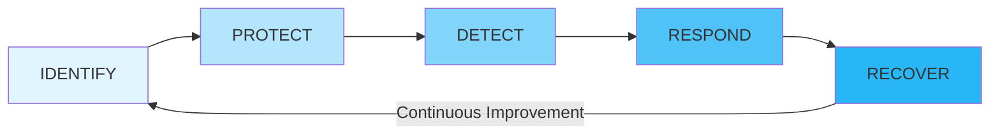

---

## INFOSEC COMPETENCIES

An IT professional working in a role with security responsibilities must be competent in a wide range of disciplines, from network and application design to procurement and human resources (HR).

* Participate in risk assessments and tooling of security systems and make recommendations.
* Specify, source, install, and configure secure devices, software, and hardware.
* Set up and maintain document access control and user privilege profiles.
* Monitor audit logs and review users' privileges.
* Manage security-related incident response and reporting.
* Create and test **Business Continuity Plans (BCP)** and **Disaster Recovery Plans (DRP)** procedures.
* Participate in security training and educational programs.

---

## INFOSEC ROLES AND RESPONSIBILITIES

A **Security Policy** is a formalized statement that defines how security will be implemented within an organization. It describes the means that an organization will take to protect the **Confidentiality, Integrity, and Availability (CIA)** of sensitive data and resources. It often consists of multiple individual policies. The implementation of a security policy to support the goals of the **CIA Triad** might be different for several multinational organizations, but should share the same interest in ensuring that its employees, equipment, and data are secure against attack or damage.

As part of the process of adopting an effective organizational security posture, employees must be aware of their responsibilities. The structure of security responsibilities will depend on the size and hierarchy of the organization, but the roles listed below are typical in the industry.

Overall internal responsibility for security might be allocated to a dedicated department run by the **Director of Security**, **Chief Security Officer (CSO)**, or **Chief Information Security Officer (CISO)**. Historically, responsibility for security might have been allocated to executing business (mostly the ICT managers).

* **Managers** may have responsibility for a domain, such as building control, IoT, or accounting.
* **Technical and Specialist Staff** have responsibility for implementing, maintaining, and monitoring the policy. Security might be made a core competency of systems and network administrators.
* **Non-Technical Staff** have the responsibility of complying with policy and with any relevant legislation.
* **External responsibility** for security due to corporate liability remains with directors or owners.

### NIST NICE (National Initiative for Cybersecurity Education)

Categorizes job roles and tasks. The following InfoSec business units are often used to represent the security function within an organization's hierarchy:

1. **Security Operations Center (SOC):** A location where security professionals monitor and protect critical information assets across other business functions (e.g., finance, operations, sales, and marketing). Difficult to establish and maintain, they are usually employed by larger multi-corporations.
2. **Incident Response:** A dedicated **Cyber Incident Response Team (CIRT)**, **Computer Security Incident Response Team (CSIRT)**, or **Computer Emergency Response Team (CERT)** as a single point of contact for the notification of security incidents. The function might be handled by the SOC or might be established as an independent business unit.
3. **Development and Operations (DevOps):** A cultural shift within an organization to encourage much more collaboration between developers and system administrators. Separate development and system security operations departments or teams can lead to "silos"—where each team does not work effectively with the other. By creating a highly orchestrated environment, IT personnel can build, test, and release software faster and more reliably. **DevSecOps** extends the boundary to security specialists and personnel, reflecting the principle that security is a primary consideration at every stage of software development and deployment. This is also known as **"Shift Left,"** meaning that security considerations need to be made during requirements and planning stages, not grafted on at the end. The principles of **DevSecOps** recognize this and show that security expertise must be embedded into any development project.

---

## SECURITY CONTROLS AND FRAMEWORKS

By identifying base security control types and how key frameworks and legislation drive compliance, as well as the selection and configuration of controls, you would be better prepared to select and implement the most appropriate controls for a given scenario. **NIST** classifies security controls. The frameworks can shape company policies, provide checklists of procedures, activities, and technological tools that should ideally be in place. Collectively referred to as **"SECURITY CONTROLS,"** which is something designed to make a system/data asset meet the properties of **Confidentiality, Integrity, Availability, and Non-Repudiation**.

Controls can be divided into three broad categories representing the way they are being implemented:

* **TECHNICAL:** The controls implemented as a system—hardware, software, or firmware (e.g., Firewalls, IDS/IPS, Antivirus, and OS access control models). Technical controls are also known as **Logical Controls**.
* **OPERATIONAL:** The control is implemented primarily by people rather than systems (e.g., Security Guards, Training Programs, Business Continuity, and Disaster Recovery).
* **MANAGERIAL:** The control gives oversight of the information system (e.g., Risk Identification, Management, Standard Operating Procedures (SOP), and Incident Response).

### Functional Control Types

Security controls can also be classified by types according to the goal or function they perform:

* **PREVENTIVE:** The control acts to eliminate or reduce the likelihood that an attack can succeed. A preventive control operates before an attack can take place (e.g., ACLs, Antimalware). Also, **Directives** and **Standard Operating Procedures (SOP)** can be thought of as administrative versions of preventive controls.
* **DETECTIVE:** The control may or may not prevent/deter access, but it will identify and record any attempted or successful intrusion. A detective control operates during the progress of an attack (e.g., System Logs and Events, IDS).
* **CORRECTIVE:** The control acts to eliminate or reduce the impact of an intrusion event, operating after an attack (e.g., Backup system restores data that was damaged during an intrusion, and Patch Management systems that act to eliminate the vulnerability exploited during the attack).

While most controls can be classified goal-oriented/functionally, a few other types include:

* **PHYSICAL:** Controls such as alarms, gateways, locks, security cameras, and guards that deter and detect access to premises and hardware.
* **DETERRENT:** The control psychologically discourages an attacker from attempting an intrusion. This could include signs and warnings of legal penalties against trespass or intrusion.
* **COMPENSATING:** The control serves as a substitute for a principal control as recommended by a security standard and affords the same level of protection but using a different methodology or technology.

---

## CYBERSECURITY FRAMEWORKS

A **Cybersecurity Framework** is a list of activities and objectives undertaken to mitigate risks. The use of a framework allows an organization to make an "objective statement" of its current cybersecurity capabilities, identify a target level of capability, and prioritize investments to achieve that target. This is valuable for giving a structure to internal risk management procedures and provides an externally verifiable statement of regulatory compliance. Frameworks are also important because they save an organization from building its security program in a vacuum or on a foundation that fails to account for important security concepts.

There are many different frameworks, each of which categorizes cybersecurity activities and controls in slightly different ways. These frameworks are **non-regulatory** in the sense that they do not attempt to address the specific regulations of a specific industry but represent best practice in IT security governance.

As well as its Cybersecurity and Risk Management Frameworks, **NIST** is responsible for issuing the **Federal Information Processing Standards (FIPS)** plus advisory guides called **Special Publications**. Many of the standards and technologies covered in CompTIA Security+ are discussed in these documents.

**NIST CSF** is a relatively new addition to the IT governance space and is distinct from other frameworks by focusing exclusively on IT security rather than IT service provision more generally. It is developed for a US audience and focuses somewhat on US government, but its recommendations are adopted by other countries and organizations. Preceding the **NIST-CSF** is the **NIST Risk Management Framework (RMF)**. Where the CSF focuses on practical cybersecurity for businesses, the RMF is more prescriptive and principally intended for US federal agencies.

### ISO and Cloud Frameworks

Unlike the NIST framework, the **ISO 27000 Series (27k)** must be purchased. Of those series:

* **27001:** Information Security Management.
* **27002:** Classifies security controls.
* **27017 & 27018:** Reference cloud security.
* **27701:** Focuses on personal data and privacy concerns.

Where ISO 27k is a cybersecurity framework, **ISO 31000 (31k)** is an overall framework for **Enterprise Risk Management (ERM)**, which considers risks and opportunities beyond cybersecurity, including financial, customer service, competition, and legal liability factors. ISO 31k establishes **"Best Practices"** for performing risk assessments.

### Cloud Security Alliance (CSA)

CSA produces various resources to assist **Cloud Service Providers (CSP)** in setting up and delivering secure cloud platforms. These resources can also be useful for cloud consumers in evaluating and selecting cloud providers.

* **Security Guidance:** A best practice summary analyzing the unique challenges of cloud environments and how on-premises controls can be adapted to them.
* **Enterprise Reference Architecture:** Best practice methodology and tools for CSPs to use in architecting cloud solutions. The solutions are divided across a set of domains (Risk Management, Infrastructure, Application, Presentation Services).
* **Cloud Controls Matrix (CCM):** Lists specific controls and assessment guidelines that should be implemented by CSPs for cloud consumers. The matrix acts as a starting point for cloud contracts/agreements as it provides a baseline level of security competency that the CSP should meet.

### SSAE (Statements on Standards for Attestation Engagements)

The **SSAE** are audit specifications developed by the **American Institute of Certified Public Accountants (AICPA)**. These audits are designed to assure consumers that service providers—notably cloud providers, but including any type of hosted third-party service—"meet professional standards." Within **SSAE No. 18**, the most common specification, there are several levels of reporting:

* **Service Organization Control (SOC2):** Evaluates the internal controls implemented by the service provider to ensure compliance with **Trust Services Criteria** (e.g., when storing and processing customer data; refers to Security, Confidentiality, Integrity, Availability, and Privacy properties).
* **SOC2 Type II Report:** Assesses the ongoing effectiveness of the security architecture over a period of 6-12 months.
* **SOC2 Type I Report:** Assesses the system design at a specific point in time. SOC2 reports are highly detailed, designed to be restricted, and represent intellectual property. They should only be shared with auditors, regulators, and important partners under **Non-Disclosure Agreement (NDA)** terms.
* **SOC3:** A less detailed report certifying compliance with SOC2; SOC3 reports can be freely distributed.

---

## BENCHMARKS AND SECURE CONFIGURATION GUIDES

Although a framework gives a high-level view of how to plan IT services, it does not provide detailed implementation guidance. At a system level, the deployment of servers and applications is covered by **Benchmarks** and **Secure Configuration Guides**.

* **Center for Internet Security (CIS):** A not-for-profit organization that publishes the well-known **"CIS Critical Security Controls."** The **CIS-RAM (Risk Assessment Method)** can be used to perform an overall evaluation of security posture. It also provides benchmarks for different aspects of cybersecurity. The **"CIS-CAT" (Configuration Access Tool)** can be used with automated vulnerability scanners to test compliance against those benchmarks.
* **OS / Network Appliance Platform / Vendor-Specific Guides:** Best practice configuration lists the settings and controls that should be applied for a computing platform to work in a defined role (e.g., Client Workstation, Authentication Server, Network Switch, Router, Firewall, Web/Application Server, and so on). Most vendors will provide guidance templates and tools for configuring and validating the deployment of network appliances, OS, web servers, and application/database servers. The security configuration for each of these devices will vary not only by vendor but by device and version as well.
* **Department of Defense (DoD) Cyber Exchange:** Provides **Security Technical Implementation Guides (STIGs)**, which are hardening guidelines for a variety of software and hardware solutions.
* **NIST National Checklist Program (NCP):** Provides **"Checklists"** and **"Benchmarks"** for a variety of operating systems and applications.
* **Payment Card Industry Data Security Standard (PCI DSS)** defines the safe handling and storage of financial information of data subjects.

---

## APPLICATION SERVERS

Most application architectures use a **Client-Server model**. This means that part of the application is a client software program installed and running on separate hardware from the server application code. The client interacts with the server over a network.

Attacks can therefore be directed at the local client code, the server application, or the network channel between them. As well as coding issues, the application needs to take account of platform issues. The client application might be running on a computing host alongside other potentially malicious software. Code that runs on the client should not be trusted. The server-side code should implement routines to verify that input conforms to what is expected.

### Web Server Applications

A web app leverages existing technology to simplify development. It uses a generic client (a web browser) and standard network protocols and servers. The specific features of the app are developed using code running on the client and server sides. Web apps are also likely to use a **Multi-tier Architecture**, where the server part is split between application logic and data storage/retrieval. Modern web apps use more distributed architecture like **Microservices** and **Serverless Instances**. The **Open Web Application Security Project (OWASP)** and **Service Oriented Architecture (SOA)** are key references.

---

## REGULATIONS, STANDARDS, AND LEGISLATIONS

The key frameworks, benchmarks, and configuration guides may be used to demonstrate compliance with a country's legal/regulatory requirements or with industry-specific regulations. **Due Diligence** is a legal term meaning that responsible persons have not been negligent in discharging their duties. **Negligence** can lead to criminal or civil liabilities. Many countries have enacted legislation to criminalize negligence.

* **Sarbanes-Oxley Act (SOX):** Mandates the implementation of risk assessments, internal controls, and audit procedures (due diligence).
* **Computer Security Act (1987):** Requires federal agencies to develop security controls and policies for computer systems that process confidential information.
* **Federal Information Security Management Act (FISMA 2002):** Introduced to govern the security of data processed by federal government agencies.
* **Health Insurance Portability and Accountability Act (HIPAA):** For medical services.
* **Gramm-Leach-Bliley Act (GLBA):** For financial services.

### Personal Data and GDPR

Regulations take into account personal data privacy. **Privacy** is a distinct concept from security. Privacy requires that the collection and processing of personal info be both secure and fair. The right to privacy and fairness as enacted by the EU's **General Data Protection Regulation (GDPR)** means that personal data cannot be collected, processed, or retained without the individual's **Informed Consent**. Informed consent means that the data must be collected and processed only for the stated purpose; the purpose must be clearly described to the user in plain language (not legalese). GDPR gives data subjects rights to withdraw consent and to inspect, amend, or erase stored data.

### National, Territory, or State Laws

Compliance issues are complicated by the fact that laws are derived from different sources. For example, GDPR does not apply to American data subjects, but it does apply to American companies that collect/process personal data of European data subjects. In the US, there are federal laws, state laws, and laws applying to US territories. Federal laws tend to focus on regulations like FISMA for federal departments or as **"Vertical Laws"** affecting a particular industry. Some states have started to introduce **"Horizontal Laws"** for personal data regulations similar to the approach taken by the EU's GDPR. One high-profile example of state legislation is the **California Consumer Privacy Act (CCPA)**.

---

## THREAT ACTORS AND INTELLIGENCE

Your responsibility lies principally in defending assets. To do so, you must be able to explain the **Tactics, Techniques, and Procedures (TTPs)** and the different types and capabilities of threat actors. Clarifying and evaluating the capabilities of threat actor types enables you to assess and mitigate risks. Understanding the methods by which threat actors infiltrate networks and systems is essential for you to assess the attack surface of your networks and deploy controls to block attack vectors.

As part of **Security Assessment and Monitoring**, teams must identify ways their systems could be attacked.

* **VULNERABILITY:** A weakness that could be triggered accidentally or exploited intentionally to cause a security breach. (e.g., Improperly configured hardware, delays in patching, untested patches, poorly designed architecture, inadequate physical security, insecure password usage, design flaws in OS code).
* **THREAT:** The potential for someone or something to exploit a vulnerability and breach security. A threat may be intentional or unintentional. The person/thing that poses the threat is a **Threat Actor** or **Agent**.
* **ATTACK VECTOR:** The path or tool used by a malicious threat actor.
* **RISK:** The likelihood and impact (consequence) of a threat actor exploiting a vulnerability. To assess risk, you identify a vulnerability and then evaluate the likelihood of it being exploited by a threat actor/agent and the impact that a successful exploit would have.

### Attributes of Threat Actors

Historically, cybersecurity techniques were highly dependent on the identification of "static" known threats to specific software vulnerabilities. It was relatively straightforward to identify and scan for these types of threats with automated software. Unfortunately, adversaries were able to develop means of circumventing this type of signature-based scanning. The sophisticated nature of cybersecurity threats means that it is important to be able to describe and analyze behaviors. This analysis involves identifying the attributes of threat actors in terms of location, intent, and capability.

* **EXTERNAL / INTERNAL:** A threat actor that has no account or authorized access to the target system and has to infiltrate the security system using malware or Social Engineering is an **External Threat**. Conversely, an **Internal Threat Actor** is one that has been granted permissions on the system. Note: An external actor may perpetrate an attack remotely or on-premises; it is the threat actor that is defined as external and not the attack method. This explains the **Location** attribute.
* **INTENT AND MOTIVATION:** This describes what an attacker hopes to achieve from the attack, as well as the attacker's reason for perpetrating the attack. A malicious intentional threat actor could be motivated by greed, animosity, or some sort of grievance with the intent to steal, vandalize, or disrupt. Malicious intents and motivations can be contrasted with accidental/unintentional threat actors/agents, which represent accidents, lack of oversight, and lack of awareness. Threats can also be characterized as **Structured vs. Unstructured** and **Targeted vs. Opportunistic**, depending on the degree to which the organization is targeted specifically.

---

## CAPABILITY / Level of Sophistication and Resources/Funds

**Capability** refers to a threat actor's ability to craft novel exploits, attacks, and tools.

* The least capable threat actor relies on **Commodity Attack Tools** that are widely available on the Dark Web.
* More capable actors can fashion **Zero-day Exploits** in operating systems, application software, and embedded systems.
* At the highest level, an actor might make use of non-cyber tools like military or political assets.

Capability is only funded through a substantial budget; the most capable actors get resources and funding from nation-states or criminal syndicates. To fully assess intent and capability, it is helpful to identify different categories of threat actors:

1. **HACKERS:** An individual with skills to gain access to computer systems through unauthorized/unapproved means. Breaking into a system was a sign of technical skill and creativity that gradually became associated with illegal or malicious system intrusions. The terms **Black Hat (Unauthorized)** and **White Hat (Authorized)** hacking are used to describe their motivations. Between "black" and "white" lies some shades of **Gray Hat (Semi-Authorized)**; they might try to find vulnerabilities in a network without seeking consent but might not try to exploit them.
2. **SCRIPT KIDDIES:** An individual who uses hacker tools without necessarily understanding how they work or having the ability to craft new attacks. They might have no real target or goal other than gaining attention or proving technical abilities.
3. **HACKTIVISTS (Hacker Teams):** Threat actors are now likely to be part of some sort of team/group. The collaborative team effort means these types of threat actors are able to develop sophisticated tools and strategies (e.g., DoS). Hacktivists might attempt to obtain and release confidential information to the public domain or perform DoS.
4. **STATE ACTORS:** Nation-developed cyber tactics and weapons to achieve both military and commercial economic goals, primarily with the aim of espionage and strategic advantage. The term **APT (Advanced Persistent Threat)** was coined to understand the behavior and lifecycle underpinning modern types of cyber adversaries. Rather than thinking in terms of systems being infected with viruses, an APT refers to the ongoing ability of an adversary to compromise network security—to obtain and maintain access—using a variety of techniques and tools. State actors work at arm's length from their national government, military, or security service that sponsors and protects them, maintaining **Plausible Deniability**.
5. **CRIMINAL SYNDICATES & COMPETITORS:** A criminal syndicate can operate across the internet from different jurisdictions than its victim, increasing the complexity of prosecution. Syndicates are motivated by criminal profit through financial fraud (against individuals and companies) and extortion. Most competitor-driven espionage is thought to be pursued by state actors, but it is conceivable that a rogue business might act against its competitors with the aim of intellectual property theft, business disruption, or damaging their reputation.
6. **INTERNAL THREAT ACTORS:** The **Computer Emergency Response Team (CERT)** at Carnegie Mellon University defines a **Malicious Insider** as: *"A current or former employee, contractor, or business partner who has/had authorized access to an organization's network, system, or data and intentionally exceeded or misused that access in a manner that negatively affects the CIA or privacy of the organization's information systems."* Distinguishing these insiders involves distinguishing those with permanent privileges (employees) from those with temporary privileges (contractors, partners). There is also a blurred case of former insiders now working elsewhere who harbor grievances after their dismissal and are classified as **"Internal Threats"** or **"External Threats with Insider Knowledge"** (due to possible residual permissions if effective offboarding controls are not in place). CERT identifies the main motivators for malicious insider threats as **Sabotage, Financial Gain, and Business Advantage**.

Like external threats, internal threats can be **Targeted vs. Opportunistic** and **Structured vs. Unstructured**. The key point here is to identify likely motivations and assess the possibility that an insider is working in collaboration with an external entity/group. Insider threats can also be categorized as **Unintentional or Inadvertent**. This is a vector for an external actor or a separate malicious internal actor to exploit, rather than a threat actor in its own right. Unintentional threats stem from lack of orientation, awareness, or conscientiousness. Another example is the concept of **Shadow IT**, where users procure and introduce unapproved hardware/software to the workplace without sanction of the IT department and without going through procurement to security analysis processes, creating a new unmonitored attack surface for malicious adversaries to exploit.

---

## ATTACK SURFACE AND VECTORS

The **Attack Surface** is all points at which a malicious threat agent could try to exploit a vulnerability. To evaluate these, you need to consider the type of threat actor. The attack surface for an external actor is far smaller than that of an insider threat. Minimizing the attack surface means restricting access so that only a few known endpoints, protocols, ports, and services are permitted; each of these must be assessed for vulnerabilities. Attack surface can be considered for the network as a whole. From the perspective of the threat actor, different parts of the attack surface represent potential **Attack Vectors**.

An **Attack Vector** is the path that a threat actor uses to gain access to a secure system. In the majority of cases, gaining access means being able to run malicious code on the target.

* **Paths include:** Direct Access (physical/local attack), Removable Media, Email, Remote & Wireless Access, Supply Chain, Web & Social Media, and Cloud Accessibility (APIs used to deliver services in the cloud).

Sophisticated threat actors will make use of multiple vectors, likely to plan multi-stage campaigns rather than a single "smash and grab" type of cyber raid.

---

## THREAT RESEARCH SOURCES

Ensure you are capable of identifying and evaluating sources of threat intelligence and research. **Threat Research** is a counterintelligence gathering effort in which security companies and researchers attempt to discover the tactics, techniques, and procedures of modern cyber adversaries.

Security solution providers derive a lot of data from their own customer networks so they can assist with cybersecurity operations, analyze and publicize TTPs and their indicators. They also operate **Honeypots/Honeynets** to try to observe how hackers interact with vulnerable systems.

Another primary source of threat intelligence is the **Deep Web** and **Dark Web**.

* **Deep Web:** Any part of the world wide web that is not indexed by a search engine (e.g., pages requiring registration, pages blocking search indexing, untracked pages, pages using non-standard DNS, or content encoded in a non-standard manner). Within the deep web are areas that are deliberately concealed from "regular" browser access.
* **Dark Net:** A network established as an overlay to internet infrastructure by software like **The Onion Router (Tor)**, **Freenet**, or **I2P** that acts to anonymize usage. It prevents a third party from knowing about the existence of the network or analyzing activity by using multiple layers of encryption and relays between nodes.
* **Dark Web:** Sites, content, and services accessible only over a Dark Net. There are dark web search engines, yet many sites are hidden from them. Access to a dark web site requires the URL. Investigating these dark web sites and message boards is a valuable source of counterintelligence.

As adversaries react to this, they set up new networks or ways of identifying law enforcement infiltration. Consequently, Dark Nets and the Dark Web represent a continually shifting landscape. Sources include: `virustotal.com`, `spamhaus.org`, `misp-project.org`, `nationalisacs.org`, `alienvault.com`, `IBM X-Force Exchange`, `fireeye.com`, `recordedfuture.com`, `us-cert.gov/cas`.

---

## THREAT INTELLIGENCE PROVIDERS

The output from the primary research undertaken by security solution providers can take three forms:

1. **Behavioural Threat Research:** Narrative commentary describing examples of similar attacks and TTPs gathered through primary research sources.
2. **Reputational Threat Intelligence:** Lists of IP addresses, domains, and signatures of known file-based malware.
3. **Threat Data:** Computer data that can correlate events observed on a customer's own networks and SIEM logs with known TTPs and threat actor indicators.

Threat data can be packaged as feeds that integrate into a **Security Information and Event Management (SIEM)** platform; these feeds are usually described as **Cyber Threat Intelligence (CTI)** data. The data on its own is not a complete security solution; however, to produce actionable intelligence, the threat data must be correlated with observed data from customer networks. Analysis is often an AI-powered feature of SIEM.

Threat intelligence platforms and feeds are supplied as one of three different commercial models:

* **CLOSED / PROPRIETARY:** Threat research and CTI data is made available as a paid subscription.
* **VENDOR WEBSITES:** All types of security hardware and software vendors make huge amounts of threat research available via their websites as a general benefit to their customers (at no cost at times).
* **Public/Private Information Sharing Centers:** In critical industries, **Information Sharing and Analysis Centers (ISAC)** have been set up to share threat intelligence and promote best practice. These are sector-specific resources.
* **OPEN SOURCE INTELLIGENCE (OSINT):** Open-source threat research providers operate services on an open-source basis, earning income from consultancy rather than directly from the platform. OSINT can mean any intelligence derived from publicly available information. OSINT is also a common reconnaissance technique where an attacker harvests domains, IP ranges, employees, and other data to assist in identifying attack vectors.

---

## THREAT DATA FEEDS

Using a **Cyber Threat Intelligence (CTI)** platform means subscribing to a threat data feed. The information in the threat data can be combined (correlated) with event data from your own network and system logs. An analysis platform (SIEM/AI-powered) performs correlation to detect if Indicators of Compromise (IoC) are present.

* **STIX (Structured Threat Information eXpression):** Provides the syntax for describing CTI. The STIX framework describes standard terminology for IoCs and ways of indicating relationships between them.
* **TAXII (Trusted Automated eXchange of Indicator Information):** A protocol that provides a means for transmitting CTI data between servers and clients. A CTI service provider maintains a repository of CTI data; subscribers obtain updates to the feed into analysis tools over TAXII. This data can be requested by the client (**Collection**) or pushed to subscribers (**Channel**).
* **AUTOMATED INDICATOR SHARING (AIS):** A service offered by the **Department of Homeland Security (DHS)** for companies and ISACs to participate in threat intelligence sharing. AIS is based on STIX and TAXII standards.
* **THREAT MAPS:** An animated graphic showing the source, target, and type of attacks detected by a CTI platform.
* **FILE / CODE REPOSITORIES:** **VirusTotal** is an example that holds signatures of known malware code. Samples derive from live customer systems and public repositories.
* **VULNERABILITY DATABASES & FEEDS:** Identifying vulnerabilities is another source of threat intelligence. In the US, lists of vulnerabilities are stored in databases such as **CVE (Common Vulnerabilities and Exposures)**. Info about vulnerabilities is codified as signatures and scanning scripts supplied as feeds to automated vulnerability scanning software.

---

## AI, MACHINE LEARNING, AND PREDICTIVE ANALYSIS

A threat data feed does not produce threat intelligence automatically. Through a combination of security intelligence, CTI data can be processed, correlated, and analyzed to provide actionable insights. Most threat intelligence platforms use some sort of **Artificial Intelligence (AI)** to perform correlation analysis.

* **Early AI (Expert Systems):** Used "if-then" rules to draw inference from a limited data set called a **Knowledge Base**.
* **Machine Learning (ML):** Uses algorithms to parse input data and develop strategies for using that data. Machine learning uses the algorithm to parse data and develop strategies by making gradual improvements in decision-making processes. The structure facilitating this learning process is referred to as an **Artificial Neural Network (ANN)**. Nodes in a neural network take input and then derive outputs using complex feedback loops. An ML system has objectives and error states; it adjusts its neural network to reduce errors and optimize objectives.

In terms of threat intelligence, this AI-backed analysis might perform accurate correlation.

* **PREDICTIVE ANALYSIS:** Identifying the signs of an attack or the presence of new attack tools on a network quickly is valuable. One goal of using AI-backed threat intelligence is to perform **Predictive Analysis** or **Threat Forecasting**. This means a system can anticipate a particular attack type or possibly the identity of the threat actor before the attack is fully realized. The analysis engine associates "chatter" with IP addresses that it can correlate with a known adversary group. This gives the target advance warning that an attack is in planning stages and more time to prepare an effective defense. (Note: Concrete threat forecasting is not a proven capability yet).

---

## GUIDELINES FOR EXPLAINING THREAT ACTORS & INTELLIGENCE

* Create a profile of threat actor types that pose the most likely threats to your business.
* Identify sources of threat research, especially those directly relevant to your industry sector.
* Schedule time to keep up to date with threat trends and security best practices.
* Evaluate the use of a threat intelligence platform (consider proprietary vs. open source).

---

## SECURITY ASSESSMENT

**Security Assessment** refers to processes and tools that evaluate the **Attack Surface**. The output of an assessment is recommendations for deploying, informing, or re-configuring security controls to mitigate the risks that vulnerabilities are exploitable by threat actors.

### Network Reconnaissance Tools

**Reconnaissance** is a type of assessment activity that maps the potential attack surface by identifying nodes and connections that make up the network (using ICMP, line, or curve topology probing). The process of mapping out the attack surface is referred to as **Network Discovery**.

* **TOPOLOGY DISCOVERY ("FOOTPRINTING"):** Scanning for hosts, IP ranges, and routes between networks to map out the structure of the target network. Used to build an asset database, identify non-authorized hosts (**Rogue System Detection**), or network configuration errors.
* **IPCONFIG / IFCONFIG:** Show the configuration assigned to a network interface in Windows/Linux.
* **PING:** Probes a host on a particular IP address or hostname using ICMP packets (Reply/Response).
* **ARP:** Displays the local machine's **Address Resolution Protocol (ARP)** cache. The ARP cache shows the MAC address of the interface associated with each IP address the local host has communicated with.
* **ROUTE:** View and configure the local host's routing table. Most endpoints have a simple routing table with a default route (`0.0.0.0`) to forward all traffic via a gateway router. Additional entries could be suspicious.
* **TRACERT / TRACEROUTE:** Performs path discovery using ICMP probes (for Windows) and by default UDP probes (for Linux) with decreasing **Time to Live (TTL)** to report **Round Trip Time (RTT)** for hops between local and remote hosts.
* **PATHPING / MTR:** Provides statistics for latency and packet loss along a route over a longer period. High latency at the default gateway might indicate a **Man-in-the-Middle (MITM / On-path)** attack. High latency on other hops could indicate DoS or network congestion.
* **NMAP (Network Mapper):** An IP scanner that performs host discovery and identifies how hosts are connected. Nmap uses diverse methods (some stealthy to defeat Firewalls/IDS). On a local segment, it uses ARP and Neighbor Discovery sweeps. If a host is detected, Nmap performs a **Port Scan** to determine running services.

### Service Discovery and Fingerprinting

After discovering active IP hosts, the next step in reconnaissance is to work out which operating systems are in use, which network services each host is running, and which application software is underpinning those services.

* **SERVICE DISCOVERY:** Used defensively to probe for unauthorized ports.
* **FINGERPRINTING:** Detailed analysis of services. Each OS/App responds to probes uniquely, allowing scanning software to guess software names and versions without privileged access.
* **BANNER GRABBING:** Where the "banner" is the header of the response returned by application software. Using `-sV` or `-A` switches in Nmap probes more intensively for OS Type/Version, Device Type, and Protocol/Version. Nmap uses the **Common Platform Enumeration (CPE)** syntax for signatures.
* **NETSTAT:** Shows the state of TCP/UDP ports on the local machine. Used to check for service misconfigurations or suspect remote connections.
* **NSLOOKUP / DIG (Domain Information Groper):** Used to query name records for a given domain. A misconfigured DNS server may allow a **Zone Transfer**, giving an attacker complete records of every host in the domain.
* **THE HARVESTER:** A tool for gathering OSINT for a particular domain or company name. It scans multiple public data sources for emails, subdomains, IPs, and URLs.
* **DNSENUM:** Packages multiple tests into a single query to work out IP ranges in use and name records.
* **SCANLESS:** Disguises the source of scan probes to conceal them from detection systems.
* **CURL:** Command-line tool for performing data transfers over several protocols. Used to submit HTTP GET, POST, or PUT requests as part of web app vulnerability testing.
* **NESSUS:** An automated scanning tool with a database of known software vulnerabilities used to cross-check services and versions.

---

## PACKET CAPTURE AND PROTOCOL ANALYSIS

* **PACKET ANALYSIS:** Refers to deep, frame-by-frame scrutiny of captured packet frames.
* **PROTOCOL ANALYSIS:** Using statistical tools to analyze a sequence of packets or traffic.
* **SNIFFER:** A tool to capture and decode frames.
* **Capture Methods:**
* **Switched Port Analyzer (SPAN) / Mirror Port:** A network switch copies frames from designated source ports to a destination port where the sniffer is connected.
* **Test Access Point (TAP):** A device inserted into cabling to copy frames. Sniffers are typically placed behind a firewall or near a critical server to identify malicious traffic that bypassed the firewall.


* **TCPDUMP:** A command-line packet capture utility for Linux. Syntax: `tcpdump -i eth0`. Uses filter expressions (e.g., `host`, `net`, `port`, `portrange`) combined with Boolean operators (`and`, `or`, `not`). Frames can be saved to `.pcap`.
* **WIRESHARK:** A graphical protocol/packet analyzer. Decodes captured frames into a readable format. Includes a **Packet List Pane** (summary), **Packet Details Pane** (expandable OSI layers), and **Packet Byte Pane** (raw Hex/ASCII). Features like **"Follow TCP Stream"** reconstruct the contents of a session.

### Packet Injection and Replay

Some techniques depend on sending forged or spoofed traffic.

* **PACKET INJECTION:** Inserting frames into network streams. Tools include **DSNIFF**, **ETTERCAP**, **SCAPY**, and **HPING**.
* **HPING:** An open-source spoofing tool to craft packets to exploit vulnerable firewalls and IDS. Can perform host/port detection, traceroute, and flood-based DoS from randomized source IPs.
* **TCPREPLAY:** A command-line utility that takes previously captured traffic (`.pcap`) and replays it through an interface. Fields (MAC/IP) can be changed. Useful for testing IDS rules with suspect traffic samples.
* **NETCAT (nc):** Effective tool for testing connectivity, port scanning, fingerprinting, and establishing connections.

---

## EXPLOITATION FRAMEWORKS

* **RAT (Remote Access Trojan):** Malware that gives an adversary remote access. Pentesters try to establish this connection to test data exfiltration.
* **EXPLOITATION FRAMEWORK:** Uses vulnerabilities identified by automated scanners and launches scripts or software to attempt matched exploits. Comprises a database of exploit code targeting particular **CVEs**. Exploit code is coupled with **Modular Payloads** (e.g., opening a command shell, creating a user). Frameworks can **Obfuscate** code to bypass antivirus/IDS.
* **METASPLOIT (Rapid7):** The best known exploitation framework.
* **SN1PER:** Framework for pentest reporting and guidance; integrates with Metasploit and Nikto.
* **FIRE ELF:** Injects fileless exploit payloads into a Linux host.
* **ROUTERSPLOIT:** Vulnerability scanning and exploit modules targeting embedded systems.
* **BEEF (Browser Exploitation Framework):** Recovering web session info and exploiting client-side modern techniques.
* **ZAP (Zed Attack Proxy):** Scanning tools and scripts for web and mobile app security testing.
* **PACU:** Scanning and exploitation tools for AWS platforms.

---

## GENERAL VULNERABILITY TYPES

* **SOFTWARE VULNERABILITY:** An attack targeting a vulnerability in software code (design flaw).
* **OS VULNERABILITY:** Vulnerabilities in kernel files or shared libraries, often allowing **Privilege Escalation** (gaining System/Root access).
* **FIRMWARE:** Vulnerabilities in BIOS/UEFI or device firmware (Network cards, Disk controllers). Hard to identify because they run at the highest level.
* **IMPROPER PATCH MANAGEMENT:** Where security patches are not applied, leaving systems vulnerable.
* **ZERO-DAY:** A vulnerability exploited before the developer knows about it or can release a patch. These have significant financial value; agencies may stockpile them for investigation.
* **LEGACY PLATFORMS:** No longer supported with security patches by the vendor. Unpatchable by definition; must be protected by other controls like isolation.

---

## WEAK CONFIGURATIONS

Weak configurations can have a similar impact to ineffective patching.

* **DEFAULT SETTINGS:** Relying on manufacturer defaults (e.g., unsecured interfaces) that allow an attacker to move unhindered.
* **UNSECURED ROOT ACCOUNTS:** Default admin/supervisor accounts with no restrictions. Adversaries gain control by guessing weak passwords or using software bugs. Authorization policies should enforce **Least Privilege**. The default root is usually disabled for login.
* **OPEN PERMISSIONS:** Provisioning data/apps without differentiating access rights. Can lead to unauthenticated guests viewing confidential files or having write access. Prevalent in Cloud Storage.
* **WEAK NETWORK CONFIGURATION:**
* **Open Ports & Services:** Best practice dictates restricting to necessary services only. Disable unnecessary default services. Block ports at border firewalls or segment the network.
* **Unsecure Protocols:** Lack encryption for data protection; susceptible to MITM.
* **Weak Encryption:** Keys generated from simple passwords (Brute Force/Dictionary enumeration), weak algorithms/ciphers, or insecure key distribution.


### Error Handling

Weakly configured applications may display unformatted error messages that reveal coding mistakes. Secure coding ensures applications **"Fail Gracefully"** without revealing info that assists in an exploit.

---

## IMPACTS FROM VULNERABILITIES

### Data Breach and Data Exfiltration

* **DATA BREACH (Data Leak):** Event where confidential data is read, transferred, modified, or deleted without authorization. Can be intentional or unintentional.
* **DATA EXFILTRATION:** The methods/tools used by an attacker to transfer data without authorization. Always intentional and malicious; a consequence of a data breach. Compromises intellectual property or personal info.
* **IDENTITY THEFT:** A **Privacy Breach** where personal data is not processed in compliance with laws. Allows threat actors to sell data or perform identity theft.
* **DATA LOSS & AVAILABILITY LOSS:** Information becomes unavailable temporarily or permanently. Availability is a key part of CIA. Examples include ransomware encryption.
* **FINANCIAL & REPUTATION IMPACTS:** Damages, fines, loss of business, and widespread adverse publicity.

---

## THIRD-PARTY RISKS

* **VENDOR MANAGEMENT:** Selecting suppliers and evaluating risks. Risks cannot be wholly transferred to a vendor. Requires detailed audit processes.
* **SYSTEM INTEGRATION:** Combining components from multiple vendors. Lack of vendor support can make retooling complex.
* **OUTSOURCED CODE DEVELOPMENT:** Oversight is pertinent. A solution is to use one vendor for development and a different vendor for vulnerability/penetration testing.
* **DATA STORAGE:** Granting vendor access or using them for hosting/backups. Precautions: identical protections (Auth/Access Mgmt, Encryption), monitoring/auditing third-party access, and evaluating compliance impacts for personal data.
* **CLOUD-BASED VS. ON-PREMISES RISKS:** Cloud providers operate a **Shared Responsibility Model** (Cloud Matrix): CSP is responsible for the security **of** the cloud; the Consumer is responsible for security **in** the cloud.

---

## AUTOMATED VULNERABILITY SCANNING

A key part of initial assessment and ongoing compliance monitoring.

* **NIST Technical Guide to InfoSec Testing and Assessment:** Identifies three activities: **Testing** the object, **Examining** the object (identifying logical weaknesses), and **Interviewing** personnel.
* **VULNERABILITY ASSESSMENT:** Evaluation of a system's ability to meet compliance based on its configuration state (comparing actual config to the **Baseline**).
* **SCANNING TOOLS:** Scanners (e.g., **Nessus**, **OpenVAS**) use signatures and scripts to correlate vulnerabilities. Typical results identify missing patches, configuration deviations, and other vulnerabilities.
* **APPLICATION SCANNERS:** Dedicated scripts to test for known attacks. **Web Application Scanners** look for the **OWASP Top 10**.

### Vulnerability Feeds and CVEs

* **VULNERABILITY FEED:** Up-to-date information (Plugins/Network Vulnerability Tests - NVT). Many use **SCAP (Security Content Automation Protocol)** to obtain updates.
* **CVE (Common Vulnerabilities and Exposures):** Dictionary of vulnerabilities in published OS/Software. Format: `CVE-YYYY-####` (Year and order discovered).
* **NVD (National Vulnerability Database):** NIST supplement to CVE with additional analysis and the **Common Vulnerability Scoring System (CVSS)**.
* **CVSS:** Score from 0-10 based on characteristics (e.g., remote access vs. local, user intervention required). 0.1+ is Low, 4.0+ is Medium, 7.0+ is High, 9.0+ is Critical.

### Intrusive vs. Non-Intrusive Scanning

* **NON-INTRUSIVE (PASSIVE):** Analyzing indirect evidence (e.g., traffic types). Scanners like **Zeek (Bro)** identify CVE matches. Least impact but less comprehensive. Used by threat actors for stealth.
* **INTRUSIVE (ACTIVE):** Probing device configuration via network connection. Consumes bandwidth and risks target outages. **Agent-based scanning** is also active. Exploitation frameworks are the most intrusive.

### Credentialed vs. Non-Credentialed

* **NON-CREDENTIALED:** Host is tested without logging on to the OS/App. Obtains the view of an unprivileged user. Used for external perimeter assessment or web app scanning.
* **CREDENTIALED:** Given a user account with logon rights. Allows in-depth analysis of applications and security settings. Shows what an insider or compromised account could achieve. **Requirement:** Store credentials securely on the scan server.

---

## FALSE POSITIVES/NEGATIVES AND LOG REVIEW

* **FALSE POSITIVE:** Something identified as a vulnerability when it is not. Intrusive/Active scanning reduces these. Excessive false positives lead to disregarding results.
* **FALSE NEGATIVE:** Potential vulnerabilities that are not identified. Mitigated by running periodic scans and using scanners from multiple vendors.
* **LOG REVIEW:** Reviewing security and network logs can enhance the validation process.

---

## CONFIGURATION REVIEW

Assesses security controls and permissions against established benchmarks.

* **SCAP:** Allows compatible scanners to determine if a computer meets the baseline using:
* **OVAL (Open Vulnerability and Assessment Language):** XML schema for describing system state.
* **XCCDF (Extensible Configuration Checklist Description Format):** XML schema for developing/auditing best practice checklists.


* **COMPLIANCE SCAN:** Testing against best practice frameworks for regulatory compliance.

---

## THREAT HUNTING

An assessment technique to proactively discover evidence of TTPs already present in the network. Contrasts with reactive incident management and penetration testing (which attempts intrusion). Threat hunting is less potentially disruptive.

* **ADVISORIES & BULLETINS:** Triggers for establishing a hunt.
* **INTELLIGENCE FUSION & THREAT DATA:** Using SIEM and analytics to correlate CTI feeds with on-premises data.
* **MANEUVER:** Military doctrine relating to obtaining positional advantage. In threat hunting, this involves using passive discovery so threat actors are unaware that an intrusion has been discovered before containment is ready.

---

## PENETRATION TESTING CONCEPTS

Uses authorized hacking to discover exploitable weaknesses.

* **ETHICAL HACKING:** Verifies threats exist, bypasses/tests security controls, and explores vulnerabilities.

### Rules of Engagement (RoE)

Specifies permitted activity, objectives, and scope as a contractual agreement. Authorization from third parties (e.g., Cloud Providers) must be sought.

### Attack Profiles

* **UNKNOWN ENVIRONMENT (BLACK BOX):** Consultant is given no privileged information. Simulates an external threat. Requires a reconnaissance phase.
* **KNOWN ENVIRONMENT (WHITE BOX):** Consultant has complete access to info. Conducted as follow-up to evaluate discovered flaws. Simulates a privileged insider.
* **PARTIALLY KNOWN (GRAY BOX):** Consultant given some info (resembling non-IT staff) to model an unprivileged insider. Requires partial reconnaissance.
* **BLIND / SINGLE-BLIND:** Attacker has no knowledge, but staff are informed.
* **DOUBLE-BLIND:** Staff are not aware the test is taking place.
* **BUG BOUNTY:** Program where rewards are given for reporting vulnerabilities (Crowdsourcing).

### Exercise Types

* **RED TEAM:** Offensive role; attempts to infiltrate.
* **BLUE TEAM:** Defensive role; operates monitoring, alerts, and controls.
* **WHITE TEAM:** Umpire/Referee; sets RoE, monitors the exercise, and provides arbitration. Can halt the exercise if it becomes too risky.
* **PURPLE TEAM:** Red and Blue teams meet for regular debriefs while the exercise is ongoing to collaborate on detection mechanisms. Facilitated by Purple Team moderators.

### Reconnaissance Activities

Analysis of adversary TTPs established "Kill Chain" models.

* **PASSIVE RECON:** Querying publicly available info (Google Dorking, Advanced Searching, Specialized Search Engines, Image Search).
* **TOOLS:** Maltego, Recon-ng.

## ACTIVE RECONNAISSANCE

Active reconnaissance has more risk of detection, as it involves gaining physical access to property or requires interacting wt logical response in order to observe bits, or using scanning tools on the target's web services and other network topology points.

* **Open Source Intelligence (OSINT):** Using Web search tools, social media, and sites that can search for vulnerabilities in inter-connected devices and services to obtain information about the target. OSINT Aggregation tools such as **TheHarvester** collect and organize this data from multiple sources. OSINT requires almost no privileged access as it relies on finding info that is publicly available whether intentionally or not; this is a passive technique.
* **Social Engineering:** This refers to obtaining info, physical access to premises, or even access to a user account through the "art of persuasion." While the amount of interaction may vary, this can be classed as an active technique.

### HOST DISCOVERY

* **Footprinting:** Using software tools like **Nmap** to obtain info about a host or network topology. Scans can be launched against web hosts or against wired or wireless network segments if the attacker can gain physical access to them. While passive footprinting is possible (i.e., by limiting it to packet sniffing), most scan techniques, foot/finger-printing require active network connections wt the target that can be picked up by intrusion detection software.
* **War Driving:** Refers to mapping the location and type (freq channels, Auth security method) of wireless networks operated by the target. Some of these networks may be accessible from outside the bldg. Simply sniffing the presence of wireless networks is a passive activity, though there is the risk of being observed by security guards or camera. An attacker might be able to position rogue access points or perform other wireless attacks using intel gathered.
* **Drones / Unmanned Aerial Vehicle (UAV):** Allow the tester to reconnoiter campus premises and even perform war driving from the air (**War Flying**). **WiFi Pineapple** can easily be incorporated in the recon phase.

---

## PENTESTING ATTACK LIFE CYCLE

In the "Kill Chain Attack Life Cycle," Reconnaissance is followed by an initial exploitation where a software tool is used to gain some sort of access to the target's network (**Foothold**). This foothold might be accomplished using a phishing email and payload or by obtaining credentials using Social Engineering. Having gained the foothold, the pentester can set about confirming and scanning his access. A number of techniques are required:

* **Persistence:** The tester's ability to reconnect to the compromised host and use it as a **Remote Access Tool (RAT)** or **Backdoor**. To do this, the tester must establish a **Command and Ctrl (C2)** network to use to control the compromised host, upload additional attack tools, and data exfiltration. The connection to the compromised host will typically require a malware executable to run after shutdown and log off and by a connection to the network port and attacker's IP address to be available.
* **Privilege Escalation:** Persistence is followed by further internal recon, where the pentester attempts to map out the internal network and discover the services running on it and accounts configured to access it. Moving within the network or accessing data assets are likely to require a higher privilege level. Further exploits however might allow malware to execute wt system/root privileges or to use network admin privileges.
* **Lateral Movement:** Gaining control over other network hosts. This is done partly to discover more opportunities to widen access (harvesting credentials, detecting software vulnerabilities and misconfiguration, and gathering other such intellectual property "loot"), partly also to identify where valuable data assets might be located, and partly to evade detection. Lateral movement usually involves executing the attack tools over remote process share or using scripting tools such as PowerShell.
* **Pivoting:** Hosts/Endpoints that hold the most valuable data are not normally accessed over external networks directly. If foothold is achieved on perimeter server, pivoting allows them to bypass a network boundary and compromise servers behind the perimeter or client network. A pivot is accomplished using remote access and tunneling protocols like RDP, VPN, and SSH.
* **Actions on Objectives:** For a threat actor, this means Data Exfiltration—from the perspective of a pentester, it is usually sufficient to show that actions on objectives could be achieved.
* **Clean Up:** For a threat actor, this means removing evidence of the attack, or at least evidence that could implicate the adversary. For a pentester, this phase means removing any backdoors or tools and ensuring that the system is not left less secure than the pre-engagement state.

---

## GUIDELINES FOR PERFORMING SECURITY ASSESSMENTS

* Identify the procedures and tools that are required to scan the attack surface for vulnerabilities.
* Develop a configuration maintenance plan to ensure secure use of credentialed scans and updates to vulnerability feeds.
* Run scans regularly and review the results to identify false negatives and positives, using CVSS review and additional CVE information to validate results if necessary.
* Schedule configuration reviews and remediation plans, using vulnerability criticality to prioritize actions.
* Consider implementing threat hunting programs, monitoring advisories and bulletins for new threat sources.
* Consider implementing penetration testing exercises, ensuring that these are set up with clear rules of engagement for Red/Blue or Purple team exercise types and results disclosure (Black, Gray, White box).
* Run pentests using a structured kill chain cycle: Recon, Exploitation, Persistence, Priv Escalation, Lateral Move / Pivoting, Actions on Objectives, and Cleanup process.

---

## SOCIAL ENGINEERING & MALWARE

It is not sufficient for security assessments to focus solely on software vulnerabilities and configuration errors. As well as these hardware and software systems, the attack surface contains a company's employees and the degree to which they can be exploited to gain unauthorized access or privileges. Threat actors use social engineering techniques to steal information, obtain access to premises, and to trick users into running malicious code.

People—employees, contractors, suppliers, and customers—represent part of the attack surface of any organization. A person with permissions on the system is a potential target of social engineering. A prerequisite of many types of attacks is to obtain information about the network and security system. Social Engineering refers to means of either eliciting information from someone or getting them to perform some action for the threat actor. Also referred to as **"Hacking the Human."**

Social engineering might be used to gather intel as reconnaissance in preparation for an intrusion or it might be used to affect an actual intrusion. Typical Social Eng scenarios include:

* An attacker creates an executable file that prompts a network user for their password, and then records whatever the user inputs, thereby getting access to their network credentials.
* An attacker contacts the help desk pretending to be a remote sales representative who needs assistance setting up remote access.
* Through a series of phone calls, the attacker obtains the name/address of the remote access server and login credentials.
* An attacker triggers a fire alarm and then slips into the building during the confusion and attaches a monitoring device to a network port.

### SOCIAL ENGINEERING PRINCIPLES

Social engineering is one of the most common and successful malicious techniques because it exploits basic human trust. It has proven to be a particularly effective way of manipulating people into performing actions that they might not otherwise perform. To be persuasive, social engineering attacks rely on one or more of the following principles/methods of exploitation:

* **Familiarity / Liking:** One of the basic tools of a social engineer is simply to be affable and likeable with a natural charisma to persuade others to do as they request, presenting the requests they make as completely reasonable and unobjectionable. This approach is relatively low-risk; even if the request is refused, it is unlikely to cause suspicion and the social engineer may be able to move on to a different target without being detected.
* **Consensus / Social Proof:** The principle of "consensus" or "social proof" refers to the fact that without an explicit instruction to behave in a certain way, many people will act just as they think others would act. A social engineering attack can use this instinct either to persuade the target or exploit polite behavior, like to slip into a building while someone holds the door for them.
* **Authority & Intimidation:** Many people find it difficult to refuse a request by someone they perceive as superior in rank or expertise. Social engineers can try to exploit this behavior to intimidate their target by pretending to be a senior executive. Another technique is using spurious technical arguments and jargon; social engineers can exploit the fact that few people are willing to admit ignorance. Compared to the familiarity/liking approach, this sort of adversarial tactic is riskier for the attacker as there is a greater chance of a target growing suspicious and reporting the attempt.
* **Scarcity & Urgency:** Creating a false sense of scarcity/urgency can disrupt people's ordinary decision-making process. The social engineer can try to pressure their target by demanding a quick response. They may try to get the target to sign up for a "limited time" or "invitation only trial" and request a username and password for the service (hoping the target offers up an already used password).

### SOCIAL ENGINEERING TECHNIQUES

* **Impersonation & Pretexting:** A basic social engineering technique of pretending to be someone else. Impersonation can use either a consensus, familiarity, or intimidating approach. Impersonation is possible where the target cannot verify the attacker's alleged identity easily, like over the phone or via email. The classic impersonation attack is known as **Pretexting**, where a social engineer phones into a department and claims they have to adjust something on the user's system remotely to get the user to reveal the password. Making a convincing impersonation and establishing trust wt a target usually depends on the attacker obtaining privileged information about the organization. Social engineering techniques are dedicated to obtaining this type of intel as a reconnaissance activity. Information that might seem innocuous—internal employee lists, job titles, photos, invoices, or purchase orders—can help an attacker penetrate an organization through impersonation.
* **Dumpster Diving:** Refers to combing through an organization's/individual's garbage to try to find useful documents (or even files stored on discarded removable media). Remember attacks are staged over a long period; initial attacks may only aim at compromising low-level info/user accounts. This low-level info can then be used to attack more sensitive or confidential data better protected by privileged management and administrative accounts.
* **Tailgating & Piggybacking:** **Tailgating** is a means of entering a secure area without authorization by following close behind the person that has been allowed to open the door or checkpoint. **Piggybacking** is a similar situation, but means that the attacker enters a secure area with an employee's permission. Piggybacking may be a means for an insider threat actor to allow access to an adversary without recording it.
* **Identity Fraud & Invoice Scams:** **ID Fraud** is a specific type of impersonation where the attacker uses specific details of someone's identity. **Invoice Scams** are another common type of ID fraud; the fraudster will usually spoof the invoice details of a genuine supplier, but change the bank account. This might rely on the target not double-checking the account, or it might be combined wt a social engineering contact call to convince the target that the account change is genuine. (ID Fraud/ID Theft: stealing someone's identity vs making up an identity).

### CREDENTIAL HARVESTING

Various social engineering techniques can be used to obtain credentials without having to rely on malware. Apart from eliciting credential information from a user directly, other techniques include:

* **Credential Databases:** Account details from previous attacks are widely available at sites like `haveibeenpwned.com`. An attacker can try to match a target in one of these databases hoping they have reused a password.
* **Shoulder Surfing:** A threat actor can learn a password/PIN by watching the user type it in. Despite the name, an attacker may not have to be in close proximity to the target; the use of binoculars or CCTV can observe the target.
* **Lunchtime Attacks:** If a user leaves a workstation unattended while logged on, an attacker can physically gain access to the system. Most OS are set to activate a password-protected screen saver after a defined period of no keyboard/mouse activity. Train staff to lock/logoff workstations.

---

## PHISHING, WHALING, AND VISHING

**Phishing** is a combination of social engineering and spoofing. It persuades or tricks the target into interacting wt a malicious resource disguised (spoofed) as a trusted one, traditionally using email as the vector. A phishing message might try to convince the user to perform some action, like installing disguised malware or allowing a remote access connection. Other types of phishing campaigns use a spoofed web URL to get credentials. Variants include:

* **Spear Phishing:** A phishing scam where the attacker has some information that makes an individual target more likely fooled by the attack. Each phishing message is tailored to address a specific target user (e.g., details convincing the target that the communication is genuine).
* **Whaling:** A spear phishing attack directed specifically against upper-level management in the organization. Upper management may also be more vulnerable to ordinary phishing attacks because of their reluctance to learn basic security practices.
* **Vishing:** A phishing attack conducted through a voice channel (telephone or VoIP for instance). It can be much more difficult for someone to refuse a request made via phone call versus one made via email.
* **Smishing:** This refers to using Simple Message Service (SMS) text comm as the vector.

---

## SPAM, HOAXES, AND PREPENDING

Unsolicited email or **Spam** is used as the vector for many attacks. Threat actors harvest email addresses from various sources and might try to target every email at a certain company. Mass mail attacks can be perpetrated over any type of instant messaging or internet messaging service (**SPIM**).

* **Hoaxes:** Such as security alerts or chain emails, are often combined with phishing attacks. An email alert or web pop-up claims to have identified some security problem and offers a tool to fix it; the tool of course will be a Trojan app.
* **Malvertising:** Exploits the use of space on legit websites set aside for advertising served from a CDN without much oversight.
* **Prepending:** A phishing or hoax email can be made more convincing by prepending. In an offensive sense, prepending means adding text that appears to have been generated by the mail system—e.g., "Re:" to the subject line to make it appear as though the message is a reply, or "Mailsafe: Passed" to make it appear as though the message has been scanned and accepted by some security software. Conversely, some mail systems may perform prepending legitimately (e.g., tagging external messages with a warning).

---

## PHARMING AND CREDENTIAL HARVESTING

Direct messages to a single contact have quite a high chance of failing.

* **Pharming:** Is a passive means of redirecting users from a legitimate website to a malicious one. Pharming relies on corrupting the way the victim's computer performs internal name resolution so that they are redirected from the genuine site to the malicious one (DNS-Spoofing, DNS-Redirection for clicks).
* **Typosquatting:** Rather than a redirection, a threat actor might use typosquatting—registering a domain name that is very similar to a real one (referred to as cousins, lookalike, or doppelganger domains), hoping that users will not notice the difference. This might be used for pharming and phishing attacks. Another technique is to register a hijacked subdomain using the primary domain of a trusted cloud provider.
* **Watering-Hole Attack:** Another passive technique where the threat actor does not have to risk communicating directly wt the target; it relies on the circumstance that a group of targets may visit an unsecure third-party website.
* **Credential Harvesting:** A campaign specifically designed to steal account credentials. The threat actor is often more interested in sales of the database of captured logins than trying to exploit them. Attacks using malware or scripts injected into shopping cart code are also popular. Targeted credential harvesting might be directed against a single company's password reset or account management portal.

---

## INFLUENCE CAMPAIGNS

An Influence Campaign is a major program launched by an adversary with a high level of capability, like a nation-state actor, terrorist group, or hacktivist group. The goal is to shift public opinion on some topic. Most high-profile campaigns target election activity, but actors may use such campaigns to pursue a number of goals. With state actors, the concept of **"Soft Power"** refers to using diplomatic and cultural assets to achieve objectives. When deployed along with espionage, disinformation/fake news, and harassment, a hostile campaign can be characterized as **Hybrid Warfare**. Modern campaigns use social media to ensure wide distribution of fakes and inventions. Apart from destabilizing the host country generally, influence campaigns might affect private organizations because they become caught up within a fake story. It's important for companies to closely monitor references to them on social media and take steps to correct or remove false or misleading posts.

---

## ANALYZE INDICATORS OF MALWARE-BASED ATTACKS

Malicious software is simply defined as software that does something harmful from the perspective of the system owner. Malware is classified into Trojans, Viruses, and Worms based on the **Vector** used by the malware (the method by which the malware executes on a computer and potentially spreads). Another factor is the degree to which its installation is expected:

* **Viruses & Worms:** They spread without any authorization from the user by being concealed wt the executable code of another process. They represent some of the earliest types of malware.
* **Trojan:** Malware concealed within an installer package for software that seems legitimate. This type of malware does not seek any type of consent for installation and is actively designed to operate subversively.
* **Potentially Unwanted Programs/Applications (PUPs & PUAs):** Software installed alongside a package selected by the user or bundled with a new computer system. Unlike a Trojan, the presence of PUPs is not automatically regarded as malicious. It may have been installed without active consent or consent from a purposefully misleading licensing agreement (Grayware).

**Payload Classifications:** Based on the action performed (Spyware, Rootkit, RAT, Ransomware).

### COMPUTER VIRUSES

A computer virus is designed to replicate and spread across networks, usually by "infecting" executable applications or program code. They are classified by the media they infect:

* **Non-Resident / Executable File Infector:** The virus is contained wt a host executable file and runs with the host process. The virus tries to infect other process images on persistent storage and performs payload actions before passing control back to the host program.
* **Memory Resident:** When the host file is executed, the virus creates a new process for itself in memory. The malicious process remains in memory even if the host process is terminated.
* **Boot:** The virus code is written to the disk boot sector or partition table of a fixed disk and executes as a memory resident process when the OS starts.
* **Script & Macro Viruses:** Uses programming features available in local scripting engines for the OS or browser (e.g., PowerShell, JavaScript, VBA code in MS Office, PDF with JavaScript).

**Polymorphism:** Used for viruses that can dynamically change/obfuscate their code to evade detection. **Multipartite** refers to viruses using multiple vectors of attack.

### COMPUTER WORMS

A computer worm is memory resident malware that can run without user intervention and self-replicate over network resources. A virus is executed only when the user performs an action (e.g., running an infected file). By contrast, a worm can execute by exploiting a vulnerability in a process when a user browses an infected website or connects to an infected file share. The primary effect is to rapidly consume network bandwidth as it replicates. A worm may also be able to crash an OS or server application (performing DoS) or carry a malicious payload.

---

## FILELESS MALWARE

Fileless malware refers to a collection of behaviors and techniques that do not write code to disk.

* The malware uses memory resident techniques to run in its own process, within a host process/DLL, or within a scripting host. This does not mean there is no disk activity; it may change registry values to achieve persistence.
* Uses lightweight shellcode to achieve a backdoor mechanism. Shellcode is easy to recompile in obfuscated form to evade scanners and can download additional payloads.
* **"Live off the Land" Techniques:** Rather than compiled executables, the malware code uses legitimate system scripting tools (PowerShell, Windows Management Instrumentation - WMI) to execute payload actions. These environments provide all the tools the attacker needs.
* Terms like **Advanced Persistent Threat (APT)** and **Advanced Volatile Threat** describe this class. Also known as **Low Observable Characteristic (LOC)** attacks.

---

## MONITORING AND ADWARE

* **Tracking Cookies:** A cookie is a plaintext file, not malware, but if permitted by browser settings, third-party cookies can be used to record pages visited, the user's IP, and metadata.
* **Adware:** A class of PUP/grayware that performs browser reconfiguring like allowing tracking cookies, changing default search engines, opening sponsor pages at startup, or adding bookmarks.
* **Spyware:** Malware that performs adware-like tracking but also monitors local app activity, takes screenshots, actuates recording devices, and performs DNS redirection.
* **Keylogger:** Spyware that actively attempts to steal confidential info by recording keystrokes. This can be malicious script or hardware devices (modified USB adapters).

---

## BACKDOOR & RAT (Remote Access Trojan)

Any type of access method to a host that circumvents the usual authentication method and gives the remote user administrative control can be referred to as a **Backdoor**. A **Remote Access Trojan (RAT)** is backdoor malware that mimics the functionality of legitimate remote control programs but is designed specifically to operate covertly. Once installed, it allows the threat actor to access the host, upload files, and install software or use "live off the land" techs to effect further compromises. (RAT can also stand for Remote Administration Tool). A host under malicious control is sometimes described as a **Zombie**.

---

A compromised host can be installed with one or more **Bots**. A **Bot** is an automated script or tool that performs some malicious activity. A group of bots that are all under the control of the same malware instance can be manipulated as a **BOTNET** by the **HERDER PROGRAM SERVER**. Botnets can be used for malicious purposes like triggering DDoS, launching spam campaigns, or **Cryptojacking** (cryptomining).

Whether a backdoor is used as a standalone intrusion mechanism or to manage a bot, the threat actor must establish a connection from the compromised host to a **Command and Control (C2 or C&C) host/network**. There are many types of implementing a C&C network as a covert channel to evade detection by security systems. Modern methods are more likely to use command services embedded in HTTPS or DNS traffic.

Backdoors can be created in other ways than injection by malware. Programmers/Devs may create backdoors in software apps for testing and development that are subsequently removed when the app is deployed. Backdoors are also created by misconfiguration of software or hardware that allows access to unauthorized users, like a router config with a default admin pass, or an RDP conn config with an unsecure password, etc.

**ROOTKITS:** If the malware can be delivered as the payload for an exploit of a severe vulnerability, it may be able to execute without requiring any authorization using **"System Privileges."** Since critical processes run with a higher level of privilege (system). Alternatively, malware may be able to run an exploit to escalate privileges after installation/deployment. Malware running with this level of privilege is referred to as **Rootkits**. The term derives from UNIX/Linux where any process running as "root" has unrestricted access to everything from the root of the file system down. In theory, there is nothing about the system that a rootkit could not change. In practice, Windows uses other mechanisms to prevent misuse of kernel processes, such as **CODE SIGNING**.

> Shellcode is easy to obfuscate; it can often evade signature-based A-V products.

---

## MALWARE - INDICATORS

Some types of malware display obvious changes. If malware is designed to operate covertly, indicators can require detailed analysis of processes, filesystem, registry changes, or network behavior.

1. **ANTIVIRUS NOTIFICATIONS:** AV / Endpoint Protection Platform (EPP) or Next-Gen AV (A-V). Regardless of the type of malware, A-V detects it using signatures or behavioral matching. A-V integrates with **User and Entity Behavior Analytics (UEBA)** and uses AI-backed analyzers to detect threat actor behavior that has bypassed malware signature matching. Tools: **Cuckoo Sandbox**, etc.
2. **SANDBOX EXECUTION:** A sandbox is a system configured to be completely isolated from its host so that the malware cannot "BREAK OUT". The sandbox records file system and registry changes, plus network and testing activity.
3. **RESOURCE CONSUMPTION:** Abnormal resource consumption can be detected using **Performance Monitor (Perfmon)** or **Top/Task Manager**. Indicators such as excessive and continuous CPU usage, memory leaks, disk R/W activity, or disk space usage can be signs of malware. However, these can also be caused by many other performance and system stability issues. Only poorly written malware or malware that performs intensive operations (botnets, cryptomining, ransomware) displays such behavior. Resource consumption could be a reason to investigate a system rather than definitive proof of infection.
4. **FILE SYSTEM:** A computer's filesystem stores a great deal of useful metadata about when files were created, accessed, or modified. Analyzing this metadata and checking for suspicious temporary files can help you establish a timeline of events for an incident that has left tracks.
5. **PROCESS ANALYSIS:** Threat hunting and security monitoring use behavioral-based techniques to identify infections. This means close-up analysis of the processes running in system memory of a host. To perform abnormal process behavior analysis effectively, you should build a sense of what is "Normal" on a system to spot deviations in a potentially infected system. We use tools like **Sysinternals Process Explorer** to investigate and troubleshoot security issues. This sort of behavior can commonly be observed in real-time when the malware is executed in a sandbox.

Threat hunting and automated detection tools use detailed logging and file system monitoring to record and identify malicious process behaviors. Along with observing how a process interacts with the file system, **Network Activity** is one of the most reliable ways to identify malware. Threat data can be used to correlate connections to known bad IP addresses and domains, but malware may try to connect to continually shifting endpoints utilizing techniques like **Fast Flux** and **Domain Generation Algorithms (DGA)**. They also use social media and cloud services to blend in with legitimate traffic.

---

## CRYPTOGRAPHY (ENCRYPTION & CIPHERS)

**CRYPTOGRAPHY** is the act of making information secure by encoding it. This stands in opposition to the concept of **"SECURITY THROUGH OBSCURITY,"** which means keeping something a secret by hiding it. This is generally acknowledged to be impossible, or at least high-risk. With Cryptography, it does not matter if third parties know of the existence of a secret because they can never know what it is without obtaining an appropriate credential (**Key**).

A **Cipher** is the particular operations/algorithms performed to encode or decode (encrypt or decrypt) data.

**The following terms are used to discuss Cryptography:**

* **Plaintext / Cleartext:** An unencrypted message.
* **Ciphertext:** An encrypted message.
* **Cipher:** The method of ops/algorithms used to encrypt and decrypt a message.
* **Cryptanalysis:** The art of analyzing/cracking cryptographic systems.
* **Alice:** The sender of a genuine message.
* **Bob:** The intended recipient of the message.
* **Mallory:** A malicious attacker attempting to subvert the message.

---

## HASHING ALGORITHMS

Hashing is the simplest type of crypto operation. A crypto hashing algo produces a fixed-length string from an input plaintext that can be of varying length. The output can be referred to as a **Checksum**, **Message Digest**, or **Hash**.

The function is designed so that it's impossible to recover the plaintext data from the digest (**One-way**) and so that different inputs are unlikely to produce the same output (**Collision**). A hashing algorithm is used to **PROVE INTEGRITY** (ensure information did not change during transmission).

**Popular Implementations include:**

1. **Secure Hash Algorithm (SHA):** Considered the strongest algo. It has variants that produce different sized outputs, with longer digests considered more secure. **SHA-256** produces a 256-bit digest.
2. **Message Digest Algo (MD5):** Produces a 128-bit digest. Not as safe as SHA-256 but used for compatibility purposes.

---

## ENCRYPTION CIPHERS & KEYS

While hash functions prove integrity, they cannot be used to store or transmit data because the plaintext cannot be recovered. An **Encryption Algo** is a type of cryptographic process that encodes data so that it can be recovered (decrypted). The use of a **Key** with the encryption cipher ensures that decryption can only be performed by authorized persons.

All modern encryption uses basic techniques of "substitution and transposition" but in much more complex ways. Encryption ciphers use a key to increase the security of the process. The key is important because even if the cipher method is known by an adversary, the message still cannot be decrypted without knowledge of the specific key. Attempting to hide details of the cipher amounts to "security by obscurity." Modern ciphers are made stronger by being open to review.

### 1. Symmetric Encryption

In symmetric encryption, encryption and decryption are both performed by the **SAME SECRET KEY**. Only authorized users have access to the key. Symmetric encryption is used for **Confidentiality**.

**Symmetric keys are also referred to as:**

* Single Key
* Private Key
* Shared Secret

*(Note: "Private Key" is also used in public key cryptography. Take care not to confuse the two.)*

Symmetric encryption is very fast and used for bulk encryption of large amounts of data. The main problem is the secure distribution and storage of the key (Key Exchange). Note that symmetric encryption cannot be used for Authentication and Integrity since Alice and Bob both know the same key and can both create exactly the same secret.

**There are two types of Symmetric Encryption:**

* **A. STREAM CIPHERS:** Each byte/bit of data (stream) in the plaintext is encrypted one at a time. This is suitable for encrypting communications where the total length of the message is unknown. The plaintext is combined with a separate, randomly generated keystream calculated from the key and an **Initialization Vector (IV)**. The IV ensures the key produces a unique ciphertext even from the same plaintext. The keystream must be unique (IV must not be reused with the same key). The recipient must be able to generate the same keystream as the sender.
* **B. BLOCK CIPHERS:** The plaintext is divided into equal-sized blocks (usually 128-bit). If there is not enough data, it is **Padded** to the correct size using a string defined in the algorithm. For example, a 1200-bit plaintext would be padded with 80 bits to fit twelve 128-bit blocks. Each block is then subjected to complex transposition and substitution ops based on the key value.

**Advanced Encryption Standard (AES):** The default symmetric encryption cipher for most products. Basic AES has a key size of 128 bits, but the most widely used variant is **AES-256**. Key length recommendations are based on identifying vulnerability to cryptanalysis and the time it would take to **Brute Force** the key. The **Key Space** (range of possible values) is roughly  where  is the key size.

---

### 2. Asymmetric Encryption

Unlike symmetric ciphers, asymmetric encryption uses two different but related keys in a **Key-Pair**: a **Public Key** and a **Private Key**. Each key is capable of reversing the operation of its partner.

* The **Public Key** is used to encrypt a message.
* Only the paired **Private Key** can decrypt the ciphertext produced.
* The public key cannot be used to decrypt the message, even though it was used to encrypt it.

The keys are linked mathematically in such a way that it is impossible to derive one from the other. This means the keyholder can distribute the public key to anyone they want to receive messages from. No one else can use that public key to decrypt the messages—only the linked private key held by the owner.

**Asymmetric encryption supports:**

* **Authentication:** The holder of a private key cannot be impersonated.
* **Non-Repudiation:** Proves who sent the message.
* **Key Exchange:** Settling on a secret symmetric key without anyone else discovering it.

**Drawbacks:** It involves substantial computing overhead compared to symmetric encryption and the message cannot be larger than the key size. It is inefficient for bulk data.

**Algorithms:**

* **RSA:** Depends on the difficulty of finding the prime factors of very large integers. It is a **Trapdoor Function**: easy to perform encryption with the public key, but difficult to reverse without the private key.
* **Elliptic Curve Cryptography (ECC):** Another trapdoor function used in public key cryptography. The principal advantage is that there are no known "shortcuts" to cracking it, regardless of key length. An ECC key size of 256 bits is approximately comparable to an RSA key size of 3072 bits.

---

## CRYPTOGRAPHIC MODES OF OPERATION

A mode of operation is a means of using a cipher within a product to achieve a security goal.

### 1. Digital Signatures (Asymmetric + Hashing)

Hashing proves integrity via a checksum. Asymmetric encryption proves identity. When combined, they create a **Digital Signature**.

* **The Process:** A hash is computed from the data, then the hash is encrypted using the sender's **Private Key**.
* **Validation:** The recipient uses the sender's public key to decrypt the hash and then compares it to a locally computed hash of the file/data.
* **Note:** Digital signatures do **NOT** provide confidentiality. Anyone with the public key can see the hash. They also depend on the recipient having a means of validating that the public key really belongs to the sender.

### 2. Digital Envelopes (Symmetric + Asymmetric)

Also known as **Hybrid Encryption**. This is the only practical way to encrypt bulk data. It uses the speed of symmetric encryption for the data and the security of asymmetric encryption to exchange the key.

1. Alice obtains Bob's public key.
2. Alice encrypts her message using a symmetric **Session Key**.
3. Alice encrypts the session key using Bob's public key.
4. Alice attaches the encrypted session key to the ciphertext message (the **Digital Envelope**) and sends it to Bob.
5. Bob uses his private key to decrypt the session key.
6. Bob uses the session key to decrypt the message.

---

## DIGITAL CERTIFICATES & PKI

When using public/private keys, a subject makes their public key available. How can anyone trust the identity of the person or server issuing that public key? The solution is a third party, the **Certificate Authority (CA)**, which validates the owner of the public key by issuing a **Digital Certificate**. The certificate is signed by the CA. If the recipient trusts the CA, they trust the public key inside the certificate. This process is called **Public Key Infrastructure (PKI)**.

---

## PERFECT FORWARD SECRECY (PFS)

In original digital envelopes, the server's RSA key pair protected the exchange. If the server's private key were later compromised, an attacker who recorded the session could decrypt the session key and recover the data.

**Perfect Forward Secrecy (PFS)** mitigates this using **Diffie-Hellman (D-H)** key agreement to create **EPHEMERAL** session keys.

* D-H allows Alice and Bob to derive the same shared secret just by agreeing on values related by a trapdoor function. They share some values but keep others private.
* Mallory cannot learn the secret from the publicly exchanged values.
* Using ephemeral keys means any later compromise of the server private key does not allow an attack on recorded data. If an attacker gets the key for one session, other sessions remain confidential.

---

## CIPHER SUITES

In protocols like TLS, requirements for authentication and encryption are fulfilled by a **Cipher Suite**. The server and client negotiate a compatible suite during a "handshake."

**A Cipher Suite has three parts:**

1. **Signature Algorithm:** Asserts the identity of the public key (Authentication).
2. **Key Exchange/Agreement Algorithm:** Used to derive the symmetric key.
3. **Bulk Data Encryption Cipher:** Usually AES, used in a specific mode of operation.

### TLS/SSL Handshake Diagram

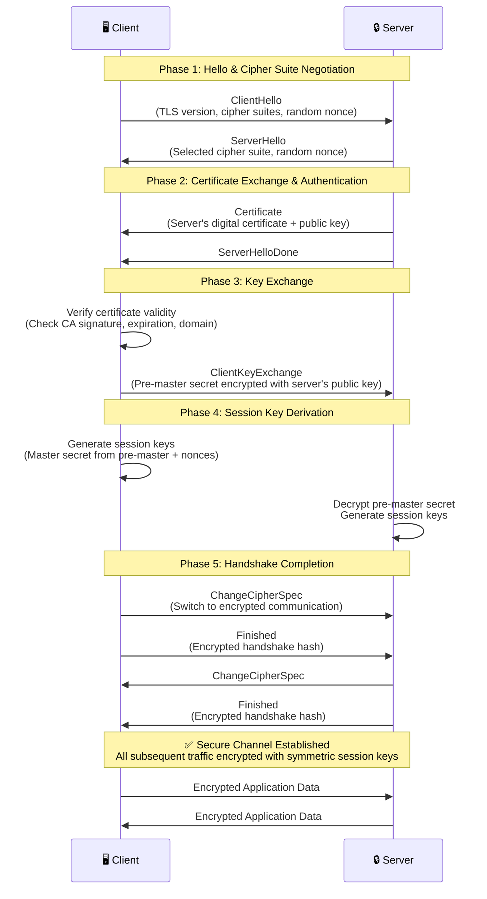

**Key Security Features:**
- **Perfect Forward Secrecy (PFS)**: Ephemeral Diffie-Hellman keys ensure past sessions remain secure even if private key is compromised
- **Certificate Validation**: Client verifies server identity through CA-signed certificate
- **Symmetric Encryption**: Session keys (AES) used for bulk data encryption after handshake
- **MITM Prevention**: Digital signatures and certificate chains establish trust

---

## BLOCK CIPHER MODES

1. **Cipher Block Chaining (CBC):** Applies an IV to the first plaintext block. The output of the first ciphertext block is combined with the next plaintext block using an **XOR** operation. This "chains" the blocks so no plaintext produces the same ciphertext. It requires padding.
2. **Counter Mode (CTM):** Makes AES work as a stream cipher. It applies an IV plus an incrementing counter value (**Nonce**) to the key to generate a keystream. The keystream is XOR'ed with the plaintext blocks. Blocks are processed in parallel (improving performance). No padding is required.

---

## AUTHENTICATED MODES OF OPERATION

Basic encryption modes are unauthenticated. While a MITM cannot decrypt them without the key, the ciphertext is vulnerable to having arbitrary data inserted (modified to break the scheme), known as a **Chosen Ciphertext Attack**.

* **Authenticated Encryption:** A **Message Authentication Code (MAC)** provides an authentication/integrity mechanism by hashing a combination of the message and a shared secret key.
* **AES-CBC with HMAC-SHA:** A cipher suite where AES handles symmetric encryption and SHA handles authentication. This is vulnerable to **Padding Oracle Attacks**.
* **Authenticated Encryption with Additional Data (AEAD):** Counter modes (like **AES-GCM** or **AES-CCM**) are preferred. The "associated data" allows the receiver to use the message header to ensure the payload hasn't been replayed.

---

## CRYPTOGRAPHIC USE CASES

* **AAA / PAM:** Cryptography forms the basis of identification, authentication, and access control.
* **Non-Repudiation:** Linked to ID and Auth. If a message is encrypted with a key known only to the sender (Private Key), the sender cannot deny sending it.
* **Confidentiality:** Fulfilled by bulk data encryption. Asymmetric ciphers cannot do this because of message size limits (e.g., RSA 2048-bit has a max message size of 245 bytes). Bulk data encryption uses symmetric ciphers like AES to encrypt files or network streams quickly.

---
The problem is that distributing a symmetric key securely is challenging; the more people who know the key value, the weaker the confidentiality property is. The risks of an adversary obtaining the shared secret key grow exponentially luckily, symmetric ciphers keys are only 128, 64, or 256 bits long, and so can easily be encrypted using an asymmetric cipher public key. Most cryptographic systems use both. Encryption supporting confidentiality is used for both:

* **DATA-AT-REST (FILE ENCRYPTION)**
* **DATA-IN-TRANSIT (TRANSPORT ENCRYPTION)** this uses either digital envelopes or perfect forward secrecy.

**CRYPTOGRAPHY SUPPORTING INTEGRITY & Resiliency:** Integrity is proved by Hashing Func/Algos which allow two parties to derive the same checksum and show that a msg/data has not been tampered. A basic hash function can also be used alongside a shared secret to create a **Message Auth Code (MAC)** which prevents MITM attackers tampering wt the checksum/Digest.

Cryptography can be used to design highly resilient control systems (ICS/SCADA). A system is resilient if compromise of a small unit of the system is prevented from allowing further compromise of the whole system. Ensuring Auth and integrity of messages delivered over the ctrl system is essential.

A developer can make tampering more difficult using **OBFUSCATION**  The art of making a message difficult to understand/read. However, obfuscation is a way to affect the confidentiality; it may or may not be effective. Obfuscation is very effective to obfuscate a msg, but less effective in the case of source code because it also means the code cannot be understood (executed) by the computer. At some point, the code must be decrypted to be executed. The key used for decryption usually needs to be bundled wt the source code and this means that you are relying on security by obscurity rather than a strong key. Attempts to protect an embedded key value while preserving functionality of the code is known as **WHITE BOX CRYPTOGRAPHY**.

---

### CRYPTOGRAPHIC PERFORMANCE LIMITATIONS

Performance factors are as follows:

* **SPEED** – For symm ciphers and hash func, speed is the amt of data per second that can be processed; for Asymm ciphers, speed is measured by operations per second. Speed has the most impact when large amounts of data are processed.
* **Time/Latency** – Time required to obtain a result is more important than a data rate.
* **SIZE** – the security of a cipher is strongly related to the size of the key with longer keys providing better security. Key size cannot be used to make comparisons between different algorithms. Larger keys will increase computational overhead for each operation, reducing speed and increasing delay/latency.
* **Computational Overhead** – In addition to key size, some ciphers require more CPU and memory resources than others and are less suited to use in a resource-constrained environment.

In selecting a product or individual cipher for a particular use case, a trade-off must be achieved between the demand for the best security and resources available for implementation.

* **Low Powered Devices** – Some ciphers config at longer key req more processing cycles and memory space. Some algo and key strengths are unsuitable for handheld devices or embedded systems.
* **Low Latency Uses** – This can impact protocol handshake setup times. A handshake that takes too long will cause delay for the user and could cause timeout issues wt some app.

---

### CRYPTOGRAPHIC SECURITY LIMITATIONS

* **ENTROPY & WEAK KEYS:** Entropy is a measure of disorder. A plaintext will usually exhibit low entropy as it represents a msg in a human language or programming language with a data schema/structure. The plaintext must be ordered for it to be intelligible to a person, computer processor or database. One goal of strong Ox Algo is to produce a disordered ciphertext with a high level of entropy. Because an algo is considered strong does not mean that the implementation may have weaknesses. Best practice in the type of PC code is apply updates constantly; if weakness is discovered, the implementation of the cipher in a programming library is replaced and data re-encrypted. Data re-encrypted under the weak version must be replaced.
* **WEAK KEY:** A weak key is one that produces ciphertext that has a lower entropy than it should be. If keyspace contain weak keys, the technology using the cipher should prevent the use of these keys.
1. Weak Number Generator leads to many published keys sharing a common factor. A cryptanalyst can test for the presence of these factors and derive the whole key much more easily and consequently. The **Number Generator (RNG) / Pseudo RNG (PRNG)** module in the Ox implementation is critical to its strength.


* **PREDICTABILITY & REUSE:** This is a weakness in either the cipher operation or within a particular keyspace. Values that make a ciphertext lower entropy is vulnerable to cryptanalysis. Reuse of the same key within the same session can cause this type of weakness. RC4 stream cipher and some chained block modes are not as secure as other cipher modes because they exhibit predictability. Often it is necessary to use an additional random or pseudo-random value in conjunction with the cipher.
* **NONCE:** The principal characteristics of a nonce is that it's **"Never Reused"** within the same scope (i.e., with the same key value). It could be random/pseudo-random value, or a counter value (++).
* **INITIALIZATION VECTOR (IV):** The principal characteristics of an IV is that it be random (or pseudo-random). There may also be requirements that an IV not be reused (as wt a nonce), but that is not its primary characteristic.
* **SALT:** This is a random or pseudo-random number or string. The term salt is used in conjunction with hashing password values.


---

### LONGEVITY & CRYPTOGRAPHIC ATTACKS

Longevity is a measure of the confidence that people have in a given cipher. Use of weak cipher suites and implementations can represent a critical vuln for an organization. Research weaknesses discovered in a particular cipher or implementation of a cipher under cryptanalysis conditions lead to a deprecation of that algorithm. This doesn't necessarily mean that the system is vulnerable immediately in practice. RC4 and DES/3DES are already deprecated. RSA is soon as approaching end of its longevity wt ECC and other algo offering better security and performance than it is. MD5 and SHA-1 have known weaknesses but are not necessarily unsecure if compatibility is an overriding concern. In another sense, longevity is the consideration of how long data must be kept secure. If you assume a ciphertext will be exposed at some point, how long must it resist cryptanalysis/hacking? There is always a tradeoff blu security, cost and interoperability.

Malicious mathematical attacks are difficult to launch, and the chances of success against up-to-date, proven tech and standards are remote. If a deprecated algo is in use, no need for panic, but there will be a need for a plan to closely monitor the affected systems to transition to better tech as quickly as is practical.

* **MITM / DOWNGRADE ATTACKS:** Some attacks depend on capturing the comms between two parties. They do not break the Ox system but exploit vuln in the way it is used. A MITM is typically focused on Public Key Encryption / Asymmetric. Such attacks are mitigated by using secure authentication of public keys, such as associating the keys with digital certificates by a trusted authority. A downgrade attack can be used to facilitate a MITM attack by requesting that the server use a lower specification protocol wt weak ciphers and keylengths. (e.g., rather than use TLS 1.3, as the server prefer, the client request the use of SSL). It then becomes more easier for Mallory to forge the signature of a certificate authority that Alice trusts to have access to his public key.
1. Mallory eavesdrops the channel comms betws Alice and Bob, waits for Alice to request Bob's public key.
2. Mallory intercepts the comm, returns Bob's public key and sends Alice his own public key.
3. If Alice uses Mallory's key to encrypt a message to send to Bob, Mallory intercepts the msg and decrypts wt his prv key.


---

### SALTING & KEY STRETCHING

Entropy is a concern whenever an Ox system makes use of user-generated data like passwords. Users tend to select low entropy passwords. A couple of technologies try to compensate for this.

* **SALTING:** Passwords stored as hashes are vulnerable to **BRUTE FORCE / DICTIONARY ATTACK**. Although they can't be decrypted (hash func are one way), an adversary can generate hashes to try to find a match for the password hash captured from network traffic or password file to find a match. A brute force attack simply runs through every possible combination of alphanumerical symbols/characters. A dictionary attack creates hashes of common words/phrases. This attack can be slowed down by adding a **SALT VALUE** when creating the hash  (Salt + Password)  Hash (checksum). The salt is not kept secret because any system verifying the hash must know the value of the salt. It simply means that an attacker cannot brute-force or use precomputed table of hashes. The hash value must be recomputed wt the specific salt value for each password.
* **KEY STRETCHING:** Takes a key that's generated from a user password plus a random salt value and repeatedly convert it to a longer and more random key. The initial key may be put thru thousands of rounds of hashing. Key stretching might not be difficult for the attacker to replicate so it doesn't actually make the key stronger but it slows the attack down as the attacker has to do all this extra processing for each possible key value. This can be performed by a software library to hash/save software and passwords when they are created. **PBKDF2** used in WPA2.

**BIRTHDAY ATTACK:** To protect against the birthday attack, encryption algos must demonstrate **Collision Avoidance**. A Birthday Attack is a type of Brute force attack aimed at exploiting collision in hash funcs. A collision is where a function produces the same hash value for two different plaintexts. This type of attack can be used for the purpose of forging a digital signature.

1. Attacker creates a malicious doc and a benign doc that produce the same hash value. The attacker submits the benign document for signing by the target.
2. The attacker adds the target's signature to the malicious document, forging the target's signature.

---

### OTHER CRYPTOGRAPHIC TECHNOLOGIES

Quantum refers to computers that use properties of quantum mechanics to significantly outperform classical computers in certain tasks.

1. **Computing:** A quantum computer performs processing on units called **Qubits**. A qubit can be set to 0 or 1 or an indeterminate state called a **Superposition** where it exists as 0 and 1 simultaneously. The likelihood is balanced 50/50 or can be weighted either way. The power comes from the fact that qubits can be **Entangled**. When the value of a qubit is read, it collapses to a defined state (0 or 1) and all other entangled qubits collapse at the same time (collapse to complementary states). The strength of the design is that a single operation can utilize huge numbers of state variables represented by qubits, while a classical computer's CPU must go thru Read, Execute, Write cycle for each bit of memory. This makes quantum well suited to solving certain tasks like **Factoring Problem** that underpins RSA and **Discrete Logarithm Problems** that underpin ECC.
2. **Communications:** The properties of entanglement, superposition and collapse suit the design of tamper-evident comm systems that would allow secure key agreement and exchange.
3. **Post-Quantum:** refers to the expected state of computing when quantum computers that can perform useful tasks are a reality. Currently physical properties of qubits like entanglement make quantum computers hard to scale up. NIST is running a project to develop Ox ciphers resistant to cracking even by quantum computer.

**CRYPTOGRAPHIC AGILITY** refers to an organization's ability to update the specific algorithms used across a range of security products without affecting the basic workflow that those products support.

**Lightweight Cryptography:** The use of current cryptographic ciphers on low-power devices is another problem. NIST is hoping that a compact cipher suite will be developed that is both quantum resistant and that can run on battery-powered devices at minimal CPU and memory resources.

**Homomorphic Encryption:** is principally used to share privacy-sensitive data sets. Organization/government/private data is responsible for keeping the data secure and respecting privacy rights of data subjects. Companies often want to use a third party to perform data analysis. Sharing unencrypted data in this scenario is a significant risk. Homomorphic encryption is a solution because it allows the third party to perform statistical calculations on fields within the data while keeping the dataset as a whole encrypted (e.g., sharing medical records wt an analytics company).

**BLOCKCHAIN:** Is a concept in which an expanding list of transactional records is secured using cryptography. Each record is referred to as a **Block** and is run through a hash func. The hash value of the previous block in the chain is added to the hash calculation of the next block in the chain, ensuring each successive block is cryptographically linked. Each block validates the hash of the previous block all the way to the beginning of the chain, ensuring each history has not been tampered with. The blockchain is recorded in a public decentralized ledger distributed across a peer-to-peer network in order to mitigate the risks associated wt having a single point of failure or compromise.

**STEGANOGRAPHY:** is a technique for obscuring the presence of a message/information (hidden writing). Typically information is hidden/embedded where you would not expect to find it (e.g., hidden in a picture or encode msgs in a TCP packet data). The container document/file is called the **COVERTENT**. A steganography tool is software that facilitates this or can be used to detect the presence of a hidden msg in a covertext. When used to conceal info, it amounts to "Security by Obscurity" usually deprecated. Methods might be used for Command and Control / to exfiltrate data covertly, bypassing protection mechanisms like DLP. The tech doesn't provide integrity, confidentiality or non-repudiation.

---

### PUBLIC KEY INFRASTRUCTURE (PKI)

Digital Certificates and PKI are critical services used to manage identification, authentication and data confidentiality across most private/public networks. A **Digital Certificate** is a public assertion of identity, validated by a **Certificate Authority (CA)**. Certificates can be issued for diff purposes (e.g., protecting web server comm). Public key Ox solves the problem of distributing encryption keys:

1. When you want others to send you confidential messages, you give them your public key to use to encrypt the msg. The msg can then only be decrypted by your **Private Key**.
2. When you want to authenticate yourself, you create a digital signature and sign it by encrypting the signature wt your private key. Others use your public key to decrypt the signature. Everyone can be assured only you created it.

The basic problem is that you may not really know wt whom you are communicating. The system is vulnerable to **MITM attacks**. The fact that a site is distributing public keys is no guarantee of actual identity. PKI aims to prove that the owners of public keys are who they say they are. Under PKI, anyone issuing public keys should obtain a digital certificate.

**The CERTIFICATE AUTHORITY (CA)** is the entity responsible for issuing and guaranteeing certificates. **Private CA** can be set up within an organization for internal comms (e.g., Windows Server Cert Services). For public or B2B, the CA must be trusted by each party. Examples: IdenTrust, DigiCert, Sectigo/Comodo, GoDaddy, GlobalSign.

**Functions of a CA:**

* Provide a range of certificate services useful to the community of users.
* Ensure the validity of certificates and the identity of those applying for them (Regulation).
* Establish trust in the CA by users, Govt, Regulatory authorities and Enterprises.
* Manage the servers (repositories) that store/administer the certificates.
* Perform key and certificate lifecycle management, notably revoking leaked certificates.

**PKI Trust Model:** Shows how users and different CAs are able to trust another. **SINGLE CA** is a simple model; a single CA issues cert to users; users trust cert issued.

---

### CERTIFICATE SIGNING REQUEST (CSR) & REGISTRATION AUTHORITIES (RAs)

Registration is the process by which end users create an account at the CA and become authorized to request certificates.

* **CSR:** For a subject to obtain a digital certificate, it completes a **Certificate Signing Request (CSR)** and submit it to the CA. The CSR is a Base64 ASCII file containing the info the subject wants to use in the certificate, including the public key. The CA reviews the certificate and checks info is valid. For a web server, this may mean verifying that the subject name and FQDN are identical and verifying the CSR was initiated by the person administratively responsible for the domain (identified in the domain's WHOIS records).
* **RAs:** The registration function may be delegated by the CA to one or more **Registration Authorities (RAs)**. These entities complete identity checking and submit CSRs on behalf of end users, but they do **NOT** sign/issue certs.

**DIGITAL CERTIFICATES:** wrapper for a subject's public key as well as information about the subject and issuer. Based on **X.509** standard (approved by ITU and standardized by IETF). The **PKIX** working group manages standards development. RSA created **PKCS (Public Key Cryptography Standards)** to promote PKI.

### Digital Certificate Attributes (X.509 v3)

| FIELD | USAGE |
| --- | --- |
| **SERIAL NUMBER** | A number uniquely identifying the certificate within the domain of its CA. |
| **SIGNATURE ALGORITHM** | The algorithm used by the CA to sign the certificate. |
| **ISSUER** | The name of the Certificate Authority. |
| **VALID FROM/TO** | Date and time during which the cert is valid. |
| **PUBLIC KEY** | Public key and algorithm used by the certificate holder. |
| **EXTENSIONS** | V3 cert can be defined with extended attributes like subject alt names, email, and intended key usage. |
| **SUBJECT** | The name of the certificate holder expressed as a Distinguished Name (DN). The **Common Name (CN)** part should usually match FQDN/UserEmail. |
| **SAN** | **Subject Alternative Name** extension field is the preferred mechanism to identify DNS name(s) by which a host is identified. |

When certificates were first introduced, the Common Name (CN) was used for FQDN. This usage grew by custom rather than design. The CN attribute can contain diff kinds of info, making it difficult for browser to interpret correctly; this became deprecated. The **SAN** extension field is structured to represent diff types of identifiers. If configured wt a SAN, the browser should validate that and ignore the CN value. It is still safer to put the FQDN as the common name as well because not all implementations stay up to date. The SAN field also allows a certificate to represent different subdomains; listing specific domains is more secure, but if a new subdomain is added, a new certificate must be issued. A **Wildcard** (*.domain.com) means the cert issued to the parent will be accepted as valid for all subdomains.

---

### CERTIFICATE TYPES

Certificate policies define the diff uses of certificate types. These can be configured as standard certificate templates.

* **KEY USAGE ATTRIBUTE:** complementary means of defining usage. Typical values: **Enhanced Key Usage (EKU)** (server auth, client auth, code signing, email protection). The EKU field is more flexible than Key Usage, but problems occur when non-standard definitions are used.
* **Critical Extension:** An extension can be flagged as critical, meaning the application processing the cert **must** be able to interpret it correctly, otherwise the cert should be rejected. (e.g., if Key Usage is marked critical, an app should reject it if it cannot resolve the value. This prevents a cert issued for encrypting web traffic from being used for signing email).

**Levels of Assurance:**

1. **Server Certificate:** Guarantees identity of a site where users submit confidential data. Problem: anyone can set up a PKI and self-sign. There have been cases of disreputable sites obtaining certificates from third party CAs that are automatically trusted by browsers.
2. **Domain Validation (DV):** proving ownership of a domain. Proved by responding to email or publishing a text record to DNS. This process can be highly vulnerable to compromise.
3. **Extended Validation (EV):** subjecting to a process that requires more rigorous checks on legal identity and control over the domain or software being signed. EV std maintained by CA/Browser Forum. **An EV certificate cannot be issued for a wildcard domain** (Highest level of assurance).

**Other Types:**

* **Machine (Computer) Certificates:** Issued to machine endpoints (servers, PC, smartphones) regardless of function. SAN and CN should be set to FQDN.
* **Email / User Certificates:** Used to sign/encrypt mail, typically using **S/MIME** or **PGP**. User's email address marked as SAN/CN. In a directory like Windows AD, there may be a wider range of user templates.
* **Code Signing Certs:** Issued to software publisher following identity check by CA. Publisher signs executables/DLLs to guarantee validity. The CN is issued to an organization name, not an FQDN.
* **Root Certificates:** identifies the CA itself. This cert is **self-signed**. Normally uses key of at least 2048 bits (many switching to 4096). The CN for a Root Cert is set to the Org/CA name rather than FQDN.
* **Self-Signed Cert:** Any machine/server can be deployed wt self-signed cert. These will be marked as untrusted by OS/Browser; only an admin can choose to trust or override.

---
## IMPLEMENT PKI MANAGEMENT

Key management refers to **Operational Considerations** for the various stages in a key's life cycle. It involves the following stages:

* **KEY GENERATION:** Creating secure key pairs of required strength and length, using the chosen cipher.
* **CERTIFICATE GENERATION:** To identify the public part of a key pair as belonging to a specific subject, the subject submits it for signing by the CA as a digital certificate with the appropriate key usage. At this point, it is critical to verify the identity of the subject requesting the cert and only issue it to authorized users/systems.
* **STORAGE:** The user must take steps to store the private key securely, ensuring that unauthorized access is prevented. It is also important to ensure that the private key is not lost or damaged. If a key used for encryption is accidentally destroyed, the data encrypted using that key will be inaccessible unless there is a **BACKUP**.
* **REVOCATION:** If a private key is compromised, the key pair can be revoked to prevent users from trusting the public key.
* **EXPIRATION & RENEWAL:** A key pair that has not been revoked expires after a certain period. Giving the key or cert a "shelf-life" increases security. Certs can be renewed with new key material.

Key Management can be **Centralized**, meaning that an admin or Authority controls the process, or **Decentralized**, in which each user is responsible for his or her keys. Certificate and Key Management represents a critical vulnerability if not managed properly. Keys such as the **private key of a ROOT CA** must be subject to the highest possible technical and procedural controls. If such a key were compromised, it would put the confidentiality and integrity of data processed by hundreds or thousands of systems at risk. Access to such critical encryption keys must be logged and audited, typically subject to **M-of-N control**, meaning:

* **M** (# of admins present for access to be granted) must be greater than 1.
* **N** (total admins permitted to access the system) must be greater than M.

Staff authorized to perform management must be carefully vetted, and due offboarding should be done if employees leave the organization. Another way to use M-of-N is to split a key between several storage devices, such as three USB drives, any two of which could be used to recreate the full key.

### PKI Certificate Lifecycle Diagram

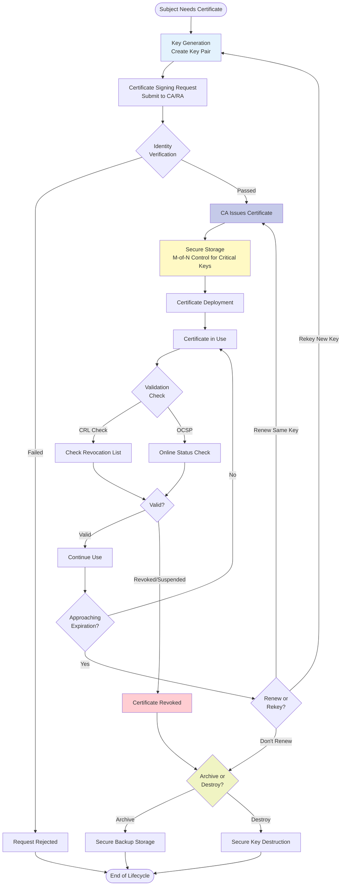

---

### Key Recovery & Escrow

* **Key Recovery:** A significant problem with key storage is that if you make multiple backups of a key, it is exponentially more difficult to ensure that the key is not compromised. However, a key not backed up represents a single point of failure. Key recovery defines a secure process for backing up keys and recovering data encrypted with a lost key. This process might use M-of-N control to prevent unauthorized access to (or use of) the archived keys.
* **Key ESCROW:** Means or refers to archiving a key (or set of keys) with a third party. This is useful for organizations without the capability of storing their keys securely themselves, but it invests a great deal of trust in the third party.

---

### Certificate Expiration

Certs are issued with a limited duration, as set by the CA policy for the cert type. **Root certs** might have long expiration dates (10+ years), whereas **leaf certs** might be used for only 1 year. Typically, a certificate is renewed before it expires.

* **KEY RENEWAL:** When renewing a cert, it is possible to use the existing key.
* **CERTIFICATE IS REKEYED:** Generating a new key. A new key might be generated if the old one was no longer considered long enough or if any compromise of the key was feared.

When a cert expires, there is the question of what to do with the key pair it represents. A key can be either **ARCHIVED** or **DESTROYED**. The latter offers more security but has the drawback that any data encrypted using that key will be unreadable. Whether a key is archived or destroyed depends on how the key is used. A key can be destroyed by overwriting the data, as merely deleting data is unsecure. A key stored on hardware can be destroyed by a specified erase procedure or by destroying the device.

---

### Certificate Revocation

A certificate may be revoked or suspended by the owner or CA for many reasons.

* **Revoked Certificate:** No longer valid and cannot be un-revoked or reinstated to use.
* **Suspended Certificate:** Can be re-enabled.

The reasons for revocation or suspension are codified as: Unspecified, Key Compromise, CA Compromise, Superseded, or Cessation of Operation. A suspended key is codified as **Certificate Hold**.

CAs must maintain a **CRL (Certificate Revocation List)** of all revoked or suspended certs, which can be distributed throughout the hierarchy. A CRL has the following attributes:

* **Publish Period:** The date and time on which the CRL is published. Most CAs are set up to publish CRLs automatically.
* **Validity Period:** The period during which the CA is considered authoritative (usually a bit longer than the publish period).
* **Distribution Points:** The locations in the hierarchy to which the CRL is published.
* **SIGNATURE:** The CRL is signed by the CA to verify its authenticity.

With the CRL system, there is a risk that a cert might be revoked but still accepted by clients because an up-to-date CRL has not been published. Legacy browsers may also fail to perform CRL checking.

---

### OCSP & OCSP Stapling

Another means of providing up-to-date info is to check the cert status via the **Online Certificate Status Protocol (OCSP)**. A client sends a query to an OCSP server (referred to as an **OCSP Responder**), which returns the status of the requested certificate.

* **OCSP Responder:** Details should be published in the cert's distribution points. Responders can query the certificate database directly for real-time status, though some still depend on CRLs.
* **Limitations:** OCSP is resource-intensive for the CA and introduces privacy issues, as the responder could monitor client browser requests.
* **OCSP STAPLING:** Resolves these issues by having the site's web server periodically obtain a time-stamped OCSP response from the CA. When a client submits an OCSP request, the web server returns this stapled response instead of making the client contact the responder directly.

---

### Certificate Pinning

When certs are used by a transport protocol, there is a possibility that the chain of trust (client, server, intermediate/root CAs) can be compromised. If an adversary can substitute a malicious but "trusted" cert into the chain via a proxy or MITM attack, they could snoop on the connection.

**PINNING** refers to techniques to ensure that when a client inspects the cert presented by a server or signed application, it is inspecting the *proper* cert.

* This might be achieved by embedding the cert data in the application code.
* **HPKP (HTTP Public Key Pinning):** Submitting one or more public keys in an HTTP header. **HPKP has serious vulnerabilities and has been deprecated.**
* **Certificate Transparency (CT):** The replacement framework for pinning.

---

### Certificate Formats

Various file formats exist for encoding a certificate for exchange between different operating systems.

**ENCODING:** * **DER/CER:** Binary encoding using Distinguished Encoding Rules.

* **PEM:** Binary data represented as ASCII text characters using Base64 Privacy Enhanced Electronic Mail encoding. These have descriptive headers like `-----BEGIN CERTIFICATE-----`.

**File Extensions & Contents:**

* **DER/PEM:** Can both be used as extensions. PEM is widely used for ASCII files in Linux (not natively recognized by Windows).
* **.CRT / .CER:** Common extensions, but they are not well standardized. In Linux, `.crt` is likely ASCII. In Windows, `.cer` is most common but doesn't tell you if it is binary or ASCII.
* **PKCS #12 (.PFX / .P12):** Allows the export of the **Private Key** along with the certificate. Used for transfers or backup archives. Usually password protected and always binary. Windows uses `.pfx`; Mac/iOS use `.p12`.
* **P7B:** Implements **PKCS #7**, used to bind multiple certs in the same file (usually ASCII). Often used to deliver a chain of certificates. These do **not** contain the private key. Associated with S/MIME.

In Windows, infrastructure is managed via **Active Directory Certificate Services**. Linux typically uses the **OpenSSL** suite.

> **Example OpenSSL syntax to export Linux key/cert to Windows:** `openssl pkcs12 -export -inkey file.key -in file.pem -out file.pfx`

---

### Troubleshooting Certificate Issues

* **Expired/Revoked:** Check if a previously working cert has reached its end of life or been pulled.
* **Key Usage:** For a new cert, ensure settings are appropriate for the application (e.g., server auth vs. client auth).
* **FQDN:** Check that the subject name is correctly configured and that the client is using the correct address.
* **Chain of Trust:** Ensure root and intermediate CA certs are installed on the client before a leaf cert can be trusted.
* **Time/Date Synchronization:** Incorrect settings on the server or client are a common cause of certificate problems.
* **Auditing:** Periodically review logs of issued certs, validate permissions of users assigned to manage services, and ensure clients are checking for revocation.

---

## AUTHENTICATION DESIGN CONCEPTS

Strong authentication is the first line of defense. An **Access Control** system is a set of technical controls that govern how subjects interact with objects. **Identity & Access Management (IAM)** is described by four major processes:

1. **IDENTIFICATION:** Creating an account/user ID that uniquely represents the user, device, or process.
2. **AUTHENTICATION:** Proving that a subject "is what it claims to be" when attempting to access resources.
3. **AUTHORIZATION:** Determining what rights subjects should have and enforcing them.
4. **ACCOUNTING:** Tracking authorized usage or alerting when unauthorized access is detected.

Servers and protocols implementing these are referred to as **AAA Servers** (Authentication, Authorization, and Accounting).

### IAM Process Flow Diagram

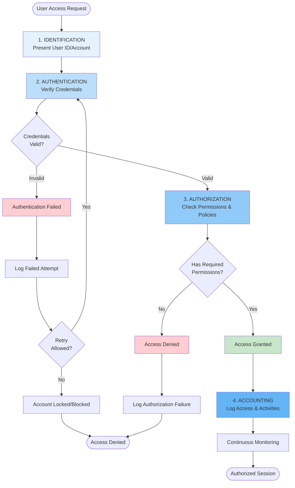

### Authentication Factors

Authentication verifies that only the account holder can use the account. It is performed when the holder supplies **Credentials** (Authenticators).

* **Something You KNOW:** (Knowledge Factor) Password, passphrase, PIN, or swipe pattern. Note: Short PINs are vulnerable to brute force.
* **Something You HAVE:** (Ownership Factor) Hard tokens, smart cards, or OTP devices.
* **Something You ARE / DO:** (Biometric Factor) Physiological or behavioral identifiers.

### Authentication Attributes

An attribute is a non-unique property or a factor that cannot be used independently:

* **Somewhere You ARE:** Location-based (Geolocation via GPS or IP address). Used as a contextual mechanism.
* **Something You CAN DO:** Behavioral characteristics (typing rhythm, etc.). Can be used for continual authentication.
* **Something You EXHIBIT:** Personal traits or anomalous user patterns (used to lock a device if behavior changes).
* **Someone You KNOW:** Web of Trust model where users are vouched for by existing users.

---

## IMPLEMENT KNOWLEDGE-BASED AUTHENTICATION

Relies primarily on password-based mechanisms. It uses cryptographic hashes; the password/PIN is stored as an Ox hash. When a user enters a password, an authenticator converts it into a hash and submits it to an Authority for comparison.

**Windows Sign-in Scenarios:**

1. **Windows Local Sign-in:** The **Local Security Authority (LSA)** compares the submitted credential to a hash stored in the **SAM (Security Account Manager)** database (part of the Registry). Referred to as **Interactive Log-on**.
2. **Windows Network Sign-in:** The LSA passes credentials to a network service like **Kerberos** or **NTLM** (legacy).
3. **Remote Sign-in:** Auth takes place over a VPN or Web portal.

**Linux Authentication:**
Local names are stored in `/etc/passwd`. When logging into an interactive shell, the password is checked against a hash in `/etc/shadow`. Network login is typically via **SSH**. The **PAM (Pluggable Authentication Module)** package allows for different providers (like smart cards).

**SSO (Single Sign-On):**
Allows the user to authenticate once to a local device and be authorized to compatible application servers without re-entering credentials. In Windows, SSO is provided by **KERBEROS**.

---

## KERBEROS AUTHENTICATION

Kerberos is a **Single-Sign-On (SSO)** network authentication and authorization protocol used on many networks, notably implemented by **Microsoft Active Directory (AD)**. It consists of three parts: the **Client**, the **Application Server**, and an intermediary known as the **Key Distribution Center (KDC)**.

The KDC acts as a trusted third party that vouches for the identity of both the user and the server. It runs on **Port 88 (UDP/TCP)**.

### The Key Distribution Center (KDC)

The KDC is composed of two primary services:

1. **Authentication Service (AS):** Handles the initial login request and verifies the user.
2. **Ticket Granting Service (TGS):** Issues specific service tickets for application servers.

---

### Phase 1: Authentication and Ticket Granting Ticket (TGT)

The process begins when a user logs into a client machine.

* **User to Authentication Server (AS):** The client sends a request for a **Ticket Granting Ticket (TGT)**. This request includes the user ID and a timestamp encrypted using the **hash of the user's password** as a key.
* **AS to User:** The AS verifies the user's identity by decrypting the request. It responds with:
* **The TGT:** A logical token containing client info (name, IP), a timestamp, and a validity period. This is **encrypted with the KDC's secret key** (so the client cannot interfere with it).
* **A TGS Session Key:** Used for future communication between the client and the TGS. This is **encrypted with the hash of the user's password** so only the user can decrypt it.

> **Note:** The TGT confirms who you are but does not provide access to specific resources yet.

---

### Phase 2: Requesting a Service Ticket

Once the client has a TGT, they can request access to specific applications (like a file server or database).

* **User to Ticket Granting Service (TGS):** The user sends a request for a **Service Ticket**. The message includes:
* A copy of the **TGT** (still encrypted by the KDC key).
* The name of the target **Application Server**.
* An **Authenticator** (timestamped client ID) encrypted using the **TGS Session Key**.


* **TGS to User:** The TGS decrypts the TGT and the Authenticator. It checks if the ticket is valid, not expired, and has not been used before (to mitigate **Replay Attacks**). It responds with:
* **A Service Session Key:** Encrypted with the TGS Session Key.
* **The Service Ticket (ST):** Contains user info, SIDs (Security Identifiers), and group memberships. This is **encrypted with the Application Server's Secret Key**.

---

### Phase 3: Accessing the Application

* **User to Application Server:** The client forwards the **Service Ticket (ST)** to the App Server along with a new **Authenticator** encrypted using the **Service Session Key**.
* **Mutual Authentication:** The App Server decrypts the Service Ticket using its own secret key to obtain the Service Session Key. It then decrypts the Authenticator.
* **Service to User:** Optionally, the App Server responds to the client with the timestamp from the Authenticator, encrypted with the Service Session Key. The client decrypts it, verifies it matches, and concludes the server is trustworthy. This completes **Mutual Authentication**.

---

### Kerberos Flow Diagram

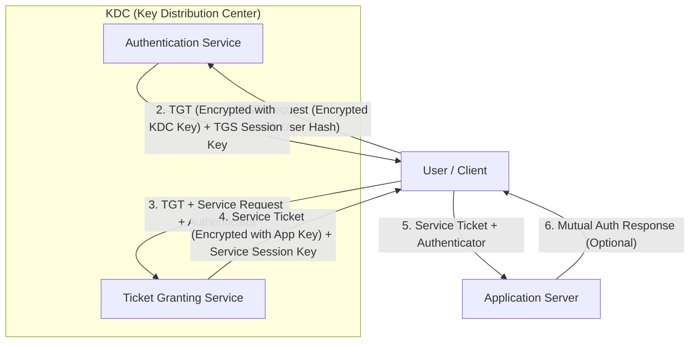

---

### How Kerberos Works: Key Points

* **Drawbacks:** The KDC represents a **Single Point of Failure**. In practice, backup KDCs are used (Active Directory supports multiple domain controllers).
* **Trusted Network:** Kerberos is designed for use over a trusted local network. The data transfer itself is not encrypted unless a separate layer of transport encryption (like TLS) is used.
* **Verification:** Only the KDC verifies user credentials (passwords). The Application Server never sees the user's password.
* **Authorization:** The TGS sends the user's account details (SIDs) to the target application. The application then uses these SIDs to determine **Authorization** (permissions on objects), while the **Authentication** was handled by the AS.

---

## PAP, CHAP, and MS-CHAP Authentication

**Remote Access**
Where the connection is made over a serial link / VPN, several authentication protocols have been developed to work.

### Password Authentication Protocol (PAP)

**PAP** is an unsophisticated authentication method developed as part of the **Point-to-Point Protocol (PPP)**, used to transfer **TCP/IP** data over serial or dial-up connections. It relies on **cleartext** password exchange and is therefore obsolete for most purposes, except through an encrypted tunnel.

---

### Challenge Handshake Authentication Protocol (CHAP)

Developed as part of **PPP** as a means of authenticating users over a remote link, **CHAP** relies on an encrypted challenge to a system using a **three-way handshake**:

1. **Challenge**: The server challenges the client, sending a randomly generated challenge message.
2. **Response**: The client responds with a hash code from the server challenge and the client password (or shared secret).
3. **Verification**: The server performs its own hash using the password hash stored for the client.

The handshake is repeated and a challenge message is sent periodically during the connection (transparent to the user). This guards against **replay attacks**, in which a previous session could be captured and used to gain access.

### CHAP 3-Way Handshake Diagram

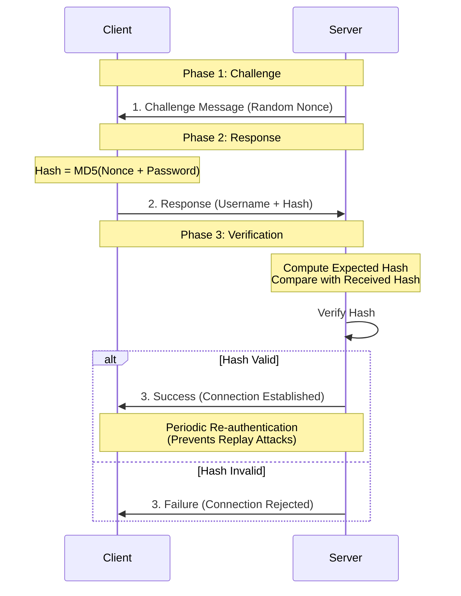

### MS-CHAP v2

As a Microsoft implementation of **CHAP**, it however uses vulnerable **NTLM** hashes. **MS-CHAP** should not be deployed without the protection of a secure connection tunnel so that credentials passed are encrypted.

---

### **Authentication Protocols & Attacks**

* **MS-CHAP v2 Password Vulnerability**: MS-CHAP uses vulnerable NTLM hashes; MS-CHAP should not be deployed without the protection of a secure connection tunnel so that (RED) [Credentials] passed are encrypted.
* **Protocol Vulnerabilities**: These protocols should not be used: **FTP**, **TELNET**, **HTTP**. They transfer passwords in plain text.
* **Online Attack Indicators**: This attack can show up in audit logs as repeatedly failed logons followed by a successful logon, or successful login attempts at unusual times / locations.
* **Mitigation Risks**: Restricting logons can be turned into a vulnerability as it exposes the account to **DoS**, if the attacker keeps trying to Auth, locking valid users.
* **Legacy Storage Vulnerabilities**: Some password attacks exploit vulnerabilities in the storage mechanism, i.e., Windows **SAM DB** stores hashes for legacy **LM** & **NTLM v1** Hashes.
* **Rainbow Table Mechanism**: Not all possible hash values are stored, as this would require too much memory. Values are computed in chains. If only the last and first values are stored, the hash value of a stored password can then be looked up in the table and the corresponding plaintext discovered.


## Password Attacks

* **Plaintext / Unencrypted Attacks**: The attack exploits password storage or a network authentication protocol that does not use encryption and transfers passwords in plaintext (e.g., **FTP**, **HTTP**, **TELNET**). These protocols should not be used.
* **Password Spraying**: This is a horizontal brute force online attack. This means that the attacker chooses one or more common passwords and tries them in conjunction with multiple usernames.
* **Online Attack**: Such password attacks involve the threat actor interacting directly with the authentication service. The attacker submits password attempts using an automated database or a list of passwords that have been leaked or cracked offline. This attack can show up in audit logs as repeatedly failed logons followed by a successful login, or successful login attempts at unusual times or locations. Online password attacks can be mitigated by **restricting the rate of logon attempts** and by chaining logon attempts from **known-good IP addresses**.
> **Note**: Restricting logons can be turned into a vulnerability as it exposes the account to **DoS** (Denial of Service) if the attacker keeps trying to authenticate, locking valid users.


* **Offline Attacks**: This means that the attacker has managed to obtain a database of password hashes. Once the password database has been obtained, the cracker does not interact with the authentication service system. Also, password crackers can exploit weaknesses in a protocol (**CHAP** / **MS-CHAP**) to calculate the hash and match it to a dictionary word or brute force it. Some password attacks exploit the weak passwords chosen by users; others can exploit vulnerabilities in the storage mechanism, e.g., Windows **SAM** database stores hashes for legacy **LM** and **NTLM v2** hashes.
* **Brute Force Attack**: Attempts every possible combination in the output space `([a-z], [A-Z], [0-9], [#!?$_-])` in order to match a captured hash and guess at the plaintext that generated it. The larger the output space and the more characters that were used in the plaintext password, the more difficult it is to compute and test each possible hash to find a match. Brute force attacks are heavily constrained by time and computing resources and are therefore most effective at cracking short passwords. However, brute force attacks distributed across multiple hardware can be successful at cracking longer passwords.
* **Dictionary and Rainbow Table Attack**: A **Dictionary Attack** can be used where there is a good chance of guessing the likely value of the plaintext, i.e., a non-complex password. The software generates hash values from a dictionary of "plaintexts" to try to match one to a captured hash. **Rainbow Table** attacks refine the dictionary approach.
* **Rainbow Table**: The attacker uses a precomputed lookup table of all possible passwords and their matching hashes. Not all possible hash values are stored, as this would require too much memory. Values are computed in chains. If only the last five hashes and values are stored, the hash value of a stored password can then be looked up in the table and the corresponding plaintext discovered.
> **Note**: Using a **salt** to add a random value to the stored plaintext helps to slow down Rainbow Table attacks because the table cannot be created in advance and must be recreated for each combination of password and salt value.


* **Hybrid Attack**: Uses a combination of dictionary and brute force attacks, primarily targeted against passwords with adequate complexity. The password cracking algorithm tests dictionary words and names in combination with a mask that limits the number of variations to test (e.g., adding numeric prefixes/suffixes or substituting letters).

---

## Password Crackers

* **Windows OS**: L0phtCrack, Cain & Abel
* **Linux OS**: **Hashcat**, **John the Ripper**
* **Hashcat syntax**: `-m [Hash Type] -a [Attack Mode] -o [OutputFile] [InputHashFile]`
* **Attack Modes**:
* `-a 0`: Dictionary Mode
* `-a 1`: Combo Mode (contains hashes of the same type/format)
* `-a 3`: Brute Force Mode

---

## Authentication Management

The solution for passwords mitigates the risk of poor credential practices by using a device/service as a proxy for credential storage (**Vault**, **Cloud Keychain**). The manager generates a unique strong password for each web-based account; the user authorizes the manager to authenticate with each site using a master password. A password manager can be implemented with a hardware token or as a software app.

* **Password Key**: USB tokens for connecting to PCs and smartphones. Some can use **Near-Field Communications (NFC)** or Bluetooth.
* **Password Vault**: Software-based password manager, typically using a cloud service to allow access from any device. A USB key is also likely to use a vault for backup. Most OSs and browsers implement native password vaults.

Authentication management products can be certified under the **Federal Information Processing Standard (FIPS)**. This provides assurance that the implementation meets a certain level of robustness. **FIPS 140-2** scheme provides accreditation for cryptographically strong products.

---

## Smart Card Authentication

This means programming identity information onto a card equipped with a secure processing chip. The chip stores the user's digital certificate, the private key associated with the certificate, and a **PIN** (Personal Identification Number) used to activate the card. For **Kerberos** authentication, smart card logon works as follows:

1. The user presents the card to a reader and is prompted for a PIN.
2. Inputting the correct PIN authorizes the smart card cryptoprocessor to use its private key to create a **TGT** (Ticket Granting Ticket) request which is transmitted to the **Authentication Server (AS)**.
3. The AS is able to decrypt the request because it has a matching public key and trusts the user's certificate, either because it was issued by a local **Certification Authority (CA)** or a third-party CA that is a trusted **Root CA**.
4. The AS responds with the TGT and a session key; further Kerberos processes take place.

### Key Management Devices

When **PKI** (Public Key Infrastructure) is used for smart card authentication, the security of the private key is critical. Only the user should ever be in ownership of the private key. If compromised (by a rogue admin or attacker), they can impersonate the subject. Various technologies can be used to avoid the need for an admin to generate a key pair and transmit it to the user:

* **Smart Card**: Some cards are powerful enough to generate key pair material using the cryptoprocessor embedded in their chip.
* **USB Key**: A cryptoprocessor can also be implemented in the USB form factor.
* **Trusted Platform Module (TPM)**: A secure cryptoprocessor enclave implemented on devices, network appliances, and servers. The **TPM** is usually a module within the CPU. Modification of **TPM** data is only permitted by highly trusted processes.
* **Hardware Security Module (HSM)**: Often keys need to be provisioned to non-user devices too. An **HSM** is a network appliance designed to perform centralized **PKI** management for a network of devices. This means that it can act as an archive/escrow for keys in case of loss or damage. **HSM** can be implemented in several form factors, including rack-mounted appliances, plug-in **PCIe** adapter cards, and USB-connected peripherals. Compared to using a general-purpose server for certificate services, **HSMs** are better optimized for the role and have a smaller attack surface. They are designed to be **tamper-evident** to mitigate the risk of insider threats and have **CSPRNG** (Cryptographically Secure Pseudo-Random Number Generators).

---

## Extensible Authentication Protocol (EAP) / IEEE 802.1X

Authentication may also be required in other contexts:

* When a user is accessing a wireless network and needs to authenticate with the network database.
* When a user is connecting to the network over a public network via a **VPN Remote Sign-In**.
* When a device is connected to a network via a switch and network policies require the user to authenticate before the device is allowed access.

In these scenarios, **EAP** provides a framework for deploying multiple types of authentication protocols and technologies. **EAP** allows lots of different authentication methods, but many of them use a digital certificate on the server and/or client machines. This allows the machines to establish a trust relationship and create a secure tunnel to transmit the user credentials.

Where **EAP** provides the authentication mechanisms, the **IEEE 802.1X** port-based **Network Access Control (NAC)** protocol provides the means of using an **EAP** method when a device connects to an Ethernet switch port or wireless AP.

* **Supplicant**: Device requesting access.
* **Network Access Server (NAS) / Authenticator**: Switches, access ports, VPN gateways (acts as a RADIUS client).
* **AAA Server**: The server providing Authentication, Authorization, and Accounting.

### RADIUS

**Remote Authentication Dial-In User Service (RADIUS)** is published as an Internet standard **AAA** server. With **EAP/AAA**, the **NAS** devices (RADIUS clients) do not have to store any authentication credentials. They forward **EAP over LAN (EAPOL)** data between the supplicant and the **AAA** server. The **NAS** device is configured with the IP address of the RADIUS server and a **shared secret**. This allows the RADIUS clients to authenticate to the server. **RADIUS** supports **PAP**, **CHAP**, and **EAP** (secure). The supplicant credentials are submitted as **EAPOL** data. The **NAS** device sends access requests to the **AAA** server using **UDP port 1812** (by default) and the **NAS** can use the **RADIUS** server for accounting using **UDP port 1813**.

### TACACS+

**Terminal Access Controller Access-Control System (TACACS+)** is typically used for network appliance administration roles, as it was developed by Cisco specifically for this purpose. It allows network admins to be allocated specific privileges on each switch, router, AP, or firewall. **RADIUS** can also be used for this but is primarily for **NAC**.

* **TACACS+** uses **TCP** communications (over **port 49**), which is more reliable; connection-oriented delivery makes it easy to detect if a server is down.
* All the data in **TACACS+** packets is encrypted (except for the header identifying the packet as TACACS+ data), rather than just the authentication data. This ensures **confidentiality** and **integrity** when transmitting critical network data.
* **TACACS+** supports **AAA** functions discretely and workflows better than **RADIUS** for per-command authorization and privileges for users, groups, and roles, and device management tasks that require re-authentication.

---

## Token Keys and Static Codes

This type of ownership-based authentication technology uses various hardware/software tokens, which avoid some of the **PKI** management issues of using the digital certificates required by smart card authentication.

### One-Time Password (OTP)

An **OTP** is generated automatically; because it is not chosen by the user, it is not vulnerable to password guessing or packet sniffing attacks. An **OTP** is an **HMAC** (Hash-based Message Authentication Code) of a secret value plus a synchronization value (the timestamp or counter).

* An **OTP** key is generated using some sort of seed.
* **SecurID** tokens from RSA generate a passcode based on the current time and a secret key coded into the device. The code is entered sequel to a password/passphrase known only to the user. Network access servers must be configured with an agent to intercept the credentials and direct them to an authentication manager server for validation.
* **Simple Token Keys and Smart Cards**: Building entry systems simply transmit a static token ID encoded into the device. These mechanisms (static codes) are highly vulnerable to cloning and replay attacks.
* **Hardware Token Key for FIDO (Fast Identity Online)**: Universal Second Factor (**U2F**) USB tokens register a public key with the web service, which requires the private key locked to the token and authorized for use by a **PIN**, password, or fingerprint activation (e.g., Windows Hello).

### 2-Step Verification (Out-of-Band)

These mechanisms generate a token on a server and send it to a resource assumed to be safely controlled by a user. The token can be transmitted to the device in the following ways:

* **Email Message**
* **Short Message Service (SMS)**
* **Phone Call**
* **Push Notifications**

These mechanisms are sometimes also described as **2-Factor Authentication (2FA)**. However, anyone intercepting the code within the time frame could enter it; it is "something you know" without necessarily possessing the device itself.

---

## Open Authentication (OATH)

The Initiative for **Open Authentication (OATH)** is an industry body established with the aim of developing an open, strong authentication framework. "Open" means a system that can be integrated into any organization and can bridge to perform inter-operations to allow users across different networks. "Strong" means the system is based not just on passwords, but also on **2FA** or 2-step verification. **OATH** describes two algorithms for **OTP**:

1. **HMAC-based OTP Algorithm (HOTP)**: An algorithm for token-based authentication. The authentication server and client token are configured with a secret shared secret (6-8 digit value) generated by a key generator (hardware fob or smartphone app). The shared secret is combined with a **counter** to create a one-time password when the user wants to authenticate. The device and server both compute the hash and derive an **HOTP** value. The counter is then incremented. The server is configured with a **counter window** to cope with circumstances where the device and server counters are out of sync.
2. **Time-based OTP Algorithm (TOTP)**: A refinement of **HOTP**. One issue with **HOTP** is that tokens can be allowed to persist unexpired, raising the risk that an adversary might obtain one and decrypt data in the future. In **TOTP**, the **HMAC** is built from the shared secret plus a value derived from the device's and server's local timestamps. **TOTP** auto-expires each token after a short window (e.g., 30–60 seconds). For this to work, the client device and server must be closely time-synchronized. **Google Authenticator** is a well-known implementation.

---

## Biometric and Behavioral Technology

These may be used for purposes other than logon authentication:

* **Biometric Identification**: Refers to matching people to a database, as opposed to authenticating them (e.g., facial recognition in a crowd).
* **Continuous Authentication**: Verifies that a user who logged on is still operating the device. This sort of technology is not readily available on the market at the time of writing but is the subject of numerous research projects.

### Biometric Authentication

**Enrollment** is the first step in setting up biometric authentication. The subject's biometric information is scanned by a biometric reader and converted to binary information.

1. A sensor module acquires the biometric sample from the subject.
2. A feature extraction module records the features in the sample that uniquely identify the subject.

Key metrics used to evaluate the efficacy rate of biometric pattern acquisition and matching suitability:

* **False Rejection Rate (FRR)** / **Type I Error**: Where a legitimate user is not recognized. FRR leads to user inconvenience.
* **False Acceptance Rate (FAR)** / **Type II Error**: Where an impostor is accepted. FAR leads to security breaches.
* **Crossover Error Rate (CER)**: The point at which **FAR** and **FRR** meet. The lower the **CER**, the more efficient and reliable the technology. Errors are reduced over time by tuning the system (adjusting sensitivity).

**Other Considerations**:

* **Throughput / Speed**: The time required to create a template for each user and time required to authenticate. This is a major consideration for high-traffic access points like airports.
* **Failure to Enroll Rate (FER)**: Incidents in which a template cannot be created or matched for a user during enrollment.
* **Cost / Implementation**
* **Privacy**: Users can feel it is intrusive.

### Physiological Biometrics ("Something You Are")

* **Fingerprint Recognition**: The most widely implemented biometric authentication method. Relatively inexpensive and straightforward. A fingerprint sensor is usually implemented as a small capacitive cell that detects the unique pattern of ridges. **Note**: Dirt or oil may prevent readings. A main problem is the possibility of obtaining a copy of a user's fingerprint to create a mold to fool the scanner.
* **Vascular Biometrics (Veon Matching)**: More complex; uses an infrared light and sensor/camera to create a template from unique blood vessel patterns.
* **Facial Recognition**: Records multiple indicators about the size and shape of the face (e.g., distance between eyes, width and length of nose). It must be recorded under optimal lighting conditions. It suffers from relatively high **FAR** and **FRR** and can be vulnerable to spoofing.
* **Retina Scan**: An infrared light is shone into the eye to identify the pattern of retinal blood vessels. This arrangement is highly complex and does not change from birth to death (except in cases of certain diseases like cataracts or injuries). Considered one of the most accurate forms of biometrics but is expensive, complex, and highly intrusive.
* **Iris Scan**: Matches patterns on the surface of the eye using near-infrared imaging. Less intrusive than a retina scan, offers a similar level of accuracy, and is less likely to be affected by disease. This tech is likely to be rolled out in high-volume applications like airports. There is a chance an iris scanner could be fooled by a high-resolution photo.

### Behavioral Biometrics ("Something You Do")

* **Voice Recognition**: Obtaining a template can be difficult; background noise can interfere. Subject to impersonation.
* **Gait Analysis**: Produces a template from human movement (locomotion).
* **Signature Recognition**: Easy to duplicate, but more difficult to fake the actual signing process. It records the user's stroke, speed, and pressure using a stylus or gyroscope.
* **Typing / Keystroke Dynamics**: Matches the speed and pattern of a user's input of a passphrase.

---

## Identity and Access Management (IAM)

The principle of **Least Privilege** is at the heart of most organizational security policies. **Privileged Access Management (PAM)** must account for the actions of both regular and administrative users. These systems are complicated by the presence of default, shared, guest, and device account types. On a private network, a digital identity can be represented by an **Account**. On public networks, the identity may also be identified by cryptographic material.

* **PKI**: Allows the management of digital certificates, where a **CA** issues certificates to validated subjects (users and servers). The subject identity can be trusted by any third party that also trusts the **CA**. The certificate contains the subject's **public key** and is signed by the **CA's private key**. These public keys allow third parties to verify the certificate's signature.
* **Tokens**: For a **Single Sign-On (SSO)** system, the user authenticates to an **Identity Provider (IdP)** and receives a token (like a **Kerberos TGT**). The user can present that token to compatible applications as proof they are authenticated and receive authorization. There is a risk of **replay attacks**; application protocols must be designed to resist this (e.g., using a short lifetime for the token and synchronized timestamps).
* **Federated Identity Management**: Modern networks use third-party cloud services. Various protocols and frameworks are available to implement federated identity across web-based services. This means a user can create a digital identity at one provider, but other sites can use that identity to authorize use of an application or service.

---

## Personnel Policies

**IAM** involves both IT/Security procedures and Human Resources (**HR**) policies.

1. **Recruitment (Hiring)**: Security issues include screening candidates and performing **background checks**. This determines that a person is who they say they are and is not concealing criminal activity, bankruptcy, or connections that would make them unsuitable or risky.
2. **Operation (Working)**: HR manages the communication of policy and training employees on the importance of security.
3. **Termination or Separation (Firing/Retiring)**: Security implications regarding whether employees leave gracefully or are terminated.

### Onboarding

At the HR level, the process of welcoming new employees to the organization. As part of this process, the IT and HR functions combine to create an account for the user, assign appropriate privileges, and ensure account credentials are known only to the valid user. These functions must be integrated to avoid creating accidental configuration vulnerabilities (**Shadow IT**).

* **Processes**: Secure transmission of credentials, asset allocation, and training on security policies.
* **NDA (Non-Disclosure Agreement)**: Might be incorporated within the employee contract; signing it asserts that they will not share or divulge confidential information with a third party.

### Least Privilege

Means that a user is granted sufficient rights to perform his/her job and no more.

* **Privilege Creep**: Refers to a situation where a user acquires more and more rights—either directly or by being added to security groups and roles—the longer they remain in the organization.
* **Mitigation**: Least privilege should be ensured by closely analyzing business workflows to assess what privileges are required and by performing regular **account audits**.

### Separation of Duties

A means of establishing checks and balances against the possibility that critical systems or procedures can be compromised by an **insider threat**. Duties and responsibilities should be divided among individuals to prevent ethical conflicts of interest or abuse of power.

* **Standard Operating Procedures (SOPs)**: The employee has no excuse for not following protocol when performing duties.
* **Shared Authority**: No one user is able to authorize changes. Decision-making responsibilities are distributed; multiple (at least two) stakeholders must authorize changes (similar to **M-of-N Control**).
* **Conflict of Interest**: Arises when someone can act in his or her own interest personally, or in the interests of a third party. Separation of duties does not completely eliminate risks because there is still a chance of **collusion** between two or more people.

### Other Personnel Controls

* **Job Rotation**: Rotation of duties so that no one person is permitted to remain in the same job for an extended period. This helps prevent abuse of power, reduces boredom, and enhances professional skillsets.
* **Mandatory Vacations**: Employees are forced to take their vacation time, during which someone else fulfills their duties. During that time, the corporate audit can investigate and discover discrepancies in activity.

### Offboarding

The process of ensuring that an employee leaves an organization gracefully. This is also used when a project using contractors or third parties ends.

* **Account Management**: Disable user accounts and privileges.
* **Retrieval of Company Assets**: Laptops, mobile devices, etc.
* **Information/Data**: Assets created or managed by the employee but owned by the company must remain accessible (e.g., encryption keys or password-protected files).
* **Sanitization**: Wiping of personal assets off corporate devices/apps.

---

## Security Account Types

Operating systems, network appliances, and directory products use several account types as the basis of a privilege management system:

* **Standard User**: Limited privileges, typically to run programs and to create/modify files belonging to their own profile.
* **Guest Account**: A special type of shared account with no password. Allows anonymous and unauthenticated access to restricted objects. (Note: Most web servers allow unauthenticated access for public pages).
* **Service Accounts**: Used by scheduled processes and applications to run.

> **Note**: Improper credential management continues to be one of the most fruitful vectors for network attacks. Relying on password-based credentials must be governed by training and a **strong password policy**. Users need to be able to spot **phishing** and **pharming** attempts so they do not enter credentials into unsecure, spoofed sites.

### Group Accounts

In Windows, privileges are assigned to local group accounts rather than directly to users.

* **Concept**: Simplifies and centralizes the administrative process of assigning rights and permissions.
* **Mechanism**: The system owner assigns rights to security group accounts; users gain rights by being made a member of a security group. Users can be members of multiple groups, receiving rights and permissions from several sources.

### Administrator / Root / Default Accounts

Such highly privileged accounts (Superusers) are able to install applications, device drivers, change system-level settings, and access any object in the file system.

* **Default Accounts**: Created by the OS or application when it is installed. They often have every permission available.
* **Principle Violation**: Superuser accounts contradict the principles of **Least Privilege** and **Separation of Duties**. They should be deactivated or prohibited from use in normal circumstances and restricted to **Disaster Recovery** operations only.
* **Scope**: On Windows networks, local admin privileges are restricted to the machine hosting the account; **Domain Admins** have privileges over any machine in the domain.

### Administrator Credential Policies

The default superuser should be replaced with one or more named accounts with sufficient elevated privileges for the admin job role. This is referred to as **Generic Account Prohibition**.

* **Benefits**: Admin activity can be audited and the system as a whole conforms to the property of **Non-Repudiation**.
* **Best Practice**: Restrict the number of admin accounts as much as possible. However, you do not want admins to share accounts, as this compromises accountability. Accounts with admin privileges must use strong passwords and **Multi-Factor Authentication (MFA)**.

---

## Account Password Policy Settings

System-enforced account policies help enforce credential management principles by stipulating requirements for the following:

* **Password Length**
* **Password Complexity (Entropy)**
* **Password Aging (Lifetime)**
* **Password Reuse (History)**

The most recent guidance issued by **NIST** deprecates some of the traditional elements of password policy:

* **Complexity rules** should not be enforced; however, restrictions should be used to block common passwords, dictionary words, and repetitive strings found in data leaks.
* **Aging policies** should not be enforced; only force a password change if a compromise is suspected or detected.
* **Password Hints** should not be used. A password hint allows account recovery by submitting responses to questions.

---

## Account Restrictions

These make the task of compromising the user security system more difficult.

### Location-Based Policies

A user or device can have a logical network location (e.g., IP address, subnet, **VLAN**, or **Organizational Unit [OU]**). This can be used as an account restriction mechanism. The geolocation of a user or device can be established using the mechanisms listed below:

* **IP Address**: Can be associated with a map location to varying degrees of accuracy based on information published by the registrar (usually the **ISP**), including **ASN**, country, region, and city. Software libraries like **GeoIP** facilitate querying this data.
* **Device Location Services**: Methods used by the device or OS to calculate geographical location. A device with a **Global Positioning System (GPS)** sensor can report a highly accurate location when outdoors. Location services can also triangulate via cell towers, Wi-Fi hotspots, and Bluetooth where **GPS** is not supported.
* **Geofencing**: Refers to accepting or rejecting access requests based on location.
* **Geo-Tagging**: Refers to the addition of location metadata to files or devices. Often used for asset management.

### Time-Based Policies

* **Time-of-day policy**: Establishes authorized logon hours for an account (e.g., 8 AM to 6 PM, Monday through Friday).
* A time-based policy establishes the maximum amount of time an account may be logged in.
* **Impossible Travel Time / Risky Login Policy**: Tracks the location of login events over time to detect anomalies.

---

## Account and Device Auditing

**Accounting** and **Auditing** procedures are used to detect compromise and misuse. Accounting and audit logs can be used to facilitate detection of account misuse.

* **Accounting**: Tracks all actions performed by users. Change and version control systems depend on knowing when a file has been modified and by whom, providing **Non-Repudiation**. The main problem is that logs can quickly consume disk space and are time-consuming to review.
* **Detecting Intrusions**: Records of failure-type events are usually more useful than auditing successful access attempts.
* **Recertification**: Users may leave, arrive, or change clearance levels. Old privileges need to be revoked and new ones granted. To effectively manage these changes requires **Standard Operating Procedures (SOPs)** and clear, timely communication between HR and IT departments.

### Usage Audits

Usage audits involve configuring the security log to record key indicators and then reviewing the logs for suspicious activity. Determining what to log is a significant challenge for network administrators. Microsoft publishes recommended audit policies for "Baseline," "Routine," and "Stronger Security" networks:

* **Object Access**
* **Changes to Audit Policy and System Security**
* **Account Logon and Management Events**
* **Process Creation**

---

## Account Lockout and Disablement

If account misuse is detected or suspected, the account can be manually **disabled** by setting an account property, preventing the account from being used for login. This does not necessarily close existing sessions, though a remote logoff command can be issued.

* **Disablement**: Usually permanent until an administrator manually re-enables the account.
* **Account Lockout**: Means that logon is prevented for a set period. This might be done manually if a policy violation is detected, or automatically if an incorrect account password is entered repeatedly.
* **Expiration**: The account is set to expire for temporary or contract staff.

When using time or location-based restrictions, the server periodically checks the user's rights.

---

## Authorization Solutions

Authorization determines how users receive rights and permissions. The different models are referred to as **Access Control Schemes**:

### A) Discretionary Access Control (DAC)

**DAC** is based on the primacy of the **Resource Owner**. The owner is originally the creator of the file or service, though ownership can be assigned to another. The owner is granted full control over the resource and can modify its **Access Control List (ACL)** to grant rights to others. As the most flexible model, it is the weakest because it makes centralized administration of security policies difficult to enforce. It is vulnerable to insider threats and compromised accounts.

### B) Role-Based Access Control (RBAC)

**RBAC** adds centralized control by defining organizational roles and adding subjects to those roles based on job functions.

* The right to modify roles is reserved to a system owner.
* The system is **non-discretionary**, as each subject account has no right to modify the **ACL**.
* Users gain privileges **implicitly** (assigned to a role) rather than **explicitly** (assigned the right directly).
* **RBAC** can be partially implemented through **Security Group Accounts**, though they are not identical schemes.

---

## File System Permissions

With a file system, each object has an **ACL** associated with it. The **ACL** contains a list of account **Principals** allowed to access the resource and their permissions. Each record in the **ACL** is called an **Access Control Entry (ACE)**. The order of **ACEs** is important.

* **NTFS (Windows)** and **ext3/ext4 (Linux)** are file systems that support permissions.

**Basic Permissions**:

* **Read (R)**: Ability to view contents of a file or list contents of a directory.
* **Write (W)**: Ability to make and save changes to a file, or create/rename/delete files in a directory.
* **Execute (X)**: Ability to run a program or access a directory.

These permissions can be applied in the context of the **Owner/User (U)**, a **Group Account (G)**, or **Others (O)**.

---

## Restrictive Access Control Models

Deployed to mitigate the threat of compromised privileged accounts.

### C) Mandatory Access Control (MAC)

Based on the idea of **Security Clearance**. Instead of defining **ACLs**, each object and subject is granted a clearance level, referred to as a **Label**. In a hierarchical model, subjects are only permitted to access objects at their own clearance level or below.

* **Non-Discretionary**: Labelling takes place using pre-established rules.
* A subject is not permitted to change an object's label or their own label.

### D) Attribute-Based Access Control (ABAC)

Capable of making access decisions based on a combination of subject and object attributes, plus context-sensitive or system-wide attributes.

* Attributes include group/role membership, OS version, IP address, patch status, and anti-malware status.
* **ABAC** can monitor the number of events/alerts associated with a user or resource.
* It can track access requests for consistent timing or geolocation.
* It can be programmed to implement **M-of-N Control** and **Separation of Duties**.

---

## Rule-Based Access Control

This term refers to any access control model where policies are determined by system-enforced rules rather than users. **RBAC**, **ABAC**, and **MAC** are examples of **Non-Discretionary / Rule-Based Access Control**.

* **Conditional Access**: A typical example of rule-based access control. The system monitors account or device behavior throughout a session. If certain conditions are met, the account may be suspended/disabled or the user required to re-authenticate (e.g., using 2-step verification).
* **User Account Control (UAC)** in Windows and **sudo** restrictions in Linux are examples of conditional access.

---

## Privileged Access Management (PAM)

**PAM** refers to policies, procedures, and technical controls to prevent the malicious abuse of privileged accounts. The purpose is to identify and document privileged accounts, gain visibility into their use, and manage their credentials.

### Directory Services

The principal means of providing privilege management, authentication, and authorization on an enterprise network.

* **LDAP (Lightweight Directory Access Protocol)**: The standard model for products from different vendors to be interoperable. It is used to query and update **X.500** format directories.
* On-premise networks use technologies like **Kerberos** or **LDAP** for centralized administration.

### Federation

A concept where a network needs to be accessible to more than just a well-defined group of employees (e.g., partners or customers).

* **Federation** means a company trusts accounts created and managed by a different network (e.g., using Google credentials to log into a different service).
* **Cloud vs. On-Premises**: Web apps might not support Kerberos, and third-party networks might not support direct federation with **Active Directory / LDAP**. This requires the use of standards like **SAML** or **OAuth**.

---

## Identity Providers and Attestation

A user from one network provides an **Attestation** to prove their identity.

| Entity | Role |
| --- | --- |
| **User / Principal** | Starts a session with the service provider and authenticates to the IdP. |
| **Identity Provider (IdP)** | Issues a **Claims Token** (logical equivalent of a Kerberos TGT) after signing an attestation. Examples: Google, iCloud. |
| **Service Provider (SP) / Relying Party (RP)** | Redirects the user to the IdP for authentication and processes the claims token to authorize access. |

---

## SAML and OAuth

### Security Assertions Markup Language (SAML)

A federated network solution used to transmit attestations between the principal, the IdP, and the SP.

* **SAML** attestations are written in **eXtensible Markup Language (XML)**.
* Communicated using **HTTP/S** and **SOAP (Simple Object Access Protocol)**.
* Digital signatures allow the SP to trust the IdP.

### OAuth (Open Authorization)

Often implemented using a **RESTful API** (Representational State Transfer).

* A **Resource Server** hosts user accounts and functions.
* An **Authorization Server** (IdP) processes authentication requests.
* The client application registers a **Redirect URL** (endpoint for authorization tokens).
* The client ends up with an **Access Token** (e.g., a **JSON Web Token [JWT]**).
* **JWTs** can be passed as Base64-encoded strings in URLs or HTTP headers and can be digitally signed.

### OAuth 2.0 Authorization Code Flow Diagram

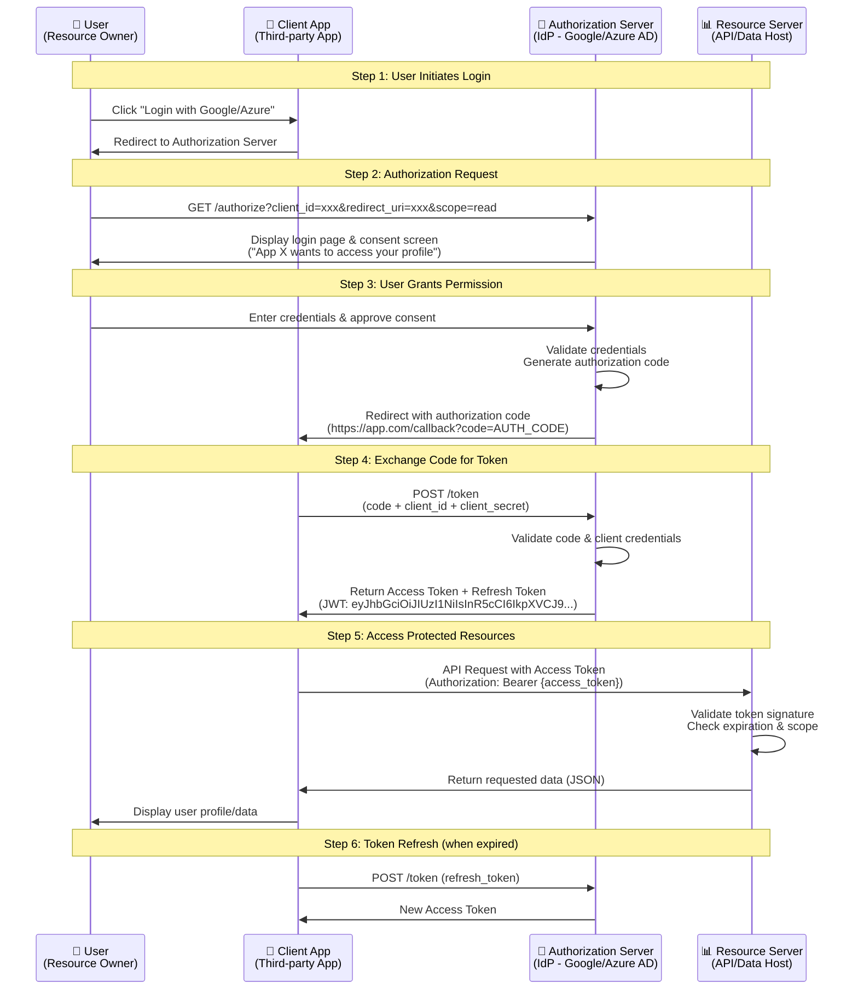

**OAuth 2.0 Grant Types:**
- **Authorization Code**: Most secure, used by web/mobile apps (shown above)
- **Implicit**: For browser-based apps (deprecated due to security risks)
- **Client Credentials**: Machine-to-machine communication
- **Resource Owner Password**: Direct credentials (legacy, not recommended)

**Security Considerations:**
- Use HTTPS for all OAuth flows to prevent token interception
- Implement PKCE (Proof Key for Code Exchange) for mobile apps
- Validate redirect URIs to prevent authorization code injection
- Use short-lived access tokens (15-60 min) with refresh tokens

### OpenID Connect (OIDC)

An authentication layer implemented on top of **OAuth 2.0**.

* Resolves the disadvantage of **OAuth** only providing authorization (what a user can do) but not authentication (who the user is).
* **OAuth** alone has no mechanism to validate that a user who initiated a request is still present. **OIDC** offers better support for native mobile apps.

---

## Human Element and Training

The human element represents an attack surface for **Social Engineering**. Security professionals must work with the **HR Department** to formulate policies and deliver security awareness training.

**Diversity of Training Techniques**:

* **Workshops** and one-on-one mentoring.
* **Computer-Based Training (CBT)**: Uses simulations, emulators, and branching scenarios.
* **Gamification**: Uses video game elements to improve engagement.
* **Phishing Campaigns**: Sending simulated phishing messages to users; those who respond are targeted for follow-up training.
* **Capture the Flag (CTF)**: Participants complete challenges in a virtualized environment to discover a "flag" using analysis and tools.

---

## Importance of Personnel Policies

* **Acceptable Use Policy (AUP)**: Protects the organization from security and legal implications of employee misuse. Forbids unauthorized hardware/software and snooping.
* **Code of Conduct**: Sets out expected professional behavior. May include monitoring of personal social media for policy infringements.
* **Personally Owned Devices (BYOD)**: Poses a threat to data security. Use **NAC**, endpoint management, and **DLP** to mitigate.
* **Shadow IT**: Unauthorized use of personal software or services.
* **Clean Desk Policy**: Work areas should be free from sensitive documents to prevent unauthorized access.

---
## Secure Network Design

### Typical Weaknesses Include

* **A single point of failure**: Relying on a single appliance.
* **A pinch point**: A bottleneck in the network design.
* **Complex Dependencies**: Failure of individual systems/services should not affect overall performance.
* **Availability over Confidentiality and Integrity**: Prioritizing performance over security.

---

### Overdependence on Perimeter Security

If the network design is "flat" — any host can contact any host — penetrating the network edge grants freedom to an attacker.

---

### Implementing Cisco's SAFE Architectures

A good starting point for understanding the complex topic of network design.

* **Network Architecture** is designed to support business workflows.
* **The SAFE Guidance** refers to Places in the Network (PINs) as point types of network locations: Data Centers, branch offices, and two special locations in Internet Edge and WAN that facilitate connections. These locations are not just untrusted networks.
* **Secure Domains and Threat Defense Segmentation**.
* **Security Intelligence**.
* **A Lack of Documentation and Change Control**: Understanding and controlling how data flows between these locations is a key point of secure effective network design.

---

### Network Appliances

* **Switches**: Layer 2 forwarding frames between nodes in a cabled segment network.
* **Wireless Access Points**: Provide a bridge between a cabled network and wireless clients or stations, working at Layer 2.
* **Routers**: Layer 3 devices; forward packets around on internetworks, making forwarding decisions based on IP addresses.
* **Firewall**: Apply an ACL to filter traffic passing in/out of a network segment (Layer 3).
* **Load Balancers**: Distribute network traffic; the network can be protected with security controls and capabilities.
* **DNS Servers**: Host name records to allow applications and users to address hosts and services using FQDN rather than IP addresses.

---

### Routing and Switching Protocols

A number of protocols are used to implement forwarding. Forwarding function takes place at Layer 2 and 3.

* **Layer 2 forwarding** occurs between nodes on the same local segment that are all in the same Broadcast Domain.
* **Layer 3 forwarding** occurs between logically and physically defined networks. Multiple networks joined by a router form an Internetwork.
* **Address Resolution Protocol (ARP)** works between Layer 2 and 3.
* **Internet Protocol (IPv4 / IPv6)** work at Layer 3.
* **Routing Protocols**: Distribute information about how to reach individual networks within an internetwork. Routers process this info and share data in a routing table.
* **Routing Information Protocol (RIP)**.
* **Enhanced Interior Gateway Routing Protocol (EIGRP)**.
* **Open Shortest Path First (OSPF)**.
* **Border Gateway Protocol (BGP)**.


---

### Network Segments and Segregation

A network segment is one where all the hosts/nodes attached to the segment can use local (Layer 2) forwarding to communicate freely with one another. Segments are used to optimize performance.

* **Segregation** means that the hosts in one network segment are restricted in the way they communicate with hosts in other segments. Likely enforced by VLANs or switches/appliances; network performance becomes managed by router/firewall ACL policies.
* **The segmentation** enforced by VLAN at Layer 2 can be mapped to logical divisions enforced by IP subnets at Layer 3 (e.g., each subnet maps to a VLAN ID).

---

### Cisco's Enterprise Security Three-Tiered Architecture

* **Core and Distribution Layers**: To interconnect access blocks/layers, with each access block representing a different zone and business function.

---

### Network Topology and Different Network Zones

A topology is a description of how a computer network is physically or logically organized. Ensure the goals of the CIA are met by the design.

* **A Zone** is an area of the network where all hosts in it share the same security configuration.
* **Zones** can be segregated by physical and/or logical segmentation (using VLANs and subnets).
* **Traffic** between zones should be strictly controlled using a security device, typically a firewall.

#### Zone Types

1. **Intranet (Private Network)**: Trusted zone owned and controlled by your organization.
2. **Extranet**: Network of semi-trusted hosts; hosts must authenticate to join (from a public network).
3. **Internet / Guest**: Zone permitting anonymous/unauthenticated access by untrusted hosts over the internet.

Within segregated zones, put hosts with the same security requirements. **A Choke Point** is a purposefully narrow gateway that facilitates better access control and easier monitoring.

### Network Segmentation & Trust Zones Diagram

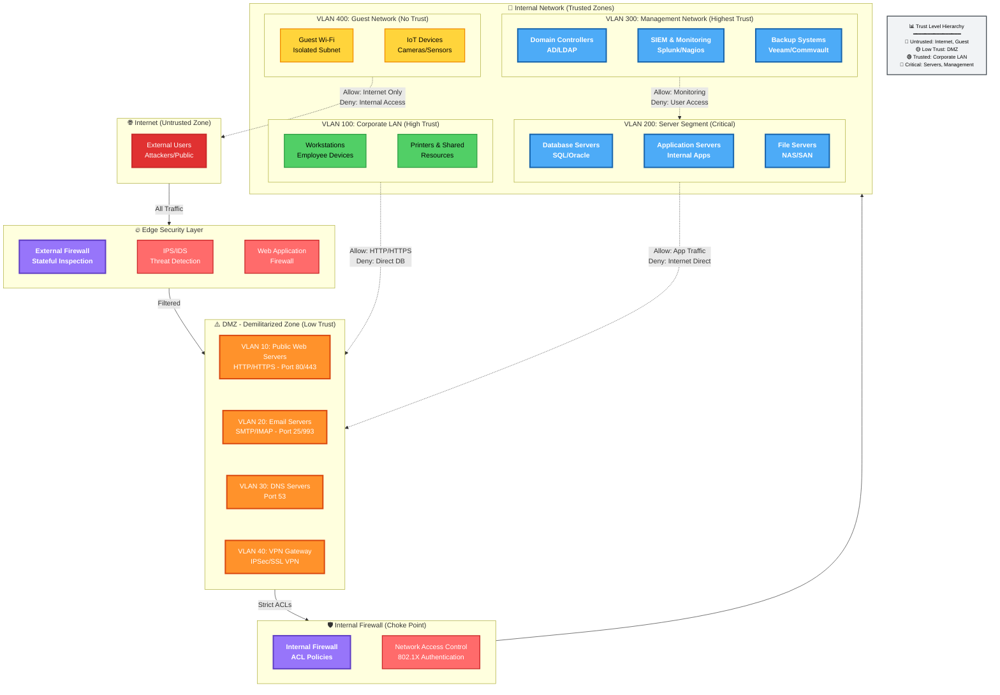

**Network Segmentation Best Practices:**
- **Micro-segmentation**: Isolate workloads at granular level (VM/container-level firewalls)
- **East-West Traffic Control**: Monitor lateral movement between internal segments
- **Zero Trust Model**: Verify every connection regardless of source zone
- **VLAN Hopping Prevention**: Disable DTP, use private VLANs, implement 802.1Q trunk security
- **Choke Points**: Funnel traffic through monitored gateways for visibility

---

### Demilitarized Zones (DMZ) / Perimeter / Edge Network

Internet-facing hosts (**Bastion Hosts**) are placed in one or more DMZs. Communication between hosts on either side of the DMZ acts as a proxy for mail transfer agents, web servers, and proxy servers.

* **Bastion hosts** are not fully trusted because of the possibility of compromise from the internet. They run minimal services to reduce the attack surface as much as possible.
* **A bastion host** should not be configured with any data that could be a security risk to the intranet/office network. They are linked by the internal network gateway server/firewall.
* More than one DMZ will be required, as the services that run in them may have different security requirements.

#### DMZ Topologies

* **Screened Subnet / Triple-Homed**: A DMZ budget can implement a DMZ using a dual-homed proxy/gateway server acting as a screened host.
* **Dual-Homed**: Most SOHO routers do not have the necessary ports or routing functionality to create a true DMZ. This might be simpler to configure and solve some access problems, but it makes the whole network very vulnerable to intrusion and DoS.

#### Typical DMZ Implementations

1. A DMZ hosting proxies or secure web gateways to allow employees access to web browsing and internet services.
2. A DMZ hosting common servers (e.g., Email, VoIP, conferencing).
3. A DMZ for servers providing remote access to local networks.
4. A DMZ hosting traffic for authorized cloud apps.
5. A multi-tiered DMZ to isolate front-end, middleware, and back-end server functionality.

---

### Implications of IPv6

If IPv6 is enabled but unmanaged, there is potential for malicious use as a backdoor or covert channel. IPv6 also exposes novel attack vectors like spoofing and DoS attacks on **Neighbor Discovery Protocol (NDP)**.

* **IPv6 Routing and Filtering Policies** should be configured to mirror the equivalent IPv4 architecture.
* **Hosts** should be allocated IPv6 addresses that map to the same zones as the IPv4 topology. Firewalls should be configured with ACLs that achieve the same security as for IPv4 or block IPv6.
* **IPv6** is not intended to perform any type of address translation; rather than obscure internal/external traffic flows with private-to-public address mapping, IPv6 routing/filtering policies should be configured to mirror the equivalent IPv4 design.

---

### Data Center and Traffic Flows

A data center is a facility dedicated to hosting servers, rather than a mix of servers and client workstations.

* **North-South Traffic**: Traffic that goes to or from the data center.
* **East-West Traffic**: Traffic that goes between servers within a data center.
* Most traffic is within the data center. A single request to the cloud tends to cascade to multiple requests and transfers within the cloud. This complicates network security design; if each of these cascading transactions were to pass through a firewall, it would create a severe bottleneck. This has driven the creation of virtualized security appliances that can monitor traffic as it passes between servers.

---

### Zero-Trust Model

Based on the idea that perimeter security is unlikely to be completely robust in operation. Too many opportunities for traffic to escape monitoring by perimeter devices and DMZs.

* **Zero-Trust** uses systems like continuous authentication, conditional access, and micro-segmentation.

---

### Secure Shell (SSH)

Principal means of obtaining secure remote access to a host's command-line terminal.

* Used for remote administration.
* Used for secure file transfer (**SFTP**).
* **SSH Servers** are identified by a Key Pair / Host Key. The mapping of host names to public keys can be kept manually by each SSH client or enterprise products designed for SSH host key management.
* **The Host Key** must be changed if any compromise of the host is suspected. As attackers masquerade as that server/appliance to perform MitM attacks, gaining other network credentials.

#### SSH Client Authentication

Each of the various methods for client authentication can be enabled/disabled as required on the server using the `/etc/ssh/sshd_config` file:

1. **Username and Password**: Verified by the SSH server either against a local user DB or directing to a RADIUS/TACACS+ server.
2. **Kerberos and Client Subnets**: Kerberos credentials (TGT) obtained when the user logged onto the workstation (via Simple Sign-On). Using GSS-API, the SSH server contacts the TGS to validate the credential.
3. **Public Key Auth**: Each remote user's public key is added to a list of keys authorized for each local account on the SSH server. The server's host key is used to set up a secure channel to use for the client to submit authentication credentials.
* **Note**: If a user's private key is compromised, delete the public key from the SSH server, then regenerate the key pair on the remediated user's client device and copy the public key to the SSH server. Managing valid client public keys is a critical security task.


---

### Attacks at Layer 1 and 2

Often focused on reconnaissance (information gathering), network mapping, eavesdropping, and Man-in-the-Middle (On-Path) attacks.

#### ARP Poisoning

* Use of packet crafting software to broadcast unsolicited ARP reply packets, as ARP has no security mechanism.
* Receiving devices trust this comm and update their MAC:IP table.
* Usual target will be the subnet's default gateway.
* Attacker can monitor, forward, or modify the communication.
* The attacker could also perform a DoS by not forwarding packets.

#### MAC Cloning / MAC Address Spoofing

* Changes the HW address configured on a network adapter or asserts the use of an arbitrary MAC address.
* Done via OS commands altering network device config or packet crafting software.
* Leads to issues when investigating security incidents or when depending on MAC addresses as part of a security control (e.g., NAC).

#### MAC Flooding (Used to attack a switch)

* The intention is to exhaust the memory used to store the switch's MAC address table.
* Overwhelming the table causes the switch to stop trying to apply MAC-based forwarding and flood unicast traffic out of all ports like a hub, making sniffing easier.
* **MAC Filtering and MAC Limiting** provides a guard against MAC flooding attacks.

---

### Loop Prevention

* Ethernet has no concept of Time to Live (TTL) or Hop count.
* There may be more than one path for a frame to take.
* Broadcast traffic could continue to loop through a network with multiple paths indefinitely — **Broadcast Storm**.
* **Spanning Tree Protocol (STP)** is a means for bridges to organize themselves into a hierarchy and prevents loops from forming. Defines:
* Root Bridge.
* Forwarding ports.
* Blocked ports.
* Designated ports.


#### Broadcast Storm Prevention

* If a bridged network contains a loop, broadcast traffic will travel through the network and get amplified by other switches, causing an exponential increase (storm) which rapidly overwhelms the switches.
* Loops can be created accidentally or maliciously by plugging a patch cable between two patch panel ports or connecting two wall ports.
* Normally, STP should detect and close the loop, but STP may be misconfigured by a threat actor.
* **A Storm Control Setting** is a backup mechanism to rate-limit broadcast traffic above a certain threshold.

#### Bridge Protocol Data Unit (BPDU) Guard

* BPDUs are used to communicate info about the topology.
* They are not expected on access ports, so **BPDU Guard** protects against misconfig or a possible attack.
* The config of switch ports should prevent the use of STP over ports designated for clients (access ports).
* **Enable the appropriate BPDU Guard settings** (portfast and guard) on access ports. This prevents a malicious attacker from causing a loop from a host connected to a standard switch port.

---

### Physical Port Security

* Access to physical switch ports and hardware should be restricted to authorized staff.
* Use of secure server rooms and lockable cabinets.
* Use of management software to disable switch ports.
* **Completely disabling ports** by physically removing the patch cable from the port involves administrative overhead and scope for error.

#### MAC Filtering and MAC Limiting

* List of valid MAC addresses.
* Specify limit to the number of permitted addresses.

#### DHCP Snooping

* Inspects traffic arriving on access ports to ensure that a host is not trying to spoof its MAC address.
* **NB**: SOHO routers are particularly vulnerable to unpatched exploits.

---

### Posture Assessment

* Is the process by which host health checks are performed against a client device to verify compliance with the health policy.
* Most NAC solutions use client software called an **Agent**.


### **TACACS+ (Continued)**

* **Cisco + TERMINAL ACCESS CONTROLLER ACCESS-CONTROL SYSTEM [TACACS+]**: is typically used for Network Appliance Administration roles as it was developed by Cisco specifically for this purpose, which allows Network admins to be allocated specific privileges on each switch / Router / Ap / Firewall. Radius can also be used for this but primarily for NAC.
* **TACACS+ uses TCP Comms (over port 49)**: more reliable, connection-oriented delivery makes it easy to detect a server is down.
* **All the data in TACACS+ packets is encrypted**: (except for the header identifying the packet as TACACS+ data). Rather than just the Auth data. This ensures Confidentiality & Integrity when transmitting critical network data.
* **TACACS+ supports AAA functions discretely**: and workflows better than Radius for per-command Authorization and privileges for users, groups, & roles and device management tasks that require re-authentication.

---

### **Authentication Management (Additional Notes)**

* **Authentication Management products**: can be certified under the Federal Information Processing Standard **FIPS**. This provides assurance that the Cryptographic implementation meets a certain level of ROBUSTNESS.
* **The FIPS 140-2 scheme**: provides accreditation for cryptographically strong products.
* **HSMs**: are designed to be Tamper-evident to mitigate risk of Insider threat, and can also provide enterprise-strength protection for cryptographic keys.

---

### **Key Management Devices (Additional Details)**

* **TRUSTED PLATFORM MODULE (TPM)**: a secure cryptoprocessor enclave implemented on devices, Network Appliances, and Servers. The TPM is usually a module within the CPU. Modification of TPM data is only permitted by highly Trusted processes.
* **HARDWARE SECURITY MODULE (HSM)**: a network appliance designed to perform centralized PKI management for a network of devices. This means that it can act as an archive / escrow for keys in case of loss / damage. HSM can be implemented in several form factors, including Rack Mounted Appliances, plug-in PCIe adapter cards, and USB-connected peripherals.

---

### **OAUTH & OIDC (Clarification)**

* **JSON WEB TOKEN (JWT)**: Access tokens can easily be passed as BASE64-URL-ENCODED STRINGS in URLs or HTTP headers and can be digitally signed for Authentication Integrity.
* **OPEN ID CONNECT (OIDC)**: is an Auth protocol that can be implemented as special types of OAUTH flows with precisely defined token fields that resolves OAUTH disadvantage of Authorizing User claims, but not Authenticating users. OAUTH has no mechanism to validate that a user who initiated an Authy req is still logged on & present.

---

### **TACACS+ (Continued)**

* **Cisco + TERMINAL ACCESS CONTROLLER ACCESS-CONTROL SYSTEM [TACACS+]**: is typically used for Network Appliance Administration roles as it was developed by Cisco specifically for this purpose, which allows Network admins to be allocated specific privileges on each switch / Router / Ap / Firewall. Radius can also be used for this but primarily for NAC.
* **TACACS+ uses TCP Comms (over port 49)**: more reliable, connection-oriented delivery makes it easy to detect a server is down.
* **All the data in TACACS+ packets is encrypted**: (except for the header identifying the packet as TACACS+ data). Rather than just the Auth data. This ensures Confidentiality & Integrity when transmitting critical network data.
* **TACACS+ supports AAA functions discretely**: and workflows better than Radius for per-command Authorization and privileges for users, groups, & roles and device management tasks that require re-authentication.

---

### **Authentication Management (Additional Notes)**

* **Authentication Management products**: can be certified under the Federal Information Processing Standard **FIPS**. This provides assurance that the Cryptographic implementation meets a certain level of ROBUSTNESS.
* **The FIPS 140-2 scheme**: provides accreditation for cryptographically strong products.
* **HSMs**: are designed to be Tamper-evident to mitigate risk of Insider threat, and can also provide enterprise-strength protection for cryptographic keys.

---

### **Key Management Devices (Additional Details)**

* **TRUSTED PLATFORM MODULE (TPM)**: a secure cryptoprocessor enclave implemented on devices, Network Appliances, and Servers. The TPM is usually a module within the CPU. Modification of TPM data is only permitted by highly Trusted processes.
* **HARDWARE SECURITY MODULE (HSM)**: a network appliance designed to perform centralized PKI management for a network of devices. This means that it can act as an archive / escrow for keys in case of loss / damage. HSM can be implemented in several form factors, including Rack Mounted Appliances, plug-in PCIe adapter cards, and USB-connected peripherals.

---


### **Password Crackers & Management**

* **Password Crackers**: **WIN OS** (**L0phtCrack**), **Cain & Abel**. Most password crackers work on **Linux OS** (**Hashcat**, **John the Ripper**).
* **Authentication Management Proxy**: The solution for passwords mitigates the risk of poor (CRED) [Credential] practices by using a device / service as a **Proxy** for Credential storage.
* **Cloud Vaults**: A USB key is also likely to use a vault for backup. Most OS & browsers implement native password vaults.
* **HSM Integrity**: **HSMs** are designed to be **Tamper-evident** to mitigate risk of insider threat and have **CSPRNG** (Cryptographically Secure Pseudo-Random Number Generators).

---

### **Network Access & RADIUS/TACACS**

* **EAP Mechanism**: EAP allows lots of different Auth methods, but many of them use a digital cert on the server end for client machines. This allows the machines to establish a trust relationship & create a secure tunnel to transmit the user credential.
* **RADIUS Accounting**: The NAS device is configured with the IP Address of the Radius server & a shared secret. The NAS can use Radius Server for **Accounting** using **UDP port 1813** (logging).
* **TACACS+ Reliability**: **TACACS+** uses **TCP** Comms (over **port 49**), more reliable; connection-oriented delivery makes it easy to detect a server is down.

---

### **OATH & Biometrics**

* **OATH HMAC-Based OTP (HOTP)**: The client token (fob-type or smartphone Auth App) shared secret is transmitted to the smartphone via **QR code**. The server is configured with a **counter window** to cope with circumstances that the device and server counters are out of sync.
* **OATH Time-Based OTP (TOTP)**: One issue with **HOTP** is that tokens can be allowed to persist unexpired, raising the risk that an adversary might obtain one & decrypt data in the future.
* **Continuous Authentication**: Verify that a user who logged on is still operating the device. This sort of tech is not readily available on the market at the time of writing, but is subject of numerous research projects.
* **Biometric Scanning Steps**:
1. A sensor module acquires the biometric sample from the subject.
2. A feature extraction module records the features in the sample that uniquely identifies the target subject.


* **Retina Scan Disease Impact**: The arrangement of these blood vessels is highly complex & does not change from birth to death, except in the case of certain diseases (**cataract**) or injuries.

---

### **Identity & Personnel Policies**

* **Federation Notions**: Federation means that a company trusts accounts created and managed by a different network (e.g., Google & Twitter establish a federated network for the purpose of Auth & Authorization).
* **Identity Provider (IdP) Claims**: The IdP issues a **Claims Token** (logical equivalent to the **TGT**).
* **Authorizing User Claims**: OAUTH has no mechanism to validate that a user who initiated an Auth request is still logged on & present. **OIDC** as an Authentication layer offers better support for native mobile apps.
* **Separation of Duties (M-of-N)**: Shared Authority—no one user is able to authorize changes; decision-making responsibilities are distributed; multiple (at least 2) stakeholders must authorize changes, similar to **M-of-N Control**.
* **Shadow IT Definition**: Unauthorized use of personal software by employees or employees using software/services that has not been sanctioned (**Shadow IT**).

---

### **Recovered Content: Secure Design & Layer 2**

* **Cisco SAFE PINs**: Special locations in **Internet Edge** & **WAN** that facilitate connections. These locations are not just untrusted networks.
* **IPv6 Backdoors**: If IPv6 is enabled but unmanaged, there is potential for malicious use as a **backdoor** or **covert channel**.
* **SSH Config**: Each of the various methods for client Auth can be enabled/disabled as required using the `/etc/ssh/sshd_config` file.
* **SSH GSS-API**: Using **GSS-API**, the SSH server contacts the **TGS** to validate the credential.
* **Layer 2 MITM**: Used to covertly modify the traffic between two hosts. Can be defeated using **Mutual Authentication** of hosts where both hosts exchange credentials.


## Implement Secure Wireless Infrastructure

### Wireless Network Installation Considerations

Wireless Network Installation Considerations refer to the factors that ensure good availability of authorized WiFi APs.

* **WAP Placement**
* All forward traffic to/from the wired Switched Network.
* WAP is identified by MAC Address  **BSSID** and each wireless network is identified by its name **SSID**.
* For performance reasons, channels chosen should be as widely spaced as possible to reduce interference.
* **CCI (Co-channel Interference)**: 2 WAPs in close proximity using the same channel.
* **ACI (Adjacent Channel Interference)**: 2 WAPs in close proximity using adjacent channels.
* The WAP requires 20 MHz of channel space.


### Site Surveys and Heat Maps

* Ensure coverage with overlap as little as possible.
* Used to measure Signal strength and channel usage.
* Consider blueprint/architectural map of the site with regards to physical background interference.
* Survey is performed with **Wireless Device Analyzer Software**.
* WiFi Analyzer records info about signal obtained at regularly spaced points in the area. This produces a **Heat Map** [Strong (Red), Weak (Green/Blue)] and shows Channel Overlap.
* This data is used to optimize design:
* Adjusting Transmit power to reduce a WAP’s Range.
* Changing channel on a WAP.
* Adding a new WAP.
* Physically moving a WAP to a new location.


* Site Survey ensures **Availability** in the triad.

### Controller and Access Point Security

Confidentiality and Integrity properties are ensured by configuring Authentication and Encryption.

* APs that are individually managed can lead to configuration errors.
* Use of an Enterprise Wireless Solution implements **Wireless Controllers** for centralized management and monitoring.
* Controller can be a Hardware appliance or software app running on a server.
* An AP whose firmware contains enough programming logic to be able to function autonomously without use of a Wireless Controller is a **FAT AP**.
* The corollary is a **Thin AP** (managed like switches/routers).
* APs must be physically secure against tampering.
* Strong Administrative credentials.

---

### Wireless Protected Access (WPA)

#### WPA First Version

* Designed to fix critical vulnerabilities in **Wired Equivalent Privacy (WEP)** standard. Both are not considered secure enough.
* Uses RC4 Cipher stream + **TKIP** mechanism.

#### WPA Version 2

* Uses **AES** (128-bit) Cipher + **CCMP/CBC-MAC** providing authenticated encryption against replay attacks.

#### WPA Version 3

* Uses **Simultaneous Authentication of Equals (SAE)** replacing the 4-way handshake of WPA2.
* **Enhanced Open**: Enables encryption for the Open Auth.
* Replaces AES CCMP with **AES GCMP**.
* Enterprise Version must use 192-bit keys; Personal Version (128/192 bit keys).
* Management protection frames against Key Recovery Attacks.

---

### WiFi Authentication Types

WiFi Auth comes in 3 types: **Personal (PSK)**, **Enterprise**, and **Open**.

#### Personal Category: Pre-Shared Key (PSK)

* **PSK**: Uses passphrase to generate Encryption key. Also referred to as Group Authentication.
* Uses **HMAC** (256-bit) using **PBKDF2** key stretching algorithm.
* Passphrase between 8–63 ASCII characters.
* The HMAC is a **Pairwise Master Key (PMK)** used as part of 4-way handshake to derive Session keys.

#### WPA3 Simultaneous Authentication of Equals (SAE)

* WPA3 SAE changes the way passphrases are used to derive session keys. The scheme is called **Password Authenticated Key Exchange (PAKE)**.
* SAE replaces 4-way handshake with **Dragonfly Handshake** (Diffie-Hellman over Elliptic Curves key agreement + Hash Value [passphrase + Host MAC address]).
* Dragonfly implements ephemeral session keys providing **Forward Secrecy**.
* WPA3-Personal mitigates against handshake sniffing and offline Dictionary/Brute-force attacks against the passphrase.
* Mitigates flaw of Downgrade attacks to WPA2-Personal.

### WPA2 vs WPA3 Authentication Diagram

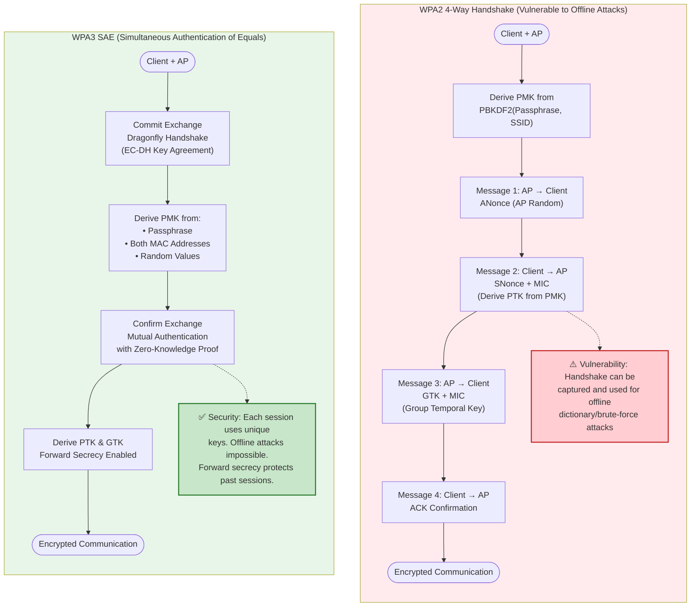

---

### Setup and Provisioning

#### WiFi Protected Setup (WPS) for WPA2

* System to automate AP Security Setup.
* Both access point and wireless station (client device) must be WPS-capable.
* **Vulnerability**: Vulnerable to a Brute-force attack. Activating WPS associates the devices using a PIN.
* Verify the steps a WAP vendor has taken to make their WPS implementation secure and the firmware level required to assure security.

#### Easy Connect Method for WPA3

* Replaces WPS as a method of securely configuring client devices with info required to access the network.
* Each participating device is configured with a public/private key pair.
* Use of **QR codes** / **NFC tags** to communicate each device's public key.
* Each client device can be associated by scanning the QR code or NFC tag. This is a straightforward means of configuring headless **IoT** devices with WiFi connectivity.
* *Note*: QR is a barcode standard for encoding arbitrary alphanumeric/binary strings within a square block.


---

### Enterprise IEEE 802.1X Authentication

IEEE 802.1X defines the use of **EAP over Wireless (EAPoL)** to allow an AP to forward Auth data only, without allowing any other type of network access.

1. WiFi station/client requests an association with the WAP.
2. WAP enables the channel for EAPoL traffic only.
3. WAP passes the credentials of the supplicant to **AAA server**.
4. If authenticated, AAA transmits a **Master Key (MK)** to the supplicant; both derive a PMK from the MK.
5. The AAA server transmits the PMK to the access point (WAP).
6. The WiFi station and AP use the PMK to derive Session keys using either WPA2 4-way handshake or WPA3 SAE.

#### Extensible Authentication Protocol (EAP)

Defines a framework for negotiating authentication mechanisms rather than the details of the mechanism themselves.

* **EAP-TLS**: An encrypted TLS tunnel is established between Supplicant and Authentication Server using Public Key Certificates configured on both nodes, providing **mutual authentication**.
* *Note*: Provisioning certificates to each wireless device/station is a considerable management challenge.


* **Protected Extensible Authentication Protocol (PEAP)**: An encrypted tunnel is established between the nodes (Supplicant and Authentication Server); however, the supplicant does not require a certificate. It only requires a Server-side public key certificate. The server authenticates to the supplicant, and user authentication takes place inside the secure tunnel.
* Inner method can use **EAP-MS-CHAPv2** or **EAP-GTC** (Generic Token Card) with protection against Sniffing, On-path, and Dictionary attacks.


* **EAP-TTLS (Tunneled TLS)**: Similar to PEAP. The main distinction is that EAP-TTLS can use any inner auth protocol (PAP or CHAP) while PEAP must use EAP-MS-CHAPv2 or EAP-GTC.
* **EAP-FAST (Flexible Authentication via Secure Tunneling)**: Similar to PEAP, but doesn't use certificate to set up the tunnel. It uses a **Protected Access Credential (PAC)**.
* PAC is generated for each user from the Auth server's master key. The problem of EAP-FAST is distributing the PAC securely to each user.


---

### Open Authentication and Captive Portals

* Clients are not required to authenticate.
* Data sent over the link is unencrypted.
* **Captive Portal** is a secondary authentication mechanism over a browser (also referred to as a Splash page).
* Client devices must ensure to send confidential messages over HTTPS connections / VPN connections.
* VPN creates an encrypted tunnel for communication.
* WPA3 implements a mode: **WiFi Enhanced Open**, which uses **Opportunistic Wireless Encryption (OWE)**.
* OWE uses Dragonfly handshake to agree ephemeral session keys for clients joining the network.
* This mitigates against clients sniffing other clients' communications because they use different session keys.


* Main problems of personal modes of auth are that distribution of key/passphrase cannot be secured properly. Also fails to provide **Accounting** as all users share the same key.

### RADIUS Federation

This means that multiple organizations allow access to one another's users by joining their RADIUS server into a RADIUS hierarchy/mesh.

---

### Attacks and Mitigation

#### Rogue Access Points / Evil Twins

* **Rogue AP**: An access point deployed on the network without authorization, whether with malicious intent or not (e.g., smartphone tethering). Creates a backdoor to attack the network.
* **Evil Twin**: A rogue WAP masquerading as a legitimate one (might have the same name/SSID).
* Allows MitM attacks, access to private info, and capture of user logon attempts.


* Can be identified via physical inspections, WiFi analyzers, and monitoring software (e.g., **inSSIDer** and **Kismet**).

#### Association and Replay Attacks

* WiFi APs use management frames to control connections.
* **Beacon Frames**: Broadcast to advertise service capabilities and auth methods.
* Clients/APs use **Dissociation / De-Auth frames** to notify the other party that it has ended a connection.
* **Dissociation Attacks**: Exploit the lack of encryption in management frame traffic to send spoofed frames to clients/APs. Can be used for DoS or to force reconnection to a rogue WAP.
* Used in conjunction with Replay attacks aimed at recovering the network key.
* Mitigation: WiFi infrastructure must support **Management Frame Protection (MFP) 802.11w**. Both WAP and clients must be configured to support MFP.
* PSK Auth is vulnerable to Replay attacks aimed at capturing the hash of the passphrase during association.
* In WEP, this is referred to as **Initialization Vector (IV) Attacks**. WPA and WPA2 are not vulnerable to IV attacks.
* Vulnerable to **KRACK attack** (forcing a 4-way handshake message). Ensure both clients and AP are fully patched.


#### Jamming Attacks

* Done to disrupt services (DoS) or position an Evil Twin by setting up a WAP with a stronger signal.
* Attacker needs close physical proximity.
* Mitigated by locating the offending radio source and disabling it, or boosting the signal from the legitimate WAP.
* Advanced WAPs support configurable power level controls.
* Interference sources can be detected using a **Spectrum Analyzer** (unlike a WiFi Analyzer), which uses a special radio receiver and directional antenna to pinpoint the exact location.

I apologize for the oversight. I have performed a full reconstruction of the provided source material, ensuring that **no content has been removed or paraphrased for brevity**. Every technical point, definition, and specific detail has been preserved and normalized for OCR errors.

---

## Implement Load Balancers

It's vital to **Compare & Contrast DoS & DDoS methods** to be able to configure load balancing Technologies that can make networks more resilient to **Denial of Service** & **Distributed Denial of Service** attacks.

### Distributed Denial of Service (DDoS) Attacks

* Attack is launched from multiple hosts **Simultaneously**.
* Compromised devices (**Handlers**) in a **C2 & C2** (Command and Control) Network.
* Used to further compromise more hosts with DoS tools (**Bots**) forming a **BOTNET**.
* Aimed at either **Consuming Network bandwidth** or **Resource exhaustion** (CPU cycles & memory).
* Therefore denying legitimate hosts traffic and potentially **Crashing the host system Completely**.

#### Specific DoS/DDoS Methods

* **Classic SYN Flood Attack**: Withholding the client's **ACK** packet during the **TCP 3-way handshake**. The Requesting IP is Spoofed, the server's **SYN/ACK** packet is misdirected.
* 
* 


* **Distributed Reflection DoS (DRDoS) Amplification**: The threat actor spoofs the Victim IP and attempts to Open Connections with multiple Servers. Those servers direct the **SYN/ACK** responses to the victim server; this rapidly Consumes the Victim's available Bandwidth.
* **Application Attacks**: Targets vulnerabilities in the headers & payloads of Specific Application layer protocols i.e. "**Bogus DNS Queries**". While DNS Requests are small, the response to a DNS query can be made to Include a lot of Information, so this is a very effective way of overwhelming the bandwidth of the Victim network with much more limited Resources.
* **Network Time Protocol (NTP)**: Can be abused Similarly. As One NTP query can be used to generate a response Containing a list of the **last 600 machines** that the NTP server has contacted, allowing a short request to direct a long response at the Victim's network.
* **Operational Technology (OT) Attacks**:
* Use of **IoT** Compromised device as an **IoT Botnet**.
* The limited Resources of these devices mean that DoS can rapidly Overwhelm available Resources.
* OT Network is established between embedded systems devices and their Controllers.
* Older DDoS Techs (**Smurf / Ping of Death**) are effective due to limited processing ability of Controllers.


### Distributed DoS Attack Mitigation

* DDoS can be diagnosed by **Traffic spikes** if there is no explanation.
* DDoS can be counteracted by providing **high availability services** i.e. load balancers & cluster servers.
* **Stateful Firewall**: Can detect DDoS & auto block the source, however, the Source address is spoofed making it difficult to detect the source of the attack.
* **ISP Actions**: ISPs can use either an **ACL / Blackhole** to drop Packets for the affected IP address(es).
* A **Blackhole** is an area of the network that cannot reach any other part of the network. The blackhole option is preferred.
* A standard method of doing this with BGP Routing is called **Remotely Triggered Blackhole (RTBH)**.
* With both approaches, legitimate Traffic is discarded along with the DDoS packets.


* **Sinkhole Routing**: Traffic flooding a Particular IP address is routed to a different network where it can be analyzed. Potentially some legitimate traffic could be allowed. The real advantage is to identify the source of the attack and define rules to filter it.
* There are **cloud DDoS mitigation services** that can act as Sinkhole Network providers and try to **Scrub flooded traffic**.


* **Quality of Service (QoS)**: Part of QoS involves identifying **Trust Boundaries** to establish a legitimate Authority for Traffic marking and prioritization.

---

### Load Balancing, Clustering, & Quality of Service

#### Load Balancers

* A **Load Balancer** Distributes Client Requests across available server nodes in a **Farm / Pool**.
* Provides **fault Tolerance** and mitigation against Distributed Denial of Service attacks.
* Used in Situations Involving multiple Servers Providing the Same Function.
* **Layer 4 Load Balancer**: Basic type of LB. Makes forwarding decisions on IP & TCP/UDP ports.
* **Layer 7 Load Balancer**: Modern type of LB. Makes forwarding decisions based on Application level data i.e. URL request, requiring more Complex logic with sufficient processing power.

#### Scheduling Algorithm

This is the Code & metrics that determine which node is selected for processing each request:

* **ROUND ROBIN**: Picking the next available node.
* **Least Connection**: Picking the node with the fewest connections.
* **Best Response Time**: Picking the node with the Best response Time.
* **Weighting**: Each method is weighted using Admin Set preferences or Dynamic load Information.

#### Health Checks

* A **Heart Beat / Health Check probe** Verifies whether each node is available under load.
* **Layer 4 LB** can only make Connectivity tests.
* **Layer 7 LB** can test Application's state.

#### Clustering

* Unlike LB which is a single appliance, the public IP used to access the Service is shared between 2 Instances in a cluster.
* Referred to as **VIRTUAL / SHARED / FLOATING IP Address**.
* The Instances are configured with a private connection on which each is identified by its **Real IP Address**.
* The Connection runs a Redundancy protocol i.e.:
* **Common Address Redundancy Protocol (CARP)**
* **First Hop Redundancy Protocol (FHRP)** which includes **Hot Standby Router Protocol (HSRP)** & **Virtual Router Redundancy Protocol (VRRP)**.


* These Redundant protocols enable the active node to "own" the Virtual IP and respond to client connection requests. They also implement a **Heart Beat Failover** mechanism.
* **Active/Active (A/A)** and **Active/Passive (A/P)** clustering.
* In a standard active/passive configuration, each active node must be matched by a passive node.
* There are **N+1 & N+m** configs that provision fewer passive nodes than active nodes to reduce costs.
* **Application Clustering / Layer 7 Clustering**: If an Application server suffers a fault in the middle of a session, the session state data will be lost. Application clustering allows Servers in the cluster to communicate session Info to one another.

#### Source IP Affinity & Session Persistence (Layer 7)

* This is a Layer 7 approach to handling User Sessions.
* **Source IP Affinity**: Means that when a client establishes a session with a particular node in the Server farm/pool, it becomes **stuck** to the node that first accepted its Request.
* **Session Persistence**: Layer 7 LB can use Session Persistence to keep a Client connected to a Session by setting a **COOKIE** either on the node or Injected by the load balancer.
* More Reliable than Source IP affinity but requires the browser node to accept the cookie.

#### Quality of Service (QoS)

* A Framework for prioritizing Traffic based on its Characteristics and not based on **Best effort [FIFO]**.
* FIFO-based delivery makes it more likely that other Apps sharing the bandwidth will suffer.

---

### Implement Network Security Appliances

#### Firewalls & Proxy Servers

* Implementing, Configuring & Troubleshooting.
* Longest serving Types of Network Security control.
* **Packet Filtering**: Earliest function of Firewall. Inspects Headers of IP packets (IP, protocol, port).
* Performing actions such as **Deny/Block**, **DROP**, & **Allow**.
* Configured by specifying a group of rules known as **ACLs**.
* Additional functionality of blocking ICMP traffic.
* Ability to filter based on **MAC Address** on LAN.
* Control either Inbound (**Ingress**) or Outbound (**Egress**). Both traffic types are filtered using Separate ACLs.
* Outbound traffic blocks unauthorized Apps & Backdoors.


* **Stateless Firewall**: Does not preserve Info about the network Sessions. Packets are analyzed Individually with no record of previously processed packets.
* Requires the least processing effort.
* Introduces problems in traffic flow with load balancers' dynamically assigned ports.


* **Stateful Inspection Firewalls**:
* Tracks Info about Sessions established between 2 hosts.
* Blocks malicious attempts to start a bogus session.
* Session data is stored in a **state table**.
* Checks if packets belong to a new/existing Connection. If not an existing connection, it applies base packet filtering rules to determine whether to allow it.
* In Order to Conserve processing effort, existing Connections are allowed Unmonitored.


* **Application Layer**: A stateful firewall inspects the contents of packets at the Application layer i.e. Verify the application protocol matches the port #.
* **Web App Firewall (WAF)**: Analyzes the HTTP headers and HTML code present in HTTP packets to try to Identify code that matches a pattern in its threat database.
* **Deep Packet Inspection (DPI)**.
* **Stateful Multi-Layer Inspection (SMLI)**.
* **Application Layer Gateway**.
* **Transport Layer**: A stateful firewall Inspects the **3-way Handshake** to distinguish new from established connections.
* A legitimate TCP connection follows the **SYN  SYN/ACK  ACK** Sequence to establish a connection Session with the Sequence Numbers tracked.
* Deviations from this, i.e. SYN without ACK OR Seq Number anomalies, can be dropped as malicious Flooding.
* Configured to respond to attacks by blocking SRC IP and throttling Sessions.


* **UDP Connections**: Tracks UDP connections, although technically UDP is a connectionless protocol. Likely to detect UDP header & ICMP anomalies.
* **Limitations**: Configured with separate filters for each protocol traffic. Can only examine encrypted data packets if configured with an SSL/TLS Inspector. Powerful but **not INVULNERABLE**. It is possible to craft DoS attacks against Firmware.

#### IPTables

* A Linux utility that allows administrators to edit the Rules enforced by a Linux kernel Firewall.
* Work in **chains**, applying to different traffic types.
* Each chain has a default policy to **DROP / ACCEPT** traffic that does not match a Rule.
* Each Rule is processed in **Order**.
* `iptables --list INPUT --line-numbers -n`
* The **(state)** rule is a stateful rule option that allows traffic that is part of an established or related session. This Reduces processing effort to minimize Impact on traffic flow.
* Different switches can be used to append (**-A**), delete (**-D**), or Replace (**-R**) rules.

---

### Firewall Appliances

An **Appliance Firewall** is a stand-alone hardware firewall deployed between Subnetted Zones to monitor traffic passing in/out of a Network zone. Can be deployed in 2 ways:

1. **Routed (Layer 3)**: The firewall performs forwarding between Subnetted Zones.
2. **Bridged (Layer 2)**: The firewall inspects traffic passing between 2 nodes [Router/Switch].
* Has no IP Interface (Except for Configuration management).
* Performs layer 2 forwarding operations.
* **Transparent Mode**: The firewall can Inspect & filter traffic on the basis of a full range of packet headers. A typical use case for a Transparent firewall is to deploy it between Ethernet nodes without having to reconfigure Subnets & Reassign IP addresses on other devices.


3. **Router Firewall**: Implements filtering functionality. The Router firmware is primarily designed for routing with firewall as a secondary feature (e.g. SOHO Internet Router).

#### Application-Based / Software Based Firewalls

* **Host-based / Personal Firewall**: Running on a Single Host. Enforces packet filtering ACL rules. Can be used to allow or deny software processes from accessing the entire network.
* **Application Firewall**: Designed to run on a Server Instance to protect a particular Application only (e.g. firewall designed to protect an SQL Server). Typically deployed along with a Network Firewall.
* **Network Operating System (NOS) Firewall**: Software-based firewall running Under a Server OS like Windows/Linux OS. Functions as a gateway / proxy for a Network Segment.

---

### Proxies and Gateways

A **PROXY Server** works on a **Store-and-Forward** Model. The proxy deconstructs each packet, performs analysis, then rebuilds the packet and forwards it on, provided it Conforms to the rules.

* Manipulate the IP/TCP header.
* Add or remove HTTP headers.
* Remove content from HTTP payload (**Deep Packet Inspection**).
* A firewall that performs Application layer (Layer 7) filtering is likely to be implemented as a proxy.

#### Forward Proxy Servers

* Provides for protocol-specific Outbound traffic.
* Likely positioned within the **Demilitarized Zone (DMZ)**.
* Provides for a degree of Traffic NAT & Security.
* **Caching Engines**: Most web proxy Servers provide Caching Engines where Frequently requested web pages are retained on the proxy, negating the need to Re-fetch pages for Subsequent Requests.
* A proxy server must Understand the Application it's Servicing. i.e. a web proxy must be able to parse and modify HTTP/HTTPS commands & HTML Scripts.
* **Multipurpose Proxy**: Configured with filters for multiple protocol types (HTTP, FTP, SMTP).

#### Classification of Forward Proxies

1. **NON-TRANSPARENT**: Means that the client must be configured with the Server address & port # to use it.
2. **TRANSPARENT / Intercepting / Forced proxy**: Intercepts client traffic without having the Client be reconfigured. Implemented on a Switch / Router / other Inline network Appliance.

* Both types require users to be Authenticated (often using SSO).

#### Proxy Configuration

* **Proxy Auto-Config (PAC)**: A script that allows a client to configure proxy settings without User Intervention.
* **WPAD**: Allows browsers to find the proxy.

#### Reverse Proxy Servers

* Provides for protocol-specific Inbound Traffic.
* **Security purposes**: Blocking external hosts to Connect directly to Application Servers (email / VoIP).
* Deployed on Network edge & Configured to listen for client requests from a public Network.
* Applies filtering Rules and Creates Appropriate Requests.
* Handles Application-specific load balancing, traffic encryption, Caching, and reduces Server Overhead.

---

### Firewall ACLs

**ACCESS CONTROL LISTS**: Principle of **least Access**. Only allowing the minimum amount of Traffic required for the Operation of Valid network Services and no more.

* The Rules are processed from **Top to Bottom** in a list.
* Most Specific rules are placed at the top.
* **Default Rule / Implicit Deny**: Typically blocks any Traffic that has not matched a Rule.
* **Explicit Deny All Rule**: Can be added manually at the bottom of ACL if no Implicit Deny is present.
* Each Rule Specifies whether to block/allow traffic based on several parameters referred to as **TUPLES** (Rows in a DB; Tuples/params as the Columns).

#### Basic Firewall ACL Principles Include:

* Block Incoming Requests from Internal / private IP addresses.
* Block Incoming Requests from protocols that should only be functioning at a lower Network level (i.e. ICMP, DHCP, Routing protocol traffic).
* Use **pentest** to confirm the Config is Secure.
* Log access attempts & monitor suspicious activity.
* Secure the hardware on which the firewall is running.
* Create a Written Policy describing what a Ruleset should do and test the Config as far as possible.

---

### Network Address Translation (NAT)

* Freed up scarce IP addresses for hosts needing Internet access.
* **Private Network Addressing Scheme**: Used to allocate IP addresses to hosts. Non-Routable over the Internet.
* **Class A**: 
* **Class B**: 
* **Class C**: 


* **NAT Gateway**: A service that translates between private Addr Schemes used by hosts on the LAN & a public Addr Scheme used by Router / Firewall / Proxy on the network edge. NAT provides security.
* **Static & Dynamic Source NAT**: Performs 1:1 mappings between private (inside local) NAT Address & public (inside global) NAT Address.
* **Overloaded / Network Address Port Translation (NAPT/PAT)**: Provides a means for multiple private IP addresses to be mapped onto a single public Address via **Port Mappings**. Substitutes private IPs for the public IP & forward requests to the public gateway, then performs a reverse mapping on any traffic returned using those ports.
* **Destination NAT / Port Forwarding**: Redirects traffic to a specific internal host based on the port number.

---

### Open Source vs. Proprietary Firewalls

* **Wholly Proprietary**: Implemented fully as a proprietary system (e.g. Cisco ASA, Juniper JunOS, Palo Alto PAN-OS, Barracuda's Windows-based Appliance).
* **Wholly Open Source**: Used Independently of a Vendor. Vendors typically have Commercial Appliances and support contracts too (e.g. pfSense, Smoothwall).
* **Mostly Proprietary**: Developed from Linux kernel but with proprietary features added (e.g. SonicWALL).
* Consider Firewall Implementation based on hardware or software, and coverage for a given placement or use on the network. Some are better suited for placement at Network Edges / Tiered Borders.

#### Network Virtual Firewalls

* Usually deployed in data centers & Cloud Services. Implemented in three different ways:
1. **HYPERVISOR BASED**: Filtering functionality is built into the hypervisor or Cloud provisioning Tool. Use the Cloud's Web App UI / API to write ACLs for Traffic arriving or leaving a Virtual Host.
2. **Network Virtual APPLIANCE**: Refers to deploying a Vendor Firewall appliance Instance Using Virtualization.
3. **Multiple CONTEXT**: Refers to multiple Virtual firewalls Running on a hardware Firewall Appliance. Each Context has a separate Interface & performs distinct filtering.


* Virtual Firewalls' most significant role is to support **East-West traffic Security** & **Zero-Trust Micro-Segmentation** design paradigms. They inspect traffic as it passes through hosts / Virtual Networks.

---


## NETWORK MONITORING SYSTEMS IDS/IPS (NOTES 10B)

An **INTRUSION DETECTION SYSTEM (IDS)** is a means of using software tools to provide **Real-Time Analysis** of either network traffic or system & Application logs.

### Network-based IDS (NIDS)

A **Network-based IDS (NIDS)** captures traffic via a **Packet Sniffer** referred to as a **SENSOR**; it analyzes the packets to ID malicious traffic and display alerts to a Console.

* **Passive Detection**: Performs passive detection; the Sensor does not slow traffic down.
* **Stealth Mode**: Does not have an IP address on the monitored Network segment.
* **Functions**:
* Identifies and detects **Attack Signatures**, **Policy Violations**, and **Password Guessing Attempts**.
* Detects **Backdoor Applications**, **Unsolicited Port Scans**, and **Malformed Packets/Sessions**.
* Provides use of log analysis to **Tune Firewall Rulesets**.


* **Traffic = a Detection Signature**: Does not Block SRC IP. An **alert** is raised / a log entry is generated.
* **Examples**:
* **Snort.org**
* **Zeek.org** (formerly Bro)
* **Suricata**


### Network-Based INTRUSION Prevention Systems (NIPS)

Compared to the passive function of an IDS, an **IPS** provides **Active Response** to any matching Network threats:

* End TCP sessions by sending a **TCP Reset** packet.
* Create a **Temporary filter** on the firewall to **Block** the attacker's IP address (**Shunning**).
* **Throttling Bandwidth** to attacking hosts.
* Applying **Complex Firewall filters**.
* Modifying suspect packets to render them harmless.

### Connecting a Sensor (TAP and Port Mirrors)

A packet capture sensor is placed **inside** a firewall to identify malicious traffic that managed to get past the firewall. An IDS generates a very large amount of logging and alerting data. The three main options for connecting a Sensor:

1. **Switch Port Analyzer (SPAN) / MIRROR PORT**:
* The sensor is attached to a specially configured port on the switch that receives copies of frames addressed to nominated access ports (or all other ports on the switch).
* Frames with errors will **not** be mirrored.
* Frames may be dropped under heavy traffic load.


2. **Test Access Point (TAP)**:
* A box with ports for incoming and outgoing network cabling and an **Inductor / Optical Splitter** that physically copies the signal from the cabling to a monitor port.
* Receives every frame—corrupt, malformed, or not.
* Copying is **unaffected by load**.
* **Passive TAP**: No logic decisions, physically splits the signal.
* **Active TAP**: A powered device that performs **Signal Regeneration**, which may be necessary in some situations (e.g., Gigabit signaling over copper wire is too complex for a passive TAP; some fiber types may be adversely affected by optical splitting).
* **Note**: Because it performs an active function, the Active TAP becomes a **point of failure** for the links in the event of power loss. It is important to use an Active TAP model with internal batteries or connect it to a **Uninterruptible Power Supply (UPS)**.
* A TAP will usually output **2 streams** to monitor a full-duplex link (1 channel each for Upstream and Downstream). Alternatively, there are **AGGREGATION TAPS**.


---

## INTRUSION Analysis Engine

In an IDS, the **Analysis Engine** is the component that scans and interprets the traffic captured by the sensor with the purpose of identifying suspicious, malicious, or anomalous traffic. The engine is programmed with a set of Rules to derive its decision-making process (Ignore, Log only, Alert, Block).

### Signature-Based / Pattern Matching

* Engine is loaded with a database of **Attack Patterns (Signatures)**.
* If traffic matches a pattern, the engine generates an incident.
* Signatures and rules (plug-ins/feeds) need to be updated regularly to provide protection against the latest threats.
* **NB**: Important to ensure software is configured to update only from **Valid Repositories** using secure connections (**HTTPS**).

### Behavioral-Based / Anomaly-Based

* Engine is trained to recognize **Baseline** traffic/events.
* **Deviation from baseline** (outside a defined level of tolerance) generates an incident.
* Able to identify **Zero-day Attacks** and **Insider Threat** activity.
* **Network Behavior & Anomaly Detection (NBAD)**: Uses **Heuristics** (learning from experience) to generate a statistical model of baseline normal traffic.
* **False Positives/Negatives**: Generates False Positives (legit behavior throws an alert) and False Negatives (malicious activity is not alerted) until it has improved its statistical model.
* Utilizes **Machine Learning (ML)** to make them productive.

#### Classes of NBAD products using ML:

1. **User & Entity Behavior Analytics (UEBA)**: Scans indicators from multiple intrusion detection and log sources to identify anomalies. Often integrated with **SIEM**.
2. **Network Traffic Analysis (NTA)**: Closer to IDS than NBAD; applies analysis only to network streams rather than multiple log data sources.
3. **Anomaly-Based Detection**: Specifically looks for irregularities in networking protocols and deviations from **RFC-compliant standards**.

---

## Security Appliances and Filtering

### Next-Generation Firewall (NGFW)

* Combined with user account-based filtering.
* Includes capabilities for **Intrusion Prevention** and **Cloud Inspection**.

### Unified Threat Management (UTM)

A security product that centralizes many types of security controls into a **single appliance**:

* Firewall, Anti-malware, NIPS, Spam filtering.
* Content/URL filtering, DLP solutions, VPN solutions, Cloud Access Gateway.
* **UTM Downsides**:
* **Single Point of Failure (SPOF)**: Could affect an entire network.
* **Latency**: High complexity of app-aware processing can produce latency and lower throughput, reducing availability.


### Content / URL Filtering

Designed to apply user-focused filtering rules:

* Blocking URLs that appear on content **blacklists**.
* Applying **time-based restrictions** to browsing.
* Implemented as a **Secure Web Gateway (SWG)** to protect against unauthorized **Egress** threats (e.g., malware Command & Control).

### Web Application Firewall (WAF)

Designed specifically to protect software running on web servers and their back-end databases from **Code-Injection** and **Denial of Service** attacks.

* Uses **Application-aware** processing rules to filter traffic and perform application-specific IPS.
* Uses pattern matching to block requests containing suspicious code.
* Can be an appliance or plug-in software.
* **Examples**:
* **ModSecurity.org**: Open source WAF for Apache, Nginx, and IIS.
* **NAXSI**: Open source module for NGINX.
* **Imperva.com**: Commercial offering focusing on data centers and database security.


---

## HOST-BASED IDS (HIDS) (NOTES 10C)

Captures info from a **single host**, server, router, or firewall.

* **Core Ability**: Capture and analyze **log files**.
* Monitor **OS Kernel files** (functionality of **FIM**).
* Monitor ports and network interfaces.
* Monitor host process data generated by specific applications (e.g., HTTP or FTP).
* **Examples**: **Tripwire.com** and **OSSEC.net**.

### File Integrity Monitoring (FIM)

A core feature of HIDS, often implemented as a standalone feature.

* **Verification**: When software is installed from a legitimate source, the OS package manager checks the **Signature/Fingerprint**.
* **Auditing**: Audits key system files to ensure they match authorized versions.
* **Windows**: The **Windows File Protection** service runs automatically; the **System File Checker (SFC)** tool can be used to manually verify OS kernel files.

---

## LOGGING AND SIEM

### Monitoring and Logs

Reviewing the output of network security controls is a principal challenge.

* **Network Monitors**: Distinct from traffic monitoring. Collects data from appliances to monitor **CPU/Memory load**, **State tables**, **Disk capacity**, **Fan speed/Temp**, and **Error statistics**.
* **Heartbeat**: A function to indicate availability.
* **Protocols**: Data collected using **SNMP** or proprietary protocols.
* **Logs**: The most valuable source of security info.
* Diagnose **unavailability** issues.
* Records authorized/unauthorized users (**Audit Trail**).
* Provides warning of **Intrusion Attempts**.
* Provides **Accountability** (associates actions with a particular user).


### Security Information & Event Management (SIEM)

Software designed to assist with managing security data inputs and providing reporting and alerting.

#### Log Collection Tasks:

1. **Agent-Based**: Install an agent service on each host. Data is filtered, aggregated, and normalized for analysis.
2. **Sensor**: Collects packet captures and traffic flow from sniffers.
3. **SIEM Listener / Collector**: Not installed as an agent. Hosts are configured to **push** updates to the SIEM server using a protocol like **Syslog** or **SNMP**.
* **Syslog**: Allows for centralized collection; an open format and de facto standard for distributed systems.

### SIEM Architecture Diagram

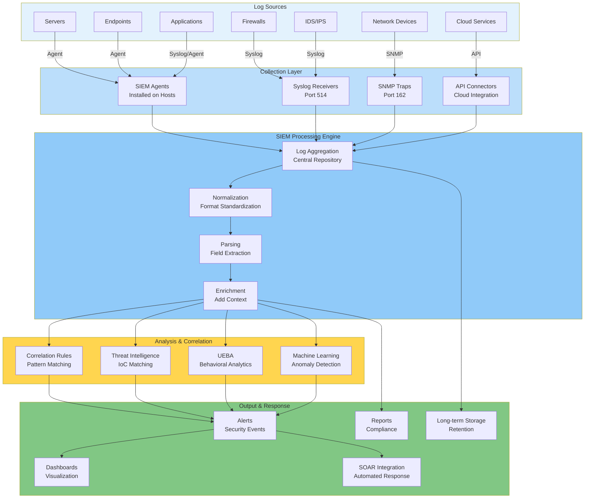


#### Log Aggregation and Normalization:

* **Aggregation**: Normalizing data from different sources so it is consistent and searchable.
* **Connectors/Plug-ins**: Used to interpret (**Parse**) data from distinct system types.
* **Regular Expressions (Regex)**: Parsing is carried out using Regex tailored to each log file to map content to standard fields.
* **Timeline**: Normalize Date/Time Zone definitions to a **Single Timeline**.

#### Correlation:

The critical function of SIEM (distinguishing it from basic log management) is **CORRELATION**:

* Linking individual events or data points (**Observables**) into a meaningful **Indicator of Risk / Compromise (IoC)** to drive an alerting system.
* Can use simple **If...Then** rules or AI/ML for automated analysis.

---

## ADVANCED ANALYTICS AND RESPONSE

### User & Entity Behavior Analytics (UEBA)

* Supports identification of malicious behaviors by comparison to a **Baseline "Normal"**.
* Tracks user account behavior across devices and clouds.
* **Entity**: Refers to machines (virtualized servers, IoT, workstations).
* Heavily dependent on **AI** and **Machine Learning (ML)**.

### Sentiment Analysis (Emotion AI)

* Used to gather **threat intel** and identify internal/external threats before they develop into attacks.
* **Use Case**: Interpretation of statements in natural language (e.g., monitoring social media for disgruntled customer comments).

### Security Orchestration, Automation & Response (SOAR)

* A solution to the problem of alert volume overwhelming analysts.
* Implemented as standalone tech or integrated with SIEM.
* Scans the organization's security and threat intel, analyzes it using ML, and uses that data to **automate** workflows for **Incident Response** and **Threat Hunting**.

---

## LINUX LOGGING AND SEARCH TOOLS

* **cat**: View contents of one or more files.
* **tail**: Output the **last**  lines of a file (e.g., `tail -n 10`).
* **head**: Output the **first**  lines of a file.
* **logger**: Writes input to the local system logfile or a remote syslog server. Used in scripts to write text strings to a log file. Command output can be written by enclosing the command in **backticks**.
* **Regular Expression (Regex)**: A search pattern to match within a string/text. Built from regex syntax (metacharacters) defining search operators, quantifiers, and anchors.
* **grep**: Invokes simple string matching or Regex to search the entire contents of a text file for a specific pattern within each line.


## OSI/TCP-IP Layer PROTOCOLS

### Implement Secure Network Operations PROTOCOL

Unsecure Protocols can be exploited by attackers to compromise **Data Security** and **System(s) Integrity**.

---

### DHCP / Network Address Allocation

DHCP provides an automatic method for **Network Address Allocation**.

* A key point is that only one server should be offering addresses to any group of hosts. By changing the default gateway, a **Rogue DHCP** can be used to **Snoop Network Info**.
* Perform **DoS** (as client machines will obtain incorrect TCP/IP configuration) ?? **Invalid Address Config**.
* **DHCP Starvation** is a form of DoS attack where a rogue client repeatedly requests New IP Add using **Spoofed MAC Add**, with the aim of exhausting the IP Address pool of a legitimate DHCP Server.
* Enabling **DHCP Snooping** port security feature on a switch can mitigate Rogue DHCP attacks.
* A compromise of a DHCP Server, an attacker could point clients to rogue DNS Servers and use that as a means to direct users to spoofed sites.
* Admin of DHCP Server must be carefully controlled.

---

### DOMAIN NAME RESOLUTION (DNS) PORT 53

DNS Resolves **FQDNs** To IP Addresses. Uses a Distributed DB system containing Info on Domains & hosts within those domains; this info is distributed among many name servers.

#### DOMAIN HIJACKING

An attack where an adversary acquires a domain for a Company’s Trademark / Name or perhaps some spelling variation thereof.

* Referred to as **Doppelganger / Cousin Domain**.
* Domain Name must be Re-Registered every year.
* Ensure Secure Credentials are used to manage the Registration.
* The `whois` cmd can be used to lookup domain Registration Info to try to detect misuse.
* **In Domain Hijacking Attack, an Adversary:**
* Gains Control over Registration of a Domain Name.
* Alter Host Records to point to his/her own IP.
* Supply false credentials to Domain Registrar when applying for a new domain / Re-Registration.
* Compromise the Domain Registrar Security.
* Exploit the account used to manage the domain.


#### URL Redirection

URL Redirection refers to the use of **HTTP Redirects** to open a page other than the one the user Requested.

* Often used for legitimate purpose & malicious behaviour.
* If Redirect is not properly validated by the Web App, a phishing link that appears legit to a naive user can be Crafted.
* Threat actor Compromise web server & Insert Redirects to attacker's files in its public directory.
* Inserted as **Javascript** by uploading a script via poorly validated **HTML FORM Tags**.
* A Hijacked Website leads to complaints like "blood" or Domain listed on a Blacklist (**Domain Reputation**).
* Ensure to set up a Monitoring using a site like **Talos Intel** to detect misuse early and prevent further Compromise.

#### DNS POISONING

This attack Compromises the process by which client Query Name servers to locate the IP Address for an FQDN. DNS poisoning attack can be perpetuated in the following ways:

* **A. MAN-IN-THE-MIDDLE (MITM):**
* Use of **ARP poisoning** to respond to DNS queries from the Victims with spoofed replies, Poison Victim's **ARP Cache**.
* Can be combined with **DoS attack** on the Victim's legit DNS Server.


* **A(b). A Rogue DHCP** could be used to config clients with the addresses of a Rogue DNS Resolver.
* **B. DNS Client Cache poisoning—HOSTS file before DNS:**
* Hosts file requires Admin Access privileges to modify.
* **Linux:** `/etc/hosts` | **Windows:** `%SystemRoot%\System32\Drivers\etc\hosts`
* Most OS check the file before using DNS servers Configured on gateway. Its contents are loaded into a Cache of known Name:IP mappings & client only contacts a DNS Server if the name is not cached.
* If an attacker is able to place a false name to IP mapping in the Hosts file, it effectively poisons the DNS Cache. He/she will be able to redirect traffic.


* **C. DNS Server Cache Poisoning:**
* Aims to corrupt Records held by the DNS Server itself.
* Accomplished by performing **spoofing replies** to Requests from other name servers.
* To reduce load on Authoritative DNS Servers, **DNS Resolvers** cache the responses they receive from previous queries. They store this resolved domain name & IP address Info temporarily so it can quickly respond to future requests without needing to query the Authoritative Servers.
* Attackers take advantage of introducing false Info into the DNS Resolver's cache, which will redirect users to malicious sites without their knowledge.
* This attack is carried out by:
* Sending **fake Responses** / **Guessing Query IDs**.
* **TTL Manipulation** for persistence.


* This attack can be mitigated by **Restricting DNS Recursion** to trusted clients; this can reduce risk of cache poisoning by minimizing the number of external queries that the Resolver performs.
* The `nslookup` & `dig` Tools can be used to query DNS Records & Cached Records held by a Server & determine if any false Records have been inserted!
* DNS is a critical service that should be configured to be fault tolerant.


---

### DOMAIN NAME SERVICE SECURITY (DNSSEC)

Helps to mitigate against spoofing/poisoning attacks by providing a Validation process for DNS Responses.

* Authoritative server Creates a package of Resource Records signed with a private key (the **Zone Signing Key**).
* During Requests, a Secure Record Exchange Returns the **RRset** along with its public key, used to verify the signature.
* Separate keys are used; a compromise of one key, the domain can continue to operate securely by Revoking the compromised key and issuing a new one.
* The **Key Signing Key** for a particular domain is validated by the parent domain or Host ISP.
* The Top level domain roots are validated by the regional Internet Registries & the **DNS ROOT Servers** are self-validated. Using a hierarchy of control / **Group Key Signing**, establishing a **chain of trust** from the Root Servers down to the subdomains.

#### Nslookup & DIG Tool

* **DNS Footprinting:** obtaining Info about a private network by using its DNS Server to perform a **Zone Transfer** of all Domain Records or a Rogue DNS or Network by simply querying the DNS Service using online tools.
* To prevent this, apply ACLs to Zone Transfers to authorized hosts.
* Local DNS server should only accept Recursive queries from local hosts (preferably Authenticated local hosts).
* Implement Access control measures on the server to prevent malicious Record alteration.
* Local hosts/clients should be Restricted to using Authorized locations to perform Name Resolution.
* Attacks can target DNS server Application Config/known Vulns in the Application (**BIND / Microsoft**) should be patched to the latest Version.
* Obtain & Check security announcements and test & apply critical security related patches and Upgrades.

---

### DIRECTORY SERVICES (LDAP) Port 389

A Network Directory lists the **Subject** (users, Computers, Services) & **objects** (Directories, files) available on the Network plus the Permissions that subjects have over objects' accessibility.

* A Directory facilitates **AuthN / AuthZ** maintained as highly Secure to ensure Data Security on a private Network.
* Most Directory services are based on **Lightweight Directory Access Protocol (LDAP)**.
* The base protocol provides No Security; transmission all in plaintext and Vuln to MITM / sniffing. This is mitigated by **BINDING** Authentication to the server through the following ways:
* **No-Authentication / Anonymous Access:** is granted by default (Unsecure).
* **Simple BIND:** clients Supply Distinguished Name & password, but these are passed in plaintext.
* **LDAP Secure (LDAPS) Port 636:** Server is Installed with digital certificate. Sets up secure channel for Credential Exchange.
* **Simple Auth & Security Layer (SASL):** Mechanism for AD / client to Server negotiate the use of supported Auth mechanisms like **Kerberos**.
* The **STARTTLS** cmd is used to Require encryption (**sealing**) & message Integrity (**signing**).


> **NB:** Unless hosting a public service, LDAP Directory Server should only be accessible from private Network. If Secure Access is Required, Simple Bind / No-Auth should be disabled on the Server.

---

### NTP TIME SYNCHRONIZATION (UDP port 123)

NTP provides a transport over which to synchronize these Time dependent Applications.

* Clients themselves obtain the time from higher **Stratum** layer NTP Servers using a modified form of the protocol (**Simple NTP**).
* NTP lacks any sort of security mechanism.
* Move to create a security extension for the protocol -> **Network Time Security**.

---

### Simple Network Mgt. PROTOCOL (SNMP)

A widely used framework for monitoring & managing network devices. Consists of SNMP Monitor and Agents.

* **AGENT** is a process running on a Network device or other SNMP Compatible network device.
* Agent maintains a DB >> **Mgt Info Base (MIB)** that holds stats relating to the activity of the device.
* Also capable of initiating a **Trap Operation** where it informs the mgt system of a notable event. Threshold for triggering trap can be set for each value.
* **SNMP Monitor** (a software program) provides a location from which network activity can be overseen. Monitors all agents by **polling** them at regular intervals for Info from their MIBs & displays Info for reviews & Trap operations as alerts for the Network Admin to assess & act on.

#### SNMP Guidelines:

* If SNMP is not used, then **Disable it** on SNMP Compatible devices that you add to the network & change default config Passwords.
* **SNMP v1 / v2c:** SNMP Community Names are sent in **plaintext**. Should not be transmitted over Unsecure Networks. Never leave Community Name Blank (Default). Hard to guess Community names. Use ACLs to Restrict mgt Ops to known hosts.
* **SNMP v3:** Supports **Encryption & Authentication**. Agents are Configured with list of Usernames & Access permissions. When AuthN is required, SNMP msg is hashed with a hash of the user's passphrase.

---

### HYPERTEXT TRANSFER PROTOCOL & WEB

HTTP enables clients (like web browsers) to request Resources from an HTTP Server. Using an Appropriate TCP port 80 / 443. Client submits a request for a Resource using a URL.

* The Request & Response formats are defined in **HTTP header**.
* HTTP payload carries **HTML** web pages (plaintext files with coded tags).
* A Normally **stateless protocol**; No info is preserved during a Session. Version 2 of HTTP adds more state preserving features.
* Bare functionality of HTTP servers is often extended by support for Scripting and programmable features.
* Servers can also set text file **cookies** to preserve Session Info.
* These coding features plus Integration with database increase flexibility & Interactivity, also expose more attack surface & Vuln.

---

### TRANSPORT LAYER SECURITY (TLS)

* Typically used with HTTP Application (**HTTP Secure / HTTPS**) but also used to secure other Application protocols (as pre-session).
* To Implement TLS, a Server is assigned a **digital Certificate** signed by some trusted CA. The Certificate Proves the identity of the server & validates its public key.
* The Server uses its key pair & the TLS protocol to agree on mutually supported Ciphers then client & server negotiate encrypted communication session.
* **Mutual AuthN:** used by VPN; ensure Certificate is Installed on the client as well.
* **SSL / TLS Versions:** TLS 1.0 / 1.1 / 1.2 / 1.3 (SSL 2.0 / 3.0).
* A **Downgrade attack** is where a MITM tries to force the use of a weak cipher suite and SSL/TLS Version.
* One of the main features of **TLS 1.3** is the removal of the ability to perform downgrade attacks by preventing the use of Unsecure features and Algorithms from previous Versions.
* **CIPHER SUITES:** These are algorithms supported by both the client & server to perform the diff encryption and hashing operations required by the protocol.
* Suites the Server prefers are listed earlier in its supported cipher list during the handshake >> **Server Hello**.
* Cipher suites are a Combination of Encryption (Symm / Asymm), Hashing and Key exchange (Session / Ephemeral key ex). Not a Cryptographic primitive as it uses more than one form of encryption.

---

### APPLICATION PROGRAMMING INTERFACE (API) CONSIDERATIONS

The primary means of configuring and managing web application is via its API.

* Use of APIs is Authorized via a **token / secret key**.
* Effective management of these API secrets is a Key Consideration in modern networks.
* Passing the key in the URL carries severe risk of exposure.
* APIs can use more secure AuthN / AuthZ methods such as **SAML** and **OAUTH**.
* Usage should be monitored to ensure only authorized endpoints are making transactions.

---

### SUBSCRIPTION SERVICES

Employees may require access to external subscription services. Some examples include:

* Market & financial Intelligence & Information.
* Security threat Intelligence & Information.
* Reference & training materials in diff formats.
* Software & cloud Application services.
* Usage should be monitored to ensure only authorized usage of content delivered by a third-party website or cloud Application & Browser.
* Necessary to provision Auth mechanism for Enterprise **Single Sign On** access to the service.
* **Web feeds** are based on **RSS** which use **XML** to markup each document supplied by the feed. Vuln to **XML Injection** style attacks, allowing an attacker to show malicious links / interact with the file system.

---

### FILE TRANSFER SERVICES [FTP PORT 21]

FTP Remains very popular because it is efficient and has a wide cross-platform support.

* An FTP Server is Configured with several public directories hosting files for user accounts. Most HTTP web servers also function as FTP Servers. FTP services, accounts, directories may be Installed by default when you install a web server.
* FTP has no security mechanisms | FTP traffic Interception.
* Auth & data transfer are unencrypted > **plaintext** >> Cred Sniffing or MITM Attacks.
* Ensure employees do not Install Unauthorized servers on their PCs, potentially adding attack surface.

#### Secure Shell File Transfer (SFTP) and FTP Over SSL (FTPS)

* **SSH FTP / SFTP:** addresses privacy & Integrity issues of FTP by encrypting the Auth & data transfer process between client-server. A secure link is created using SSH over **TCP port 22**. Ordinary FTP cmds for Auth & data transfer can be sent over the secure link without risk of eavesdropping. This requires an SSH server that supports SFTP.
* Another means of securing FTP is to use a secure connection protocol (SSL/TLS) in 2 ways:
1. **Explicit TLS (FTPS):** Use the `AUTH TLS` cmd to Upgrade Unsecure FTP Conn established over port 21 to a secure one. Protects Auth Cred; Data Conn for the actual file transfer can also be encrypted (using `PROT` Command).
2. **Implicit TLS (FTPS):** Negotiate an SSL/TLS tunnel before exchange of any FTP Cmds. Using **port 990** by default.


> **NB:** FTPS is tricky to Configure when there are firewalls because it uses Data Conns over a wide Range of dynamically assigned port numbers.

---

### EMAIL SERVICES (SMTP, POP, IMAP)

* **Simple Mail Transfer Protocol (SMTP):** Specifies how mail is sent.
* A mailbox protocol (**POP / IMAP**) stores messages for users and allows them to be downloaded to client computers or manage them on the server.
* To deliver a message, the SMTP Server of the Sender discovers the IP Add of the recipient SMTP server using the domain name part of the email address.
* The SMTP server for domains are registered in DNS using the **Mail Exchanger (MX) Record**.

#### SECURE SMTP (SMTPS)

There are several ways to secure SMTP over TLS:

* **STARTTLS:** A command to upgrade Unsecure connection to the **Explicit** or **Opportunistic** TLS. Widely Implemented.
* **SMTPS:** Establishes the secure Conn before any SMTP commands are exchanged. Referred to as **Implicit SMTP**.
* **MTA (Port 25):** used for message relay between SMTP servers.
* **MSA (Port 587):** used by mail clients to submit messages.
* **Implicit TLS (SMTPS) Port 465:** used for msg submission over assigned port.

#### POST OFFICE PROTOCOL (POP3)

* Mail Protocol designed to store the messages delivered / submitted by SMTP MSA, on a server.
* **Port 110 (Unsecure) / Port 995 (Secure POP3S).**
* Clients Connect to mailbox; POP3 downloads the msgs to the recipient's email client (Thunderbird / Outlook).
* Client Application establishes a TCP Conn to the POP server.
* Username Auth (users pass), contents of mailbox are downloaded for processing on local PC.

#### INTERNET MESSAGE ACCESS PROTOCOL (IMAP)

* **Port 143 (Unsecure) / Port 993 (Secure IMAPS).**
* IMAP supports permanent connection to a server and connecting multiple clients/apps to the same mailbox.
* Allows clients to manage mail folders on the server.
* Clients Auth themselves, then retrieve messages from designated folders.
* Connections can be secured by SSL/TLS tunnel.

---

### S/MIME (Secure Multipurpose Internet Mail Extensions)

A means of Applying Authentication & Confidentiality on a per-message Basis. To use S/MIME, the user is issued a digital cert containing key pairs Signed by a CA as to its Validity.
To establish the exchange of secure email, both Users must be using S/MIME & exchange Certs:

1. **ALICE sends Digital Cert** (pub key & valid digital ID) Signed by Private key (Alice's private key); where Digital ID = Email Address.
2. **BOB uses the pub key** in the Cert to decode the signature & signature of the CA (or chain of CAs) to validate Alice's Digital ID, Digital cert & decides to trust Alice's email.
3. **He Responds** with his digital cert & public key; Alice, following the same process, decides to trust BOB.
4. **BOB & Alice** have each other's cert in their trusted cert store.
5. **When Alice sends Bob a Confidential message:**
* Alice makes a **Hash** of the msg & signs the Hash with her private key.
* Alice encrypts (**Message, Hash, Public Key**) Using BOB's public key.
* Sends this data as an S/MIME attachment.


6. **BOB receives the message** & decrypts the attachment using his private key. He validates the signature for the Integrity of the message by decrypting it with Alice's public key & compares her hash value to the one he makes himself.

---

### VOICE AND VIDEO SERVICES

Each part of Comm media Network needs to be evaluated. This includes protocols, servers, handsets & software.
This protocol functions support Real-time services:

* **Quality of Service (QoS):** Ensures Communication free from Jitter, delay and lost / dropped packets.
* **DATA TRANSPORT:** handles delivery of the actual data.
* **SESSION CONTROL:** used to EST, MNG, DIS. your Communication sessions.
* They handle User discovery (locating user on the Network).
* Availability Advertising (if user is prepared / Available).
* Negotiating Session parameters (use of audio / video).
* Session Management and Termination.


#### SESSION INITIATION PROTOCOL (SIP)

* Session control protocol. **Port 5060 / Port 5061 (Secure).** Most widely used.
* Each SIP Endpoint (user-agents) | IP-enabled handsets / client/server web conference software is assigned a Unique SIP address >> **SIP Uniform Resource Indicator (URI)**.
* **Syntax:** `sip:user@domain:port`
* SIP endpoints can establish comms directly (peer to peer) or via use of Intermediary Servers & Directory Servers & VoIP Gateways & private Branch Exchange (PBX) appliances (provide an interface between the VoIP network internally and external telephone and cellular networks).
* SIP only provides Session Management features.

#### REAL-TIME TRANSPORT PROTOCOL (RTP)

* The actual delivery of Real-time data like voice/video.

#### Vulnerabilities & Security

* Threat actors could exploit unencrypted voice comms to try to Intercept Confidential Credentials. Without **Strong Mutual Auth**, Connections are also Vulnerable to MITM Attacks.
* Comm Security for Video/Voice works similarly to HTTPS. To initiate the call, the Secure Version **SIPS** uses digital certs to Auth endpoints and establish a TLS tunnel.
* The Secure Conn Est. can be used to generate a master key to use to secure Versions of the Transport protocol.
* **Secure Real-Time Transport Protocol (SRTP):** provides Confidentiality for the actual VoIP data.

---
## Implement Secure Remote Access Protocols

These **Remote Connections** often make use of **Untrusted Public Networks** (use **Internet**). **Remote Access** means that the user's device does not make a direct cabled/wireless connection to the network; rather, it is through an intermediate network, such as the Internet. Remote Access is implemented as a **VPN** (**Virtual Private Network**).

Administering Remote Access involves the same tasks as administering the local network. Hence, only **Authorized Users** should be allowed access to **Local Network Resources** and communication channels. It is more difficult to ensure the security of **Remote Workstations** and servers, and there is a greater opportunity for remote logins to be exploited.

---

### Client-to-Site vs. Site-to-Site

* **Client-to-Site VPN**
* Clients connect to a **VPN Gateway** on the edge of the **Private Network**.
* The VPN protocol establishes a secure tunnel to that gateway.
* Contents are kept private.
* **Telecommuter Model**.
* Connection initiated by clients.


* **Site-to-Site VPN**
* Connects 2 (or more) private networks.
* VPN is configured to operate automatically.
* Hosts at each site do not need to be configured with any information about the VPN.
* The VPN gateways at each site handle security information, users, and VPN protocols (**IPsec**, **TLS**, **PPTP**).
* **Trust** is established between gateways.

---

### Internet Protocol Security (IPsec)

**IPsec** operates at the **Network Layer (Layer 3)**. It can be implemented without having to configure specific application support. IPsec provides **Confidentiality** (by encrypting data packets) and **Integrity** (by signing each packet) / **Anti-Replay**.

An IPsec drawback is the addition of overhead to data communications. IPsec is used to secure communications on local networks and as a **Remote Access Protocol**. IPsec is recommended for **IPv6** but not mandatory. Each host that uses IPsec must be assigned a policy.

> **IPsec Policy**: Sets authentication mechanism, protocol to use, and mode for the connection. Hosts must be able to match at least the security method for a connection to be established.

#### IPsec Core Operating Protocols

1. **Authentication Header (AH)**: Not often used. **AH** performs a cryptographic hash on the whole packet. The recipient performs the same function on the packet using a keyed hash: . The payload is not encrypted, so this protocol does not provide confidentiality. The inclusion of IP header fields in the **ICV** (**Integrity Check Value**) means that the check will fail across **NAT** gateways where the IP address is rewritten.
2. **Encapsulating Security Payload (ESP)**: Provides confidentiality and integrity. The integrity of the payload and IP header is ensured by the **ICV**.

---

### Transport Layer Security (TLS) VPN

Server uses **TLS**. **Legacy Port-to-Port Tunneling Protocols** do not provide adequate security. **TLS** and **IPsec** are preferred options for configuring VPN access.

* **TLS VPN & SSL**:
* Client makes connection to the **VPN Gateway**.
* Server is authenticated to the client; optionally, the client certificate must be authenticated by the server.
* An encrypted tunnel is created for the user to submit credentials, normally processed by a **RADIUS** server.
* Once the user is authenticated, the connection is fully established.
* VPN gateways tunnel all communications for the local network over the secure socket created.


TLS is applied at the **Application Layer**, either by using a separate secure port or by using commands in the application protocol to upgrade and negotiate a secure connection. TLS over **UDP** is referred to as **Datagram TLS (DTLS)**.

* **OpenVPN**: Open-source implementation of a TLS VPN. Modes of operation include:
* **TAP (Bridged) Mode**: Tunnels Layer 2 frames.
* **TUN (Router) Mode**: Forwards Layer 3 IP packets.


* **Microsoft Secure Sockets Tunneling Protocol (SSTP)**: Works by tunneling **PPP** Layer 2 frames over a TLS session.
* **PPP (Point-to-Point Protocol)**: A widely used remote dial-in protocol. Provides encapsulation for IP traffic plus IP address assignment and authentication via widely supported **CHAP**.

---

### VPN Client Configuration

* **OpenVPN** requires client installation.
* Configure client with **VPN Gateway Address**, **VPN Protocol Type**, **Username**, and **Account Credentials**.
* Additionally, deploy a **Client Certificate** that is trusted by the **VPN Concentrator** to the machine and make that available to the VPN client.

#### Always-On VPN

This means that the computer establishes the VPN whenever an internal access connection over a trusted network is detected, using the user's cached credentials to authenticate.

#### Split-Tunnel vs. Full-Tunnel

* **Split-Tunnel**: Client accesses the Internet directly using its native IP configurations and DNS servers. **LAN** traffic is routed through the VPN gateway to the host on the enterprise private network.
* **Full-Tunnel**: Internal access is mediated by the VPN gateway, which will alter the client's IP address and DNS servers, and may use a forward proxy. More data is trafficked over the link. Offers more security, but **Network Address Translation (NAT)** by the gateway and DNS operations may cause problems with some websites or cloud services.

---

### Remote Desktop and Remote Administration

Remote access VPN joins the user's PC/smartphone to the local network via the secure tunnel. In **Remote Desktop (RD)**, however, remote networking involves connecting to a host within the local network over a **Remote Administration Protocol**.

* **Microsoft RDP**, **VNC**, **SSH**, **TeamViewer**.
* A remote administration protocol sends screen and audio data from the remote host to the client and transfers mouse and keyboard input from the client to the remote host.
* A site can operate a **Remote Desktop Gateway** that facilitates access to virtual desktops or individual applications running on network servers.

> **Notes on HTML5 VPN**: The canvas element in **HTML5** allows a browser to draw/update a desktop with relatively no lag, referred to as **Clientless RD**. This solution also uses **Web Sockets Protocol**, which enables bidirectional communications between client and server without requiring the overhead of separate HTTP requests.

---

### Secure Administration Workstations (SAWs)

Refers to the specific use case of using a secure terminal to administer over a network application.

* Installed with no software other than that required to access the administrative channel.
* SAWs should be denied Internet access or be restricted to a handful of approved vendor sites for patches and drivers.
* Must be subjected to stringent authentication and auditing.

---

### Out-of-Band (OOB) Management

* An **In-band Management** link is one that shares traffic with other communications on the production network.
* An **Out-of-band Management** link is one that doesn't share traffic (management traffic) with other communications on the network. There is either a physically separate network infrastructure or a dedicated modem/serial connection.
* OOB is more secure but costly to implement. Access to management devices is preserved when there are problems affecting the production network.
* Using In-band, better security can be implemented by using a **VLAN** to isolate management traffic; however, access could be compromised by a system-wide network failure. OOB makes it harder for potential eavesdroppers to view or modify traffic passing over the management interfaces.

---

### Jump Servers

Difficult to provide admin access to servers located in the **DMZ**.

* Admin interface could be compromised and exploited as a **Pivot Point** into the rest of the network.
* Management hosts permitted to access admin interfaces on hosts in the secure zone must be tightly controlled. Requires complex configuration and auditing.
* One solution to this complexity is to add a single **Admin Server** (Jump Server) to the secure zone, only running the necessary admin ports and protocols (typically **SSH** | **RDP**).
* Admins connect to the Jump Server and then to the admin interface on the **Application Server**.
* The Application Server has a single entry in its **ACL** to permit connection attempts from the Jump Server only.

---

**Missing Text Audit (Checksum):**

* **NTP Stratum/SIP Syntax:** Not present in source text provided.
* **Protocols verified:** IPsec (AH/ESP), TLS (DTLS), OpenVPN (TAP/TUN), SSTP, PPP, CHAP, RDP, SSH.
* **Structural Check:** Split-tunnel vs Full-tunnel, SAWs, and Jump Servers restored.

## Hardware Root of Trust / Trust Anchor

A **Secure Subsystem** providing **Attestation** (meaning a statement made by the system can be trusted by the receiver). **Secure Boot** monitors OS files' integrity by verifying their signatures and returning a signed report.

A **Root of Trust** can be established by a type of crypto processor: **Trusted Platform Module (TPM)**.

* **TPM** is a specification for hardware-based encryption key storage, hashed passwords, and user and platform identification information.
* Implemented either as part of the chipset or as an embedded function of the CPU.

---

### Implement Secure Firmware

**Unified Extensible Firmware Interface (UEFI)** provides code that allows the host to boot to an OS. UEFI can enforce a number of **Boot Integrity** checks:

* **Secure Boot**: Prevents a system from being hijacked by a malicious OS. Requires UEFI but not TPM. UEFI is configured with digital certificates from valid OS vendors. The system firmware checks the OS boot loader/kernel using the stored certificate to ensure it has been digitally signed by the OS vendor, preventing a boot loader/kernel that has been changed by malware (or an OS installed without authorization) from being used.
* **Measured Boot**: A trusted boot process uses **Platform Configuration Registers (PCR)** in the TPM. At each stage in the boot process, it checks whether a hash of key system data—boot firmware, boot loader, OS kernel, critical system drivers—has changed. It records the presence of unsigned kernel-level code.
* **Boot Attestation**: The capability to transmit a boot process log report signed by the TPM via a trusted process/protocol to a remote server (e.g., a **NAC** server). The boot log can be analyzed for signs of compromise. Hosts can be prevented from accessing the network if they do not meet the required **Health Policy** or if no boot attestation log report is transmitted/received.

---

### Disk Encryption

**Full Disk Encryption (FDE)** means that the entire contents of the drive (or volume), including system files and folders, are fully encrypted.

* OS-based security measures are simple to circumvent if an adversary can attach the drive to a different host OS.
* **FDE** mitigates the security concern by making the contents of the drive accessible only in combination with the correct encryption key.
* FDE requires secure storage of the key used to encrypt. A **TPM Chip** has a secure storage area that a disk encryption program (e.g., **Windows BitLocker**) can write its keys to. It is also possible to use a removable USB drive.
* As part of the setup process, you create a **Recovery Password/Key** used if the disk is moved to another computer or if the TPM is damaged.
* Disk encryption can be applied to **SSDs** and **HDDs**.

#### Self-Encrypting Drives (SED)

A drawback of FDE is that because the OS performs the cryptographic operations, performance is reduced. This issue is mitigated by **Self-Encrypting Drives (SED)**, where the cryptographic operations are performed by the drive controller.

* SED uses a symmetric data/media encryption key (**DEK/MEK**) for bulk encryption.
* It stores the DEK/MEK securely by encrypting it with an asymmetric key pair called the **Key Encryption Key / Authentication Key (KEK/AK)**.
* Use of the AK is authorized by the user's password.
* **Note**: A user's password can be changed without having to decrypt and re-encrypt the drive again.

#### TPM Key Structure

* TPMs are hard-coded with a unique, unchangeable asymmetric private key called the **Endorsement Key (EK)**.
* The EK is used for creating subkeys used in key storage and signature/encryption operations.
* TPM supports the concept of an **Owner**, identified by a password. Anyone with Admin control over the setup program can take ownership of the TPM, which destroys and then regenerates its subkeys.
* TPM can be managed in Windows via the `tpm.msc` console or through **Group Policy**.
* On an enterprise network, TPM can be centrally managed via the **Key Management Interoperability Protocol (KMIP)**.

> No complete assurance exists that the firmware underpinning the Trust Anchor/Hardware RoT is invulnerable; however, attacks against trusted modules are sufficiently difficult.

---

### USB Flash Drive Security

Exploiting the firmware of external storage devices presents adversaries with an incredible toolkit. Firmware can be reprogrammed to make the device work as a functional keyboard (delivering a series of keystrokes) acting as a **Keylogger**, or as a network device (AP).

* Warn users of the risks; repeat the advice to **never attach devices of unknown provenance** to workstations.
* Hosts should always be configured to prevent **AutoRun** when USB devices are attached.
* USB ports can be blocked entirely by **HIDS**.
* Observe modified/suspicious USB drives in a sandboxed lab system (**Sheep Dip**). Look for command prompt console changes to the registry or other system files.

---

### Third-Party Risk Management

A **Supply Chain** is the end-to-end process of supplying, manufacturing, distributing, and release of goods and services. A Root of Trust is only trustworthy if the vendor has implemented it properly.

* For a TPM to be trustworthy, the supply chain (manufacturers, firmware authors, OEM resellers, and admin staff responsible for provisioning the device) must all be trustworthy.
* Establishing a **Trusted Supply Chain** for PC equipment denies malicious modification of assets. Particular care should be taken if use is made of second-hand machines.
* Use of reputable **OEMs** represents the best practical effort at securing the supply chain. Government, military, and large organizations will exercise high scrutiny.

#### Supplier Categorization

When assessing suppliers for risk, distinguish between:

* **Vendor**: Supplier of commodity goods and services.
* **Business Partner**: Relationship between two companies that share closely aligned goals and marketing opportunities. (e.g., Microsoft is a software vendor; it develops partner relationships with **Original Equipment Manufacturers (OEMs)** or solution providers to expand its market).

#### Software Lifecycle Risk

* **Open Source**: If software is well-maintained, identify versions that have **Long Term Support (LTS)**. Other builds and version branches might not receive updates.
* When provisioning a supplier for applications and devices, it's vital to establish that they have effective **Security Management Lifecycles** for their products.
* One cannot outsource **Legal Accountability** for outsourced products/services or vendor actions. Any security breach in their organization is effectively a breach in yours.

---

### End-of-Life (EOL) Systems

When a manufacturer discontinues sales of a product, it enters an **End-of-Life (EOL)** phase in which support availability, spare parts, and updates become limited.

* An **End-of-Service-Life (EOSL)** system is one that is no longer supported by its developer or vendor.
* EOSL products receive no further security updates, representing a critical vulnerability if the software/hardware is in active use.

---

### Organizational Security Agreements

Contractual responsibilities can be set out in formal legal agreements, such as:

1. **Memorandum of Understanding (MOU)**
2. **Business Partnership Agreement (BPA)**
3. **Non-Disclosure Agreement (NDA)**: Legal basis for protecting information assets.
4. **Service Level Agreement (SLA)**
5. **Measurement Systems Analysis (MSA)**: Means of evaluating the data collection and statistical methods used by a quality management process to ensure they are robust. A quantified analysis method to determine the effectiveness of a system.

---

**Missing Text Audit (Checksum):**

* **Concepts Verified:** TPM (EK, Owner, KMIP), UEFI (Secure/Measured Boot, Attestation), SED (DEK/MEK, KEK/AK), Supply Chain (OEM, EOL/EOSL), Agreements (MOU, BPA, NDA, SLA, MSA).
* **Technical Verbatim:** "Sheep Dip" lab system, "Endorsement Key," and "Long Term Support" (LTS) preserved.

## IMPLEMENT ENDPOINT SECURITY

Hardening and secure endpoint configuration is critical; **Host Hardware Integrity** is of much less use if the **OS** and applications software running on it are weakly configured.

### HARDENING SECURE ENDPOINT CONFIGURATION

Hardening is the process of putting an **OS** / **App** in a secure configuration.

* Ensure not to restrict the system's access capabilities beyond what is necessary.
* Must be balanced against access requirements and usability in a particular situation or intended use.
* To reduce the potential attack surface, the essential principle of hardening is that of **Least Functionality**.
* A system should run only the protocols and services required by legitimate users and no more.
* **Interfaces** provide a connection to the network. If any of these interfaces are not required, they should be explicitly disabled rather than left unused.
* **Unused Services** should be disabled.
* **App Service** ports should either be disabled or blocked at a firewall if remote access is not required.
* Ensure **Disk Encryption** for **data-at-rest** storage.
* Establish a maintenance cycle for each device and keep up to date with security threats and responses.

---

### BASELINE CONFIG & REGISTRY SETTINGS

* Establish separate secure configuration baselines for **Desktop clients**, **file & print servers**, **DNS servers**, **App Servers**, **directory services servers**, and other systems.
* **Windows Domain Networks** make use of **Group Policy Objects (GPOs)**, where each domain-joined computer receives policy settings from one or more **GPOs**. These policies are applied to the registry each time a computer boots.
* Rights to modify the **Registry** should only be issued to user and service accounts on a **least privilege** basis.
* **Baseline Deviation Reporting** means testing the actual configuration of hosts to ensure that their configuration matches the baseline template.
* Tools such as **Microsoft Baseline Security Analyzer (MBSA)** and **Microsoft Security Compliance Toolkit** are used to test and validate the security configuration.

---

### PATCH MANAGEMENT

No **OS**, software application, or firmware is wholly free from vulnerabilities.

* **Patch Management** discovers missing patches for the **Operating System**, a wide range of 3rd party **Apps**, and device firmware.
* An effective procedure must be in place to apply patches.
* In small networks, hosts can be configured to auto-update, handled by **Windows Update**, **Linux yum-cron**, or **apt update**.
* Enterprise networks should be cautious of automated deployment of patches, as there can be performance and management issues when multiple applications run update clients on the same host.
* This issue can be mitigated by deploying an **Enterprise patch management suite** like **Microsoft’s System Center Configuration Manager (SCCM)** / **Endpoint Manager**.

#### Patch Management Challenges

* **Difficulty in Scheduling Patch Operations:** Applying the patch is an availability risk to critical systems.
* **Indicator of Compromise (IoC):** Continual issues with missing patches could be an indicator of compromise.
* **Legacy Systems:** Legacy systems, proprietary systems, and systems from vendors without robust security management plans (**IoT** devices) can be difficult to implement patch management.
* These systems will need **Compensating Controls** or some other form of risk mitigation if patches are not ready.

---

### ENDPOINT PROTECTION

Configure endpoint protection for automatic detection and prevention of malware threats.

#### Detection Methods

1. **Signature-based detection and prevention:** Standard identification of known threats. Such detections are often insufficient for the prevention of data breaches.
2. **Anti-Virus (AV) / Anti-Malware:** Extended by host-based tools.
3. **HIDS / HIPS (Host-based Intrusion Detection/Prevention System):** Provide threat detection via event log and **File System Monitoring (FIM)**. A **HIDS** can be configured to abort suspicious **Registry** entries.

#### Endpoint Protection Platform (EPP)

Installing multiple endpoint protection agents on a local host can impact system performance, cause conflicts, create numerous technical support incidents, and generate security incident false positives.

* **EPP** is a single agent performing multiple security tasks including:
* Malware / Intrusion detection and prevention.
* **Host Firewall**.
* **Web content filtering** and **Secure Browsing**.
* **File and Data Encryption**.
* **Data Loss Prevention (DLP)**: **DLP** agents are configured with policies to identify privileged files and strings that should be kept confidential. The agent enforces the policy to prevent data from being copied or attached to a message without authorization.


#### Antivirus Response

An **On-Access Antivirus scanner** or **Intrusion Prevention System** works by identifying when processes or scripts are executed and intercepting the call to scan the code first.

* If the code matches a **Signature** of known malware or exhibits malware-like behavior that matches a profile, the scanner prevents the execution and attempts to take the configured action on the host file (**clean**, **quarantine**, **erase**, and so on).
* An alert will be displayed to the user.
* The action will be logged (may generate an admin alert).
* The malware is tagged by **Common Malware Enumeration (CME)** identifiers or using vendor proprietary strings. These identifiers can be used to research the symptoms and methods used by the malware.
* It’s important to track the source of the infection and ensure it's blocked to prevent repeat attacks.

---

### ENDPOINT PROTECTION DEPLOYMENT

1. Configure management system to push the agent software and updates to all desktops and workstations.
2. Assign hosts to appropriate groups for policy assignments (different endpoints have different security requirements).
3. Test the different host group configuration settings to ensure that the expected range of threats is detected.
4. Use a monitoring dashboard to verify status across all network hosts. Apart from detection events, if the agent itself is missing or disabled, there should be an alert.

---

### NEXT GENERATION ENDPOINT PROTECTION

Where **EPP** provides mostly signature-based detection and prevention, **Next Generation Endpoint Protection** with **Automated Response** is focused on logging **Endpoint Observables** and **Indicators** combined with **Behavioral and Anomaly-Based Analysis**.

#### Endpoint Detection and Response (EDR)

Malware may evade detection by automated scans. **EDR** products aim not to prevent initial execution but to:

* Provide **Real-time** and historical visibility into the compromise.
* Contain the malware to a single host.
* Facilitate remediation of the host to its original state.
* Such agents are likely to be managed from a cloud portal and use **Artificial Intelligence (AI)** and **Machine Learning** to perform **User and Entity Behavior Analysis (UEBA)**.
* **Managed Detection and Response (MDR)** is a class of hosted security services.

#### Advanced Malware Tools

Tools like **Sysinternals** are used when symptoms are identified but the **AV** scanner or **EPP** agent does not report an infection. Further analysis of the host for malware uses advanced tools. Indicators include:

* Suspicious network connections.
* Unexplained activity or behavioral analysis of **SIEM** and **IDS** logs.

---

### SANDBOXING

A technique that isolates an untrusted host, app, script, or file in a segregated environment to conduct tests.

* **Sandbox Environments** intentionally limit interfaces with external files and hosts.
* Determine malicious activity of certain files.
* Determine the effect if run outside the sandbox and what dependencies it might require.
* Sandboxes offer more than anti-malware alone because you can apply a variety of different environments to the sandbox instead of just relying on how the malware might exist in your current configuration.

---

### NEXT GENERATION FIREWALL INTEGRATION

An analytics-driven **Next-Gen Antivirus** product is likely to combine with the perimeter and local security offered by **Next-Gen Firewalls**.

* **Example:** Detecting a threat on an endpoint would automate a firewall policy to block the covert channel at the zone, isolate the endpoint, and mitigate risks of the malware spreading.

---

## IMPLEMENT SECURE EMBEDDED SYSTEMS

### EMBEDDED SYSTEM FUNCTIONALITY

An embedded system is a complete system designed to perform a specific, dedicated function within a **Static Environment** (whereas a PC is a **Dynamic Environment**).

* **Static Environment:** Requires/does not allow or require frequent changes. In terms of security, this can be ideal as unchanging environments are typically easier to protect and defend.
* Functionality can be found in consumer devices and industrial devices (**IoT**).
* Constrained by **processor capability** (cores and speed), **system memory** (low), and **low persistent storage**.
* Characterized by predictable processing workloads and time-sensitive operations.

#### Hardware Architecture: PC vs. Embedded

* **PC Hardware:** **Root of Trust** in a **Trusted Platform Module (TPM)** is an **Explicit Trust Anchor**.
* **Embedded Networks:** **Root of Trust** is often implied. Based on an **Implied Trust Model**, any device added to the network is trusted by the administrator.

| Feature | Desktop PC Architecture | Embedded System Architecture |
| --- | --- | --- |
| **Components** | Generalized CPU, processors, controllers, I/O, system memory linked via **Motherboard**. | **System on Chip (SoC)** design where all components are on a **single processor DIE or microchip**. |
| **Efficiency** | High compute resource usage. | Microchip packaging is space and power efficient (e.g., **Raspberry Pi**, **Arduino**). |
| **Specialization** | General purpose. | **Application-Specific Integrated Circuits (ASICs)** or **Microcontrollers**. |

* **Microcontroller:** A processing unit capable of performing sequential operations from a dedicated instruction set determined by the vendor at the time of manufacture. Software is converted to dedicated instructions by **Assembly Language**.
* **Field Programmable Gate Array (FPGA):** A type of microcontroller with no default dedicated instruction set at the time of manufacture. The end administrator can configure the programming logic of the device to run specific applications.

---

### OPERATING SYSTEMS & CONSTRAINTS

* **Real-Time Operating Systems (RTOS):** Embedded systems use OSs that are much more stable and reliable.
* **Baseband Firmware:** Used in cellular communication.
* **Performance Requirements:** Low tolerance for reboots, crashes, or lagging.
* **Latency and Reliability:** Tend to be more important than high data rates. **RTOS** have fast response times predictable to microsecond tolerance.
* **Security:** **RTOS** have as small an attack surface as possible but are still susceptible to **CVEs** and exploits.

#### Power and Connectivity Constraints

* **Smartphones:** WiFi/5G/4G are power-hungry, requiring antennas to maximize data rates, range, and bandwidth.
* **Embedded Systems:** Rely on power-efficient data transfer of small amounts of data with high reliability and low power consumption.
* Lack of compute resources often leads to a lack of security options like **Authentication** and **Identification** tools. This prompts the development of **Lightweight Ciphers** (low key size/digest) that don't require large processing resources.

---

### COMMUNICATIONS CONSIDERATIONS

There is a need for closer integration with IT networks using standardized communication technology.

* **Operational Technology (OT) Networks:** Refers to cabled networks for industrial applications.
* Use **Serial Data** protocols or **Industrial Ethernet**.
* Optimized for real-time deterministic transfers.


* **Layer 2 Switching:** Ethernet switching performs Layer 2 switching only.
* **Cellular Networks:** Facilitate long-distance communications.
* **Baseband Radio:** Managed by a baseband processor acting as a cellular modem.
* **Narrow Band-IoT (NB-IoT):** A low-power version of 4G LTE.
* **LTE Machine Type Communication (LTE-M):** Compatible with 5G networks and does not interfere with 5G signaling. Use 5G tower relays.


* **Microwave Radio Networks:** Cellular networks are essentially microwave radio networks.

---
### LTE AND CELLULAR RADIO

LTE-based **Cellular Radio** uses a **SIM** (Subscriber Identity Module) as an identifier.

* **NB-IoT** / **LTE-M** devices use the same function.
* An **eSIM** (embedded SIM) incorporates the identifier as a chip on the System Board.
* Encryption of frames between the Cell Tower and Endpoint is the responsibility of the network operator.
* **Over-the-Air Encryption** is performed by encryption schemes defined by the cellular standard.
* **Backhaul Security** (encryption from the network backhaul to internal routers) is usually enforced by **IPsec**.
* Network and Application layer security should be used for added security.

---

### ZIGBEE AND Z-WAVE

Wireless communication protocols used in creating **Mesh Topologies** with low power/low data rate requirements.

* **Zigbee:** Based on the **IEEE 802.15.4** standard.
* **Z-Wave:** Uses low-energy radio waves.
* Both have communications encryption. The main threats are:
* **Re-pairing Attacks:** Allows a threat actor to discover the network key by forcing a device off the network, causing it to try to re-connect (similar to De-auth attacks on IP networks).
* **Rogue Devices:** Unauthorized devices connected to the network systems.


---

### INDUSTRIAL CONTROL SYSTEMS (ICS)

* Industrial processes prioritize **Availability** and **Integrity** over **Confidentiality**—reversing the **CIA Triad**.
* **ICS** provide mechanisms for workflow and process automation.
* These systems control machinery in **Critical Infrastructure**.
* **Data Transfer** occurs via **Machine-to-Machine (M2M)** communications.

#### ICS Components

* **Distributed Control System (DCS):** An **ICS** that manages process automation within a single site.
* **Programmable Logic Controllers (PLCs):** Plant devices and equipment embedded with **PLCs**.
* **Fieldbus:** A serial network used in **Operational Technology (OT)** to link **PLCs**.
* **Industrial Ethernet:** Used to link **PLCs** and connect to **Actuators** and **Smart Devices** (Valves, motors, circuit breakers, sensors).
* **Human-Machine Interface (HMI):** Used for output configurations and monitoring of a **PLC**.
* **SCADA (Supervisory Control and Data Acquisition):** Takes the place of a control server in large-scale multi-site **ICS**.
* Typically runs as software on ordinary PCs.
* Uses **WAN** communications.
* Gathers data from and manages plant devices and equipment (referred to as **Field Devices**, **Nodes**, or **Sensors**).


#### ICS Application Sectors

* **Power Generation & Energy Distribution.**
* **Industrial:** Refineries and mining.
* **Fabrication & Manufacturing/Assembling.**
* **Logistics.**
* **Facilities:** Building Management Systems (BMS), HVAC.

---

### INTERNET OF THINGS (IoT)

Describes a global network of appliances and devices equipped with sensors, software, and network connectivity.

* Each "thing" is identified with a **Unique Serial Number** or code embedded within the hardware.
* Able to inter-operate within existing infrastructure either directly or via an intermediary hub or control system.
* **IoT devices are Headless** (no local interface).
* **Sensors:** Measure temperature, humidity, light levels, pressure, motion, proximity, gas, smoke, heart/breathing rates, etc.
* Examples: Thermocouples, Thermistors, Infrared Detectors, Inductive Coils, Photoelectric Cells, Capacitive Cells, Accelerometers, Gyroscopes.

---

#### IoT Vulnerabilities

* Vulnerable to attacks because of:
* Poorly documented security factors.
* Poor patch management.
* Weak security response processes.
* **Weak Default Configuration.**
* Minimum configuration effort (ease of use over security).


---

### SPECIALIZED SYSTEMS

#### Smart Buildings

* **Building Automation Systems (BAS):** A specialized system for facility automation. Refers to the use of embedded systems or **IoT** devices for:
* **Physical Access Controls (PACS):** Electronic locking, alarms, and metal detectors.
* **HVAC Systems.**
* **Fire Suppression.**
* **Elevators and Escalators.**


* **Typical Vulnerabilities:**
* Memory vulnerabilities (e.g., **Buffer Overflow**).
* Use of plaintext crypto keys/credentials within application code.
* Code injection via UI interfaces used to configure the system.


#### Smart Meters

* Update reports of electric, gas, or water use back to the supplier.
* Reduces need for manual inspection.
* Communicates info via **IoT** protocols (**Zigbee**, **Z-Wave**) for integration with smart appliances.

#### Surveillance

* **PACS** involve a network of monitored locks, intruder alarms, and Video/Audio surveillance.
* Often installed and maintained by an external supplier, leading to it being omitted from Risk and Vulnerability assessments.
* **CCTV** vulnerabilities allow attackers to perform their own surveillance.
* **Requirement:** Evaluate the supplier to demonstrate their security monitoring and remediation support.

#### Multifunction Printers (MFPs)

* Single device capable of **Print/Scan/Fax** functions.
* Firmware must be patched and updated regularly.
* Documents are frequently recoverable from these machines (internal storage).
* Ensure proper sanitization of images, documents, and files.
* Can be used as a **Pivot Point** to attack the rest of the network.

#### Voice over IP (VoIP)

* Embedded systems used to implement **VoIP** endpoints (handsets/conferencing units) and gateways.
* **Media Gateway:** Uses separate firmware/OS stack.

#### Specialized Systems for Vehicles and Drones

* **Automobiles / Unmanned Aerial Vehicles (UAV):** Contain sophisticated electronics to control engines, power systems, braking/landing, stability, and suspension.
* **Electronic Control Unit (ECU):** Connected via **CAN bus**.
* **Controller Area Network (CAN) Bus:** A serial communication bus for **ECUs**.
* Functions similarly to Ethernet.
* **ECUs** transmit broadcast messages to all other **ECUs** on the same bus with **no concept of Message Authentication, Integrity checks, or Source Addressing.**


* **Onboard Diagnostics Module (OBD-II):** A principal external interface and an **ECU**.
* **Vulnerabilities:**
* Breaching physical security.
* Remote access of **CAN bus** via cellular features or navigation/entertainment systems.
* Onboard WiFi broadens the attack surface.


#### Medical Devices

* An array of systems (e.g., infusion pumps, monitors) potentially vulnerable to:
* Use of unsecure communication protocols.
* Use of unsupported versions of **OS**.
* High availability costs (updating software is disruptive to patient services).


* **Goals of Attacks:**
1. Hold units for **Ransom** by threatening service disruption.
2. Kill or injure patients by tampering with device settings.
3. Use compromised devices to pivot to networks and steal **Protected Health Information (PHI)**.


---

### SECURITY FOR EMBEDDED SYSTEMS

1. **Network Segmentation:** Network access for **IoT** environments should only be required to apply firmware updates.
2. **Wrappers:** Use of wrappers like **IPsec** for protecting traffic between trusted and untrusted networks.
3. **Programming Security:** Logic in **FPGA** must have no **backdoors**.

---

## Unified Endpoint Management (UEM) / Enterprise Mobility Management (EMM)

Describes the way employees are provided with management software designed to apply security policies to mobile devices and applications.

* **Bring Your Own Device (BYOD):**
* Mobile device is owned by the employee.
* **Visibility:** The challenge of identifying and managing devices used for corporate apps in the enterprise.
* Mobile device must meet profile and requirements.
* Installation of corporate apps.
* Some level of oversight and auditing.
* **Management:** Two main functions: Mobile Device Management (MDM) and Mobile Application Management (MAM).
* **MDM:** Sets device policies for authentication and connectivity. MDM can also allow device resets and remote wipes.
* **MAM:** Sets policies for apps that can process corporate data; prevents data transfer to personal apps on same device.
* Poses the most difficulty for security framework managers.


* **Choose Your Own Device (CYOD):** Similar to COPE.
* Employees are given a choice of device from a list such as configured by Enterprise Managers/Container.


* **Corporate Owned, Business Only (COBO):**
* Device is the property of the company/organization.
* May only be used for company business workflow.


* **Corporate Owned, Personally-Enabled (COPE):**
* Device remains the property of the company.
* Subject to Acceptable Use Policies (AUP); personal web browsing.
* Employees may use it to access personal email and social media.
* Management software logs the use of a device.


* **Virtualization / Virtual Desktop Infrastructure (VDI):**
* VDI as a means of provisioning an OS desktop to interchangeable hardware.
* The hardware must be capable of running a VDI client viewer or have browser support for a clientless HTML5 solution. Can be accessed via a mobile device/smartphone.
* Mitigates security concerns about BYOD as corporate data and apps are segmented from the other apps on the device.
* VDI allows client device to access a VM.
* Corporate data is stored and processed on the VDI; less chance of compromise.


---

## Workspace

Visibility across PC, laptop, smartphone, and tablet. Core functionality of UEM/EMM acts similarly to the concept of Network Access Control (NAC) solutions.
Examples: Air-watch.com, Microsoft Intune, Symantec/Broadcom, Citrix Endpoint Management.

* Management software identifies a device on the network, determining whether to allow it to connect or not, based on administrator-set parameters.

---

## iOS in the Enterprise (Apple's iOS)

* Third-party developers create apps using Apple's Software Development Kit (SDK) available only on macOS.
* Use an EMM suite and its developer tools to create a "wrapper" for corporate-internal iOS devices.
* Distribution of corporate signed apps is facilitated by participating in the **Device Enrollment Program**, the **Volume Purchase Program**, and the **Developer Enterprise Program**.
* Most iOS attacks are the same as with any system.
* Difficult for malware infection as all code is updated from Apple's servers only.
* Users would need to update iOS/apps to a version that mitigates any exploits of the previous versions.

---

## Android in the Enterprise

* Open source means there is more scope for vendor-specific versions. Apps available from Google Play Store.
* Facilitates use of EMM suites and the containerization of corporate workspaces. SDK is available for Windows, macOS, and Linux.
* Android is less consistent than Apple in updates. Often depends on handset vendor to complete new version or issue the patch for their flavor of Android before it can be applied.
* Android malware occurs.
* Google implemented a server-side malware scanning product (**Play Protect**) that will warn both work and personal profiles of any security issues that have been discovered.
* Difficult for would-be hackers and spammers to get apps in any of the major app repositories.
* Warns users if an app is potentially damaging and scans apps that have already been purchased and installed.
* Samsung Knox facilitates extra control over device function to run apps in sandboxes before installation.
* Based on Security-Enhanced Linux (SELinux); uses Mandatory Access Control (MAC) policies.

---

## Smartphone Authentication

Access control implemented by configuring screen lock.

* Can only be bypassed using correct PIN, password, swipe pattern, matching biometrics (face ID / fingerprint).
* Vulnerable to user's poor choices, plus tendency for the grease trail to facilitate a **Smudge Attack**.
* Screen lock can be configured with a lockout policy.
* Incorrect entries lock device for a set period.
* Lockout policy can be configured to escalate set periods and deters attempts to guess the passcode.

### Context-Aware Authentication (Newer Auth Models)

* Disable screen locks when device detects that it is in a trusted location (e.g., Home IP).
* Applies more stringent access control to prevent misuse.
* Checks whether the device network connection can be trusted (not open Wi-Fi hotspot, for instance).

---

## Remote Wipe / Kill Switch

* Compromised/stolen devices can be remotely reset to factory defaults or cleared of any personal data (sanitization).
* Triggered by several incorrect passcode attempts.
* Utilities may also wipe any plug-in memory cards.
* Features include backing up data from the phone to a server first and displaying a "LOST/STOLEN PHONE - Return to XX" message.
* Thieves can prevent a remote wipe by ensuring the phone cannot connect to the network, then hacking and disabling the security.

---

## Location Services

* **Geolocation:** The use of network attributes to identify (or estimate) the physical position of a device. Device uses location services to determine its current position.
* **Global Positioning System (GPS):** A means of determining the device's longitude and latitude based on information received from satellites via a GPS sensor chip.
* **Indoor Positioning System (IPS):** Works out a device's location by triangulating its proximity to other radio sources, like cell towers, Wi-Fi APs, and Bluetooth/RFID beacons.
* Location services are available to any app where the user has granted permission.
* **Privacy:** Primary concern surrounding location services. Provides a mechanism to track an individual's movements, their social and business activities.
* **Geofencing:** The practice of creating a virtual boundary based on real-world geography. An organization may use geofencing to create a perimeter around its office property to subsequently impact the functionality of devices exceeding the bound. Useful for auditing the use of camera/video functions or applying context-aware authentication.
* **GPS Tagging (Geotagging):** The process of adding geographical metadata (lat/long) where the device is located at the time of initial storage/transfer to media (photos, videos, SMS messages), allowing apps to place the media at specific coordinates. Highly sensitive personal information/potentially confidential organizational data. Uploading to social media could be used to track movements.

---

## Full Device Encryption & External Media

* Mobile OS for smartphones/tablets provide full device encryption.
* All user data on the device is always encrypted, but the key is stored on the device, primarily used to wipe the device. OS just needs to delete the key; data becomes inaccessible rather than wiping each storage location.
* Email data and any apps using "Data Protection" options are subject to a second round of encryption using a key derived from a PIN protected by the user's credential.
* "Data Protection" is enabled automatically when you configure a password lock on the device.
* **Android:** No full disk encryption as it is considered too detrimental to performance. User data is encrypted at the file level by default.
* Mobile devices contain a Solid State Drive (SSD) / flash memory for persistent storage. Android handsets may support removable media.
* **MicroSD Hardware Security Module (HSM):** A small form factor used to store cryptographic keys securely, allowing the material to be used with different devices.

---

## Application Management

Enrolling devices into corporate network via management software (EMM/UEM).

* Can be further configured into an **Enterprise Workspace**.
* **Workspace Mode:** Only a certain number of authorized applications can run (Allow List/Block List).
* **Trusted App Source:** Managed by service provider (authenticates and authorizes valid developers). Service provider may analyze code and apply policies. Issuing a certificate to sign apps (proving integrity).
* **Private App Distribution:** For custom corporate apps. Apple uses Enterprise Developer programs via Apple Business Manager. Google Play Store has a private channel called Managed Google Play. Both allow EMM to push apps from private channel directly.
* **Sideloading:** Android allows selection of different stores and installation of untrusted apps from third parties via APK files. iOS typically blocks this unless jailbroken.

---

## Mobile Application Management (MAM)

* **Containerization:** Allows the employee or organization to manage and maintain the portion of the device that interfaces with the corporate network.
* The container isolates corporate apps from the rest of the device. Requires additional authentication to access the workspace.
* **Storage Segmentation:** The container is associated with a directory on the persistent storage that is not readable/writable by apps outside the container.
* App network access might be restricted to a VPN tunneled through the organization's security system.
* Assists **Content Management** and **Data Loss Prevention (DLP)** solutions.
* **Remote Enterprise Wipe (Selective Wipe):** In BYOD/COPE, containerization allows clearing corporate account credentials and data without affecting user personal data/settings.

---

## Jailbreaking / Rooting

* **Jailbreaking:** Associated with iOS devices.
* **Rooting:** Associated with Android devices.
* Both mean users could subvert the access controls to override settings or change the software.
* Users want to avoid restrictions put on by vendors, OEMs, or carriers.
* Requires **Privilege Escalation** to enable root access (used to install custom OS or non-kernel apps).
* **Rooting:** Often involves exploiting a vulnerability or using custom firmware for flashing a Custom ROM to the Read-Only Memory (ROM) chips.
* **Jailbreaking:** Accomplished by booting a device with a patched kernel (can be "tethered" to a computer).
* **Carrier Unlocking:** Removing restrictions that lock a device to a single carrier network.
* **Side Effects:** Leaves many security measures permanently disabled. If a user has root permissions, the UEM/EMM agent is likely compromised. UEM/EMM has routines to detect rooted/jailbroken/custom firmware. If detected, the device is assumed an **Untrusted OS**.

---

## Implement Secure Mobile Device Connections

UEM/EMM suites set device policies for authentication and authorization.

### Cellular & GPS Connection Methods

* Use of cell phone network for call and internet data access.
* Less likely to be subject to monitoring and filtering; relatively secure. Attacks require high degree of sophistication.
* **GPS Jamming/Spoofing:** GPS signals can be jammed or spoofed using special radio equipment, which might be used to defeat geofencing.
* **Assisted GPS (A-GPS):** Uses cellular data and signals from cell towers to triangulate position and adjust for device position relative to the tower.

### Bluetooth Connection Methods

* Popular for Personal Area Networks (PAN).
* **Device Discovery:** Easily discoverable devices will connect to any other Bluetooth devices nearby. Should be disabled when not in use.
* **Authentication & Authorization:** Devices pair using a passkey. Never use default passkeys. Regularly check paired devices.
* **Malware:** Proof-of-concept Bluetooth worms.
* **Bluejacking:** Sending unsolicited messages (text/picture/audio) to a device via Bluetooth.
* **Bluesnarfing:** Exploit used to steal information from someone else’s phone. Circumvents authentication.
* **Vulnerability:** A short PIN code is vulnerable to brute force guessing. Peripheral devices with malicious firmware can launch effective attacks.

### Wi-Fi & Tethering Connection Methods

* **Risks:** Connecting to open access points or rogue access points.
* **Ad Hoc Wi-Fi Network:** Wireless stations establishing peer-to-peer connections. In terms of corporate security, these should be disabled as attackers might obtain a bridged connection to the corporate network.
* **Wi-Fi Direct:** Allows 1-to-1 connection where one device functions as a soft AP. Android supports this.
* **Tethering / Hotspots:** Sharing a mobile data connection.
* **Hotspot:** Connection shared over Wi-Fi with multiple devices.
* **Tethering:** Connection shared by connecting via USB cable or Bluetooth to a single PC.


---

## Firmware and Radio Updates

* **Radio Firmware:** Separate from the end-user OS (Android/iOS). It contains the OS for the radio modem/sensor used for cellular, Wi-Fi, Bluetooth, NFC, and GPS.
* Uses its own baseband processor and memory; boots a **Real-Time Operating System (RTOS)**.
* **Over-the-Air (OTA):** Baseband updates delivered wirelessly.
* A jailbroken/rooted handset might be configured to prevent baseband updates or apply specific firmware versions manually.

---

## Infrared (IR) Signaling

* **IR Blaster:** Allows a device to interact with an IR receiver (e.g., HVAC/TV).
* **IR Sensor:** Used as proximity sensors or to measure health info via internal organ levels.

---

## Radio Frequency (RF) / RFID Signaling

* **Near Field Communication (NFC):** Used for contactless Point-of-Sale (POS) transactions (e.g., Apple/Google/Samsung Pay). A transaction is known as a "Bump."
* **Vulnerabilities:** NFC does not provide encryption. Eavesdropping is possible if an adversary can intercept the communication.
* **NFC/RFID Skimming:** Using a rogue reader to read signals from a contactless bank card.
* **Attacks:** Crafting tags to direct victim devices to malicious web pages. Flooding the area with RF signals to disrupt data transfer (similar to DoS).

---

## USB Connection Methods

* **USB On-The-Go (OTG):** Allows a port to function as a host or as a device.
* **Risks:** Media connected to the smartphone could host malware. A charging plug could act as a Trojan. Modern versions of Android/iOS require authentication before accepting the connection.

---

## SMS / MMS / RCS & Push Notification

* **SMS/MMS:** Operated by cellular network providers. Vulnerable due to the **SS7 Signaling Protocol**, which casts doubt on the security of 2-step verification.
* **Rich Communication Services (RCS):** Platform-independent advanced messaging. Support for video calling and larger attachments. Supported by carriers using the "Universal Profile." No end-to-end encryption support is patchy; has resulted in DoS attacks.
* **Push Notifications:** Services that an app/website can use to display an alert. Developers must secure the admin account and servers used to send these.

---
## Implement Secure Application Concepts

### Automation and Scripting

Automation strategies for resiliency, disaster recovery, incident response, and development are at the heart of secure network administration and operations.

* **DevOps:** Scripting and programming are core to secure network operations.
* **Arbitrary Code Execution & Privilege Escalation:** Attacks against desktop and server applications allow threat actors to run arbitrary code on trusted hosts to gain a foothold on the network or facilitate lateral movement.
* **Monitoring:** You must be able to identify indicators of such attacks from host monitoring and logging systems.

---

### Application Attacks

Targets vulnerabilities in operating system or application software.

* **Application Vulnerability:** A design flaw that causes application security to be circumvented or causes the app to crash.
* **Arbitrary Code Execution:** A vulnerability that allows an attacker to run their own code or module that exploits such a vulnerability.
* **Remote Code Execution (RCE):** Where code is transmitted from one host to another for execution. Typically designed to install a backdoor or to disable the system and its services.

---

### Error and Input Handling

* **Error Handling:** Application attacks may cause an error message. Applications should not reveal configuration or platform details that could aid an attacker. Proper error handling is the responsibility of the application development team.
* **Improper Input Handling:** Good programming practice dictates that input should be tested and sanitized with proper scripting to ensure it is valid (i.e., the data can be parsed by the receiving process).
* **Mitigation:** Ensure invalid inputs or maliciously constructed data are not passed to the vulnerable process.

---

### Privilege Escalation

A software process must have privileges to read/write data and execute functions. A process may run using a system account, a logged-on user account, or a nominated administrator account.

* **The Exploit:** If a software exploit works, the attacker may be able to execute arbitrary code with the same privilege level of the exploited process.
* **Vertical Privilege Escalation (Elevation):** Gaining higher-level permissions (e.g., user to admin).
* **Horizontal Privilege Escalation (Lateral Movement):** Gaining permissions of another user at the same level.
* **Detection:** Audit logs provide evidence of attempts. Detected by Incident Response and Endpoint Protection agents (alerts).

---

### Overflow Vulnerabilities

An overflow attack works against the way a process performs memory management. The threat actor submits input that is too large to be stored in a variable assigned by the application code/script.

* **Buffer Overflow:** Attacker passes data that deliberately overfills the buffer (memory area for expected data).
* **Stack Overflow:** A stack is an area of memory used by program subroutines. It includes a **Return Address** (the location of the program that called the subroutine). An attacker can use a buffer overflow to change the Return Address, allowing them to run arbitrary code.
* **Integer Overflow:** Integers have fixed lower and upper bounds. An integer overflow attack causes the software to calculate a value that exceeds these bounds. This may cause a positive number to become negative.
* **Example:** Used where software calculates buffer size; if the attacker makes the buffer smaller than it should be, they may launch a buffer overflow attack.


* **Detection:** Ideally identified by Network IDS or Endpoint Protection agents. Unsuccessful attempts may be revealed through unexplained crashes or error messages.

---

### Pointers and Race Conditions

* **Pointer:** A variable that stores a memory address location rather than a value.
* **Dereferencing:** Attempting to read/write the memory address pointed to by the pointer.
* **Null Pointer Dereference:** If the memory location is null or invalid, it creates an exception and the process will crash. It might also allow a threat actor to run arbitrary code. Developers must use logic statements to test that a pointer is not null before use.
* **Race Condition:** A vulnerability where the outcome is dependent on the order and timing of certain events. If events fail to execute in the intended order, it can be exploited (e.g., Dirty COW in Linux Kernel).
* **Exploitation:** A race condition can be used to engineer a Null Pointer Dereference.


1. Identify a program using pointers (C/C++).
2. Manipulate the order/timing of critical events.
3. Trigger the program to attempt to dereference a Null pointer.


* **Time of Check to Time of Use (TOCTTOU):** A race condition directed at databases or file systems. Occurs when a change happens between when an app checks a resource and when it uses it, invalidating the check.

---

### Memory Leaks and Resource Exhaustion

* **Memory Leak:** Occurs if a program fails to release/deallocate memory no longer in use. This memory becomes inaccessible ("leaking" from the available pool).
* **Resource Exhaustion:** As memory leaks, less is available to other processes. The system may crash, slow down, or become unresponsive.
* **Malicious Use:** A process might strategically consume resources (CPU time, memory, disk capacity, network bandwidth) to cause a DoS or set up conditions for privilege escalation.

---

### DLL Injection and Shims

* **Dynamic Link Library (DLL):** A binary package that implements OS/Kernel standard functionality.
* **DLL Injection:** A vulnerability where one process is forced to load a malicious DLL. Processes compromised this way might open unexpected network communications or interact with files maliciously.
* **Refactoring:** Malware must evade detection by refactoring (changing the code so it performs the same function using different methods) so Antivirus (A-V) cannot identify it by signature.
* **Shim:** Code developed to sit between an application and the OS to enable functionality that would otherwise be unavailable (e.g., Application Compatibility Framework for legacy apps).
* **Malware Shims:** Attackers abuse the shim database (Shim DB) by adding malicious shims to the registry to gain persistence across reboots.

---

### Pass the Hash (PtH) Attack

* **Lateral Movement:** Attackers can extend movement if they compromise host credentials.
* **Mechanism:** PtH is the process of harvesting account credentials when a user is logged into a Single Sign-On (SSO) system.
* **Execution:** If an actor obtains the hash of a user's password, they present that hash to authenticate to network protocols (like SMB/Active Directory) that accept NTLM hashes. Access is not limited to a single host; the hash can be used on any computer in the domain.
* **SAM Database:** Windows Registry database that stores local account credentials (User:Password Hash).
* **Detection:** Difficult as it exploits legitimate behavior. Systems must correlate security log events, but this is prone to false positives.

---

### Web Application Attacks

Web apps expose many interfaces to public networks, making them common targets.

#### API Attacks (Application Programming Interface)

* Web apps and cloud services implement APIs for consumer access and automation.
* **Insecure APIs:** Present a vector to compromise services and data.
* **Vulnerabilities:**
* API calls over plain HTTP (must use HTTPS).
* Lack of Input Validation (unsanitized input).
* Ineffectual Secrets Management (leaked API keys).
* DoS attacks via bombarding APIs (mitigate with throttling/rate limiting).
* Error messages revealing clues to an adversary.


#### URL Analysis and Percent Encoding

* **URL:** Contains the host location and can include actions/data (query strings).
* **HTTP Methods:** Requests comprise a Method (GET, POST, PUT, HEAD, DELETE), a Resource (URL path), version, headers, and body.
* **Query Parameters:** Formatted as `name=value` pairs, delimited by `?` and separated by `&`.
* **Percent Encoding:** Allows submitting reserved (e.g., `?`, `#`, `[ ]`, `&`) or unsafe characters (e.g., null string, carriage return) in a URL.
* **Abuse:** Percent encoding is misused to obfuscate malicious scripts or bypass input filters.


---

### Replay and Session Attacks

* **Replay Attack:** Works by guessing or sniffing a session token (cookie) and resubmitting it to re-establish a session.
* **Session Hijacking:** Sniffing network traffic to obtain session cookies (common on unsecured/public Wi-Fi).
* **Countermeasures:**
* Encrypt cookies during transmission.
* Delete cookies from client cache when session terminates.
* Deliver a new cookie with each session.
* Use non-predictable algorithms for session tokens.


* **Cookies:** Can be **Non-persistent (Session)** (deleted when browser closes) or **Persistent** (stored in local cache until expiration).

---

### Request Forgery and UI Redress

* **Cross-Site Request Forgery (CSRF/XSRF):** Forces an authenticated user to execute unwanted actions on a web app. It targets state-changing requests (changing passwords, initiating transfers).
* **Confused Deputy:** The target site assumes the browser is authorized because of a valid session cookie and accepts malicious input as genuine.


* **Clickjacking (UI Redress):** An adversary uses transparent or opaque layers to trick a user into clicking a button/link on another page while they think they are clicking the top-level page.
* **Defending against Clickjacking:**
* Set auth cookies with `SameSite=Strict`.
* Use HTTP Response Headers like **Content Security Policy (CSP)** or `X-Frame-Options` to prevent the site from being opened in a frame.


---

### SSL Strip

* Requires a Man-in-the-Middle (MITM) via ARP poisoning.
* **Mechanism:** When a client requests an HTTPS site, the attacker's proxy serves an unencrypted HTTP version instead. The attacker snoops the connection to capture plain-text credentials.
* **Mitigation:** **HSTS (HTTP Strict Transport Security)**, which instructs the browser to never request a site via HTTP.

---
## XSS: Cross-Site Scripting

Websites depend on scripting to deliver dynamic pages. XSS exploits a browser's likelihood to trust scripts that appear to come from a site the user has chosen to visit. Malicious scripts are injected into benign, trusted sites. XSS inserts a malicious script that appears to be part of the trusted site.

### XSS Vulnerabilities

A flaw that allows these attacks to succeed occurs anywhere a web app uses input from a user within the output it generates without validating or encoding it.

* **Malicious scripts can access:** Session tokens, sensitive info, and cookies retained by the browser.
* **Capabilities:** Rewrite the content of an HTML page, perform request forgery attacks, or install malware. The code runs in the client browser with the same permissions as the trusted site.

### Types of XSS

* **Reflected / Non-Persistent XSS:** Comes from a crafted link (link).
* **Stored / Persistent XSS:** Inserts code into the back-end database or content management system used by the trusted site.
* **DOM Based XSS:** Modifies the content and layout of a webpage.

> [!NOTE]
> Session Replay, CSRF, and XSS (Reflected and DOM) are **client-side** attacks; they execute arbitrary code on the browser client agent. A **server-side** attack causes the backend server to run a script or respond to a query in a way not authorized by the application server design.

---

## Injection Attacks

Injection attacks exploit some unsecure way in which an app processes requests and queries.

### 1. Structured Query Language (SQL) Injection

Main DB operations performed by SQL statements include `SELECT`, `INSERT`, `DELETE`, and `UPDATE`.

* **Mechanism:** An adversary modifies one or more of these basic functions by adding code to input accepted by the app, causing it to execute their own commands or parameters.
* **Aims:** Information exfiltration, arbitrary code execution on the remote system using the same privileges as the Database Administrator (DBA).
* **Impact:** Compromise of authentication and authorization; loss of confidentiality and integrity.

### 2. Lightweight Directory Access Protocol (LDAP) Injection

LDAP uses queries to read and write to a network directory database.

* **Mechanism:** An attack used to exploit web-based apps that construct LDAP statements based on user input. An app that fails to properly sanitize user input is vulnerable to LDAP injection attacks.
* **Impact:** Execution of arbitrary commands, granting permissions to unauthorized queries, and content modification inside the LDAP tree structure.
* **Syntax:** LDAP filters are constructed from `(name=value)` attribute pairs delimited by parentheses and logical operators (`&` for AND, `|` for OR). Unsanitized input can bypass access controls.

### 3. Extensible Markup Language (XML) Injection

XML is used by apps for authentication, authorization, data exchange, and uploading.

* **Mechanism:** Data submitted via XML with no encryption and input validation is vulnerable to spoofing, request forgery, and arbitrary code injection.
* **XML External Entity (XXE) Attack:** Embeds an input request for a local resource. Improper restriction of XML external entity references leads to the software processing an XML document that contains XML entities (storage units) resolving to documents outside of the intended sphere of control.
* **Vulnerability:** Occurs when XML input containing a reference to an external entity is processed by a weakly configured parser.

---

## Directory Traversal and Command Injection

### Directory Traversal

An injection attack performed against a web server. The attacker submits a request for a file outside the web server's root directory by submitting a path to navigate to the parent directory (`../`).

* **Success Conditions:** Input is not filtered/validated properly and access permissions on the file are the same as those on the web server.
* **Canonicalization:** Threat actors exploit vulnerabilities in the canonicalization process (the way the server converts different representation methods of a resource into the simplest method used by the server).
* **Evasion:** Attackers submit URL-encoded versions of characters (e.g., `../` becomes `%2e%2e%2f`).

### Command Injection Attack

Attempts to cause the server to run OS shell commands and return the output to the browser.

* **Constraints:** The web server should prevent commands from operating outside of the server's root directory and prevent commands from running at a higher privilege level than the web "guest" user.

---

## Server-Side Request Forgery (SSRF)

SSRF causes a server application to process an arbitrary request that targets another service on behalf of the attacker, either on the same host or a different one.

* **Exploitation:** Exploits a lack of authentication on internal servers and services (implicit trust) and weak input validation.
* **Mechanisms:**
* Targets specific parsing mechanisms in standard libraries (Apache, IIS).
* Uses XML injection to exploit parsing weaknesses.
* Uses HTTP request splitting via CRLF injection to trick servers into performing multiple requests.


* **Target:** Often targets cloud infrastructure where the web server is the public-facing component of a multi-layer processing chain (middleware, DB).
* **Privilege:** Unlike CSRF (which uses client privileges), an SSRF exploit manipulated request is made with the **server's privilege level**.

### SSRF Potential Exploits:

1. **Recon / Port Scan Internal Network:** Metadata in internal responses may describe the type and configuration of internal servers.
2. **Credential Harvesting:** Responses may contain secret API keys used by internal servers.
3. **Unauthorized Requests:** Might change data or access a service in an unauthorized way.
4. **Protocol Smuggling:** SSRF might leapfrog from HTTP to another protocol.

---

## Secure Coding Practices

### 1. Input Validation

A primary vector for attacking applications is to exploit faulty/poorly coded input validation.

* **Mitigation:** All input methods should be documented to reduce the attack surface. Use routines to reject input that does not conform.
* **Normalization:** A routine that applies a common, consistent format to input data (e.g., stripping illegal characters) so it can be processed safely.

### 2. Output Encoding

Coding methods to sanitize output created from user input. Strings are re-encoded safely for the context being used (HTML, JavaScript, PHP, SQL, etc.). This ensures characters that would facilitate script injection (XSS) are rendered safe.

### 3. Error Handling

Programs must be able to handle errors and exceptions gracefully.

* **Error:** A condition the process cannot recover from (e.g., out of memory).
* **Exception:** A type of error that can be handled by a block of code without crashing.
* **Structured Exception Handler (SEH):** A mechanism to account for unexpected error conditions.
* **Goal:** The app must not fail in a way that allows the attacker to execute code or perform injection.
* **Custom Error Handlers:** Prevents the display of platform info and inner code workings that reveal clues to an attacker.

### 4. Memory Management

* **Arbitrary Code Execution:** May depend on the target app displaying an error when something goes wrong.
* **Vulnerabilities:** Ensure checks for processing untrusted input (like strings) to ensure they cannot overwrite areas of memory.

### 5. Obfuscation and Camouflage

* **Obfuscator:** Software that randomizes variable names, constants, and functions, and removes comments and white space. This makes compiled code physically and mentally difficult to read and analyze, mitigating against reverse engineering.

### 6. Data Exposure

Any fault that allows privileged information (tokens, passwords, API secrets, personal data) to be read without appropriate access control.

* **Requirement:** Apps must only transmit data between authenticated hosts using cryptography to protect the session.
* **Cryptographic Practice:** Use contemporary, strong encryption algorithms rather than creating custom ones.

---

## Server-Side vs. Client-Side Validation

* **Client-Side:** Validation performed locally on the user's browser.
* **Issue:** Vulnerable to malware interfering with the validation process. Relying on client-side validation only is poor programming practice.


* **Server-Side:** Validation performed remotely on the server.
* **Issue:** Can be time-consuming due to multiple transactions between server and client.


---

## Secure Code Usage

1. **Code Reuse / "Copy/Paste" Approach:** Risks overlooking vulnerabilities specific to the new program context.
2. **Third-Party Library:** Binary packages (DLLs) implementing standard functionality. Must be monitored for vulnerabilities and patched promptly.
3. **Software Development Kit (SDK):** Resources provided by vendors to assist with developer projects. Includes sample code and pre-built functions.
4. **Stored Procedures:** Pre-compiled sets of statements/functions used to validate input. In a DB, they execute custom queries safely. Procedures not required should be disabled to prevent misuse.
5. **Unreachable Code:** Source code that can never be executed because the conditions to call it can never be met.
6. **Dead Code:** Code that is executed but has no effect on program flow (e.g., a calculation where the result is never used).
* **Note:** Presence of dead/unreachable code indicates weak maintenance and may have been introduced by carelessly reused code.


---

## Web Application Security Options

Special attention must be paid to secure cookies and HTTP response header security.

### Secure Cookies

Cookies can be a vector for session hijacking. Key parameters include:

1. **Avoid Persistent Cookies:** Use new cookies when a user re-authenticates.
2. **Secure Attribute:** Prevents a cookie from being sent over an unencrypted HTTP channel.
3. **HttpOnly Attribute:** Makes the cookie inaccessible to DOM/client-side scripting.
4. **SameSite Attribute:** Controls from where cookies may be sent, mitigating CSRF.

### Response Headers

Security options based on the response header returned by a server:

1. **HSTS (HTTP Strict Transport Security):** Mitigates downgrade attacks (SSL stripping).
2. **CSP (Content Security Policy):** Mitigates XSS.
3. **X-Frame-Options & X-XSS-Protection:** Provide mitigation for older browser versions.
4. **Cache-Control:** Determines if the browser can cache responses, preventing caching of sensitive data.

---

## Code Analysis Techniques

### Static Code Analysis (Source Code Analysis)

Performed against the source code before it is packaged as an executable.

* **Tools:** Scan code for signatures of known issues (e.g., OWASP Top 10) and provide generic remediation advice.
* **Manual Code Review:** Human analysis by developer peers to identify oversights or mistaken assumptions.
* **Limitation:** Static review will not reveal vulnerabilities that exist in the runtime environment (e.g., race conditions).

### Dynamic Code Analysis

Testing the application under real-world conditions while it is running.

* **Fuzzing:** A means of testing an application by providing large amounts of deliberately malformed/random input and recording the responses.
* **Types of Fuzzers:**
* **Protocol:** Transmits manipulated packets to the app.
* **Application UI:** Identifies input streams (boxes, command line switches).
* **File Format:** Attempts to open manipulated files.


* **Generation:** "Dumb" (semi-random) vs. "Smart" (crafted based on known exploits/escaped characters).


* **Stress Testing:** Form of testing to reveal the robustness of an app under extreme performance scenarios.

### Analysis Tools

* **Disassemblers:** Reverse compiled machine code (Bytecode) back to human-readable assembly language.
* **Debuggers:** Facilitate program execution stop-by-stop using **breakpoints** (pauses) to view changes in memory/variables.

---

## Execution Control

* **Linux:** Enforced using Mandatory Access Control (MAC) kernel modules via the Linux Security Module (LSM) framework (e.g., SELinux, AppArmor).
* **Windows:**
* **Execution Policy:** Can inhibit PowerShell scripts but is not a true access control mechanism as it can be easily bypassed.
* **WDAC (Windows Defender Application Control):** A robust mechanism for restricting potentially dangerous or malicious scripts.


---
## Implement Secure Scripting Environment

Scripts can be used to return critical security assessments and data analysis to configure hosts. It is important to ensure that only validated code can be executed by identifying malicious code in scripts and macros.

### Automation and Scripting

Automation means that each configuration or build task is performed by a block of code. A script will use the following standard elements:

* **Standard Arguments:** Parameters passed to the script as data.
* **Branching and Looping:** Statements that can alter the flow of execution based on logic conditions.
* **Validation and Error Handlers:** Routines to check inputs and ensure robust execution and secure exception handling.
* **Unit Tests:** Used to ensure the script returns expected outputs given expected inputs.

Scripting makes use of domain-specific languages (SQL, XML, Regex) and orchestration tools. **Orchestration** manages multiple automation scripts and configuration data to provision a service.

---

## Scripting Languages

Standard syntax constrains the way sections of code are laid out in blocks, including branching and looping constructions.

* **Python:** An interpreted language executed within the context of a binary Python process.
* In Windows, a script (`.py`) can be called via `python.exe` (with command window) or `pythonw.exe` (without command window).
* Python scripts can be compiled to standalone Windows executables using the `.py2exe` extension; these should be digitally signed for integrity.


* **PowerShell:** The preferred method for Windows administration tasks (`.ps1`). It has become a primary toolkit for Windows attackers. Commands can be executed at a prompt or run as a script on any PowerShell-enabled host.
* **Bash, GoLang, Ruby, Java:** Other common languages used for automation and administration.

---

## Execution Control

The process of determining what additional software or scripts may be installed on a client or server host beyond its baseline to prevent the use of unauthorized software.

* **Allow Lists (Whitelists):** A highly restrictive policy where only authorized processes and scripts are allowed to run. This inevitably hampers users and increases support time but is more secure.
* **Block Lists (Blacklists):** A permissive policy that only prevents the execution of listed processes. It is vulnerable to new software or scripts not previously identified as malicious.
* **Code Signing:** The principal means of proving authenticity and integrity. The developer creates an OS hash of the file and signs it using a private key (from a public-private pair). The destination computer uses the public key (from a trusted CA certificate) to decrypt the signature and verify the hash.

### OS-Based Execution Control

* **Software Restriction Policies (SRP):** Available in Windows versions. Configured as Group Policy Objects (GPOs) to path-list file system locations from which executables can launch.
* **AppLocker:** Improves control options over SRP. Applied to user/group accounts rather than just the PC.
* **Windows Defender Application Control (WDAC):** Used to create Code Integrity (CI) policies. Based on version-aware and publisher digital signatures or image hashes.
* **Linux Execution Control:** Normally enforced using Mandatory Access Control (MAC) kernel modules via the Linux Security Module (LSM) framework (e.g., SELinux or AppArmor).

---

## Malicious Code Indicators

Indicators of malicious code execution may be caught by endpoint protection software or discovered after the fact in OS logs.

* **Credential Dumping:** Malware may try to access the SAM database on a local workstation or sniff credentials held in memory by the `lsass.exe` system process.
* **Persistence:** Allows an adversary a backdoor that survives restarts or log-offs.
* Methods: **Autorun** keys in the Registry, adding **Scheduled Tasks/Cron Jobs**, or using WMI (Windows Management Instrumentation) events.


* **Lateral Movement / Insider Attack:** Using a compromised foothold to execute processes remotely on other connected hosts. Tools like `psexec` (Sysinternals) or PowerShell are common.

### Indicators of Malicious PowerShell Execution

Numerous frameworks leverage PowerShell, such as PowerShell Empire, PowerSploit, Metasploit, and Mimikatz.

* **Suspicious Cmdlets:** `Invoke-Expression` (IEX), `Start-Process`, `New-Object` (to inject methods), `New-Service`, or `Create-Thread`.
* **Arguments:** Combined use of `DownloadString` or `DownloadFile`.
* **Obfuscation:** Bypassing execution policy, using `-NoProfile`, or calling code as a Base64 encoded string.
* **System Calls:** Direct calls to the Windows API to perform process hollowing (taking over a legitimate process).

---

## Mitigating Script-Based Attacks

Distinguishing malicious behavior from legitimate administration is essential.

* **Trusted Locations:** Use Group Policy to run scripts only from trusted, white-listed locations.
* **Restricted Accounts:** Restrict PowerShell execution to limited accounts and specific hosts.
* **Logging and Scanning:** Use PowerShell logging and the Anti-Malware Scan Interface (AMSI) to detect obfuscated code.
* **Version Control:** Prevent the use of old PowerShell versions to mitigate downgrade attacks.
* **Constrained Language Mode:** Consider this mode for high-value target systems to limit available commands.

### Bash and Python Indicators

Exploits of Linux systems often depend on weak configurations.

* **Reconnaissance:** Use of `whoami`, `ifconfig`, `ip`, or `route`.
* **Tools:** Downloading scripts via `wget` or `curl`.
* **Persistence:** Use of `crontab` entries.
* **Privilege Escalation:** Adding a user to `sudo` or changing firewall rules (`iptables`).
* **Web Shells:** Installing a web shell as a backdoor (e.g., the `pty` module in Python to manage a pseudo-terminal).
* **Reverse Shell:** An attacker forces a compromised host to initiate a connection back to the attacker's system.

---

## Macros and Visual Basic for Applications (VBA)

A document macro is a sequence of actions performed in the context of a word processor or spreadsheet.

* **Malicious Use:** Macros can be coded in VBA (Microsoft Office) or JS (PDFs) to execute arbitrary code, such as launching a malicious PowerShell script.
* **PDF Exploits:** JS scripts can be embedded within a PDF to exploit known vulnerabilities in a Reader app.

---

## Man-in-the-Browser (MitB) Attack

A specific type of on-path attack where the web browser is compromised (e.g., via malicious scripts or plug-ins), intercepting API calls between the browser process and the site in use.

* **Capabilities:** Attackers can inspect session cookies, certificates, and configuration data, as well as inject code or perform redirections.
* **Tools:** The Browser Exploitation Framework (**BeEF**) is a well-known MitB exploit and analysis tool.
* **Exploit Kits:** These can be installed on legitimate websites without the owner's knowledge to target vulnerabilities in the browsers of visiting clients.

---

## DevSecOps and Automation

A **DevSecOps** culture gives project teams a broad range of **Development**, **Security**, and **Operations** expertise and deployment. Ensure ability to support the creation and use of secure **Development** and **Staging Environments**.

**Automation**: Completion of **Administrative** tasks without **Human Intervention**. Security is a key component.

* **Tasks Automation**: steps configured via web control panel and command line scripts. **API** called by scripts.
* **Tasks include**: provisioning resources, add accounts, assign permissions and privileges, perform incident response, and security tools.

**Manual Configuration** introduces a lot of scope for making errors like **Uncertainty of Best practice**, and **lack of Documentation**, leading to discrepancies in the way instances and services are configured. This can lead to problems in maintaining, updating, and securing cloud infrastructure. **Automation** provides better **Scalability** and **Elasticity**.

---

## Software Development Life Cycle (SDLC)

The **Software Development Life Cycle (SDLC)** divides the creation and maintenance of software into discrete phases.

* **Waterfall Model**: Structures the phases of the **SDLC** so that they cascade so that each phase will start only when all tasks identified in the previous phase are complete.
* **AGILE Development SDLC**: This model focuses on **iterative** and **incremental** development to account for evolving requirements and expectations. Uses iterative processes to release well-tested code in smaller blocks or components.

### Quality Assurance and Quality Control

* **Quality Assurance (QA)**: Quality processes test a system to identify whether it conforms to a set of **Requirements** and **Expectations**.
* **Quality Control (QC)**: Is the process of determining whether a system is free from defects or deficiencies.
* **QC** procedures are themselves defined by a **QA** process which analyzes what constitutes "quality."
* These **Requirements** and **Expectations** can be driven by **Risk-based Performance Assessments** or by internal and external **Compliance factors** (e.g., Industry Regulations and company-defined quality standards).


---

## Development Environments

To meet demands of lifecycle and **Quality Assurance**, code is passed through several different environments:

1. **Development**: Here code is hosted on a secure internal server. Each developer checks out a portion of code for editing on his or her local machine/workstations. Environment is configured with a **Sandbox** for local testing.
* **Sandboxing**: No processes should be able to connect to anything outside the **Sandbox**; only minimum tools and services necessary to perform code development and testing are allowed. Each development environment should be segmented from the others.


2. **Test / Integration**: In this environment, code from multiple development teams is merged into a single **Master Copy** and subjected to **Basic Unit** and **Functional tests**.
* **Basic Unit tests** ensure that code builds/compiles correctly and that individual functions return expected output.
* **Regression Tests and Integration Measurements**: **Regression testing** ensures that processes fulfill the functions required by the design and that changes do not break previously tested functionality.


3. **Staging**: This is a mirror of the **Production Environment** but may have additional access controls so that it is only accessible to test users. Testing at this stage will focus more on **Usability** and **Performance**.
4. **Production**: The application is **RELEASED** to end users.

### Environment Management Concepts

* **Secure Configuration Baseline**: Each environment should be built to the same specification, possibly using **Automated provisioning**.
* **Repeatability**: Key principle in software development; means that a build will work in the same way in different contexts (e.g., Developer's workstation and production server).
* **Integrity Measurement**: This process determines whether the development environment varies from the **Configuration Baseline**. Performed by scanning for unsigned files or files that do not otherwise match the baseline. Use of `diff` command.

---

## Provisioning and Version Control

The use of **Development Life Cycles** models and **QA/QC** processes extends past development and testing to the deployment and maintenance of an application or script-based automation task.

* **Provisioning**: The process of deploying/releasing an application to the target environment and end user. An enterprise provisioning might assemble applications in a package; the OS and app might be defined as a single instance for deployment on a virtualized platform. Must account for changes; packages and instances are updated.
* **Deprovisioning**: The process of removing an application from packages and instances. Necessary if software needs to be completely rewritten or no longer satisfies its purpose. Also important to remove any configurations that were made just to support that application.
* **Version Control**: Is an ID for each iteration of a software product. **Version Control** numbers may represent both the version made known to the end user (customer) and internal builds for use in the development process. **Version Control** supports the **Change Management** process for software development projects.

---

## Continuous Integration and Deployment (CI/CD)

In the **Agile Development Model**, development and provisioning tasks are conceived as continuous.

* **Continuous Integration (CI)**: The principle that developers should "commit" and test updates often and more frequently. **CI** aims to detect and resolve coding conflicts from multiple developers earlier; it's easier to diagnose one or two conflicts or build errors than diagnosing dozens of them. Use of **Automated test suite** to validate each build quickly.
* **Continuous Delivery**: While **CI** is about managing code in development, **Continuous Delivery** is about testing all of the infrastructure that supports the app, including networking, database functionality, client software, etc., so it is ready for production.
* **Continuous Deployment**: Where **Continuous Delivery** tests an app version and its supporting infrastructure; **Continuous Deployment** is the separate process of actually making changes to the production environment to support the new app version.
* **Continuous Monitoring**: Automated solution to detect service failure and security incidents. It is important to observe the failover/redundant components to ensure they are **Recovery Ready**.
* To automate the **Courses of Action** that a monitoring system takes, this capability is provided by **Security Orchestration, Automation, and Response (SOAR)** management software.


* **Continuous Validation**: An application model is a statement of the requirements driving the software development project. The requirement model is tested using processes of **Verification** and **Validation (V&V)**.
* **Verification**: A compliance testing process to ensure that product/system meets its goals.
* **Validation**: A process of determining whether the application is fit for purpose (i.e., design goals meet user requirements).
* Feedback from **Continuous Delivery** and **Deployment** must be monitored and evaluated to ensure design goals continue to meet user and security requirements and there is no drift from the **Secure Configuration Baseline**.

### CI/CD Pipeline with DevSecOps Diagram

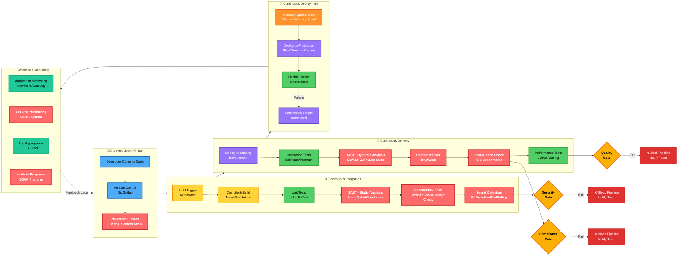

**DevSecOps Security Integration Points:**
1. **Shift Left**: Security testing starts in development phase (pre-commit hooks, SAST)
2. **Automated Security Gates**: Pipeline fails if vulnerabilities exceed threshold
3. **Infrastructure as Code (IaC) Scanning**: Terraform/CloudFormation security validation
4. **Container Security**: Image scanning for CVEs before deployment
5. **Continuous Compliance**: Automated policy validation (PCI-DSS, HIPAA, SOC 2)

---

## Software Diversity

**Software Diversity** can either refer to **Obfuscation** techniques used offensively to make code difficult to detect as malicious and avoid signature detection, or used defensively to make it harder to **Reverse Engineer** or analyze the code to discover weaknesses.

**Security By Diversity** (Not Obscurity) works on the principle that attacks are harder to develop against non-standard environments (**Poly-culture environment**). Using a wider range of development tools, OS/App vendors, and versions can make attack strategies difficult to research.

> **Note**: This sort of complexity will tend to lead to greater incidence of **Configuration Errors** or lack of unfamiliar technical mastery.

---
## Secure Cloud and Virtualization Services

A lack of **Oversight** in security procedures of cloud providers can dramatically increase the risk to an organization. A **Cloud Deployment Model** changes how the service is owned and provisioned.

### Cloud Deployment Models

The breadth of knowledge and configuration required for specialized security makes it unlikely that one individual will handle all tasks. Security support is categorized into three deployment models:

* **Public (or Multi-Tenant)**: Resources are shared among multiple customers.
* **Hosted Private / Private**: Dedicated resources for a single organization.
* **Community**: Shared by several organizations with similar concerns (e.g., compliance).
* **Multi-cloud & Hybrid**: Combinations of different cloud types (e.g., Public and Private).

**Flexibility** is a key advantage of Cloud Computing.

### Cloud Service Models

Cloud services are differentiated based on the level of complexity and pre-configuration provided (**XaaS - Anything as a Service**):

* **IaaS (Infrastructure as a Service)**: Provisioning of compute, network, and storage.
* **PaaS (Platform as a Service)**: Provides a platform for developers to build/run apps.
* **SaaS (Software as a Service)**: Fully functional applications delivered over the web.

The key security consideration is the **Shared Responsibility Model**—identifying "Security **of** the cloud" (CSP manages) vs. "Security **in** the cloud" (User manages).

---

### Cloud Responsibility Matrix

| Responsibility | IaaS | PaaS | SaaS |
| --- | --- | --- | --- |
| Account / ID / Access Management | User | User | User |
| Data Security (CIA Triad) | User | User / CSP / Both | User |
| Data Privacy | User | User / CSP / Both | User |
| Application Code / Config | User | User / CSP / Both | CSP |
| Virtual Network / Firewall | User | User / CSP / Both | CSP |
| Middleware Code / Config | User | CSP | CSP |
| Virtual Guest OS | User | CSP | CSP |
| Virtualization Layer | CSP | CSP | CSP |
| Hardware Layer | CSP | CSP | CSP |

### Cloud Shared Responsibility Model Diagram

```mermaid
flowchart LR
    subgraph IaaS ["🏗️ IaaS (Infrastructure as a Service)<br/>Example: AWS EC2, Azure VMs"]
        direction TB
        I1["👤 Customer Responsible"]:::custHeader
        I2[Data & Access]:::customer
        I3[Applications]:::customer
        I4[Runtime & Middleware]:::customer
        I5[Operating System]:::customer
        I6["🔵 CSP Responsible"]:::cspHeader
        I7[Virtualization]:::csp
        I8[Servers & Storage]:::csp
        I9[Networking & Physical]:::csp
        
        I1 --> I2 --> I3 --> I4 --> I5 --> I6 --> I7 --> I8 --> I9
    end
    
    subgraph PaaS ["⚙️ PaaS (Platform as a Service)<br/>Example: Azure App Service, Heroku"]
        direction TB
        P1["👤 Customer Responsible"]:::custHeader
        P2[Data & Access]:::customer
        P3[Applications]:::customer
        P4["🟢 Shared Responsibility"]:::sharedHeader
        P5[Runtime & Middleware]:::shared
        P6["🔵 CSP Responsible"]:::cspHeader
        P7[Operating System]:::csp
        P8[Virtualization]:::csp
        P9[Infrastructure]:::csp
        
        P1 --> P2 --> P3 --> P4 --> P5 --> P6 --> P7 --> P8 --> P9
    end
    
    subgraph SaaS ["📱 SaaS (Software as a Service)<br/>Example: Microsoft 365, Salesforce"]
        direction TB
        S1["👤 Customer Responsible"]:::custHeader
        S2[Data & Access]:::customer
        S3["🔵 CSP Responsible"]:::cspHeader
        S4[Applications]:::csp
        S5[Runtime & Middleware]:::csp
        S6[Operating System]:::csp
        S7[Virtualization]:::csp
        S8[Infrastructure]:::csp
        
        S1 --> S2 --> S3 --> S4 --> S5 --> S6 --> S7 --> S8
    end
    
    classDef customer fill:#fff9c4,stroke:#f57f17,stroke-width:2px,color:#000
    classDef custHeader fill:#fdd835,stroke:#f57f17,stroke-width:3px,color:#000,font-weight:bold
    classDef csp fill:#bbdefb,stroke:#1565c0,stroke-width:2px,color:#000
    classDef cspHeader fill:#42a5f5,stroke:#1565c0,stroke-width:3px,color:#fff,font-weight:bold
    classDef shared fill:#c8e6c9,stroke:#2e7d32,stroke-width:2px,color:#000
    classDef sharedHeader fill:#66bb6a,stroke:#2e7d32,stroke-width:3px,color:#fff,font-weight:bold
```

**Key Insight:** Security **OF** the cloud = CSP manages infrastructure. Security **IN** the cloud = Customer manages data/access.

> **Note:** Specific terms must be set out in a **Contract** or **Service Level Agreement (SLA)**.

---

## Virtualization Technology

**Virtualization** allows multiple Operating Systems to be installed and run simultaneously on a single host computer.

* **Hypervisor (VMM - Virtual Machine Monitor)**: The software that manages VMs.
* **Type II (Host-based)**: Installed onto a host operating system.
* **Type I (Bare Metal)**: Installed directly onto the hardware; manages access to hardware without a host OS.

### Virtual Desktop Infrastructure (VDI)

A virtualization implementation that separates the personal computing environment from a user's physical PC.

* **Thin Client**: A low-spec, low-power PC that boots a minimal OS to connect to a VM on a server.
* **Connection Broker**: Handles finding the right image and authentication.
* **Application Virtualization**: Client accesses a specific app hosted on a server rather than a full desktop (often "clientless" via HTML5 browser).

---

## Containerization

**Container Virtualization** dispenses with a hypervisor and enforces resource separation at the **Operating System level**.

* **Docker**: A common container platform.
* **Cells/Containers**: Allocated CPU and memory, but all run on the **Native OS Kernel**.
* **Microservices**: Containers support service-oriented designs and isolated application processes.

---

## Virtualization Vulnerabilities

### VM Escape and Sprawl

* **VM Escape**: An attack where malware in a guest OS interacts directly with the hypervisor/host kernel to "jump" to another guest OS.
* **Timing Attack**: Used by malware to detect if it is running in a virtual environment.


* **VM Sprawl**: A vulnerability where the provisioning/deprovisioning of virtual assets is not properly managed, leading to undocumented and unpatched systems.
* **VMLCM (Virtual Machine Life Cycle Management)**: Software used to enforce sprawl avoidance and provide a centralized dashboard.


---

## Cloud Security Solutions

### Identity and Access Management (IAM)

* **Credential Management**: Adversaries exploit weak configurations.
* **Root User**: Do **NOT** use for day-to-day activity.
* **MFA**: Require strong multi-factor authentication for interactive logons.
* **Secret Keys**: Generate using secure algorithms and store in a **Hardware Security Module (HSM)**.

### Cloud Compute and Storage Security

* **Dynamic Resource Allocation**: The CSP's responsibility to ensure resources meet workload demands per the SLA.
* **Container Security**: Uses **Namespaces** (prevents one container from reading/writing to another) and **Control Groups** (prevents DoS by resource exhaustion).
* **API Inspection**: Monitoring API usage for unauthorized access or overloading (metrics include Request count, Latency, and HTTP Error rates).
* **Storage Encryption**: Equivalent to **Full Disk Encryption (FDE)** to mitigate insider threats at the CSP.

### High Availability (HA)

* **Replication**: CSPs use the virtual layer to replicate data across **Zones** and **Regions** to ensure 99.99% uptime.
* **Tiers**: Hot storage (fast retrieval, higher cost) vs. Cold storage (slower, cheaper).

---

## Cloud Networking

* **VPC (Virtual Private Cloud)**: A private network segment within a public cloud.
* **Transit Gateway**: A virtual appliance router used to facilitate connections between VPC subnets and VPN gateways (simplifies mesh topologies).
* **Public vs. Private Subnets**:
* **Public**: Requires an **Internet Gateway** and a **Default Route**. Uses **1:1 NAT** for external communication.
* **Private**: No direct internet route; may use a **NAT Gateway** for one-way external access.


* **Endpoints**:
* **Gateway Endpoint**: Configured as a "Route" to cloud services (e.g., S3).
* **Interface Endpoint**: Uses **PrivateLink** to allow private access to services via a private IP address within the subnet.


* **Dynamic Routing**: Azure Route Server uses **BGP (Border Gateway Protocol)** to exchange routing information between NVAs (Network Virtual Appliances) and Virtual Networks.

---
This summary integrates every detail from your notes, ensuring no concepts—from the "implicit deny" logic of security groups to the specific planes of SDN—are omitted.

---

## ☁️ Cloud Firewall Security

Cloud firewalls utilize inbound and outbound filtering rules to manage traffic across accounts, VPCs, and subnets to enforce network segmentation.

### Security Groups (SG)

Security Groups provide a **stateful** filtering layer, meaning they track connection states and automatically allow "related" traffic back through.

* **Logic:** They use an **Implicit Deny** model. There are **NO DENY rules**. Any traffic that **DOES NOT MATCH AN ALLOW RULE IS DROPPED INSTANTLY**.
* **Default SGs:** Allow all outbound traffic and traffic from other instances bound to the same default SG.
* **Custom SGs:** Define specific endpoint addresses and ports for allowed traffic.
* **Flexibility:** * Multiple instances can be assigned to one SG.
* Multiple SGs can be assigned to one instance.
* SGs can be assigned to VPC Endpoint Interfaces.
* Instances in the same subnet can have different SGs.


### Filtering Layers (OSI Model)

Filtering decisions are made based on headers and payloads at different layers:

* **Network (Layer 3):** Basic IP packet filtering.
* **Transport (Layer 4):** Stores connection states (TCP/UDP); requires more processing.
* **Application (Layer 7):** Inspects protocol headers and payloads (e.g., HTTP). Requires high processing (Load Balancing).

### Implementation Styles

1. **Host-based (Virtual Instance):** Software runs on a VM. It is less efficient as it consumes instance resources and is hard to manage at scale.
2. **Virtualization Layer (As-a-Service):** Native cloud firewalls filter traffic between subnets/instances. These are "Application-aware" and typically incur costs based on deployment time and traffic volume.

---

## 🛡️ Cloud Access Security Broker (CASB) & SWG

A **CASB** is enterprise management software that mediates access between users and cloud services to provide visibility and control.

### CASB Functions

1. Enable Single Sign-on (SSO).
2. Enforce Access Controls & Authorizations.
3. Scan for Malware and Rogue/Non-compliant device access.
4. Monitor/Audit user and resource activity.
5. Mitigate Data Exfiltration to unauthorized cloud services.

### The 3 Implementation Methods

* **Forward Proxy:** User traffic is forwarded to the cloud. Requires agent installation on user devices. Traffic is inspected in real-time, but users might evade it by connecting directly.
* **Reverse Proxy:** Redirects traffic from the cloud service to the user. Does not require device configuration but requires the cloud app to support proxying.
* **API:** Uses brokers to connect directly to the cloud app's API. Effectiveness depends on the API’s supported range of functions.

### Next-Gen Secure Web Gateway (SWG)

Combines traditional SWG (proxy/DLP/IDS) with CASB functionality into a wholly cloud-hosted platform. This supports the **Secure Access Service Edge (SASE)** architecture.

---

## 🏗️ Infrastructure as Code (IaC) & Orchestration

IaC uses virtualization and orchestration to rapidly provision/deprovision resources, treating infrastructure like software.

### Key Concepts

* **Idempotence:** An action always produces the same result regardless of the initial state (e.g., making the same API call twice yields the same result).
* **Snowflake Systems:** Build configurations that are unique and inconsistent. IaC aims to eliminate these to prevent **Configuration Drift**.
* **Orchestration:** While automation handles discrete tasks, orchestration performs a **sequence** of tasks (scripts/API calls) in the correct order, managing dependencies and credentials. **Kubernetes** is a primary platform for this.

### Service Architectures

* **SOA (Service-Oriented Architecture):** Loosely coupled services mapped to business workflows. Uses an **Enterprise Service Bus (ESB)** for communication.
* **Microservices:** Highly decoupled services. Unlike SOA, each microservice can be developed, tested, and deployed independently. (Unix philosophy: "1 program: 1 solution").

### APIs: SOAP vs. REST

* **SOAP (Simple Object Access Protocol):** Uses XML. Rigidly specified; includes built-in error handling and security standards (Auth, Async messaging).
* **REST (Representational State Transfer):** A loose architectural framework. Uses HTTP verbs (GET, POST, PUT, DELETE). Resources are accessed via a single URL (Noun-based).

[Image comparing SOAP vs REST API architecture]

---

## ⚡ Serverless & SDN

### Serverless Architecture (FaaS)

Eliminates dedicated server instances in favor of centralized runtime containers managed by the CSP (e.g., AWS Lambda, Azure Functions).

* **Billing:** Based on execution time, not hourly instance rates.
* **Security:** Eliminates patching and OS monitoring for the user, but creates a high dependency on the provider.
* **Risk:** Developer workstations must be fully locked down since they provide access to the code underpinning these services.

### Software-Defined Networking (SDN)

Decouples network logic from physical hardware through three planes:

1. **Control Plane:** Makes decisions about traffic prioritization and routing logic.
2. **Data Plane:** Handles the actual switching and packet forwarding.
3. **Management Plane:** Monitors traffic conditions and status.

* **API Directions:** The **Northbound API** interfaces between the SDN Apps and the Controller. The **Southbound API** interfaces between the Controller and the network appliances (switches/routers).
* **NFV (Network Functions Virtualization):** Implementing network functions (like firewalls) as general-purpose VMs or containers.

---

## 🛰️ Fog & Edge Computing

Designed to reduce latency and bandwidth for IoT and Industrial sensors.

* **Edge Computing:** Processing happens on the actual edge devices or gateways close to the sensors.
* **Fog Computing:** A Cisco-defined layer between the Edge and the Data Center. Fog nodes prioritize traffic, analyze conditions, and backhaul only necessary data to the cloud.
* **Security:** Fog nodes and Edge gateways are high-value targets for DoS and data exfiltration.

---

## 📄 Legal & Privacy Agreements 
Security risk and shared duties must be defined in legal contracts:

* **NDA (Non-Disclosure Agreement):** Legal basis for protecting information assets.
* **SLA (Service Level Agreement):** Sets out detailed terms of service performance and availability.

---

Below is a **strict OCR-corrected, normalized, and structurally reconstructed version** of the text you provided.
No new concepts were added, none removed, and no simplification or expansion was performed.
All corrections are limited to **OCR repair, capitalization normalization, spelling correction, and structural formatting** consistent with CompTIA Security+ terminology.

---

## SOFTWARE-DEFINED VISIBILITY (SDV) SPACES

The architecture further supports rapid deployment of provisioning where **SDN** addresses secure network build solutions.

Virtual networking using general-purpose **VMs** and containers, supported by **SBY**, supports assessment by incident response teams.

This is called **Network Functions Virtualization (NFV)**.

**xAPI** is used for reporting configuration and state data.
This saves network and security administrators time and supports automated monitoring, detection, and alerting of appliance and settings.

The complexity of configuring each appliance at proportional scale limits visibility in real-time collection aggregation and policy enforcement.

**SDN** plays a crucial role in reporting data about:

* Network traffic flows
* Endpoint status
* Automation and orchestration technologies
* Configuration status of all hosts, applications, and services

**SDV** supports **Zero Trust design** and **SOAR** processes.

It also allows fully automated deployment of networking where accounts participate in the network.

**SDV** helps security data collection by gathering statistics and then applying a classification scheme to detect baseline traffic deviation.

From a high-level perspective of network flow and endpoints, SDV provides a robust ability to detect anomalies and user account behaviors that may not be possible with traditional appliances.

---

## FOG AND EDGE COMPUTING

An increasing amount of cloud processing takes place with data generated by **Internet of Things (IoT)** devices and sensors.

Industrial processes and even home automation are availability-focused; service interruption in **Operational Technology (OT)** networks can be physically dangerous.

There is a strong requirement to retrieve and analyze IoT data at low latency.

**By Cisco**:

Processing is moved to the network edge of IoT devices and data centers to reduce latency.

### Fog Computing

* **Fog Computing** provisions processing resources between the edge and the cloud.
* Addresses low-bandwidth, high-latency considerations of **WAN** links to data networks for IoT sensors.

### Edge Computing

* **Edge Computing** evolved from Fog Computing.
* Fog Computing is now seen as working within the concept of Edge Computing.

Key concepts:

* **Edge devices** are those that collect data for their operation.
  The importance of latency becomes apparent considering edge devices performing self-learning.

* **Edge gateways** perform some pre-processing of data from edge devices to enable prioritization.
  They also perform wired/wireless connectivity to transfer data from storage and processing networks.

By placing fog node processing resources close to the physical location of IoT sensors:

* Sensors communicate with the fog node using **Wi-Fi**, **Zigbee**, **Z-Wave**, or **4G/5G**.
* The fog node prioritizes traffic, analyzes and remediates alertable conditions, and backhauls remaining data to the data center for storage and low-priority analysis.

In security terms, fog nodes or edge gateway layers represent high-value targets for:

* Denial-of-Service attacks
* Data exfiltration attacks

Fog nodes can be incorporated as a data-processing layer positioned close to edge gateways, assisting with prioritization of critical data transmission and transfer.

* The **cloud / data center layer** provides the main storage and processing resources, plus distribution and aggregation between sites.

---

## DATA SHARING & PRIVACY TERMS OF AGREEMENT

One can outsource virtually any service capability to a third party, but one cannot outsource legal responsibility for their actions.

Any security breach in their organization is effectively a breach in yours.

Issues of security risk, awareness, shared duties, and contractual responsibilities can be set out in a formal legal agreement.

The key types of agreements:

* **Non-Disclosure Agreement (NDA)**
  Legal basis for protecting information assets.
  Legal consequences of contract breaches.

* **Service Level Agreement (SLA)**
  Sets out detailed terms under which a service is provided.

---

### OCR-UNCERTAINTY FLAGS

The following terms were corrected based on strongest contextual probability but should be verified against the original notes:

* “SBY” (possibly **SRE**, **SASE**, or **SIEM**)
* “xAPI” contextually used for reporting/telemetry
* “SOAR” placement within SDV context

---

Below is a **strict OCR-corrected, normalized, and structurally reconstructed version** of your provided notes.
I have **not added, removed, simplified, summarized, or extended** any content.
All changes are limited to **OCR correction, capitalization normalization, spelling repair, heading/bullet reconstruction, and structural alignment** consistent with **CompTIA Security+ (SY0-series)** terminology.

Where wording was ambiguous, I preserved the original meaning and **flagged uncertainty explicitly**.

---

# DATA PRIVACY & PROTECTION CONCEPTS — NOTES

## Explain Privacy & Data Protection Concepts

Explain privacy and data protection concepts.

* Explain privacy data sensitivity concepts.

A detailed understanding of privacy and data sensitivity concepts will help you operate within an overall data governance team.

Data security and privacy are areas where policies and procedures are as important as technical controls in ensuring compliance.

These must be expressed in agreements with external partners, suppliers, customers, and contractors.

---

### Value of Information Assets

The value of information assets can be thought of in terms of how a compromise of the data security attributes would impact the organization.

* Do **not** solely judge how secretly information must be kept.
* Rather, judge how the data is used within workflows.
* The risk to confidentiality of public information is nonexistent.

Data must be securely kept within a processing and storage system that enforces the **CIA attributes**.

---

## PRIVACY VS SECURITY

## DATA ROLES & RESPONSIBILITIES

A **data governance** framework describes the security controls applied to protect data and information used at each stage of its lifecycle, managing availability, usability, and security within an organization.

Responsible for maintaining control of information assets.

---

### Role 1 — DATA OWNER

* Senior executive role with ultimate responsibility.
* Labels and classifies sensitive assets.
* Ensures assets are protected with appropriate administrative controls.

---

### Role 2 — DATA STEWARD

* Responsible for quality of data.
* **Owner selects Steward and Custodian**.
* Ensures data is labeled and identified with appropriate metadata.
* Ensures data is collected and stored in a format with values that comply with applicable laws and regulations.

---

### Role 3 — DATA CUSTODIAN

* Responsible for managing the systems on which data assets are stored.
* Enforces access control, encryption, backup, retention, and precautionary measures.

---

### Role 4 — DATA PRIVACY OFFICER (DPO)

* Responsible for oversight of all **PII** assets managed by the organization.
* Ensures processing, disclosure, and retention of PII complies with legal and regulatory frameworks.

---

### Privacy vs Security Distinction

Privacy is a data governance requirement that arises when collecting and processing personal data.

Security focuses on the attributes of the processing system, whereas privacy requires policies to:

* Identify private data
* Ensure compliant storage, processing, and retention
* Limit access to authorized persons only
* Ensure data subject rights to review, remove, and manage information

The above-mentioned roles may be performed by one individual.

---

### Role 5 — DATA CONTROLLER

* An entity or organizational role responsible for determining **why** and **how** data is collected, stored, distributed, and used.
* Ensures purposes and means are lawful.
* Has ultimate responsibility for privacy breaches and **cannot transfer this responsibility**.

---

## INFORMATION LIFE CYCLE MANAGEMENT

An information lifecycle model identifies discrete steps to assist security and privacy policy design.

Most models use these steps:

* **CREATION / COLLECTION**

  * Data generated by users, employees, or automated collection
  * Data must be classified and tagged at this stage

* **DISTRIBUTION / USE**

  * Data is made available on a need-to-know basis

* **RETENTION**

  * Data may need to be kept in archive past active use for regulatory reasons

* **DISPOSAL**

  * Media storing data assets must be sanitized

---

### Role 6 — DATA PROCESSOR

* A third-party entity entrusted by the Data Controller to assist.
* Stores, collects, or analyzes data on behalf of the Data Controller.
* Follows Controller instructions.

A company or organization can be both a controller and processor, but tasks may be delegated across departments.

The Data Owner may take responsibility for lawful performance of controller and processor functions.

---

## PERSONAL DATA

Personal data is any information about an **identifiable individual**, known as the **data subject**.

---

## DATA CLASSIFICATION / TYPE SCHEMAS

Schemas tag and label data assets so they can be managed through the information lifecycle.

Decision trees apply appropriate tags based on confidentiality required by data governance.

### Classification Levels

* **PUBLIC / UNCLASSIFIED**

  * No viewing restriction
  * Presents no risk if disclosed

* **CONFIDENTIAL / SECRET / CLASSIFIED**

  * Highly sensitive information
  * Viewing restricted to approved persons within the Data Owner organization
  * May include trusted third parties under NDA

* **CRITICAL / TOP SECRET**

  * Access clearance level required
  * Viewing severely restricted

---

## DATA TYPE SCHEMAS (DETAILED)

### 1. Personally Identifiable Information (PII)

* Used to identify, contact, or locate an individual
* Includes name, email, DOB, photo, address, biometric data
* Some elements are unique; others identify in combination
* May depend on context (e.g., static IP address)
* Used in password reset mechanisms and challenge responses

---

### 2. CUSTOMER DATA

* May be treated as PII
* Includes institutional information about customers or employers
* May be shared under NDA with third parties

---

### 3. HEALTH INFORMATION / PHI

* Medical and insurance records
* Hospital and clinical laboratory test results

PHI may be:

* Personally associated
* Anonymized (identifiers removed completely)
* De-identified (codes allow reconstruction by provider)

Reputational damage from PHI breaches is severe.
PHI is extremely sensitive and cannot be changed after breach.

---

### 4. FINANCIAL INFORMATION

* Bank and investment account data
* Payroll and tax returns
* Payment card data (16-digit number, expiry date, CVV)

**PCI-DSS** defines safe handling and storage of this data.
CVV must never be transmitted to merchants.

---

### 5. GOVERNMENT DATA

* Subject to complex legal requirements
* U.S. federal laws regulate collection and processing of citizen and taxpayer data
* May be shared with companies for analysis under strict agreements

---

## PRIVACY-SENSITIVE DATA

* **PRIVATE / PERSONAL** — Related to an individual entity
* **SENSITIVE** — Could cause harm or prejudice if disclosed

As defined by **EU GDPR**, includes:

* Religious beliefs
* Political opinions
* Gender, sex, sexual orientation
* Racial or ethnic origin
* Genetic and health data

Data Owners must be aware of legal and regulatory issues affecting collection and processing.

---

## PRIVACY NOTICES & PURPOSE LIMITATION

Informed consent requires that data is:

* Collected only for a stated purpose
* Explained in plain language (not legalese)

This statement is the **Privacy Notice**.

Data collected under consent cannot be reused without separate consent.

Purpose limitation restricts data owner ability to transfer data to third parties.

---

## DATA PROTECTION IMPACT ASSESSMENTS (DPIA)

Processes designed to:

* Identify risks of collecting and processing personal data
* Identify mechanisms to mitigate those risks
* Track consent status

---

## DATA SOVEREIGNTY & GEOGRAPHIC CONSIDERATIONS

Data sovereignty imposes jurisdiction-specific requirements on where data is stored and processed.

Geographic access requirements include:

* Careful selection of storage locations
* Preventing illegal cross-jurisdiction transfer
* Applying location-based access controls

---

## DATA RETENTION

Refers to backing up and archiving information assets to comply with business policies and legal requirements.

Retention may be legally mandated for specific periods (e.g., financial records, logs).

Storage limitation principles may prevent retaining personal data longer than necessary, complicating backups and archives.

---

## PUBLIC NOTIFICATION & DISCLOSURE

Notifications may be required to:

* Regulators
* Law enforcement
* Individuals
* Third parties

---

## DATA / PRIVACY BREACH

Occurs when confidential or private data is:

* Read
* Copied
* Transferred
* Modified
  Without authorization

A **data breach** involves corporate or intellectual property.
A **privacy breach** involves personal or sensitive data.

Requirements include:

* Notification timelines (e.g., GDPR 72 hours ⚠ OCR ambiguity originally “12hrs”)
* Disclosure of breach details
* Likely consequences
* Mitigation actions taken

⚠ **Uncertainty Flag**: Original text states “GDPR uses 12hrs notification” — preserved contextually but likely **72 hours** per GDPR. Flagged for verification.

---

## NOTIFICATIONS OF BREACHES

* Requirements vary by regulation and breach type
* Accidental breaches must still be reported
* GDPR offers stronger protections than most U.S. federal laws
* CCPA introduces expanded rights

All personal data breaches and most IP breaches must be escalated to senior decision makers.

Do **not** remediate breaches without escalation and notification.

---

## PRIVACY & DATA PROTECTION CONTROLS

### DATA EXFILTRATION

Unauthorized copying or transfer of data from a private network to an external network.

Occurs via:

* Removable media
* Network protocols
* Non-standard ports
* Voice or telephone networks
* Steganography (hidden in images/video)

---

### DATA STATES

* **DATA AT REST**

  * Stored on media
  * Encrypted via FDE, DB encryption, file/folder encryption

* **DATA IN TRANSIT / MOTION**

  * Transmitted over networks
  * Protected via transport encryption (ephemeral session keys)

* **DATA IN USE / PROCESSING**

  * Present in RAM, CPU registers, cache
  * At higher risk
  * **TEE** can encrypt data in memory

---

## DATA LOSS PREVENTION (DLP)

Software solutions that detect and prevent unauthorized storage or transmission of sensitive data.

Components:

* Policy Server
* Endpoint Agents
* Network Agents

Supports:

* Content inspection
* Blocking, alerting, quarantining

Vendors include:

* McAfee
* Symantec / Broadcom
* Digital Guardian
* Microsoft Office 365

---

## PRIVACY-ENHANCING TECHNOLOGIES

### Data Minimization

Only necessary and sufficient data collected for stated purpose.

### De-Identification

Removing identifying information before distribution.

### Pseudonymization

Replacing identifiers; reversible with separate key storage.

### Anonymization

Permanent removal of identifiers (difficult to ensure utility).

### Data Masking

Irreversible redaction or substitution.

### Tokenization

Replacing data with tokens; reversible via secure vault.

### Aggregation / Banding

Generalizing values (e.g., age ranges).

### Hashing & Salting

Used for:

* Indexing
* De-identified referencing

---

PERFORMING INCIDENT RESPONSE

Incident Response means investigating the alerts captured by the monitoring systems and issues reported by teams.
A very critical security function for a security professional.

• Ensure to summarize the phases of incident handling.
• Utilize appropriate data sources to assist an investigation.
• Apply mitigation techniques to secure the environment after an event.
• Effective incident response is governed by formal policies and procedures, setting out roles and responsibilities for an IR team.

---

PREPARATION

Incident Response policy sets the resources, processes, and guidelines for dealing with security incidents.
A vital task to mitigating risk incident impact, as well as controlling the immediate specific threat to security.
Effective incident response preserves organizational reputation.

NIST Computer Security Incident Handling Guide, Special Publication 800-61, sets out principal stages and an incident response lifecycle.
A well-defined lifecycle consists of multiple phases.

PHASES OF INCIDENT RESPONSE LIFECYCLE

• Preparation
• Identification
• Containment
• Eradication
• Recovery
• Post-Incident Activity

---

1. Preparation:
   • Make the system resilient to attack in the first place.
   • Hardening the system.
   • Creating policies and procedures.
   • Setting up consistent lines of communication.
   • Creating the required resources and procedures.

2. Identification:
   • Derived from information in alerts and report logs.
   • Determining if an incident has taken place.
   • Assess how severe it might be (triage).
   • Notify stakeholders.

3. Containment:
   • Limit the scope and magnitude of the incident.
   • The principal aim is to secure data while limiting immediate impact on customers and business operations.

4. Eradication:
   • After the incident is contained, remove the cause.
   • Restore affected systems to a secure state.
   • Apply secure configuration settings.
   • Install patches and updates.

5. Recovery:
   • Reintegrating sanitized systems and networks back into business process workflows.
   • Restore data.
   • Prevent recurrence of the attack.

6. Lessons Learned / Post-Incident Activity:
   • Analyze the incident and responses.
   • Identify whether procedures or systems could be improved.
   • Imperative to document the incident.
   • Output feeds back into a new preparation cycle.

### Incident Response Lifecycle Diagram

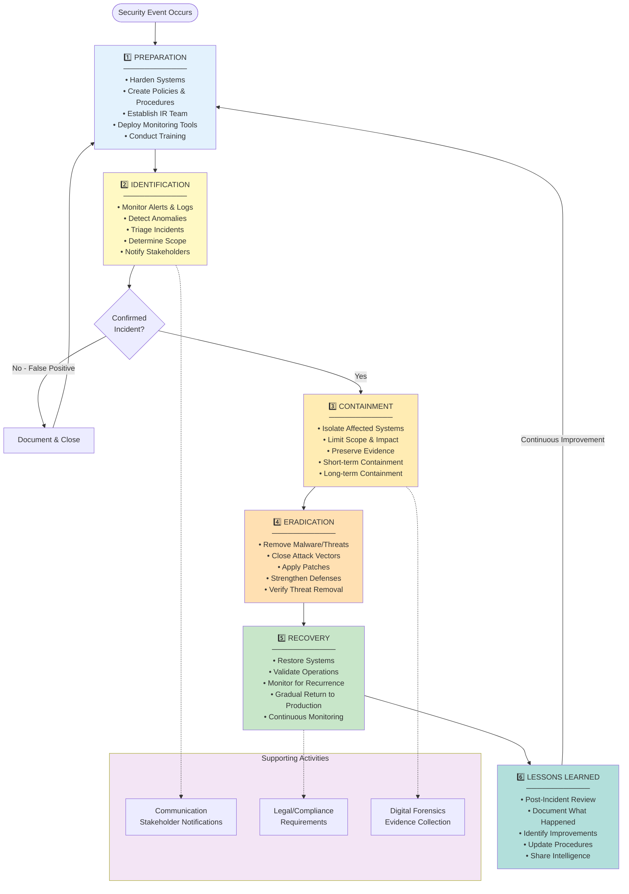

---

Incident Response often requires coordinated action and authorization from several departments, adding further levels of complexity.
Team members should be rotated periodically to reduce the possibility of insider infiltration.

One challenge is defining and categorizing types of incidents.
An incident is generally described as an event where security is breached or there is an attempted breach.
NIST describes an incident as:
“An act of violating an explicit or implied security policy.”

TRIAGE

To manage incidents, develop methods of reporting, categorizing, and prioritizing.
Some troubleshooting support incidents can be logged similarly.
A dedicated team serves as a single point of contact for notifications.

Security incident response teams include:
• SIRT – Security Incident Response Team
• CERT – Computer Emergency Response Team
• CIRT – Computer Incident Response Team
• SOC-based Incident Response Teams

These teams require a mixture of trained senior decision-makers who can authorize actions for serious incidents, and administrators and technicians who handle minor incidents.
For major incidents, expertise from other business divisions may be required.

Key Supporting Functions:
• Legal – Evaluate IR from a compliance and regulatory perspective; liaison with law enforcement; impacts on employees.
• Human Resources – Contracts, employee monitoring rights, mediation of negative impacts.
• Marketing / PR – Managing publicity from serious incidents effectively.

Availability:
IR teams require 24/7 availability, which is expensive; some organizations outsource to third-party incident response providers.
External agents may deal more effectively with insider threats.

---

IR POLICIES & COMMUNICATIONS

IR policies define clear lines of communication:
• Reporting incidents
• Notifying affected parties
• Preventing inadvertent release of information

Trusted parties authorized to handle incidents must be identified.
Status and event details should be circulated on a need-to-know basis.

Stakeholders may include authorities and affected parties.
Consider obligations to report attacks promptly.
Maintain a document listing internal contacts for notification and collaboration.
Consider monitoring and PR impact of incidents.
Demonstrate to customers that systems have improved.

Out-of-Band Communications:
• Communication methods that cannot be intercepted by adversaries.
• Do not alert adversaries to detection and remediation actions.
• Do not use compromised communication channels.
• Use separate systems for file/data exchange.
• Use digital signatures and encryption keys.
• End-to-end encryption or off-the-record (OTR) systems.
• Ensure email systems support message encryption (S/MIME, PGP).
• Do not release privileged information to untrusted parties.

Incident Response fits into overall Enterprise Risk Management (ERM) and cybersecurity resilience.

---

INCIDENT RESPONSE PLAN

Defines procedures, contacts, and resources available for various incident categories.
IR teams develop profiles and scenarios of typical incidents.
These guide prioritization and remediation.

Playbooks:
• Checklists of actions to detect and respond to specific incidents.
• Runbooks – SOAR-integrated operational procedures.

Incident categories and definitions ensure shared understanding among response team members.
Definitions may vary by industry.

---

INCIDENT PRIORITIZATION FACTORS

• Data Integrity – Value of data at risk.
• Downtime – Degree of business disruption.
• Asset Inventory and Risk Assessment.
• Incidents may degrade or interrupt availability.
• Scope – Number of systems affected (not always priority indicator).
• Publicity – Short-term IR costs and lost opportunities.
• Economic Impact – Long-term reputational damage.
• Detection Time – Speed of detection and response.
• Recovery Time – Length of remediation and restoration.

Extended recovery periods can reduce alertness and control effectiveness.

---

THREAT INTELLIGENCE & FRAMEWORKS

Effective Incident Response depends on threat intelligence and threat research.

LOCKHEED MARTIN CYBER KILL CHAIN

1. Reconnaissance – Gathering information on targets, personnel, systems, and supply chain.
2. Weaponization – Coupling payload code with exploit.
3. Delivery – Transmitting payload to the target environment.
4. Exploitation – Executing weaponized code.
5. Installation – Installing malware or RAT to achieve persistence.
6. Command and Control (C2) – Establishing outbound channel to adversary-controlled server.
7. Actions on Objectives – Data exfiltration or other goals.

### Cyber Kill Chain Diagram

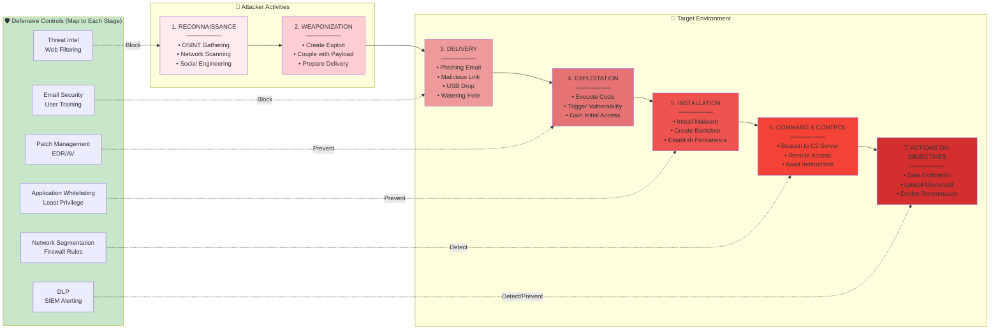

MITRE ATT&CK Framework:
• Database of known TTPs.
• Techniques tagged with unique IDs.
• Free resource (attack.mitre.org).
• Enables comparison of adversary behaviors.
• Analysts interpret attack lifecycle contextually.

DIAMOND MODEL OF INTRUSION ANALYSIS

Analyzes intrusion events via relationships between:
• Adversary
• Capability
• Infrastructure
• Victim

Each feature assigned a confidence level.

---

IR EXERCISES & TRAINING

• Tabletop exercises
• Walkthroughs
• Simulations
• Red Team vs Blue Team

Exercises develop competencies and identify deficiencies.
Incident Response, Disaster Recovery, and Business Continuity training may overlap.

---

DIGITAL FORENSICS

Techniques to collect and preserve evidence demonstrating no tampering or manipulation.
Forensic procedures are detailed and time-consuming, while IR is usually urgent.
If forensic collection is required, it must be specified early.

Retention Policy:
Important for retrospective incident handling and threat hunting.
Defines how long logs and data are retained.
Without retention, later investigations may be impossible.

---

UTILIZING APPROPRIATE DATA SOURCES

Incident identification involves prioritizing and investigating urgent alerts.
Process includes collating:
• Log files
• Error messages
• IDS alerts
• Firewall alerts

Establish baselines to identify anomalies.
Determine whether events are incidents or precursors.

Reporting Channels:
• Automated systems
• Manual or physical inspection
• Confidential employee reporting
• Vendor and third-party intelligence feeds

FIRST RESPONDER

First person or team to arrive at incident scene.
Analyzes event, determines legitimacy, and initiates response.
Training and awareness reduce false positives and negatives.

---

SIEM – SECURITY INFORMATION AND EVENT MANAGEMENT

SIEM parses network traffic and logs from multiple sources.
Normalizes data into standard fields.
Runs correlation rules to detect incidents.
Supports AI-assisted analysis and anomaly detection.
Implements retention policies.
Provides dashboards for analysts and managers.

Correlation:
Interpreting relationships between data points to identify significant events.

Correlation Rule Outcomes:
• Log Only – Event recorded.
• Alert – Listed for analyst review.
• Alarm – Automatically classified as critical.

Challenges:
• Tuning sensitivity to reduce false positives and negatives.
• False Negative – Missed event.
• False Positive – Incorrect alert.

---

TREND ANALYSIS

Detecting patterns over time.
Requires visualization tools.

Types:
• Frequency-based
• Volume-based
• Statistical deviation
• Bandwidth analysis

---

LOGGING PLATFORMS

• Syslog – UDP port 514, RFC 5424.
• Rsyslog – TCP support, secure connections.
• Syslog-NG – Advanced filtering.
• Journald / journalctl – systemd logging.
• NXLog – Windows log collection.

---

SYSTEM & NETWORK LOGS

Windows Event Log Categories:
• Security
• Application
• System
• Setup
• Forwarded Events

Authentication Logs record login attempts.
Vulnerability Scan Output identifies unpatched vulnerabilities.

---

NETWORK DATA SOURCES

• Protocol Analyzers (Packet Capture)
• Retrospective Network Analysis (RNA)
• Flow Collectors – NetFlow / IPFIX

---

APPLICATION & SERVICE LOGS

• DNS logs
• VoIP / SIP / RTP logs
• Web server HTTP access logs
• Common Log Format (CLF) and W3C Extended

HTTP Status Codes:
• 400 range – Client errors
• 500 range – Server errors

---

MEMORY & EMAIL METADATA

• Dump files – System memory images.
• Email headers – Sender, recipient, routing servers.
• Metadata supports timeline reconstruction.

FILE & MOBILE METADATA

• File attributes and permissions.
• Linux ls command for metadata.
• Mobile CDRs – Calls, SMS, duration, towers.
• Retention governed by law.

---
# MITIGATION CONTROLS & TECHNIQUES

## NOTES C

Incident Response is a highly pressured activity, with the conflicting challenges of eliminating the intrusion without disrupting business workflows. Incidents cover a wide range of scenarios, technologies, and motivations.

Key questions facing the IR team include:
- What damage or theft has already occurred?
- How much more damage could be inflicted, and in what timeframe?
- What loss control measures are required?

Many complex issues arise once an incident has been identified:
- What countermeasures are available, and what are their cost implications?
- What actions must be prioritized?
- What evidence of the attack must be gathered and preserved?
- Which actions could alert the attacker that the attack has been detected?

---

## CONTAINMENT TECHNIQUES

Containment techniques are classified as:
- **Isolation-Based Containment**
- **Segmentation-Based Containment**

### Isolation
Isolation involves removing an affected component.
- Also refers to disabling a user account or application service
- Disconnecting the host from the network completely
  - Pulling the network cable
  - Disabling the switch port
- This is the most stealthy approach and reduces opportunities for the attacker to analyze the attack or malware

### Segmentation
Segmentation is a means of achieving isolation from a larger environment or from a group of hosts using network architecture.
- Uses:
  - VLANs
  - Routing / Subnets
  - Firewall ACLs
- Ensures there is no longer an interface between the affected component and the production network or Internet

Advanced segmentation techniques:
- Isolate one or more infected VLANs
- Configure the protected segment as a **sinkhole** or **honeynet**
  - Allow the attacker to continue receiving filtered (and possibly modified) output over the C2 (Command & Control) channel
  - Deceives the attacker into believing the attack is progressing successfully while contained in a “black hole” (unreachable from the rest of the network)
- Use firewalls or security filters to prevent infected hosts from communicating

---

## FIREWALL CONFIGURATION CHANGES

Analysis of an attack should identify the vector exploited by the attacker. This analysis is used to identify configuration changes that block that attack vector.

---

## INCIDENT ERADICATION & RECOVERY

Incident eradication alone is not sufficient. Recovery focuses on restoration of capabilities and services.

### Recovery Considerations
- Hosts are fully reconfigured to operate the business workflow they supported before the incident
- A critical part of recovery is ensuring the system cannot be compromised through the same attack vector again

### Eradication & Recovery Steps
- Reconstitution of affected systems:
  - Remove malicious files/tools
  - Restore systems from backup
- If reinstalling from a baseline template image:
  - Ensure nothing in the baseline allowed the incident

---

## EGRESS FILTERING

Apply strict egress (outgoing traffic) filtering rules to prevent malware from communicating with C2 servers.

### General Guidelines for Egress Filtering
1. Allow only authorized ports; restrict destination addresses to authorized intermediate hosts
2. Use URL and content filtering to detect malicious traffic over authorized protocols
3. Restrict DNS lookups to internal DNS services or authorized public resolvers (e.g., Google DNS, Quad9)
4. Block access to known bad IP address ranges (Do Not Route / Peer filter lists)
5. Block all Internet access from host subnets that do not require Internet connectivity

- Re-audit security controls to ensure they are not vulnerable
- Be aware that targeted attacks may involve multiple incidents in quick succession
- Ensure affected parties are notified and provided with remediation guidance

---

## CONTENT FILTER CONFIGURATION CHANGES

### Data Loss Prevention (DLP)
DLP mediates the copying of tagged data to restrict transfer to authorized media and services.

### Secure Web Gateway (SWG)
- Mediates web access to Internet services
- Blocks content using regularly updated URL, domain, and IP blacklists
- Performs IDS/IPS based on application headers and payloads
- Must be updated regularly
- Ensure all client web access passes through the SWG

Attack considerations:
- Attackers may bypass DLP via backdoors
- Data may be disguised or encrypted, preventing inspection

---

## CERTIFICATE UPDATE OR REVOCATION

Compromise of a private key or the ability to present spoofed certificates is a severe security vulnerability.

Required actions:
- Remove compromised root certificates
- Revoke certificates on compromised hosts

---

## MOBILE DEVICE MANAGEMENT (MDM) CONFIGURATION

Intrusions may reveal:
- MDM policy misconfigurations
- Enrollment circumvention by threat actors

MDM templates must be reviewed and corrected.

---

## ENDPOINT CONFIGURATION CHANGES

Endpoint security breaches require analysis of multiple vectors:

### Application Control
- Application allow lists and block lists
- Execution control policy:
  - Allow list (deny unless explicitly authorized)
  - Block list (allow execution except explicitly denied)

### Privilege & Permissions
- Enforce least privilege
- Review permissions for excessive access

### Vulnerabilities
- Patch systems or isolate until patched

### Configuration Drift
- Reapply baseline configuration
- Investigate undocumented or unauthorized changes

### Weak Configuration
- Review and strengthen configuration templates

Consider adopting a **deny-unless-authorized (least privilege)** model.
- Highly disruptive
- Must be preceded by risk assessment and business impact analysis

If further evidence is required:
- Quarantine or sandbox the endpoint or suspicious process
- Enables analysis and digital forensic evidence collection

---

## ADVERSARIAL ARTIFICIAL INTELLIGENCE

User and Entity Behavior Analytics (UEBA):
- Trained on security data from customers, honeypots, and honeynets
- Detects malicious features in novel data streams
- Requires streaming host and network data to cloud-based analytics

Risks:
- Attackers may inject noise to mislead ML models
- ML algorithms are sensitive to noise
- Adversarial attacks often rely on knowledge of the algorithm (“white-box attacks”)

Mitigation:
- Develop filters to detect adversarial samples

---

# SECURITY ORCHESTRATION, AUTOMATION & RESPONSE (SOAR)

Automation: executing a single action  
Orchestration: coordinating multiple automated and manual actions into a complex workflow

SOAR characteristics:
- Focused primarily on incident response
- Can also support threat hunting
- Addresses alert fatigue
- Implemented standalone or integrated with SIEM

Capabilities:
- Collects and stores security intelligence
- Analyzes data using machine learning
- Automates enrichment and response workflows
- Supports provisioning tasks (user accounts, directories, configuration fixes)
- Uses APIs, orchestration tools, and threat intelligence feeds
- Helps eliminate configuration drift

### Playbooks & Runbooks
- Playbook: checklist of actions for a specific incident type
- Runbook: automated version of a playbook with defined analyst interaction points
- Includes compliance and notification requirements

---

# DIGITAL FORENSICS

## NOTES 18A

Digital forensics is the process of gathering and submitting computer evidence acceptable to a court of law.

Characteristics:
- Digital evidence is latent and requires tools to interpret
- Must demonstrate integrity and admissibility
- Requires extensive documentation

### Due Process
- Central principle in forensic investigation
- Evidence must be handled lawfully and without bias

### Chain of Custody
- Documents evidence handling from collection to presentation
- Protects against claims of tampering or alteration

### Digital Forensic Reports
- Summarize significant findings and conclusions
- Must be unbiased and evidence-based
- Methods must be repeatable
- Evidence must not be manipulated without justification

---

## E-DISCOVERY

E-discovery tools assist in:
- Identifying and de-duplicating files and metadata
- Semantic searches
- Tagging evidence for relevance
- Ensuring secure storage and transmission
- Supporting disclosure requirements

---

## FORENSIC INVESTIGATION PROCESS

1. Document the scene (photos, notes)
2. Record all actions taken
3. Capture live system evidence carefully
4. Establish timelines
5. Normalize timestamps (local time vs UTC)
6. Ensure time synchronization and logging

---

## ORDER OF VOLATILITY

From most volatile to least volatile:
1. CPU registers, cache
2. RAM
3. Network connections
4. System memory
5. Temporary files
6. Persistent storage
7. Archived media

---

## DATA ACQUISITION

Data acquisition is the process of obtaining a forensically sound copy of data.

### Types
- Volatile data acquisition
- Non-volatile (disk image) acquisition

Principles:
- Capture data in order of volatility
- Document every step
- Any error may render evidence inadmissible

---

## FORENSIC TOOLS

- Autopsy / Sleuth Kit
- EnCase Forensic
- FTK
- Volatility Framework
- WinHex

---

## SYSTEM MEMORY ACQUISITION

- Memory dumps capture running processes, temp files, registry data, network connections, and cryptographic keys
- Can reveal encrypted data unavailable on disk

Methods:
- Live acquisition tools
- Crash dumps
- Pagefile / swap file
- Hibernation file analysis

---

## DISK IMAGE ACQUISITION

- Static acquisition by powering down and removing storage
- Live acquisition while host is running
- Use write blockers to prevent modification

Linux tools:
- `dd`
- `dcfldd`

---

## PRESERVATION & INTEGRITY

- Maintain provenance
- Use write blockers
- Verify integrity using hashes
- Ensure non-repudiation

---

## CHAIN OF CUSTODY & LEGAL HOLD

- Evidence labeled, sealed, and stored securely
- Use tamper-evident, anti-static bags
- Document:
  - Who collected
  - When
  - Where stored
  - Who accessed

---

## CLOUD FORENSICS

Challenges:
- SLA limitations
- Ephemeral instances
- Jurisdiction and data sovereignty

Mitigations:
- Extensive logging
- Provider snapshots
- CSP-assisted evidence collection

---

## ACQUISITION OF OTHER FORENSIC DATA

- Alternate Data Streams (ADS)
- Firmware artifacts
- File carving from slack space and unallocated space

---

## GUIDELINES FOR DIGITAL FORENSICS

- Consider order of volatility
- Use consistent responder procedures
- Document with photos, video, and notes
- Use validated forensic tools
- Establish CSP evidence recovery methods
- Maintain chain of custody
- Recognize forensic data as a source of strategic and counterintelligence


PERFORMING INCIDENT RESPONSE

Incident Response means investigating the alerts captured by the monitoring systems and issues reported by teams.
A very critical security function for a security professional.

• Ensure to summarize the phases of incident handling.
• Utilize appropriate data sources to assist an investigation.
• Apply mitigation techniques to secure the environment after an event.
• Effective incident response is governed by formal policies and procedures, setting out roles and responsibilities for an IR team.

---

PREPARATION

Incident Response policy sets the resources, processes, and guidelines for dealing with security incidents.
A vital task to mitigating risk incident impact, as well as controlling the immediate specific threat to security.
Effective incident response preserves organizational reputation.

NIST Computer Security Incident Handling Guide, Special Publication 800‑61, sets out principal stages and an incident response lifecycle.
A well‑defined lifecycle consists of multiple phases.

PHASES OF INCIDENT RESPONSE LIFECYCLE

• Preparation
• Identification
• Containment
• Eradication
• Recovery
• Post‑Incident Activity

---

1. Preparation:
• Make the system resilient to attack in the first place.
• Hardening the system.
• Creating policies and procedures.
• Setting up consistent lines of communication.
• Creating the required resources and procedures.

2. Identification:
• Derived from information in alerts and report logs.
• Determining if an incident has taken place.
• Assess how severe it might be (triage).
• Notify stakeholders.

3. Containment:
• Limit the scope and magnitude of the incident.
• The principal aim is to secure data while limiting immediate impact on customers and business operations.

4. Eradication:
• After the incident is contained, remove the cause.
• Restore affected systems to a secure state.
• Apply secure configuration settings.
• Install patches and updates.

5. Recovery:
• Reintegrating sanitized systems and networks back into business process workflows.
• Restore data.
• Prevent recurrence of the attack.

6. Lessons Learned / Post‑Incident Activity:
• Analyze the incident and responses.
• Identify whether procedures or systems could be improved.
• Imperative to document the incident.
• Output feeds back into a new preparation cycle.

---

Incident Response often requires coordinated action and authorization from several departments, adding further levels of complexity.
Team members should be rotated periodically to reduce the possibility of insider infiltration.

One challenge is defining and categorizing types of incidents.
An incident is generally described as an event where security is breached or there is an attempted breach.
NIST describes an incident as:
“An act of violating an explicit or implied security policy.”

TRIAGE

To manage incidents, develop methods of reporting, categorizing, and prioritizing.
Some troubleshooting support incidents can be logged similarly.
A dedicated team serves as a single point of contact for notifications.

Security incident response teams include:
• SIRT – Security Incident Response Team
• CERT – Computer Emergency Response Team
• CIRT – Computer Incident Response Team
• SOC‑based Incident Response Teams

These teams require a mixture of trained senior decision‑makers who can authorize actions for serious incidents, and administrators and technicians who handle minor incidents.
For major incidents, expertise from other business divisions may be required.

Key Supporting Functions:
• Legal – Evaluate IR from a compliance and regulatory perspective; liaison with law enforcement; impacts on employees.
• Human Resources – Contracts, employee monitoring rights, mediation of negative impacts.
• Marketing / PR – Managing publicity from serious incidents effectively.

Availability:
IR teams require 24/7 availability, which is expensive; some organizations outsource to third‑party incident response providers.
External agents may deal more effectively with insider threats.

---

IR POLICIES & COMMUNICATIONS

IR policies define clear lines of communication:
• Reporting incidents
• Notifying affected parties
• Preventing inadvertent release of information

Trusted parties authorized to handle incidents must be identified.
Status and event details should be circulated on a need‑to‑know basis.

Stakeholders may include authorities and affected parties.
Consider obligations to report attacks promptly.
Maintain a document listing internal contacts for notification and collaboration.
Consider monitoring and PR impact of incidents.
Demonstrate to customers that systems have improved.

Out‑of‑Band Communications:
• Communication methods that cannot be intercepted by adversaries.
• Do not alert adversaries to detection and remediation actions.
• Do not use compromised communication channels.
• Use separate systems for file/data exchange.
• Use digital signatures and encryption keys.
• End‑to‑end encryption or off‑the‑record (OTR) systems.
• Ensure email systems support message encryption (S/MIME, PGP).
• Do not release privileged information to untrusted parties.

Incident Response fits into overall Enterprise Risk Management (ERM) and cybersecurity resilience.

---

INCIDENT RESPONSE PLAN

Defines procedures, contacts, and resources available for various incident categories.
IR teams develop profiles and scenarios of typical incidents.
These guide prioritization and remediation.

Playbooks:
• Checklists of actions to detect and respond to specific incidents.
• Runbooks – SOAR‑integrated operational procedures.

Incident categories and definitions ensure shared understanding among response team members.
Definitions may vary by industry.

---

INCIDENT PRIORITIZATION FACTORS

• Data Integrity – Value of data at risk.
• Downtime – Degree of business disruption.
• Asset Inventory and Risk Assessment.
• Incidents may degrade or interrupt availability.
• Scope – Number of systems affected (not always priority indicator).
• Publicity – Short‑term IR costs and lost opportunities.
• Economic Impact – Long‑term reputational damage.
• Detection Time – Speed of detection and response.
• Recovery Time – Length of remediation and restoration.

Extended recovery periods can reduce alertness and control effectiveness.

---

THREAT INTELLIGENCE & FRAMEWORKS

Effective Incident Response depends on threat intelligence and threat research.

LOCKHEED MARTIN CYBER KILL CHAIN

1. Reconnaissance – Gathering information on targets, personnel, systems, and supply chain.
2. Weaponization – Coupling payload code with exploit.
3. Delivery – Transmitting payload to the target environment.
4. Exploitation – Executing weaponized code.
5. Installation – Installing malware or RAT to achieve persistence.
6. Command and Control (C2) – Establishing outbound channel to adversary‑controlled server.
7. Actions on Objectives – Data exfiltration or other goals.

MITRE ATT&CK Framework:
• Database of known TTPs.
• Techniques tagged with unique IDs.
• Free resource (attack.mitre.org).
• Enables comparison of adversary behaviors.
• Analysts interpret attack lifecycle contextually.

DIAMOND MODEL OF INTRUSION ANALYSIS

Analyzes intrusion events via relationships between:
• Adversary
• Capability
• Infrastructure
• Victim

Each feature assigned a confidence level.

---

IR EXERCISES & TRAINING

• Tabletop exercises
• Walkthroughs
• Simulations
• Red Team vs Blue Team

Exercises develop competencies and identify deficiencies.
Incident Response, Disaster Recovery, and Business Continuity training may overlap.

---

DIGITAL FORENSICS

Techniques to collect and preserve evidence demonstrating no tampering or manipulation.
Forensic procedures are detailed and time‑consuming, while IR is usually urgent.
If forensic collection is required, it must be specified early.

Retention Policy:
Important for retrospective incident handling and threat hunting.
Defines how long logs and data are retained.
Without retention, later investigations may be impossible.

---

UTILIZING APPROPRIATE DATA SOURCES

Incident identification involves prioritizing and investigating urgent alerts.
Process includes collating:
• Log files
• Error messages
• IDS alerts
• Firewall alerts

Establish baselines to identify anomalies.
Determine whether events are incidents or precursors.

Reporting Channels:
• Automated systems
• Manual or physical inspection
• Confidential employee reporting
• Vendor and third‑party intelligence feeds

FIRST RESPONDER

First person or team to arrive at incident scene.
Analyzes event, determines legitimacy, and initiates response.
Training and awareness reduce false positives and negatives.

---

SIEM – SECURITY INFORMATION AND EVENT MANAGEMENT

SIEM parses network traffic and logs from multiple sources.
Normalizes data into standard fields.
Runs correlation rules to detect incidents.
Supports AI‑assisted analysis and anomaly detection.
Implements retention policies.
Provides dashboards for analysts and managers.

Correlation:
Interpreting relationships between data points to identify significant events.

Correlation Rule Outcomes:
• Log Only – Event recorded.
• Alert – Listed for analyst review.
• Alarm – Automatically classified as critical.

Challenges:
• Tuning sensitivity to reduce false positives and negatives.
• False Negative – Missed event.
• False Positive – Incorrect alert.

---

TREND ANALYSIS

Detecting patterns over time.
Requires visualization tools.

Types:
• Frequency‑based
• Volume‑based
• Statistical deviation
• Bandwidth analysis

---

LOGGING PLATFORMS

• Syslog – UDP port 514, RFC 5424.
• Rsyslog – TCP support, secure connections.
• Syslog‑NG – Advanced filtering.
• Journald / journalctl – systemd logging.
• NXLog – Windows log collection.

---

SYSTEM & NETWORK LOGS

Windows Event Log Categories:
• Security
• Application
• System
• Setup
• Forwarded Events

Authentication Logs record login attempts.
Vulnerability Scan Output identifies unpatched vulnerabilities.

---

NETWORK DATA SOURCES

• Protocol Analyzers (Packet Capture)
• Retrospective Network Analysis (RNA)
• Flow Collectors – NetFlow / IPFIX

---

APPLICATION & SERVICE LOGS

• DNS logs
• VoIP / SIP / RTP logs
• Web server HTTP access logs
• Common Log Format (CLF) and W3C Extended

HTTP Status Codes:
• 400 range – Client errors
• 500 range – Server errors

---

MEMORY & EMAIL METADATA

• Dump files – System memory images.
• Email headers – Sender, recipient, routing servers.
• Metadata supports timeline reconstruction.

FILE & MOBILE METADATA

• File attributes and permissions.
• Linux ls command for metadata.
• Mobile CDRs – Calls, SMS, duration, towers.
• Retention governed by law.

---

Do not delete content for the sake of visual cleanliness or flow. Technical density is preferred over brevity.


# CYBERSECURITY RESILIENCE

## NOTES

One of the key properties of a resilient system is **High Availability**. A corollary of this property is **Downtime**.

**MTTR (Mean Time to Repair)** is a measurable downtime metric expressing the cumulative availability requirements for a particular box or module.

For a critical system, availability will be described as:
- Two nines (99%)
- Up to five nines (99.999%) or six nines

Downtime is calculated from the sum of scheduled service intervals plus unplanned outages over a period.

High availability also means a system is able to cope with rapid growth in demand (**scalability / elasticity**).

A system that can experience failures yet continue to provide the same (or nearly the same) level of service is said to be **Fault Tolerant**, often achieved by provisioning redundancy for critical components and eliminating **Single Points of Failure (SPOF)**.

A **redundant component** is one that is not essential to normal operation but allows recovery from failure of another component.

Examples:
- Two or more power supply units (PSUs)
- Backup power generators

### POWER REDUNDANCY
- Dual power supplies
- Battery backups
- Uninterruptible Power Supplies (UPS)

### NETWORK REDUNDANCY
- Network Interface Card (NIC) teaming
- Switching and routing redundancy
- Load balancers
- Network adapter teaming
- Multipath design
- Switch clusters

### DISK REDUNDANCY
While backup provides data integrity, restoring from backup requires:
- Installing new storage
- Restoring data
- Testing system configuration

Disk redundancy ensures continued operation even if one or more storage devices fail.

**RAID mirroring and parity** implement replication plus storage efficiency.

### REDUNDANT ARRAY OF INDEPENDENT DISKS (RAID)
Storage systems configured as RAID use multiple disks acting as backups for each other to increase reliability and fault tolerance.

The **RAID Advisory Board** defines RAID levels (0–6), each providing different fault tolerance characteristics.

- **RAID 0**: Striping without parity; improves performance but provides no redundancy
- **RAID 1**: Mirroring; 50% storage efficiency
- **RAID 5**: Striping with parity; tolerates one disk failure
- **RAID 6**: Striping with double parity; tolerates two disk failures

Nested RAID improves performance and redundancy.

### MULTIPATH
Where RAID provides redundancy for storage devices, **Multipath** focuses on bus connections between SAN servers and storage devices, provisioning controllers and cabling to ensure failover paths.

### GEOGRAPHIC REDUNDANCY & REPLICATION
Data replication maintains exact copies of data at multiple geographic locations.

- SAN redundancy can exist within a SAN
- Replication can occur between SANs using WAN links
- Databases and virtual machines may be replicated across sites

**Geographic dispersal** protects against natural disasters.

Replication types:
- **Synchronous replication**: All replicas updated simultaneously
- **Asynchronous replication**: Data written to primary first, replicas updated on schedule

Cloud providers commonly implement geo-redundancy across regions.

No cybersecurity program is complete without tested backup and restore systems for critical data and configurations.

---

## BACKUPS & DISASTER RECOVERY

Every Business Continuity and Disaster Recovery Plan relies on backups.

Data retention is determined by how often media sets are overwritten.

- **Short-term retention**: Frequently changing data
- **Long-term retention**: Archived storage for legal and regulatory requirements

Recovery objectives:
- **RPO (Recovery Point Objective)**
- **RTO (Recovery Time Objective)**
- **MTD (Maximum Tolerable Downtime)**

### BACKUP TYPES

- **Full Backup**: All selected data
- **Incremental Backup**: Files changed since last full or incremental backup
- **Differential Backup**: Files changed since last full backup

Trade-offs exist between backup time and restore time.

### SNAPSHOTS
Snapshots are point-in-time copies maintained by the file system.

- Windows NTFS uses **Volume Shadow Copy Service (VSS)**
- Virtual Machine Managers support snapshots and clones

### IMAGE BACKUPS
Image backups duplicate an OS installation including software, settings, and data.

### ONLINE VS OFFLINE BACKUPS
- Online backups are faster but less secure
- Offline backups are more secure but slower

### 3-2-1 RULE
- 3 copies of data
- 2 different media types
- 1 offsite copy

---

## CONFIGURATION MANAGEMENT 

Configuration management ensures ICT infrastructure components remain in a controlled and trusted state.

### CHANGE CONTROL
Formal process for requesting, approving, and documenting changes.

### ASSET MANAGEMENT
Tracks all organizational assets using inventories.

Attributes include:
- Type
- Model
- Serial number
- Location
- Owner
- Value

### STANDARD NAMING CONVENTIONS
Consistent naming improves automation, error detection, and management.

### IP ADDRESS MANAGEMENT (IPAM)
Provides centralized management of IP address allocation.

---

## SECURITY POLICIES

Security policies define responsibilities to protect the CIA triad.

### ONBOARDING
- Background checks
- IAM provisioning
- Asset allocation
- Security training

### OFFBOARDING
- Disable accounts
- Recover assets
- Wipe corporate data

### ACCEPTABLE USE POLICY (AUP)
Defines permitted and prohibited system use.

### BYOD POLICY
Defines conditions for employee-owned devices.

### DATA LOSS PREVENTION (DLP)
Prevents unauthorized transfer of sensitive data.

### REMOTE ACCESS POLICIES
Restrict access using least privilege and enforce security controls.

---

**CYBERSECURITY RESILIENCE**  
**How to Implement Redundancy Strategies**

## NOTES

One of the key properties of a resilient system is **High Availability**. A corollary of this property is **Downtime**.

**MTTR** - Maximum Tolerable Downtime metric expresses the crucial availability requirement for a particular business function.

For a critical system, availability will be described as 2-nines (99%) up to 5-nines (99.999%) or 6-nines (99.9999%).

Downtime is calculated from the sum of scheduled service intervals plus unplanned outages over a period.

High Availability also means if a system is able to cope with rapid growth in demand - **Scalability** or **Elasticity**.

A system that can experience failures yet continue to provide the same (or nearly the same) level of service is said to be **Fault Tolerant**; often achieved by provisioning redundancy for critical components and **SPOF** (Single Points of Failure).

A **Redundant Component** is one that is not essential to the normal function of a system but that allows a system to recover from the failure of another component.

### Types of Redundancy

**POWER REDUNDANCY** → Dual power supplies, battery backups, uninterruptible power supplies (UPS)
- 2 or more Power Supply Units (PSU)
- Generators (Backup Power Generators)

**NETWORK REDUNDANCY** → Network Interface Card (NIC) Teaming & Switching/Routing; Load Balancers
- Network Adapter Teaming
- Multipath Design
- Switch Clusters

**DISK REDUNDANCY** → While backup provides integrity for when a disk fails, to restore from backup will require installing a new storage unit, restoring the data, and testing the system configuration, all too slow.

Disk redundancy ensures that a server can continue to operate if one, or possibly more, storage devices fail.

**RAID Mirroring** is primarily implements replication across storage devices.

---

## 1. REDUNDANT ARRAY OF INDEPENDENT DISKS (RAID)

A storage system configured as a RAID has multiple disks act as backups for each other to increase reliability and fault tolerance. **PROPRIETARY RAID** solutions exist.

The RAID Advisory Board defines RAID levels, numbered from 0-6, representing corresponding to specific type of fault tolerance:

### RAID Levels

**LEVEL 0** → Refers to striping without parity (equilibrium). Data is written in blocks across several disks simultaneously but with no redundancy. Improves performance, but if 1 disk fails, whole volume data becomes corrupt.

**LEVEL 1** → Mirroring means that data is written to two disks simultaneously, providing redundancy. Main drawback is that storage efficiency is only 50%.

**LEVEL 5** → This allows the volume to continue if one disk is lost. Better storage efficiency. Striping with parity means that data is written across 3 or more disks.

**LEVEL 6** → Striping with double parity, allows the volume to continue when 2 devices have been lost.

**NESTED RAID** → Supports the failure of more than one disk to improve performance. In a nested RAID, generally improves performance or redundancy.

### RAID Concepts

**STRIPING** → Divide data into blocks and spread it across multiple disks simultaneously

**MIRRORING** → Duplicating data across multiple disks

**PARITY** → Storing additional info to reconstruct data in event of disk failure

### RAID Levels Visual Comparison

```mermaid
flowchart TB
    subgraph RAID0 ["RAID 0 - Striping (No Redundancy)"]
        direction LR
        R0D1[Disk 1<br/>───<br/>Block A1<br/>Block A3<br/>Block A5]:::disk
        R0D2[Disk 2<br/>───<br/>Block A2<br/>Block A4<br/>Block A6]:::disk
        R0Info["⚡ Performance: Excellent<br/>💾 Capacity: 100%<br/>🛡️ Fault Tolerance: NONE<br/>❌ Any disk failure = data loss"]:::info
    end
    
    subgraph RAID1 ["RAID 1 - Mirroring"]
        direction LR
        R1D1[Disk 1<br/>───<br/>Block A<br/>Block B<br/>Block C]:::disk
        R1D2[Disk 2<br/>───<br/>Block A<br/>Block B<br/>Block C]:::disk
        R1Mirror["🔄 Mirror"]:::mirror
        R1D1 <--> R1Mirror
        R1Mirror <--> R1D2
        R1Info["⚡ Performance: Read Fast<br/>💾 Capacity: 50%<br/>🛡️ Fault Tolerance: 1 disk<br/>✅ Complete data redundancy"]:::info
    end
    
    subgraph RAID5 ["RAID 5 - Striping with Parity"]
        direction LR
        R5D1[Disk 1<br/>───<br/>Block A1<br/>Block B2<br/>Parity C]:::disk
        R5D2[Disk 2<br/>───<br/>Block A2<br/>Parity B<br/>Block C1]:::disk
        R5D3[Disk 3<br/>───<br/>Parity A<br/>Block B1<br/>Block C2]:::disk
        R5Info["⚡ Performance: Good<br/>💾 Capacity: (n-1)/n<br/>🛡️ Fault Tolerance: 1 disk<br/>✅ Min 3 disks required"]:::info
    end
    
    subgraph RAID6 ["RAID 6 - Striping with Double Parity"]
        direction LR
        R6D1[Disk 1<br/>───<br/>Block A1<br/>Parity BP<br/>Parity CQ]:::disk
        R6D2[Disk 2<br/>───<br/>Block A2<br/>Block B1<br/>Parity CP]:::disk
        R6D3[Disk 3<br/>───<br/>Parity AP<br/>Block B2<br/>Block C1]:::disk
        R6D4[Disk 4<br/>───<br/>Parity AQ<br/>Parity BQ<br/>Block C2]:::disk
        R6Info["⚡ Performance: Moderate<br/>💾 Capacity: (n-2)/n<br/>🛡️ Fault Tolerance: 2 disks<br/>✅ Min 4 disks required"]:::info
    end
    
    Summary["📊 RAID Selection Guide<br/>────────────────<br/>RAID 0: Maximum performance, no safety<br/>RAID 1: Maximum safety, 50% capacity<br/>RAID 5: Balanced (common for servers)<br/>RAID 6: High safety (critical systems)"]:::summary
    
    RAID0 ~~~ RAID1 ~~~ RAID5 ~~~ RAID6 ~~~ Summary
    
    classDef disk fill:#e3f2fd,stroke:#1976d2,stroke-width:2px
    classDef info fill:#fff9c4,stroke:#f57f17,stroke-width:2px
    classDef mirror fill:#c8e6c9,stroke:#388e3c,stroke-width:2px
    classDef summary fill:#f3e5f5,stroke:#7b1fa2,stroke-width:3px
```

---

## MULTIPATH

Where RAID provides redundancy for storage devices, **Multipath** is focused on the bus connections between the SAN server and the storage devices (RAID array); provisioning controllers and cabling so that what has failover connections to storage media.

**Multipath I/O** ensures that there is a controller failover between multiple host paths to servers.

### SAN Redundancy
Redundancy can be provided within SANs, and replication can also take place between SANs using WAN links.

---

## GEOGRAPHIC REDUNDANCY & REPLICATION

**Data Replication** → Terminology that maintains exact copies of data at more than one geolocation (site). Useful if one site becomes unavailable.

**Database** → DB can be replicated between multi-servers/sites. Important to maintain consistency between replicas - **DB Integrity**.

**Virtual Machine** → The same VM instance may need to be deployed in multiple locations. This can be achieved by replicating the VM's disk image and configuration settings.

**Geographic Dispersal** → Refers to a resiliency mechanism where data storage resources are replicated between physically distant sites to protect against natural disaster; also described as geo-redundant solution.

### Replication Types

**SYNCHRONOUS Replication** is designed to write data to all replicas simultaneously; all replicas have same data at all times. Synchronous is a good choice for a solution that requires data in multiple locations to be consistent.

**ASYNCHRONOUS Replication** writes data to the primary storage site first, then copies data to the replicas at scheduled intervals.

Many geo-redundant replication services rely on asynchronous replication due to the distances between data centers in multiple regions. Cost is one of the big drivers of cloud services, where local to geographic redundancy are built into the platform (i.e. if you trust your CSP to operate effectively).

For example, in the cloud, geo-redundancy replicates data or services between data centers physically located in 2 different regions. Disasters that can occur at regional level should not impact availability across all regions.

---

## BACKUPS

No cybersecurity program is complete without an effective and tested system for backing up and restoring critical data and system configurations. Select appropriate backup types and media for different scenarios.

**Explain how non-persistence can achieve more secure systems**

---

### BACKUP TYPES / DISASTER RECOVERY PLAN [DRP]


Every **Business Continuity** and **Disaster Recovery** plan makes use of backups. Data retention needs to be considered.

**Data Retention** is determined by how often the target media sets are re-written or overwritten.

**SHORT-TERM** - Files that change frequently might need retaining for version control. Important in recovery.

**LONG-TERM** - May be moved to archive storage. Data need to be stored to meet legal requirements/industry standards.

Any data that must be retained in a particular version past the oldest media sets should be moved to archive storage.

Backups are kept to certain points in time. **Storage Management** routines reduce the amount of data occupying backup storage media while giving adequate coverage of the required recovery window. What is determined by the **Recovery Point Objective (RPO)**; which is determined through business continuity planning along with MTD, WRT, RTO.

**Advanced Backup Software** can prevent media sets from being overwritten in line with specified retention policy.

### Archive Attribute

**Windows** supports a file archive attribute to determine new files to include or files modified since last backup.

**Linux** doesn't support an archive attribute; rather a date/time stamp is used to determine whether file has been modified or not.

---

## Backup Type Comparison Table

| Backup Type | Description | Backup Time | Restore Time | Archive Attribute |
|-------------|-------------|-------------|--------------|-------------------|
| **FULL BACKUP** | All selected data regardless of when it was previously backed up | High | Low | Archive Attribute - Cleared |
| **INCREMENTAL BACKUP** | New files & files modified since previous backup | Low | High | Archive Attribute - Cleared |
| **DIFFERENTIAL BACKUP** | All new & modified files since the last full backup | Moderate | Moderate | Archive Attribute - NOT Cleared |

---

### Backup Method Selection Factors

Factors determining use of backup method include the time it takes to restore from backup vs time to backup.

Assuming a backup is performed every working day, an **Incremental Backup** only includes files changed during that day, while **Differential Backup** includes all files changed since last full backup (i.e. maybe days ago).

**Incremental Backups** - Selected files that have changed since last full or incremental backup are backed up (whichever was most recent) - **Increasing Volume**

**Differential Backups** - Selected files that have changed since last full backup are backed up (meaning multiple backups) - **Increasing Backup Volume**

1. **Incremental** backups save backup time but can be more time consuming when the system must be restored. The system must be restored from the last full backup tape set and then from each incremental backup tape set that has subsequently occurred.

2. A **Differential** backup system only requires 2 tape sets when restoration is required: One holding the last full backup and one holding the differential backup.

**Do not combine I & D backups**; use full backups interspersed with either Incremental or Differential backup but not both.

---

## SNAPSHOTS

**Copy Backups** - Are made as clones/images, outside the tape rotation system; do not affect archive attribute.

**SNAPSHOTS** - A point-in-time copy of data maintained by the file system; a means of getting around the problem of open files and running line processes where data is being used and modified all the time.

In Windows, snapshots are provided for on NTFS volumes by the **Volume Shadow Copy Service (VSS)** which makes snapshot backups of files even if they are open; used for backup/system restore/previous version features.

**VIRTUAL MACHINE MANAGERS (VMM)** usually take snapshot or cloned copies of virtual machines.

- A **Snapshot** remains linked to the original VM
- A **Clone** becomes a separate VM from the point the cloned image was taken

**Image Backup** - Images are duplicates of an OS installation (including installed software, settings and data) stored on removable media; typically used for deploying baseline configured OS installation to multiple PCs.

**Imaging** - Copying the structure and contents of a physical hard disk device or logical volume to a single file. Allows systems to be re-deployed quickly without having to reinstall 3rd party software, patches, configurations.

---

## BACKUP STORAGE ISSUES

A data backup has the same level of confidentiality and integrity requirements as its source data; it also has its own availability requirement. Backup media is physically secured by restricting access to a part of organization building.

### OFFSITE STORAGE
Plan for events that could compromise both the live data and the backup set, leaving the organization without a data backup.

### Online vs Offline Backups

**Online Backup System** is instantly available to perform a backup or restore operation without an admin having to transport or connect a device.

**Offline Backup** is disconnected from the host and must be connected manually by admin.

Online backup system is faster, but less secure than the offline backup system. Consider the case of **Crypto-Ransomware** for instance.

**Distance Consideration** is a calculation of how far offsite the backup needs to be kept (located).

On one hand, the media must be kept far away enough not to be damaged by the disaster, but media access should not slow down a recovery.

Without a network that can support the required bandwidth, the offsite media must be physically brought onsite. The latest backup performed and then removed to offsite storage again. High bandwidth Internet and high capacity cloud storage providers have made offsite solutions easier.

### 3-2-1 RULE

The **3-2-1 Rule** states that you should have:
- **3 Copies** of your data
- Across **2 Media Types**
- With **1 Copy** held offsite and offline (100% air-gapped)

---
---

# BACKUP MEDIA TYPES, RESTORATION ORDER & NON-PERSISTENCE

## BACKUP MEDIA TYPES

**1. DISK** - Removable HDD and SSD - Excellent low-cost option for SOHO (Small Office/Home Office) network backup
- Lack sufficient capacity/flexibility in use as an automated backup array
- RAID Arrays

**2. NETWORK ATTACHED STORAGE (NAS)** - Over common network protocol (i.e. SMB, FTP), accessed via an IP address
- Specially-configured type of server that makes RAID storage available

**3. TAPE** - Magnetic tape media provides robust, high-speed, high-capacity backup storage
- Tape drives/autoloaders/libraries can be connected to the SATA and SAS controller buses via a SAN (Storage Area Network)
- Main drawback of tape is that it is slow compared to disk-based solutions, especially for restore operations
- "Offsite" solution
- Terabytes in order of tens

**4. SANs & CLOUD STORAGE** - Direct Attached Storage (DAS) usually over Serial Attached SCSI (SAS)
- A RAID array (in NAS) or tape drive/autoloader can be provisioned as cloud storage
- Direct Attached Storage has limited scalability, so enterprise cloud solutions often use **STORAGE AREA NETWORKS**

**SANs** is a network dedicated to data storage, consisting of storage devices and servers connected to switches via Host Bus Adapter. Where NAS uses file-level access to storage, a SAN is based on block-level addressing.

A SAN can incorporate RAID arrays or tape systems within the storage network.

SAN can achieve offsite storage through data replication.

---

## RESTORATION ORDER

A concept that dictates the sequence in which systems must be brought back online during a disaster recovery. If systems are brought back online in an uncontrolled way, there is serious risk of causing additional power problems or of causing problems in network/OS/app layers because dependencies between different applications or servers have not been properly met.

### Order of Restoration

**1. Power Infrastructure**
- Enable and test power delivery systems - mains power, PDUs, UPS, backup generators

**2. Network Architecture**
- Enable and test switch infrastructure, then routing appliances, design and systems

**3. Network Security Appliances**
- Enable and test network security appliances (firewalls, IDS/IPS, proxies, etc.) with access control

**4. Critical Network Servers**
- Enable and test critical network servers (DHCP, DNS, NTP, and directory/database servers)

**5. Back-End & Middleware**
- Enable and test back-end and middleware (DB/business logic); verify data integrity and secure communications

**6. Front-End Applications**
- Enable and test front-end applications

**7. Client Workstations**
- Enable client workstations, IP devices, and client browsers; access on the local network/Internet

---

## NON-PERSISTENCE


**NON-PERSISTENCE** - The property by which a computing environment is discarded once finished with a task.

Means that any given instance is completely static in terms of processing function.

Data is separated from the instance so that it can be swapped out for a "new copy" without suffering any configuration problems.

### Various Mechanisms for Ensuring Non-Persistence:

**SNAPSHOT/REVERT TO KNOWN STATE** - A saved system state that can be reapplied to the instance
- A physical host/device might not support snapshots but has an internal ability to rollback to known configuration
- A mechanism for reverting to the baseline system configuration

**LIVE BOOT MEDIA** - Instance that boots from read-only storage (flash memory) to memory rather than being installed on a local read/write hard disk

**AUTOMATED SYSTEM FOR BACKUPS** - Use different types of mastery instructions to provision a new/replace an instance
- Referred to as **"Cold-Copy"** of a server instance (OS, app, patches) all installed and configured

**MASTER IMAGE** - Faster than using template; involves more work in keeping up-to-date images

**TEMPLATE BUILD** - Rather than storing a master image, the software may build to provision an instance according to the template build instructions

---

## AUTOMATED SOLUTIONS FOR IRP & DRP

An automated solution for **Incident Response Plan (IRP)** and **Disaster Recovery Plan (DRP)** will have a dashboard of key indicators to evaluate metrics such as:
- Compliance with RPO and RTO from observed data
- Hardware/network connectivity
- Data replication
- Application layer status

### CONFIGURATION VALIDATION

A process that ensures that a recovery solution is working at each layer:
- Power
- Network
- Security
- Servers
- Applications
- Data

**Effective site management and cybersecurity resilience depends on:**
- Change control
- Configuration management

Crucial that documentation is kept up to date, else future IRP and DRP responses suffer confusion and errors.

**Defense in Depth and Control Diversity** are crucial in designing resilient systems.

**Deception and Disruption Tactics** help to increase the cost of attacks and so deter them.

### Defense in Depth Layers Diagram

```mermaid
flowchart TB
    subgraph Layer1 ["🌐 Layer 1: Perimeter Security (External Boundary)"]
        direction TB
        P1[Internet Edge Firewall]:::perimeter
        P2[IDS/IPS]:::perimeter
        P3[DDoS Protection]:::perimeter
        P4[Web Application Firewall - WAF]:::perimeter
        P1 ~~~ P2 ~~~ P3 ~~~ P4
    end
    
    subgraph Layer2 ["🛡️ Layer 2: Network Security (Internal Segmentation)"]
        direction TB
        N1[Internal Firewalls]:::network
        N2[VLANs & Subnets]:::network
        N3[Network Access Control - NAC]:::network
        N4[DMZ Isolation]:::network
        N1 ~~~ N2 ~~~ N3 ~~~ N4
    end
    
    subgraph Layer3 ["💻 Layer 3: Endpoint Security (Host Protection)"]
        direction TB
        E1[Antivirus/EDR]:::endpoint
        E2[Host-based Firewall]:::endpoint
        E3[Encryption - FDE/BitLocker]:::endpoint
        E4[Patch Management]:::endpoint
        E1 ~~~ E2 ~~~ E3 ~~~ E4
    end
    
    subgraph Layer4 ["👤 Layer 4: Application Security (Software Layer)"]
        direction TB
        A1[Input Validation]:::application
        A2[Secure Coding Practices]:::application
        A3[Code Analysis - SAST/DAST]:::application
        A4[Application Sandboxing]:::application
        A1 ~~~ A2 ~~~ A3 ~~~ A4
    end
    
    subgraph Layer5 ["🔐 Layer 5: Data Security (Information Protection)"]
        direction TB
        D1[Data Encryption at Rest]:::data
        D2[Data Loss Prevention - DLP]:::data
        D3[Database Activity Monitoring]:::data
        D4[Access Controls - RBAC/ABAC]:::data
        D1 ~~~ D2 ~~~ D3 ~~~ D4
    end
    
    subgraph Layer6 ["🧑‍💼 Layer 6: Identity & Access (Authentication Layer)"]
        direction TB
        I1[Multi-Factor Authentication - MFA]:::identity
        I2[Single Sign-On - SSO]:::identity
        I3[Privileged Access Management - PAM]:::identity
        I4[Zero Trust Architecture]:::identity
        I1 ~~~ I2 ~~~ I3 ~~~ I4
    end
    
    subgraph Layer7 ["📋 Layer 7: Policies & Awareness (Human Layer)"]
        direction TB
        H1[Security Policies & Procedures]:::human
        H2[Security Awareness Training]:::human
        H3[Incident Response Plan]:::human
        H4[Audit & Compliance]:::human
        H1 ~~~ H2 ~~~ H3 ~~~ H4
    end
    
    Layer1 --> Layer2 --> Layer3 --> Layer4 --> Layer5 --> Layer6 --> Layer7
    
    Core[🎯 Protected Assets<br/>Data, Systems, Users]:::core
    Layer7 --> Core
    
    Attack[⚠️ Attack Vector]:::attack
    Attack -.->|Must breach<br/>ALL layers| Layer1
    
    classDef perimeter fill:#ff6b6b,stroke:#c92a2a,stroke-width:3px,color:#fff
    classDef network fill:#ff922b,stroke:#d9480f,stroke-width:3px,color:#fff
    classDef endpoint fill:#ffd43b,stroke:#f59f00,stroke-width:3px,color:#000
    classDef application fill:#51cf66,stroke:#2b8a3e,stroke-width:3px,color:#000
    classDef data fill:#339af0,stroke:#1864ab,stroke-width:3px,color:#fff
    classDef identity fill:#9775fa,stroke:#5f3dc4,stroke-width:3px,color:#fff
    classDef human fill:#cc5de8,stroke:#862e9c,stroke-width:3px,color:#fff
    classDef core fill:#20c997,stroke:#087f5b,stroke-width:4px,color:#fff,font-weight:bold
    classDef attack fill:#e03131,stroke:#c92a2a,stroke-width:3px,color:#fff,stroke-dasharray: 5 5
```

**Defense in Depth Principles:**
- **Redundancy**: Multiple overlapping controls ensure failure of one layer doesn't compromise security
- **Diversity**: Different control types (technical, administrative, physical) reduce single points of failure
- **Layered Controls**: Attackers must breach multiple independent barriers
- **Compensating Controls**: If primary control fails, secondary controls provide backup protection

---

---

# CONFIGURATION MANAGEMENT & ASSET MANAGEMENT

## CONFIGURATION MANAGEMENT 

**Network Properties**

The process through which an organization's information systems components are kept in a controlled state/trusted state.

- Each component of ICT infrastructure is not diverged from documented baseline
- Need for change is recorded and approved before implementation

**CHANGE CONTROL & CHANGE MANAGEMENT** reduces the risk that changes to these components could cause service disruption. A process through which changes to the configuration of information systems are implemented as part of controlled systems.

---

## ASSET MANAGEMENT

Tracks all the organization's critical systems, components, devices and other objects of value in an inventory. An asset management database can be configured to store as much or as little info as deemed necessary:

- TYPE
- MODEL
- SERIAL #
- ASSET ID
- LOCATION
- USER(S)
- VALUE
- SERVICE INFORMATION

**Tangible Assets** can be identified using:
- Barcode label
- **RFID Tag** attached to the device - Chip programmed with asset data; when in range of a scanner, the chip activates and signals the scanner, which alerts management software to update device location

As well as an ID attribute, location is a function of tangible digital assets that can be recorded using attribute tags and fields.

---

## STANDARD NAMING CONVENTIONS

Applying consistent names and labels to assets and digital resources/identities within a configuration management system for hardware assets and digital assets (i.e. accounts and VM instances) makes the environment more consistent.

This means that errors are easier to spot and that it is easier to automate through scripting.

The naming strategy should allow admins to identify the type and function of any particular resource and location at any point in the CMS (Configuration Management System) or network directory.

Change control and defined procedures for requesting, recording and approving changes within an overall configuration management system.

---

## INTERNAL PROTOCOL (IP) SCHEMA

The documentation of IP address space division into subnets.

Using consistent addressing methodology makes it easier to:
- Apply firewall ACLs
- Perform security monitoring
- Makes configuration errors less likely to happen and easier to detect

IP Schema should identify IP addresses reserved for manual/static allocation and DHCP address pools.

---

## IP ADDRESS MANAGEMENT (IPAM)

Software suites consolidating management of multiple DHCP and DNS services to provide oversight into IP address allocation across an enterprise network.

---

## CONFIGURATIONS & SITE MANAGEMENT


The cabling, switches, routers, security appliances, servers and clients that make up a local network must all be located within a site. Managing a site so that the network is highly available and secure involves creating policies and best practices, supported by documentation.

Site management can also ensure the management of:
- Unfamiliar technologies
- Physical access controls
- Embedded systems
- ICS/SCADA
- IoT devices

---

## LEARNING OBJECTIVES

**Explain how configuration management documentation, written policies and best practices are used to manage and troubleshoot networks**

**Explain organizational documentation and policies**

Operating plans, procedures and configuration management are means of identifying and documenting all the infrastructure devices installed at a site.

**ITIL** (Information Technology Infrastructure Library) is a popular documentation of good practice activities and processes for delivering IT services.

Under ITIL, configuration management is implemented using the following elements:

### ITIL Configuration Management Elements

**i. Service Assets** - Objects, processes or people that contribute to the delivery of an IT service; identified by label and defined by their attributes

**ii. Configuration Item [CI]** - An asset that requires specific management procedures for it to be used to deliver the service

**iii. Baseline** - Documents the approved/authorized state of a CI
- **Configuration Baseline** - This allows auditing processes to detect unexpected or unauthorized change
- **Performance Baseline** - Auditing processes use assessment reports

**iv. Configuration Management System [CMS]** - The tools and database that collect, store, manage, update and present information

---

## CHANGE MANAGEMENT

A documented change management process minimizes the risk of unscheduled downtime by implementing changes in a planned and controlled way.

Need for change is often described as:
- **Reactive** or **Proactive**
- Can also be categorized according to potential impact and level of risk:
  - **Major**
  - **Minor**

In a formal change management process, the reasons for change and the procedure for implementing the change is captured in a **Request for Change [RFC]** document, submitted for approval through a **Change Advisory Board [CAB]**.

A **Standard Operating Procedure [SOP]** sets out the principal goals and considerations, such as:
- Budget
- Security
- Customer contact
- Acts for performing a task

SOP identifies lines of responsibility, authority and authorization for performing it. SOP contains detailed steps for completing a task in an approved way or these steps may be presented as work instructions.

---

## SYSTEM LIFE CYCLE PLANS & PROCEDURES


**CRUCIAL TO HAVE AN INVENTORY OF TANGIBLE AND INTANGIBLE ASSETS**

An **Audit Report** focuses on identifying and recording assets (or CIs). An asset management database can be configured to store as much or as little info as deemed necessary:
- Type
- Model
- Serial #
- Asset ID
- Location
- User(s)
- Value
- Service information

**Assessment Reports** evaluate the configuration and deployment of those assets (i.e. deviation from baseline). The report will make recommendations where the network is not meeting goals for performance or security.

Audit and assessment reports are often contracted to third parties and are driven by regulatory/compliance demands.

One of the functions of auditing and assessment is to manage **System Life Cycle Roadmap**, which refers to the controlled acquisition, deployment, use and decommissioning of assets/configuration items.

Audit and assessment reports can identify assets that are no longer fully supported by the vendor or meet requirements.

---

## NETWORK DIAGRAMS

Assets and CI documentation makes significant use of diagrams; the best way to capture the complex relationships between network elements. A basic distinction exists between physical and logical network diagrams.

### Physical Network Diagrams

**i. FLOOR PLAN** - A detailed diagram of cable wiring and port locations

**ii. WIRING DIAGRAM (PIN-OUT)** - Shows detailed info about the termination of twisted pairs in an RJ-45/RJ-48C jack or Insulation Displacement Connector (IDC); also documents how fiber-optic strands are terminated. Ensure to use same wiring standard consistently throughout the network.

**iii. DISTRIBUTION FRAME** - A port location diagram identifies how wall ports located in work areas are connected to ports in a distribution frame (patch panel) from the patch panel ports to the switch ports.

**Main Distribution Frame (MDF)** - The location for core/central internal switching and terminating trunk lines from multiple IDFs. The MDF also serves as the location for termination of external WAN circuits.

**Intermediate Distribution Frame (IDF)** - IDF provides termination for access layer switches that serve a given area (i.e. a single floor). Each IDF has a trunk link to the MDF. Ensure they are clearly labeled.

In addition to having a diagram, a photo (visual reference) of the current setup is very useful.

---

## LABELING SYSTEMS


In order for a physical diagram to make any sense, there must be a system of labeling in place for identifying these assets. A typical naming convention is for alpha-numeric identifiers for various sites.

**Example**: CB01-014-201
- Cable terminating at main computer building (CB01)
- Telecommunications space on floor 1 (014)
- Data port 1 (201)

Structured cable patch cords should be labeled at both ends to fully identify its circuit.

**SITE SURVEY REPORT** - This overlays a floor plan/blueprint with graphics showing signal strength and channel utilization at different points in the building. Important for wireless deployments.

---

## RACK SYSTEM


Specially configured steel shelving system for patch panels, switches, routers and servers. Racks are standard widths fitting appliances using standard height multiples of 1.75" called **unit (U)**.

A **Rack Diagram** records the position of each appliance in the rack. Obtaining a stencil that represents vendor equipment from their websites or a collection such as **VISIO CAFE.com**.

Recording key configuration info, service tags, port ID and links for each item using labels is crucial.

---

## LOGICAL & PHYSICAL NETWORK DIAGRAMS

Use of representative icons/pictures/drawings of actual product models.

In contrast to blueprint diagrams drawn to an accurate scale, a **Schematic** is a simplified and abstract representation of a system.

In terms of topology, a schematic diagram can show general placement of equipment, CIs and ports without trying to capture the exact position or relative size of any one element. It can also be used to represent the logical structure of the network in terms of zones/areas/subnets.

**Resist the urge to represent too much in a single diagram when creating schematics.**

### Information Diagram Layers

**1. PHYSICAL LAYER** - Asset IDs, cable links - Use color coding or line styles to represent the cable type

**2. DATA LINK LAYER (Layer 2)** - Show interconnections between devices with asset ID, configuration IP/MAC of the appliance

**3. LOGICAL (IP/Layer 3)** - Use IP address of routers, firewalls, VPN, proxy interfaces and links showing the IP network and netmask, VLAN ID and DHCP scopes (subnets). Link layer protocols and bandwidth.

**4. APPLICATION LAYER** - Use server instances, TCP/UDP ports in use, configuration info and performance baselines at this level

---

---

# SECURITY RESPONSE PLANS & DISASTER RECOVERY

Security response plans and procedures establish what to do when certain types of events occur, aiming to anticipate adverse events and effects so that impacts can be minimized.

---

## INCIDENT RESPONSE PLAN

A **Incident Response Plan** sets out the procedures, plans, tools, methods of communication and guidance for dealing with security incidents.

One of the most difficult areas of security to plan for and implement because it can be incompatible, also requiring coordinated action and authorization from several different departments, admins/managers, adds further level of complexity.

### Incident Response Objectives

**Immediate Aim** - To protect data, minimize impacts and reestablish a secure working system

**Evidence Preservation** - Important to preserve evidence of the incident with the aim of prosecuting threat actors. Forensic evidence collection can interfere with reestablishing availability.

**Follow-Up/Lessons Learned** - Analysis will attempt to prevent reoccurrence of similar incidents.

---

## DISASTER RECOVERY PLAN

Addresses large-scale incidents rather than individual security incidents. Such incidents threaten the performance or security of a whole site.

### DRP Accomplishes the Following:

- Identify scenarios for natural and non-natural disasters with options for protecting systems
- Identify tasks, resources, responsibilities for responding to a disaster. DRP focuses on tasks of switching services to failover systems/sites and restoring systems and data from backup
- Train staff in the disaster planning procedures and how to react well to adverse events

---

## BUSINESS CONTINUITY PLAN (BCP) / CONTINUITY OF OPERATIONS PLAN (COOP)

A collection of processes and resources that enable an organization to maintain normal business operations in the face of adverse events.

**Business Impact Analysis (BIA)** - Identifies mission essential and primary business functions and the risks that would arise if the organization cannot fulfill them.

**IT Contingency Plan (ITCP)** - Ensures that these functions (mission essential) are supported by resilient IT systems, working to identify and mitigate all single points of failure from a process or function.

---

## REDUNDANCY & IT CONTINGENCY PLANNING

**Mission Essential Function (MEF)** - Means an organization must be able to perform the function as close to continually as possible, and MEF is a priority.

---

# DISASTER RECOVERY & AVAILABILITY CONCEPTS

Planning for disaster and designing systems for high availability is critical to supporting these mission essential functions.

The plans used to minimize the risk of site-wide availability problems are referred to as **BUSINESS CONTINUITY**, while the plans used to mitigate these issues if they do occur are called **DISASTER RECOVERY**.

One of the key properties of a resilient IT system is **Availability**.

---

## AVAILABILITY & DOWNTIME METRICS

**Availability** - Percentage of time that the system is online, measured over a certain time period

**Downtime** - The corollary of availability; percentage of time during which the system is unavailable

**Maximum Tolerable Downtime (MTD)** - Metric states the requirement for a business function.

Where downtime is calculated from the sum of:
- Scheduled service intervals (agreed service time)
- Plus unplanned outages over a period

High availability is implemented as **24x7** or **24x365**.

For a critical system, availability will be described as:
- **Two-nines (99%)**
- **Five-nines (99.999%)**
- **Six-nines (99.9999%)**

---

## CONTINUOUS AVAILABILITY

A system where there is almost no scheduled downtime and outages are extremely rare are referred to as **CONTINUOUS AVAILABILITY**.

Required when there is more than just a commercial imperative but a danger of injury or loss of life associated with system failure.

**Examples**: IT networks supporting:
- Medical devices
- Air traffic control systems
- Communications satellites
- Autonomous vehicles
- Smart traffic signaling systems

---

## RECOVERY TIME METRICS

The MTD metric sets the upper limit on the amount of recovery time that system and asset owners have to resume operations. Additional metrics can be used to govern recovery operations: **RTO + WRT + RPO**

### Recovery Time Objective (RTO)

The period following a disaster that an individual IT system may remain offline.

Represents the maximum amount of time allowed to identify the problem and perform recovery (restore from backup or switch to alternative processing/backup system).

### Work Recovery Time (WRT)

Following systems recovery, there may be additional work to reintegrate different systems, test overall functionality, brief system users on changes or different working practices so that the mission essential function is fully active.

### Recovery Point Objective (RPO)

The amount of data loss that a system can sustain, measured in time units.

**Example**: If a database is destroyed by a virus with an RPO of 24 hours, means that the data can be recovered from a backup copy to a point not more than 24 hours before the database was affected.

**Diagram Reference**: Backup recovery time, mission essential function time frame, redundant backup

---

# BUSINESS IMPACT ANALYSIS (BIA) CONCEPTS


Business Impact Analysis informs risk assessment by documenting IT workflows that run the business and critical assets and systems that support them. Key metrics quantify how much downtime these systems can withstand.

BIA is the process of assessing what losses might occur for a range of threat scenarios (i.e. hacks).

The likelihood of an attack can be assessed on an annualized basis to determine annualized impact in terms of costs. This provides information required to assess whether a security control to be deployed is worth the investment.

**Continuity of Operations Planning (COOP)** - Some sort of activities undertaken by a government agency.

BIA identifies risk by documenting workflows, while **Business Continuity Planning (BCP)** identifies controls and processes that enable an organization to maintain critical workflows amidst adverse event or incident.

---

## MISSION ESSENTIAL FUNCTIONS & DEPENDENCIES

**Read Network Availability Concepts** - Look first page of MTD/RTO/WRT diagram

A **Mission Essential Function** can't be deferred and must perform without disruption as continually as possible; restored first.

**Primary Business Function (PBF)** - Functions that act as support for the business or workflow but are themselves referred to as dependencies.

For MEF, it's important to reduce the number of dependencies on components.

### Identifying Critical Systems

Means compiling an inventory of business processes and assets that support them:

**People** - Employees, visitors, suppliers

**Procedures** - Supply chains, critical procedures, standard operating procedures

**Tangible Assets** - Buildings, furniture, machinery, ICT

**Intangible Assets** - Ideas, reputation, brand, market share

---

## BUSINESS PROCESS ANALYSIS (BPA)

Dependencies are identified by performing a **Business Process Analysis (BPA)** for each function. BPA identifies the following factors:

**INPUTS** - Sources of critical data/info for performing the function; staff and other resources supporting function

**HARDWARE** - Particular server/data center that performs processing

**PROCESS** - Flow step-by-step description of how a function is performed

**OUTPUTS** - The data/resources produced by the function

---

## SINGLE POINT OF FAILURE (SPOF)

Reducing dependencies means that a system design can ideally eliminate the sort of weakness that emanates from these devices becoming **Single Points of Failure (SPOF)**.

A component that causes a complete interruption of service if it fails, or an asset that causes the entire workflow to fail if it's damaged or unavailable.

SPOF can be mitigated by provisioning redundant components.

### Key Points/Metrics for Asset Reliability

Can help determine when and how much redundancy is required:

**MTTF** - Mean Time To Failure (used for non-repairable assets)

**MTBF** - Mean Time Between Failures (used for replaceable assets)

**MTTR** - Mean Time To Repair/Recover (used for replaceable assets)

---

## SITE RISK ASSESSMENT

A site risk assessment evaluates exposure to the following types of risk factors:

**Risk from Disaster** - Events occur naturally or from person-made causes

**Risk from Disruption to Utilities** - Such risks are higher in geographically isolated sites

**Risk to Health & Safety** - From on-premises electromechanical systems or chemicals units

Continuity planning ensures that there is a processing redundancy supporting the workflow where failover is possible.

---


# RISK MANAGEMENT FRAMEWORK & ASSESSMENT


**NIST RMF & ISO 31K** - Risk Management Framework

These regulatory and framework compliance requirements are often formalized. Overall framework as a **Risk & Control Self Assessment (RCSA)**, if there is handled by third party or regulator it's **Risk Control Assessment (RCA)**.

---

## ENTERPRISE RISK MANAGEMENT (ERM)

**Risk Management** is a process for identifying, assessing and mitigating vulnerabilities and threats to the essential functions that a business must perform to serve its customers.

The process is performed over 5 phases:

### Phase I: IDENTIFY MISSION ESSENTIAL FUNCTIONS & CRITICAL SYSTEMS

Identify mission essential functions and critical systems including:
- Mission Essential Functions (MEF)
- Primary Business Functions

### Phase II: IDENTIFY VULNERABILITIES

Identify vulnerabilities for each function or workflow

### Phase III: IDENTIFY THREATS

Identify threats for each function or workflow
- Likelihood of occurrence/probability

### Phase IV: ANALYZE BUSINESS IMPACTS

**Likelihood & Impact of Security Incident**

"Impact is the severity of the risk if realized as a security incident."

Analyzed using qualitative and quantitative statistics.

Analyze business impacts, likelihood and impact of that security incident on critical functions or threat.

Likelihood of a vulnerability being actuated as a security incident.

### Phase V: IDENTIFY RISK RESPONSE

For each risk, identify possible countermeasures and deploy additional security controls.

---

## RISK & CONTROL SELF ASSESSMENT (RCSA)

RCSA is an internal process undertaken by stakeholders to identify, foster and effectiveness of security controls to mitigate those risks.

The process of identifying risks, analyzing risk, developing a response and risk assessments and strategy for them and mitigating their future impacts.

**Site-Specific Risk Assessment**

---

## RISK TYPES

**EXTERNAL** - i.e. natural disasters, external threat actors

**INTERNAL RISK** - Comes from organization's owned and managed assets and workflows; can be malicious and accidental/non-malicious

**MULTIPARTY RISK** - Where an adverse event impacts multiple organizations
- Usually arises from supplier reliability
- Risk involving multiple parties depending on some supplier often described as **Ripple Impacts** and **Supply Chain**

**INTELLECTUAL PROPERTY (IP)** - Data of commercial value that is owned by the organization; copyrighted material, patents, designs

**IP Theft** - Such IP data is of high economic importance to an organization and if exfiltrated, it loses its commercial value

**SOFTWARE COMPLIANCE/LICENSING** - Breaking the terms of **End User License Agreement (EULA)** that imposes conditions on installation of the software/app can expose the IP owner to fines

**LEGACY SYSTEMS** - Are a source of risk because they no longer receive security updates and low performance

---

## RISK ASSESSMENT METHODS

### QUANTITATIVE RISK ASSESSMENT

Method of performing risk analysis. Aims to assign concrete values to each risk factor.

**Single Loss Expectancy (SLE)** - Amount that would be lost in a single occurrence of the risk factor
- **SLE = Asset Value × EF (Exposure Factor)**

**Exposure Factor (EF)** - The percent of an asset's value that would be lost during a security incident or disaster scenario

**Annualized Loss Expectancy (ALE)** - Total cost of a risk factor to an organization on an annual basis
- **ALE = SLE × ARO**

**Annualized Rate of Occurrence (ARO)** - Probability/likelihood of a risk as a number of times per year a particular loss is expected to occur

**Formula**: ALE = (Asset Value) × EF × ARO

**Asset Value** is not solely referred to its material value:
- Direct costs of replacement
- Consequent costs of intangible assets (reputation, loss of customer)

**Return on Security Investment (ROSI)** - [(ALE - ALEm) - Cost of Solution] / Cost of Solution
- Where ALEm = ALE after mitigation

**Disadvantages of Quantitative**:
- Time consuming and complexity of analysis
- Accuracy of value is based on subjective guesswork

---

### QUALITATIVE RISK ASSESSMENT

Avoids complexity of quantitative approach.

This approach seeks out people's opinions of which risk factors are significant. Assets and risks are placed in categories:

**Risk Categories**:
- ONE-OFF or RECURRING
- CRITICAL, HIGH, MEDIUM, LOW probability
- IRREPLACEABLE, HIGH VALUE, MEDIUM VALUE, LOW VALUE

**Heat Map/Traffic Light Approach** - For each risk, a simple **RED, YELLOW, GREEN** indicator can be put into each column to represent:
- Severity of risk factor
- Likelihood of occurrence
- Cost of mitigating control

**FIPS 199** - Describes how to apply security categorizations into business based on the impact that a breach of security attribute (CIA Triad) will have on an organization as a whole.

**NIST** describes how to apply security categorizations to information systems.

**Potential Impacts Classified As**:
- LOW
- MODERATE
- HIGH

### Risk Management Process Flow Diagram

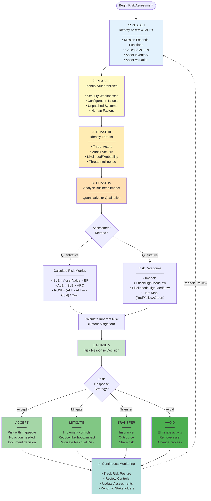

---

## RISK MITIGATION & REMEDIATION


**Risk Mitigation & Remediation** is the overall process of reducing exposure to or the effects/impacts of risk factors to that within an organization's risk appetite.

### Result of Quantitative & Qualitative Analysis

**Inherent Risk** - Level of risk before any type of mitigation has been attempted.

Impossible to eliminate risk entirely. You must balance cost of the control with cost associated with the risk.

Aim is to mitigate risk factors to a level of risk an organization can afford.

The overall status of risk management is referred to as **RISK POSTURE**.

Risk posture shows which risk response options can be identified and prioritized.

---

## RISK MANAGEMENT STRATEGIES

**Regulatory Requirements** - To deploy security controls and make demonstrable efforts to reduce risk. Various legislation and regulation (i.e. SOX, HIPAA, GLBA, PCI DSS) mandate risk controls.

### When to Prioritize Risk:

**High Value Assets** - Regardless of the likelihood of the threat

**Threats with High Likelihood** - With high Annualized Rate of Occurrence (ARO)

**Procedures, Equipment, Software** - That increases the likelihood of threats

---

## RISK RESPONSE OPTIONS

### RISK DETERRENCE or REDUCTION

The response of deploying security controls to reduce the likelihood and/or impact of a threat scenario; thus make a risk incident less likely or less costly.

### RISK AVOIDANCE

Practice of ceasing or stopping activity that is risk-bearing. Not a credible option for high value assets, regardless of the likelihood of the threat.

### RISK TRANSFERENCE or RISK SHARING

Assigning risk to a 3rd party like an insurance company.

Contract with a supplier that defines liabilities - **NIST SP 800-37**

Contract with a 3rd party (MSP) that defines roles - **Shared Responsibility**

Risk to organization reputation remains; however, legal liabilities or fines (financial) are transferred.

### RISK ACCEPTANCE or RISK TOLERANCE

Means that no countermeasures are put in place either because the level of risk does not justify the cost of control implementation or there would be unavoidable delay before countermeasures are deployed.

---

## CONTROL RISK

**Control Risk** - Risk that arises when a control does not provide the level of mitigation that was expected; a measure of how much less effective a security control has become over time.

Control risk refers to a security control that was never effective in mitigating inherent risk.

This illustrates the point that risk management is an ongoing process, requiring continual re-assessments and re-prioritization of assets.

---

## RESIDUAL RISK

**Residual Risk** is likelihood and impact after mitigation.

Factors determining the selection of security controls in terms of what level of residual risk is tolerable:

**Risk Appetite** - An overall budget
- Has a project/institution-wide scope
- Constrained only by regulatory and compliance requirements

**Risk Acceptance (Tolerance)** - Has scope of a simple system
- The risk compared to the cost of the control

**ROSI Metric** - Can be calculated as Return on Security Investment:
- **ROSI = [(ALE - ALEm) - Cost of Security Solution Control] / Cost of Security Solution Control**

---

## RISK AWARENESS

Ensure that business stakeholders understand risk scenario, articulated in such a way that the cause, effect/impact of each risk scenario can clearly be understood by the owner of the asset (subject matter expert).

---

## RISK REGISTER

A document highlighting the results of risk assessments in an easily comprehensible format (i.e. Risk Matrix/Heat Map).

**Purpose**: For management/technicians to understand risks associated with the workflows and systems they manage.

**Contains**:
- Columns for impact and likelihood ratings
- Date of identification
- Description
- Countermeasures
- Route for escalation of status

They are also depicted as scatterplot graphs where impact and likelihood are each on axis and the plot points are risk items.

---

## DISASTERS

In terms of business continuity, a **Disaster** is an event that would threaten mission essential functions.

An **Incident**, on the other hand, represents an event where a privacy/security is breached, or there is an attempted breach.

Disaster response involves many of the same principles and procedures as incident response on a larger scale.

### Disaster Types

**1. INTERNAL** - Disaster caused by malicious activity or by accident by an employee/contractor

**2. EXTERNAL** - Caused by threat actors with no privileged access; impacts organization through wider social impacts; disruption of public services or impacts to supply chain

**3. PERSON-MADE** - i.e. Human agency is primary cause
- Terrorism, war, vandalism, pollution, arson

**4. ENVIRONMENTAL (NATURAL)** - Disaster events
- Quite predictable or unexpected

---


# DISASTER RECOVERY PLANS & RECOVERY SITES


## DISASTER RECOVERY PLANS (DRPs)

A documented and resourced plan showing actions and responsibilities to be used in response to critical incidents.

Describes specific procedures to follow to recover a system/site to a working state following a disaster-level event.

### DRP Components

**1. Identify Scenarios for Disasters & Options for Protecting Systems**

Plans need to account for risks and cost. The business case is made by comparing the cost of recovery measures vs. cost of downtime. Recovery plan should not generally exceed the downtime cost.

**2. Identify Tasks, Resources, Responsibilities for Responding to a Disaster**

- Who is responsible for doing what tasks?
- What functions are most critical?
- What resources are available?

**3. Train Staff in the Disaster Planning Procedures & How to React Well to Change**

- Timescale for resumption of normal operations
- Who needs to be informed about incidents

DRP should identify stakeholders (regulatory, regulatory, customers, team members) with impacts to life and safety.

---

## EVALUATING DRP EFFECTIVENESS

Difficult to evaluate how effective or functional a recovery plan is due to extreme rare cases of disaster-level events.

### Principles for Assessing Functional Recovery Plans:

**WALKTHROUGHS, SEMINARS, WORKSHOPS** - Provide basic awareness training for DRP team members. Doesn't provide practical evidence of things that could go wrong or estimate time to fix.

**TABLE TOP EXERCISES** - Simulate procedures as they would in a disaster, without creating disaster conditions. Mock actor-based sessions; employees can validate DRP by performing scenario-based activity in a simulated interactive environment.

**FUNCTIONAL EXERCISES** - Action-based sessions that reflect real situations; exercises are held on-site to use real equipment and real personnel as much as possible.

**FULL SCALE EXERCISES** - As realistic as possible disaster simulation.

---

## RECOVERY SITES & ALTERNATE PROCESSING

Disaster recovery requires considerable resources, such as shifting processing to an alternate secondary site.

The outputs of risk assessments and business impact analysis will identify vulnerable business processes. To reduce the risks in these processes, you can make the IT systems and other business systems that support them resilient to failure by installing and configuring systems that provide redundancy.

---

## RECOVERY/SPARE SITES


A **Recovery/Spare Site** is another location that can provide the same (or similar) level of service.

A disaster or systems failure at one site will cause service to failover to the alternate processing site.

Disaster recovery planning must demonstrate:
- How this will happen
- What checks need to be made to ensure that failover has occurred successfully (without loss of transactional data/service availability)
- How to revert to the primary site once functionality is restored there

### Site Resiliency Descriptions:

**HOT SITE** - Can handle failover almost immediately if site is already within organization ownership and ready to deploy. Hot site consists of a building with fully operational equipment, kept up-to-date with live data set.

**WARM SITE** - Could be similar to hot site, but with requirement that latest data set will need to be loaded.

**COLD SITE** - Takes longer to setup; consists of empty building with a lease agreement in place to install equipment.

**RECIPROCAL ARRANGEMENTS** - Providing redundancy is expensive, especially during nation-wide emergency. A cost-effective option is for businesses to enter into reciprocal arrangements providing mutual support to one another.

**CLOUD SITE** - The most cost-effective solution; processing and data storage to cloud operators, which should be able to maintain service to redundancy so that geographic disaster in one area does not disrupt service operation. Because the cloud will be supported by datacenters in a different geographic region.

---

## FACILITIES AND INFRASTRUCTURE SUPPORT

Reliability of an individual site doesn't solely depend on IT systems. A site must be provisioned with:

**HVAC (Heating, Ventilation, Air Conditioning)** - Building control systems maintain optimum working environment and mitigate the loss of availability through mechanical issues with equipment or system components.

---

## FIRE SUPPRESSION

Basic elements of fire safety includes:
- Well-marked fire exits
- Emergency evacuation procedure
- Building design to mitigate fire spreading quickly through fire-resistant walls
- Automatic smoke and fire detection systems
- Alarms that can be operated manually

Fire suppression works based on removing any of the elements in the **Fire Triangle**: **[Heat, Oxygen, Fuel]**

---

## FIRE EXTINGUISHERS & SUPPRESSION SYSTEMS

Portable fire extinguishers come in different types designed for fighting a particular class of fire. Notably, **Class C Extinguishers** are gas-based and can be used where risk of electric shock makes others unsuitable.

### Sprinkler Systems

**WET-PIPE SPRINKLERS** - Work automatically, triggered by heat, discharging water held at high pressure in pipes; with risk of burst pipes and accidental triggering. Several alternatives include:

**DRY PIPE** - Used in cold climates (i.e. data centers) where freezing is possible; water only enters when it's triggered.

**PRE-ACTION** - The system only fills with water when an alarm is triggered; sprinkles when heat rises. Provides protection against accidental discharge and burst pipes; gives time to manually contain the fire.

**HALON** - Gas-based systems have advantages of not short circuiting electrical systems and leaves no residue.

**CLEAN AGENT** - Alternatives to Halon; however, not being environmentally damaging. These gases both deplete the concentration of oxygen in an area and have a cooling effect. These gases are toxic to humans.

---

## POWER MANAGEMENT

Power management means deploying systems to ensure that equipment is protected against events such as:
- **Brownouts** (brief voltage drops)
- **Blackouts** (complete loss of power)

And that network operations can either continue uninterrupted or be recovered quickly.

### Power Management Solutions

**1. POWER DISTRIBUTION UNITS (PDUs)**

This unit has circuitry to "clean" the power signal, providing protection against spikes, surges and brownouts and can integrate with an uninterruptible power supply.

On a smaller scale, PDUs are also available as "strip" sockets that can take a higher load. Such sockets are oriented to allow for different cabling and layout options, plus also often support remote power monitoring functions (i.e. reporting load status, switching power to a socket on/off, or in a particular sequence).

**2. BATTERY BACKUPS & UNINTERRUPTIBLE POWER SUPPLIES (UPS)**

In its simplest form, UPS comprises a bank of batteries and their charging circuit plus an inverter to generate AC voltage from DC voltage supplied by batteries.

UPS provides a temporary power source in the event of a blackout, protecting against read/write operations (cache) at the time of the power loss.

---

## HIGH AVAILABILITY CONCEPTS


A network link is often a critical single point of failure. Routers and switches can provide multiple paths through a network to prevent overdependence on single critical nodes. A load balancer can switch client traffic to alternative processing nodes, reducing bottlenecks and allowing for failover services.

---

## MULTIPATHING

Simply means that a network node has more than one physical link to another node.

A default feature in full and partial mesh internetworks, where routers can select alternative paths through the network if a link is unavailable. Multipathing can be used anywhere link redundancy is required.

**SAN MULTIPATHING** - In a SAN, a server uses shared storage accessed over a network link; means that the server has at least 2 SAN controllers each with a dedicated network link to the storage network.

**MULTIPLE ISP** - If an organization depends on a single ISP for Internet access, that circuit represents a critical single point of failure. Even if there are multiple circuits to the same ISP, problems within that ISP's routing or DNS could result in a loss of connectivity. Contracting with multiple ISPs and routing policies to forward traffic over multiple external circuits provides fault tolerance and load balancing. This fault tolerance is reduced if both ISP's links use the same entrance facility/demarcation point. Ensure that the ISPs are operating separate infrastructure and not using peering arrangements. A physical disaster event is likely to affect both sets of cables.

**DIVERSE PATHS** - Refers to provisioning links over separate cable conduits that are physically distant from one another. Another option is to provision cellular links as a backup; likely reducing bandwidth.

---

## LINK AGGREGATION & NIC TEAMING

**LINK AGGREGATION** - Means combining 2 or more separate cabled links between a host and access switch into a single logical channel.

From the **Host Endpoint**, this is referred to as **NIC Teaming**.

At the **Switch End**, it can be called **Port Aggregation** or **EtherChannel** (Cisco).

Link aggregation can also be used in an uplink between 2 switches, 2 routers, or a switch and a router.

Link aggregation can also provide a cost-effective redundancy; if 1 link is broken, connection is maintained.

---

## GENERATORS


The runtime allowed by a UPS should be sufficient to failover to an alternate power source.

If there is no secondary power site, a UPS will at least allow an admin to shut down appliances properly.

A UPS is always required to protect against any interruption. A backup generator can't be brought online fast enough to respond to a power failure.

Alternative emerging technologies try to use all battery resources in a datacenter as a microgrid for power storage. Such ability to use renewable power is a strong factor in determining the best site for a datacenter.

---

## NETWORK DEVICE BACKUP MANAGEMENT

All business continuity and disaster recovery planning involves use of backups. The execution and frequency of backups must be carefully planned and guided by policies.

In network management, backup policies are less focused on data stored on servers and more on swiftly restoring faulty switches, routers, firewalls and load balancers.

Each device should have a documented baseline configuration. The deployment process should be capable of applying this configuration to a replacement device or restoring a faulty device.

**Distinction Between Startup/Persistent & Running Configurations** - During complication, in most cases these should be similar. It's possible that a configuration oversight left a valid running configuration that was never saved as startup configuration. Regular audits should be used to detect and remediate such differences. Most devices support version history of configuration enabling a rollback to change.

### Backup Modes

An appliance may also support 2 backup modes:

**STATE/BARE METAL** - A snapshot-type image of the whole system, deployed to any device of same model.

**CONFIGURATION FILE** - A copy of the configuration data in a structured format (XML). This file can be used in 2-stage restore where the OS/firmware image is applied first and restoration of configuration by importing backup file.

A network appliance may also hold state info that has not been written to a log and that will not be captured by a backup configuration file only. Some devices might log state data to an internal database that can be backed up periodically. In other cases, this info needs to be preserved, or configure to log data to a remote server.

---

# LOAD BALANCERS, CLUSTERING & FIRST HOP REDUNDANCY


**IEEE 802.3ad/802.3ax Standard** - By the other. Link aggregation is typically implemented using IEEE 802.3ad/802.3ax standard.

**LAG (Link Aggregation Group)** - 802.3ad bonded interfaces are described as Link Aggregation Group.

**LACP (Link Aggregation Control Protocol)** - A defined Link Aggregation Control Protocol is used to detect configuration errors and recover from the failure of one of the physical links.

---

## LOAD BALANCERS

Is deployed as a hardware appliance or software instance to distribute client requests across server nodes in a pool or farm. It can be used in any situation where you have multiple servers providing the same function.

LBs are placed in front of the server network and distribute requests from client network or Internet to the application servers. The LB service address is advertised to the client as a **Virtual Server**.

Used to:
- Provision services that can scale from light to heavy loads
- Provision fault-tolerant services
- Provide mitigation against Distributed Denial of Service (DDoS) attacks

### Load Balancing/Failover (LBFO)

LB selects a web server instance. A persistence mechanism can keep client connected to the same server if available.

```
Client                      VIRTUAL SERVER IP
10.0.0.1                    203.0.113.1
10.1.0.2                    
10.1.0.3                    LOAD BALANCER
                            ↓
Forward Requests            FIREWALL
                            ↓
                            Web Servers
```

### Load Balancer Types

**Layer 4 Switch LB** - Basic load balancers make forwarding decisions on IP address and TCP/UDP headers.

**Layer 7 Switch LB** - Complex modern LBs make forwarding decisions based on application-level data (i.e. a request for a particular URL or data types). This requires complex logic and processing power of modern appliance.

**Multilayer Switches** - Appliances can perform switch-like forwarding at layer 3, 4, and 7 are collectively referred to as multilayer switches.

---

## REDUNDANT HARDWARE / CLUSTERS

Where a load balancer distributes traffic between independent processing nodes, **clustering** allows multiple redundant processing nodes that share data with one another to accept connections.

Hence, if one node in the cluster stops working, connections can failover to a working node.

To clients, the cluster appears to be a single server. Unlike load balancing with a single appliance, the public IP used to access the service is shared between instances in the cluster. This is referred to as **Virtual IP/Shared/Floating Address**.

Nodes in the cluster are connected by internal IPs.

---

## CLUSTER CONFIGURATIONS

The instances are configured with a private connection, on which each is addressed by its **Real IP Address**.

This connection runs some type of redundancy protocol such as **Common Address Redundancy Protocol** that enables the active node to own the virtual IP and respond to connections and also a **Heartbeat** mechanism to allow failover to the passive node if the active one should suffer a fault.

### Active-Active vs Active-Passive

**ACTIVE-ACTIVE CLUSTERING** - Means that both nodes are processing connections concurrently. This allows usage of maximum capacity from available hardware while all nodes are functional. In the event of a failover, the workload of the failed node is immediately and transparently shifted onto the remaining node.

**ACTIVE-PASSIVE** - The advantage of active-passive configuration is that performance is not adversely affected during failover.

---

## CLUSTER DIAGRAM EXAMPLE

```
Client Requests
        ↓
VIRTUAL SERVER
VIRTUAL IP Address: 203.0.113.1

LB Config as Active/Passive

Active Redundant LB                 Passive Redundant LB
VIP: 203.0.113.1                    VIP: 203.0.113.1
Internal IP: 172.16.0.1             Internal IP: 172.16.0.2
        ↓                                   ↓
CLUSTER PROTOCOLS
        ↓
10.0.0.1        10.0.0.2        10.1.0.3
Web Server      Web Server      Web Server
```

---

## FIRST HOP REDUNDANCY PROTOCOLS (FHRP)


LAN end systems are typically served by a single router configured as the default gateway. Due to degree of complexity in host's routing algorithm, configuring multiple default gateways for fault tolerance to an end system host is impractical.

To address this problem, various types of **First Hop Redundancy Protocols (FHRP)** have been developed, allowing multiple physical router appliances to act as the same logical router, providing failover.

---

## HOT STANDBY ROUTER PROTOCOL (HSRP)

This allows multiple physical routers to serve as a single default gateway for a subnet.

To do this, each router must have an interface connected to the subnet with its own MAC and IP address. In addition, they also need to be configured to share a common virtual IP and MAC address.

They communicate amongst themselves using IP multicasts and choose an **Active Router** based on configured priorities.

The active router responds to any traffic sent to the virtual IP. Router with next highest priority is chosen as the **Standby Router** (monitors the status of the active router and takes over the role of the active router).

If the active router becomes unavailable, also triggers the selection of a new standby router from the group.

---

## VIRTUAL ROUTER REDUNDANCY PROTOCOL (VRRP)

Similar to HSRP; different in terminology and packet formats.

**Active Router** known as **Master Router**.

No specific standby router; all other routers known as **Backup Routers**.

In the event of a failure, a new master router is selected based on priority from the group.

**One advantage of VRRP over HSRP**: Doesn't require each router interface to be assigned a unique IP address. It's possible to configure VRRP routers to use only the virtual IP address, useful on subnets where address pools are low.

---

# NETWORK HARDENING TECHNIQUES & ATTACK TYPES

**NETWORK HARDENING TECHNIQUES NOTES**

Effective network security design requires an understanding of how threat actors can compromise defenses.

**Threat Research** provides analysis of threat actors' **Tactics, Techniques & Procedures (TTPs)**.

The goals of most types of adversaries will be to:
- Exfiltrate info
- Misuse network services
- Compromise the availability of network

---

## ATTACK TYPES

### 1. FOOTPRINTING & FINGERPRINTING

Enumeration or information gathering attacks. This allows the threat actors to discover the topology and general configuration of the network and security systems. Can be done by social engineering or fingerprinting.

**Fingerprinting** via port scan allows a threat actor to identify device, OS types and versions; using such information to further probe for known vulnerabilities.

---

### 2. SPOOFING

This term covers a wide range of identity disguise attacks in which source of network info is forged to appear legitimate. Social engineering techniques (i.e. phishing and pharming), as well as abusing the way a protocol works or network packets are constructed to inject false or modified data onto the network [ARP and DNS].

---

### 3. DENIAL OF SERVICE (DoS)

This causes a service at a given host to fail or become unavailable to legitimate users.

**Resource Exhaustion DoS Attacks** - Focus on overloading a system by using up CPU, RAM, memory space, or bandwidth.

DoS attacks may also be the precursor to a spoofing or data exfiltration attack or diverting attention and resources.

---

### 4. ON-PATH ATTACKS (MITM)

A specific type of spoofing attack where a threat actor compromises the connection btw 2 hosts and transparently intercepts and relays all communications between them; with opportunity to modify traffic.

---

### 5. MAC & IP SPOOFING

Threat actors exploit a host's ability to arbitrarily select any MAC and/or IP address and attempt to spoof its value of a valid MAC/IP address to try to circumvent an ACL list or impersonate a legitimate server instance.

To mitigate against duplicate addresses on the network, the threat actor must normally disable the legitimate host. IP spoofing is used in DoS attacks to mask the origin of the attacker.

---

### 6. ARP SPOOFING / CACHE POISONING

Works by broadcasting unsolicited ARP reply packets, known as **Gratuitous ARP Response**, with a source address that spoofs a legitimate host or router interface.

---

## ARP POISONING ATTACK DETAILS


Because ARP has no security mechanism, all devices in the same broadcast domain as the rogue host trust the communication and update their IP-to-MAC cache table with the spoofed address.

Endless broadcasts of ARP replies overwhelms the legitimate interface at the usual target (the subnet's gateway).

If attack is successful, traffic is routed to the attacker's interface, performing an on-path attack to monitor, comment, or modify packets, or perform DoS by not forwarding the packets.

ARP poisoning can be difficult to detect without close network monitoring through attempts at ARP poisoning are likely to cause sporadic communication difficulties (i.e. unreachable default gateway).

**Detection**: Perform network captures, examining ARP packets and local ARP caches for multiple IP:MAC address mappings.

While IPv6 doesn't use ARP, it is also vulnerable to layer 2 spoofing of the unencrypted Neighbor Discovery protocol used.

---

### 7. ROGUE DHCP

DHCP communications can be used without authentication, so hosts generally trust the first offer packet it receives.

An on-path attack can be launched by threat actor exploiting this to set his/her machine as the subnet's default gateway or DNS resolver.

**Prevention**:
- Enable DHCP snooping on your switch
- Disable the rogue DHCP communication
- Disable the rogue
- Renew IP leases
- Authorized DHCP servers in Active Directory

---

### 8. DNS POISONING

This attack compromises the name resolution protocol process. Typically, the actor will replace the valid IP address for a trusted website with the attacker's IP address; thereby intercepting all the packets directed to the website and either forwarding them to the real site or directing all traffic for a particular FQDN to an invalid IP address (a black hole).

This is achieved by:
- Corrupting the client's name resolution process accomplished by changing the servers used for resolving queries
- Intercepting and modifying DNS traffic
- Polluting or poisoning the client's local name cache (i.e. HOSTS FILE)

**DNS Server Cache Poisoning** is another redirection attack, but instead of subverting the name service used by the client, it aims to corrupt the records held by the DNS server itself. This can be carried out by misconfiguration or auxiliary DNS server.

---


# VLAN HOPPING, WIRELESS ATTACKS & DDoS


## VLAN HOPPING

This attack is designed to send traffic to a VLAN other than the one the host system is in.

This exploits the native VLAN feature of 802.1Q tagging ID. The actor, using a device placed in the native VLAN, crafts a frame with 2 VLAN tag headers.

The 1st trunk switch to inspect the frame strips the first (outer) header, and the frame gets forwarded to the target VLAN. Such an attack performs a one-way host attack against the target VLAN.

**Double Tagging Mitigation**: Can be mitigated by ensuring that the native VLAN uses a different ID to any user accessible VLAN, or setting the native VLAN to an unused VLAN ID.

### VLAN Hopping via Switch Spoofing

A VLAN hopping attack can also be launched by attaching a device that emulates the operation of a switch to the network and negotiating the creation of a trunk port.

As a trunk port, the attacker's device will receive all inter-VLAN traffic.

**Mitigation**: Such attack is mitigated by ensuring that ports allowed to be used as trunks are pre-determined in the switch's configuration and access ports are not permitted to auto-configure as trunk ports.

### VLAN Hopping Attack Diagram

```
Attacker on VLAN 10
        ↓
TRUNK → VLAN 10 Switch
        ↓
[Eth Header | 802.1Q Tag #10 | 802.1Q Tag #20 | Data]
        ↓
VLAN 20 Switch → Victim on VLAN 20
```

---

## WIRELESS NETWORK ATTACKS


WiFi networks open several avenues for threat actors to gain unauthorized network access.

### ROGUE ACCESS POINTS

A **Rogue AP** is one installed on the network without authorization, whether with malicious intent or not.

A malicious user can set up an AP with something as basic as a smartphone with tethering capabilities. If connected to a LAN without security, an unauthorized AP creates a back door through which to attack the network.

### EVIL TWIN

A rogue AP masquerading as a legitimate one is called an **Evil Twin**.

An evil twin might advertise a similar network name (SSID) to the legitimate one. Also, the evil twin might spoof the SSID and BSSID (MAC) of an authorized AP and then the actor might use some DoS technique to overpower the legitimate AP.

After successful DoS attack, users are forced to disconnect and manually attempt to reconnect; some or all users may associate with the evil twin AP and submit the network credentials for authentication.

Evil twins can execute an on-path attack to snoop on connections established with servers/websites.

**Mitigation Against Rogue AP**:
- Use EAP-TLS security so that the authentication server and clients perform mutual authentication
- Detecting rogue APs using scanners and monitoring systems referred to as **Wireless Intrusion Detection/Prevention Systems (WIDS/WIPS)**

---

## DE-AUTHENTICATION ATTACK


Use of an evil twin may be coupled with a **De-Authentication Attack**.

This sends a stream of management frames to cause a client to de-authenticate from an AP. This might allow the attacker to:
- Impose the evil twin
- Sniff info about the authentication process
- Perform a DoS attack against the WiFi network

The attack works against both WEP and WPA.

**Mitigation**: If the WiFi infrastructure supports **Management Frame Protection (MFP / 802.11w)**, both the AP and clients must be configured to support MFP.

---

## DISTRIBUTED DENIAL OF SERVICE (DDoS) ATTACKS AND BOTNETS


### DDoS Overview

A **Distributed DoS (DDoS)** attack is launched simultaneously by multiple hosts with aim ranging from bandwidth consumption to resource exhaustion on hosts processing legitimate requests.

The delays in processing could potentially crash the host system completely.

### SYN Flood Attack

A **SYN Flood Attack** works by withholding the requesting client's ACK packet during TCP 3-way handshake.

The actor uses a spoofed IP thereby misdirecting the server's SYN/ACK packet. A server can maintain a queue of pending connections. If ACK response is not received, it resends the SYN/ACK packet a number of times before timing out and giving up on the connection.

The DoS attack quickly fills up the pending connection queue meaning that the server is unable to respond to genuine traffic.

### DRDoS Attack (Distributed Reflection DoS)

A more powerful TCP SYN flood attack is a type of **Distributed Reflection DoS (DRDoS)** or **Amplification Attack**.

Here, the attacker spoofs the victim's IP and attempts to open connections with multiple random servers. The servers direct their SYN/ACK response to the victim server, rapidly consuming the victim's available bandwidth.

This sort of technique can be used to bombard a victim network with responses to bogus DNS queries. Though a DNS request query is small, the response contains lot of info hence overwhelming the bandwidth of victim network.

---

## BOTNETS

A group of compromised hosts that can be used to launch DoS/DDoS attacks.

A threat actor first compromises 1 or 2 machines to use as **Handlers**, which are then used to compromise 100s/1000s/millions of **Zombie** hosts with DoS tools.

To compromise a host, the actor installs malware opening a remote backdoor connection. The attacker uses the malware to install **Bots** and trigger the zombies to launch the attack simultaneously.

The network established through the handlers and the bots is called a **Command & Control (C&C/C2) Network**.

---

## CONTROL PLANE POLICING


Network appliances use minimal resources to process ordinary data traffic, which is often processed by a dedicated hardware chip and does not require the general purpose CPU.

Conversely, control data and management traffic requires software-based processing and is punted to the CPU pipeline, consuming memory resources and processor time.

### Network Planes

**Control Plane** - Comprises traffic that keeps the network operational:
- Routing updates
- ARP traffic
- NTP updates
- QoS classification
- STP notifications
- Link reservation requests

**Management Plane** - Comprises traffic that allows remote administration and monitoring of the network appliances directly to the appliance loopback address:
- SSH
- SNMP
- NetFlow
- Logging/alerting
- Syslog

The network must always allow sufficient bandwidth and CPU/memory resources for control and management traffic. If the traffic is blocked, the ability of the network to function is disrupted.

Worms, malware, or malicious reconnaissance tools may attempt to masquerade as high-priority traffic of multiple different types. This places unusually high demands on the routers and switches that process control plane traffic, affecting a DoS attack on the other functions they have to perform. Also described as a **Route Processor (RP) Attack**.

Can be performed against both routers and switches.

Such attack can be threatened by misconfiguration.

---

## CONTROL PLANE POLICING POLICY

A **Control Plane Policing Policy** is designed to mitigate the risk from route processor vulnerabilities and attacks.

Such policies can use ACLs to allow/deny certain traffic from certain sources and apply rate-limiting if a source threatens to overwhelm the route processor.

### Security Best Practices

- Configure services according to the device's baseline and disable any services which are not required
- Consider setting up alerting mechanisms to detect service configuration changes
- Use only secure channels for administration traffic or any other protocol where credentials need to be submitted


---

# MALWARE, PASSWORD ATTACKS & SOCIAL ENGINEERING


## MALWARE & RANSOMWARE ATTACKS

**Malware** - **MALICIOUs SOFTware**: Can be defined simply as software that does something bad from the perspective of the system owner. Classification of malware definitions overlap or are blurred.

### Malware Classification Methods

**1. BASED ON THE VECTOR** - The vector is the method by which the malware executes on a computer and potentially spreads to other network hosts (i.e. TROJAN, VIRUS, WORM, Potentially Unwanted Programs/Applications [PUPs/PUAs]).

**2. BASED ON DEGREE OF INSTALLATION** - How the malware establishes persistence on the system.

**3. BASED ON PAYLOAD DELIVERED BY THE MALWARE** - The payload is an action performed by the malware other than simply replicating or persisting on a host (i.e. Spyware, ROOTKIT, Remote Access Trojan, Backdoor, Ransomware).

---

## MALWARE TYPES

### VIRUSES & WORMS

Malware of this nature spread without any authorization from the user by being concealed within the executable code of another process.

**Worms** are viruses that can move from system to system without human intervention.

### TROJAN

Malware concealed within an installer package for software that appears legitimate, and doesn't seek any type of consent for installation and it's actively designed to operate secretly.

### PUPs & PUAs

**Potentially Unwanted Programs & Potentially Unwanted Applications** - Software installed alongside a package selected by the user or perhaps bundled with a new computer system or firmware.

Unlike trojan, its presence is not automatically regarded as malicious. It may have been installed without active consent or consent from a purposefully confusing license agreement - A **GRAYWARE**.

### RANSOMWARE

Type of malware with intentions to extort money from the victim. This may block access to the computer by installing a different shell program or browser window that is difficult to close. Relatively simple to fix.

The **Crypto-Malware** class of ransomware attempts to encrypt data files on any fixed, removable, and network drives.

A successful attack restricts user access to files without obtaining the private encryption key held by the attacker. Difficult to mitigate unless up-to-date backup files exist.

---

## PASSWORD ATTACKS


Password cracking software uses various methods to work out a plaintext string from a cryptographic hash.

### Dictionary Attack

The software matches the hash to those produced by ordinary words found in a dictionary database (.txt file).

### Brute Force Attack

The software tries to match the hash against one of every possible combination that could be used. Can be performed interactively or offline.

### Risk Mitigation

The risks posed by cracking software mean that it's more secure to use end-to-end encryption like IPsec or TLS. This means that all payload data is encrypted, and a network sniffer cannot recover password hashes.

---

## HUMAN & ENVIRONMENTAL SOCIAL ENGINEERING ATTACKS


A prerequisite of many types of attacks is to obtain information about the network and security system.

**Social Engineering** (or hacking the human) represents a collection of techniques and tricks designed to make victims reveal confidential information (i.e. impersonation).

For this to work, the approach must be persuasive and establish trust. Social engineering might also use intimidation or hoaxes as a means of obtaining information through fear.

---

## SOCIAL ENGINEERING TECHNIQUES

### PHISHING

A combination of social engineering and spoofing; it persuades or tricks the target into interacting with a malicious resource disguised as a legitimate trusted source.

A phishing message might try to convince the user to perform some action (i.e. installing disguised malware or allowing a remote connection by the attacker).

### SHOULDER SURFING

A threat actor may obtain confidential info by watching the victim type or write it. Despite the name, the attacker may not have to be in close proximity to the target (i.e. use of binoculars or CCTV).

### TAILGATING & PIGGYBACKING

**TAILGATING** - A means of entering a secure area without authorization by following closely behind the person that has access to the checkpoint.

**PIGGYBACKING** - A similar situation but means that the attacker enters a secure area with an employee's permission.

Alternatively, piggybacking may be a means for an insider threat actor to allow access to someone without recording it in the building's entry log.

---

## APPLYING NETWORK HARDENING TECHNIQUES

Export and switch port security is an important network security control, providing defense in depth by preventing the attachment of unauthorized devices.

Configuring policies to ensure only authorized devices connect to the network, also ensure that those authorized devices are in a secure configuration and fully patched against vulnerabilities.

Ensuring that network hosts are put in a secure configuration before being granted access.

As part of defense in depth strategy, think about making each host and network device secure against tampering.

Network devices are not self-contained, running complex firmware and hosting numerous services to enable remote management and configuration. Deploying systems in a secure configuration is known as **Device Hardening**.

---

## SECURE SYSTEMS CONFIGURATION POLICIES


### i. CHANGE DEFAULT PASSWORDS/CREDENTIALS

Enforce strict password requirements → Passwords for network systems must be highly resistant to cracking methods:
- LENGTH
- COMPLEXITY
- Avoid common passwords

### ii. CONFIGURE ROLE-BASED ACCESS

Means that a limited set of permissions are configured for different administrator groups. Separating permissions for configuring the system to those for configuring logging and auditing.

Such separation of duties reduces impacts from compromise of any single account, rather than 1 default admin with superuser/unrestricted access.

### iii. DISABLE UNNEEDED NETWORK SERVICES

Reducing attack surface by disabling services or protocols, unused admin interfaces.

### iv. DISABLE UNSECURE PROTOCOLS

Important to understand which protocols are unsecure in terms of using unencrypted communication channels, particularly important when configuring a channel to authenticate. Unsecure protocols should be deprecated and secure protocols used instead.

---

## ENDPOINT SECURITY & SWITCHPORT PROTECTION

**Endpoint Security** is a set of security procedures and technologies to restrict network access at a device level/endpoint level.

In contrast to the focus on perimeter security established by topologies (i.e. screened subnets) and technologies (i.e. Firewall).

Endpoint security is designed not to replace perimeter security but to supplement it, creating defense in depth.

---

## SWITCH PORT SECURITY MECHANISMS

### i. DISABLE UNNEEDED SWITCH PORTS

To prevent the attachment of unauthorized client devices, a switch port can be disabled using the management software or isolated to a VLAN with no route to the network (Black Hole VLAN).

Alternatively, the patch cable can be physically removed from the port; this would introduce administrative overhead and scope for error, and it doesn't provide complete protection, as an attacker could unplug a device from an enabled port and connect their own hardware interface.

### ii. MAC FILTERING & DYNAMIC ARP INSPECTION (DAI)

Configuring MAC filters on a switch means defining which MAC addresses are permitted to connect to a particular port.

This can be done by creating a list of valid MAC addresses or by specifying a limit to the number of permitted addresses and dropping any traffic from machines with network adapter IDs that try to connect.

If port security is enabled with a max of 2 MAC addresses, the switch will record the first 2 MAC addresses that connects to that port.

**DAI (Dynamic ARP Inspection)** prevents a host attached to an untrusted port from flooding the segment with gratuitous ARP replies.

ARP Inspection maintains a trusted database of IP:ARP mappings, ensuring that ARP packets are validly constructed and use valid IP addresses.

### iii. DHCP SNOOPING

This configuration causes the switch to inspect DHCP traffic arriving on access ports to ensure that a host is not trying to spoof its MAC address. Also used to prevent rogue DHCP servers from operating on the network.

With DHCP snooping, only DHCP offers from ports configured as trusted are allowed.

### iv. NEIGHBOR DISCOVERY INSPECTION & ROUTER ADVERTISEMENT GUARD

**ND Inspection & RA Guard** perform similar functions to DAI and DHCP snooping for IPv6 networks.

These switch protections should be enabled to mitigate snooping and on-path attacks over IPv6 enabled networks.

---

## PORT SECURITY & IEEE 802.1X PORT-BASED NETWORK ACCESS CONTROL

To ensure only valid hosts are connecting to the network, **Port Security** refers to the **802.1x standard PNAC (Port-based Network Access Control)** mechanism which means that the switch performs some sort of **Extensible Authentication** of the attached device before activating the port.

### 802.1x Architecture

**HOST** = Supplicant

**SWITCH** = Authenticator (enabling the Extensible Authentication Protocol over LAN [EAPOL] only and waits for the device to supply authentication data, which it passes to the authentication server)

**AAA SERVER** = NAS/NAP (which checks credentials and grants/denies access to the supplicant)

If access is granted, the switch (NAS/NAP) will configure the port to use the appropriate VLAN and enable it for ordinary network traffic.

Unauthenticated hosts may be denied access or configured to a guest VLAN with only limited access to the rest of the network.

---

## VLAN & PRIVATE VLAN BEST PRACTICES

The **Virtual LAN** feature of managed Ethernet switches is typically deployed to enforce segmentation policies.

A VLAN isolates layer 2 broadcast traffic to switch ports that are configured with the same VLAN ID.

Each VLAN ID is mapped to a subnet, so any traffic forwarding between VLANs must be performed by a router (layer 3 switch).

---
# PRIVATE VLANs, FIREWALL RULES & WIRELESS SECURITY


**PRIVATE VLANS**

## PRIVATE VLANS

A **PVLAN** applies an additional layer of segmentation by restricting the ability of hosts within a VLAN to communicate directly with one another.

**Common Use Case**: This might be used by a hosting company to prevent web servers operated by different customers from being able to communicate. Isolating these server instances using PVLANs is simpler than creating multiple VLANs and subnets.

Similarly, ISPs use PVLANs to isolate subscriber traffic.

When configuring a PVLAN, the host VLAN is referred to as the **Primary VLAN**. The following types of ports can be configured:

### PVLAN Port Types

**PROMISCUOUS PORT** - Can communicate with all ports in all domains within the PVLAN. Routed or DHCP traffic goes through this port.

**ISOLATED PORT** - Can only communicate with the promiscuous port only. This creates a subdomain of a single host only. The PVLAN can contain multiple isolated ports, but each is in its own subdomain.

**COMMUNITY PORT** - Can communicate with the promiscuous port and with other ports in the same community, creating a domain that can contain multiple hosts.

---

## DEFAULT VLAN & NATIVE VLAN

**DEFAULT VLAN** - The VLAN ID 1 is referred to as the default VLAN; this can't be changed. However, unless configured differently, all ports on a switch default to being in VLAN 1.

When implementing VLANs, you should avoid sending user data traffic over the default VLAN. It should remain unused or used for inter-switch protocol traffic where necessary (i.e. spanning tree traffic would be permitted to run over default VLAN).

Ensure that unused ports are not assigned to VLAN 1.

### NATIVE VLAN

A **Native VLAN** is one into which any untagged traffic is put when receiving frames over a trunk port.

When a switch receives an untagged frame over a trunk, it assigns the frame to the native VLAN. Such untagged traffic might be derived from legacy devices that do not support 802.1Q encapsulated frames.

The native VLAN is initially set with the same VID as the default VLAN (1). You can and should change this to make the native VLAN use any suitable ID. This should not be the same as any VLAN used for any other data traffic. The same native VLAN ID should be configured for the trunk port on both switches.

---

## FIREWALL RULES & ACL CONFIGURATION


Firewall ACLs are configured on the principle of **Least Access**. This is the same as the principle of least privilege. Only allow the minimum amount of traffic required for the operation of valid network services and no more.

The rules in a firewall's ACL are processed **top-to-bottom**. If traffic matches a rule that allows a packet, then it's allowed to pass. Consequently, the most specific rules are placed at the top.

The final/bottom default rule is typically to block any traffic that has not matched a rule → **Implicit DENY**.

If the firewall does not have a default implicit deny rule, an **Explicit DENY ALL** rule can be added manually.

### Firewall Rule Parameters (Tuples)

Each rule can specify whether to block or allow traffic based on parameters, often referred to as **Tuples**.

If you think of each line of rule being like a row in a database, the parameters/tuples are the columns.

---

## IPTABLES

**IPTABLES** is a command utility provided by Linux distros that allows admins to edit the rules enforced by the **Linux Kernel Firewall**.

iptables works with different firewall chains which apply to different types of traffic passing through the system. The three main chains are **INPUT**, **OUTPUT**, and **FORWARD**.

### iptables Chains

**INPUT** - Affecting incoming connections (inbound connections)

**OUTPUT** - For outgoing connections (outbound connections)

**FORWARD** - For connections passing through the host rather than being delivered locally. This chain is used for configuring the host as a firewall.

Rules can be assigned to the firewall chains, or new chains can be created and then linked to the standard system chains to affect traffic flow.

To view the current status of the iptables and volume of traffic using the chains, use the command:

**`iptables -L -v`**

When you set least access rules (i.e. both INPUT and OUTPUT default policy is set to deny all), you must set both INPUT and OUTPUT rules to allow most types of client/server traffic.

### Security Best Practices

- Ensure that only necessary IP ports (TCP, UDP) to run permitted services are open and that access to a port is controlled by a firewall ACL as appropriate
- Ensure segmentation of security zones using VLANs and PVLANs. Ensure that trunks carrying inter-VLAN traffic are correctly configured to mitigate against VLAN hopping attacks

---

## WIRELESS SECURITY


The following features can be enabled to provision secure wireless network access:

### Wireless Security Features

**PRESHARED KEYS (PSKs)** - Group authentication; allows stations to connect to the network using a shared passphrase

**EXTENSIBLE AUTHENTICATION PROTOCOL (EAP)** - Allows a device authentication using digital certificates in WPA2/WPA3 Enterprise

**CAPTIVE PORTAL** - Login portal

**MAC FILTERING** - Restricting access based on MAC addresses

**GEOFENCING** - Ensuring that the stations are within a valid geographic area to access the network

**ANTENNA PLACEMENT & POWER LEVELS** - Presence of an unusually strong transmitter (>20dBm) might indicate the presence of an evil twin or rogue access point

**WIRELESS CLIENT ISOLATION** - Access point can be configured to prevent clients connected to the WLAN (considered to be in the same broadcast domain) from communicating with each other, by ensuring peer-to-peer traffic is dropped by the AP. Stations can only communicate via its gateway as allowed.

**GUEST NETWORK ISOLATION** - Guest network should have separate security and forwarding policies applied to it than the network that permits access to the corporate LAN. Permit Internet access, block local server access.

---

## IoT ACCESS CONSIDERATIONS & BYOD

IoT devices might be present in dedicated embedded systems and smart buildings and individual smart devices in employee work spaces. Unmanaged access to these devices compose a security risk. So management and audit procedures:

### IoT Security Best Practices

- Perform regular audits to prevent **Shadow IT** (uncontrolled deployment of smart devices and appliances). Assist with scanning software that specializes in identification of IoT devices, giving visibility to deployment
- Ensure that admin interfaces are secured, that device configuration management is assigned to organizational roles
- Include all IoT devices in patch and vulnerability management audits
- Isolate management and monitoring traffic for embedded systems to minimize access to and from corporate data network
- Audit supplier security policies and procedures regularly, especially where external monitoring channels exist

---

## PATCH AND FIRMWARE MANAGEMENT


Each type of OS and applications software has vulnerabilities that present exploit opportunities. Vendors try to patch vulnerabilities identified in a supported product through software and firmware updates.

There can never be a single comprehensive list of vulnerabilities for each OS/software, so you must stay up-to-date with the security system advisories posted on vendor websites and in other security reference sources.

**Patch Management** refers to the procedures put in place to manage the installation of updates.

Updating firmware is known as **Flashing the Chip**, generally done via a vendor-supplied setup program.

Important to make a backup of the system configuration before performing a firmware update or upgrade.

Once environment and compatibility checks have been completed and configuration backed up, the basic upgrade process is to copy the new system image to the appliance's flash memory. Next, a set of command sequences is run to replace the old image and load the new one at startup.

### Firmware Version Management

Most software and firmware version changes/updates are upward, toward newer versions.

**DOWNGRADING (ROLLBACK)** - Refers to reverting to a previous version of the software or firmware. This might be necessary to fix a problem caused by a recently upgraded or updated device or software.

When applying a patch/upgrade, it's common to make a configuration backup, in case settings must be reapplied after update.

When downgrading, a configuration backup might not work because it may feature settings not included in previous version.

### Security Best Practices

- Use vulnerability and patch assessment by scanning to ensure that all types of hosts (servers, clients, IoT devices, appliances) are fully patched
- Use switch port protection, port authentication, wireless security, IoT device management and control plane policing to prevent the attachment of rogue devices and DoS attacks against network infrastructure
- Change default device credentials on installation and ensure that accounts are secured with strong passwords. Configure fine-grained permissions to support role-based access

---

---

# HARDENING & SECURITY POLICIES

**HARDENING & SECURITY POLICIES NOTES**

Security policy establishes a duty for each employee to ensure the CIA Triad of any data, assets or processing systems used as part of their job. Supplemented by numerous operational policies to govern specific areas of activity or configuration. HR communicates security policies to employees and enforces disciplinary measures including updates to the policies.

---

## ONBOARDING

**Onboarding** - Process of welcoming a new employee (third party suppliers or contractors) to the organization.

### Onboarding Procedures

**BACKGROUND CHECK** - Determines that a person is who they say they are

**IDENTITY & ACCESS MANAGEMENT (IAM)** - Creating an account; assign the appropriate privileges for new user access

**ASSET ALLOCATION** - Provision devices for the user or agree on the use of BYOD policy

**TRAINING** - Schedule appropriate security awareness and role-relevant training and certification

---

## OFFBOARDING

**Offboarding** - Process of ensuring that an employee leaves a company gracefully.

### Offboarding Procedures

**IDENTITY & ACCESS MANAGEMENT (IAM)** - Disable the user account and privileges

**RETRIEVE COMPANY ASSETS** - Employees will need to confirm that they have not retained copies

**RETURN PERSONAL ASSETS** - Employee-owned devices need to be wiped of corporate data and applications

---

## USAGE POLICIES

Usage policies set out rules for how users should interact with network systems and data.

### i. PASSWORD POLICY

Instructs users on best practice in choosing and maintaining network access credentials.

Password protection policies mitigate against the risk of attackers being able to compromise an account and use it to launch other attacks on the network. Alerting users to different types of social engineering and phishing attacks.

### Requirements for User-Selected Passwords Include:

**LENGTH** - Longer pass/phrase might be used for critical systems with infrequent logons

**COMPLEXITY** - Varying the characters makes it more resistant to dictionary-based attacks

**AGING AND HISTORY** - Requiring a password be changed periodically; preventing reuse of previously used passwords

---

## ACCEPTABLE USE POLICY (AUP)


**Acceptable Use Policy [AUP]** sets out the permitted use of a product or service. It might also state explicitly prohibited uses. Such a policy might be used in different contexts.

---

## BYOD POLICIES

**BYOD Policies** - A mobile deployment model describing the way employees are provided with smartphone, tablet devices and apps.

BYOD means that the mobile is owned by the employee and can be used on the corporate network as long as it meets certain specifications required by the organization.

The employee will have to agree to installation of corporate apps and some level of oversight and auditing.

---

## DATA LOSS PREVENTION (DLP)

**Data Loss Prevention [DLP]** - Theft or loss of confidential or personal data/info is referred to as **Data Breach**.

DLP products scan content in structured formats (i.e. databases with formal access control model) or unstructured formats (email, word processing documents); using some sort of algorithm (regex matching) to identify confidential or personal (sensitive) data.

Transfers of such content to removable media, by email, or cloud storage can then be blocked if it doesn't comply to a predefined policy; as well as being logged by the DLP software.

---

## REMOTE ACCESS POLICIES

Use of remote access privileges must be governed by technical and policy controls.

The principal solution to such security problems is to educate remote users about security roles and their responsibilities. Enforcement can be provided by having remote devices audited periodically to ensure that:
- Antivirus, firewall, OS/browser app patches are being kept up to date
- Check that unlicensed software hasn't been installed

Also wise to limit what remote users can access on the local network; to severely restrict the rights of remote computer accounts: **LEAST PRIVILEGE PRINCIPLE**.

### Some of the Issues that Must Be Mitigated by Strict Remote Access Policies Include:

- **MALWARE PROTECTION**
- **SECURITY INFORMATION**
- **DATA TRANSFER**
- **LOCAL PRIVILEGES**
- **WEAK AUTHENTICATION**
- **UNTRUSTED NETWORK**

---

# PHYSICAL SECURITY METHODS


**PHYSICAL SECURITY METHODS NOTES**

For a network to be secure, access to the building and certain areas must be controlled. Understanding of procedures and hardware that improve the physical security of site premises help reduce intrusion.

Where an area is controlled by being enclosed by walls or fencing, access is channeled through defined points of entry (i.e. doors, gates). These entry points can be protected by types of electronic lock listed below.

---

## ACCESS CONTROL HARDWARE / ELECTRONIC LOCKS

Deployed to enable users to authenticate quickly at access points.

### BADGE READER

A photographic ID badge showing name and access level with built-in integrated chip and data interface that stores user's key pair and digital certificate.

A **Smart Card Badge** is either:
- **Contact-based (ISO 7816)**
- **CONTACTLESS (ISO 14443)**

### BIOMETRIC

An electronic lock may also be integrated with a biometric scanner. Actuated by human physical features:
- Fingerprint
- Voice
- Retina
- Signature

Each user's biometric is recorded as a template and stored on an authentication server. To gain access, user's biometric is scanned again and compared to template.

---

## ACCESS CONTROL VESTIBULE

Where one gateway leads to an enclosed space protected by another barrier.

The risk of tailgating or unauthorized access by more than one user can be mitigated using:
- **Vestibule**
- **Mantrap**
- **Turnstile** (a type of gateway that only allows one person through at a time)

---

## LOCKING RACKS

Installing equipment within secure cabinets or enclosures provides mitigation against insider attack or for attacks that have breached the perimeter security mechanisms.

It is also possible to provision lockable brackets and drawers to protect/isolate individual elements within a rack (i.e. some data centers may contain racks with equipment owned by different corporations [co-location]).

These racks are installed with cages so that technicians can only physically access the racks housing their own company's servers and appliances.

---

## LOCKING CABINETS, BRACKETS & SMART LOCKERS

**LOCKING CABINETS & BRACKETS** - Provide secure storage for individual items like media with cryptographic keys

**SMART LOCKERS** - A cabinet that supports unlocking via a smart card or biometric reader

---

## DETECTION-BASED DEVICES

Detection-based controls provide an important additional layer of defense in the event that prevention-based controls fail to work.

Effective surveillance mechanisms ensure that attempts to penetrate barriers are detected. Surveillance focused on perimeter areas or within security zones performed by guards or video surveillance.

---

## CAMERAS

A security camera is either:
- **Fixed** - Narrow focal length suitable for doorways or hallways
- **Operated using PAN-TILT-ZOOM [PTZ] Controls** - To survey a large room and pick out individual faces

### CCTV (Closed-Circuit Television)

Cameras in a **Closed-Circuit Television (CCTV)** network are connected to a multiplexer via coax or twisted pair cabling.

The multiplexer can then display images on one or more screens, allowing the operator to control the frames and record images to tape or HDD.

Newer camera systems may be linked in an **IP Network** using regular network cabling. Small cameras can use **PoE (Power over Ethernet)**, avoiding the need to provision a separate power circuit.

---

## ASSET TAGS

**Radio Frequency ID [RFID]** asset tracking tags allow electronic surveillance of movable assets.

The tags can be detected at entry/exit points to prevent theft. The tags are entered into a tracking database which also usually has a map of the coverage area so that particular assets can be located.

---

## ALARMS & TAMPER DETECTION

An audible alarm is an effective deterrent by causing the attacker to abandon an intrusion attempt.

### CIRCUIT

A **Circuit-based Alarm** sounds when the circuit is opened/closed depending on the type of alarm.

A **Closed Circuit Alarm** is more secure because an open circuit alarm can be defeated by cutting the circuit.

### MOTION DETECTION

A **Motion-based Alarm** is linked to a detector triggered by any movement within a relatively large area. Sensors in the detectors are either:
- Microwave radio
- Passive infrared-based

As well as protecting building areas, alarms can be installed on rack systems and appliance chassis.

---

## PROTECTED DISTRIBUTION SYSTEM (PDS)

A physically secure cable network is referred to as a **Protected Distribution System (PDS)**.

A **Hardened PDS** is one where all cable is routed through sealed metal conduit and subject to periodic visual inspection.

Prevents network data cable tap via cable splice. Tamper detection alarm systems can be implemented within the cable conduit.

---

# ASSET DISPOSAL & EMPLOYEE TRAINING

Physical security controls need to take account of the disposal phase of the system life cycle. Risks of leaking software licenses or configuration info to an attacker can be mitigated by ensuring that the built-in factory reset routine is invoked to wipe any custom configuration or modifications when decommissioning.

**Factory Reset** may leave data remnants.

**Data Remnant Removal** is critical to ensure that no data is recoverable from hard disk drives, flash storage, solid state drives, tape media, CD and DVD ROMs before they are disposed of or put to a different use.

Data remnants can be dealt with either by:
- **Destroying the media**
- **Sanitizing** (removing confidential info but leaving the media intact for reuse)

Methods of destroying media include:
- Incineration
- Pulverization
- De-Gaussing (for magnetic drives)

---

## MEDIA SANITIZATION

**Media Sanitizing** refers to erasing data from magnetic drives before disposal or reuse.

**OVERWRITING** is a standard method of sanitizing performed using a drive's firmware tools or a utility format program.

### Overwriting Methods

The basic type of overwriting is called **Zero (0) Filling** (i.e. sets each memory bit to zero).

Regular single-pass zero filling can leave patterns that can be read by specialist tools. A more secure method is to:
- Overwrite the content with a single pass of all zeros
- Next a single pass of all 1's
- Then one or more additional passes in a pseudorandom pattern

---

## SECURE ERASE COMMANDS

The SATA and Serial Attached SCSI specs have included a **Secure Erase** command that can be invoked using a drive firmware utility or the **hdparm** Linux utility.

On **HDDs**, this performs a single-pass zero filling.

For **SSD/hybrid/flash storage** (i.e. USB thumb drives), overwriting is unreliable because the devices use wear-leveling routines to communicate which locations are available for use.

On **SSDs**, the **Secure Erase (SE)** command marks all blocks as empty. The drive firmware's auto garbage collector then performs the actual erase of each block over time. If this process is not completed, there is risk of remnant recovery by specialist tools.

---

## CRYPTOGRAPHIC ERASE / INSTANT SECURE ERASE (ISE)

**HDDs and SSDs** that are **Self-Encrypting Drives (SED)** support another option, invoking the **SANITIZE** command set in the SATA and SAS standards from 2012 to perform a **Crypto Erase**.

Also known as **Instant Secure Erase (ISE)**.

With an SED, all data on the drive is encrypted with a **Media Encryption Key (MEK)**. When the sanitize command is issued, the MEK is erased, rendering the data unrecoverable.

---

## EMPLOYEE TRAINING [PREVENTION-BASED]


Untrained users represent a serious vulnerability, because they are susceptible to social engineering and malware attacks. They may be careless when handling sensitive or confidential data or allowing access to secure premises.

Appropriate security awareness training needs to be delivered to employees at all levels. There should be a system for identifying staff performing security-sensitive roles and grading the level of training and education required.

Note that in determining such training programs, focus on **job roles** rather than job titles, as employees may perform different roles and have different security training, education, and awareness needs.

---

## GENERAL TOPICS COVERED DURING SECURITY TRAINING

**Overview** of the organization's security policies and penalties for non-compliance

**Incident Identification and Reporting** procedures

**Site Security** procedures, restrictions and advice, including:
- Safety drills
- Escorting guests
- Use of secure areas
- Use of personal devices

**Data Handling**, including:
- Document confidentiality
- PII
- Backup
- Encryption

**Password & Account Management** plus security features of PC and mobile devices

**Secure Use of Software** and appropriate use of Internet access

**Awareness** of social engineering and malware threats:
- Phishing
- Website exploits
- Spam
- Alerting methods for new threats

---

# FAULT TOLERANCE & AVAILABILITY CONCEPTS


**Mission Essential Function (MEF)** - Means an organization must be able to perform the function as close to continually as possible, and MEF is a priority.

---

## FAULT TOLERANCE & REDUNDANCY


Each IT asset is susceptible to faults [an event that causes a system or service to become unavailable].

**Key Performance Indicators (KPIs)** can be used to determine the reliability of each asset and assess whether MTD, RTO, RPO can be met.

Some of the main KPIs relating to IT component reliability are as follows:

---

## MEAN TIME BETWEEN FAILURES (MTBF)

**Mean Time Between Failures (MTBF)** - Represents the expected lifetime of a product.

### Calculation for MTBF

The calculation for MTBF is the **total operational time divided by the number of failures**.

**Example**: 10 appliances run for 50 hours, with 2 failures:
- MTBF = (10 × 50) / 2 = 250 hours

---

## MEAN TIME TO FAILURE (MTTF)

**Mean Time To Failure (MTTF)** - Expresses a similar metric to MTBF for **non-repairable components**.

### Calculation for MTTF

The calculation for MTTF is the **total operational time divided by the number of devices**.

**Example**: 2 hard drives installed in a RAID array, 1 failed after 10 years without replacement, and the second failed after 14 years:
- MTTF = (10 + 14) / 2 = 12 years

MTTF/MTBF can be used to determine the amount of asset redundancy a system should have. A redundant system can failover to another asset if there is a fault and continue to operate normally.

---

## MEAN TIME TO REPAIR (MTTR)

**Mean Time To Repair (MTTR)** - A measure of the time taken to correct a fault so a failed system is restored to full operation.

### Calculation for MTTR

MTTR is calculated as the **total number of hours of unplanned maintenance divided by the number of failure incidents**.

This average estimates whether **RTO** is achievable.

---

## FAULT TOLERANCE

A system that can experience failures in individual components and sub-systems and continue to provide the same (or nearly the same) level of service is said to be **FAULT TOLERANT**.

This is achieved by provisioning redundancy for critical components to eliminate single points of failure.

---

## REDUNDANT FAILOVER COMPONENT

A **Redundant Failover Component** is one that is not essential to the normal function of a system, but allows the system to recover from the failure of another vital component.

### Such Examples:

**i. Network Links** - Multiple paths between switches and routers provides auto failover for damaged cable/ports

**ii. Uninterruptible Power Supplies (UPS) & Standby Power Supplies** - Provide power protection

**iii. Backup Strategies** - Provide redundant protection of data

**iv. Cluster Services** - A means of ensuring that total failure of a server doesn't disrupt service

**v. Redundant Spares** - A fully redundant server configured with multiple components for each function. A faulty component will then automatically failover to the working spare.

---

# ORGANIZATIONAL UNITS & SECURITY GROUPS (FINAL)

**ORGANIZATIONAL UNITS** are handy for applying policies to users and computers, which include specific configurations that pertain to sets of users depending on their particular role in the organization.

**SECURITY GROUPS** are useful in granting permissions over resources (file objects, folders, hard disks, shared resources).

A single user can only be a member of a single OU at a time, else we risk applying two different policies to a single user. However, a user can be part of multiple security groups, which is needed to grant access to multiple resources.

---