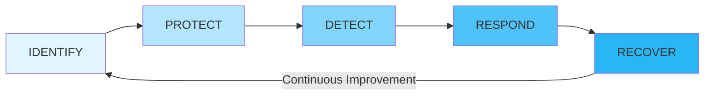

# Security Foundations and Frameworks

# Cybersecurity and Information Security

## Information Security (InfoSec)

**Information Security (InfoSec)** refers to the protection of data resources from unauthorized access, attack, theft, or damage. Systems used to store, transmit, or process data must demonstrate the properties of security—the **CIA Triad**. Some security model researchers identify other properties that secure systems should exhibit; the most important of these is **Non-Repudiation**.

**Non-Repudiation** means that a subject cannot deny doing something, such as modifying, creating, or sending a resource. A secure information processing system must demonstrate all properties within the goal of ensuring information security. Within the goal of ensuring Information Security, **Cybersecurity** refers specifically to provisioning secure/hardened processing hardware and software. InfoSec and CyberSec tasks can be classified as having functions following the framework developed by the **National Institute of Standards and Technology (NIST)**. Listed below:

### NIST Cybersecurity Framework (CSF)

* **IDENTIFY:** Identify/Evaluate risks, threats, and vulnerabilities. Develop security policies and capabilities. Recommend security protocols to mitigate against them.
* **PROTECT:** Procure, develop, install, operate, and decommission IT hardware and software assets with security as an embedded part of every stage of the operations lifecycle.
* **DETECT:** Perform ongoing proactive monitoring to ensure that controls are effective and capable of protecting against new types of threats.
* **RESPOND:** Identify, analyze, contain, and eradicate threats to systems and data security (Incident Response).
* **RECOVER:** Implement cybersecurity resilience to restore systems and data if other controls are unable to prevent attacks.

### NIST CSF Lifecycle Diagram

---

## InfoSec Competencies

An IT professional working in a role with security responsibilities must be competent in a wide range of disciplines, from network and application design to procurement and human resources (HR).

* Participate in risk assessments and tooling of security systems and make recommendations.
* Specify, source, install, and configure secure devices, software, and hardware.
* Set up and maintain document access control and user privilege profiles.
* Monitor audit logs and review users' privileges.
* Manage security-related incident response and reporting.
* Create and test **Business Continuity Plans (BCP)** and **Disaster Recovery Plans (DRP)** procedures.
* Participate in security training and educational programs.

---

## InfoSec Roles and Responsibilities

A **Security Policy** is a formalized statement that defines how security will be implemented within an organization. It describes the means that an organization will take to protect the **Confidentiality, Integrity, and Availability (CIA)** of sensitive data and resources. It often consists of multiple individual policies. The implementation of a security policy to support the goals of the **CIA Triad** might be different for several multinational organizations, but should share the same interest in ensuring that its employees, equipment, and data are secure against attack or damage.

As part of the process of adopting an effective organizational security posture, employees must be aware of their responsibilities. The structure of security responsibilities will depend on the size and hierarchy of the organization, but the roles listed below are typical in the industry.

Overall internal responsibility for security might be allocated to a dedicated department run by the **Director of Security**, **Chief Security Officer (CSO)**, or **Chief Information Security Officer (CISO)**. Historically, responsibility for security might have been allocated to executing business (mostly the ICT managers).

* **Managers** may have responsibility for a domain, such as building control, IoT, or accounting.
* **Technical and Specialist Staff** have responsibility for implementing, maintaining, and monitoring the policy. Security might be made a core competency of systems and network administrators.
* **Non-Technical Staff** have the responsibility of complying with policy and with any relevant legislation.
* **External responsibility** for security due to corporate liability remains with directors or owners.

### NIST NICE (National Initiative for Cybersecurity Education)

Categorizes job roles and tasks. The following InfoSec business units are often used to represent the security function within an organization's hierarchy:

1. **Security Operations Center (SOC):** A location where security professionals monitor and protect critical information assets across other business functions (e.g., finance, operations, sales, and marketing). Difficult to establish and maintain, they are usually employed by larger multi-corporations.
2. **Incident Response:** A dedicated **Cyber Incident Response Team (CIRT)**, **Computer Security Incident Response Team (CSIRT)**, or **Computer Emergency Response Team (CERT)** as a single point of contact for the notification of security incidents. The function might be handled by the SOC or might be established as an independent business unit.
3. **Development and Operations (DevOps):** A cultural shift within an organization to encourage much more collaboration between developers and system administrators. Separate development and system security operations departments or teams can lead to "silos"—where each team does not work effectively with the other. By creating a highly orchestrated environment, IT personnel can build, test, and release software faster and more reliably. **DevSecOps** extends the boundary to security specialists and personnel, reflecting the principle that security is a primary consideration at every stage of software development and deployment. This is also known as **"Shift Left,"** meaning that security considerations need to be made during requirements and planning stages, not grafted on at the end. The principles of **DevSecOps** recognize this and show that security expertise must be embedded into any development project.

---

## Security Controls and Frameworks

By identifying base security control types and how key frameworks and legislation drive compliance, as well as the selection and configuration of controls, you would be better prepared to select and implement the most appropriate controls for a given scenario. **NIST** classifies security controls. The frameworks can shape company policies, provide checklists of procedures, activities, and technological tools that should ideally be in place. Collectively referred to as **"SECURITY CONTROLS,"** which is something designed to make a system/data asset meet the properties of **Confidentiality, Integrity, Availability, and Non-Repudiation**.

Controls can be divided into three broad categories representing the way they are being implemented:

* **TECHNICAL:** The controls implemented as a system—hardware, software, or firmware (e.g., Firewalls, IDS/IPS, Antivirus, and OS access control models). Technical controls are also known as **Logical Controls**.
* **OPERATIONAL:** The control is implemented primarily by people rather than systems (e.g., Security Guards, Training Programs, Business Continuity, and Disaster Recovery).
* **MANAGERIAL:** The control gives oversight of the information system (e.g., Risk Identification, Management, Standard Operating Procedures (SOP), and Incident Response).

### Functional Control Types

Security controls can also be classified by types according to the goal or function they perform:

* **PREVENTIVE:** The control acts to eliminate or reduce the likelihood that an attack can succeed. A preventive control operates before an attack can take place (e.g., ACLs, Antimalware). Also, **Directives** and **Standard Operating Procedures (SOP)** can be thought of as administrative versions of preventive controls.
* **DETECTIVE:** The control may or may not prevent/deter access, but it will identify and record any attempted or successful intrusion. A detective control operates during the progress of an attack (e.g., System Logs and Events, IDS).
* **CORRECTIVE:** The control acts to eliminate or reduce the impact of an intrusion event, operating after an attack (e.g., Backup system restores data that was damaged during an intrusion, and Patch Management systems that act to eliminate the vulnerability exploited during the attack).

While most controls can be classified goal-oriented/functionally, a few other types include:

* **PHYSICAL:** Controls such as alarms, gateways, locks, security cameras, and guards that deter and detect access to premises and hardware.
* **DETERRENT:** The control psychologically discourages an attacker from attempting an intrusion. This could include signs and warnings of legal penalties against trespass or intrusion.
* **COMPENSATING:** The control serves as a substitute for a principal control as recommended by a security standard and affords the same level of protection but using a different methodology or technology.

---

## Cybersecurity Frameworks

A **Cybersecurity Framework** is a list of activities and objectives undertaken to mitigate risks. The use of a framework allows an organization to make an "objective statement" of its current cybersecurity capabilities, identify a target level of capability, and prioritize investments to achieve that target. This is valuable for giving a structure to internal risk management procedures and provides an externally verifiable statement of regulatory compliance. Frameworks are also important because they save an organization from building its security program in a vacuum or on a foundation that fails to account for important security concepts.

There are many different frameworks, each of which categorizes cybersecurity activities and controls in slightly different ways. These frameworks are **non-regulatory** in the sense that they do not attempt to address the specific regulations of a specific industry but represent best practice in IT security governance.

As well as its Cybersecurity and Risk Management Frameworks, **NIST** is responsible for issuing the **Federal Information Processing Standards (FIPS)** plus advisory guides called **Special Publications**. Many of the standards and technologies covered in CompTIA Security+ are discussed in these documents.

**NIST CSF** is a relatively new addition to the IT governance space and is distinct from other frameworks by focusing exclusively on IT security rather than IT service provision more generally. It is developed for a US audience and focuses somewhat on US government, but its recommendations are adopted by other countries and organizations. Preceding the **NIST-CSF** is the **NIST Risk Management Framework (RMF)**. Where the CSF focuses on practical cybersecurity for businesses, the RMF is more prescriptive and principally intended for US federal agencies.

### ISO and Cloud Frameworks

Unlike the NIST framework, the **ISO 27000 Series (27k)** must be purchased. Of those series:

* **27001:** Information Security Management.
* **27002:** Classifies security controls.
* **27017 & 27018:** Reference cloud security.
* **27701:** Focuses on personal data and privacy concerns.

Where ISO 27k is a cybersecurity framework, **ISO 31000 (31k)** is an overall framework for **Enterprise Risk Management (ERM)**, which considers risks and opportunities beyond cybersecurity, including financial, customer service, competition, and legal liability factors. ISO 31k establishes **"Best Practices"** for performing risk assessments.

### Cloud Security Alliance (CSA)

CSA produces various resources to assist **Cloud Service Providers (CSP)** in setting up and delivering secure cloud platforms. These resources can also be useful for cloud consumers in evaluating and selecting cloud providers.

* **Security Guidance:** A best practice summary analyzing the unique challenges of cloud environments and how on-premises controls can be adapted to them.
* **Enterprise Reference Architecture:** Best practice methodology and tools for CSPs to use in architecting cloud solutions. The solutions are divided across a set of domains (Risk Management, Infrastructure, Application, Presentation Services).
* **Cloud Controls Matrix (CCM):** Lists specific controls and assessment guidelines that should be implemented by CSPs for cloud consumers. The matrix acts as a starting point for cloud contracts/agreements as it provides a baseline level of security competency that the CSP should meet.

### SSAE (Statements on Standards for Attestation Engagements)

The **SSAE** are audit specifications developed by the **American Institute of Certified Public Accountants (AICPA)**. These audits are designed to assure consumers that service providers—notably cloud providers, but including any type of hosted third-party service—"meet professional standards." Within **SSAE No. 18**, the most common specification, there are several levels of reporting:

* **Service Organization Control (SOC2):** Evaluates the internal controls implemented by the service provider to ensure compliance with **Trust Services Criteria** (e.g., when storing and processing customer data; refers to Security, Confidentiality, Integrity, Availability, and Privacy properties).
* **SOC2 Type II Report:** Assesses the ongoing effectiveness of the security architecture over a period of 6-12 months.
* **SOC2 Type I Report:** Assesses the system design at a specific point in time. SOC2 reports are highly detailed, designed to be restricted, and represent intellectual property. They should only be shared with auditors, regulators, and important partners under **Non-Disclosure Agreement (NDA)** terms.
* **SOC3:** A less detailed report certifying compliance with SOC2; SOC3 reports can be freely distributed.

---

## Benchmarks and Secure Configuration Guides

Although a framework gives a high-level view of how to plan IT services, it does not provide detailed implementation guidance. At a system level, the deployment of servers and applications is covered by **Benchmarks** and **Secure Configuration Guides**.

* **Center for Internet Security (CIS):** A not-for-profit organization that publishes the well-known **"CIS Critical Security Controls."** The **CIS-RAM (Risk Assessment Method)** can be used to perform an overall evaluation of security posture. It also provides benchmarks for different aspects of cybersecurity. The **"CIS-CAT" (Configuration Access Tool)** can be used with automated vulnerability scanners to test compliance against those benchmarks.
* **OS / Network Appliance Platform / Vendor-Specific Guides:** Best practice configuration lists the settings and controls that should be applied for a computing platform to work in a defined role (e.g., Client Workstation, Authentication Server, Network Switch, Router, Firewall, Web/Application Server, and so on). Most vendors will provide guidance templates and tools for configuring and validating the deployment of network appliances, OS, web servers, and application/database servers. The security configuration for each of these devices will vary not only by vendor but by device and version as well.
* **Department of Defense (DoD) Cyber Exchange:** Provides **Security Technical Implementation Guides (STIGs)**, which are hardening guidelines for a variety of software and hardware solutions.
* **NIST National Checklist Program (NCP):** Provides **"Checklists"** and **"Benchmarks"** for a variety of operating systems and applications.
* **Payment Card Industry Data Security Standard (PCI DSS)** defines the safe handling and storage of financial information of data subjects.

---

## Application Servers

Most application architectures use a **Client-Server model**. This means that part of the application is a client software program installed and running on separate hardware from the server application code. The client interacts with the server over a network.

Attacks can therefore be directed at the local client code, the server application, or the network channel between them. As well as coding issues, the application needs to take account of platform issues. The client application might be running on a computing host alongside other potentially malicious software. Code that runs on the client should not be trusted. The server-side code should implement routines to verify that input conforms to what is expected.

### Web Server Applications

A web app leverages existing technology to simplify development. It uses a generic client (a web browser) and standard network protocols and servers. The specific features of the app are developed using code running on the client and server sides. Web apps are also likely to use a **Multi-tier Architecture**, where the server part is split between application logic and data storage/retrieval. Modern web apps use more distributed architecture like **Microservices** and **Serverless Instances**. The **Open Web Application Security Project (OWASP)** and **Service Oriented Architecture (SOA)** are key references.

---

## Regulations, Standards, and Legislations

The key frameworks, benchmarks, and configuration guides may be used to demonstrate compliance with a country's legal/regulatory requirements or with industry-specific regulations. **Due Diligence** is a legal term meaning that responsible persons have not been negligent in discharging their duties. **Negligence** can lead to criminal or civil liabilities. Many countries have enacted legislation to criminalize negligence.

* **Sarbanes-Oxley Act (SOX):** Mandates the implementation of risk assessments, internal controls, and audit procedures (due diligence).
* **Computer Security Act (1987):** Requires federal agencies to develop security controls and policies for computer systems that process confidential information.
* **Federal Information Security Management Act (FISMA 2002):** Introduced to govern the security of data processed by federal government agencies.
* **Health Insurance Portability and Accountability Act (HIPAA):** For medical services.
* **Gramm-Leach-Bliley Act (GLBA):** For financial services.

### Personal Data and GDPR

Regulations take into account personal data privacy. **Privacy** is a distinct concept from security. Privacy requires that the collection and processing of personal info be both secure and fair. The right to privacy and fairness as enacted by the EU's **General Data Protection Regulation (GDPR)** means that personal data cannot be collected, processed, or retained without the individual's **Informed Consent**. Informed consent means that the data must be collected and processed only for the stated purpose; the purpose must be clearly described to the user in plain language (not legalese). GDPR gives data subjects rights to withdraw consent and to inspect, amend, or erase stored data.

### National, Territory, or State Laws

Compliance issues are complicated by the fact that laws are derived from different sources. For example, GDPR does not apply to American data subjects, but it does apply to American companies that collect/process personal data of European data subjects. In the US, there are federal laws, state laws, and laws applying to US territories. Federal laws tend to focus on regulations like FISMA for federal departments or as **"Vertical Laws"** affecting a particular industry. Some states have started to introduce **"Horizontal Laws"** for personal data regulations similar to the approach taken by the EU's GDPR. One high-profile example of state legislation is the **California Consumer Privacy Act (CCPA)**.

---

## Threat Actors and Intelligence

Your responsibility lies principally in defending assets. To do so, you must be able to explain the **Tactics, Techniques, and Procedures (TTPs)** and the different types and capabilities of threat actors. Clarifying and evaluating the capabilities of threat actor types enables you to assess and mitigate risks. Understanding the methods by which threat actors infiltrate networks and systems is essential for you to assess the attack surface of your networks and deploy controls to block attack vectors.

As part of **Security Assessment and Monitoring**, teams must identify ways their systems could be attacked.

* **VULNERABILITY:** A weakness that could be triggered accidentally or exploited intentionally to cause a security breach. (e.g., Improperly configured hardware, delays in patching, untested patches, poorly designed architecture, inadequate physical security, insecure password usage, design flaws in OS code).
* **THREAT:** The potential for someone or something to exploit a vulnerability and breach security. A threat may be intentional or unintentional. The person/thing that poses the threat is a **Threat Actor** or **Agent**.
* **ATTACK VECTOR:** The path or tool used by a malicious threat actor.
* **RISK:** The likelihood and impact (consequence) of a threat actor exploiting a vulnerability. To assess risk, you identify a vulnerability and then evaluate the likelihood of it being exploited by a threat actor/agent and the impact that a successful exploit would have.

### Attributes of Threat Actors

Historically, cybersecurity techniques were highly dependent on the identification of "static" known threats to specific software vulnerabilities. It was relatively straightforward to identify and scan for these types of threats with automated software. Unfortunately, adversaries were able to develop means of circumventing this type of signature-based scanning. The sophisticated nature of cybersecurity threats means that it is important to be able to describe and analyze behaviors. This analysis involves identifying the attributes of threat actors in terms of location, intent, and capability.

* **EXTERNAL / INTERNAL:** A threat actor that has no account or authorized access to the target system and has to infiltrate the security system using malware or Social Engineering is an **External Threat**. Conversely, an **Internal Threat Actor** is one that has been granted permissions on the system. Note: An external actor may perpetrate an attack remotely or on-premises; it is the threat actor that is defined as external and not the attack method. This explains the **Location** attribute.
* **INTENT AND MOTIVATION:** This describes what an attacker hopes to achieve from the attack, as well as the attacker's reason for perpetrating the attack. A malicious intentional threat actor could be motivated by greed, animosity, or some sort of grievance with the intent to steal, vandalize, or disrupt. Malicious intents and motivations can be contrasted with accidental/unintentional threat actors/agents, which represent accidents, lack of oversight, and lack of awareness. Threats can also be characterized as **Structured vs. Unstructured** and **Targeted vs. Opportunistic**, depending on the degree to which the organization is targeted specifically.

---

## CAPABILITY / Level of Sophistication and Resources/Funds

**Capability** refers to a threat actor's ability to craft novel exploits, attacks, and tools.

* The least capable threat actor relies on **Commodity Attack Tools** that are widely available on the Dark Web.
* More capable actors can fashion **Zero-day Exploits** in operating systems, application software, and embedded systems.
* At the highest level, an actor might make use of non-cyber tools like military or political assets.

Capability is only funded through a substantial budget; the most capable actors get resources and funding from nation-states or criminal syndicates. To fully assess intent and capability, it is helpful to identify different categories of threat actors:

1. **HACKERS:** An individual with skills to gain access to computer systems through unauthorized/unapproved means. Breaking into a system was a sign of technical skill and creativity that gradually became associated with illegal or malicious system intrusions. The terms **Black Hat (Unauthorized)** and **White Hat (Authorized)** hacking are used to describe their motivations. Between "black" and "white" lies some shades of **Gray Hat (Semi-Authorized)**; they might try to find vulnerabilities in a network without seeking consent but might not try to exploit them.
2. **SCRIPT KIDDIES:** An individual who uses hacker tools without necessarily understanding how they work or having the ability to craft new attacks. They might have no real target or goal other than gaining attention or proving technical abilities.
3. **HACKTIVISTS (Hacker Teams):** Threat actors are now likely to be part of some sort of team/group. The collaborative team effort means these types of threat actors are able to develop sophisticated tools and strategies (e.g., DoS). Hacktivists might attempt to obtain and release confidential information to the public domain or perform DoS.
4. **STATE ACTORS:** Nation-developed cyber tactics and weapons to achieve both military and commercial economic goals, primarily with the aim of espionage and strategic advantage. The term **APT (Advanced Persistent Threat)** was coined to understand the behavior and lifecycle underpinning modern types of cyber adversaries. Rather than thinking in terms of systems being infected with viruses, an APT refers to the ongoing ability of an adversary to compromise network security—to obtain and maintain access—using a variety of techniques and tools. State actors work at arm's length from their national government, military, or security service that sponsors and protects them, maintaining **Plausible Deniability**.
5. **CRIMINAL SYNDICATES & COMPETITORS:** A criminal syndicate can operate across the internet from different jurisdictions than its victim, increasing the complexity of prosecution. Syndicates are motivated by criminal profit through financial fraud (against individuals and companies) and extortion. Most competitor-driven espionage is thought to be pursued by state actors, but it is conceivable that a rogue business might act against its competitors with the aim of intellectual property theft, business disruption, or damaging their reputation.
6. **INTERNAL THREAT ACTORS:** The **Computer Emergency Response Team (CERT)** at Carnegie Mellon University defines a **Malicious Insider** as: *"A current or former employee, contractor, or business partner who has/had authorized access to an organization's network, system, or data and intentionally exceeded or misused that access in a manner that negatively affects the CIA or privacy of the organization's information systems."* Distinguishing these insiders involves distinguishing those with permanent privileges (employees) from those with temporary privileges (contractors, partners). There is also a blurred case of former insiders now working elsewhere who harbor grievances after their dismissal and are classified as **"Internal Threats"** or **"External Threats with Insider Knowledge"** (due to possible residual permissions if effective offboarding controls are not in place). CERT identifies the main motivators for malicious insider threats as **Sabotage, Financial Gain, and Business Advantage**.

Like external threats, internal threats can be **Targeted vs. Opportunistic** and **Structured vs. Unstructured**. The key point here is to identify likely motivations and assess the possibility that an insider is working in collaboration with an external entity/group. Insider threats can also be categorized as **Unintentional or Inadvertent**. This is a vector for an external actor or a separate malicious internal actor to exploit, rather than a threat actor in its own right. Unintentional threats stem from lack of orientation, awareness, or conscientiousness. Another example is the concept of **Shadow IT**, where users procure and introduce unapproved hardware/software to the workplace without sanction of the IT department and without going through procurement to security analysis processes, creating a new unmonitored attack surface for malicious adversaries to exploit.

---

## Attack Surface and Vectors

The **Attack Surface** is all points at which a malicious threat agent could try to exploit a vulnerability. To evaluate these, you need to consider the type of threat actor. The attack surface for an external actor is far smaller than that of an insider threat. Minimizing the attack surface means restricting access so that only a few known endpoints, protocols, ports, and services are permitted; each of these must be assessed for vulnerabilities. Attack surface can be considered for the network as a whole. From the perspective of the threat actor, different parts of the attack surface represent potential **Attack Vectors**.

An **Attack Vector** is the path that a threat actor uses to gain access to a secure system. In the majority of cases, gaining access means being able to run malicious code on the target.

* **Paths include:** Direct Access (physical/local attack), Removable Media, Email, Remote & Wireless Access, Supply Chain, Web & Social Media, and Cloud Accessibility (APIs used to deliver services in the cloud).

Sophisticated threat actors will make use of multiple vectors, likely to plan multi-stage campaigns rather than a single "smash and grab" type of cyber raid.

---

## Threat Research Sources

Ensure you are capable of identifying and evaluating sources of threat intelligence and research. **Threat Research** is a counterintelligence gathering effort in which security companies and researchers attempt to discover the tactics, techniques, and procedures of modern cyber adversaries.

Security solution providers derive a lot of data from their own customer networks so they can assist with cybersecurity operations, analyze and publicize TTPs and their indicators. They also operate **Honeypots/Honeynets** to try to observe how hackers interact with vulnerable systems.

Another primary source of threat intelligence is the **Deep Web** and **Dark Web**.

* **Deep Web:** Any part of the world wide web that is not indexed by a search engine (e.g., pages requiring registration, pages blocking search indexing, untracked pages, pages using non-standard DNS, or content encoded in a non-standard manner). Within the deep web are areas that are deliberately concealed from "regular" browser access.
* **Dark Net:** A network established as an overlay to internet infrastructure by software like **The Onion Router (Tor)**, **Freenet**, or **I2P** that acts to anonymize usage. It prevents a third party from knowing about the existence of the network or analyzing activity by using multiple layers of encryption and relays between nodes.
* **Dark Web:** Sites, content, and services accessible only over a Dark Net. There are dark web search engines, yet many sites are hidden from them. Access to a dark web site requires the URL. Investigating these dark web sites and message boards is a valuable source of counterintelligence.

As adversaries react to this, they set up new networks or ways of identifying law enforcement infiltration. Consequently, Dark Nets and the Dark Web represent a continually shifting landscape. Sources include: `virustotal.com`, `spamhaus.org`, `misp-project.org`, `nationalisacs.org`, `alienvault.com`, `IBM X-Force Exchange`, `fireeye.com`, `recordedfuture.com`, `us-cert.gov/cas`.

---

## Threat Intelligence Providers

The output from the primary research undertaken by security solution providers can take three forms:

1. **Behavioural Threat Research:** Narrative commentary describing examples of similar attacks and TTPs gathered through primary research sources.
2. **Reputational Threat Intelligence:** Lists of IP addresses, domains, and signatures of known file-based malware.
3. **Threat Data:** Computer data that can correlate events observed on a customer's own networks and SIEM logs with known TTPs and threat actor indicators.

Threat data can be packaged as feeds that integrate into a **Security Information and Event Management (SIEM)** platform; these feeds are usually described as **Cyber Threat Intelligence (CTI)** data. The data on its own is not a complete security solution; however, to produce actionable intelligence, the threat data must be correlated with observed data from customer networks. Analysis is often an AI-powered feature of SIEM.

Threat intelligence platforms and feeds are supplied as one of three different commercial models:

* **CLOSED / PROPRIETARY:** Threat research and CTI data is made available as a paid subscription.
* **VENDOR WEBSITES:** All types of security hardware and software vendors make huge amounts of threat research available via their websites as a general benefit to their customers (at no cost at times).
* **Public/Private Information Sharing Centers:** In critical industries, **Information Sharing and Analysis Centers (ISAC)** have been set up to share threat intelligence and promote best practice. These are sector-specific resources.
* **OPEN SOURCE INTELLIGENCE (OSINT):** Open-source threat research providers operate services on an open-source basis, earning income from consultancy rather than directly from the platform. OSINT can mean any intelligence derived from publicly available information. OSINT is also a common reconnaissance technique where an attacker harvests domains, IP ranges, employees, and other data to assist in identifying attack vectors.

---

## Threat Data Feeds

Using a **Cyber Threat Intelligence (CTI)** platform means subscribing to a threat data feed. The information in the threat data can be combined (correlated) with event data from your own network and system logs. An analysis platform (SIEM/AI-powered) performs correlation to detect if Indicators of Compromise (IoC) are present.

* **STIX (Structured Threat Information eXpression):** Provides the syntax for describing CTI. The STIX framework describes standard terminology for IoCs and ways of indicating relationships between them.
* **TAXII (Trusted Automated eXchange of Indicator Information):** A protocol that provides a means for transmitting CTI data between servers and clients. A CTI service provider maintains a repository of CTI data; subscribers obtain updates to the feed into analysis tools over TAXII. This data can be requested by the client (**Collection**) or pushed to subscribers (**Channel**).
* **AUTOMATED INDICATOR SHARING (AIS):** A service offered by the **Department of Homeland Security (DHS)** for companies and ISACs to participate in threat intelligence sharing. AIS is based on STIX and TAXII standards.
* **THREAT MAPS:** An animated graphic showing the source, target, and type of attacks detected by a CTI platform.
* **FILE / CODE REPOSITORIES:** **VirusTotal** is an example that holds signatures of known malware code. Samples derive from live customer systems and public repositories.
* **VULNERABILITY DATABASES & FEEDS:** Identifying vulnerabilities is another source of threat intelligence. In the US, lists of vulnerabilities are stored in databases such as **CVE (Common Vulnerabilities and Exposures)**. Info about vulnerabilities is codified as signatures and scanning scripts supplied as feeds to automated vulnerability scanning software.

---

## AI, Machine Learning, and Predictive Analysis

A threat data feed does not produce threat intelligence automatically. Through a combination of security intelligence, CTI data can be processed, correlated, and analyzed to provide actionable insights. Most threat intelligence platforms use some sort of **Artificial Intelligence (AI)** to perform correlation analysis.

* **Early AI (Expert Systems):** Used "if-then" rules to draw inference from a limited data set called a **Knowledge Base**.
* **Machine Learning (ML):** Uses algorithms to parse input data and develop strategies for using that data. Machine learning uses the algorithm to parse data and develop strategies by making gradual improvements in decision-making processes. The structure facilitating this learning process is referred to as an **Artificial Neural Network (ANN)**. Nodes in a neural network take input and then derive outputs using complex feedback loops. An ML system has objectives and error states; it adjusts its neural network to reduce errors and optimize objectives.

In terms of threat intelligence, this AI-backed analysis might perform accurate correlation.

* **PREDICTIVE ANALYSIS:** Identifying the signs of an attack or the presence of new attack tools on a network quickly is valuable. One goal of using AI-backed threat intelligence is to perform **Predictive Analysis** or **Threat Forecasting**. This means a system can anticipate a particular attack type or possibly the identity of the threat actor before the attack is fully realized. The analysis engine associates "chatter" with IP addresses that it can correlate with a known adversary group. This gives the target advance warning that an attack is in planning stages and more time to prepare an effective defense. (Note: Concrete threat forecasting is not a proven capability yet).

---

## Guidelines for Explaining Threat Actors & Intelligence

* Create a profile of threat actor types that pose the most likely threats to your business.
* Identify sources of threat research, especially those directly relevant to your industry sector.
* Schedule time to keep up to date with threat trends and security best practices.
* Evaluate the use of a threat intelligence platform (consider proprietary vs. open source).

---

## Security Assessment

**Security Assessment** refers to processes and tools that evaluate the **Attack Surface**. The output of an assessment is recommendations for deploying, informing, or re-configuring security controls to mitigate the risks that vulnerabilities are exploitable by threat actors.

### Network Reconnaissance Tools

**Reconnaissance** is a type of assessment activity that maps the potential attack surface by identifying nodes and connections that make up the network (using ICMP, line, or curve topology probing). The process of mapping out the attack surface is referred to as **Network Discovery**.

* **TOPOLOGY DISCOVERY ("FOOTPRINTING"):** Scanning for hosts, IP ranges, and routes between networks to map out the structure of the target network. Used to build an asset database, identify non-authorized hosts (**Rogue System Detection**), or network configuration errors.
* **IPCONFIG / IFCONFIG:** Show the configuration assigned to a network interface in Windows/Linux.
* **PING:** Probes a host on a particular IP address or hostname using ICMP packets (Reply/Response).
* **ARP:** Displays the local machine's **Address Resolution Protocol (ARP)** cache. The ARP cache shows the MAC address of the interface associated with each IP address the local host has communicated with.
* **ROUTE:** View and configure the local host's routing table. Most endpoints have a simple routing table with a default route (`0.0.0.0`) to forward all traffic via a gateway router. Additional entries could be suspicious.
* **TRACERT / TRACEROUTE:** Performs path discovery using ICMP probes (for Windows) and by default UDP probes (for Linux) with decreasing **Time to Live (TTL)** to report **Round Trip Time (RTT)** for hops between local and remote hosts.
* **PATHPING / MTR:** Provides statistics for latency and packet loss along a route over a longer period. High latency at the default gateway might indicate a **Man-in-the-Middle (MITM / On-path)** attack. High latency on other hops could indicate DoS or network congestion.
* **NMAP (Network Mapper):** An IP scanner that performs host discovery and identifies how hosts are connected. Nmap uses diverse methods (some stealthy to defeat Firewalls/IDS). On a local segment, it uses ARP and Neighbor Discovery sweeps. If a host is detected, Nmap performs a **Port Scan** to determine running services.

### Service Discovery and Fingerprinting

After discovering active IP hosts, the next step in reconnaissance is to work out which operating systems are in use, which network services each host is running, and which application software is underpinning those services.

* **SERVICE DISCOVERY:** Used defensively to probe for unauthorized ports.
* **FINGERPRINTING:** Detailed analysis of services. Each OS/App responds to probes uniquely, allowing scanning software to guess software names and versions without privileged access.
* **BANNER GRABBING:** Where the "banner" is the header of the response returned by application software. Using `-sV` or `-A` switches in Nmap probes more intensively for OS Type/Version, Device Type, and Protocol/Version. Nmap uses the **Common Platform Enumeration (CPE)** syntax for signatures.
* **NETSTAT:** Shows the state of TCP/UDP ports on the local machine. Used to check for service misconfigurations or suspect remote connections.
* **NSLOOKUP / DIG (Domain Information Groper):** Used to query name records for a given domain. A misconfigured DNS server may allow a **Zone Transfer**, giving an attacker complete records of every host in the domain.
* **THE HARVESTER:** A tool for gathering OSINT for a particular domain or company name. It scans multiple public data sources for emails, subdomains, IPs, and URLs.
* **DNSENUM:** Packages multiple tests into a single query to work out IP ranges in use and name records.
* **SCANLESS:** Disguises the source of scan probes to conceal them from detection systems.
* **CURL:** Command-line tool for performing data transfers over several protocols. Used to submit HTTP GET, POST, or PUT requests as part of web app vulnerability testing.
* **NESSUS:** An automated scanning tool with a database of known software vulnerabilities used to cross-check services and versions.

---

## Packet Capture and Protocol Analysis

* **PACKET ANALYSIS:** Refers to deep, frame-by-frame scrutiny of captured packet frames.
* **PROTOCOL ANALYSIS:** Using statistical tools to analyze a sequence of packets or traffic.
* **SNIFFER:** A tool to capture and decode frames.
* **Capture Methods:**
* **Switched Port Analyzer (SPAN) / Mirror Port:** A network switch copies frames from designated source ports to a destination port where the sniffer is connected.
* **Test Access Point (TAP):** A device inserted into cabling to copy frames. Sniffers are typically placed behind a firewall or near a critical server to identify malicious traffic that bypassed the firewall.

* **TCPDUMP:** A command-line packet capture utility for Linux. Syntax: `tcpdump -i eth0`. Uses filter expressions (e.g., `host`, `net`, `port`, `portrange`) combined with Boolean operators (`and`, `or`, `not`). Frames can be saved to `.pcap`.
* **WIRESHARK:** A graphical protocol/packet analyzer. Decodes captured frames into a readable format. Includes a **Packet List Pane** (summary), **Packet Details Pane** (expandable OSI layers), and **Packet Byte Pane** (raw Hex/ASCII). Features like **"Follow TCP Stream"** reconstruct the contents of a session.

### Packet Injection and Replay

Some techniques depend on sending forged or spoofed traffic.

* **PACKET INJECTION:** Inserting frames into network streams. Tools include **DSNIFF**, **ETTERCAP**, **SCAPY**, and **HPING**.
* **HPING:** An open-source spoofing tool to craft packets to exploit vulnerable firewalls and IDS. Can perform host/port detection, traceroute, and flood-based DoS from randomized source IPs.
* **TCPREPLAY:** A command-line utility that takes previously captured traffic (`.pcap`) and replays it through an interface. Fields (MAC/IP) can be changed. Useful for testing IDS rules with suspect traffic samples.
* **NETCAT (nc):** Effective tool for testing connectivity, port scanning, fingerprinting, and establishing connections.

---

## Exploitation Frameworks

* **RAT (Remote Access Trojan):** Malware that gives an adversary remote access. Pentesters try to establish this connection to test data exfiltration.
* **EXPLOITATION FRAMEWORK:** Uses vulnerabilities identified by automated scanners and launches scripts or software to attempt matched exploits. Comprises a database of exploit code targeting particular **CVEs**. Exploit code is coupled with **Modular Payloads** (e.g., opening a command shell, creating a user). Frameworks can **Obfuscate** code to bypass antivirus/IDS.
* **METASPLOIT (Rapid7):** The best known exploitation framework.
* **SN1PER:** Framework for pentest reporting and guidance; integrates with Metasploit and Nikto.
* **FIRE ELF:** Injects fileless exploit payloads into a Linux host.
* **ROUTERSPLOIT:** Vulnerability scanning and exploit modules targeting embedded systems.
* **BEEF (Browser Exploitation Framework):** Recovering web session info and exploiting client-side modern techniques.
* **ZAP (Zed Attack Proxy):** Scanning tools and scripts for web and mobile app security testing.
* **PACU:** Scanning and exploitation tools for AWS platforms.

---

## General Vulnerability Types

* **SOFTWARE VULNERABILITY:** An attack targeting a vulnerability in software code (design flaw).
* **OS VULNERABILITY:** Vulnerabilities in kernel files or shared libraries, often allowing **Privilege Escalation** (gaining System/Root access).
* **FIRMWARE:** Vulnerabilities in BIOS/UEFI or device firmware (Network cards, Disk controllers). Hard to identify because they run at the highest level.
* **IMPROPER PATCH MANAGEMENT:** Where security patches are not applied, leaving systems vulnerable.
* **ZERO-DAY:** A vulnerability exploited before the developer knows about it or can release a patch. These have significant financial value; agencies may stockpile them for investigation.
* **LEGACY PLATFORMS:** No longer supported with security patches by the vendor. Unpatchable by definition; must be protected by other controls like isolation.

---

## Weak Configurations

Weak configurations can have a similar impact to ineffective patching.

* **DEFAULT SETTINGS:** Relying on manufacturer defaults (e.g., unsecured interfaces) that allow an attacker to move unhindered.
* **UNSECURED ROOT ACCOUNTS:** Default admin/supervisor accounts with no restrictions. Adversaries gain control by guessing weak passwords or using software bugs. Authorization policies should enforce **Least Privilege**. The default root is usually disabled for login.
* **OPEN PERMISSIONS:** Provisioning data/apps without differentiating access rights. Can lead to unauthenticated guests viewing confidential files or having write access. Prevalent in Cloud Storage.
* **WEAK NETWORK CONFIGURATION:**
* **Open Ports & Services:** Best practice dictates restricting to necessary services only. Disable unnecessary default services. Block ports at border firewalls or segment the network.
* **Unsecure Protocols:** Lack encryption for data protection; susceptible to MITM.
* **Weak Encryption:** Keys generated from simple passwords (Brute Force/Dictionary enumeration), weak algorithms/ciphers, or insecure key distribution.

### Error Handling

Weakly configured applications may display unformatted error messages that reveal coding mistakes. Secure coding ensures applications **"Fail Gracefully"** without revealing info that assists in an exploit.

---

## Impacts From Vulnerabilities

### Data Breach and Data Exfiltration

* **DATA BREACH (Data Leak):** Event where confidential data is read, transferred, modified, or deleted without authorization. Can be intentional or unintentional.
* **DATA EXFILTRATION:** The methods/tools used by an attacker to transfer data without authorization. Always intentional and malicious; a consequence of a data breach. Compromises intellectual property or personal info.
* **IDENTITY THEFT:** A **Privacy Breach** where personal data is not processed in compliance with laws. Allows threat actors to sell data or perform identity theft.
* **DATA LOSS & AVAILABILITY LOSS:** Information becomes unavailable temporarily or permanently. Availability is a key part of CIA. Examples include ransomware encryption.
* **FINANCIAL & REPUTATION IMPACTS:** Damages, fines, loss of business, and widespread adverse publicity.

---

## Third-Party Risks

* **VENDOR MANAGEMENT:** Selecting suppliers and evaluating risks. Risks cannot be wholly transferred to a vendor. Requires detailed audit processes.
* **SYSTEM INTEGRATION:** Combining components from multiple vendors. Lack of vendor support can make retooling complex.
* **OUTSOURCED CODE DEVELOPMENT:** Oversight is pertinent. A solution is to use one vendor for development and a different vendor for vulnerability/penetration testing.
* **DATA STORAGE:** Granting vendor access or using them for hosting/backups. Precautions: identical protections (Auth/Access Mgmt, Encryption), monitoring/auditing third-party access, and evaluating compliance impacts for personal data.
* **CLOUD-BASED VS. ON-PREMISES RISKS:** Cloud providers operate a **Shared Responsibility Model** (Cloud Matrix): CSP is responsible for the security **of** the cloud; the Consumer is responsible for security **in** the cloud.

---

## Automated Vulnerability Scanning

A key part of initial assessment and ongoing compliance monitoring.

* **NIST Technical Guide to InfoSec Testing and Assessment:** Identifies three activities: **Testing** the object, **Examining** the object (identifying logical weaknesses), and **Interviewing** personnel.
* **VULNERABILITY ASSESSMENT:** Evaluation of a system's ability to meet compliance based on its configuration state (comparing actual config to the **Baseline**).
* **SCANNING TOOLS:** Scanners (e.g., **Nessus**, **OpenVAS**) use signatures and scripts to correlate vulnerabilities. Typical results identify missing patches, configuration deviations, and other vulnerabilities.
* **APPLICATION SCANNERS:** Dedicated scripts to test for known attacks. **Web Application Scanners** look for the **OWASP Top 10**.

### Vulnerability Feeds and CVEs

* **VULNERABILITY FEED:** Up-to-date information (Plugins/Network Vulnerability Tests - NVT). Many use **SCAP (Security Content Automation Protocol)** to obtain updates.
* **CVE (Common Vulnerabilities and Exposures):** Dictionary of vulnerabilities in published OS/Software. Format: `CVE-YYYY-####` (Year and order discovered).
* **NVD (National Vulnerability Database):** NIST supplement to CVE with additional analysis and the **Common Vulnerability Scoring System (CVSS)**.
* **CVSS:** Score from 0-10 based on characteristics (e.g., remote access vs. local, user intervention required). 0.1+ is Low, 4.0+ is Medium, 7.0+ is High, 9.0+ is Critical.

### Intrusive vs. Non-Intrusive Scanning

* **NON-INTRUSIVE (PASSIVE):** Analyzing indirect evidence (e.g., traffic types). Scanners like **Zeek (Bro)** identify CVE matches. Least impact but less comprehensive. Used by threat actors for stealth.
* **INTRUSIVE (ACTIVE):** Probing device configuration via network connection. Consumes bandwidth and risks target outages. **Agent-based scanning** is also active. Exploitation frameworks are the most intrusive.

### Credentialed vs. Non-Credentialed

* **NON-CREDENTIALED:** Host is tested without logging on to the OS/App. Obtains the view of an unprivileged user. Used for external perimeter assessment or web app scanning.
* **CREDENTIALED:** Given a user account with logon rights. Allows in-depth analysis of applications and security settings. Shows what an insider or compromised account could achieve. **Requirement:** Store credentials securely on the scan server.

---

## False Positives/Negatives and Log Review

* **FALSE POSITIVE:** Something identified as a vulnerability when it is not. Intrusive/Active scanning reduces these. Excessive false positives lead to disregarding results.
* **FALSE NEGATIVE:** Potential vulnerabilities that are not identified. Mitigated by running periodic scans and using scanners from multiple vendors.
* **LOG REVIEW:** Reviewing security and network logs can enhance the validation process.

---

## Configuration Review

Assesses security controls and permissions against established benchmarks.

* **SCAP:** Allows compatible scanners to determine if a computer meets the baseline using:
* **OVAL (Open Vulnerability and Assessment Language):** XML schema for describing system state.
* **XCCDF (Extensible Configuration Checklist Description Format):** XML schema for developing/auditing best practice checklists.

* **COMPLIANCE SCAN:** Testing against best practice frameworks for regulatory compliance.

---

## Threat Hunting

An assessment technique to proactively discover evidence of TTPs already present in the network. Contrasts with reactive incident management and penetration testing (which attempts intrusion). Threat hunting is less potentially disruptive.

* **ADVISORIES & BULLETINS:** Triggers for establishing a hunt.
* **INTELLIGENCE FUSION & THREAT DATA:** Using SIEM and analytics to correlate CTI feeds with on-premises data.
* **MANEUVER:** Military doctrine relating to obtaining positional advantage. In threat hunting, this involves using passive discovery so threat actors are unaware that an intrusion has been discovered before containment is ready.

---

## Penetration Testing Concepts

Uses authorized hacking to discover exploitable weaknesses.

* **ETHICAL HACKING:** Verifies threats exist, bypasses/tests security controls, and explores vulnerabilities.

### Rules of Engagement (RoE)

Specifies permitted activity, objectives, and scope as a contractual agreement. Authorization from third parties (e.g., Cloud Providers) must be sought.

### Attack Profiles

* **UNKNOWN ENVIRONMENT (BLACK BOX):** Consultant is given no privileged information. Simulates an external threat. Requires a reconnaissance phase.
* **KNOWN ENVIRONMENT (WHITE BOX):** Consultant has complete access to info. Conducted as follow-up to evaluate discovered flaws. Simulates a privileged insider.
* **PARTIALLY KNOWN (GRAY BOX):** Consultant given some info (resembling non-IT staff) to model an unprivileged insider. Requires partial reconnaissance.
* **BLIND / SINGLE-BLIND:** Attacker has no knowledge, but staff are informed.
* **DOUBLE-BLIND:** Staff are not aware the test is taking place.
* **BUG BOUNTY:** Program where rewards are given for reporting vulnerabilities (Crowdsourcing).

### Exercise Types

* **RED TEAM:** Offensive role; attempts to infiltrate.
* **BLUE TEAM:** Defensive role; operates monitoring, alerts, and controls.
* **WHITE TEAM:** Umpire/Referee; sets RoE, monitors the exercise, and provides arbitration. Can halt the exercise if it becomes too risky.
* **PURPLE TEAM:** Red and Blue teams meet for regular debriefs while the exercise is ongoing to collaborate on detection mechanisms. Facilitated by Purple Team moderators.

### Reconnaissance Activities

Analysis of adversary TTPs established "Kill Chain" models.

* **PASSIVE RECON:** Querying publicly available info (Google Dorking, Advanced Searching, Specialized Search Engines, Image Search).
* **TOOLS:** Maltego, Recon-ng.

## Active Reconnaissance

Active reconnaissance has more risk of detection, as it involves gaining physical access to property or requires interacting wt logical response in order to observe bits, or using scanning tools on the target's web services and other network topology points.

* **Open Source Intelligence (OSINT):** Using Web search tools, social media, and sites that can search for vulnerabilities in inter-connected devices and services to obtain information about the target. OSINT Aggregation tools such as **TheHarvester** collect and organize this data from multiple sources. OSINT requires almost no privileged access as it relies on finding info that is publicly available whether intentionally or not; this is a passive technique.
* **Social Engineering:** This refers to obtaining info, physical access to premises, or even access to a user account through the "art of persuasion." While the amount of interaction may vary, this can be classed as an active technique.

### HOST DISCOVERY

* **Footprinting:** Using software tools like **Nmap** to obtain info about a host or network topology. Scans can be launched against web hosts or against wired or wireless network segments if the attacker can gain physical access to them. While passive footprinting is possible (i.e., by limiting it to packet sniffing), most scan techniques, foot/finger-printing require active network connections wt the target that can be picked up by intrusion detection software.
* **War Driving:** Refers to mapping the location and type (freq channels, Auth security method) of wireless networks operated by the target. Some of these networks may be accessible from outside the bldg. Simply sniffing the presence of wireless networks is a passive activity, though there is the risk of being observed by security guards or camera. An attacker might be able to position rogue access points or perform other wireless attacks using intel gathered.
* **Drones / Unmanned Aerial Vehicle (UAV):** Allow the tester to reconnoiter campus premises and even perform war driving from the air (**War Flying**). **WiFi Pineapple** can easily be incorporated in the recon phase.

---

## Pentesting Attack Life Cycle

In the "Kill Chain Attack Life Cycle," Reconnaissance is followed by an initial exploitation where a software tool is used to gain some sort of access to the target's network (**Foothold**). This foothold might be accomplished using a phishing email and payload or by obtaining credentials using Social Engineering. Having gained the foothold, the pentester can set about confirming and scanning his access. A number of techniques are required:

* **Persistence:** The tester's ability to reconnect to the compromised host and use it as a **Remote Access Tool (RAT)** or **Backdoor**. To do this, the tester must establish a **Command and Ctrl (C2)** network to use to control the compromised host, upload additional attack tools, and data exfiltration. The connection to the compromised host will typically require a malware executable to run after shutdown and log off and by a connection to the network port and attacker's IP address to be available.
* **Privilege Escalation:** Persistence is followed by further internal recon, where the pentester attempts to map out the internal network and discover the services running on it and accounts configured to access it. Moving within the network or accessing data assets are likely to require a higher privilege level. Further exploits however might allow malware to execute wt system/root privileges or to use network admin privileges.
* **Lateral Movement:** Gaining control over other network hosts. This is done partly to discover more opportunities to widen access (harvesting credentials, detecting software vulnerabilities and misconfiguration, and gathering other such intellectual property "loot"), partly also to identify where valuable data assets might be located, and partly to evade detection. Lateral movement usually involves executing the attack tools over remote process share or using scripting tools such as PowerShell.
* **Pivoting:** Hosts/Endpoints that hold the most valuable data are not normally accessed over external networks directly. If foothold is achieved on perimeter server, pivoting allows them to bypass a network boundary and compromise servers behind the perimeter or client network. A pivot is accomplished using remote access and tunneling protocols like RDP, VPN, and SSH.
* **Actions on Objectives:** For a threat actor, this means Data Exfiltration—from the perspective of a pentester, it is usually sufficient to show that actions on objectives could be achieved.
* **Clean Up:** For a threat actor, this means removing evidence of the attack, or at least evidence that could implicate the adversary. For a pentester, this phase means removing any backdoors or tools and ensuring that the system is not left less secure than the pre-engagement state.

---

## Guidelines for Performing Security Assessments

* Identify the procedures and tools that are required to scan the attack surface for vulnerabilities.
* Develop a configuration maintenance plan to ensure secure use of credentialed scans and updates to vulnerability feeds.
* Run scans regularly and review the results to identify false negatives and positives, using CVSS review and additional CVE information to validate results if necessary.
* Schedule configuration reviews and remediation plans, using vulnerability criticality to prioritize actions.
* Consider implementing threat hunting programs, monitoring advisories and bulletins for new threat sources.
* Consider implementing penetration testing exercises, ensuring that these are set up with clear rules of engagement for Red/Blue or Purple team exercise types and results disclosure (Black, Gray, White box).
* Run pentests using a structured kill chain cycle: Recon, Exploitation, Persistence, Priv Escalation, Lateral Move / Pivoting, Actions on Objectives, and Cleanup process.

---

## Social Engineering & Malware

It is not sufficient for security assessments to focus solely on software vulnerabilities and configuration errors. As well as these hardware and software systems, the attack surface contains a company's employees and the degree to which they can be exploited to gain unauthorized access or privileges. Threat actors use social engineering techniques to steal information, obtain access to premises, and to trick users into running malicious code.

People—employees, contractors, suppliers, and customers—represent part of the attack surface of any organization. A person with permissions on the system is a potential target of social engineering. A prerequisite of many types of attacks is to obtain information about the network and security system. Social Engineering refers to means of either eliciting information from someone or getting them to perform some action for the threat actor. Also referred to as **"Hacking the Human."**

Social engineering might be used to gather intel as reconnaissance in preparation for an intrusion or it might be used to affect an actual intrusion. Typical Social Eng scenarios include:

* An attacker creates an executable file that prompts a network user for their password, and then records whatever the user inputs, thereby getting access to their network credentials.
* An attacker contacts the help desk pretending to be a remote sales representative who needs assistance setting up remote access.
* Through a series of phone calls, the attacker obtains the name/address of the remote access server and login credentials.
* An attacker triggers a fire alarm and then slips into the building during the confusion and attaches a monitoring device to a network port.

### SOCIAL ENGINEERING PRINCIPLES

Social engineering is one of the most common and successful malicious techniques because it exploits basic human trust. It has proven to be a particularly effective way of manipulating people into performing actions that they might not otherwise perform. To be persuasive, social engineering attacks rely on one or more of the following principles/methods of exploitation:

* **Familiarity / Liking:** One of the basic tools of a social engineer is simply to be affable and likeable with a natural charisma to persuade others to do as they request, presenting the requests they make as completely reasonable and unobjectionable. This approach is relatively low-risk; even if the request is refused, it is unlikely to cause suspicion and the social engineer may be able to move on to a different target without being detected.
* **Consensus / Social Proof:** The principle of "consensus" or "social proof" refers to the fact that without an explicit instruction to behave in a certain way, many people will act just as they think others would act. A social engineering attack can use this instinct either to persuade the target or exploit polite behavior, like to slip into a building while someone holds the door for them.
* **Authority & Intimidation:** Many people find it difficult to refuse a request by someone they perceive as superior in rank or expertise. Social engineers can try to exploit this behavior to intimidate their target by pretending to be a senior executive. Another technique is using spurious technical arguments and jargon; social engineers can exploit the fact that few people are willing to admit ignorance. Compared to the familiarity/liking approach, this sort of adversarial tactic is riskier for the attacker as there is a greater chance of a target growing suspicious and reporting the attempt.
* **Scarcity & Urgency:** Creating a false sense of scarcity/urgency can disrupt people's ordinary decision-making process. The social engineer can try to pressure their target by demanding a quick response. They may try to get the target to sign up for a "limited time" or "invitation only trial" and request a username and password for the service (hoping the target offers up an already used password).

### SOCIAL ENGINEERING TECHNIQUES

* **Impersonation & Pretexting:** A basic social engineering technique of pretending to be someone else. Impersonation can use either a consensus, familiarity, or intimidating approach. Impersonation is possible where the target cannot verify the attacker's alleged identity easily, like over the phone or via email. The classic impersonation attack is known as **Pretexting**, where a social engineer phones into a department and claims they have to adjust something on the user's system remotely to get the user to reveal the password. Making a convincing impersonation and establishing trust wt a target usually depends on the attacker obtaining privileged information about the organization. Social engineering techniques are dedicated to obtaining this type of intel as a reconnaissance activity. Information that might seem innocuous—internal employee lists, job titles, photos, invoices, or purchase orders—can help an attacker penetrate an organization through impersonation.
* **Dumpster Diving:** Refers to combing through an organization's/individual's garbage to try to find useful documents (or even files stored on discarded removable media). Remember attacks are staged over a long period; initial attacks may only aim at compromising low-level info/user accounts. This low-level info can then be used to attack more sensitive or confidential data better protected by privileged management and administrative accounts.
* **Tailgating & Piggybacking:** **Tailgating** is a means of entering a secure area without authorization by following close behind the person that has been allowed to open the door or checkpoint. **Piggybacking** is a similar situation, but means that the attacker enters a secure area with an employee's permission. Piggybacking may be a means for an insider threat actor to allow access to an adversary without recording it.
* **Identity Fraud & Invoice Scams:** **ID Fraud** is a specific type of impersonation where the attacker uses specific details of someone's identity. **Invoice Scams** are another common type of ID fraud; the fraudster will usually spoof the invoice details of a genuine supplier, but change the bank account. This might rely on the target not double-checking the account, or it might be combined wt a social engineering contact call to convince the target that the account change is genuine. (ID Fraud/ID Theft: stealing someone's identity vs making up an identity).

### CREDENTIAL HARVESTING

Various social engineering techniques can be used to obtain credentials without having to rely on malware. Apart from eliciting credential information from a user directly, other techniques include:

* **Credential Databases:** Account details from previous attacks are widely available at sites like `haveibeenpwned.com`. An attacker can try to match a target in one of these databases hoping they have reused a password.
* **Shoulder Surfing:** A threat actor can learn a password/PIN by watching the user type it in. Despite the name, an attacker may not have to be in close proximity to the target; the use of binoculars or CCTV can observe the target.
* **Lunchtime Attacks:** If a user leaves a workstation unattended while logged on, an attacker can physically gain access to the system. Most OS are set to activate a password-protected screen saver after a defined period of no keyboard/mouse activity. Train staff to lock/logoff workstations.

---

## Phishing, Whaling, and Vishing

**Phishing** is a combination of social engineering and spoofing. It persuades or tricks the target into interacting wt a malicious resource disguised (spoofed) as a trusted one, traditionally using email as the vector. A phishing message might try to convince the user to perform some action, like installing disguised malware or allowing a remote access connection. Other types of phishing campaigns use a spoofed web URL to get credentials. Variants include:

* **Spear Phishing:** A phishing scam where the attacker has some information that makes an individual target more likely fooled by the attack. Each phishing message is tailored to address a specific target user (e.g., details convincing the target that the communication is genuine).
* **Whaling:** A spear phishing attack directed specifically against upper-level management in the organization. Upper management may also be more vulnerable to ordinary phishing attacks because of their reluctance to learn basic security practices.
* **Vishing:** A phishing attack conducted through a voice channel (telephone or VoIP for instance). It can be much more difficult for someone to refuse a request made via phone call versus one made via email.
* **Smishing:** This refers to using Simple Message Service (SMS) text comm as the vector.

---

## Spam, Hoaxes, and Prepending

Unsolicited email or **Spam** is used as the vector for many attacks. Threat actors harvest email addresses from various sources and might try to target every email at a certain company. Mass mail attacks can be perpetrated over any type of instant messaging or internet messaging service (**SPIM**).

* **Hoaxes:** Such as security alerts or chain emails, are often combined with phishing attacks. An email alert or web pop-up claims to have identified some security problem and offers a tool to fix it; the tool of course will be a Trojan app.
* **Malvertising:** Exploits the use of space on legit websites set aside for advertising served from a CDN without much oversight.
* **Prepending:** A phishing or hoax email can be made more convincing by prepending. In an offensive sense, prepending means adding text that appears to have been generated by the mail system—e.g., "Re:" to the subject line to make it appear as though the message is a reply, or "Mailsafe: Passed" to make it appear as though the message has been scanned and accepted by some security software. Conversely, some mail systems may perform prepending legitimately (e.g., tagging external messages with a warning).

---

## Pharming and Credential Harvesting

Direct messages to a single contact have quite a high chance of failing.

* **Pharming:** Is a passive means of redirecting users from a legitimate website to a malicious one. Pharming relies on corrupting the way the victim's computer performs internal name resolution so that they are redirected from the genuine site to the malicious one (DNS-Spoofing, DNS-Redirection for clicks).
* **Typosquatting:** Rather than a redirection, a threat actor might use typosquatting—registering a domain name that is very similar to a real one (referred to as cousins, lookalike, or doppelganger domains), hoping that users will not notice the difference. This might be used for pharming and phishing attacks. Another technique is to register a hijacked subdomain using the primary domain of a trusted cloud provider.
* **Watering-Hole Attack:** Another passive technique where the threat actor does not have to risk communicating directly wt the target; it relies on the circumstance that a group of targets may visit an unsecure third-party website.
* **Credential Harvesting:** A campaign specifically designed to steal account credentials. The threat actor is often more interested in sales of the database of captured logins than trying to exploit them. Attacks using malware or scripts injected into shopping cart code are also popular. Targeted credential harvesting might be directed against a single company's password reset or account management portal.

---

## Influence Campaigns

An Influence Campaign is a major program launched by an adversary with a high level of capability, like a nation-state actor, terrorist group, or hacktivist group. The goal is to shift public opinion on some topic. Most high-profile campaigns target election activity, but actors may use such campaigns to pursue a number of goals. With state actors, the concept of **"Soft Power"** refers to using diplomatic and cultural assets to achieve objectives. When deployed along with espionage, disinformation/fake news, and harassment, a hostile campaign can be characterized as **Hybrid Warfare**. Modern campaigns use social media to ensure wide distribution of fakes and inventions. Apart from destabilizing the host country generally, influence campaigns might affect private organizations because they become caught up within a fake story. It's important for companies to closely monitor references to them on social media and take steps to correct or remove false or misleading posts.

---

## Analyze Indicators Of Malware-Based Attacks

Malicious software is simply defined as software that does something harmful from the perspective of the system owner. Malware is classified into Trojans, Viruses, and Worms based on the **Vector** used by the malware (the method by which the malware executes on a computer and potentially spreads). Another factor is the degree to which its installation is expected:

* **Viruses & Worms:** They spread without any authorization from the user by being concealed wt the executable code of another process. They represent some of the earliest types of malware.
* **Trojan:** Malware concealed within an installer package for software that seems legitimate. This type of malware does not seek any type of consent for installation and is actively designed to operate subversively.
* **Potentially Unwanted Programs/Applications (PUPs & PUAs):** Software installed alongside a package selected by the user or bundled with a new computer system. Unlike a Trojan, the presence of PUPs is not automatically regarded as malicious. It may have been installed without active consent or consent from a purposefully misleading licensing agreement (Grayware).

**Payload Classifications:** Based on the action performed (Spyware, Rootkit, RAT, Ransomware).

### COMPUTER VIRUSES

A computer virus is designed to replicate and spread across networks, usually by "infecting" executable applications or program code. They are classified by the media they infect:

* **Non-Resident / Executable File Infector:** The virus is contained wt a host executable file and runs with the host process. The virus tries to infect other process images on persistent storage and performs payload actions before passing control back to the host program.
* **Memory Resident:** When the host file is executed, the virus creates a new process for itself in memory. The malicious process remains in memory even if the host process is terminated.
* **Boot:** The virus code is written to the disk boot sector or partition table of a fixed disk and executes as a memory resident process when the OS starts.
* **Script & Macro Viruses:** Uses programming features available in local scripting engines for the OS or browser (e.g., PowerShell, JavaScript, VBA code in MS Office, PDF with JavaScript).

**Polymorphism:** Used for viruses that can dynamically change/obfuscate their code to evade detection. **Multipartite** refers to viruses using multiple vectors of attack.

### COMPUTER WORMS

A computer worm is memory resident malware that can run without user intervention and self-replicate over network resources. A virus is executed only when the user performs an action (e.g., running an infected file). By contrast, a worm can execute by exploiting a vulnerability in a process when a user browses an infected website or connects to an infected file share. The primary effect is to rapidly consume network bandwidth as it replicates. A worm may also be able to crash an OS or server application (performing DoS) or carry a malicious payload.

---

## Fileless Malware

Fileless malware refers to a collection of behaviors and techniques that do not write code to disk.

* The malware uses memory resident techniques to run in its own process, within a host process/DLL, or within a scripting host. This does not mean there is no disk activity; it may change registry values to achieve persistence.
* Uses lightweight shellcode to achieve a backdoor mechanism. Shellcode is easy to recompile in obfuscated form to evade scanners and can download additional payloads.
* **"Live off the Land" Techniques:** Rather than compiled executables, the malware code uses legitimate system scripting tools (PowerShell, Windows Management Instrumentation - WMI) to execute payload actions. These environments provide all the tools the attacker needs.
* Terms like **Advanced Persistent Threat (APT)** and **Advanced Volatile Threat** describe this class. Also known as **Low Observable Characteristic (LOC)** attacks.

---

## Monitoring and Adware

* **Tracking Cookies:** A cookie is a plaintext file, not malware, but if permitted by browser settings, third-party cookies can be used to record pages visited, the user's IP, and metadata.
* **Adware:** A class of PUP/grayware that performs browser reconfiguring like allowing tracking cookies, changing default search engines, opening sponsor pages at startup, or adding bookmarks.
* **Spyware:** Malware that performs adware-like tracking but also monitors local app activity, takes screenshots, actuates recording devices, and performs DNS redirection.
* **Keylogger:** Spyware that actively attempts to steal confidential info by recording keystrokes. This can be malicious script or hardware devices (modified USB adapters).

---

## BACKDOOR & RAT (Remote Access Trojan)

Any type of access method to a host that circumvents the usual authentication method and gives the remote user administrative control can be referred to as a **Backdoor**. A **Remote Access Trojan (RAT)** is backdoor malware that mimics the functionality of legitimate remote control programs but is designed specifically to operate covertly. Once installed, it allows the threat actor to access the host, upload files, and install software or use "live off the land" techs to effect further compromises. (RAT can also stand for Remote Administration Tool). A host under malicious control is sometimes described as a **Zombie**.

---

A compromised host can be installed with one or more **Bots**. A **Bot** is an automated script or tool that performs some malicious activity. A group of bots that are all under the control of the same malware instance can be manipulated as a **BOTNET** by the **HERDER PROGRAM SERVER**. Botnets can be used for malicious purposes like triggering DDoS, launching spam campaigns, or **Cryptojacking** (cryptomining).

Whether a backdoor is used as a standalone intrusion mechanism or to manage a bot, the threat actor must establish a connection from the compromised host to a **Command and Control (C2 or C&C) host/network**. There are many types of implementing a C&C network as a covert channel to evade detection by security systems. Modern methods are more likely to use command services embedded in HTTPS or DNS traffic.

Backdoors can be created in other ways than injection by malware. Programmers/Devs may create backdoors in software apps for testing and development that are subsequently removed when the app is deployed. Backdoors are also created by misconfiguration of software or hardware that allows access to unauthorized users, like a router config with a default admin pass, or an RDP conn config with an unsecure password, etc.

**ROOTKITS:** If the malware can be delivered as the payload for an exploit of a severe vulnerability, it may be able to execute without requiring any authorization using **"System Privileges."** Since critical processes run with a higher level of privilege (system). Alternatively, malware may be able to run an exploit to escalate privileges after installation/deployment. Malware running with this level of privilege is referred to as **Rootkits**. The term derives from UNIX/Linux where any process running as "root" has unrestricted access to everything from the root of the file system down. In theory, there is nothing about the system that a rootkit could not change. In practice, Windows uses other mechanisms to prevent misuse of kernel processes, such as **CODE SIGNING**.

> Shellcode is easy to obfuscate; it can often evade signature-based A-V products.

---

## Malware - Indicators

Some types of malware display obvious changes. If malware is designed to operate covertly, indicators can require detailed analysis of processes, filesystem, registry changes, or network behavior.

1. **ANTIVIRUS NOTIFICATIONS:** AV / Endpoint Protection Platform (EPP) or Next-Gen AV (A-V). Regardless of the type of malware, A-V detects it using signatures or behavioral matching. A-V integrates with **User and Entity Behavior Analytics (UEBA)** and uses AI-backed analyzers to detect threat actor behavior that has bypassed malware signature matching. Tools: **Cuckoo Sandbox**, etc.
2. **SANDBOX EXECUTION:** A sandbox is a system configured to be completely isolated from its host so that the malware cannot "BREAK OUT". The sandbox records file system and registry changes, plus network and testing activity.
3. **RESOURCE CONSUMPTION:** Abnormal resource consumption can be detected using **Performance Monitor (Perfmon)** or **Top/Task Manager**. Indicators such as excessive and continuous CPU usage, memory leaks, disk R/W activity, or disk space usage can be signs of malware. However, these can also be caused by many other performance and system stability issues. Only poorly written malware or malware that performs intensive operations (botnets, cryptomining, ransomware) displays such behavior. Resource consumption could be a reason to investigate a system rather than definitive proof of infection.
4. **FILE SYSTEM:** A computer's filesystem stores a great deal of useful metadata about when files were created, accessed, or modified. Analyzing this metadata and checking for suspicious temporary files can help you establish a timeline of events for an incident that has left tracks.
5. **PROCESS ANALYSIS:** Threat hunting and security monitoring use behavioral-based techniques to identify infections. This means close-up analysis of the processes running in system memory of a host. To perform abnormal process behavior analysis effectively, you should build a sense of what is "Normal" on a system to spot deviations in a potentially infected system. We use tools like **Sysinternals Process Explorer** to investigate and troubleshoot security issues. This sort of behavior can commonly be observed in real-time when the malware is executed in a sandbox.

Threat hunting and automated detection tools use detailed logging and file system monitoring to record and identify malicious process behaviors. Along with observing how a process interacts with the file system, **Network Activity** is one of the most reliable ways to identify malware. Threat data can be used to correlate connections to known bad IP addresses and domains, but malware may try to connect to continually shifting endpoints utilizing techniques like **Fast Flux** and **Domain Generation Algorithms (DGA)**. They also use social media and cloud services to blend in with legitimate traffic.

---

## CRYPTOGRAPHY (ENCRYPTION & CIPHERS)
