# Penetration Testing and Attack Techniques

* **Workshops** and one-on-one mentoring.
* **Computer-Based Training (CBT)**: Uses simulations, emulators, and branching scenarios.
* **Gamification**: Uses video game elements to improve engagement.
* **Phishing Campaigns**: Sending simulated phishing messages to users; those who respond are targeted for follow-up training.
* **Capture the Flag (CTF)**: Participants complete challenges in a virtualized environment to discover a "flag" using analysis and tools.

---

## Importance of Personnel Policies

* **Acceptable Use Policy (AUP)**: Protects the organization from security and legal implications of employee misuse. Forbids unauthorized hardware/software and snooping.
* **Code of Conduct**: Sets out expected professional behavior. May include monitoring of personal social media for policy infringements.
* **Personally Owned Devices (BYOD)**: Poses a threat to data security. Use **NAC**, endpoint management, and **DLP** to mitigate.
* **Shadow IT**: Unauthorized use of personal software or services.
* **Clean Desk Policy**: Work areas should be free from sensitive documents to prevent unauthorized access.

---
## Secure Network Design

### Typical Weaknesses Include

* **A single point of failure**: Relying on a single appliance.
* **A pinch point**: A bottleneck in the network design.
* **Complex Dependencies**: Failure of individual systems/services should not affect overall performance.
* **Availability over Confidentiality and Integrity**: Prioritizing performance over security.

---

### Overdependence on Perimeter Security

If the network design is "flat" — any host can contact any host — penetrating the network edge grants freedom to an attacker.

---

### Implementing Cisco's SAFE Architectures

A good starting point for understanding the complex topic of network design.

* **Network Architecture** is designed to support business workflows.
* **The SAFE Guidance** refers to Places in the Network (PINs) as point types of network locations: Data Centers, branch offices, and two special locations in Internet Edge and WAN that facilitate connections. These locations are not just untrusted networks.
* **Secure Domains and Threat Defense Segmentation**.
* **Security Intelligence**.
* **A Lack of Documentation and Change Control**: Understanding and controlling how data flows between these locations is a key point of secure effective network design.

---

### Network Appliances

* **Switches**: Layer 2 forwarding frames between nodes in a cabled segment network.
* **Wireless Access Points**: Provide a bridge between a cabled network and wireless clients or stations, working at Layer 2.
* **Routers**: Layer 3 devices; forward packets around on internetworks, making forwarding decisions based on IP addresses.
* **Firewall**: Apply an ACL to filter traffic passing in/out of a network segment (Layer 3).
* **Load Balancers**: Distribute network traffic; the network can be protected with security controls and capabilities.
* **DNS Servers**: Host name records to allow applications and users to address hosts and services using FQDN rather than IP addresses.

---

### Routing and Switching Protocols

A number of protocols are used to implement forwarding. Forwarding function takes place at Layer 2 and 3.

* **Layer 2 forwarding** occurs between nodes on the same local segment that are all in the same Broadcast Domain.
* **Layer 3 forwarding** occurs between logically and physically defined networks. Multiple networks joined by a router form an Internetwork.
* **Address Resolution Protocol (ARP)** works between Layer 2 and 3.
* **Internet Protocol (IPv4 / IPv6)** work at Layer 3.
* **Routing Protocols**: Distribute information about how to reach individual networks within an internetwork. Routers process this info and share data in a routing table.
* **Routing Information Protocol (RIP)**.
* **Enhanced Interior Gateway Routing Protocol (EIGRP)**.
* **Open Shortest Path First (OSPF)**.
* **Border Gateway Protocol (BGP)**.

---

### Network Segments and Segregation

A network segment is one where all the hosts/nodes attached to the segment can use local (Layer 2) forwarding to communicate freely with one another. Segments are used to optimize performance.

* **Segregation** means that the hosts in one network segment are restricted in the way they communicate with hosts in other segments. Likely enforced by VLANs or switches/appliances; network performance becomes managed by router/firewall ACL policies.
* **The segmentation** enforced by VLAN at Layer 2 can be mapped to logical divisions enforced by IP subnets at Layer 3 (e.g., each subnet maps to a VLAN ID).

---

### Cisco's Enterprise Security Three-Tiered Architecture

* **Core and Distribution Layers**: To interconnect access blocks/layers, with each access block representing a different zone and business function.

---

### Network Topology and Different Network Zones

A topology is a description of how a computer network is physically or logically organized. Ensure the goals of the CIA are met by the design.

* **A Zone** is an area of the network where all hosts in it share the same security configuration.
* **Zones** can be segregated by physical and/or logical segmentation (using VLANs and subnets).
* **Traffic** between zones should be strictly controlled using a security device, typically a firewall.

#### Zone Types

1. **Intranet (Private Network)**: Trusted zone owned and controlled by your organization.
2. **Extranet**: Network of semi-trusted hosts; hosts must authenticate to join (from a public network).
3. **Internet / Guest**: Zone permitting anonymous/unauthenticated access by untrusted hosts over the internet.

Within segregated zones, put hosts with the same security requirements. **A Choke Point** is a purposefully narrow gateway that facilitates better access control and easier monitoring.

### Network Segmentation & Trust Zones Diagram

```mermaid
flowchart TB
    subgraph Internet ["🌐 Internet (Untrusted Zone)"]
        direction TB
        Web[External Users<br/>Attackers/Public]:::untrusted
    end
    
    subgraph EdgeSecurity ["🔥 Edge Security Layer"]
        direction LR
        FW1[External Firewall<br/>Stateful Inspection]:::firewall
        IPS1[IPS/IDS<br/>Threat Detection]:::security
        WAF[Web Application<br/>Firewall]:::security
        FW1 ~~~ IPS1 ~~~ WAF
    end
    
    subgraph DMZ ["⚠️ DMZ - Demilitarized Zone (Low Trust)"]
        direction TB
        DMZ1["VLAN 10: Public Web Servers<br/>HTTP/HTTPS - Port 80/443"]:::dmz
        DMZ2["VLAN 20: Email Servers<br/>SMTP/IMAP - Port 25/993"]:::dmz
        DMZ3["VLAN 30: DNS Servers<br/>Port 53"]:::dmz
        DMZ4["VLAN 40: VPN Gateway<br/>IPSec/SSL VPN"]:::dmz
        DMZ1 ~~~ DMZ2 ~~~ DMZ3 ~~~ DMZ4
    end
    
    subgraph InternalFirewall ["🛡️ Internal Firewall (Choke Point)"]
        direction LR
        FW2[Internal Firewall<br/>ACL Policies]:::firewall
        NAC[Network Access Control<br/>802.1X Authentication]:::security
        FW2 ~~~ NAC
    end
    
    subgraph InternalZones ["🏢 Internal Network (Trusted Zones)"]
        direction TB
        
        subgraph Corp ["VLAN 100: Corporate LAN (High Trust)"]
            direction LR
            C1[Workstations<br/>Employee Devices]:::trusted
            C2[Printers & Shared<br/>Resources]:::trusted
            C1 ~~~ C2
        end
        
        subgraph Server ["VLAN 200: Server Segment (Critical)"]
            direction LR
            S1[Database Servers<br/>SQL/Oracle]:::critical
            S2[Application Servers<br/>Internal Apps]:::critical
            S3[File Servers<br/>NAS/SAN]:::critical
            S1 ~~~ S2 ~~~ S3
        end
        
        subgraph Mgmt ["VLAN 300: Management Network (Highest Trust)"]
            direction LR
            M1[Domain Controllers<br/>AD/LDAP]:::critical
            M2[SIEM & Monitoring<br/>Splunk/Nagios]:::critical
            M3[Backup Systems<br/>Veeam/Commvault]:::critical
            M1 ~~~ M2 ~~~ M3
        end
        
        subgraph Guest ["VLAN 400: Guest Network (No Trust)"]
            direction LR
            G1[Guest Wi-Fi<br/>Isolated Subnet]:::guest
            G2[IoT Devices<br/>Cameras/Sensors]:::guest
            G1 ~~~ G2
        end
    end
    
    Internet -->|All Traffic| EdgeSecurity
    EdgeSecurity -->|Filtered| DMZ
    DMZ -->|Strict ACLs| InternalFirewall
    InternalFirewall --> InternalZones
    
    Corp -.->|Allow: HTTP/HTTPS<br/>Deny: Direct DB| DMZ
    Server -.->|Allow: App Traffic<br/>Deny: Internet Direct| DMZ
    Mgmt -.->|Allow: Monitoring<br/>Deny: User Access| Server
    Guest -.->|Allow: Internet Only<br/>Deny: Internal Access| Internet
    
    TrustLevels["📊 Trust Level Hierarchy<br/>━━━━━━━━━━━━━━━━<br/>🔴 Untrusted: Internet, Guest<br/>🟡 Low Trust: DMZ<br/>🟢 Trusted: Corporate LAN<br/>🔵 Critical: Servers, Management"]:::legend
    
    classDef untrusted fill:#e03131,stroke:#c92a2a,stroke-width:3px,color:#fff
    classDef dmz fill:#ff922b,stroke:#d9480f,stroke-width:3px,color:#fff
    classDef trusted fill:#51cf66,stroke:#2f9e44,stroke-width:2px,color:#000
    classDef critical fill:#4dabf7,stroke:#1864ab,stroke-width:3px,color:#fff,font-weight:bold
    classDef guest fill:#ffd43b,stroke:#f08c00,stroke-width:2px,color:#000
    classDef firewall fill:#9775fa,stroke:#5f3dc4,stroke-width:3px,color:#fff,font-weight:bold
    classDef security fill:#ff6b6b,stroke:#c92a2a,stroke-width:2px,color:#fff
    classDef legend fill:#f1f3f5,stroke:#495057,stroke-width:2px,color:#000,font-size:12px
```

**Network Segmentation Best Practices:**
- **Micro-segmentation**: Isolate workloads at granular level (VM/container-level firewalls)
- **East-West Traffic Control**: Monitor lateral movement between internal segments
- **Zero Trust Model**: Verify every connection regardless of source zone
- **VLAN Hopping Prevention**: Disable DTP, use private VLANs, implement 802.1Q trunk security
- **Choke Points**: Funnel traffic through monitored gateways for visibility

---

### Demilitarized Zones (DMZ) / Perimeter / Edge Network

Internet-facing hosts (**Bastion Hosts**) are placed in one or more DMZs. Communication between hosts on either side of the DMZ acts as a proxy for mail transfer agents, web servers, and proxy servers.

* **Bastion hosts** are not fully trusted because of the possibility of compromise from the internet. They run minimal services to reduce the attack surface as much as possible.
* **A bastion host** should not be configured with any data that could be a security risk to the intranet/office network. They are linked by the internal network gateway server/firewall.
* More than one DMZ will be required, as the services that run in them may have different security requirements.

#### DMZ Topologies

* **Screened Subnet / Triple-Homed**: A DMZ budget can implement a DMZ using a dual-homed proxy/gateway server acting as a screened host.
* **Dual-Homed**: Most SOHO routers do not have the necessary ports or routing functionality to create a true DMZ. This might be simpler to configure and solve some access problems, but it makes the whole network very vulnerable to intrusion and DoS.

#### Typical DMZ Implementations

1. A DMZ hosting proxies or secure web gateways to allow employees access to web browsing and internet services.
2. A DMZ hosting common servers (e.g., Email, VoIP, conferencing).
3. A DMZ for servers providing remote access to local networks.
4. A DMZ hosting traffic for authorized cloud apps.
5. A multi-tiered DMZ to isolate front-end, middleware, and back-end server functionality.

---

### Implications of IPv6

If IPv6 is enabled but unmanaged, there is potential for malicious use as a backdoor or covert channel. IPv6 also exposes novel attack vectors like spoofing and DoS attacks on **Neighbor Discovery Protocol (NDP)**.

* **IPv6 Routing and Filtering Policies** should be configured to mirror the equivalent IPv4 architecture.
* **Hosts** should be allocated IPv6 addresses that map to the same zones as the IPv4 topology. Firewalls should be configured with ACLs that achieve the same security as for IPv4 or block IPv6.
* **IPv6** is not intended to perform any type of address translation; rather than obscure internal/external traffic flows with private-to-public address mapping, IPv6 routing/filtering policies should be configured to mirror the equivalent IPv4 design.

---

### Data Center and Traffic Flows

A data center is a facility dedicated to hosting servers, rather than a mix of servers and client workstations.

* **North-South Traffic**: Traffic that goes to or from the data center.
* **East-West Traffic**: Traffic that goes between servers within a data center.
* Most traffic is within the data center. A single request to the cloud tends to cascade to multiple requests and transfers within the cloud. This complicates network security design; if each of these cascading transactions were to pass through a firewall, it would create a severe bottleneck. This has driven the creation of virtualized security appliances that can monitor traffic as it passes between servers.

---

### Zero-Trust Model

Based on the idea that perimeter security is unlikely to be completely robust in operation. Too many opportunities for traffic to escape monitoring by perimeter devices and DMZs.

* **Zero-Trust** uses systems like continuous authentication, conditional access, and micro-segmentation.

---

### Secure Shell (SSH)

Principal means of obtaining secure remote access to a host's command-line terminal.

* Used for remote administration.
* Used for secure file transfer (**SFTP**).
* **SSH Servers** are identified by a Key Pair / Host Key. The mapping of host names to public keys can be kept manually by each SSH client or enterprise products designed for SSH host key management.
* **The Host Key** must be changed if any compromise of the host is suspected. As attackers masquerade as that server/appliance to perform MitM attacks, gaining other network credentials.

#### SSH Client Authentication

Each of the various methods for client authentication can be enabled/disabled as required on the server using the `/etc/ssh/sshd_config` file:

1. **Username and Password**: Verified by the SSH server either against a local user DB or directing to a RADIUS/TACACS+ server.
2. **Kerberos and Client Subnets**: Kerberos credentials (TGT) obtained when the user logged onto the workstation (via Simple Sign-On). Using GSS-API, the SSH server contacts the TGS to validate the credential.
3. **Public Key Auth**: Each remote user's public key is added to a list of keys authorized for each local account on the SSH server. The server's host key is used to set up a secure channel to use for the client to submit authentication credentials.
* **Note**: If a user's private key is compromised, delete the public key from the SSH server, then regenerate the key pair on the remediated user's client device and copy the public key to the SSH server. Managing valid client public keys is a critical security task.

---

### Attacks at Layer 1 and 2

Often focused on reconnaissance (information gathering), network mapping, eavesdropping, and Man-in-the-Middle (On-Path) attacks.

#### ARP Poisoning

* Use of packet crafting software to broadcast unsolicited ARP reply packets, as ARP has no security mechanism.
* Receiving devices trust this comm and update their MAC:IP table.
* Usual target will be the subnet's default gateway.
* Attacker can monitor, forward, or modify the communication.
* The attacker could also perform a DoS by not forwarding packets.

#### MAC Cloning / MAC Address Spoofing

* Changes the HW address configured on a network adapter or asserts the use of an arbitrary MAC address.
* Done via OS commands altering network device config or packet crafting software.
* Leads to issues when investigating security incidents or when depending on MAC addresses as part of a security control (e.g., NAC).

#### MAC Flooding (Used to attack a switch)

* The intention is to exhaust the memory used to store the switch's MAC address table.
* Overwhelming the table causes the switch to stop trying to apply MAC-based forwarding and flood unicast traffic out of all ports like a hub, making sniffing easier.
* **MAC Filtering and MAC Limiting** provides a guard against MAC flooding attacks.

---

### Loop Prevention

* Ethernet has no concept of Time to Live (TTL) or Hop count.
* There may be more than one path for a frame to take.
* Broadcast traffic could continue to loop through a network with multiple paths indefinitely — **Broadcast Storm**.
* **Spanning Tree Protocol (STP)** is a means for bridges to organize themselves into a hierarchy and prevents loops from forming. Defines:
* Root Bridge.
* Forwarding ports.
* Blocked ports.
* Designated ports.

#### Broadcast Storm Prevention

* If a bridged network contains a loop, broadcast traffic will travel through the network and get amplified by other switches, causing an exponential increase (storm) which rapidly overwhelms the switches.
* Loops can be created accidentally or maliciously by plugging a patch cable between two patch panel ports or connecting two wall ports.
* Normally, STP should detect and close the loop, but STP may be misconfigured by a threat actor.
* **A Storm Control Setting** is a backup mechanism to rate-limit broadcast traffic above a certain threshold.

#### Bridge Protocol Data Unit (BPDU) Guard

* BPDUs are used to communicate info about the topology.
* They are not expected on access ports, so **BPDU Guard** protects against misconfig or a possible attack.
* The config of switch ports should prevent the use of STP over ports designated for clients (access ports).
* **Enable the appropriate BPDU Guard settings** (portfast and guard) on access ports. This prevents a malicious attacker from causing a loop from a host connected to a standard switch port.

---

### Physical Port Security

* Access to physical switch ports and hardware should be restricted to authorized staff.
* Use of secure server rooms and lockable cabinets.
* Use of management software to disable switch ports.
* **Completely disabling ports** by physically removing the patch cable from the port involves administrative overhead and scope for error.

#### MAC Filtering and MAC Limiting

* List of valid MAC addresses.
* Specify limit to the number of permitted addresses.

#### DHCP Snooping

* Inspects traffic arriving on access ports to ensure that a host is not trying to spoof its MAC address.
* **NB**: SOHO routers are particularly vulnerable to unpatched exploits.

---

### Posture Assessment

* Is the process by which host health checks are performed against a client device to verify compliance with the health policy.
* Most NAC solutions use client software called an **Agent**.

### **TACACS+ (Continued)**

* **Cisco + TERMINAL ACCESS CONTROLLER ACCESS-CONTROL SYSTEM [TACACS+]**: is typically used for Network Appliance Administration roles as it was developed by Cisco specifically for this purpose, which allows Network admins to be allocated specific privileges on each switch / Router / Ap / Firewall. Radius can also be used for this but primarily for NAC.
* **TACACS+ uses TCP Comms (over port 49)**: more reliable, connection-oriented delivery makes it easy to detect a server is down.
* **All the data in TACACS+ packets is encrypted**: (except for the header identifying the packet as TACACS+ data). Rather than just the Auth data. This ensures Confidentiality & Integrity when transmitting critical network data.
* **TACACS+ supports AAA functions discretely**: and workflows better than Radius for per-command Authorization and privileges for users, groups, & roles and device management tasks that require re-authentication.

---

### **Authentication Management (Additional Notes)**

* **Authentication Management products**: can be certified under the Federal Information Processing Standard **FIPS**. This provides assurance that the Cryptographic implementation meets a certain level of ROBUSTNESS.
* **The FIPS 140-2 scheme**: provides accreditation for cryptographically strong products.
* **HSMs**: are designed to be Tamper-evident to mitigate risk of Insider threat, and can also provide enterprise-strength protection for cryptographic keys.

---

### **Key Management Devices (Additional Details)**

* **TRUSTED PLATFORM MODULE (TPM)**: a secure cryptoprocessor enclave implemented on devices, Network Appliances, and Servers. The TPM is usually a module within the CPU. Modification of TPM data is only permitted by highly Trusted processes.
* **HARDWARE SECURITY MODULE (HSM)**: a network appliance designed to perform centralized PKI management for a network of devices. This means that it can act as an archive / escrow for keys in case of loss / damage. HSM can be implemented in several form factors, including Rack Mounted Appliances, plug-in PCIe adapter cards, and USB-connected peripherals.

---

### **OAUTH & OIDC (Clarification)**

* **JSON WEB TOKEN (JWT)**: Access tokens can easily be passed as BASE64-URL-ENCODED STRINGS in URLs or HTTP headers and can be digitally signed for Authentication Integrity.
* **OPEN ID CONNECT (OIDC)**: is an Auth protocol that can be implemented as special types of OAUTH flows with precisely defined token fields that resolves OAUTH disadvantage of Authorizing User claims, but not Authenticating users. OAUTH has no mechanism to validate that a user who initiated an Authy req is still logged on & present.

---

### **TACACS+ (Continued)**

* **Cisco + TERMINAL ACCESS CONTROLLER ACCESS-CONTROL SYSTEM [TACACS+]**: is typically used for Network Appliance Administration roles as it was developed by Cisco specifically for this purpose, which allows Network admins to be allocated specific privileges on each switch / Router / Ap / Firewall. Radius can also be used for this but primarily for NAC.
* **TACACS+ uses TCP Comms (over port 49)**: more reliable, connection-oriented delivery makes it easy to detect a server is down.
* **All the data in TACACS+ packets is encrypted**: (except for the header identifying the packet as TACACS+ data). Rather than just the Auth data. This ensures Confidentiality & Integrity when transmitting critical network data.
* **TACACS+ supports AAA functions discretely**: and workflows better than Radius for per-command Authorization and privileges for users, groups, & roles and device management tasks that require re-authentication.

---

### **Authentication Management (Additional Notes)**

* **Authentication Management products**: can be certified under the Federal Information Processing Standard **FIPS**. This provides assurance that the Cryptographic implementation meets a certain level of ROBUSTNESS.
* **The FIPS 140-2 scheme**: provides accreditation for cryptographically strong products.
* **HSMs**: are designed to be Tamper-evident to mitigate risk of Insider threat, and can also provide enterprise-strength protection for cryptographic keys.

---

### **Key Management Devices (Additional Details)**

* **TRUSTED PLATFORM MODULE (TPM)**: a secure cryptoprocessor enclave implemented on devices, Network Appliances, and Servers. The TPM is usually a module within the CPU. Modification of TPM data is only permitted by highly Trusted processes.
* **HARDWARE SECURITY MODULE (HSM)**: a network appliance designed to perform centralized PKI management for a network of devices. This means that it can act as an archive / escrow for keys in case of loss / damage. HSM can be implemented in several form factors, including Rack Mounted Appliances, plug-in PCIe adapter cards, and USB-connected peripherals.

---

### **Password Crackers & Management**

* **Password Crackers**: **WIN OS** (**L0phtCrack**), **Cain & Abel**. Most password crackers work on **Linux OS** (**Hashcat**, **John the Ripper**).
* **Authentication Management Proxy**: The solution for passwords mitigates the risk of poor (CRED) [Credential] practices by using a device / service as a **Proxy** for Credential storage.
* **Cloud Vaults**: A USB key is also likely to use a vault for backup. Most OS & browsers implement native password vaults.
* **HSM Integrity**: **HSMs** are designed to be **Tamper-evident** to mitigate risk of insider threat and have **CSPRNG** (Cryptographically Secure Pseudo-Random Number Generators).

---

### **Network Access & RADIUS/TACACS**

* **EAP Mechanism**: EAP allows lots of different Auth methods, but many of them use a digital cert on the server end for client machines. This allows the machines to establish a trust relationship & create a secure tunnel to transmit the user credential.
* **RADIUS Accounting**: The NAS device is configured with the IP Address of the Radius server & a shared secret. The NAS can use Radius Server for **Accounting** using **UDP port 1813** (logging).
* **TACACS+ Reliability**: **TACACS+** uses **TCP** Comms (over **port 49**), more reliable; connection-oriented delivery makes it easy to detect a server is down.

---

### **OATH & Biometrics**

* **OATH HMAC-Based OTP (HOTP)**: The client token (fob-type or smartphone Auth App) shared secret is transmitted to the smartphone via **QR code**. The server is configured with a **counter window** to cope with circumstances that the device and server counters are out of sync.
* **OATH Time-Based OTP (TOTP)**: One issue with **HOTP** is that tokens can be allowed to persist unexpired, raising the risk that an adversary might obtain one & decrypt data in the future.
* **Continuous Authentication**: Verify that a user who logged on is still operating the device. This sort of tech is not readily available on the market at the time of writing, but is subject of numerous research projects.
* **Biometric Scanning Steps**:
1. A sensor module acquires the biometric sample from the subject.
2. A feature extraction module records the features in the sample that uniquely identifies the target subject.

* **Retina Scan Disease Impact**: The arrangement of these blood vessels is highly complex & does not change from birth to death, except in the case of certain diseases (**cataract**) or injuries.

---

### **Identity & Personnel Policies**

* **Federation Notions**: Federation means that a company trusts accounts created and managed by a different network (e.g., Google & Twitter establish a federated network for the purpose of Auth & Authorization).
* **Identity Provider (IdP) Claims**: The IdP issues a **Claims Token** (logical equivalent to the **TGT**).
* **Authorizing User Claims**: OAUTH has no mechanism to validate that a user who initiated an Auth request is still logged on & present. **OIDC** as an Authentication layer offers better support for native mobile apps.
* **Separation of Duties (M-of-N)**: Shared Authority—no one user is able to authorize changes; decision-making responsibilities are distributed; multiple (at least 2) stakeholders must authorize changes, similar to **M-of-N Control**.
* **Shadow IT Definition**: Unauthorized use of personal software by employees or employees using software/services that has not been sanctioned (**Shadow IT**).

---

### **Recovered Content: Secure Design & Layer 2**

* **Cisco SAFE PINs**: Special locations in **Internet Edge** & **WAN** that facilitate connections. These locations are not just untrusted networks.
* **IPv6 Backdoors**: If IPv6 is enabled but unmanaged, there is potential for malicious use as a **backdoor** or **covert channel**.
* **SSH Config**: Each of the various methods for client Auth can be enabled/disabled as required using the `/etc/ssh/sshd_config` file.
* **SSH GSS-API**: Using **GSS-API**, the SSH server contacts the **TGS** to validate the credential.
* **Layer 2 MITM**: Used to covertly modify the traffic between two hosts. Can be defeated using **Mutual Authentication** of hosts where both hosts exchange credentials.

## Implement Secure Wireless Infrastructure

### Wireless Network Installation Considerations

Wireless Network Installation Considerations refer to the factors that ensure good availability of authorized WiFi APs.

* **WAP Placement**
* All forward traffic to/from the wired Switched Network.
* WAP is identified by MAC Address  **BSSID** and each wireless network is identified by its name **SSID**.
* For performance reasons, channels chosen should be as widely spaced as possible to reduce interference.
* **CCI (Co-channel Interference)**: 2 WAPs in close proximity using the same channel.
* **ACI (Adjacent Channel Interference)**: 2 WAPs in close proximity using adjacent channels.
* The WAP requires 20 MHz of channel space.

### Site Surveys and Heat Maps

* Ensure coverage with overlap as little as possible.
* Used to measure Signal strength and channel usage.
* Consider blueprint/architectural map of the site with regards to physical background interference.
* Survey is performed with **Wireless Device Analyzer Software**.
* WiFi Analyzer records info about signal obtained at regularly spaced points in the area. This produces a **Heat Map** [Strong (Red), Weak (Green/Blue)] and shows Channel Overlap.
* This data is used to optimize design:
* Adjusting Transmit power to reduce a WAP’s Range.
* Changing channel on a WAP.
* Adding a new WAP.
* Physically moving a WAP to a new location.

* Site Survey ensures **Availability** in the triad.

### Controller and Access Point Security

Confidentiality and Integrity properties are ensured by configuring Authentication and Encryption.

* APs that are individually managed can lead to configuration errors.
* Use of an Enterprise Wireless Solution implements **Wireless Controllers** for centralized management and monitoring.
* Controller can be a Hardware appliance or software app running on a server.
* An AP whose firmware contains enough programming logic to be able to function autonomously without use of a Wireless Controller is a **FAT AP**.
* The corollary is a **Thin AP** (managed like switches/routers).
* APs must be physically secure against tampering.
* Strong Administrative credentials.

---

### Wireless Protected Access (WPA)

#### WPA First Version

* Designed to fix critical vulnerabilities in **Wired Equivalent Privacy (WEP)** standard. Both are not considered secure enough.
* Uses RC4 Cipher stream + **TKIP** mechanism.

#### WPA Version 2

* Uses **AES** (128-bit) Cipher + **CCMP/CBC-MAC** providing authenticated encryption against replay attacks.

#### WPA Version 3

* Uses **Simultaneous Authentication of Equals (SAE)** replacing the 4-way handshake of WPA2.
* **Enhanced Open**: Enables encryption for the Open Auth.
* Replaces AES CCMP with **AES GCMP**.
* Enterprise Version must use 192-bit keys; Personal Version (128/192 bit keys).
* Management protection frames against Key Recovery Attacks.

---

### WiFi Authentication Types

WiFi Auth comes in 3 types: **Personal (PSK)**, **Enterprise**, and **Open**.

#### Personal Category: Pre-Shared Key (PSK)

* **PSK**: Uses passphrase to generate Encryption key. Also referred to as Group Authentication.
* Uses **HMAC** (256-bit) using **PBKDF2** key stretching algorithm.
* Passphrase between 8–63 ASCII characters.
* The HMAC is a **Pairwise Master Key (PMK)** used as part of 4-way handshake to derive Session keys.

#### WPA3 Simultaneous Authentication of Equals (SAE)

* WPA3 SAE changes the way passphrases are used to derive session keys. The scheme is called **Password Authenticated Key Exchange (PAKE)**.
* SAE replaces 4-way handshake with **Dragonfly Handshake** (Diffie-Hellman over Elliptic Curves key agreement + Hash Value [passphrase + Host MAC address]).
* Dragonfly implements ephemeral session keys providing **Forward Secrecy**.
* WPA3-Personal mitigates against handshake sniffing and offline Dictionary/Brute-force attacks against the passphrase.
* Mitigates flaw of Downgrade attacks to WPA2-Personal.

### WPA2 vs WPA3 Authentication Diagram

```mermaid
flowchart TB
    subgraph WPA2 ["WPA2 4-Way Handshake (Vulnerable to Offline Attacks)"]
        direction TB
        W2Start([Client + AP]) --> W2PMK["Derive PMK from<br/>PBKDF2(Passphrase, SSID)"]
        W2PMK --> W2M1["Message 1: AP → Client<br/>ANonce (AP Random)"]
        W2M1 --> W2M2["Message 2: Client → AP<br/>SNonce + MIC<br/>(Derive PTK from PMK)"]
        W2M2 --> W2M3["Message 3: AP → Client<br/>GTK + MIC<br/>(Group Temporal Key)"]
        W2M3 --> W2M4["Message 4: Client → AP<br/>ACK Confirmation"]
        W2M4 --> W2Done([Encrypted Communication])
        
        Note2["⚠️ Vulnerability: Handshake can be<br/>captured and used for offline<br/>dictionary/brute-force attacks"]:::warning
        W2M2 -.-> Note2
    end
    
    subgraph WPA3 ["WPA3 SAE (Simultaneous Authentication of Equals)"]
        direction TB
        W3Start([Client + AP]) --> W3Commit["Commit Exchange<br/>Dragonfly Handshake<br/>(EC-DH Key Agreement)"]
        W3Commit --> W3Derive["Derive PMK from:<br/>• Passphrase<br/>• Both MAC Addresses<br/>• Random Values"]
        W3Derive --> W3Confirm["Confirm Exchange<br/>Mutual Authentication<br/>with Zero-Knowledge Proof"]
        W3Confirm --> W3PTK["Derive PTK & GTK<br/>Forward Secrecy Enabled"]
        W3PTK --> W3Done([Encrypted Communication])
        
        Note3["✅ Security: Each session uses unique<br/>keys. Offline attacks impossible.<br/>Forward secrecy protects past sessions."]:::secure
        W3Confirm -.-> Note3
    end
    
    classDef warning fill:#ffcdd2,stroke:#c62828,stroke-width:2px
    classDef secure fill:#c8e6c9,stroke:#2e7d32,stroke-width:2px
    
    style WPA2 fill:#ffebee
    style WPA3 fill:#e8f5e9
```

---

### Setup and Provisioning

#### WiFi Protected Setup (WPS) for WPA2

* System to automate AP Security Setup.
* Both access point and wireless station (client device) must be WPS-capable.
* **Vulnerability**: Vulnerable to a Brute-force attack. Activating WPS associates the devices using a PIN.
* Verify the steps a WAP vendor has taken to make their WPS implementation secure and the firmware level required to assure security.

#### Easy Connect Method for WPA3

* Replaces WPS as a method of securely configuring client devices with info required to access the network.
* Each participating device is configured with a public/private key pair.
* Use of **QR codes** / **NFC tags** to communicate each device's public key.
* Each client device can be associated by scanning the QR code or NFC tag. This is a straightforward means of configuring headless **IoT** devices with WiFi connectivity.
* *Note*: QR is a barcode standard for encoding arbitrary alphanumeric/binary strings within a square block.

---

### Enterprise IEEE 802.1X Authentication

IEEE 802.1X defines the use of **EAP over Wireless (EAPoL)** to allow an AP to forward Auth data only, without allowing any other type of network access.

1. WiFi station/client requests an association with the WAP.
2. WAP enables the channel for EAPoL traffic only.
3. WAP passes the credentials of the supplicant to **AAA server**.
4. If authenticated, AAA transmits a **Master Key (MK)** to the supplicant; both derive a PMK from the MK.
5. The AAA server transmits the PMK to the access point (WAP).
6. The WiFi station and AP use the PMK to derive Session keys using either WPA2 4-way handshake or WPA3 SAE.

#### Extensible Authentication Protocol (EAP)

Defines a framework for negotiating authentication mechanisms rather than the details of the mechanism themselves.

* **EAP-TLS**: An encrypted TLS tunnel is established between Supplicant and Authentication Server using Public Key Certificates configured on both nodes, providing **mutual authentication**.
* *Note*: Provisioning certificates to each wireless device/station is a considerable management challenge.

* **Protected Extensible Authentication Protocol (PEAP)**: An encrypted tunnel is established between the nodes (Supplicant and Authentication Server); however, the supplicant does not require a certificate. It only requires a Server-side public key certificate. The server authenticates to the supplicant, and user authentication takes place inside the secure tunnel.
* Inner method can use **EAP-MS-CHAPv2** or **EAP-GTC** (Generic Token Card) with protection against Sniffing, On-path, and Dictionary attacks.

* **EAP-TTLS (Tunneled TLS)**: Similar to PEAP. The main distinction is that EAP-TTLS can use any inner auth protocol (PAP or CHAP) while PEAP must use EAP-MS-CHAPv2 or EAP-GTC.
* **EAP-FAST (Flexible Authentication via Secure Tunneling)**: Similar to PEAP, but doesn't use certificate to set up the tunnel. It uses a **Protected Access Credential (PAC)**.
* PAC is generated for each user from the Auth server's master key. The problem of EAP-FAST is distributing the PAC securely to each user.

---

### Open Authentication and Captive Portals

* Clients are not required to authenticate.
* Data sent over the link is unencrypted.
* **Captive Portal** is a secondary authentication mechanism over a browser (also referred to as a Splash page).
* Client devices must ensure to send confidential messages over HTTPS connections / VPN connections.
* VPN creates an encrypted tunnel for communication.
* WPA3 implements a mode: **WiFi Enhanced Open**, which uses **Opportunistic Wireless Encryption (OWE)**.
* OWE uses Dragonfly handshake to agree ephemeral session keys for clients joining the network.
* This mitigates against clients sniffing other clients' communications because they use different session keys.

* Main problems of personal modes of auth are that distribution of key/passphrase cannot be secured properly. Also fails to provide **Accounting** as all users share the same key.

### RADIUS Federation

This means that multiple organizations allow access to one another's users by joining their RADIUS server into a RADIUS hierarchy/mesh.

---

### Attacks and Mitigation

#### Rogue Access Points / Evil Twins

* **Rogue AP**: An access point deployed on the network without authorization, whether with malicious intent or not (e.g., smartphone tethering). Creates a backdoor to attack the network.
* **Evil Twin**: A rogue WAP masquerading as a legitimate one (might have the same name/SSID).
* Allows MitM attacks, access to private info, and capture of user logon attempts.

* Can be identified via physical inspections, WiFi analyzers, and monitoring software (e.g., **inSSIDer** and **Kismet**).

#### Association and Replay Attacks

* WiFi APs use management frames to control connections.
* **Beacon Frames**: Broadcast to advertise service capabilities and auth methods.
* Clients/APs use **Dissociation / De-Auth frames** to notify the other party that it has ended a connection.
* **Dissociation Attacks**: Exploit the lack of encryption in management frame traffic to send spoofed frames to clients/APs. Can be used for DoS or to force reconnection to a rogue WAP.
* Used in conjunction with Replay attacks aimed at recovering the network key.
* Mitigation: WiFi infrastructure must support **Management Frame Protection (MFP) 802.11w**. Both WAP and clients must be configured to support MFP.
* PSK Auth is vulnerable to Replay attacks aimed at capturing the hash of the passphrase during association.
* In WEP, this is referred to as **Initialization Vector (IV) Attacks**. WPA and WPA2 are not vulnerable to IV attacks.
* Vulnerable to **KRACK attack** (forcing a 4-way handshake message). Ensure both clients and AP are fully patched.

#### Jamming Attacks

* Done to disrupt services (DoS) or position an Evil Twin by setting up a WAP with a stronger signal.
* Attacker needs close physical proximity.
* Mitigated by locating the offending radio source and disabling it, or boosting the signal from the legitimate WAP.
* Advanced WAPs support configurable power level controls.
* Interference sources can be detected using a **Spectrum Analyzer** (unlike a WiFi Analyzer), which uses a special radio receiver and directional antenna to pinpoint the exact location.

I apologize for the oversight. I have performed a full reconstruction of the provided source material, ensuring that **no content has been removed or paraphrased for brevity**. Every technical point, definition, and specific detail has been preserved and normalized for OCR errors.

---

## Implement Load Balancers

It's vital to **Compare & Contrast DoS & DDoS methods** to be able to configure load balancing Technologies that can make networks more resilient to **Denial of Service** & **Distributed Denial of Service** attacks.

### Distributed Denial of Service (DDoS) Attacks

* Attack is launched from multiple hosts **Simultaneously**.
* Compromised devices (**Handlers**) in a **C2 & C2** (Command and Control) Network.
* Used to further compromise more hosts with DoS tools (**Bots**) forming a **BOTNET**.
* Aimed at either **Consuming Network bandwidth** or **Resource exhaustion** (CPU cycles & memory).
* Therefore denying legitimate hosts traffic and potentially **Crashing the host system Completely**.

#### Specific DoS/DDoS Methods

* **Classic SYN Flood Attack**: Withholding the client's **ACK** packet during the **TCP 3-way handshake**. The Requesting IP is Spoofed, the server's **SYN/ACK** packet is misdirected.
* 
* 

* **Distributed Reflection DoS (DRDoS) Amplification**: The threat actor spoofs the Victim IP and attempts to Open Connections with multiple Servers. Those servers direct the **SYN/ACK** responses to the victim server; this rapidly Consumes the Victim's available Bandwidth.
* **Application Attacks**: Targets vulnerabilities in the headers & payloads of Specific Application layer protocols i.e. "**Bogus DNS Queries**". While DNS Requests are small, the response to a DNS query can be made to Include a lot of Information, so this is a very effective way of overwhelming the bandwidth of the Victim network with much more limited Resources.
* **Network Time Protocol (NTP)**: Can be abused Similarly. As One NTP query can be used to generate a response Containing a list of the **last 600 machines** that the NTP server has contacted, allowing a short request to direct a long response at the Victim's network.
* **Operational Technology (OT) Attacks**:
* Use of **IoT** Compromised device as an **IoT Botnet**.
* The limited Resources of these devices mean that DoS can rapidly Overwhelm available Resources.
* OT Network is established between embedded systems devices and their Controllers.
* Older DDoS Techs (**Smurf / Ping of Death**) are effective due to limited processing ability of Controllers.

### Distributed DoS Attack Mitigation

* DDoS can be diagnosed by **Traffic spikes** if there is no explanation.
* DDoS can be counteracted by providing **high availability services** i.e. load balancers & cluster servers.
* **Stateful Firewall**: Can detect DDoS & auto block the source, however, the Source address is spoofed making it difficult to detect the source of the attack.
* **ISP Actions**: ISPs can use either an **ACL / Blackhole** to drop Packets for the affected IP address(es).
* A **Blackhole** is an area of the network that cannot reach any other part of the network. The blackhole option is preferred.
* A standard method of doing this with BGP Routing is called **Remotely Triggered Blackhole (RTBH)**.
* With both approaches, legitimate Traffic is discarded along with the DDoS packets.

* **Sinkhole Routing**: Traffic flooding a Particular IP address is routed to a different network where it can be analyzed. Potentially some legitimate traffic could be allowed. The real advantage is to identify the source of the attack and define rules to filter it.
* There are **cloud DDoS mitigation services** that can act as Sinkhole Network providers and try to **Scrub flooded traffic**.

* **Quality of Service (QoS)**: Part of QoS involves identifying **Trust Boundaries** to establish a legitimate Authority for Traffic marking and prioritization.

---

### Load Balancing, Clustering, & Quality of Service

#### Load Balancers

* A **Load Balancer** Distributes Client Requests across available server nodes in a **Farm / Pool**.
* Provides **fault Tolerance** and mitigation against Distributed Denial of Service attacks.
* Used in Situations Involving multiple Servers Providing the Same Function.
* **Layer 4 Load Balancer**: Basic type of LB. Makes forwarding decisions on IP & TCP/UDP ports.
* **Layer 7 Load Balancer**: Modern type of LB. Makes forwarding decisions based on Application level data i.e. URL request, requiring more Complex logic with sufficient processing power.

#### Scheduling Algorithm

This is the Code & metrics that determine which node is selected for processing each request:

* **ROUND ROBIN**: Picking the next available node.
* **Least Connection**: Picking the node with the fewest connections.
* **Best Response Time**: Picking the node with the Best response Time.
* **Weighting**: Each method is weighted using Admin Set preferences or Dynamic load Information.

#### Health Checks

* A **Heart Beat / Health Check probe** Verifies whether each node is available under load.
* **Layer 4 LB** can only make Connectivity tests.
* **Layer 7 LB** can test Application's state.

#### Clustering

* Unlike LB which is a single appliance, the public IP used to access the Service is shared between 2 Instances in a cluster.
* Referred to as **VIRTUAL / SHARED / FLOATING IP Address**.
* The Instances are configured with a private connection on which each is identified by its **Real IP Address**.
* The Connection runs a Redundancy protocol i.e.:
* **Common Address Redundancy Protocol (CARP)**
* **First Hop Redundancy Protocol (FHRP)** which includes **Hot Standby Router Protocol (HSRP)** & **Virtual Router Redundancy Protocol (VRRP)**.

* These Redundant protocols enable the active node to "own" the Virtual IP and respond to client connection requests. They also implement a **Heart Beat Failover** mechanism.
* **Active/Active (A/A)** and **Active/Passive (A/P)** clustering.
* In a standard active/passive configuration, each active node must be matched by a passive node.
* There are **N+1 & N+m** configs that provision fewer passive nodes than active nodes to reduce costs.
* **Application Clustering / Layer 7 Clustering**: If an Application server suffers a fault in the middle of a session, the session state data will be lost. Application clustering allows Servers in the cluster to communicate session Info to one another.

#### Source IP Affinity & Session Persistence (Layer 7)

* This is a Layer 7 approach to handling User Sessions.
* **Source IP Affinity**: Means that when a client establishes a session with a particular node in the Server farm/pool, it becomes **stuck** to the node that first accepted its Request.
* **Session Persistence**: Layer 7 LB can use Session Persistence to keep a Client connected to a Session by setting a **COOKIE** either on the node or Injected by the load balancer.
* More Reliable than Source IP affinity but requires the browser node to accept the cookie.

#### Quality of Service (QoS)

* A Framework for prioritizing Traffic based on its Characteristics and not based on **Best effort [FIFO]**.
* FIFO-based delivery makes it more likely that other Apps sharing the bandwidth will suffer.

---

### Implement Network Security Appliances

#### Firewalls & Proxy Servers

* Implementing, Configuring & Troubleshooting.
* Longest serving Types of Network Security control.
* **Packet Filtering**: Earliest function of Firewall. Inspects Headers of IP packets (IP, protocol, port).
* Performing actions such as **Deny/Block**, **DROP**, & **Allow**.
* Configured by specifying a group of rules known as **ACLs**.
* Additional functionality of blocking ICMP traffic.
* Ability to filter based on **MAC Address** on LAN.
* Control either Inbound (**Ingress**) or Outbound (**Egress**). Both traffic types are filtered using Separate ACLs.
* Outbound traffic blocks unauthorized Apps & Backdoors.

* **Stateless Firewall**: Does not preserve Info about the network Sessions. Packets are analyzed Individually with no record of previously processed packets.
* Requires the least processing effort.
* Introduces problems in traffic flow with load balancers' dynamically assigned ports.

* **Stateful Inspection Firewalls**:
* Tracks Info about Sessions established between 2 hosts.
* Blocks malicious attempts to start a bogus session.
* Session data is stored in a **state table**.
* Checks if packets belong to a new/existing Connection. If not an existing connection, it applies base packet filtering rules to determine whether to allow it.
* In Order to Conserve processing effort, existing Connections are allowed Unmonitored.

* **Application Layer**: A stateful firewall inspects the contents of packets at the Application layer i.e. Verify the application protocol matches the port #.
* **Web App Firewall (WAF)**: Analyzes the HTTP headers and HTML code present in HTTP packets to try to Identify code that matches a pattern in its threat database.
* **Deep Packet Inspection (DPI)**.
* **Stateful Multi-Layer Inspection (SMLI)**.
* **Application Layer Gateway**.
* **Transport Layer**: A stateful firewall Inspects the **3-way Handshake** to distinguish new from established connections.
* A legitimate TCP connection follows the **SYN  SYN/ACK  ACK** Sequence to establish a connection Session with the Sequence Numbers tracked.
* Deviations from this, i.e. SYN without ACK OR Seq Number anomalies, can be dropped as malicious Flooding.
* Configured to respond to attacks by blocking SRC IP and throttling Sessions.

* **UDP Connections**: Tracks UDP connections, although technically UDP is a connectionless protocol. Likely to detect UDP header & ICMP anomalies.
* **Limitations**: Configured with separate filters for each protocol traffic. Can only examine encrypted data packets if configured with an SSL/TLS Inspector. Powerful but **not INVULNERABLE**. It is possible to craft DoS attacks against Firmware.

#### IPTables

* A Linux utility that allows administrators to edit the Rules enforced by a Linux kernel Firewall.
* Work in **chains**, applying to different traffic types.
* Each chain has a default policy to **DROP / ACCEPT** traffic that does not match a Rule.
* Each Rule is processed in **Order**.
* `iptables --list INPUT --line-numbers -n`
* The **(state)** rule is a stateful rule option that allows traffic that is part of an established or related session. This Reduces processing effort to minimize Impact on traffic flow.
* Different switches can be used to append (**-A**), delete (**-D**), or Replace (**-R**) rules.

---

### Firewall Appliances

An **Appliance Firewall** is a stand-alone hardware firewall deployed between Subnetted Zones to monitor traffic passing in/out of a Network zone. Can be deployed in 2 ways:

1. **Routed (Layer 3)**: The firewall performs forwarding between Subnetted Zones.
2. **Bridged (Layer 2)**: The firewall inspects traffic passing between 2 nodes [Router/Switch].
* Has no IP Interface (Except for Configuration management).
* Performs layer 2 forwarding operations.
* **Transparent Mode**: The firewall can Inspect & filter traffic on the basis of a full range of packet headers. A typical use case for a Transparent firewall is to deploy it between Ethernet nodes without having to reconfigure Subnets & Reassign IP addresses on other devices.

3. **Router Firewall**: Implements filtering functionality. The Router firmware is primarily designed for routing with firewall as a secondary feature (e.g. SOHO Internet Router).

#### Application-Based / Software Based Firewalls

* **Host-based / Personal Firewall**: Running on a Single Host. Enforces packet filtering ACL rules. Can be used to allow or deny software processes from accessing the entire network.
* **Application Firewall**: Designed to run on a Server Instance to protect a particular Application only (e.g. firewall designed to protect an SQL Server). Typically deployed along with a Network Firewall.
* **Network Operating System (NOS) Firewall**: Software-based firewall running Under a Server OS like Windows/Linux OS. Functions as a gateway / proxy for a Network Segment.

---

### Proxies and Gateways

A **PROXY Server** works on a **Store-and-Forward** Model. The proxy deconstructs each packet, performs analysis, then rebuilds the packet and forwards it on, provided it Conforms to the rules.

* Manipulate the IP/TCP header.
* Add or remove HTTP headers.
* Remove content from HTTP payload (**Deep Packet Inspection**).
* A firewall that performs Application layer (Layer 7) filtering is likely to be implemented as a proxy.

#### Forward Proxy Servers

* Provides for protocol-specific Outbound traffic.
* Likely positioned within the **Demilitarized Zone (DMZ)**.
* Provides for a degree of Traffic NAT & Security.
* **Caching Engines**: Most web proxy Servers provide Caching Engines where Frequently requested web pages are retained on the proxy, negating the need to Re-fetch pages for Subsequent Requests.
* A proxy server must Understand the Application it's Servicing. i.e. a web proxy must be able to parse and modify HTTP/HTTPS commands & HTML Scripts.
* **Multipurpose Proxy**: Configured with filters for multiple protocol types (HTTP, FTP, SMTP).

#### Classification of Forward Proxies

1. **NON-TRANSPARENT**: Means that the client must be configured with the Server address & port # to use it.
2. **TRANSPARENT / Intercepting / Forced proxy**: Intercepts client traffic without having the Client be reconfigured. Implemented on a Switch / Router / other Inline network Appliance.

* Both types require users to be Authenticated (often using SSO).

#### Proxy Configuration

* **Proxy Auto-Config (PAC)**: A script that allows a client to configure proxy settings without User Intervention.
* **WPAD**: Allows browsers to find the proxy.

#### Reverse Proxy Servers

* Provides for protocol-specific Inbound Traffic.
* **Security purposes**: Blocking external hosts to Connect directly to Application Servers (email / VoIP).
* Deployed on Network edge & Configured to listen for client requests from a public Network.
* Applies filtering Rules and Creates Appropriate Requests.
* Handles Application-specific load balancing, traffic encryption, Caching, and reduces Server Overhead.

---

### Firewall ACLs

**ACCESS CONTROL LISTS**: Principle of **least Access**. Only allowing the minimum amount of Traffic required for the Operation of Valid network Services and no more.

* The Rules are processed from **Top to Bottom** in a list.
* Most Specific rules are placed at the top.
* **Default Rule / Implicit Deny**: Typically blocks any Traffic that has not matched a Rule.
* **Explicit Deny All Rule**: Can be added manually at the bottom of ACL if no Implicit Deny is present.
* Each Rule Specifies whether to block/allow traffic based on several parameters referred to as **TUPLES** (Rows in a DB; Tuples/params as the Columns).

#### Basic Firewall ACL Principles Include:

* Block Incoming Requests from Internal / private IP addresses.
* Block Incoming Requests from protocols that should only be functioning at a lower Network level (i.e. ICMP, DHCP, Routing protocol traffic).
* Use **pentest** to confirm the Config is Secure.
* Log access attempts & monitor suspicious activity.
* Secure the hardware on which the firewall is running.
* Create a Written Policy describing what a Ruleset should do and test the Config as far as possible.

---

### Network Address Translation (NAT)

* Freed up scarce IP addresses for hosts needing Internet access.
* **Private Network Addressing Scheme**: Used to allocate IP addresses to hosts. Non-Routable over the Internet.
* **Class A**: 
* **Class B**: 
* **Class C**: 

* **NAT Gateway**: A service that translates between private Addr Schemes used by hosts on the LAN & a public Addr Scheme used by Router / Firewall / Proxy on the network edge. NAT provides security.
* **Static & Dynamic Source NAT**: Performs 1:1 mappings between private (inside local) NAT Address & public (inside global) NAT Address.
* **Overloaded / Network Address Port Translation (NAPT/PAT)**: Provides a means for multiple private IP addresses to be mapped onto a single public Address via **Port Mappings**. Substitutes private IPs for the public IP & forward requests to the public gateway, then performs a reverse mapping on any traffic returned using those ports.
* **Destination NAT / Port Forwarding**: Redirects traffic to a specific internal host based on the port number.

---

### Open Source vs. Proprietary Firewalls

* **Wholly Proprietary**: Implemented fully as a proprietary system (e.g. Cisco ASA, Juniper JunOS, Palo Alto PAN-OS, Barracuda's Windows-based Appliance).
* **Wholly Open Source**: Used Independently of a Vendor. Vendors typically have Commercial Appliances and support contracts too (e.g. pfSense, Smoothwall).
* **Mostly Proprietary**: Developed from Linux kernel but with proprietary features added (e.g. SonicWALL).
* Consider Firewall Implementation based on hardware or software, and coverage for a given placement or use on the network. Some are better suited for placement at Network Edges / Tiered Borders.

#### Network Virtual Firewalls

* Usually deployed in data centers & Cloud Services. Implemented in three different ways:
1. **HYPERVISOR BASED**: Filtering functionality is built into the hypervisor or Cloud provisioning Tool. Use the Cloud's Web App UI / API to write ACLs for Traffic arriving or leaving a Virtual Host.
2. **Network Virtual APPLIANCE**: Refers to deploying a Vendor Firewall appliance Instance Using Virtualization.
3. **Multiple CONTEXT**: Refers to multiple Virtual firewalls Running on a hardware Firewall Appliance. Each Context has a separate Interface & performs distinct filtering.

* Virtual Firewalls' most significant role is to support **East-West traffic Security** & **Zero-Trust Micro-Segmentation** design paradigms. They inspect traffic as it passes through hosts / Virtual Networks.

---

## NETWORK MONITORING SYSTEMS IDS/IPS (NOTES 10B)

An **INTRUSION DETECTION SYSTEM (IDS)** is a means of using software tools to provide **Real-Time Analysis** of either network traffic or system & Application logs.

### Network-based IDS (NIDS)

A **Network-based IDS (NIDS)** captures traffic via a **Packet Sniffer** referred to as a **SENSOR**; it analyzes the packets to ID malicious traffic and display alerts to a Console.

* **Passive Detection**: Performs passive detection; the Sensor does not slow traffic down.
* **Stealth Mode**: Does not have an IP address on the monitored Network segment.
* **Functions**:
* Identifies and detects **Attack Signatures**, **Policy Violations**, and **Password Guessing Attempts**.
* Detects **Backdoor Applications**, **Unsolicited Port Scans**, and **Malformed Packets/Sessions**.
* Provides use of log analysis to **Tune Firewall Rulesets**.

* **Traffic = a Detection Signature**: Does not Block SRC IP. An **alert** is raised / a log entry is generated.
* **Examples**:
* **Snort.org**
* **Zeek.org** (formerly Bro)
* **Suricata**

### Network-Based INTRUSION Prevention Systems (NIPS)

Compared to the passive function of an IDS, an **IPS** provides **Active Response** to any matching Network threats:

* End TCP sessions by sending a **TCP Reset** packet.
* Create a **Temporary filter** on the firewall to **Block** the attacker's IP address (**Shunning**).
* **Throttling Bandwidth** to attacking hosts.
* Applying **Complex Firewall filters**.
* Modifying suspect packets to render them harmless.

### Connecting a Sensor (TAP and Port Mirrors)

A packet capture sensor is placed **inside** a firewall to identify malicious traffic that managed to get past the firewall. An IDS generates a very large amount of logging and alerting data. The three main options for connecting a Sensor:

1. **Switch Port Analyzer (SPAN) / MIRROR PORT**:
* The sensor is attached to a specially configured port on the switch that receives copies of frames addressed to nominated access ports (or all other ports on the switch).
* Frames with errors will **not** be mirrored.
* Frames may be dropped under heavy traffic load.

2. **Test Access Point (TAP)**:
* A box with ports for incoming and outgoing network cabling and an **Inductor / Optical Splitter** that physically copies the signal from the cabling to a monitor port.
* Receives every frame—corrupt, malformed, or not.
* Copying is **unaffected by load**.
* **Passive TAP**: No logic decisions, physically splits the signal.
* **Active TAP**: A powered device that performs **Signal Regeneration**, which may be necessary in some situations (e.g., Gigabit signaling over copper wire is too complex for a passive TAP; some fiber types may be adversely affected by optical splitting).
* **Note**: Because it performs an active function, the Active TAP becomes a **point of failure** for the links in the event of power loss. It is important to use an Active TAP model with internal batteries or connect it to a **Uninterruptible Power Supply (UPS)**.
* A TAP will usually output **2 streams** to monitor a full-duplex link (1 channel each for Upstream and Downstream). Alternatively, there are **AGGREGATION TAPS**.

---

## INTRUSION Analysis Engine

In an IDS, the **Analysis Engine** is the component that scans and interprets the traffic captured by the sensor with the purpose of identifying suspicious, malicious, or anomalous traffic. The engine is programmed with a set of Rules to derive its decision-making process (Ignore, Log only, Alert, Block).

### Signature-Based / Pattern Matching

* Engine is loaded with a database of **Attack Patterns (Signatures)**.
* If traffic matches a pattern, the engine generates an incident.
* Signatures and rules (plug-ins/feeds) need to be updated regularly to provide protection against the latest threats.
* **NB**: Important to ensure software is configured to update only from **Valid Repositories** using secure connections (**HTTPS**).

### Behavioral-Based / Anomaly-Based

* Engine is trained to recognize **Baseline** traffic/events.
* **Deviation from baseline** (outside a defined level of tolerance) generates an incident.
* Able to identify **Zero-day Attacks** and **Insider Threat** activity.
* **Network Behavior & Anomaly Detection (NBAD)**: Uses **Heuristics** (learning from experience) to generate a statistical model of baseline normal traffic.
* **False Positives/Negatives**: Generates False Positives (legit behavior throws an alert) and False Negatives (malicious activity is not alerted) until it has improved its statistical model.
* Utilizes **Machine Learning (ML)** to make them productive.

#### Classes of NBAD products using ML:

1. **User & Entity Behavior Analytics (UEBA)**: Scans indicators from multiple intrusion detection and log sources to identify anomalies. Often integrated with **SIEM**.
2. **Network Traffic Analysis (NTA)**: Closer to IDS than NBAD; applies analysis only to network streams rather than multiple log data sources.
3. **Anomaly-Based Detection**: Specifically looks for irregularities in networking protocols and deviations from **RFC-compliant standards**.

---

## Security Appliances and Filtering

### Next-Generation Firewall (NGFW)

* Combined with user account-based filtering.
* Includes capabilities for **Intrusion Prevention** and **Cloud Inspection**.

### Unified Threat Management (UTM)

A security product that centralizes many types of security controls into a **single appliance**:

* Firewall, Anti-malware, NIPS, Spam filtering.
* Content/URL filtering, DLP solutions, VPN solutions, Cloud Access Gateway.
* **UTM Downsides**:
* **Single Point of Failure (SPOF)**: Could affect an entire network.
* **Latency**: High complexity of app-aware processing can produce latency and lower throughput, reducing availability.

### Content / URL Filtering

Designed to apply user-focused filtering rules:

* Blocking URLs that appear on content **blacklists**.
* Applying **time-based restrictions** to browsing.
* Implemented as a **Secure Web Gateway (SWG)** to protect against unauthorized **Egress** threats (e.g., malware Command & Control).

### Web Application Firewall (WAF)

Designed specifically to protect software running on web servers and their back-end databases from **Code-Injection** and **Denial of Service** attacks.

* Uses **Application-aware** processing rules to filter traffic and perform application-specific IPS.
* Uses pattern matching to block requests containing suspicious code.
* Can be an appliance or plug-in software.
* **Examples**:
* **ModSecurity.org**: Open source WAF for Apache, Nginx, and IIS.
* **NAXSI**: Open source module for NGINX.
* **Imperva.com**: Commercial offering focusing on data centers and database security.

---

## HOST-BASED IDS (HIDS) (NOTES 10C)

Captures info from a **single host**, server, router, or firewall.

* **Core Ability**: Capture and analyze **log files**.
* Monitor **OS Kernel files** (functionality of **FIM**).
* Monitor ports and network interfaces.
* Monitor host process data generated by specific applications (e.g., HTTP or FTP).
* **Examples**: **Tripwire.com** and **OSSEC.net**.

### File Integrity Monitoring (FIM)

A core feature of HIDS, often implemented as a standalone feature.

* **Verification**: When software is installed from a legitimate source, the OS package manager checks the **Signature/Fingerprint**.
* **Auditing**: Audits key system files to ensure they match authorized versions.
* **Windows**: The **Windows File Protection** service runs automatically; the **System File Checker (SFC)** tool can be used to manually verify OS kernel files.

---

## Logging and SIEM

### Monitoring and Logs

Reviewing the output of network security controls is a principal challenge.

* **Network Monitors**: Distinct from traffic monitoring. Collects data from appliances to monitor **CPU/Memory load**, **State tables**, **Disk capacity**, **Fan speed/Temp**, and **Error statistics**.
* **Heartbeat**: A function to indicate availability.
* **Protocols**: Data collected using **SNMP** or proprietary protocols.
* **Logs**: The most valuable source of security info.
* Diagnose **unavailability** issues.
* Records authorized/unauthorized users (**Audit Trail**).
* Provides warning of **Intrusion Attempts**.
* Provides **Accountability** (associates actions with a particular user).

### Security Information & Event Management (SIEM)

Software designed to assist with managing security data inputs and providing reporting and alerting.

#### Log Collection Tasks:

1. **Agent-Based**: Install an agent service on each host. Data is filtered, aggregated, and normalized for analysis.
2. **Sensor**: Collects packet captures and traffic flow from sniffers.
3. **SIEM Listener / Collector**: Not installed as an agent. Hosts are configured to **push** updates to the SIEM server using a protocol like **Syslog** or **SNMP**.
* **Syslog**: Allows for centralized collection; an open format and de facto standard for distributed systems.

### SIEM Architecture Diagram

#### Log Aggregation and Normalization:

* **Aggregation**: Normalizing data from different sources so it is consistent and searchable.
* **Connectors/Plug-ins**: Used to interpret (**Parse**) data from distinct system types.
* **Regular Expressions (Regex)**: Parsing is carried out using Regex tailored to each log file to map content to standard fields.
* **Timeline**: Normalize Date/Time Zone definitions to a **Single Timeline**.

#### Correlation:

The critical function of SIEM (distinguishing it from basic log management) is **CORRELATION**:

* Linking individual events or data points (**Observables**) into a meaningful **Indicator of Risk / Compromise (IoC)** to drive an alerting system.
* Can use simple **If...Then** rules or AI/ML for automated analysis.

---

## Advanced Analytics and Response

### User & Entity Behavior Analytics (UEBA)

* Supports identification of malicious behaviors by comparison to a **Baseline "Normal"**.
* Tracks user account behavior across devices and clouds.
* **Entity**: Refers to machines (virtualized servers, IoT, workstations).
* Heavily dependent on **AI** and **Machine Learning (ML)**.

### Sentiment Analysis (Emotion AI)

* Used to gather **threat intel** and identify internal/external threats before they develop into attacks.
* **Use Case**: Interpretation of statements in natural language (e.g., monitoring social media for disgruntled customer comments).

### Security Orchestration, Automation & Response (SOAR)

* A solution to the problem of alert volume overwhelming analysts.
* Implemented as standalone tech or integrated with SIEM.
* Scans the organization's security and threat intel, analyzes it using ML, and uses that data to **automate** workflows for **Incident Response** and **Threat Hunting**.

---

## Linux Logging and Search Tools

* **cat**: View contents of one or more files.
* **tail**: Output the **last**  lines of a file (e.g., `tail -n 10`).
* **head**: Output the **first**  lines of a file.
* **logger**: Writes input to the local system logfile or a remote syslog server. Used in scripts to write text strings to a log file. Command output can be written by enclosing the command in **backticks**.
* **Regular Expression (Regex)**: A search pattern to match within a string/text. Built from regex syntax (metacharacters) defining search operators, quantifiers, and anchors.
* **grep**: Invokes simple string matching or Regex to search the entire contents of a text file for a specific pattern within each line.

## OSI/TCP-IP Layer PROTOCOLS

### Implement Secure Network Operations PROTOCOL

Unsecure Protocols can be exploited by attackers to compromise **Data Security** and **System(s) Integrity**.

---

### DHCP / Network Address Allocation

DHCP provides an automatic method for **Network Address Allocation**.

* A key point is that only one server should be offering addresses to any group of hosts. By changing the default gateway, a **Rogue DHCP** can be used to **Snoop Network Info**.
* Perform **DoS** (as client machines will obtain incorrect TCP/IP configuration) ?? **Invalid Address Config**.
* **DHCP Starvation** is a form of DoS attack where a rogue client repeatedly requests New IP Add using **Spoofed MAC Add**, with the aim of exhausting the IP Address pool of a legitimate DHCP Server.
* Enabling **DHCP Snooping** port security feature on a switch can mitigate Rogue DHCP attacks.
* A compromise of a DHCP Server, an attacker could point clients to rogue DNS Servers and use that as a means to direct users to spoofed sites.
* Admin of DHCP Server must be carefully controlled.

---

### DOMAIN NAME RESOLUTION (DNS) PORT 53

DNS Resolves **FQDNs** To IP Addresses. Uses a Distributed DB system containing Info on Domains & hosts within those domains; this info is distributed among many name servers.

#### DOMAIN HIJACKING

An attack where an adversary acquires a domain for a Company’s Trademark / Name or perhaps some spelling variation thereof.

* Referred to as **Doppelganger / Cousin Domain**.
* Domain Name must be Re-Registered every year.
* Ensure Secure Credentials are used to manage the Registration.
* The `whois` cmd can be used to lookup domain Registration Info to try to detect misuse.
* **In Domain Hijacking Attack, an Adversary:**
* Gains Control over Registration of a Domain Name.
* Alter Host Records to point to his/her own IP.
* Supply false credentials to Domain Registrar when applying for a new domain / Re-Registration.
* Compromise the Domain Registrar Security.
* Exploit the account used to manage the domain.

#### URL Redirection

URL Redirection refers to the use of **HTTP Redirects** to open a page other than the one the user Requested.

* Often used for legitimate purpose & malicious behaviour.
* If Redirect is not properly validated by the Web App, a phishing link that appears legit to a naive user can be Crafted.
* Threat actor Compromise web server & Insert Redirects to attacker's files in its public directory.
* Inserted as **Javascript** by uploading a script via poorly validated **HTML FORM Tags**.
* A Hijacked Website leads to complaints like "blood" or Domain listed on a Blacklist (**Domain Reputation**).
* Ensure to set up a Monitoring using a site like **Talos Intel** to detect misuse early and prevent further Compromise.

#### DNS POISONING

This attack Compromises the process by which client Query Name servers to locate the IP Address for an FQDN. DNS poisoning attack can be perpetuated in the following ways:

* **A. MAN-IN-THE-MIDDLE (MITM):**
* Use of **ARP poisoning** to respond to DNS queries from the Victims with spoofed replies, Poison Victim's **ARP Cache**.
* Can be combined with **DoS attack** on the Victim's legit DNS Server.

* **A(b). A Rogue DHCP** could be used to config clients with the addresses of a Rogue DNS Resolver.
* **B. DNS Client Cache poisoning—HOSTS file before DNS:**
* Hosts file requires Admin Access privileges to modify.
* **Linux:** `/etc/hosts` | **Windows:** `%SystemRoot%\System32\Drivers\etc\hosts`
* Most OS check the file before using DNS servers Configured on gateway. Its contents are loaded into a Cache of known Name:IP mappings & client only contacts a DNS Server if the name is not cached.
* If an attacker is able to place a false name to IP mapping in the Hosts file, it effectively poisons the DNS Cache. He/she will be able to redirect traffic.

* **C. DNS Server Cache Poisoning:**
* Aims to corrupt Records held by the DNS Server itself.
* Accomplished by performing **spoofing replies** to Requests from other name servers.
* To reduce load on Authoritative DNS Servers, **DNS Resolvers** cache the responses they receive from previous queries. They store this resolved domain name & IP address Info temporarily so it can quickly respond to future requests without needing to query the Authoritative Servers.
* Attackers take advantage of introducing false Info into the DNS Resolver's cache, which will redirect users to malicious sites without their knowledge.
* This attack is carried out by:
* Sending **fake Responses** / **Guessing Query IDs**.
* **TTL Manipulation** for persistence.

* This attack can be mitigated by **Restricting DNS Recursion** to trusted clients; this can reduce risk of cache poisoning by minimizing the number of external queries that the Resolver performs.
* The `nslookup` & `dig` Tools can be used to query DNS Records & Cached Records held by a Server & determine if any false Records have been inserted!
* DNS is a critical service that should be configured to be fault tolerant.

---

### DOMAIN NAME SERVICE SECURITY (DNSSEC)

Helps to mitigate against spoofing/poisoning attacks by providing a Validation process for DNS Responses.

* Authoritative server Creates a package of Resource Records signed with a private key (the **Zone Signing Key**).
* During Requests, a Secure Record Exchange Returns the **RRset** along with its public key, used to verify the signature.
* Separate keys are used; a compromise of one key, the domain can continue to operate securely by Revoking the compromised key and issuing a new one.
* The **Key Signing Key** for a particular domain is validated by the parent domain or Host ISP.
* The Top level domain roots are validated by the regional Internet Registries & the **DNS ROOT Servers** are self-validated. Using a hierarchy of control / **Group Key Signing**, establishing a **chain of trust** from the Root Servers down to the subdomains.

#### Nslookup & DIG Tool

* **DNS Footprinting:** obtaining Info about a private network by using its DNS Server to perform a **Zone Transfer** of all Domain Records or a Rogue DNS or Network by simply querying the DNS Service using online tools.
* To prevent this, apply ACLs to Zone Transfers to authorized hosts.
* Local DNS server should only accept Recursive queries from local hosts (preferably Authenticated local hosts).
* Implement Access control measures on the server to prevent malicious Record alteration.
* Local hosts/clients should be Restricted to using Authorized locations to perform Name Resolution.
* Attacks can target DNS server Application Config/known Vulns in the Application (**BIND / Microsoft**) should be patched to the latest Version.
* Obtain & Check security announcements and test & apply critical security related patches and Upgrades.

---

### DIRECTORY SERVICES (LDAP) Port 389

A Network Directory lists the **Subject** (users, Computers, Services) & **objects** (Directories, files) available on the Network plus the Permissions that subjects have over objects' accessibility.

* A Directory facilitates **AuthN / AuthZ** maintained as highly Secure to ensure Data Security on a private Network.
* Most Directory services are based on **Lightweight Directory Access Protocol (LDAP)**.
* The base protocol provides No Security; transmission all in plaintext and Vuln to MITM / sniffing. This is mitigated by **BINDING** Authentication to the server through the following ways:
* **No-Authentication / Anonymous Access:** is granted by default (Unsecure).
* **Simple BIND:** clients Supply Distinguished Name & password, but these are passed in plaintext.
* **LDAP Secure (LDAPS) Port 636:** Server is Installed with digital certificate. Sets up secure channel for Credential Exchange.
* **Simple Auth & Security Layer (SASL):** Mechanism for AD / client to Server negotiate the use of supported Auth mechanisms like **Kerberos**.
* The **STARTTLS** cmd is used to Require encryption (**sealing**) & message Integrity (**signing**).

> **NB:** Unless hosting a public service, LDAP Directory Server should only be accessible from private Network. If Secure Access is Required, Simple Bind / No-Auth should be disabled on the Server.

---

### NTP TIME SYNCHRONIZATION (UDP port 123)

NTP provides a transport over which to synchronize these Time dependent Applications.

* Clients themselves obtain the time from higher **Stratum** layer NTP Servers using a modified form of the protocol (**Simple NTP**).
* NTP lacks any sort of security mechanism.
* Move to create a security extension for the protocol -> **Network Time Security**.

---

### Simple Network Mgt. PROTOCOL (SNMP)

A widely used framework for monitoring & managing network devices. Consists of SNMP Monitor and Agents.

* **AGENT** is a process running on a Network device or other SNMP Compatible network device.
* Agent maintains a DB >> **Mgt Info Base (MIB)** that holds stats relating to the activity of the device.
* Also capable of initiating a **Trap Operation** where it informs the mgt system of a notable event. Threshold for triggering trap can be set for each value.
* **SNMP Monitor** (a software program) provides a location from which network activity can be overseen. Monitors all agents by **polling** them at regular intervals for Info from their MIBs & displays Info for reviews & Trap operations as alerts for the Network Admin to assess & act on.

#### SNMP Guidelines:

* If SNMP is not used, then **Disable it** on SNMP Compatible devices that you add to the network & change default config Passwords.
* **SNMP v1 / v2c:** SNMP Community Names are sent in **plaintext**. Should not be transmitted over Unsecure Networks. Never leave Community Name Blank (Default). Hard to guess Community names. Use ACLs to Restrict mgt Ops to known hosts.
* **SNMP v3:** Supports **Encryption & Authentication**. Agents are Configured with list of Usernames & Access permissions. When AuthN is required, SNMP msg is hashed with a hash of the user's passphrase.

---

### HYPERTEXT TRANSFER PROTOCOL & WEB

HTTP enables clients (like web browsers) to request Resources from an HTTP Server. Using an Appropriate TCP port 80 / 443. Client submits a request for a Resource using a URL.

* The Request & Response formats are defined in **HTTP header**.
* HTTP payload carries **HTML** web pages (plaintext files with coded tags).
* A Normally **stateless protocol**; No info is preserved during a Session. Version 2 of HTTP adds more state preserving features.
* Bare functionality of HTTP servers is often extended by support for Scripting and programmable features.
* Servers can also set text file **cookies** to preserve Session Info.
* These coding features plus Integration with database increase flexibility & Interactivity, also expose more attack surface & Vuln.

---

### TRANSPORT LAYER SECURITY (TLS)

* Typically used with HTTP Application (**HTTP Secure / HTTPS**) but also used to secure other Application protocols (as pre-session).
* To Implement TLS, a Server is assigned a **digital Certificate** signed by some trusted CA. The Certificate Proves the identity of the server & validates its public key.
* The Server uses its key pair & the TLS protocol to agree on mutually supported Ciphers then client & server negotiate encrypted communication session.
* **Mutual AuthN:** used by VPN; ensure Certificate is Installed on the client as well.
* **SSL / TLS Versions:** TLS 1.0 / 1.1 / 1.2 / 1.3 (SSL 2.0 / 3.0).
* A **Downgrade attack** is where a MITM tries to force the use of a weak cipher suite and SSL/TLS Version.
* One of the main features of **TLS 1.3** is the removal of the ability to perform downgrade attacks by preventing the use of Unsecure features and Algorithms from previous Versions.
* **CIPHER SUITES:** These are algorithms supported by both the client & server to perform the diff encryption and hashing operations required by the protocol.
* Suites the Server prefers are listed earlier in its supported cipher list during the handshake >> **Server Hello**.
* Cipher suites are a Combination of Encryption (Symm / Asymm), Hashing and Key exchange (Session / Ephemeral key ex). Not a Cryptographic primitive as it uses more than one form of encryption.

---

### APPLICATION PROGRAMMING INTERFACE (API) CONSIDERATIONS

The primary means of configuring and managing web application is via its API.

* Use of APIs is Authorized via a **token / secret key**.
* Effective management of these API secrets is a Key Consideration in modern networks.
* Passing the key in the URL carries severe risk of exposure.
* APIs can use more secure AuthN / AuthZ methods such as **SAML** and **OAUTH**.
* Usage should be monitored to ensure only authorized endpoints are making transactions.

---

### SUBSCRIPTION SERVICES

Employees may require access to external subscription services. Some examples include:

* Market & financial Intelligence & Information.
* Security threat Intelligence & Information.
* Reference & training materials in diff formats.
* Software & cloud Application services.
* Usage should be monitored to ensure only authorized usage of content delivered by a third-party website or cloud Application & Browser.
* Necessary to provision Auth mechanism for Enterprise **Single Sign On** access to the service.
* **Web feeds** are based on **RSS** which use **XML** to markup each document supplied by the feed. Vuln to **XML Injection** style attacks, allowing an attacker to show malicious links / interact with the file system.

---

### FILE TRANSFER SERVICES [FTP PORT 21]

FTP Remains very popular because it is efficient and has a wide cross-platform support.

* An FTP Server is Configured with several public directories hosting files for user accounts. Most HTTP web servers also function as FTP Servers. FTP services, accounts, directories may be Installed by default when you install a web server.
* FTP has no security mechanisms | FTP traffic Interception.
* Auth & data transfer are unencrypted > **plaintext** >> Cred Sniffing or MITM Attacks.
* Ensure employees do not Install Unauthorized servers on their PCs, potentially adding attack surface.

#### Secure Shell File Transfer (SFTP) and FTP Over SSL (FTPS)

* **SSH FTP / SFTP:** addresses privacy & Integrity issues of FTP by encrypting the Auth & data transfer process between client-server. A secure link is created using SSH over **TCP port 22**. Ordinary FTP cmds for Auth & data transfer can be sent over the secure link without risk of eavesdropping. This requires an SSH server that supports SFTP.
* Another means of securing FTP is to use a secure connection protocol (SSL/TLS) in 2 ways:
1. **Explicit TLS (FTPS):** Use the `AUTH TLS` cmd to Upgrade Unsecure FTP Conn established over port 21 to a secure one. Protects Auth Cred; Data Conn for the actual file transfer can also be encrypted (using `PROT` Command).
2. **Implicit TLS (FTPS):** Negotiate an SSL/TLS tunnel before exchange of any FTP Cmds. Using **port 990** by default.

> **NB:** FTPS is tricky to Configure when there are firewalls because it uses Data Conns over a wide Range of dynamically assigned port numbers.

---

### EMAIL SERVICES (SMTP, POP, IMAP)

* **Simple Mail Transfer Protocol (SMTP):** Specifies how mail is sent.
* A mailbox protocol (**POP / IMAP**) stores messages for users and allows them to be downloaded to client computers or manage them on the server.
* To deliver a message, the SMTP Server of the Sender discovers the IP Add of the recipient SMTP server using the domain name part of the email address.
* The SMTP server for domains are registered in DNS using the **Mail Exchanger (MX) Record**.

#### SECURE SMTP (SMTPS)

There are several ways to secure SMTP over TLS:

* **STARTTLS:** A command to upgrade Unsecure connection to the **Explicit** or **Opportunistic** TLS. Widely Implemented.
* **SMTPS:** Establishes the secure Conn before any SMTP commands are exchanged. Referred to as **Implicit SMTP**.
* **MTA (Port 25):** used for message relay between SMTP servers.
* **MSA (Port 587):** used by mail clients to submit messages.
* **Implicit TLS (SMTPS) Port 465:** used for msg submission over assigned port.

#### POST OFFICE PROTOCOL (POP3)

* Mail Protocol designed to store the messages delivered / submitted by SMTP MSA, on a server.
* **Port 110 (Unsecure) / Port 995 (Secure POP3S).**
* Clients Connect to mailbox; POP3 downloads the msgs to the recipient's email client (Thunderbird / Outlook).
* Client Application establishes a TCP Conn to the POP server.
* Username Auth (users pass), contents of mailbox are downloaded for processing on local PC.

#### INTERNET MESSAGE ACCESS PROTOCOL (IMAP)

* **Port 143 (Unsecure) / Port 993 (Secure IMAPS).**
* IMAP supports permanent connection to a server and connecting multiple clients/apps to the same mailbox.
* Allows clients to manage mail folders on the server.
* Clients Auth themselves, then retrieve messages from designated folders.
* Connections can be secured by SSL/TLS tunnel.

---

### S/MIME (Secure Multipurpose Internet Mail Extensions)

A means of Applying Authentication & Confidentiality on a per-message Basis. To use S/MIME, the user is issued a digital cert containing key pairs Signed by a CA as to its Validity.
To establish the exchange of secure email, both Users must be using S/MIME & exchange Certs:

1. **ALICE sends Digital Cert** (pub key & valid digital ID) Signed by Private key (Alice's private key); where Digital ID = Email Address.
2. **BOB uses the pub key** in the Cert to decode the signature & signature of the CA (or chain of CAs) to validate Alice's Digital ID, Digital cert & decides to trust Alice's email.
3. **He Responds** with his digital cert & public key; Alice, following the same process, decides to trust BOB.
4. **BOB & Alice** have each other's cert in their trusted cert store.
5. **When Alice sends Bob a Confidential message:**
* Alice makes a **Hash** of the msg & signs the Hash with her private key.
* Alice encrypts (**Message, Hash, Public Key**) Using BOB's public key.
* Sends this data as an S/MIME attachment.

6. **BOB receives the message** & decrypts the attachment using his private key. He validates the signature for the Integrity of the message by decrypting it with Alice's public key & compares her hash value to the one he makes himself.

---

### VOICE AND VIDEO SERVICES

Each part of Comm media Network needs to be evaluated. This includes protocols, servers, handsets & software.
This protocol functions support Real-time services:

* **Quality of Service (QoS):** Ensures Communication free from Jitter, delay and lost / dropped packets.
* **DATA TRANSPORT:** handles delivery of the actual data.
* **SESSION CONTROL:** used to EST, MNG, DIS. your Communication sessions.
* They handle User discovery (locating user on the Network).
* Availability Advertising (if user is prepared / Available).
* Negotiating Session parameters (use of audio / video).
* Session Management and Termination.

#### SESSION INITIATION PROTOCOL (SIP)

* Session control protocol. **Port 5060 / Port 5061 (Secure).** Most widely used.
* Each SIP Endpoint (user-agents) | IP-enabled handsets / client/server web conference software is assigned a Unique SIP address >> **SIP Uniform Resource Indicator (URI)**.
* **Syntax:** `sip:user@domain:port`
* SIP endpoints can establish comms directly (peer to peer) or via use of Intermediary Servers & Directory Servers & VoIP Gateways & private Branch Exchange (PBX) appliances (provide an interface between the VoIP network internally and external telephone and cellular networks).
* SIP only provides Session Management features.

#### REAL-TIME TRANSPORT PROTOCOL (RTP)

* The actual delivery of Real-time data like voice/video.

#### Vulnerabilities & Security

* Threat actors could exploit unencrypted voice comms to try to Intercept Confidential Credentials. Without **Strong Mutual Auth**, Connections are also Vulnerable to MITM Attacks.
* Comm Security for Video/Voice works similarly to HTTPS. To initiate the call, the Secure Version **SIPS** uses digital certs to Auth endpoints and establish a TLS tunnel.
* The Secure Conn Est. can be used to generate a master key to use to secure Versions of the Transport protocol.
* **Secure Real-Time Transport Protocol (SRTP):** provides Confidentiality for the actual VoIP data.

---
## Implement Secure Remote Access Protocols

These **Remote Connections** often make use of **Untrusted Public Networks** (use **Internet**). **Remote Access** means that the user's device does not make a direct cabled/wireless connection to the network; rather, it is through an intermediate network, such as the Internet. Remote Access is implemented as a **VPN** (**Virtual Private Network**).

Administering Remote Access involves the same tasks as administering the local network. Hence, only **Authorized Users** should be allowed access to **Local Network Resources** and communication channels. It is more difficult to ensure the security of **Remote Workstations** and servers, and there is a greater opportunity for remote logins to be exploited.

---

### Client-to-Site vs. Site-to-Site

* **Client-to-Site VPN**
* Clients connect to a **VPN Gateway** on the edge of the **Private Network**.
* The VPN protocol establishes a secure tunnel to that gateway.
* Contents are kept private.
* **Telecommuter Model**.
* Connection initiated by clients.

* **Site-to-Site VPN**
* Connects 2 (or more) private networks.
* VPN is configured to operate automatically.
* Hosts at each site do not need to be configured with any information about the VPN.
* The VPN gateways at each site handle security information, users, and VPN protocols (**IPsec**, **TLS**, **PPTP**).
* **Trust** is established between gateways.

---

### Internet Protocol Security (IPsec)

**IPsec** operates at the **Network Layer (Layer 3)**. It can be implemented without having to configure specific application support. IPsec provides **Confidentiality** (by encrypting data packets) and **Integrity** (by signing each packet) / **Anti-Replay**.

An IPsec drawback is the addition of overhead to data communications. IPsec is used to secure communications on local networks and as a **Remote Access Protocol**. IPsec is recommended for **IPv6** but not mandatory. Each host that uses IPsec must be assigned a policy.

> **IPsec Policy**: Sets authentication mechanism, protocol to use, and mode for the connection. Hosts must be able to match at least the security method for a connection to be established.

#### IPsec Core Operating Protocols

1. **Authentication Header (AH)**: Not often used. **AH** performs a cryptographic hash on the whole packet. The recipient performs the same function on the packet using a keyed hash: . The payload is not encrypted, so this protocol does not provide confidentiality. The inclusion of IP header fields in the **ICV** (**Integrity Check Value**) means that the check will fail across **NAT** gateways where the IP address is rewritten.
2. **Encapsulating Security Payload (ESP)**: Provides confidentiality and integrity. The integrity of the payload and IP header is ensured by the **ICV**.

---

### Transport Layer Security (TLS) VPN

Server uses **TLS**. **Legacy Port-to-Port Tunneling Protocols** do not provide adequate security. **TLS** and **IPsec** are preferred options for configuring VPN access.

* **TLS VPN & SSL**:
* Client makes connection to the **VPN Gateway**.
* Server is authenticated to the client; optionally, the client certificate must be authenticated by the server.
* An encrypted tunnel is created for the user to submit credentials, normally processed by a **RADIUS** server.
* Once the user is authenticated, the connection is fully established.
* VPN gateways tunnel all communications for the local network over the secure socket created.

TLS is applied at the **Application Layer**, either by using a separate secure port or by using commands in the application protocol to upgrade and negotiate a secure connection. TLS over **UDP** is referred to as **Datagram TLS (DTLS)**.

* **OpenVPN**: Open-source implementation of a TLS VPN. Modes of operation include:
* **TAP (Bridged) Mode**: Tunnels Layer 2 frames.
* **TUN (Router) Mode**: Forwards Layer 3 IP packets.

* **Microsoft Secure Sockets Tunneling Protocol (SSTP)**: Works by tunneling **PPP** Layer 2 frames over a TLS session.
* **PPP (Point-to-Point Protocol)**: A widely used remote dial-in protocol. Provides encapsulation for IP traffic plus IP address assignment and authentication via widely supported **CHAP**.

---

### VPN Client Configuration

* **OpenVPN** requires client installation.
* Configure client with **VPN Gateway Address**, **VPN Protocol Type**, **Username**, and **Account Credentials**.
* Additionally, deploy a **Client Certificate** that is trusted by the **VPN Concentrator** to the machine and make that available to the VPN client.

#### Always-On VPN

This means that the computer establishes the VPN whenever an internal access connection over a trusted network is detected, using the user's cached credentials to authenticate.

#### Split-Tunnel vs. Full-Tunnel

* **Split-Tunnel**: Client accesses the Internet directly using its native IP configurations and DNS servers. **LAN** traffic is routed through the VPN gateway to the host on the enterprise private network.
* **Full-Tunnel**: Internal access is mediated by the VPN gateway, which will alter the client's IP address and DNS servers, and may use a forward proxy. More data is trafficked over the link. Offers more security, but **Network Address Translation (NAT)** by the gateway and DNS operations may cause problems with some websites or cloud services.

---

### Remote Desktop and Remote Administration

Remote access VPN joins the user's PC/smartphone to the local network via the secure tunnel. In **Remote Desktop (RD)**, however, remote networking involves connecting to a host within the local network over a **Remote Administration Protocol**.

* **Microsoft RDP**, **VNC**, **SSH**, **TeamViewer**.
* A remote administration protocol sends screen and audio data from the remote host to the client and transfers mouse and keyboard input from the client to the remote host.
* A site can operate a **Remote Desktop Gateway** that facilitates access to virtual desktops or individual applications running on network servers.

> **Notes on HTML5 VPN**: The canvas element in **HTML5** allows a browser to draw/update a desktop with relatively no lag, referred to as **Clientless RD**. This solution also uses **Web Sockets Protocol**, which enables bidirectional communications between client and server without requiring the overhead of separate HTTP requests.

---

### Secure Administration Workstations (SAWs)

Refers to the specific use case of using a secure terminal to administer over a network application.

* Installed with no software other than that required to access the administrative channel.
* SAWs should be denied Internet access or be restricted to a handful of approved vendor sites for patches and drivers.
* Must be subjected to stringent authentication and auditing.

---

### Out-of-Band (OOB) Management

* An **In-band Management** link is one that shares traffic with other communications on the production network.
* An **Out-of-band Management** link is one that doesn't share traffic (management traffic) with other communications on the network. There is either a physically separate network infrastructure or a dedicated modem/serial connection.
* OOB is more secure but costly to implement. Access to management devices is preserved when there are problems affecting the production network.
* Using In-band, better security can be implemented by using a **VLAN** to isolate management traffic; however, access could be compromised by a system-wide network failure. OOB makes it harder for potential eavesdroppers to view or modify traffic passing over the management interfaces.

---

### Jump Servers

Difficult to provide admin access to servers located in the **DMZ**.

* Admin interface could be compromised and exploited as a **Pivot Point** into the rest of the network.
* Management hosts permitted to access admin interfaces on hosts in the secure zone must be tightly controlled. Requires complex configuration and auditing.
* One solution to this complexity is to add a single **Admin Server** (Jump Server) to the secure zone, only running the necessary admin ports and protocols (typically **SSH** | **RDP**).
* Admins connect to the Jump Server and then to the admin interface on the **Application Server**.
* The Application Server has a single entry in its **ACL** to permit connection attempts from the Jump Server only.

---

**Missing Text Audit (Checksum):**

* **NTP Stratum/SIP Syntax:** Not present in source text provided.
* **Protocols verified:** IPsec (AH/ESP), TLS (DTLS), OpenVPN (TAP/TUN), SSTP, PPP, CHAP, RDP, SSH.
* **Structural Check:** Split-tunnel vs Full-tunnel, SAWs, and Jump Servers restored.

## Hardware Root of Trust / Trust Anchor

A **Secure Subsystem** providing **Attestation** (meaning a statement made by the system can be trusted by the receiver). **Secure Boot** monitors OS files' integrity by verifying their signatures and returning a signed report.

A **Root of Trust** can be established by a type of crypto processor: **Trusted Platform Module (TPM)**.

* **TPM** is a specification for hardware-based encryption key storage, hashed passwords, and user and platform identification information.
* Implemented either as part of the chipset or as an embedded function of the CPU.

---

### Implement Secure Firmware

**Unified Extensible Firmware Interface (UEFI)** provides code that allows the host to boot to an OS. UEFI can enforce a number of **Boot Integrity** checks:

* **Secure Boot**: Prevents a system from being hijacked by a malicious OS. Requires UEFI but not TPM. UEFI is configured with digital certificates from valid OS vendors. The system firmware checks the OS boot loader/kernel using the stored certificate to ensure it has been digitally signed by the OS vendor, preventing a boot loader/kernel that has been changed by malware (or an OS installed without authorization) from being used.
* **Measured Boot**: A trusted boot process uses **Platform Configuration Registers (PCR)** in the TPM. At each stage in the boot process, it checks whether a hash of key system data—boot firmware, boot loader, OS kernel, critical system drivers—has changed. It records the presence of unsigned kernel-level code.
* **Boot Attestation**: The capability to transmit a boot process log report signed by the TPM via a trusted process/protocol to a remote server (e.g., a **NAC** server). The boot log can be analyzed for signs of compromise. Hosts can be prevented from accessing the network if they do not meet the required **Health Policy** or if no boot attestation log report is transmitted/received.

---

### Disk Encryption

**Full Disk Encryption (FDE)** means that the entire contents of the drive (or volume), including system files and folders, are fully encrypted.

* OS-based security measures are simple to circumvent if an adversary can attach the drive to a different host OS.
* **FDE** mitigates the security concern by making the contents of the drive accessible only in combination with the correct encryption key.
* FDE requires secure storage of the key used to encrypt. A **TPM Chip** has a secure storage area that a disk encryption program (e.g., **Windows BitLocker**) can write its keys to. It is also possible to use a removable USB drive.
* As part of the setup process, you create a **Recovery Password/Key** used if the disk is moved to another computer or if the TPM is damaged.
* Disk encryption can be applied to **SSDs** and **HDDs**.

#### Self-Encrypting Drives (SED)

A drawback of FDE is that because the OS performs the cryptographic operations, performance is reduced. This issue is mitigated by **Self-Encrypting Drives (SED)**, where the cryptographic operations are performed by the drive controller.

* SED uses a symmetric data/media encryption key (**DEK/MEK**) for bulk encryption.
* It stores the DEK/MEK securely by encrypting it with an asymmetric key pair called the **Key Encryption Key / Authentication Key (KEK/AK)**.
* Use of the AK is authorized by the user's password.
* **Note**: A user's password can be changed without having to decrypt and re-encrypt the drive again.

#### TPM Key Structure

* TPMs are hard-coded with a unique, unchangeable asymmetric private key called the **Endorsement Key (EK)**.
* The EK is used for creating subkeys used in key storage and signature/encryption operations.
* TPM supports the concept of an **Owner**, identified by a password. Anyone with Admin control over the setup program can take ownership of the TPM, which destroys and then regenerates its subkeys.
* TPM can be managed in Windows via the `tpm.msc` console or through **Group Policy**.
* On an enterprise network, TPM can be centrally managed via the **Key Management Interoperability Protocol (KMIP)**.

> No complete assurance exists that the firmware underpinning the Trust Anchor/Hardware RoT is invulnerable; however, attacks against trusted modules are sufficiently difficult.

---

### USB Flash Drive Security

Exploiting the firmware of external storage devices presents adversaries with an incredible toolkit. Firmware can be reprogrammed to make the device work as a functional keyboard (delivering a series of keystrokes) acting as a **Keylogger**, or as a network device (AP).

* Warn users of the risks; repeat the advice to **never attach devices of unknown provenance** to workstations.
* Hosts should always be configured to prevent **AutoRun** when USB devices are attached.
* USB ports can be blocked entirely by **HIDS**.
* Observe modified/suspicious USB drives in a sandboxed lab system (**Sheep Dip**). Look for command prompt console changes to the registry or other system files.

---

### Third-Party Risk Management

A **Supply Chain** is the end-to-end process of supplying, manufacturing, distributing, and release of goods and services. A Root of Trust is only trustworthy if the vendor has implemented it properly.

* For a TPM to be trustworthy, the supply chain (manufacturers, firmware authors, OEM resellers, and admin staff responsible for provisioning the device) must all be trustworthy.
* Establishing a **Trusted Supply Chain** for PC equipment denies malicious modification of assets. Particular care should be taken if use is made of second-hand machines.
* Use of reputable **OEMs** represents the best practical effort at securing the supply chain. Government, military, and large organizations will exercise high scrutiny.

#### Supplier Categorization

When assessing suppliers for risk, distinguish between:

* **Vendor**: Supplier of commodity goods and services.
* **Business Partner**: Relationship between two companies that share closely aligned goals and marketing opportunities. (e.g., Microsoft is a software vendor; it develops partner relationships with **Original Equipment Manufacturers (OEMs)** or solution providers to expand its market).

#### Software Lifecycle Risk

* **Open Source**: If software is well-maintained, identify versions that have **Long Term Support (LTS)**. Other builds and version branches might not receive updates.
* When provisioning a supplier for applications and devices, it's vital to establish that they have effective **Security Management Lifecycles** for their products.
* One cannot outsource **Legal Accountability** for outsourced products/services or vendor actions. Any security breach in their organization is effectively a breach in yours.

---

### End-of-Life (EOL) Systems

When a manufacturer discontinues sales of a product, it enters an **End-of-Life (EOL)** phase in which support availability, spare parts, and updates become limited.

* An **End-of-Service-Life (EOSL)** system is one that is no longer supported by its developer or vendor.
* EOSL products receive no further security updates, representing a critical vulnerability if the software/hardware is in active use.

---

### Organizational Security Agreements

Contractual responsibilities can be set out in formal legal agreements, such as:

1. **Memorandum of Understanding (MOU)**
2. **Business Partnership Agreement (BPA)**
3. **Non-Disclosure Agreement (NDA)**: Legal basis for protecting information assets.
4. **Service Level Agreement (SLA)**
5. **Measurement Systems Analysis (MSA)**: Means of evaluating the data collection and statistical methods used by a quality management process to ensure they are robust. A quantified analysis method to determine the effectiveness of a system.

---

**Missing Text Audit (Checksum):**

* **Concepts Verified:** TPM (EK, Owner, KMIP), UEFI (Secure/Measured Boot, Attestation), SED (DEK/MEK, KEK/AK), Supply Chain (OEM, EOL/EOSL), Agreements (MOU, BPA, NDA, SLA, MSA).
* **Technical Verbatim:** "Sheep Dip" lab system, "Endorsement Key," and "Long Term Support" (LTS) preserved.

## Implement Endpoint Security

Hardening and secure endpoint configuration is critical; **Host Hardware Integrity** is of much less use if the **OS** and applications software running on it are weakly configured.

### HARDENING SECURE ENDPOINT CONFIGURATION

Hardening is the process of putting an **OS** / **App** in a secure configuration.

* Ensure not to restrict the system's access capabilities beyond what is necessary.
* Must be balanced against access requirements and usability in a particular situation or intended use.
* To reduce the potential attack surface, the essential principle of hardening is that of **Least Functionality**.
* A system should run only the protocols and services required by legitimate users and no more.
* **Interfaces** provide a connection to the network. If any of these interfaces are not required, they should be explicitly disabled rather than left unused.
* **Unused Services** should be disabled.
* **App Service** ports should either be disabled or blocked at a firewall if remote access is not required.
* Ensure **Disk Encryption** for **data-at-rest** storage.
* Establish a maintenance cycle for each device and keep up to date with security threats and responses.

---

### BASELINE CONFIG & REGISTRY SETTINGS

* Establish separate secure configuration baselines for **Desktop clients**, **file & print servers**, **DNS servers**, **App Servers**, **directory services servers**, and other systems.
* **Windows Domain Networks** make use of **Group Policy Objects (GPOs)**, where each domain-joined computer receives policy settings from one or more **GPOs**. These policies are applied to the registry each time a computer boots.
* Rights to modify the **Registry** should only be issued to user and service accounts on a **least privilege** basis.
* **Baseline Deviation Reporting** means testing the actual configuration of hosts to ensure that their configuration matches the baseline template.
* Tools such as **Microsoft Baseline Security Analyzer (MBSA)** and **Microsoft Security Compliance Toolkit** are used to test and validate the security configuration.

---

### PATCH MANAGEMENT

No **OS**, software application, or firmware is wholly free from vulnerabilities.

* **Patch Management** discovers missing patches for the **Operating System**, a wide range of 3rd party **Apps**, and device firmware.
* An effective procedure must be in place to apply patches.
* In small networks, hosts can be configured to auto-update, handled by **Windows Update**, **Linux yum-cron**, or **apt update**.
* Enterprise networks should be cautious of automated deployment of patches, as there can be performance and management issues when multiple applications run update clients on the same host.
* This issue can be mitigated by deploying an **Enterprise patch management suite** like **Microsoft’s System Center Configuration Manager (SCCM)** / **Endpoint Manager**.

#### Patch Management Challenges

* **Difficulty in Scheduling Patch Operations:** Applying the patch is an availability risk to critical systems.
* **Indicator of Compromise (IoC):** Continual issues with missing patches could be an indicator of compromise.
* **Legacy Systems:** Legacy systems, proprietary systems, and systems from vendors without robust security management plans (**IoT** devices) can be difficult to implement patch management.
* These systems will need **Compensating Controls** or some other form of risk mitigation if patches are not ready.

---

### ENDPOINT PROTECTION

Configure endpoint protection for automatic detection and prevention of malware threats.

#### Detection Methods

1. **Signature-based detection and prevention:** Standard identification of known threats. Such detections are often insufficient for the prevention of data breaches.
2. **Anti-Virus (AV) / Anti-Malware:** Extended by host-based tools.
3. **HIDS / HIPS (Host-based Intrusion Detection/Prevention System):** Provide threat detection via event log and **File System Monitoring (FIM)**. A **HIDS** can be configured to abort suspicious **Registry** entries.

#### Endpoint Protection Platform (EPP)

Installing multiple endpoint protection agents on a local host can impact system performance, cause conflicts, create numerous technical support incidents, and generate security incident false positives.

* **EPP** is a single agent performing multiple security tasks including:
* Malware / Intrusion detection and prevention.
* **Host Firewall**.
* **Web content filtering** and **Secure Browsing**.
* **File and Data Encryption**.
* **Data Loss Prevention (DLP)**: **DLP** agents are configured with policies to identify privileged files and strings that should be kept confidential. The agent enforces the policy to prevent data from being copied or attached to a message without authorization.

#### Antivirus Response

An **On-Access Antivirus scanner** or **Intrusion Prevention System** works by identifying when processes or scripts are executed and intercepting the call to scan the code first.

* If the code matches a **Signature** of known malware or exhibits malware-like behavior that matches a profile, the scanner prevents the execution and attempts to take the configured action on the host file (**clean**, **quarantine**, **erase**, and so on).
* An alert will be displayed to the user.
* The action will be logged (may generate an admin alert).
* The malware is tagged by **Common Malware Enumeration (CME)** identifiers or using vendor proprietary strings. These identifiers can be used to research the symptoms and methods used by the malware.
* It’s important to track the source of the infection and ensure it's blocked to prevent repeat attacks.

---

