# Threat Intelligence and Security Assessment

**CRYPTOGRAPHY** is the act of making information secure by encoding it. This stands in opposition to the concept of **"SECURITY THROUGH OBSCURITY,"** which means keeping something a secret by hiding it. This is generally acknowledged to be impossible, or at least high-risk. With Cryptography, it does not matter if third parties know of the existence of a secret because they can never know what it is without obtaining an appropriate credential (**Key**).

A **Cipher** is the particular operations/algorithms performed to encode or decode (encrypt or decrypt) data.

**The following terms are used to discuss Cryptography:**

* **Plaintext / Cleartext:** An unencrypted message.
* **Ciphertext:** An encrypted message.
* **Cipher:** The method of ops/algorithms used to encrypt and decrypt a message.
* **Cryptanalysis:** The art of analyzing/cracking cryptographic systems.
* **Alice:** The sender of a genuine message.
* **Bob:** The intended recipient of the message.
* **Mallory:** A malicious attacker attempting to subvert the message.

---

## Hashing Algorithms

Hashing is the simplest type of crypto operation. A crypto hashing algo produces a fixed-length string from an input plaintext that can be of varying length. The output can be referred to as a **Checksum**, **Message Digest**, or **Hash**.

The function is designed so that it's impossible to recover the plaintext data from the digest (**One-way**) and so that different inputs are unlikely to produce the same output (**Collision**). A hashing algorithm is used to **PROVE INTEGRITY** (ensure information did not change during transmission).

**Popular Implementations include:**

1. **Secure Hash Algorithm (SHA):** Considered the strongest algo. It has variants that produce different sized outputs, with longer digests considered more secure. **SHA-256** produces a 256-bit digest.
2. **Message Digest Algo (MD5):** Produces a 128-bit digest. Not as safe as SHA-256 but used for compatibility purposes.

---

## Encryption Ciphers & Keys

While hash functions prove integrity, they cannot be used to store or transmit data because the plaintext cannot be recovered. An **Encryption Algo** is a type of cryptographic process that encodes data so that it can be recovered (decrypted). The use of a **Key** with the encryption cipher ensures that decryption can only be performed by authorized persons.

All modern encryption uses basic techniques of "substitution and transposition" but in much more complex ways. Encryption ciphers use a key to increase the security of the process. The key is important because even if the cipher method is known by an adversary, the message still cannot be decrypted without knowledge of the specific key. Attempting to hide details of the cipher amounts to "security by obscurity." Modern ciphers are made stronger by being open to review.

### 1. Symmetric Encryption

In symmetric encryption, encryption and decryption are both performed by the **SAME SECRET KEY**. Only authorized users have access to the key. Symmetric encryption is used for **Confidentiality**.

**Symmetric keys are also referred to as:**

* Single Key
* Private Key
* Shared Secret

*(Note: "Private Key" is also used in public key cryptography. Take care not to confuse the two.)*

Symmetric encryption is very fast and used for bulk encryption of large amounts of data. The main problem is the secure distribution and storage of the key (Key Exchange). Note that symmetric encryption cannot be used for Authentication and Integrity since Alice and Bob both know the same key and can both create exactly the same secret.

**There are two types of Symmetric Encryption:**

* **A. STREAM CIPHERS:** Each byte/bit of data (stream) in the plaintext is encrypted one at a time. This is suitable for encrypting communications where the total length of the message is unknown. The plaintext is combined with a separate, randomly generated keystream calculated from the key and an **Initialization Vector (IV)**. The IV ensures the key produces a unique ciphertext even from the same plaintext. The keystream must be unique (IV must not be reused with the same key). The recipient must be able to generate the same keystream as the sender.
* **B. BLOCK CIPHERS:** The plaintext is divided into equal-sized blocks (usually 128-bit). If there is not enough data, it is **Padded** to the correct size using a string defined in the algorithm. For example, a 1200-bit plaintext would be padded with 80 bits to fit twelve 128-bit blocks. Each block is then subjected to complex transposition and substitution ops based on the key value.

**Advanced Encryption Standard (AES):** The default symmetric encryption cipher for most products. Basic AES has a key size of 128 bits, but the most widely used variant is **AES-256**. Key length recommendations are based on identifying vulnerability to cryptanalysis and the time it would take to **Brute Force** the key. The **Key Space** (range of possible values) is roughly  where  is the key size.

---

### 2. Asymmetric Encryption

Unlike symmetric ciphers, asymmetric encryption uses two different but related keys in a **Key-Pair**: a **Public Key** and a **Private Key**. Each key is capable of reversing the operation of its partner.

* The **Public Key** is used to encrypt a message.
* Only the paired **Private Key** can decrypt the ciphertext produced.
* The public key cannot be used to decrypt the message, even though it was used to encrypt it.

The keys are linked mathematically in such a way that it is impossible to derive one from the other. This means the keyholder can distribute the public key to anyone they want to receive messages from. No one else can use that public key to decrypt the messages—only the linked private key held by the owner.

**Asymmetric encryption supports:**

* **Authentication:** The holder of a private key cannot be impersonated.
* **Non-Repudiation:** Proves who sent the message.
* **Key Exchange:** Settling on a secret symmetric key without anyone else discovering it.

**Drawbacks:** It involves substantial computing overhead compared to symmetric encryption and the message cannot be larger than the key size. It is inefficient for bulk data.

**Algorithms:**

* **RSA:** Depends on the difficulty of finding the prime factors of very large integers. It is a **Trapdoor Function**: easy to perform encryption with the public key, but difficult to reverse without the private key.
* **Elliptic Curve Cryptography (ECC):** Another trapdoor function used in public key cryptography. The principal advantage is that there are no known "shortcuts" to cracking it, regardless of key length. An ECC key size of 256 bits is approximately comparable to an RSA key size of 3072 bits.

---

## Cryptographic Modes of Operation

A mode of operation is a means of using a cipher within a product to achieve a security goal.

### 1. Digital Signatures (Asymmetric + Hashing)

Hashing proves integrity via a checksum. Asymmetric encryption proves identity. When combined, they create a **Digital Signature**.

* **The Process:** A hash is computed from the data, then the hash is encrypted using the sender's **Private Key**.
* **Validation:** The recipient uses the sender's public key to decrypt the hash and then compares it to a locally computed hash of the file/data.
* **Note:** Digital signatures do **NOT** provide confidentiality. Anyone with the public key can see the hash. They also depend on the recipient having a means of validating that the public key really belongs to the sender.

### 2. Digital Envelopes (Symmetric + Asymmetric)

Also known as **Hybrid Encryption**. This is the only practical way to encrypt bulk data. It uses the speed of symmetric encryption for the data and the security of asymmetric encryption to exchange the key.

1. Alice obtains Bob's public key.
2. Alice encrypts her message using a symmetric **Session Key**.
3. Alice encrypts the session key using Bob's public key.
4. Alice attaches the encrypted session key to the ciphertext message (the **Digital Envelope**) and sends it to Bob.
5. Bob uses his private key to decrypt the session key.
6. Bob uses the session key to decrypt the message.

---

## Digital Certificates & PKI

When using public/private keys, a subject makes their public key available. How can anyone trust the identity of the person or server issuing that public key? The solution is a third party, the **Certificate Authority (CA)**, which validates the owner of the public key by issuing a **Digital Certificate**. The certificate is signed by the CA. If the recipient trusts the CA, they trust the public key inside the certificate. This process is called **Public Key Infrastructure (PKI)**.

---

## PERFECT FORWARD SECRECY (PFS)

In original digital envelopes, the server's RSA key pair protected the exchange. If the server's private key were later compromised, an attacker who recorded the session could decrypt the session key and recover the data.

**Perfect Forward Secrecy (PFS)** mitigates this using **Diffie-Hellman (D-H)** key agreement to create **EPHEMERAL** session keys.

* D-H allows Alice and Bob to derive the same shared secret just by agreeing on values related by a trapdoor function. They share some values but keep others private.
* Mallory cannot learn the secret from the publicly exchanged values.
* Using ephemeral keys means any later compromise of the server private key does not allow an attack on recorded data. If an attacker gets the key for one session, other sessions remain confidential.

---

## Cipher Suites

In protocols like TLS, requirements for authentication and encryption are fulfilled by a **Cipher Suite**. The server and client negotiate a compatible suite during a "handshake."

**A Cipher Suite has three parts:**

1. **Signature Algorithm:** Asserts the identity of the public key (Authentication).
2. **Key Exchange/Agreement Algorithm:** Used to derive the symmetric key.
3. **Bulk Data Encryption Cipher:** Usually AES, used in a specific mode of operation.

### TLS/SSL Handshake Diagram

**Key Security Features:**
- **Perfect Forward Secrecy (PFS)**: Ephemeral Diffie-Hellman keys ensure past sessions remain secure even if private key is compromised
- **Certificate Validation**: Client verifies server identity through CA-signed certificate
- **Symmetric Encryption**: Session keys (AES) used for bulk data encryption after handshake
- **MITM Prevention**: Digital signatures and certificate chains establish trust

---

## Block Cipher Modes

1. **Cipher Block Chaining (CBC):** Applies an IV to the first plaintext block. The output of the first ciphertext block is combined with the next plaintext block using an **XOR** operation. This "chains" the blocks so no plaintext produces the same ciphertext. It requires padding.
2. **Counter Mode (CTM):** Makes AES work as a stream cipher. It applies an IV plus an incrementing counter value (**Nonce**) to the key to generate a keystream. The keystream is XOR'ed with the plaintext blocks. Blocks are processed in parallel (improving performance). No padding is required.

---

## Authenticated Modes of Operation

Basic encryption modes are unauthenticated. While a MITM cannot decrypt them without the key, the ciphertext is vulnerable to having arbitrary data inserted (modified to break the scheme), known as a **Chosen Ciphertext Attack**.

* **Authenticated Encryption:** A **Message Authentication Code (MAC)** provides an authentication/integrity mechanism by hashing a combination of the message and a shared secret key.
* **AES-CBC with HMAC-SHA:** A cipher suite where AES handles symmetric encryption and SHA handles authentication. This is vulnerable to **Padding Oracle Attacks**.
* **Authenticated Encryption with Additional Data (AEAD):** Counter modes (like **AES-GCM** or **AES-CCM**) are preferred. The "associated data" allows the receiver to use the message header to ensure the payload hasn't been replayed.

---

## Cryptographic Use Cases

* **AAA / PAM:** Cryptography forms the basis of identification, authentication, and access control.
* **Non-Repudiation:** Linked to ID and Auth. If a message is encrypted with a key known only to the sender (Private Key), the sender cannot deny sending it.
* **Confidentiality:** Fulfilled by bulk data encryption. Asymmetric ciphers cannot do this because of message size limits (e.g., RSA 2048-bit has a max message size of 245 bytes). Bulk data encryption uses symmetric ciphers like AES to encrypt files or network streams quickly.

---
The problem is that distributing a symmetric key securely is challenging; the more people who know the key value, the weaker the confidentiality property is. The risks of an adversary obtaining the shared secret key grow exponentially luckily, symmetric ciphers keys are only 128, 64, or 256 bits long, and so can easily be encrypted using an asymmetric cipher public key. Most cryptographic systems use both. Encryption supporting confidentiality is used for both:

* **DATA-AT-REST (FILE ENCRYPTION)**
* **DATA-IN-TRANSIT (TRANSPORT ENCRYPTION)** this uses either digital envelopes or perfect forward secrecy.

**CRYPTOGRAPHY SUPPORTING INTEGRITY & Resiliency:** Integrity is proved by Hashing Func/Algos which allow two parties to derive the same checksum and show that a msg/data has not been tampered. A basic hash function can also be used alongside a shared secret to create a **Message Auth Code (MAC)** which prevents MITM attackers tampering wt the checksum/Digest.

Cryptography can be used to design highly resilient control systems (ICS/SCADA). A system is resilient if compromise of a small unit of the system is prevented from allowing further compromise of the whole system. Ensuring Auth and integrity of messages delivered over the ctrl system is essential.

A developer can make tampering more difficult using **OBFUSCATION**  The art of making a message difficult to understand/read. However, obfuscation is a way to affect the confidentiality; it may or may not be effective. Obfuscation is very effective to obfuscate a msg, but less effective in the case of source code because it also means the code cannot be understood (executed) by the computer. At some point, the code must be decrypted to be executed. The key used for decryption usually needs to be bundled wt the source code and this means that you are relying on security by obscurity rather than a strong key. Attempts to protect an embedded key value while preserving functionality of the code is known as **WHITE BOX CRYPTOGRAPHY**.

---

### CRYPTOGRAPHIC PERFORMANCE LIMITATIONS

Performance factors are as follows:

* **SPEED** – For symm ciphers and hash func, speed is the amt of data per second that can be processed; for Asymm ciphers, speed is measured by operations per second. Speed has the most impact when large amounts of data are processed.
* **Time/Latency** – Time required to obtain a result is more important than a data rate.
* **SIZE** – the security of a cipher is strongly related to the size of the key with longer keys providing better security. Key size cannot be used to make comparisons between different algorithms. Larger keys will increase computational overhead for each operation, reducing speed and increasing delay/latency.
* **Computational Overhead** – In addition to key size, some ciphers require more CPU and memory resources than others and are less suited to use in a resource-constrained environment.

In selecting a product or individual cipher for a particular use case, a trade-off must be achieved between the demand for the best security and resources available for implementation.

* **Low Powered Devices** – Some ciphers config at longer key req more processing cycles and memory space. Some algo and key strengths are unsuitable for handheld devices or embedded systems.
* **Low Latency Uses** – This can impact protocol handshake setup times. A handshake that takes too long will cause delay for the user and could cause timeout issues wt some app.

---

### CRYPTOGRAPHIC SECURITY LIMITATIONS

* **ENTROPY & WEAK KEYS:** Entropy is a measure of disorder. A plaintext will usually exhibit low entropy as it represents a msg in a human language or programming language with a data schema/structure. The plaintext must be ordered for it to be intelligible to a person, computer processor or database. One goal of strong Ox Algo is to produce a disordered ciphertext with a high level of entropy. Because an algo is considered strong does not mean that the implementation may have weaknesses. Best practice in the type of PC code is apply updates constantly; if weakness is discovered, the implementation of the cipher in a programming library is replaced and data re-encrypted. Data re-encrypted under the weak version must be replaced.
* **WEAK KEY:** A weak key is one that produces ciphertext that has a lower entropy than it should be. If keyspace contain weak keys, the technology using the cipher should prevent the use of these keys.
1. Weak Number Generator leads to many published keys sharing a common factor. A cryptanalyst can test for the presence of these factors and derive the whole key much more easily and consequently. The **Number Generator (RNG) / Pseudo RNG (PRNG)** module in the Ox implementation is critical to its strength.

* **PREDICTABILITY & REUSE:** This is a weakness in either the cipher operation or within a particular keyspace. Values that make a ciphertext lower entropy is vulnerable to cryptanalysis. Reuse of the same key within the same session can cause this type of weakness. RC4 stream cipher and some chained block modes are not as secure as other cipher modes because they exhibit predictability. Often it is necessary to use an additional random or pseudo-random value in conjunction with the cipher.
* **NONCE:** The principal characteristics of a nonce is that it's **"Never Reused"** within the same scope (i.e., with the same key value). It could be random/pseudo-random value, or a counter value (++).
* **INITIALIZATION VECTOR (IV):** The principal characteristics of an IV is that it be random (or pseudo-random). There may also be requirements that an IV not be reused (as wt a nonce), but that is not its primary characteristic.
* **SALT:** This is a random or pseudo-random number or string. The term salt is used in conjunction with hashing password values.

---

### LONGEVITY & CRYPTOGRAPHIC ATTACKS

Longevity is a measure of the confidence that people have in a given cipher. Use of weak cipher suites and implementations can represent a critical vuln for an organization. Research weaknesses discovered in a particular cipher or implementation of a cipher under cryptanalysis conditions lead to a deprecation of that algorithm. This doesn't necessarily mean that the system is vulnerable immediately in practice. RC4 and DES/3DES are already deprecated. RSA is soon as approaching end of its longevity wt ECC and other algo offering better security and performance than it is. MD5 and SHA-1 have known weaknesses but are not necessarily unsecure if compatibility is an overriding concern. In another sense, longevity is the consideration of how long data must be kept secure. If you assume a ciphertext will be exposed at some point, how long must it resist cryptanalysis/hacking? There is always a tradeoff blu security, cost and interoperability.

Malicious mathematical attacks are difficult to launch, and the chances of success against up-to-date, proven tech and standards are remote. If a deprecated algo is in use, no need for panic, but there will be a need for a plan to closely monitor the affected systems to transition to better tech as quickly as is practical.

* **MITM / DOWNGRADE ATTACKS:** Some attacks depend on capturing the comms between two parties. They do not break the Ox system but exploit vuln in the way it is used. A MITM is typically focused on Public Key Encryption / Asymmetric. Such attacks are mitigated by using secure authentication of public keys, such as associating the keys with digital certificates by a trusted authority. A downgrade attack can be used to facilitate a MITM attack by requesting that the server use a lower specification protocol wt weak ciphers and keylengths. (e.g., rather than use TLS 1.3, as the server prefer, the client request the use of SSL). It then becomes more easier for Mallory to forge the signature of a certificate authority that Alice trusts to have access to his public key.
1. Mallory eavesdrops the channel comms betws Alice and Bob, waits for Alice to request Bob's public key.
2. Mallory intercepts the comm, returns Bob's public key and sends Alice his own public key.
3. If Alice uses Mallory's key to encrypt a message to send to Bob, Mallory intercepts the msg and decrypts wt his prv key.

---

### SALTING & KEY STRETCHING

Entropy is a concern whenever an Ox system makes use of user-generated data like passwords. Users tend to select low entropy passwords. A couple of technologies try to compensate for this.

* **SALTING:** Passwords stored as hashes are vulnerable to **BRUTE FORCE / DICTIONARY ATTACK**. Although they can't be decrypted (hash func are one way), an adversary can generate hashes to try to find a match for the password hash captured from network traffic or password file to find a match. A brute force attack simply runs through every possible combination of alphanumerical symbols/characters. A dictionary attack creates hashes of common words/phrases. This attack can be slowed down by adding a **SALT VALUE** when creating the hash  (Salt + Password)  Hash (checksum). The salt is not kept secret because any system verifying the hash must know the value of the salt. It simply means that an attacker cannot brute-force or use precomputed table of hashes. The hash value must be recomputed wt the specific salt value for each password.
* **KEY STRETCHING:** Takes a key that's generated from a user password plus a random salt value and repeatedly convert it to a longer and more random key. The initial key may be put thru thousands of rounds of hashing. Key stretching might not be difficult for the attacker to replicate so it doesn't actually make the key stronger but it slows the attack down as the attacker has to do all this extra processing for each possible key value. This can be performed by a software library to hash/save software and passwords when they are created. **PBKDF2** used in WPA2.

**BIRTHDAY ATTACK:** To protect against the birthday attack, encryption algos must demonstrate **Collision Avoidance**. A Birthday Attack is a type of Brute force attack aimed at exploiting collision in hash funcs. A collision is where a function produces the same hash value for two different plaintexts. This type of attack can be used for the purpose of forging a digital signature.

1. Attacker creates a malicious doc and a benign doc that produce the same hash value. The attacker submits the benign document for signing by the target.
2. The attacker adds the target's signature to the malicious document, forging the target's signature.

---

### OTHER CRYPTOGRAPHIC TECHNOLOGIES

Quantum refers to computers that use properties of quantum mechanics to significantly outperform classical computers in certain tasks.

1. **Computing:** A quantum computer performs processing on units called **Qubits**. A qubit can be set to 0 or 1 or an indeterminate state called a **Superposition** where it exists as 0 and 1 simultaneously. The likelihood is balanced 50/50 or can be weighted either way. The power comes from the fact that qubits can be **Entangled**. When the value of a qubit is read, it collapses to a defined state (0 or 1) and all other entangled qubits collapse at the same time (collapse to complementary states). The strength of the design is that a single operation can utilize huge numbers of state variables represented by qubits, while a classical computer's CPU must go thru Read, Execute, Write cycle for each bit of memory. This makes quantum well suited to solving certain tasks like **Factoring Problem** that underpins RSA and **Discrete Logarithm Problems** that underpin ECC.
2. **Communications:** The properties of entanglement, superposition and collapse suit the design of tamper-evident comm systems that would allow secure key agreement and exchange.
3. **Post-Quantum:** refers to the expected state of computing when quantum computers that can perform useful tasks are a reality. Currently physical properties of qubits like entanglement make quantum computers hard to scale up. NIST is running a project to develop Ox ciphers resistant to cracking even by quantum computer.

**CRYPTOGRAPHIC AGILITY** refers to an organization's ability to update the specific algorithms used across a range of security products without affecting the basic workflow that those products support.

**Lightweight Cryptography:** The use of current cryptographic ciphers on low-power devices is another problem. NIST is hoping that a compact cipher suite will be developed that is both quantum resistant and that can run on battery-powered devices at minimal CPU and memory resources.

**Homomorphic Encryption:** is principally used to share privacy-sensitive data sets. Organization/government/private data is responsible for keeping the data secure and respecting privacy rights of data subjects. Companies often want to use a third party to perform data analysis. Sharing unencrypted data in this scenario is a significant risk. Homomorphic encryption is a solution because it allows the third party to perform statistical calculations on fields within the data while keeping the dataset as a whole encrypted (e.g., sharing medical records wt an analytics company).

**BLOCKCHAIN:** Is a concept in which an expanding list of transactional records is secured using cryptography. Each record is referred to as a **Block** and is run through a hash func. The hash value of the previous block in the chain is added to the hash calculation of the next block in the chain, ensuring each successive block is cryptographically linked. Each block validates the hash of the previous block all the way to the beginning of the chain, ensuring each history has not been tampered with. The blockchain is recorded in a public decentralized ledger distributed across a peer-to-peer network in order to mitigate the risks associated wt having a single point of failure or compromise.

**STEGANOGRAPHY:** is a technique for obscuring the presence of a message/information (hidden writing). Typically information is hidden/embedded where you would not expect to find it (e.g., hidden in a picture or encode msgs in a TCP packet data). The container document/file is called the **COVERTENT**. A steganography tool is software that facilitates this or can be used to detect the presence of a hidden msg in a covertext. When used to conceal info, it amounts to "Security by Obscurity" usually deprecated. Methods might be used for Command and Control / to exfiltrate data covertly, bypassing protection mechanisms like DLP. The tech doesn't provide integrity, confidentiality or non-repudiation.

---

### PUBLIC KEY INFRASTRUCTURE (PKI)

Digital Certificates and PKI are critical services used to manage identification, authentication and data confidentiality across most private/public networks. A **Digital Certificate** is a public assertion of identity, validated by a **Certificate Authority (CA)**. Certificates can be issued for diff purposes (e.g., protecting web server comm). Public key Ox solves the problem of distributing encryption keys:

1. When you want others to send you confidential messages, you give them your public key to use to encrypt the msg. The msg can then only be decrypted by your **Private Key**.
2. When you want to authenticate yourself, you create a digital signature and sign it by encrypting the signature wt your private key. Others use your public key to decrypt the signature. Everyone can be assured only you created it.

The basic problem is that you may not really know wt whom you are communicating. The system is vulnerable to **MITM attacks**. The fact that a site is distributing public keys is no guarantee of actual identity. PKI aims to prove that the owners of public keys are who they say they are. Under PKI, anyone issuing public keys should obtain a digital certificate.

**The CERTIFICATE AUTHORITY (CA)** is the entity responsible for issuing and guaranteeing certificates. **Private CA** can be set up within an organization for internal comms (e.g., Windows Server Cert Services). For public or B2B, the CA must be trusted by each party. Examples: IdenTrust, DigiCert, Sectigo/Comodo, GoDaddy, GlobalSign.

**Functions of a CA:**

* Provide a range of certificate services useful to the community of users.
* Ensure the validity of certificates and the identity of those applying for them (Regulation).
* Establish trust in the CA by users, Govt, Regulatory authorities and Enterprises.
* Manage the servers (repositories) that store/administer the certificates.
* Perform key and certificate lifecycle management, notably revoking leaked certificates.

**PKI Trust Model:** Shows how users and different CAs are able to trust another. **SINGLE CA** is a simple model; a single CA issues cert to users; users trust cert issued.

---

### CERTIFICATE SIGNING REQUEST (CSR) & REGISTRATION AUTHORITIES (RAs)

Registration is the process by which end users create an account at the CA and become authorized to request certificates.

* **CSR:** For a subject to obtain a digital certificate, it completes a **Certificate Signing Request (CSR)** and submit it to the CA. The CSR is a Base64 ASCII file containing the info the subject wants to use in the certificate, including the public key. The CA reviews the certificate and checks info is valid. For a web server, this may mean verifying that the subject name and FQDN are identical and verifying the CSR was initiated by the person administratively responsible for the domain (identified in the domain's WHOIS records).
* **RAs:** The registration function may be delegated by the CA to one or more **Registration Authorities (RAs)**. These entities complete identity checking and submit CSRs on behalf of end users, but they do **NOT** sign/issue certs.

**DIGITAL CERTIFICATES:** wrapper for a subject's public key as well as information about the subject and issuer. Based on **X.509** standard (approved by ITU and standardized by IETF). The **PKIX** working group manages standards development. RSA created **PKCS (Public Key Cryptography Standards)** to promote PKI.

### Digital Certificate Attributes (X.509 v3)

| FIELD | USAGE |
| --- | --- |
| **SERIAL NUMBER** | A number uniquely identifying the certificate within the domain of its CA. |
| **SIGNATURE ALGORITHM** | The algorithm used by the CA to sign the certificate. |
| **ISSUER** | The name of the Certificate Authority. |
| **VALID FROM/TO** | Date and time during which the cert is valid. |
| **PUBLIC KEY** | Public key and algorithm used by the certificate holder. |
| **EXTENSIONS** | V3 cert can be defined with extended attributes like subject alt names, email, and intended key usage. |
| **SUBJECT** | The name of the certificate holder expressed as a Distinguished Name (DN). The **Common Name (CN)** part should usually match FQDN/UserEmail. |
| **SAN** | **Subject Alternative Name** extension field is the preferred mechanism to identify DNS name(s) by which a host is identified. |

When certificates were first introduced, the Common Name (CN) was used for FQDN. This usage grew by custom rather than design. The CN attribute can contain diff kinds of info, making it difficult for browser to interpret correctly; this became deprecated. The **SAN** extension field is structured to represent diff types of identifiers. If configured wt a SAN, the browser should validate that and ignore the CN value. It is still safer to put the FQDN as the common name as well because not all implementations stay up to date. The SAN field also allows a certificate to represent different subdomains; listing specific domains is more secure, but if a new subdomain is added, a new certificate must be issued. A **Wildcard** (*.domain.com) means the cert issued to the parent will be accepted as valid for all subdomains.

---

### CERTIFICATE TYPES

Certificate policies define the diff uses of certificate types. These can be configured as standard certificate templates.

* **KEY USAGE ATTRIBUTE:** complementary means of defining usage. Typical values: **Enhanced Key Usage (EKU)** (server auth, client auth, code signing, email protection). The EKU field is more flexible than Key Usage, but problems occur when non-standard definitions are used.
* **Critical Extension:** An extension can be flagged as critical, meaning the application processing the cert **must** be able to interpret it correctly, otherwise the cert should be rejected. (e.g., if Key Usage is marked critical, an app should reject it if it cannot resolve the value. This prevents a cert issued for encrypting web traffic from being used for signing email).

**Levels of Assurance:**

1. **Server Certificate:** Guarantees identity of a site where users submit confidential data. Problem: anyone can set up a PKI and self-sign. There have been cases of disreputable sites obtaining certificates from third party CAs that are automatically trusted by browsers.
2. **Domain Validation (DV):** proving ownership of a domain. Proved by responding to email or publishing a text record to DNS. This process can be highly vulnerable to compromise.
3. **Extended Validation (EV):** subjecting to a process that requires more rigorous checks on legal identity and control over the domain or software being signed. EV std maintained by CA/Browser Forum. **An EV certificate cannot be issued for a wildcard domain** (Highest level of assurance).

**Other Types:**

* **Machine (Computer) Certificates:** Issued to machine endpoints (servers, PC, smartphones) regardless of function. SAN and CN should be set to FQDN.
* **Email / User Certificates:** Used to sign/encrypt mail, typically using **S/MIME** or **PGP**. User's email address marked as SAN/CN. In a directory like Windows AD, there may be a wider range of user templates.
* **Code Signing Certs:** Issued to software publisher following identity check by CA. Publisher signs executables/DLLs to guarantee validity. The CN is issued to an organization name, not an FQDN.
* **Root Certificates:** identifies the CA itself. This cert is **self-signed**. Normally uses key of at least 2048 bits (many switching to 4096). The CN for a Root Cert is set to the Org/CA name rather than FQDN.
* **Self-Signed Cert:** Any machine/server can be deployed wt self-signed cert. These will be marked as untrusted by OS/Browser; only an admin can choose to trust or override.

---
## Implement PKI Management

Key management refers to **Operational Considerations** for the various stages in a key's life cycle. It involves the following stages:

* **KEY GENERATION:** Creating secure key pairs of required strength and length, using the chosen cipher.
* **CERTIFICATE GENERATION:** To identify the public part of a key pair as belonging to a specific subject, the subject submits it for signing by the CA as a digital certificate with the appropriate key usage. At this point, it is critical to verify the identity of the subject requesting the cert and only issue it to authorized users/systems.
* **STORAGE:** The user must take steps to store the private key securely, ensuring that unauthorized access is prevented. It is also important to ensure that the private key is not lost or damaged. If a key used for encryption is accidentally destroyed, the data encrypted using that key will be inaccessible unless there is a **BACKUP**.
* **REVOCATION:** If a private key is compromised, the key pair can be revoked to prevent users from trusting the public key.
* **EXPIRATION & RENEWAL:** A key pair that has not been revoked expires after a certain period. Giving the key or cert a "shelf-life" increases security. Certs can be renewed with new key material.

Key Management can be **Centralized**, meaning that an admin or Authority controls the process, or **Decentralized**, in which each user is responsible for his or her keys. Certificate and Key Management represents a critical vulnerability if not managed properly. Keys such as the **private key of a ROOT CA** must be subject to the highest possible technical and procedural controls. If such a key were compromised, it would put the confidentiality and integrity of data processed by hundreds or thousands of systems at risk. Access to such critical encryption keys must be logged and audited, typically subject to **M-of-N control**, meaning:

* **M** (# of admins present for access to be granted) must be greater than 1.
* **N** (total admins permitted to access the system) must be greater than M.

Staff authorized to perform management must be carefully vetted, and due offboarding should be done if employees leave the organization. Another way to use M-of-N is to split a key between several storage devices, such as three USB drives, any two of which could be used to recreate the full key.

### PKI Certificate Lifecycle Diagram

---

### Key Recovery & Escrow

* **Key Recovery:** A significant problem with key storage is that if you make multiple backups of a key, it is exponentially more difficult to ensure that the key is not compromised. However, a key not backed up represents a single point of failure. Key recovery defines a secure process for backing up keys and recovering data encrypted with a lost key. This process might use M-of-N control to prevent unauthorized access to (or use of) the archived keys.
* **Key ESCROW:** Means or refers to archiving a key (or set of keys) with a third party. This is useful for organizations without the capability of storing their keys securely themselves, but it invests a great deal of trust in the third party.

---

### Certificate Expiration

Certs are issued with a limited duration, as set by the CA policy for the cert type. **Root certs** might have long expiration dates (10+ years), whereas **leaf certs** might be used for only 1 year. Typically, a certificate is renewed before it expires.

* **KEY RENEWAL:** When renewing a cert, it is possible to use the existing key.
* **CERTIFICATE IS REKEYED:** Generating a new key. A new key might be generated if the old one was no longer considered long enough or if any compromise of the key was feared.

When a cert expires, there is the question of what to do with the key pair it represents. A key can be either **ARCHIVED** or **DESTROYED**. The latter offers more security but has the drawback that any data encrypted using that key will be unreadable. Whether a key is archived or destroyed depends on how the key is used. A key can be destroyed by overwriting the data, as merely deleting data is unsecure. A key stored on hardware can be destroyed by a specified erase procedure or by destroying the device.

---

### Certificate Revocation

A certificate may be revoked or suspended by the owner or CA for many reasons.

* **Revoked Certificate:** No longer valid and cannot be un-revoked or reinstated to use.
* **Suspended Certificate:** Can be re-enabled.

The reasons for revocation or suspension are codified as: Unspecified, Key Compromise, CA Compromise, Superseded, or Cessation of Operation. A suspended key is codified as **Certificate Hold**.

CAs must maintain a **CRL (Certificate Revocation List)** of all revoked or suspended certs, which can be distributed throughout the hierarchy. A CRL has the following attributes:

* **Publish Period:** The date and time on which the CRL is published. Most CAs are set up to publish CRLs automatically.
* **Validity Period:** The period during which the CA is considered authoritative (usually a bit longer than the publish period).
* **Distribution Points:** The locations in the hierarchy to which the CRL is published.
* **SIGNATURE:** The CRL is signed by the CA to verify its authenticity.

With the CRL system, there is a risk that a cert might be revoked but still accepted by clients because an up-to-date CRL has not been published. Legacy browsers may also fail to perform CRL checking.

---

### OCSP & OCSP Stapling

Another means of providing up-to-date info is to check the cert status via the **Online Certificate Status Protocol (OCSP)**. A client sends a query to an OCSP server (referred to as an **OCSP Responder**), which returns the status of the requested certificate.

* **OCSP Responder:** Details should be published in the cert's distribution points. Responders can query the certificate database directly for real-time status, though some still depend on CRLs.
* **Limitations:** OCSP is resource-intensive for the CA and introduces privacy issues, as the responder could monitor client browser requests.
* **OCSP STAPLING:** Resolves these issues by having the site's web server periodically obtain a time-stamped OCSP response from the CA. When a client submits an OCSP request, the web server returns this stapled response instead of making the client contact the responder directly.

---

### Certificate Pinning

When certs are used by a transport protocol, there is a possibility that the chain of trust (client, server, intermediate/root CAs) can be compromised. If an adversary can substitute a malicious but "trusted" cert into the chain via a proxy or MITM attack, they could snoop on the connection.

**PINNING** refers to techniques to ensure that when a client inspects the cert presented by a server or signed application, it is inspecting the *proper* cert.

* This might be achieved by embedding the cert data in the application code.
* **HPKP (HTTP Public Key Pinning):** Submitting one or more public keys in an HTTP header. **HPKP has serious vulnerabilities and has been deprecated.**
* **Certificate Transparency (CT):** The replacement framework for pinning.

---

### Certificate Formats

Various file formats exist for encoding a certificate for exchange between different operating systems.

**ENCODING:** * **DER/CER:** Binary encoding using Distinguished Encoding Rules.

* **PEM:** Binary data represented as ASCII text characters using Base64 Privacy Enhanced Electronic Mail encoding. These have descriptive headers like `-----BEGIN CERTIFICATE-----`.

**File Extensions & Contents:**

* **DER/PEM:** Can both be used as extensions. PEM is widely used for ASCII files in Linux (not natively recognized by Windows).
* **.CRT / .CER:** Common extensions, but they are not well standardized. In Linux, `.crt` is likely ASCII. In Windows, `.cer` is most common but doesn't tell you if it is binary or ASCII.
* **PKCS #12 (.PFX / .P12):** Allows the export of the **Private Key** along with the certificate. Used for transfers or backup archives. Usually password protected and always binary. Windows uses `.pfx`; Mac/iOS use `.p12`.
* **P7B:** Implements **PKCS #7**, used to bind multiple certs in the same file (usually ASCII). Often used to deliver a chain of certificates. These do **not** contain the private key. Associated with S/MIME.

In Windows, infrastructure is managed via **Active Directory Certificate Services**. Linux typically uses the **OpenSSL** suite.

> **Example OpenSSL syntax to export Linux key/cert to Windows:** `openssl pkcs12 -export -inkey file.key -in file.pem -out file.pfx`

---

### Troubleshooting Certificate Issues

* **Expired/Revoked:** Check if a previously working cert has reached its end of life or been pulled.
* **Key Usage:** For a new cert, ensure settings are appropriate for the application (e.g., server auth vs. client auth).
* **FQDN:** Check that the subject name is correctly configured and that the client is using the correct address.
* **Chain of Trust:** Ensure root and intermediate CA certs are installed on the client before a leaf cert can be trusted.
* **Time/Date Synchronization:** Incorrect settings on the server or client are a common cause of certificate problems.
* **Auditing:** Periodically review logs of issued certs, validate permissions of users assigned to manage services, and ensure clients are checking for revocation.

---

## Authentication Design Concepts

Strong authentication is the first line of defense. An **Access Control** system is a set of technical controls that govern how subjects interact with objects. **Identity & Access Management (IAM)** is described by four major processes:

1. **IDENTIFICATION:** Creating an account/user ID that uniquely represents the user, device, or process.
2. **AUTHENTICATION:** Proving that a subject "is what it claims to be" when attempting to access resources.
3. **AUTHORIZATION:** Determining what rights subjects should have and enforcing them.
4. **ACCOUNTING:** Tracking authorized usage or alerting when unauthorized access is detected.

Servers and protocols implementing these are referred to as **AAA Servers** (Authentication, Authorization, and Accounting).

### IAM Process Flow Diagram

### Authentication Factors

Authentication verifies that only the account holder can use the account. It is performed when the holder supplies **Credentials** (Authenticators).

* **Something You KNOW:** (Knowledge Factor) Password, passphrase, PIN, or swipe pattern. Note: Short PINs are vulnerable to brute force.
* **Something You HAVE:** (Ownership Factor) Hard tokens, smart cards, or OTP devices.
* **Something You ARE / DO:** (Biometric Factor) Physiological or behavioral identifiers.

### Authentication Attributes

An attribute is a non-unique property or a factor that cannot be used independently:

* **Somewhere You ARE:** Location-based (Geolocation via GPS or IP address). Used as a contextual mechanism.
* **Something You CAN DO:** Behavioral characteristics (typing rhythm, etc.). Can be used for continual authentication.
* **Something You EXHIBIT:** Personal traits or anomalous user patterns (used to lock a device if behavior changes).
* **Someone You KNOW:** Web of Trust model where users are vouched for by existing users.

---

## Implement Knowledge-Based Authentication

Relies primarily on password-based mechanisms. It uses cryptographic hashes; the password/PIN is stored as an Ox hash. When a user enters a password, an authenticator converts it into a hash and submits it to an Authority for comparison.

**Windows Sign-in Scenarios:**

1. **Windows Local Sign-in:** The **Local Security Authority (LSA)** compares the submitted credential to a hash stored in the **SAM (Security Account Manager)** database (part of the Registry). Referred to as **Interactive Log-on**.
2. **Windows Network Sign-in:** The LSA passes credentials to a network service like **Kerberos** or **NTLM** (legacy).
3. **Remote Sign-in:** Auth takes place over a VPN or Web portal.

**Linux Authentication:**
Local names are stored in `/etc/passwd`. When logging into an interactive shell, the password is checked against a hash in `/etc/shadow`. Network login is typically via **SSH**. The **PAM (Pluggable Authentication Module)** package allows for different providers (like smart cards).

**SSO (Single Sign-On):**
Allows the user to authenticate once to a local device and be authorized to compatible application servers without re-entering credentials. In Windows, SSO is provided by **KERBEROS**.

---

## Kerberos Authentication

Kerberos is a **Single-Sign-On (SSO)** network authentication and authorization protocol used on many networks, notably implemented by **Microsoft Active Directory (AD)**. It consists of three parts: the **Client**, the **Application Server**, and an intermediary known as the **Key Distribution Center (KDC)**.

The KDC acts as a trusted third party that vouches for the identity of both the user and the server. It runs on **Port 88 (UDP/TCP)**.

### The Key Distribution Center (KDC)

The KDC is composed of two primary services:

1. **Authentication Service (AS):** Handles the initial login request and verifies the user.
2. **Ticket Granting Service (TGS):** Issues specific service tickets for application servers.

---

### Phase 1: Authentication and Ticket Granting Ticket (TGT)

The process begins when a user logs into a client machine.

* **User to Authentication Server (AS):** The client sends a request for a **Ticket Granting Ticket (TGT)**. This request includes the user ID and a timestamp encrypted using the **hash of the user's password** as a key.
* **AS to User:** The AS verifies the user's identity by decrypting the request. It responds with:
* **The TGT:** A logical token containing client info (name, IP), a timestamp, and a validity period. This is **encrypted with the KDC's secret key** (so the client cannot interfere with it).
* **A TGS Session Key:** Used for future communication between the client and the TGS. This is **encrypted with the hash of the user's password** so only the user can decrypt it.

> **Note:** The TGT confirms who you are but does not provide access to specific resources yet.

---

### Phase 2: Requesting a Service Ticket

Once the client has a TGT, they can request access to specific applications (like a file server or database).

* **User to Ticket Granting Service (TGS):** The user sends a request for a **Service Ticket**. The message includes:
* A copy of the **TGT** (still encrypted by the KDC key).
* The name of the target **Application Server**.
* An **Authenticator** (timestamped client ID) encrypted using the **TGS Session Key**.

* **TGS to User:** The TGS decrypts the TGT and the Authenticator. It checks if the ticket is valid, not expired, and has not been used before (to mitigate **Replay Attacks**). It responds with:
* **A Service Session Key:** Encrypted with the TGS Session Key.
* **The Service Ticket (ST):** Contains user info, SIDs (Security Identifiers), and group memberships. This is **encrypted with the Application Server's Secret Key**.

---

### Phase 3: Accessing the Application

* **User to Application Server:** The client forwards the **Service Ticket (ST)** to the App Server along with a new **Authenticator** encrypted using the **Service Session Key**.
* **Mutual Authentication:** The App Server decrypts the Service Ticket using its own secret key to obtain the Service Session Key. It then decrypts the Authenticator.
* **Service to User:** Optionally, the App Server responds to the client with the timestamp from the Authenticator, encrypted with the Service Session Key. The client decrypts it, verifies it matches, and concludes the server is trustworthy. This completes **Mutual Authentication**.

---

### Kerberos Flow Diagram

---

### How Kerberos Works: Key Points

* **Drawbacks:** The KDC represents a **Single Point of Failure**. In practice, backup KDCs are used (Active Directory supports multiple domain controllers).
* **Trusted Network:** Kerberos is designed for use over a trusted local network. The data transfer itself is not encrypted unless a separate layer of transport encryption (like TLS) is used.
* **Verification:** Only the KDC verifies user credentials (passwords). The Application Server never sees the user's password.
* **Authorization:** The TGS sends the user's account details (SIDs) to the target application. The application then uses these SIDs to determine **Authorization** (permissions on objects), while the **Authentication** was handled by the AS.

---

## PAP, CHAP, and MS-CHAP Authentication

**Remote Access**
Where the connection is made over a serial link / VPN, several authentication protocols have been developed to work.

### Password Authentication Protocol (PAP)

**PAP** is an unsophisticated authentication method developed as part of the **Point-to-Point Protocol (PPP)**, used to transfer **TCP/IP** data over serial or dial-up connections. It relies on **cleartext** password exchange and is therefore obsolete for most purposes, except through an encrypted tunnel.

---

### Challenge Handshake Authentication Protocol (CHAP)

Developed as part of **PPP** as a means of authenticating users over a remote link, **CHAP** relies on an encrypted challenge to a system using a **three-way handshake**:

1. **Challenge**: The server challenges the client, sending a randomly generated challenge message.
2. **Response**: The client responds with a hash code from the server challenge and the client password (or shared secret).
3. **Verification**: The server performs its own hash using the password hash stored for the client.

The handshake is repeated and a challenge message is sent periodically during the connection (transparent to the user). This guards against **replay attacks**, in which a previous session could be captured and used to gain access.

### CHAP 3-Way Handshake Diagram

### MS-CHAP v2

As a Microsoft implementation of **CHAP**, it however uses vulnerable **NTLM** hashes. **MS-CHAP** should not be deployed without the protection of a secure connection tunnel so that credentials passed are encrypted.

---

### **Authentication Protocols & Attacks**

* **MS-CHAP v2 Password Vulnerability**: MS-CHAP uses vulnerable NTLM hashes; MS-CHAP should not be deployed without the protection of a secure connection tunnel so that (RED) [Credentials] passed are encrypted.
* **Protocol Vulnerabilities**: These protocols should not be used: **FTP**, **TELNET**, **HTTP**. They transfer passwords in plain text.
* **Online Attack Indicators**: This attack can show up in audit logs as repeatedly failed logons followed by a successful logon, or successful login attempts at unusual times / locations.
* **Mitigation Risks**: Restricting logons can be turned into a vulnerability as it exposes the account to **DoS**, if the attacker keeps trying to Auth, locking valid users.
* **Legacy Storage Vulnerabilities**: Some password attacks exploit vulnerabilities in the storage mechanism, i.e., Windows **SAM DB** stores hashes for legacy **LM** & **NTLM v1** Hashes.
* **Rainbow Table Mechanism**: Not all possible hash values are stored, as this would require too much memory. Values are computed in chains. If only the last and first values are stored, the hash value of a stored password can then be looked up in the table and the corresponding plaintext discovered.

## Password Attacks

* **Plaintext / Unencrypted Attacks**: The attack exploits password storage or a network authentication protocol that does not use encryption and transfers passwords in plaintext (e.g., **FTP**, **HTTP**, **TELNET**). These protocols should not be used.
* **Password Spraying**: This is a horizontal brute force online attack. This means that the attacker chooses one or more common passwords and tries them in conjunction with multiple usernames.
* **Online Attack**: Such password attacks involve the threat actor interacting directly with the authentication service. The attacker submits password attempts using an automated database or a list of passwords that have been leaked or cracked offline. This attack can show up in audit logs as repeatedly failed logons followed by a successful login, or successful login attempts at unusual times or locations. Online password attacks can be mitigated by **restricting the rate of logon attempts** and by chaining logon attempts from **known-good IP addresses**.
> **Note**: Restricting logons can be turned into a vulnerability as it exposes the account to **DoS** (Denial of Service) if the attacker keeps trying to authenticate, locking valid users.

* **Offline Attacks**: This means that the attacker has managed to obtain a database of password hashes. Once the password database has been obtained, the cracker does not interact with the authentication service system. Also, password crackers can exploit weaknesses in a protocol (**CHAP** / **MS-CHAP**) to calculate the hash and match it to a dictionary word or brute force it. Some password attacks exploit the weak passwords chosen by users; others can exploit vulnerabilities in the storage mechanism, e.g., Windows **SAM** database stores hashes for legacy **LM** and **NTLM v2** hashes.
* **Brute Force Attack**: Attempts every possible combination in the output space `([a-z], [A-Z], [0-9], [#!?$_-])` in order to match a captured hash and guess at the plaintext that generated it. The larger the output space and the more characters that were used in the plaintext password, the more difficult it is to compute and test each possible hash to find a match. Brute force attacks are heavily constrained by time and computing resources and are therefore most effective at cracking short passwords. However, brute force attacks distributed across multiple hardware can be successful at cracking longer passwords.
* **Dictionary and Rainbow Table Attack**: A **Dictionary Attack** can be used where there is a good chance of guessing the likely value of the plaintext, i.e., a non-complex password. The software generates hash values from a dictionary of "plaintexts" to try to match one to a captured hash. **Rainbow Table** attacks refine the dictionary approach.
* **Rainbow Table**: The attacker uses a precomputed lookup table of all possible passwords and their matching hashes. Not all possible hash values are stored, as this would require too much memory. Values are computed in chains. If only the last five hashes and values are stored, the hash value of a stored password can then be looked up in the table and the corresponding plaintext discovered.
> **Note**: Using a **salt** to add a random value to the stored plaintext helps to slow down Rainbow Table attacks because the table cannot be created in advance and must be recreated for each combination of password and salt value.

* **Hybrid Attack**: Uses a combination of dictionary and brute force attacks, primarily targeted against passwords with adequate complexity. The password cracking algorithm tests dictionary words and names in combination with a mask that limits the number of variations to test (e.g., adding numeric prefixes/suffixes or substituting letters).

---

## Password Crackers

* **Windows OS**: L0phtCrack, Cain & Abel
* **Linux OS**: **Hashcat**, **John the Ripper**
* **Hashcat syntax**: `-m [Hash Type] -a [Attack Mode] -o [OutputFile] [InputHashFile]`
* **Attack Modes**:
* `-a 0`: Dictionary Mode
* `-a 1`: Combo Mode (contains hashes of the same type/format)
* `-a 3`: Brute Force Mode

---

## Authentication Management

The solution for passwords mitigates the risk of poor credential practices by using a device/service as a proxy for credential storage (**Vault**, **Cloud Keychain**). The manager generates a unique strong password for each web-based account; the user authorizes the manager to authenticate with each site using a master password. A password manager can be implemented with a hardware token or as a software app.

* **Password Key**: USB tokens for connecting to PCs and smartphones. Some can use **Near-Field Communications (NFC)** or Bluetooth.
* **Password Vault**: Software-based password manager, typically using a cloud service to allow access from any device. A USB key is also likely to use a vault for backup. Most OSs and browsers implement native password vaults.

Authentication management products can be certified under the **Federal Information Processing Standard (FIPS)**. This provides assurance that the implementation meets a certain level of robustness. **FIPS 140-2** scheme provides accreditation for cryptographically strong products.

---

## Smart Card Authentication

This means programming identity information onto a card equipped with a secure processing chip. The chip stores the user's digital certificate, the private key associated with the certificate, and a **PIN** (Personal Identification Number) used to activate the card. For **Kerberos** authentication, smart card logon works as follows:

1. The user presents the card to a reader and is prompted for a PIN.
2. Inputting the correct PIN authorizes the smart card cryptoprocessor to use its private key to create a **TGT** (Ticket Granting Ticket) request which is transmitted to the **Authentication Server (AS)**.
3. The AS is able to decrypt the request because it has a matching public key and trusts the user's certificate, either because it was issued by a local **Certification Authority (CA)** or a third-party CA that is a trusted **Root CA**.
4. The AS responds with the TGT and a session key; further Kerberos processes take place.

### Key Management Devices

When **PKI** (Public Key Infrastructure) is used for smart card authentication, the security of the private key is critical. Only the user should ever be in ownership of the private key. If compromised (by a rogue admin or attacker), they can impersonate the subject. Various technologies can be used to avoid the need for an admin to generate a key pair and transmit it to the user:

* **Smart Card**: Some cards are powerful enough to generate key pair material using the cryptoprocessor embedded in their chip.
* **USB Key**: A cryptoprocessor can also be implemented in the USB form factor.
* **Trusted Platform Module (TPM)**: A secure cryptoprocessor enclave implemented on devices, network appliances, and servers. The **TPM** is usually a module within the CPU. Modification of **TPM** data is only permitted by highly trusted processes.
* **Hardware Security Module (HSM)**: Often keys need to be provisioned to non-user devices too. An **HSM** is a network appliance designed to perform centralized **PKI** management for a network of devices. This means that it can act as an archive/escrow for keys in case of loss or damage. **HSM** can be implemented in several form factors, including rack-mounted appliances, plug-in **PCIe** adapter cards, and USB-connected peripherals. Compared to using a general-purpose server for certificate services, **HSMs** are better optimized for the role and have a smaller attack surface. They are designed to be **tamper-evident** to mitigate the risk of insider threats and have **CSPRNG** (Cryptographically Secure Pseudo-Random Number Generators).

---

## Extensible Authentication Protocol (EAP) / IEEE 802.1X

Authentication may also be required in other contexts:

* When a user is accessing a wireless network and needs to authenticate with the network database.
* When a user is connecting to the network over a public network via a **VPN Remote Sign-In**.
* When a device is connected to a network via a switch and network policies require the user to authenticate before the device is allowed access.

In these scenarios, **EAP** provides a framework for deploying multiple types of authentication protocols and technologies. **EAP** allows lots of different authentication methods, but many of them use a digital certificate on the server and/or client machines. This allows the machines to establish a trust relationship and create a secure tunnel to transmit the user credentials.

Where **EAP** provides the authentication mechanisms, the **IEEE 802.1X** port-based **Network Access Control (NAC)** protocol provides the means of using an **EAP** method when a device connects to an Ethernet switch port or wireless AP.

* **Supplicant**: Device requesting access.
* **Network Access Server (NAS) / Authenticator**: Switches, access ports, VPN gateways (acts as a RADIUS client).
* **AAA Server**: The server providing Authentication, Authorization, and Accounting.

### RADIUS

**Remote Authentication Dial-In User Service (RADIUS)** is published as an Internet standard **AAA** server. With **EAP/AAA**, the **NAS** devices (RADIUS clients) do not have to store any authentication credentials. They forward **EAP over LAN (EAPOL)** data between the supplicant and the **AAA** server. The **NAS** device is configured with the IP address of the RADIUS server and a **shared secret**. This allows the RADIUS clients to authenticate to the server. **RADIUS** supports **PAP**, **CHAP**, and **EAP** (secure). The supplicant credentials are submitted as **EAPOL** data. The **NAS** device sends access requests to the **AAA** server using **UDP port 1812** (by default) and the **NAS** can use the **RADIUS** server for accounting using **UDP port 1813**.

### TACACS+

**Terminal Access Controller Access-Control System (TACACS+)** is typically used for network appliance administration roles, as it was developed by Cisco specifically for this purpose. It allows network admins to be allocated specific privileges on each switch, router, AP, or firewall. **RADIUS** can also be used for this but is primarily for **NAC**.

* **TACACS+** uses **TCP** communications (over **port 49**), which is more reliable; connection-oriented delivery makes it easy to detect if a server is down.
* All the data in **TACACS+** packets is encrypted (except for the header identifying the packet as TACACS+ data), rather than just the authentication data. This ensures **confidentiality** and **integrity** when transmitting critical network data.
* **TACACS+** supports **AAA** functions discretely and workflows better than **RADIUS** for per-command authorization and privileges for users, groups, and roles, and device management tasks that require re-authentication.

---

## Token Keys and Static Codes

This type of ownership-based authentication technology uses various hardware/software tokens, which avoid some of the **PKI** management issues of using the digital certificates required by smart card authentication.

### One-Time Password (OTP)

An **OTP** is generated automatically; because it is not chosen by the user, it is not vulnerable to password guessing or packet sniffing attacks. An **OTP** is an **HMAC** (Hash-based Message Authentication Code) of a secret value plus a synchronization value (the timestamp or counter).

* An **OTP** key is generated using some sort of seed.
* **SecurID** tokens from RSA generate a passcode based on the current time and a secret key coded into the device. The code is entered sequel to a password/passphrase known only to the user. Network access servers must be configured with an agent to intercept the credentials and direct them to an authentication manager server for validation.
* **Simple Token Keys and Smart Cards**: Building entry systems simply transmit a static token ID encoded into the device. These mechanisms (static codes) are highly vulnerable to cloning and replay attacks.
* **Hardware Token Key for FIDO (Fast Identity Online)**: Universal Second Factor (**U2F**) USB tokens register a public key with the web service, which requires the private key locked to the token and authorized for use by a **PIN**, password, or fingerprint activation (e.g., Windows Hello).

### 2-Step Verification (Out-of-Band)

These mechanisms generate a token on a server and send it to a resource assumed to be safely controlled by a user. The token can be transmitted to the device in the following ways:

* **Email Message**
* **Short Message Service (SMS)**
* **Phone Call**
* **Push Notifications**

These mechanisms are sometimes also described as **2-Factor Authentication (2FA)**. However, anyone intercepting the code within the time frame could enter it; it is "something you know" without necessarily possessing the device itself.

---

## Open Authentication (OATH)

The Initiative for **Open Authentication (OATH)** is an industry body established with the aim of developing an open, strong authentication framework. "Open" means a system that can be integrated into any organization and can bridge to perform inter-operations to allow users across different networks. "Strong" means the system is based not just on passwords, but also on **2FA** or 2-step verification. **OATH** describes two algorithms for **OTP**:

1. **HMAC-based OTP Algorithm (HOTP)**: An algorithm for token-based authentication. The authentication server and client token are configured with a secret shared secret (6-8 digit value) generated by a key generator (hardware fob or smartphone app). The shared secret is combined with a **counter** to create a one-time password when the user wants to authenticate. The device and server both compute the hash and derive an **HOTP** value. The counter is then incremented. The server is configured with a **counter window** to cope with circumstances where the device and server counters are out of sync.
2. **Time-based OTP Algorithm (TOTP)**: A refinement of **HOTP**. One issue with **HOTP** is that tokens can be allowed to persist unexpired, raising the risk that an adversary might obtain one and decrypt data in the future. In **TOTP**, the **HMAC** is built from the shared secret plus a value derived from the device's and server's local timestamps. **TOTP** auto-expires each token after a short window (e.g., 30–60 seconds). For this to work, the client device and server must be closely time-synchronized. **Google Authenticator** is a well-known implementation.

---

## Biometric and Behavioral Technology

These may be used for purposes other than logon authentication:

* **Biometric Identification**: Refers to matching people to a database, as opposed to authenticating them (e.g., facial recognition in a crowd).
* **Continuous Authentication**: Verifies that a user who logged on is still operating the device. This sort of technology is not readily available on the market at the time of writing but is the subject of numerous research projects.

### Biometric Authentication

**Enrollment** is the first step in setting up biometric authentication. The subject's biometric information is scanned by a biometric reader and converted to binary information.

1. A sensor module acquires the biometric sample from the subject.
2. A feature extraction module records the features in the sample that uniquely identify the subject.

Key metrics used to evaluate the efficacy rate of biometric pattern acquisition and matching suitability:

* **False Rejection Rate (FRR)** / **Type I Error**: Where a legitimate user is not recognized. FRR leads to user inconvenience.
* **False Acceptance Rate (FAR)** / **Type II Error**: Where an impostor is accepted. FAR leads to security breaches.
* **Crossover Error Rate (CER)**: The point at which **FAR** and **FRR** meet. The lower the **CER**, the more efficient and reliable the technology. Errors are reduced over time by tuning the system (adjusting sensitivity).

**Other Considerations**:

* **Throughput / Speed**: The time required to create a template for each user and time required to authenticate. This is a major consideration for high-traffic access points like airports.
* **Failure to Enroll Rate (FER)**: Incidents in which a template cannot be created or matched for a user during enrollment.
* **Cost / Implementation**
* **Privacy**: Users can feel it is intrusive.

### Physiological Biometrics ("Something You Are")

* **Fingerprint Recognition**: The most widely implemented biometric authentication method. Relatively inexpensive and straightforward. A fingerprint sensor is usually implemented as a small capacitive cell that detects the unique pattern of ridges. **Note**: Dirt or oil may prevent readings. A main problem is the possibility of obtaining a copy of a user's fingerprint to create a mold to fool the scanner.
* **Vascular Biometrics (Veon Matching)**: More complex; uses an infrared light and sensor/camera to create a template from unique blood vessel patterns.
* **Facial Recognition**: Records multiple indicators about the size and shape of the face (e.g., distance between eyes, width and length of nose). It must be recorded under optimal lighting conditions. It suffers from relatively high **FAR** and **FRR** and can be vulnerable to spoofing.
* **Retina Scan**: An infrared light is shone into the eye to identify the pattern of retinal blood vessels. This arrangement is highly complex and does not change from birth to death (except in cases of certain diseases like cataracts or injuries). Considered one of the most accurate forms of biometrics but is expensive, complex, and highly intrusive.
* **Iris Scan**: Matches patterns on the surface of the eye using near-infrared imaging. Less intrusive than a retina scan, offers a similar level of accuracy, and is less likely to be affected by disease. This tech is likely to be rolled out in high-volume applications like airports. There is a chance an iris scanner could be fooled by a high-resolution photo.

### Behavioral Biometrics ("Something You Do")

* **Voice Recognition**: Obtaining a template can be difficult; background noise can interfere. Subject to impersonation.
* **Gait Analysis**: Produces a template from human movement (locomotion).
* **Signature Recognition**: Easy to duplicate, but more difficult to fake the actual signing process. It records the user's stroke, speed, and pressure using a stylus or gyroscope.
* **Typing / Keystroke Dynamics**: Matches the speed and pattern of a user's input of a passphrase.

---

## Identity and Access Management (IAM)

The principle of **Least Privilege** is at the heart of most organizational security policies. **Privileged Access Management (PAM)** must account for the actions of both regular and administrative users. These systems are complicated by the presence of default, shared, guest, and device account types. On a private network, a digital identity can be represented by an **Account**. On public networks, the identity may also be identified by cryptographic material.

* **PKI**: Allows the management of digital certificates, where a **CA** issues certificates to validated subjects (users and servers). The subject identity can be trusted by any third party that also trusts the **CA**. The certificate contains the subject's **public key** and is signed by the **CA's private key**. These public keys allow third parties to verify the certificate's signature.
* **Tokens**: For a **Single Sign-On (SSO)** system, the user authenticates to an **Identity Provider (IdP)** and receives a token (like a **Kerberos TGT**). The user can present that token to compatible applications as proof they are authenticated and receive authorization. There is a risk of **replay attacks**; application protocols must be designed to resist this (e.g., using a short lifetime for the token and synchronized timestamps).
* **Federated Identity Management**: Modern networks use third-party cloud services. Various protocols and frameworks are available to implement federated identity across web-based services. This means a user can create a digital identity at one provider, but other sites can use that identity to authorize use of an application or service.

---

## Personnel Policies

**IAM** involves both IT/Security procedures and Human Resources (**HR**) policies.

1. **Recruitment (Hiring)**: Security issues include screening candidates and performing **background checks**. This determines that a person is who they say they are and is not concealing criminal activity, bankruptcy, or connections that would make them unsuitable or risky.
2. **Operation (Working)**: HR manages the communication of policy and training employees on the importance of security.
3. **Termination or Separation (Firing/Retiring)**: Security implications regarding whether employees leave gracefully or are terminated.

### Onboarding

At the HR level, the process of welcoming new employees to the organization. As part of this process, the IT and HR functions combine to create an account for the user, assign appropriate privileges, and ensure account credentials are known only to the valid user. These functions must be integrated to avoid creating accidental configuration vulnerabilities (**Shadow IT**).

* **Processes**: Secure transmission of credentials, asset allocation, and training on security policies.
* **NDA (Non-Disclosure Agreement)**: Might be incorporated within the employee contract; signing it asserts that they will not share or divulge confidential information with a third party.

### Least Privilege

Means that a user is granted sufficient rights to perform his/her job and no more.

* **Privilege Creep**: Refers to a situation where a user acquires more and more rights—either directly or by being added to security groups and roles—the longer they remain in the organization.
* **Mitigation**: Least privilege should be ensured by closely analyzing business workflows to assess what privileges are required and by performing regular **account audits**.

### Separation of Duties

A means of establishing checks and balances against the possibility that critical systems or procedures can be compromised by an **insider threat**. Duties and responsibilities should be divided among individuals to prevent ethical conflicts of interest or abuse of power.

* **Standard Operating Procedures (SOPs)**: The employee has no excuse for not following protocol when performing duties.
* **Shared Authority**: No one user is able to authorize changes. Decision-making responsibilities are distributed; multiple (at least two) stakeholders must authorize changes (similar to **M-of-N Control**).
* **Conflict of Interest**: Arises when someone can act in his or her own interest personally, or in the interests of a third party. Separation of duties does not completely eliminate risks because there is still a chance of **collusion** between two or more people.

### Other Personnel Controls

* **Job Rotation**: Rotation of duties so that no one person is permitted to remain in the same job for an extended period. This helps prevent abuse of power, reduces boredom, and enhances professional skillsets.
* **Mandatory Vacations**: Employees are forced to take their vacation time, during which someone else fulfills their duties. During that time, the corporate audit can investigate and discover discrepancies in activity.

### Offboarding

The process of ensuring that an employee leaves an organization gracefully. This is also used when a project using contractors or third parties ends.

* **Account Management**: Disable user accounts and privileges.
* **Retrieval of Company Assets**: Laptops, mobile devices, etc.
* **Information/Data**: Assets created or managed by the employee but owned by the company must remain accessible (e.g., encryption keys or password-protected files).
* **Sanitization**: Wiping of personal assets off corporate devices/apps.

---

## Security Account Types

Operating systems, network appliances, and directory products use several account types as the basis of a privilege management system:

* **Standard User**: Limited privileges, typically to run programs and to create/modify files belonging to their own profile.
* **Guest Account**: A special type of shared account with no password. Allows anonymous and unauthenticated access to restricted objects. (Note: Most web servers allow unauthenticated access for public pages).
* **Service Accounts**: Used by scheduled processes and applications to run.

> **Note**: Improper credential management continues to be one of the most fruitful vectors for network attacks. Relying on password-based credentials must be governed by training and a **strong password policy**. Users need to be able to spot **phishing** and **pharming** attempts so they do not enter credentials into unsecure, spoofed sites.

### Group Accounts

In Windows, privileges are assigned to local group accounts rather than directly to users.

* **Concept**: Simplifies and centralizes the administrative process of assigning rights and permissions.
* **Mechanism**: The system owner assigns rights to security group accounts; users gain rights by being made a member of a security group. Users can be members of multiple groups, receiving rights and permissions from several sources.

### Administrator / Root / Default Accounts

Such highly privileged accounts (Superusers) are able to install applications, device drivers, change system-level settings, and access any object in the file system.

* **Default Accounts**: Created by the OS or application when it is installed. They often have every permission available.
* **Principle Violation**: Superuser accounts contradict the principles of **Least Privilege** and **Separation of Duties**. They should be deactivated or prohibited from use in normal circumstances and restricted to **Disaster Recovery** operations only.
* **Scope**: On Windows networks, local admin privileges are restricted to the machine hosting the account; **Domain Admins** have privileges over any machine in the domain.

### Administrator Credential Policies

The default superuser should be replaced with one or more named accounts with sufficient elevated privileges for the admin job role. This is referred to as **Generic Account Prohibition**.

* **Benefits**: Admin activity can be audited and the system as a whole conforms to the property of **Non-Repudiation**.
* **Best Practice**: Restrict the number of admin accounts as much as possible. However, you do not want admins to share accounts, as this compromises accountability. Accounts with admin privileges must use strong passwords and **Multi-Factor Authentication (MFA)**.

---

## Account Password Policy Settings

System-enforced account policies help enforce credential management principles by stipulating requirements for the following:

* **Password Length**
* **Password Complexity (Entropy)**
* **Password Aging (Lifetime)**
* **Password Reuse (History)**

The most recent guidance issued by **NIST** deprecates some of the traditional elements of password policy:

* **Complexity rules** should not be enforced; however, restrictions should be used to block common passwords, dictionary words, and repetitive strings found in data leaks.
* **Aging policies** should not be enforced; only force a password change if a compromise is suspected or detected.
* **Password Hints** should not be used. A password hint allows account recovery by submitting responses to questions.

---

## Account Restrictions

These make the task of compromising the user security system more difficult.

### Location-Based Policies

A user or device can have a logical network location (e.g., IP address, subnet, **VLAN**, or **Organizational Unit [OU]**). This can be used as an account restriction mechanism. The geolocation of a user or device can be established using the mechanisms listed below:

* **IP Address**: Can be associated with a map location to varying degrees of accuracy based on information published by the registrar (usually the **ISP**), including **ASN**, country, region, and city. Software libraries like **GeoIP** facilitate querying this data.
* **Device Location Services**: Methods used by the device or OS to calculate geographical location. A device with a **Global Positioning System (GPS)** sensor can report a highly accurate location when outdoors. Location services can also triangulate via cell towers, Wi-Fi hotspots, and Bluetooth where **GPS** is not supported.
* **Geofencing**: Refers to accepting or rejecting access requests based on location.
* **Geo-Tagging**: Refers to the addition of location metadata to files or devices. Often used for asset management.

### Time-Based Policies

* **Time-of-day policy**: Establishes authorized logon hours for an account (e.g., 8 AM to 6 PM, Monday through Friday).
* A time-based policy establishes the maximum amount of time an account may be logged in.
* **Impossible Travel Time / Risky Login Policy**: Tracks the location of login events over time to detect anomalies.

---

## Account and Device Auditing

**Accounting** and **Auditing** procedures are used to detect compromise and misuse. Accounting and audit logs can be used to facilitate detection of account misuse.

* **Accounting**: Tracks all actions performed by users. Change and version control systems depend on knowing when a file has been modified and by whom, providing **Non-Repudiation**. The main problem is that logs can quickly consume disk space and are time-consuming to review.
* **Detecting Intrusions**: Records of failure-type events are usually more useful than auditing successful access attempts.
* **Recertification**: Users may leave, arrive, or change clearance levels. Old privileges need to be revoked and new ones granted. To effectively manage these changes requires **Standard Operating Procedures (SOPs)** and clear, timely communication between HR and IT departments.

### Usage Audits

Usage audits involve configuring the security log to record key indicators and then reviewing the logs for suspicious activity. Determining what to log is a significant challenge for network administrators. Microsoft publishes recommended audit policies for "Baseline," "Routine," and "Stronger Security" networks:

* **Object Access**
* **Changes to Audit Policy and System Security**
* **Account Logon and Management Events**
* **Process Creation**

---

## Account Lockout and Disablement

If account misuse is detected or suspected, the account can be manually **disabled** by setting an account property, preventing the account from being used for login. This does not necessarily close existing sessions, though a remote logoff command can be issued.

* **Disablement**: Usually permanent until an administrator manually re-enables the account.
* **Account Lockout**: Means that logon is prevented for a set period. This might be done manually if a policy violation is detected, or automatically if an incorrect account password is entered repeatedly.
* **Expiration**: The account is set to expire for temporary or contract staff.

When using time or location-based restrictions, the server periodically checks the user's rights.

---

## Authorization Solutions

Authorization determines how users receive rights and permissions. The different models are referred to as **Access Control Schemes**:

### A) Discretionary Access Control (DAC)

**DAC** is based on the primacy of the **Resource Owner**. The owner is originally the creator of the file or service, though ownership can be assigned to another. The owner is granted full control over the resource and can modify its **Access Control List (ACL)** to grant rights to others. As the most flexible model, it is the weakest because it makes centralized administration of security policies difficult to enforce. It is vulnerable to insider threats and compromised accounts.

### B) Role-Based Access Control (RBAC)

**RBAC** adds centralized control by defining organizational roles and adding subjects to those roles based on job functions.

* The right to modify roles is reserved to a system owner.
* The system is **non-discretionary**, as each subject account has no right to modify the **ACL**.
* Users gain privileges **implicitly** (assigned to a role) rather than **explicitly** (assigned the right directly).
* **RBAC** can be partially implemented through **Security Group Accounts**, though they are not identical schemes.

---

## File System Permissions

With a file system, each object has an **ACL** associated with it. The **ACL** contains a list of account **Principals** allowed to access the resource and their permissions. Each record in the **ACL** is called an **Access Control Entry (ACE)**. The order of **ACEs** is important.

* **NTFS (Windows)** and **ext3/ext4 (Linux)** are file systems that support permissions.

**Basic Permissions**:

* **Read (R)**: Ability to view contents of a file or list contents of a directory.
* **Write (W)**: Ability to make and save changes to a file, or create/rename/delete files in a directory.
* **Execute (X)**: Ability to run a program or access a directory.

These permissions can be applied in the context of the **Owner/User (U)**, a **Group Account (G)**, or **Others (O)**.

---

## Restrictive Access Control Models

Deployed to mitigate the threat of compromised privileged accounts.

### C) Mandatory Access Control (MAC)

Based on the idea of **Security Clearance**. Instead of defining **ACLs**, each object and subject is granted a clearance level, referred to as a **Label**. In a hierarchical model, subjects are only permitted to access objects at their own clearance level or below.

* **Non-Discretionary**: Labelling takes place using pre-established rules.
* A subject is not permitted to change an object's label or their own label.

### D) Attribute-Based Access Control (ABAC)

Capable of making access decisions based on a combination of subject and object attributes, plus context-sensitive or system-wide attributes.

* Attributes include group/role membership, OS version, IP address, patch status, and anti-malware status.
* **ABAC** can monitor the number of events/alerts associated with a user or resource.
* It can track access requests for consistent timing or geolocation.
* It can be programmed to implement **M-of-N Control** and **Separation of Duties**.

---

## Rule-Based Access Control

This term refers to any access control model where policies are determined by system-enforced rules rather than users. **RBAC**, **ABAC**, and **MAC** are examples of **Non-Discretionary / Rule-Based Access Control**.

* **Conditional Access**: A typical example of rule-based access control. The system monitors account or device behavior throughout a session. If certain conditions are met, the account may be suspended/disabled or the user required to re-authenticate (e.g., using 2-step verification).
* **User Account Control (UAC)** in Windows and **sudo** restrictions in Linux are examples of conditional access.

---

## Privileged Access Management (PAM)

**PAM** refers to policies, procedures, and technical controls to prevent the malicious abuse of privileged accounts. The purpose is to identify and document privileged accounts, gain visibility into their use, and manage their credentials.

### Directory Services

The principal means of providing privilege management, authentication, and authorization on an enterprise network.

* **LDAP (Lightweight Directory Access Protocol)**: The standard model for products from different vendors to be interoperable. It is used to query and update **X.500** format directories.
* On-premise networks use technologies like **Kerberos** or **LDAP** for centralized administration.

### Federation

A concept where a network needs to be accessible to more than just a well-defined group of employees (e.g., partners or customers).

* **Federation** means a company trusts accounts created and managed by a different network (e.g., using Google credentials to log into a different service).
* **Cloud vs. On-Premises**: Web apps might not support Kerberos, and third-party networks might not support direct federation with **Active Directory / LDAP**. This requires the use of standards like **SAML** or **OAuth**.

---

## Identity Providers and Attestation

A user from one network provides an **Attestation** to prove their identity.

| Entity | Role |
| --- | --- |
| **User / Principal** | Starts a session with the service provider and authenticates to the IdP. |
| **Identity Provider (IdP)** | Issues a **Claims Token** (logical equivalent of a Kerberos TGT) after signing an attestation. Examples: Google, iCloud. |
| **Service Provider (SP) / Relying Party (RP)** | Redirects the user to the IdP for authentication and processes the claims token to authorize access. |

---

## SAML and OAuth

### Security Assertions Markup Language (SAML)

A federated network solution used to transmit attestations between the principal, the IdP, and the SP.

* **SAML** attestations are written in **eXtensible Markup Language (XML)**.
* Communicated using **HTTP/S** and **SOAP (Simple Object Access Protocol)**.
* Digital signatures allow the SP to trust the IdP.

### OAuth (Open Authorization)

Often implemented using a **RESTful API** (Representational State Transfer).

* A **Resource Server** hosts user accounts and functions.
* An **Authorization Server** (IdP) processes authentication requests.
* The client application registers a **Redirect URL** (endpoint for authorization tokens).
* The client ends up with an **Access Token** (e.g., a **JSON Web Token [JWT]**).
* **JWTs** can be passed as Base64-encoded strings in URLs or HTTP headers and can be digitally signed.

### OAuth 2.0 Authorization Code Flow Diagram

```mermaid
sequenceDiagram
    participant U as 👤 User<br/>(Resource Owner)
    participant C as 📱 Client App<br/>(Third-party App)
    participant A as 🔐 Authorization Server<br/>(IdP - Google/Azure AD)
    participant R as 📊 Resource Server<br/>(API/Data Host)
    
    Note over U,R: Step 1: User Initiates Login
    U->>C: Click "Login with Google/Azure"
    C->>U: Redirect to Authorization Server
    
    Note over U,R: Step 2: Authorization Request
    U->>A: GET /authorize?client_id=xxx&redirect_uri=xxx&scope=read
    A->>U: Display login page & consent screen<br/>("App X wants to access your profile")
    
    Note over U,R: Step 3: User Grants Permission
    U->>A: Enter credentials & approve consent
    A->>A: Validate credentials<br/>Generate authorization code
    A->>C: Redirect with authorization code<br/>(https://app.com/callback?code=AUTH_CODE)
    
    Note over U,R: Step 4: Exchange Code for Token
    C->>A: POST /token<br/>(code + client_id + client_secret)
    A->>A: Validate code & client credentials
    A->>C: Return Access Token + Refresh Token<br/>(JWT: eyJhbGciOiJIUzI1NiIsInR5cCI6IkpXVCJ9...)
    
    Note over U,R: Step 5: Access Protected Resources
    C->>R: API Request with Access Token<br/>(Authorization: Bearer {access_token})
    R->>R: Validate token signature<br/>Check expiration & scope
    R->>C: Return requested data (JSON)
    C->>U: Display user profile/data
    
    Note over U,R: Step 6: Token Refresh (when expired)
    C->>A: POST /token (refresh_token)
    A->>C: New Access Token
```

**OAuth 2.0 Grant Types:**
- **Authorization Code**: Most secure, used by web/mobile apps (shown above)
- **Implicit**: For browser-based apps (deprecated due to security risks)
- **Client Credentials**: Machine-to-machine communication
- **Resource Owner Password**: Direct credentials (legacy, not recommended)

**Security Considerations:**
- Use HTTPS for all OAuth flows to prevent token interception
- Implement PKCE (Proof Key for Code Exchange) for mobile apps
- Validate redirect URIs to prevent authorization code injection
- Use short-lived access tokens (15-60 min) with refresh tokens

### OpenID Connect (OIDC)

An authentication layer implemented on top of **OAuth 2.0**.

* Resolves the disadvantage of **OAuth** only providing authorization (what a user can do) but not authentication (who the user is).
* **OAuth** alone has no mechanism to validate that a user who initiated a request is still present. **OIDC** offers better support for native mobile apps.

---

## Human Element and Training

The human element represents an attack surface for **Social Engineering**. Security professionals must work with the **HR Department** to formulate policies and deliver security awareness training.

**Diversity of Training Techniques**:
