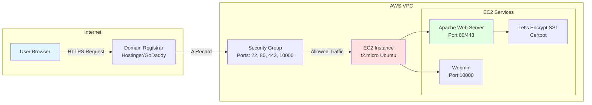
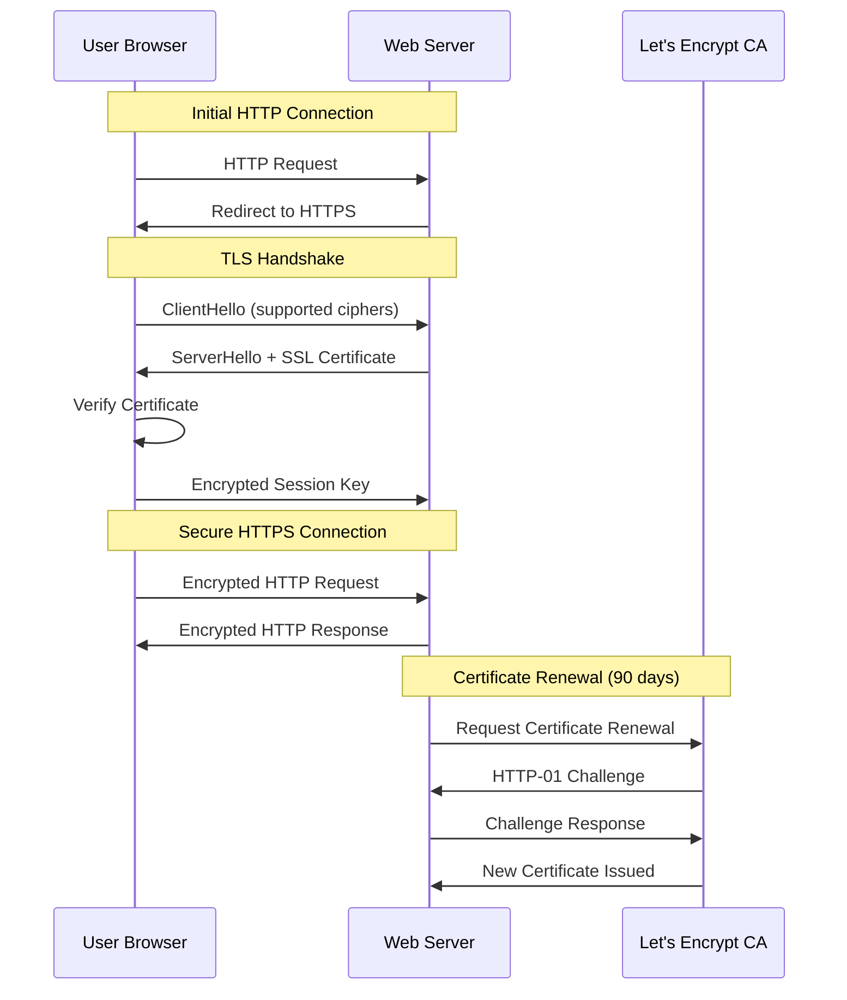
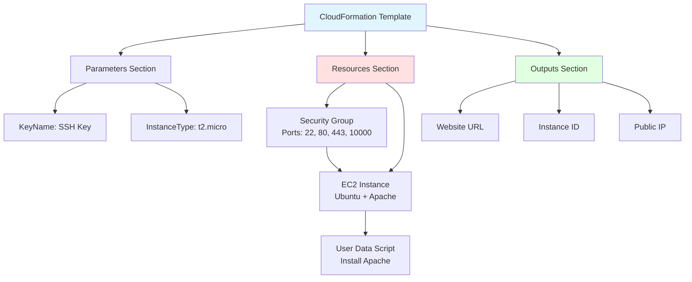

# Building a Web Server on AWS EC2: A Journey from Manual Setup to Cloud Automation

## Introduction: Building a Cloud Web Server the Smart Way

Imagine launching a web server in the cloud. For most beginners, it's a monumental task, but with the right tools, we can simplify the process while still learning the ropes of AWS, Apache, SSL, and CloudFormation.

In this journey, I'll guide you through setting up a web server on AWS EC2, installing Apache, securing the connection with SSL certificates, and automating the process using CloudFormation. Along the way, you'll see both the manual and automated approaches — the "manual" approach lets us learn every step thoroughly, while the "automated" approach saves us time and headaches in the future.

**What You'll Learn:**
- Manual EC2 instance setup and configuration
- Apache web server installation and configuration
- SSL certificate management with Let's Encrypt
- Infrastructure automation using AWS CloudFormation
- Security group configuration and best practices
- Troubleshooting common deployment issues

Let's start with a manual configuration, then use AWS CloudFormation to replicate the setup automatically. We'll finish by connecting our custom domain and securing the server with Let's Encrypt SSL.

---

## Part 1: The Manual Setup - Understanding the Basics

Before diving into automation, we'll first manually configure the server. Think of this step as the "DIY" phase. While automation can save time, it's important to understand the fundamental steps that go into setting up the server.

### Understanding AWS EC2

AWS EC2 (Elastic Compute Cloud) is the heart of cloud computing. It provides scalable compute capacity, and you can think of it as your virtual machine in the cloud. For our project, we're using a t2.micro instance — a great choice for learning and small applications, especially since it falls under the AWS Free Tier.

**Why EC2?**

AWS EC2 is widely used for its flexibility and scalability. You can easily resize instances as your needs grow. Whether you're building a small app or a full enterprise infrastructure, EC2 has you covered.

**EC2 Instance Types:**

| Instance Type | vCPUs | Memory | Use Case | Free Tier Eligible |
|--------------|-------|--------|----------|-------------------|
| t2.micro | 1 | 1 GB | Low traffic websites, development | Yes |
| t2.small | 1 | 2 GB | Small databases, web servers | No |
| t3.medium | 2 | 4 GB | Medium traffic applications | No |
| m5.large | 2 | 8 GB | Production workloads | No |

---

## Architecture Overview

The following diagram illustrates the complete AWS EC2 web server architecture, including security groups, networking, and SSL certificate management.



---

## Step 1: Launching the EC2 Instance

### Instance Configuration

1. Log into your AWS Management Console and navigate to EC2
2. Click **Launch Instance**, and select **Ubuntu** as the operating system
3. Choose **t2.micro** (because it's free within the AWS Free Tier)
4. Configure instance details:
   - **Number of instances**: 1
   - **Network**: Default VPC
   - **Subnet**: No preference (default)
   - **Auto-assign Public IP**: Enable

### Security Group Configuration

Set up a Security Group that allows traffic on:
- **Port 22 (SSH)**: So we can access the server
- **Port 80 (HTTP)**: To serve our website
- **Port 443 (HTTPS)**: For encrypted traffic (more on this soon)
- **Port 10000**: For Webmin (our server management tool)

**Security Group Rules:**

| Type | Protocol | Port Range | Source | Description |
|------|----------|-----------|--------|-------------|
| SSH | TCP | 22 | 0.0.0.0/0 | SSH access (restrict to your IP in production) |
| HTTP | TCP | 80 | 0.0.0.0/0 | HTTP web traffic |
| HTTPS | TCP | 443 | 0.0.0.0/0 | HTTPS secure web traffic |
| Custom TCP | TCP | 10000 | 0.0.0.0/0 | Webmin management interface |

**Important Security Note:** In production environments, restrict SSH (port 22) to your specific IP address or IP range. Allowing 0.0.0.0/0 (all IPs) is convenient for learning but creates security risks.

### Key Pair Setup

5. Create or select an existing key pair:
   - **Key pair name**: Test_key_Pair (or your preferred name)
   - **Key pair type**: RSA
   - **Private key file format**: .pem
   - **Download the key pair** and store it securely

6. Review and launch the instance

---

## Step 2: Connecting via SSH

Once the instance is running, it's time to SSH into it. Think of SSH as your secure tunnel to your remote server. By connecting via SSH, you can issue commands and configure the server as if you were sitting in front of it.

### SSH Connection Steps

**On Linux/macOS:**

```bash
chmod 400 Test_key_Pair.pem
ssh -i Test_key_Pair.pem ubuntu@your-ec2-public-ip
```

**On Windows (using PuTTY):**
1. Convert the .pem file to .ppk using PuTTYgen
2. Use PuTTY to connect with the .ppk key

**SSH Connection Command Breakdown:**
- `chmod 400`: Sets correct permissions on the private key (read-only for owner)
- `-i Test_key_Pair.pem`: Specifies the identity file (private key)
- `ubuntu@your-ec2-public-ip`: Username and EC2 instance public IP address

**Upon Successful Connection:**

```text
Welcome to Ubuntu 22.04.3 LTS (GNU/Linux 6.2.0-1009-aws x86_64)

 * Documentation:  https://help.ubuntu.com
 * Management:     https://landscape.canonical.com
 * Support:        https://ubuntu.com/advantage

ubuntu@ip-172-31-xx-xx:~$
```

Here, the `Test_key_Pair.pem` is your SSH key that AWS provided. You'll need it to access your instance securely. Don't lose it!

---

## Step 3: Installing Apache

Apache is one of the most popular open-source web servers. It's easy to configure, well-documented, and robust enough for most web applications.

### Apache Installation Commands

Let's install Apache, enable it, and start it:

```bash
sudo apt update
sudo apt install -y apache2
sudo systemctl enable apache2
sudo systemctl start apache2
```

**Command Explanation:**
- `sudo apt update`: Updates package lists from repositories
- `sudo apt install -y apache2`: Installs Apache web server (the -y flag auto-confirms)
- `sudo systemctl enable apache2`: Configures Apache to start automatically on boot
- `sudo systemctl start apache2`: Starts the Apache service immediately

### Verify Apache Installation

Check that Apache is running:

```bash
sudo systemctl status apache2
```

**Expected Output:**

```text
● apache2.service - The Apache HTTP Server
     Loaded: loaded (/lib/systemd/system/apache2.service; enabled; vendor preset: enabled)
     Active: active (running) since Mon 2024-01-15 10:30:25 UTC; 5min ago
```

### Test Apache in Browser

Navigate to your EC2 instance's public IP address in a web browser:

```text
http://your-ec2-public-ip
```

You should see the default Apache welcome page.

### Create Custom Landing Page

Now, Apache is up and running! Let's replace the default Apache landing page with something more personalized.

```bash
echo "<h1>🚀 CloudFormation Web Server</h1><p>This page was deployed automatically via CloudFormation.</p>" > /var/www/html/index.html
```

Reload the page in your browser to see your custom content.

**Why Apache?**

Apache is a classic choice for web hosting. While there are newer web servers (like Nginx), Apache remains a solid, reliable option for hosting websites, making it a great tool for this lab.

### Apache Directory Structure

| Directory | Purpose |
|-----------|---------|
| /var/www/html/ | Default document root (web content location) |
| /etc/apache2/ | Apache configuration files |
| /etc/apache2/sites-available/ | Available site configurations |
| /etc/apache2/sites-enabled/ | Enabled site configurations |
| /var/log/apache2/ | Apache log files (access.log, error.log) |

---

## Step 4: Setting Up SSL with Let's Encrypt

We need to ensure our website is secure. SSL certificates encrypt the data between the server and the client, which is crucial for user privacy and trust.

To get an SSL certificate for free, we'll use Let's Encrypt, a non-profit that provides free certificates.

### Understanding SSL/TLS



### Install Certbot

First, we install Certbot, a tool for obtaining and managing Let's Encrypt certificates:

```bash
sudo apt install -y certbot python3-certbot-apache
```

**Certbot Components:**
- `certbot`: Core certificate management tool
- `python3-certbot-apache`: Apache plugin for automatic configuration

### Request SSL Certificate

Now, let's request an SSL certificate for our domain:

```bash
sudo certbot --apache -d yourdomain.com -d www.yourdomain.com
```

**Command Parameters:**
- `--apache`: Use Apache plugin for automatic configuration
- `-d yourdomain.com`: Primary domain
- `-d www.yourdomain.com`: Additional subdomain (optional)

**Interactive Prompts:**
1. Enter email address (for renewal notifications)
2. Agree to Terms of Service
3. Choose whether to redirect HTTP to HTTPS (recommended: Yes)

Certbot automatically configures Apache to use SSL. It's as simple as that!

**Certbot Actions:**
- Obtains certificate from Let's Encrypt CA
- Modifies Apache configuration to enable SSL
- Creates /etc/apache2/sites-available/default-ssl.conf
- Enables SSL module and site
- Reloads Apache configuration

### Verify SSL Certificate

Test your SSL configuration:

```bash
sudo apachectl configtest
sudo systemctl reload apache2
```

Visit your site using HTTPS:

```text
https://yourdomain.com
```

You should see a padlock icon in the browser address bar, indicating a secure connection.

**Why Let's Encrypt?**

Let's Encrypt is a game-changer for website security. It provides free SSL certificates and automates the installation and renewal process. This has become a best practice in the industry.

**SSL Certificate Details:**

| Property | Value |
|----------|-------|
| Validity Period | 90 days |
| Renewal Frequency | Recommended: Every 60 days |
| Certificate Type | Domain Validated (DV) |
| Encryption | RSA 2048-bit or ECDSA P-256 |

---

## Step 5: Auto-Renewing SSL Certificates

We don't want to manually renew our certificates every 90 days. Instead, we set up a cron job to renew them automatically:

### Configure Automatic Renewal

```bash
sudo crontab -e
```

Add the following line:

```bash
0 3 * * * certbot renew --quiet
```

**Cron Job Breakdown:**
- `0 3 * * *`: Runs at 3:00 AM every day
- `certbot renew`: Checks all certificates and renews those expiring within 30 days
- `--quiet`: Suppresses output unless there's an error

### Test Renewal Process

Perform a dry run to verify the renewal process works:

```bash
sudo certbot renew --dry-run
```

**Expected Output:**

```text
Saving debug log to /var/log/letsencrypt/letsencrypt.log

- - - - - - - - - - - - - - - - - - - - - - - - - - - - - - - - - - - - - - - -
Processing /etc/letsencrypt/renewal/yourdomain.com.conf
- - - - - - - - - - - - - - - - - - - - - - - - - - - - - - - - - - - - - - - -
Cert not due for renewal, but simulating renewal for dry run
Plugins selected: Authenticator apache, Installer apache
Renewing an existing certificate
Performing the following challenges:
http-01 challenge for yourdomain.com

- - - - - - - - - - - - - - - - - - - - - - - - - - - - - - - - - - - - - - - -
new certificate deployed with reload of apache server; fullchain is
/etc/letsencrypt/live/yourdomain.com/fullchain.pem
- - - - - - - - - - - - - - - - - - - - - - - - - - - - - - - - - - - - - - - -

Congratulations, all renewals succeeded.
```

Now, Certbot will automatically renew your SSL certificates every day at 3:00 AM.

---

## Webmin Configuration

Before transitioning into automation, I took an extra step to enhance server management via a browser interface by configuring Webmin. This tool provides a rich GUI for system administration tasks like user management, package updates, and more.

### Understanding Webmin

Webmin is a web-based system administration tool for Unix-like systems. It allows you to manage your server through a browser interface instead of the command line.

**Webmin Features:**
- User and group management
- Package installation and updates
- File system management
- Apache configuration
- System monitoring
- Firewall configuration

### Webmin Installation Steps

1. Downloaded and installed Webmin on the EC2 instance:

```bash
wget https://www.webmin.com/download/deb/webmin-current.deb
sudo dpkg -i webmin-current.deb
sudo apt --fix-broken install
```

**Installation Commands Explained:**
- `wget`: Downloads the Webmin .deb package from official source
- `sudo dpkg -i`: Installs the .deb package
- `sudo apt --fix-broken install`: Resolves any dependency issues

2. Resolved permission error during the .deb install (see Troubleshooting section below)

3. Opened port 10000 for Webmin access in the Security Group

4. Accessed Webmin via browser at: `https://your-server-ip:10000`

5. Logged in with:
   - **Username**: ubuntu
   - **Password**: (set manually during the initial setup)

This gave me an alternative, secure way to manage the instance before proceeding with the CloudFormation setup in Part 2.

**Webmin Dashboard Components:**

| Section | Purpose |
|---------|---------|
| System | System information, logs, scheduled cron jobs |
| Servers | Apache, SSH, DNS, and other server management |
| Tools | File manager, custom commands, system shell |
| Networking | Network configuration, firewall rules |
| Hardware | Disk management, partitions, RAID |
| Webmin | Webmin configuration and module management |

---

## Part 2: Automating the Process with CloudFormation

Now that we've manually set up our server, let's make it repeatable. AWS CloudFormation allows us to automate the entire infrastructure deployment.

### Understanding Infrastructure as Code

Infrastructure as Code (IaC) is the practice of managing and provisioning computing infrastructure through machine-readable definition files, rather than physical hardware configuration or interactive configuration tools.

**Benefits of IaC with CloudFormation:**
- **Repeatability**: Deploy identical infrastructure multiple times
- **Version Control**: Track infrastructure changes in Git
- **Documentation**: Template serves as documentation
- **Consistency**: Eliminate manual configuration errors
- **Speed**: Deploy complex infrastructure in minutes

### CloudFormation Template Creation

CloudFormation is like the blueprint of your AWS resources. It allows you to define and provision infrastructure using code. Here's a basic YAML template that launches an EC2 instance, sets up Apache, and configures security groups.

```yaml
AWSTemplateFormatVersion: '2010-09-09'
Description: > 
  Launch an EC2 instance, install Apache web server, allow traffic on ports 80, 443, 22, 
  and 10000 (Webmin), and display a custom HTML page.

Parameters:
  KeyName:
    Description: Name of an existing EC2 KeyPair to enable SSH access
    Type: AWS::EC2::KeyPair::KeyName
    ConstraintDescription: Must be the name of an existing EC2 KeyPair

  InstanceType:
    Description: EC2 instance type
    Type: String
    Default: t2.micro
    AllowedValues:
      - t2.micro
      - t2.small
      - t2.medium
    ConstraintDescription: Must be a valid EC2 instance type

Resources:
  WebServerSecurityGroup:
    Type: AWS::EC2::SecurityGroup
    Properties:
      GroupDescription: Enable HTTP, HTTPS, SSH, and Webmin access
      SecurityGroupIngress:
        - IpProtocol: tcp
          FromPort: 22
          ToPort: 22
          CidrIp: 0.0.0.0/0
          Description: SSH access
        - IpProtocol: tcp
          FromPort: 80
          ToPort: 80
          CidrIp: 0.0.0.0/0
          Description: HTTP access
        - IpProtocol: tcp
          FromPort: 443
          ToPort: 443
          CidrIp: 0.0.0.0/0
          Description: HTTPS access
        - IpProtocol: tcp
          FromPort: 10000
          ToPort: 10000
          CidrIp: 0.0.0.0/0
          Description: Webmin access

  WebServerInstance:
    Type: AWS::EC2::Instance
    Properties:
      InstanceType: !Ref InstanceType
      KeyName: !Ref KeyName
      ImageId: ami-0c55b159cbfafe1f0  # Ubuntu 22.04 LTS (update for your region)
      SecurityGroups:
        - !Ref WebServerSecurityGroup
      UserData:
        Fn::Base64: !Sub |
          #!/bin/bash
          apt update
          apt install -y apache2
          systemctl enable apache2
          systemctl start apache2
          echo "<h1>🚀 CloudFormation Web Server</h1><p>This page was deployed automatically via CloudFormation.</p>" > /var/www/html/index.html

Outputs:
  WebsiteURL:
    Description: URL of the web server
    Value: !Sub 'http://${WebServerInstance.PublicDnsName}'
  
  InstanceId:
    Description: Instance ID of the web server
    Value: !Ref WebServerInstance
  
  PublicIP:
    Description: Public IP address of the web server
    Value: !GetAtt WebServerInstance.PublicIp
```

### CloudFormation Template Components

**Template Structure:**



This template defines:
- **Parameters**: KeyName (SSH key) and InstanceType (t2.micro by default)
- **Resources**:
  - An EC2 instance running Ubuntu
  - A Security Group allowing inbound traffic on the necessary ports
- **User Data Script**: Installs Apache and serves our custom page
- **Outputs**: Website URL, Instance ID, and Public IP address

**Why CloudFormation?**

CloudFormation is perfect for Infrastructure as Code (IaC). It allows you to define your infrastructure in YAML or JSON and deploy it with the click of a button, ensuring consistency across multiple environments.

### Deploying the CloudFormation Stack

After writing the template, we deploy it as a CloudFormation Stack:

**Deployment Steps:**

1. Go to **CloudFormation** in AWS Console and click "Create Stack"
2. Choose "Upload a template file" and upload your CloudFormation YAML template
3. Enter the stack details:
   - **Stack name**: WebServerStack (or your preferred name)
   - **KeyName parameter**: Select your EC2 key pair name (Test_key_Pair)
   - **InstanceType parameter**: Keep default (t2.micro) or choose another
4. Configure stack options (tags, permissions, advanced options) - optional
5. Review and click "Create stack"

CloudFormation will then take care of everything, from creating the EC2 instance to setting up Apache.

**Stack Creation Process:**

```text
CREATE_IN_PROGRESS  AWS::EC2::SecurityGroup          WebServerSecurityGroup
CREATE_COMPLETE     AWS::EC2::SecurityGroup          WebServerSecurityGroup
CREATE_IN_PROGRESS  AWS::EC2::Instance               WebServerInstance
CREATE_COMPLETE     AWS::EC2::Instance               WebServerInstance
CREATE_COMPLETE     AWS::CloudFormation::Stack       WebServerStack
```

**Expected Deployment Time**: 3-5 minutes

### Monitor Stack Creation

Monitor the stack creation in the CloudFormation console:
- **Events tab**: Shows real-time progress of resource creation
- **Resources tab**: Lists all resources created by the stack
- **Outputs tab**: Displays output values (Website URL, Instance ID, Public IP)

---

## Part 3: Connect Domain and Install SSL

Once our server is up and running, we connect our custom domain and install the SSL certificate.

### Step 1: Update DNS Settings

We use Hostinger, GoDaddy, or any other domain provider to create an A record that points to our EC2 instance's IP address.

**DNS Configuration Steps:**

1. Log into your domain registrar (Hostinger, GoDaddy, Namecheap, etc.)
2. Navigate to DNS management for your domain
3. Create an A record:
   - **Type**: A
   - **Name**: @ (for root domain) or www (for www subdomain)
   - **Value**: Your EC2 instance's public IP address
   - **TTL**: 3600 (1 hour) or default

**DNS Record Configuration:**

| Record Type | Name | Value | TTL | Purpose |
|------------|------|-------|-----|---------|
| A | @ | 54.123.45.67 | 3600 | Root domain (yourdomain.com) |
| A | www | 54.123.45.67 | 3600 | WWW subdomain (www.yourdomain.com) |

**DNS Propagation:**

After updating DNS records, propagation can take 1-48 hours (typically 1-4 hours). You can check propagation status using:

```bash
nslookup yourdomain.com
dig yourdomain.com
```

### Step 2: Install SSL Using Certbot

We SSH into our EC2 instance and run the same Certbot commands as before to install SSL:

```bash
sudo certbot --apache -d yourdomain.com -d www.yourdomain.com
```

**SSL Installation Process:**
1. Certbot verifies domain ownership via HTTP-01 challenge
2. Let's Encrypt CA issues certificate (valid for 90 days)
3. Certbot installs certificate in Apache configuration
4. Apache is reloaded with new SSL configuration

Now, our website is secure, and we have HTTPS running.

**Verify SSL Installation:**

```bash
sudo certbot certificates
```

**Expected Output:**

```text
Found the following certs:
  Certificate Name: yourdomain.com
    Domains: yourdomain.com www.yourdomain.com
    Expiry Date: 2024-04-15 10:30:25+00:00 (VALID: 89 days)
    Certificate Path: /etc/letsencrypt/live/yourdomain.com/fullchain.pem
    Private Key Path: /etc/letsencrypt/live/yourdomain.com/privkey.pem
```

---

## Troubleshooting Common Errors During Setup

No journey is without its challenges! During the manual setup, we encountered a few issues. Here's a breakdown of the errors, what caused them, and how we fixed them.

### Error 1: Webmin Permission Denied

**What Happened?**

While trying to install Webmin using the .deb package on our EC2 instance, we encountered the following error:

```text
N: Download is performed unsandboxed as root as file '/home/ubuntu/webmin_2.105_all.deb' 
couldn't be accessed by user '_apt'. - pkgAcquire::Run (13: Permission denied)
```

**Cause of the Issue:**

This error occurs when the APT package manager (which handles package installation on Ubuntu) is run as root and doesn't have proper permissions for downloading the .deb package. The system is essentially trying to download the file without proper access rights.

**How We Resolved It:**

To resolve the issue, we had to fix the permissions of the directory where the file was being downloaded. Here's the fix we applied:

1. Remove the partially downloaded file:

First, we cleaned up the directory and removed any partially downloaded files:

```bash
sudo rm -f /home/ubuntu/webmin_2.105_all.deb
```

2. Install the package again with proper permissions:

We tried running the installation again, but with elevated privileges to ensure the download happened correctly:

```bash
sudo dpkg -i webmin_2.105_all.deb
```

**Lesson Learned:**

When installing packages via dpkg, it's important to ensure that the user running the command has the right permissions to download and install files. Running as root (without the proper environment) can sometimes interfere with the process, so checking permissions and file locations is critical.

---

### Error 2: 403 Forbidden After Installing Apache

**What Happened?**

After setting up Apache and configuring the default page, we tried accessing the server via `http://your-ec2-ip`, but received a 403 Forbidden error.

**Cause of the Issue:**

This error typically occurs when Apache is not configured to allow public access to the directory containing the web page, or if file permissions are not set correctly.

**How We Resolved It:**

Here's how we fixed the issue:

1. Check the directory permissions:

We ensured that the directory /var/www/html where Apache serves files had the correct permissions:

```bash
sudo chown -R www-data:www-data /var/www/html
sudo chmod -R 755 /var/www/html
```

**Permission Explanation:**
- `chown www-data:www-data`: Sets Apache user as owner
- `chmod 755`: Sets read/execute for everyone, write for owner only

2. Check the Apache configuration:

We confirmed that Apache's configuration allowed access to the public directory. We edited the 000-default.conf file to make sure it allowed traffic:

```bash
sudo nano /etc/apache2/sites-available/000-default.conf
```

Then, we checked that the following lines were set up correctly:

```apache
<Directory /var/www/html>
    Options Indexes FollowSymLinks
    AllowOverride All
    Require all granted
</Directory>
```

3. Restart Apache:

After modifying the configurations, we restarted Apache to apply the changes:

```bash
sudo systemctl restart apache2
```

**Lesson Learned:**

Permissions and Apache configurations are critical when setting up a web server. Always check both the filesystem permissions and the Apache configuration to ensure everything is set up correctly.

---

### Error 3: SSL Certificate Installation Failed

**What Happened?**

After configuring SSL with Let's Encrypt, we encountered a certificate installation failure.

**Cause of the Issue:**

This happened because the HTTP-01 challenge used by Let's Encrypt requires the server to be accessible over HTTP (port 80). However, since we didn't have port 80 open in our security group at the time, the certificate installation failed.

**How We Resolved It:**

To fix this, we:

1. Checked our Security Group:

We confirmed that port 80 was open in the EC2 security group.

2. Re-ran the Certbot Command:

After ensuring port 80 was open, we re-ran the Certbot command to obtain the SSL certificate:

```bash
sudo certbot --apache -d yourdomain.com
```

3. Verified the SSL Certificate:

After Certbot successfully issued the certificate, we verified it by visiting the site via `https://yourdomain.com`.

**Lesson Learned:**

When using Let's Encrypt, it's essential to have port 80 open temporarily for the HTTP-01 challenge. Once the certificate is installed, we can secure the server with HTTPS, and traffic on port 80 can be redirected to HTTPS.

**Let's Encrypt Challenge Types:**

| Challenge Type | Required Port | Validation Method | Use Case |
|---------------|--------------|-------------------|----------|
| HTTP-01 | 80 | Serves file via HTTP | Standard web servers |
| DNS-01 | N/A | Creates TXT record in DNS | Wildcard certificates, servers behind firewall |
| TLS-ALPN-01 | 443 | TLS extension | Servers that can't open port 80 |

---

## Conclusion: From Manual to Automated Deployment

With the manual setup, we learned how to configure and secure a web server step by step. Then, we took that knowledge and automated it using AWS CloudFormation, simplifying future deployments. By connecting a custom domain and adding SSL, we've built a secure, scalable web server hosted on AWS.

**Key Takeaways:**
- **Manual setup** provides deep understanding of each component
- **CloudFormation automation** ensures repeatability and consistency
- **Let's Encrypt SSL** provides free, automated certificate management
- **Security groups** control network access at the instance level
- **Troubleshooting skills** are essential for real-world deployments

---

## Next Steps

1. **Use this template as a base for scaling and adding more services**:
   - Add Amazon RDS for database functionality
   - Implement Amazon S3 for static asset storage
   - Configure Amazon CloudWatch for monitoring and logging

2. **Explore integrating this setup with AWS Elastic Load Balancers or Auto Scaling for high availability**:
   - Create Application Load Balancer for distributing traffic
   - Configure Auto Scaling Group for automatic capacity management
   - Implement health checks for automatic instance replacement

3. **Enhance Security**:
   - Implement AWS WAF (Web Application Firewall)
   - Use AWS Systems Manager Session Manager instead of direct SSH
   - Configure AWS Secrets Manager for credential management
   - Enable AWS CloudTrail for audit logging

4. **Implement CI/CD Pipeline**:
   - Use AWS CodePipeline for automated deployments
   - Integrate with GitHub for source control
   - Automate testing with AWS CodeBuild

---

## Related AWS and Azure Topics

This AWS EC2 web server setup complements Azure-based infrastructure:

- **[Azure Load Balancing Services](./Azure_Load_Balancing_Services.md)**: Compare AWS Application Load Balancer with Azure Application Gateway for Layer 7 load balancing scenarios
- **[Azure VPN Gateway](./Azure_VPN_Gateway_Configuration.md)**: Explore hybrid cloud scenarios connecting AWS EC2 with Azure VNets via VPN tunnels
- **[Azure ExpressRoute](./Azure_ExpressRoute_Deep_Dive.md)**: Learn about Azure's private connectivity alternative to AWS Direct Connect

**Cross-Platform Scenarios:**
- **Multi-Cloud Load Balancing**: Use DNS-based global load balancing to distribute traffic between AWS EC2 and Azure VMs
- **Hybrid Cloud Connectivity**: Connect AWS VPC with Azure VNet using Site-to-Site VPN for unified network infrastructure
- **Cloud Bursting**: Scale workloads from on-premises to both AWS and Azure based on demand patterns

---

## Best Practices Summary

### Security Best Practices
- **Restrict SSH Access**: Limit port 22 to specific IP addresses, not 0.0.0.0/0
- **Use IAM Roles**: Attach IAM roles to EC2 instances instead of embedding credentials
- **Enable MFA**: Require multi-factor authentication for AWS console access
- **Regular Updates**: Keep OS and packages updated with `apt update && apt upgrade`
- **Security Groups as Firewalls**: Use security groups as first line of defense
- **SSL/TLS Everywhere**: Always use HTTPS for production websites

### Performance Best Practices
- **Use Elastic IPs**: Assign Elastic IP for stable public IP address
- **Enable Caching**: Configure Apache caching modules for better performance
- **Monitor Resources**: Use CloudWatch to monitor CPU, memory, and disk usage
- **Right-Size Instances**: Choose instance type based on actual workload requirements

### Cost Optimization
- **Free Tier Usage**: Leverage AWS Free Tier (t2.micro, 750 hours/month)
- **Reserved Instances**: Purchase Reserved Instances for long-term workloads
- **Stop Unused Instances**: Stop instances when not in use (only pay for storage)
- **Use Spot Instances**: Consider Spot Instances for fault-tolerant workloads

### Operational Best Practices
- **Infrastructure as Code**: Use CloudFormation for all infrastructure deployments
- **Version Control**: Store templates in Git for change tracking
- **Tagging Strategy**: Tag all resources with owner, project, environment, cost-center
- **Backup Strategy**: Regular snapshots of EBS volumes for disaster recovery
- **Documentation**: Maintain runbooks for common operational tasks

---

## What We've Learned

1. **Apache setup**: Configuring Apache correctly is vital, from ensuring permissions to modifying the configuration files.
2. **SSL certificates with Let's Encrypt**: Let's Encrypt makes SSL accessible and free, but we must ensure the server is properly accessible during the certificate issuance process.
3. **Troubleshooting**: Every error provides a learning opportunity. Fixing issues with the right approach not only resolves problems but also enhances your understanding of the tools.
4. **Infrastructure as Code**: CloudFormation transforms manual processes into repeatable, version-controlled infrastructure deployments.
5. **Security Groups**: Properly configured security groups are essential for both security and functionality.

---

## Final Thoughts

I hope this guide has made the process of setting up a web server on AWS EC2 more approachable. Whether you're just starting or have some experience under your belt, there's always something new to learn in the world of cloud computing. Stay tuned for more tutorials as we continue to automate and scale our cloud infrastructure!

**Additional Learning Resources:**
- [AWS EC2 User Guide](https://docs.aws.amazon.com/ec2/)
- [Apache HTTP Server Documentation](https://httpd.apache.org/docs/)
- [Let's Encrypt Documentation](https://letsencrypt.org/docs/)
- [AWS CloudFormation Documentation](https://docs.aws.amazon.com/cloudformation/)
