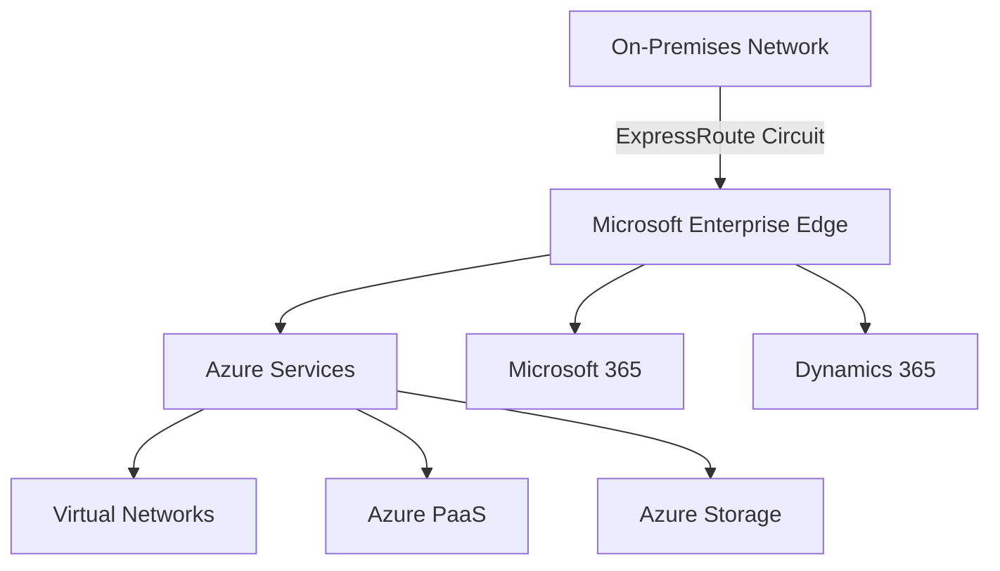
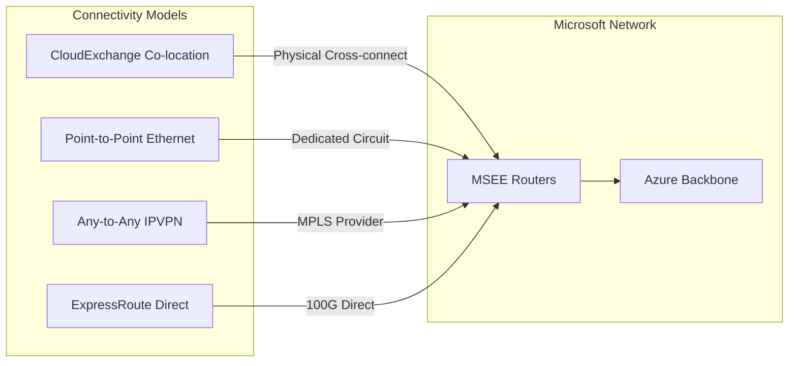
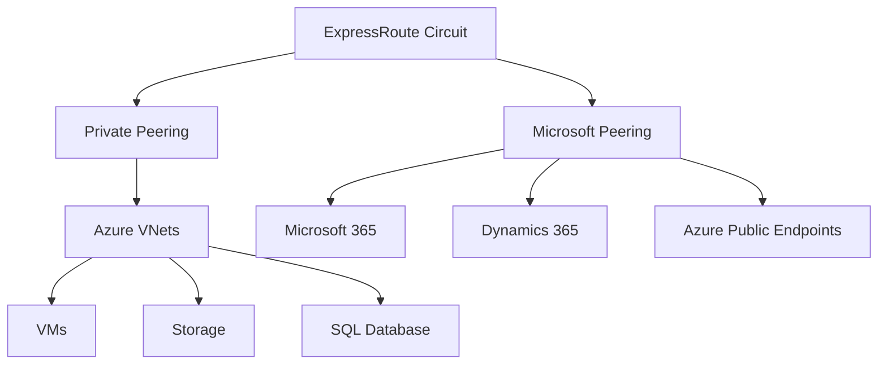
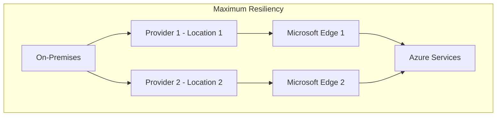
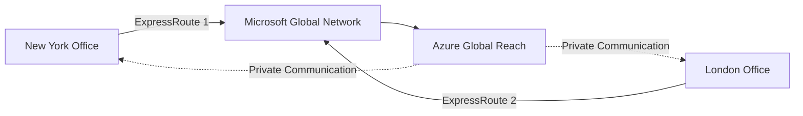

# Azure ExpressRoute Deep Dive

Azure ExpressRoute fundamentally transforms how you connect your on-premises infrastructure to the Microsoft cloud, offering a paradigm shift away from VPN tunnels over the public internet. ExpressRoute provides dedicated, private network connections, bypassing the public internet entirely.

## Overview

Azure ExpressRoute is a service that establishes private, high-bandwidth network connections between your on-premises datacenter, colocation facility, or office and Microsoft's global network infrastructure. Unlike VPN Gateways which encrypt traffic and send it over the public internet, ExpressRoute connections operate over dedicated circuits provided by connectivity partners.

Think of it as leasing a private, express lane directly to Microsoft's datacenter network, rather than taking the crowded public highway (the internet).

### Key Characteristics

| Characteristic | Description | Benefit |
| --- | --- | --- |
| Private Connectivity | Traffic travels over private, dedicated network path | Reduced exposure to internet threats, predictable environment |
| Predictable Performance | Dedicated bandwidth not shared with internet traffic | Consistent latency, lower jitter, higher reliability |
| Higher Bandwidth | Available from 50 Mbps up to 100 Gbps+ | Far exceeds typical VPN Gateway capabilities |
| Lower Latency | Direct private connections | Significantly lower latency for geographically dispersed locations |
| Enhanced Security | Traffic doesn't traverse public internet | Reduced attack surface (though not encrypted by default) |
| Service Level Agreements | Robust SLAs from Microsoft and providers | Guaranteed uptime and network availability |

### Supported Services

ExpressRoute provides direct access to:

- **Azure Services** - All Azure regions and services available in your ExpressRoute peering location
- **Microsoft 365 Services** - Exchange Online, SharePoint Online, Teams (requires specific configuration)
- **Dynamics 365 Services** - Access to Dynamics 365 applications and data



## Connectivity Models

ExpressRoute offers several connectivity models, each catering to different infrastructure setups and business needs.

### CloudExchange Co-location

**Scenario**

Infrastructure already located in colocation facility offering direct physical cross-connects to Microsoft's network. Many large colocation providers (Equinix, Digital Realty, Coresite) have established ExpressRoute peering locations within their facilities.

**Mechanism**

Network equipment in colocation facility physically connected (typically via fiber optic cables) to Microsoft Enterprise Edge (MSEE) routers within the same facility. The connectivity provider (colocation facility operator) facilitates this cross-connect.

**Advantages**

- Lowest latency
- Highest bandwidth options
- Direct physical connectivity
- Often most cost-effective if already colocated

**Example**

Servers in Equinix datacenter in Silicon Valley. Equinix offers ExpressRoute peering at that location. Order cross-connect from your rack to Microsoft cage within Equinix datacenter.

### Point-to-Point Ethernet Connection

**Scenario**

Direct, dedicated Ethernet link (leased line, dark fiber) from on-premises location to location where Microsoft has network presence or to connectivity provider who can connect to Microsoft's network.

**Mechanism**

Private, point-to-point Ethernet circuit established between your network and ExpressRoute peering location. This is a dedicated, unshared connection.

**Advantages**

- Dedicated bandwidth
- Highly reliable
- Predictable performance

**Example**

Corporate headquarters has dedicated 10 Gbps fiber link to regional carrier point-of-presence (POP), and that carrier offers ExpressRoute connectivity from that POP.

### Any-to-Any (IPVPN) Connection

**Scenario**

Using Multiprotocol Label Switching (MPLS) network or IP VPN service from network service provider (AT&T, Verizon, BT). Organization has multiple branch offices or datacenters connected to MPLS network.

**Mechanism**

MPLS/IP VPN provider integrates ExpressRoute connectivity into their network. Azure becomes another "site" on existing MPLS network. Traffic destined for Azure routed through MPLS provider's network to ExpressRoute peering location.

**Advantages**

- Leverages existing MPLS infrastructure
- Simplifies management if you already have WAN based on MPLS
- Good for organizations with many distributed locations

**Example**

Company has 50 branch offices connected via MPLS VPN from Verizon. Verizon adds ExpressRoute connectivity to existing MPLS service, allowing all branches to access Azure resources through MPLS network.

### ExpressRoute Direct

**Scenario**

Requires highest bandwidth, lowest latency, and want direct ownership and control of physical connection to Microsoft's network. Designed for very large-scale deployments and service providers.

**Mechanism**

Establish dual 100 Gbps or 10 Gbps physical connections directly to Microsoft's global network at peering locations worldwide. You own and manage physical links.

**Advantages**

- Massive bandwidth (up to 100 Gbps per port)
- Ability to dynamically create multiple ExpressRoute circuits on demand
- Ideal for very large enterprises or service providers
- Enhanced security and control

**Example**

Large financial institution or major cloud service provider establishes ExpressRoute Direct connections in multiple global peering locations to support massive Azure workloads and customer traffic.



## ExpressRoute Peering Types

ExpressRoute circuits support two types of peering, which define what types of Microsoft services you can access over the ExpressRoute connection.

### Private Peering (Azure Private Peering)

**Purpose**

Provides connectivity to Azure Virtual Networks (VNets). This is the peering type used to access Infrastructure as a Service (IaaS) resources like Virtual Machines, Storage Accounts, SQL Databases, and other Azure services deployed within VNets.

**Routing**

Uses Border Gateway Protocol (BGP) to dynamically exchange routing information between on-premises network and Azure VNets. You advertise on-premises network prefixes to Azure, and Azure advertises address space of connected VNets back to you.

**IP Addressing**

Exclusively uses private IP address space (RFC 1918 addresses: 10.0.0.0/8, 172.16.0.0/12, 192.168.0.0/16). Traffic remains private and does not traverse public internet.

**Use Case**

Foundational peering type for accessing Azure IaaS resources. Essential for hybrid cloud scenarios where on-premises applications need to interact with Azure VMs, databases, storage.

### Microsoft Peering (Azure Public Peering - Deprecated Term)

**Purpose**

Provides connectivity to Microsoft's public cloud services:

- **Microsoft 365 Services** - Exchange Online, SharePoint Online, Teams, OneDrive for Business
- **Dynamics 365 Services** - Dynamics 365 Customer Engagement, Finance and Operations
- **Azure Public Services** - Azure services via public endpoints (Storage, SQL Database, Cosmos DB)

**Routing**

Also uses BGP. However, unlike Private Peering, Microsoft Peering requires you to advertise public IP address prefixes that you own. Microsoft advertises public IP address ranges used by Microsoft 365, Dynamics 365, and Azure public services.

**IP Addressing**

Requires use of public IP addresses registered to you or your connectivity provider. You must prove ownership of these IP addresses to configure Microsoft Peering.

**Use Case**

Connecting to Microsoft 365 services with improved performance and reliability compared to internet-based connections. Accessing Azure public services (though Private Peering often preferred for Azure resources for security reasons). Required for specific Azure PaaS services that only expose public endpoints.

### When to Choose Each Peering Type

| Peering Type | When to Use | Primary Services |
| --- | --- | --- |
| Private Peering | Almost always required for connecting to Azure VNets and IaaS resources | Azure VMs, Storage, SQL Database, VNet services |
| Microsoft Peering | Accessing Microsoft 365, Dynamics 365, or Azure PaaS public endpoints | Microsoft 365, Dynamics 365, Azure public endpoints |
| Both | Need connectivity to both Azure VNets and Microsoft 365/public services | Complete hybrid cloud with SaaS integration |



## ExpressRoute Circuits

An ExpressRoute circuit is the fundamental unit of an ExpressRoute connection, representing a dedicated connection between your network and Microsoft's network, provisioned by a connectivity provider.

### Key Attributes

| Attribute | Description | Considerations |
| --- | --- | --- |
| Peering Location | Physical location where your network connects to Microsoft | Choose location geographically close to on-premises infrastructure |
| Bandwidth | Provisioned bandwidth (50 Mbps to 100 Gbps) | Maximum throughput capacity, affects pricing |
| Service Provider | Telecom carrier, ISP, or colocation provider | Must support ExpressRoute and be available in your region |
| SKU | Standard or Premium | Determines connectivity scope and limits |

### SKU Comparison: Standard vs. Premium

| Feature | Standard SKU | Premium SKU |
| --- | --- | --- |
| Connectivity Scope | Same geopolitical region as peering location | Global connectivity across all Azure regions |
| VNet Limit | Limited number (e.g., 10 VNets per circuit) | Significantly higher limits |
| Route Limits | Limited routes advertised over BGP | Higher limits on advertised routes |
| Microsoft Peering Access | Services within same geopolitical region | Access to Microsoft's global services |
| Cost | Lower cost | Higher cost due to added features |
| Use Cases | Regional connectivity needs | Global presence, large-scale deployments |

**Example: Standard SKU Connectivity**

ExpressRoute circuit in North America (Silicon Valley) can connect to Azure regions in North America (West US, East US, Central US).

**Example: Premium SKU Connectivity**

ExpressRoute circuit in Europe can connect to VNets in North America, Asia, and all other Azure regions worldwide.

### Circuit Configuration Details

| Configuration Element | Description |
| --- | --- |
| Circuit Name | User-friendly name to identify ExpressRoute circuit in Azure |
| Location | ExpressRoute peering location where circuit will be created |
| Bandwidth | Provisioned capacity (50 Mbps, 1 Gbps, 10 Gbps, etc.) |
| Service Provider | Connectivity provider being used |
| Peering Location | Specific meet-me location for connection |
| SKU | ExpressRoute SKU (Standard or Premium) |
| Billing Model | Metered Data or Unlimited Data |
| Provider Status | Provisioning status by connectivity provider |
| Circuit Status | Operational status in Azure |
| Peering Configuration | Details for Private Peering and Microsoft Peering |
| Authorization Key | Unique key for authorizing connection to VNet in different subscription |
| Global Reach Enabled | Whether Azure Global Reach is enabled |
| FastPath Enabled | Whether ExpressRoute FastPath is enabled |
| Resiliency Type | Standard, High, or Maximum Resiliency configuration |

## Advanced Features

### ExpressRoute Resiliency

ExpressRoute offers different resiliency options to meet varying business needs.

| Resiliency Type | Description | Protection Level |
| --- | --- | --- |
| Standard Resiliency | Dual ports on MSEE routers at peering location | Protects against MSEE device failures |
| High Resiliency | Two circuits from same provider, same or different locations | Adds redundancy in provider's network path |
| Maximum Resiliency | Two circuits from different providers in different locations | Highest fault tolerance against provider or location failures |



### Azure Global Reach

Azure Global Reach enables direct connectivity between different geographically dispersed on-premises sites using Microsoft's global network. It allows you to link ExpressRoute circuits together, creating a private wide area network (WAN) over the Microsoft backbone.

**Use Cases**

- Connecting branch offices across continents without backhauling through central hub
- Private WAN over Microsoft backbone
- Complementing service provider's WAN implementation

**Example**

Company has ExpressRoute circuit in New York and another in London. Global Reach allows direct communication between New York and London offices over Microsoft's network without traffic traversing public internet.



### ExpressRoute FastPath

ExpressRoute FastPath enhances data path performance between on-premises network and Azure virtual networks by bypassing the virtual network gateway for supported workloads.

**Traditional Path**

Traffic traversing ExpressRoute to VNet always passes through ExpressRoute virtual network gateway, adding latency.

**FastPath**

Bypasses virtual network gateway, routing network traffic directly to virtual machines within VNet. This reduces latency and improves throughput.

**Key Aspects**

- Available on all ExpressRoute circuits
- Must be enabled on ExpressRoute virtual network gateway
- Beneficial for latency-sensitive and high-bandwidth applications
- Supports both Private Peering and Microsoft Peering for Azure PaaS services

<!-- TODO: Complex diagram - requires detailed Mermaid conversion -->
Traditional path: On-Premises → ExpressRoute → VNet Gateway → VM (higher latency)
FastPath: On-Premises → ExpressRoute → VM (bypasses gateway, lower latency)

## Configuration and Troubleshooting

### Common Configuration Issues

| Issue | Description |
| --- | --- |
| Incorrect VLAN tagging | VLAN encapsulation misconfigured on circuit |
| Mismatched BGP configuration | ASN, IP addresses, or authentication keys don't match |
| Firewall rules blocking traffic | BGP or application traffic blocked by firewall |
| Incorrect route advertisements | Wrong network prefixes advertised via BGP |
| Provider provisioning issues | Connectivity provider hasn't completed provisioning |
| Virtual network gateway configuration | Gateway not properly configured or connected |
| Authorization key mismatches | Incorrect key when connecting VNets in different subscriptions |

### Troubleshooting Steps

1. Verify ExpressRoute circuit status in Azure portal
2. Check peering status and BGP session status
3. Review configuration of on-premises routers and virtual network gateway
4. Use network monitoring tools to analyze traffic flow
5. Contact connectivity provider for physical connectivity issues
6. Leverage Azure Network Watcher for diagnostics
7. Provide service key to Microsoft support for efficient issue identification

### Service Key

The service key uniquely identifies your ExpressRoute circuit. Provide this key to:

- Microsoft support for troubleshooting
- Your ExpressRoute partner for circuit provisioning
- Authorized personnel for circuit management

## ExpressRoute vs. Virtual WAN

| Feature | Azure ExpressRoute | Azure Virtual WAN |
| --- | --- | --- |
| Primary Purpose | Dedicated, private connectivity to Azure | Centralized network management for hybrid and multi-cloud |
| Connectivity Model | Point-to-point via connectivity provider | Hub-and-spoke architecture connecting various sites |
| Connectivity Options | ExpressRoute circuits only | ExpressRoute, Site-to-site VPN, Point-to-site VPN, User VPN |
| Management | Managed individually per circuit | Centrally managed through Virtual WAN hub |
| Routing | Requires manual BGP and route table configuration | Automated routing within virtual hub and between spokes |
| Scalability | Determined by provisioned circuit bandwidth | Highly scalable for numerous sites and connection types |
| Use Cases | High-bandwidth, low-latency private connections | Complex hybrid networking with multiple branches and remote users |

## ExpressRoute vs. VPN Gateway

| Aspect | ExpressRoute | VPN Gateway |
| --- | --- | --- |
| Connection Type | Private, dedicated circuit | Encrypted tunnel over public internet |
| Bandwidth | 50 Mbps to 100 Gbps+ | Up to ~10 Gbps (highest SKU) |
| Latency | Very low, predictable | Higher, variable (internet-dependent) |
| Security | Private path (not encrypted by default) | Encrypted (IPsec/IKE) |
| Cost | Higher, based on bandwidth and provider | Lower, based on gateway SKU and data transfer |
| Setup Complexity | More complex, requires provider | Simpler, can be deployed quickly |
| Use Case | Mission-critical, high-bandwidth, low-latency | General hybrid connectivity, backup for ExpressRoute |

For VPN Gateway details and configuration, see [Azure VPN Gateway Configuration](./Azure_VPN_Gateway_Configuration.md).

## Configuration Commands

### Create ExpressRoute Circuit

```bash
# Create ExpressRoute Circuit
az network express-route create \
  --resource-group <resource-group-name> \
  --name <circuit-name> \
  --peering-location <peering-location> \
  --bandwidth <bandwidth-in-mbps> \
  --provider <service-provider-name> \
  --sku-family MeteredData \
  --sku-tier Standard

# Verify circuit creation
az network express-route show \
  --resource-group <resource-group-name> \
  --name <circuit-name>
```

### Configure Private Peering

```bash
# Configure Azure Private Peering
az network express-route peering create \
  --resource-group <resource-group-name> \
  --circuit-name <circuit-name> \
  --peering-type AzurePrivatePeering \
  --peer-asn <your-asn> \
  --primary-peer-subnet <primary-subnet-cidr> \
  --secondary-peer-subnet <secondary-subnet-cidr> \
  --vlan-id <vlan-id>
```

### Configure Microsoft Peering

```bash
# Configure Microsoft Peering
az network express-route peering create \
  --resource-group <resource-group-name> \
  --circuit-name <circuit-name> \
  --peering-type MicrosoftPeering \
  --peer-asn <your-asn> \
  --primary-peer-subnet <primary-subnet-cidr> \
  --secondary-peer-subnet <secondary-subnet-cidr> \
  --vlan-id <vlan-id> \
  --advertised-public-prefixes <your-public-ip-prefixes>
```

### Connect VNet to ExpressRoute

```bash
# Create ExpressRoute Gateway in VNet
az network vnet-gateway create \
  --resource-group <resource-group-name> \
  --name <gateway-name> \
  --vnet <vnet-name> \
  --gateway-type ExpressRoute \
  --sku Standard

# Create connection between VNet Gateway and ExpressRoute Circuit
az network vpn-connection create \
  --resource-group <resource-group-name> \
  --name <connection-name> \
  --vnet-gateway1 <gateway-name> \
  --express-route-circuit2 <circuit-resource-id>
```

### Enable FastPath

```bash
# Enable FastPath on ExpressRoute Gateway connection
az network vpn-connection update \
  --resource-group <resource-group-name> \
  --name <connection-name> \
  --express-route-gateway-bypass true
```

## Best Practices

### Design and Planning

1. **Choose appropriate SKU** - Standard for regional, Premium for global connectivity
2. **Plan for redundancy** - Implement at least High Resiliency for production
3. **Size bandwidth appropriately** - Account for growth and peak usage
4. **Select optimal peering location** - Minimize latency by choosing location close to on-premises

### Security

1. **Implement encryption at application layer** - HTTPS, TLS for databases
2. **Use IPsec over ExpressRoute if required** - When encryption is mandated
3. **Apply Network Security Groups** - Control traffic to resources even with private connectivity
4. **Monitor and audit** - Enable diagnostic logging and alerting

### Operations

1. **Document circuit configuration** - Maintain detailed records of BGP, VLANs, IP addressing
2. **Establish monitoring** - Track circuit health, bandwidth utilization, BGP sessions
3. **Test failover scenarios** - Verify redundancy works as expected
4. **Coordinate with providers** - Maintain good relationship with connectivity providers

### Cost Optimization

1. **Right-size bandwidth** - Don't over-provision, but allow for growth
2. **Consider Unlimited Data billing** - May be more cost-effective for high data transfer
3. **Use Premium SKU only when needed** - Standard SKU sufficient for most regional scenarios
4. **Leverage Azure Hybrid Benefit** - Combine with other Azure cost optimization strategies

## Cross-References

- For VPN-based hybrid connectivity, see [Azure VPN Gateway Configuration](./Azure_VPN_Gateway_Configuration.md)
- For traffic distribution across ExpressRoute-connected resources, see [Azure Load Balancing Services](./Azure_Load_Balancing_Services.md)
- For private DNS resolution over ExpressRoute peering, see [Azure Private DNS Configuration](./Azure_Private_DNS_Configuration.md)
- For comprehensive Azure networking architecture, see [CloudEngineering.md](./CloudEngineering.md)

## References

- [Azure ExpressRoute Documentation](https://docs.microsoft.com/azure/expressroute/)
- [ExpressRoute FAQ](https://docs.microsoft.com/azure/expressroute/expressroute-faqs)
- [ExpressRoute connectivity providers](https://docs.microsoft.com/azure/expressroute/expressroute-locations)
- [ExpressRoute routing requirements](https://docs.microsoft.com/azure/expressroute/expressroute-routing)
