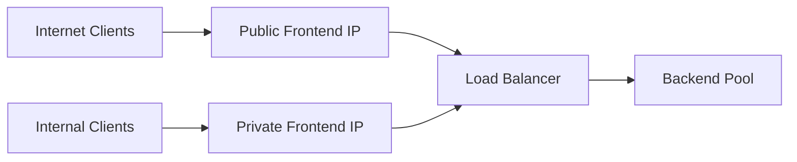
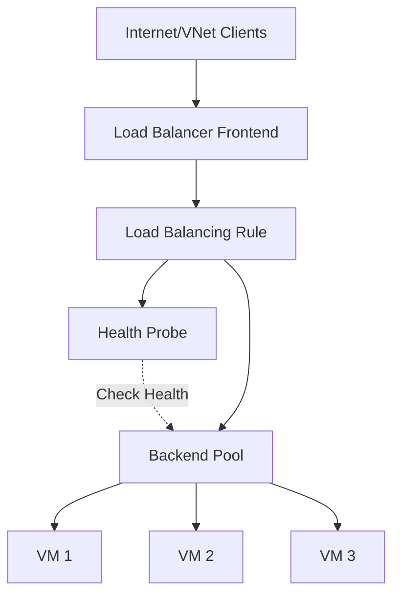
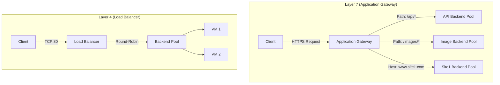
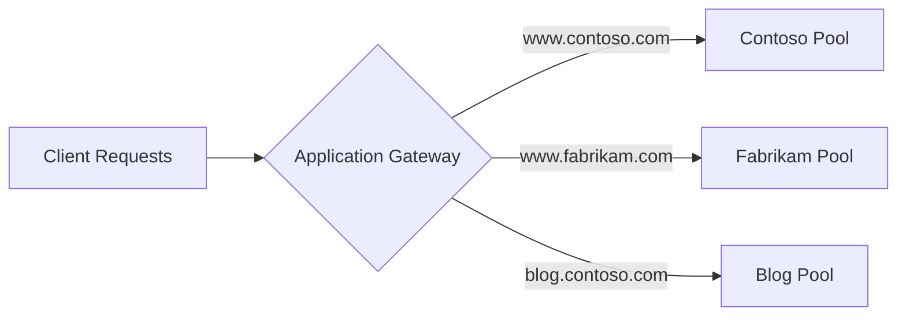
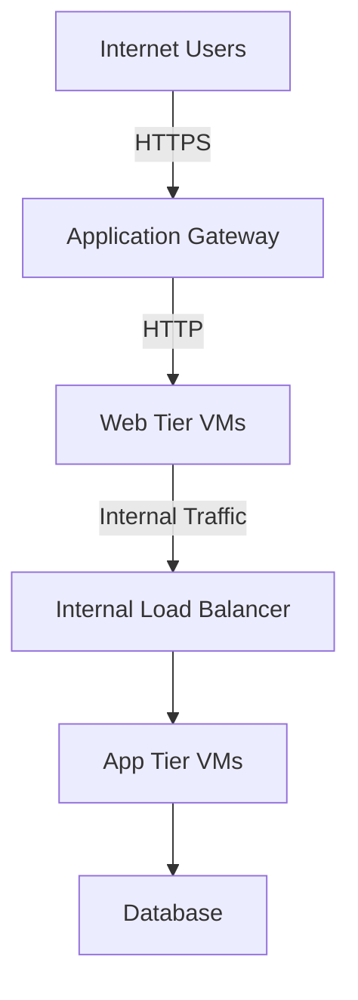
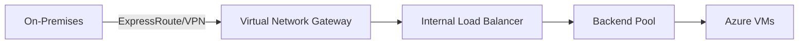

# Azure Load Balancing Services

A practical guide to diverse traffic architectures and traffic distribution beyond web applications, covering Azure Load Balancer and Application Gateway for both web and non-web workloads.

## Overview

Load balancing is the strategic distribution of inbound network traffic across a cluster of backend computing resources. The fundamental objectives are:

- Optimize resource utilization, ensuring no single server bears disproportionate workload
- Maximize throughput, increasing overall capacity to handle concurrent requests
- Minimize response latency, providing consistently performant user experience
- Enhance high availability by mitigating single points of failure

A well-orchestrated pool of commodity hardware with granular resource allocation can often exhibit superior responsiveness compared to a monolithic, high-performance single server under heavy load. This phenomenon underscores efficiency gains inherent in parallel processing and avoidance of resource contention bottlenecks.

### Core Load Balancing Concepts

**Traffic Distribution**

Azure load balancers decide how to process incoming requests based on configured load-balancing rules and health probes. When a request arrives at the load balancer's frontend, it uses the load-balancing rule to map incoming traffic to a backend pool of instances.

The load balancer distributes traffic using a hash-based algorithm considering factors like:

- Source IP address
- Destination IP address
- Source port
- Destination port
- Protocol type (TCP or UDP)

This ensures requests from the same client are consistently routed to the same backend instance, providing session persistence if needed.

**Health Monitoring**

Health probes monitor the status of backend instances. If a backend instance fails the health probe, the load balancer stops sending new requests to that instance until it becomes healthy again. This combination of rules, algorithms, and health checks ensures efficient and reliable distribution of incoming requests.

## Load Balancer Components

Load balancers have several elements that work together to ensure application high availability and performance.

### Listeners

A listener is a logical entity that checks for incoming connection requests. A listener accepts a request if the protocol, port, hostname, and IP address match the listener's configuration. You must have at least one listener.

**Listener Types**

| Type | Routing Behavior | Use Case |
| --- | --- | --- |
| Basic | Routes request based on path in URL | Simple traffic distribution |
| Multi-site | Routes using hostname element of URL | Multiple websites on same gateway |

Listeners also handle TLS/SSL certificates for securing your application between the user and Application Gateway.

### Frontend IP

The frontend IP address is the address clients use to connect to your application. A frontend IP address can be either public or private.

| IP Type | Load Balancer Type | Use Case |
| --- | --- | --- |
| Public IP | Public Load Balancer | Internet-facing applications |
| Private IP | Internal Load Balancer | Internal-only traffic within VNet |

Azure load balancers can have multiple frontend IPs, enabling complex traffic routing scenarios.



### Load Balancer Rules

A load balancer rule defines how traffic is distributed to the backend pool. The rule maps a given frontend IP and port combination to a set of backend IP addresses and port combinations.

**Traffic Management**

Traffic is managed using a hash made from the following elements:

- Source IP
- Source port
- Destination IP
- Destination port
- Protocol type (TCP or UDP)

Load Balancer allows you to load balance services on multiple ports, multiple IP addresses, or both. You can configure different load balancing rules for each frontend IP. Multiple frontend configurations are only supported with IaaS VMs.

### Backend Pool

The backend pool is a group of VMs or instances in a Virtual Machine Scale Set that responds to incoming requests. To scale cost-effectively to meet high volumes of incoming traffic, computing guidelines generally recommend adding more instances to the backend pool.

Load Balancer implements automatic reconfiguration to redistribute load across the altered number of instances when you scale instances up or down.

### Health Probes

A health probe determines the health status of instances in the backend pool. This probe determines if an instance is healthy and can receive traffic. You can define the unhealthy threshold for your health probes.

**Health Probe Behavior**

When a probe fails to respond, the load balancer stops sending new connections to the unhealthy instances. A probe failure doesn't affect existing connections. The connection continues until:

- The application ends the flow
- Idle timeout occurs
- The VM shuts down

**Probe Types**

| Protocol | Description | Use Case |
| --- | --- | --- |
| TCP | Checks for successful TCP handshake | Any TCP service |
| HTTP | Checks for HTTP 200 OK response | Web applications |
| HTTPS | Checks for HTTPS 200 OK response with SSL validation | Secure web applications |

### Session Persistence

Session persistence (also known as session affinity, source IP affinity, or client IP affinity) specifies how traffic from a client should be handled, ensuring clients only communicate with a single VM during a session.

**Session Persistence Options**

| Option | Hash Tuple | Description |
| --- | --- | --- |
| None (default) | 5-tuple | Any healthy VM can handle successive requests from a client |
| Client IP (2-tuple) | Source IP + Destination IP | Same backend instance handles requests from same client IP |
| Client IP and protocol (3-tuple) | Source IP + Destination IP + Protocol | Same backend instance handles requests from same client IP and protocol combination |

### High Availability Ports

A load balancer rule configured with protocol as "all" (UDP & TCP) and port as "0" is called a high availability (HA) port rule. This rule enables a single rule to load balance all TCP and UDP flows that arrive on all ports of an internal standard load balancer.

HA ports load-balancing rules help with critical scenarios such as high availability and scale for network virtual appliances (NVAs) inside virtual networks, or when a large number of ports must be load balanced.

### Inbound NAT Rules

You can use load balancing rules in combination with Network Address Translation (NAT) rules to enable specific port forwarding scenarios for backend instances.

### Outbound Rules

An outbound rule configures Source Network Address Translation (SNAT) for all VMs or instances identified by the backend pool. This rule enables instances in the backend to communicate (outbound) to the internet or other public endpoints.

## Azure Load Balancer

Azure Load Balancer is a high-performance, ultra-low-latency Layer 4 load-balancing service (inbound and outbound) for all UDP and TCP protocols. It distributes incoming traffic among healthy virtual machine instances using a hash-based distribution algorithm.

### Key Characteristics

- Operates at OSI Layer 4 (Transport Layer)
- Supports TCP and UDP protocols
- Built to handle millions of requests per second
- Zone-redundant, ensuring high availability across availability zones
- Can be internet-facing (public) or internal (private)
- Backend pool can be Azure IaaS VMs or instances in Virtual Machine Scale Set

### Load Balancer Types

| Type | Frontend IP | Accessibility | Use Case |
| --- | --- | --- | --- |
| Public Load Balancer | Public IP address | Internet-accessible | Public-facing applications, web servers |
| Internal Load Balancer | Private IP address | VNet-only | Internal applications, microservices, database tiers |

### Load Balancer SKUs

| SKU | Availability Zones | Health Probe Down Behavior | Backend Pool Size | HTTPS Health Probe | Multiple Frontends |
| --- | --- | --- | --- | --- | --- |
| Basic | Not available | Continues | Up to 300 instances | No | Yes, limited |
| Standard | Available | Stops traffic | Up to 1,000 instances | Yes | Yes, extensive |

**SKU Recommendation**

Standard SKU is recommended for production workloads due to:

- Availability zone support
- Better security with closed by default behavior
- Higher scale limits
- More health probe options
- Enhanced diagnostics



### Configuration Example: Internal Load Balancer

This example demonstrates creating an internal Standard SKU load balancer for TCP/UDP traffic management within Azure.

**Prerequisites**

- Azure subscription
- Resource group
- Virtual network with subnets:
  - Gateway Subnet (for Bastion)
  - Frontend Subnet (for load balancer frontend IP)
  - Backend Subnet (for backend VMs)

**Step 1: Create Virtual Network**

```bash
# Create resource group
az group create \
  --name AzureLoadBalancer \
  --location eastus

# Create virtual network
az network vnet create \
  --resource-group AzureLoadBalancer \
  --name Alaska_VNET \
  --address-prefix 10.1.0.0/16 \
  --subnet-name BackendSubnet \
  --subnet-prefix 10.1.0.0/24

# Add frontend subnet
az network vnet subnet create \
  --resource-group AzureLoadBalancer \
  --vnet-name Alaska_VNET \
  --name FrontEndSubnet \
  --address-prefix 10.1.2.0/24
```

**Step 2: Create Backend Servers**

Deploy three VMs in the same availability set for backend pool. Availability set ensures VMs are distributed across multiple physical hardware resources within Azure datacenter, increasing resilience to hardware failures and planned maintenance.

```bash
# Create availability set
az vm availability-set create \
  --resource-group AzureLoadBalancer \
  --name BackendAvailabilitySet \
  --platform-fault-domain-count 2 \
  --platform-update-domain-count 5

# Create VMs (repeat for myVM1, myVM2, myVM3)
az vm create \
  --resource-group AzureLoadBalancer \
  --name myVM1 \
  --vnet-name Alaska_VNET \
  --subnet BackendSubnet \
  --availability-set BackendAvailabilitySet \
  --image Win2019Datacenter \
  --admin-username azureuser \
  --no-wait
```

**Step 3: Create Internal Load Balancer**

```bash
# Create internal load balancer
az network lb create \
  --resource-group AzureLoadBalancer \
  --name myIntLoadBalancer \
  --sku Standard \
  --vnet-name Alaska_VNET \
  --subnet FrontEndSubnet \
  --frontend-ip-name LoadBalancerFrontEnd \
  --backend-pool-name myBackendPool
```

**Step 4: Create Health Probe**

```bash
# Create HTTP health probe
az network lb probe create \
  --resource-group AzureLoadBalancer \
  --lb-name myIntLoadBalancer \
  --name myHealthProbe \
  --protocol http \
  --port 80 \
  --path / \
  --interval 15
```

**Step 5: Create Load Balancing Rule**

```bash
# Create load balancing rule
az network lb rule create \
  --resource-group AzureLoadBalancer \
  --lb-name myIntLoadBalancer \
  --name myHTTPRule \
  --protocol tcp \
  --frontend-port 80 \
  --backend-port 80 \
  --frontend-ip-name LoadBalancerFrontEnd \
  --backend-pool-name myBackendPool \
  --probe-name myHealthProbe
```

**Step 6: Add VMs to Backend Pool**

```bash
# Get NIC IDs
VM1_NIC=$(az vm show --resource-group AzureLoadBalancer --name myVM1 --query 'networkProfile.networkInterfaces[0].id' -o tsv)
VM2_NIC=$(az vm show --resource-group AzureLoadBalancer --name myVM2 --query 'networkProfile.networkInterfaces[0].id' -o tsv)
VM3_NIC=$(az vm show --resource-group AzureLoadBalancer --name myVM3 --query 'networkProfile.networkInterfaces[0].id' -o tsv)

# Add NICs to backend pool
az network nic ip-config address-pool add \
  --resource-group AzureLoadBalancer \
  --nic-name $(basename $VM1_NIC) \
  --ip-config-name ipconfig1 \
  --lb-name myIntLoadBalancer \
  --address-pool myBackendPool
```

## Azure Application Gateway

Azure Application Gateway provides Application Delivery Controller (ADC) as a service, offering various Layer 7 load-balancing capabilities. It operates at the application layer (OSI Layer 7), making routing decisions based on HTTP/HTTPS attributes.

### Key Features

- Support for HTTP, HTTPS, HTTP/2, and WebSocket protocols
- Web Application Firewall (WAF) to protect against vulnerabilities
- End-to-end request encryption with SSL/TLS termination and re-encryption
- Autoscaling to dynamically adjust capacity as web traffic load changes
- Connection draining for graceful removal of backend pool members
- Session stickiness (cookie-based affinity)
- URL path-based and multi-site routing
- Custom error pages
- HTTP header rewrite capabilities

### Application Gateway vs. Load Balancer

| Feature | Application Gateway | Load Balancer |
| --- | --- | --- |
| OSI Layer | Layer 7 (Application) | Layer 4 (Transport) |
| Protocols | HTTP, HTTPS, WebSocket | TCP, UDP |
| Routing | URL path, hostname, headers | IP and port |
| SSL Termination | Yes | No |
| Web Application Firewall | Yes | No |
| Cookie-based Affinity | Yes | Source IP affinity only |
| Use Case | Web applications | Any TCP/UDP service |



### Application Gateway Components

**Backend Pools**

Collection of backend targets (Azure VMs, Virtual Machine Scale Sets, Azure App Service, on-premises servers, or public IP addresses).

**HTTP Settings**

Define parameters for how Application Gateway connects to backend servers:

- Port and protocol (HTTP/HTTPS)
- Cookie-based affinity
- Request timeout
- Connection draining
- Custom health probe settings

**Routing Rules**

A routing rule is a key component that determines how to route traffic on the listener. The rule binds the listener, the backend server pool, and the backend HTTP settings.

### Routing Methods

Azure Application Gateway has two primary methods of routing client requests:

#### Path-Based Routing (URL-Based Routing)

Sends requests with different URL paths to different pools of backend servers.

**Example Configuration**

| URL Path | Backend Pool |
| --- | --- |
| `/images/*` | Image servers |
| `/video/*` | Video servers |
| `/api/*` | API servers |
| `/*` (default) | Web servers |

```bash
# Create path-based routing rule
az network application-gateway url-path-map create \
  --resource-group AzureResourceGroup \
  --gateway-name AzureAppGateway \
  --name urlPathMap \
  --paths /images/* \
  --address-pool imagePool \
  --default-address-pool defaultPool \
  --http-settings httpSettings
```

#### Multi-Site Routing

Configures more than one web application on the same Application Gateway instance. In a multi-site configuration, you register multiple DNS names (CNAMEs) for the IP address of the application gateway, specifying the name of each site.

**Example Configuration**

| Hostname | Backend Pool |
| --- | --- |
| `www.contoso.com` | Contoso backend pool |
| `www.fabrikam.com` | Fabrikam backend pool |
| `blog.contoso.com` | Blog backend pool |



### Additional Routing Capabilities

**Redirection**

Can redirect traffic to another site or from HTTP to HTTPS. Common use case: redirecting HTTP requests to secure HTTPS shopping site.

```bash
# Create redirection configuration
az network application-gateway redirect-config create \
  --resource-group AzureResourceGroup \
  --gateway-name AzureAppGateway \
  --name httpToHttps \
  --type Permanent \
  --target-listener httpsListener \
  --include-path true \
  --include-query-string true
```

**HTTP Header Rewrite**

HTTP headers allow client and server to pass additional information with the request or response. Rewriting headers enables important scenarios like:

- Adding security headers (X-XSS-Protection, Strict-Transport-Security)
- Removing response headers that reveal sensitive information
- Modifying location headers for proper redirection

**Custom Error Pages**

Application Gateway allows you to create custom error pages instead of displaying default error pages. You can use your own branding and layout using custom error page.

### Application Gateway Configuration Example

**Step 1: Create Application Gateway**

```bash
# Create public IP
az network public-ip create \
  --resource-group AzureResourceGroup \
  --name FRONTENDIP \
  --sku Standard \
  --location eastus

# Create application gateway
az network application-gateway create \
  --resource-group AzureResourceGroup \
  --name AzureAppGateway \
  --location eastus \
  --vnet-name AlaskaVNet \
  --subnet AGSubnet \
  --capacity 2 \
  --sku Standard_v2 \
  --public-ip-address FRONTENDIP \
  --priority 100
```

**Step 2: Create Backend Pool**

```bash
# Create empty backend pool
az network application-gateway address-pool create \
  --resource-group AzureResourceGroup \
  --gateway-name AzureAppGateway \
  --name BackendPool
```

**Step 3: Create HTTP Settings**

```bash
# Create backend HTTP settings
az network application-gateway http-settings create \
  --resource-group AzureResourceGroup \
  --gateway-name AzureAppGateway \
  --name HTTPSetting \
  --port 80 \
  --protocol Http \
  --cookie-based-affinity Disabled \
  --timeout 30
```

**Step 4: Create Listener and Routing Rule**

```bash
# Create listener
az network application-gateway http-listener create \
  --resource-group AzureResourceGroup \
  --gateway-name AzureAppGateway \
  --name Listener \
  --frontend-port appGatewayFrontendPort \
  --frontend-ip appGatewayFrontendIP

# Create routing rule
az network application-gateway rule create \
  --resource-group AzureResourceGroup \
  --gateway-name AzureAppGateway \
  --name RoutingRule \
  --http-listener Listener \
  --rule-type Basic \
  --address-pool BackendPool \
  --http-settings HTTPSetting \
  --priority 100
```

**Step 5: Add Backend Servers**

```bash
# Add VMs to backend pool
az network application-gateway address-pool update \
  --resource-group AzureResourceGroup \
  --gateway-name AzureAppGateway \
  --name BackendPool \
  --servers <VM1-IP> <VM2-IP>
```

## Web Application Firewall (WAF)

Application Gateway includes Web Application Firewall capabilities to protect web applications from common vulnerabilities.

### WAF Features

**OWASP Core Rule Set (CRS)**

The WAF SKU integrates with OWASP Core Rule Set to protect against:

- SQL injection
- Cross-site scripting (XSS)
- Command injection
- HTTP protocol violations
- HTTP request smuggling
- Remote file inclusion
- Bots, crawlers, and scanners

**Custom Rules**

Create custom WAF rules to block or allow traffic based on:

- IP addresses (allow/block lists)
- Geographic location (geo-filtering)
- HTTP headers
- Request attributes
- Rate limiting (DDoS protection)

**Detection and Prevention Modes**

| Mode | Behavior | Use Case |
| --- | --- | --- |
| Detection | Logs threats but allows traffic | Testing, monitoring, tuning rules |
| Prevention | Blocks malicious traffic | Production protection |

### WAF Configuration

```bash
# Create Application Gateway with WAF
az network application-gateway create \
  --resource-group AzureResourceGroup \
  --name AzureAppGateway \
  --sku WAF_v2 \
  --capacity 2 \
  --vnet-name AlaskaVNet \
  --subnet AGSubnet \
  --public-ip-address FRONTENDIP

# Configure WAF policy
az network application-gateway waf-config set \
  --resource-group AzureResourceGroup \
  --gateway-name AzureAppGateway \
  --enabled true \
  --firewall-mode Prevention \
  --rule-set-version 3.2
```

## When to Use Each Service

### Use Azure Load Balancer When

**Non-HTTP/HTTPS Applications**

Need to balance TCP or UDP traffic for applications like gaming servers, VPN termination, or custom protocols.

Example: Distributing incoming RDP (TCP 3389) traffic across multiple jump box VMs.

**Internal Load Balancing**

Need to distribute traffic within your virtual network, for example, between different tiers of a multi-tier application.

Example: Balancing traffic from web servers (frontend) to application servers (middle-tier) in private network.

**High-Performance Layer 4 Load Balancing**

Scenarios where minimal latency and high throughput at transport layer are critical, and application-layer features are not required.

Example: Providing high availability for cluster of Redis cache servers.

**Simple Load Distribution**

Just need basic load distribution without complex routing or WAF capabilities.

Example: Load balancing financial application using proprietary TCP protocol.

### Use Azure Application Gateway When

**Web Applications (HTTP/HTTPS)**

Any public-facing or internal web application that uses HTTP or HTTPS.

Example: Hosting WordPress website across multiple backend VMs with SSL offloading and WAF protection.

**SSL/TLS Offloading**

Want to offload CPU-intensive task of SSL decryption from backend web servers.

Example: E-commerce site where all client-side traffic is HTTPS, but backend servers only handle HTTP traffic.

**Web Application Firewall Requirements**

Need to protect web applications from common web-based attacks.

Example: Critical business application requiring protection against SQL injection, XSS, and OWASP Top 10 vulnerabilities.

**URL-Based Routing**

Need to direct requests to different backend pools based on URL path or host header.

Example: Routing `www.mycompany.com/blog` to one set of servers and `www.mycompany.com/store` to another.

Example: Managing traffic for suite of RESTful APIs, routing `/api/users` vs. `/api/products` to different microservices.

**Multi-Site Hosting**

Want to host multiple web applications (with different domain names) on same Application Gateway instance.

Example: Hosting `www.siteA.com` and `www.siteB.com` on same Application Gateway, each directing to distinct backend pool.

**Session Affinity**

Need to ensure requests from particular user always go to same backend server (cookie-based).

Example: Shopping cart application where user's session state is tied to specific backend server.

## Service Comparison Matrix

| Feature | Azure Load Balancer | Azure Application Gateway |
| --- | --- | --- |
| OSI Layer | Layer 4 (Transport) | Layer 7 (Application) |
| Protocols | TCP, UDP | HTTP, HTTPS, HTTP/2, WebSocket |
| Routing Logic | IP hash (5-tuple) | URL path, hostname, headers |
| SSL Termination | No | Yes |
| SSL Re-encryption | No | Yes (end-to-end) |
| Web Application Firewall | No | Yes |
| Session Persistence | Source IP affinity | Cookie-based affinity |
| Health Probes | TCP, HTTP, HTTPS | HTTP, HTTPS with custom paths |
| Autoscaling | No (manual scaling) | Yes |
| Price Model | Per rule + data processed | Per instance + capacity units |
| Regional Scope | Yes | Yes |
| Zone Redundancy | Yes (Standard SKU) | Yes (v2 SKU) |
| Best For | Any TCP/UDP service | Web applications |

## Architecture Patterns

### Pattern 1: Public Web Application with Internal Load Balancer

Use Application Gateway for internet-facing traffic with Internal Load Balancer distributing traffic to internal application tier.



### Pattern 2: Hybrid Connectivity with Load Balancing

Combine ExpressRoute or VPN Gateway with Internal Load Balancer for hybrid scenarios.



### Pattern 3: Multi-Region with Traffic Manager

Use Azure Traffic Manager for global load balancing across regional Application Gateways.

<!-- TODO: Complex diagram - requires detailed Mermaid conversion -->
Traffic Manager provides DNS-level routing to regional Application Gateways, which then distribute traffic to regional backend pools.

For hybrid connectivity options, see [Azure VPN Gateway Configuration](./Azure_VPN_Gateway_Configuration.md) and [Azure ExpressRoute Deep Dive](./Azure_ExpressRoute_Deep_Dive.md).

## Best Practices

### Design Principles

1. **Choose appropriate service** - Layer 4 for TCP/UDP, Layer 7 for HTTP/HTTPS
2. **Implement health probes** - Monitor backend health accurately
3. **Plan for scalability** - Use autoscaling where available, design backend pools for growth
4. **Enable diagnostics** - Monitor metrics, logs, and alerts
5. **Implement redundancy** - Use availability zones and multiple instances

### Security

1. **Use Standard SKU** - Closed by default, better security posture
2. **Apply Network Security Groups** - Control traffic to backend instances
3. **Enable WAF for web applications** - Protect against OWASP Top 10
4. **Implement SSL/TLS properly** - Use strong cipher suites, keep certificates updated
5. **Monitor security logs** - Review WAF logs and security events

### Performance

1. **Right-size backend pool** - Balance cost and performance requirements
2. **Configure appropriate timeouts** - Adjust based on application characteristics
3. **Use connection draining** - Gracefully remove instances from service
4. **Monitor latency and throughput** - Set alerts for performance degradation
5. **Consider FastPath** - For ExpressRoute scenarios requiring lowest latency

### Operations

1. **Document configuration** - Maintain records of rules, pools, and health probes
2. **Implement Infrastructure as Code** - Use ARM templates, Bicep, or Terraform
3. **Test failover scenarios** - Verify redundancy works as expected
4. **Plan maintenance windows** - Schedule updates during low-traffic periods
5. **Monitor costs** - Track usage and optimize resource allocation

## Troubleshooting

### Common Issues

| Issue | Possible Cause | Resolution |
| --- | --- | --- |
| Backend unhealthy | Health probe configuration incorrect | Verify probe path, port, interval settings |
| 502 Bad Gateway | Backend servers not responding | Check backend application, firewall rules, NSGs |
| SSL certificate errors | Certificate expired or misconfigured | Update certificate, verify certificate chain |
| Connection timeout | Backend server slow or overloaded | Check backend performance, scale out instances |
| WAF blocking legitimate traffic | Rule too restrictive | Review WAF logs, tune rules, add exclusions |

### Diagnostic Commands

```bash
# Check Load Balancer backend health
az network lb show \
  --resource-group <resource-group-name> \
  --name <load-balancer-name> \
  --query "backendAddressPools[].backendIPConfigurations[].id"

# Check Application Gateway backend health
az network application-gateway show-backend-health \
  --resource-group <resource-group-name> \
  --name <app-gateway-name>

# View Application Gateway metrics
az monitor metrics list \
  --resource <app-gateway-resource-id> \
  --metric "HealthyHostCount" \
  --start-time 2024-01-01T00:00:00Z \
  --end-time 2024-01-02T00:00:00Z
```

## Cross-References

- For hybrid connectivity options, see [Azure VPN Gateway Configuration](./Azure_VPN_Gateway_Configuration.md)
- For private dedicated connectivity, see [Azure ExpressRoute Deep Dive](./Azure_ExpressRoute_Deep_Dive.md)
- For DNS-based load balancing and health probe configuration, see [Azure Private DNS Configuration](./Azure_Private_DNS_Configuration.md)
- For AWS load balancing comparison, see [AWS EC2 Web Server Setup](./AWS_EC2_Web_Server_Setup.md)
- For comprehensive Azure networking architecture, see [CloudEngineering.md](./CloudEngineering.md)

## References

- [Azure Load Balancer Documentation](https://docs.microsoft.com/azure/load-balancer/)
- [Azure Application Gateway Documentation](https://docs.microsoft.com/azure/application-gateway/)
- [Web Application Firewall Documentation](https://docs.microsoft.com/azure/web-application-firewall/)
- [Load Balancer SKU comparison](https://docs.microsoft.com/azure/load-balancer/skus)
- [Application Gateway features](https://docs.microsoft.com/azure/application-gateway/features)
