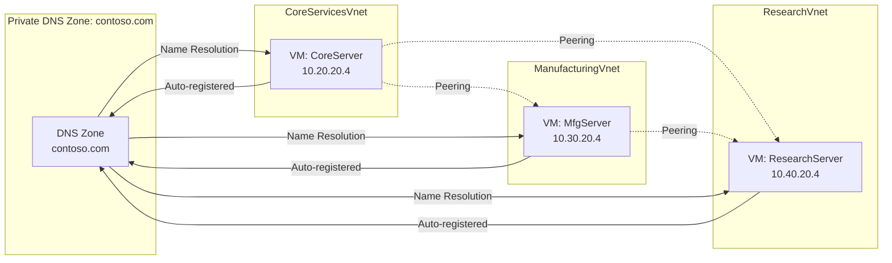
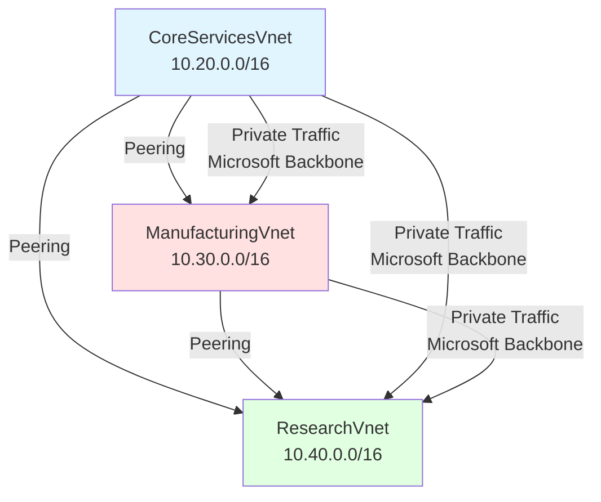
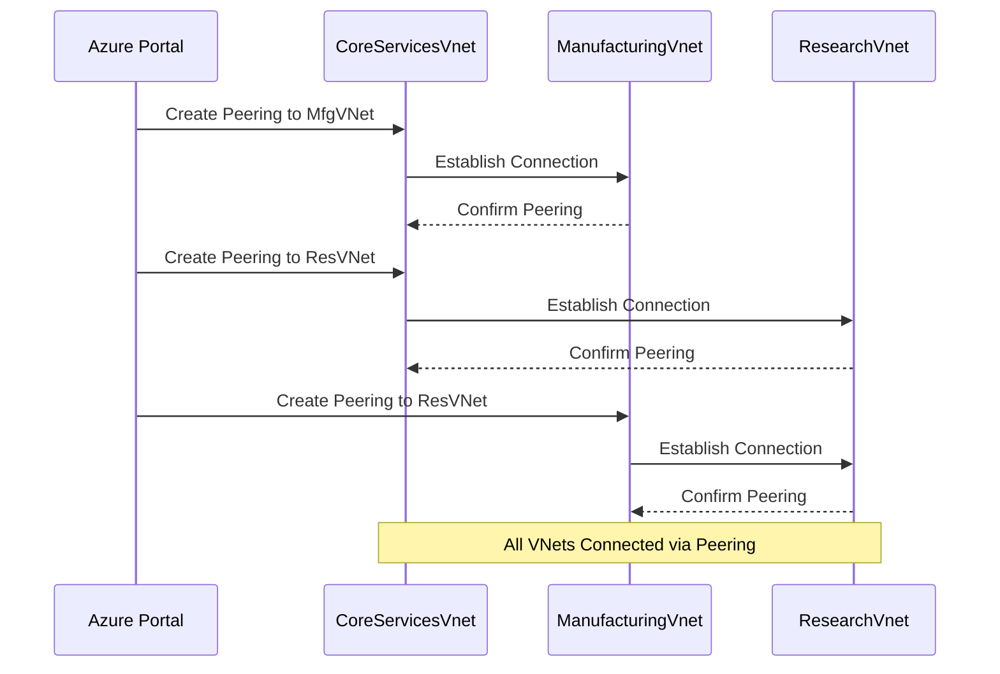
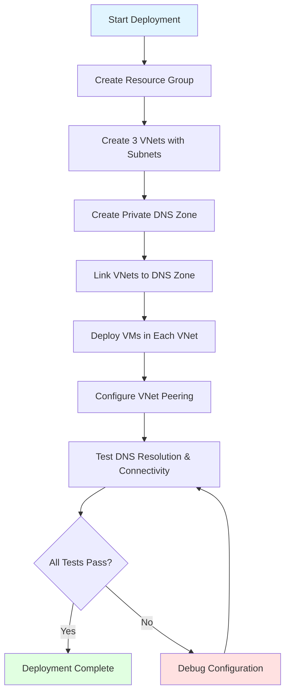

# Azure Private DNS: Implementing Secure Cross-VNet Connectivity

## Overview

Azure Private DNS provides a secure and scalable way to manage domain names for virtual machines (VMs) and other resources within Azure, without needing to deploy custom DNS servers. This guide demonstrates how to set up Azure Private DNS for name resolution across multiple Virtual Networks (VNets), enabling secure cross-VNet communication for enterprise scenarios.

**Key Use Cases:**
- Secure name resolution across multiple VNets without custom DNS infrastructure
- Split-horizon DNS scenarios (private and public zones sharing the same name)
- Cross-subscription and cross-tenant DNS resolution
- Hybrid cloud DNS integration with on-premises networks

This lab is structured around Microsoft Learn content and demonstrates the fictional organization Contoso Ltd migrating infrastructure to Azure.

---

## Prerequisites

Before implementing Azure Private DNS, ensure you have:

- **Azure subscription** with appropriate permissions
- **Azure PowerShell** installed and configured
- **Familiarity with Azure Virtual Networks** (address spaces, subnets, peering)
- **Understanding of DNS fundamentals** (A records, zone delegation, name resolution)
- **RDP client** for VM connectivity testing

---

## Architecture Overview

Azure Private DNS enables cross-VNet name resolution through Virtual Network Links with auto-registration. When combined with VNet peering, resources across separate virtual networks can resolve each other's names using private DNS zones.



**Architecture Components:**
- **Private DNS Zone**: Acts as centralized name resolution service (contoso.com)
- **Virtual Network Links**: Connect VNets to the DNS zone with auto-registration enabled
- **VNet Peering**: Establishes network connectivity between VNets
- **Virtual Machines**: Automatically registered in DNS zone upon deployment

---

## Module 1: Virtual Network Design and Implementation

### Planning Virtual Networks

Consider the fictional organization Contoso Ltd, which is migrating infrastructure and applications to Azure. As a network engineer, you must plan and implement three virtual networks and subnets to support resources.

**Key Concepts:**
- **Azure Virtual Network**: Fundamental building block for private networks in Azure. Enables Azure resources to securely communicate with each other, the internet, and on-premises networks.
- **Non-overlapping Address Spaces**: Ensure virtual network address space (CIDR block) doesn't overlap with organization's other network ranges.
- **Subnets**: Enable segmentation of virtual networks into one or more subnetworks, allocating a portion of the virtual network's address space to each subnet.
- **Address Space Reservation**: Plan ahead and reserve address space for future growth. Subnets shouldn't cover the entire address space of the virtual network.

### Task 1: Create the Contoso Resource Group

Use Azure PowerShell to create a resource group. This command creates a container for all resources used in this lab.

```bash
New-AzResourceGroup -Name Contoso -Location <YourAzureRegion>
```

**Verification in Azure Portal:**
1. Go to the Azure portal
2. Search for "Resource groups"
3. Click on "Resource groups"
4. Confirm that "Contoso" is in the list

### Task 2-4: Create Virtual Networks and Subnets

The Bicep template handles creation of three VNets with corresponding subnets:

| Virtual Network | Address Space | Subnet Name | Subnet Range | Purpose |
|----------------|---------------|-------------|--------------|---------|
| CoreServicesVnet | 10.20.0.0/16 | CoreServicesSubnet | 10.20.20.0/24 | Core infrastructure services |
| ManufacturingVnet | 10.30.0.0/16 | ManufacturingSubnet | 10.30.20.0/24 | Manufacturing department resources |
| ResearchVnet | 10.40.0.0/16 | ResearchSubnet | 10.40.20.0/24 | Research department resources |

### Task 5: Verify Creation of VNets and Subnets

**Verification in Azure Portal:**
1. Go to the Azure portal
2. Search for "Virtual networks"
3. Click on "Virtual networks"
4. Confirm that "CoreServicesVnet", "ManufacturingVnet", and "ResearchVnet" are in the list
5. Click on each VNet to verify the subnets:
   - CoreServicesVnet should have subnets: "CoreServicesSubnet"
   - ManufacturingVnet should have subnets: "ManufacturingSubnet"
   - ResearchVnet should have subnets: "ResearchSubnet"

---

## Module 2: DNS Configuration in Azure

### Azure DNS Concepts

This module focuses on configuring the Private DNS Zone for Contoso Ltd. You will create a private DNS zone named contoso.com, link the VNets for registration and resolution, and then create virtual machines to test the configuration.

**Key Concepts:**
- **Azure DNS**: Cloud service that allows you to host and manage domain name system (DNS) domains, also known as DNS zones.
- **Azure DNS Public Zones**: Host domain name zone data for records intended to be resolved by any host on the internet.
- **Azure Private DNS Zones**: Allow you to configure a private DNS zone namespace for private Azure resources.
- **DNS Zone**: Collection of DNS records. DNS records provide information about the domain.

### Task 1: Create a Private DNS Zone

The Bicep template automates Private DNS Zone creation.

**Verification in Azure Portal:**
1. Go to the Azure portal
2. Search for "Private DNS zones"
3. Click on "Private DNS zones"
4. Confirm that the private DNS zone (e.g., "contoso.com") is in the list
5. Click on the private DNS zone to view its properties
6. Verify the Name servers are listed

### Task 2: Link Subnet for Auto Registration

The Bicep template links the subnets to the Private DNS Zone, enabling automatic registration of VMs in those subnets.

**Understanding Virtual Network Links:**

When you link a VNet to your private DNS Zone (think of it as a local organization phonebook), you're telling the VNet's resources to use this private zone for name resolution. If multiple VNets are linked to the same private DNS Zone, it's like giving all those separate network spaces the same custom phonebook. This allows VMs in different VNets to find each other using the names in your private DNS Zone.

**Verification in Azure Portal:**
1. In the Private DNS zone, go to "Virtual network links"
2. Confirm that the virtual networks (CoreServicesVnet, ManufacturingVnet, and ResearchVnet) and their corresponding subnets are listed and linked
3. Check the "Auto registration" column to ensure it is enabled

**Virtual Network Link Configuration:**

| VNet Name | Registration Enabled | Resolution Enabled | Purpose |
|-----------|---------------------|-------------------|---------|
| CoreServicesVnet | Yes | Yes | Auto-register core VMs, resolve all DNS queries |
| ManufacturingVnet | Yes | Yes | Auto-register manufacturing VMs, resolve all DNS queries |
| ResearchVnet | Yes | Yes | Auto-register research VMs, resolve all DNS queries |

### Task 3: Create Virtual Machines to Test Configuration

The Bicep template creates VMs in each subnet. These VMs are automatically registered in the Private DNS Zone with A records.

**Expected DNS Records:**

| DNS Record | Type | IP Address | Auto-Registered |
|-----------|------|------------|----------------|
| CoreServer.contoso.com | A | 10.20.20.4 | Yes |
| MfgServer.contoso.com | A | 10.30.20.4 | Yes |
| ResearchServer.contoso.com | A | 10.40.20.4 | Yes |

---

## Module 3: Virtual Network Peering

### Understanding VNet Peering

Virtual network peering enables you to seamlessly connect two Azure virtual networks. The virtual networks appear as one for connectivity purposes. Azure supports connecting virtual networks within the same Azure region and across Azure regions (global).



**Key Benefits:**
- **Low Latency, High Bandwidth**: Connection between resources in different VNets uses Microsoft backbone infrastructure
- **Network Security Groups**: Apply NSGs in either VNet to block access to other VNets or subnets
- **Cross-Subscription and Cross-Tenant**: Transfer data between VNets across Azure subscriptions, Entra Tenants, deployment models, and regions
- **Resource Manager to Classic**: Peer a VNet created through Resource Manager to one created through classic deployment
- **No Downtime**: Zero downtime to resources in other VNets when creating or after creating peering

**Traffic Routing:**
- Traffic between peered VNets is **private**
- Not routed through the public internet
- Not routed through a gateway
- Optimal network performance

### Enhanced Security with NAT Gateway

Enhance security by not providing default outbound access. Therefore, to enable connectivity for VMs within this subnet, it's necessary to explicitly grant outbound access. A NAT Gateway is the recommended way to provide connectivity for virtual machines in the subnet "Subnets without public IP Address".

### Enable Cross-Virtual Network Connectivity with Peering

Allows you to connect separate VNets with optimal network performance, whether they are in the same region [Regional VNet peering] or in different regions [Global VNet peering].

**Peering Types:**

| Peering Type | Use Case | Latency | Cost |
|-------------|----------|---------|------|
| Regional VNet Peering | Same Azure region | Very low | Lower |
| Global VNet Peering | Different Azure regions | Low | Higher |

### Azure Private DNS Domains

**AZURE DNS** - A hosting service for DNS domains, providing name resolution using AZURE infrastructure. Supports private DNS domains. In addition to internet-facing public domains, AZURE supports private DNS Domains used locally within Azure.

**Private DNS Features:**
- Resolves domain names in a virtual network without the need to add a custom DNS solution
- Private DNS Zones allow you to use your own custom domain names rather than the Azure-provided names
- Provides name resolution for VMs within a virtual network and between virtual networks
- Configure zone names with a split-horizon view - allowing a private & public DNS zone to share the same name
- VNet is used to store & organize information about various elements of your cloud

### Task 1: Create a Virtual Machine to Test Configuration

The Bicep template creates VMs in each VNet for testing connectivity and DNS resolution.

### Task 2: Connect to Test VMs Using RDP

Use Remote Desktop Protocol (RDP) to connect to the VMs.

**RDP Connection Steps:**
1. In the Azure portal, go to the Virtual Machine
2. Click "Connect"
3. Select "RDP"
4. Download the RDP file
5. Use the downloaded RDP file and the username/password you provided during VM creation to connect

### Task 3: Test Initial Connection Between VMs

**Important Note:** Before configuring VNet peering, you might find that pinging a host in one VNet from a host in another VNet fails due to firewall restrictions. This highlights a key benefit of VNet peering.

### Task 4: Create VNet Peerings

The Bicep template creates the VNet peerings between all three VNets.

**Verification in Azure Portal:**
1. Go to the Azure portal
2. Search for "Virtual networks"
3. Click on "Virtual networks"
4. Click on "CoreServicesVnet"
5. Go to "Peerings"
6. Confirm that a peering exists with "ManufacturingVnet" and that the peering status is "Connected"
7. Repeat the process for "ManufacturingVnet" to confirm the reciprocal peering

**Peering Configuration:**



### Task 5: Test Connection Between VMs After Peering

Once the deployment is complete, verify that DNS resolution and network connectivity are working correctly.

**When you link a VNet to your private DNS Zone (local organization phonebook), it tells the VNet's resources to use this private zone for name resolution. If multiple VNets were linked to the same private DNS Zone, it's like giving all those separate network spaces the same custom phonebook; this allows VMs in different VNets to find each other using the names in your private DNS Zone.**

---

## Verification and Testing

### Verify DNS Records in Private DNS Zone

Check the Azure portal to confirm that the DNS records for the VMs have been created in the Private DNS Zone.

**Verification Steps:**
1. In the Private DNS zone, go to "Overview"
2. Confirm that the expected DNS records (A records) for your VMs are present
3. The names should match the VM names

**Expected A Records:**

| Name | Type | TTL | IP Address |
|------|------|-----|------------|
| CoreServer | A | 3600 | 10.20.20.4 |
| MfgServer | A | 3600 | 10.30.20.4 |
| ResearchServer | A | 3600 | 10.40.20.4 |

### RDP Into Deployed VMs to Perform nslookup

1. Use Remote Desktop Protocol (RDP) to connect to one of the VMs
2. Open Command Prompt
3. Use the nslookup command to query the DNS records of the other VM

**Example nslookup Command:**

```bash
nslookup MfgServer.contoso.com
```

**Expected Output:**

```text
Server:  UnKnown
Address:  168.63.129.16

Non-authoritative answer:
Name:    MfgServer.contoso.com
Address:  10.30.20.4
```

This confirms that the private DNS zone is correctly resolving the VM names to their IP addresses.

### Test VM-to-VM Connectivity

From one VM, ping the private IP address or DNS name of another VM.

**PowerShell Test-NetConnection Example:**

```bash
Test-NetConnection 10.30.20.4 -port 3389
```

**Expected Output:**

```text
ComputerName     : 10.30.20.4
RemoteAddress    : 10.30.20.4
RemotePort       : 3389
InterfaceAlias   : Ethernet
SourceAddress    : 10.20.20.4
TcpTestSucceeded : True
```

**Ping Test Example:**

```bash
ping MfgServer.contoso.com
```

**Expected Output:**

```text
Pinging MfgServer.contoso.com [10.30.20.4] with 32 bytes of data:
Reply from 10.30.20.4: bytes=32 time<1ms TTL=128
Reply from 10.30.20.4: bytes=32 time<1ms TTL=128
Reply from 10.30.20.4: bytes=32 time<1ms TTL=128
Reply from 10.30.20.4: bytes=32 time<1ms TTL=128

Ping statistics for 10.30.20.4:
    Packets: Sent = 4, Received = 4, Lost = 0 (0% loss),
Approximate round trip times in milli-seconds:
    Minimum = 0ms, Maximum = 0ms, Average = 0ms
```

**Crucially, after successfully configuring VNet peering, this ping should now succeed. This demonstrates that VNet peering has correctly configured the network to allow traffic to flow between the two VNets.**

---

## Deployment Workflow Summary



---

## Best Practices

### DNS Configuration
- **Use Custom Domain Names**: Leverage Private DNS zones for custom domain names instead of Azure-provided names (*.internal.cloudapp.net)
- **Enable Auto-Registration**: Enable auto-registration on VNet links to automatically manage DNS records for VMs
- **Split-Horizon DNS**: Configure split-horizon view when you need both private and public DNS zones to share the same name
- **DNS Zone Naming**: Use organizational naming conventions that align with on-premises DNS hierarchy

### Virtual Network Planning
- **Non-Overlapping Address Spaces**: Always ensure VNet address spaces don't overlap with other networks (on-premises, other Azure VNets)
- **Reserve Address Space**: Don't allocate 100% of VNet address space to subnets; reserve space for future growth
- **Subnet Sizing**: Plan subnet sizes based on expected resource growth (consider doubling expected requirements)
- **Network Segmentation**: Use separate subnets for different tiers (web, app, database) or departments

### VNet Peering
- **Bidirectional Configuration**: Always configure peering in both directions (reciprocal peering)
- **Gateway Transit**: Plan for gateway transit if you need to connect to on-premises networks via ExpressRoute or VPN Gateway
- **Service Chaining**: Be cautious with service chaining; VNet peering is not transitive by default
- **Network Security**: Apply Network Security Groups (NSGs) at subnet level to control traffic between peered VNets

### Security
- **NAT Gateway**: Use NAT Gateway for outbound connectivity instead of public IP addresses on VMs
- **Network Security Groups**: Apply NSGs to control inbound and outbound traffic
- **Azure Firewall**: Consider Azure Firewall for centralized network security policy enforcement
- **Private Endpoints**: Use Private Endpoints for PaaS services to keep traffic on Azure backbone

### Monitoring and Management
- **Azure Monitor**: Enable Azure Monitor for VNets to track metrics and diagnostics
- **Network Watcher**: Use Network Watcher for connectivity troubleshooting
- **Resource Tagging**: Tag all resources with department, cost center, environment for better management
- **Automation**: Use Infrastructure as Code (Bicep, ARM, Terraform) for repeatable deployments

---

## Related Azure Networking Topics

This Azure Private DNS configuration integrates with other Azure networking services:

- **[Azure VPN Gateway](./Azure_VPN_Gateway_Configuration.md)**: For hybrid DNS scenarios requiring on-premises to Azure name resolution via Site-to-Site VPN connections
- **[Azure ExpressRoute](./Azure_ExpressRoute_Deep_Dive.md)**: For private DNS resolution over ExpressRoute private peering connections to on-premises networks
- **[Azure Load Balancer](./Azure_Load_Balancing_Services.md)**: For DNS-based load balancing scenarios and health probe configuration with custom DNS names

**Cross-Reference Scenarios:**
- **Hybrid DNS with VPN Gateway**: Combine Private DNS with [Azure VPN Gateway](./Azure_VPN_Gateway_Configuration.md) for bidirectional DNS resolution between Azure and on-premises
- **ExpressRoute DNS Forwarding**: Use [Azure ExpressRoute](./Azure_ExpressRoute_Deep_Dive.md) with Private DNS for low-latency name resolution in hybrid environments
- **DNS-Based Load Balancing**: Integrate Private DNS with [Azure Load Balancer](./Azure_Load_Balancing_Services.md) for custom domain-based health probes

---

## Additional Resources

For more comprehensive information, check the following Microsoft Learn resources:

- [Design an IP addressing schema for your Azure deployment](https://learn.microsoft.com/training/modules/design-ip-addressing-for-azure/)
- [Introduction to Azure Virtual Networks](https://learn.microsoft.com/training/modules/introduction-to-azure-virtual-networks/)
- [Distribute your services across Azure virtual networks and integrate them by using virtual network peering](https://learn.microsoft.com/training/modules/integrate-vnets-with-vnet-peering/)
- [Introduction to Azure DNS](https://learn.microsoft.com/training/modules/intro-to-azure-dns/)
- [Host your domain on Azure DNS](https://learn.microsoft.com/training/modules/host-domain-azure-dns/)

**Note:** Remember to remove any newly created Azure resources that you no longer use. Removing unused resources ensures you will not see unexpected charges.

---

## Conclusion

By following these steps, you've successfully set up Azure Private DNS for cross-VNet name resolution. This provides a secure and efficient way for your VMs and services in different VNets to communicate with each other. Azure Private DNS simplifies network management and eliminates the need for manual DNS configuration or custom DNS servers. The Bicep template automates much of the deployment, and the Azure portal provides a user-friendly way to verify the configuration and troubleshoot any issues. The importance of VNet peering in enabling this cross-VNet communication is clearly demonstrated by the change in ping behavior before and after its configuration.
