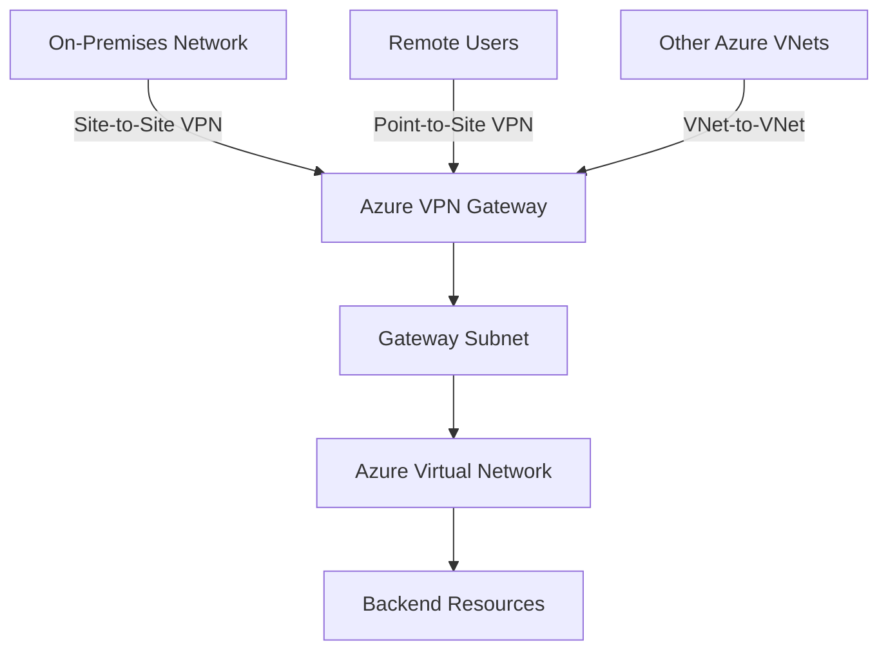
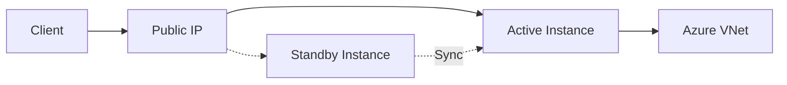
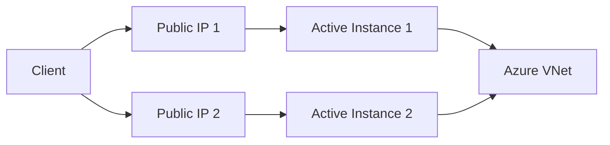

# Azure VPN Gateway Configuration

A deep dive into Azure VPN Gateway, exploring its core components, capabilities, and the process of configuring secure hybrid connectivity between on-premises and Azure networks.

## Overview

Azure VPN Gateway is a specific type of Azure Virtual Network Gateway deployed within an Azure Virtual Network. Its fundamental purpose is to facilitate secure, encrypted communication between your Azure VNet and various external locations over the public internet.

### Connectivity Scenarios

Azure VPN Gateway supports three primary connectivity patterns:

**On-Premises Networks (Site-to-Site VPN)**

Establishes a secure tunnel over the public internet, enabling on-premises infrastructure to seamlessly interact with Azure resources. This is referred to as Site-to-Site (S2S) VPN and is essential for hybrid cloud deployments.

**Remote User Workstations (Point-to-Site VPN)**

Allows individual users on client devices to establish secure, encrypted connections directly to Azure VNet from any location with internet access. Supports remote workers, developers, and administrators.

**Other Azure Virtual Networks (VNet-to-VNet)**

Creates secure, encrypted links between distinct Azure VNets, even across different Azure regions or subscriptions. Enables complex, interconnected architectures across Azure environments.

### Architecture

The VPN Gateway acts as a secure bridge, extending your network beyond physical boundaries. It encrypts all traffic traversing the public internet, ensuring data confidentiality and integrity. The gateway consists of specialized Virtual Machines managed by Azure, automatically deployed into a dedicated subnet called the Gateway Subnet.



## Gateway Subnet Planning

Gateway Subnet planning is one of the most critical architectural decisions. Unlike application subnets, the Gateway Subnet is much less flexible after initial deployment. Expanding or altering address space after deployment is complex and can cause service interruptions.

### Key Planning Principles

**Subnet Mask Size**

Microsoft strongly recommends a minimum subnet mask of `/27` (32 IP addresses). For production environments, `/26` (64 addresses) or `/25` (128 addresses) is more prudent.

Sizing considerations:

| Factor | IP Impact | Notes |
| --- | --- | --- |
| Azure Gateway VMs | Variable by SKU | Higher SKUs consume more IPs |
| Active-Active Configurations | 2 public IPs | Enhanced availability requires dual instances |
| ExpressRoute Co-location | Additional IPs | Both gateway types share the subnet |
| Future Scalability | Growth buffer | Plan for additional tunnels and SKU upgrades |

**Subnet Name**

The subnet MUST be explicitly named `GatewaySubnet`. This is a hard requirement. Azure's provisioning logic specifically looks for this exact name. Any deviation will cause deployment failure.

**Subnet Associations**

The Gateway Subnet is exclusively dedicated to Azure Virtual Network Gateways (VPN and ExpressRoute). Do not deploy other resources such as:

- Virtual Machines
- Network Virtual Appliances (NVAs)
- Application Gateways

Azure enforces this by preventing association of Network Security Groups (NSGs) or Route Tables (UDRs) directly with the Gateway Subnet. Azure manages routing internally.

## VPN Gateway SKU Selection

The VPN Gateway SKU directly impacts performance characteristics, feature availability, and cost. Azure offers multiple SKUs designed for different throughput requirements and connection scales.

### SKU Comparison

| SKU | Use Case | Throughput | S2S Tunnels | P2S Connections | BGP | Availability Zones | SLA |
| --- | --- | --- | --- | --- | --- | --- | --- |
| Basic | Dev/Test/PoC | ~100 Mbps | ~10 | ~128 | No | No | None |
| VpnGw1 | Production | ~650 Mbps | ~30 | ~128 | Yes | No | Yes |
| VpnGw2 | Production | ~1 Gbps | ~30 | ~128 | Yes | No | Yes |
| VpnGw3 | Production | ~1.25 Gbps | ~30 | ~128 | Yes | No | Yes |
| VpnGw1AZ | Production (Zone Redundant) | ~650 Mbps | ~30 | ~128 | Yes | Yes | Yes |
| VpnGw2AZ | Production (Zone Redundant) | ~1 Gbps | ~30 | ~128 | Yes | Yes | Yes |
| VpnGw3AZ | Production (Zone Redundant) | ~1.25 Gbps | ~30 | ~128 | Yes | Yes | Yes |
| VpnGw4 | High Performance | ~5 Gbps | Higher | Higher | Yes | No | Yes |
| VpnGw5 | High Performance | ~10 Gbps | Higher | Higher | Yes | No | Yes |

### SKU Selection Factors

Consider these factors when choosing a SKU:

1. **Throughput Requirements** - Aggregate bandwidth across all VPN connections, including peak usage and future growth
2. **Number of Connections** - Simultaneous Site-to-Site tunnels or Point-to-Site user connections
3. **High Availability Needs** - Zone redundancy for critical applications with minimal tolerance for downtime
4. **BGP Requirement** - Dynamic routing capabilities for complex network topologies
5. **Protocol Requirements** - Generation 2 SKUs required for OpenVPN P2S support
6. **Budget** - Direct cost impact requiring balance of performance and constraints

Generation 2 SKUs (VpnGw4/5) are required for OpenVPN protocol support for Point-to-Site connections, which offers broader client compatibility and better performance.

## Deployment Types

Azure VPN Gateways support two high-availability configurations:

### Active-Standby (Default)

Azure deploys two VM instances behind the scenes. One instance actively handles all VPN connections (the "active" instance), while the second remains in standby mode, continuously synchronized.

**Failover Behavior**

If the active instance fails due to planned maintenance or hardware issues, Azure automatically fails over to the standby instance. This transition typically occurs within a few seconds to a minute, causing brief interruption to active VPN connections. Established connections will need to reconnect.

**Configuration**

- Uses a single public IP address
- Suitable for most scenarios where brief, infrequent interruptions are acceptable
- Default configuration for standard deployments



### Active-Active

Both VPN Gateway VM instances actively handle VPN connections simultaneously. Each instance has its own public IP address.

**Redundancy**

Provides enhanced redundancy and potentially higher aggregate throughput. If one instance fails, the other continues handling connections without interruption to sessions established through the operational instance.

**Configuration**

- Requires two public IP addresses (one per instance)
- Recommended for mission-critical applications requiring minimal downtime
- On-premises VPN devices or VPN clients must establish tunnels to both public IP addresses
- Traffic routing managed by gateway and on-premises device/client



Choice between active-standby and active-active depends on availability requirements and tolerance for brief connection interruptions. Active-active provides better resilience and performance but comes at slightly higher cost and increased configuration complexity.

## VPN Protocols and Encryption

VPN Gateway relies on industry-standard protocols to create secure tunnels over the public internet.

### IPsec (Internet Protocol Security)

Suite of protocols designed to secure IP communications, providing authentication, integrity, and confidentiality.

**Modes**

| Mode | Description | Use Case |
| --- | --- | --- |
| Transport Mode | Encrypts only the payload, leaving IP header unencrypted | Host-to-host communication |
| Tunnel Mode | Encrypts entire original IP packet and encapsulates in new packet | VPN gateway site-to-site tunnels |

**Protocols**

- **Authentication Header (AH)** - Provides data integrity and authentication without confidentiality (less commonly used)
- **Encapsulating Security Payload (ESP)** - Provides encryption, authentication, and integrity (most widely used for VPNs)

### IKE (Internet Key Exchange)

Protocol used to establish secure, authenticated communication channels before IPsec data encryption begins. IKE negotiates encryption algorithms, authentication methods, and generates shared encryption keys.

**Versions**

| Version | Characteristics | Recommendation |
| --- | --- | --- |
| IKEv1 | Older version with known security weaknesses | Being phased out |
| IKEv2 | Modern standard with enhanced security | **Strongly recommended** |

**IKEv2 Advantages**

- Enhanced security with robust cryptographic algorithms
- Better mobility support for re-establishing connections when clients change networks
- Faster connection establishment through efficient negotiation
- NAT-T (Network Address Translation Traversal) support for connections behind NAT devices

### Encryption Algorithms and Cipher Suites

During IKE negotiation, the VPN gateway and peer agree on cryptographic algorithms for encryption, authentication, and integrity checks.

**Common Algorithms**

| Category | Algorithms | Notes |
| --- | --- | --- |
| Encryption | AES-128, AES-256 | Recommended |
| Encryption | 3DES | Deprecated, avoid |
| Authentication | SHA-256, SHA-384 | Recommended (SHA-2 family) |
| Authentication | SHA-1 | Weak, being phased out |
| Diffie-Hellman Groups | DHGroup2048, DHGroup ECP384 | Higher numbers = more secure but computationally intensive |

Azure VPN Gateway offers default cipher suites providing good security and compatibility balance. For advanced scenarios, custom IPsec/IKE policies can be defined to meet specific compliance requirements or ensure compatibility with legacy on-premises VPN devices.

## Site-to-Site (S2S) VPN Configuration

Establishes secure, encrypted tunnel between on-premises network and Azure VNet, making Azure resources accessible from on-premises infrastructure.

### Requirements

- VPN-capable hardware device (router/firewall) on-premises with publicly routable IP address
- Device must support IPsec/IKE protocol suite
- Azure provides extensive documentation on validated VPN devices from various vendors

### Configuration Steps

1. Create Gateway Subnet in Azure VNet
2. Deploy VPN Gateway with appropriate SKU
3. Configure on-premises VPN device with:
   - Azure VPN Gateway public IP
   - Shared key (PSK) or certificate
   - IPsec/IKE parameters
4. Create Local Network Gateway in Azure (represents on-premises network)
5. Create VPN Connection linking VPN Gateway to Local Network Gateway
6. Verify connectivity and BGP routing (if enabled)

### Use Cases

- Hybrid cloud deployments with on-premises and Azure resource integration
- Extending corporate network into the cloud
- Disaster recovery scenarios with Azure as failover site
- Secure access to Azure services from on-premises applications

## Point-to-Site (P2S) VPN Configuration

Allows individual users on client devices to establish secure VPN connections directly to Azure VNet from remote locations.

### Supported Protocols

| Protocol | Platform Support | Notes |
| --- | --- | --- |
| IKEv2 VPN | Windows, macOS, Linux, iOS, Android | Native support, broad compatibility, recommended |
| OpenVPN | Cross-platform | Excellent support, flexible, requires Gen2 Gateway SKUs |
| SSTP | Windows clients | Microsoft-proprietary, less commonly used |

### Authentication Methods

**Azure Certificate Authentication**

Clients authenticated using digital certificates (X.509). Root certificate uploaded to Azure VPN Gateway, client certificates signed by root certificate installed on each device.

**Azure Active Directory (Azure AD) Authentication**

Leverages Azure AD identities for authentication, providing Single Sign-On (SSO) and centralized user management. Requires OpenVPN protocol.

**RADIUS Authentication**

Integrates with existing RADIUS servers, allowing leverage of existing user directory and multi-factor authentication (MFA) infrastructure.

### Configuration Steps

1. Configure Gateway Subnet and deploy VPN Gateway
2. Choose P2S protocol (IKEv2, OpenVPN, or SSTP)
3. Select authentication method
4. Configure address pool for P2S clients
5. Generate and download VPN client configuration package
6. Distribute configuration and certificates to client devices
7. Users install VPN client and connect to Azure VNet

### Use Cases

- Remote workers accessing Azure resources
- Developers connecting to development/test environments
- Secure access to Azure VMs for administration
- Temporary access for contractors or partners

For related hybrid connectivity options using dedicated private circuits, see [Azure ExpressRoute Deep Dive](./Azure_ExpressRoute_Deep_Dive.md).

## VNet-to-VNet VPN Configuration

Establishes secure, encrypted connections between two separate Azure VNets, allowing private communication between resources across VNets.

### Configuration

Similar to S2S VPN but both endpoints are Azure VNets. Azure automatically handles tunnel establishment between VPN Gateways deployed in each VNet.

### Use Cases

- Connecting VNets in different Azure regions for disaster recovery or geo-distributed applications
- Isolating different application tiers or business units while allowing controlled communication
- Connecting VNets in different Azure subscriptions for multi-tenant scenarios

### Alternative: VNet Peering

VNet Peering is often simpler and more performant for connecting VNets, especially within the same region. VNet Peering uses Azure backbone network directly (no encryption overhead, lower latency, higher throughput). However, VNet-to-VNet VPN offers encrypted connectivity and can traverse across regions and on-premises networks when encryption over Azure backbone is mandated.

## Security Best Practices

### Encryption and Authentication

- Use strong encryption algorithms: AES-256 and SHA-256
- Avoid outdated algorithms: 3DES and SHA-1
- Enable IKEv2 instead of IKEv1 for all connections

### Access and Key Management

**Pre-Shared Keys (PSK)**

For S2S VPN connections:

- Generate strong, complex, unique PSKs
- Store securely and rotate periodically
- Never hardcode in scripts or configuration files stored in version control

**Certificate Management (P2S)**

For P2S VPN using certificate authentication:

- Protect private key of root certificate rigorously
- Use Hardware Security Modules (HSMs) if possible
- Implement robust process for issuing, revoking, and renewing client certificates
- Regularly review and revoke certificates for users no longer requiring access

**Azure AD Authentication (P2S)**

Leverage Azure AD authentication for enhanced security, centralized management, and multi-factor authentication capabilities.

### Network Security

**Network Security Groups (NSGs)**

While NSGs cannot be attached directly to Gateway Subnet, apply NSGs to subnets where backend Azure resources reside. This provides defense-in-depth security, controlling traffic flow to VMs and services even after traffic traverses the VPN Gateway.

**Software Updates**

Ensure on-premises VPN devices and VPN client software run latest firmware and software versions with current security patches.

### Monitoring and Auditing

**Azure Monitor Integration**

- Enable Azure Monitor and diagnostic logging for VPN Gateway
- Monitor gateway health, connection status, and tunnel metrics
- Analyze logs for security events, connection failures, and performance issues
- Set up alerts for critical events

**Regular Security Audits**

- Periodically review VPN Gateway configuration and access policies
- Conduct penetration testing and vulnerability assessments
- Document VPN Gateway configuration and recovery procedures
- Plan for disaster recovery with multi-region deployments

## Configuration Reference

### Gateway Subnet Best Practices

```bash
# Recommended Gateway Subnet sizing
Minimum (not recommended for production): /27 (32 addresses)
Recommended for production: /26 (64 addresses)
Large deployments or future ExpressRoute: /25 (128 addresses)

# Required naming
Subnet name: GatewaySubnet (exact, case-sensitive)
```

### VPN Gateway Deployment

```bash
# Create Gateway Subnet
az network vnet subnet create \
  --resource-group <resource-group-name> \
  --vnet-name <vnet-name> \
  --name GatewaySubnet \
  --address-prefix 10.0.0.0/26

# Create Public IP for VPN Gateway
az network public-ip create \
  --resource-group <resource-group-name> \
  --name <gateway-public-ip-name> \
  --allocation-method Static \
  --sku Standard

# Create VPN Gateway
az network vnet-gateway create \
  --resource-group <resource-group-name> \
  --name <gateway-name> \
  --public-ip-address <gateway-public-ip-name> \
  --vnet <vnet-name> \
  --gateway-type Vpn \
  --vpn-type RouteBased \
  --sku VpnGw2AZ \
  --vpn-gateway-generation Generation2
```

### Site-to-Site Connection

```bash
# Create Local Network Gateway (represents on-premises)
az network local-gateway create \
  --resource-group <resource-group-name> \
  --name <local-gateway-name> \
  --gateway-ip-address <on-premises-public-ip> \
  --local-address-prefixes <on-premises-address-space>

# Create VPN Connection
az network vpn-connection create \
  --resource-group <resource-group-name> \
  --name <connection-name> \
  --vnet-gateway1 <gateway-name> \
  --local-gateway2 <local-gateway-name> \
  --shared-key <pre-shared-key>
```

## Troubleshooting

### Common Issues

| Issue | Potential Causes | Resolution Steps |
| --- | --- | --- |
| Connection fails to establish | Mismatched IPsec/IKE parameters | Verify cipher suites, encryption algorithms, DH groups match on both sides |
| Connection established but no traffic | Routing issues, firewall blocking | Check route tables, NSG rules, on-premises firewall rules |
| Intermittent disconnections | NAT-T issues, idle timeout | Enable NAT-T, adjust idle timeout settings, implement keep-alive |
| Cannot create Gateway Subnet | Subnet name incorrect | Ensure subnet named exactly `GatewaySubnet` |
| Low throughput | Gateway SKU insufficient | Upgrade to higher SKU, enable active-active configuration |

### Diagnostic Commands

```bash
# Check VPN Gateway status
az network vnet-gateway show \
  --resource-group <resource-group-name> \
  --name <gateway-name>

# View VPN connection status
az network vpn-connection show \
  --resource-group <resource-group-name> \
  --name <connection-name>

# View VPN connection statistics
az network vpn-connection show \
  --resource-group <resource-group-name> \
  --name <connection-name> \
  --query "connectionStatus"

# Enable diagnostics logging
az monitor diagnostic-settings create \
  --resource <gateway-resource-id> \
  --name <diagnostic-setting-name> \
  --logs '[{"category": "GatewayDiagnosticLog", "enabled": true}]' \
  --metrics '[{"category": "AllMetrics", "enabled": true}]' \
  --workspace <log-analytics-workspace-id>
```

## Cross-References

- For dedicated private connectivity without VPN overhead, see [Azure ExpressRoute Deep Dive](./Azure_ExpressRoute_Deep_Dive.md)
- For traffic distribution across VPN-connected resources, see [Azure Load Balancing Services](./Azure_Load_Balancing_Services.md)
- For DNS resolution across VPN-connected VNets and hybrid scenarios, see [Azure Private DNS Configuration](./Azure_Private_DNS_Configuration.md)
- For comprehensive Azure networking fundamentals, see [CloudEngineering.md](./CloudEngineering.md)

## References

- [Azure VPN Gateway Documentation](https://docs.microsoft.com/azure/vpn-gateway/)
- [Plan and design for VPN Gateway](https://docs.microsoft.com/azure/vpn-gateway/vpn-gateway-plan-design)
- [VPN Gateway FAQ](https://docs.microsoft.com/azure/vpn-gateway/vpn-gateway-vpn-faq)
- [Validated VPN devices](https://docs.microsoft.com/azure/vpn-gateway/vpn-gateway-about-vpn-devices)
