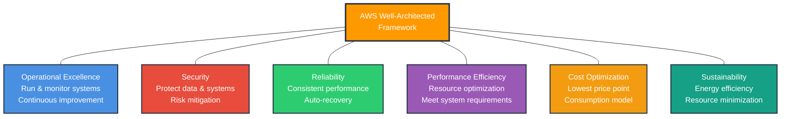
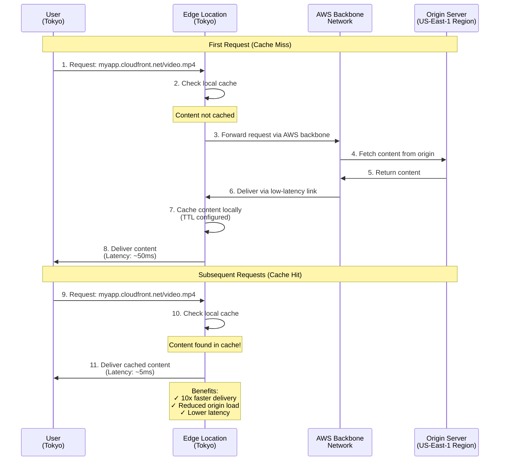
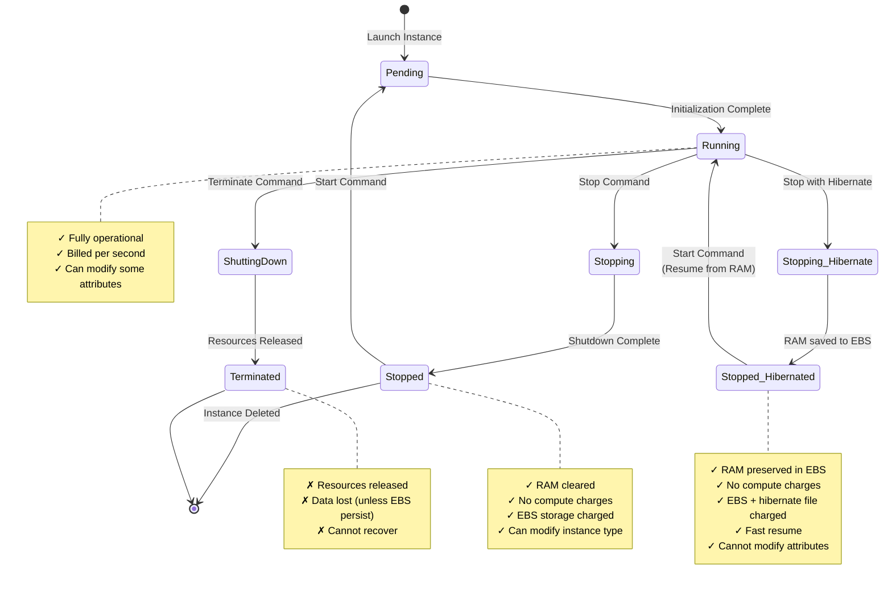
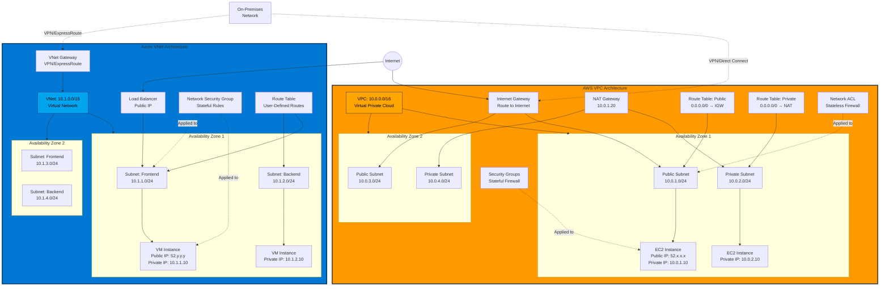
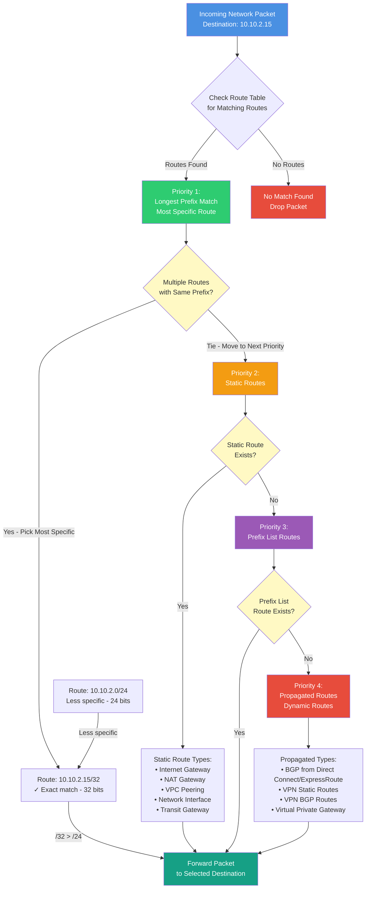

# AZ-700 (Azure Network Engineer Associate) && AWS Certified Advanced Networking – Specialty

> “Mens et manus" is a Latin phrase that translates to "mind and hand," and it's the motto of the Massachusetts Institute of Technology (MIT). It embodies the philosophy of combining theoretical knowledge with practical application, which is central to MIT's educational approach. The motto reflects the idea that problem-solving requires both intellectual understanding and hands-on experience.


## AWS Well-Architected Framework

The AWS Well-Architected Framework(opens in a new tab) helps you understand how to design and operate reliable, secure, efficient, and cost-effective systems in the AWS Cloud. It provides a way for you to consistently measure your architecture against best practices and design principles and identify areas for improvement.
The Well-Architected Framework is based on six pillars: 

1. Operational excellence is the ability to run and monitor systems to deliver business value and to continually improve supporting processes and procedures.
2. Security pillar is the ability to protect information, systems, and assets while delivering business value through risk assessments and mitigation strategies.
3. Reliability -> the ability of a workload to consistently and correctly perform its intended functions. Includes testing recovery procedures, scaling horizontally to increase aggregate system availability, Dynamically acquire computing resources to meet demand and automatically recovering from failure/disruption.
4. Performance efficiency is the ability to use computing resources efficiently to meet system requirements and to maintain that efficiency as demand changes and technologies evolve.
5. Cost optimization is the ability to run systems to deliver business value at the lowest price point. Which includes adopting a consumption model, analyzing and attributing expenditure, and using managed services to reduce the cost of ownership.
6. Sustainability is the ability to continually improve sustainability impacts by reducing energy consumption and increasing efficiency across all components of a workload by maximizing the benefits from the provisioned resources and minimizing the total resources required.

**AWS Well-Architected Framework - Six Pillars:**



*Figure: The six pillars of the AWS Well-Architected Framework form a comprehensive foundation for building secure, resilient, and efficient cloud architectures*

## Advantages of Cloud Computing (AWS)

Advantages of cloud computing -> Operating in the AWS Cloud offers many benefits over computing in on-premises or hybrid environments. The six advantages of cloud computing:

- Trade upfront expense for variable expense.
- Benefit from massive economies of scale.
- Stop guessing capacity.
- Increase speed and agility.
- Stop spending money running and maintaining data centers.
- Go global in minutes.

## Global Infrastructure (Regions, AZs, Edge Locations)

“Four key factors to choose a Region: Compliance, proximity, feature availability, and pricing.”

AWS/Azure has data centers, lots of data centers, all around the world, and each Region is made up of multiple data centers. AWS/Azure calls a single data center or a group of data centers, an Availability Zone or AZ. An Availability Zone is a single data center or a group of data centers within a Region. Availability Zones are located tens of miles apart from each other. This is close enough to have low latency (the time between when content requested and received) between Availability Zones. However, if a disaster occurs in one part of the Region, they are distant enough to reduce the chance that multiple Availability Zones are affected. Each Availability Zone is one or more discrete data centers with redundant power, networking, and connectivity. Inside every Region is a cluster of Availability Zones. They are connected using redundant high-speed and low-latency links.

Availability Zones also have code names. Because they are located inside Regions, they can be addressed by appending a letter to the end of the Region code name

When you launch an Amazon EC2 instance, it launches a virtual machine on a physical hardware that is installed in an Availability Zone. This means each AWS Region consists of multiple isolated and physically separate Availability Zones within a geographic Region.
As a best practice with AWS, we always recommend you run across at least two Availability Zones in a Region. This means redundantly deploying your infrastructure in two different AZs.

Regions are geographically isolated areas, where you can access services needed to run your enterprise.
Regions contain Availability Zones, that allow you to run across physically separated buildings, tens of miles of separation, while keeping your application logically unified. Availability Zones help you solve high availability and disaster recovery scenarios, without any additional effort on your part.

**AWS/Azure Global Infrastructure Hierarchy:**

```mermaid
graph TB
    subgraph Global["AWS/Azure Global Infrastructure"]
        
        subgraph Region1["Region: US-East-1<br/>(N. Virginia)"]
            AZ1a[Availability Zone 1a<br/>Data Center Cluster<br/>Redundant power/network]
            AZ1b[Availability Zone 1b<br/>Data Center Cluster<br/>Tens of miles apart]
            AZ1c[Availability Zone 1c<br/>Data Center Cluster<br/>High-speed links]
            
            AZ1a ---|Low latency<br/>redundant links| AZ1b
            AZ1b ---|Low latency<br/>redundant links| AZ1c
            AZ1c ---|Low latency<br/>redundant links| AZ1a
        end
        
        subgraph Region2["Region: EU-West-1<br/>(Ireland)"]
            AZ2a[Availability Zone 1a<br/>Data Center Cluster]
            AZ2b[Availability Zone 1b<br/>Data Center Cluster]
            AZ2c[Availability Zone 1c<br/>Data Center Cluster]
            
            AZ2a ---|Low latency<br/>redundant links| AZ2b
            AZ2b ---|Low latency<br/>redundant links| AZ2c
        end
        
        subgraph Region3["Region: AP-Southeast-1<br/>(Singapore)"]
            AZ3a[Availability Zone 1a<br/>Data Center Cluster]
            AZ3b[Availability Zone 1b<br/>Data Center Cluster]
        end
        
        Edge1[Edge Location<br/>CloudFront CDN<br/>Route 53 DNS]
        Edge2[Edge Location<br/>CloudFront CDN<br/>Route 53 DNS]
        Edge3[Edge Location<br/>CloudFront CDN<br/>Route 53 DNS]
        Edge4[Edge Location<br/>Cached Content<br/>Low latency delivery]
    end
    
    Region1 -.->|Content distribution| Edge1
    Region1 -.->|Content distribution| Edge2
    Region2 -.->|Content distribution| Edge3
    Region3 -.->|Content distribution| Edge4
    
    User1((User<br/>North America))
    User2((User<br/>Europe))
    User3((User<br/>Asia))
    
    User1 -->|Lowest latency| Edge1
    User2 -->|Lowest latency| Edge3
    User3 -->|Lowest latency| Edge4
    
    style Region1 fill:#FF9900,stroke:#232F3E,stroke-width:2px
    style Region2 fill:#FF9900,stroke:#232F3E,stroke-width:2px
    style Region3 fill:#FF9900,stroke:#232F3E,stroke-width:2px
    style AZ1a fill:#4A90E2,stroke:#232F3E,color:#fff
    style AZ1b fill:#4A90E2,stroke:#232F3E,color:#fff
    style AZ1c fill:#4A90E2,stroke:#232F3E,color:#fff
    style AZ2a fill:#4A90E2,stroke:#232F3E,color:#fff
    style AZ2b fill:#4A90E2,stroke:#232F3E,color:#fff
    style AZ2c fill:#4A90E2,stroke:#232F3E,color:#fff
    style AZ3a fill:#4A90E2,stroke:#232F3E,color:#fff
    style AZ3b fill:#4A90E2,stroke:#232F3E,color:#fff
    style Edge1 fill:#16A085,stroke:#232F3E,color:#fff
    style Edge2 fill:#16A085,stroke:#232F3E,color:#fff
    style Edge3 fill:#16A085,stroke:#232F3E,color:#fff
    style Edge4 fill:#16A085,stroke:#232F3E,color:#fff
    style Global fill:#f9f9f9,stroke:#232F3E,stroke-width:3px
```



*Figure: AWS/Azure global infrastructure showing Regions containing multiple Availability Zones (isolated data center clusters) connected by high-speed links, with Edge Locations for content delivery to users worldwide*

Amazon CloudFront is a Content Delivery Networked service that helps deliver data, video, applications, and APIs to customers around the world with low latency and high transfer speeds. Amazon CloudFront uses what are called Edge locations, all around the world, to help accelerate communication with users, no matter where they are.

An EDGE LOCATION is a site that AWS CLOUDFRONT uses to store cached copies of your content closer to your customers for faster delivery. AWS Edge locations run Amazon CloudFront to help get content closer to your customers, no matter where they are in the world.

Amazon CloudFront delivers your content through a worldwide network of edge locations. When a user requests content that is being served with CloudFront, the request is routed to the location that provides the lowest latency. So that content is delivered with the best possible performance. CloudFront speeds up the distribution of your content by routing each user request through the AWS backbone network to the edge location that can best serve your content.
Edge locations are separate from Regions, so you can push content from inside a Region to a collection of Edge locations around the world, in order to accelerate communication and content delivery. AWS Edge locations, also run more than just CloudFront. They run a domain name service, or DNS, known as Amazon Route 53, helping direct customers to the correct web locations with reliably low latency.

**CloudFront Edge Location Content Delivery Flow:**



*Figure: CloudFront routes user requests to the nearest edge location. Cache misses fetch from origin via AWS backbone, cache hits deliver instantly from local cache*

To create an EC2 instance, you must define the following:
Hardware specifications: CPU, memory, network, and storage
Logical configurations: Networking location, firewall rules, authentication, and the operating system of your choice
When launching an EC2 instance, the first setting you configure is which operating system you want by selecting an Amazon Machine Image (AMI). An AMI includes the operating system, storage mapping, architecture type, launch permissions, and any additional preinstalled software applications.
EC2 instances are live instantiations (or versions) of what is defined in an AMI, If you are familiar with software development, you can also see this kind of relationship between a class and an object. In this case, the AMI is how you model and define your instance. The EC2 instance is the entity you interact with, where you can install your web server and serve your content to users.

When you launch a new instance, AWS allocates a virtual machine that runs on a hypervisor. Then the AMI that you selected is copied to the root device volume, which contains the image that is used to boot the volume. In the end, you get a server that you can connect to and install packages and additional software on. In the example, you install a web server along with the properly configured source code of your employee directory application.
EC2 instance lifecycle -> An EC2 instance transitions between different states from the moment you create it until its termination.

**EC2 Instance Lifecycle State Machine:**



*Figure: EC2 instance state transitions showing hibernation as an alternative to standard stop, preserving memory state for faster recovery*

| Feature | Stop | Stop-Hibernate |
| --- | --- | --- |
| Memory (RAM) | Lost. The contents of RAM are erased. | Preserved. The contents of RAM are saved to the EBS root volume (hiberfil.sys in Windows). |
| Startup Time | Longer. The instance needs to boot up fresh, reload the OS, and start applications. | Faster. The instance resumes from the saved state in RAM, skipping much of the boot process. |
| State After | Stopped. A clean shutdown state. | Stopped (with RAM preserved). The instance's previous state, including running applications and data in memory, is retained. |
| Modifications | Some attributes (like instance type) can be modified. | Most attributes cannot be modified while in the hibernated state. You'd need to start it and then stop it normally to make changes. |
| Prerequisites | None specific to stopping. | Specific requirements must be met (e.g., hibernation enabled, sufficient root volume size, supported instance type and OS). |
| Cost | No compute usage charges while stopped, but EBS volume storage is charged. | No compute usage charges while stopped-hibernated, but EBS volume storage (including the space used for the hibernation file) is charged. |
| Use Cases | Testing configuration changes, short breaks where a fresh start is acceptable. | Maintaining application state across stops, faster recovery for frequently used instances. |

<!--  -->

## Core Networking Equivalents

- AWS Virtual Interface (VIF) is the same as an Azure Network Interface (NIC).
- AWS Virtual Private Cloud (VPC) is the same as an Azure Virtual Network (VNET).
- Region where the VPC/VNET will live – A VPC/VNET spans all the Availability Zones within the selected Region.

**AWS VPC vs Azure VNet Architecture Comparison:**



*Figure: AWS VPC and Azure VNet comparison showing equivalent components - VPC/VNet span multiple AZs, contain public/private subnets, use route tables and security groups/NSGs for traffic control*

## Virtual Networking (VPC/VNet) - Core Concepts & Configuration

### Capabilities of AZURE VIRTUAL NETWORK

- Communication to the Internet: Inbound Connections require assigning a public IP or public Load Balancer.
- Communication b/w Azure Resources: Such as VMs within your VNet can communicate directly.
    - Virtual Networks;
    - VNet Service Endpoints;
    - VNet peering. VNet connects not only VMs, but connects other Resource types, allowing them to communicate directly and securely with each other.
- Communication b/w On-premises Resources: To do so, use Point-to-site VPN, Site-to-Site VPN, or Azure Express Route.
- Filters Network traffic b/w subnets: Via Network Security Groups or Networking Virtual Appliances (Firewalls).
- Routing Network Traffic: By default, Azure routes traffic b/w subnets, Connected VNets, On-Premises Networks & the Internet. Route Tables and BGP Routes Override the default Routes Azure/AWS Creates.

**VPN Connection Types - Architecture:**

```mermaid
graph TB
    subgraph S2S["Site-to-Site VPN"]
        OnPrem1[On-Premises Network<br/>Corporate Datacenter<br/>192.168.0.0/16]
        VPNDevice1[VPN Device/Firewall<br/>Public IP: 203.0.113.10<br/>IPsec Tunnel]
        Internet1((Internet<br/>Encrypted Tunnel))
        VPNGateway1[VPN Gateway<br/>Azure/AWS VPN Endpoint<br/>Public IP: 52.x.x.x]
        Cloud1[Cloud VNet/VPC<br/>10.0.0.0/16<br/>All Subnets]
        
        OnPrem1 --> VPNDevice1
        VPNDevice1 -.->|IPsec/IKE<br/>Encrypted| Internet1
        Internet1 -.->|IPsec/IKE<br/>Encrypted| VPNGateway1
        VPNGateway1 --> Cloud1
        
        note1[Use Case:<br/>✓ Connect entire office<br/>✓ Always-on connection<br/>✓ Site-wide access<br/>✓ Hardware VPN required]
    end
    
    subgraph P2S["Point-to-Site VPN"]
        Laptop[Remote Laptop<br/>VPN Client Installed<br/>Dynamic IP]
        Phone[Mobile Device<br/>VPN Client App<br/>Dynamic IP]
        Internet2((Internet<br/>Encrypted Tunnel))
        VPNGateway2[VPN Gateway<br/>Azure/AWS VPN Endpoint<br/>RADIUS/Certificate Auth]
        Cloud2[Cloud VNet/VPC<br/>10.0.0.0/16<br/>Accessible Resources]
        
        Laptop -.->|SSTP/OpenVPN<br/>Certificate Auth| Internet2
        Phone -.->|IKEv2<br/>Certificate Auth| Internet2
        Internet2 -.-> VPNGateway2
        VPNGateway2 --> Cloud2
        
        note2[Use Case:<br/>✓ Remote workers<br/>✓ On-demand connection<br/>✓ Individual access<br/>✓ Software client only]
    end
    
    subgraph Hybrid["Hybrid Architecture (Both)"]
        OnPrem3[Corporate Office<br/>Site-to-Site VPN<br/>Always Connected]
        Remote[Remote Employees<br/>Point-to-Site VPN<br/>On-Demand]
        VPNGateway3[Shared VPN Gateway<br/>Handles Both Types]
        CloudNet[Cloud Network<br/>Shared Resources]
        
        OnPrem3 -.->|S2S Tunnel| VPNGateway3
        Remote -.->|P2S Tunnel| VPNGateway3
        VPNGateway3 --> CloudNet
    end
    
    style S2S fill:#e6f3ff,stroke:#0078D4,stroke-width:2px
    style P2S fill:#fff4e6,stroke:#F39C12,stroke-width:2px
    style Hybrid fill:#e6ffe6,stroke:#2ECC71,stroke-width:2px
    style VPNDevice1 fill:#4A90E2,color:#fff
    style VPNGateway1 fill:#FF9900,color:#000
    style VPNGateway2 fill:#FF9900,color:#000
    style VPNGateway3 fill:#FF9900,color:#000
    style Laptop fill:#9B59B6,color:#fff
    style Phone fill:#9B59B6,color:#fff
```



*Figure: Site-to-Site VPN connects entire on-premises networks via hardware VPN devices; Point-to-Site VPN connects individual remote users via software clients; both can coexist on the same VPN Gateway*

A route table contains a set of rules, called routes, that determine where network traffic from your subnet or gateway is directed. Whether a subnet has access to the public internet or not depends on its associated route table. If a route from the internet gateway to the subnet exists, it has public access. If the route table doesn't have a route between the subnet and the internet gateway, then it doesn't have public access. So we call subnets public or private but it's really the route table that provides that access. So for your subnets, you will create custom route tables. Inside these custom route tables, you willhave that default local route inside of it that allows traffic to flow freely within the VPC. But then you will need to create additional routes.

**Route Table Priority Decision Flow:**



*Figure: Route selection follows a strict priority order - longest prefix match first (most specific), then static routes, then prefix lists, finally propagated BGP/VPN routes. Static routes always override propagated routes when destinations match.*

The following list shows a route priority summary with links to sections below with more detailed information and examples:

1. Longest prefix (for example, 10.10.2.15/32 has priority over 10.10.2.0/24)
2. Static routes (like VPC peering and internet gateway connections)
3. Prefix list routes
4. Propagated routes i.e Direct Connect/ ExpressRoute BGP routes (dynamic routes), VPN static routes, VPN BGP routes (dynamic routes) (like virtual private gateways)

If you've attached a virtual private gateway to your VPC and enabled route propagation on your subnet route table, routes representing your Site-to-Site VPN connection automatically appear as propagated routes in your route table.
If the destination of a propagated route is identical to the destination of a static route, the static route takes priority. The following resources use static routes:
- internet gateway
- NAT gateway
- Network interface
- Instance ID
- Gateway VPC endpoint
- Transit gateway
- VPC peering connection
- Gateway Load Balancer endpoint

### Traditional WAN vs Cloud WAN (ExpressRoute & Direct Connect) — What’s the Difference?

In a traditional WAN setup, enterprise datacenters connect to multiple on-premises branch LANs using a hub-and-spoke (star) topology, often via leased lines or MPLS circuits provided by telecom carriers. This provides private, reliable, low-latency connectivity between branches and HQ.

In the cloud era, services like Azure ExpressRoute and AWS Direct Connect offer a cloud-based alternative to these leased lines. They provide private Layer 3 connections from your on-premises network to the cloud, bypassing the public internet — perfect for hybrid networks with strict performance and security requirements.

Both ExpressRoute and Direct Connect integrate into cloud-native WAN architectures like Azure Virtual WAN and Virtual Hubs, which act as cloud-based super routers. These virtual hubs connect branch sites, VNets/VPCs, and remote users into a global, scalable cloud backbone.

### Azure/AWS VNet/VPC configuration

- AZURE/AWS allows Creating Multiple VNETS/VPC per Region per Subscription & Subnetting of each Virtual Network. When you launch an EC2/VM instance (AWS's virtual machine) within a subnet, it's assigned a private IP address from the subnet's address range.
    1. When creating a VNET, use Address Ranges enumerated in RFC 1918
    2. [Private, Non-Routable Address Spaces]: the 10.0.0.0/8; 172.16.0.0/12; 192.168.0.0/16 prefixes.
    3. Reserved address Ranges include: 224.0.0.0/4 (Multicast); 255.255.255.255/32 (Broadcast); 127.0.0.0/8 (loopback); 169.254.0.0/16 (link-local); 169.63.129.16/32 (INTERNAL DNS).
- Azure assigns resources in a virtual network (VNET) a private IP Address from the Address space that you create.
    - Deploy a VM in a VNet with Subnet Address-space 192.168.1.0/24, the VM is assigned a private IP [192.168.1.4].
    - Azure Reserves the first four and the last IP address for a total of 5 IP Addresses within each subnet: X.X.X.0 - X.X.X.3 and X.X.X.255 [Reserved by Azure's Network and Broadcast Address].
        - X.X.X.0 → Network Address
        - X.X.X.1 → Reserved by Azure/AWS for the Default Gateway-> VPC/VNET Router
        - X.X.X.2 & X.X.X.3 → Reserved by Azure/AWS to map the Azure/AWS DNS IPs to the VNet Internal private Space.
        - X.X.X.255 [Reserved by Azure's Network and Broadcast Address].

**Azure/AWS Subnet Reserved IP Addresses:**

```mermaid
graph TB
    Subnet[Subnet: 192.168.1.0/24<br/>256 Total IP Addresses]
    
    subgraph Reserved["Reserved by Azure/AWS (5 Addresses)"]
        Net[192.168.1.0<br/>Network Address<br/>Identifies the subnet]
        GW[192.168.1.1<br/>Default Gateway<br/>VPC/VNet Router]
        DNS1[192.168.1.2<br/>Azure/AWS DNS Server 1<br/>Mapped to cloud DNS]
        DNS2[192.168.1.3<br/>Azure/AWS DNS Server 2<br/>Mapped to cloud DNS]
        Bcast[192.168.1.255<br/>Broadcast Address<br/>Reserved]
    end
    
    subgraph Usable["Usable IP Range (251 Addresses)"]
        First[192.168.1.4<br/>First usable IP<br/>Can assign to VMs]
        VM1[192.168.1.10<br/>VM Instance]
        VM2[192.168.1.20<br/>VM Instance]
        VM3[192.168.1.30<br/>Load Balancer]
        Dots[...]
        Last[192.168.1.254<br/>Last usable IP<br/>Can assign to VMs]
    end
    
    Subnet --> Reserved
    Subnet --> Usable
    
    Reserved --> Net
    Reserved --> GW
    Reserved --> DNS1
    Reserved --> DNS2
    Reserved --> Bcast
    
    Usable --> First
    Usable --> VM1
    Usable --> VM2
    Usable --> VM3
    Usable --> Dots
    Usable --> Last
    
    Note[Calculation:<br/>256 total IPs (2^8)<br/>- 5 reserved<br/>= 251 usable IPs]
    
    style Reserved fill:#E74C3C,stroke:#C0392B,color:#fff,stroke-width:3px
    style Usable fill:#2ECC71,stroke:#27AE60,color:#fff,stroke-width:3px
    style Net fill:#E74C3C,color:#fff
    style GW fill:#FF9900,color:#000
    style DNS1 fill:#4A90E2,color:#fff
    style DNS2 fill:#4A90E2,color:#fff
    style Bcast fill:#E74C3C,color:#fff
    style VM1 fill:#2ECC71,color:#fff
    style VM2 fill:#2ECC71,color:#fff
    style VM3 fill:#2ECC71,color:#fff
    style Note fill:#FFF9C4,stroke:#F39C12,stroke-width:2px
```

*Figure: Every Azure/AWS subnet reserves 5 IP addresses - network address (.0), default gateway (.1), two DNS servers (.2, .3), and broadcast address (.255). Only 251 IPs are usable for resources in a /24 subnet.*

- Segmenting Virtual Networks into different size subnets serves to Segregate deployed Azure Resources to a Specific Subnet. Similar to traditional networks, subnets allow you to Segment your VNet Address space Into segments that are appropriate for the Organization's Internal network.
    - CIDR/29 is the smallest subnet supported, while CIDR/2 is the largest. IPv6 subnets must be /64 in size.
    - Subnets must have Unique Address Ranges. Certain Azure Services require their Own Subnets.
    - Subnets can be used for traffic management to Limit access to Azure Resources to specific subnets, not a Virtual Network or Some Endpoint.
    - Create Multiple Subnets & Enable Service Endpoints.
- It's Important to plan your naming convention for your Resources.
    - A well-chosen name helps you quickly identify the Resource's type, its associated workload, its deployment environment, and the Azure Region hosting it. For example, a public IP Resource for a Production SharePoint workload Residing in the West US might be pip-sharepoint-prod-westus-001 (Type-Workload-ENV-Region-#).

### VNet connectivity

- To activate internet connectivity for your VPC/VNET, you must create an internet gateway. Think of the gateway as similar to a modem. Just as a modem connects your computer to the internet, the internet gateway connects your VPC/VNET to the internet. Unlike your modem at home, which sometimes goes down or offline, an internet gateway is highly available and scalable. After you create an internet gateway, you attach it to your VPC.
- To support a network that exists both in AZURE & On-premises, you must Configure IP addressing for both Networks.
- Public IP Addresses enable Internet Resources to communicate with AZURE Resources & enable Azure Resources to communicate Outbound with Internet & public-facing Azure services. A Public IP address is dedicated to a specific Resource & has its own properties. Resources below can be associated with a public IP address:
    1. VM Network Interface VM-NIC
    2. Public Load Balancers L4
    3. Internet Gateway / Virtual Network Gateways
    4. VPN / NAT Gateways VPN-GW
    5. Application Gateways APP-GW
    6. Azure Firewall
    7. Bastion Host
    8. Azure Route Server
    9. VM Scale Sets VMSS
    - Public IP addresses are created dynamically OR static with an IPv4 OR IPv6 Address.
        - A Dynamic public IP addr: Assigned address Changes over the lifespan of the Azure Resource. Allocated during creation of VM, Reclaimed when the VM is stopped/deleted. Assigned from a Unique pool of addresses with default allocation method Dynamic.
        - A Static public IP addr: Assigned address doesn't change over the lifespan of the Azure Resource. To ensure it remains the same for a Resource, set the allocation method explicitly to static. In this case, the IP addr is assigned Immediately. The IP addr is Reclaimed only when you delete the Resource, or change the IP allocation method to dynamic.
Inbound connectivity is Impossible without a Public IP / load balancer / VNet Gateways / NAT Gateways set.
Outbound Connectivity is possible without a load balancer/public IP Address attached to your VM, through a NAT Gateway. A NAT Gateway is Recommended for Outbound Internet access from these private subnets.
Microsoft AZURE deploys a Network Watcher alongside Virtual Network Deployments for every VNet deployed; a Network Watcher is deployed per VNet Region.

## Virtual Network Peering (VNet/VPC Peering)

“VIRTUAL NETWORK PEERING “ enables you to seamlessly connect 2 or more VNets on Azure. The VNets appear as one for communication. Enhance Security by not providing default Outbound access. Therefore, to enable Connectivity for VMs within this Subnet, it's necessary to explicitly grant Outbound access. A NAT Gateway is the Recommended way to provide connectivity for Virtual machines in the subnet "Subnets without public IP Address".

- Enable Cross-Virtual Network Connectivity with Peering: Allows you to connect separate VNets with Optimal Network performance, whether they are in the Same Region [Regional VNet peering] or in different regions [Global VNet peering]. Traffic between peered VNets is private. For connectivity purposes, once peered, the VNets appear as One. This offers the following Benefits:
    - Low Latency, high-bandwidth connection b/w Resources in different VNets.
    - Ability to apply Network Security Groups in either VNet to block access to other VNets or subnets.
    - Ability to transfer data b/w VNets across Azure subscriptions, Entra Tenants, Deployment models, and Regions.
    - Ability to peer a VNet created through the Resource Manager to one created through classic deployment.
    - No downtime to Resources in other VNets is required when creating/after creating peering.

| Benefit | Description |
| --- | --- |
| Private network connections | When you implement Azure Virtual Network peering, network traffic between peered virtual networks is private. Traffic between the virtual networks is kept on the Microsoft Azure backbone network. No public internet, gateways, or encryption is required in the communication between the virtual networks. |
| Strong performance | Because Azure Virtual Network peering utilizes the Azure infrastructure, you gain a low-latency, high-bandwidth connection between resources in different virtual networks. |
| Simplified communication | Azure Virtual Network peering lets resources in one virtual network communicate with resources in a different virtual network, after the virtual networks are peered. |
| Seamless data transfer | You can create an Azure Virtual Network peering configuration to transfer data across Azure subscriptions, deployment models, and across Azure regions. |
| No resource disruptions | Azure Virtual Network peering doesn't require downtime for resources in either virtual network when creating the peering, or after the peering is created. |
| Extend peering with user-defined routes and service chaining |  |

Virtual network peering is nontransitive. The communication capabilities in a peering are available to only the virtual networks and resources in the peering. Other mechanisms have to be used to enable traffic to and from resources and networks outside the private peering network, You can implement these mechanisms and create a multi-level hub and spoke architecture. These options can help overcome the limit on the number of virtual network peerings per virtual network.. There are a few ways to extend the capabilities of your peering for resources and virtual networks outside your peering network:

- Hub and spoke networks
- User-defined routes
- Service chaining

| Mechanism | Description |
| --- | --- |
| Hub and spoke network | When you deploy a hub-and-spoke network, the hub virtual network can host infrastructure components like a network virtual appliance (NVA) or Azure VPN gateway. All the spoke virtual networks can then peer with the hub virtual network. Traffic can flow through NVAs or VPN gateways in the hub virtual network. |
| User-defined route (UDR) | Virtual network peering enables the next hop in a user-defined route to be the IP address of a virtual machine in the peered virtual network, or a VPN gateway. |
| Service chaining | Service chaining is used to direct traffic from one virtual network to a virtual appliance or gateway. A user-defined route defines the peered networks. |
This accurately describes a primary motivation for using a Hub and Spoke architecture in Azure (and similar designs in other clouds): to overcome the limitations of VNet peering. Here's a bit more detail:

### The Problem with Full Mesh VNet Peering
When you have a small number of virtual networks (VNets) in Azure, you can connect them directly using VNet peering. This allows resources in different VNets to communicate with each other. However, if you try to connect many VNets together, you end up with a "full mesh" network, where every VNet is peered with every other VNet.
This full-mesh approach quickly becomes complex and difficult to manage as the number of VNets increases. The number of peering connections grows rapidly, making it harder to:
*   Manage routing
*   Enforce security policies
*   Troubleshoot network issues
Azure imposes limits on the number of VNet peerings per VNet, further complicating full-mesh designs.
### Hub and Spoke as a Solution
The Hub and Spoke architecture provides a more scalable and manageable alternative:
*   Hub: A central VNet acts as the "Hub."
*   Spokes: Other VNets (representing different applications, environments, or business units) connect to the Hub as "Spokes."
*   Instead of every VNet peering with every other VNet, each Spoke VNet only peers with the Hub VNet.
This design offers several advantages:
*   Simplified Management: You manage connectivity through the central Hub, reducing the number of peering connections.
*   Scalability: It's easier to add or remove Spoke VNets without disrupting the entire network.
*   Centralized Control: You can implement security policies, routing, and monitoring in the Hub, and these policies apply to all Spoke VNets.
*   Overcoming Peering Limits: By using a Hub and Spoke design, you avoid hitting the limits on the number of VNet peerings per VNet.
In essence: Hub and Spoke architectures provide a scalable, manageable, and cost-effective way to connect multiple VNets in Azure, addressing the limitations of full-mesh VNet peering.

*   GATEWAY TRANSIT: Is a peering property that lets one VNet use the VPN Gateway in the peered VNet for CROSS-PREMISES OR VNET-to-VNET connectivity. When virtual networks are peered, you can configure Azure VPN Gateway in the peered virtual network as a transit point. In this scenario, a peered virtual network uses the remote VPN gateway to gain access to other resources. Supports both Regional & Global VNet peering. Gateway Transit allows the VNet to communicate to Resources outside the peering by allowing the peered Virtual Network to share the gateway and get access to Resources. This means you don't need to deploy a VPN Gateway in the peer VNet. You can apply network security groups in a virtual network to block or allow access to other virtual networks or subnets. When you configure virtual network peering, you can choose to open or close the network security group rules between the virtual networks.
Consider a scenario where three virtual networks in the same region are connected by virtual network peering. Virtual network A and virtual network B are each peered with a hub virtual network. The hub virtual network contains several resources, including a gateway subnet and an Azure VPN gateway. The VPN gateway is configured to allow VPN gateway transit. Virtual network B accesses resources in the hub, including the gateway subnet, by using a remote VPN gateway. In the Azure portal, you can check the connectivity status of the virtual networks in your virtual network peering. The status conditions depend on how your virtual networks are deployed. Your peering isn't successfully established until both virtual networks in the peering have a status of Connected.
*   For deployment with the Azure Resource Manager, the two primary status conditions are Initiated and Connected. For the classic deployment model, the Updating status condition is also used.
*   When you create the initial peering to the second (remote) virtual network from the first virtual network, the peering status for the first virtual network is Initiated.
*   When you create the subsequent peering from the second virtual network to the first virtual network, the peering status for both the first and remote virtual networks is Connected. In the Azure portal, you can see the status for the first virtual network change from Initiated to Connected.

## Network Endpoints (VPC/VNet Endpoints)

### VNet/VPC endpoint interfaces

VPC/VNET Endpoints are a means of publishing a Service so that it's accessible by instances in other VPC/VNETs using only the Internal Network's private IP address. Traffic is never exposed publicly to the Internet.

GATEWAY ENDPOINTS: Used to connect Instances in a VPC/VNET to Cloud Services (e.g., DB, storage). It's Configured as a Route to the Service in the VPC's Route Table.
INTERFACE ENDPOINTS: Makes use of private link feature to allow private access to custom services;

1. A Custom Service provider VPC/VNET is Configured thus publishing the Service with a DNS Host Name.
2. A VPC/VNET endpoint Interface is config in each Service Consumer VPC/VNET Subnet by configuring it with a private IP address within the subnet + the DNS Host Name of the Service provider. Each Instance within the VPC/VNET Subnet is configured to use the private IP address to contact the Service provider.

## Virtual Networking (VPC/VNet) - Gateways & Connectivity
Virtual networks are created with the default ASN of 65515. The following ASNs are reserved by Azure or IANA:

#### ASNs reserved by Azure:
- Public ASNs: 8074, 8075, and 12076
- Private ASNs: 65515, 65517, 65518, 65519, and 65520

#### ASNs reserved by IANA:
- 23456, 64496-64511, 65535-65551, and 429496729

Customers use either 16-bit or 32-bit ASNs.

### AWS VPC / Azure VNet internet gateway & VPN gateway

A Virtual Private Cloud or Virtual Network, is essentially your own private network in AWS/Azure. A VPC allows you to define your private IP range for your AWS resources, and you place things like EC2 instances and ELBs inside of your VPC.
A VPC lets you provision a logically isolated section of the AWS Cloud where you can launch AWS resources in a virtual network that you define. These resources can be public facing so they have access to the internet, or private with no internet access, usually for backend services like databases or application servers. The public and private grouping of resources are known as subnets and they are ranges of IP addresses in your VPC. First, let's talk about public-facing resources. In order to allow traffic from the public internet to flow into and out of your VPC, you must attach what is called an internet gateway, or IGW, to your VPC. An internet gateway is like a doorway that is open to the public. An internet gateway is a connection between a VPC and the internet. Without an internet gateway, no one can access the resources within your VPC.

A Gateway is a Virtual appliance router that is centrally deployed to facilitate connections between VPC/VNET subnets and VPN gateways. Traffic Routing Could be Configured b/w subnets in a VPC or through a Virtual firewall Instance, also between VPCs in the Same Account belonging to different Accounts, and between VPCs and On-premise Networks.

A VIRTUAL PRIVATE NETWORK (VPN) A VPN gateway is a type of Virtual Network Gateway. A type of private interconnected network. VPNs use an encrypted tunnel within another network. They're typically deployed to connect two or more trusted private networks to one another over an untrusted network (typically the public Internet). Traffic is encrypted while traveling over the untrusted network to prevent eavesdropping or other attacks.
VPN gateways are deployed in Azure/AWS VNET/VPC and enable the following connectivity:
*   Connect on-premises datacenters to Azure virtual networks through a site-to-site connection.
*   Connect individual devices to Azure virtual networks through a point-to-site connection.
*   Connect Azure virtual networks to other Azure virtual networks through a network-to-network connection.
You can deploy only one VPN gateway in each virtual network, but you can use one gateway to connect to multiple locations, including other Azure virtual networks or on-premises datacenters. When you deploy a VPN gateway, you specify the VPN type: either policy-based or route-based. The main difference between these two types of VPN is how the encrypted traffic is specified.

#### Similarities:
1.  Purpose: Both are types of Azure VPN gateways used to establish secure tunnels.
2.  Authentication: Both use preshared keys for authentication in Azure.
3.  Core Protocols: Both rely on IKE (Internet Key Exchange) to set up the security association and IPSec (Internet Protocol Security) to encrypt/decrypt data packets within the tunnel.
#### Differences:
| Feature | Policy-Based VPN | Route-Based VPN |
| --- | --- | --- |
| Traffic Routing | Uses static IP address lists defined in the policy to decide which tunnel to use for each packet. | Uses IP routing (static routes or dynamic protocols like BGP) via virtual tunnel interfaces (VTIs) to decide which tunnel to use. |
| Traffic Selectors | Uses specific source/destination address prefixes defined in the policy. | Uses any-to-any (wildcard) traffic selectors. |
| Flexibility | Static, less flexible, less resilient to network changes. | More dynamic, resilient to topology changes (like new subnets). |
| IKE Version Support | IKEv1 only. | Supports IKEv2 (often supports IKEv1 as well). |
| Supported Connections | Limited connection types. | Supports VNet-to-VNet, Point-to-Site, Multisite, and ExpressRoute coexistence. |
| Configuration | Source/Destination networks defined directly in the policy. | Source/Destination networks determined by routing tables (can be dynamic). |
| Primary Use Case | Primarily for compatibility with legacy on-premises devices. | Preferred method for most scenarios, especially modern setups. |
### Virtual private gateway
A virtual private gateway connects your VPC/VNET to another private network(on-premises). When you create and attach a virtual private gateway to a VPC/VNET, the gateway acts as anchor on the cloud side of the connection. On the other side of the connection, you will need to connect a customer gateway to the other private network. A customer gateway device is a physical device or software application on your side of the connection. When you have both gateways, you can then establish an encrypted virtual private network (VPN) connection between the two sides.

AWS VPN GATEWAY: Let's talk about a VPC with all internal private resources. We don't want just anyone from anywhere to be able to reach these resources. So we don't want an internet gateway attached to our VPC. Instead, we want a private gateway that only allows people in if they are coming from an approved network, not the public internet. This private doorway is called a virtual private gateway, and it allows you to create a VPN connection between a private network, like your on-premises data center or internal corporate network to your VPC. If you want to establish an encrypted VPN connection to your private internal AWS resources, you would need to attach a virtual private gateway to your VPC.

AZURE VPN GATEWAY is a service that can be used to send encrypted traffic between an Azure VNET and on-premises locations over the public Internet. You can also use VPN Gateway to send encrypted traffic between Azure virtual networks over the Microsoft network. VPN Gateway uses a specific type of Azure virtual network gateway called a VPN gateway. Multiple connections can be created to the same VPN gateway. When you create multiple connections, all VPN tunnels share the available gateway bandwidth. An Azure VPN gateway is made up of these elements:
*   Virtual network gateway
*   Local network gateway
*   Connection
*   Gateway subnet


When setting up a Virtual Network Gateway, it is essential to create a dedicated subnet, known as the GatewaySubnet, within the virtual network where the gateway will be deployed. This subnet is specifically reserved for the gateway's resources and must be configured before proceeding with the gateway setup. Additionally, ensure that the location of the subnet matches the region of the virtual network, as this alignment is required during the initial configuration of the Virtual Network Gateway. Proper planning of the subnet's size and location is critical to ensure a smooth deployment process.

### VPN gateway sizes
The SKU or size that you deploy, determines the capabilities of your VPN gateway.
### ExpressRoute failover
Another high-availability option is to configure a VPN gateway as a secure failover path for ExpressRoute connections.
### Zone-redundant gateways
In regions that support availability zones, you can deploy VPN and ExpressRoute gateways in a zone-redundant configuration. This configuration brings resiliency, scalability, and higher availability to virtual network gateways.
### Active/active
With the introduction of support for the BGP routing protocol, you can also deploy VPN gateways in an active/active configuration.
### Active/standby
By default, VPN gateways are deployed as two instances in an active/standby configuration, even if you only see one VPN gateway resource in Azure.

### Connect on-premises networks to Azure by using site-to-site VPN gateways
Before you can deploy a VPN gateway, you need some Azure and on-premises resources.
#### Required Azure resources
You need these Azure resources before you can deploy an operational VPN gateway:
*   Virtual network: Deploy an Azure virtual network with enough address space for the extra subnet that you need for the VPN gateway. The address space for this virtual network must not overlap with the on-premises network to which you're connecting. Remember that you can deploy only one VPN gateway within a virtual network.
*   GatewaySubnet: Deploy a subnet called GatewaySubnet for the VPN gateway. Use at least a /27 address mask to make sure you have enough IP addresses in the subnet for future growth. You can't use this subnet for any other services.
*   Public IP address: Create a Basic-SKU dynamic public IP address if using a non-zone-aware gateway. This address provides a public-routable IP address as the target for your on-premises VPN device. This IP address is dynamic, but it doesn't change unless you delete and re-create the VPN gateway.
*   Local network gateway: Create a local network gateway to define the on-premises network's configuration. Specifically, where the VPN gateway connects and what it connects to. This configuration includes the on-premises VPN device's public IPv4 address and the on-premises routable networks. This information is used by the VPN gateway to route packets that are destined for on-premises networks through the IPSec tunnel.
*   Virtual network gateway: Create the virtual network gateway to route traffic between the virtual network and the on-premises datacenter or other virtual networks. The virtual network gateway can be either configured as a VPN gateway or an ExpressRoute gateway, but this module deals only with VPN virtual network gateways.
*   Connection: Create a Connection resource to create a logical connection between the VPN gateway and the local network gateway. You can create multiple connections to the same gateway.
    *   The connection is made to the on-premises VPN device's IPv4 address as defined by the local network gateway.
    *   The connection is made from the virtual network gateway and its associated public IP address.
#### Required on-premises resources
To connect your datacenter to a VPN gateway, you need these on-premises resources:
*   A VPN device that supports policy-based or route-based VPN gateways (RRAS feature
*   A public-facing (internet-routable) IPv4 address

### PLAN A VPN GATEWAY
If you have a business with offices in different locations, you can establish a secure connection between the Local Area Networks (LANs) over the network. A site-to-site VPN gateway creates a secure connection between computer resources at different locations.
Creating a virtual network gateway can take some time to complete, so it's vital that you plan appropriately. Factors that you need to consider during your planning process include:
*   THROUGHPUT/BANDWIDTH - Mbps or Gbps
*   BACKBONE - Internet or private
*   AVAILABILITY of a public (static) IP address - To provide better availability for your VPN connections, consider one of these options. Active-Standby(VPN Gateway redundancy) or Active-Active Azure VPN gateway
    1.  Active-Standby is the default configuration. In this configuration there are two instances, active and standby. The standby connection takes over when the active connection is disrupted. Switching to the standby connection causes a service disruption. For planned maintenance, connectivity is restored in seconds. For unplanned interruptions, connectivity is restored in minutes.
    2.  Active-Active configuration, both instances of the gateway establish VPN tunnels to your on-premises VPN device. The traffic from your Azure virtual network to your on-premises network is routed through both tunnels simultaneously. If an outage occurs, Azure automatically switches to the other tunnel. Although there would be a slight decrease in performance from baseline.
*   VPN DEVICE COMPATIBILTY
*   MULTIPLE POINT CONNECTIONS OR SITE-TO-SITE?
    1.  A site-to-site (S2S) VPN gateway connection lets you create a secure connection to your virtual network from another virtual network or a physical network.
    2.  A Point-to-site (P2S)connection lets you create a secure connection to your virtual network from an individual client computer. A P2S connection is established by starting it from the client computer. This solution is useful for telecommuters who want to connect to Azure VNets from a remote location, such as from home or a conference. P2S VPN is also a useful solution to use instead of S2S VPN when you have only a few clients that need to connect to a VNet and not every one from that subnet.
*   VPN TYPE -&gt; Route-Based aka Dynamic Routing / Policy-Based aka Static Routing Gateways
    1.  Policy-based VPNs were previously called static routing gateways. Policy-based VPNs encrypt and direct packets through IPsec tunnels based on the IPsec policies. The policy (or traffic selector) is defined as an access list in the VPN device configuration. When using a Policy-based VPN, keep in mind the following limitations: Policy-based VPNs which support IKEv1 protocols can only be used with Basic Gateway SKUs. You can have only one tunnel when using a policy-based VPN.Therefore used for site-to-site connections.
    2.  Route-based VPNs were previously called dynamic routing gateways. Route-based VPNs use "routes" in the IP forwarding or routing table to direct packets into their corresponding tunnel interfaces. The tunnel interfaces then encrypt or decrypt the packets in and out of the tunnels. Most VPN gateways are route-based.
*   VPN GATEWAY TYPE -&gt; AWS(VPN / Direct Connect)::AZURE(VPN / Express Route)
### VPN gateway SKUs

*   VPN GATEWAY SKU- select a SKU that satisfies your requirements based on the workload, throughput, feature, and SLAs. https://learn.microsoft.com/en-us/azure/vpn-gateway/about-gateway-skus When you create a VPN Gateway virtual network gateway, you specify the gateway SKU that you want to use. This article describes the factors that you should take into consideration when selecting a gateway SKU. If you're looking for information about ExpressRoute gateway SKUs, see Virtual network gateways for ExpressRoute. For Virtual WAN gateways, see Virtual WAN gateway settings. When you configure a virtual network gateway SKU, select the SKU that satisfies your requirements based on the types of workloads, throughput, features, and SLAs.
The Basic SKU has feature and performance limitations and shouldn't be used in production environments.

### VPN protocols

Point-to-site VPN can use one of the following protocols:
*   OpenVPN® Protocol, an SSL/TLS based VPN protocol. A TLS VPN solution can penetrate firewalls, since most firewalls open TCP port 443 outbound, which TLS uses. OpenVPN can be used to connect from Android, iOS (versions 11.0 and above), Windows, Linux, and Mac devices (macOS versions 10.13 and above).
*   Secure Socket Tunneling Protocol (SSTP), a proprietary TLS-based VPN protocol. A TLS VPN solution can penetrate firewalls, since most firewalls open TCP port 443 outbound, which TLS uses. SSTP is only supported on Windows devices. Azure supports all versions of Windows that have SSTP (Windows 7 and later).
*   IKEv2 VPN, a standards-based IPsec VPN solution. IKEv2 VPN can be used to connect from Mac devices (macOS versions 10.11 and above).

### VPN authentication

#### Point-to-site authentication methods
The user must be authenticated before Azure accepts a P2S VPN connection. The two most common authentication methods are: Entra ID authentication and on-premises Active Directory Domain Services authentication.
#### Authenticate using native Microsoft Entra ID authentication
Native authentication allows users to connect to Azure using their Microsoft Entra ID credentials. Native authentication is only supported for OpenVPN protocol and Windows and requires the use of the Azure VPN Client. With this authentication, you can use conditional access and multifactor authentication (MFA) features for VPN.
#### Authenticate using Active Directory Domain Services
This authentication is a popular option because it allows users to connect to Azure using their organization domain credentials. It requires a RADIUS server that integrates with the server. Organizations can also use their existing RADIUS deployment.
The RADIUS server is deployed either on-premises or in your Azure VNet. During authentication, the Azure VPN Gateway passes authentication messages back and forth between the RADIUS server and the connecting device. Thus, the Gateway must be able to communicate with the RADIUS server. If the RADIUS server is present on-premises, then a VPN S2S connection from Azure to the on-premises site is required for reachability.

## Dedicated Private Connectivity (ExpressRoute / Direct Connect)
To establish a secure physical connection between your on-premises data center and your Amazon VPC/AZURE VNET, you can use DirectConnect / ExpressRoute. With DirectConnect / ExpressRoute, your internal network is linked to an AWS Direct Connect location/AZure ExpressRoute over a standard Ethernet fiber-optic cable. This connection allows you to create virtual interfaces directly to public AWS services or to your VPC.

AZURE EXPRESSROUTE and AWS DIRECT CONNECT are very similar services offered by Microsoft Azure and Amazon Web Services (AWS) respectively. Both are designed to create a dedicated, private network connection between your on-premises infrastructure (data centers, offices, colocation environments) and their respective cloud platforms if you understand the purpose and benefits of AWS Direct Connect, you have a very good understanding of what Azure ExpressRoute offers, and vice versa. They address the same fundamental need for reliable, high-performance, and secure private connectivity to the cloud.

Here's a breakdown of their similarities:
*   Dedicated Connection: Both ExpressRoute and Direct Connect allow you to create a direct, physical connection that bypasses the public internet. Private Connectivity: Both services allow you to establish a direct network connection that bypasses the public internet. This offers more predictable performance, lower latency, and enhanced security compared to traditional internet-based VPN connections. Since ExpressRoute connections don't travel over the public Internet, this approach offers more reliability, faster speeds, consistent latencies, and higher security. With ExpressRoute, your data doesn’t travel over the public internet, so it's not exposed to the potential risks associated with internet communications. ExpressRoute is a private connection from your on-premises infrastructure to your Azure infrastructure. However, even if you have an ExpressRoute connection, certain requests are still sent over the public internet. Including, DNS queries, certificate revocation list checking, and Azure Content Delivery Network requests.
*   Enhanced Performance: This dedicated connection offers more reliable and faster network speeds with lower latency compared to traditional internet-based connections.
*   Increased Security: By not traversing the public internet, these connections provide enhanced security and data privacy.
*   Hybrid Cloud Enablement: Both services are crucial for organizations adopting a hybrid cloud model, as they enable seamless integration between on-premises and cloud resources.
*   Peering: Both offer different types of peering (e.g., private peering for connecting to your Virtual Private Clouds/Virtual Networks, public peering for accessing public services like storage and databases, and Microsoft/AWS peering for accessing SaaS services)
In essence, both Azure ExpressRoute and AWS Direct Connect serve the same fundamental purpose: to provide a high-bandwidth, low-latency, and secure connection for extending your on-premises network into the cloud.

With AWS, you can achieve that using what is called AWS Direct Connect. Direct Connect allows you to establish a completely private, dedicated fiber connection from your data center to your AWS VPC. You work with a Direct Connect partner in your area to establish this connection, because like my magic doorway, AWS Direct Connect provides a physical line that connects your network to your AWS VPC. The private connection that AWS Direct Connect provides helps you to reduce network costs and increase the amount of bandwidth that can travel through your network.
This can also help you meet high regulatory and compliance needs, as well as sidestep any potential bandwidth issues. It's also important to note that one VPC might have multiple types of gateways attached for multiple types of resources all residing in the same VPC, just in different subnets.

A corporate data center routes network traffic to an AWS Direct Connect location. That traffic is then routed to a VPC through a virtual private gateway. All network traffic between the corporate data center and VPC flows through this dedicated private connection.

### Azure ExpressRoute / AWS DirectConnect
*   Purpose: Provides a dedicated, private connection between your on-premises network and Azure.
*   How it uses BGP: ExpressRoute uses BGP to exchange routing information between your on-premises network and the Azure network. This allows your on-premises network to learn the routes to your Azure resources, and vice versa.
*   Use Case: Connecting your on-premises network to Azure. Replaces Internet for connecting to Azure/AWS Services

| Connection | Azure services supported | Bandwidth | Protocols | Typical use case |
| --- | --- | --- | --- | --- |
| Virtual network, point-to-site | Azure IaaS and PaaS services (through private endpoints) | Based on the gateway SKU | Active/passive | Dev, test, and lab environments for cloud services and virtual machines. |
| Virtual network, site-to-site | Azure IaaS and PaaS services (through private endpoints) | Typically < 1 Gbps aggregate | Active/passive | Dev, test, and lab environments. Small-scale production workloads and virtual machines. |
| ExpressRoute | Azure IaaS and PaaS services, Microsoft Office 365 services | 50 Mbps up to 10 Gbps (100 Gbps for ExpressRoute Direct) | Active/active | Enterprise-class and mission-critical workloads. Big data solutions. |

## Advanced Networking (Transit Gateway / Virtual WAN)

VPCs can be Interconnected Using peering relationships and Connected to On-premise Networks Using VPN gateways. This could be difficult to manage, especially if each VPC must Interconnect in a Mesh-like topology. A Transit Gateway is a Simpler means of managing these Interconnections, handling Routing b/w the subnets in each attached VPC and any attached VPN gateways.
Transit gateways can attach VPCs and Direct Connect gateways in the same Region. Each transit gateway allows up to 5,000 VPCs to route traffic between the gateways. This solution also removes the need to use full-mesh VPC peering.

AZURE VIRTUAL WIDE AREA NETWORKS WAN is a networking service that brings many networking, security, and routing functionalities together to provide a single operational interface. Azure Virtual WAN is a centrally managed collection of connectivity resources like VPNs, which enables organizations to use the Microsoft backbone in a self-contained, security isolated manner.
The Virtual WAN architecture is a Hub and Spoke architecture with scale and performance built in for branches, users, ExpressRoute circuits, and virtual networks. A HUB contains gateways/routers for site-to-site, ExpressRoute, or point-to-site functionality. It takes 30 minutes to create the site-to-site VPN gateway in the virtual hub.
You must create a Virtual WAN before you can create a hub. A SPOKE
+ There are three main usage cases for virtual WAN: Site to site, Point to site, and ExpressRoute.
+ There are two types of virtual WANs: Basic (Site-to-site VPN only) and Standard with features that include:
*   Branch connectivity (via connectivity automation from Virtual WAN Partner devices such as SD-WAN or VPN CPE).
*   Site-to-site VPN connectivity
*   Remote user VPN connectivity (point-to-site).
*   Private connectivity (ExpressRoute).
*   Intra-cloud connectivity (transitive connectivity for virtual networks).
*   VPN ExpressRoute inter-connectivity.
*   Routing, Azure Firewall, and encryption for private connectivity.
This diagram shows an organization with two Virtual WAN hubs connecting the spokes. VNets, Site-to-site and point-to-site VPNs, SD WANs, and ExpressRoute connectivity are all supported.

To configure an end-to-end virtual WAN, you create:
*   Virtual WAN. Think of this as drawing a big, overall map of all your networks and how they'll connect in Azure. It's a management layer that lets you see and control your entire network setup in Azure. This resource represents Is like a virtual overlay network on Microsoft's Azure backbone and is a collection of multiple resources. It contains links to all your virtual hubs that you would like to have within the virtual WAN. Virtual WANs are isolated from each other and can't contain a common hub.
*   Hub. Now, on your map, you need a central point where all your networks can connect. This is your "Hub." A virtual hub is a Microsoft-managed virtual network. The hub contains various service endpoints to enable connectivity. It's a virtual network that acts as a connection point to other networks. It contains all the networking gear.
*   Hub virtual network connection. The hub virtual network connection resource is used to connect the hub seamlessly to your virtual network within Azure. “One virtual network can be connected to only one virtual hub”. On-premises locations connection: If you have physical offices, you connect your on-premises locations to the Virtual WAN Hub using Site-to-Site VPN. The "Site" resource in Azure represents your on-premises location.
*   Hub-to-hub connection. Hubs are all connected to each other in a virtual WAN. This means that any network
*   connected to one Hub can communicate with any network connected to another Hub.
*   Hub route table. You can create a virtual hub route and apply the route to the virtual hub route table. You can apply multiple routes to the virtual hub route table.

One of the benefits of Azure Virtual WAN is the ability to support reliable connections from many different technologies. These technologies include ExpressRoute, VPN Gateway, Barracuda CloudGen WAN, Cisco Cloud OnRamp for multicloud, and VMware SD-WAN. These types of devices are known as network virtual appliances (NVAs). NVAs enable transitive connectivity throughout an organization's Virtual WAN.
NVAs are deployed directly into a Virtual WAN hub and have an externally facing public IP address. This capability lets customers connect their branch Customer Premises Equipment (CPE) to the same brand NVA in the virtual hub.

### Manage an NVA in a Virtual Hub
There are many partners that provide NVAs, Azure Marketplace can deploy your NVA choice directly into a virtual hub. Each NVA is deployed as a Managed Application in Azure.
To deploy an NVA in your virtual WAN hub, access the Microsoft Azure Marketplace and select the Managed Application for the NVA partner. All Managed Applications create two resource groups in your subscription.
*   Customer Resource Group - This contains an application placeholder for the Managed Application. Partners can use this resource group to expose whatever customer properties they choose.
*   Managed Resource Group - Customers can't configure or change resources in this resource group directly.
The NVA is configured automatically as part of the deployment process. Once the NVA is provisioned, you can't access the NVA directly.
Unlike Azure VPN Gateway configurations, you don't need to create Site resources, Site-to-Site connection resources, or point-to-site connection resources to connect your branch sites to your NVA in the Virtual WAN hub.
You still need to create Hub-to-VNet connections to connect your Virtual WAN hub to your Azure VNets.
To learn more about deploying an NVA, view How to create a Network Virtual Appliance in an Azure Virtual WAN hub.

Virtual hubs or secure virtual hubs are the regional connection points for a virtual WAN. These hubs support multiple service endpoints. The endpoints provide connectivity between networks and services. They're the core of networking for each region.
To convert the virtual hub to a secure virtual hub, use Azure Firewall Manager.
Firewall rules, created by the Firewall Manager, allow for the creation of security and routing policies for network traffic. Data flowing from the internet, private IP addresses, or Azure platform services can be filtered.
Note: User-defined routes aren't needed to route traffic through the firewall.


### Load balancing 
Load balancing is a process in which you distribute incoming traffic equitably across multiple computers. A pool of computers that have lower levels of resources often responds to traffic more effectively than a single server with higher performance. The aim of load balancing is to optimize the use of your resources, while maximizing throughput and minimizing the time it takes for a response. Load balancing can also improve availability by sharing a workload across redundant group of backend computing resources.

#### AWS Types of load balancers: 
Application Load Balancer (ALB) -> An Application Load Balancer functions at Layer 7 of the Open Systems Interconnection (OSI) model. It is ideal for load balancing HTTP and HTTPS traffic. After the load balancer receives a request, it evaluates the listener rules in priority order to determine which rule to apply. It then routes traffic to targets based on the request content.
Network Load Balancer (NLB) -> A Network Load Balancer is ideal for load balancing TCP and UDP traffic. It functions at Layer 4 of the OSI model, routing connections from a target in the target group based on IP protocol data. Routes requests from the same client to the same target. Offers low latency for latency-sensitive applications. Preserves the client-side source IP address. Automatically provides a static IP address per Availability Zone (subnet). Lets users assign a custom, fixed IP address per Availability Zone (subnet). Uses Amazon Route 53 to direct traffic to load balancer nodes in other zones.
Gateway Load Balancer (GLB) -> A Gateway Load Balancer helps you to deploy, scale, and manage your third-party appliances, such as firewalls, intrusion detection and prevention systems, and deep packet inspection systems. It provides a gateway for distributing traffic across multiple virtual appliances while scaling them up and down based on demand. Ensures high availability and reliability by routing traffic through healthy virtual appliances, Can be monitored using CloudWatch metrics, Can deploy a new virtual appliance by selecting it in the AWS Marketplace, Connects internet gateways, virtual private clouds (VPCs), and other network resources over a private network.

#### AZURE Types of load balancers: 
Azure Load balancing services can be categorized in two ways: global versus regional, and HTTP(S) versus non-HTTP(S).
1. Global versus regional -> Global load-balancing services distribute traffic across regional backends, clouds, or hybrid on-premises services. These services route end-user traffic to the closest available backend. You can think of them as systems that load balance between application stamps, endpoints, or scale-units hosted across different regions/geographies. In contrast, Regional load-balancing services distribute traffic within virtual networks across virtual machines (VMs) or zone-redundant service endpoints within a region. You can think of them as systems that load balance between VMs, containers, or clusters within a region in a virtual network.
2. HTTP(S) versus non-HTTP(S) -> HTTP(S) load-balancing services are Layer 7 load balancers that only accept HTTP(S) traffic. They're intended for web applications or other HTTP(S) endpoints. They include features such as SSL offload, web application firewall, path-based load balancing, and session affinity. In contrast, non-HTTP(S) load-balancing services can handle non-HTTP(S) traffic and are recommended for non-web workloads.

| Service | Global/regional | Recommended traffic |
| --- | --- | --- |
| Azure Front Door(CDN) | Global | HTTP(S) |
| Traffic Manager | Global | non-HTTP(S) |
| Application Gateway | Regional | HTTP(S) |
| Azure Load Balancer | Regional | non-HTTP(S) |

Azure provides a default outbound access IP for VMs that either aren't assigned a public IP address or are in the backend pool of an internal basic Azure load balancer. The default outbound access IP mechanism provides an outbound IP address that isn't configurable. The default outbound access IP is disabled when one of the following events happens:
    A public IP address is assigned to the VM.
    The VM is placed in the backend pool of a standard load balancer, with or without outbound rules.
    An Azure NAT Gateway resource is assigned to the subnet of the VM.

Choosing a load balancing option for Azure, Here are the key factors to decide on a load balancing option.
Type of traffic - is it for a web application-HTTP(s) or Non-Web App-Non-HTTP(s)? Is it a public-facing or private application?
Scope - do you need to load balance virtual machines and containers within a virtual network, or load balance across regions, or both?
Availability - what is the Service Level Agreement (SLA) for the service?
Cost - In addition to the cost of the actual service itself, consider the operational cost to manage and maintain a solution built on that service. See Load balancing pricing.

A.) Azure Load Balancer  is a layer 4 load balancer that distributes incoming traffic among healthy virtual machine instances. Load balancers uses a hash-based distribution algorithm. By default, it uses a 5-tuple (source IP, source port, destination IP, destination port, protocol type) hash to map traffic to available servers. Load balancers can either be internet-facing where it is accessible via public IP addresses, or internal where it is only accessible from a virtual network. Azure load balancers also support Network Address Translation (NAT) to route traffic between public and private IP addresses.

Azure Load Balancer is a high-performance, ultra-low-latency Layer 4 load-balancing service (inbound and outbound) for all UDP and TCP protocols, that distributes incoming traffic among healthy virtual machine instances. Load balancers uses a hash-based distribution algorithm. By default, it uses a 5-tuple (source IP, source port, destination IP, destination port, protocol type) hash to map traffic to available servers. Load balancers can either be internet-facing where it is accessible via public IP addresses, or internal where it is only accessible from a virtual network. Azure load balancers also support Network Address Translation (NAT) to route traffic between public and private IP addresses. Its built to handle millions of requests per second while ensuring your solution is highly available. Azure Load Balancer is zone-redundant, ensuring high availability across availability zones.  Azure Load Balancer distributes inbound traffic across a set of VMs in a back-end pool. The back-end pool can be made up of Azure infrastructure as a service (IaaS) VMs or instances in a Virtual Machine Scale Set. Azure Load Balancer is an Azure service that allows you to evenly distribute incoming network traffic across a group of Azure VMs, or across instances in a Virtual Machine Scale Set. Load Balancer delivers high availability and network performance in the following ways:
Load-balancing rules determine how traffic is distributed to instances that comprise the back-end pool
Health probes ensure the resources in the back end are healthy and that traffic isn't directed to unhealthy back-end instances.
You can deploy public load balancers and internal (or private) load balancers in Azure:
Azure public and private load balancers differ primarily in how they expose services and the types of traffic they handle.
A public load balancer provides a frontend with a public IP address, making applications or services accessible from the internet. It distributes incoming internet traffic to backend resources, such as virtual machines, within an Azure virtual network. Public load balancers are commonly used for scenarios where external clients need to access web applications, APIs, or other services hosted in Azure. For example, a company hosting a public-facing website on Azure would use a public load balancer to distribute HTTP/HTTPS requests from users around the world to multiple web servers for high availability and scalability.
A private load balancer, on the other hand, uses an internal (private) IP address as its frontend. It is only accessible within the Azure virtual network or through connected networks (such as via VPN or ExpressRoute). Private load balancers are ideal for distributing traffic between internal services that should not be exposed to the internet. For instance, an organization might use a private load balancer to balance requests between application servers and database servers within a secure, isolated environment, ensuring that only internal systems can communicate with these resources. In summary, use a public load balancer for internet-facing workloads and a private load balancer for internal-only traffic within your Azure environment.
Load Balancer has several elements that work together to ensure an application's high availability and performance:
1. Front-end IP  -> The front-end IP address is the address clients use to connect to your web application. A front-end IP address can be either a public or a private IP address. Azure load balancers can have multiple front-end IPs. The selection of a public or a private IP address determines which type of load balancer to create Public IP address: A public load balancer or Private IP address: An internal load balancer.
2. Load balancer rules -> A load balancer rule defines how traffic is distributed to the back-end pool. The rule maps a given front-end IP and port combination to a set of back-end IP addresses and port combination. Traffic is managed using a five-tuple hash made from the following elements: Source IP: Source port: Destination IP: Destination port: Protocol type(TCP or UDP): Load Balancer allows you to load balance services on multiple ports, multiple IP addresses, or both. You can configure different load balancing rules for each front-end IP. Multiple front-end configurations are only supported with IaaS VMs.
3. Back-end pool -> The back-end pool is a group of VMs or instances in a Virtual Machine Scale Set that responds to the incoming request. To scale cost-effectively to meet high volumes of incoming traffic, computing guidelines generally recommend adding more instances to the back-end pool. Load Balancer implements automatic reconfiguration to redistribute load across the altered number of instances when you scale instances up or down.
4. Health probes -> A health probe is used to determine the health status of the instances in the back-end pool. This health probe determines if an instance is healthy and can receive traffic. You can define the unhealthy threshold for your health probes. When a probe fails to respond, the load balancer stops sending new connections to the unhealthy instances. A probe failure doesn't affect existing connections. The connection continues until: The application ends the flow, Idle timeout occurs, The VM shuts down. Load Balancer allows you to configure different health probe types for endpoints: TCP, HTTP, and HTTPS.
5. Session persistence specifies how traffic from a client should be handled, which ensures that clients only communicate with a single VM during a session. Session persistence is also known as session affinity, source IP affinity, or client IP affinity. Ensures that the same pool node always handles traffic for a client. When you use session persistence, connections from the same client go to the same back-end instance within the back-end pool. You can configure one of the following session persistence options:
I. None (default): The default behavior (None) is that any healthy VM can handle successive requests from a client.
II. Client IP (2-tuple)(source IP and destination IP): Specifies that the same back-end instance can handle successive requests from the same client IP address.
III. Client IP and protocol (3-tuple)(source IP, destination IP, and protocol type): Specifies that the same back-end instance can handle successive requests from the same client IP address and protocol combination.
6. High availability ports ->  A load balancer rule configured with protocol - all(UDP&TCP) and port - 0 is called a high availability (HA) port rule. This rule enables a single rule to load balance all TCP and UDP flows that arrive on all ports of an internal standard load balancer. HA ports load-balancing rules help you with critical scenarios, such as high availability and scale for network virtual appliances (NVAs) inside virtual networks. The feature can help when a large number of ports must be load balanced.
7. Inbound NAT rules -> You can use load balancing rules with Destination Network Address Translation (DNAT) rules.
8. Outbound NAT Rules -> An outbound rule configures Source Network Address Translation (SNAT) for all VMs or instances identified by the back-end pool. This rule enables instances in the back end to communicate (outbound) to the internet or other public endpoints.

 Azure Load Balancer supports availability zones scenarios. A Load Balancer can either be zone redundant, zonal, or nonzonal.
1. Zone redundant -> In a region with Availability Zones, a Standard Load Balancer can be zone-redundant. A single frontend IP address survives zone failure. The frontend IP can be used to reach all (nonimpacted) backend pool members no matter the zone. One or more availability zones can fail and the data path survives as long as one zone in the region remains healthy.
2. Zonal -> You can choose to have a frontend guaranteed to a single zone, which is known as a zonal. With this scenario, a single zone in a region serves all inbound or outbound flow. Your frontend shares fate with the health of the zone. The data path is unaffected by failures in zones other than where it was guaranteed.
3. Nonzonal -> Load Balancers can also use a "no-zone" frontend. In these scenarios, a public load balancer would use a public IP or public IP prefix, an internal load balancer would use a private IP. This option doesn't give a guarantee of redundancy.
There are several load balancer SKUs: Basic, Standard, and Gateway. These SKUs differ in terms of their scenario scope and scale, features, and cost. The Gateway Load Balancer SKU is for high performance and high availability scenarios with Network Virtual Appliances (NVAs). This table compares the Standard and Basic Load Balancer.

| Feature | Standard Load Balancer | Basic Load Balancer |
| --- | --- | --- |
| Backend pool size | Supports up to 1,000 instances. | Supports up to 300 instances. |
| Backend pool endpoints | Any virtual machines or virtual machine scale sets in a single virtual network. | Virtual machines in a single availability set or virtual machine scale set. |
| Health probes | TCP, HTTP, HTTPS | TCP, HTTP |
| Health probe down behavior | TCP connections stay alive on an instance probe down and on all probes down. | TCP connections stay alive on an instance probe down. All TCP connections end when all probes are down. |
| Availability Zones | Zone-redundant and zonal frontends for inbound and outbound traffic. | Not available. |
| Diagnostics | Azure Monitor multi-dimensional metrics. | Azure Monitor logs |
| Secure by default | Closed to inbound flows unless allowed by a network security group. Internal traffic from the virtual network to the internal load balancer is allowed. | Open by default. Network security group optional. |
| Multiple front ends | Inbound and outbound | Inbound only |


B.) Azure Application Gateway provides Application Delivery Controller (ADC) as a service, offering various Layer 7 load-balancing capabilities. Use it to optimize web farm productivity by offloading CPU-intensive TLS/SSL termination to the Application Gateway - Also, you don’t need to install certificates and configure TLS/SSL on your servers. If you need end-to-end encryption, Application Gateway can decrypt the traffic on the gateway by using your private key, then re-encrypt again with the public key of the service running in the back-end pool. Application Gateway works within a region rather than globally. Azure Application Gateway includes the following features: Support for the HTTP, HTTPS, HTTP/2, and WebSocket protocols, A web application firewall (WAF) to protect against web application vulnerabilities, End-to-end request encryption, Autoscaling to dynamically adjust capacity as your web traffic load change, Connection draining allowing graceful removal of backend pool members during planned service updates, Session stickiness to ensure client requests in the same session are routed to the same backend server(Session stickiness is especially important with e-commerce applications where you don’t want a transaction to be disrupted because the load balancer bounces it around between back-end servers.). Application Gateway uses a round-robin process to load balance requests to the servers in each back-end pool. Load-balancing works with the OSI Layer 7 routing implemented by Application Gateway routing, which means that it load balances requests based on the routing parameters (host names and paths) used by the Application Gateway rules.
Let's review the Azure Application Gateway components.
1. Front-end IP address -> Client requests are received through a front-end IP address. You can configure the Application Gateway to have a public IP address, a private IP address, or both.
2. Listeners -> A listener is a logical entity that checks for incoming connection requests. A listener accepts a request if the protocol, port, hostname, and IP address match the listener's configuration. You must have at least one listener. A listener can be Basic or Multi-site. A Basic listener only routes a request based on the path in the URL. A Multi-site listener can also route requests using the hostname element of the URL. Listeners also handle TLS/SSL certificates for securing your application between the user and Application Gateway.
3. Request Routing rules -> A request routing rule is a key component of an application gateway because it determines how to route traffic on the listener. The rule binds the listener, the backend server pool, and the backend HTTP settings. A rule specifies how to interpret the hostname and path elements in the URL of a request and direct the request to the appropriate back-end pool. When a listener accepts a request, the request routing rule forwards the request to the backend or redirects it elsewhere. If the request is forwarded to the backend, the request routing rule defines which backend server pool to forward it to. One of the most important gateway configuration settings is the routing rules. The Azure Application Gateway has two primary methods of routing client requests: path-based and multiple sites. Path-based routing  (URL based routing) sends requests with different URL paths to different pools of back-end servers. Multiple site routing configures more than one web application on the same Application Gateway instance. In a multiple site configuration, you register multiple DNS names (CNAMEs) for the IP address of the application gateway, specifying the name of each site. Application Gateway uses separate listeners to wait for requests for each site. Each listener passes the request to a different rule, which can route the requests to servers in a different back-end pool.
4. Backend pools -> A backend pool is a collection of web servers. Backend targets can include: a fixed set of virtual machines, a virtual machine scale-set, an app hosted by Azure App Services, or a collection of on-premises servers. The backend pool receives and processes requests.
5. Health probes -> Health probes determine which servers are available for load-balancing in a backend pool. Servers are automatically added and removed from the backend pool based on their availability.
Along with path-based routing and multiple site hosting, there are a few other capabilities when routing with Application Gateway.
##### Redirection.
I. Redirection can be used to another site, or from HTTP to HTTPS. For example, redirecting HTTP requests to a secure HTTPS shopping site.
II. Rewrite HTTP headers, HTTP headers allow the client and server to pass additional information with the request or the response.
III. Custom error pages. Application Gateway allows you to create custom error pages instead of displaying default error pages. You can use your own branding and layout using a custom error page.
IV. A Routing rule also has an associated set of HTTP settings. These HTTP settings indicate whether (and how) traffic is encrypted between Application Gateway and the back-end servers. Other configuration information includes V. Protocol, VI. Session stickiness, VII. Connection draining, VIII. Request timeout period
Application Gateway provides native support for the WebSocket and HTTP/2 protocols. The WebSocket and HTTP/2 protocols enable full duplex communication between a server and a client over a long-running TCP connection. This type of communication is more interactive between the web server and the client, and can be bidirectional without the need for polling as required in HTTP-based implementations. These protocols have low overhead (unlike HTTP) and can reuse the same TCP connection for multiple request/responses resulting in a more efficient resource utilization. These protocols are designed to work over traditional HTTP ports of 80 and 443.


C.) Azure Traffic Manager is a DNS-based traffic load balancer that allows you to distribute traffic optimally to your public facing applications services across global Azure regions while providing high availability and responsiveness. Azure Traffic Manager enables you to control how network traffic is distributed to application deployments (endpoints) running in your different datacenters. Azure Traffic Manager uses DNS to direct the client requests to the appropriate service endpoint based on a traffic-routing method. For any profile, Traffic Manager applies the traffic-routing method associated to it to each DNS query it receives. The traffic-routing method determines which endpoint is returned in the DNS response. Azure Traffic Manager supports different traffic-routing methods to determine how to route network traffic to the various service endpoints. You select the method that best fits your requirements. Because Traffic Manager is a DNS-based load-balancing service, it load balances only at the domain level. For that reason, it can't fail over as quickly as Front Door, because of common challenges around DNS caching and systems not honoring DNS TTLs. Traffic Manager works at the DNS level which is at the Application layer (Layer-7). Traffic Manager isn't a proxy or gateway. Traffic Manager doesn't see the traffic that passes between the clients and the service; it just gives clients the IP address of where they need to go. Traffic Manager uses DNS to direct clients to a specific service endpoint IP address based on the rules of the traffic routing method that's used. Clients connect directly to the selected endpoint.
1. Use the priority routing method for a primary service endpoint for all traffic. You can provide multiple backup endpoints in case the primary or one of the backup endpoints is unavailable. Choose available endpoint with highest priority.
2. Use the Weighted routing method when you want to distribute traffic across a set of endpoints based on their importance. Set the weight the same to distribute evenly across all endpoints.The probability of choosing an endpoint is based on the weights assigned to all available endpoints.
3. Use the Performance routing method when endpoints are in different geographic locations. Users should use the "closest" endpoint in latency table using DNS Query Source Ip address to determine the lowest network latency. To choose the best endpoint to use, this routing method uses an internet latency table(Azure stores historical DNS query latency for connecting clients in an internet latency table. Azure can use this information to direct traffic to the fastest-responding server, which is the server with the lowest latency), which actively tracks network latencies to the endpoints from locations around the globe. When a user makes a request, Traffic Manager returns the best-performing endpoint based on the location of the request. Traffic Manager maintains the internet latency table by tracking the roundtrip time between IP address ranges and each Azure datacenter. If an endpoint becomes unavailable, Traffic Manager doesn't include it in DNS query responses.
4. Use the Geographic routing method to direct users to specific endpoints based on where their DNS queries originate from geographically. Users should use the endpoint that is designated to serve the user’s geographic region also based on DNS query’s source IP address. Good choice for regional compliance requirements. Using this method allows you to geo-fence content to specific user regions.
5. Use the Multivalue routing method to get multiple healthy endpoints in a single DNS query response. The caller can make client-side retries with other endpoints if an endpoint is unresponsive. This pattern can increase the availability of a service and reduce the latency associated with a new DNS query to obtain a healthy endpoint.
6. Use the Subnet routing method maps the set of user IP address ranges to specific endpoints within a Traffic Manager profile. When Traffic Manager receives a request, the endpoint returned is the one mapped for that request's source IP address.
Traffic Manager endpoints -> An endpoint is the destination location that's returned to the client. You'll configure each application deployment as an 'endpoint' in Traffic Manager. When Traffic Manager receives a DNS request, it chooses an available endpoint to return in the DNS response. There are three types of endpoint Traffic Manager supports:
I. Azure endpoints are used for services hosted in Azure. These can be services like Azure App Service, and public IP resources that are associated with load balancers or virtual machines.
II. External endpoints are used for IPv4/IPv6 addresses, FQDNs, or for services hosted outside Azure either on-premises or with a different hosting provider.
III. Nested endpoints are used to combine Traffic Manager profiles to create more flexible traffic-routing schemes to support the needs of larger, more complex deployments.


D.) Azure Front Door is a content-delivery network (CDN) that acts as a global load balancer and speeds up your web applications.It provides Layer 7 capabilities like, TLS/SSL offloading, Path-based and URL-based routing, Fast failover & A web application firewall WAF, Caching features. These features improve your application's performance and make it highly available.
Choose Azure Front Door when you need to load balance a web app that's spread across multiple Azure regions, providing a single, scalable entry point through Microsoft's global network for faster and more secure access. It manages user requests at the edge and routes them to the quickest and most available backend. Azure Front Door is implemented at multiple edge locations. Azure Front Door provides CDN features that optimize access to backend content, while the firewall helps to secure that access. The following Azure Front door tiers are available:
1. Azure Front Door (classic), which is the entry level. Existing Azure customers often bolster these features with Azure Content Delivery Network, and Azure Web Application Firewall.
2. Azure Front Door Standard provides the capabilities of Azure Front Door (Classic), Azure Content Delivery Network, and Azure Web Application Firewall. However it’s content-delivery optimized. Azure Front Door Standard includes:
* Content-delivery optimization
* Static and dynamic content acceleration
* Global load balancing
* Secure Sockets Layer (SSL) offload
* Domain and certificate management
* Enhanced traffic analytics
* Basic security capabilities
3. Azure Front Door Premium provides the same capabilities as Azure Front Door Standard. However, it's security optimized and includes the following extra features:
* Extensive security capabilities across Web Application Firewall
* Private link support
* Integration with Microsoft Threat Intelligence and security analytics
How Azure Front Door optimizes content delivery -> Azure Front Door uses the anycast protocol with split TCP at layer 7 to route HTTP/S client requests to the most available and fastest application backend. The way Azure Front Door routes requests depend on the routing method you select and on backend health. Azure Front Door supports four routing methods, as the following table describes:

| Routing_method | Description |
| --- | --- |
| Latency | Helps ensure requests are sent to the lowest latency backends, within an acceptable sensitivity range. |
| Priority | Uses administrator-assigned priorities to your backends when you want to configure a primary backend to service all traffic. |
| Weighted | Uses administrator-assigned weights to your backends when you want to distribute traffic across a set of backends. |
| Session Affinity | Allows you to configure session affinity for your frontend hosts or domains. This helps ensure requests from the same end user are sent to the same backend. |

Azure Front Door also provides backend health monitoring options by periodically assessing the health of each of your configured backends. Responses from these backends enable Azure Front Door to determine to which backend resources your client requests can be routed. Azure Front Door is resilient to failures, including failures of an entire Azure region due to the many edge locations strategically placed around the world. A CDN is a distributed collection of web servers. These servers deliver web-based content to users. To help minimize latency, CDN's use point-of-presence locations that are next to users to cache content.
Azure Front Door provides the following key CDN features: Dynamic site acceleration | CDN caching rules | HTTPS custom domain support | Azure diagnostics logs | File compression | Geo-filtering
Azure Front Door provides web-application firewall capabilities to help protect your web applications from exploits and vulnerabilities. Azure Front Door operates at the network's edge, close to potential attacks. This helps prevent attacks before they can enter your network. Azure Front Door's web application firewall is based on policies you can associate with one or more instances of Azure Front Door. These firewall policies consist of:
Managed rule sets, which are a collection of preconfigured rules. Custom rules that you can configure. Note: If present, custom rules are processed first. A rule consists of:
A Condition, which determines whether a rule applies to traffic.
A Priority, which determines the order in which a rule gets processed, based on importance.
An Action, which can be Allow, Block, Log, or Redirect.
A mode, which there are two:
Detection: Azure Web Application Firewall only monitors and logs when in this mode. However, it takes no other action.
Prevention: Azure Web Application Firewall takes the defined action while in this mode.

Let's consider the factors that will help you determine which Azure Front Door tier is most appropriate for your organizational needs. The decision you make depends on whether you require the other features that Azure Front Door Standard and Azure Front Door Premium offer. 

| Criteria | Analysis |
| --- | --- |
| Scalability | Does your organization scale-out content? Organizations that host scalable content benefit more from using Azure Front Door. |
| Pricing | Does your organization prefer a monthly charge for each policy or hourly billing? Do you want to pay extra charges for custom rules? Review the pricing considerations in the Pricing section later in this unit. |
| Content delivery | Do you require content optimization, without extensive security capabilities? Azure Front Door Standard is a good choice in this case. |
| Security | Do you have enhanced security requirements? Azure Front Door Premium is your best option. |

Azure Firewall is a managed, cloud-based network security service that protects your Azure virtual network resources. Azure firewall has built-in high availability and unrestricted cloud scalability. Azure Firewall works not only for traffic to and from the internet, but also internally. Internal traffic filtering includes spoke-to-spoke traffic and hybrid cloud traffic between your on-premises network and your Azure virtual network. Azure Firewall has three SKUs: Azure Firewall Basic, Azure Firewall Standard, and Azure Firewall Premium. A firewall is a network-security feature that sits between a trusted network and an untrusted network, such as the internet. The firewall's job is to analyze all incoming and outgoing network traffic. Based on that analysis, the firewall either allows the traffic to pass, or it denies the traffic. Ideally, the firewall allows all legitimate traffic while denying malicious traffic such as malware and intrusion attempts. An Azure Firewall denies all traffic by default, until rules are manually configured to allow traffic “DENY BY DEFAULT/ALLOW BY EXCEPTION”. Rules are organized inside Rule Collections which are contained in Rule Collection Groups. In the Azure Firewall, you can configure NAT rules, network rules, and applications rules. Azure Firewall applies rules in priority order. Rules based on threat intelligence are always given the highest priority and are processed first. After that, rules are applied by type: NAT rules, then Network rules, then Application rules. Within each type, rules are processed according to the priority values you assign when you create the rule, from lowest value to highest value.
Azure Firewall Manager provides a central point of configuration and management of multiple Azure Firewall instances. Azure Firewall Manager enables you to create one or more firewall policies and rapidly apply them to multiple firewalls.
#### What is a firewall policy?
Configuring a single Azure Firewall can be complicated. For example, the firewall might be configured with multiple rule collections. A collection is a combination of any or all of the following items:
    One or more network address translation (NAT) rules
    One or more network rules
    One or more application rules
When you include other firewall settings such as custom DNS and threat-intelligence rules, configuring just a single firewall can be a burden. Adding to that burden are two common network security scenarios:
    Your network architectures require multiple firewalls.
    You want each firewall to implement both a base level of security rules that apply to everyone, plus special rules for designated groups such as developers, database users, and the marketing department.
##### Hierarchical firewall policies consist of the following two components:
    A single base firewall policy that implements the rules that need to be enforced company-wide.
    One or more local firewall policies that implement rules that are specific to a particular app, team, or service. Local policies inherit the base firewall policy and then add rules related to the underlying app, team, or service.
When using Azure Firewall Manager, you can set up a base firewall policy, then create local policies that inherit the base policy and implement specific rules designed for the underlying resource.
To simplify the complexity of managing these and similar firewall scenarios, you can implement firewall policies. A firewall policy is an Azure resource that contains one or more collections of NAT, network, and application rules. It also contains custom DNS settings, threat-intelligence settings, and more. Firewall Manager can provide security management for secured virtual hubs and hub virtual networks.
    Secured Virtual Hub. A Microsoft-managed resource that enables you to easily create hub and spoke architectures. When you associate firewall policies, you're creating or using a secured virtual hub. The underlying resource is a virtual WAN hub.
    Hub Virtual Network. A standard Azure virtual network that you create and manage. When you associate firewall policies with this type of hub, you're creating a hub virtual network. This architecture's underlying resource is a virtual network.

If your organization has multiple Azure Firewall instances, you benefit from centralizing these configurations. Firewall Manager enables you to: Span multiple Azure subscriptions \ Span different Azure regions. \ Implement hub and spoke architectures to provide for traffic governance and protection.
Here are some factors that help you decide whether Firewall Manager can benefit your organization.
Complexity, Need for Centralized Management, Number of Virtual Networks.
The key point is that Azure offers a resource called Firewall Policy. A firewall policy that you create is an instance of that resource. As a separate resource, you can rapidly apply the policy to multiple firewalls using Azure Firewall Manager. You can create one policy to be the base policy, then have more specialized policies inherit the base policy's rules.

| Feature | Description |
| --- | --- |
| Centralized management | Manage all firewall configurations across your entire network. |
| Manage multiple firewalls | Deploy, configure, and monitor any number of firewalls from a single interface. |
| Supports multiple network architectures | Protects both standard Azure virtual networks and Azure Virtual WAN Hubs. |
| Automated traffic routing | Network traffic is automatically routed to the firewall (when used with Azure Virtual WAN Hub only). |
| Hierarchical policies | Enables you to create so-called parent and child firewall policies. A parent policy contains the rules and settings you want to apply globally. A child policy inherits all the rules and settings of its parent. |
| Support for third-party security providers | Allows you to integrate third-party security as a service (SECaaS) solutions to protect your network's internet connection. |
| DDoS protection plan | You can associate your virtual networks with a DDoS protection plan within Azure Firewall Manager. |
| Manage Web Application Firewall policies | You can centrally create and associate Web Application Firewall (WAF) policies for your application delivery platforms, including Azure Front Door and Azure Application Gateway. |

Azure Firewall is provisioned inside a hub virtual network. Traffic to and from the spoke virtual networks and the on-premises network traverses the firewall with the hub network. All traffic to and from the internet is denied by default. Traffic is only allowed if it passes various tests, such as the configured firewall rules. Azure Firewall works not only for traffic to and from the internet, but also internally. Internal traffic filtering includes spoke-to-spoke traffic and hybrid cloud traffic between your on-premises network and your Azure virtual network.
To understand how Azure Firewall protects your virtual network, know that there are two key characteristics to any Azure Firewall deployment:
    The firewall instance has a public IP address to which all inbound traffic is sent.
    The firewall instance has a private IP address to which all outbound traffic is sent.

That is, all traffic—inbound and outbound—goes through the firewall. By default, the firewall denies access to everything. Your job is to configure the firewall with the conditions under which traffic is allowed through the firewall. Each condition is called a rule, and each rule applies one or more checks on the data. Only traffic that passes all the firewall's rules is allowed to pass through.

How Azure Firewall manages network traffic depends on where the traffic originates:
    For allowed inbound traffic, Azure Firewall uses DNAT to translate the firewall's public IP address to the private IP address of the appropriate destination resource in the virtual network.
    For allowed outbound traffic, Azure Firewall uses SNAT to translate the source IP address to the firewall's public IP address.
Your company might want to analyze detailed reports on inbound and outbound network traffic. There are many reasons for requiring such reports, including regulatory compliance, enforcing company policies on internet usage, and troubleshooting problems. You can configure Azure Firewall to maintain diagnostic logs of four types of firewall activity:
Application rules, Network rules, Threat intelligence, DNS proxy

The following table lists key features of Azure Firewall Standard.

| Feature | Description |
| --- | --- |
| Source network address translation (SNAT) | All outbound traffic is sent to the private IP address of the Azure Firewall instance. The IP address of each source virtual machine is translated to the static public IP address of the Azure Firewall instance. To all external destinations, your network traffic appears to come from a single public IP address. |
| Destination network address translation (DNAT) | All inbound traffic from external sources is sent to the public IP address of the Azure Firewall instance. Allowed traffic is translated to the private IP address of the destination resource on your virtual network. |
| Application rules | Rules that limit outbound traffic to a list of FQDNs. For example, you can allow outbound traffic to access the FQDN of a specified SQL database instance. |
| Network rules | Rules for incoming and outgoing traffic based on network parameters. These parameters include the destination or source IP address; the network port; and the network protocol. |
| Threat intelligence | Filters incoming and outgoing traffic based on the Microsoft threat intelligence rules, which define known malicious IP addresses and domain names. You can configure Azure Firewall with one of two threat intelligence modes: alert you when traffic fails a threat intelligence rule, or alert you and deny the traffic. |
| Stateful | Examines network packets in context, not just individually. If one or more packets arrive unexpectedly given current traffic, Azure Firewall treats the packets as malicious and denies them. |
| Forced tunneling | Enables Azure Firewall to route all outbound traffic to a specified network resource rather than directly to the internet. The network resource might be an on-premises hardware firewall or a network virtual appliance that processes traffic before allowing it to pass through to the internet. |
| Tag support | Azure Firewall supports service tags and FQDN tags for easier rule configuration. A service tag is a text entity that represents an Azure service. For example, AzureCosmosDB is the service tag for the Azure Cosmos DB service. An FQDN tag is a text entity that represents a group of domain names associated with popular Microsoft services. For example, WindowsVirtualDesktop is the FQDN tag for Azure Virtual Desktop traffic. |
| DNS proxy | With DNS proxy enabled, Azure Firewall can process and forward DNS queries from a Virtual Network(s) to your desired DNS server. |
| Custom DNS | Allows you to configure Azure Firewall to use your own DNS server, while ensuring the firewall outbound dependencies are still resolved with Azure DNS. If you use a custom DNS server rather than Azure DNS, you must also configure Azure Firewall as a DNS proxy. |
| Web categories | The Web categories feature lets administrators allow or deny user access to web site categories such as gambling websites, social media websites, and others. |
| Monitoring | Azure Firewall logs all incoming and outgoing network traffic, and you can analyze the resulting logs using Azure Monitor, Power BI, Excel, and other tools. |

### Key features of Azure Firewall Premium

| Feature | Description |
| --- | --- |
| TLS Inspection | Decrypts outbound traffic, processes the data, then encrypts the data and sends it to the destination. |
| IDPS | A network intrusion detection and prevention system (IDPS) allows you to monitor network activities for malicious activity, log information about this activity, report it, and optionally attempt to block it. |
| URL filtering | Extends Azure Firewall’s FQDN filtering capability to consider an entire URL. For example, www.contoso.com/a/c instead of www.contoso.com. |
| Web categories | Administrators can allow or deny user access to website categories such as gambling websites, social media websites, and others. Web categories can be more fine-tuned in Azure Firewall Premium. |

Web Application Firewall (WAF) provides centralized protection of your web applications from common exploits and vulnerabilities. SQL injections and cross-site scripting are among the most common attacks. There are two WAF policy modes: Detection and Prevention. By default, the WAF policy is in Detection mode. In Detection mode, WAF doesn't block any requests. Instead, requests matching the WAF rules are logged. In Prevention mode, requests that match rules are blocked and logged. The Web Application Firewall works with the Application Gateway, Azure Front Door Service(Azure CDN Service). Azure Web Application Firewall thwarts known exploits by applying rules to an app's incoming HTTP/HTTPS requests. A rule is designed to recognize and prevent a particular threat.

The rules that Azure Web Application Firewall uses to detect and block common vulnerabilities are mostly managed rules that belong to various rule groups. Each rule group is a collection of rules, and a managed rule set is collection of rule groups. Managed rule sets include Microsoft Threat Intelligence based rule groups, CVE (Common Vulnerabilities and Exposures) rule groups, and core rule groups (CRS). Common threats the WAF checks for are:

    Cross-site scripting. A threat actor uses a web application to send malicious code to another user's web browser.
    Local file inclusion. An attacker exploits vulnerabilities in a server's handling of include statements, most often in PHP scripts.
    PHP injection attacks. The attacker inserts text specially configured to trick the server into running PHP commands.
    Remote command execution. The attacker tricks a server into running commands associated with the server's operating system.
    Session fixation. An attacker exploits a web app vulnerability that allows the attacker to obtain a valid session ID.
    SQL injection protection. In a web form field, the attacker inserts (or "injects") text specially configured to trick the server into running SQL commands.
    Protocol attackers. An attacker inserts specially configured text into an HTTP/HTTPS request header.


## Network Routing (Azure/AWS)

### AZURE VNET ROUTING
*   AZURE Network Address Translation (NAT): Lets Internal Resources on a private VNet share routable (public) IP addresses. Rather than issuing an IP address for each resource that requires Internet access, you can configure a NAT Gateway Service to map outgoing requests from Internal Resources to an external IP address. No further Config is necessary; you don't need to create any user-defined routes. NAT takes precedence Over other outbound Scenarios & replaces the default Internet destination of a subnet. NAT supports up to 16 addresses, while Port NAT supports up to 64,000 Concurrent flows for each public IP.
*   Azure automatically creates a Route table for each subnet within an Azure Virtual Network.
    1.  Default System Routes: Auto-generated routes to each subnet in a virtual Network. They can't be removed but can be overridden by custom Routes (User Defined Routes). Azure creates default system routes for each subnet & adds other optional default routes to specific subnets. Each System Route contains an address prefix & next hop type; no requirement for subnet mask. A Hop Is a WAYPOINT (POINT ON THE WAY) to the Overall Route. Next hop = Next Waypoint that the traffic is directed to on its Journey to its ultimate Destination. The Next hop types are defined below:
        *   Virtual Network: Azure creates a Route with an address prefix that corresponds to each address defined within the address space of a VNet. Routes traffic b/w subnets using Routes created for each address range.
        *   INTERNET: Routes traffic specified by an address prefix to the Internet. Routes traffic for any address not specified by an address range within a VNet to the Internet, unless its Destination is an Azure Service. Routes destined for Azure services are sent over the Backbone network rather than through the Internet.
        *   NONE: Traffic Routed to the None Next Hop type is dropped rather than routed over the Internet.
    2.  Optional Default system Routes: Are added for any AZURE Capabilities that you enable. Depending on the Capability, Azure adds Optional default routes to either specific subnets or all subnets within a VNet.
        *   VNet Peering: A route is added when you create a VNet peering b/w 2 VNets. Routes for each address within the address space of each virtual Network.
        *   VNet Gateway: When you add a VNet Gateway to a VNet, Azure adds one or more routes with Virtual Network Gateway as the next hop type. The Gateway adds the Routes to the subnet.
        *   Virtual Network Service ENDPOINT: Azure adds the public IP address for certain services to the route table when you enable a service endpoint to the service. Service Endpoint Routes are subnet specific.
    3.  User Defined Routes/Custom Routes: When you want to ensure that traffic b/w 2 Subnets passes through a firewall Appliance. These custom routes override Azure's default routes; such a technique is mostly useful. The next hop type [VIRTUAL Appliance] is specified as a next hop IP address to a destination subnet or the Internet. A Network Virtual Appliance is also known as a firewall.

### AWS VPC Routing
*   AWS NAT:
    *   AWS also provides NAT Gateways for enabling instances in a private subnet to connect to the internet or other AWS services, while preventing the internet from initiating connections with those instances.
*   Route Tables:
    *   Similar to Azure, AWS uses route tables to control network traffic within a VPC.
    *   Every VPC has a default route table, and you can create custom route tables.
    *   Each subnet in a VPC must be associated with a route table, which controls the routing for that subnet.
*   Route Types:
    *   Default Routes: AWS automatically adds default routes, similar to Azure.
    *   Custom Routes: You can add custom routes to route traffic to various destinations, including:
        *   Internet Gateway: To connect to the internet.
        *   Virtual Private Gateway: For VPN connections.
        *   AWS Direct Connect: For direct connections.
        *   Peering connections: To peer with other VPCs.
        *   Network interfaces: To route traffic to specific instances.
        *   Gateway endpoints or interface endpoints: To access AWS services.
*   Security Groups and Network ACLs:
    *   While not directly part of routing, AWS uses Security Groups (stateful) and Network Access Control Lists (stateless) to control inbound and outbound traffic at the instance and subnet levels, respectively. These work in conjunction with route tables.

### Key Differences and Similarities
*   Similarities:
    *   Both Azure and AWS use route tables as a fundamental component of network routing.
    *   Both provide NAT services to allow private resources to access the internet.
    *   Both support default routes and custom routes to control traffic flow.
    *   Both enable connections to other networks (peering, VPN) and services.
*   Differences:
    *   Terminology: While the concepts are similar, the terminology differs slightly (e.g., UDRs in Azure vs. custom routes in AWS).
    *   NAT Implementation: While both provide NAT, the specifics of how it's configured and integrated into the routing architecture can vary.
    *   Security Controls: AWS has Security Groups and Network ACLs, which provide more granular control over traffic than route tables alone. Azure uses Network Security Groups (NSGs) for similar purposes.

### AZURE VNET Route Server / AWS VPC Route Server
*   Purpose: Simplifies dynamic routing between your Azure virtual network (VNet) and network virtual appliances (NVAs).
*   How it uses BGP: Route Server acts as a route exchange point. It exchanges routes between your NVAs (like firewalls) and your Azure VNet using BGP. This eliminates the need for you to manually configure static routes, making your network more dynamic and easier to manage.
*   Key Use Case: Dynamic routing within your Azure virtual network. Replaces User-defined routes (UDRs) for NVA communication

## NETWORK SECURITY (Firewalls, NSG, NACL, ASG)
AZURE NSG === AWS NACL-StateLESS-Layer3(Subnet-level) && NSG-StateFUL-Layer4(Instance-Level)

AWS has a wide range of tools that cover every layer of security: network hardening, application security, user identity, authentication and authorization, distributed denial-of-service or DDoS prevention, data integrity, encryption
The only technical reason to use subnets in a VPC is to control access to the gateways. The public subnets have access to the internet gateway; the private subnets do not. But subnets can also control traffic permissions.
Network ACLs check traffic going into and leaving a subnet, Now, this sounds like great security, but it doesn't answer all of the network control issues. Because a network ACL only gets to evaluate a packet if it crosses a subnet boundary, in or out. It doesn't evaluate if a packet can reach a specific EC2 instance or not.
Network ACLs are considered stateless, so you need to include both the inbound and outbound ports used for the protocol. If you don’t include the outbound range, your server would respond but the traffic would never leave the subnet.
Because network ACLs are configured by default to allow incoming and outgoing traffic, you don’t need to change their initial settings unless you need additional security layers.
The key difference between a security group and a network ACL is the security group is stateful, meaning, as we talked about, it has some kind of a memory when it comes to who to allow in or out, and the network ACL is stateless, which remembers nothing and checks every single packet that crosses its border regardless of any circumstances. Another key difference is that By default, a security group denies all inbound traffic and allows all outbound traffic. You can add custom rules to configure which traffic should be allowed; any other traffic would then be denied, but you can modify it by adding your own rules. For custom network ACLs, all inbound and outbound traffic is denied until you add rules to specify which traffic to allow. Additionally, all network ACLs have an explicit deny rule. This rule ensures that if a packet doesn’t match any of the other rules on the list, the packet is denied.

To solve instance level access questions, we introduce security groups. The next layer of security is for your EC2 instances. Here, you can create a virtual firewall called a security group. The default configuration of a security group blocks all inbound traffic and allows all outbound traffic. Every EC2 instance, when it's launched, automatically comes with a security group and by default, the security group does not allow any traffic into the instance at all. All ports are blocked; all IP addresses sending packets are blocked. That's very secure, but perhaps not very useful. If you want an instance to actually accept traffic from the outside, like say, a message from a front end instance or a message from the Internet. So obviously, you can modify the security group to accept a specific type of traffic. In the case of a website, you want web-based traffic or HTTPS to be accepted but not other types of traffic, say an operating system or administration requests.


Let's review the characteristics of AZURE security rules in network security groups.
*   Azure creates several default security rules within each network security group, including inbound traffic and outbound traffic. Examples of default rules include DenyAllInbound traffic and AllowInternetOutbound traffic.
*   Azure creates the default security rules in each network security group that you create. You can't remove the default security rules.
*   You can add more security rules to a network security group by specifying conditions for any of the following settings:
    *   Name
    *   Priority - Each security rule is assigned a Priority value. All security rules for a network security group are processed in priority order. When a rule has a low Priority value, the rule has a higher priority or precedence in terms of order processing. You can override a default security rule by creating another security rule that has a higher Priority setting for your network security group.
    *   Port / Protocol / Service (Any, TCP, UDP) - Specifies the destination protocol and port range for the security rule. You can choose a predefined service like RDP or SSH or provide a custom port range. There are a large number of services to select from.
    *   Source (Any, IP addresses, Service tag)- Identifies how the security rule controls inbound traffic. The value specifies a specific source IP address range to allow or deny. The source filter can be any resource, an IP address range, an application security group, or a default tag.
    *   Destination (Any, IP addresses, Virtual network) - Identifies how the security rule controls outbound traffic. The value specifies a specific destination IP address range to allow or deny. The destination filter value is similar to the source filter. The value can be any resource, an IP address range, an application security group, or a default tag.
    *   Action (Allow or Deny)

In Azure Network Security Groups (NSGs), lower numeric values indicate higher priority.
#### Think of it like a ranked list:
*   The rule with a priority of 10 is at the top of the list and is processed first.
*   A rule with a priority of 20 is lower down the list and is processed after the rule with priority 10.
*   If a rule with priority 10 allows traffic, and a rule with priority 20 denies the same traffic, the rule with priority 10 will take effect. The traffic is allowed.

Each network security group and its defined security rules are evaluated independently. Azure processes the conditions in each rule defined for each virtual machine in your configuration. How Azure ends up applying your defined security rules for a virtual machine determines the overall effectiveness of your rules.
*   For Inbound traffic, Azure first processes network security group security rules for any associated subnets and then any associated network interfaces. NSG inbound rules for a subnet in a VM take precedence over NSG inbound rules for a NIC in the same VM.
*   For Outbound traffic, the process is reversed. Azure first evaluates network security group security rules for any associated network interfaces followed by any associated subnets.
*   For both the inbound and outbound evaluation process, Azure also checks how to apply the rules for intra-subnet traffic. NSG outbound rules for a NIC in a VM take precedence over NSG outbound rules for a subnet in the same VM.

### Inbound traffic effective rules
Azure processes rules for inbound traffic for all VMs in the configuration. Azure identifies if the VMs are members of an NSG, and if they have an associated subnet or NIC.
*   Azure creates the default security rule DenyAllInbound for the group. The default behavior is to deny all inbound traffic from the internet. If an NSG is created for a subnet or NIC, the rules for the subnet or NIC can override the default Azure security rules.
### Outbound traffic effective rules
Azure processes rules for outbound traffic by first examining NSG associations for NICs in all VMs.
*   Azure creates the default security rule AllowInternetOutbound for the group. The default behavior is to allow all outbound traffic to the internet. If an NSG is created for a subnet or NIC, the rules for the subnet or NIC can override the default Azure security rules.


| Traffic Direction | Azure's Default Stance | NSG Application Level | NSG Rule Evaluation Order | Explanation |
| --- | --- | --- | --- | --- |
| Inbound (Traffic Coming In) | Blocks all traffic from the internet. | Subnet and Network Interface (NIC) | 1. Subnet NSG rules 2. NIC NSG rules | Think of it like security guards. First, the subnet guard checks everyone entering the building. Then, the NIC guard checks the person at the apartment door. Both guards must allow the traffic. Subnet rules take precedence. |
| Outbound (Traffic Going Out) | Allows all traffic to the internet. | NIC and Subnet | 1. NIC NSG rules. 2.Subnet NSG rules | Think of people leaving a building. First, the guard at the apartment door (NIC) checks, then the guard at the building entrance (Subnet). Both guards must allow the traffic. NIC rules take precedence. |

### Things to consider when creating effective rules
Review the following considerations regarding creating effective security rules for machines in your virtual network.
*   Consider allowing all traffic. If you place your virtual machine within a subnet or utilize a network interface, you don't have to associate the subnet or NIC with a network security group. This approach allows all network traffic through the subnet or NIC according to the default Azure security rules. If you're not concerned about controlling traffic to your resource at a specific level, then don't associate your resource at that level to a network security group.
*   Consider importance of allow rules. When you create a network security group, you must define an allow rule for both the subnet and network interface in the group to ensure traffic can get through. If you have a subnet or NIC in your network security group, you must define an allow rule at each level. Otherwise, the traffic is denied for any level that doesn't provide an allow rule definition.
*   Consider intra-subnet traffic. The security rules for a network security group that's associated to a subnet can affect traffic between all virtual machines in the subnet. By default, Azure allows virtual machines in the same subnet to send traffic to each other (referred to as intra-subnet traffic). You can prohibit intra-subnet traffic by defining a rule in the network security group to deny all inbound and outbound traffic. This rule prevents all virtual machines in your subnet from communicating with each other.
*   Consider rule priority. The security rules for a network security group are processed in priority order. To ensure a particular security rule is always processed, assign the lowest possible priority value to the rule. It's a good practice to leave gaps in your priority numbering, such as 100, 200, 300, and so. The gaps in the numbering allow you to add new rules without having to edit existing rules.

#### How does Azure determine effective rules?
Azure evaluates all the NSGs that apply to a VM (both subnet and NIC) to come up with the effective rules. Here's the basic process:
1.  Start with the defaults: Azure has some default rules.
2.  Apply NSG rules: If there are NSGs at both the subnet and NIC level, Azure processes both.
3.  Prioritize: NSG rules are evaluated based on their priority. Rules with lower numbers are applied first (and can override higher-numbered rules).
4.  The result: The combination of default rules and the NSG rules that "win" in the priority contest become the "effective rules" for the VM.

#### Where do NSGs apply?
You can associate an NSG with:
*   A subnet: This means the rules in the NSG apply to all VMs within that subnet. In AWS (NACLs do tis job)
*   A network interface (NIC): This is attached to a specific VM, so the rules apply only to that VM.
#### What are "effective rules"?
Effective security rules view is a feature in Azure Network Watcher that you can use to view the aggregated inbound and outbound rules applied to a network interface. It provides visibility into security and admin rules applied to a network interface.
A VM might have security rules applied from both an NSG associated with its subnet and an NSG associated with its NIC. So, "effective rules" are the actual rules that apply to a VM after Azure considers all the NSGs involved. It's like Azure figuring out the final say on what traffic is allowed. The effective rules are what actually control network traffic to and from your VMs. To figure out exactly what's going on, you need to consider all the NSGs that apply and how their rules interact.
To diagnose an Issue via the Azure Network Watcher we use the Effective security rules that show all the NSGs associated with the virtual machines and the Network interfaces. This tool shows the NSGs that are in the flow of the traffic and blocks traffic flow.

*   All Subnets should use a Network Security Group to filter Network Traffic OR BASTION HOSTS(AWS).
*   To filter traffic between subnets or between the internet and internal resources, you can use Network Security Groups or a Network Virtual Appliance (Firewall).
*   One Important distinction b/w different Network Security Groups/zones is whether a host is INTERNET FACING -> A BASTION Host accepts Inbound connections from the Internet; it's typically placed in the perimeter Network Zone. It's configured to act as a proxy that takes Inbound Requests and checks if it's Valid (via Filtering Functions) then Retransmits to the Destination. A Bastion host is a server that sits on the Edge of a network & acts as a Gateway to a private Network.

APPLICATION SECURITY GROUPS Application security groups enable you to configure network security as a natural extension of an application's structure, allowing you to group virtual machines and define network security policies based on those groups. You can reuse your security policy at scale without manual maintenance of explicit IP addresses. The platform handles the complexity of explicit IP addresses and multiple rule sets, allowing you to focus on your business logic. To better understand application security groups, consider the following example:


| Priority | Source | Source ports | Destination | Destination ports | Protocol | Access |
| --- | --- | --- | --- | --- | --- | --- |
| 100 | Internet | * | AsgWeb | 80 | TCP | Allow |
| 120 | * | * | AsgDb | 1433 | Any | Deny |
| 110 | AsgLogic | * | AsgDb | 1433 | TCP | Allow |
In the previous picture, NIC1 and NIC2 are members of the AsgWeb application security group. NIC3 is a member of the AsgLogic application security group. NIC4 is a member of the AsgDb application security group. Though each network interface (NIC) in this example is a member of only one application security group, a network interface can be a member of multiple application security groups, up to the Azure limits. None of the network interfaces have an associated network security group. NSG1 is associated to both subnets and contains the following rules:
You can implement Application security group in your Azure virtual network to logically group your virtual machines by workload. You can then define your network security group rules based on your application security groups.

### Things to know about using application security groups
Application security groups work in the same way as network security groups, but they provide an application-centric way of looking at your infrastructure. You join your virtual machines to an application security group. Then you use the application security group as a source or destination in the network security group rules.

### Things to consider when using application security groups
There are several advantages to implementing application security groups in your virtual networks.
*   Consider IP address maintenance. When you control network traffic by using application security groups, you don't need to configure inbound and outbound traffic for specific IP addresses. If you have many virtual machines in your configuration, it can be difficult to specify all of the affected IP addresses. As you maintain your configuration, the number of your servers can change. These changes can require you to modify how you support different IP addresses in your security rules.
*   Consider no subnets. By organizing your virtual machines into application security groups, you don't need to also distribute your servers across specific subnets. You can arrange your servers by application and purpose to achieve logical groupings.
*   Consider simplified rules. Application security groups help to eliminate the need for multiple rule sets. You don't need to create a separate rule for each virtual machine. You can dynamically apply new rules to designated application security groups. New security rules are automatically applied to all the virtual machines in the specified application security group.
*   Consider workload support. A configuration that implements application security groups is easy to maintain and understand because the organization is based on workload usage. Application security groups provide logical arrangements for your applications, services, data storage, and workloads.

Network interfaces that are members of the application security group apply the rules that specify it as the source or destination. The rules don't affect other network interfaces. If the network interface isn't a member of an application security group, the rule isn't applied to the network interface, even though the network security group is associated to the subnet.
Application security groups have the following constraints:
*   There are limits to the number of application security groups you can have in a subscription, and other limits related to application security groups. For details, see Azure limits.
*   All network interfaces assigned to an application security group have to exist in the same virtual network that the first network interface assigned to the application security group is in. For example, if the first network interface assigned to an application security group named AsgWeb is in the virtual network named VNet1, then all subsequent network interfaces assigned to ASGWeb must exist in VNet1. You can't add network interfaces from different virtual networks to the same application security group.
*   If you specify an application security group as the source and destination in a security rule, the network interfaces in both application security groups must exist in the same virtual network.
    *   An example would be if AsgLogic had network interfaces from VNet1 and AsgDb had network interfaces from VNet2. In this case, it would be impossible to assign AsgLogic as the source and AsgDb as the destination in a rule. All network interfaces for both the source and destination application security groups need to exist in the same virtual network.

To understand why Azure emphasizes Network Security Groups (NSGs) instead of Network ACLs (like those in AWS), let's look at how each works and the design choices behind them:
### Network Security Groups (NSGs) in Azure:
*   Can be associated with either subnets or individual network interfaces (NICs) of virtual machines (VMs).
*   Stateful: They remember the state of a connection, allowing return traffic for established connections, even if not explicitly allowed by a rule.
*   Offer more granular control, as you can secure traffic at both the subnet and the individual VM level.
### Why Azure Focuses on NSGs:
*   Granular Control: NSGs provide more fine-grained security control. The ability to associate them with individual NICs, in addition to subnets, allows for securing specific VMs with different rules, even within the same subnet. This is useful for applications with varying security needs.
*   Stateful Nature: The stateful nature of NSGs simplifies security rule management. You don't have to create separate rules for inbound and outbound traffic for established connections. This reduces the complexity of security configurations and the risk of errors.
*   Integration with Azure Services: NSGs are tightly integrated with other Azure services. For example, Application Security Groups (ASGs) in Azure allow you to group VMs by application and apply NSG rules to those groups, further simplifying security management.
*   Flexibility: NSGs offer flexibility to apply security rules at different layers (subnet or NIC level)
While ACLs offer a simpler approach to subnet-level security, Azure's design with NSGs prioritizes flexibility and granular control, which aligns with the needs of complex cloud deployments where different applications and workloads may have diverse security requirements.

## Network Troubleshooting

*   TROUBLESHOOTING WITH EFFECTIVE ROUTES: View the effective Routes for each network Interface via the Azure portal, While AWS doesn't have a single feature labeled "effective routes," you can use a combination of tools and techniques to achieve the same result
*   TROUBLESHOOTING WITH EFFECTIVE Security rules: If you have several network security groups and aren't sure which security rules are being applied, you can use the Effective security rules link in the Azure portal. You can use the link to verify which security rules are applied to your machines, subnets, and network interfaces.
*   TROUBLESHOOTING WITH AZURE NETWORK WATCHER ->
    *   Monitoring -> Topology && Connection Monitor;
    *   Logging -> NSG Flow Logs && Diagnostic Logs
    *   Diagnostic Tools -> IP Flow Verify, Packet Capture, Effective Security Rules, Next Hop, NSG Diagnostic, VPN and Connection Troubleshoot.

*   TROUBLESHOOTING WITH Route Tables(AWS): The primary way to understand routing in AWS is by examining the route tables associated with your subnets.
    *   Go to the VPC service in the AWS Management Console.
    *   Select "Route Tables."
    *   Choose the route table associated with your subnet.
    *   The console displays the routes in that table, showing the destination CIDR blocks and the target (e.g., Internet Gateway, Virtual Private Gateway).
*   AWS Network Reachability Analyzer:
    *   AWS provides the Network Reachability Analyzer to help analyze connectivity between two endpoints in your virtual network.
    *   You can use it to identify connectivity issues and understand the path traffic takes.
    *   It helps to visualize the flow of traffic, including route tables, security groups, and network ACLs involved.

## DNS Services (AWS Route 53 / Azure DNS) && CDN Services (AWS CloudFront / Azure FrontDoor)

AMAZON ROUTE 53 is a DNS web service. It gives developers and businesses a reliable way to route end users to internet applications hosted in AWS. Route 53 is AWS's domain name service, or DNS, and it's highly available and scalable. But wait, what is DNS, you say? Think of DNS as a translation service. But instead of translating between languages, it translates website names into IP, or Internet Protocol, addresses that computers can read.
Amazon Route 53 connects user requests to infrastructure running in AWS (such as Amazon EC2 instances and load balancers). It can route users to infrastructure outside of AWS.
Another feature of Route 53 is the ability to manage the DNS records for domain names. You can register new domain names directly in Route 53(AZURE DNS DOES NOT OFFER THIS). You can also transfer DNS records for existing domain names managed by other domain registrars. This enables you to manage all of your domain names within a single location.
In the previous module, you learned about Amazon CloudFront, a content delivery service(CDN is a network that helps to deliver edge content to users based on their geographic location). The following example describes how Route 53 and Amazon CloudFront work together to deliver content to customers. Route 53 can direct traffic to different endpoints using several different routing policies, such as latency-based routing, geolocation DNS, geoproximity, and weighted round robin

AZURE PUBLIC DNS - A hosting service for DNS domains, providing name resolution using AZURE infrastructure. AZURE DNS uses Anycast global network of DNS name servers. Networking so that each DNS query is answered by the closest available DNS server, providing fast performance and high reliability availability for your domain. It can also be used to manage DNS records for your Azure services, and provides DNS for your external resources also. Your domains & Records can be managed via the AZURE PORTAL, PowerShell cmdlets, and the cross-platform Azure CLI. AZURE DNS does not support purchasing of domain names; you need a 3rd party Domain Name Registrar.

A DNS ZONE is used to host the DNS records for a particular domain. To start hosting your domain in Azure, create a DNS Zone for that domain name; each record for your domain is then created inside this DNS Zone. The root zone is registered at the Registrar and delegated to Azure NS.
*   The name of the zone must be unique within the Resource Group; the zone must not already exist.
*   The same zone name can be reused in a different Resource Group or different Azure Subscription.
*   Where multiple zones share the same name, each instance is assigned different name server addresses.
*   Only one set of addresses can be configured with the domain name Registrar.
*   In AZURE DNS, records are specified by using relative names. A FQDN includes the zone name, whereas a relative name does not. Each Record has a name & type. Records are organized into various types according to the data they contain (e.g., A, AAAA, MX, TXT Records).
    *   Each time a DNS Zone is created, Azure allocates name servers from a pool.
    *   Once the name servers are assigned, Azure DNS automatically creates authoritative NS records in your zone.
*   Azure DNS allows you to host a DNS Zone and manage the DNS records for a domain in Azure.

### DELEGATE DNS DOMAINS
In order for DNS queries for a domain to reach Azure DNS, the domain has to be delegated to Azure DNS from the parent domain. Azure DNS is not the domain registrar.
*   Once the DNS Zone is created, you have the name server information.
*   In the Domain Registrar's NS management page, edit the NS records and replace the existing NS records with the ones Azure DNS created. This process is called delegation.
#### Child Domains (Subdomains)
Setting up a subdomain follows the same process as delegation. The only difference is that NS records must be created in the parent zone/domain in Azure DNS, rather than in the domain registrar.

### AZURE PRIVATE DNS
Provides a secure naming resolution for VMs within a VNet and connected VNets.
In addition to internet-facing public domains, AZURE supports private DNS Domains used locally within Azure.
*   AZURE DNS resolves domain names in a Virtual network without the need to add a Custom DNS solution.
*   Private DNS Zones allow you to use your own custom domain names rather than the Azure-provided names.
*   It provides name Resolution for VMs within a virtual network and between virtual networks.
*   You can configure zone names with a split-horizon view - allowing a private & public DNS zone to share the same name.
*   VNet is used to store & organize information about various elements of your cloud.
*   Removes/eliminates the need for creating custom DNS solutions; host your own custom DNS records.
*   Private DNS Zones can be shared between VNets. This capability simplifies cross-network and service discovery scenarios such as Virtual Network Peering (which enables connecting 2 or more VNets to appear as one).
*   Private DNS Zones are global in scope (available in all Azure Regions in the Azure public cloud).
    *   You can access them from any region, any subscription, any VNet, and any tenant/organization.
    *   They are highly resilient, being replicated to regions all throughout the world, and are available for internal resources only.
    *   They are not available to resources on the internet.
In summary, Azure Public DNS is best for public and global solutions, while private DNS is best to manage domains for virtual machines or other resources within and across a virtual network.

#### Steps to Configure PRIVATE DNS settings in Azure
*   Create a private DNS Zone:
    *   Select Resource Group.
    *   Input custom name.
    *   Select Region.
    *   Review & create.
*   Link Virtual Networks to the private DNS Zone:
    *   On the Private DNS Zone Resource, add Virtual Network/link.
    *   Ensure you have already created test VNets and deployed them to different regions but under the same Resource group.
*   Add 2 new Virtual Network links, linked to our previously created virtual network.
When you link a VNet to your private DNS Zone (local organization phonebook), it tells the VNet's resources to use this private zone for name resolution. If multiple VNets were linked to the same private DNS Zone, it's like giving all those separate network spaces the same custom phonebook; this allows VMs in different VNets to find each other using the names in your private DNS Zone.
*   Deploy a Bicep template that creates 2 VMs and populates the VNet from the previous step.
*   Verify records are present in the private DNS Zone.
*   RDP into any of the deployed VMs to do a nslookup.

## Virtual Machines (General Concepts / Azure VM)

VMs provide infrastructure as a service (IaaS) in the form of a virtualized server and can be used in many ways. Just like a physical computer, you can customize all of the software running on your VM. VMs are an ideal choice when you need:

    Total control over the operating system (OS).
    The ability to run custom software.
    To use custom hosting configurations.

A VM gives you the flexibility of virtualization without having to buy and maintain the physical hardware that runs the VM. However, as an IaaS offering, you still need to configure, update, and maintain the software that runs on the VM. You can even create or use an already created image to rapidly provision VMs. You can create and provision a VM in minutes when you select a preconfigured VM image. An image is a template used to create a VM and may already include an OS and other software, like development tools or web hosting environments.

When you're using EC2/VM, you are responsible for patching your instances when new software packages come out, setting up the scaling of those instances as well as ensuring that you've architected your solutions to be hosted in a highly available manner. This is still not as much management as you would have if you hosted these on-premises. But management processes will still need to be in place

## Compute Pricing (AWS EC2)

### AWS EC2 PRICING TYPES

| Feature | On-Demand | Spot Instances | Dedicated Hosts | Savings Plans | Reserved Instances |
| --- | --- | --- | --- | --- | --- |
| Pricing | Pay for compute capacity by the hour or second, with no long-term commitments. Generally the highest cost. | Pay the Spot price in effect for the period your instance is running. Can be significantly cheaper than On-Demand. | Pay for an entire physical server dedicated for your use. Hourly rate based on the host type. | Offer lower prices compared to On-Demand in exchange for a commitment to a consistent amount of compute usage (measured in $/hour) for a 1 or 3-year term. | Offer a significant discount (up to 75%) compared to On-Demand pricing for a commitment to a specific instance type and Availability Zone for a 1 or 3-year term. |
| Commitment | No long-term commitment required. | No long-term commitment required. | No long-term commitment required, but typically used for longer durations. | 1 or 3-year term commitment to a specific spend amount per hour. | 1 or 3-year term commitment to a specific instance type and Availability Zone. |
| Discount | No significant discounts for usage volume alone. | Can achieve significant discounts compared to On-Demand (up to 90%). | Discount compared to running equivalent On-Demand instances on multiple single-tenant virtual machines. | Savings depend on the committed spend amount and usage patterns. | Significant discounts compared to On-Demand. The discount varies based on the instance type, term, and payment option. |
| Availability | Always available, subject to capacity. | Availability can vary based on supply and demand. Instances can be interrupted with little notice. | Always available once allocated. | Availability is tied to the availability of the instance types within the chosen compute savings plan. | Availability is tied to the availability of the reserved instance within the specified Availability Zone. |
| Best For | Short-term, spiky, or unpredictable workloads that cannot be interrupted. Testing and development environments. | Workloads that are fault-tolerant, can handle interruptions, and have flexible start and end times. Big data, high-performance computing, CI/CD. | Regulatory compliance, licensing requirements that mandate dedicated hardware, or security requirements. | Workloads with consistent and predictable usage patterns across different instance types and Availability Zones within a region. | Workloads with consistent and predictable usage patterns requiring specific instance types in a particular Availability Zone. |
| Flexibility | Highly flexible in terms of starting, stopping, and changing instance types. | Less flexible due to potential interruptions. You may need to be flexible with instance types and Availability Zones to improve chances of acquiring Spot instances. | Flexible in terms of the instances you can run on the dedicated host, as long as they are within the host's capacity. | Offers flexibility to change instance types, operating systems, and tenancies within the chosen compute savings plan. | Less flexible in terms of instance type and Availability Zone once a reservation is made. Can be some flexibility with convertible RIs. |
| Tenancy | Shared tenancy (default). | Shared tenancy. | Single-tenant (your instances run on hardware that's dedicated to you). | Typically shared tenancy, but can apply to dedicated instances or dedicated hosts. | Typically shared tenancy, but can apply to dedicated instances. |

## Compute Scaling & Availability

AWS EC2 AUTO SCALING enables you to automatically add or remove Amazon EC2 instances in response to changing application demand. By automatically scaling your instances in and out as needed, you can maintain a greater sense of application availability.
Within Amazon EC2 Auto Scaling, you can use two approaches: dynamic scaling and predictive scaling.
*   Dynamic scaling responds to changing demand.
*   Predictive scaling automatically schedules the right number of Amazon EC2 instances based on predicted demand.

Suppose that you are preparing to launch an application on Amazon EC2 instances. When configuring the size of your Auto Scaling group, you might set the minimum number of Amazon EC2 instances at one. This means that at all times, there must be at least one Amazon EC2 instance running.
The minimum capacity is the number of Amazon EC2 instances that launch immediately after you have created the Auto Scaling group. In this example, the Auto Scaling group has a minimum capacity of one Amazon EC2 instance.
Next, you can set the desired capacity at two Amazon EC2 instances even though your application needs a minimum of a single Amazon EC2 instance to run.
If you do not specify the desired number of Amazon EC2 instances in an Auto Scaling group, the desired capacity defaults to your minimum capacity.

The third configuration that you can set in an Auto Scaling group is the maximum capacity. For example, you might configure the Auto Scaling group to scale out in response to increased demand, but only to a maximum of four Amazon EC2 instances.
Because Amazon EC2 Auto Scaling uses Amazon EC2 instances, you pay for only the instances you use, when you use them. You now have a cost-effective architecture that provides the best customer experience while reducing expenses.

You can run single VMs for testing, development, or minor tasks. Or you can group VMs together to provide high availability, scalability, and redundancy. AZURE can also manage the grouping of VMs for you with features such as scale sets and availability sets.
Scale sets allow you to centrally manage, configure, and update a large number of VMs in minutes. The number of VM instances can automatically increase or decrease in response to demand, or you can set it to scale based on a defined schedule. Virtual machine scale sets also automatically deploy a load balancer to make sure that your resources are being used efficiently. With virtual machine scale sets, you can build large-scale services for areas such as compute, big data, and container workloads.
Virtual machine availability sets are another tool to help you build a more resilient, highly available environment. Availability sets are designed to ensure that VMs stagger updates and have varied power and network connectivity, preventing you from losing all your VMs with a single network or power failure. Availability accomplish these objectives by grouping VMs in two ways: update domain and fault domain.

## Load Balancing (AWS ELB)

ELASTIC LOAD BALANCING is the AWS service that automatically distributes incoming application traffic across multiple resources, such as Amazon EC2 instances. Engineered to address the undifferentiated heavy lifting of load balancing
A load balancer acts as a single point of contact for all incoming web traffic to your Auto Scaling group. This means that as you add or remove Amazon EC2 instances in response to the amount of incoming traffic, these requests route to the load balancer first. Then, the requests spread across multiple resources that will handle them. For example, if you have multiple Amazon EC2 instances, Elastic Load Balancing distributes the workload across the multiple instances so that no single instance has to carry the bulk of it. Although Elastic Load Balancing and Amazon EC2 Auto Scaling are separate services, they work together to help ensure that applications running in Amazon EC2 can provide high performance and availability.

A REGIONAL CONSTRUCT, because it runs at the region level rather than individual EC2 instances, the service is automatically highly available with no additional effort on your part. Because ELB is regional, it's a single URL that each front end instance uses.

## Serverless Computing vs. Service Oriented Architecture/MicroServices Design

### SERVERLESS COMPUTING FUNCTIONS VS CONTAINERIZATION
Earlier in this module, you learned about Amazon EC2, a service that lets you run virtual servers in the cloud. If you have applications that you want to run in Amazon EC2, you must do the following:
1 Provision instances (virtual servers).
2 Upload your code.
3 Continue to manage the instances while your application is running.
Comparison between computing with virtual servers (thinking about servers and code) and serverless computing (thinking only about code).Serverless means that you cannot actually see or access the underlying infrastructure or instances that are hosting your application. Instead, all the management of the underlying environment from a provisioning, scaling, high availability, and maintenance perspective are taken care of for you. All you need to do is focus on your application and the rest is taken care of.
The term “serverless” means that your code runs on servers, but you do not need to provision or manage these servers. With serverless computing, you can focus more on innovating new products and features instead of maintaining servers. Another benefit of serverless computing is the flexibility to scale serverless applications automatically. Serverless computing can adjust the applications' capacity by modifying the units of consumptions, such as throughput and memory. An AWS service for serverless computing is AWS Lambda.

## Serverless Computing (AWS Lambda / Azure Functions)

AWS LAMBDA is a service that lets you run code without needing to provision or manage servers.
While using AWS Lambda, you pay only for the compute time that you consume. Charges apply only when your code is running. You can also run code for virtually any type of application or backend service, all with zero administration.
For example, a simple Lambda function might involve automatically resizing uploaded images to the AWS Cloud. In this case, the function triggers when uploading a new image.

AZURE FUNCTIONS is an event-driven, serverless compute option that doesn’t require maintaining virtual machines or containers. If you build an app using VMs or containers, those resources have to be “running” in order for your app to function. With Azure Functions, an event wakes the function, alleviating the need to keep resources provisioned when there are no events.In AWS, you can also build and run containerized applications. Using Azure Functions is ideal when you're only concerned about the code running your service and not about the underlying platform or infrastructure. Functions are commonly used when you need to perform work in response to an event (often via a REST request), timer, or message from another Azure service, and when that work can be completed quickly, within seconds or less. Functions scale automatically based on demand, so they may be a good choice when demand is variable. Azure Functions runs your code when it triggers and automatically deallocates resources when the function is finished. In this model, Azure only charges you for the CPU time used while your function runs.

1. Functions is a resource that you can invoke to run your code in Lambda. Lambda runs instances of your function to process events. can be either stateless or stateful. When they're stateless (the default), they behave as if they restart every time they respond to an event. When they're stateful (called Durable Functions), a context is passed through the function to track prior activity. Functions are a key component of serverless computing. They're also a general compute platform for running any type of code. If the needs of the developer's app change, you can deploy the project in an environment that isn't serverless. This flexibility allows you to manage scaling, run on virtual networks, and even completely isolate the functions.
2. The AWS Lambda function handler is the method in your function code that processes events. When your function is invoked, Lambda runs the handler method. When the handler exits or returns a response, it becomes available to handle another event. 
3. Triggers describe when a Lambda function should run. A trigger integrates your Lambda function with other AWS services and event source mappings. So you can run your Lambda function in response to certain API calls or by reading items from a stream or queue. This increases your ability to respond to events in your console without having to perform manual actions. 
4. An Event is a JSON-formatted document that contains data for a Lambda function to process. The runtime converts the event to an object and passes it to your function code. When you invoke a function, you determine the structure and contents of the event.
5. An application environment manages the processes and resources that are required to run the function by providing a secure and isolated runtime environment for your Lambda function. The Runtime provides a language-specific environment that runs in an application environment. When you create your Lambda function, you specify the runtime that you want your code to run in. You can use built-in runtimes, such as Python, Node.js, Ruby, Go, Java, or .NET Core. Or you can implement your Lambda functions to run on a custom runtime.
6. Lambda supports two types of deployment packages: A .zip file archive – This contains your function code and its dependencies. Lambda provides the operating system and runtime for your function. A container image – This is compatible with the Open Container Initiative (OCI) specification. You add your function code and dependencies to the image. You must also include the operating system and a Lambda runtime.

## Containerization / Service Oriented Architecture / MicroServices Design (AWS ECS/EKS/Fargate / Azure ACI/AKS/App Service)

If you weren't quite ready for serverless yet or you need access to the underlying environment, but still want efficiency and portability, you should look at AWS container services like Amazon Elastic Container Service, otherwise known as ECS. Or Amazon Elastic Kubernetes Service, otherwise known as EKS. Either ECS or EKS makes it easier to support microservice or service-oriented designs.

These containers run on top of EC2 instances and run in isolation from each other similar to how virtual machines work. But in this case, the host is an EC2 instance. When you use Docker containers on AWS, you need processes to start, stop, restart, and monitor containers running across not just one EC2 instance, but a number of them together which is called a cluster.

The process of doing these tasks is called container orchestration and it turns out it's really hard to do on your own. Orchestration tools were created to help you manage your containers. ECS is designed to help you run your containerized applications at scale without the hassle of managing your own container orchestration software. EKS does a similar thing, but uses different tooling and with different features.

Containers are a virtualization environment. Containers are designed to be lightweight compared to virtual machines. Containers share an OS kernel with the host OS. However, they have their own copies of any libraries they require to be self-contained at the software level. Much like running multiple virtual machines on a single physical host, you can run multiple containers on a single physical or virtual host. Unlike virtual machines, you don't manage the operating system for a container. Virtual machines appear to be an instance of an operating system that you can connect to and manage. Containers are lightweight and designed to be created, scaled out, and stopped dynamically. It's possible to create and deploy virtual machines as application demand increases, but containers are a lighter weight, more agile method. Containers are designed to allow you to respond to changes on demand. With containers, you can quickly restart if there's a crash or hardware interruption. One of the most popular container engines is Docker, and Azure/AWS supports Docker.
Containers provide you with a standard way to package your application's code and dependencies into a single object. You can also use containers for processes and workflows in which there are essential requirements for security, reliability, and scalability. Container orchestration services help you to deploy, manage, and scale your containerized applications.

Amazon Elastic Container Service (Amazon ECS) is a highly scalable, high-performance container management system that enables you to run and scale containerized applications on AWS. Amazon ECS supports Docker containers. Docker is a software platform that enables you to build, test, and deploy applications quickly. AWS supports the use of open-source Docker Community Edition and subscription-based Docker Enterprise Edition. With Amazon ECS, you can use API calls to launch and stop Docker-enabled applications.
Azure Container Instances -&gt; This offer the fastest and simplest way to run a container in Azure; without having to manage any virtual machines or adopt any additional services. Azure Container Instances are a platform as a service (PaaS) offering. Azure Container Instances allow you to upload your containers and then the service runs the containers for you.
Azure Container Apps -&gt; This are similar in many ways to a container instance. They allow you to get up and running right away, they remove the container management piece, and they're a PaaS offering. Container Apps have extra benefits such as the ability to incorporate load balancing and scaling. These other functions allow you to be more elastic in your design.

Amazon Elastic Kubernetes Service (Amazon EKS)  is a fully managed service that you can use to run Kubernetes on AWS.
Kubernetes is open-source software that enables you to deploy and manage containerized applications at scale. A large community of volunteers maintains Kubernetes, and AWS actively works together with the Kubernetes community. As new features and functionalities release for Kubernetes applications, you can easily apply these updates to your applications managed by Amazon EKS.
Azure Kubernetes Service (AKS) is a container orchestration service. An orchestration service manages the lifecycle of container(s). When you're deploying a fleet of container(s), AKS can make fleet management simpler and more efficient.

Both Amazon ECS and Amazon EKS can run on top of EC2. But if you don't want to even think about using EC2s to host your containers because you either don't need access to the underlying OS or you don't want to manage those EC2 instances, you can use a compute platform called AWS Fargate. Fargate is a serverless compute platform for ECS or EKS.

AWS FARGATE is a serverless compute engine for containers. It works with both Amazon ECS and Amazon EKS. When using AWS Fargate, you do not need to provision or manage servers. AWS Fargate manages your server infrastructure for you. You can focus more on innovating and developing your applications, and you pay only for the resources that are required to run your containers.

App Service enables you to build and host web apps, background jobs, mobile back-ends, and RESTful APIs in the programming language of your choice without managing infrastructure. It offers automatic scaling and high availability. App Service supports Windows and Linux. It enables automated deployments from GitHub, Azure DevOps, or any Git repo to support a continuous deployment model.
Azure App Service is a robust hosting option that you can use to host your apps in Azure. Azure App Service lets you focus on building and maintaining your app, and Azure focuses on keeping the environment up and running.
Azure App Service is an HTTP-based service for hosting web applications, REST APIs, and mobile back ends. It supports multiple languages, including .NET, .NET Core, Java, Ruby, Node.js, PHP, or Python. It also supports both Windows and Linux environments.

## Storage Concepts & Services
AWS storage services are grouped into three categories: file storage, block storage, and object storage. 
Block storage in the cloud is analogous to direct-attached storage (DAS) or a storage area network (SAN).
File storage systems are often supported with a network-attached storage (NAS) server.
In file storage, data is stored as files in a hierarchy, Each file has metadata such as file name, file size, and the date the file was created. The file also has a path, for example, computer/Application_files/Cat_photos/cats-03.png. When you need to retrieve a file, your system can use the path to find it in the file hierarchy. File storage is ideal when you require centralized access to files that must be easily shared and managed by multiple host computers. Typically, this storage is mounted onto multiple hosts, and requires file locking and integration with existing file system communication protocols.. 
In block storage, data is stored in fixed-size blocks i.e Disks Drives. File storage treats files as a singular unit, but block storage splits files into fixed-size chunks of data called blocks that have their own addresses. Each block is an individual piece of data storage. Because each block is addressable, blocks can be retrieved efficiently. Think of block storage as a more direct route to access the data. When data is requested, the addresses are used by the storage system to organize the blocks in the correct order to form a complete file to present back to the requestor. Besides the address, no additional metadata is associated with each block. If you want to change one character in a file, you just change the block, or the piece of the file, that contains the character. This ease of access is why block storage solutions are fast and use less bandwidth.
In object storage, files are stored as objects in buckets. Objects, much like files, are treated as a single, distinct unit of data when stored. However, unlike file storage, these objects are stored in a bucket using a flat structure, meaning there are no folders, directories, or complex hierarchies. Each object contains a unique identifier. This identifier, along with any additional metadata, is bundled with the data and stored., Changing just one character in an object is more difficult than with block storage. When you want to change one character in an object, the entire object must be updated. Used for Data Archiving and Backup/Recovery.


### STORAGE

1.  An INSTANCE STORE provides temporary block-level storage for an Amazon EC2 instance. An instance store is disk storage that is physically attached to the host computer for an EC2 instance, and therefore has the same lifespan as the instance. When the instance is terminated, you lose any data in the instance store. When you launch an EC2 instance/VM, depending on the type of the EC2 instance you launched, it might provide you with local storage called instance store volumes. These volumes are physically attached to the host, your EC2 instances running on top of. And you can write to it just like a normal hard drive. The catch here is that since this volume is attached to the underlying physical host, if you stop or terminate your EC2 instance, all data written to the instance store volume will be deleted. The reason for this, is that if you start your instance from a stop state, it's likely that EC2 instance will start up on another host. A host where that volume does not exist. Remember EC2 instances are virtual machines, and therefore the underlying host can change between stopping and starting an instance. Because of this ephemeral or temporary nature of Instance Storage volumes, they are useful in situations where you can lose the data being written to the drive. Such as temporary files, scratch data, and data that can be easily recreated without consequence

2.  ELASTIC BLOCK STORE EBS, you can create virtual hard drives, that we call EBS volumes, that you can attach to your EC2 instances. These are separate drives from the local instance store volumes, and they aren't tied directly to the host that you're EC2 is running on. This means, that the data that you write to an EBS volume can persist between stops and starts of an EC2 instance. With ELASTIC BLOCK STORE EBS, you can create virtual hard drives, that we call EBS volumes, that you can attach to your EC2 instances. These are separate drives from the local instance store volumes, and they aren't tied directly to the host that you're EC2 is running on. This means, that the data that you write to an EBS volume can persist between stops and starts of an EC2 instance. EBS volumes act similarly to external drives in more than one way i.e Detachable, Distinct, Size-Limited, 1-to-1 connection, Multi-Attach feature. Amazon EBS multi-attach feature that permits Provisioned IOPS SSD (io1 or io2) volumes to be attached to multiple EC2 instances at one time. This feature is not available for all instance types, and all instances must be in the same Availability Zone
EBS volumes come in all different sizes and types. How this works, is you define the size, type and configurations of the volume you need. Provision the volume, and then attach it to your EC2 instance. From there, you can configure your application to write to the volume and you're good to go. If you stop and then start the EC2 instance, the data in the volume remains. An Amazon EBS volume stores data in a single Availability Zone. To attach an Amazon EC2 instance to an EBS volume, both the Amazon EC2 instance and the EBS volume must reside within the same Availability Zone. Since the use case for EBS volumes is to have a hard drive that is persistent, that your applications can write to, it's probably important that you back that data up. EBS allows you to take incremental backups of your data called snapshots. It's very important that you take regular snapshots of your EBS volumes This way, if a drive ever becomes corrupted, you haven't lost your data. And you can restore that data from a snapshot. An EBS SNAPSHOT is an INCREMENTAL BACKUP. This means that the first backup taken of a volume copies all the data. For subsequent backups, only the blocks of data that have changed since the most recent snapshot are saved.
Azure Disk storage, or Azure managed disks, are block-level storage volumes managed by Azure for use with Azure VMs. Conceptually, they’re the same as a physical disk, but they’re virtualized – offering greater resiliency and availability than a physical disk. With managed disks, all you have to do is provision the disk, and Azure will take care of the rest.

3.  AMAZON SIMPLE STORAGE SERVICE S3 BUCKET is a service that provides object-level storage. Amazon S3 stores data as objects in buckets. When you upload a file to Amazon S3, you can set permissions to control visibility and access to it. Amazon S3 provides several security management features: IAM policies, S3 bucket policies, and encryption to develop and implement your own security policies. When IAM policies are attached to your resources (buckets and objects) or IAM users, groups, and roles, the policies define which actions they can perform. Access policies that you attach to your resources are referred to as resource-based policies and access policies attached to users in your account are called user-based policies. Like IAM policies, S3 bucket policies are defined in a JSON format. Unlike IAM policies, which are attached to resources and users, S3 bucket policies can only be attached to S3 buckets. The policy that is placed on the bucket applies to every object in that bucket. S3 bucket policies specify what actions are allowed or denied on the bucket. If you have used an online storage service to back up the data from your local machine, you most likely have used a service similar to Amazon S3. When you store an object in a bucket, the combination of a bucket name, key, and version ID uniquely identifies the object. When you create a bucket, you specify, at the very minimum, two details: the bucket name and the AWS Region that you want the bucket to reside in. You can also use the Amazon S3 versioning feature to track changes to your objects over time. S3 is your backup strategy. Plus the cost savings is substantial overrunning the same storage load on EBS. With the additional advantage of being serverless, no Amazon EC2 instances are needed. With Amazon S3, you pay only for what you use. You can choose from a range of Amazon S3 storage classes to select a fit for your business and cost needs. When selecting an Amazon S3 storage class, consider these two factors:
*   How often you plan to retrieve your data
*   How available you need your data to be
Amazon S3 versioning. Versioning keeps multiple versions of a single object in the same bucket. This preserves old versions of an object without using different names, which helps with object recovery from accidental deletions, accidental overwrites, or application failures. If you enable versioning for a bucket, Amazon S3 automatically generates a unique version ID for the object. By using versioning-enabled buckets, you can recover objects from accidental deletion or overwrite. Buckets can be in one of three states Unversioned(Default), Versioning-Enabled, Versioning-Suspended. The versioning state applies to all objects in the bucket. Storage costs are incurred for all objects in your bucket, including all versions. To reduce your Amazon S3 bill, you might want to delete previous versions of your objects when they are no longer needed or define a lifecycle configuration for an object or group of objects, you can choose to automate between two types of actions: transition and expiration.
    Transition actions define when objects should transition to another storage class.
    Expiration actions define when objects expire and should be permanently deleted.
Azure BLOBS: A massively scalable object store for text and binary data.
Also includes support for big data analytics through Data Lake Storage Gen2. Azure Storage offers different access tiers for your BLOB storage, helping you store object data in the most cost-effective manner. The available access tiers include:
    Hot access tier: Optimized for storing data that is accessed frequently (for example, images for your website).
    Cool access tier: Optimized for data that is infrequently accessed and stored for at least 30 days (for example, invoices for your customers).
    Cold access tier: Optimized for storing data that is infrequently accessed and stored for at least 90 days.
    Archive access tier: Appropriate for data that is rarely accessed and stored for at least 180 days, with flexible latency requirements (for example, long-term backups). You created a storage account, added a container to the storage account, and then uploaded blobs (files) to your container. Then you changed the access policy(ACL) so you could access your file from the internet.


4.  AWS ELASTIC FILE SYSTEM is a scalable file system used with AWS Cloud services and on-premises resources. In file storage, multiple clients (such as users, applications, servers, and so on) can access data that is stored in shared file folders. In this approach, a storage server uses block storage with a local file system to organize files. Clients access data through file paths. Compared to block storage and object storage, file storage is ideal for use cases in which a large number of services and resources need to access the same data at the same time. As you add and remove files, Amazon EFS grows and shrinks automatically. It can scale on demand to petabytes without disrupting applications. Amazon EFS is a regional service. It stores data in and across multiple Availability Zones. The duplicate storage enables you to access data concurrently from all the Availability Zones in the Region where a file system is located. Additionally, on-premises servers can access Amazon EFS using AWS Direct Connect.
AWS Elastic File System (Amazon EFS) is a set-and-forget file system that automatically grows and shrinks as you add and remove files. There is no need for provisioning or managing storage capacity and performance. Amazon EFS can be used with AWS compute services and on-premises resources. You can connect tens, hundreds, and even thousands of compute instances to an Amazon EFS file system at the same time, and Amazon EFS can provide consistent performance to each compute instance. With the Amazon EFS simple web interface, you can create and configure file systems quickly without any minimum fee or setup cost. You pay only for the storage used and you can choose from a range of storage classes designed to fit your use case.  Amazon FSx provides native compatibility with third-party file systems. You can choose from NetApp ONTAP, OpenZFS, Windows File Server, and Lustre. With Amazon FSx, you don't need to worry about managing file servers and storage

Azure FILES: Managed file shares for cloud or on-premises deployments.
Azure File storage offers fully managed file shares in the cloud that are accessible via the industry standard Server Message Block (SMB) or Network File System (NFS) protocols. Azure Files file shares can be mounted concurrently by cloud or on-premises deployments. SMB Azure file shares are accessible from Windows, Linux, and macOS clients. NFS Azure Files shares are accessible from Linux or macOS clients. Additionally, SMB Azure file shares can be cached on Windows Servers with Azure File Sync for fast access near where the data is being used.

Azure QUEUES: A messaging store for reliable messaging between application components.
Azure Queue storage is a service for storing large numbers of messages. Once stored, you can access the messages from anywhere in the world via authenticated calls using HTTP or HTTPS. A queue can contain as many messages as your storage account has room for (potentially millions). Each individual message can be up to 64 KB in size. Queues are commonly used to create a backlog of work to process asynchronously. Queue storage can be combined with compute functions like Azure Functions to take an action when a message is received

| AWS Service(s) | Database Type | Use Cases |
| --- | --- | --- |
| Amazon RDS, Aurora,<br>Amazon Redshift | Relational | Traditional applications, ERP, CRM,<br>ecommerce |
| DynamoDB | Key-value | High-traffic web applications, ecommerce systems, gaming applications |
| Amazon ElastiCache for Memcached, Amazon ElastiCache for Redis | In-memory | Caching, session management, gaming leaderboards, geospatial applications |
| Amazon DocumentDB | Document | Content management, catalogs, user profiles |
| Amazon Keyspaces | Wide column | High-scale industrial applications for equipment maintenance, fleet management, route optimization |
| Neptune | Graph | Fraud detection, social networking, recommendation engines |
| Timestream | Time series | IoT applications, Development Operations (DevOps), industrial telemetry |
| Amazon QLDB | Ledger | Systems of record, supply chain, registrations, banking transactions |

| Storage Category | AWS Service | Azure Service | Primary Use Case |
| --- | --- | --- | --- |
| Object Storage | Amazon Simple Storage Service (S3) | Azure Blob Storage | Scalable storage for unstructured data (images, videos, backups, archives, data lakes) |
| Block Storage (for VMs) | Amazon Elastic Block Store (EBS) | Azure Managed Disks | Persistent, high-performance block storage for virtual machines, databases |
| File Storage (Shared) | Amazon Elastic File System (EFS), Amazon FSx (for Windows, Lustre, etc.) | Azure Files, Azure NetApp Files, Azure Managed Lustre | Shared file systems for Linux and Windows workloads, high-performance computing, enterprise file shares |
| Data Lake Storage | Amazon S3 with Data Lake configurations, AWS Lake Formation | Azure Data Lake Storage Gen2 | Scalable and cost-effective storage for big data analytics workloads |
| Archive Storage | Amazon S3 Glacier (Instant Retrieval, Flexible Retrieval, Deep Archive) | Azure Blob Storage (Archive Tier) | Long-term, low-cost storage for infrequently accessed data with varying retrieval times |
| NoSQL Data Store | Amazon DynamoDB | Azure Cosmos DB, Azure Table Storage | Highly scalable, low-latency NoSQL databases for various data models (key-value, document, graph, etc.) |

| Category | AWS Service | Azure Service | Primary Use Case |
| --- | --- | --- | --- |
| Data Warehousing | Amazon Redshift | Azure Synapse Analytics | Fast, scalable data warehouse service for business intelligence and analytics |
| In-Memory Data Store | Amazon ElastiCache (Redis, Memcached) | Azure Cache for Redis | In-memory caching service to improve application performance and reduce database load |


### AWS

| Feature | S3 Standard | S3 Intelligent-Tiering | S3 Standard-IA | S3 One Zone-IA | S3 Glacier Instant Retrieval | S3 Glacier Flexible Retrieval | S3 Glacier Deep Archive |
| --- | --- | --- | --- | --- | --- | --- | --- |
| Use Case | Frequently accessed data | Data with unknown/changing access patterns | Infrequently accessed data | Infrequently accessed, recreatable data | Long-term archive, millisecond retrieval | Long-term backup, infrequent access | Long-term archive, very rare access |
| Availability | High | High | High | Moderate | High | High | High |
| Durability | 11 9s | 11 9s | 11 9s | 11 9s | 11 9s | 11 9s | 11 9s |
| Cost | Higher | Variable, optimizes costs | Lower storage, higher retrieval | Lowest of IA tiers | Low storage, higher retrieval | Lowest storage, higher retrieval | Lowest storage, highest retrieval |
| Retrieval Time | Milliseconds | Milliseconds | Milliseconds | Milliseconds | Milliseconds | Minutes to hours | Hours |
| Minimum Storage Duration | None | None | 30 days | 30 days | 90 days | 90 days | 180 days |
| Availability Zones | ≥3 | ≥3 | ≥3 | 1 | ≥3 | ≥3 | ≥3 |


### AZURE

| Type | Supported services | Redundancy Options | Usage |
| --- | --- | --- | --- |
| Standard general-purpose v2 | Blob Storage (including Data Lake Storage), Queue Storage, Table Storage, and Azure Files | LRS, GRS, RA-GRS, ZRS, GZRS, RA-GZRS | Standard storage account type for blobs, file shares, queues, and tables. Recommended for most scenarios using Azure Storage. If you want support for network file system (NFS) in Azure Files, use the premium file shares account type. |
| Premium block blobs | Blob Storage (including Data Lake Storage) | LRS, ZRS | Premium storage account type for block blobs and append blobs. Recommended for scenarios with high transaction rates or that use smaller objects or require consistently low storage latency. |
| Premium file shares | Azure Files | LRS, ZRS | Premium storage account type for file shares only. Recommended for enterprise or high-performance scale applications. Use this account type if you want a storage account that supports both Server Message Block (SMB) and NFS file shares. |
| Premium page blobs | Page blobs only | LRS | Premium storage account type for page blobs only. |

An AZURE storage account provides a unique namespace for your Azure Storage data that's accessible from anywhere in the world over HTTP or HTTPS. Data in this account is secure, highly available, durable, and massively scalable. The type of account determines the storage services and redundancy options and has an impact on the use cases. 
Below is a list of redundancy options that will be covered later in this module:

    Locally redundant storage (LRS)
    Geo-redundant storage (GRS)
    Read-access geo-redundant storage (RA-GRS)
    Zone-redundant storage (ZRS)
    Geo-zone-redundant storage (GZRS)
    Read-access geo-zone-redundant storage (RA-GZRS)

One of the benefits of using an Azure Storage Account is having a unique namespace in Azure for your data. In order to do this, every storage account in Azure must have a unique-in-Azure account name. No two storage accounts can have the same name. This supports the ability to have a unique, accessible namespace in Azure -> 3-24Xters in Length with Numbers and Lowercase only. The combination of the account name and the Azure Storage service endpoint forms the endpoints for your storage account.

## Storage Redundancy

Azure Storage always stores multiple copies of your data so that it's protected from planned and unplanned events such as transient hardware failures, network or power outages, and natural disasters. Redundancy ensures that your storage account meets its availability and durability targets even in the face of failures.

When deciding which redundancy option is best for your scenario, consider the tradeoffs between lower costs and higher availability. The factors that help determine which redundancy option you should choose include:

    How your data is replicated in the primary region.
    Whether your data is replicated to a second region that is geographically distant to the primary region, to protect against regional disasters.
    Whether your application requires read access to the replicated data in the secondary region if the primary region becomes unavailable.

### Azure Storage Redundancy Options with Typical Read Availability SLAs

| Redundancy Option | Redundancy in Primary Region | Redundancy in Secondary Region | Read Access in Secondary Region? | Typical Read Availability SLA (Primary Region) | Typical Read Availability SLA (Secondary Region) |
| --- | --- | --- | --- | --- | --- |
| Locally-redundant storage (LRS) | 3 synchronous copies within one physical location (data center) | None | N/A | &gt;= 99.9% | N/A |
| Zone-redundant storage (ZRS) | 3 synchronous copies across three Availability Zones | None | N/A | &gt;= 99.9% | N/A |
| Geo-redundant storage (GRS) | 3 synchronous copies within one physical location (LRS) in the Primary Region & Geo-Replicated in aSecondary Region | 3 asynchronous copies within one physical location (LRS) | No (unless failover occurs) | &gt;= 99.9% | N/A (Read access not guaranteed) |
| Geo-zone-redundant storage (GZRS) | 3 synchronous copies across three Availability Zones (ZRS) | 3 asynchronous copies within one physical location (LRS) | No (unless failover occurs) | &gt;= 99.9% | N/A (Read access not guaranteed) |
| Read-access GRS (RA-GRS) | 3 synchronous copies within one physical location (LRS) | 3 asynchronous copies within one physical location (LRS) | Yes | &gt;= 99.9% | &gt;= 99.99% |
| Read-access GZRS (RA-GZRS) | 3 synchronous copies across three Availability Zones (ZRS) | 3 asynchronous copies within one physical location (LRS) | Yes | &gt;= 99.9% | &gt;= 99.99% |

#### Important Notes on SLAs:
Read Availability vs. Durability: The SLAs listed above primarily refer to read availability. Azure Storage also offers extremely high durability SLAs (designed to protect against data loss), often cited as 11 nines for LRS/ZRS and 16 nines for GRS/GZRS variants.
Typical Values: These percentages represent the typical minimum guaranteed uptime for read operations under the SLA. Always refer to the official Azure SLA documentation for the most current and precise figures, as they can vary slightly based on storage type (Blob, File, Queue, Table) and specific configurations.
Secondary Region Read SLA: Note that only the RA-GRS and RA-GZRS options provide a specific, higher SLA for read access to the secondary region endpoint. For standard GRS/GZRS, read access to the secondary is only possible after Microsoft initiates a failover.

## Database Services

5.  Amazon RDS is a service that enables you to run relational databases in the AWS Cloud. With a relational database management system (RDBMS), you can create, update, and administer a relational database. Use cases for RDBMS include applications that have a fixed schema, applications that need persistent storage. Relational databases use structured query language (SQL) to store and query data. This approach allows data to be stored in an easily understandable, consistent, and scalable way. AWS RDS is a managed service that automates tasks i.e patching, backups, redundancy, failover, disaster recovery, all of which you normally have to manage for yourself. This makes it an extremely attractive option to AWS customers, as it allows you to focus on business problems and not maintaining databases.. With these capabilities, you can spend less time completing administrative tasks and more time using data to innovate your applications. You can integrate Amazon RDS with other services to fulfill your business and operational needs, such as using AWS Lambda to query your database from a serverless application. Amazon RDS provides a number of different security options. Many Amazon RDS database engines offer encryption at rest (protecting data while it is stored) and encryption in transit (protecting data while it is being sent and received). Amazon RDS is available on six database engines, which optimize for memory, performance, or input/output (I/O). Amazon RDS is built from compute and storage. The compute portion is called the database (DB) instance, which runs the DB engine. Depending on the engine selected, the instance will have different supported features and configurations. A DB instance can contain multiple databases with the same engine, and each DB can contain multiple tables. Underneath the DB instance is an EC2 instance. However, this instance is managed through the Amazon RDS console instead of the Amazon EC2 console. When you create your DB instance, you choose the instance type and size. The DB instance class you choose affects how much processing power and memory it has. 
The storage portion of DB instances for Amazon RDS use Amazon Elastic Block Store (Amazon EBS) volumes for database and log storage. The storage portion of DB instances for Amazon RDS use Amazon Elastic Block Store (Amazon EBS) volumes for database and log storage. This includes third-party supported database engines MySQL, MariaDB, PostgreSQL, Oracle, and Microsoft SQL Server. When using Aurora, data is stored in cluster volumes, which are single, virtual volumes that use solid-state drives (SSDs). A cluster volume contains copies of your data across three Availability Zones in a single AWS Region. For nonpersistent, temporary files, Aurora uses local storage.

In an Amazon RDS Multi-AZ deployment, Amazon RDS creates a redundant copy of your database in another Availability Zone. You end up with two copies of your database—a primary copy in a subnet in one Availability Zone and a standby copy in a subnet in a second Availability Zone. The primary copy of your database provides access to your data so that applications can query and display the information. The data in the primary copy is synchronously replicated to the standby copy. The standby copy is not considered an active database, and it does not get queried by applications.
Diagram depicting Amazon RDS Multi-AZ creating a redundant copy of a database in another Availability Zone.
To improve availability, Amazon RDS Multi-AZ ensures that you have two copies of your database running and that one of them is in the primary role. If an availability issue arises, such as the primary database loses connectivity, Amazon RDS initiates an automatic failover.
When you create a DB instance, a Domain Name System (DNS) name is provided. AWS uses that DNS name to fail over to the standby database. In an automatic failover, the standby database is promoted to the primary role, and queries are redirected to the new primary database. To help ensure that you don't lose Multi-AZ configuration, there are two ways you can create a new standby database. They are as follows:
    Demote the previous primary to standby if it's still up and running.
    Stand up a new standby DB instance.
The reason you can select multiple subnets for an Amazon RDS database is because of the Multi-AZ configuration. You will want to ensure that you have subnets in different Availability Zones for your primary and standby copies.
Use IAM policies to assign permissions that determine who can manage Amazon RDS resources. For example, you can use IAM to determine who can create, describe, modify, and delete DB instances, tag resources, or modify security groups.
Use security groups to control which IP addresses or Amazon EC2 instances can connect to your databases on a DB instance. When you first create a DB instance, all database access is prevented except through rules specified by an associated security group.
Use Amazon RDS encryption to secure your DB instances and snapshots at rest.
Use Secure Sockets Layer (SSL) or Transport Layer Security (TLS) connections with DB instances running the MySQL, MariaDB, PostgreSQL, Oracle, or SQL Server database engines.

6.  AWS DynamoDB is a non-relational database. Non-relational databases tend to have simple flexible schemas, not complex rigid schemas, laying out multiple tables that all relate to each other. With DynamoDB, you can add and remove attributes from items in the table, at any time. Not every item in the table has to have the same attributes. This is great for datasets that have some variation from item to item. Because of this flexibility, you cannot run complex SQL queries on it. Instead, you would write queries based on a small subset of attributes that are designated as keys. Because of this, the queries that you run are non-relational databases tend to be simpler, and focus on a collection of items from one table, not queries than span multiple tables. This query pattern, along with other factors, including the way that the underlying system is designed, allows DynamoDB to be very quick in response time, and highly scalable. DynamoDB is a non-relational, NoSQL database It is purpose built. Meaning it has specific use cases, and it isn't the best fit for every workload out there. It has millisecond response time. It's fully managed, and it's highly scalable.
Create database tables that can store and retrieve any amount of data and serve any level of request traffic. In NOSQL DB, tables, items, and attributes are the core components that you work with. A table is a collection of items(Items in NoSQL are similar in many ways to rows, records, or tuples in other database systems), and each item is a collection of attributes(Attributes in NoSQL are similar in many ways to fields or columns in other database systems). DynamoDB uses primary keys to uniquely identify each item in a table and secondary indexes to provide more querying flexibility.
DynamoDB provides a number of security features to consider as you develop and implement your own security policies. They include the following:
DynamoDB provides a highly durable storage infrastructure designed for mission-critical and primary data storage. Data is redundantly stored on multiple devices across multiple facilities in a DynamoDB Region.  
All user data stored in DynamoDB is fully encrypted at rest. DynamoDB encryption at rest provides enhanced security by encrypting all your data at rest using encryption keys stored in AWS Key Management Service (AWS KMS).
IAM administrators control who can be authenticated and authorized to use DynamoDB resources. You can use IAM to manage access permissions and implement security policies.
As a managed service, DynamoDB is protected by the AWS global network security procedures.
Azure Table storage stores large amounts of structured data. Azure tables are a NoSQL datastore that accepts authenticated calls from inside and outside the Azure cloud. This enables you to use Azure tables to build your hybrid or multicloud solution and have your data always available. Azure tables are ideal for storing structured, non-relational data.


7.  Amazon Redshift is a data warehousing service that you can use for big data analytics. It offers the ability to collect data from many sources and helps you to understand relationships and trends across your data.. This is data warehousing as a service. Data warehouses are engineered specifically for this kind of big data, where you are looking at historical analytics as opposed to operational analysis. It's massively scalable. Redshift nodes in multiple petabyte sizes is very common. In fact, in cooperation with Amazon Redshift Spectrum, you can directly run a single SQL query against exabytes of unstructured data running in data lakes. But it's more than just being able to handle massively larger data sets. Redshift uses a variety of innovations that allow you to achieve up to 10 times higher performance than traditional databases, when it comes to these kinds of business intelligence workloads.

8. Amazon Database Migration Service, or DMS, DMS helps customers migrate existing databases onto AWS in a secure and easy fashion. You essentially migrate data between a source and a target database. The best part is that the source database remains fully operational during the migration, minimizing downtime to applications that rely on that database. Better yet is that the source and target databases don't have to be of the same type. DMS migrates databases that are of the same type. These migrations are known as homogenous and can be from MySQL to Amazon RDS for MySQL, Microsoft SQL Server to Amazon RDS for SQL Server or even Oracle to Amazon RDS for Oracle. The process is fairly straightforward since schema structures, data types, and database code is compatible between source and target.
As I mentioned, the source database can be located on-premises, running on Amazon EC2 Instances, or it can be an Amazon RDS database. The target itself can be a database in Amazon EC2 or Amazon RDS. In this case, you create a migration task with connections to the source and target databases. Then start the migration with a click of the button. AWS Database Migration Service takes care of the rest.
The second type of migration occurs when source and target databases are of different types. This is called heterogeneous migrations, and it's a two-step process. Since the schema structures, data types, and database code are different between source and target, we first need to convert them using the AWS Schema Conversion Tool. This will convert the source schema and code to match that of the target database. The next step is then to use DMS to migrate data from the source database to the target database. But these are not the only use cases for DMS. Others include development and test database migrations, database consolidation, and even continuous database replication.
Development and test migration is when you want to develop this to test against production data, but without affecting production users.
Database consolidation is when you have several databases and want to consolidate them into one central database.
Continuous replication is when you use DMS to perform continuous data replication. This could be for disaster recovery or because of geographic separation.

Six core perspectives -> of the Cloud Adoption Framework (AWS CAF) which organizes guidance into six areas of focus, called Perspectives. Each Perspective addresses distinct responsibilities. The planning process helps the right people across the organization prepare for the changes ahead. In general, the “Business, People, & Governance” Perspectives focus on business capabilities, whereas the “Platform, Security, & Operations” Perspectives focus on technical capabilities.
6 strategies for migration -> When migrating applications to the cloud, six of the most common migration strategies(opens in a new tab) that you can implement are:
Rehosting -> also known as “lift-and-shift” involves moving applications without changes. 
Replatforming -> also known as “lift, tinker,& shift,” involves making a few optimizations without changing the core architecture to realize a tangible benefit. 
Refactoring/re-architecting -> involves reimagining how an application is architected and developed by using cloud-native features. 
Repurchasing -> involves moving from a traditional license to a software-as-a-service model or simply replacing an existing application with a cloud-based version
Retaining -> consists of keeping applications that are critical for the business in the source environment.
Retiring -> is the process of removing applications that are no longer needed.

The AWS Snow Family is a collection of physical devices that help to physically transport up to exabytes of data into and out of AWS. AWS Snow Family is composed of AWS Snowcone, AWS Snowball, and AWS Snowmobile. 

These devices offer different capacity points, and most include built-in computing capabilities. AWS owns and manages the Snow Family devices and integrates with AWS security, monitoring, storage management, and computing capabilities.  
AWS Snowcone(opens in a new tab) is a small, rugged, and secure edge computing and data transfer device. It features 2 CPUs, 4 GB of memory, and up to 14 TB of usable storage.
Snowball Edge Storage Optimized devices are well suited for large-scale data migrations and recurring transfer workflows, in addition to local computing with higher capacity needs.
Snowball Edge Compute Optimized provides powerful computing resources for use cases such as machine learning, full motion video analysis, analytics, and local computing stacks. 
AWS Snowmobile(opens in a new tab) is an exabyte-scale data transfer service used to move large amounts of data to AWS.

### AZURE Data Migration
Azure Migrate -> Azure Migrate is a service that helps you migrate from an on-premises environment to the cloud. Azure Migrate functions as a hub to help you manage the assessment and migration of your on-premises datacenter to Azure. It provides the following:
Unified migration platform: A single portal to start, run, and track your migration to Azure.
Range of tools: A range of tools for assessment and migration. Azure Migrate tools include Azure Migrate: Discovery and assessment and Azure Migrate: Server Migration. Azure Migrate also integrates with other Azure services and tools, and with independent software vendor (ISV) offerings.
Assessment and migration: In the Azure Migrate hub, you can assess and migrate your on-premises infrastructure to Azure.

### Integrated tools
In addition to working with tools from ISVs, the “Azure Migrate hub” also includes the following tools to help with migration:
Azure Migrate-Discovery&Assessment: Discover & assess on-premises servers running on VMware, Hyper-V, and physical servers in preparation for migration to Azure.
Azure Migrate-Server Migration: Migrate VMware VMs, Hyper-V VMs, physical servers, other virtualized servers, and public cloud VMs to Azure.
Data Migration Assistant: Data Migration Assistant is a stand-alone tool to assess SQL Servers. It helps pinpoint potential problems blocking migration. It identifies unsupported features, new features that can benefit you after migration, and the right path for database migration.
Azure Database Migration Service: Migrate on-premises databases to Azure VMs running SQL Server, Azure SQL Database, or SQL Managed Instances.
Azure App Service migration assistant: Azure App Service migration assistant is a standalone tool to assess on-premises websites for migration to Azure App Service. Use Migration Assistant to migrate .NET and PHP web apps to Azure.
Azure Data Box. Use Azure Data Box products to move large amounts of offline data to Azure.

### Azure Data Box
Azure Data Box is a physical migration service that helps transfer large amounts of data in a quick, inexpensive, and reliable way. The secure data transfer is accelerated by shipping you a proprietary Data Box storage device that has a maximum usable storage capacity of 80 terabytes. The Data Box is transported to and from your datacenter via a regional carrier. A rugged case protects and secures the Data Box from damage during transit.

You can order the Data Box device via the Azure portal to import or export data from Azure. Once the device is received, you can quickly set it up using the local web UI and connect it to your network. Once you’re finished transferring the data (either into or out of Azure), simply return the Data Box. If you’re transferring data into Azure, the data is automatically uploaded once Microsoft receives the Data Box back. The entire process is tracked end-to-end by the Data Box service in the Azure portal.

### Use cases

Data Box is ideally suited to transfer data sizes larger than 40 TBs in scenarios with no to limited network connectivity. The data movement can be one-time, periodic, or an initial bulk data transfer followed by periodic transfers. Here are the various scenarios where Data Box can be used to import data to Azure.

- Onetime migration - when a large amount of on-premises data is moved to Azure.
- Moving a media library from offline tapes into Azure to create an online media library.
- Migrating your VM farm, SQL server, and applications to Azure.
- Moving historical data to Azure for in-depth analysis and reporting using HDInsight.
- Initial bulk transfer - when an initial bulk transfer is done using Data Box (seed) followed by incremental transfers over the network.
- Periodic uploads - when large amount of data is generated periodically and needs to be moved to Azure.

Here are the various scenarios where Data Box can be used to export data from Azure.

- Disaster recovery - when a copy of the data from Azure is restored to an on-premises network.
- Security requirements - when you need to be able to export data out of Azure due to government or security requirements.
- Migrate back to on-premises or to another cloud service provider - when you want to move all the data back to on-premises, or to another cloud service provider, export data via Data Box to migrate the workloads.

Once the data from your import order is uploaded to Azure, the disks on the device are wiped clean in accordance with NIST 800-88r1 standards. For an export order, the disks are erased once the device reaches the Azure datacenter. In addition to large scale migration using services like Azure Migrate and Azure Data Box, Azure also has tools designed to help you move or interact with individual files or small file groups. Among those tools are AzCopy, Azure Storage Explorer, and Azure File Sync.

### AzCopy
AzCopy is a command-line utility that you can use to copy blobs or files to or from your storage account. With AzCopy, you can upload files, download files, copy files between storage accounts, and even synchronize files. AzCopy can even be configured to work with other cloud providers to help move files back and forth between clouds. Synchronizing blobs or files with AzCopy is one-direction synchronization. When you synchronize, you designate the source and destination, and AzCopy will copy files or blobs in that direction. It doesn't synchronize bi-directionally based on timestamps or other metadata.
### Azure Storage Explorer 
Azure Storage Explorer is a standalone app that provides a graphical interface to manage files and blobs in your Azure Storage Account. It works on Windows, macOS, and Linux operating systems and uses AzCopy on the backend to perform all of the file and blob management tasks. With Storage Explorer, you can upload to Azure, download from Azure, or move between storage accounts.
### Azure File Sync 
Azure File Sync is a tool that lets you centralize your file shares in Azure Files and keep the flexibility, performance, and compatibility of a Windows file server. It’s almost like turning your Windows file server into a miniature content delivery network. Once you install Azure File Sync on your local Windows server, it will automatically stay bi-directionally synced with your files in Azure. With Azure File Sync, you can:
Use any protocol that's available on Windows Server to access your data locally, including SMB, NFS, and FTPS.
Have as many caches as you need across the world.
Replace a failed local server by installing Azure File Sync on a new server in the same datacenter.
Configure cloud tiering so the most frequently accessed files are replicated locally, while infrequently accessed files are kept in the cloud until requested.
 
| Migration Category | AWS Service | Azure Service | Primary Use Case |
| --- | --- | --- | --- |
| Database Migration | AWS Database Migration Service (DMS) | Azure Database Migration Service (DMS) | Migrating databases (homogeneous and heterogeneous) to the cloud with minimal downtime |
| Server Migration | AWS Server Migration Service (SMS), AWS Application Migration Service (MGN) | Azure Migrate | Migrating on-premises servers and applications to the cloud (lift-and-shift, agent-based, agentless options) |
| Storage Migration (Online) | AWS DataSync | Azure Data Box Gateway, Azure File Sync | Online transfer of large datasets between on-premises storage and cloud storage, and synchronization of file shares |
| Storage Migration (Offline) | AWS Snow Family (SnowCone, SnowBall, SnowMobile) | Azure Data Box (Disk, Heavy, Gateway) | Physical transfer of very large datasets to the cloud when network bandwidth is limited or cost-prohibitive for online transfer |
| VM/Application Migration Assessment | AWS Migration Hub | Azure Migrate | Discovering, assessing, and tracking the progress of on-premises migrations to the cloud |
| Data Integration/ETL for Migration | AWS Glue | Azure Data Factory, Azure Synapse Pipelines | Building and managing ETL workflows to prepare and transform data during migration and for ongoing data integration |


## Application Integration / Messaging (AWS SNS/SQS)

TIGHTLY COUPLED ARCHITECTURE where all components talks directly to each other, These components might include databases, servers, the user interface, business logic, and so on. This type of architecture can be considered a monolithic application. DECOUPLED ARCHITECTURE or LOOSELY COUPLED ARCHITECTURE where all components do not interact directly to each other, if one application fails, it’s isolated and won’t cause cascading failures throughout the system, The loose coupling prevents the entire application from failing.
When designing applications on AWS, you can take a microservices approach with services and components that fulfill different functions. Two services facilitate application integration: Amazon Simple Notification Service (Amazon SNS) and Amazon Simple Queue Service (Amazon SQS).

Amazon Simple Queue Service (Amazon SQS) is a message queuing service.
Using Amazon SQS, you can send, store, and receive messages between software components, without losing messages or requiring other services to be available. In Amazon SQS, an application sends messages into a queue. A user or service retrieves a message from the queue, processes it, and then deletes it from the queue. This idea of placing messages into a buffer is called messaging and queuing. The data contained within a message is called a payload, and it's protected until delivery. SQS queues are where messages are placed until they are processed. And AWS manages the underlying infrastructure for you to host those queues. These scale automatically, are reliable, and are easy to configure and use.

Amazon Simple Notification Service (Amazon SNS) is a publish/subscribe service.
Using Amazon SNS topics, a publisher publishes messages to subscribers. Amazon SNS is similar to SQS in that it is used to send out messages to services, but it can also send out notifications to end users. It does this in a different way called a publish/subscribe or pub/sub model. This means that you can create something called an SNS topic which is just a channel for messages to be delivered. You then configure subscribers to that topic and finally publish messages for those subscribers. In practice, that means you can send one message to a topic which will then fan out to all the subscribers in a single go. These subscribers can also be endpoints such as SQS queues, AWS Lambda functions, and HTTPS or HTTP web hooks.

Additionally, SNS can be used to fan out notifications to end users using mobile push, SMS, and email.

## Virtual Desktop Infrastructure (VDI)

Azure Virtual Desktop is a desktop and application virtualization service that runs on the cloud. It enables you to use a cloud-hosted version of Windows from any location. Azure Virtual Desktop works across devices and operating systems, and works with apps that you can use to access remote desktops or most modern browsers.

## Cloud Management & Automation (API, CLI, SDK, IaC)

In AWS, everything is an API call. An API is an application programming interface. And what that means is, there are pre determined ways for you to interact with AWS services. And you can invoke or call these APIs to provision, configure, and manage your AWS resources. For example, you can launch an EC2 instance or you can create an AWS Lambda function. Each of those would be different requests and different API calls to AWS. You can use the
1.  AWS Management Console 
2. the AWS Command Line Interface 
3. the AWS Software Development Kits, or various other tools like AWS CloudFormation(Orchestration and Automation), to create requests to send to AWS APIs to create and manage AWS resources.

The AWS Command Line Interface, allows you to make API calls using the terminal on your machine. This is different than the visual navigation style of the Management Console. Writing commands using the CLI makes actions scriptable and repeatable. So, you can write and run your commands to launch an EC2 Instance. And if you want to launch another, you can just run the pre-written command again. This makes it less susceptible to human error. And you can have these scripts run automatically, like on a schedule or triggered by another process. Automation is very important to having a successful and predictable cloud deployment over time.

There are also other ways you can manage your AWS environment using managed tools like AWS Elastic Beanstalk, and AWS CloudFormation.

AWS ELASTIC BEANSTALK is a service that helps you provision Amazon EC2-based environments. Instead of clicking around the console or writing multiple commands to build out your network, EC2 instances, scaling and Elastic Load Balancers, you can instead provide your application code and desired configurations to the AWS Elastic Beanstalk service, which then takes that information and builds out your environment for you. AWS Elastic Beanstalk also makes it easy to save environment configurations, so they can be deployed again easily. AWS Elastic Beanstalk gives you the convenience of not having to provision and manage all of these pieces separately, while still giving you the visibility and control of the underlying resources. You get to focus on your business application, not the infrastructure.
With AWS Elastic Beanstalk, you provide code and configuration settings, and Elastic Beanstalk deploys the resources necessary to perform the following tasks:
*   Adjust capacity
*   Load balancing
*   Automatic scaling
*   Application health monitoring

Another service you can use to help create automated and repeatable deployments is AWS CloudFormation. AWS CloudFormation is an infrastructure as code tool that allows you to define a wide variety of AWS resources in a declarative way using JSON or YAML text-based documents called CloudFormation templates. A declarative format like this allows you to define what you want to build without specifying the details of exactly how to build it. CloudFormation lets you define what you want and the CloudFormation engine will worry about the details on calling APIs to get everything built out. With AWS CloudFormation, you can treat your infrastructure as code. This means that you can build an environment by writing lines of code instead of using the AWS Management Console to individually provision resources.
AWS CloudFormation provisions your resources in a safe, repeatable manner, enabling you to frequently build your infrastructure and applications without having to perform manual actions. It determines the right operations to perform when managing your stack and rolls back changes automatically if it detects errors.
It also isn't just limited to EC2-based solutions. CloudFormation supports many different AWS resources from storage, databases, analytics, machine learning, and more. Once you define your resources in a CloudFormation template, CloudFormation will parse the template and begin provisioning all the resources you defined in parallel. CloudFormation manages all the calls to the backend AWS APIs for you. You can run the same CloudFormation template in multiple accounts or multiple regions, and it will create identical environments across them. There is less room for human error as it is a totally automated process.

Another way to interact with AWS is through the AWS Software Development Kits or SDKs. The SDKs allow you to interact with AWS resources through various programming languages. This makes it easy for developers to create programs that use AWS without using the low level APIs,

AWS Systems Manager to automate operational tasks across AWS resources. You do not use AWS Systems Manager to deploy network infrastructure such as VPCs.

## Monitoring & Logging
The act of collecting, analyzing, and using data to make decisions or answer questions about your IT resources and systems is called monitoring.
Monitoring provides a near real-time pulse on your system and helps answer the previous questions. You can use the data you collect to watch for operational issues caused by events like overuse of resources, application flaws, resource misconfiguration, or security-related events. Think of the data collected through monitoring as outputs of the system, or metrics. Each individual data point that a resource creates is a metric. Metrics that are collected and analyzed over time become statistics.
Amazon CloudWatch is a web service that enables you to monitor and manage various metrics and configure alarm actions based on data from those metrics.
CloudWatch uses metrics to represent the data points for your resources. AWS services send metrics to CloudWatch. CloudWatch then uses these metrics to create graphs automatically that show how performance has changed over time. CloudWatch aggregates statistics according to the period of time that you specify when creating your graph or requesting your metrics.  CloudWatch Logs is centralized place for logs to be stored and analyzed. With this service, you can monitor, store, and access your log files from applications running on EC2 instances, AWS Lambda functions, and other sources.
CloudWatch alarms 🚨 With CloudWatch, you can create alarms that automatically perform actions if the value of your metric has gone above or below a predefined threshold. You can create CloudWatch alarms to automatically initiate actions based on sustained state changes of your metrics. You configure when alarms are invoked and the action that is performed. An alarm can be invoked when it transitions from one state to another. After an alarm is invoked, it can initiate an action. Actions can be an Amazon EC2 action, an automatic scaling action, or a notification sent to Amazon Simple Notification Service (Amazon SNS).
To learn more about the three possible states of an alarm:

- OK: The metric is within the defined threshold. Everything appears to be operating like normal.
- ALARM: The metric is outside the defined threshold. This might be an operational issue.
- INSUFFICIENT_DATA: The alarm has just started, the metric is not available, or not enough data is available for the metric to determine the alarm state.
Prevent and troubleshoot issues with CloudWatch alarms: CloudWatch Logs uses metric filters to turn the log data into metrics that you can graph or set an alarm on. The following timeline indicates the order of the steps to complete when setting up an alarm. 1. Set up a Metric Filter, 2. Define an Alarm, 3. Define an Action.

AWS CloudTrail records API calls for your account. The recorded information includes the identity of the API caller, the time of the API call, the source IP address of the API caller, and more. You can think of CloudTrail as a “trail” of breadcrumbs (or a log of actions) that someone has left behind them.
Recall that you can use API calls to provision, manage, and configure your AWS resources. With CloudTrail, you can view a complete history of user activity and API calls for your applications and resources.

- Track user activities and API requests throughout your AWS infrastructure
- Filter logs to assist with operational analysis and troubleshooting

## Security Services (General)

AWS SHIELD is a service that protects applications against DDoS attacks. AWS Shield provides two levels of protection: Standard and Advanced. AWS Shield Advanced is a paid service that provides detailed attack diagnostics and the ability to detect and mitigate sophisticated DDoS attacks. It also integrates with other services such as Amazon CloudFront, Amazon Route 53, and Elastic Load Balancing. Additionally, you can integrate AWS Shield with AWS WAF by writing custom rules to mitigate complex DDoS attacks.

AWS Key Management Service (AWS KMS) enables you to perform encryption operations through the use of cryptographic keys. A cryptographic key is a random string of digits used for locking (encrypting) and unlocking (decrypting) data. You can use AWS KMS to create, manage, and use cryptographic keys. You can also control the use of keys across a wide range of services and in your applications.
With AWS KMS, you can choose the specific levels of access control that you need for your keys. For example, you can specify which IAM users and roles are able to manage keys.

AWS Web Application Firewall is a web application firewall that lets you monitor network requests that come into your web applications.
AWS WAF works together with Amazon CloudFront and an Application Load Balancer. Recall the network access control lists that you learned about in an earlier module. AWS WAF works in a similar way to block or allow traffic.

AWS INSPECTOR helps to improve the security and compliance of applications by running automated security assessments. It checks applications for security vulnerabilities and deviations from security best practices, such as open access to Amazon EC2 instances and installations of vulnerable software versions.
After Amazon Inspector has performed an assessment, it provides you with a list of security findings. The list prioritizes by severity level, including a detailed description of each security issue and a recommendation for how to fix it.

AWS GUARDDUTY is a service that provides intelligent threat detection for your AWS infrastructure and resources. It identifies threats by continuously monitoring the network activity and account behavior within your AWS environment. GuardDuty then continuously analyzes data from multiple AWS sources, including VPC Flow Logs and DNS logs. If GuardDuty detects any threats, you can review detailed findings about them from the AWS Management Console. Findings include recommended steps for remediation. You can also configure AWS Lambda functions to take remediation steps automatically in response to GuardDuty’s security findings.

AWS SHIELD uses a variety of analysis techniques to detect potential DDoS attacks in real time and automatically mitigates them.

The other response options are incorrect because:
*   Amazon GuardDuty is a service that provides intelligent threat detection for your AWS infrastructure and resources. It identifies threats by continuously monitoring the network activity and account behavior within your AWS environment.
*   Amazon Inspector checks applications for security vulnerabilities and deviations from security best practices, such as open access to Amazon EC2 instances and installations of vulnerable software versions.
*   AWS Artifact is a service that provides on-demand access to AWS security and compliance reports and select online agreements.

## Identity and Access Management (IAM)

IAM policies is A document that grants or denies permissions to AWS services and resources. Such Policies provide you with the flexibility to customize users’ levels of access to resources. For instance, you can allow users to access all the Amazon S3 buckets in your AWS account or only a specific bucket.

The other response options are incorrect because:
*   Multi-factor authentication (MFA) is an authentication process that provides an extra layer of protection for your AWS account.
*   An IAM role is an identity that you can assume to gain temporary access to permissions.
*   The root user identity is the identity that is established when you first create an AWS account.

An IAM ROLE is an identity that you can assume to gain temporary access to permissions. When someone assumes an IAM role, they abandon all permissions that they had under a previous role and assume the permissions of the new role. IAM roles are ideal for situations in which access to services or resources needs to be granted temporarily instead of long-term.

The other response options are incorrect because:
*   The AWS account root user is established when you first create an AWS account. As a best practice, do not use the root user for everyday tasks.
*   Although you can attach IAM policies to an IAM group, this would not be the best choice for this scenario because the employee only needs to be granted temporary permissions.
*   Service control policies (SCPs) enable you to centrally control permissions for the accounts in your organization. An SCP is not the best choice for granting temporary permissions to an individual employee.

## Governance & Compliance

AWS Trusted Advisor is a web service that inspects your AWS environment and provides real-time recommendations in accordance with AWS best practices. Trusted Advisor compares its findings to AWS best practices in five categories: cost optimization, performance, security, fault tolerance, and service limits. For the checks in each category, Trusted Advisor offers a list of recommended actions and additional resources to learn more about AWS best practices.
When you access the Trusted Advisor dashboard on the AWS Management Console, you can review completed checks for cost optimization, performance, security, fault tolerance, and service limits.
For each category: The green check indicates the number of items for which it detected no problems. The orange triangle represents the number of recommended investigations. The red circle represents the number of recommended actions. The inspection includes security checks, such as Amazon S3 buckets with open access permissions.

* Amazon CloudWatch is a web service that enables you to monitor and manage various metrics for the resources that run your applications.
* AWS CloudTrail is a web service that enables you to review details for user activities and API calls that have occurred within your AWS environment.
* Amazon GuardDuty is a service that provides intelligent threat detection for your AWS environment and resources. It identifies threats by continuously monitoring the network activity and account behavior within your AWS environment.

To learn more about types of high availability, expand each of the following two categories.
With an Active-Passive system, only one of the two instances is available at a time. One advantage of this method is that for stateful applications (where data about the client’s session is stored on the server), there won’t be any issues. This is because the customers are always sent to the server where their session is stored.
A disadvantage of an active-passive system is scalability. This is where an active-active system shines. With both servers available, the second server can take some load for the application, and the entire system can take more load. However, if the application is stateful, there would be an issue if the customer’s session isn’t available on both servers. Stateless applications work better for active-active systems.

| Security Category | AWS Service | Azure Service | What it Secures |
| --- | --- | --- | --- |
| Identity & Access Management (IAM) | AWS Identity and Access Management (IAM) | Microsoft Entra ID (formerly Azure AD) | Users, groups, roles, permissions, access to cloud resources |
| Network Firewall | AWS Network Firewall, Security Groups, NACLs | Azure Firewall, Network Security Groups (NSGs) | Virtual networks, subnets, traffic flow, application access |
| Web Application Firewall (WAF) | AWS WAF | Azure Web Application Firewall (WAF) | Web applications and APIs against common web exploits |
| DDoS Protection | AWS Shield | Azure DDoS Protection | Applications and resources against Distributed Denial of Service (DDoS) attacks |
| Threat Detection & Monitoring | Amazon GuardDuty, AWS Security Hub, Amazon Detective, CloudTrail, CloudWatch | Microsoft Defender for Cloud, Microsoft Sentinel, Azure Monitor | Accounts, workloads, data, network activity, security posture, logs, events |
| Vulnerability Management | Amazon Inspector | Microsoft Defender for Cloud (vulnerability assessment) | EC2 instances, container images, SQL databases |
| Data Encryption & Key Management | AWS Key Management Service (KMS), AWS Secrets Manager, Amazon Macie | Azure Key Vault, Azure Storage Service Encryption, Azure Disk Encryption, Microsoft Purview | Encryption keys, secrets, sensitive data at rest and in transit, data classification |
| Security Policy & Compliance | AWS Config, AWS Security Hub, AWS Audit Manager | Azure Policy, Microsoft Defender for Cloud (regulatory compliance), Azure Compliance Manager | Resource configurations, compliance against standards and regulations |
| Endpoint Security (for Servers) | AWS Systems Manager (Session Manager, Patch Manager), Third-party EDR solutions | Microsoft Defender for Cloud (integrated EDR), Azure Security Center (legacy EDR), Third-party EDR solutions | EC2 instances, on-premises servers connected via Arc |
| Secrets Management | AWS Secrets Manager | Azure Key Vault | API keys, passwords, connection strings, certificates |
| Data Loss Prevention (DLP) | Amazon Macie (for S3) | Microsoft Purview | Sensitive data discovery, classification, and protection |

## BILLING & SUPPORT

- Pay for what you use.
- Pay less when you reserve.
- Pay less with volume-based discounts when you use more.

AWS Pricing Calculator lets you explore AWS services and create an estimate for the cost of your use cases on AWS. You can organize your AWS estimates by groups that you define. A group can reflect how your company is organized, such as providing estimates by cost center.

AWS Billing & Cost Management Dashboard lets to pay your AWS bill, monitor your usage, and analyze and control your costs.

The Consolidated Billing feature of AWS Organizations enables you to receive a single bill for all AWS accounts in your organization. By consolidating, you can easily track the combined costs of all the linked accounts in your organization. The default maximum number of accounts allowed for an organization is 4. This enables you to have greater transparency into your organization’s accounts while still maintaining the convenience of receiving a single monthly bill.

AWS Budgets lets you can create budgets to plan your service usage, service costs, and instance reservations. The information in AWS Budgets updates three times a day. This helps you to accurately determine how close your usage is to your budgeted amounts or to the AWS Free Tier limits.

AWS Cost Explorer is a tool that lets you visualize, understand, and manage your AWS costs and usage over time.
AWS Cost Explorer includes a default report of the costs and usage for your top five cost-accruing AWS services. You can apply custom filters and groups to analyze your data. 

AWS offers four different Support plans(opens in a new tab) to help you troubleshoot issues, lower costs, and efficiently use AWS services. Basic, Developer, Business, Enterprise On-Ramp, and Enterprise Support.Basic Support is free for all AWS customers. It includes access to whitepapers, documentation, and support communities. With Basic Support, you can also contact AWS for billing questions and service limit increases.
The Developer, Business, Enterprise On-Ramp, and Enterprise Support plans include all the benefits of Basic Support, in addition to the ability to open an unrestricted number of technical support cases. These Support plans have pay-by-the-month pricing and require no long-term contracts. Only the Business, Enterprise On-Ramp, and Enterprise Support plans include all AWS Trusted Advisor checks. Only The Enterprise On-Ramp and Enterprise Support plans include access to a Technical Account Manager (TAM)

Technical Account Manager (TAM) -> . The TAM is your primary point of contact at AWS. If your company subscribes to Enterprise Support or Enterprise On-Ramp, your TAM educates, empowers, and evolves your cloud journey across the full range of AWS services. TAMs provide expert engineering guidance, help you design solutions that efficiently integrate AWS services, assist with cost-effective and resilient architectures, and provide direct access to AWS programs and a broad community of experts. AWS Marketplace offers products in several categories, such as Infrastructure Software, DevOps, Data Products, Professional Services, Business Applications, Machine Learning, Industries, and Internet of Things (IoT).

AWS Marketplace is a digital catalog that includes thousands of software listings from independent software vendors. You can use AWS Marketplace to find, test, and buy software that runs on AWS.For each listing in AWS Marketplace, you can access detailed information on pricing options, available support, and reviews from other AWS customers.

Amazon SageMaker, you can quickly and easily begin working on machine learning projects. You do not need to follow the traditional process of manually bringing together separate tools and workflows.

 AWS offers a variety of services powered by artificial intelligence (AI). 
For example, you can perform the following tasks:

    Convert speech to text with Amazon Transcribe.
    Discover patterns in text with Amazon Comprehend.
    Identify potentially fraudulent online activities with Amazon Fraud Detector.
    Build voice and text chatbots with Amazon Lex.
    Amazon Textract is a machine learning service that automatically extracts text and data from scanned documents.
    Amazon Lex is a service that enables you to build conversational interfaces using voice and text.
    AWS DeepRacer is an autonomous 1/18 scale race car that you can use to test reinforcement learning models.
 AWS offers Amazon SageMaker to remove the difficult work from the process and empower you to build, train, and deploy ML models quickly. You can use ML to analyze data, solve complex problems, and predict outcomes before they happen, reducing expensive time consumption and errors

Amazon Q Developer vs Azure Co-Pilot is a machine learning-powered code generator that provides you with code recommendations in real time.
As you write code, Amazon Q Developer analyzes your code and comments as you write code in your integrated development environment (IDE). Amazon Q Developer then automatically generates suggestions based on your existing code and comments.
Additionally, Amazon Q Developer analyzes the surrounding code, ensuring the generated code matches your style, naming conventions, and seamlessly integrates into the existing context.


Microsoft Entra ID is a directory service that enables you to sign in and access both Microsoft cloud applications and cloud applications that you develop. Microsoft Entra ID can also help you maintain your on-premises Active Directory deployment.
Active Directory provides the core service of identity management. AD DS is the traditional on-premises solution, whereas Microsoft Entra ID is the cloud-based solution. Microsoft Entra ID is frequently adopted at first to facilitate authentication for cloud-based apps, but is capable of providing authentication services for the entire infrastructure. 
Although Microsoft Entra ID has many similarities to AD DS, there are also many differences. It’s important to realize that using Microsoft Entra isn’t the same as deploying an Active Directory domain controller on an Azure virtual machine and adding it to your on-premises domain.

When comparing Microsoft Entra ID with AD DS, it’s important to note the following characteristics of Microsoft Entra ID:

    Microsoft Entra ID is primarily an identity solution, and it’s designed for internet-based applications by using HTTP (port 80) and HTTPS (port 443) communications.
    Microsoft Entra ID is a multi-tenant directory service.
    Microsoft Entra users and groups are created in a flat structure, and there are no OUs or GPOs.
    You can't query Microsoft Entra ID by using LDAP; instead, Microsoft Entra ID uses the REST API over HTTP and HTTPS.
    Microsoft Entra ID doesn't use Kerberos authentication; instead, it uses HTTP and HTTPS protocols such as SAML, WS-Federation, and OpenID Connect for authentication, and uses OAuth for authorization.
    Microsoft Entra ID includes federation services, and many third-party services such as Facebook are federated with and trust Microsoft Entra ID.

Directory Services: Microsoft Entra vs Active Directory
Microsoft Entra: Previously known as Azure Active Directory (Azure AD), Microsoft Entra is indeed a comprehensive identity and access management cloud solution. It does not create separate tenants for each cloud service; rather, it allows multiple services like Microsoft 365, Dynamics 365, and Azure to utilize a single tenant for centralized authentication and authorization.
Active Directory (AD): This is traditionally used on-premises to handle directory services, providing authentication and authorization for users and computers within a network.

Cloud Services Compared to On-Premises Services
Cloud services such as Microsoft 365 serve similar functionalities as their on-premises counterparts (like Exchange servers for emails) but are hosted on Microsoft's cloud infrastructure. This offers scalability, remote access, and reduced maintenance overhead compared to on-premises setups.
Microsoft 365 as an alternate to an on-premise email server: Yes, Microsoft 365 (including services like Exchange Online) provides a cloud-based alternative to traditional on-premises servers, integrating closely with cloud-based directory services.
Corrected Overview Based on the Quoted Statement
When deploying cloud services like Microsoft 365 or Intune, a unified directory service in the cloud, such as Microsoft Entra, is essential for managing authentication and authorization systematically.
Microsoft Entra ID (part of Microsoft Entra) simplifies this by serving as a singular point for identity services across multiple Microsoft cloud applications, which can also integrate with other identity providers or sync with an on-premises Active Directory (using tools like AD Connect).

Microsoft Entra Domain Services provides several benefits for organizations, such as:

    Administrators don't need to manage, update, and monitor domain controllers.
    Administrators don't need to deploy and manage Active Directory replication.
    There’s no need to have Domain Admins or Enterprise Admins groups for domains that Microsoft Entra ID manages.

If you choose to implement Microsoft Entra Domain Services, you need to be aware of the service's current limitations. These include:
    Only the base computer Active Directory object is supported.
    It’s not possible to extend the schema for the Microsoft Entra Domain Services domain.
    The organizational unit (OU) structure is flat and nested OUs aren't currently supported.
    There’s a built-in Group Policy Object (GPO), and it exists for computer and user accounts.
    It’s not possible to target OUs with built-in GPOs. Additionally, you can't use Windows Management Instrumentation filters or security-group filtering.

By using Microsoft Entra Domain Services, you can freely migrate applications that use LDAP, NTLM, or the Kerberos protocols from your on-premises infrastructure to the cloud. You can also use applications such as Microsoft SQL Server or Microsoft SharePoint Server on VMs or deploy them in the Azure IaaS, without needing domain controllers in the cloud or a VPN to local infrastructure.

Current Basic Setup for Companies Applications:Many companies run their essential line-of-business (LOB) applications on computers that are part of a controlled network. This network uses a centralized system big Digital List (like Active Directory) to verify who can access these systems and also to manage various settings centrally.

Challenges with Moving to Cloud:When considering moving these applications to Microsoft Azure, a cloud platform, the main challenge is how to handle user authentication and settings management in the cloud as efficiently as they do with their current systems. How do they check user permissions in the cloud like they do on their own computers?

Solutions for Connecting to the Cloud
Using a Site-to-Site Virtual Private Network (VPN): This is like building a secure bridge between the company's local infrastructure network and Azure IAAS so everything works smoothly like it does on-premises.
Replicating Domain Controllers to Azure: Think of domain controllers as the guards checking IDs at the door. Companies can set up virtual versions of these network controllers in Azure.
Both methods are effective but may lead to higher costs and increased management efforts.

Microsoft Entra Domain Services as an Alternative:Microsoft offers a service called Microsoft Entra Domain Services which is a part of their Entra ID plans. This service lets you manage user permissions and settings directly in the cloud, just like how you'd do it on-premises but without needing extra hardware or complex setups. It matches perfectly with your existing setup, so you don't have to change much. This service, which runs as part of the Microsoft Entra ID P1 or P2 tier, provides domain services such as Group Policy management, domain joining, and Kerberos authentication to your Microsoft Entra tenant. These services are fully compatible with locally deployed AD DS, so you can use them without deploying and managing additional domain controllers in the cloud. 

Integration of Local and Cloud Networks:
One method of connecting Microsoft Entra ID with your on-premises AD is using Microsoft Entra Connect. Microsoft Entra Connect synchronizes user identities between on-premises Active Directory and Microsoft Entra ID. Microsoft Entra Connect synchronizes changes between both identity systems, so you can use features like SSO, multifactor authentication, and self-service password reset under both systems.With a feature called Microsoft Entra Connect, company users can log in using their regular work credentials across both local and cloud environments seamlessly. Companies without their own local setups can rely entirely on Microsoft Entra’s cloud services, simplifying deployment and management. Also, Because Microsoft Entra ID can integrate with your local AD DS, when you implement Microsoft Entra Connect, users can utilize organizational credentials in both on-premises AD DS and in Microsoft Entra Domain Services. Even if you don’t have AD DS deployed locally, you can choose to use Microsoft Entra Domain Services as a cloud-only service. This enables you to have similar functionality of locally deployed AD DS without having to deploy a single domain controller on-premises or in the cloud.  A managed domain is configured to perform a one-way synchronization from Microsoft Entra ID to Microsoft Entra Domain Services. You can create resources directly in the managed domain, but they aren't synchronized back to Microsoft Entra ID. In a hybrid environment with an on-premises AD DS environment, Microsoft Entra Connect synchronizes identity information with Microsoft Entra ID, which is then synchronized to the managed domain.
Applications, services, and VMs in Azure that connect to the managed domain can then use common Microsoft Entra Domain Services features such as domain join, group policy, LDAP, and Kerberos/NTLM authentication.

Practical Use Case:By setting up a virtual network that connects on-premises systems to Microsoft Entra, organizations enable a smooth transition where all users and services can operate securely under Microsoft Entra’s domain services, providing a consistent experience whether on-premises or in the cloud.
In essence, this approach provides a streamlined way to extend traditional on-premises app management and authentication practices into the cloud environment, leveraging Microsoft's tools for ease and efficiency.

For many organizations that have some services on their networks and some services in the cloud, synchronization and integration between Microsoft Entra ID and on-premises AD DS is the way to deliver the best user experience. Directory synchronization enables user, group, and contact synchronization between on-premises Active Directory and Microsoft Entra ID. In its simplest form, you install a directory synchronization component on a server in your on-premises domain. All your user accounts, groups, and contacts from Active Directory then replicate to Microsoft Entra ID. Those accounts can then sign in and access Azure services.

Microsoft provides Microsoft Entra Connect to perform directory synchronization between Microsoft Entra ID and AD DS. By default, Microsoft Entra Connect synchronizes all users and groups. If you don’t want to synchronize your entire on-premises AD DS, directory synchronization for Microsoft Entra ID supports limited filtering and customization of attribute flow based on the following values: OU | Domain | User attributes | Applications
When directory synchronization is enabled, you have the following authentication options:
#### Separate Cloud Password
- Identity synced, but password is not
- User gets a different password in the cloud
- Can cause confusion

#### Synchronized Password
- Passwords are synced from AD DS to Entra ID
- Users can use same credentials
- Not true SSO — users still get login prompts

#### Pass-through Authentication
- Entra ID validates users && passes auth request to Entra Connect
- Auth is validated on-prem
- Provides true SSO — no extra prompts

#### Federated Identities
- AD FS performs authentication on-premises instead of Microsoft Entra Connect. 
- Uses claims-based authentication
- Supports multiple cloud apps
- Also provides true SSO

Single sign-on (SSO) enables a user to sign in one time and use that credential to access multiple resources and applications from different providers. For SSO to work, the different applications and providers must trust the initial authenticator. With SSO, you need to remember only one ID and one password. Access across applications is granted to a single identity that's tied to the user, which simplifies the security model. Single sign-on is only as secure as the initial authenticator because the subsequent connections are all based on the security of the initial authenticator.

Multifactor authentication is the process of prompting a user for an extra form (or factor) of identification during the sign-in process. MFA helps protect against a password compromise in situations where the password was compromised but the second factor wasn't. Microsoft Entra multifactor authentication is a Microsoft service that provides multifactor authentication capabilities. 

Passwordless authentication methods are more convenient because the password is removed and replaced with something you have, plus something you are, or something you know.
Passwordless authentication needs to be set up on a device before it can work.
Microsoft global Azure and Azure Government offer the following three passwordless authentication options that integrate with Microsoft Entra ID:

    Windows Hello for Business-Windows Hello for Business is ideal for information workers that have their own designated Windows PC. The biometric and PIN credentials are directly tied to the user's PC, which prevents access from anyone other than the owner. 
    Microsoft Authenticator app-The Authenticator App turns any iOS or Android phone into a strong, passwordless credential. Users can sign-in to any platform or browser by getting a notification to their phone, matching a number displayed on the screen to the one on their phone, and then using their biometric (touch or face) or PIN to confirm.
    FIDO2 security keys-FIDO2 security keys are an unphishable standards-based passwordless authentication method that can come in any form factor. Fast Identity Online (FIDO) is an open standard for passwordless authentication. FIDO allows users and organizations to leverage the standard to sign-in to their resources without a username or password by using an external security key or a platform key built into a device.

Conditional Access is a tool that Microsoft Entra ID uses to allow (or deny) access to resources based on identity signals. These signals include who the user is, where the user is, and what device the user is requesting access from. Conditional Access also provides a more granular multifactor authentication experience for users. During sign-in, Conditional Access collects signals from the user, makes decisions based on those signals, and then enforces that decision by allowing or denying the access request or challenging for a Multifactor Authentication response.
Conditional Access is useful when you need to Require MFA to access an application depending on the requester’s role, location, or network. Require access to Services only through approved client applications. Require users to access your application only from managed devices. Block Access from Untrusted Sources I.e access from unknown or unexpected locations.

Azure role-based access control (Azure RBAC) Azure provides built-in roles that describe common access rules for cloud resources. Azure enables you to control access through ROLES. You can also define your own roles. Each role has an associated set of access permissions that relate to that role. When you assign individuals or groups to one or more roles, they receive all the associated access permissions. Role-based access control is applied to a scope, Scopes include:
    A management group (a collection of multiple subscriptions).
    A single subscription.
    A resource group.
    A single resource.
Azure RBAC is hierarchical, in that when you grant access at a parent scope, those permissions are inherited by all child scopes. Azure RBAC is enforced on any action that's initiated against an Azure resource that passes through Azure Resource Manager. Resource Manager is a management service that provides a way to organize and secure your cloud resources. Azure RBAC doesn't enforce access permissions at the application or data level. Application security must be handled by your application. Azure RBAC uses an allow model. When you're assigned a role, Azure RBAC allows you to perform actions within the scope of that role.

Zero Trust is a security model that assumes the worst case scenario and protects resources with that expectation. Zero Trust assumes breach at the outset, and then verifies each request as though it originated from an uncontrolled network. Zero Trust is based on these guiding principles:
    Verify explicitly - Always authenticate and authorize based on all available data points.
    Use least privilege access - Limit user access with Just-In-Time and Just-Enough-Access (JIT/JEA), risk-based adaptive policies, and data protection.
    Assume breach - Minimize blast radius and segment access. Verify end-to-end encryption. Use analytics to get visibility, drive threat detection, and improve defenses.

A Defense-in-Depth strategy uses a series of mechanisms to slow the advance of an attack that aims at acquiring unauthorized access to data. The objective of “Defense-in-Depth” is to protect information and prevent it from being stolen by those who aren't authorized to access it.
You can visualize defense-in-depth as a set of layers, with the data to be secured at the center and all the other layers functioning to protect that central data layer.
Each layer provides protection so that if one layer is breached, a subsequent layer is already in place to prevent further exposure. This approach removes reliance on any single layer of protection. It slows down an attack and provides alert information that security teams can act upon, either automatically or manually.Here's a brief overview of the role of each layer:
1. The physical security layer is the first line of defense to protect computing hardware in the datacenter.
2. The identity and access layer controls access to infrastructure and change control.
3. The perimeter layer uses distributed denial of service (DDoS) protection to filter large-scale attacks before they can cause a denial of service for users.
4. The network layer limits communication between resources through segmentation and access controls.
5. The compute layer secures access to virtual machines.
6. The application layer helps ensure that applications are secure and free of security vulnerabilities.
7.  The data layer controls access to business and customer data that you need to protect.

Azure Microsoft Defender for Cloud serves as a comprehensive monitoring tool for security posture management and threat protection. It provides guidance and notifications to strengthen your security across various environments, including cloud, on-premises, hybrid, and multicloud setups. Being an Azure-native service, it inherently monitors and protects many Azure services without requiring additional deployment. To gather security-related data when necessary, Defender for Cloud can automatically deploy a Log Analytics agent, handling the deployment directly for Azure machines. Furthermore, it delivers customized threat intelligence and prioritized alerts tailored to your specific environment, helping you concentrate on the most critical issues. Defender for Cloud addresses three key aspects of security management: continuously ASSESSING your security posture to identify vulnerabilities, SECURING your resources and services based on the Azure Security Benchmark, and DEFENDING against threats to your resources, workloads, and services through detection, alerts, and resolution.

Hybrid Environments -> To extend Defender for Cloud's protection to your on-premises machines within a hybrid environment, you need to deploy Azure Arc and then enable Defender for Cloud's enhanced security features. Azure Arc acts as a bridge, allowing you to manage and secure your on-premises servers and other infrastructure as if they were Azure resources. Azure Arc's agent is like a local representative that you install on your on-premises machines. This agent allows those machines to "register" with Azure and be managed through the Azure portal, just like native Azure resources. You can then apply Azure policies, manage extensions, monitor performance, and more, all from a centralized Azure control plane
Multicloud Environments -> Defender for Cloud's security posture management (CSPM) capabilities are extended to multicloud environments, specifically your AWS resources, without the need for any agents. This agentless plan evaluates your AWS resources against AWS-specific security recommendations and incorporates the findings into your secure score. Defender for Cloud organizes these recommendations into security controls, assigning a secure score value to each. This secure score provides an immediate understanding of your security health, while the controls offer actionable steps to improve your score and overall security posture. Additionally, Defender for Cloud's threat protection in multicloud environments includes fusion kill-chain analysis, which automatically correlates alerts across your environment based on the cyber kill-chain framework.
